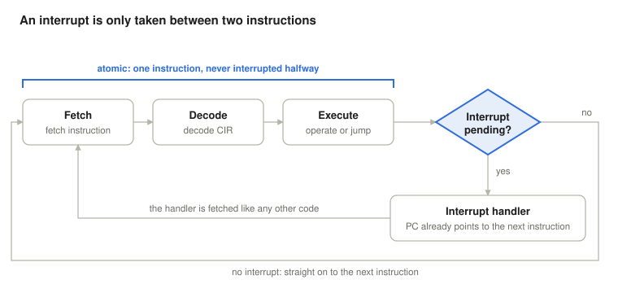
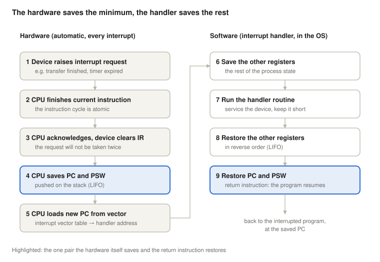
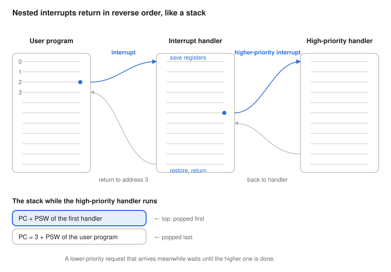

# Interrupts

*Operating Systems lecture: interrupt classes, interrupt processing, nested interrupts, I/O techniques and why interrupts make mutual exclusion necessary, with Linux (x86-64) examples*

Prerequisite: [The Fetch-Execute Cycle](../01-fetch-execute-cycle/).

## Learning objectives

An interrupt lets an external event stop the current program between two instructions, run a handler, and then resume the program as if nothing had happened. This lecture shows how the hardware and the operating system share that work, and what follows from it.

By the end, students will be able to:

- explain why an interrupt is only taken between two instructions;
- name the four classes of interrupts and give an example of each;
- list the steps of interrupt processing and say which are done by the hardware and which by the handler;
- explain how nested interrupts and priorities work, and why the saved state forms a stack;
- compare programmed I/O, interrupt-driven I/O and DMA;
- explain why interrupts cause race conditions, and how test-and-set and semaphores give mutual exclusion;
- find these mechanisms on a running Linux system (`/proc/interrupts`, `/proc/softirqs`, signals, threads).

## Why interrupts?

I/O devices are orders of magnitude slower than the CPU. Without interrupts, a program that starts a disk or network transfer has only one way to find out when it is finished: it keeps asking the device in a loop. All that time the CPU executes instructions but does no useful work.

With interrupts, the CPU starts the transfer and goes on running other code. When the device is done, it raises an interrupt request, and only then does the CPU spend time on it. Interrupts are also how the operating system takes back control from a program at all: through the timer interrupt (time sharing), through error conditions such as division by zero, and through hardware failures.

## Where interrupts fit in the instruction cycle



For external interrupts (timer, I/O), fetch, decode and execute form one **atomic** unit: once an instruction has started, the CPU finishes it before it looks at pending interrupts. The Check Interrupt step comes after execute, so:

- the interrupted program is never left with a half-executed instruction;
- the PC already points to the next instruction (it was advanced during fetch), so that is exactly the address to return to.

If no interrupt is pending, the next fetch follows immediately. If one is pending, the next fetch is the first instruction of the interrupt handler.

Interrupts caused by the instruction itself work slightly differently, because they arise *during* execute (see the next section). A **fault**, such as a page fault, abandons the instruction before it has any effect, and the saved PC points to the *faulting* instruction, so it can be executed again once the handler has fixed the problem (for example, loaded the missing page). A **trap**, such as a system call instruction, completes first, and the saved PC points to the next instruction. (A few long x86 instructions, such as `rep movs`, may also be interrupted between their repetitions and resumed later.)

## Classes of interrupts

| Class | Caused by | Examples | Timing |
| --- | --- | --- | --- |
| Timer | the hardware clock | time slice used up, periodic tick | asynchronous |
| I/O | an I/O controller | normal completion (buffer full or ready), error condition | asynchronous |
| Program | the instruction being executed | division by zero, arithmetic overflow, illegal memory access, system call | synchronous |
| Hardware failure | a fault in the machine | power failure, memory parity error | asynchronous |

This classification follows Stallings (2018). **Synchronous** means the interrupt is caused by the instruction currently executing, so it is tied to a specific instruction rather than arriving at a random moment. **Asynchronous** means it comes from outside, at an unpredictable point in the program. Many textbooks and CPU manuals call program interrupts **exceptions** and reserve the word *interrupt* for the asynchronous ones. The handling mechanism is largely the same (the same vector table and entry path), with two differences: exceptions cannot be switched off like external interrupts, and the saved PC depends on whether the exception is a fault or a trap.

For an operating system, the most important program interrupt is the deliberate one: the **system call**. A program executes a special trap instruction (`syscall` on x86-64) to ask the kernel for a service, and enters the kernel through the same mechanism.

## Interrupt processing step by step



The work is split between the hardware and the software (Stallings, 2018):

1. **The device raises the interrupt request (IR)** on its interrupt line.
2. **The CPU finishes the current instruction.** The instruction cycle is atomic.
3. **The CPU acknowledges the request, and the device clears IR.** Otherwise the same request would be taken again right after the handler returns. (On real hardware, many devices keep the line active until the handler has serviced them, and the interrupt controller also expects an "end of interrupt" message from the handler.)
4. **The CPU switches to kernel mode and saves the PC and the PSW** (program status word: the flags and the CPU mode, which in our model is the status register, SR) by pushing them onto the kernel's stack. On x86-64 the CPU also switches to a kernel stack first, and for some exceptions pushes an error code as well.
5. **The CPU loads the new PC from the interrupt vector table.** Each interrupt source has a number, and the table maps that number to the start address of its handler. Typically, entering the handler also disables further external interrupts (on x86, by clearing the IF flag), until the handler decides to re-enable them.
6. **The handler saves the other registers** it will use. Together with the PC and PSW, these form the **process state**.
7. **The handler does its work:** it copies data from the device buffer, wakes up a waiting process, or notes the error.
8. **The handler restores the registers** in reverse order.
9. **A special return instruction restores the PC and the PSW** (`iret` on x86). The next fetch continues the interrupted program.

The hardware saves only what it must (PC and PSW), because these change the moment the handler starts running. Everything else is the handler's job. This keeps the hardware simple and, in principle, lets a short handler save only the few registers it really uses. In practice, operating system entry code (Linux's included) usually saves all general-purpose registers, because the interrupt may end in a switch to a different process, and then the whole state of the interrupted one must be kept.

## Multiple interrupts

What happens if a second interrupt arrives while a handler is still running? There are two approaches.

**Sequential processing.** Interrupts are disabled (masked) while a handler runs. A new request waits until the handler returns, and is then taken. This is simple, but an urgent request may wait behind an unimportant one.

**Nested processing with priorities.** Each interrupt source has a priority. A handler can itself be interrupted by a request of higher priority, but not by one of equal or lower priority.



In the figure, the user program is interrupted after address 2. The handler starts by saving the registers. While it runs, a higher-priority interrupt arrives: the hardware saves the handler's own PC and PSW and starts the high-priority handler. When that finishes, it returns into the first handler, which in turn returns to address 3 of the user program.

Because the last state saved is always the first one restored, the saved states form a **stack** (last in, first out). This is why x86 pushes the PC and PSW onto a stack instead of a single fixed place: a fixed place would be overwritten by the second interrupt. Many RISC processors (ARM, RISC-V, MIPS) do save them into fixed special registers, but then the handler must copy them to the stack itself before it re-enables interrupts. Either way, nesting needs a stack.

**Non-maskable interrupts.** Some events must never wait, typically urgent hardware events. These arrive on a **non-maskable interrupt** (NMI) line, which the normal interrupt-enable flag cannot switch off. (On modern x86 machines, memory errors are usually reported through a separate machine-check exception instead; NMI is used mostly for watchdogs and performance monitoring.)

## Moving blocks of data: three I/O techniques

Transferring a block of data (for example, a disk sector) between a device and memory can be done in three ways:

| Technique | Who moves the data | How the CPU learns of progress | Remaining cost |
| --- | --- | --- | --- |
| Programmed I/O (polling) | the CPU, word by word | it keeps reading the device's status register | the CPU busy-waits and does no useful work |
| Interrupt-driven I/O (buffer + IR) | the CPU, when the device's buffer is ready | an interrupt for each buffer | no waiting, but the CPU still copies every word and handles many interrupts |
| Direct memory access (DMA) | the DMA controller | one interrupt when the whole block is done | the DMA controller and the CPU compete for the shared bus |

With DMA, the CPU only gives the DMA controller the device, the memory address, the amount of data and the direction. The DMA controller then performs the transfer on the system bus by itself and interrupts the CPU once, at the end. Since the CPU and the DMA controller share the same bus, the CPU may have to wait for the bus during the transfer. Because the DMA controller takes bus cycles away from the CPU, this is often called **cycle stealing**.

## Interrupts and concurrency

A timer interrupt can stop a process between any two of its instructions and switch to another process. This makes the operating system able to share the CPU, but it also creates a new class of bugs. If two processes or threads share a variable in memory, the result can depend on exactly where the switch happened. This is a **race condition**.


**Panel B: another process changes X in between.** P1 sets `X := 0` and later increments it, so it expects `X = 1`. But between its two steps, a timer interrupt switches to P2, which sets `X := 1`. When P1 continues, `X++` makes it 2. Neither process is wrong on its own: the error comes from the interleaving. The same happens even inside a single `X++`, because the CPU executes it as three steps (load X, add 1, store X). If both processes load the same old value, one of the two increments is lost. The Linux demo later in this lecture shows exactly this.

The part of a program that works on shared data is a **critical section**, and the rule that at most one process may be inside it at a time is **mutual exclusion**. The classic picture is a single-track railway section shared by trains running in both directions. A **semaphore** (a railway signal) lets only one train onto the shared track at a time. Dijkstra (1965) borrowed the name for the synchronisation tool.

**Panel A: the naive lock fails too.** A shared variable `S` could act as the signal: 1 means free, 0 means taken. Each process waits while `S == 0`, then takes the lock by changing `S` from 1 to 0 (P1 writes `S = 0`, P2 writes it semaphore-style as `S--`), and sets it back to 1 when it leaves. But "test" and "take" are two separate steps. If an interrupt arrives between them, both processes see `S = 1`, and both enter. `S = -1` at the end is a visible symptom: a free/taken flag should never get there. The lock has the same race as the data it was meant to protect.

**Solutions:**

- **Disable interrupts** during the critical section. Without interrupts there is no switch, so the section runs alone. This works only on a single CPU, and only in the kernel: a user program must not be able to switch off the timer and keep the CPU forever.
- **An atomic test-and-set instruction.** The CPU reads the old value and writes the new one in a single, indivisible instruction, so no interrupt and no other core can come between the test and the set. On x86 this is the `xchg` instruction (exchange register with memory), which is automatically locked. A lock built on it, where the waiting process keeps retrying in a loop, is a **spinlock**.
- **A semaphore**, provided by the operating system (Silberschatz et al., 2018; Stallings, 2018). For mutual exclusion, S starts at 1. `wait(S)` decrements S, and if the result is negative, the process is blocked (put to sleep) instead of busy-waiting. `signal(S)` increments S, and if processes are waiting, wakes one of them up. The OS makes both operations atomic, using the two techniques above inside the kernel. (In Dijkstra's original definition, called P and V, S never goes below zero: P simply waits until S > 0. Both forms are in use.)

## The same ideas on Linux (x86-64)

All outputs below come from a real system (kernel 6.18, 2 CPU cores); numbers will differ on yours.

### `/proc/interrupts`: who interrupts whom

```console
$ cat /proc/interrupts
           CPU0       CPU1
 26:          3          0  IO-APIC   4-edge      ttyS0
 37:          0       1413  PCI-MSIX-0000:00:02.0   1-edge   virtio1-req.0
 49:       1327          0  PCI-MSIX-0000:00:08.0   1-edge   virtio7-input.0
 50:          0       1305  PCI-MSIX-0000:00:08.0   2-edge   virtio7-output.0
...
NMI:          0          0   Non-maskable interrupts
LOC:       6432       6522   Local timer interrupts
RES:        317        420   Rescheduling interrupts
TLB:        503       1101   TLB shootdowns
```

- **Numbered rows** are device interrupts (IRQs): Linux's own IRQ number, a counter for each CPU core, the interrupt controller, the line number on that controller with its trigger type (`4-edge`), and the device name. Neither number is the CPU's vector number from the table below: the kernel maps each IRQ to a vector itself (The kernel development community, n.d.). Here `ttyS0` is the serial console, `virtio1-req.0` a disk, and `virtio7-input.0` / `output.0` the receive and transmit queues of a network card.
- **`PCI-MSIX`** means message-signalled interrupts: instead of a dedicated wire, the device signals an interrupt by writing to a special memory address. This lets one device have many separate interrupts (one per queue), each routed to a different core.
- **`NMI`** is the non-maskable interrupt line from the lecture.
- **`LOC`** is the per-core timer interrupt; **`RES`** and **`TLB`** are interrupts one core sends to another (to reschedule, or to flush address translations).

### Program interrupts become signals

On x86-64, the exceptions have fixed numbers in the interrupt vector table, for example:

| Vector | Exception | Class | What Linux does for a user program |
| --- | --- | --- | --- |
| 0 | `#DE` divide error | program | sends `SIGFPE` |
| 2 | `NMI` | hardware failure (and others) | handled in the kernel |
| 14 | `#PF` page fault | program | loads the page, or sends `SIGSEGV` (sometimes `SIGBUS`) if the access is illegal |
| 18 | `#MC` machine check | hardware failure | logs the error; may send `SIGBUS` to the affected process, or stop the system |
| 32–255 | external interrupts, inter-core interrupts | timer, I/O | runs the handler registered for that vector |

A division by zero, in practice:

```c
#include <stdio.h>

int main(void) {
    volatile int a = 1, b = 0;     /* volatile: stop the compiler from folding 1/0 */
    printf("about to divide...\n");
    fflush(stdout);
    printf("result = %d\n", a / b); /* the CPU raises a divide-error exception */
    return 0;
}
```

```console
$ gcc -o divzero divzero.c && ./divzero
about to divide...
Floating point exception
```

The CPU raised exception 0, the kernel's handler turned it into the signal `SIGFPE`, and the default action of that signal ended the process. (The name is historical: it is an integer division, not a floating-point one.) A program can install a signal handler of its own, but it must not simply return from it. Division by zero is a fault, so the saved PC points to the `idiv` instruction itself: returning would execute it again, and fault again, forever. The handler has to exit or jump elsewhere (with `siglongjmp`).

### Keep the handler short: top and bottom halves

Linux runs every hardware interrupt handler with all interrupts disabled on that core, and the same IRQ never runs on two cores at once. In the terms of this lecture, Linux uses **sequential** processing for device interrupts, not priority nesting. That only works if handlers are very short, so Linux splits interrupt work in two:

- the **top half** (the hard IRQ handler) does only the urgent part: acknowledges the device and grabs the data;
- the rest is **deferred work**, done a little later with interrupts enabled. *Softirqs* and *tasklets* still run in interrupt context and must not sleep. *Threaded IRQ handlers* and *work queues* run as kernel threads, so they may sleep (for example, wait for a lock or for memory).

`/proc/softirqs` counts the deferred work by type. Network receive (`NET_RX`) and disk completion (`BLOCK`) are the bottom halves of the device interrupts above:

```console
$ cat /proc/softirqs
                    CPU0       CPU1
          HI:          0          0
       TIMER:       1763       1198
      NET_TX:          4          4
      NET_RX:       1307       1047
       BLOCK:        468       3040
    IRQ_POLL:          0          0
     TASKLET:          9         18
       SCHED:       3829       3985
     HRTIMER:         40         22
         RCU:        672        572
```

### The three I/O techniques today

Modern disks and network cards use **DMA**: they read and write main memory directly, and interrupt the CPU only when a batch of work is complete. Under very heavy network traffic, even one interrupt per packet is too many, so the Linux network stack (NAPI) switches a busy network card from interrupts back to **polling**, and returns to interrupts when the traffic calms down. Polling is not always wasteful: it pays off when there is almost always something to collect.

### A race condition you can run

`race.c` starts two threads that each increment the shared variable `x` one million times. It has three modes: no lock, the naive "test then set" lock from Panel A, and a test-and-set lock.

```c
#include <pthread.h>
#include <stdatomic.h>
#include <stdio.h>
#include <string.h>

#ifndef N
#define N 1000000
#endif

/* Note: volatile is NOT synchronisation. Two threads changing x without a
   lock is a data race (undefined behaviour in C11); here it is on purpose. */
volatile long x = 0;                       /* shared variable */
atomic_flag lock = ATOMIC_FLAG_INIT;       /* test-and-set lock, initially free */
volatile int s = 1;                        /* naive "semaphore": 1 = free, 0 = taken */
int use_lock = 0, use_naive = 0;

void *worker(void *arg) {
    (void)arg;
    for (int i = 0; i < N; i++) {
        if (use_naive) {                              /* entry, NOT atomic:        */
            while (s == 0)                            /*   (1) test ...            */
                ;
            s = 0;                                    /*   (2) ... then set        */
        }
        if (use_lock)
            while (atomic_flag_test_and_set(&lock))   /* entry: atomic test-and-set */
                ;                                     /* busy-wait while it was set */
        x++;                                          /* critical section */
        if (use_lock)
            atomic_flag_clear(&lock);                 /* exit: release */
        if (use_naive)
            s = 1;                                    /* exit: release */
    }
    return NULL;
}

int main(int argc, char **argv) {
    use_lock  = (argc > 1 && strcmp(argv[1], "lock")  == 0);
    use_naive = (argc > 1 && strcmp(argv[1], "naive") == 0);
    pthread_t t1, t2;
    pthread_create(&t1, NULL, worker, NULL);
    pthread_create(&t2, NULL, worker, NULL);
    pthread_join(t1, NULL);
    pthread_join(t2, NULL);
    printf("x = %ld (expected %d)\n", x, 2 * N);
    return 0;
}
```

```console
$ gcc -O0 -pthread -o race race.c
$ ./race
x = 1349836 (expected 2000000)
$ ./race naive
x = 1624338 (expected 2000000)
$ ./race lock
x = 2000000 (expected 2000000)
```

Without a lock, and with the naive lock, a fifth to a third of the increments are lost, and the result changes from run to run. Only the atomic test-and-set gives the right answer. `objdump -d` shows what the compiler made of `atomic_flag_test_and_set` (compiled with `-O1` for a shorter listing): a single `xchg` instruction followed by a test and a jump back, exactly the spinlock described above.

```console
  2d:  86 05 00 00 00 00     xchg   %al,0x0(%rip)
  33:  84 c0                 test   %al,%al
  35:  75 f4                 jne    2b <worker+0x2b>
```

**On a single core,** the two threads never run at the same moment, so only an interrupt (usually the timer) can switch between them in the middle of `x++`. With 50 million increments per thread, pinned to one core with `taskset -c 0`, three runs gave:

```console
$ gcc -O0 -pthread -DN=50000000 -o race_big race.c
$ taskset -c 0 ./race_big
x = 100000000 (expected 100000000)
x = 98255930 (expected 100000000)
x = 96986057 (expected 100000000)
```

Once correct, twice wrong. This is what makes race conditions dangerous: the program may pass every test and still fail in production, when an interrupt happens to land on the wrong instruction.

**Inside the kernel** the same problem appears between a process and an interrupt handler that share data. Linux uses `spin_lock_irqsave()` there: it disables interrupts on the local core (so the handler cannot interrupt the lock holder) and takes a spinlock (so other cores cannot get in), combining the first two solutions. The "save" part matters too: it remembers whether interrupts were enabled before, and `spin_unlock_irqrestore()` restores exactly that state, so the code is also safe when called with interrupts already off.

## Lab exercises

1. **Interrupt counts.** Run `cat /proc/interrupts`. Which devices does your machine have? Run `watch -n1 -d cat /proc/interrupts`, then type, move the mouse or download a file. Which counters change?
2. **Timer rate.** Read the `LOC` row twice, 10 seconds apart. How many timer interrupts arrived per second on each core? Repeat while `yes > /dev/null` runs. Explain the difference.
3. **Exceptions.** Compile and run `divzero.c`. Check the exit status with `echo $?` (128 + signal number) and look up the signal with `kill -l <number>`. Then change the program to read through a null pointer. Which signal arrives now, and which exception caused it?
4. **The race.** Run `race.c` in all three modes, several times each. Then pin it to one core with `taskset -c 0`. Why are errors so much rarer on one core? Increase `N` until you see them.
5. **Your own semaphore.** Rewrite `race.c` with a POSIX semaphore (`sem_t`, `sem_init`, `sem_wait`, `sem_post`). Measure the run time of the spinlock and the semaphore versions with `time`. Which is faster here, and why might that change if the critical section were long?

## Review questions

1. Why does the CPU check for external interrupts only after the execute phase? What would go wrong if it could stop in the middle of an instruction? How is a page fault different?
2. Classify each event as timer, I/O, program or hardware-failure interrupt, and as synchronous or asynchronous: a disk finishes reading a sector; a program divides by zero; the time slice of a process runs out; a memory parity error is detected.
3. Which registers does the hardware save automatically when an interrupt is taken, and why only those?
4. Why must the device clear its interrupt request after the CPU acknowledges it?
5. Why are the saved PC and PSW pushed onto a stack, and not stored in a single fixed memory location?
6. The system uses nested, priority-based interrupt processing (higher number = higher priority). A priority-2 interrupt arrives while the handler of a priority-5 interrupt is running. What happens? And the other way round? What would happen under sequential processing?
7. Compare programmed I/O, interrupt-driven I/O and DMA: who copies the data, and what does each one still cost the CPU?
8. In Panel A, both processes enter the critical section. Give the exact order of steps that causes this, and explain why an atomic test-and-set prevents it.
9. Why is disabling interrupts not a usable mutual-exclusion method for user programs, or on a multicore machine?
10. On one core, `race` gave the correct result in one run out of three. Why does that not prove the program is correct?

<details>
<summary><strong>Answer key (for instructors)</strong></summary>

1. Each instruction must be atomic. If the CPU stopped halfway, the register and memory state would be half-updated, and the saved PC would not point to a well-defined instruction to resume from. A page fault is raised during the instruction itself: the instruction is abandoned without effect, the saved PC points to it, and it is executed again after the handler has loaded the page.
2. Disk sector: I/O, asynchronous. Division by zero: program, synchronous. Time slice: timer, asynchronous. Parity error: hardware failure, asynchronous.
3. The PC and the PSW (flags, CPU mode). They change as soon as the handler starts executing (the CPU also switches to kernel mode and usually disables further interrupts), so they must be saved before that. The other registers can be saved by the handler itself; in principle only those it uses, in practice an OS usually saves all of them, because the interrupt may lead to a process switch.
4. Otherwise the request would still be active when the handler returns, and the CPU would take the same interrupt again, endlessly.
5. Because interrupts can nest. A second interrupt would overwrite a fixed location before the first handler had used it. A stack keeps each saved state until its own handler returns, in last-in, first-out order. (CPUs that do save into fixed registers, as many RISC designs do, make the handler move them to the stack before re-enabling interrupts.)
6. The priority-2 request waits until the priority-5 handler finishes. In the other case, the priority-5 request interrupts the priority-2 handler immediately, and the priority-2 handler continues afterwards. Under sequential processing, any new request waits until the running handler finishes, whatever its priority.
7. Programmed I/O: the CPU copies and busy-waits. Interrupt-driven: the CPU copies, but only when data is ready, at the cost of one interrupt per buffer. DMA: the DMA controller copies; the CPU handles one interrupt per block, but may have to wait for the shared bus.
8. P1 tests S and sees 1 → interrupt, switch to P2 → P2 tests S and sees 1 → interrupt, switch to P1 → P1 takes the lock (S = 0) and enters → later P2 continues, takes the lock as well (S-- makes it −1) and enters. With an atomic test-and-set, the test and the take happen in one instruction, so no interrupt can fall between them. The second process always sees the value the first one wrote, and keeps waiting.
9. A user program could keep the CPU forever by never re-enabling interrupts, so the instruction is privileged. On a multicore machine, disabling interrupts on one core does not stop the other cores from accessing the same data.
10. Race conditions depend on timing. A correct result only shows that no bad interleaving happened in that run, not that one cannot happen. Correctness must be argued from the code: every access to the shared data must be inside a properly locked critical section.

</details>

## References

Dijkstra, E. W. (1965). *Cooperating sequential processes* (EWD 123). Technological University Eindhoven.

Silberschatz, A., Galvin, P. B., & Gagne, G. (2018). *Operating system concepts* (10th ed.). Wiley.

Stallings, W. (2018). *Operating systems: Internals and design principles* (9th ed.). Pearson.

The kernel development community. (n.d.). *Linux generic IRQ handling*. The Linux Kernel documentation. Retrieved October 6, 2026, from https://docs.kernel.org/core-api/genericirq.html

## Further reading

Kóczy, A., & Kondorosi, K. (Eds.). (2000). *Operációs rendszerek mérnöki megközelítésben* [Operating systems: An engineering approach]. Panem.

Tanenbaum, A. S., & Bos, H. (2015). *Modern operating systems* (4th ed.). Pearson.
