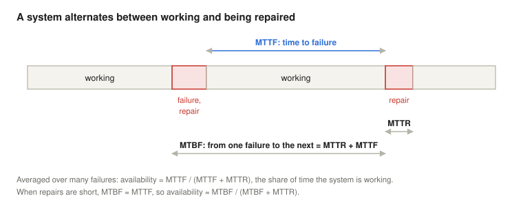
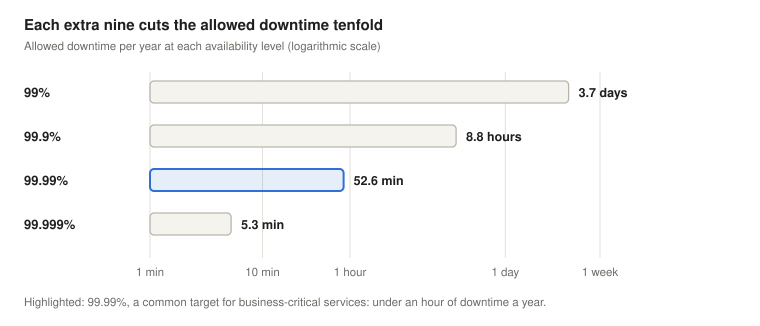
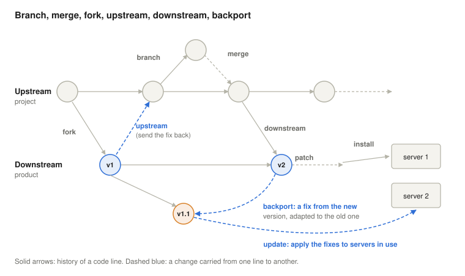
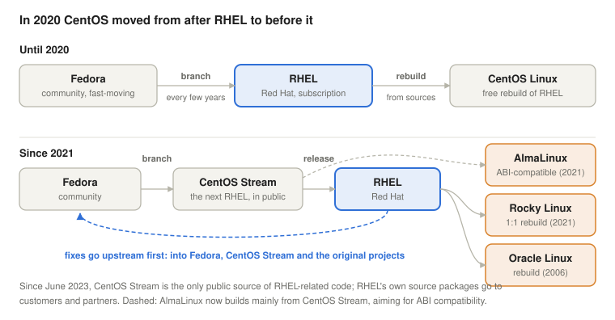
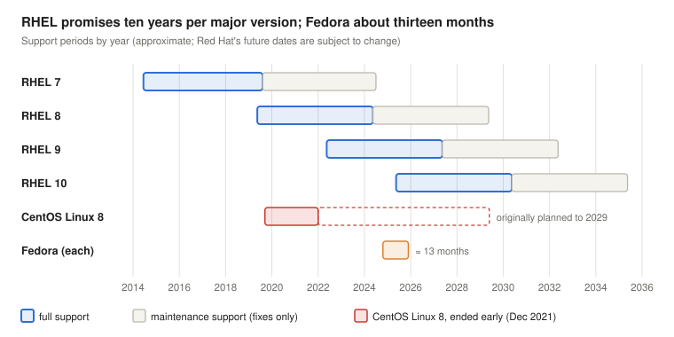
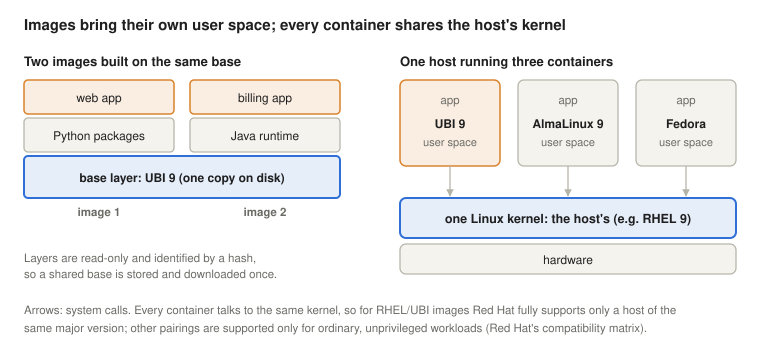

# Quality, Commercial Aspects and the Enterprise Linux Ecosystem

*Operating Systems lecture: what makes an operating system good, how its quality is measured and sold (MTBF, availability, SLA), how the Fedora, CentOS Stream, RHEL, AlmaLinux and Rocky Linux family is built and maintained, and how it reaches containers (UBI, registries, Podman, image mode)*

Previous: [Operating Systems Historic Evolution](../01-historic-evolution/). Next: [Cognitive Ergonomics and Operating Systems UI](../03-cognitive-ergonomics/).

> **How to read this lecture.** Wherever a new abbreviation or concept appears, a box marked **Explained simply** follows. Click it to open a plain-language explanation. You can skip these boxes if you already know the terms.

## Learning objectives

The previous lecture showed how operating systems came to be; the following ones turn to the people who use it and then look inside the machine, at the fetch-execute cycle and interrupts. Between the two, this lecture steps back and asks how good an operating system is, how that is measured and promised in a contract, and how a commercial Linux distribution is built from a community project and kept stable for ten years.

By the end, students will be able to:

- list the quality criteria of an operating system and relate them to the ISO/IEC 25010 quality model;
- define MTTF, MTTR, MTBF and availability, and calculate availability and allowed downtime;
- calculate the availability of components in series and in parallel, and explain why redundancy helps;
- explain the difference between SLI, SLO and SLA, and measure a simple SLI;
- use the vocabulary of code lines: branch, merge, fork, upstream, downstream, patch, backport, retrofit;
- describe how Fedora, CentOS Stream, RHEL, AlmaLinux, Rocky Linux and Oracle Linux relate to each other, and what changed in 2020 and 2023;
- explain why an enterprise distribution backports fixes instead of upgrading, and why a version number alone says little about security;
- explain what a container image is (layers, registries, OCI), why a container shares the host's kernel, and what follows for compatibility and support;
- compare the base images of the family (UBI and its variants, Fedora, CentOS Stream, AlmaLinux, Rocky Linux) and their terms, and name the roles of Podman, Buildah, Skopeo and image mode.

<details>
<summary><b>Explained simply:</b> distribution, community project, enterprise, Fedora, RHEL, CentOS, AlmaLinux, Rocky Linux</summary>

- **Distribution (distro):** a complete operating system built around the Linux kernel: the kernel plus thousands of programs, an installer and an update system, tested to work together. Ubuntu, Fedora and RHEL are distributions.
- **Community project:** software developed openly by volunteers and companies together, usually free of charge.
- **Enterprise:** for businesses and organisations that need stability, long support and someone to call when something breaks.
- **Fedora, RHEL, CentOS, AlmaLinux, Rocky Linux:** members of one family of Linux distributions. RHEL (Red Hat Enterprise Linux) is the commercial one; the others are explained in this lecture.

</details>

## What makes an operating system good?

An operating system is judged by more than speed. These are the main quality criteria:

| Criterion | Meaning | Example |
| --- | --- | --- |
| **Robust** | keeps working correctly when something unexpected happens: bad input, overload, a failing disk | a crashing program does not take the whole system down |
| **Consistent** | the same things work the same way everywhere, so users and programmers can predict behaviour | every program reads files through the same system calls; every setting is changed the same way |
| **Proportional** | the resources used are proportional to the work done: small tasks are cheap, and an idle system uses (almost) nothing | an idle laptop draws little power; a program that does not use networking does not pay for it |
| **Forgiving** | tolerates human mistakes and lets them be undone | a trash bin instead of immediate deletion, snapshots before an upgrade, "are you sure?" before formatting a disk |
| **Backward compatible** | programs and data made for older versions keep working on newer ones | a program compiled for RHEL 9.0 still runs on RHEL 9.6 |
| **Convenient** | easy to install, learn and use | sensible defaults, clear error messages |
| **Powerful** | can do a lot: rich features, scales to big machines and heavy loads | runs on a laptop and on a server with hundreds of cores |
| **Low overhead** | the OS itself uses little of the machine's time and memory | the $\eta_{OS}$ measurement in the [history lecture](../01-historic-evolution/) |
| **Low maintenance cost** | cheap to keep running: few manual interventions, simple updates, long support | automatic security updates, ten-year support periods |

Some of these pull against each other. "Powerful" pulls towards more features, "low overhead" and "low maintenance cost" towards fewer. "Backward compatible" makes it hard to remove old, badly designed interfaces. "Forgiving" (keeping old versions and undo information) costs storage. Designing an OS means choosing a balance for its users: a phone, a desktop and a bank's server need different ones.

"Proportional" deserves a remark: in data centres, **energy proportionality** has become a design goal of its own. Barroso and Hölzle (2007) showed that typical servers used about half of their peak power even when nearly idle, and called for hardware and software whose energy use rises and falls with the work they do. The power-saving features of modern operating systems (idle states, frequency scaling) serve exactly this goal, and servers' idle power has fallen a long way since 2007.

**The standard view.** The international standard for software quality, ISO/IEC 25010 (revised in 2023), describes product quality with nine characteristics: functional suitability, performance efficiency, compatibility, interaction capability (formerly "usability"), reliability, security, maintainability, flexibility (formerly "portability") and safety (International Organization for Standardization, 2023). The criteria above map onto it, though not one to one: *robust* corresponds to reliability (its sub-characteristics fault tolerance and recoverability; the 2023 revision also renamed "maturity" to "faultlessness"); *consistent* and *convenient* to interaction capability (operability, learnability); *forgiving* to its user error protection; *backward compatible* to flexibility, under replaceability (a newer version can replace an older one); *low overhead* and *proportional* to performance efficiency; *powerful* to functional suitability and, partly, flexibility (scalability). *Low maintenance cost* has no single home: the standard's maintainability is about how easily *developers* can change the product, while the effort of *operators* falls under operability and installability.

<details>
<summary><b>Explained simply:</b> criterion, robust, consistent, proportional, forgiving, backward compatible, overhead, maintenance, snapshot, ISO/IEC 25010, energy proportionality</summary>

- **Criterion (plural: criteria):** a standard by which something is judged.
- **Robust:** hard to break, like a car that still drives on a bumpy road.
- **Consistent:** always following the same rules, so that once you have learned one part, the rest works the way you expect.
- **Proportional:** the cost grows with the use. You pay for a short phone call less than for a long one, and nothing for no call.
- **Forgiving:** lets you undo mistakes, like the undo button in a word processor.
- **Backward compatible:** new versions still work with old things, like a new games console that still plays the old games.
- **Overhead:** the work the OS does for itself instead of for your programs.
- **Maintenance:** the ongoing work of keeping a system running: updates, fixes, monitoring.
- **Snapshot:** a saved copy of a system's state at one moment, so you can go back to it if an update goes wrong.
- **ISO/IEC 25010:** an international standard (an agreed rulebook) that lists what "quality" means for software. ISO and IEC are the international standards organisations.
- **Energy proportionality:** a computer should use little power when it has little to do, like a car whose engine stops at the traffic lights.
- **Idle states, frequency scaling:** ways for a processor to save power: switching off parts of itself while there is nothing to do, and running at a lower speed when full speed is not needed.
- **Scalability:** the ability to handle more work by adding more resources, for example more processors.
- **Operability, installability:** how easy a system is to operate (run and manage) and to install.

</details>

## Measuring quality: KPIs

A quality that cannot be measured cannot be promised. Organisations therefore track **key performance indicators** (KPIs): a few numbers that show whether a system does what it should. For an operating system or a service running on it, the most important KPIs measure **reliability** (how rarely it fails) and **availability** (what share of the time it works).

### MTTF, MTTR and MTBF



A repairable system alternates between working and being repaired. Averaged over many failures (Avižienis et al., 2004):

- **MTTF** (mean time to failure): the average time the system works before it fails. It measures **reliability**.
- **MTTR** (mean time to repair, or to recovery): the average time from a failure until the system works again. It includes noticing the failure, finding the cause and fixing it, so it depends both on how maintainable the system is and on the organisation's monitoring, staff and spare parts.
- **MTBF** (mean time between failures): the average time from one failure to the next, so MTBF = MTTF + MTTR.

The share of time the system works is its **availability** (Hennessy & Patterson, 2019):

$$A = \frac{MTTF}{MTTF + MTTR}$$

Because repairs are usually much shorter than the time between failures, MTBF and MTTF are often treated as the same, and the formula is commonly written $A = MTBF / (MTBF + MTTR)$. A server that works on average 2000 hours before it fails (MTTF) and takes 4 hours to repair is available 2000 / 2004 = 99.8% of the time.

**MTBF is not a lifetime.** Hardware data sheets often quote enormous MTBF values: a disk with an MTBF of 1.2 million hours does not last 137 years. The number is a failure *rate* measured on many young devices: with 1000 such disks, about 7 fail every year. Hardware failure rates follow the **bathtub curve**: high at the start (early defects), low and roughly constant during the useful life, and rising again as parts wear out; MTBF figures describe only the flat middle. Software does not wear out: it fails because of bugs triggered by particular inputs, loads or timing, and its failure rate changes with every update.

The formula shows the two ways to improve availability: fail less often (longer MTTF), or recover faster (shorter MTTR). The second is often cheaper. Automatic restarts, spare machines that take over and good monitoring shorten MTTR from hours to seconds.

### The nines

Availability is usually quoted in "nines":



| Availability | Name | Downtime per year | Downtime per month |
| --- | --- | --- | --- |
| 99% | two nines | 3.7 days | 7.3 hours |
| 99.9% | three nines | 8.8 hours | 43.8 minutes |
| 99.99% | four nines | 52.6 minutes | 4.4 minutes |
| 99.999% | five nines | 5.3 minutes | 26.3 seconds |

Each extra nine allows ten times less downtime, and usually costs much more than the previous one. Five nines leaves about five minutes a year, less than a single reboot of many servers: such systems cannot be built from one machine at all, only from several that cover for each other.

Two details matter in practice. **Planned** downtime (for updates) and **unplanned** downtime (failures) are often counted separately, and contracts may exclude the planned part. And availability is not always all-or-nothing: a system that answers slowly, or serves only some users, is **degraded**, and its SLI (below) must decide how to count that. For data, two further targets are used: the **RTO** (recovery time objective: how long restoring the service may take) and the **RPO** (recovery point objective: how much recent data may be lost, for example the last 15 minutes since the latest backup).

### Series and parallel

A service usually depends on several components, and the arithmetic of combining them explains why redundancy works:

- **In series** (all components are needed: a server *and* its disk *and* its network): the availabilities multiply. Two components of 99% each give 0.99 × 0.99 = 98.01%, worse than either one.
- **In parallel** (any one component is enough: two servers, either of which can serve the request): the system fails only if all fail. Two components of 99% each give 1 − 0.01 × 0.01 = 99.99%.

Two ordinary machines of two nines each give four nines together, provided that they fail independently and the switch-over works. That is why high-availability systems are built from redundant, independent parts, and why a shared single point of failure (one power supply, one network switch, one configuration error copied to all machines) is so dangerous. The switch-over mechanism itself, such as a **load balancer** that sends each request to a working server, is in series with the redundant part, so it must be at least as available as the target.

<details>
<summary><b>Explained simply:</b> KPI, reliability, availability, MTTF, MTTR, MTBF, downtime, redundancy, series, parallel, single point of failure, load balancer, bathtub curve, planned downtime, degraded, RTO, RPO, fault tolerance</summary>

- **KPI** (Key Performance Indicator): one of the few most important numbers that show how well something is going, like a student's grade average.
- **Reliability:** how rarely something breaks. **Availability:** how much of the time it is ready to use. A car that breaks down once a year but takes a month to repair is reliable but not very available.
- **MTTF, MTTR, MTBF:** mean (average) time to failure, to repair, and between failures.
- **Downtime:** the time a system is not working.
- **Redundancy:** having spare parts that can take over, like a plane with two engines.
- **Series / parallel:** in series, everything in the chain must work, like Christmas lights where one broken bulb darkens the string; in parallel, one working part is enough, like two roads to the same town.
- **Single point of failure:** one part whose failure stops everything, however many spares the rest has.
- **Load balancer:** a device or program that spreads incoming requests over several servers and stops sending work to a server that has failed.
- **Bathtub curve:** the typical failure rate of hardware over its life: many failures when new, few in the middle, more as it wears out, shaped like a bathtub seen from the side.
- **Planned / unplanned downtime:** a stop announced in advance for updates, versus an unexpected failure.
- **Degraded:** working, but worse than normal, for example slowly or only for some users.
- **RTO, RPO** (Recovery Time / Point Objective): how quickly a service must be back after a disaster, and how much of the most recent data may be lost.
- **Fault tolerance, recoverability:** the ability to keep working despite a fault, and to get back to normal after one.

</details>

## Promising quality: SLI, SLO, SLA

When a company runs an operating system or a service for customers, availability becomes a promise in a contract. Three terms are used, and they are easy to mix up (Beyer et al., 2016):

| Term | What it is | Example |
| --- | --- | --- |
| **SLI**, service level indicator | a measured number | the share of requests answered successfully in the last 30 days |
| **SLO**, service level objective | the internal target for the SLI | at least 99.9% of requests succeed, measured over 30 days |
| **SLA**, service level agreement | the contract with the customer, including what happens if the target is missed | 99.5% monthly availability; below that, the customer gets 10% of the monthly fee back |

The SLA is usually looser than the SLO: the provider aims higher than it promises, to keep a safety margin. A real SLA also defines exactly how availability is measured, what counts as downtime (planned maintenance windows are often excluded), how quickly the provider must react to a reported problem (the **response time** of support), and the **service credits** paid when it fails.

The difference between 100% and the SLO is the **error budget**. If the SLI counts requests, a 99.9% SLO allows 0.1% of the requests to fail; if it counts time, it allows about 43 minutes of failure in 30 days. As long as the budget is not used up, the team can take risks, such as deploying new versions; when it is used up, the priority shifts to stability.

<details>
<summary><b>Explained simply:</b> SLI, SLO, SLA, service credit, error budget, maintenance window</summary>

- **SLI** (Service Level Indicator): what you measure, like the punctuality rate of a train company.
- **SLO** (Service Level Objective): the goal you set yourself, like "95% of trains on time".
- **SLA** (Service Level Agreement): the promise in the contract, with consequences, like "if your train is more than an hour late, you get half the ticket price back".
- **Service credit:** the money or discount the provider owes when it breaks the SLA.
- **Error budget:** the amount of failure the goal still allows; while it lasts, the team may take risks.
- **Maintenance window:** an announced time when the service may be stopped for updates, usually not counted as downtime.
- **Deploy:** to install a new version of a program on the servers where it runs for real users.
- **Monitoring:** automatic, continuous checking of whether systems work, with alarms when they do not.

</details>

## The commercial side of an open-source operating system

Linux and nearly all the software in a Linux distribution are open source: anyone may read, change and share the code, and under licences such as the GNU GPL, anyone who distributes a changed version must share their changes too. How, then, can a company sell such an operating system? Red Hat's answer, which made it one of the largest open-source companies (IBM bought it for about 34 billion dollars in 2019), is that it does not sell the code. It sells a **subscription**, which gives:

- **support:** experts to call, with response times written into the contract (an SLA);
- **a long life cycle:** security fixes and bug fixes for ten years per major version, without having to move to a new version, and optionally longer support for selected minor versions (Extended Update Support, EUS);
- **stability:** a fixed set of interfaces within a major version, so that programs and drivers keep working after updates (for example, a stable kernel interface for drivers, the **kABI**);
- **certification:** hardware vendors certify their servers, and independent software vendors (ISVs: makers of databases, business software such as SAP, and others) certify their products on RHEL, so that the customer gets support from both sides;
- **legal and security assurance:** traceable security advisories for every fixed vulnerability, and help if questions about licences arise.

For the customer, the price of the subscription is only one part of the **total cost of ownership** (TCO): the hardware, the staff who run it, the downtime and the cost of moving to a new version every few years count too. A free distribution with a short life cycle may cost more in staff time than a paid one with ten years of updates, and the reverse is also possible. The choice is an engineering and a business decision at once.

<details>
<summary><b>Explained simply:</b> open source, GPL, subscription, life cycle, kABI, ISV, SAP, IBM, Oracle, SUSE, EUS, driver, certification, security advisory, vulnerability, TCO</summary>

- **Open source:** software whose licence allows anyone to read, change and share its source code. Code that is merely visible, without such a licence, is not open source.
- **GPL** (GNU General Public License): the licence of the Linux kernel and many other programs. Anyone you give the program to, changed or unchanged, is entitled to its source code, and may pass it on under the same licence.
- **Subscription:** paying regularly (for example yearly) for a service, like a streaming service, instead of buying something once.
- **Life cycle:** how long a version is supported, from its release until updates stop.
- **kABI** (kernel Application Binary Interface): the fixed "plugs" through which drivers connect to the kernel. Red Hat keeps a listed set of them unchanged within one major version, so a driver built once keeps working after kernel updates of that version.
- **ISV, SAP:** an ISV (Independent Software Vendor) is a company that sells software running on someone else's platform; SAP is a large German maker of business software.
- **IBM, Oracle, SUSE:** large IT companies. IBM owns Red Hat; Oracle sells databases and its own Linux; SUSE makes another enterprise Linux distribution.
- **EUS** (Extended Update Support): paid, longer support for a particular minor version, for customers who cannot upgrade often.
- **Driver:** the piece of software that operates one kind of hardware, like a network card.
- **Certification:** an official confirmation that a product has been tested and works with another, like a charger certified for your phone.
- **Security advisory, vulnerability:** a vulnerability is a security hole; an advisory is the vendor's official notice that describes it and the update that fixes it.
- **TCO** (Total Cost of Ownership): everything something costs over its whole life, not just its price, like a car's fuel, insurance and repairs added to its price.

</details>

## The vocabulary of code lines

An operating system is not one piece of code but thousands of projects, each developed along lines of history that split and join. The words for this come from software development and operations; the first ones from version control systems such as Git:



| Term | Meaning |
| --- | --- |
| **branch** | a separate line of development *within* a project, for a feature or a release |
| **merge** | joining the changes of a branch back into another line |
| **fork** | a copy of a whole project that continues separately, usually maintained by a **different community** or company, and that diverges from the original over time |
| **rebuild** | compiling a project's published sources again, unchanged except for names and logos, to get a compatible copy that follows the original exactly |
| **upstream** | the original project that others build on (for RHEL: Fedora, the Linux kernel, GNOME and thousands of others) |
| **downstream** | a project or product built from an upstream one |
| **patch** | a change to the code, usually a fix, in a form that can be applied to a code line |
| **dependency** | another package that a program needs in order to work; a patch may also depend on other patches being applied first |
| **backport** | taking a fix made in a newer version and adapting it to an older version that is still supported |
| **install** | putting a release onto a machine |
| **retrofit** | applying changes to systems that are already installed and in use, without reinstalling them |

**Patch dependencies in practice.** Suppose a security fix is written for the newest kernel. To backport it to a kernel that is five years older, the maintainers often find that the fix relies on helper functions or structure changes added in between. They must then first backport those earlier patches too (the fix's dependencies), each adapted to the old code, and test that none of them changes the stable interfaces. One upstream patch can become a series of a dozen downstream ones.

Two working rules follow from this vocabulary:

- **Upstream first.** A fix should be made in the upstream project first, and only then taken downstream. Otherwise every downstream product must carry its own private patch forever, and repeat the work with every new upstream version. Red Hat follows this policy: its engineers send their changes to Fedora, the Linux kernel and the other original projects.
- **Backport, don't upgrade.** An enterprise distribution promises stable interfaces for ten years, so it cannot simply move to each new upstream version. Instead, it keeps the versions it shipped and backports the fixes, and sometimes also new features. This is a large amount of careful work, and it is a central part of what the subscription pays for. Applying the fixes to servers already in use (retrofit) usually means installing updated packages and rebooting; with **live patching**, critical kernel fixes can even be applied to the running kernel without a reboot.

<details>
<summary><b>Explained simply:</b> version control, Git, branch, merge, fork, rebuild, GNOME, upstream, downstream, patch, dependency, backport, retrofit, live patching</summary>

- **Version control, Git:** a system that records every change ever made to a project's code, who made it and why, so that any earlier state can be restored. Git is the most widely used one.
- **Branch / merge:** like writing a new chapter of a shared document in a separate copy, then putting it back into the main document when it is ready.
- **Fork:** like a group of people taking a copy of the whole document and continuing it as their own version, with their own editors.
- **Rebuild:** like reprinting a book from the publisher's files with a different cover: the text stays exactly the same.
- **GNOME:** a widely used desktop environment (the graphical interface with windows and menus) for Linux.
- **Upstream / downstream:** like a river: changes flow from the source (upstream) towards those who build on it (downstream).
- **Patch:** a description of exactly which lines to change, like a correction slip for a printed book.
- **Dependency:** something a program needs to work, like batteries for a remote control.
- **Backport:** taking a repair designed for the new model and adapting it to fit the old model that customers still use.
- **Retrofit:** fitting an improvement to something already in use, like adding seat belts to old cars.
- **Live patching:** fixing the running kernel in memory, without a reboot (Red Hat's tool is called kpatch, Oracle's Ksplice): a retrofit that avoids planned downtime.

</details>

## The Enterprise Linux family

### Until 2020: Fedora, RHEL and CentOS



**Fedora** is the community distribution sponsored by Red Hat. It moves fast: a new release about every six months, each supported for about 13 months (Itechtics, n.d.). New technology appears in Fedora first.

**Red Hat Enterprise Linux (RHEL)** is Red Hat's commercial distribution. Every few years, Red Hat takes a Fedora release as the starting point, stabilises and tests it, and releases it as a new major version of RHEL, then supports it for ten years. In the terms above, each RHEL major version is a fork of Fedora: it continues separately, with a different community (Red Hat's engineers and customers) and its own changes, and since 2021 it is created as a branch, CentOS Stream, as described below.

**CentOS** (Community Enterprise Operating System), first released in 2004, rebuilt RHEL from the source packages that Red Hat published openly (more than the GPL itself requires, and including many packages under other licences), removed Red Hat's trademarks and logos, and gave the result away for free. It is often called a fork of RHEL, but it was a rebuild: it followed RHEL exactly, without diverging. CentOS was downstream of RHEL: binary compatible with it, but without support or certification. It became very popular for servers, web hosting and universities. In January 2014, the CentOS project joined Red Hat, which took over its trademarks and employed its core developers ("CentOS," n.d.).

### December 2020: CentOS Stream moves upstream

On 8 December 2020, Red Hat announced that it would end **CentOS Linux** and concentrate on **CentOS Stream**, which had been launched in 2019. CentOS Linux 8 lost its updates at the end of 2021, instead of in 2029, the end date that had been officially published; CentOS Linux 7 continued until 30 June 2024 (Red Hat, 2020).

CentOS Stream is a different kind of distribution. It is not a rebuild of a finished RHEL release, but the public development branch just *ahead* of RHEL: the place where the next RHEL minor version is prepared, and where outside companies can contribute their changes before they reach RHEL. In the figure, CentOS moved from after RHEL to before it, from downstream to upstream. Each major version branches from Fedora (CentOS Stream 10, for example, is based on Fedora 40) and leads to the next RHEL major version (OpenLogic, n.d.).

Red Hat's argument was that CentOS Stream gives outside developers and companies a real path for contributing to the next RHEL, which a downstream rebuild never could. For many users, however, this was a breach of trust: they had chosen CentOS Linux 8 for its published ten-year life cycle and lost it after two years. Red Hat offered free RHEL subscriptions for individual developers (up to 16 systems) and programmes for open-source projects and communities (Red Hat, 2020). New community rebuilds were announced within days and released within months.

### AlmaLinux and Rocky Linux

- **AlmaLinux**, started by the company CloudLinux and now run by the AlmaLinux OS Foundation, a non-profit whose board is elected by its members, released its first stable version in March 2021 (Linuxiac, n.d.).
- **Rocky Linux** was founded in December 2020 by Gregory Kurtzer, a co-founder of the original CentOS, and named after his late CentOS co-founder Rocky McGaugh. Its first stable release, 8.4, appeared on 21 June 2021. It is hosted by the Rocky Enterprise Software Foundation, a public-benefit corporation controlled by its founder (Rocky Enterprise Software Foundation, n.d.); its main commercial sponsor is Kurtzer's company CIQ.
- **Oracle Linux**, a RHEL rebuild by Oracle since 2006, is the oldest of the commercial rebuilds and is free to download and use.

### June 2023: the sources move

On 21 June 2023, Red Hat announced that CentOS Stream would be the only public repository of RHEL-related source code. RHEL's own source packages are no longer published on the public git.centos.org, but remain available to customers and partners (including holders of the no-cost developer subscription) through Red Hat's Customer Portal, under their subscription agreement (McGrath, 2023); the sources of the freely downloadable Universal Base Image (UBI) packages also stay public. The point of contention is that the subscription terms discourage redistributing those sources. For the rebuilds, which had copied exactly those packages, this changed the ground rules:

- **AlmaLinux** changed its goal on 13 July 2023 from a 1:1, "bug-for-bug" copy of RHEL to **ABI compatibility**: programs built for RHEL run on AlmaLinux, but AlmaLinux builds mainly from CentOS Stream and may differ in details, for example by shipping a fix that RHEL does not yet have (AlmaLinux OS Foundation, 2023).
- **Rocky Linux** kept the goal of a 1:1 rebuild, obtaining the sources through routes it considers permitted by the GPL: Red Hat's free UBI container images, and RHEL instances rented by the hour in public clouds (Rocky Linux, 2023). Red Hat regards such rebuilding as against the spirit of its terms.
- **CIQ**, **Oracle** and **SUSE** founded the **Open Enterprise Linux Association (OpenELA)** on 10 August 2023, to publish Enterprise Linux source code openly for anyone building compatible distributions (OpenELA, 2023).

The episode is a lesson in the commercial side of open source. The GPL (version 2, the kernel's licence) obliges a distributor to give the source code to those who receive the binaries, either together with the binaries, as Red Hat does, or through a written offer that anyone may take up; it does not oblige anyone to publish sources for the whole world, and many RHEL components are under other licences with no such obligation at all (Free Software Foundation, 1991). The debated question is a different one: the GPL forbids adding "further restrictions" on the recipients' rights. Critics argue that threatening to end a customer's subscription if they share the sources is such a restriction; Red Hat argues that the GPL does not oblige it to keep doing business with anyone, and that rebuilders used its engineers' work without contributing back. Both the legal and the ethical questions are still debated, and both are part of what an engineer should weigh when choosing a platform for ten years.

<details>
<summary><b>Explained simply:</b> sponsor, rebuild, trademark, binary compatible, CentOS Stream, UBI, git.centos.org, CIQ, compile, binary, ABI, source package, container image, non-profit</summary>

- **Sponsor:** a company that pays for and supports a project, without owning all of it.
- **Rebuild:** compiling the same source code again, to get a copy of a distribution that works the same.
- **Trademark:** a protected name or logo. Rebuilds must remove Red Hat's name and logo, even though the code is free.
- **Binary compatible:** programs compiled for one system run unchanged on the other.
- **CentOS Stream:** the public, continuously updated preview of the next RHEL *minor* version, where changes are tested before they enter RHEL.
- **UBI** (Universal Base Image): container images built from a subset of RHEL packages, which anyone may download and use free of charge.
- **git.centos.org:** the public website where the source code of CentOS (and, until 2023, of RHEL's packages) was published.
- **CIQ:** a company founded by Gregory Kurtzer that sells support for Rocky Linux.
- **Compile, binary:** compiling turns source code into a binary, the file of machine instructions the computer actually runs.
- **ABI** (Application Binary Interface): the exact way a compiled program talks to the OS and its libraries. If two systems share the ABI, the same compiled program runs on both.
- **Source package:** the source code of one program, together with the instructions and patches used to build it for a distribution.
- **Container image:** a ready-made, packaged copy of an application with the parts of the OS it needs, which can be downloaded and run.
- **Non-profit:** an organisation that does not aim to make money for owners; any income goes back into its mission.

</details>

### Life cycles



Each RHEL major version is supported for about ten years: five years of **full support** (fixes and some new features and hardware support) and five years of **maintenance support** (fixes only), with optional paid extensions after that (Red Hat, n.d.-d). RHEL 7 appeared in June 2014 and its maintenance ended in June 2024; RHEL 8 (May 2019) and RHEL 9 (May 2022) are supported until about 2029 and 2032; RHEL 10 reached general availability in May 2025 (Larabel, 2025). A Fedora release, by contrast, is supported for about 13 months. AlmaLinux and Rocky Linux follow RHEL's major-version life cycles.

The same pattern exists outside Red Hat. **Debian** is a community distribution with long, stable releases; **Ubuntu** is built downstream from it by the company Canonical, which offers five years of free updates for its long-term-support (LTS) versions and paid extensions beyond that. **SUSE** has the community distributions openSUSE Tumbleweed (rolling, like Fedora) and Leap, and the commercial SUSE Linux Enterprise Server. Upstream community, downstream enterprise product, long paid support: the economics are the same.

The figure shows the engineering trade-off of the whole lecture in one picture: Fedora is the place for the newest technology, at the price of upgrading every year; RHEL and its rebuilds offer ten quiet years, at the price of older versions and of all the backporting that keeps them secure.

<details>
<summary><b>Explained simply:</b> major version, minor version, full support, maintenance support, general availability, Debian, Ubuntu, LTS, rolling release</summary>

- **Major / minor version:** in "RHEL 9.4", 9 is the major version (a big step, with new technology) and 4 the minor version (a smaller update of the same major version).
- **Full support / maintenance support:** during full support, a version still gets improvements and support for new hardware; during maintenance support, only important fixes.
- **General availability (GA):** the day a product is officially released for everyone to buy and use.
- **Debian, Ubuntu, Canonical, LTS:** Debian is a large community Linux distribution; Ubuntu is a popular distribution built from it by the company Canonical. LTS (Long-Term Support) marks the versions that get updates for many years.
- **Rolling release:** a distribution that is updated continuously instead of in numbered versions.

</details>

## Container images: the family in containers

Today much enterprise software is not installed on a server directly but delivered as a **container image**, and the Enterprise Linux family is present there too, in a form that shows the same commercial ideas from a new angle.

### Containers in one picture

A virtual machine simulates a whole computer, so each one boots its own kernel. A **container** is lighter: it is an ordinary group of processes on the host, which the host's kernel isolates from the others (with *namespaces*, which give each container its own view of files, processes and network, and *cgroups*, which limit its CPU and memory). A container therefore brings its own **user space** (libraries, tools, configuration, `/etc/os-release`) but **no kernel of its own**: every system call goes to the host's kernel.



A **container image** is the packaged file system a container starts from. It is a stack of read-only **layers**, each identified by a cryptographic hash of its contents: a base layer with a distribution's user space, then a layer per build step that adds packages or the application. Images built on the same base share that layer, which is stored and downloaded only once. Images are kept in **registries**, servers from which they are pulled by name, such as `registry.access.redhat.com/ubi9/ubi-minimal`.

The isolation itself is older than the word "container" suggests: FreeBSD jails (2000), Solaris Zones (2004), and Linux cgroups and LXC (2008) came first. Docker, from 2013, made it popular by adding a simple image format and workflow: build an image once, push it to a registry, run it anywhere. So that images would not depend on one company's tools, Docker, CoreOS and others founded the **Open Container Initiative (OCI)** under the Linux Foundation on 22 June 2015. It maintains three specifications: the *runtime* specification (how to run a container), the *image* specification (the format of images and layers), and the *distribution* specification (how registries serve them) (Open Container Initiative, n.d.). An image built with one OCI tool can be pulled and run by any other (on the same CPU architecture), which is what makes an image ecosystem across vendors possible.

### Base images and registries

Every family member publishes base images:

| Image source | Where | Terms |
|---|---|---|
| **UBI** (Universal Base Image), from RHEL packages | `registry.access.redhat.com` (no login) | free to use and redistribute under the UBI licence; supported only on RHEL or OpenShift with a subscription |
| **RHEL** images for customers | `registry.redhat.io` (Red Hat login or service account) | subscription |
| **Certified partner** images (databases, middleware) | `registry.connect.redhat.com` (login), listed in the Red Hat Ecosystem Catalog | vendor's terms |
| **Fedora**, **CentOS Stream** | `quay.io` (e.g. `quay.io/centos/centos:stream9`), Fedora's own registry | free, community |
| **AlmaLinux**, **Rocky Linux** | Docker Hub and Quay.io (e.g. `quay.io/almalinuxorg/almalinux:9`, `docker.io/rockylinux/rockylinux:9`) | free, community |

Red Hat introduced **UBI** in 2019 to solve a commercial problem: software vendors wanted to build their products on RHEL and ship the resulting images to anyone, including people without a RHEL subscription, which RHEL's terms did not allow. UBI is a subset of RHEL's packages, built and updated with RHEL's security fixes, that may be freely redistributed. It comes in four variants (Red Hat, n.d.-f):

- **ubi**: the standard image, with the full `dnf`/`yum` package manager;
- **ubi-minimal**: smaller, with the reduced `microdnf` package manager;
- **ubi-micro**: the smallest, with no package manager at all; packages are added at build time from outside the image;
- **ubi-init**: runs `systemd`, for images that run several services.

Two limits keep the commercial model intact. Without a subscription, only the UBI package repositories are available inside the image, a selected subset of RHEL's packages; an image that adds RHEL packages from outside UBI loses the right to be redistributed freely. And a UBI image gets updates everywhere, but Red Hat *supports* it, answering support cases about it, only when it runs on RHEL or OpenShift under a subscription (Red Hat, n.d.-f). Registries mirror the same split: `registry.access.redhat.com` serves freely available images without authentication, while `registry.redhat.io` requires a Red Hat account or a registry service account, so that access is tied to an account and its entitlements (Red Hat, n.d.-b).

### Kernel and image must fit together

Because a container shares the host's kernel, "it runs in a container, so it runs anywhere" is only partly true. A RHEL 7 image on a RHEL 9 host runs RHEL 7 libraries against a kernel that is two major versions newer, which RHEL 7's developers never tested. Red Hat therefore publishes a **Container Compatibility Matrix** (Red Hat, n.d.-c). A RHEL 9 host, for example, runs RHEL or UBI 7, 8, 9 and 10 images, but only the matching major version (UBI 9 on RHEL 9) is "fully compatible"; the other combinations are supported only as "workload specific": the container must be unprivileged and must not use interfaces that depend on the kernel version, such as special `ioctl` calls, files in `/proc` and `/sys`, firewall rules (iptables, nftables) or eBPF, apart from the most common uses. Everything else, including privileged containers that act on the host itself, needs matching versions. A *newer* image on an *older* host (UBI 10 on RHEL 9) gets the strictest terms, because the image may expect kernel features that the old kernel lacks: a problem must also be reproducible on a matching host before Red Hat will treat it. This is the kABI and certification logic of the commercial side, applied to containers: a promise of support covers only the combinations that were tested.

### Updating images: rebuild and redeploy

A running container is not patched in place. When a fix appears, for example a fixed `glibc` in UBI 9, the image is **rebuilt** on the updated base layer and the containers are **replaced** with new ones from it. Because the base layer is shared, one updated base is downloaded once and serves every image built on it. The fix itself still comes from the same backporting process as on a server: the `glibc` of UBI 9 stays at version 2.34 for the whole of RHEL 9 and receives backported fixes (a few components are occasionally rebased to a newer upstream version within a major release, as OpenSSL was from 3.0 to 3.2 in RHEL 9.5, but that is the exception), so the version-number lesson of the Dirty Pipe example applies inside containers too, and image scanners need the vendor's security data just as server scanners do.

### The tools: Podman, Buildah, Skopeo

Since RHEL 8 (2019), Red Hat ships its own OCI tools instead of Docker, in the `container-tools` package set (Red Hat, n.d.-a):

- **Podman** runs and manages containers, images and *pods* (groups of containers); its commands mirror Docker's (`podman run` for `docker run`);
- **Buildah** builds images, from a `Containerfile` (Docker's `Dockerfile` format) or step by step from a script;
- **Skopeo** works directly against registries, with no local image store: it copies, inspects, signs and deletes images; `skopeo inspect` reads an image's metadata without pulling it.

Two design differences from Docker matter for quality. Podman needs **no daemon**: there is no central background service that runs as root and through which every container is started, so there is no single point of failure for all containers, and containers can be run as ordinary `systemd` services (with Podman's Quadlet files). And Podman can run **rootless** (generally available since RHEL 8.1): when an ordinary user runs it, containers start without administrator rights, so an attacker who breaks out of a container gains only that user's rights. Docker later added a rootless mode too, but its usual setup is still a daemon running as root. Both are robustness and security criteria from the first section of this lecture.

### Image mode: the whole operating system as an image

Red Hat applied the same idea to the operating system itself. In **image mode for RHEL**, a technology preview from RHEL 9.4 and generally available since 20 May 2025 for RHEL 9.6 and RHEL 10, a server's complete operating system, kernel included, is built as a bootable OCI image (with the `bootc` tool) and installed or updated from a registry (Breard, 2025). An update downloads the new image and switches to it at the next boot, atomically: the system runs either the old version or the new one, never a half-updated mix, and if the new one fails, it can **roll back** to the previous image (Red Hat, n.d.-g). The traditional, package-by-package way of installing and updating RHEL remains available as *package mode*. In the terms of this lecture, image mode shortens MTTR after a bad update (roll back instead of repair) and makes every server of a fleet identical, which makes behaviour more consistent.

<details>
<summary><b>Explained simply:</b> container, virtual machine, kernel, user space, system call, namespace, cgroup, image, layer, hash, registry, OCI, Docker, jails, LXC, UBI, OpenShift, Quay, privileged, ioctl, /proc, /sys, iptables, eBPF, glibc, OpenSSL, Podman, Buildah, Skopeo, technology preview, Quadlet, daemon, root, rootless, pod, Containerfile, systemd, bootc, atomic update, roll back</summary>

- **Container:** a program, together with the files it needs, running in a closed-off space on a computer: it sees its own files and processes, but shares the computer's operating-system core with all other containers.
- **Virtual machine:** a whole computer simulated by software, with its own operating system inside. Heavier than a container, because each one starts its own core.
- **Kernel:** the core of the operating system, the part that controls the hardware. **User space** is everything else: libraries, tools and programs.
- **System call:** a request from a program to the kernel, for example "open this file" or "tell me your version". Programs cannot touch the hardware themselves; they ask the kernel.
- **Namespace, cgroup:** two Linux features. Namespaces give a group of processes its own private view (its own list of files, processes, network); cgroups limit how much CPU time and memory the group may use.
- **Image:** a packaged, ready-to-start set of files from which containers are started, like a template.
- **Layer:** one slice of an image, for example "the base system" or "the added Python packages". Images are stacked from layers.
- **Hash:** a short "fingerprint" computed from data; different data gives a different fingerprint, so identical layers can be recognised.
- **Registry:** a server that stores images, like an app store for containers. **Quay.io** and **Docker Hub** are well-known public registries.
- **OCI** (Open Container Initiative): an industry group that writes the common rules for container images and for running them, so that tools of different companies work together.
- **Docker:** the company and tool that made containers popular.
- **UBI** (Universal Base Image): Red Hat's freely shareable container base images, built from RHEL packages.
- **OpenShift:** Red Hat's commercial platform for running many containers on many servers.
- **Privileged container:** a container given extra rights over the host, for example to manage its hardware.
- **ioctl, /proc, /sys:** special ways for programs to talk to the kernel directly; they change between kernel versions more than ordinary system calls do.
- **Podman, Buildah, Skopeo:** Red Hat's three container tools: Podman runs containers, Buildah builds images, Skopeo moves and examines images in registries.
- **Jails, Zones, LXC:** earlier ways of isolating programs on FreeBSD, Solaris and Linux, before Docker made containers popular.
- **iptables, nftables, eBPF:** kernel features for firewall rules and for running small checked programs inside the kernel.
- **glibc, OpenSSL:** glibc is the basic C library almost every Linux program uses; OpenSSL provides encryption, for example for HTTPS.
- **Technology preview:** an early version a vendor lets customers try, without full support.
- **Quadlet:** a small configuration file that tells systemd to run a Podman container as a service.
- **Daemon:** a program that runs in the background all the time, waiting for requests.
- **Root, rootless:** root is the administrator account with all rights; rootless means running without those rights.
- **Pod:** a small group of containers that work together and share a network address.
- **Containerfile** (Dockerfile): a text file of build steps from which an image is made.
- **systemd:** the program that starts and supervises the services of a Linux system.
- **bootc:** a tool that installs and updates a whole operating system from a container image.
- **Atomic update:** an update that happens completely or not at all, never halfway.
- **Roll back:** to return to the previous working version.

</details>

## The same ideas on Linux (x86-64)

The outputs below come from a real system: an Ubuntu 24.04 environment in a cloud data centre, running on its host's Linux 6.18 kernel (so `uname -r` there shows the host's kernel, not Ubuntu's own). The RHEL family could not be downloaded there, so the lab exercises ask you to run the RHEL-specific commands yourself, on Fedora, AlmaLinux or Rocky Linux.

<details>
<summary><b>Explained simply:</b> console, Python, Ubuntu, virtual machine, web server, HTTP, status code</summary>

- **Console** (terminal): a window where you type commands as text. Lines starting with `$` are what you type; the other lines are the computer's answer.
- **Python:** a popular, easy-to-read programming language; `python3 file.py` runs a program written in it.
- **Ubuntu:** another widely used Linux distribution, downstream of Debian.
- **Virtual machine:** a computer simulated by software on a bigger computer.
- **Web server, HTTP, status code:** a web server sends web pages when asked; HTTP is the language browsers and servers use; every answer carries a status code, such as 200 (OK), 404 (page not found) or 500 (server error).

</details>

### Availability arithmetic

`availability.py` does the calculations of this lecture:

```python
#!/usr/bin/env python3
"""availability.py - the arithmetic of availability."""
import sys

YEAR_MIN = 365.25 * 24 * 60          # minutes in an average year
MONTH_MIN = YEAR_MIN / 12


def fmt(minutes):
    if minutes >= 24 * 60:
        return f"{minutes / (24 * 60):.1f} days"
    if minutes >= 60:
        return f"{minutes / 60:.1f} hours"
    if minutes >= 1:
        return f"{minutes:.1f} minutes"
    return f"{minutes * 60:.1f} seconds"


def nines():
    print(f"{'availability':>13}  {'downtime per year':>18}  {'per month':>14}")
    for a in (0.99, 0.999, 0.9999, 0.99999):
        down = 1 - a
        print(f"{a * 100:12.3f}%  {fmt(down * YEAR_MIN):>18}  {fmt(down * MONTH_MIN):>14}")


def mttf(mttf_h, mttr_h):
    a = mttf_h / (mttf_h + mttr_h)
    print(f"MTTF {mttf_h} h, MTTR {mttr_h} h  ->  availability {a * 100:.3f}%, "
          f"downtime {fmt((1 - a) * YEAR_MIN)} per year")


def combine(a1, a2):
    series = a1 * a2                      # both must work
    parallel = 1 - (1 - a1) * (1 - a2)    # at least one must work
    print(f"A1 = {a1 * 100:.2f}%, A2 = {a2 * 100:.2f}%")
    print(f"in series   (both needed):   {series * 100:.4f}%  downtime {fmt((1 - series) * YEAR_MIN)} per year")
    print(f"in parallel (either enough): {parallel * 100:.4f}%  downtime {fmt((1 - parallel) * YEAR_MIN)} per year")


if __name__ == "__main__":
    cmd = sys.argv[1] if len(sys.argv) > 1 else "nines"
    if cmd == "nines":
        nines()
    elif cmd == "mttf":
        mttf(float(sys.argv[2]), float(sys.argv[3]))
    elif cmd == "combine":
        combine(float(sys.argv[2]), float(sys.argv[3]))
```

```console
$ python3 availability.py nines
 availability   downtime per year       per month
      99.000%            3.7 days       7.3 hours
      99.900%           8.8 hours    43.8 minutes
      99.990%        52.6 minutes     4.4 minutes
      99.999%         5.3 minutes    26.3 seconds
$ python3 availability.py mttf 2000 4
MTTF 2000.0 h, MTTR 4.0 h  ->  availability 99.800%, downtime 17.5 hours per year
$ python3 availability.py combine 0.99 0.99
A1 = 99.00%, A2 = 99.00%
in series   (both needed):   98.0100%  downtime 7.3 days per year
in parallel (either enough): 99.9900%  downtime 52.6 minutes per year
```

### Measuring an SLI

A monitoring system measures availability from the outside, by asking the service regularly whether it works. `probe.py` does exactly that: it requests a web page every half second and counts the answers.

```python
#!/usr/bin/env python3
"""probe.py - measure an availability SLI the way a monitoring system does."""
import sys
import time
import urllib.request

url = sys.argv[1] if len(sys.argv) > 1 else "http://127.0.0.1:8000/"
duration = float(sys.argv[2]) if len(sys.argv) > 2 else 60
ok = total = 0
end = time.time() + duration
while time.time() < end:
    total += 1
    try:
        with urllib.request.urlopen(url, timeout=1) as r:
            ok += (r.status == 200)
    except Exception:
        pass                                   # no answer = a failed probe
    time.sleep(0.5)
print(f"{ok} of {total} probes succeeded: availability SLI = {100 * ok / total:.2f}%")
```

A small web server (`python3 -m http.server 8000`) was started, `probe.py` ran for 60 seconds, and after 20 seconds the server was stopped and restarted 6 seconds later:

```console
$ python3 probe.py http://127.0.0.1:8000/ 60
108 of 120 probes succeeded: availability SLI = 90.00%
```

The 6-second outage cost 12 of the 120 probes, exactly 6 / 60 = 10% of the time. Real monitoring works the same way, only over months and from several places at once. Note what the probe cannot see: a server that answers with status 200, but with wrong content, counts as available here. Note also what it treats as a failure: any error, including a 404 (page not found), which is usually the client's mistake rather than the service's. Choosing what to measure is the hardest part of an SLI.

### Who is upstream of whom?

Every Linux distribution describes itself in `/etc/os-release`. The `ID_LIKE` field names the distributions it is derived from or compatible with, its upstream family:

```console
$ cat /etc/os-release
PRETTY_NAME="Ubuntu 24.04.5 LTS"
NAME="Ubuntu"
VERSION_ID="24.04"
VERSION="24.04.5 LTS (Noble Numbat)"
VERSION_CODENAME=noble
ID=ubuntu
ID_LIKE=debian
...
```

Ubuntu is downstream of Debian, just as RHEL is downstream of Fedora. On the rebuilds, `ID_LIKE` names their relatives (lab exercise 4); Fedora, at the top of its family, has no `ID_LIKE` line at all.

### An image brings its own distribution, not its own kernel

A minimal container image shows both halves of the container picture. `container-demo/whoami-os.c` prints two things: the kernel, as the running kernel reports it through the `uname` system call, and the distribution, as written in the file `/etc/os-release` that the program can see:

```c
struct utsname u;
uname(&u);                                   /* system call: ask the kernel */
printf("kernel (from the running kernel): %s %s\n", u.sysname, u.release);
FILE *f = fopen("/etc/os-release", "r");     /* a file in this filesystem */
/* ... print the PRETTY_NAME= line ... */
```

The image contains no distribution at all, only two files: the program (statically linked, so it needs no libraries) and a hand-written `os-release`:

```dockerfile
# A minimal image: no base distribution at all, just two files.
FROM scratch
COPY whoami-os /whoami-os
COPY os-release /etc/os-release
CMD ["/whoami-os"]
```

Built and run with Docker (Podman accepts the same commands), first on the host and then in the container:

```console
$ gcc -static -O2 -o whoami-os whoami-os.c
$ ./whoami-os
kernel (from the running kernel): Linux 6.18.44-fc-v70
distribution (from /etc/os-release): "Ubuntu 24.04.5 LTS"
$ docker build -f Containerfile -t demo-os:1.0 .
$ docker run --rm demo-os:1.0
kernel (from the running kernel): Linux 6.18.44-fc-v70
distribution (from /etc/os-release): "Demo Linux 1.0 (a two-file distribution)"
```

The kernel line is identical: the container has no kernel of its own. The distribution line changed completely: a "distribution", seen from inside, is just the files in the image. This is why a UBI 9 container on an Ubuntu host says "Red Hat Enterprise Linux 9" in `/etc/os-release` while `uname -r` shows Ubuntu's kernel, and why the compatibility matrix is needed.

The image is made of layers, one for each build step that changes the file system (such as `COPY` or `RUN`); other steps only add a history entry:

```console
$ docker history demo-os:1.0
IMAGE          CREATED         CREATED BY                                   SIZE      COMMENT
e742ae003cf5   2 minutes ago   CMD ["/whoami-os"]                           0B        buildkit.dockerfile.v0
<missing>      2 minutes ago   COPY os-release /etc/os-release # buildkit   12.3kB    buildkit.dockerfile.v0
<missing>      2 minutes ago   COPY whoami-os /whoami-os # buildkit         791kB     buildkit.dockerfile.v0
```

(`CMD` only sets metadata, so it adds no layer; `<missing>` means the intermediate steps were not kept as separate images. The `os-release` layer is 12.3 kB although the file has 81 bytes: a layer is an archive, with headers and directory entries of its own.) Changing only `os-release` to version 1.1 and rebuilding as `demo-os:1.1` gives a new image whose first layer is the very same one, recognised by its hash, while only the changed layer is new. (These are *diff IDs*, hashes of the uncompressed layer archive, so they cover file contents and also file metadata such as timestamps and permissions.)

```console
$ docker image inspect -f '{{range .RootFS.Layers}}{{println .}}{{end}}' demo-os:1.0 demo-os:1.1
sha256:76e517d774124520b35cabd7ff82486de9543814cf01d46f751087fe68d76be7
sha256:6f46b4c467e179d7da25d2aa14430186d6eb3a88ca1e2d3387af28757598172b

sha256:76e517d774124520b35cabd7ff82486de9543814cf01d46f751087fe68d76be7
sha256:02fe7db5aff3efb9a29fe5d9a97029bd5bef8389166d2baa9bd31677097e83f6
$ docker run --rm demo-os:1.1
kernel (from the running kernel): Linux 6.18.44-fc-v70
distribution (from /etc/os-release): "Demo Linux 1.1 (a two-file distribution)"
```

The same mechanism, at a larger scale, is what lets hundreds of images built on UBI 9 share one copy of the base layer, and what makes "rebuild on the updated base" cheap.

<details>
<summary><b>Explained simply:</b> statically linked, FROM scratch, docker build, docker run, docker history, metadata</summary>

- **Statically linked:** the program file contains all the library code it needs, so it runs even where no libraries are installed.
- **`FROM scratch`:** start the image from nothing, an empty file system.
- **`docker build` / `docker run`:** make an image from a Containerfile / start a container from an image (`--rm` deletes the container when it ends).
- **`docker history`:** lists the layers of an image and the build step that created each.
- **Metadata:** data about the image (such as which program to start), not files inside it.

</details>

### Why the version number lies: backporting in practice

An enterprise kernel keeps its version number for the whole life of a major release, while thousands of fixes and features are backported into it. RHEL 8 ships a kernel numbered 4.18; RHEL 10.1 ships 6.12.0-124.8.1, where 6.12.0 is the upstream base and the rest is Red Hat's own build number (Red Hat, 2025).

A real example shows why this matters. In March 2022, Max Kellermann disclosed **Dirty Pipe** (CVE-2022-0847), a flaw that let an ordinary user overwrite read-only files and take over the system. Its history has two steps. The underlying bug, a field left uninitialised, entered the kernel in Linux 4.9 in 2016, where it had no practical effect; a change in Linux 5.8 (2020) made it exploitable. It was fixed upstream in 5.16.11, 5.15.25 and 5.10.102 (Kellermann, 2022).

Most reports said "affects Linux 5.8 and later", so judged by its version number, RHEL 8's 4.18 kernel looked safe. Red Hat's analysis was more careful: the known exploits needed the 5.8 change, which was not in the RHEL 8 kernel, but the underlying flaw was still present, inherited from the upstream code that the 4.18 kernel was based on. Red Hat therefore classed RHEL 8 as affected and released fixed kernels, for example in advisory RHSA-2022:0825 (Red Hat, n.d.-e).

The lesson goes both ways: a security scanner that judges by version numbers alone will wrongly report a backported fix as missing in an "old" kernel, and, as here, may wrongly declare an "old" kernel safe. In an enterprise distribution, only the vendor's advisories tell what is affected and what is fixed.

<details>
<summary><b>Explained simply:</b> /etc/os-release, ID_LIKE, CVE, exploit, security scanner, build number</summary>

- **`/etc/os-release`:** a small text file in which every Linux distribution states its name and version. `ID_LIKE` lists its relatives.
- **CVE** (Common Vulnerabilities and Exposures): a worldwide catalogue of security holes, each with a number such as CVE-2022-0847, so everyone can talk about the same problem.
- **Exploit:** a method or program that uses a security hole to do something forbidden.
- **Security scanner:** a tool that checks a system for known security holes, often by comparing version numbers with a list.
- **Build number:** the part of a version that counts the vendor's own updates of the same base version.

</details>

## Lab exercises

1. **Your own nines.** With `availability.py`, find the availability of a server that works on average 1000 hours before it fails (MTTF) and takes 8 hours to repair. Then halve the MTTR. Which change of the MTTF would give the same improvement?
2. **Redundancy.** Three components of 99.5% each: what is the availability if all three are needed? If any one is enough? Extend `combine` to take any number of components.
3. **An SLI.** Repeat the `probe.py` experiment with a 2-second outage. Then probe a page that does not exist (for example `http://127.0.0.1:8000/missing.html`): what does the probe report, and should a 404 count against the service? Finally, change `probe.py` so that it counts timeouts, refused connections and HTTP errors separately, and so that a 200 answer only counts as a success if the page contains the expected text.
4. **The family tree.** On CentOS Stream, AlmaLinux or Rocky Linux, and on Fedora (virtual machines or containers), run `cat /etc/os-release` and `cat /etc/redhat-release`. What does `ID_LIKE` say on each, why does Fedora have none, and how does it match the family figure?
5. **Backports.** On AlmaLinux or Rocky Linux (Fedora does not backport, and CentOS Stream publishes no security advisories), run `uname -r` and `rpm -q --changelog kernel-core-$(uname -r) | grep -c CVE`. How many CVE fixes does the changelog of your running kernel mention, although its base version never changed? Then list the security advisories with `dnf updateinfo list --security --all` (without `--all`, only the ones not yet installed are shown).
6. **Life cycles.** For your laptop's operating system and for one server distribution, find out until when the installed version gets security updates. What would it cost your organisation (in hours of work) to move to the next major version?
7. **Kernel versus distribution in containers.** On a Fedora, AlmaLinux or Rocky Linux machine with Podman, run `uname -r` and `cat /etc/os-release` on the host, then `podman run --rm registry.access.redhat.com/ubi9/ubi-minimal cat /etc/os-release` and `podman run --rm registry.access.redhat.com/ubi9/ubi-minimal uname -r`. Repeat with `quay.io/centos/centos:stream9`, `quay.io/almalinuxorg/almalinux:9` and `docker.io/rockylinux/rockylinux:9` (full names, so that Podman does not have to ask which registry to use). Which lines change, which stay the same, and why? Then build the two-file image in `container-demo/`: compile with `gcc -static -O2 -o whoami-os whoami-os.c` (this needs the `glibc-static` package; on AlmaLinux and Rocky Linux it is in the CRB repository: `sudo dnf --enablerepo=crb install glibc-static`), then `podman build -f Containerfile -t demo-os:1.0 .` and compare its output with the UBI container's.
8. **Images without downloading.** Run `skopeo inspect docker://registry.access.redhat.com/ubi9/ubi-minimal` and `skopeo inspect docker://registry.access.redhat.com/ubi9/ubi`. Compare the layers and their sizes (`LayersData`) and the labels (look for the version and release). Then `podman pull` both and compare their sizes with `podman images`. Then try `dnf install -y bzip2` and `microdnf install -y bzip2` in containers of `ubi`, `ubi-minimal` and `ubi-micro` (for example `podman run --rm registry.access.redhat.com/ubi9/ubi-minimal microdnf install -y bzip2`). Which commands exist in which image, and why would anyone choose the image that has none?
9. **Layer sharing.** Change only `os-release` in `container-demo/`, rebuild as `demo-os:1.1`, and compare the layer hashes of the two images with `podman image inspect -f '{{range .RootFS.Layers}}{{println .}}{{end}}' demo-os:1.0 demo-os:1.1` (do not recompile or `touch` `whoami-os` in between: a new timestamp alone gives a new hash). Then write a `Containerfile` that starts `FROM registry.access.redhat.com/ubi9/ubi-minimal` and adds one package, build it, and check with `podman history` which layers come from UBI.

## Review questions

1. Name four quality criteria of an operating system, give an example of each, and name one pair that conflict.
2. A server works on average 500 hours before it fails, and repairs take 2 hours. What is its availability, and how much downtime does it have per year?
3. Why is it often cheaper to improve availability by shortening MTTR than by lengthening MTTF?
4. A web service needs a load balancer, a web server and a database, each 99.9% available. What is the availability of the service? How does it change if the web server is doubled?
5. Explain the difference between SLI, SLO and SLA with an example. Why is the SLA usually looser than the SLO?
6. What is an error budget, and how does it influence the decision to deploy a new version?
7. What does a customer pay for in a RHEL subscription, if the source code is open?
8. Explain fork, branch, upstream, downstream and backport, using the Fedora–RHEL relationship as the example.
9. Why does an enterprise distribution backport fixes instead of moving to the newest upstream version?
10. How did the position of CentOS in the family change in December 2020, and why did many users feel betrayed?
11. What changed in June 2023, and how did AlmaLinux and Rocky Linux respond differently?
12. Why can a security scanner that compares version numbers be wrong in both directions on RHEL? Use the Dirty Pipe example.
13. A container and a virtual machine both isolate an application. What does each bring of its own, and what does a container share with the host? What follows for running a RHEL 7 image on a RHEL 9 host?
14. What problem did Red Hat solve with UBI, and which two limits protect its subscription business? Compare ubi, ubi-minimal, ubi-micro and ubi-init.
15. Why does one updated base layer fix a vulnerability in many images, and why must the images still be rebuilt and the containers replaced?
16. Name two design differences between Podman and Docker, and relate each to a quality criterion of this lecture.
17. How does image mode for RHEL change updating a server, and which KPI does its rollback improve?

<details>
<summary><strong>Answer key (for instructors)</strong></summary>

1. For example: robust (one crashing program does not bring down the system), backward compatible (old programs still run), low overhead (the OS uses little CPU time), forgiving (files go to a trash bin first). Conflicting pairs: powerful vs. low overhead or low maintenance cost; backward compatible vs. clean design; forgiving vs. storage use.
2. A = 500 / 502 ≈ 99.60%. Downtime ≈ 0.40% of a year ≈ 35 hours per year.
3. Failures are hard to prevent completely (hardware ages, software has bugs), but recovery can be automated: monitoring that detects the failure at once, automatic restarts, spare machines that take over. These can reduce MTTR from hours to seconds at moderate cost.
4. In series: 0.999³ ≈ 99.70%. With two web servers in parallel, that stage becomes 1 − 0.001² = 99.9999%, so the whole service becomes 0.999 × 0.999999 × 0.999 ≈ 99.80%: the remaining single points (load balancer, database) now dominate.
5. SLI: measured share of successful requests; SLO: internal target, e.g. 99.9% over 30 days; SLA: contract, e.g. 99.5% with a 10% refund below it. The SLA is looser so that the provider has a safety margin between what it aims for and what it must pay for.
6. The amount of failure the SLO still allows (100% minus the SLO, over the measurement period). While budget remains, risky changes such as deployments may go ahead; when it is used up, changes are slowed or stopped and the effort goes into reliability.
7. Support with contractual response times, ten years of fixes per major version, stable interfaces (ABI, kABI), hardware and software certification, security advisories, and legal assurance; also the backporting work that keeps old versions secure.
8. Branch: a line of development inside one project (a Fedora release branch). Fork: a separate continuation (RHEL started from a Fedora release, maintained by Red Hat). Upstream: Fedora (and the original projects) relative to RHEL; downstream: RHEL relative to Fedora, and the rebuilds relative to RHEL. Backport: a fix made in a newer kernel or in Fedora, adapted for an older RHEL version still in support.
9. Because it promises stable interfaces and behaviour for about ten years; moving to new upstream versions would change interfaces, break certified software and drivers, and force customers to retest everything. Backporting keeps the system secure without such changes.
10. Before: CentOS Linux was a free rebuild downstream of RHEL, released after it. After: CentOS Stream is the development branch upstream of RHEL, ahead of it. Users had chosen CentOS Linux 8 expecting updates until 2029; they ended at the end of 2021.
11. RHEL's source packages were no longer published on git.centos.org; CentOS Stream became the only public source, and RHEL's own sources went to customers and partners (including no-cost developer accounts) through the Customer Portal, under terms that discourage redistribution. AlmaLinux moved to ABI compatibility, building mainly from CentOS Stream; Rocky Linux kept the 1:1 goal using other legitimate source routes; CIQ, Oracle and SUSE founded OpenELA to publish Enterprise Linux sources.
12. Because RHEL keeps the base version number for years while backporting changes into it. A scanner may report a vulnerability as present although the fix has been backported (false positive). Or, as with Dirty Pipe, it may judge by "introduced in 5.8, and 4.18 is older" and declare RHEL 8 safe (false negative), although the underlying bug dated from 4.9 and was present in RHEL 8's kernel; Red Hat classed RHEL 8 as affected and shipped fixes (RHSA-2022:0825). Only the vendor's advisories give the true status.
13. A virtual machine brings its own kernel and user space on simulated hardware; a container brings only a user space (libraries, tools, files) and shares the host's kernel, isolated by namespaces and cgroups. A RHEL 7 image on RHEL 9 runs RHEL 7 libraries on a much newer kernel that RHEL 7 was never tested with; Red Hat's compatibility matrix therefore treats it as "workload specific": supported only for unprivileged containers that do not use kernel-version-specific interfaces (ioctl, /proc, /sys, iptables/nftables, eBPF, beyond the most common uses); privileged containers and everything else need matching major versions. The opposite direction (newer image, older host) has even stricter terms.
14. Vendors wanted to ship RHEL-based images to anyone, which RHEL's terms did not allow. UBI is a freely redistributable subset of RHEL packages with RHEL's updates. Limits: without a subscription only the UBI repositories are available (adding other RHEL packages ends free redistribution), and Red Hat supports UBI only on RHEL or OpenShift under a subscription. ubi: full dnf; ubi-minimal: microdnf, smaller; ubi-micro: no package manager, smallest; ubi-init: runs systemd for several services.
15. Layers are identified by hash and shared, so one updated base is pulled once and used by every image built on it. But an image's layers are read-only and a container is started from a fixed image, so the fix reaches an application only when its image is rebuilt on the new base and new containers replace the old ones.
16. No daemon: no central root service, so no single point of failure for all containers, and containers can run as ordinary systemd services (robustness). Rootless operation: ordinary users run containers without administrator rights, so a container escape gains only that user's rights (security); Docker offers a rootless mode too, but its usual setup is a root daemon.
17. The whole OS, kernel included, is a bootable OCI image; an update switches atomically to the new image at reboot, and a failed update is undone by rolling back to the previous image. This shortens MTTR after a bad update, and identical images make a fleet more consistent.

**Lab answers.** Lab 1: 1000 / 1008 ≈ 99.21%; with MTTR 4 h, 1000 / 1004 ≈ 99.60%, the same as doubling the MTTF to 2000 h (2000 / 2008). Lab 2: all three needed: 0.995³ ≈ 98.51%; any one enough: 1 − 0.005³ ≈ 99.99999%. Lab 3: a missing page answers 404; `urlopen` raises an error for it, so the probe counts every request as failed, although the server is fine; most SLIs count only server errors (5xx) and timeouts against the service. Lab 7: `/etc/os-release` shows the image's distribution in each container, while `uname -r` shows the host's kernel everywhere. Lab 8: the standard ubi image has `dnf`, ubi-minimal only `microdnf`, and ubi-micro neither, so both commands fail there; ubi-micro is chosen because it is the smallest and contains the least software that could have vulnerabilities, with packages added at build time from outside the image. Lab 9: the layer holding the unchanged program keeps its hash; only the `os-release` layer is new.

</details>

## References

AlmaLinux OS Foundation. (2023, July 13). *The future of AlmaLinux is bright*. https://almalinux.org/blog/future-of-almalinux/

Avižienis, A., Laprie, J.-C., Randell, B., & Landwehr, C. (2004). Basic concepts and taxonomy of dependable and secure computing. *IEEE Transactions on Dependable and Secure Computing, 1*(1), 11–33. https://doi.org/10.1109/TDSC.2004.2

Barroso, L. A., & Hölzle, U. (2007). The case for energy-proportional computing. *Computer, 40*(12), 33–37. https://doi.org/10.1109/MC.2007.443

Beyer, B., Jones, C., Petoff, J., & Murphy, N. R. (Eds.). (2016). *Site reliability engineering: How Google runs production systems*. O'Reilly Media. https://sre.google/sre-book/table-of-contents/

Breard, B. (2025, May 20). *Image mode for Red Hat Enterprise Linux is generally available*. Red Hat. https://www.redhat.com/en/blog/image-mode-for-red-hat-enterprise-linux-generally-available

CentOS. (n.d.). In *Wikipedia*. Retrieved October 6, 2026, from https://en.wikipedia.org/wiki/CentOS

Free Software Foundation. (1991). *GNU General Public License, version 2*. https://www.gnu.org/licenses/old-licenses/gpl-2.0.html

Hennessy, J. L., & Patterson, D. A. (2019). *Computer architecture: A quantitative approach* (6th ed.). Morgan Kaufmann.

International Organization for Standardization. (2023). *Systems and software engineering — Systems and software Quality Requirements and Evaluation (SQuaRE) — Product quality model* (ISO/IEC Standard No. 25010:2023). https://www.iso.org/standard/78176.html

Itechtics. (n.d.). *Fedora Linux lifecycle: End of life and support status*. Retrieved October 6, 2026, from https://itechtics.com/eol/fedora-linux/

Kellermann, M. (2022). *The Dirty Pipe vulnerability*. CM4all. https://dirtypipe.cm4all.com/

Larabel, M. (2025, May 14). *Red Hat Enterprise Linux 10 reaches GA*. Phoronix. https://phoronix.com/news/Red-Hat-RHEL-10-GA

Linuxiac. (n.d.). *AlmaLinux vs Rocky Linux: Which one to choose?* Retrieved October 6, 2026, from https://linuxiac.com/almalinux-vs-rocky-linux/

McGrath, M. (2023, June 21). *Furthering the evolution of CentOS Stream*. Red Hat. https://www.redhat.com/en/blog/furthering-evolution-centos-stream

Open Container Initiative. (n.d.). *About the Open Container Initiative*. Retrieved October 6, 2026, from https://opencontainers.org/about/overview/

OpenELA. (2023, August 10). *CIQ, Oracle and SUSE create OpenELA*. https://openela.org/news/2023/08/hello_world/

OpenLogic. (n.d.). *CentOS Stream 10*. Retrieved October 6, 2026, from https://www.openlogic.com/blog/centos-stream-10

Red Hat. (n.d.-a). *Building, running, and managing containers* (Red Hat Enterprise Linux 9 documentation). Retrieved October 6, 2026, from https://docs.redhat.com/en/documentation/red_hat_enterprise_linux/9/html/building_running_and_managing_containers/index

Red Hat. (n.d.-b). *Red Hat container registry authentication*. Retrieved October 6, 2026, from https://access.redhat.com/articles/3399531

Red Hat. (n.d.-c). *Red Hat Enterprise Linux container compatibility matrix*. Retrieved October 6, 2026, from https://access.redhat.com/support/policy/rhel-container-compatibility

Red Hat. (n.d.-d). *Red Hat Enterprise Linux life cycle*. Retrieved October 6, 2026, from https://access.redhat.com/node/493203

Red Hat. (n.d.-e). *RHSB-2022-002: Dirty Pipe – kernel arbitrary file manipulation (CVE-2022-0847)*. Retrieved October 6, 2026, from https://access.redhat.com/security/vulnerabilities/RHSB-2022-002

Red Hat. (n.d.-f). *Universal Base Images FAQ*. Red Hat Developer. Retrieved October 6, 2026, from https://developers.redhat.com/articles/ubi-faq

Red Hat. (n.d.-g). *Using image mode for RHEL to build, deploy, and manage operating systems* (Red Hat Enterprise Linux 10 documentation). Retrieved October 6, 2026, from https://docs.redhat.com/en/documentation/red_hat_enterprise_linux/10/html/using_image_mode_for_rhel_to_build_deploy_and_manage_operating_systems/index

Red Hat. (2020, December 8). *FAQ: CentOS Stream updates*. https://www.redhat.com/en/blog/faq-centos-stream-updates

Red Hat. (2025). *Red Hat Enterprise Linux 10: 10.1 release notes*. https://linux.web.cern.ch/rhel/rhel10/Red_Hat_Enterprise_Linux-10-10.1_Release_Notes-en-US.pdf

Rocky Enterprise Software Foundation. (n.d.). *About Rocky Linux*. Retrieved October 6, 2026, from https://rockylinux.org/about

Rocky Linux. (2023, June 29). *Keeping open source open*. https://rockylinux.org/news/keeping-open-source-open/

## Further reading

Anderson, T., & Dahlin, M. (2014). *Operating systems: Principles and practice* (2nd ed.). Recursive Books.

Silberschatz, A., Galvin, P. B., & Gagne, G. (2018). *Operating system concepts* (10th ed.). Wiley.
