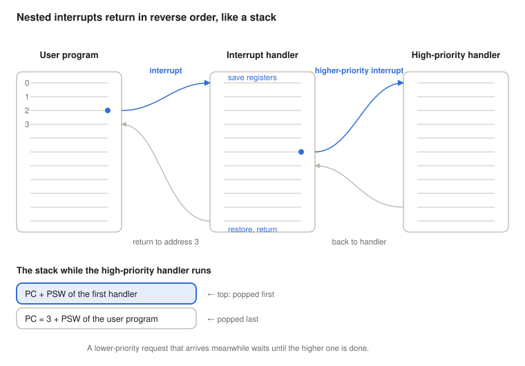
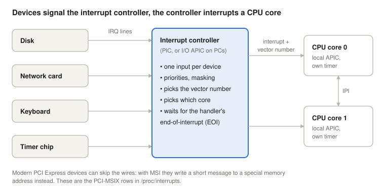
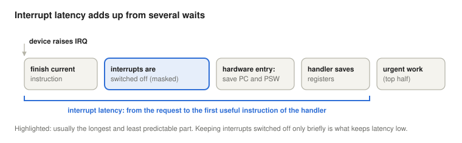
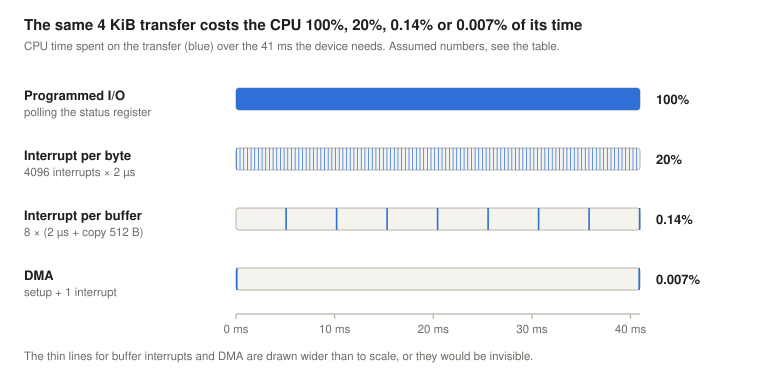
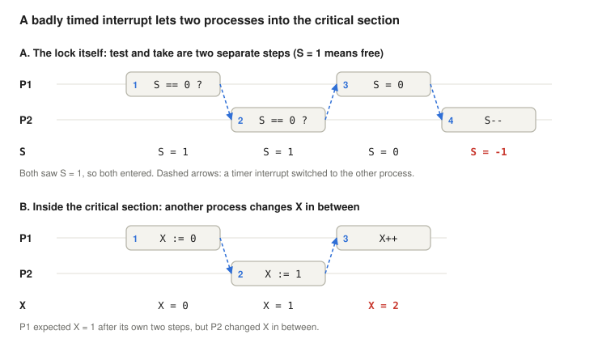

# Interrupts

*Operating Systems lecture: interrupt classes, user and kernel mode, interrupt processing, nested interrupts, the interrupt controller, interrupt latency, I/O techniques and why interrupts make mutual exclusion necessary, with Linux (x86-64) examples*

Previous: [The Fetch-Execute Cycle](../04-fetch-execute-cycle/). Next: [Concurrency, Deadlocks, Process States and Linux Scheduling](../06-concurrency-deadlocks-scheduling/).

> **How to read this lecture.** Wherever a new abbreviation or concept appears, a box marked **Explained simply** follows. Click it to open a plain-language explanation. You can skip these boxes if you already know the terms.

## Learning objectives

An interrupt lets an external event stop the current program between two instructions, run a handler, and then resume the program as if nothing had happened. This lecture shows how the hardware and the operating system share that work, and what follows from it.

<details>
<summary><b>Explained simply:</b> interrupt, handler, operating system</summary>

- **Interrupt:** a signal that tells the processor "stop what you are doing for a moment, something needs attention". It is like a doorbell: you put down your book, open the door, and then go back to the exact line you were reading.
- **Handler** (interrupt handler): the small piece of program that runs when an interrupt arrives, the "open the door" part. It is written by the operating system's programmers, not by the user.
- **Operating system (OS):** the program that manages the computer and lets other programs run on it, for example Linux, Windows, macOS or Android. Its central part, which has full control of the hardware, is called the **kernel**.

</details>

By the end, students will be able to:

- explain why an interrupt is only taken between two instructions;
- name the four classes of interrupts and give an example of each;
- explain user mode and kernel mode, and why some instructions are privileged;
- list the steps of interrupt processing and say which are done by the hardware and which by the handler;
- explain how nested interrupts and priorities work, and why the saved state forms a stack;
- describe what the interrupt controller does, and the difference between edge- and level-triggered interrupts;
- define interrupt latency, name its parts, and explain why the worst case matters;
- compare programmed I/O, interrupt-driven I/O and DMA, and estimate their CPU cost;
- explain why interrupts cause race conditions, and how test-and-set and semaphores give mutual exclusion;
- find these mechanisms on a running Linux system (`/proc/interrupts`, `/proc/softirqs`, signals, threads, latency measurement).

## Why interrupts?

I/O devices are orders of magnitude slower than the CPU. Without interrupts, a program that starts a disk or network transfer has only one way to find out when it is finished: it keeps asking the device in a loop (**polling**). All that time the CPU executes instructions but does no useful work. The section on I/O techniques below puts numbers on this: for the same transfer, the CPU's cost falls from 100% of its time with polling to well under 1% with interrupts and DMA.

With interrupts, the CPU starts the transfer and goes on running other code. When the device is done, it raises an interrupt request, and only then does the CPU spend time on it. Interrupts are also how the operating system takes back control from a program at all: through the timer interrupt (time sharing), through error conditions such as division by zero, and through hardware failures.

<details>
<summary><b>Explained simply:</b> CPU, I/O, device, polling, DMA, timer, time sharing</summary>

- **CPU** (Central Processing Unit), also called the **processor:** the chip that executes the program's instructions, one after another, billions per second.
- **I/O** (Input/Output): everything the computer exchanges with the outside world: keyboard, mouse, disk, network, screen, printer. An **I/O device** is any such piece of hardware.
- **Orders of magnitude:** factors of ten. A disk that answers in 100 microseconds is about 100,000 times slower than a CPU that does one step per nanosecond.
- **Polling:** asking again and again, "are you done yet?", like a child on a car trip asking "are we there yet?" every minute. It works, but nothing else gets done meanwhile.
- **Timer:** a small hardware clock that can send an interrupt at regular intervals, for example every 4 milliseconds.
- **DMA** (Direct Memory Access): a helper chip that copies data without the CPU; explained in detail further below.
- **Time sharing:** running many programs "at the same time" on one CPU by giving each a short turn (a **time slice**) in rotation. The timer interrupt tells the OS when a turn is over.

</details>

## Where interrupts fit in the instruction cycle


For external interrupts (timer, I/O), fetch, decode and execute form one **atomic** unit: once an instruction has started, the CPU finishes it before it looks at pending interrupts. The Check Interrupt step comes after execute, so:

- the interrupted program is never left with a half-executed instruction;
- the PC already points to the next instruction (it was advanced during fetch), so that is exactly the address to return to.

If no interrupt is pending, the next fetch follows immediately. If one is pending, the next fetch is the first instruction of the interrupt handler.

Interrupts caused by the instruction itself work slightly differently, because they arise while the instruction is being fetched or executed (see the next section). A **fault**, such as a page fault, abandons the instruction before it has any effect, and the saved PC points to the *faulting* instruction, so it can be executed again once the handler has fixed the problem (for example, loaded the missing page). A **trap**, such as a system call instruction, completes first, and the saved PC points to the next instruction. (A few long x86 instructions, such as `rep movs`, may also be interrupted between their repetitions and resumed later.)

<details>
<summary><b>Explained simply:</b> instruction, fetch–decode–execute, atomic, PC, register, fault, trap, page fault</summary>

- **Instruction:** one elementary step of a program in the CPU's own language, for example "add 2 to this number" or "jump to address 900".
- **Fetch–decode–execute:** the CPU's endless routine: fetch the next instruction from memory, work out what it means, do it. The previous lecture covers it in detail.
- **Atomic:** cannot be split. Nobody can see or interrupt it "half done", like a light switch that is either on or off, never in between.
- **Register:** a tiny, very fast storage cell inside the CPU that holds one number.
- **PC** (Program Counter): the register that holds the memory address of the next instruction, the CPU's "bookmark".
- **Fault:** an error found while an instruction is running, which the system may be able to fix. The instruction is cancelled and retried after the fix.
- **Trap:** an intentional jump into the operating system that a program asks for, like pressing a call button. The program continues with the next instruction afterwards.
- **Page fault:** a fault that occurs when a program touches a piece of memory (a **page**) that is not available right now, for example because it was moved out to disk. The OS loads it back and the instruction is retried.
- **x86, `rep movs`:** x86 is the processor family in most PCs and laptops (Intel and AMD). `rep movs` is one of its instructions that copies a whole block of memory, one piece at a time.

</details>

## Classes of interrupts

| Class | Caused by | Examples | Timing |
| --- | --- | --- | --- |
| Timer | the hardware clock | time slice used up, periodic tick | asynchronous |
| I/O | an I/O controller | normal completion (buffer full or ready), error condition | asynchronous |
| Program | the instruction being executed | division by zero, arithmetic overflow, illegal memory access, system call | synchronous |
| Hardware failure | a fault in the machine | power failure, memory parity error | asynchronous |

This classification follows Stallings (2018). **Synchronous** means the interrupt is caused by the instruction currently executing, so it is tied to a specific instruction rather than arriving at a random moment. **Asynchronous** means it comes from outside, at an unpredictable point in the program. Many textbooks and CPU manuals call program interrupts **exceptions** and reserve the word *interrupt* for the asynchronous ones. The handling mechanism is largely the same (the same vector table and entry path), with two differences: exceptions cannot be switched off like external interrupts, and the saved PC depends on whether the exception is a fault or a trap.

For an operating system, the most important program interrupt is the deliberate one: the **system call**. A program executes a special trap instruction (`syscall` on x86-64) to ask the kernel for a service, and enters the kernel through the same mechanism.

<details>
<summary><b>Explained simply:</b> controller, buffer, overflow, parity error, synchronous, asynchronous, exception, system call</summary>

- **I/O controller:** the small electronics on a device (or on the motherboard) that runs the device and talks to the CPU, for example the disk controller.
- **Buffer:** a small temporary storage area where data waits until someone collects it, like a mailbox.
- **Arithmetic overflow:** the result of a calculation is too big to fit in the space reserved for it, like a car's odometer rolling over from 999999 to 000000.
- **Memory parity error:** some memory chips store extra check bits; if the check does not match, the stored data has been damaged (for example by a hardware fault).
- **Synchronous / asynchronous:** synchronous events happen *because of* what the program is doing right now (you trip because you stepped on a stone). Asynchronous events come from outside at any moment (it starts raining).
- **Exception:** the usual name for an interrupt caused by the program's own instruction (division by zero, page fault, system call).
- **System call:** a program's request to the operating system to do something it may not do itself, for example "read this file" or "send this over the network". The program cannot touch the disk directly; it has to ask the kernel.
- **x86-64:** the 64-bit version of the x86 processor family.

</details>

## User mode and kernel mode

An operating system can only protect itself and the programs it runs if a program cannot simply take over the machine. The CPU therefore has (at least) two modes of operation:

- **Kernel mode** (supervisor mode): everything is allowed. The OS kernel runs in this mode.
- **User mode:** ordinary programs run here. Some instructions are forbidden, and parts of memory are out of reach.

The forbidden instructions are called **privileged instructions**. Typical examples: switching interrupts off and on (`cli`/`sti` on x86), halting the CPU (`hlt`), talking directly to I/O devices (`in`/`out`), and changing the memory-protection settings (on x86, loading the CR3 register). If a user-mode program tries one, the CPU does not execute it but raises an exception (on x86, a *general protection fault*), and the OS stops the program.

Why exactly these? Each of them would let one program take over the machine: with interrupts switched off, the timer could never take the CPU back; with direct device access, a program could read anyone's files from the disk; with its own memory settings, it could read and overwrite the kernel.

How does the CPU get from user mode into kernel mode? **Only through the interrupt mechanism:** a hardware interrupt, an exception or a system call. Each of these switches to kernel mode *and* jumps to an entry point that the kernel itself has set up: in the vector table, or, for the `syscall` instruction, in a special CPU register. A program can therefore enter the kernel, but only through the doors the kernel has built. The return instruction (`iret`, or `sysret` after a system call) switches back to user mode. x86 actually has four privilege levels (**rings 0–3**), but Linux and Windows use only two: ring 0 for the kernel and ring 3 for user programs.

<details>
<summary><b>Explained simply:</b> kernel mode, user mode, privileged instruction, general protection fault, CR3, ring</summary>

- **Kernel mode / user mode:** like the staff area and the customer area of a shop. Staff (the kernel) can go anywhere and use the cash register; customers (ordinary programs) can only be on the shop floor, and have to ask staff for anything else.
- **Privileged instruction:** an instruction that only works in kernel mode, like a key that only staff are given.
- **General protection fault** (`#GP`): the exception the x86 CPU raises when a program breaks a protection rule, for example by trying a privileged instruction in user mode.
- **CR3:** a special CPU register that tells the CPU which memory map (which program's view of memory) is active. Whoever can change it can see any program's memory.
- **Ring:** x86's name for privilege levels, pictured as rings around a target: ring 0 in the middle is the most trusted (the kernel), ring 3 on the outside is the least trusted (user programs).
- **`iret`, `sysret`:** "return from interrupt" and "return from system call", the instructions that end a handler and go back to the program.

</details>

## Interrupt processing step by step


The work is split between the hardware and the software (Stallings, 2018):

1. **The device raises the interrupt request (IR)** on its interrupt line.
2. **The CPU finishes the current instruction.** The instruction cycle is atomic.
3. **The CPU acknowledges the request, and the device clears IR.** Otherwise the same request would be taken again right after the handler returns. (On real hardware, many devices keep the line active until the handler has serviced them, and the interrupt controller also expects an "end of interrupt" message from the handler; see the section on the interrupt controller.)
4. **The CPU switches to kernel mode and saves the PC and the PSW** (program status word: the flags and the CPU mode, which in our model is the status register, SR) by pushing them onto the kernel's stack. On x86-64 the CPU also switches to a kernel stack first, and for some exceptions pushes an error code as well.
5. **The CPU loads the new PC from the interrupt vector table.** Each interrupt source has a number, and the table maps that number to the start address of its handler. Typically, entering the handler also disables further external interrupts (on x86, by clearing the IF flag), until the handler decides to re-enable them.
6. **The handler saves the other registers** it will use. Together with the PC and PSW, these form the **process state**.
7. **The handler does its work:** it copies data from the device buffer, wakes up a waiting process, or notes the error.
8. **The handler restores the registers** in reverse order.
9. **A special return instruction restores the PC and the PSW** (`iret` on x86). The next fetch continues the interrupted program.

The hardware saves only what it must (PC and PSW), because these change the moment the handler starts running. Everything else is the handler's job. This keeps the hardware simple and, in principle, lets a short handler save only the few registers it really uses. In practice, operating system entry code (Linux's included) usually saves all general-purpose registers, because the interrupt may end in a switch to a different process, and then the whole state of the interrupted one must be kept.

<details>
<summary><b>Explained simply:</b> IR, acknowledge, PSW, flags, stack, vector table, IF flag, process, process state</summary>

- **IR** (Interrupt Request): the electrical signal (or message) a device uses to ask for an interrupt, like raising your hand in class.
- **Acknowledge:** the CPU confirms "I have seen your request", like the teacher nodding at you. The device can then put its hand down.
- **PSW** (Program Status Word): a register that describes the CPU's current state: the flags and whether it is in user or kernel mode.
- **Flags:** single yes/no bits the CPU sets after each calculation, for example "the result was zero" or "the result was negative".
- **Stack:** an area of memory used like a stack of plates: you can only put a plate on top (**push**) or take the top one off (**pop**). The last one put on is the first one taken off: **LIFO**, last in, first out.
- **Interrupt vector table:** a table in memory, set up by the OS, that lists for every interrupt number where its handler starts, like the list of emergency phone numbers by the door.
- **IF flag** (Interrupt enable Flag): a bit in RFLAGS, the x86 status register (x86's PSW); when it is 0, the CPU ignores ordinary interrupts.
- **Process:** a program that is currently running, together with everything that belongs to it (its memory, its open files, its registers). The same program can run as several processes at once.
- **Process state:** all the register values a process needs to continue exactly where it stopped, its "saved game".

</details>

## Multiple interrupts

What happens if a second interrupt arrives while a handler is still running? There are two approaches.

**Sequential processing.** Interrupts are disabled (masked) while a handler runs. A new request waits until the handler returns, and is then taken. This is simple, but an urgent request may wait behind an unimportant one.

**Nested processing with priorities.** Each interrupt source has a priority. A handler can itself be interrupted by a request of higher priority, but not by one of equal or lower priority.



In the figure, the user program is interrupted after address 2. The handler starts by saving the registers. While it runs, a higher-priority interrupt arrives: the hardware saves the handler's own PC and PSW and starts the high-priority handler. When that finishes, it returns into the first handler, which in turn returns to address 3 of the user program.

Because the last state saved is always the first one restored, the saved states form a **stack** (last in, first out). This is why x86 pushes the PC and PSW onto a stack instead of a single fixed place: a fixed place would be overwritten by the second interrupt. Many RISC processors (ARM, RISC-V, MIPS) do save them into fixed special registers, but then the handler must copy them to the stack itself before it re-enables interrupts. Either way, nesting needs a stack.

**Non-maskable interrupts.** Some events must never wait, typically urgent hardware events. These arrive on a **non-maskable interrupt** (NMI) line, which the normal interrupt-enable flag cannot switch off. (On modern x86 machines, memory errors are usually reported through a separate machine-check exception instead; NMI is used mostly for watchdogs and performance monitoring.)

<details>
<summary><b>Explained simply:</b> mask, priority, nested, RISC, ARM, RISC-V, MIPS, NMI, machine check, watchdog</summary>

- **Mask (masking an interrupt):** temporarily telling the CPU to ignore an interrupt, like putting your phone on "do not disturb". The request is not lost; it waits.
- **Priority:** how urgent something is. A fire alarm has higher priority than a doorbell.
- **Nested:** one inside another, like Russian dolls: an interrupt handler interrupted by another interrupt.
- **RISC** (Reduced Instruction Set Computer): a processor design with fewer, simpler instructions. **ARM** (in almost every phone), **RISC-V** (an open design) and **MIPS** are RISC families.
- **NMI** (Non-Maskable Interrupt): an interrupt that "do not disturb" cannot block.
- **Machine check:** the CPU's own alarm for serious hardware errors, for example memory data that was damaged and could not be corrected.
- **Watchdog:** a timer that checks the system is still alive. If the system stops responding, the watchdog fires (often as an NMI) so the problem can be reported or the machine restarted.

</details>

## The interrupt controller

A CPU core has very few interrupt inputs, but a computer has dozens of devices. Between them sits the **interrupt controller**.



The interrupt controller:

- has one input line (**IRQ line**) per device;
- can **mask** each line separately, and decides which request is served first (**priority**);
- tells the CPU core *which* interrupt it is, by handing over the **vector number** that the CPU uses to look up the handler;
- on multicore machines, decides **which core** gets the interrupt;
- waits for the handler's **end-of-interrupt (EOI)** message before it delivers the next interrupt of the same or lower priority.

**From PIC to APIC.** The original IBM PC (1981) used one Intel 8259 **PIC** (Programmable Interrupt Controller) with 8 inputs. From the IBM PC/AT (1984) on, two of them were chained (cascaded), giving 15 usable IRQ lines, because one input of the first chip is taken by the second. Today's PCs use the **APIC** system: an **I/O APIC** collects the device lines, and each core has its own **local APIC**, which also contains that core's timer and lets cores interrupt each other (**inter-processor interrupts**, IPIs). Newer PCI Express devices often bypass the wires completely: with **MSI** (message-signalled interrupts) a device requests an interrupt by writing a short message to a special memory address.

**Edge- or level-triggered.** An interrupt line can signal in two ways:

| | Edge-triggered | Level-triggered |
| --- | --- | --- |
| The request is | the *change* of the signal (for example, low → high) | the signal *being* active |
| Lasts | an instant | until the handler has serviced the device |
| Risk | a pulse that arrives while the input is masked can be missed | if the handler forgets to service the device, the interrupt repeats forever (an *interrupt storm*) |
| Line sharing | hard | easy: several devices can share one line, the handler asks each in turn |

Masking happens on two levels: the CPU's own flag (IF on x86) switches off *all* ordinary interrupts for that core, while the interrupt controller can mask *individual* lines.

<details>
<summary><b>Explained simply:</b> interrupt controller, IRQ line, multicore, EOI, PIC, APIC, IPI, PCI Express, MSI, edge, level</summary>

- **Interrupt controller:** a "receptionist" chip. Many devices ring it; it decides who gets through to the CPU first, and to which CPU core.
- **IRQ line:** the wire (or channel) on which one device can ask for an interrupt. IRQ = Interrupt ReQuest.
- **Core, multicore:** a modern processor chip contains several complete CPUs, called cores. A 4-core chip can run 4 instruction streams at once.
- **EOI** (End Of Interrupt): the handler's message to the controller, "I'm done with this one, you can send the next".
- **PIC** (Programmable Interrupt Controller): the interrupt controller chip of the 1980s PCs, with 8 inputs.
- **APIC** (Advanced PIC): the modern version built for multicore machines. The **I/O APIC** is the receptionist for the devices; each core's **local APIC** is that core's personal assistant.
- **IPI** (Inter-Processor Interrupt): one core interrupting another, for example "please run the scheduler".
- **PCI Express:** the high-speed connection inside a computer that graphics cards, fast disks and network cards plug into.
- **MSI** (Message-Signalled Interrupt): instead of pulling a wire, the device "sends a text message" to the interrupt system by writing to a special address.
- **Edge / level:** edge-triggered is like a doorbell button (one ring per press); level-triggered is like a light that stays on until someone deals with it.

</details>

## Interrupt latency

**Interrupt latency** is the time from the moment a device raises its request until the first useful instruction of its handler runs. It adds up from several parts:



1. **The current instruction must finish.** Usually a few nanoseconds; long instructions take longer.
2. **Interrupts may be switched off.** If the kernel is in a section where it has masked interrupts (or a higher-priority handler is running), the request waits until they are enabled again. This is usually the longest and least predictable part.
3. **The hardware entry:** acknowledge, switch to kernel mode, save PC and PSW, look up the vector.
4. **The handler's start:** saving registers before the real work can begin.

For the program waiting for the data, the delay is even longer: after the handler, the scheduler still has to decide to run that program (**scheduling latency**).

**Why the worst case matters.** For a desktop, a delay of a few milliseconds now and then is invisible. For a **real-time system** it may be a failure: an airbag controller, a motor controller or a pacemaker must react within a fixed deadline every single time (**hard real-time**). For audio or video a missed deadline is "only" an audible click or a dropped frame (**soft real-time**). In real-time work, what counts is not the average latency but the **worst case**.

How an OS keeps latency low: mask interrupts only for very short stretches of code, keep the hardware handlers short and move the rest of the work to later (top and bottom halves, below), and let urgent tasks preempt less urgent ones. Linux has had the **PREEMPT_RT** option in the mainline kernel since version 6.12 (2024): it turns most interrupt handlers into kernel threads with priorities, so that even long kernel code can be interrupted by an urgent real-time task.

<details>
<summary><b>Explained simply:</b> latency, nanosecond, microsecond, scheduler, real-time, deadline, preempt, kernel thread, mainline</summary>

- **Latency:** waiting time, the delay between "something happens" and "someone reacts". Ping in an online game is a latency.
- **Nanosecond (ns), microsecond (µs), millisecond (ms):** one billionth, one millionth and one thousandth of a second. 1 ms = 1000 µs = 1,000,000 ns.
- **Scheduler:** the part of the OS that decides which program gets the CPU next, like a coach deciding who plays.
- **Real-time system:** a system where the answer is only correct if it also arrives in time. A late airbag is as bad as no airbag.
- **Deadline:** the latest time by which something must be done. **Hard** real-time: missing it is a failure. **Soft** real-time: missing it is annoying, not dangerous.
- **Worst case:** the slowest it can ever be, not the typical or average speed.
- **Preempt:** to take the CPU away from a running task before it is finished, to give it to a more urgent one.
- **Kernel thread:** a task that runs inside the kernel but is scheduled like a normal program, so it can be paused and given a priority.
- **Mainline kernel:** the official Linux kernel released by its main developers, as opposed to separately maintained add-ons ("patches").

</details>

## Moving blocks of data: three I/O techniques

Transferring a block of data (for example, a disk sector) between a device and memory can be done in three ways:

| Technique | Who moves the data | How the CPU learns of progress | Remaining cost |
| --- | --- | --- | --- |
| Programmed I/O (polling) | the CPU, word by word | it keeps reading the device's status register | the CPU busy-waits and does no useful work |
| Interrupt-driven I/O (buffer + IR) | the CPU, when the device's buffer is ready | an interrupt for each buffer | no waiting, but the CPU still copies every word and handles many interrupts |
| Direct memory access (DMA) | the DMA controller | one interrupt when the whole block is done | the DMA controller and the CPU compete for the shared bus |

With DMA, the CPU only gives the DMA controller the device, the memory address, the amount of data and the direction. The DMA controller then performs the transfer on the system bus by itself and interrupts the CPU once, at the end. Since the CPU and the DMA controller share the same bus, the CPU may have to wait for the bus during the transfer. Because the DMA controller takes bus cycles away from the CPU, this is often called **cycle stealing**.

**A worked example.** How much CPU time does each technique cost? Take a device that delivers one byte every 10 µs, and a 4 KiB (4096-byte) block, so the transfer takes 40.96 ms whatever we do. The other numbers below are round, assumed values chosen to make the arithmetic easy; real ones depend on the hardware, but the proportions are typical.

| Technique | Assumptions | CPU time spent | Share of the 40.96 ms |
| --- | --- | --- | --- |
| Programmed I/O | the CPU polls during the whole transfer | 40,960 µs | 100% |
| Interrupt per byte | 4096 interrupts, each costs 2 µs (entry, handler, return) | 4096 × 2 = 8,192 µs | 20% |
| Interrupt per buffer | a 512-byte device buffer: 8 interrupts, each 2 µs + copying 512 bytes at 0.01 µs/byte | 8 × (2 + 5.12) ≈ 57 µs | 0.14% |
| DMA | 1 µs to set up the DMA controller + 1 interrupt at the end | 1 + 2 = 3 µs | 0.007% |



The device is equally slow in all four cases. What changes is how much of that time the CPU is tied up instead of running other programs. The example also shows a limit: if the device delivered one byte every 2 µs, interrupt-per-byte would need 100% of the CPU just for the interrupt overhead, which is no better than polling. Fast devices need buffers or DMA.

<details>
<summary><b>Explained simply:</b> block, sector, byte, KiB, status register, busy-wait, DMA, bus, cycle stealing</summary>

- **Byte:** 8 bits, enough to store one letter of text. **KiB** (kibibyte): 1024 bytes. 4 KiB holds about 4000 letters of text.
- **Block, sector:** disks do not read single bytes; they read fixed-size chunks (for example 512 or 4096 bytes), called sectors or blocks.
- **Status register:** a register on the device that tells whether it is busy, ready or has an error. Polling means reading it over and over.
- **Busy-wait:** waiting by actively checking again and again, instead of resting and being woken up.
- **DMA** (Direct Memory Access): a helper chip that copies data between a device and memory by itself, so the CPU does not have to. Like hiring movers instead of carrying every box yourself: you only tell them what to move where, and they ring you when they're done.
- **Bus:** the shared set of wires that connects the CPU, memory and devices. Only one of them can use it at a time.
- **Cycle stealing:** while DMA is using the bus, the CPU occasionally has to wait for it: the DMA "steals" a few of the CPU's bus turns.

</details>

## Interrupts and concurrency

A timer interrupt can stop a process between any two of its instructions and switch to another process. This makes the operating system able to share the CPU, but it also creates a new class of bugs. If two processes or threads share a variable in memory, the result can depend on exactly where the switch happened. This is a **race condition**.



**Panel B: another process changes X in between.** P1 sets `X := 0` and later increments it, so it expects `X = 1`. But between its two steps, a timer interrupt switches to P2, which sets `X := 1`. When P1 continues, `X++` makes it 2. Neither process is wrong on its own: the error comes from the interleaving. The same happens even inside a single `X++`, because the CPU executes it as three steps (load X, add 1, store X). If both processes load the same old value, one of the two increments is lost. The Linux demo later in this lecture shows exactly this.

The part of a program that works on shared data is a **critical section**, and the rule that at most one process may be inside it at a time is **mutual exclusion**. The classic picture is a single-track railway section shared by trains running in both directions. A **semaphore** (a railway signal) lets only one train onto the shared track at a time. Dijkstra (1965) borrowed the name for the synchronisation tool.

**Panel A: the naive lock fails too.** A shared variable `S` could act as the signal: 1 means free, 0 means taken. Each process waits while `S == 0`, then takes the lock by changing `S` from 1 to 0 (P1 writes `S = 0`, P2 writes it semaphore-style as `S--`), and sets it back to 1 when it leaves. But "test" and "take" are two separate steps. If an interrupt arrives between them, both processes see `S = 1`, and both enter. `S = -1` at the end is a visible symptom: a free/taken flag should never get there. The lock has the same race as the data it was meant to protect.

**Solutions:**

- **Disable interrupts** during the critical section. Without interrupts there is no switch, so the section runs alone. This works only on a single CPU, and only in the kernel: a user program must not be able to switch off the timer and keep the CPU forever, which is exactly why `cli` is a privileged instruction.
- **An atomic test-and-set instruction.** The CPU reads the old value and writes the new one in a single, indivisible instruction, so no interrupt and no other core can come between the test and the set. On x86 this is the `xchg` instruction (exchange register with memory), which is automatically locked. A lock built on it, where the waiting process keeps retrying in a loop, is a **spinlock**.
- **A semaphore**, provided by the operating system (Silberschatz et al., 2018; Stallings, 2018). For mutual exclusion, S starts at 1. `wait(S)` decrements S, and if the result is negative, the process is blocked (put to sleep) instead of busy-waiting. `signal(S)` increments S, and if processes are waiting, wakes one of them up. The OS makes both operations atomic, using the two techniques above inside the kernel. (In Dijkstra's original definition, called P and V, S never goes below zero: P simply waits until S > 0. Both forms are in use.)

<details>
<summary><b>Explained simply:</b> thread, shared variable, race condition, interleaving, critical section, mutual exclusion, semaphore, test-and-set, spinlock, blocked</summary>

- **Thread:** a separate line of execution inside one program. Two threads of the same program share its memory, like two cooks working in the same kitchen.
- **Variable:** a named place in memory that holds a value, for example `x = 5`. A **shared variable** is one that several threads or processes can read and change.
- **Race condition:** a bug where the result depends on who gets there first. Two people edit the same document from the same starting version; whoever saves last silently overwrites the other's changes.
- **Interleaving:** the order in which the steps of two programs end up mixed together, like shuffling two decks of cards into one.
- **Critical section:** the part of a program that touches shared data and must not be run by two at once, like a single-occupancy bathroom.
- **Mutual exclusion:** the rule "only one at a time inside", the lock on that bathroom door.
- **Semaphore:** a counter managed by the OS that controls entry, like a railway signal or a car park display that shows the free spaces and stops cars when it shows 0.
- **Test-and-set:** one indivisible instruction that checks the lock *and* closes it, like checking the bathroom door and locking it in one motion, so nobody can slip in between.
- **Spinlock:** a lock where the waiting thread keeps trying in a loop ("spinning"), like rattling the door handle until it opens.
- **Blocked (sleeping):** a waiting process that does not use the CPU at all until the OS wakes it up, like waiting in a chair until your number is called.

</details>

## The same ideas on Linux (x86-64)

All outputs below come from a real system (kernel 6.18, 2 CPU cores, running as a virtual machine in a cloud data centre); numbers will differ on yours.

<details>
<summary><b>Explained simply:</b> Linux, kernel version, virtual machine, console, gcc, C</summary>

- **Linux:** a free operating system used on most servers, in Android phones and on many desktops. The version number (6.18) is the version of its kernel.
- **Virtual machine:** a computer simulated by software on a bigger computer. It behaves like a real one, but shares the real hardware with others, which makes its timing less steady.
- **Console** (terminal): a window where you type commands as text. In the examples, lines starting with `$` are what you type; the other lines are the computer's answer.
- **C, gcc:** C is a programming language close to the hardware, used to write operating systems. `gcc` is the program (compiler) that translates C source code into machine instructions the CPU can run.

</details>

### `/proc/interrupts`: who interrupts whom

```console
$ cat /proc/interrupts
           CPU0       CPU1
 26:          3          0  IO-APIC   4-edge      ttyS0
 37:          0       1413  PCI-MSIX-0000:00:02.0   1-edge   virtio1-req.0
 49:       1327          0  PCI-MSIX-0000:00:08.0   1-edge   virtio7-input.0
 50:          0       1305  PCI-MSIX-0000:00:08.0   2-edge   virtio7-output.0
...
NMI:          0          0   Non-maskable interrupts
LOC:       6432       6522   Local timer interrupts
RES:        317        420   Rescheduling interrupts
TLB:        503       1101   TLB shootdowns
```

- **Numbered rows** are device interrupts (IRQs): Linux's own IRQ number, a counter for each CPU core, the interrupt controller, the line (or, for MSI, message) number on that controller with its trigger type (`4-edge`), and the device name. Neither number is the CPU's vector number from the table below: the kernel maps each IRQ to a vector itself (The kernel development community, n.d.). Here `ttyS0` is the serial console, `virtio1-req.0` a disk, and `virtio7-input.0` / `output.0` the receive and transmit queues of a network card.
- **`IO-APIC`** and **`PCI-MSIX`** are the two kinds of interrupt delivery from the interrupt-controller section: a classic line through the I/O APIC, or message-signalled interrupts. MSI-X lets one device have many separate interrupts (one per queue), each routed to a different core.
- **`NMI`** is the non-maskable interrupt line from the lecture.
- **`LOC`** is the per-core timer interrupt from the local APIC; **`RES`** and **`TLB`** are inter-processor interrupts (to reschedule, or to flush address translations).

Which cores may receive a given IRQ is set in `/proc/irq/<number>/smp_affinity_list`. On this machine, IRQ 37 (the disk) may go to either core, but is currently delivered to core 1, which matches its counters above:

```console
$ cat /proc/irq/37/smp_affinity_list
0-1
$ cat /proc/irq/37/effective_affinity_list
1
```

<details>
<summary><b>Explained simply:</b> /proc, IRQ number, virtio, serial console, queue, TLB, affinity, SMP</summary>

- **`/proc`:** a folder in Linux that does not exist on any disk. Its "files" are windows into the kernel: reading them shows live information such as interrupt counts.
- **`cat`:** a command that prints the contents of a file.
- **IRQ number:** the number Linux gives each interrupt source, so it can count them and attach handlers.
- **virtio:** simulated devices (disk, network card) that a virtual machine uses instead of real hardware.
- **Serial console (`ttyS0`):** a very simple text connection to the machine, the oldest kind of terminal connection.
- **Queue:** a waiting line. A network card keeps separate queues for incoming and outgoing data.
- **TLB** (Translation Lookaside Buffer): a small cache in each core that remembers recent memory address translations. When memory settings change, the other cores must be told to clear theirs: a "TLB shootdown".
- **Affinity:** which CPU cores something is allowed to run on (or be delivered to).
- **SMP** (Symmetric MultiProcessing): a machine with several equal CPU cores. `smp_affinity_list` lists the cores an interrupt may go to.

</details>

### Program interrupts become signals

On x86-64, the exceptions have fixed numbers in the interrupt vector table, for example:

| Vector | Exception | Class | What Linux does for a user program |
| --- | --- | --- | --- |
| 0 | `#DE` divide error | program | sends `SIGFPE` |
| 2 | `NMI` | hardware failure (and others) | handled in the kernel |
| 13 | `#GP` general protection fault | program | sends `SIGSEGV` |
| 14 | `#PF` page fault | program | loads the page, or sends `SIGSEGV` (sometimes `SIGBUS`) if the access is illegal |
| 18 | `#MC` machine check | hardware failure | logs the error; may send `SIGBUS` to the affected process, or stop the system |
| 32–255 | external interrupts, inter-core interrupts | timer, I/O | runs the handler registered for that vector |

A division by zero, in practice:

```c
#include <stdio.h>

int main(void) {
    volatile int a = 1, b = 0;     /* volatile: stop the compiler from folding 1/0 */
    printf("about to divide...\n");
    fflush(stdout);
    printf("result = %d\n", a / b); /* the CPU raises a divide-error exception */
    return 0;
}
```

```console
$ gcc -o divzero divzero.c && ./divzero
about to divide...
Floating point exception
```

The CPU raised exception 0, the kernel's handler turned it into the signal `SIGFPE`, and the default action of that signal ended the process. (The name is historical: it is an integer division, not a floating-point one.) A program can install a signal handler of its own, but it must not simply return from it. Division by zero is a fault, so the saved PC points to the `idiv` (integer divide) instruction itself: returning would execute it again, and fault again, forever. The handler has to exit, or jump back to a saved point in the program (with `siglongjmp`).

**A privileged instruction in user mode.** `privileged.c` tries `cli` (switch off interrupts) or `hlt` (halt the CPU) from an ordinary program:

```c
#include <stdio.h>
#include <string.h>

int main(int argc, char **argv) {
    printf("user mode: trying a privileged instruction...\n");
    fflush(stdout);
    if (argc > 1 && strcmp(argv[1], "hlt") == 0)
        __asm__ volatile ("hlt");   /* stop the CPU until the next interrupt */
    else
        __asm__ volatile ("cli");   /* switch off interrupts */
    printf("this line is never printed\n");
    return 0;
}
```

```console
$ gcc -o privileged privileged.c
$ ./privileged
user mode: trying a privileged instruction...
Segmentation fault
$ ./privileged hlt
user mode: trying a privileged instruction...
Segmentation fault
```

Neither instruction runs. The CPU raised a general protection fault (vector 13), and Linux delivered `SIGSEGV`. If any program could run `cli`, it could stop the timer interrupt and never give the CPU back.

<details>
<summary><b>Explained simply:</b> signal, SIGFPE, SIGSEGV, SIGBUS, segmentation fault, volatile, asm</summary>

- **Signal:** a short notification that the Linux kernel sends to a program, for example "you divided by zero" or "please stop". Unless the program has prepared for it, most signals end the program.
- **SIGFPE, SIGSEGV, SIGBUS:** names of signals. SIGFPE: arithmetic error. SIGSEGV ("segmentation violation"): the program did something it is not allowed to, usually touching forbidden memory; the shell prints "Segmentation fault". SIGBUS: a memory access that cannot be completed for a hardware-related reason.
- **`volatile`:** a C keyword that tells the compiler "don't be clever with this variable, really read it every time". Here it stops the compiler from noticing the division by zero and removing it.
- **`__asm__`:** lets a C program include a raw processor instruction directly.

</details>

### Keep the handler short: top and bottom halves

Linux runs every hardware interrupt handler with all interrupts disabled on that core, and the same IRQ never runs on two cores at once. In the terms of this lecture, Linux uses **sequential** processing for device interrupts, not priority nesting. That only works if handlers are very short, so Linux splits interrupt work in two:

- the **top half** (the hard IRQ handler) does only the urgent part: acknowledges the device and grabs the data;
- the rest is **deferred work**, done a little later with interrupts enabled. *Softirqs* and *tasklets* still run in interrupt context and must not sleep. *Threaded IRQ handlers* and *work queues* run as kernel threads, so they may sleep (for example, wait for a lock or for memory).

`/proc/softirqs` counts the deferred work by type. Network receive (`NET_RX`) and disk completion (`BLOCK`) are the bottom halves of the device interrupts above:

```console
$ cat /proc/softirqs
                    CPU0       CPU1
          HI:          0          0
       TIMER:       1763       1198
      NET_TX:          4          4
      NET_RX:       1307       1047
       BLOCK:        468       3040
    IRQ_POLL:          0          0
     TASKLET:          9         18
       SCHED:       3829       3985
     HRTIMER:         40         22
         RCU:        672        572
```

<details>
<summary><b>Explained simply:</b> top half, bottom half, deferred work, softirq, tasklet, interrupt context, sleep, work queue</summary>

- **Top half / bottom half:** a paramedic at an accident does only what cannot wait (top half); the hospital does the rest later (bottom half).
- **Deferred work:** work postponed to a slightly later, calmer moment.
- **Softirq, tasklet:** Linux mechanisms for running deferred work soon after the interrupt. Like the top half, they are not allowed to sleep (wait for anything).
- **Interrupt context:** code that runs "on behalf of" an interrupt, not of any program. It must never wait (sleep), because there is no program to put to sleep.
- **Sleep:** to pause and give the CPU to someone else until a condition is met, for example until data arrives.
- **Work queue, threaded IRQ:** deferred work done by kernel threads, which may sleep.

</details>

### The three I/O techniques today

Modern disks and network cards use **DMA**: they read and write main memory directly, and interrupt the CPU only when a batch of work is complete. Under very heavy network traffic, even one interrupt per packet is too many, so the Linux network stack (NAPI) switches a busy network card from interrupts back to **polling**, and returns to interrupts when the traffic calms down. Polling is not always wasteful: it pays off when there is almost always something to collect.

<details>
<summary><b>Explained simply:</b> packet, network stack, NAPI</summary>

- **Packet:** a small piece of data sent over a network. A web page arrives as many packets.
- **Network stack:** the part of the OS that handles networking, built in layers stacked on top of each other.
- **NAPI** ("New API"): Linux's method for network cards that switches between interrupts (when traffic is light) and polling (when packets arrive non-stop).

</details>

### Measuring interrupt latency

`latency.c` asks to be woken up every millisecond at an exact time, 5000 times, and measures how late each wake-up actually is. Each wake-up needs a timer interrupt, the kernel's interrupt handling and the scheduler, so this measures the whole chain from the latency section: interrupt latency plus scheduling latency, plus one more Linux detail, **timer slack**. To save energy, Linux may deliberately wake an ordinary program up to 50 µs late, so that several wake-ups can be handled together; real-time tasks get no slack. The `noslack` option asks the kernel to switch the slack off for this program. (The program is a simplified version of `cyclictest`, the standard Linux tool for this.)

```c
#include <stdio.h>
#include <stdlib.h>
#include <string.h>
#include <sys/prctl.h>
#include <time.h>

#define PERIOD_NS 1000000L          /* 1 ms */
#define LOOPS     5000

static long ns_between(struct timespec a, struct timespec b) {
    return (b.tv_sec - a.tv_sec) * 1000000000L + (b.tv_nsec - a.tv_nsec);
}

static int cmp(const void *a, const void *b) {
    long x = *(const long *)a, y = *(const long *)b;
    return (x > y) - (x < y);
}

int main(int argc, char **argv) {
    static long lat[LOOPS];
    struct timespec next, now;

    if (argc > 1 && strcmp(argv[1], "noslack") == 0)
        prctl(PR_SET_TIMERSLACK, 1UL, 0, 0, 0);     /* slack = 1 ns instead of 50 us */

    clock_gettime(CLOCK_MONOTONIC, &next);
    for (int i = 0; i < LOOPS; i++) {
        next.tv_nsec += PERIOD_NS;                  /* next wake-up time */
        if (next.tv_nsec >= 1000000000L) { next.tv_nsec -= 1000000000L; next.tv_sec++; }
        clock_nanosleep(CLOCK_MONOTONIC, TIMER_ABSTIME, &next, NULL);
        clock_gettime(CLOCK_MONOTONIC, &now);
        lat[i] = ns_between(next, now);             /* how late we woke up */
    }
    qsort(lat, LOOPS, sizeof(long), cmp);
    printf("%d wake-ups, latency in microseconds:\n", LOOPS);
    printf("  min %6.1f   median %6.1f   99%% %6.1f   max %6.1f\n",
           lat[0] / 1e3, lat[LOOPS / 2] / 1e3, lat[LOOPS * 99 / 100] / 1e3, lat[LOOPS - 1] / 1e3);
    return 0;
}
```

Four runs: on an idle machine, then with both cores kept busy by two `yes > /dev/null` processes: as an ordinary program, without timer slack, and with real-time priority (`chrt -f 80`, which needs administrator rights):

```console
$ ./latency                    # idle
  min   16.0   median  101.6   99%  512.1   max 9036.9
$ ./latency                    # both cores busy
  min   74.4   median   86.3   99% 2669.4   max 11559.5
$ ./latency noslack            # both cores busy, no timer slack
  min   24.8   median   37.3   99% 2835.5   max 8996.8
$ sudo chrt -f 80 ./latency    # both cores busy, real-time priority
  min   24.3   median   35.8   99%   73.6   max 1648.4
```

(The first output line, "5000 wake-ups, latency in microseconds:", is left out.) What the numbers show:

- **Timer slack sets the typical delay.** Without slack, the median under load fell from 86 to 37 µs: about 50 µs of the delay was not latency at all, but the kernel batching wake-ups on purpose. The worst cases did not improve.
- **Priority sets the bad cases.** With real-time priority the median hardly changed (36 µs, since real-time tasks also get no slack), but the 99% value fell from 2.8 ms to 74 µs, and the maximum from 9 to 1.6 ms. An ordinary program has to wait its turn behind the busy `yes` processes; a real-time one runs as soon as it is woken.
- **The median and the worst case are very different.** Even in the best run, the single worst wake-up was 46 times later than the median. For real-time work, only the worst case counts.
- **Idle is not automatically fast.** The idle machine had a *higher* median than the busy one: an idle core goes into a deep power-saving sleep, and waking it up takes time.

This is a virtual machine: the real hardware is shared with other machines, which adds delays the guest kernel cannot see or control, and the numbers vary a lot from run to run. On a dedicated machine with a PREEMPT_RT kernel, the worst case is typically far lower, which is what hard real-time work needs.

<details>
<summary><b>Explained simply:</b> median, 99th percentile, max, real-time priority, chrt, timer slack, prctl, sudo, yes</summary>

- **Median:** the middle value: half the wake-ups were faster, half slower. Unlike the average, a few extreme values do not distort it.
- **99th percentile (99%):** 99% of the wake-ups were at least this fast; only the slowest 1% were slower.
- **Max:** the single worst case seen, the number that matters for real-time systems.
- **Real-time priority, `chrt -f 80`:** tells the Linux scheduler to run this program before all ordinary programs whenever it is ready, at priority 80 out of 99. The `-f` ("first in, first out") means that among programs of equal priority, whoever became ready first runs until it gives up the CPU.
- **Timer slack:** a small extra delay the kernel may add to an ordinary program's wake-up, so that several wake-ups can be handled at once and the CPU can sleep longer. Like a bus that waits a minute at the stop so that more passengers can get on.
- **`prctl`:** a Linux function a program can use to change some of its own settings, here its timer slack.
- **`sudo`:** runs a command with administrator rights.
- **`yes > /dev/null`:** a program that prints "y" forever into nowhere, a simple way to keep one CPU core 100% busy.

</details>

### A race condition you can run

`race.c` starts two threads that each increment the shared variable `x` one million times. It has three modes: no lock, the naive "test then set" lock from Panel A, and a test-and-set lock.

```c
#include <pthread.h>
#include <stdatomic.h>
#include <stdio.h>
#include <string.h>

#ifndef N
#define N 1000000
#endif

/* Note: volatile is NOT synchronisation. Two threads changing x without a
   lock is a data race (undefined behaviour in C11); here it is on purpose. */
volatile long x = 0;                       /* shared variable */
atomic_flag lock = ATOMIC_FLAG_INIT;       /* test-and-set lock, initially free */
volatile int s = 1;                        /* naive "semaphore": 1 = free, 0 = taken */
int use_lock = 0, use_naive = 0;

void *worker(void *arg) {
    (void)arg;
    for (int i = 0; i < N; i++) {
        if (use_naive) {                              /* entry, NOT atomic:        */
            while (s == 0)                            /*   (1) test ...            */
                ;
            s = 0;                                    /*   (2) ... then set        */
        }
        if (use_lock)
            while (atomic_flag_test_and_set(&lock))   /* entry: atomic test-and-set */
                ;                                     /* busy-wait while it was set */
        x++;                                          /* critical section */
        if (use_lock)
            atomic_flag_clear(&lock);                 /* exit: release */
        if (use_naive)
            s = 1;                                    /* exit: release */
    }
    return NULL;
}

int main(int argc, char **argv) {
    use_lock  = (argc > 1 && strcmp(argv[1], "lock")  == 0);
    use_naive = (argc > 1 && strcmp(argv[1], "naive") == 0);
    pthread_t t1, t2;
    pthread_create(&t1, NULL, worker, NULL);
    pthread_create(&t2, NULL, worker, NULL);
    pthread_join(t1, NULL);
    pthread_join(t2, NULL);
    printf("x = %ld (expected %d)\n", x, 2 * N);
    return 0;
}
```

```console
$ gcc -O0 -pthread -o race race.c
$ ./race
x = 1349836 (expected 2000000)
$ ./race naive
x = 1624338 (expected 2000000)
$ ./race lock
x = 2000000 (expected 2000000)
```

Without a lock, and with the naive lock, a fifth to a third of the increments are lost, and the result changes from run to run. Only the atomic test-and-set gives the right answer. `objdump -d` shows what the compiler made of `atomic_flag_test_and_set` (compiled with `-O1` for a shorter listing): a single `xchg` instruction followed by a test and a jump back, exactly the spinlock described above.

```console
  2d:  86 05 00 00 00 00     xchg   %al,0x0(%rip)
  33:  84 c0                 test   %al,%al
  35:  75 f4                 jne    2b <worker+0x2b>
```

**On a single core,** the two threads never run at the same moment, so only an interrupt (usually the timer) can switch between them in the middle of `x++`. With 50 million increments per thread, pinned to one core with `taskset -c 0`, three runs gave:

```console
$ gcc -O0 -pthread -DN=50000000 -o race_big race.c
$ taskset -c 0 ./race_big
x = 100000000 (expected 100000000)
x = 98255930 (expected 100000000)
x = 96986057 (expected 100000000)
```

Once correct, twice wrong. This is what makes race conditions dangerous: the program may pass every test and still fail in production, when an interrupt happens to land on the wrong instruction.

**Inside the kernel** the same problem appears between a process and an interrupt handler that share data. Linux uses `spin_lock_irqsave()` there: it disables interrupts on the local core (so the handler cannot interrupt the lock holder) and takes a spinlock (so other cores cannot get in), combining the first two solutions. The "save" part matters too: it remembers whether interrupts were enabled before, and `spin_unlock_irqrestore()` restores exactly that state, so the code is also safe when called with interrupts already off.

<details>
<summary><b>Explained simply:</b> pthread, POSIX, atomic_flag, data race, undefined behaviour, -O0, objdump, taskset</summary>

- **pthread** (POSIX threads): the standard way to create threads in C on Linux. `pthread_create` starts one, `pthread_join` waits for it to finish.
- **POSIX:** a standard that describes how Unix-like operating systems (Linux, macOS) must behave, so the same program works on all of them. A POSIX semaphore is the standard semaphore these systems provide.
- **`atomic_flag`:** a C type that can only be changed with atomic (indivisible) operations, here used as the lock.
- **Data race, undefined behaviour:** the C language rules say that if two threads change the same variable without a lock, *anything* may happen; the program is simply incorrect. We do it here on purpose, to see the damage.
- **`-O0`, `-O1`:** compiler settings for how much to optimise: `-O0` means "translate the code as written", `-O1` "make it somewhat faster and shorter".
- **`objdump -d`:** a tool that shows the machine instructions inside a compiled program (disassembly).
- **`taskset -c 0`:** runs a program on CPU core 0 only.

</details>

## Lab exercises

1. **Interrupt counts.** Run `cat /proc/interrupts`. Which devices does your machine have? Which rows come through the I/O APIC and which use MSI? Run `watch -n1 -d cat /proc/interrupts`, then type, move the mouse or download a file. Which counters change?
2. **Timer rate.** Read the `LOC` row twice, 10 seconds apart. How many timer interrupts arrived per second on each core? Repeat while `yes > /dev/null` runs. Explain the difference.
3. **Exceptions.** Compile and run `divzero.c`. Check the exit status with `echo $?`: it is 128 plus the signal number. Subtract 128 and look up the signal's name, for example `kill -l 8`. Then change the program to read through a null pointer. Which signal arrives now, and which exception caused it?
4. **Privileged instructions.** Run `privileged.c` with and without the `hlt` argument. Which signal ends it, and which CPU exception caused it? Explain in two sentences why `cli` must be privileged.
5. **The race.** Run `race.c` in all three modes, several times each. Then pin it to one core with `taskset -c 0`. Why are errors so much rarer on one core? Increase `N` until you see them.
6. **Latency.** Run `latency.c` on an idle machine, then while `yes > /dev/null` runs once per core: as it is, with the `noslack` option, and (if you have administrator rights) with `sudo chrt -f 80`. Fill in a table of median, 99% and max. Which setting changes the median, and which one changes the worst cases? Why does the max matter more than the median for a motor controller?
7. **Your own semaphore.** Rewrite `race.c` with a POSIX semaphore (`sem_t`, `sem_init`, `sem_wait`, `sem_post`). Measure the run time of the spinlock and the semaphore versions with `time`. Which is faster here, and why might that change if the critical section were long?

## Review questions

1. Why does the CPU check for external interrupts only after the execute phase? What would go wrong if it could stop in the middle of an instruction? How is a page fault different?
2. Classify each event as timer, I/O, program or hardware-failure interrupt, and as synchronous or asynchronous: a disk finishes reading a sector; a program divides by zero; the time slice of a process runs out; a memory parity error is detected.
3. Which registers does the hardware save automatically when an interrupt is taken, and why only those?
4. Why must the device clear its interrupt request after the CPU acknowledges it?
5. Why are the saved PC and PSW pushed onto a stack, and not stored in a single fixed memory location?
6. The system uses nested, priority-based interrupt processing (higher number = higher priority). A priority-2 interrupt arrives while the handler of a priority-5 interrupt is running. What happens? And the other way round? What would happen under sequential processing?
7. Compare programmed I/O, interrupt-driven I/O and DMA: who copies the data, and what does each one still cost the CPU?
8. In Panel A, both processes enter the critical section. Give the exact order of steps that causes this, and explain why an atomic test-and-set prevents it.
9. Why is disabling interrupts not a usable mutual-exclusion method for user programs, or on a multicore machine?
10. On one core, `race` gave the correct result in one run out of three. Why does that not prove the program is correct?
11. Name three privileged instructions and, for each, what a user program could do if it were allowed to run it. What is the only way for a user program to get into kernel mode?
12. List the components of interrupt latency. Which one does the operating system control most directly, and how does it keep it short?
13. A device uses a level-triggered line, and its handler returns without servicing the device. What happens? What would happen with an edge-triggered line if the interrupt arrived while that line was masked?
14. In the worked I/O example, the device becomes 5 times faster (one byte every 2 µs). Recalculate the CPU share for interrupt-per-byte and for DMA. What do you conclude?

<details>
<summary><strong>Answer key (for instructors)</strong></summary>

1. Each instruction must be atomic. If the CPU stopped halfway, the register and memory state would be half-updated, and the saved PC would not point to a well-defined instruction to resume from. A page fault is raised during the instruction itself: the instruction is abandoned without effect, the saved PC points to it, and it is executed again after the handler has loaded the page.
2. Disk sector: I/O, asynchronous. Division by zero: program, synchronous. Time slice: timer, asynchronous. Parity error: hardware failure, asynchronous.
3. The PC and the PSW (flags, CPU mode). They change as soon as the handler starts executing (the CPU also switches to kernel mode and usually disables further interrupts), so they must be saved before that. The other registers can be saved by the handler itself; in principle only those it uses, in practice an OS usually saves all of them, because the interrupt may lead to a process switch.
4. Otherwise the request would still be active when the handler returns, and the CPU would take the same interrupt again, endlessly.
5. Because interrupts can nest. A second interrupt would overwrite a fixed location before the first handler had used it. A stack keeps each saved state until its own handler returns, in last-in, first-out order. (CPUs that do save into fixed registers, as many RISC designs do, make the handler move them to the stack before re-enabling interrupts.)
6. The priority-2 request waits until the priority-5 handler finishes. In the other case, the priority-5 request interrupts the priority-2 handler immediately, and the priority-2 handler continues afterwards. Under sequential processing, any new request waits until the running handler finishes, whatever its priority.
7. Programmed I/O: the CPU copies and busy-waits. Interrupt-driven: the CPU copies, but only when data is ready, at the cost of one interrupt per buffer. DMA: the DMA controller copies; the CPU handles one interrupt per block, but may have to wait for the shared bus.
8. P1 tests S and sees 1 → interrupt, switch to P2 → P2 tests S and sees 1 → interrupt, switch to P1 → P1 takes the lock (S = 0) and enters → later P2 continues, takes the lock as well (S-- makes it −1) and enters. With an atomic test-and-set, the test and the take happen in one instruction, so no interrupt can fall between them. The second process always sees the value the first one wrote, and keeps waiting.
9. A user program could keep the CPU forever by never re-enabling interrupts, so the instruction is privileged. On a multicore machine, disabling interrupts on one core does not stop the other cores from accessing the same data.
10. Race conditions depend on timing. A correct result only shows that no bad interleaving happened in that run, not that one cannot happen. Correctness must be argued from the code: every access to the shared data must be inside a properly locked critical section.
11. For example: `cli` (switch off interrupts: the timer could never take the CPU back, so one program could keep it forever); `in`/`out` (direct device access: read any file straight from the disk, bypassing file permissions); loading CR3 (change the memory map: read or overwrite the kernel and other programs). Also acceptable: `hlt` (stop the CPU). The only way into kernel mode is through the interrupt mechanism: a hardware interrupt, an exception or a system call, each of which jumps to an entry point the kernel has set up.
12. Finishing the current instruction; waiting while interrupts are masked (or a higher-priority handler runs); the hardware entry (acknowledge, mode switch, save PC/PSW, vector lookup); the handler saving registers. The OS controls the masked periods most directly: it keeps them as short as possible, keeps hardware handlers short and moves the rest to deferred work (and with PREEMPT_RT, runs most handlers as prioritised, preemptible threads).
13. Level-triggered: the line is still active, so the same interrupt is taken again immediately after the return, over and over (an interrupt storm); the system may hang. (Linux detects this, reports "irq N: nobody cared" and switches the line off.) Edge-triggered: the edge is a single event; if it arrives while the line is masked and the controller does not latch it, the interrupt is lost, and the device may wait forever.
14. The transfer now takes 4096 × 2 µs = 8,192 µs. Interrupt per byte: 4096 × 2 µs = 8,192 µs, which is 100% of the transfer time: the CPU does nothing but handle interrupts, no better than polling. DMA: still 3 µs, now 3 / 8,192 ≈ 0.04%. Conclusion: the faster the device, the more per-byte interrupts cost relative to the transfer; fast devices need buffering or DMA.

</details>

## References

Dijkstra, E. W. (1965). *Cooperating sequential processes* (EWD 123). Technological University Eindhoven.

Silberschatz, A., Galvin, P. B., & Gagne, G. (2018). *Operating system concepts* (10th ed.). Wiley.

Stallings, W. (2018). *Operating systems: Internals and design principles* (9th ed.). Pearson.

The kernel development community. (n.d.). *Linux generic IRQ handling*. The Linux Kernel documentation. Retrieved October 6, 2026, from https://docs.kernel.org/core-api/genericirq.html

## Further reading

Kóczy, A., & Kondorosi, K. (Eds.). (2000). *Operációs rendszerek mérnöki megközelítésben* [Operating systems: An engineering approach]. Panem.

Tanenbaum, A. S., & Bos, H. (2015). *Modern operating systems* (4th ed.). Pearson.
