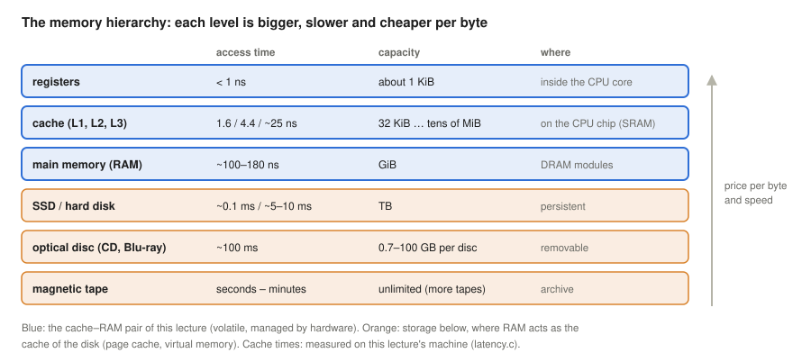
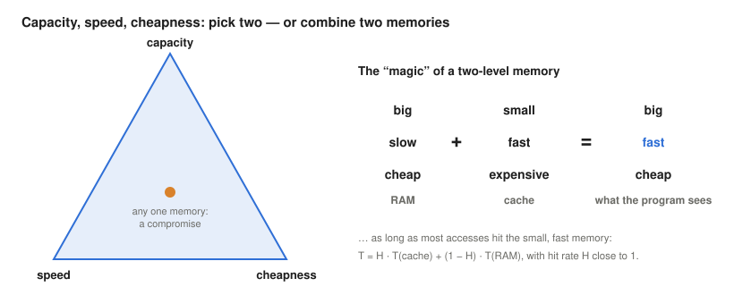
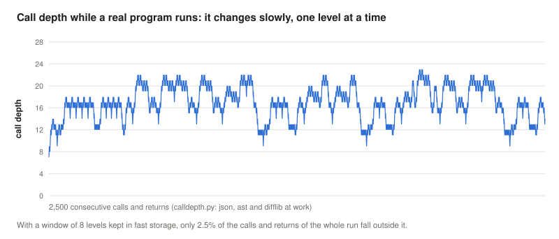
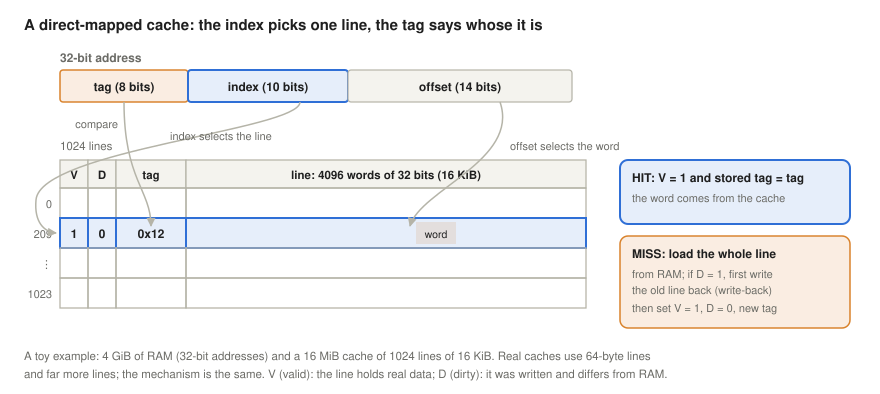
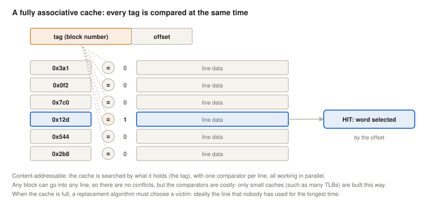
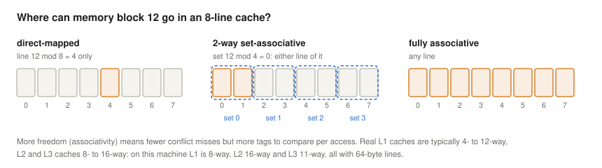
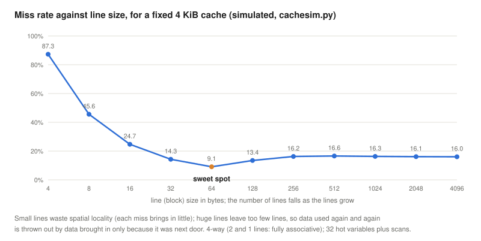
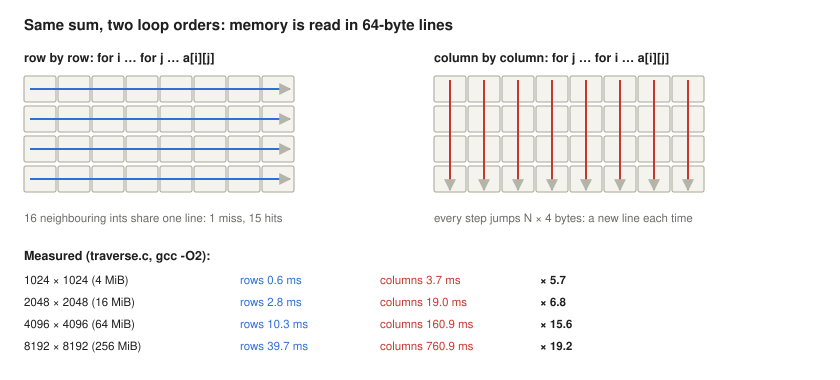
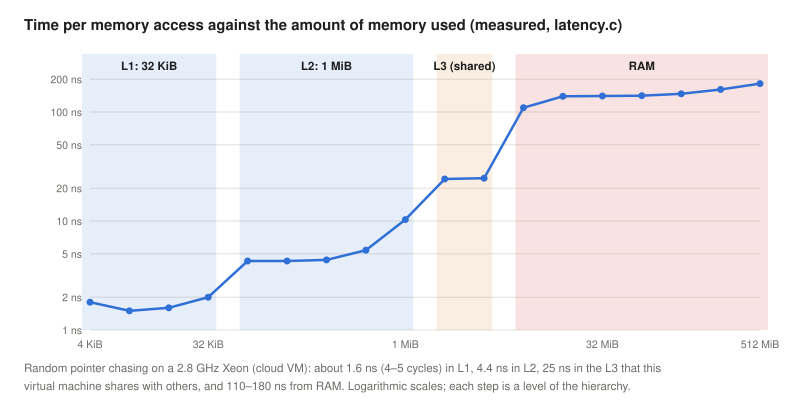

# Two-Level Memories and Caches

*Operating Systems lecture: why a small, fast memory in front of a big, slow one makes the whole system look big and fast, how a cache finds its data (direct-mapped, fully associative, set-associative), which line to throw out, and how to write programs that the cache likes*

Previous: [Concurrency, Deadlocks, Process States and Linux Scheduling](../06-concurrency-deadlocks-scheduling/).

> **How to read this lecture.** Wherever a new abbreviation or concept appears, a box marked **Explained simply** follows. Click it to open a plain-language explanation. You can skip these boxes if you already know the terms.

## Learning objectives

The [fetch-execute lecture](../04-fetch-execute-cycle/) assumed that the CPU can read an instruction or a data word from memory at every step. In reality, main memory is a hundred times slower than the CPU. This lecture shows how computers hide that gap with a **two-level memory**: a small, fast memory (the cache) in front of a big, slow one (RAM), and why the same idea reappears between RAM and the disk, which later lectures on virtual memory build on.

By the end, students will be able to:

- describe the memory hierarchy (registers, cache, RAM, disks, tape) by access time, capacity and price, and explain why no single memory can be big, fast and cheap at once;
- compute the average access time of a two-level memory from the hit rate, and explain why the hit rate must be very close to 1;
- state the principle of locality, distinguish temporal and spatial locality, and explain why programs have them;
- split an address into tag, index and offset, and trace a hit and a miss in a direct-mapped cache, including the valid and dirty bits and the write-back and write-through policies;
- explain fully associative and set-associative caches, the three kinds of misses, and replacement algorithms (LRU, FIFO, random, aging, Bélády's optimum);
- explain why there is an optimal line size, and how prefetching and multi-core coherence (false sharing) affect performance;
- write cache-friendly loops and data structures, and measure cache effects on Linux.

<details>
<summary><b>Explained simply:</b> memory, RAM, cache, register, hit, miss, latency</summary>

- **Memory:** where the computer keeps the programs and data it is working on. **RAM** (random-access memory) is the main memory: big, but slow compared with the CPU, and it forgets everything when the power is off.
- **Cache:** a small, very fast memory that keeps copies of the data used most recently, so the CPU does not have to wait for RAM every time. Like a desk next to a library: the books you use keep lying on the desk.
- **Register:** the handful of tiny storage places inside the CPU itself, the fastest of all.
- **Hit, miss:** a hit means the data was found in the cache; a miss means it was not, and must be fetched from the slower memory.
- **Latency:** the waiting time between asking for data and getting it.

</details>

## The memory hierarchy

No memory technology is at the same time big, fast and cheap. The fastest memories are built into the processor chip, where space is scarce; the biggest are mechanical or magnetic, and slow. Computers therefore use a **hierarchy** of memories:



The lecture notes give round numbers for the levels: registers about 1 ns and less than a kilobyte, cache about 3 ns and megabytes, RAM about 10 ns and gigabytes, hard disks milliseconds and terabytes, tape minutes and practically unlimited capacity. The order of magnitude between levels is what matters, and the measurements on this lecture's machine ([Linux section](#the-hierarchy-measured)) show it clearly: about 1.6 ns for the first-level cache, 4.4 ns for the second, about 25 ns for the third, and 110–180 ns for RAM. The RAM figure is larger than the notes' 10 ns, and this is an important point in itself. Over the decades, processors became fast much more quickly than DRAM became quick to answer: a CPU at 2.8 GHz executes several hundred instructions in the time one random RAM access takes. Wulf and McKee (1995) called this the **memory wall**: since the gap grows exponentially, they warned, even caches with very high hit rates would eventually leave the processor waiting for memory most of the time. (The notes' 10 ns is close to the time a DRAM chip itself needs to deliver a column of data; the 100+ ns measured here is the whole path of a load that misses all caches: the cache lookups, the memory controller and the opening of a DRAM row.)

The upper levels (registers, cache, RAM) are **volatile** and directly addressable by the CPU's instructions; the lower ones are **persistent** and reached through the operating system's I/O. The price per byte falls steeply from top to bottom, and capacity grows.

<details>
<summary><b>Explained simply:</b> hierarchy, ns, KiB/MiB/GiB, SRAM, DRAM, volatile, persistent, SSD, memory wall</summary>

- **Hierarchy:** an arrangement in levels, from top to bottom.
- **ns** (nanosecond): a billionth of a second. Light travels about 30 cm in one nanosecond.
- **KiB, MiB, GiB:** about a thousand, a million, a billion bytes (exactly 1024, 1024², 1024³).
- **SRAM, DRAM:** two kinds of memory chips. SRAM (static) is fast and expensive and is used for caches; DRAM (dynamic) is slower, cheaper and denser, and is used for main memory.
- **Volatile / persistent:** volatile memory loses its content without power; persistent storage (disks, SSDs, tape) keeps it.
- **SSD** (solid-state drive): a "disk" made of flash memory chips, much faster than a spinning hard disk.
- **Memory wall:** the growing gap between how fast processors compute and how fast memory can deliver data.

</details>

## The magic of a two-level memory

The notes draw the dilemma as a triangle: **capacity**, **speed** and **cheapness**. Any single memory is a point inside it, a compromise. The trick is to combine two memories:



A big, slow, cheap memory (RAM) plus a small, fast, expensive one (the cache) behaves, as seen by the program, like a big, fast, cheap memory, **provided that almost every access is served by the small one**. If a fraction $H$ of the accesses (the **hit rate**) is found in the cache, which answers in $T_C$, and the rest must go to RAM, which answers in $T_{RAM}$, the average access time is

$$T = H \cdot T_C + (1 - H) \cdot T_{RAM}$$

The **miss rate** is $M = 1 - H$. With the notes' figures ($T_C = 3$ ns, $T_{RAM} = 10$ ns) and a hit rate of 95%, $T = 3.35$ ns: almost as fast as the cache. With the ratio measured on a real machine, the picture is less forgiving ([Linux section](#how-much-the-hit-rate-matters)): if the cache answers in 4.4 ns and RAM in 140 ns, a 95% hit rate gives 11.2 ns, two and a half times slower than the cache, and even 99% leaves it about 30% slower. Real caches indeed reach hit rates of 95–99% and more for typical programs (Hennessy & Patterson, 2019).

(Some textbooks write the formula as $T = T_C + M \cdot T_{penalty}$, because on a miss the cache has already been checked before RAM is asked; the two forms differ only in what is counted as the miss time.)

And how big is the cache? The notes put it at **about 0.1%** of RAM: $Cap_C \cdot 1000 = Cap_{RAM}$. The machine used below has a 33 MiB last-level cache and 8 GiB of RAM, a ratio of 0.4%; a server with 32 MiB of cache and 32 GiB of RAM is exactly at 0.1%. That a memory a thousand times smaller can serve 95–99% of all accesses is the real magic, and it needs an explanation.

With several cache levels, the formula is applied level by level: a miss in L1 goes to L2, a miss in L2 to L3, and so on. Each level only has to catch most of what the level above it misses. In the "check first" form, with the **local** miss rate $m_i$ of each level (the fraction of the accesses *reaching* that level that miss there):

$$T = T_{L1} + m_{L1}\,\bigl(T_{L2} + m_{L2}\,(T_{L3} + m_{L3}\,T_{RAM})\bigr)$$

With the latencies measured below (1.6, 4.4, 25 and 140 ns) and local hit rates of 95%, 80% and 50%, $T = 1.6 + 0.05 \cdot (4.4 + 0.2 \cdot (25 + 0.5 \cdot 140)) pprox 2.8$ ns, although the L3 catches only half of what reaches it: the product $0.05 \cdot 0.2 \cdot 0.5 = 0.5\%$ is the **global** miss rate, the fraction of all accesses that go to RAM.

<details>
<summary><b>Explained simply:</b> hit rate, miss rate, average access time, miss penalty, cache level (L1, L2, L3)</summary>

- **Hit rate (H):** the fraction of accesses found in the cache, for example 0.95 = 95%. **Miss rate (M):** the rest, 1 − H.
- **Average access time:** what one memory access costs on average, counting the fast hits and the slow misses.
- **Miss penalty:** the extra time a miss costs.
- **L1, L2, L3:** levels of cache. L1 is the smallest and fastest, closest to the CPU core; L3 is the biggest and slowest, and is usually shared by all cores of a chip.

</details>

## Why it works: locality of reference

Programs do not access memory at random. They have **locality of reference**: in any short period, they use only a small part of their memory, and that part changes slowly (Denning, 2005). The notes list four reasons:

1. **The von Neumann principle: code is sequential.** The program counter is simply incremented (`PC++`) after most instructions, so the next instruction is almost always right after the current one. Jumps are the exception, and most of them are short.
2. **Nested calls stay within a narrow band.** Programs call functions, which call other functions, but the call depth changes slowly, one level at a time, and wanders up and down within a few levels for long periods. Studies of programs for the Berkeley RISC processors found this, and designed **register windows** around it: the CPU keeps the registers of the last few call levels on chip, and only a call or return outside that window costs a slow transfer to memory; with 8 windows, this was needed for only about 1% of the calls and returns (Stallings, 2016, chapter on reduced instruction set computers; the four reasons above follow Stallings' appendix on the performance of two-level memories). The measurement below finds a similar picture in a modern Python program: with a window of 8 levels, 2.5% of the calls and returns fall outside it ([Linux section](#call-depth-measured)).
3. **Long loops are rare.** Most of the time is spent in short loops that execute the same few instructions over and over.
4. **Most data structures are sequential.** Arrays, strings, records and the stack are laid out contiguously and are often processed element by element.

These reasons produce two kinds of locality:

- **Temporal locality:** what was used recently will probably be used again soon (loop instructions, loop counters, the top of the stack). A cache exploits it by **keeping** recently used data.
- **Spatial locality:** what lies next to something just used will probably be used soon (the next instruction, the next array element). A cache exploits it by loading a whole **line** (block) of neighbouring bytes at every miss, not just the requested word.



Locality is a property of programs, not of hardware, so a programmer can destroy it, as the [Meyers example](#writing-cache-friendly-code) shows, or improve it.

<details>
<summary><b>Explained simply:</b> locality, von Neumann principle, program counter, call depth, register window, loop, temporal locality, spatial locality, line/block</summary>

- **Locality of reference:** programs tend to use the same few things again and again (like the few tools a carpenter keeps on the bench), and things that lie next to each other.
- **Von Neumann principle:** instructions are stored in memory like data and are executed one after the other.
- **Program counter (PC):** the CPU register that holds the address of the next instruction; `PC++` means "go on to the next one".
- **Call depth:** how many function calls are currently open, one inside the other.
- **Register window:** in some processors, a set of registers reserved for the most recent function calls, so that calling and returning need no memory access.
- **Loop:** a part of a program that is repeated many times.
- **Temporal locality:** used now → likely to be used again soon. **Spatial locality:** used now → its neighbours are likely to be used soon.
- **Line (block):** the unit in which a cache loads data from RAM, for example 64 bytes at a time.

</details>

## How a cache finds its data

A cache stores copies of **lines** (blocks) of memory, together with a note of which part of memory each copy came from. Its design answers three questions: where may a block be placed, how is it found, and which block is thrown out when space is needed.

### The direct-mapped cache

The lecture notes work through a direct-mapped cache (the notes call it a *direct access cache*; the usual English name is **direct-mapped**). In their example, RAM has 4 GiB, so an address has 32 bits; the cache has 1024 lines, each holding 4096 words of 32 bits (16 KiB), 16 MiB in all. (The notes write "4 Mb" for the cache, counting 32-bit words: 4 Mi words = 16 MiB; RAM is addressed by bytes, which is what the 14-bit byte offset below assumes.) The address is cut into three fields:

- the **offset** (14 bits, because a line has $2^{14}$ = 16 KiB) selects the byte within the line;
- the **index** (10 bits, because there are $2^{10}$ = 1024 lines) selects the one line where this block may be;
- the **tag** (the remaining 8 bits) tells which of the $2^8 = 256$ blocks that share this line is actually there.



Each line also has two status bits:

- **V (valid):** 0 means the line has not been loaded yet (it holds garbage, for example just after power-on); 1 means it holds a real copy.
- **D (dirty):** 1 means the copy was written by the CPU and differs from RAM.

**A read**: the index selects the line; if V = 1 and the stored tag equals the address tag, it is a **hit**, and the offset selects the word from the line. Otherwise it is a **miss**: if the line is dirty, its old content is first written back to RAM; then the whole new line is loaded from RAM, the tag is stored, V is set to 1 and D to 0, and the word is delivered. A worked example with `cachesim.py`: the address `0x12345678` has tag `0x12`, index 209 and offset `0x1678`, word 1438 of the line ([Linux section](#a-cache-simulator)).

**Writes** need a policy:

- **Write-through:** every write goes both to the cache and to RAM. Simple, RAM is always up to date, but every write costs a RAM access (usually softened by a write buffer).
- **Write-back:** a write goes only to the cache and sets D = 1; RAM is updated only when the dirty line is evicted. Fewer RAM writes, which is why most modern caches use it, at the price of a more complex miss and of RAM being temporarily out of date (which matters for DMA and for other cores, see coherence below).

And when a write **misses**? A **write-allocate** cache first loads the line and then writes into it (the usual partner of write-back: later writes to the same line will hit); a **no-write-allocate** cache sends the write straight to RAM and leaves the cache alone (the usual partner of write-through). This is why cachegrind, below, reports misses for writes too.

**Why the index is in the middle.** The notes draw the address as *index | tag | offset*; real caches use *tag | index | offset*. The order is not a detail. With the index taken from the bits just above the offset, consecutive blocks of memory go to consecutive lines, so a program that sweeps through an array smaller than the cache can keep all of it. With the index in the top bits, all neighbouring blocks would share the same few lines and evict each other; the simulator shows the cost ([Linux section](#a-cache-simulator)). Likewise, real lines are much shorter than the notes' 16 KiB: 64 bytes on all current x86 and most ARM processors, for the reasons explained in [the section on line size](#choosing-the-line-size).

A direct-mapped cache is simple and fast: one comparison per access. Its weakness is **conflicts**: two blocks whose addresses differ by a multiple of the cache size map to the same line and evict each other, even if the rest of the cache is empty.

<details>
<summary><b>Explained simply:</b> direct-mapped, address, bit, field, offset, index, tag, valid bit, dirty bit, write-through, write-back, write buffer, conflict</summary>

- **Direct-mapped:** every block of memory has exactly one place in the cache where it may go, like a coat check where your number decides the hook.
- **Address:** the number of a byte in memory. **Bit:** a 0 or 1; a 32-bit address has 32 of them. A **field** is a group of bits with its own meaning.
- **Offset:** which byte inside the line. **Index:** which line of the cache. **Tag:** the rest of the address, stored with the line to say which block of memory it holds now.
- **Valid bit:** "this line holds real data". **Dirty bit:** "this line was changed and RAM has not been updated yet".
- **Write-through:** write to the cache and to RAM at once. **Write-back:** write only to the cache now, and to RAM later when the line leaves the cache.
- **Write buffer:** a small queue that lets the CPU go on while writes travel to RAM.
- **Conflict:** two blocks that need the same cache line and keep pushing each other out.

</details>

### The fully associative cache

The opposite extreme lets any block go into **any** line. The cache then has no index: the address is just tag and offset, and to find a block the cache compares the tag with the tags of **all** lines at the same time, with one comparator per line (the notes draw the comparison as an XOR/AND network over all lines). This is a **content-addressable memory**: it is searched by its content, not by position.



There are no conflicts, but the comparators make it large and power-hungry, so only small caches are built this way, such as many of the translation lookaside buffers that cache address translations for virtual memory (larger TLBs are set-associative too).

### Set-associative caches: the compromise

Real caches are **set-associative**: the lines are grouped into sets of *n* (n-way), the index selects a set, and the block may be in any of the *n* lines of that set, so only *n* tags are compared. A 1-way cache is direct-mapped; a cache with one set is fully associative.



The machine used below has an 8-way L1 data cache of 32 KiB (64 sets of 8 lines), a 16-way L2 of 1 MiB and an 11-way L3 of 33 MiB, all with 64-byte lines ([Linux section](#the-caches-of-this-machine)).

**The three kinds of misses** (Hill & Smith, 1989) explain what each design choice helps against:

- **compulsory** (cold) misses: the first access to a block always misses; larger lines reduce them, because one miss brings in more neighbours;
- **capacity** misses: the program uses more data than the cache holds; only a bigger cache helps;
- **conflict** misses: the data would fit, but too many blocks map to the same set; more associativity helps.

<details>
<summary><b>Explained simply:</b> fully associative, comparator, content-addressable memory, TLB, set, n-way, compulsory, capacity and conflict misses</summary>

- **Fully associative:** any block can go anywhere, like a car park without numbered spaces; to find your car, you have to look at all of them.
- **Comparator:** a small circuit that checks whether two numbers are equal.
- **Content-addressable memory:** a memory you ask "where is this value?" instead of "what is at this place?".
- **TLB** (translation lookaside buffer): a small cache inside the CPU for address translations of virtual memory (a later lecture).
- **Set, n-way:** the cache is divided into small groups (sets) of n lines; a block may go into any line of its own group. A middle way between "one fixed place" and "anywhere".
- **Compulsory miss:** the very first time something is used, it cannot be in the cache yet. **Capacity miss:** the cache is simply too small. **Conflict miss:** there would be room, but not in the right set.

</details>

### Which line to throw out

When a miss needs a line and the set (or, in a fully associative cache, the whole cache) is full, a **replacement algorithm** chooses a victim. The notes ask for the line "that nobody has looked for in a long time", and describe an **aging** scheme: at every access every line's age grows by one, and a hit halves the age of the line found, so lines that are used often stay young; the oldest line is evicted. The common policies are:

- **LRU** (least recently used): evict the line unused for the longest time. It follows temporal locality, but exact LRU needs to keep the order of all lines, so hardware uses cheap approximations, such as tree-based pseudo-LRU. Counters like the notes' aging scheme are the classic approximation used by operating systems for page replacement, a topic of the virtual memory lecture. (This *aging* has nothing to do with the priority aging of the scheduling lecture.)
- **FIFO**: evict the line that has been in the cache longest, regardless of use. Simple, but it can throw out a line in constant use.
- **Random**: surprisingly competitive, and it avoids LRU's worst case, in which a regular pattern makes LRU evict exactly the line needed next.
- **OPT** (Bélády's algorithm): evict the line whose next use lies farthest in the future. It is provably optimal, but needs knowledge of the future, so it serves as a yardstick. László Bélády, born in Budapest in 1928, published it in 1966 while working at IBM Research (Bélády, 1966). In 1969, he and his colleagues showed that for some policies, such as FIFO, a bigger memory can produce *more* misses, now called Bélády's anomaly (Bélády et al., 1969).

No policy wins on every workload. The simulator ([Linux section](#a-cache-simulator)) shows a loop that is slightly bigger than the cache, where LRU throws out exactly the line that is needed next (72.7% misses) and random replacement does far better (18.2%), and another workload where LRU is best; Bélády's optimum beats them all on both.

<details>
<summary><b>Explained simply:</b> replacement algorithm, victim, LRU, FIFO, aging, Bélády's algorithm, Bélády's anomaly</summary>

- **Replacement algorithm, victim:** the rule that decides which line has to leave the full cache; the line chosen is the victim.
- **LRU:** throw out what has not been used for the longest time, like clearing the books from your desk that you have not opened for weeks.
- **FIFO** (first in, first out): throw out what came in first, like the oldest milk in the fridge, even if you drink it every day.
- **Aging:** each line has a counter that grows while it is not used and shrinks when it is; the oldest goes.
- **Bélády's algorithm (OPT):** throw out what will be needed again latest. Perfect, but you would need to know the future.
- **Bélády's anomaly:** with FIFO, giving the cache more space can, strangely, cause more misses.

</details>

## Choosing the line size

The notes' second page plots the miss rate against the line (block) size for a cache of fixed capacity. Small lines waste spatial locality: each miss brings in only a few bytes. Very large lines waste temporal locality: a cache of fixed size then has few lines, and data that is used again and again is thrown out by large blocks loaded only because they were next to something. In between lies a **sweet spot**:



The simulated workload mixes the two kinds of locality: 32 frequently used variables scattered over a megabyte (temporal locality only) and sequential scans of an array (spatial locality only). The miss rate falls from 87% with one-word lines to 9.1% at 64 bytes, then rises again. Larger lines also make each miss slower, because more bytes must be transferred. Measurements over many programs led processor designers to the same place: 64-byte lines are the standard today (Hennessy & Patterson, 2019).

## Caches in a real machine

- **Several levels.** Each core has its own L1 caches, split into an instruction cache and a data cache (so that an instruction fetch and a data access can happen in the same cycle), and its own L2; the cores of a chip share the L3.
- **Prefetching.** The hardware watches the access pattern and loads lines **before** they are requested, if it can predict them: the next lines of a sequential sweep, constant strides, and on Intel processors also the "pair" line that completes a 128-byte block (Intel, 2024). Prefetching hides the latency of regular access patterns, but cannot help with random ones, which is why the pointer chase below sees the full latency of RAM, while a sequential sweep does not.
- **Coherence.** When two cores cache the same line and one writes to it, the other's copy becomes stale. A **cache-coherence protocol** (such as MESI, which marks lines Modified, Exclusive, Shared or Invalid) makes the writing core take exclusive ownership of the line and invalidates the other copies. Coherence works on whole lines, which creates **false sharing**: two threads that write *different* variables in the *same* line keep taking the line away from each other, although they share nothing in the program ([Linux section](#false-sharing)). The same bouncing of a line between cores, with *true* sharing of one variable, is behind the slow contended counter of the [concurrency lecture](../06-concurrency-deadlocks-scheduling/#atomics-spinlocks-and-mutexes).
- **The same idea one level down.** RAM is itself the fast level for the disk: the operating system keeps recently read file data in otherwise unused RAM, the **page cache**, so that a second read of the same file comes from memory ([Linux section](#ram-as-the-cache-of-the-disk)); virtual memory, the topic of a later lecture, uses the disk as the slow level for RAM. The formula, the importance of locality, and the replacement problem are the same; only the numbers change, from nanoseconds to milliseconds.

**History.** Maurice Wilkes proposed the idea in a two-page paper in 1965, under the name **slave memory**: a small, fast memory that automatically holds copies of the most recently used words of the large main memory (Wilkes, 1965). The first commercial computer with a cache was the IBM System/360 Model 85, announced in January 1968 with a cache of 16 to 32 KiB, organised in 64-byte blocks like today's lines (Liptay, 1968); the word *cache* (French for a hiding place) soon became the standard name (Smith, 1982, surveys the designs of the following years).

<details>
<summary><b>Explained simply:</b> instruction and data cache, shared cache, prefetching, coherence, MESI, false sharing, page cache, virtual memory</summary>

- **Instruction cache / data cache:** separate caches for the program's instructions and for the data it works on.
- **Shared cache:** one cache used by all cores of the chip.
- **Prefetching:** fetching data before it is asked for, because the pattern makes it predictable, like a waiter who brings the next course before you call.
- **Coherence:** keeping the copies of the same data in different caches consistent, so that no core reads an outdated value. **MESI:** the four states a line can be in under the usual protocol (Modified, Exclusive, Shared, Invalid).
- **False sharing:** two threads use different variables that happen to sit in the same cache line, and slow each other down as if they were fighting over the same variable.
- **Page cache:** the part of RAM where the operating system keeps copies of recently used file data.
- **Virtual memory:** a technique that lets programs use more memory than there is RAM, with the disk as the slow level (a later lecture).

</details>

## Why the operating system cares

Caches are hardware, but the operating system's decisions change their hit rates, and some of its duties exist only because of them:

- **Context switches pollute the caches.** A process that gets the CPU back finds its lines evicted by whoever ran in between. This indirect cost, not the 1.5 µs of the switch itself measured in the [scheduling lecture](../06-concurrency-deadlocks-scheduling/#the-cost-of-a-switch), is the main reason why time slices are milliseconds long.
- **Cache-affine scheduling.** A task that wakes up runs fastest on the core whose caches still hold its data, so the scheduler prefers to keep tasks where they ran last, and its [load balancer](../06-concurrency-deadlocks-scheduling/#linux-scheduling) moves them reluctantly, first between cores that share a cache.
- **The TLB and address spaces.** Switching to another process changes the address translations, so the TLB entries of the old process are useless. Older processors flushed the whole TLB at every switch; modern ones tag entries with an address-space number (PCID on x86, ASID on ARM), so that both processes' entries can stay.
- **DMA and coherence.** When a device writes into memory by DMA, the copies of those addresses in the caches become stale. On x86 the hardware keeps them coherent; on many embedded processors the driver must flush or invalidate the affected lines itself, through the kernel's DMA interface.
- **Sharing the last-level cache.** Processes on different cores compete for the shared L3. Operating systems can reduce this by choosing physical pages that map to different parts of the cache (*page colouring*), and modern Intel and AMD processors let the OS partition the L3 between groups of processes (Intel's Cache Allocation Technology, managed on Linux through the `resctrl` file system). Cloud providers rely on such mechanisms, which is one reason why a virtual machine may see a smaller L3 than the chip has, as in the measurement below.

<details>
<summary><b>Explained simply:</b> cache pollution, affinity, PCID/ASID, page colouring, cache partitioning</summary>

- **Cache pollution:** another program's data has pushed yours out of the cache, so you start with misses.
- **Affinity:** the preference of a task for the core it ran on before, where its data is still in the cache.
- **PCID, ASID:** a small number that marks which process a TLB entry belongs to, so the entries need not be thrown away at every switch.
- **Page colouring:** choosing memory pages so that different programs use different parts of the cache.
- **Cache partitioning:** giving each group of programs a fixed share of the shared cache, so that one cannot push out all the others.

</details>

## Writing cache-friendly code

The notes' third page recalls an example from Scott Meyers' talk *CPU Caches and Why You Care* (Meyers, 2014). C and C++ store a two-dimensional array **row by row**: `a[i][0]`, `a[i][1]`, … are neighbours in memory, while `a[i][j]` and `a[i+1][j]` are a whole row apart. Summing the array row by row walks through memory sequentially, using every byte of every line loaded; summing it column by column jumps a row's length at every step and uses one `int` of each 64-byte line before moving on:



The notes quote a 40% difference, which is plausible on older processors or for arrays that fit in the cache; on this lecture's machine the column-wise loop was 5.7 to 19 times slower, and the gap grows as the array outgrows the caches ([Linux section](#row-by-row-or-column-by-column)). The exact factor depends on the processor, the compiler and the array size, but the direction never changes. The general rules follow from locality:

- **Traverse data in the order it is stored.** Loop nests should run the innermost loop over the last index in C/C++ (and over the first in Fortran, which stores arrays column by column).
- **Prefer contiguous data structures.** An array of values (`std::vector`) is traversed far faster than a linked list of separately allocated nodes, which turns every step into a potential miss.
- **Keep what is used together, together**, and separate what is written by different threads: pad per-thread data to 64 bytes (C++17 provides `std::hardware_destructive_interference_size` for this).
- **Work in blocks that fit the cache.** Algorithms on large matrices (multiplication, transposition) process tiles that fit in L1 or L2 (blocking, or tiling).

<details>
<summary><b>Explained simply:</b> two-dimensional array, row-major order, linked list, padding, tiling</summary>

- **Two-dimensional array:** a table of numbers with rows and columns, `a[row][column]`.
- **Row-major order:** the table is stored in memory row after row, like the lines of a book.
- **Linked list:** a chain of separate pieces of data, each pointing to the next; the pieces can be anywhere in memory.
- **Padding:** empty bytes added on purpose so that two pieces of data land in different cache lines.
- **Tiling (blocking):** splitting a big table into small squares and finishing one square before starting the next, so the square stays in the cache.

</details>

## The same ideas on Linux (x86-64)

The outputs below come from a real system: an Ubuntu 24.04 virtual machine in a cloud data centre with 2 virtual CPUs of an Intel Xeon (Cascade Lake family) at 2.8 GHz, 8 GiB of RAM, Linux 6.18 and gcc 13. In a virtual machine, other tenants may share the L3 cache and the memory bus, so the absolute numbers vary between runs; the steps and ratios are what matter.

<details>
<summary><b>Explained simply:</b> console, lscpu, sysfs, gcc, -O2, taskset, valgrind/cachegrind, working set, pointer chase, stride, page, huge page, vector instructions, memory-level parallelism, atomic increment</summary>

- **Console** (terminal): a window where you type commands as text. Lines starting with `$` are what you type; the other lines are the computer's answer.
- **lscpu:** a command that describes the processor. **sysfs** (`/sys`): a set of virtual files in which the Linux kernel shows information about the hardware.
- **gcc, -O2:** the C compiler, asked to optimise the program.
- **taskset -c 0:** run a program on CPU 0 only, so that it is not moved between cores during the measurement.
- **valgrind / cachegrind:** a tool that runs a program on a simulated processor and counts its cache hits and misses.
- **Working set:** the memory a program uses during a period of time.
- **Pointer chase:** following a chain in which each element tells where the next one is, so each step must wait for the previous one.
- **Stride:** the distance between two consecutive accesses; stride 1 means every element, stride 16 every 16th.
- **Page, huge page:** memory is managed in pages, usually 4 KiB; a huge page is 2 MiB. Fewer, bigger pages need fewer address translations.
- **Vector instructions (SIMD):** instructions that do the same operation on several neighbouring numbers at once.
- **Memory-level parallelism:** a processor waiting for several independent memory accesses at the same time, so their waiting times overlap.
- **Atomic increment:** adding one to a variable as one indivisible step, so that two cores cannot mix up their updates.

</details>

### The caches of this machine

The kernel describes every cache level in sysfs:

```console
$ for d in /sys/devices/system/cpu/cpu0/cache/index*; do echo "L$(cat $d/level) $(cat $d/type) size=$(cat $d/size) ways=$(cat $d/ways_of_associativity) line=$(cat $d/coherency_line_size) sets=$(cat $d/number_of_sets) shared=$(cat $d/shared_cpu_list)"; done
L1 Data size=32K ways=8 line=64 sets=64 shared=0
L1 Instruction size=32K ways=8 line=64 sets=64 shared=0
L2 Unified size=1024K ways=16 line=64 sets=1024 shared=0
L3 Unified size=33792K ways=11 line=64 sets=49152 shared=0-1
$ getconf LEVEL1_DCACHE_LINESIZE
64
```

Size = sets × ways × line size: for L1, 64 × 8 × 64 B = 32 KiB; for L3, 49,152 × 11 × 64 B = 33 MiB. The L1 and L2 caches belong to one core (`shared=0`), the L3 is shared by both (`0-1`). The address split follows: with 64-byte lines the offset is 6 bits, and with 64 sets the L1 index is the next 6 bits. Together they are the 12 bits of the offset within a 4 KiB page, which is no accident: the L1 can start looking up the set before the virtual address has been translated to a physical one (a *virtually indexed, physically tagged* cache). This is also why L1 caches grow by adding ways rather than sets.

### The hierarchy, measured

`latency.c` measures the time of one memory access as a function of how much memory a program uses. It links every 64-byte line of a buffer to another, in random order, and follows the chain: each access depends on the previous one, so the CPU can neither overlap nor prefetch them, and the full latency of whichever level holds the data is exposed:

```console
$ gcc -O2 -o latency latency.c
$ taskset -c 0 ./latency
working set  ns/access
      4 KiB       1.8
      8 KiB       1.5
     16 KiB       1.6
     32 KiB       2.0
     64 KiB       4.3
    128 KiB       4.3
    256 KiB       4.4
    512 KiB       5.4
      1 MiB      10.3
      2 MiB      24.3
      4 MiB      24.7
      8 MiB     109.6
     16 MiB     139.2
     32 MiB     140.3
     64 MiB     141.0
    128 MiB     146.8
    256 MiB     161.0
    512 MiB     182.3
```



The steps are the hierarchy: up to 32 KiB the data fits in L1 (about 1.6 ns, 4–5 clock cycles at 2.8 GHz); up to 1 MiB in L2 (4.4 ns); then the L3 (about 25 ns); beyond a few MiB, RAM (110–180 ns). The L3 step ends far below the 33 MiB the hardware reports, most likely because in a cloud virtual machine the L3 is shared with other tenants on the same physical processor. Above 8 MiB a second effect adds to RAM's latency: with ordinary 4 KiB pages the address translations themselves no longer fit in the TLB. Asking for 2 MiB "huge pages" (`./latency huge`) made the largest working sets 10–26% faster in this run (for example 134 instead of 182 ns at 512 MiB); the virtual memory lecture returns to this.

### How much the hit rate matters

`amat.py` evaluates $T = H \cdot T_C + (1-H) \cdot T_{RAM}$, first with the notes' values, then with the L2 and RAM latencies measured above:

```console
$ python3 amat.py 3 10
cache 3 ns, main memory 10 ns
  H =  50.0%:  T =    6.50 ns  (  1.5x faster than memory alone,  2.2x slower than the cache)
  H =  80.0%:  T =    4.40 ns  (  2.3x faster than memory alone,  1.5x slower than the cache)
  H =  90.0%:  T =    3.70 ns  (  2.7x faster than memory alone,  1.2x slower than the cache)
  H =  95.0%:  T =    3.35 ns  (  3.0x faster than memory alone,  1.1x slower than the cache)
  H =  98.0%:  T =    3.14 ns  (  3.2x faster than memory alone,  1.0x slower than the cache)
  H =  99.0%:  T =    3.07 ns  (  3.3x faster than memory alone,  1.0x slower than the cache)
  H =  99.9%:  T =    3.01 ns  (  3.3x faster than memory alone,  1.0x slower than the cache)
$ python3 amat.py 4.4 140
cache 4.4 ns, main memory 140 ns
  H =  50.0%:  T =   72.20 ns  (  1.9x faster than memory alone, 16.4x slower than the cache)
  H =  80.0%:  T =   31.52 ns  (  4.4x faster than memory alone,  7.2x slower than the cache)
  H =  90.0%:  T =   17.96 ns  (  7.8x faster than memory alone,  4.1x slower than the cache)
  H =  95.0%:  T =   11.18 ns  ( 12.5x faster than memory alone,  2.5x slower than the cache)
  H =  98.0%:  T =    7.11 ns  ( 19.7x faster than memory alone,  1.6x slower than the cache)
  H =  99.0%:  T =    5.76 ns  ( 24.3x faster than memory alone,  1.3x slower than the cache)
  H =  99.9%:  T =    4.54 ns  ( 30.9x faster than memory alone,  1.0x slower than the cache)
```

With a speed ratio of 3, as in the notes, a 90% hit rate is already good. With a ratio of 32, as in the real machine, every percent of misses costs heavily: going from 95% to 99% halves the average access time. This is why caches have several levels, and why programs with good locality can be many times faster than programs without it.

### Row by row or column by column

`traverse.c` sums an N × N `int` array twice, first row by row, then column by column:

```console
$ gcc -O2 -o traverse traverse.c
$ for n in 1024 2048 4096 8192; do taskset -c 0 ./traverse $n; done
 1024 x 1024  (   4 MiB)  row by row     0.6 ms   column by column     3.7 ms   ratio  5.7  (sum 2145386496)
 2048 x 2048  (  16 MiB)  row by row     2.8 ms   column by column    19.0 ms   ratio  6.8  (sum 17171480576)
 4096 x 4096  (  64 MiB)  row by row    10.3 ms   column by column   160.9 ms   ratio 15.6  (sum 137405399040)
 8192 x 8192  ( 256 MiB)  row by row    39.7 ms   column by column   760.9 ms   ratio 19.2  (sum 1099377410048)
```

Without optimisation (`-O0`), every variable is loaded from and stored to memory at each step, which adds the same fixed cost to both loops and dilutes the ratio; at `-O2` the variables stay in registers and the memory accesses to the array dominate. (At `-O3` gcc also turns the row-wise loop into vector instructions that add several neighbouring `int`s at once, which works only because they are neighbours.) Without optimisation the difference is smaller, but still large:

```console
$ gcc -O0 -o traverse_O0 traverse.c
$ for n in 1024 4096; do taskset -c 0 ./traverse_O0 $n; done
 1024 x 1024  (   4 MiB)  row by row     2.1 ms   column by column     4.2 ms   ratio  1.9  (sum 2145386496)
 4096 x 4096  (  64 MiB)  row by row    35.1 ms   column by column   177.2 ms   ratio  5.0  (sum 137405399040)
```

`cachegrind` counts the misses directly, running each loop order separately on a simulated L1 data cache with this machine's geometry (cachegrind simulates the first and the last cache level only; `traverse_one.c`, N = 1024; excerpts of the summary):

```console
$ gcc -O1 -o traverse_one traverse_one.c
$ valgrind --tool=cachegrind --cache-sim=yes ./traverse_one row 1024
==282== D refs:         2,163,441  (1,102,477 rd   + 1,060,964 wr)
==282== D1  misses:       132,923  (   66,981 rd   +    65,942 wr)
==282== D1  miss rate:        6.1% (      6.1%     +       6.2%  )
$ valgrind --tool=cachegrind --cache-sim=yes ./traverse_one col 1024
==284== D refs:         2,163,441  (1,102,477 rd   + 1,060,964 wr)
==284== D1  misses:     1,115,962  (1,050,020 rd   +    65,942 wr)
==284== D1  miss rate:       51.6% (     95.2%     +       6.2%  )
```

The writes (filling the array, the same in both programs) miss once per 16 `int`s: 6.2%. The summing reads miss once per line, 6.1%, when done row by row, and practically every time when done column by column (1,050,020 read misses for 1,048,576 summing reads; the 95.2% is diluted by the program's other reads): the lines of a column do not survive until the next column needs their neighbours. One column touches 1024 lines (64 KiB), more than the whole 32 KiB L1, and worse, the rows are 4096 bytes apart, so all 1024 lines map to the same L1 set, which holds only 8 of them.

### Lines and prefetching

`stride.c` touches every *k*-th `int` of a 64 MiB array. The number of accesses falls with *k*, but as long as every line is still touched, the time hardly falls, because memory delivers whole lines:

```console
$ gcc -O1 -o stride stride.c
$ taskset -c 0 ./stride
stride   accesses    time (ms)    ns/access
     1   16777216         11.7         0.70
     2    8388608          8.9         1.06
     4    4194304          7.9         1.89
     8    2097152          7.4         3.53
    16    1048576          6.9         6.58
    32     524288          6.0        11.38
    64     262144          3.1        11.73
   128     131072          1.4        10.71
   256      65536          0.7        11.04
   512      32768          0.4        11.09
  1024      16384          0.2        10.74
```

From stride 1 to 16 (one `int` per 64-byte line), sixteen times fewer accesses save less than half the time. The time halves only from stride 32 to 64, not from 16 to 32: at stride 32 (128 bytes) the program touches every other line, but the processor's spatial prefetcher still loads the pair line that completes each 128-byte block, so the same amount of data crosses the memory bus. Note also that a single access costs about 11 ns here, ten times less than the 110–180 ns of the random pointer chase. For strides up to a few hundred bytes the hardware prefetchers recognise the pattern and fetch ahead; but prefetchers do not cross 4 KiB page boundaries, and at stride 1024 (4 KiB) every access is on a new page, yet it still costs only 11 ns. The reason is **memory-level parallelism**: these accesses do not depend on each other, so the out-of-order core keeps about ten misses in flight at once, and 140 ns divided among ten overlapping misses is about 14 ns each. In the pointer chase every access needs the result of the previous one, so the misses cannot overlap.

### False sharing

`falseshare.c` lets two threads increment two **separate** counters 100 million times each (with atomic increments, as statistics counters usually are). The only difference between the runs is whether the counters are 8 or 64 bytes apart:

```console
$ gcc -O2 -pthread -o falseshare falseshare.c
$ ./falseshare near one
1 thread,  counters  8 bytes apart: 0.66 s
$ ./falseshare near
2 threads, counters  8 bytes apart: 2.93 s
$ ./falseshare far
2 threads, counters 64 bytes apart: 0.72 s
```

Two threads on two cores should take as long as one thread does. With the counters in the same 64-byte line they took more than four times as long, because at every increment the line has to be moved, with exclusive ownership, from one core's cache to the other's. Placing the counters a line apart restores full speed.

### RAM as the cache of the disk

The page cache makes RAM the fast level for files. Reading a 512 MiB file right after emptying the page cache, and again:

```console
$ head -c 512M /dev/urandom > big.bin
$ sync; echo 1 > /proc/sys/vm/drop_caches          # as root: empty the page cache
$ grep ^Cached /proc/meminfo
Cached:           189264 kB
$ dd if=big.bin of=/dev/null bs=1M
536870912 bytes (537 MB, 512 MiB) copied, 0.246671 s, 2.2 GB/s
$ grep ^Cached /proc/meminfo
Cached:           713816 kB
$ dd if=big.bin of=/dev/null bs=1M
536870912 bytes (537 MB, 512 MiB) copied, 0.0828352 s, 6.5 GB/s
```

After the first read, the page cache has grown by the file's 512 MiB, and the second read comes from RAM, three times faster. On a physical hard disk, which reads 100–200 MB/s, the first read would take a few seconds, a factor of 30–60 (and hundreds or more for scattered small reads); the virtual disk of a cloud machine is itself cached by the host. Without root rights, `dd if=big.bin iflag=nocache count=0` asks the kernel to drop just this file from the page cache.

### Call depth, measured

`calldepth.py` records the call depth at every function call and return while Python's own `json`, `ast` and `difflib` modules do real work, and then simulates a window of the *W* most recent levels kept in fast storage, like a register window: a call above the window or a return below it forces a "spill":

```console
$ python3 calldepth.py
195,383 calls and returns recorded; depth from 0 to 76 (relative to the start)
 window W     spills   % of calls/returns
        1    195,382              100.00%
        2     30,134               15.42%
        3     19,033                9.74%
        4     13,638                6.98%
        5      9,887                5.06%
        6      7,794                3.99%
        7      6,193                3.17%
        8      4,862                2.49%
       12      2,190                1.12%
       16      1,124                0.58%
```

Although the depth ranges over 76 levels during the run, a window of 5 levels covers 95% of the calls and returns, and 8 levels cover 97.5%: the nesting moves slowly, as the notes say. (`python3 calldepth.py --trace depth.csv` saves the full trace; the figure above shows 2,500 consecutive events from it.)

### A cache simulator

`cachesim.py` simulates caches of any size, line size, associativity and replacement policy. It splits the notes' example address:

```console
$ python3 cachesim.py split 0x12345678
address 0x12345678 = tag 0x12 | index 209 | offset 0x1678 (word 1438 of the 4096 in the line)
```

It confirms the cachegrind result for the two loop orders on a 32 KiB, 8-way cache:

```console
$ python3 cachesim.py traverse 256
row by row      :    4096 misses of 65536 accesses, miss rate   6.2%
column by column:   65536 misses of 65536 accesses, miss rate 100.0%
```

It shows the cost of putting the index in the high bits of the address, as in the notes' drawing, for an array that fits in the cache and is read twice:

```console
$ python3 cachesim.py order
a 128 KiB array read twice through a 256 KiB direct-mapped cache (64 B lines):
  tag | index | offset:   2048 misses, miss rate  3.1%
  index | tag | offset:   4096 misses, miss rate  6.2%
```

With the usual order, the second pass hits every time; with the index on top, all the array's lines compete for the same cache line, and the second pass misses as much as the first.

Associativity removes conflict misses. Two arrays exactly one cache size apart, used alternately (`a[i] += b[i]`), evict each other at every access in a direct-mapped cache:

```console
$ python3 cachesim.py assoc
direct-mapped     : miss rate 100.0%
2-way             : miss rate   6.2%
4-way             : miss rate   6.2%
fully associative : miss rate   6.2%
```

The line-size curve of the figure:

```console
$ python3 cachesim.py blocksize
36480 accesses, cache 4 KiB, 4-way set-associative
line     4 B (1024 lines): miss rate  87.3%
line     8 B ( 512 lines): miss rate  45.6%
line    16 B ( 256 lines): miss rate  24.7%
line    32 B ( 128 lines): miss rate  14.3%
line    64 B (  64 lines): miss rate   9.1%
line   128 B (  32 lines): miss rate  13.4%
line   256 B (  16 lines): miss rate  16.2%
line   512 B (   8 lines): miss rate  16.6%
line  1024 B (   4 lines): miss rate  16.3%
line  2048 B (   2 lines): miss rate  16.1%
line  4096 B (   1 lines): miss rate  16.0%
```

And the replacement policies, including the notes' aging scheme and Bélády's optimum, on two workloads:

```console
$ python3 cachesim.py replace
fully associative, 64 lines of 64 B; miss rates:
workload                               lru    fifo  random   aging     opt
loop of 56 lines + 16 hot lines      72.7%   41.7%   18.2%   44.7%    8.0%
loop of 40 lines + 32 hot lines       9.1%   19.9%   14.6%    9.3%    3.9%
```

Both workloads use 72 different lines; the difference is the *reuse distance*. In the first, about 68 different lines are touched between two uses of a loop line, more than the 64 the cache holds, so LRU always evicts exactly the line needed next and does worst. In the second, only about 54 are, so LRU keeps the whole loop, and LRU and the aging scheme, which approximates it, do best. OPT shows how far every practical policy is from the optimum.

## Lab exercises

1. **Your machine's hierarchy.** Run `lscpu` and the sysfs loop on your own computer and compute sets × ways × line size for each level. Run `latency` (and `latency huge`) and mark the steps. How do your L1, L2, L3 and RAM latencies compare with the notes' 1 ns, 3 ns and 10 ns, and with this lecture's measurements? Convert them to clock cycles.
2. **The hit rate you need.** With `amat.py` and your measured L1 and RAM latencies, find the hit rate at which a single cache level would make memory look only 10% slower than the cache. Then extend `amat.py` to three levels (L1, L2, L3, RAM) with the multi-level formula of this lecture, and compute the average access time for *local* hit rates of 95%, 80% and 50% at the three levels. What is the global miss rate?
3. **Loop order.** Run `traverse` for N = 512 … 8192 at `-O0`, `-O2` and `-O3`. Plot the ratio against the array size and mark where the array outgrows L2 and L3. Then write a matrix multiplication `C = A × B` for N = 1024 in the order i-j-k and i-k-j, and measure both. Which inner loop walks along memory?
4. **Cachegrind.** Use `valgrind --tool=cachegrind --cache-sim=yes` on the two orders of your matrix multiplication. Explain the D1 miss counts using the line size. Try `--D1=32768,1,64` (a direct-mapped L1) and `--D1=32768,8,64`: what changes, and why?
5. **The notes' direct-mapped cache.** For the notes' geometry (32-bit addresses, 1024 lines of 16 KiB), give the tag, index and offset of the addresses `0x00000000`, `0x00004000`, `0x01000000` and `0xFFFFFFFC`. Which of them compete for the same line? Check with `cachesim.py split`. Then compute how many bits of tags and status the cache needs in total, as a percentage of its data capacity.
6. **Simulate.** With `cachesim.py`, reproduce the `assoc` experiment with the two arrays 8 KiB + 64 bytes apart: what happens to the direct-mapped cache, and why? Add a cache-size parameter to the `blocksize` experiment and plot the curve for cache sizes of 2, 4 and 8 KiB. How does the sweet spot move?
7. **Replacement.** Implement the classic aging algorithm (an 8-bit counter per line, shifted right at every access, with the most significant bit set on a hit) in `cachesim.py` and compare it with the notes' "+1 / halve" scheme and with LRU. Then show Bélády's anomaly: find an access sequence for which FIFO has more misses with 4 lines than with 3.
8. **False sharing and the page cache.** Change `falseshare.c` so that the two counters are 16, 32, 64 and 128 bytes apart. Where does the slowdown disappear? Then measure a cold and a warm read of a large file on your own disk (`dd`, with `iflag=nocache` to evict it), and compare the factor with the one in this lecture.

## Review questions

1. Why can a single memory not be big, fast and cheap at once? Order registers, cache, RAM, disk and tape by speed, capacity and price per byte.
2. State the formula for the average access time of a two-level memory and compute it for $T_C$ = 3 ns, $T_{RAM}$ = 10 ns, H = 95%, and for $T_C$ = 4 ns, $T_{RAM}$ = 120 ns, H = 95%. What does the comparison show?
3. How can a cache with 0.1% of the capacity of RAM serve 95% of the accesses? Name the four reasons for locality in the notes, and define temporal and spatial locality.
4. Which part of a cache exploits temporal locality, and which spatial locality?
5. For the notes' direct-mapped cache (32-bit addresses, 1024 lines of 4096 32-bit words), derive the widths of the tag, index and offset fields, and the sizes of the cache and of RAM.
6. Describe step by step what happens on a read hit, on a read miss with a clean line and on a read miss with a dirty line. What are the V and D bits for?
7. Compare write-through and write-back. Which needs the dirty bit, and why do most modern caches use write-back?
8. Why do real caches take the index from the bits just above the offset, not from the top bits of the address?
9. Explain the fully associative cache. Why is it not used for large caches? How does a set-associative cache combine the two designs?
10. Name and explain the three kinds of cache misses, and say which design change reduces each.
11. Describe LRU, FIFO, random, the notes' aging scheme and Bélády's OPT. Why is OPT not used in practice, and why is it still useful? What is Bélády's anomaly?
12. Why does the miss rate first fall and then rise as the line size grows, at fixed cache size? Why are 64-byte lines standard?
13. Explain Scott Meyers' row versus column example. Why is the column-wise loop slower, and why does the gap grow with the array size?
14. What is false sharing, and how do you avoid it? How is it connected to cache coherence?
15. In what sense is RAM a cache for the disk? What is the page cache, and what is the "hit rate" and the "miss penalty" there?

<details>
<summary><strong>Answer key (for instructors)</strong></summary>

1. Fast memory (SRAM on the CPU chip) needs many transistors per bit and must be close to the core, so it is expensive and small; dense, cheap memory (DRAM, magnetic, optical) is slower. Speed and price per byte: registers > cache > RAM > SSD/disk > optical > tape; capacity the other way round.
2. 0.95 × 3 + 0.05 × 10 = 3.35 ns (close to the cache). 0.95 × 4 + 0.05 × 120 = 9.8 ns (2.5 times the cache). The larger the speed ratio between the levels, the closer to 1 the hit rate must be.
3. Programs use a small, slowly changing part of their memory. Notes: sequential code (PC++), call depth within a narrow band, short loops, sequential data structures. Temporal: recently used items are used again soon. Spatial: items near recently used ones are used soon.
4. Keeping recently used lines (and the replacement policy) exploits temporal locality; loading whole lines (and prefetching) exploits spatial locality.
5. Line = 4096 × 4 B = 16 KiB → offset 14 bits; 1024 lines → index 10 bits; tag = 32 − 14 − 10 = 8 bits. Cache = 1024 × 16 KiB = 16 MiB (4 Mi words); RAM = 2³² B = 4 GiB.
6. Hit: index selects the line, V = 1 and tag matches, offset selects the word. Miss, clean: load the line from RAM, store the tag, V = 1, D = 0, deliver the word. Miss, dirty: first write the old line back to RAM, then as before. V marks lines with real data (after power-on all are invalid); D marks lines changed since loading, which must be written back before being replaced.
7. Write-through writes to cache and RAM every time (RAM always current, many RAM writes); write-back writes only to the cache and updates RAM on eviction (needs D, fewer RAM writes). Write-back saves memory bandwidth, which is the scarce resource.
8. So that consecutive blocks map to consecutive lines: a contiguous region up to the cache's size can be cached completely. With the index on top, neighbouring blocks share a line and evict each other (the simulator: on the second pass every access hits with the usual order, while with the index on top the second pass misses as often as the first, 6.2% against 3.1% over both passes).
9. Any block can go into any line; the tag is compared with all stored tags in parallel. Needs one comparator per line: expensive in area and power, so used only for small caches (TLBs). Set-associative: the index selects a set, the tag is compared within the n lines of the set: few comparators, few conflicts.
10. Compulsory (first access; larger lines, prefetching), capacity (cache too small; bigger cache), conflict (too many blocks in one set; more associativity).
11. LRU: evict least recently used; FIFO: evict oldest loaded; random; aging: counters approximate LRU (the notes: all +1 per access, a hit halves the age, evict the oldest); OPT: evict the line used farthest in the future. OPT needs the future, but gives the lower bound against which real policies are measured. Bélády's anomaly: for FIFO, more lines can give more misses.
12. Small lines bring little per miss (spatial locality wasted, many compulsory misses); large lines mean few lines, so reused data is evicted (temporal locality wasted) and each miss takes longer. 64 B balances the two for typical programs and matches DRAM burst transfers.
13. C stores arrays by rows. Row-wise traversal uses all 16 ints of each 64-byte line (and, at -O3, allows vector instructions); column-wise uses one int per line and needs a new line per access. Small arrays still fit in cache between columns; once the array is larger than L2/L3, every column access goes to RAM.
14. Two threads write different variables in the same cache line; the coherence protocol gives the line exclusively to the writing core, so the line bounces between cores at every write. Avoid it by padding or aligning per-thread data to the line size (64 B).
15. The OS keeps recently read file data in unused RAM; reads that find their data there are hits (no disk access), misses go to the disk. The miss penalty is a disk access, milliseconds instead of nanoseconds, so the page cache's hit rate matters even more.

**Lab answers.** Lab 1: typical desktop values are 1–1.5 ns L1 (4–5 cycles), 3–5 ns L2, 10–20 ns L3 and 70–120 ns RAM. Lab 2: with 1.5 and 100 ns, H must be about 99.85%; this is why there are three levels. With this lecture's latencies and local hit rates of 95/80/50%, T ≈ 2.8 ns (2.5 ns in the notes' form, which charges a miss only the lower level's time); global miss rate 0.5%. Lab 3: i-k-j, whose inner loop runs over the last index of B and C. Lab 4: the column order's misses stay near one per access; a direct-mapped L1 adds conflict misses. Lab 5: tags 0x00, 0x00, 0x01 and 0xFF; indices 0, 1, 0 and 1023; so `0x00000000` and `0x01000000` compete for line 0. Overhead: 1024 × (8 + 2) bits = 10 Kibit = 1.25 KiB for 16 MiB of data, under 0.01%. Lab 6: with an extra 64 bytes, the two arrays map to neighbouring lines and the conflicts disappear: the direct-mapped cache then misses 6.25%, like the 2-way one; these remaining misses are capacity misses, because 16 KiB of data is cycled through an 8 KiB cache. Lab 7: the classic example is the sequence 1, 2, 3, 4, 1, 2, 5, 1, 2, 3, 4, 5: with FIFO, 9 misses with 3 lines and 10 with 4. Lab 8: the slowdown largely disappears at 64 bytes; on Intel processors some interference may remain until 128 bytes, because the spatial prefetcher works on pairs of lines, which is why some libraries pad to 128 bytes.

</details>

## References

Bélády, L. A. (1966). A study of replacement algorithms for a virtual-storage computer. *IBM Systems Journal, 5*(2), 78–101. https://doi.org/10.1147/sj.52.0078

Bélády, L. A., Nelson, R. A., & Shedler, G. S. (1969). An anomaly in space-time characteristics of certain programs running in a paging machine. *Communications of the ACM, 12*(6), 349–353. https://doi.org/10.1145/363011.363155

Denning, P. J. (2005). The locality principle. *Communications of the ACM, 48*(7), 19–24. https://doi.org/10.1145/1070838.1070856

Hennessy, J. L., & Patterson, D. A. (2019). *Computer architecture: A quantitative approach* (6th ed.). Morgan Kaufmann.

Hill, M. D., & Smith, A. J. (1989). Evaluating associativity in CPU caches. *IEEE Transactions on Computers, 38*(12), 1612–1630. https://doi.org/10.1109/12.40842

Intel Corporation. (2024). *Intel 64 and IA-32 architectures optimization reference manual*. https://www.intel.com/content/www/us/en/developer/articles/technical/intel-sdm.html

Liptay, J. S. (1968). Structural aspects of the System/360 Model 85, II: The cache. *IBM Systems Journal, 7*(1), 15–21. https://doi.org/10.1147/sj.71.0015

Meyers, S. (2014, June). *CPU caches and why you care* [Conference presentation]. NDC Oslo 2014. https://vimeo.com/97337258

Smith, A. J. (1982). Cache memories. *ACM Computing Surveys, 14*(3), 473–530. https://doi.org/10.1145/356887.356892

Stallings, W. (2016). *Computer organization and architecture: Designing for performance* (10th ed.). Pearson.

Wilkes, M. V. (1965). Slave memories and dynamic storage allocation. *IEEE Transactions on Electronic Computers, EC-14*(2), 270–271. https://doi.org/10.1109/PGEC.1965.264263

Wulf, W. A., & McKee, S. A. (1995). Hitting the memory wall: Implications of the obvious. *ACM SIGARCH Computer Architecture News, 23*(1), 20–24. https://doi.org/10.1145/216585.216588

## Further reading

Drepper, U. (2007). *What every programmer should know about memory*. Red Hat. https://people.freebsd.org/~lstewart/articles/cpumemory.pdf

Ostrovsky, I. (2010, February). *Gallery of processor cache effects*. http://igoro.com/archive/gallery-of-processor-cache-effects/

Silberschatz, A., Galvin, P. B., & Gagne, G. (2018). *Operating system concepts* (10th ed.). Wiley.
