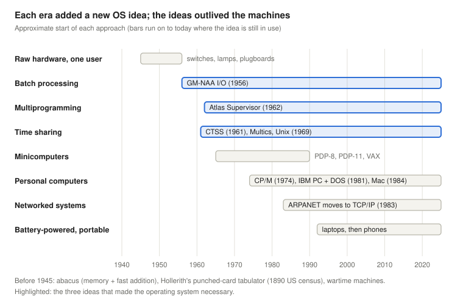
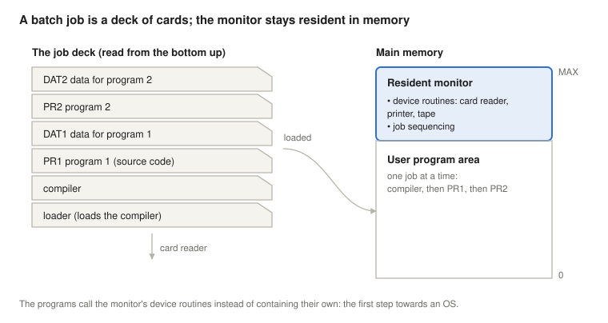
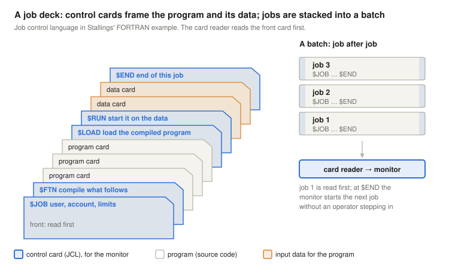
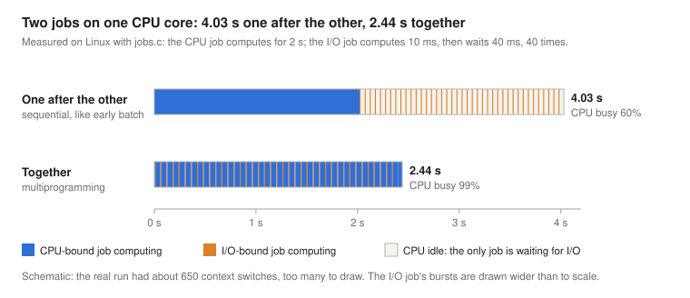
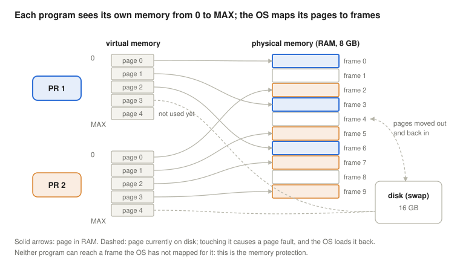
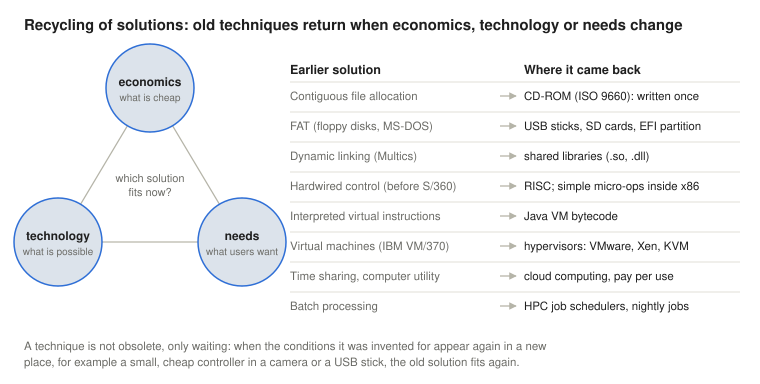
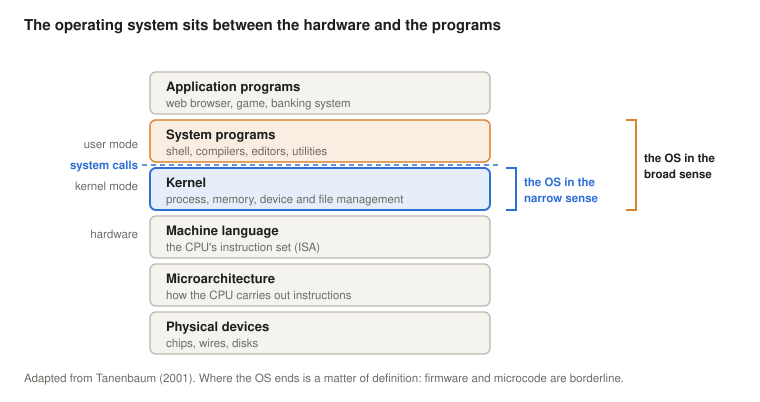

# Operating Systems Historic Evolution

*Operating Systems lecture: why operating systems exist, told as a chain of problems and solutions from punched cards to smartphones, with Linux (x86-64) demonstrations of each idea*

Next: [Quality, Commercial Aspects and the Enterprise Linux Ecosystem](../02-quality-and-enterprise-linux/).

> **How to read this lecture.** Wherever a new abbreviation or concept appears, a box marked **Explained simply** follows. Click it to open a plain-language explanation. You can skip these boxes if you already know the terms.

## Learning objectives

Almost every feature of a modern operating system was invented to remove a specific bottleneck of its time. This lecture follows those bottlenecks in order. Each step adds one piece to the operating system, and every piece is still there in the Linux, Windows, macOS or Android you use today.

By the end, students will be able to:

- define an operating system as a multiplexing, resource-managing virtual machine, explain why operating systems are hard to build, and state the trade-off between convenience, security and efficiency;
- explain how the relative cost of hardware and of people drove the history of operating systems;
- describe batch processing, the resident monitor, multiprogramming, virtual memory and time sharing, and the problem each one solved;
- explain why multiprogramming raises CPU utilisation, and calculate it from a timeline;
- define efficiency and the operating system's own overhead, and measure them;
- place Multics, Unix, minicomputers, CP/M and MS-DOS in this history, and explain why the first personal-computer systems gave up features that mainframes already had;
- tell the documented story of how MS-DOS and the graphical interface reached the market, and separate it from the legends;
- name four roles of an operating system and place the OS in the layers of a computer system;
- classify operating systems by licence, platform, interface, number of users and tasks, and kernel structure;
- explain, with examples, why old operating-system techniques return when economics, technology or needs change;
- find each historical idea on a running Linux system.

<details>
<summary><b>Explained simply:</b> operating system, bottleneck, Linux, Windows, macOS, Android, x86-64</summary>

- **Operating system (OS):** the program that manages a computer and lets other programs run on it. It decides which program may use the processor, keeps programs' memory apart, and talks to the hardware (disk, keyboard, network) on their behalf. Linux, Windows, macOS and Android are operating systems.
- **Bottleneck:** the narrowest point that slows everything down, like the neck of a bottle that limits how fast water can pour out.
- **x86-64:** the processor family in most PCs and laptops (Intel and AMD), in its 64-bit version.

</details>

## What an operating system is, and why it is hard

A short definition that the rest of the lecture fills in: **the operating system turns the machine into another machine, and one machine into many.**

- **Machine → another machine (abstraction).** The hardware offers numbered disk blocks, device registers and one processor. Programs see named files that can grow, processes that each seem to have a processor, and a private memory that starts at address 0. The machine the OS creates can be **completely different** from the real one: nothing on a disk looks like a folder, and nothing in a CPU looks like a process.
- **One machine → N machines (multiplexing).** Many programs and many users share the one real machine, in time (the CPU runs them in turn) and in space (each gets part of the memory and the disk), and each one feels it has a whole machine of its own.

Put together: the OS is a **multiplexing, resource-managing virtual machine**. The four roles [later in the lecture](#the-roles-of-an-operating-system) describe the same job in more detail.

**Why operating systems are hard.** An OS is one of the most difficult kinds of program to build, for reasons that add up:

- **Too big for one person.** A modern OS has millions of lines of code; the source tree of the Linux kernel alone has tens of millions, most of it device drivers. Nobody understands all of it, so it must be built from parts with clean interfaces.
- **A long lifetime.** Unix ideas date from 1969, and the Windows NT kernel from 1993. An OS lives for decades, must keep running old programs, and must adopt hardware that did not exist when it was designed.
- **Asynchronous events.** Devices, timers and the network interrupt the processor at any moment, between any two instructions. Bugs that depend on timing appear rarely and are hard to reproduce.
- **General purpose, for unknown users.** The OS is written before the programs that will run on it. It cannot be tuned for one program, and must stay fair and safe for programs it knows nothing about, including hostile ones.
- **If it stops, everything stops.** A bug in an application kills that application; a bug in the kernel stops every program on the machine.
- **It manages the most resources.** Processor time, memory, storage, devices, network and energy, with demands that conflict, and some of its problems (fair and fast scheduling for every goal at once, for example) have no perfect solution, only trade-offs.

**Why study them.** Few people write operating systems, but everybody depends on them, and their ideas are reused everywhere: caching, scheduling, virtualization, locking and logging come back in databases, web browsers, game engines and cloud platforms. Knowing what the OS does underneath is also what lets a programmer explain why a program is slow, or why it crashed.

<details>
<summary><b>Explained simply:</b> abstraction, multiplexing, virtual machine, asynchronous, line of code, kernel</summary>

- **Abstraction:** a simpler picture that hides the details, like a map instead of the landscape.
- **Multiplexing:** letting many users share one thing so that each seems to have it alone, like many phone calls sharing one cable.
- **Virtual machine:** here, the pretend machine that the OS shows to programs, nicer than the real one.
- **Asynchronous:** happening at unpredictable times, not in step with the program; like phone calls that can come at any moment while you are cooking.
- **Line of code:** one line of a program's text. A million lines would fill about 20,000 printed pages.
- **Kernel:** the core of the operating system, the part with full control of the hardware.

</details>

## Two forces behind the history

**The drive: the relative cost of hardware and of people.** For the first twenty years, a computer cost millions and filled a room, while the people using it were comparatively cheap. Everything was organised to keep the expensive machine busy, even if people had to wait. As hardware became cheaper and people's time became the more expensive resource, the priority turned around: now the machine should wait for people, not the other way round. Most turns in this history follow from that one change.

**The scope: which problems are solved with computers.** Early computers calculated: firing tables, census statistics, engineering problems. Later they kept records, connected people, played music and went into pockets. Every new kind of problem brought new demands on the operating system.

Throughout the history, three goals pull in different directions: **convenience** (the machine is easy to use and saves people's time), **security** (programs and users cannot harm each other) and **efficiency** (as much useful work as possible comes out of the machine). Each pair conflicts. Every protection mechanism costs some efficiency, and every shortcut that saves time opens a risk; a comfortable interface costs processor time and memory; and checks and passwords make a system safer but less convenient. No system can maximise all three, so every design chooses a balance.

Which goal wins depends on what is expensive at the time, so each era had one **dominant criterion**:

| Era | What was expensive | Dominant criterion |
| --- | --- | --- |
| batch era (steps I–VII) | the machine | utilisation: keep the CPU and the devices busy |
| time sharing (steps VIII–XI) | people's time | interactivity: response time, programmer productivity |
| personal computers (step XII) | the price for one buyer | low price, short time to market |
| networks and mobile devices (steps XIII–XIV) | damage from attacks, battery charge | security, energy |

**Efficiency, precisely.** In general, efficiency is the share of useful work in the total:

$$\eta = \frac{\text{useful work}}{\text{total work}}$$

For an operating system, the "useful work" is the time the CPU spends running the users' programs, and the rest is the OS's own work (its **overhead**):

$$\eta_{OS} = \frac{t_{user}}{t_{user} + t_{OS}}$$

An OS that makes the machine much easier to use but eats half its time ($\eta_{OS} = 0.5$, i.e. 50%) is a bad deal when the machine is expensive, and may be a good one when people's time is the expensive part. The Linux section shows how to measure $t_{user}$ and $t_{OS}$. The formula assumes that the time spent in the user's program is the useful part; that is usually, but not always, true.

<details>
<summary><b>Explained simply:</b> hardware, efficiency, security, overhead, CPU, η, convenience, trade-off, criterion</summary>

- **Hardware:** the physical parts of a computer: chips, wires, disks, screen. The programs are the **software**.
- **CPU** (Central Processing Unit), the **processor:** the chip that executes the programs' instructions, one small step after another.
- **Efficiency:** how much of the effort turns into useful result. A car engine that turns 30% of the fuel's energy into motion has an efficiency of 30%.
- **η** (the Greek letter eta): the usual symbol for efficiency.
- **Overhead:** work that has to be done but is not the work you actually wanted, like the time spent filling in forms before a doctor's appointment.
- **Security:** protection against harm, whether deliberate (an attacker) or accidental (a buggy program).
- **Convenience:** how easy and comfortable something is to use.
- **Trade-off:** a choice where getting more of one good thing means getting less of another, like speed and fuel use in a car.
- **Criterion** (plural: criteria): the measure by which something is judged.

</details>

## Before operating systems

The two basic ideas of a computer are older than electronics. An **abacus** already does both: it **remembers** numbers (the bead positions are a memory) and lets a trained user **add large numbers quickly**.

Machines started to process data in bulk for statistics. For the **1890 US census**, Herman Hollerith's tabulating machines read data from **punched cards**: each card held one person's answers as a pattern of holes, and the machine counted them electrically, far faster than clerks could by hand (U.S. Census Bureau, n.d.). Punched cards remained the main way to feed data and programs into computers until the 1970s.

**The Second World War** brought the first electronic computers, built for military goals with military resources: Colossus for codebreaking in Britain (1944), and ENIAC in the United States, designed during the war to calculate artillery firing tables and completed in late 1945.

ENIAC was programmed by setting switches and plugging cables, so changing the program took days. The decisive idea came from its own designers and from John von Neumann's 1945 report on its successor, the EDVAC: the **stored-program** principle, which keeps the **instructions in the same memory as the data** (Stallings, 2018). The first machine to run a stored program was the Manchester "Baby" in June 1948, and Cambridge's EDSAC (1949) was the first to offer it as a service to its users. The consequences reach into every later step of this history. Because a program is just data in memory, one program can **write or load another**: loaders, compilers and the operating system itself all depend on this. And because instructions can be changed like data, a program can even **modify its own code**; early machines without index registers did exactly this to step through an array. The same property is a security hole when the "data" comes from an attacker, which is why today's processors can mark memory as non-executable (NX), as the [fetch-execute lecture](../04-fetch-execute-cycle/#the-von-neumann-principle) shows.

**In the 1940s and early 1950s** there was no operating system at all. A programmer booked the whole machine for a period of time and operated it directly through **switches, push buttons and rows of lamps** on its front panel, or by rewiring **plugboards**. The machine was interactive, but for one user at a time, and the user interface *was* the raw hardware. This is the starting point of the history, **step 0**: a single user, the programmer at the console, debugging interactively, and an expensive machine that stood idle while the programmer thought. A famous episode from this era: in September 1947, the operators of the Harvard Mark II relay computer found a moth trapped in a relay and taped it into the logbook as the "first actual case of bug being found". The word *bug* for a fault is older (Edison used it in the 1870s); the joke was that this time it was a real insect.

<details>
<summary><b>Explained simply:</b> abacus, memory, census, punched card, tabulating machine, front panel, plugboard, Colossus, ENIAC, stored program, EDVAC, Manchester Baby, EDSAC, self-modifying code, index register, NX, relay, bug</summary>

- **Abacus:** a frame with beads on rods, used for calculating for thousands of years.
- **Memory:** the part of a computer that stores numbers so they can be used later.
- **Census:** counting a country's whole population and collecting data about them, done every ten years in the United States.
- **Punched card:** a stiff paper card in which holes are punched in fixed positions. A hole or no hole in a position stores one yes/no answer, or together with others, a digit or a letter. A program could be a box of hundreds of cards.
- **Tabulating machine:** a machine that reads punched cards and counts how many have a hole in each position.
- **Front panel:** the control board of an early computer, full of switches to enter numbers and lamps that showed what was stored inside.
- **Plugboard:** a board of sockets connected with cables; changing the cables changed what the machine did, a program made of wires.
- **Colossus, ENIAC:** two of the first electronic computers. Colossus helped break German codes (codebreaking: reading secret messages without the key); ENIAC calculated firing tables, the tables gunners used to aim artillery.
- **Stored program:** the program's instructions are kept in the computer's memory as numbers, next to the data, instead of being set with cables and switches. Changing the program is then as easy as loading new numbers.
- **EDVAC, Manchester Baby, EDSAC:** early stored-program computers in the United States and in England (Manchester and Cambridge) of the late 1940s.
- **Self-modifying code:** a program that changes its own instructions while it runs.
- **Index register:** a register that holds a number added to an address, so that the same instruction can reach element 1, 2, 3 … of a list.
- **NX** (No eXecute): a mark on a piece of memory that says "data only, never run it as instructions".
- **Relay:** an electrically operated switch with a moving metal contact. Early computers were built from thousands of them, and a moth could get stuck between the contacts.
- **Bug:** a fault in a program or machine. **Debugging** is finding and removing bugs.

</details>

## Fourteen steps, one operating system

From here, the history can be read as a sequence of problems, starting from step 0, the single programmer at the console. Each step solves the bottleneck of the previous one, and the solution becomes a permanent part of the operating system; many steps also create a new cost that a later step has to pay back. The order is logical rather than strictly chronological: many of these ideas appeared at almost the same time, in the late 1950s and early 1960s.



| Step | Problem | Solution | Still in today's OS |
| --- | --- | --- | --- |
| I | reading cards and starting the next program is slow | batch processing | background jobs, scripts |
| II | every program contains its own device code | a resident library of device routines | device drivers, system call interface |
| III | the machine is expensive and setting it up is slow | specialised staff (operators) | system administrators, automation |
| IV | the CPU gets faster, people cannot keep up | the batch monitor runs jobs automatically | job control, the loader |
| V | I/O is about 1000 times slower than the CPU | buffers and interrupts | interrupt handling, buffering |
| VI | programs are either CPU- or I/O-intensive | multiprogramming, context switch | the process scheduler |
| VII | programs share the memory | protection, virtual memory | virtual memory, paging |
| VIII | computers get cheaper, people's time matters | time sharing, many users at terminals | multi-user systems, remote login |
| IX | users wait for answers | preemptive scheduling | time slices |
| X | not all work is equally urgent | priority scheduling | priorities, `nice` |
| XI | data must outlive the program | file systems | file systems |
| XII | everyone can own a computer | minimal OS on minimal hardware | (the features came back) |
| XIII | computers are connected | networking | the network stack |
| XIV | computers are small and run on batteries | energy management | power management, energy-aware scheduling |

<details>
<summary><b>Explained simply:</b> batch, I/O, interrupt, buffer, multiprogramming, context switch, scheduler, paging, terminal, file system, driver</summary>

- **Batch:** a group of jobs collected and then run one after another without anybody stepping in, like a washing machine running a full load.
- **I/O** (Input/Output): everything a computer exchanges with the outside world: card readers, printers, disks, keyboards, the network.
- **Interrupt:** a signal that makes the processor pause its current program for a moment to deal with something urgent, like a doorbell. The [Interrupts](../05-interrupts/) lecture covers it in detail.
- **Buffer:** a small temporary storage area where data waits until someone collects it, like a mailbox.
- **Multiprogramming:** keeping several programs in memory at once, so that when one has to wait, the processor can work on another.
- **Context switch:** the processor stops running one program and starts running another. It saves the first one's state and loads the other's, like bookmarking one book and opening another.
- **Scheduler:** the part of the OS that decides which program gets the processor next.
- **Paging:** dividing memory into equal-sized pieces (pages) that the OS can place and move around independently.
- **Terminal:** a keyboard and a screen (earlier: a typewriter) connected to a distant computer. Many terminals can share one computer.
- **File system:** the way an OS organises data on a disk into named files and folders.
- **Device driver:** the piece of OS code that knows how to operate one particular kind of device.

</details>

## The batch era

### I. Slow cards and slow changeovers: batch processing

Reading a program from punched cards was slow, and so was the changeover between programs: one user's cards came out, the next user's went in, the next user set up the machine. While this happened, the very expensive CPU did nothing. The answer was **batch processing**: collect many jobs, and run them one after another with as little human handling in between as possible.

### II. Every program drives every device: the resident library

Every program needed to read cards, print results and write tape, and every programmer wrote that **device-handling code** again, for every program. The solution was a library of well-tested device routines kept permanently in memory (**resident**), usually at the top of the memory, which all programs could call. This library already had the main properties of a modern OS interface:

- it is an **abstract** interface (a program asks to "print this line" without knowing the printer's electronics), written and **optimised** once, by experts;
- it is **always available**, since it stays in memory between jobs;
- it is **standardised**, so programs written by different people use the devices in the same way;
- it solves the conflict between **incompatible devices** and **code sharing**: when a new printer arrives, only the library changes, and all programs keep working.

This shared, resident collection of device routines is the seed of the operating system.



### III. Expensive hardware, slow setup: specialised staff

The hardware, especially CPU time, was very expensive, and setting the machine up for each job was slow. Installations therefore hired **specialised staff**: programmers who wrote the programs, but did not touch the machine; **operators** who set it up, loaded the jobs and changed tapes; maintenance engineers; even people to clean the card readers. Operators, who did nothing else all day, set up and ran the machine faster and with fewer mistakes than programmers who used it now and then. The programmer handed in a deck of cards and came back hours (or a day) later for the printout.

### IV. Faster CPUs: the batch monitor

As CPUs became faster, even the operators could not keep up with them. The next step was to automate the operator's routine with a program, the **batch monitor**. A job became a deck of cards with everything needed in order: the **loader**, the **compiler**, the first program (PR1) and its data (DAT1), the next program (PR2) and its data (DAT2). The monitor read the deck and ran each part in turn, without a person stepping in.

One of the first such systems was **GM-NAA I/O**, written by General Motors Research and North American Aviation, and first used in production in 1956 on an IBM 704. It was designed to raise the number of jobs a machine could process per day (Computer History Museum Software Preservation Group, n.d.).

<details>
<summary><b>Explained simply:</b> resident, routine, library, abstract interface, optimised, standardised, operator, loader, compiler, FORTRAN, IBM 704, job</summary>

- **Resident:** staying permanently in memory, like a resident of a house, instead of being loaded only when needed.
- **Routine, subroutine:** a small piece of program that does one task and can be called (used) from other programs, for example "print this line".
- **Library:** a collection of such routines that many programs share.
- **Abstract interface:** a way to use something without knowing how it works inside, like a car's steering wheel: you don't need to know how the steering mechanism works to drive.
- **Optimised:** made as fast or as economical as possible.
- **Standardised:** done the same agreed way everywhere.
- **Operator:** a person employed to run the computer: loading jobs, mounting tapes, collecting printouts.
- **Loader:** the program that copies another program into memory and starts it.
- **Compiler:** a program that translates code written by people (for example in FORTRAN or C) into instructions the CPU understands.
- **FORTRAN:** one of the first programming languages (1957), made for scientific calculations.
- **IBM 704:** a large IBM computer of the mid-1950s, used by companies and research labs.
- **Job:** one unit of work handed in to the computer: a program together with its data and instructions about how to run it.

</details>

### What the monitor needed from the hardware

A batch monitor is only safe if the programs it runs cannot break it. Stallings (2018) lists the hardware features that batch monitors came to rely on, and every one of them is still in today's processors:

- **Memory protection:** a user program must not be able to change the memory area that holds the monitor.
- **A timer:** a job must not run forever. When its time is up, the timer interrupts it and the monitor takes back control.
- **Privileged instructions:** some instructions, above all the I/O instructions, may only be executed by the monitor. A program that wants to read a card must ask the monitor, which also stops one job from reading the next job's cards.
- **Interrupts:** these let the monitor regain control and let the CPU work while devices are busy (step V).

Together these features need two modes of operation: a **user mode** for the programs, with the restrictions, and a privileged **monitor mode** (today: kernel mode) for the monitor itself.

The monitor also needed to know what to do with each part of the deck. Special **control cards** told it, written in a **job control language (JCL)**. In Stallings' example, a FORTRAN job looks like this: `$JOB` starts the job, `$FTN` calls the FORTRAN compiler for the cards that follow, `$LOAD` loads the result, `$RUN` starts it on the data cards behind it, and `$END` closes the job. JCL was the ancestor of today's shell scripts. Several such decks, one job after the other, made up a batch:



### The price of batch: debugging offline

Batch processing made the machine efficient and the programmer inefficient. In step 0, a programmer at the console could stop the program, look at the lamps, change a value and try again within minutes. Now the programmer never touched the machine: a single wrong card cost a whole **turnaround**, hours or a day until the printout came back, often with nothing more than an error message or a **memory dump**, pages of numbers showing the memory at the moment of the crash. Programmers checked their code by hand at their desks before handing it in, and a bug that needed five attempts took a week. Debugging had gone **offline**.

As long as the machine was far more expensive than the programmers, this was the right trade. It is also the cost that a later step paid back: when people's time became the expensive resource, time sharing (step VIII) returned interactive work to the programmer. The designers of CTSS named exactly this, the long turnaround of batch work and the difficulty of debugging through it, as the reason for their system (Corbató et al., 1962).

<details>
<summary><b>Explained simply:</b> memory protection, timer, privileged instruction, user mode, monitor mode, control card, JCL, shell script, turnaround, memory dump, offline</summary>

- **Memory protection:** a hardware check that stops a program from touching memory that is not its own.
- **Timer:** a hardware clock that can interrupt the processor after a set time, like a kitchen timer.
- **Privileged instruction:** an instruction that only the operating system may use, like a key only the staff are given.
- **User mode / monitor mode:** two modes of the processor. In user mode the dangerous instructions are forbidden; in monitor (kernel) mode everything is allowed.
- **Control card, JCL** (Job Control Language): special punched cards that did not contain program or data, but instructions for the monitor: "compile this", "now run it".
- **Shell script:** a text file with a list of commands that the shell runs one after another, today's version of a job deck.
- **Turnaround:** the time from handing in a job until getting the result back.
- **Memory dump:** a printout of the contents of memory, usually made when a program crashes, for finding the error afterwards.
- **Offline:** here, away from the machine: the programmer worked on paper, not at the computer.

</details>

## The CPU waits for the devices

### V. I/O is a thousand times slower: buffers and interrupts

Electronic CPUs were roughly a thousand times faster than the mechanical card readers, printers and tapes, or more. While a program waited for a card to be read or a line to be printed, the CPU sat idle. Two inventions attacked this:

- **Buffers** let the device and the CPU work at their own pace: the device fills a buffer while the CPU works on something else, and the CPU empties it in one go.
- **Interrupts** let the device tell the CPU when the buffer is **full** (for input) or **empty** (for output), so the CPU no longer has to keep checking.

A third idea was to keep the slow devices away from the expensive computer altogether. In **offline I/O**, a small, cheap computer (such as the IBM 1401) copied the card decks onto magnetic tape, the big computer read the much faster tape, and the small one printed the results from tape. **Spooling** (Simultaneous Peripheral Operations On-Line) brought the same idea inside one machine: the OS copies input to the disk ahead of time and collects output there, so programs never wait for the card reader or printer directly. Later, **DMA** let devices copy whole blocks into memory without the CPU.

Handling interrupts, buffers and spooling became core tasks of the operating system. The [Interrupts](../05-interrupts/) lecture shows how much CPU time this saves.

### VI. CPU-bound and I/O-bound programs: multiprogramming

Programs differ. Some compute almost all the time (**CPU-bound**, or CPU-intensive); others mostly wait for devices (**I/O-bound**, or I/O-intensive). Run one after another, each leaves something idle: the CPU-bound program leaves the devices idle, the I/O-bound one leaves the CPU idle.

**Multiprogramming** keeps several programs in memory at once. When the running program has to wait for I/O, the OS saves its state and gives the CPU to another program: a **context switch**. The figure shows this measured on Linux, with one CPU-bound and one I/O-bound job on a single CPU core (the program and the numbers are in the Linux section):



Both jobs together need 2.4 seconds of CPU time. Run one after the other, they take 4.03 seconds, so the CPU is busy 2.4 / 4.03 = 60% of the time. Run together, they finish in 2.44 seconds, with the CPU busy 99% of the time, and nothing was made faster: the CPU was simply never left waiting.

Several computers of the early 1960s pioneered multiprogramming. The best known is **Atlas**, built by the University of Manchester and Ferranti. Designed from the late 1950s and commissioned in December 1962, its operating system, the **Atlas Supervisor**, ran several user programs at once and is considered by many the first recognisably modern operating system (IEEE, n.d.-a). It scheduled the programs (decided which one runs next), but also managed the memory, buffered the slow devices through its drum, and handled the jobs. From 1966, IBM's OS/360 brought multiprogramming to a whole family of commercial computers, in its MFT and (from 1967) MVT versions.

### VII. Programs share the memory: protection and virtual memory

With several programs in memory at once, a new danger appeared: a faulty program could overwrite another program's memory, or the operating system's. Shared memory **needs protection**. The simplest hardware answer is a pair of **base and limit registers**: the CPU checks every address a program uses against the start and the end of its own memory area. Atlas went much further. Its designers wanted to make a small fast memory and a large slow drum look like one big memory, so that programmers no longer had to shuffle data between them by hand, and the result, **virtual memory**, also gave each program a protected memory of its own (Kilburn et al., 1962; IEEE, n.d.-a). Every computer uses it today.



Each program sees its own, private memory, its **virtual memory**, running from address 0 to some maximum (MAX). This memory is divided into equal-sized **pages**. The real memory chips (the **physical memory**, 8 GB in the figure) are divided into **frames** of the same size. For each program, the OS keeps a table saying which of its pages is in which frame, and the hardware translates every address on the fly. This gives three things at once:

- **Protection:** a program can only reach frames the OS has mapped for it. PR1 simply has no way to name PR2's memory.
- **Flexibility:** a program's pages can be anywhere in physical memory, in any order, so the memory can be shared out in small pieces.
- **More memory than there is:** pages that are not needed right now can be moved out to disk (16 GB of **swap** in the figure) and brought back when the program touches them. On Atlas, the slow memory was a magnetic drum; the user saw "a very large fast memory".

<details>
<summary><b>Explained simply:</b> CPU-bound, I/O-bound, idle, utilisation, core, Atlas, Ferranti, page, frame, swap, drum, page fault, process, base and limit registers, spooling, DMA, OS/360</summary>

- **CPU-bound / I/O-bound:** a CPU-bound program is like a student solving maths problems: limited by thinking speed. An I/O-bound program is like a student waiting for books from the library: limited by delivery.
- **Idle:** doing nothing, waiting.
- **Utilisation:** the share of time something is busy. A CPU utilisation of 60% means it worked 60% of the time and waited 40%.
- **Core:** a modern processor chip contains several complete CPUs, called cores. The demonstration used only one, to be like a 1960s machine with one CPU.
- **Atlas, Ferranti:** Atlas was a British computer of the early 1960s, one of the most powerful of its time. Ferranti was the British electronics company that built it with the University of Manchester.
- **Virtual memory:** each program gets its own pretend memory, and the OS and hardware secretly decide where each piece really is. Like a hotel where every guest's key card says "room 1", but the front desk sends each guest to a different real room.
- **Page, frame:** a page is a fixed-size piece of a program's virtual memory (usually 4 KB today); a frame is a page-sized slot in the real memory chips.
- **Swap:** space on the disk where the OS parks pages that do not fit in the real memory.
- **Drum:** an early storage device, a rotating metal cylinder coated with magnetic material, slower but larger than the main memory.
- **GB** (gigabyte): about a billion bytes. A **byte** is 8 bits, enough to store one letter.
- **Page fault:** what happens when a program touches a page that is not in RAM right now: the hardware stops the program, the OS fetches the page from disk, and the program continues as if nothing had happened.
- **Process:** a running program, together with its memory and its state.
- **Base and limit registers:** two numbers the CPU holds for the running program: where its memory starts and how long it is. Any address outside is refused.
- **Offline I/O, spooling:** keeping the slow card readers and printers away from the expensive CPU, either on a separate small computer or by letting the OS stage the data on a fast disk.
- **DMA** (Direct Memory Access): a helper chip that copies data between a device and memory without the CPU.
- **OS/360, MFT, MVT:** IBM's operating system for its System/360 computers. MFT and MVT were its multiprogramming versions: Multiprogramming with a Fixed or a Variable number of Tasks.

</details>

## The first phase shift: people's time becomes expensive

By the mid-1960s, computers had become cheaper and more numerous, and the balance began to tip: the cost of people waiting for their printouts started to matter as much as the cost of the machine. The new goals were **ease of use** and **productivity**, still under the pressure of efficiency and now of security too, since many people used the same machine at once (**multi-user** systems).

### VIII. Time sharing

Instead of handing in cards and waiting hours, users sat at **terminals** connected to a central **host** computer, and the host switched between them so quickly that each user felt they had the machine to themselves. This is **time sharing**. MIT's CTSS (Compatible Time-Sharing System) was first demonstrated in November 1961 (Corbató et al., 1962; Multicians, n.d.).

Two pairs of terms are easy to mix up. **Batch** versus **interactive** is about the user: in batch work nobody waits at the machine, while in interactive work a person waits for each answer. **Multiprogramming** versus **time sharing** is about the goal: multiprogramming switches programs to keep the CPU busy (efficiency); time sharing switches them to keep every user's response fast (convenience). Time sharing is built on multiprogramming.

### IX. Response time: preemptive scheduling

Batch systems cared about how many jobs were done per day (**throughput**). A person at a terminal cares about how quickly the machine answers each command (**response time**). If one user's long calculation could keep the CPU until it finished, everyone else would wait. **Preemptive scheduling** solves this: a timer interrupt regularly takes the CPU away from the running program and lets the scheduler pick the next one, so each program gets a short **time slice** in turn.

### X. Priority scheduling

Not all work is equally urgent: a user waiting at a terminal should come before a long background calculation. **Priority scheduling** gives each program a priority, and the scheduler prefers the more important ones. Users are not all equal either: when the head of the department wants a fast answer, their jobs should not queue behind the students' homework. Next to priorities, shared systems therefore introduced **quotas**: limits on how much CPU time, disk space or printer paper a user or a job may consume, so that nobody can use up a shared resource. Linux still does both: priorities, as the `nice` demonstration below shows, and quotas through disk quotas and per-process resource limits (`ulimit`).

### XI. Persistent data: file systems

Once many users kept working on the same machine for months, their programs and data had to be stored permanently and found again by name: data must be **persistent**, outliving the program that created it. **File systems** organise the disk into named files and directories, and record who may read or change each one.

### Multics and Unix

The most ambitious time-sharing project was **Multics**, started in 1965 by MIT, General Electric and Bell Labs. It introduced many ideas still in use, from hierarchical file systems to protection rings, and MIT began offering service on it in the autumn of 1969 (Multicians, n.d.). But it was large and late, and in 1969 Bell Labs withdrew from the project.

At Bell Labs, Ken Thompson and Dennis Ritchie then wrote a much **simpler** system, at first on a small PDP-7 computer: **Unix** (its name is a pun on Multics). Unix kept the essentials (time sharing, a hierarchical file system, processes) in a small **kernel**, and moved everything else, even the command interpreter (the shell), into ordinary programs. In 1973 it was rewritten in the new programming language C, which made it easy to move to other computers (Ritchie & Thompson, 1974). Its simplicity was deliberate. Tom Van Vleck, a Multics developer, recalls that half of his Multics code was error recovery, and that Ritchie told him Unix had left all of that out: on a serious error, a routine called `panic()` simply stopped the machine, and someone restarted it (Van Vleck, n.d.). Linux's "kernel panic" message still carries that name.

<details>
<summary><b>Explained simply:</b> multi-user, host, CTSS, time sharing, throughput, response time, preemptive, time slice, priority, quota, persistent, directory, kernel, shell, Unix, C, MIT, Bell Labs, PDP-7, Multics, hierarchical file system, protection rings, kernel panic</summary>

- **Multi-user:** many people use the same computer at the same time, each with their own account.
- **Host:** the central computer that many terminals are connected to.
- **CTSS:** Compatible Time-Sharing System, an early time-sharing system at MIT.
- **Time sharing:** switching the processor between users so quickly that each one feels they have it alone, like a chess master playing 30 opponents at once, moving from board to board.
- **Throughput:** how much work is finished per hour or per day. **Response time:** how long one person waits for one answer.
- **Preemptive:** the OS can take the processor away from a program at any moment, without asking it.
- **Time slice:** the short turn a program gets before the next one comes, typically a few milliseconds.
- **Priority:** how urgent something is. An ambulance has priority over a delivery van.
- **Quota:** a fixed share that may not be exceeded, like a monthly data limit on a phone plan.
- **Persistent:** still there after the program ends or the computer is switched off.
- **Directory:** a folder that holds files and other folders.
- **Kernel:** the core of the operating system, the part with full control of the hardware.
- **Shell:** the program that reads the commands you type and runs them.
- **Unix:** an operating system from Bell Labs (1969). Linux and macOS are its descendants in design.
- **C:** a programming language created at Bell Labs around 1972 for writing Unix. Most operating systems are still written in it.
- **MIT, Bell Labs:** the Massachusetts Institute of Technology, a university; and the research laboratory of the American telephone company AT&T.
- **PDP-7:** a small computer of the 1960s made by Digital Equipment Corporation.
- **Multics:** Multiplexed Information and Computing Service, a large time-sharing system from 1965.
- **Hierarchical file system:** folders inside folders, like a family tree, instead of one long list of files.
- **Protection rings:** levels of privilege, from the most trusted (the kernel, ring 0) outwards to the least trusted (user programs).
- **Kernel panic:** the kernel stops the whole computer because it found an error it cannot safely recover from.

</details>

### Minicomputers

Between the room-sized mainframes and the personal computer lies an era that many short histories skip: the **minicomputer**. In 1965, Digital Equipment Corporation (DEC) introduced the PDP-8, a small computer for about 18,000 dollars, cheap enough for a single laboratory or department (Information Processing Society of Japan, n.d.). DEC's later 16-bit PDP-11 family (1970) became the home of Unix, and DEC's 32-bit VAX (1977) ran the VMS operating system, with virtual memory and time sharing. Minicomputers brought interactive computing to many more people, and their operating systems were the direct models for the early personal-computer systems. From around 1980, machines built around a single-chip **microprocessor** began to take their place, and by the 1990s most minicomputer makers had gone.

<details>
<summary><b>Explained simply:</b> mainframe, minicomputer, DEC, PDP-8, PDP-11, VAX, VMS, microprocessor</summary>

- **Mainframe:** a large, very expensive central computer, run by a computing centre for a whole company or university.
- **Minicomputer:** a smaller and much cheaper computer, about the size of a fridge or a cupboard, bought by one department or lab.
- **DEC, PDP-8, PDP-11, VAX:** Digital Equipment Corporation, the leading minicomputer maker, and three of its famous computer families.
- **VMS:** the operating system of the VAX, an important commercial multi-user system.
- **Microprocessor:** a complete CPU on a single chip. It made computers small and cheap enough for one person to own.

</details>

## The second phase shift: everyone can own one

### XII. Personal computers: a step back

In the late 1970s and 1980s, computers became so cheap that one person could own one. The goals changed again: a low **initial cost** and a short **time to market** mattered more than anything else. The IBM PC, announced in August 1981, cost 1,565 dollars in its basic version, with 16 KB of memory, no disk drive and a connection for a cassette recorder; a usable system with a monitor and a 160 KB floppy disk drive, needed to run DOS, cost about 3,000 dollars ("IBM Personal Computer," n.d.). Its usual operating system was **DOS** (PC DOS from IBM, MS-DOS from Microsoft), based on 86-DOS, written by Tim Paterson at Seattle Computer Products (Necasek, n.d.). How DOS, and not the established system of the time, ended up on the IBM PC is one of the most retold stories in computing, and it is worth telling with care, because the popular version is partly legend.

**CP/M, the first personal-computer OS.** In 1974, Gary Kildall, who had earned a PhD in computer science at the University of Washington, demonstrated the first working version of **CP/M** (Control Program for Microcomputers) in Pacific Grove, California. Its key idea was to put all the hardware-specific code into a small separate part, the **BIOS** (Basic Input/Output System). To move CP/M to a new computer, a manufacturer only had to write a new BIOS, and all CP/M programs ran unchanged (IEEE, n.d.-b). This is step II again, and the fast-food franchise role of the OS: the same programs and the same experience on machines from dozens of manufacturers. By 1980, CP/M, sold by Kildall's company Digital Research (DRI), was the standard operating system of small computers.

**IBM, CP/M and "QDOS".** In 1980, IBM was building its personal computer in a hurry and needed an operating system for it. IBM had already contracted Microsoft for its BASIC programming language. In August 1980, IBM approached Digital Research about a CP/M version for the PC's Intel 8088 processor (a member of the 8086 family) (Shustek, 2014). Here the legend begins, retold in many popular accounts and some textbooks: Kildall, it is told, went flying in his plane instead of meeting IBM, and so lost the deal of the century. The record is less dramatic. Kildall did fly that day, with a colleague, to deliver software to a customer, and left the first meeting to his wife and business partner, Dorothy McEwen. On their lawyer's advice, she declined to sign IBM's very broad non-disclosure agreement before Kildall had seen it. Accounts differ on whether Kildall met the IBM team later that day. The deeper disagreements were about money and time: DRI wanted a royalty on every copy sold, IBM wanted to pay once, and the 16-bit CP/M-86 was late ("Gary Kildall," n.d.).

IBM then asked Microsoft to find an operating system. Microsoft licensed **86-DOS**, nicknamed **QDOS** ("Quick and Dirty Operating System"), from Seattle Computer Products in December 1980 for 25,000 dollars, and in the summer of 1981 bought all rights to it for another 50,000 dollars; its author, Tim Paterson, joined Microsoft (Shustek, 2014). It became PC DOS on IBM's machines, for 40 dollars a copy. When CP/M-86 finally appeared for the IBM PC some months later, it cost 240 dollars, and it sold poorly ("Gary Kildall," n.d.).

Kildall maintained for the rest of his life that DOS was a copy of CP/M. QDOS deliberately reproduced CP/M's system-call interface and used similar commands, so that CP/M programs could be converted easily, and this is what Kildall regarded as copying. But its internals and its file storage format were different, and a forensic comparison of the source code by Bob Zeidman found no copied code (Shustek, 2014). The decisive move came in the contract: Microsoft kept the right to license MS-DOS to other manufacturers. When other companies built IBM-compatible "clone" PCs, they all bought MS-DOS from Microsoft, which made it the dominant software company of the next decades. The lesson for an OS course: the most widely used operating system of the 1980s won through timing, price and licensing, not through technical superiority.

**The graphical interface: Xerox, Apple and Microsoft.** The windows-icons-mouse interface was developed in the 1970s at Xerox's Palo Alto Research Center (PARC), building on Douglas Engelbart's 1960s work at the Stanford Research Institute (SRI), where the mouse was invented. PARC built it on the Alto computer (1973), together with the Ethernet network and the Smalltalk programming system. In December 1979, Steve Jobs visited PARC twice. The visits were part of a deal: Xerox's venture arm was allowed to buy 100,000 Apple shares before Apple went public, at 10.50 dollars a share, on condition that Apple's people were shown PARC's work (Living Computers: Museum + Labs, 2020). Apple hired several PARC researchers, among them Larry Tesler, and brought the ideas to market in the Lisa (1983) and the **Macintosh** (1984).

The popular story calls this "Apple's theft from Xerox". The facts are more nuanced: the visits were arranged and paid for with the share deal, Apple took no code or hardware, the GUI ideas had been shown to many visitors and published, and Apple's Lisa project had started before the visits. What Apple took was the ideas and the proof that they worked, and it then implemented them in its own way on much cheaper hardware. When Xerox finally sued Apple in 1989, the court dismissed the case in 1990, partly because Xerox had waited too long ("Apple Computer, Inc. v. Microsoft Corp.," n.d.).

**Gates and Jobs.** Microsoft was one of the first companies to write application programs for the Macintosh, and so saw it long before its launch. In November 1983, Microsoft announced its own graphical system, **Windows**. Andy Hertzfeld, a member of the Macintosh team, recalls that Jobs summoned Gates to Apple and accused him of ripping Apple off. Gates replied that they both had a rich neighbour named Xerox: he had broken into the house to steal the TV set, only to find that Jobs had already stolen it (Hertzfeld, n.d.). In 1985, Apple granted Microsoft a license for some visual elements of the Mac for Windows 1.0. When Windows 2.0 (1987) went further, Apple sued Microsoft in 1988 over the "look and feel" of the Macintosh. Apple lost: in 1992 and on appeal in 1994, the courts found that most of the disputed elements were covered by the 1985 license, and that the basic ideas of a graphical interface (windows, icons, menus) could not be protected; only close copying of specific designs could infringe ("Apple Computer, Inc. v. Microsoft Corp.," n.d.). For operating systems this was a lasting decision: the GUI became a common good that every OS could adopt, and today it is part of the operating system in the broad sense.

To fit such **minimal hardware**, DOS left out almost everything the mainframes had developed over twenty years:

- little memory, and no virtual memory or memory protection;
- in its first version, floppy disks only, with no support for hard disks;
- one user, and one program at a time: no multi-user operation and no multiprogramming;
- no priorities, no preemption, no time sharing.

In the terms of this lecture, the operating system **fell back to a shared subroutine library**, step II again: a set of routines for the disk, the screen and the keyboard, which programs could use, or bypass and drive the hardware directly. Any program could overwrite any memory, and a crash of one program brought down the whole machine. Over the next twenty years, the old features came back to personal computers one by one, until, around 2000, ordinary PCs ran systems with protected memory, preemptive multitasking and multiple users: Linux (from 1991), the Windows NT family (from 1993, for home users with Windows XP in 2001) and Mac OS X (2001), just as Atlas, Multics and Unix had offered decades earlier. Personal computers did add something new of their own: the **graphical user interface**, with windows, icons and a mouse, developed at Xerox PARC in the 1970s and brought to the mass market by the Apple Macintosh (1984) and Microsoft Windows.

### XIII. Networks

From the 1980s, and for everyone from the 1990s, computers were connected to each other. The OS gained a **network stack**, and with it a new kind of exposure: an attacker no longer needed to sit at the machine. Security, which once meant keeping users of one computer apart, now meant defending every connected computer against the whole world; the Morris worm of 1988, which spread across thousands of Internet computers in a day, made this painfully clear. Linux itself was created in 1991 by Linus Torvalds and developed over the Internet by volunteers.

### XIV. Small and portable

Laptops, and later phones and tablets (the iPhone in 2007, Android in 2008, which runs a Linux kernel), brought a constraint that mainframes never had: **battery life**. Power management became an OS task on laptops in the 1990s, and on phones it became central. The OS now also manages **energy consumption**: it switches off unused parts of the hardware, slows the CPU down when full speed is not needed, and decides which programs may run in the background at all. Efficiency got a new meaning: useful work per unit of energy.

<details>
<summary><b>Explained simply:</b> initial cost, time to market, KB, floppy disk, DOS, MS-DOS, multitasking, GUI, network stack, battery life, CP/M, BIOS, PhD, DRI, SCP, BASIC, 8086/8088, Engelbart, NDA, royalty, license, compatible, clone, Xerox PARC, Alto, Ethernet, Smalltalk, shares, Lisa, Macintosh, look and feel</summary>

- **Initial cost:** the price you pay to buy something at the start. **Time to market:** how quickly a product can be made and put on sale.
- **KB** (kilobyte): about a thousand bytes, enough for about half a page of plain text. 16 KB is roughly a million times less than a modern phone's memory.
- **Graphical user interface (GUI):** using a computer through windows, icons and a mouse pointer instead of typed commands.
- **Floppy disk:** a thin, flexible magnetic disk in a plastic sleeve, the main way to store and carry data on early personal computers.
- **DOS** (Disk Operating System), **MS-DOS:** the operating system of the early IBM-compatible personal computers. MS = Microsoft.
- **Multitasking:** running several programs at the same time; on personal computers the word meant the same as multiprogramming.
- **Network stack:** the part of the OS that sends and receives data over a network, built in layers stacked on top of each other.
- **Linux:** a free, Unix-like operating system started in 1991. It runs most servers, Android phones and many other devices.
- **Battery life:** how long a device runs before it needs charging.
- **CP/M** (Control Program for Microcomputers): the leading operating system of small computers in the late 1970s.
- **BIOS** (Basic Input/Output System): the small, hardware-specific part of CP/M (and later of every PC) that talks to the actual devices. Swap the BIOS, and the rest of the OS works on a new machine.
- **PhD:** the highest university degree, earned with several years of original research.
- **Digital Research (DRI), Seattle Computer Products (SCP), Microsoft:** software and hardware companies of the time. Microsoft was then a small company selling programming languages.
- **BASIC:** a simple programming language that most early personal computers came with.
- **Intel 8086/8088:** the 16-bit microprocessor family used in the IBM PC (which used the 8088 version); today's x86 processors descend from it.
- **Douglas Engelbart, SRI:** an American engineer who, at the Stanford Research Institute in the 1960s, invented the mouse and demonstrated windows, hypertext and video conferencing in 1968.
- **Non-disclosure agreement (NDA):** a contract in which you promise to keep secret what you are told.
- **Royalty, license:** a license is permission to use or sell something; a royalty is a fee paid for every copy sold, instead of one fixed price.
- **Compatible:** working the same way from the outside, so that the same programs can run, even if the inside is different.
- **Clone:** a computer built by another company to work exactly like the original, here the IBM PC.
- **Xerox PARC, Alto:** Xerox's research lab in Palo Alto, California, and its experimental computer with a graphical screen and a mouse.
- **Ethernet:** the technology for connecting computers in a local network, still used today in cabled networks.
- **Smalltalk:** an early object-oriented programming language and environment from PARC.
- **Shares, going public:** a share is a small piece of ownership of a company. "Going public" means its shares are offered for sale on the stock market for the first time.
- **Lisa, Macintosh:** Apple's first two computers with a graphical interface. The Lisa was expensive and failed; the Macintosh became a classic.
- **"Look and feel":** how a program appears and behaves on screen. Apple claimed that the overall look and feel of the Mac was protected; the courts disagreed.

</details>

### After the fourteen steps

The story did not stop with phones. Three later turns are taken up in later lectures (containers in the [next one](../02-quality-and-enterprise-linux/#container-images-the-family-in-containers)): **virtualization**, running whole operating systems as programs on top of another (pioneered by IBM in the late 1960s and on VM/370 in 1972, and brought to PCs by VMware around 1999); **cloud computing** and **containers**, which rent out virtualized machines and isolated application packages by the hour; and **multicore** processors (from around 2005), which turned every PC and phone into a multiprocessor.

Alongside the main line of this history, specialised kinds of operating systems developed. **Real-time operating systems** guarantee that tasks finish within fixed deadlines, for example in industrial controllers or a car's braking system. **Embedded systems** run inside devices that do not look like computers at all, from washing machines to routers; most computers in the world today are embedded. **Distributed systems** make many computers connected by a network work together as if they were one.

<details>
<summary><b>Explained simply:</b> virtualization, cloud, container, multicore, real-time OS, embedded system, distributed system</summary>

- **Virtualization:** software that makes one real computer behave like several separate computers, each running its own operating system.
- **Cloud computing:** using computers in someone else's data centre over the Internet, paying for what you use.
- **Container:** a lightweight package that holds an application with everything it needs, kept separate from the other applications on the same OS.
- **Multicore:** a processor chip with several complete CPUs (cores) on it.
- **Real-time OS:** an OS that guarantees that tasks finish on time, every time, not just quickly on average.
- **Embedded system:** a computer built into another device to control it, often with a very small OS of its own.
- **Distributed system:** many computers on a network that cooperate and look like one system to the user, as in a search engine's data centres.

</details>

## Recycling of solutions

Personal computers showed that the history does not only move forward: MS-DOS fell back to step II, and the old features returned one by one. This is a general pattern. Operating-system techniques are rarely thrown away for good; they wait until the conditions they were invented for appear again, often in a new kind of device. Three forces decide which solution fits at a given time: **economics** (what is cheap and what is expensive), **technology** (what can be built) and **needs** (what users and programs require). When one of them changes, an old solution can become the right one again.



- **FAT on memory cards.** The File Allocation Table file system of floppy disks and MS-DOS is primitive by today's standards, but it is simple enough for the tiny controller of a camera, a car radio or a TV, and every OS can read it. Its descendants FAT32 and exFAT are therefore the standard file systems of USB sticks and SD cards, and the EFI system partition from which a PC boots is FAT as well. The [file systems lecture](../09-file-systems/) describes how FAT works.
- **Contiguous allocation on CD-ROM.** Storing each file in one unbroken run of blocks was the simplest early allocation method, and it was abandoned on disks because files grow and the free space fragments. A CD-ROM is written once and never changes, so neither problem exists, and its ISO 9660 file system stores each file contiguously: the fastest layout to read.
- **Dynamic linking.** Multics linked a program to the routines it called at run time, when they were first used, and shared one copy of a routine among all users (Daley & Dennis, 1968). Unix systems first used static linking, which copied the libraries into every program. When graphical environments such as the X Window System brought very large libraries, shared libraries returned in the late 1980s, and today almost every program uses them (the [`ldd` demonstration](#step-ii-today-the-shared-library) in the Linux section).
- **Microprogrammed or hardwired control.** IBM's System/360 (1964) used microcode, a small interpreter inside the CPU, in most of its models, so that one instruction set could run on cheap and expensive machines alike, and microprogrammed complex instruction sets (CISC) dominated the 1970s. When compilers improved and chips could hold more, the RISC designs of the 1980s went back to simple hardwired instructions (Patterson & Ditzel, 1980). Today's x86 processors combine both: they translate their CISC instructions into simple micro-operations inside the chip.
- **Interpreters and virtual instruction sets.** The same idea one level up: the Java virtual machine (1995) runs a portable bytecode on any processor, as microcode runs one instruction set on different hardware.
- **Virtual machines.** IBM's CP-67 and VM/370 (1972) gave every user a complete virtual copy of the mainframe; Popek and Goldberg (1974) stated the conditions a processor must meet for this. PCs did not meet them, and virtual machines disappeared from view until VMware (1999) and Xen (2003) brought them back with software techniques; hardware support in the processors themselves followed (Intel VT-x, AMD-V, 2005–2006), and KVM (2007) is built on it. Today they carry the cloud.
- **Time sharing and the computer utility.** The 1960s dream of computing sold like electricity, from a central machine to many users, faded when everyone got a PC; it returned as cloud computing, where one pays for processor time and storage by use.
- **Batch processing.** Supercomputer centres run their work as batch jobs in queues managed by job schedulers such as Slurm, and companies run nightly batch jobs for billing and backups, because for long, non-interactive work utilisation is again what matters.

For an engineer, the lesson is practical: before declaring a technique obsolete, ask which of its conditions no longer hold, and whether they could hold again somewhere else.

<details>
<summary><b>Explained simply:</b> FAT, exFAT, SD card, EFI system partition, contiguous allocation, ISO 9660, dynamic and static linking, X Window System, microcode, CISC, RISC, micro-operation, bytecode, Java VM, hypervisor, VT-x, AMD-V, Slurm</summary>

- **FAT, FAT32, exFAT:** a family of simple file systems from the floppy-disk era, still used on memory cards because every device understands them.
- **SD card:** the small memory card in cameras and some phones.
- **EFI system partition:** a small area on a PC's disk that holds the programs which start the operating system.
- **Contiguous allocation:** storing a file in one unbroken run of blocks, like seats for a group all in one row.
- **ISO 9660:** the standard file system of CD-ROMs.
- **Static / dynamic linking:** with static linking, the library routines are copied into every program; with dynamic linking, programs find and share one copy of the library when they run.
- **X Window System:** the classic graphical system of Unix, which draws windows on the screen.
- **Microcode:** tiny programs inside a processor that carry out its more complicated instructions step by step.
- **CISC / RISC:** Complex / Reduced Instruction Set Computer. A CISC processor has many powerful instructions; a RISC processor has fewer, simpler ones that run very fast.
- **Micro-operation:** one of the simple internal steps into which a modern x86 processor breaks each instruction.
- **Bytecode, Java VM:** bytecode is a made-up machine language that no real processor runs; the Java virtual machine is the program that runs it on any real computer.
- **Hypervisor:** the software that runs virtual machines, each with its own operating system. **VT-x, AMD-V:** the processor features that help it.
- **Slurm:** a widely used program that queues and schedules jobs on supercomputers.

</details>

## Reading this lecture with the textbooks

This lecture tells the history as a chain of problems and solutions. The standard textbooks tell the same story in other frames, so students reading them side by side can use this map:

| This lecture | Tanenbaum & Bos (2015): generations | Stallings (2018): stages of evolution |
| --- | --- | --- |
| Before operating systems | 1st generation (1945–55): vacuum tubes | serial processing |
| Steps I–IV: batch, resident library, batch monitor | 2nd generation (1955–65): transistors and batch systems | simple batch systems |
| Steps V–VII: buffers, interrupts, multiprogramming, virtual memory | 3rd generation (1965–80): integrated circuits and multiprogramming | multiprogrammed batch systems |
| Steps VIII–XI, Multics, Unix, minicomputers | 3rd generation (time sharing, MULTICS, UNIX) | time-sharing systems |
| Step XII: personal computers, CP/M, DOS, the GUI | 4th generation (1980–present): personal computers | (later chapters) |
| Step XIII: networks | 4th generation (1980–present) | (later chapters) |
| Step XIV: small and portable | 5th generation (1990–present): mobile computers | (later chapters) |

Tanenbaum's generations show a link that this lecture keeps in the background: each new hardware technology made the next OS idea affordable. Reliable **transistors** made computers dependable enough to sell and to run batch systems on; **integrated circuits** made families of compatible machines (IBM System/360) and cheap minicomputers possible; and the **microprocessor** (Intel 4004, 1971) put a whole CPU on one chip and made the personal computer possible. Anderson and Dahlin (2014) tell the history through the same driving force as this lecture, the falling cost of hardware relative to people.

<details>
<summary><b>Explained simply:</b> vacuum tube, transistor, integrated circuit, generation, serial processing</summary>

- **Vacuum tube:** an early electronic switch, a glass bulb like a small light bulb. Thousands were needed for one computer, and they burned out often.
- **Transistor:** a tiny electronic switch made of semiconductor material, invented in 1947. It replaced the vacuum tube: smaller, cheaper, cooler and far more reliable.
- **Integrated circuit (chip):** many transistors made together on one small piece of silicon. Today a single chip can hold billions.
- **Generation:** here, a period of computing defined by the main hardware technology of the time.
- **Serial processing:** Stallings' name for the earliest era, when users took turns using the machine directly, one after another, with no operating system.

</details>

## The roles of an operating system

Looking back over the fourteen steps, the operating system plays four roles:

| Role | What it does | Steps where it appeared |
| --- | --- | --- |
| **Magician** | creates an abstract, virtual machine on top of the raw hardware: every program sees "its own" memory, "its own" CPU, simple named files instead of numbered disk blocks | II, VII, XI |
| **Conductor** | allocates the resources (CPU time, memory, devices) and schedules who runs when, so that all parts play together | IV, V, VI, IX, X |
| **Fast-food franchise** | gives the same experience in different environments: a program written for the OS runs on very different hardware, as a burger tastes the same in every branch | II, the portability of Unix |
| **Security guard** | protects shared resources: keeps programs and users from harming each other (security) and keeps the system working when something fails (safety) | VII, VIII, XIII, XIV |

The magician is the first half of the definition at the start of the lecture (one machine turned into another), and the conductor the second (one machine turned into many). A widely used textbook describes the same jobs with three roles: the OS as **illusionist** (our magician), **referee** (our conductor and security guard) and **glue** (the shared services that give every program the same experience) (Anderson & Dahlin, 2014).

<details>
<summary><b>Explained simply:</b> resource, allocate, virtual machine, portability, safety</summary>

- **Resource:** anything programs need and must share: processor time, memory, disk space, the printer, the network.
- **Allocate:** to share out, to decide who gets how much.
- **Virtual machine:** a pretend computer created by software. Here it means the "machine" a program sees, with its own memory and simple commands, which does not exist as such: the OS creates the illusion. (The same words are also used for a whole simulated computer running another OS, as in the Linux section; the idea is the same, one level up.)
- **Portability:** a program is portable if it can be moved to a different computer and still work.
- **Security vs safety:** security protects against people who want to do harm; safety protects against accidents and failures.

</details>

## Where the operating system sits



A computer system can be described as layers, each using the one below it (adapted from Tanenbaum, 2001). At the bottom are the **physical devices**; above them the **microarchitecture**, the circuits that carry out the instructions; then the **machine language**, the instruction set that programs see. The **kernel** runs directly on this machine language, in the processor's privileged **kernel mode**. Above it, **system programs** (shell, compilers, editors, utilities) and **application programs** run in the restricted **user mode**, and reach the kernel only through **system calls**.

Where exactly the operating system ends is a matter of definition. In the narrow sense, the OS is the kernel. In the broad sense, as people use the word for "Windows" or "Android", it also includes the system programs that come with it. Firmware in the hardware, which starts the computer and sometimes manages devices, is a borderline case.

<details>
<summary><b>Explained simply:</b> layer, microarchitecture, machine language, instruction set, kernel mode, user mode, system call, firmware, utility</summary>

- **Layer:** a level that is built on the one below it and hides its details from the one above it, like the floors of a building.
- **Microarchitecture:** how a particular processor is built inside to carry out its instructions. Two processors can understand the same instructions but be built very differently.
- **Machine language, instruction set, ISA:** the list of basic instructions a processor understands, as numbers (ISA = Instruction Set Architecture). Everything else is eventually translated into these.
- **Microcode:** a layer of tiny programs inside some processors that carry out the more complicated instructions step by step.
- **Kernel mode / user mode:** two modes of the processor. In kernel mode everything is allowed; in user mode, dangerous instructions and other programs' memory are off limits. Ordinary programs run in user mode.
- **System call:** a program's request to the kernel to do something it may not do itself, for example "read this file" or "send this over the network".
- **Firmware:** software built permanently into a piece of hardware, for example the program that starts a computer when it is switched on.
- **Utility:** a small helper program, for example one that copies files or shows the free disk space.

</details>

## Classifying operating systems

Operating systems can be grouped along several independent axes:

- **Licence:** open source (Linux, FreeBSD, the Android Open Source Project), whose source code anyone may read, change and redistribute, or proprietary (Windows, iOS), whose source the vendor keeps closed. Mixtures exist: the core of macOS (Darwin) is open source, the rest is not.
- **Platform:** mainframe, server, desktop, mobile, embedded or real-time; the platform decides what matters most, from throughput on a server to battery life on a phone and guaranteed deadlines in a car.
- **Interface:** command line (CLI) or graphical (GUI). Most systems offer both; servers are usually run through the command line.
- **Users and tasks:** whether several users can work at the same time, and whether several programs can run at the same time.
- **Kernel structure:** monolithic, microkernel or hybrid (below).

The two "how many" axes give a small table, with one corner practically empty:

| | one task at a time | many tasks at a time |
| --- | --- | --- |
| **one user** | CP/M, MS-DOS | Windows 95/98, classic Mac OS, a phone in everyday use |
| **many users at the same time** | (practically empty) | Unix, Linux, the Windows NT family |

Several users working at the same time need several programs running at the same time, at least one for each of them, so a multi-user, single-task system makes little sense; a batch monitor that runs the jobs of many users one after the other is single-user at any given moment. Note that "single-user" describes how a system is used, not what it can do: Android and iOS run many processes and use separate user IDs to keep apps apart, but serve one person at a time.

**Kernel structure.** In a **monolithic kernel**, all OS services (process and memory management, file systems, the network stack, device drivers) run together in kernel mode, in one address space. Calls between them are ordinary function calls, so it is fast, but a bug in any driver can crash the whole system. Unix and Linux are monolithic; Linux adds **loadable modules**, so drivers can be loaded and unloaded while the system runs, but a loaded module still runs inside the kernel. A **microkernel** keeps only the minimum in kernel mode (address spaces, threads, message passing between processes) and runs drivers and file systems as ordinary processes in user mode. A crashed driver can then be restarted, and the small kernel is easier to verify, at the price of more messages and context switches. Minix 3, QNX (common in cars and industrial devices) and seL4, whose correctness has been formally proved (Klein et al., 2009), are microkernels. **Hybrid kernels** start from a microkernel design but run most services in kernel mode for speed: the Windows NT kernel, and XNU, the kernel of macOS and iOS, which joins the Mach microkernel and parts of BSD Unix in one address space (Tanenbaum & Bos, 2015).

<details>
<summary><b>Explained simply:</b> open source, proprietary, platform, embedded, monolithic kernel, loadable module, microkernel, hybrid kernel, address space, message passing, formal verification, Minix, QNX, seL4, XNU, Mach, BSD</summary>

- **Open source:** software whose source code is published, and which anyone may study, change and share. **Proprietary:** owned by a company that keeps the source code secret.
- **Platform:** the kind of machine an OS is made for: a server, a desktop, a phone, a washing machine.
- **Monolithic kernel:** the whole OS core is one big program that runs with full rights. Fast, but one faulty part can bring everything down.
- **Loadable module:** a piece of the kernel, usually a driver, that can be added or removed while the system is running, like a plug-in.
- **Microkernel:** a very small kernel that does only the essentials; everything else runs as separate programs that send each other messages. Like a manager who delegates almost everything.
- **Hybrid kernel:** a mixture of the two.
- **Address space:** the range of memory addresses a program can use.
- **Message passing:** programs cooperate by sending each other messages instead of calling each other's code directly.
- **Formal verification:** proving mathematically that a program does exactly what its specification says.
- **Minix, QNX, seL4:** microkernel operating systems: Minix for teaching (Linux was started on it), QNX for cars and machines, seL4 for systems that must be provably secure.
- **XNU, Mach, BSD:** XNU is Apple's kernel; Mach is a microkernel from Carnegie Mellon University; BSD is a version of Unix from the University of California, Berkeley.

</details>

## The same ideas on Linux (x86-64)

Each historical step is still visible in a modern Linux system. All outputs below come from a real system (kernel 6.18, 2 CPU cores, 8 GB of memory, running as a virtual machine in a cloud data centre); numbers will differ on yours.

<details>
<summary><b>Explained simply:</b> console, command, gcc, Bash, C program, virtual machine</summary>

- **Console** (terminal): a window where you type commands as text. In the examples, lines starting with `$` are what you type; the other lines are the computer's answer.
- **gcc:** the compiler that translates a C program (a `.c` file) into a program the computer can run.
- **Bash:** the most common shell on Linux, the program that reads and runs the commands you type.
- **Virtual machine:** a computer simulated by software on a bigger computer, sharing its real hardware with others.

</details>

### Step II today: the shared library

The resident library of device routines lives on as the **C library**, which almost every program shares. `ldd` lists the libraries a program uses:

```console
$ ldd /bin/ls
	linux-vdso.so.1 (0x00007fc81eff7000)
	libselinux.so.1 => /lib/x86_64-linux-gnu/libselinux.so.1 (0x00007fc81ef8f000)
	libc.so.6 => /lib/x86_64-linux-gnu/libc.so.6 (0x00007fc81ec00000)
	libpcre2-8.so.0 => /lib/x86_64-linux-gnu/libpcre2-8.so.0 (0x00007fc81eef5000)
	/lib64/ld-linux-x86-64.so.2 (0x00007fc81eff9000)
```

`libc.so.6` is the C library. It is loaded into memory once and shared by all programs that use it, just like the resident library of the 1950s. The difference is that today the library does not touch the devices itself: it asks the kernel, through system calls.

### Step VI today: multiprogramming, measured

`jobs.c` contains the two kinds of program from step VI: a CPU-bound job that computes for 2 seconds, and an I/O-bound job that computes for 10 ms and then waits for 40 ms, 40 times. (The wait stands in for a slow device: like a real device wait, the program blocks and gives up the CPU.) Each job reports its wall-clock time, its CPU time and its context switches.

```c
#include <stdio.h>
#include <string.h>
#include <sys/resource.h>
#include <time.h>
#include <unistd.h>

static double now(clockid_t c) {
    struct timespec t;
    clock_gettime(c, &t);
    return t.tv_sec + t.tv_nsec / 1e9;
}

static void compute(double seconds) {            /* burn this much CPU time */
    double end = now(CLOCK_PROCESS_CPUTIME_ID) + seconds;
    volatile unsigned long x = 0;
    while (now(CLOCK_PROCESS_CPUTIME_ID) < end)
        for (int i = 0; i < 1000; i++) x++;
}

int main(int argc, char **argv) {
    const char *mode = (argc > 1) ? argv[1] : "cpu";
    double start = now(CLOCK_MONOTONIC);
    unsigned long count = 0;

    if (strcmp(mode, "cpu") == 0) {
        compute(2.0);
    } else if (strcmp(mode, "io") == 0) {
        for (int i = 0; i < 40; i++) {
            compute(0.010);                      /* prepare the next request  */
            usleep(40000);                       /* wait for the "device"     */
        }
    } else {                                     /* count */
        while (now(CLOCK_MONOTONIC) - start < 3.0)
            for (int i = 0; i < 1000; i++) count++;
    }

    struct rusage ru;
    getrusage(RUSAGE_SELF, &ru);
    double cpu = ru.ru_utime.tv_sec + ru.ru_utime.tv_usec / 1e6
               + ru.ru_stime.tv_sec + ru.ru_stime.tv_usec / 1e6;
    printf("%-5s wall %5.2f s  cpu %5.2f s  switches: voluntary %4ld, involuntary %4ld",
           mode, now(CLOCK_MONOTONIC) - start, cpu, ru.ru_nvcsw, ru.ru_nivcsw);
    if (count) printf("  count %lu million", count / 1000000);
    printf("\n");
    return 0;
}
```

`taskset -c 0` keeps a program on CPU core 0, so the machine behaves like a 1960s computer with a single CPU. First one after the other, then both together:

```console
$ gcc -o jobs jobs.c
$ time (taskset -c 0 ./jobs cpu; taskset -c 0 ./jobs io)
cpu   wall  2.02 s  cpu  2.00 s  switches: voluntary    4, involuntary   10
io    wall  2.01 s  cpu  0.41 s  switches: voluntary   41, involuntary    2

real	0m4.033s
user	0m2.272s
sys	0m0.137s
$ time (taskset -c 0 ./jobs cpu & taskset -c 0 ./jobs io; wait)
io    wall  2.41 s  cpu  0.40 s  switches: voluntary   41, involuntary  281
cpu   wall  2.43 s  cpu  2.00 s  switches: voluntary    0, involuntary  339

real	0m2.436s
user	0m2.164s
sys	0m0.243s
```

The total time (`real`) fell from 4.03 to 2.44 seconds, the figure in step VI. The context-switch counts tell the same story from the inside:

- The I/O job gives up the CPU **voluntarily** 41 times, about once for each of its 40 waits.
- Running together, the CPU job was switched out **involuntarily** 339 times, and even the I/O job 281 times. The I/O job's waits explain only about 40 of these; the rest happened because during each 10 ms burst of the I/O job, both jobs wanted the one core, and the scheduler kept slicing the time between them. That is preemption (step IX) at work, and it is also why the I/O job's own wall time grew from 2.01 to 2.41 seconds.

The `user` and `sys` lines give the OS's efficiency from the beginning of the lecture: one after the other, $\eta_{OS} = 2.272 / (2.272 + 0.137) \approx 0.94$ (94%); together, $2.164 / (2.164 + 0.243) \approx 0.90$ (90%). Multiprogramming made the machine as a whole far better used, but the OS itself worked harder, with hundreds of extra context switches: efficiency has a price, measured here.

### Step X today: priorities

Two counting jobs on the same core for 3 seconds, the second with lower priority (`nice -n 10`):

```console
$ taskset -c 0 ./jobs count & taskset -c 0 nice -n 10 ./jobs count; wait
count wall  3.00 s  cpu  2.65 s  switches: voluntary    1, involuntary   80  count 1082 million
count wall  3.00 s  cpu  0.31 s  switches: voluntary    3, involuntary   74  count 124 million
```

Both ran for the same 3 seconds, but the normal-priority job got 2.65 seconds of CPU time and the low-priority job only 0.31 seconds, a ratio of about 8.5 to 1. This matches Linux's scheduler, which gives a task at nice 0 a weight of 1024 and one at nice 10 a weight of 110, a ratio of about 9.3 to 1.

### Step VII today: virtual memory

`vm.c` makes a copy of itself with `fork()`. Both copies print the address and the value of the same variable `x`, after the copy has changed it:

```c
#include <stdio.h>
#include <sys/wait.h>
#include <unistd.h>

int x = 1;

int main(void) {
    pid_t pid = fork();                 /* make a copy of this process */
    if (pid == 0) {                     /* the copy (child) */
        x = 2;
        printf("child  (pid %d): &x = %p, x = %d\n", getpid(), (void *)&x, x);
        return 0;
    }
    wait(NULL);                         /* the original (parent) waits for the child */
    printf("parent (pid %d): &x = %p, x = %d\n", getpid(), (void *)&x, x);
    return 0;
}
```

```console
$ gcc -o vm vm.c && ./vm
child  (pid 297): &x = 0x55d4df268010, x = 2
parent (pid 296): &x = 0x55d4df268010, x = 1
```

The **same address**, two **different values**. This is only possible because the address is virtual: in each process it is translated to a different physical frame, exactly as for PR1 and PR2 in the figure of step VII. (Right after `fork()`, Linux lets parent and child share the same frame, marked read-only, to save copying. The child's first write to `x` triggers a page fault, and only then does the kernel give the child its own copy of that page: **copy-on-write**.) The child could not change the parent's `x` even if it tried.

### The price of crossing into the kernel

Every system call costs time: the switch into kernel mode and back, and the checks the kernel makes. `dd` copies 10 MB from `/dev/zero` (endless zero bytes) to `/dev/null` (a bin that discards everything), first 1 byte per system call, then 1 MB per system call. Bash's `time` shows the CPU time spent in the program (`user`) and in the kernel on its behalf (`sys`):

```console
$ TIMEFORMAT='real %R s   user %U s   sys %S s'     # print time's result on one line
$ time dd if=/dev/zero of=/dev/null bs=1 count=10M
10485760 bytes (10 MB, 10 MiB) copied, 3.0811 s, 3.4 MB/s
real 3.084 s   user 1.200 s   sys 1.861 s
$ time dd if=/dev/zero of=/dev/null bs=1M count=10
10485760 bytes (10 MB, 10 MiB) copied, 0.0012063 s, 8.7 GB/s
real 0.004 s   user 0.002 s   sys 0.004 s
```

With 1-byte blocks, `dd` made about 21 million system calls (one read and one write per byte) and used 3.06 seconds of CPU time. With 1 MB blocks it made 20, and used about 0.006 seconds: some 500 times less for exactly the same 10 MB. Almost all of the first run was the cost of crossing into the kernel and back.

This experiment also shows a limit of the efficiency formula. Here the "useful work" (producing the zeros and throwing them away) happens *inside* the kernel, and dd's own `user` time is mostly the overhead of preparing millions of calls. So $t_{user}/(t_{user}+t_{OS})$ would say nothing sensible here; it only measures what we want when the user's program does the real work, as in the `jobs.c` measurement above.

### The kernel boundary: system calls

`strace -c` counts the system calls a program makes, the crossings from user mode into the kernel in the layer diagram. Listing a directory:

```console
$ strace -c ls / > /dev/null
% time     seconds  usecs/call     calls    errors syscall
------ ----------- ----------- --------- --------- ----------------
 38.31    0.000713          41        17           mmap
  9.56    0.000178          19         9           close
  7.25    0.000135          19         7           openat
  6.82    0.000127          25         5           mprotect
  6.34    0.000118          16         7           read
...
  0.81    0.000015          15         1           write
...
100.00    0.001861          24        76         5 total
```

Even `ls` needs 76 system calls: to load its libraries (`mmap`, `openat`), to read the directory (`getdents64`, not shown), and to print the result (`write`). Every one of them is a request to the kernel. Together, the C library and the kernel's system-call interface are the descendants of the 1950s resident library.

<details>
<summary><b>Explained simply:</b> ldd, libc, process, fork, pid, wall-clock time, CPU time, voluntary/involuntary switch, nice, dd, /dev/zero, /dev/null, strace, mmap</summary>

- **`ldd`:** a command that lists the shared libraries a program needs. **libc** is the C library, the basic routines almost every program uses.
- **Process:** a running program, together with its memory and its state. **pid** (process ID): the number Linux gives each process.
- **`fork()`:** a system call that creates an exact copy of the running process. The copy is the **child**, the original the **parent**.
- **`&x`, `%p`:** in C, `&x` means "the address of x", and `%p` prints an address, in hexadecimal (`0x…`, base 16).
- **Wall-clock time:** time as measured by a clock on the wall, from start to finish. **CPU time:** only the time the program actually ran on the processor.
- **Voluntary / involuntary context switch:** voluntary: the program gave up the processor itself, because it had to wait. Involuntary: the scheduler took the processor away (preemption).
- **`nice`:** a command that starts a program with lower priority, "being nice" to the others. Higher nice values mean lower priority.
- **`time`:** a command that measures how long another command takes: `real` is wall-clock time, `user` the program's own CPU time, `sys` the kernel's CPU time spent on the program's behalf.
- **`dd`:** a command that copies data in blocks of a chosen size (`bs` = block size).
- **`/dev/zero`, `/dev/null`:** special "files" provided by the kernel: one produces endless zeros, the other swallows everything written to it.
- **MB, MiB:** megabyte, about a million bytes (MiB: exactly 1,048,576).
- **`strace`:** a tool that shows every system call a program makes. **`mmap`, `openat`, `read`, `write`:** system calls that map memory, open a file, read data and write data.

</details>

### A monolithic kernel, measured

Linux is a monolithic kernel: file systems, the network stack and drivers are all part of it. Many kernels expose the configuration they were built with in `/proc/config.gz`. Each option is either compiled into the kernel (`=y`), built as a loadable module (`=m`) or left out:

```console
$ uname -sr
Linux 6.18.44-fc-v77
$ zcat /proc/config.gz | grep 'CONFIG_MODULES[= ]'
# CONFIG_MODULES is not set
$ zcat /proc/config.gz | grep -c '=y$'
1635
$ zcat /proc/config.gz | grep -c '=m$'
0
$ grep -w ext4 /proc/filesystems
	ext4
```

This kernel, built for a small cloud virtual machine, is monolithic in the strictest sense: module support is switched off, and all 1635 enabled features are compiled into one kernel image, including the ext4 file system, which `/proc/filesystems` lists among the file systems the kernel itself can mount. A general-purpose distribution kernel (Ubuntu, Fedora) is built the other way round, with thousands of drivers as `=m` modules that are loaded only when matching hardware is found; `lsmod` lists the loaded ones (lab exercise 8). Either way, everything runs in kernel mode: a module is a plug-in to the monolithic kernel, not a separate process as in a microkernel.

<details>
<summary><b>Explained simply:</b> kernel configuration, /proc/config.gz, zcat, grep, kernel image, lsmod</summary>

- **Kernel configuration:** the list of choices made when a kernel is compiled: which features and drivers to include, and how.
- **`/proc/config.gz`:** a compressed copy of that list, provided by the running kernel itself. **`zcat`** prints a compressed file; **`grep`** keeps the lines that match a pattern (`-c` only counts them).
- **Kernel image:** the single file that holds the compiled kernel and is loaded when the computer starts.
- **`lsmod`:** a command that lists the kernel modules currently loaded.

</details>

## Lab exercises

1. **Shared libraries.** Run `ldd` on three programs (`/bin/ls`, `/bin/bash`, `python3` or another). Which library appears in all of them? Then count how many running processes use it: `sudo sh -c 'grep -l libc.so.6 /proc/[0-9]*/maps 2>/dev/null | wc -l'` (without `sudo` you can only see your own processes).
2. **Multiprogramming.** Compile `jobs.c` and repeat the step VI experiment on one core. Calculate the CPU utilisation in both cases from your own numbers. Then run two `cpu` jobs together instead: is there any gain? Explain why.
3. **Context switches.** Compare the voluntary and involuntary switch counts of the `cpu` and `io` jobs, alone and together. Which kind of switch shows the program waited, and which shows it was preempted?
4. **Priorities.** Repeat the `nice` experiment with `nice -n 5` and `nice -n 19`. Start both jobs from the same shell, as in the example: Linux groups programs started from different terminals separately ("autogroup"), and then `nice` between them has no visible effect. Plot the CPU-time ratio against the nice value and compare it with Linux's weights: nice 5 = 335, nice 19 = 15, against 1024 for nice 0.
5. **Virtual memory.** Run `vm.c`. Then change it so that the child prints `x` once more, *before* it sets `x = 2`. Explain why the child sees `x = 1` at first, but its change does not reach the parent. Bonus: add a `printf` in the parent before `fork()`, without a newline or `fflush(stdout)`, and run `./vm | cat`. Why is that text printed twice?
6. **Overhead.** Repeat the `dd` experiment with block sizes 1, 16, 512, 4096 and 1M bytes (keep 10 MB in total: adjust `count`). Plot the total CPU time (`user` + `sys`) against the block size. At which block size does the cost of the system calls stop mattering, and why?
7. **System calls.** Run `strace -c` on `ls`, on `cat /etc/os-release` and on `python3 -c 'print(1)'`. Which needs the most system calls, and why?
8. **Monolithic, but modular.** On a Linux installation of your own (a laptop or a VM with a distribution kernel), count the built-in and the module options: `grep -c '=y$' /boot/config-$(uname -r)` and `grep -c '=m$' /boot/config-$(uname -r)` (or use `/proc/config.gz` if it exists). Then run `lsmod | wc -l` and `lsmod | head`. Which drivers are loaded, and which hardware are they for (`modinfo <name>`)? Compare with the numbers in the Linux section, and explain why a distribution kernel needs modules while a kernel for one known virtual machine does not.
9. **Recycled solutions.** On your own computer, list the file systems with `lsblk -f` (Linux), `diskutil list` (macOS) or Disk Management (Windows), with a USB stick or SD card plugged in. Which partitions use FAT or exFAT, and why there? Find one more example of a recycled solution, not listed in this lecture, and name the change in economics, technology or needs that brought it back.

## Review questions

1. What drove the history of operating systems, and how did the direction change when hardware became cheaper than people's time?
2. Which problem did the resident library of device routines solve, and which four properties of a modern OS interface did it already have?
3. A batch job deck contains a loader, a compiler, PR1, DAT1, PR2 and DAT2. In what order are they used, and what does the batch monitor do between them?
4. Why does multiprogramming increase CPU utilisation? Use the measured example: what was the utilisation with and without it?
5. Would running two CPU-bound jobs together on one core finish sooner than running them one after the other? Why or why not?
6. Name three things virtual memory provides, and explain how `vm.c` can print the same address with two different values.
7. What is the difference between throughput and response time, and which scheduling technique was introduced for response time?
8. Why did Bell Labs' Unix succeed where Multics struggled? What does the `panic()` routine tell us about its design philosophy?
9. List four features that MS-DOS left out compared with the time-sharing systems of the 1960s, and explain why they were left out.
10. Give the formula for the OS's efficiency, and calculate it for a program that ran 3 seconds in user mode and 1 second in the kernel.
11. Name the four roles of an operating system from this lecture, and give an example of each from the fourteen steps.
12. Where is the boundary between user mode and kernel mode in the layer diagram, and how does a program cross it?
13. Which four hardware features did batch monitors need, and what would go wrong without each of them?
14. Why did MS-DOS, and not CP/M, become the operating system of the IBM PC and its clones? Separate the documented facts from the legend.
15. "Apple stole the graphical interface from Xerox, and Microsoft stole it from Apple." What is accurate in this sentence, and what is not? What did the courts decide about the GUI, and why does that matter for operating systems?
16. "The operating system turns the machine into another machine, and one machine into many." Explain both halves with an example of each, and give four reasons why operating systems are hard to build.
17. Give an example of a conflict between each pair of convenience, security and efficiency. Which criterion dominated in the batch era, in the time-sharing era and in the first personal-computer era, and why?
18. What did programmers lose when batch processing replaced step 0, why was that acceptable at the time, and which step gave it back?
19. Fill in the table of single- and multi-user, single- and multi-tasking systems with one example in each possible cell. Why is one cell practically empty?
20. Compare monolithic kernels, microkernels and hybrid kernels: where does a device driver run in each, what happens when it crashes, and which systems are examples of each? Is a Linux kernel with loadable modules a microkernel?
21. Give three examples of recycled operating-system solutions. For each, name the change in economics, technology or needs that brought it back.

<details>
<summary><strong>Answer key (for instructors)</strong></summary>

1. The relative cost of hardware and people (and the growing range of problems solved with computers). While hardware was expensive, everything served to keep the machine busy (batch, multiprogramming), even if people waited. When people's time became the expensive part, the systems were reorganised for ease of use and fast response (time sharing, interactive use), at the price of some machine efficiency.
2. Every program contained its own device-handling code, written again and again, and every new device broke the programs. The library offered an abstract, optimised interface; it was always available (resident); it was standardised; and it allowed code sharing despite incompatible devices.
3. The loader is read and started first; it loads the compiler; the compiler translates PR1; PR1 runs and reads DAT1 as its input; then PR2 is compiled or loaded and runs on DAT2. The monitor reads the next part of the deck, loads and starts it, and takes control back when it ends, without an operator stepping in.
4. Because while one program waits for I/O, the CPU can run another instead of sitting idle. Sequential: 2.4 s of CPU work in 4.03 s, about 60%. Together: 2.4 s in 2.44 s, about 99%.
5. No. Both jobs only need the CPU, and there is only one CPU, so there is no idle time to fill. Together they take about the same total time (slightly more, because of the context switches), and each one individually finishes later.
6. Protection (a program can reach only its own frames), flexible placement of pages anywhere in physical memory, and more memory than physically exists (pages moved to disk). The address printed is virtual. After `fork()`, the two processes have separate page tables; at first they point to the same frame, marked read-only (copy-on-write), and the child's first write to `x` makes the kernel give the child its own copy. From then on the same virtual address leads to different physical frames, so the child's write does not affect the parent's copy.
7. Throughput is the amount of work completed per unit of time; response time is how long a user waits for an answer to one request. Preemptive scheduling with time slices (and later priority scheduling) was introduced for response time.
8. Multics tried to solve everything, including elaborate error recovery, and became large and late. Unix kept only the essentials in a small kernel, moved the rest into ordinary programs, and was rewritten in C, which made it portable. `panic()` shows the deliberate choice of simplicity: instead of complicated recovery code, a serious error simply stops the system.
9. For example: memory protection and virtual memory, multiprogramming, multiple users, preemptive (priority) scheduling and time sharing; also hard-disk support in the first version. They were left out because the hardware was minimal (16–64 KB of memory, floppy disks or cassette), and because low initial cost and short time to market mattered more than these features for a single-user machine.
10. $\eta_{OS} = t_{user} / (t_{user} + t_{OS})$. Here 3 / (3 + 1) = 75%.
11. Magician: virtual memory, files instead of disk sectors (steps VII, XI). Conductor: scheduling and multiprogramming (VI, IX, X). Fast-food franchise: the same interface on different hardware, from the resident library (II) to portable Unix. Security guard: memory protection (VII), separation of users (VIII), network security (XIII).
12. Between the system programs (user mode) and the kernel (kernel mode). A program crosses it with a system call, which switches the processor into kernel mode and enters the kernel at an entry point the kernel has set up; ordinary programs cannot enter kernel mode any other way.
13. Memory protection (otherwise a job could overwrite the monitor), a timer (otherwise a job in an endless loop would never give control back), privileged instructions (otherwise a job could do its own I/O, for example read the next job's cards), and interrupts (otherwise the monitor could not regain control or overlap I/O with computing). They require a user mode and a privileged monitor (kernel) mode.
14. Documented: IBM approached Digital Research first (August 1980); the dispute over IBM's non-disclosure agreement delayed the first meeting, and the talks failed over DRI's wish for royalties instead of a one-time fee and the late CP/M-86. Microsoft licensed and then bought 86-DOS (QDOS) from Seattle Computer Products and supplied it to IBM; PC DOS cost 40 dollars, CP/M-86 later 240 dollars; and Microsoft kept the right to license MS-DOS to clone makers. Legend: that Kildall simply "went flying" instead of meeting IBM and lost the deal through carelessness; he did fly that day, but on business, and the reasons were contractual and commercial. The claim that DOS's code was copied is not supported: DOS deliberately reproduced CP/M's system-call interface (which is what Kildall objected to), but its code and internals were different.
15. Accurate: the GUI ideas came from Xerox PARC, Apple developed them after Jobs's visits, and Microsoft built Windows after seeing the Mac. Not accurate: "stole" for Apple (the visits were part of a share deal, no code was taken, the ideas had been shown widely, and the Lisa project predated the visits), and for Microsoft (Apple had licensed some Mac elements to Microsoft in 1985, and Apple lost its lawsuit). The courts found (1992, 1994) that most disputed elements were licensed, and that the basic ideas of a GUI cannot be protected, only close copying of specific designs; so the GUI became a common part of every operating system.
16. Machine → another machine: the OS hides the real hardware behind a different, more convenient machine, for example named, growing files instead of numbered disk blocks, or a private virtual memory from address 0. One → many: it multiplexes the real machine among many programs and users, in time (CPU time slices) and in space (memory, disk), so each seems to have a machine of its own. Reasons it is hard (any four): too big for one person (millions of lines), a lifetime of decades with compatibility demands, asynchronous events (interrupts at any moment, timing-dependent bugs), general purpose for unknown and possibly hostile programs, if it stops everything stops, it manages the most and the most conflicting resources, and some of its problems have only trade-offs, no perfect solution.
17. Convenience vs efficiency: a graphical desktop or animations use CPU time and memory. Security vs efficiency: memory protection, permission checks and encryption cost time. Convenience vs security: passwords, confirmations and permission prompts slow users down, while automatic login is comfortable but unsafe. Batch era: utilisation, because the machine was the expensive part. Time sharing: interactivity (response time, programmer productivity), because people's time had become expensive. First PCs: low price and short time to market, because one person had to afford the whole machine.
18. Interactive debugging at the console: a mistake now cost a whole turnaround of hours or a day, and debugging was done offline from printouts and memory dumps. It was acceptable because the machine was far more expensive than the programmers' time, and batch kept it busy. Time sharing (step VIII) gave interactivity back once people's time became the expensive resource.
19. One user, one task: CP/M, MS-DOS. One user, many tasks: Windows 95/98, classic Mac OS, a phone in everyday use. Many users, many tasks: Unix, Linux, Windows NT family. Many users at the same time with only one task at a time is practically empty: each user working at the same time needs at least one running program, so serving several users simultaneously requires running several programs; a system that serves users one after another is single-user at any moment.
20. Monolithic: drivers run in kernel mode inside the kernel's address space; a crashing driver can bring down the whole system; Unix, Linux. Microkernel: drivers run as user-mode processes and communicate by messages; a crashed driver can be restarted while the rest keeps running, at the cost of more context switches; Minix 3, QNX, seL4. Hybrid: microkernel-style design with most services in kernel mode for speed; Windows NT, XNU (macOS, iOS). Linux with loadable modules is still monolithic: a module, once loaded, runs in kernel mode as part of the kernel.
21. For example: FAT on USB sticks and SD cards (needs: a simple format that tiny controllers and every OS can read; economics: cheap controllers); contiguous allocation on CD-ROM (technology: write-once media, so files never grow and space never fragments); shared libraries (needs: large graphical libraries such as X would otherwise be copied into every program); RISC (technology: better compilers and larger chips made simple hardwired instructions faster); virtual machines and hypervisors (economics: many under-used servers to consolidate, then processor support); cloud computing (economics: renting by use is cheaper than owning for many); batch job schedulers (needs: long non-interactive work, where utilisation matters again).

</details>

## References

Anderson, T., & Dahlin, M. (2014). *Operating systems: Principles and practice* (2nd ed.). Recursive Books.

Apple Computer, Inc. v. Microsoft Corp. (n.d.). In *Wikipedia*. Retrieved October 6, 2026, from https://en.wikipedia.org/wiki/Apple_Computer,_Inc._v._Microsoft_Corp.

Computer History Museum Software Preservation Group. (n.d.). *Operating systems at conception*. Retrieved October 6, 2026, from https://softwarepreservation.computerhistory.org/os/gm.html

Corbató, F. J., Merwin-Daggett, M., & Daley, R. C. (1962). An experimental time-sharing system. In *Proceedings of the May 1–3, 1962, Spring Joint Computer Conference* (pp. 335–344). Association for Computing Machinery. https://doi.org/10.1145/1460833.1460871

Daley, R. C., & Dennis, J. B. (1968). Virtual memory, processes, and sharing in MULTICS. *Communications of the ACM, 11*(5), 306–312. https://doi.org/10.1145/363095.363139

Gary Kildall. (n.d.). In *Wikipedia*. Retrieved October 6, 2026, from https://en.wikipedia.org/wiki/Gary_Kildall

Hertzfeld, A. (n.d.). *A rich neighbor named Xerox*. Folklore.org. Retrieved October 6, 2026, from https://www.folklore.org/A_Rich_Neighbor_Named_Xerox.html

IBM Personal Computer. (n.d.). In *Wikipedia*. Retrieved October 6, 2026, from https://en.wikipedia.org/wiki/IBM_Personal_Computer

IEEE. (n.d.-a). *Milestones: The Atlas computer and the invention of virtual memory, 1957–1962*. Engineering and Technology History Wiki. Retrieved October 6, 2026, from https://ieeemilestones.ethw.org/Milestones:The_Atlas_computer_and_the_Invention_of_Virtual_Memory

IEEE. (n.d.-b). *Milestones: The CP/M microcomputer operating system, 1974*. Engineering and Technology History Wiki. Retrieved October 6, 2026, from https://ethw.org/Milestones:The_CP/M_Microcomputer_Operating_System,_1974

Information Processing Society of Japan. (n.d.). *Minicomputers: Brief history*. IPSJ Computer Museum. Retrieved October 6, 2026, from https://museum.ipsj.or.jp/en/computer/mini/history.html

Kilburn, T., Edwards, D. B. G., Lanigan, M. J., & Sumner, F. H. (1962). One-level storage system. *IRE Transactions on Electronic Computers, EC-11*(2), 223–235. https://doi.org/10.1109/TEC.1962.5219356

Klein, G., Elphinstone, K., Heiser, G., Andronick, J., Cock, D., Derrin, P., Elkaduwe, D., Engelhardt, K., Kolanski, R., Norrish, M., Sewell, T., Tuch, H., & Winwood, S. (2009). seL4: Formal verification of an OS kernel. In *Proceedings of the ACM SIGOPS 22nd Symposium on Operating Systems Principles* (pp. 207–220). Association for Computing Machinery. https://doi.org/10.1145/1629575.1629596

Living Computers: Museum + Labs. (2020, April 9). *What really happened: Steve Jobs @ Xerox PARC '79*. https://www.livingcomputers.org/Blog/What-Really-Happened-Steve-Jobs-@-Xerox-PARC-79.aspx

Multicians. (n.d.). *Multics history*. Retrieved October 6, 2026, from https://multicians.org/history.html

Necasek, M. (n.d.). *DOS 1.0 and 1.1*. OS/2 Museum. Retrieved October 6, 2026, from https://www.os2museum.com/wp/dos/dos-1-0-and-1-1/

Patterson, D. A., & Ditzel, D. R. (1980). The case for the reduced instruction set computer. *ACM SIGARCH Computer Architecture News, 8*(6), 25–33. https://doi.org/10.1145/641914.641917

Popek, G. J., & Goldberg, R. P. (1974). Formal requirements for virtualizable third generation architectures. *Communications of the ACM, 17*(7), 412–421. https://doi.org/10.1145/361011.361073

Ritchie, D. M., & Thompson, K. (1974). The UNIX time-sharing system. *Communications of the ACM, 17*(7), 365–375. https://doi.org/10.1145/361011.361061

Shustek, L. (2014, March 25). *Microsoft MS-DOS early source code*. Computer History Museum. https://computerhistory.org/blog/microsoft-ms-dos-early-source-code/

Stallings, W. (2018). *Operating systems: Internals and design principles* (9th ed.). Pearson.

Tanenbaum, A. S. (2001). *Modern operating systems* (2nd ed.). Prentice Hall.

Tanenbaum, A. S., & Bos, H. (2015). *Modern operating systems* (4th ed.). Pearson.

U.S. Census Bureau. (n.d.). *The Hollerith machine*. Retrieved October 6, 2026, from https://www.census.gov/about/history/bureau-history/census-innovations/technology/hollerith-machine.html

Van Vleck, T. (n.d.). *Unix and Multics*. Multicians. Retrieved October 6, 2026, from https://multicians.org/unix.html

## Further reading

Kóczy, A., & Kondorosi, K. (Eds.). (2000). *Operációs rendszerek mérnöki megközelítésben* [Operating systems: An engineering approach]. Panem.

Silberschatz, A., Galvin, P. B., & Gagne, G. (2018). *Operating system concepts* (10th ed.). Wiley.

