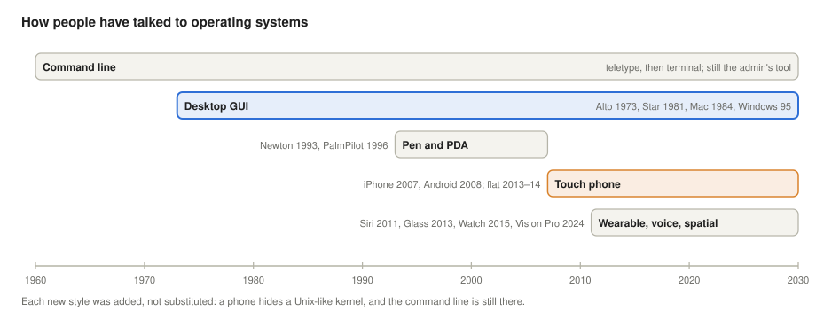
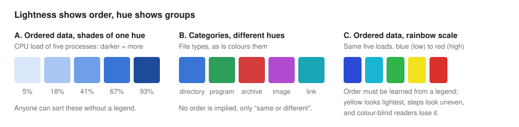
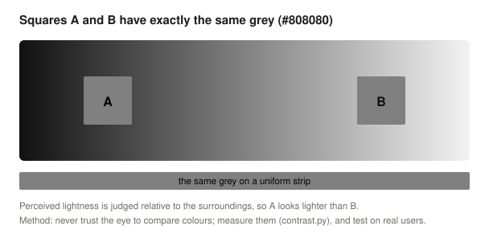
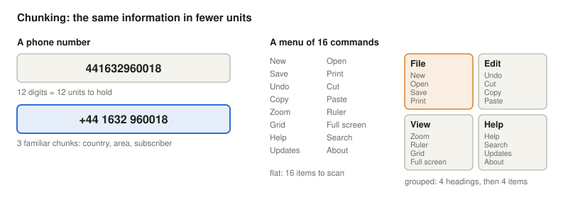
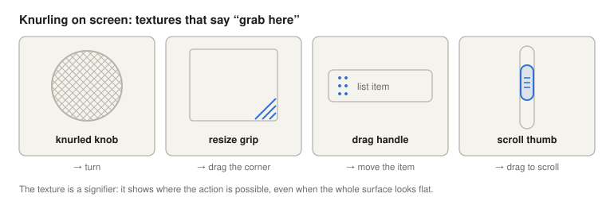
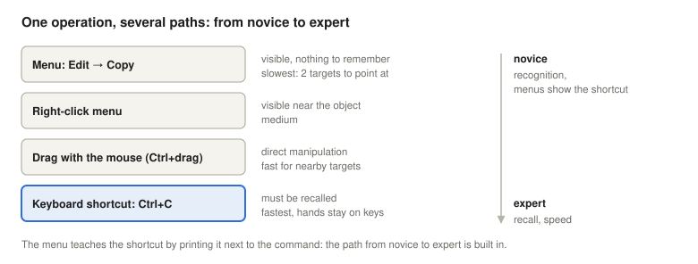
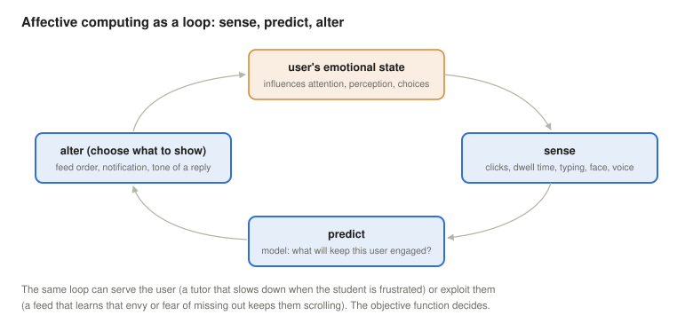
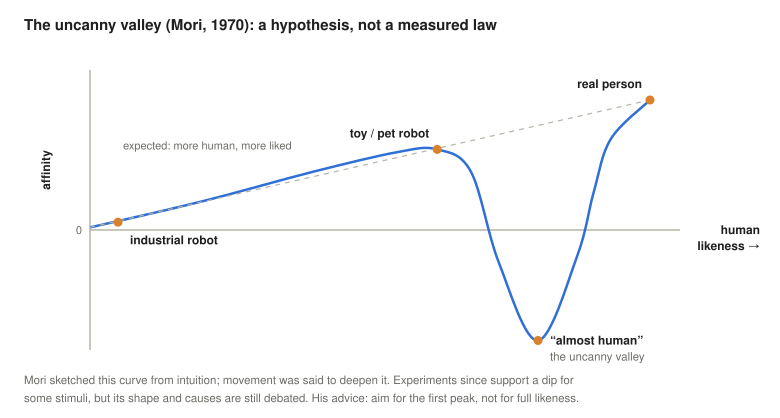

# Cognitive Ergonomics and Operating Systems UI

*Operating Systems lecture: how human perception, memory and emotion shape the user interface of an operating system, from the command line and the desktop to phones, watches, glasses and robots*

## Learning objectives

The first two lectures looked at operating systems from the outside: where they came from and how good they are. One part of that quality is decided not by the machine but by the person in front of it. This lecture asks what the user interface of an operating system must respect about human perception, memory, skill and emotion, and how the answers changed from the terminal to the phone, the watch and the headset.

By the end, students will be able to:

- define cognitive ergonomics and explain why the user interface is part of an operating system's quality;
- outline how operating-system interfaces evolved: command line, desktop GUI, pen computers, touch phones, wearables, voice and spatial computing;
- use lightness for order and hue for categories, measure contrast, and design for colour-vision deficiency;
- explain the limits of short-term memory, chunking, and the trade-off between broad and deep menus;
- distinguish affordances from signifiers and apply them to GUI controls and touch targets, using Fitts' law;
- explain recognition versus recall, and how command-line and voice interfaces work around recall;
- design for both novices and experts with several paths to the same operation;
- describe affective computing, its uses and its risks (feeds, FOMO, dark patterns), and the regulation that answers it;
- explain the role of mutual gaze, gaze correction and its side effects, the uncanny valley hypothesis and the ethological approach to robots;
- explain feedback and response-time limits, error prevention and undo, the cost of interruptions, and the accessibility services of an OS;
- write a persona and user stories with acceptance criteria for an operating-system feature, and connect them to the usability principles of this lecture;
- apply the Fitts and Hick–Hyman laws and colour-contrast calculations on Linux.

<details>
<summary><b>Explained simply:</b> ergonomics, cognitive, user interface, HMI, HCI, GUI, CLI, operating system shell</summary>

- **Ergonomics:** the science of fitting tools and work to people, instead of forcing people to fit the tools. A chair that supports your back is ergonomic.
- **Cognitive:** to do with thinking: seeing, remembering, deciding, learning.
- **User interface (UI):** everything through which a person and a machine communicate: the screen, buttons, sounds, keyboard, voice.
- **HMI** (human–machine interface): the engineering term for a user interface, common in industrial control.
- **HCI** (human–computer interaction): the field of research that studies how people use computers and how to make that easier.
- **GUI** (graphical user interface): using a computer through windows, icons and a pointer.
- **CLI** (command-line interface): using a computer by typing text commands.
- **Shell:** the program that gives you the operating system's user interface; a command shell such as `bash` is a CLI, a desktop such as GNOME or Windows Explorer is a graphical shell.

</details>

## Why an operating-systems course talks about people

The International Ergonomics Association defines **cognitive ergonomics** as the branch of ergonomics concerned with "mental processes, such as perception, memory, reasoning, and motor response, as they affect interactions among humans and other elements of a system" (International Ergonomics Association [IEA], n.d.). In an operating system, those interactions happen in the **shell**, the outermost layer that the [history lecture](../01-historic-evolution/#where-the-operating-system-sits) placed between the user and everything else.

Two arguments make this an operating-systems topic, not only a design topic:

- **The user is part of the system.** Several quality criteria from the [previous lecture](../02-quality-and-enterprise-linux/#what-makes-an-operating-system-good) are about people: consistent (the same things work the same way everywhere), forgiving (mistakes can be undone), convenient (easy to install, learn and use). A wrong command, a misread warning or a confusing dialog can take a system down just as a failed disk can; an interface that makes errors likely lowers availability.
- **The operating system sets the conventions.** Applications inherit the look, the shortcuts, the dialogs, the notification system and the accessibility features from the OS and its design guidelines. When a platform changes them, millions of programs change their behaviour at once, which is why the design guidelines of Apple, Google, Microsoft and GNOME carry so much weight.

The rest of the lecture covers nine topics, after a short history of how people have talked to operating systems, and closes with three topics that any OS interface must handle: feedback and response time, errors and interruptions, and accessibility, followed by two tools that design teams use to keep real users in view: personas and user stories.

## From teletype to glasses: how OS interfaces evolved



**Command line.** The first interactive systems of the 1960s were used through teletypes, and later through screen terminals: the user types a command, the system prints an answer. Unix shells (from 1971) made this a language of small commands that can be combined, and it remains the main interface of servers and of system administrators today, including the labs of this course.

**Desktop GUI.** The window–icon–mouse interface came from Douglas Engelbart's work in the 1960s and Xerox PARC's Alto (1973), reached offices with the Xerox Star (1981) and the mass market with the Apple Macintosh (1984) and Microsoft Windows; the [history lecture](../01-historic-evolution/#xii-personal-computers-a-step-back) tells the story of Xerox, Apple and Microsoft. Its key idea, named **direct manipulation** by Ben Shneiderman (1983), is to show the objects and let the user act on them: drag a file to a folder instead of typing `mv`.

**Pen computers and PDAs.** Apple's Newton MessagePad (1993) tried to recognise ordinary handwriting and became famous for its mistakes. Palm's Pilot (1996) turned the problem around: its **Graffiti** alphabet asked users to learn simplified letter shapes that the machine could recognise reliably. Both are lessons in who adapts to whom. IBM's Simon (1994) already combined a phone with a touchscreen, a stylus and small applications. Ordinary mobile phones met the same problem with text: **T9** predictive text let users press each number key once per letter and chose the word from a dictionary, and BlackBerry phones (from 2002) won business users with tiny hardware keyboards and push e-mail.

**Touch phones.** The iPhone (announced in January 2007) replaced the stylus with the finger on a capacitive multi-touch screen, and Android followed in 2008. Direct manipulation became literal: you push the content itself. Early phone interfaces imitated physical objects (**skeuomorphism**: leather, paper, wooden shelves); Microsoft's Windows Phone 7 (2010) and Apple's iOS 7 (2013) moved to **flat design**, and Google's Material Design (2014) followed with a flat style that deliberately kept shadows and "elevation" as depth cues. Flat design reduced clutter, but also removed many visual hints of what can be pressed, a trade-off examined below under affordances.

**Wearables, voice and spatial computing.** Fitness trackers (Fitbit, from 2009) showed that a wearable can be useful with almost no interface at all. Smartwatches such as the Pebble (2013), Android Wear (now Wear OS, 2014) watches and the Apple Watch (on sale from 24 April 2015) are used in glances of a few seconds; the Apple Watch brought back a mechanical control, the **Digital Crown**, a knob that turns, together with a haptic engine that taps the wrist (Apple, 2015). Voice assistants (Siri in 2011, Amazon's Echo in 2014) remove the screen entirely. Head-worn devices came in waves: Google Glass (2013) met strong social resistance, partly because bystanders could not tell whether they were being looked at or filmed; virtual- and mixed-reality headsets (Microsoft HoloLens and Oculus Rift in 2016, Meta Quest from 2019) track the hands and head; Apple Vision Pro (2024) selects things by **where you look** and a pinch of the fingers; Meta's Ray-Ban Display glasses (2025) put a small display in one lens and read finger movements with an **EMG** wristband that senses muscle signals (Sharma, 2025). Not every attempt succeeded: the screenless Humane AI Pin went on sale in April 2024 for 700 dollars and was switched off in February 2025, after its maker sold its technology to HP (Clover, 2025). Without a screen, users could not see what the device was able to do, the recall problem of section IV in its purest form.

Under every one of these interfaces runs a conventional kernel: Apple's phones, watches and headsets use the same Darwin/XNU core as macOS, Android and Wear OS use Linux. The styles were **added, not substituted**: the command line is still there, one layer below.

<details>
<summary><b>Explained simply:</b> teletype, terminal, Unix shell, Xerox PARC, direct manipulation, PDA, stylus, handwriting recognition, capacitive multi-touch, skeuomorphism, flat design, haptic, voice assistant, spatial computing, EMG, kernel, Darwin/XNU</summary>

- **Teletype:** an electric typewriter connected to a computer: you typed, the computer typed back on paper. **Terminal:** the same idea with a screen.
- **Unix shell:** the command interpreter of Unix systems, such as `sh` or `bash`.
- **Xerox PARC:** a research lab of the Xerox company, where many ideas of the modern desktop were invented.
- **Direct manipulation:** working with visible objects by pointing, dragging and touching them, instead of describing them in commands.
- **PDA** (personal digital assistant): a pocket computer of the 1990s for calendars, contacts and notes, usually used with a pen.
- **Stylus:** a plastic pen for pointing on a touchscreen.
- **Handwriting recognition:** software that turns handwritten letters into text.
- **Capacitive multi-touch:** a touchscreen that senses the tiny electric charge of fingers and can follow several fingers at once (for pinch-to-zoom).
- **Skeuomorphism:** making on-screen things look like real objects (a notebook with paper texture, a button that looks raised).
- **Flat design:** a style with plain colours and simple shapes, without imitation of real materials.
- **Haptic:** using touch, for example a vibration or a gentle tap, to give feedback.
- **Voice assistant:** a program you talk to, which answers with speech (Siri, Alexa, Google Assistant).
- **Spatial computing:** using a headset or glasses so that apps appear in the room around you.
- **EMG** (electromyography): measuring the small electrical signals that muscles produce when they move.
- **Kernel:** the core of the operating system that controls the hardware. **Darwin/XNU** is the core of Apple's systems.

</details>

## I. Colour: shades order, hues group



Human colour vision has, roughly, two separate abilities that an interface can use. **Lightness** (and saturation) is perceived as a magnitude: a darker shade looks like "more", so shades of one hue can show **order**, and anyone can sort them without a legend. **Hue** is perceived as an identity: red, green and blue are different, but none of them is "more" than the other, so hues are good for **grouping** categories and bad for order. Visualisation research calls these *magnitude channels* and *identity channels*; for ordered data it recommends lightness or saturation, for categories hue, and only a handful of hues, because the eye cannot reliably tell more than about six to twelve apart (Munzner, 2014). The rainbow scale in panel C, still common in heat maps, breaks this rule: it uses hue for order. Its order must be learned from a legend, its perceived steps are uneven (yellow looks much lighter than its neighbours, so it creates false boundaries), and colour-blind readers lose it.

**Our eyes are not instruments.** The perceived lightness of a colour depends on its surroundings:



This is why the method matters: colours in an interface must be **measured** (contrast ratios, simulations of colour blindness) and the result **tested** with real users, not judged by eye on the designer's own monitor.

**Contrast and colour blindness.** The Web Content Accessibility Guidelines, which operating systems' own guidelines follow closely, require, at their usual conformance level AA, a contrast ratio of at least 4.5:1 between normal text and its background (World Wide Web Consortium [W3C], 2024). About 8% of men of Northern European descent (and far fewer women) have a red–green colour-vision deficiency (Birch, 2012). An interface that marks "error" in red and "OK" in green, and nothing else, therefore fails several of every hundred users. The rule is never to use hue as the only signal: add a shape, an icon, a word, or a difference in lightness. Operating systems now offer system-wide help: high-contrast themes, colour filters for colour-blind users, a dark mode, and settings to reduce transparency.

On Linux, `ls` uses hue for grouping: directories blue, programs green, archives red ([Linux section](#colours-in-the-terminal)).

<details>
<summary><b>Explained simply:</b> lightness, saturation, hue, channel, legend, heat map, contrast ratio, WCAG, conformance level, colour-vision deficiency, dark mode, deuteranopia, protanopia</summary>

- **Lightness:** how light or dark a colour is. **Saturation:** how strong or pale it is. **Hue:** which colour it is (red, green, blue...).
- **Channel:** one property of a picture that can carry information, such as position, size, lightness or hue.
- **Legend:** the small key on a chart that explains what each colour means.
- **Heat map:** a picture where colours show numbers, like a weather map of temperatures.
- **Contrast ratio:** how much lighter one colour is than another, from 1:1 (identical) to 21:1 (black on white).
- **WCAG** (Web Content Accessibility Guidelines): the international rules for making websites and apps usable by people with disabilities. Their **conformance levels** are A (minimum), AA (the usual target) and AAA (strictest).
- **Colour-vision deficiency** ("colour blindness"): most often, difficulty telling red and green apart, because one kind of colour-sensing cell in the eye is missing or works differently.
- **Dark mode:** a colour scheme with light text on a dark background.
- **Deuteranopia, protanopia:** the two strong forms of red–green colour blindness, in which the green-sensing (deuteranopia) or the red-sensing (protanopia) cells of the eye are missing.

</details>

## II. Short-term memory: seven, plus or minus two

In 1956, George Miller observed that people can hold about **seven, plus or minus two** items in immediate memory, whether digits, letters or words, and that we work around this limit by **chunking**: grouping items into larger units that count as one (Miller, 1956). Later research put the capacity lower, at about **four chunks**, once rehearsal and chunking are prevented (Cowan, 2001). Either way, working memory is tiny, and an interface that makes users juggle many items in their heads at once will cause errors.



Interfaces use chunking everywhere:

- **Numbers in chunks.** Phone numbers, card numbers and IP addresses are written in groups; `ls -lh` prints `118M` instead of `123671544` ([Linux section](#chunking-on-the-command-line)).
- **Menu grouping.** Commands are grouped under a few headings (File, Edit, View, Help), so the user first chooses among four headings, then among four items, instead of scanning sixteen.
- **Hierarchical design.** Folders in folders, settings in categories, the start menu grouped by application type.

Two limits apply. First, Miller's limit concerns what must be **held in memory**, not what can be **seen**: a menu that is visible on screen does not have to be memorised, so "never more than seven menu items" is a myth. Second, deeper is not always better. Every level of a hierarchy is one more decision and one more chance to guess wrongly where something is. In a study of web link hierarchies with 512 items, three levels were slower than two, and a medium combination of depth and breadth beat the broadest structure tested (Larson & Czerwinski, 1998); menu experiments of the 1980s reached similar conclusions. The Hick–Hyman law, below, shows why splitting a menu into levels does not reduce the total amount of choosing.

**The Hick–Hyman law.** The time to choose one of $n$ equally likely options grows with the information in the choice, not with $n$ itself: $T = a + b \log_2(n+1)$ (Hick, 1952; Hyman, 1953). Choosing one of $n$ carries $\log_2 n$ bits; Hick's $+1$ counts the additional possibility that no stimulus appears at all. So doubling the number of options adds a roughly constant time. The slope $b$ depends strongly on how natural the mapping between what you see and what you do is: it is large for arbitrary codes and small for highly compatible ones, such as pressing the key whose digit you see. The law applies to choosing among known options; it does not apply to searching an unfamiliar list, where time grows roughly linearly with the length.

<details>
<summary><b>Explained simply:</b> short-term (working) memory, chunking, IP address, hierarchy, bit, logarithm</summary>

- **Short-term memory, working memory:** the "mental notepad" where you keep what you are thinking about right now, such as a phone number you are about to dial. It is small and forgets quickly.
- **Chunking:** grouping things so they are easier to remember: "1 9 8 4" becomes the year "1984".
- **IP address:** the number that identifies a computer on the Internet, written in four groups such as 192.168.1.10.
- **Hierarchy:** an arrangement in levels, like a family tree or folders inside folders.
- **Bit:** the smallest unit of information: the answer to one yes-or-no question. Choosing one of 8 things takes 3 yes-or-no questions, so 3 bits.
- **Logarithm** ($\log_2 n$): how many times you have to halve $n$ to get to 1; $\log_2 8 = 3$.

</details>

## III. Affordances: the object tells you how to use it

The psychologist James Gibson called the actions that an environment offers an animal its **affordances**: a chair affords sitting, a handle affords pulling (Gibson, 1979). Donald Norman brought the word into design and later sharpened it: the affordance is the possible action itself, while a **signifier** is the perceivable clue that tells people the action is possible and where to do it (Norman, 2013). Classic examples:

| Object | Action it signals |
|---|---|
| flat plate | push |
| knob | turn |
| slot | insert |
| vertical pull bar | pull |
| knurling (a fine grooved texture) | grip here |

A door with a pull handle that must be pushed is so common a failure that designers call it a "Norman door". The fix is not a "PUSH" sign but a flat plate, which can only be pushed.



**Knurling on screen.** Graphical interfaces borrowed the same textures for the same purpose: diagonal grooves on a window corner say "drag to resize", a column of dots on a list item says "drag to move", ridges on a scroll bar say "grab to scroll". Buttons drawn with a shadow look pressable; underlined blue text looks clickable.

**Flat design and its price.** Flat design removed many of these signifiers. In an eyetracking study with 71 participants, pages with weak clickability signifiers made users spend 22% more time and 25% more fixations than the same pages with strong signifiers (Moran, 2017). Design systems have since brought some signifiers back, and the pendulum keeps swinging: Apple's translucent **Liquid Glass** design, announced in June 2025 for all of its operating systems (Apple, 2025), was criticised in its early test versions for poor legibility, and Apple increased its contrast before release (Abdullahi, 2025).

**Size and distance: Fitts' law.** A control must not only be recognisable but reachable. Fitts' law says that the time to point at a target grows with the **index of difficulty** $ID = \log_2(D/W + 1)$ bits, where $D$ is the distance to the target and $W$ its width (Fitts, 1954; MacKenzie, 1992). Two design rules follow:

- **Make frequent targets big and near.** Touch guidelines therefore set minimum target sizes: 44 × 44 points on Apple's phones and tablets (60 points in the visionOS headset, where the eye is the pointer) (Apple, n.d.-a), 48 × 48 density-independent pixels in Material Design (Google, n.d.), and in WCAG 2.2 at least 24 × 24 CSS pixels at level AA (or enough spacing around smaller targets) and 44 × 44 at level AAA (W3C, 2024).
- **Use the edges.** The mouse pointer stops at the edge of the screen, so a target there is effectively infinitely deep in the direction of movement: the user can throw the pointer at it. This is why the macOS menu bar sits at the top edge and why screen corners ("hot corners") are prime places for frequent actions.

On a phone held in one hand, a second constraint joins Fitts' law: reach, since the thumb cannot comfortably reach the top corners, which is why phone systems moved frequent controls to the bottom of the screen. On a watch, targets are so small that the knob and the voice take over; in a headset, the "pointer" is the eye, and the target becomes whatever you look at. Note also that a screen edge is only an edge if the pointer stops there: between two monitors it is not.

<details>
<summary><b>Explained simply:</b> affordance, signifier, knurling, eyetracking, fixation, legibility, Fitts' law, index of difficulty, points, density-independent pixel, CSS pixel</summary>

- **Affordance:** what an object lets you do with it: a cup affords holding and drinking.
- **Signifier:** a visible (or audible, or touchable) clue that shows what you can do and where: the handle on the cup.
- **Knurling:** a pattern of small grooves on metal knobs and handles that stops your fingers from slipping.
- **Eyetracking:** measuring with a camera where a person is looking on the screen. A **fixation** is a short pause of the eyes on one spot.
- **Legibility:** how easy it is to read text.
- **Fitts' law:** small and far targets take longer to hit with the mouse or a finger than big and near ones, in a precisely predictable way. **Index of difficulty:** the number that measures how hard a target is to hit.
- **Points, density-independent pixels (dp), CSS pixels:** units of size on screens that stay about the same physical size whatever the resolution of the display.

</details>

## IV. Recognition versus recall

Multiple-choice questions are easier than fill-in-the-blanks: recognising the right answer among options is easier than producing it from memory. Interfaces work the same way. Jakob Nielsen's widely used usability heuristics put it as "recognition rather than recall": minimise the user's memory load by making elements, actions and options visible (Nielsen, 1994/2024).

- **Icons and menus require recognition only.** The user does not need to know what the program can do; the toolbar and the menus show its capabilities, and the user recognises the one they need.
- **The command line requires recall.** At an empty prompt, nothing tells you which of almost two thousand commands exists ([Linux section](#recall-and-recognition-on-the-command-line)) or which options it takes. This is the main reason the CLI is hard for beginners.
- **Bridges between the two.** Good command-line environments add recognition: **Tab completion** lists the commands or file names that match what you have typed, the shell history lets you find an earlier command instead of retyping it, `--help` lists the options. Graphical systems added recall-style power in return: the start-menu or launcher **search** lets you type a few letters, and the *keywords* of each application mean that typing "excel" can find LibreOffice Calc. **Command palettes** in modern editors combine both: type a fragment, recognise the command.
- **Voice brings recall back.** A voice assistant shows no menu: the user must guess what it understands. This *discoverability* problem is one reason why voice interfaces work best for a small set of well-known commands (timers, music, calls).

<details>
<summary><b>Explained simply:</b> recognition, recall, heuristic, prompt, Tab completion, shell history, launcher, command palette, discoverability</summary>

- **Recognition:** knowing something again when you see it. **Recall:** bringing it up from memory with no help. Recognising a face is easier than recalling a name.
- **Heuristic:** a rule of thumb, a practical guideline that is usually right.
- **Prompt:** the sign (such as `$`) with which the command line says "type your command now".
- **Tab completion:** press the Tab key after typing the first letters, and the shell finishes the word or lists the possibilities.
- **Shell history:** the list of commands you typed earlier, which you can search and reuse.
- **Launcher:** the part of the desktop where you search for and start applications.
- **Command palette:** a search box that finds any command of a program by name.
- **Discoverability:** how easy it is to find out what a system can do.

</details>

## V. Expertise: several paths to the same goal

Users are not all alike, and the same user changes: today's beginner is next year's expert. A good interface offers **several paths to the same operation**, so that beginners can find it and experts can do it fast. Copy and paste is the classic example:



- the **menu** (Edit → Copy) is visible and needs nothing remembered, but takes two pointing movements;
- the **context menu** appears where the user is already working;
- **dragging** the selection moves or (with a modifier key) copies it by direct manipulation;
- the **shortcut** Ctrl+C is the fastest, but must be recalled.

The menu prints the shortcut next to the command, so the slow path teaches the fast one. Shneiderman's "golden rules" of interface design ask designers to "seek universal usability", adding explanations for novices and, for experts, "shortcuts and faster pacing"; Nielsen's heuristics call it flexibility and efficiency of use: shortcuts, hidden from novice users, that speed up the expert (Nielsen, 1994/2024; Shneiderman et al., 2016). The command line has the same layering: the Up arrow and Ctrl+P bring back the previous command for editing, `!!` runs it again, and Ctrl+R searches the history ([Linux section](#several-paths-in-the-shell)).

Touch interfaces made this harder. Gestures (swipe from an edge, long press, two-finger tap) are fast, but invisible: there is no menu that prints them. Phones therefore teach gestures with short tutorials and hints, and keep a visible button for the most important ones.

<details>
<summary><b>Explained simply:</b> novice, expert, context menu, modifier key, keyboard shortcut, accelerator, gesture</summary>

- **Novice / expert:** a beginner / someone who has used the system a lot.
- **Context menu:** the menu that appears when you right-click (or long-press) on something, showing the actions for that thing.
- **Modifier key:** a key such as Ctrl, Shift or Alt that changes what another key or mouse action does.
- **Keyboard shortcut, accelerator:** a key combination that runs a command directly, such as Ctrl+C for copy.
- **Gesture:** a finger movement on a touchscreen that means a command, such as a swipe or a pinch.

</details>

## VI. Affect: interfaces that read and steer emotion

Emotions are not a side issue of cognition. The **affective state** of a person, being calm or anxious, bored or frustrated, influences what they notice, how they judge and what they decide. Rosalind Picard (1997) named the field that builds this into machines **affective computing**: computing that relates to, arises from or deliberately influences emotions. An affective system **senses** emotional signals (typing rhythm, voice, face, clicks, how long one looks at an item), **predicts** the user's state and reaction, and **alters** its behaviour, and thereby the user's emotions.



The same loop serves very different goals:

- **Helping the user:** a tutoring program that slows down when the student is frustrated, a car that warns a drowsy driver, an assistant that answers an upset user more gently.
- **Serving engagement:** social-media feeds (Facebook, YouTube, TikTok) rank posts by predicted engagement, and emotional content engages. Webshops show "only 2 left" and "12 people are looking at this". The emotions these systems can exploit include the need to **belong**, **envy** of others' highlight reels and the **fear of missing out (FOMO)**, defined as a pervasive apprehension that others might be having rewarding experiences from which one is absent (Przybylski et al., 2013).
- **Chatbots** sit in between: a conversational system that adapts its tone to the user can comfort, but can also flatter or foster dependence, depending on what it was optimised for.

That such steering can work at scale was suggested, controversially, by an experiment on 689,003 Facebook users in January 2012: reducing the positive posts in their feeds made them write slightly fewer positive and more negative words in their own posts, and vice versa (Kramer et al., 2014). The effects were tiny, and critics doubted that counting emotional words measures emotions; the experiment also ran without the users' informed consent, and the journal published an editorial expression of concern about it (Verma, 2014).

How large the harm of such systems is remains disputed, and a fair account has to show both sides. The 2020 documentary *The Social Dilemma*, in which former employees of large platforms describe engagement-optimised design as manipulation (Orlowski, 2020), brought this argument to a wide audience; Facebook answered that the film gave a distorted, sensationalist picture of how its products work (Facebook, 2020). Large studies have found the average association between adolescents' digital technology use and their well-being to be negative but very small, explaining at most 0.4% of its variation (Orben & Przybylski, 2019). Others argue that smartphones and social media are a major cause of the rise in teenage anxiety and depression since the early 2010s, and that averages hide serious effects on vulnerable groups (Haidt, 2024); critics reply that the evidence for such a causal role is weak (Odgers, 2024). The debate continues.

**The operating system's role.** Phone operating systems became the referee between apps and the user's attention. Since 2018, iOS (Screen Time) and Android (Digital Wellbeing) report how much time each app takes and can limit it (Apple, 2018); focus modes and notification controls decide which app may interrupt when. Law has followed: the EU's Digital Services Act forbids online platforms to design their interfaces in a way that "deceives or manipulates" users (so-called **dark patterns**; Regulation (EU) 2022/2065, Art. 25), and the AI Act has, since 2 February 2025, prohibited AI systems that infer the emotions of people at the workplace or in education, except for medical or safety reasons (Regulation (EU) 2024/1689, Art. 5(1)(f)).

<details>
<summary><b>Explained simply:</b> affect, affective state, affective computing, engagement, feed, FOMO, informed consent, expression of concern, dark pattern, objective function, Digital Services Act, AI Act</summary>

- **Affect, affective state:** feelings and moods, such as joy, fear, boredom or anger, and how strong they are.
- **Affective computing:** computers that recognise, react to or influence human emotions.
- **Engagement:** how much people use and react to something: clicks, likes, comments, time spent.
- **Feed:** the endless list of posts or videos in a social-media app, chosen and ordered by the app.
- **FOMO** (fear of missing out): the worried feeling that others are having a good time without you.
- **Informed consent:** agreeing to take part in a study after being told what it involves.
- **Expression of concern:** a formal note from a journal warning readers that something about a published article is questionable.
- **Dark pattern:** a design trick that pushes users to do something they did not intend, such as a hidden "unsubscribe" link or a fake countdown.
- **Objective function:** the number a computer system is built to make as large (or as small) as possible, for example "minutes watched" or "questions answered correctly".
- **Digital Services Act (DSA), AI Act:** European Union laws on online platforms (2022) and on artificial intelligence (2024).

</details>

## VII. Mutual gaze

Eye contact is one of the strongest social signals. Looking someone in the eye builds **trust** and signals attention; teachers use it to keep a class engaged, and it matters in business meetings and job interviews. Laboratory studies show that direct gaze, compared with averted gaze, raises physiological arousal, captures attention, triggers approach-related brain activity and makes people more aware of themselves, especially in live interaction rather than with photographs (Hietanen, 2018). Mutual gaze is a key to **engagement**.

**The video-call problem.** In a video call, you look at the other person's face on the screen, while the camera sits above it, so to them you seem to look slightly down and away. Mutual gaze is lost, on both sides.

**Gaze correction.** Software now corrects this: it redraws the eyes in the video so that they seem to look into the camera. Apple introduced FaceTime **Eye Contact** with iOS 14 in 2020 (AppleInsider, 2020); NVIDIA added an Eye Contact effect to its Broadcast software in January 2023, which keeps natural blinking and switches off when the user looks too far away (NVIDIA, 2023); Windows offers a similar effect (Windows Studio Effects) on PCs with AI accelerators. Apple Vision Pro goes further in the other direction: its outer display (**EyeSight**) shows a rendering of the wearer's eyes to people nearby, so that they can tell when the wearer is looking at them (Apple, n.d.-b).

**Awkward side effects.** Corrected gaze is a constant stare: the corrected person never looks away, which in a live conversation can feel uncomfortable, even uncanny. It also changes what eye contact *means*: the other side sees attention that may not be there, for example while the speaker reads a script. Gaze correction is a small, real example of the questions affective computing raises about authenticity and consent. And when gaze becomes an **input**, as in a headset, a new problem appears: people look at things without meaning to select them, the so-called **Midas touch** problem, which is why Vision Pro needs a separate pinch to confirm (Jacob, 1990).

<details>
<summary><b>Explained simply:</b> mutual gaze, averted gaze, arousal, engagement, gaze correction, AI accelerator, Midas touch</summary>

- **Mutual gaze:** two people looking into each other's eyes at the same time. **Averted gaze:** looking away.
- **Arousal:** how alert and excited the body is, measured for example by heart rate or sweating.
- **Gaze correction:** software that changes a video so that a person seems to look straight into the camera.
- **AI accelerator:** a special chip that runs artificial-intelligence programs fast and with little energy.
- **Midas touch:** in the legend, King Midas turned everything he touched into gold, even his food. In a gaze interface, the risk is that everything you look at gets "clicked".

</details>

## VIII. Human–robot interaction and the uncanny valley

Robots are operating-system users of a special kind: they are physical, they move, and people react to them as to social beings. **Human–robot interaction (HRI)** studies these reactions. Its best-known idea is the **uncanny valley**, proposed by the Japanese roboticist Masahiro Mori in 1970 (Mori, 1970/2012).



Mori argued that as a robot becomes more human-like, our affinity for it grows, from the faceless industrial robot to the toy robot with a friendly face, until it becomes *almost* human. Then affinity collapses into eeriness: a lifelike prosthetic hand that feels cold, a doll-like android with slightly wrong eyes or movements, a corpse. Only a real healthy person climbs out of the valley. Movement, Mori added, deepens both the peak and the valley. His practical advice was to aim for the first peak, a moderate human likeness, rather than for perfect imitation (Mori, 1970/2012).

Mori drew the curve from intuition, not from measurements. Later experiments support a dip for some stimuli: in a study that rated 80 real robot faces, likeability and trust fell for the most human-like but imperfect faces (Mathur & Reichling, 2016). A meta-analysis of the experimental literature found overall support for a valley-shaped relation (Diel et al., 2022), but the exact shape of the curve, and its cause (conflicting cues, the feeling of something dead or diseased, violated expectations), are still debated. The idea also applies beyond robots: to computer-generated characters in films and games, to video avatars, and to synthetic voices that are almost, but not quite, human.

<details>
<summary><b>Explained simply:</b> HRI, uncanny, affinity, industrial robot, android, prosthetic, avatar, synthetic voice</summary>

- **HRI** (human–robot interaction): the study of how people and robots work and live together.
- **Uncanny:** strange in a creepy, disturbing way.
- **Affinity:** how much you like something and feel comfortable with it.
- **Industrial robot:** a robot arm in a factory, for example one that welds car bodies.
- **Android:** a robot built to look like a human.
- **Prosthetic:** an artificial body part, such as an artificial hand.
- **Avatar:** a figure that represents a person in a game, a video call or a virtual world.
- **Synthetic voice:** speech produced by a computer.

</details>

## IX. Ethology: robots modelled on the dog, not on the human

**Ethology** is the biological study of animal behaviour in natural settings. Hungarian researchers, notably the dog-cognition group at Eötvös Loránd University in Budapest, have proposed applying it to robots. Their **ethorobotics** approach starts from the uncanny valley and reaches a different conclusion than "make robots more human" (Miklósi et al., 2017):

- **The dog as a model.** Dogs have lived with humans for thousands of years without looking like us. What makes them good partners is not appearance but **social competence**: attachment, attention to human gaze and pointing, communication, cooperation and learning by observation.
- **Function first.** A robot should be designed for its function and niche, with the social skills that function needs, and with a body that suits it, regardless of how human it looks. A cleaning robot needs to signal what it is doing and where it is going, not to have a face.
- **Social signals still matter.** A robot that shows where it is "looking", turns towards the person who speaks to it, and signals its state with simple, consistent cues, can be understood intuitively, just as a dog's posture and gaze are understood. This brings sections III (signifiers), VI (affect) and VII (gaze) back together.

For operating systems, the lesson extends to software agents. A voice assistant or a chatbot does not need to pretend to be human to be useful; it needs to make clear what it can do, what it is doing, and when it has understood, which are the classic tasks of a user interface.

<details>
<summary><b>Explained simply:</b> ethology, ethorobotics, social competence, attachment, niche, software agent</summary>

- **Ethology:** the science of animal behaviour: how animals act, communicate and live together.
- **Ethorobotics:** designing robots using the knowledge of animal behaviour, especially of how dogs and humans get along.
- **Social competence:** the skills needed to get along with others: paying attention, communicating, cooperating.
- **Attachment:** the emotional bond between, for example, a child and a parent, or a dog and its owner.
- **Niche:** the role and place of a creature in its environment; here, the job a robot is made for.
- **Software agent:** a program that acts on behalf of a user, such as a voice assistant.

</details>

## Feedback, errors, interruptions, accessibility

Three further topics belong to every operating system's interface, and each connects the nine topics above to the machinery of later lectures.

**Feedback and response time.** Donald Norman describes using any system as crossing two gulfs: the **gulf of execution** (how do I tell the system what I want?) and the **gulf of evaluation** (did it work, and what state is it in now?) (Norman, 2013). Signifiers and recognition narrow the first; **feedback** narrows the second. Timing is part of feedback. Since the 1960s, three limits have been used: about 0.1 s for a reaction to feel instantaneous, about 1 s for the user's flow of thought to stay uninterrupted, and about 10 s for keeping attention on the task, beyond which a progress indicator is needed (Nielsen, 1993). These numbers are why an operating system's scheduler favours interactive programs: a text editor that takes 200 ms to show a keystroke feels broken, however fast it finishes batch work. The lectures on interrupts and, later, on scheduling show how the OS keeps such latencies short.

**Errors and undo.** Shneiderman's golden rules include "prevent errors" and "permit easy reversal of actions" (Shneiderman et al., 2016); the quality lecture called this property *forgiving*. Interfaces prevent errors by making wrong actions impossible (a greyed-out menu item, a date picker instead of free text), confirm only what cannot be undone (and confirm it with the consequence, "Delete 3 files permanently?", not "Are you sure?"), and offer undo everywhere else: the trash bin, version history, file-system snapshots. Confirmation dialogs that appear for every action teach users to click "OK" without reading, which is a lesson from section V: experts automate.

**Interruptions and notifications.** Every notification is an interruption, and interruptions have a price. In a laboratory study, people who were interrupted finished their work faster, but reported significantly more stress, frustration, time pressure and effort (Mark et al., 2008). The operating system owns the notification system, so it decides how costly apps may make themselves: grouping, quiet hours, focus modes, and summaries delivered at chosen times are OS features, and they connect directly to the attention economy of section VI.

**Accessibility.** An interface must also work for people who cannot see the screen, use a mouse or hear sounds. Operating systems provide this centrally: screen readers (VoiceOver on Apple systems, TalkBack on Android, Narrator on Windows, Orca on the Linux desktop, which reads applications through the AT-SPI accessibility interface), full keyboard control, text scaling and zoom, captions, high contrast, colour filters and a "reduce motion" setting for people whom animation makes dizzy. Accessibility is the strictest test of the earlier topics: an application whose buttons are only pictures without names is invisible to a screen reader, just as a red-only error is invisible to a colour-blind user.

<details>
<summary><b>Explained simply:</b> gulf of execution, gulf of evaluation, feedback, latency, scheduler, undo, snapshot, notification, screen reader, AT-SPI, reduce motion</summary>

- **Gulf of execution:** the gap between what you want to do and knowing how to tell the computer. **Gulf of evaluation:** the gap between what the computer did and your understanding of it.
- **Feedback:** the system's answer that shows what happened: a sound, a highlight, a progress bar.
- **Latency:** the delay between an action and the reaction.
- **Scheduler:** the part of the operating system that decides which program may use the processor next.
- **Undo:** taking back the last action. **Snapshot:** a saved picture of all files at a moment, which you can return to.
- **Notification:** a message that an app shows to get your attention, even when you are doing something else.
- **Screen reader:** a program that reads aloud what is on the screen, for blind and partially sighted users.
- **AT-SPI** (Assistive Technology Service Provider Interface): the Linux desktop's way for applications to tell screen readers what is on the screen.
- **Reduce motion:** a setting that turns off or calms down animations.

</details>

## Designing for real users: personas and user stories

The principles above describe people in general. A design team must also decide **which** people it designs for and what they need to get done; otherwise each developer quietly designs for the user they know best, themselves. Two lightweight tools, one from interaction design and one from agile software development, keep real users in view.

**Personas.** A persona is a fictional but research-based portrait of a typical user: a name, a short background, goals, skills, working conditions and frustrations. Alan Cooper introduced personas to replace the "elastic user", who stretches to fit whatever the developers find convenient, with one specific person the design must satisfy (Cooper, 1999). A persona is built from interviews and observation of real users, not invented at a desk; a product usually has a few, and one **primary persona** whose needs win when they conflict (Cooper et al., 2014). Two personas for an operating system's update feature:

> **Kata, 52, accountant at a small firm.** Works on a laptop eight hours a day: spreadsheets, e-mail, the firm's bookkeeping program. Not interested in computers; finds her files by the folder names she gave them. Uses the mouse, Ctrl+C, Ctrl+V and Ctrl+S, and a larger text size. *Goals:* never lose a day's work; finish the month-end close on time. *Frustrations:* restarts and update prompts at the worst moment; dialogs she does not understand ("Allow this app to make changes to your device?").
>
> **Bence, 24, system administrator.** Runs 200 Linux servers over SSH from a terminal. *Goals:* the same, repeatable configuration on every machine; nothing changes without his knowledge. *Frustrations:* settings that can only be changed in a graphical tool; commands whose options differ from one tool to the next.

**User stories.** A user story states one requirement from the user's point of view, in one sentence: "As a ‹role›, I want ‹capability›, so that ‹benefit›." The format comes from agile teams of the early 2000s and was popularised by Cohn (2004). The sentence is deliberately short: it is a reminder to talk with the users, and it is completed by **acceptance criteria**, testable conditions that decide when the story is done. For the two personas:

- *As an office worker (Kata), I want updates to be installed while I am not working, without losing my open documents, so that an update never costs me unsaved work.* Acceptance criteria: the system restarts for an update only outside the active hours the user set; it asks at most once a day; documents open before the restart are reopened after it; the update can be postponed by at least a week.
- *As a server administrator (Bence), I want to set the update policy from the command line, so that I can apply the same policy to all 200 servers with one script.* Acceptance criteria: every setting of the graphical dialog has a command-line equivalent; the command returns a non-zero exit status on failure; the same options work on every supported release.

The two tools connect the lecture's principles to concrete decisions. Kata's persona says that recognition must beat recall (section IV), that errors must be forgivable and interruptions rare (the previous section), and that colours and text size matter (section I). Bence's persona asks for the expert paths of section V and for a command line that is consistent and scriptable. The acceptance criteria are where the lecture's numbers become requirements: a response within 0.1 s, a contrast of at least 4.5:1, touch targets of 44 points or more. Two mistakes are common: personas invented without research, which become stereotypes, and stories that prescribe a solution ("I want a blue button") instead of a need.

<details>
<summary><b>Explained simply:</b> persona, elastic user, primary persona, user story, agile, acceptance criteria, requirement, SSH, exit status</summary>

- **Persona:** an imagined but realistic person, described from what real users said and did, who stands for a whole group of users. Designers ask "would Kata understand this?" instead of "would a user understand this?".
- **Elastic user:** a vague "user" who can be stretched to agree with any design decision.
- **Primary persona:** the persona whose needs come first when two personas want different things.
- **Requirement:** something a product must do or a property it must have.
- **User story:** one requirement written as a short sentence from the user's point of view: who wants what, and why.
- **Agile:** a way of developing software in short steps, with frequent feedback from users, instead of one long plan.
- **Acceptance criteria:** checkable conditions that say when a requirement is fulfilled, like a checklist a teacher uses to mark homework.
- **SSH** (Secure Shell): a way to log in to a distant computer over the network and type commands there.
- **Exit status:** a number a command gives back when it finishes: 0 means success, anything else an error, so a script can check it.

</details>

## The same ideas on Linux (x86-64)

The outputs below come from a real system: an Ubuntu 24.04 environment in a cloud data centre, with `bash` 5.2. It has no graphical desktop, so the demonstrations show the command line and the files that describe the desktop's applications.

<details>
<summary><b>Explained simply:</b> console, Python, escape code, relative luminance, CIELAB, L*, delta E, PATH, built-in command, readline, Emacs-style keys, desktop entry</summary>

- **Console** (terminal): a window where you type commands as text. Lines starting with `$` are what you type; the other lines are the computer's answer.
- **Python:** a popular, easy-to-read programming language; `python3 file.py` runs a program written in it.
- **Escape code:** a special sequence of characters that tells the terminal to change colour or move the cursor instead of printing text.
- **Desktop entry:** a small text file that tells the desktop an application's name, icon and menu category.
- **Relative luminance:** how bright a colour is for the human eye, on a scale from 0 (black) to 1 (white); green counts much more than blue.
- **CIELAB, L\*, delta E:** a way of describing colours by numbers so that equal number differences look like equal colour differences. L\* is lightness (0 to 100); delta E is the distance between two colours, and about 2 is the smallest difference people notice.
- **PATH:** the list of folders in which the shell looks for programs. **Built-in command:** a command that the shell itself carries out, such as `cd`.
- **Readline:** the part of `bash` that lets you edit the command line before pressing Enter. **Emacs-style keys:** Ctrl-key shortcuts borrowed from the Emacs text editor, such as Ctrl+A for "start of line". In `bind`'s notation, `\C-` means Ctrl and `\M-` means the Escape key.

</details>

### Colours in the terminal

`ls` colours file names by type. Its colour table, printed by `dircolors`, uses **hue for grouping** (the codes are terminal escape codes: `01` bold, `34` blue, `32` green, `31` red, `35` magenta, `36` cyan):

```console
$ dircolors -p | grep -E '^(DIR|EXEC|LINK|\.tar|\.jpg|\.mp3) '
DIR 01;34 # directory
LINK 01;36 # symbolic link. (If you set this to 'target' instead of a
EXEC 01;32
.tar 01;31
.jpg 01;35
.mp3 00;36
```

How readable and how distinguishable are these colours? Bold (`01`) is drawn in the bright variant of the colour by xterm, but many modern terminals, GNOME Terminal among them, keep the normal colour for bold text; `contrast.py` assumes xterm's bright colours. It computes the WCAG contrast ratio of each colour in xterm's default palette on a black and a white background, and simulates how it appears with deuteranopia, using the model of Machado et al. (2009):

```console
$ python3 contrast.py ls
file type (ls code)  colour    on black  on white   deuteranopia
directory (01;34)    #5c5cff      4.43:1     4.74:1   #006cfc
executable (01;32)   #00ff00     15.30:1     1.37:1   #efd63a
archive (01;31)      #ff0000      5.25:1     4.00:1   #a39000
symlink (01;36)      #00ffff     16.75:1     1.25:1   #d0ddff
image (01;35)        #ff00ff      6.70:1     3.14:1   #689bfa

colour distance archive vs executable (CIE76 delta E):
  normal vision:  170.6
  deuteranopia:    28.0
  ...of which lightness (L*): 25.7  (archive L*=60, executable L*=85)
```

Three lessons are in these numbers. On a white background, green and cyan file names are nearly unreadable (1.37:1 and 1.25:1, against the 4.5:1 the guidelines ask for), and even the blue directories fail on black; a colour scheme is only good together with its background. For a deuteranope, red and green both turn into yellowish colours: the distance between them shrinks from 170.6 to 28.0, and what is left of it is almost entirely **lightness** (25.7 of the 28.0). Hue grouping disappears; lightness survives, which is exactly why hue must not be the only signal. And the threshold that tools apply is easy to check by hand:

```console
$ python3 contrast.py ratio '#767676' '#ffffff'
contrast 4.54:1
$ python3 contrast.py ratio '#777777' '#ffffff'
contrast 4.48:1
```

The lightest grey that still passes for text on white is `#767676`; one step lighter fails.

### Chunking on the command line

Long numbers are hard to read and compare. The `-h` ("human-readable") option of `ls`, `df` and `du` chunks them into a value and a unit:

```console
$ ls -l /usr/bin/python3.12 /usr/lib/x86_64-linux-gnu/libLLVM-17.so.1
-rwxr-xr-x 1 root root   8020928 Aug 31 12:18 /usr/bin/python3.12
-rw-r--r-- 1 root root 123671544 Apr 14  2024 /usr/lib/x86_64-linux-gnu/libLLVM-17.so.1
$ ls -lh /usr/bin/python3.12 /usr/lib/x86_64-linux-gnu/libLLVM-17.so.1
-rwxr-xr-x 1 root root 7.7M Aug 31 12:18 /usr/bin/python3.12
-rw-r--r-- 1 root root 118M Apr 14  2024 /usr/lib/x86_64-linux-gnu/libLLVM-17.so.1
$ numfmt --to=si 123671544
124M
```

Nine digits become three digits and a unit. Note the two different units: `ls -h` uses powers of 1024 (118 MiB), `numfmt --to=si` powers of 1000 (124 MB), a classic source of confusion that a well-designed interface makes explicit.

### Recall and recognition on the command line

At an empty prompt, the user must recall the command. How many are there to recall? `compgen -c` lists every command the shell can run (programs on the `PATH`, built-in commands, shell keywords such as `if`, aliases and functions):

```console
$ compgen -c | sort -u | wc -l
1939
```

Tab completion turns this recall task into recognition: typing `gr` and pressing Tab twice shows the candidates, which `compgen` can print directly:

```console
$ compgen -c gr | sort -u | head -20
gradle
gradle.bat
graphml2gv
gregorio
grep
gresource
grip
groupadd
groupdel
groupmems
groupmod
groups
grpck
grpconv
grpunconv
```

The graphical desktop solves the same problem with **desktop entries**, the `.desktop` files that every application installs. They carry an icon (recognition), menu categories (grouping) and keywords (search):

```console
$ ls /usr/share/applications/*.desktop | wc -l
13
$ grep -E '^(Name|GenericName|Comment|Icon|Exec|Keywords|Categories)=' /usr/share/applications/libreoffice-calc.desktop | head -8
Icon=libreoffice-calc
Categories=Office;Spreadsheet;
Exec=libreoffice --calc %U
Name=LibreOffice Calc
GenericName=Spreadsheet
Comment=Perform calculations, analyze information and manage lists in spreadsheets.
Keywords=Accounting;Stats;OpenDocument Spreadsheet;Chart;Microsoft Excel;Microsoft Works;OpenOffice Calc;ods;xls;xlsx;
Name=New Spreadsheet
```

A user who searches the launcher for "excel" finds LibreOffice Calc through its `Keywords`, without having to recall its name. The menu groups the applications by `Categories`:

```console
$ grep -h '^Categories=' /usr/share/applications/*.desktop | tr ';' '\n' | sed 's/Categories=//' | grep -v '^$' | sort | uniq -c | sort -rn | head -5
      5 Office
      3 Development
      2 Graphics
      1 X-SuSE-Core-Office
      1 X-Red-Hat-Base
```

(The `X-` categories are vendor extensions, which a standard menu ignores.)

### Several paths in the shell

The shell's line editor, readline, offers several paths to the same operation, for beginners (arrow keys) and for experts (Emacs-style control keys). `bind -q` shows which keys invoke a function. In its notation `\C-p` is Ctrl+P and `\M-` stands for the Escape character, so `\M-[A` and `\M-OA` are the two sequences (Escape `[` `A` and Escape `O` `A`) that terminals send for the Up arrow, depending on their cursor mode:

```console
$ bind -q previous-history
previous-history can be invoked via "\C-p", "\M-OA", "\M-[A".
$ bind -q reverse-search-history
reverse-search-history can be invoked via "\C-r".
$ bind -q beginning-of-line
beginning-of-line can be invoked via "\C-a", "\M-OH", "\M-[1~", "\M-[H".
```

Ctrl+A and the Home key do the same; Ctrl+P and the Up arrow do the same; Ctrl+R searches the whole history by a fragment, which is recognition again.

### Fitts and Hick–Hyman in numbers

`hci_laws.py` computes the two laws. For a pointer travelling 600 pixels to a 16-pixel icon, a 44-pixel button, and a target at the screen edge that behaves as if it were 1000 pixels deep:

```console
$ python3 hci_laws.py fitts 600 16 600 44 600 1000
distance    600, width    16: ID = 5.27 bits
distance    600, width    44: ID = 3.87 bits
distance    600, width  1000: ID = 0.68 bits
```

The edge target is almost free to hit. Choosing among more options costs information logarithmically, and splitting a menu into levels does not reduce the total:

```console
$ python3 hci_laws.py hick 2 4 8 16
  2 choices: 1.58 bits
  4 choices: 2.32 bits
  8 choices: 3.17 bits
 16 choices: 4.09 bits
$ python3 hci_laws.py menu
1 level of 64 : 1 decisions, 6.02 bits in total, at most 64 items in view at once
2 levels of 8 : 2 decisions, 6.34 bits in total, at most 8 items in view at once
3 levels of 4 : 3 decisions, 6.97 bits in total, at most 4 items in view at once
```

Choosing one of 64 items is always $\log_2 64 = 6$ bits of information, however the menu is split; the predicted cost grows slightly with depth only because Hick's $+1$ term is paid once per level. Deeper menus add decisions (and so pointing movements and chances to guess wrong); what they reduce is the number of items in view at once. This is the depth–breadth trade-off in numbers. Whether 8 choices really take as long as the formula predicts, you can measure on yourself with `reaction.py` (lab exercise 5).

## Lab exercises

1. **Colour audit.** Run `ls --color=always -l /usr/bin /etc | head -40` in your terminal with a dark and a light theme. Which colours become hard to read? Measure them with `contrast.py ratio` (find your terminal's palette in its settings), and find colours for directories and programs that pass 4.5:1 on both backgrounds.
2. **Colour blindness.** Extend `contrast.py` with the protanopia matrix of Machado et al. (2009) (severity 1.0: `0.152286 1.052583 -0.204868 / 0.114503 0.786281 0.099216 / -0.003882 -0.048116 1.051998`). Which pairs of `ls` colours become hard to distinguish (delta E below about 10) for a protanope or a deuteranope? Propose a palette that stays distinguishable through lightness.
3. **Recall and recognition.** Find out how many commands your own system offers (`compgen -c | sort -u | wc -l`). Then, without Tab completion or the Internet, write down the commands to show the free disk space, the running processes and the IP address. Check them with Tab completion and `--help`. How many did you recall correctly?
4. **Desktop entries.** On a Linux desktop, list `/usr/share/applications/*.desktop` and `~/.local/share/applications/`. Which categories does your menu use? Write a `.desktop` file for one of your own scripts in `~/.local/share/applications/`. It must start with the group header `[Desktop Entry]` and contain `Type=Application`, `Name` and `Exec`; add `Icon`, `Categories`, `Keywords`, and `Terminal=true` if the script needs a terminal. Find it in your launcher by a keyword.
5. **Hick–Hyman on yourself.** Run `python3 reaction.py 15`. Fit a straight line to your median times against the bits (by hand or with a spreadsheet). What are your intercept $a$ and slope $b$? Compare with a classmate. Do 8 choices (3.17 bits) take 3.17 times as long as 1 (1 bit)? Why not?
6. **Fitts at work.** With `hci_laws.py fitts`, compare a 24-pixel close button in the corner of a maximised window (the corner makes it effectively large) with the same button in a window that does not touch the screen edge. What changes if a second monitor is placed to the right? Then measure the touch targets of one app on your phone (screenshots, and the pixel density of your screen): do they reach 44 points or 48 dp?
7. **Shortcuts.** For one application you use daily, list three operations you perform by menu. Find their shortcuts, use only the shortcuts for one week, and note when they became faster than the menu.
8. **Attention audit.** On your phone, open Screen Time (iOS) or Digital Wellbeing (Android). Which three apps send you the most notifications? For each, identify which emotion (curiosity, belonging, envy, FOMO, urgency) its notifications appeal to, and change their notification settings. Report what changed after a week.
9. **Personas and stories.** Interview two people who use computers very differently (for example a relative and a fellow student) for 15 minutes each about how they install software, find their files and react to notifications. Write a persona for each, then three user stories with acceptance criteria for one OS feature (file search, notifications or backups). Mark which of this lecture's principles each acceptance criterion tests, and where the two personas conflict, decide which is primary and why.

## Review questions

1. Define cognitive ergonomics. Give two reasons why it is a topic for an operating-systems course.
2. Describe the main stages of OS user interfaces from the teletype to spatial computing. What did each stage add, and what did it keep?
3. Why do shades of one hue suit ordered data and different hues suit categories? Why is a rainbow colour scale a poor choice for ordered data?
4. Why must interface colours be measured rather than judged by eye? What does a contrast ratio of 4.5:1 mean?
5. An interface marks errors in red and successes in green. What fraction of users may have trouble with it, and how would you fix it?
6. What did Miller (1956) and Cowan (2001) find about short-term memory? Is "never more than seven menu items" a correct conclusion? Why or why not?
7. Explain chunking with two examples from operating systems.
8. Explain the difference between an affordance and a signifier, with a physical and a graphical example. What did flat design change?
9. State Fitts' law. Why are targets at the screen edge easy to hit, and why do touch guidelines set minimum target sizes?
10. Explain recognition versus recall with examples from the GUI, the command line and voice assistants. Which features of the shell turn recall into recognition?
11. Why should an interface offer several paths to the same operation? How does a menu help a user become an expert?
12. What is affective computing? Give an example in which it serves the user and one in which it may exploit the user. Which EU rules address the second?
13. Why is mutual gaze important, why is it lost in video calls, and what are the side effects of correcting it?
14. Describe Mori's uncanny valley. What is the status of the hypothesis today, and what design advice follows from it?
15. What does ethorobotics propose instead of building ever more human-like robots, and why is the dog its model?
16. What is a persona, how is it made, and what problem of design teams does it solve? Write a user story with two acceptance criteria for an operating-system feature, and name the principle of this lecture that each criterion checks.

<details>
<summary><strong>Answer key (for instructors)</strong></summary>

1. The branch of ergonomics concerned with mental processes (perception, memory, reasoning, motor response) as they affect the interaction between people and a system (IEA). Reasons: the user is part of the system, and human error at interfaces lowers availability and safety; the OS defines the conventions (look, shortcuts, dialogs, notifications, accessibility) that all applications inherit.
2. Command line (typed commands; precise, combinable, needs recall); desktop GUI (windows, icons, mouse, direct manipulation, recognition); pen PDAs and keypad phones (portable; handwriting, a learned alphabet or predictive text); touch phones (finger, multi-touch, direct manipulation without a pointer, later flat design); wearables, voice, spatial (glances, knobs and haptics, speech, gaze and gestures). Each kept the earlier layers: the CLI and the kernel remain underneath.
3. Lightness is perceived as a magnitude, so darker reads as "more" without a legend; hue is perceived as identity, so it separates groups but implies no order. A rainbow uses hue for order: the reader needs a legend, the perceived steps are uneven, and colour-blind readers lose the order entirely.
4. Perceived colour depends on the surroundings (simultaneous contrast), the monitor and the viewer's vision. 4.5:1 means the relative luminance of the lighter colour plus 0.05 is 4.5 times that of the darker plus 0.05; WCAG's minimum for normal text.
5. About 8% of men of Northern European descent have red–green deficiency (far fewer women). Fix: add a second signal (icon, shape, text, lightness difference), choose colours that differ in lightness, and test with a simulation.
6. Miller: about 7 ± 2 items in immediate memory, extended by chunking; Cowan: about 4 chunks when chunking and rehearsal are prevented. The menu rule is a misreading: visible items need recognition, not memorisation. Menu design is limited by search and decision time and by the depth–breadth trade-off, not by memory span.
7. For example: human-readable sizes (`ls -lh`: 118M), IP addresses in four groups, MAC addresses in pairs, menus grouped under headings, settings in categories, folder hierarchies.
8. Affordance: the action that is possible (a door can be pushed); signifier: the perceivable clue that shows it (a flat plate). GUI: a window can be resized (affordance); the grooved corner grip shows where (signifier). Flat design removed many signifiers (shadows, bevels, underlines), which made clickable elements harder to identify (22% more time in Moran's study); Material Design kept some depth cues for this reason.
9. Movement time grows with $\log_2(D/W+1)$. The pointer stops at the edge, so an edge target is effectively infinitely deep in the direction of movement. Fingers are larger and less precise than a pointer and hide the target, so targets below about 44 pt / 48 dp cause errors.
10. GUI: menus and icons show the options (recognition). CLI: the user must remember command names and options (recall). Voice: no visible options, so the user must guess what the assistant understands (recall, discoverability). Shell aids: Tab completion, history and Ctrl+R search, `--help`, `man`.
11. Users differ and grow: beginners need visible, self-explanatory paths, experts need fast ones. Menus print the shortcut next to each command, so using the menu teaches the shortcut.
12. Computing that senses, models and influences emotions (Picard). Serving: a tutor that adapts to frustration, a drowsiness warning. Exploiting: feeds that optimise engagement through envy or FOMO, fake scarcity in webshops. EU: DSA Art. 25 bans deceptive or manipulative interface design on online platforms; AI Act Art. 5(1)(f) bans emotion recognition at work and in education (except medical or safety uses).
13. It signals attention, builds trust and engagement, and raises arousal and approach motivation. The camera is above the screen, so looking at the partner's face looks like looking away. Correction produces a constant stare, can feel uncanny, may show attention that is not there, and raises authenticity and consent questions.
14. Affinity rises with human likeness, then falls sharply for almost-human figures, and rises again for real people; movement deepens the effect. It was an intuition; experiments (e.g. Mathur & Reichling, 2016) support a dip for some stimuli, but the shape and causes are debated. Advice: aim for moderate likeness (the first peak).
15. Design robots for their function and niche, with the social competence that function needs (attention, signalling, attachment, cooperation), and with a body that suits the function, not a human imitation. Dogs show that a very different-looking species can be an excellent social partner through social competence.
16. A fictional but research-based portrait of a typical user (background, goals, skills, context, frustrations), built from interviews and observation; a product has a few, with one primary persona. It replaces the vague "elastic user" (and designing for oneself) with a specific person the design must satisfy (Cooper). Example story: "As a laptop user, I want a low-battery warning that I cannot miss but that does not interrupt typing, so that I can save my work before the machine shuts down." Criteria: the warning appears at 10% and again at 5% (feedback); it does not take the keyboard focus (interruptions); it is readable with a contrast of at least 4.5:1 and announced by the screen reader (colour, accessibility). Any story in the "As a …, I want …, so that …" form with testable criteria is acceptable.

**Lab answers.** Lab 2: with the protanopia matrix, red loses most of its lightness (#6d5f00, L* about 40) and green becomes bright yellow (L* about 90), so archive and executable stay apart by lightness (delta E 65.7); the real casualty is directory versus image (blue #5c5cff versus magenta #ff00ff), which shrinks from 55.4 to 4.1, practically identical. For deuteranopia, the closest pair is archive versus executable (28.0). Lab 3: typical answers are `df -h`, `ps aux` or `top`, `ip addr`; many students recall `ifconfig`, which is deprecated and missing on minimal systems. Lab 5: the intercept is a few hundred milliseconds (more, because the answer is typed and confirmed with Enter). Because typing the digit you see is a highly compatible mapping, the slope is usually small, often only tens of milliseconds per bit, and practice reduces it further. So 8 choices do not take 3.17 times as long as 1: the time is $a + b \cdot \text{bits}$, and the intercept $a$ dominates. Lab 6: the corner button behaves like a very large target (ID near 0–1 bit); the floating one has ID $\log_2(D/24+1)$. With a second monitor on the right, the right edge is no longer a barrier, and the top-right close button loses most of its advantage.

</details>

## References

Abdullahi, A. (2025, July 9). *Apple dials down Liquid Glass in iOS 26 beta 3 after mixed reactions*. TechRepublic. https://www.techrepublic.com/article/news-apple-ios-26-beta-3-liquid-glass/

Apple. (n.d.-a). *Accessibility*. Human Interface Guidelines. Retrieved October 6, 2026, from https://developer.apple.com/design/human-interface-guidelines/accessibility

Apple. (n.d.-b). *What EyeSight shows on Apple Vision Pro*. Apple Support. Retrieved October 6, 2026, from https://support.apple.com/en-au/120481

Apple. (2015, March 9). *Apple Watch available in nine countries on April 24* [Press release]. https://www.apple.com/newsroom/2015/03/09Apple-Watch-Available-in-Nine-Countries-on-April-24/

Apple. (2018, June 4). *iOS 12 introduces new features to reduce interruptions and manage Screen Time* [Press release]. https://www.apple.com/newsroom/2018/06/ios-12-introduces-new-features-to-reduce-interruptions-and-manage-screen-time/

Apple. (2025, June 9). *Apple introduces a delightful and elegant new software design* [Press release]. https://www.apple.com/newsroom/2025/06/apple-introduces-a-delightful-and-elegant-new-software-design/

AppleInsider. (2020, June 22). *FaceTime eye contact correction feature to launch with iOS 14*. https://appleinsider.com/articles/20/06/22/facetime-eye-contact-correction-feature-to-launch-with-ios-14

Birch, J. (2012). Worldwide prevalence of red-green color deficiency. *Journal of the Optical Society of America A, 29*(3), 313–320. https://doi.org/10.1364/JOSAA.29.000313

Clover, J. (2025, February 18). *Humane's $700 Ai Pin discontinued and defunct after less than 1 year*. MacRumors. https://www.macrumors.com/2025/02/18/humane-ai-pin-discontinued/

Cohn, M. (2004). *User stories applied: For agile software development*. Addison-Wesley.

Cooper, A. (1999). *The inmates are running the asylum: Why high-tech products drive us crazy and how to restore the sanity*. Sams.

Cooper, A., Reimann, R., Cronin, D., & Noessel, C. (2014). *About face: The essentials of interaction design* (4th ed.). Wiley.

Cowan, N. (2001). The magical number 4 in short-term memory: A reconsideration of mental storage capacity. *Behavioral and Brain Sciences, 24*(1), 87–114. https://doi.org/10.1017/S0140525X01003922

Diel, A., Weigelt, S., & MacDorman, K. F. (2022). A meta-analysis of the uncanny valley's independent and dependent variables. *ACM Transactions on Human-Robot Interaction, 11*(1), 1–33. https://doi.org/10.1145/3470742

Facebook. (2020). *What "The Social Dilemma" gets wrong*. https://about.fb.com/wp-content/uploads/2020/09/What-The-Social-Dilemma-Gets-Wrong.pdf

Fitts, P. M. (1954). The information capacity of the human motor system in controlling the amplitude of movement. *Journal of Experimental Psychology, 47*(6), 381–391. https://doi.org/10.1037/h0055392

Gibson, J. J. (1979). *The ecological approach to visual perception*. Houghton Mifflin.

Google. (n.d.). *minimumInteractiveComponentSize*. Android Developers. Retrieved October 6, 2026, from https://developer.android.com/reference/kotlin/androidx/compose/material/minimumInteractiveComponentSize.modifier

Haidt, J. (2024). *The anxious generation: How the great rewiring of childhood is causing an epidemic of mental illness*. Penguin Press.

Hick, W. E. (1952). On the rate of gain of information. *Quarterly Journal of Experimental Psychology, 4*(1), 11–26. https://doi.org/10.1080/17470215208416600

Hietanen, J. K. (2018). Affective eye contact: An integrative review. *Frontiers in Psychology, 9*, Article 1587. https://doi.org/10.3389/fpsyg.2018.01587

Hyman, R. (1953). Stimulus information as a determinant of reaction time. *Journal of Experimental Psychology, 45*(3), 188–196. https://doi.org/10.1037/h0056940

International Ergonomics Association. (n.d.). *What is ergonomics (HFE)?* Retrieved October 6, 2026, from https://iea.cc/about/what-is-ergonomics/

Jacob, R. J. K. (1990). What you look at is what you get: Eye movement-based interaction techniques. In *Proceedings of the SIGCHI Conference on Human Factors in Computing Systems* (pp. 11–18). ACM. https://doi.org/10.1145/97243.97246

Kramer, A. D. I., Guillory, J. E., & Hancock, J. T. (2014). Experimental evidence of massive-scale emotional contagion through social networks. *Proceedings of the National Academy of Sciences, 111*(24), 8788–8790. https://doi.org/10.1073/pnas.1320040111

Larson, K., & Czerwinski, M. (1998). Web page design: Implications of memory, structure and scent for information retrieval. In *Proceedings of the SIGCHI Conference on Human Factors in Computing Systems* (pp. 25–32). ACM. https://doi.org/10.1145/274644.274649

Machado, G. M., Oliveira, M. M., & Fernandes, L. A. F. (2009). A physiologically-based model for simulation of color vision deficiency. *IEEE Transactions on Visualization and Computer Graphics, 15*(6), 1291–1298. https://doi.org/10.1109/TVCG.2009.113

MacKenzie, I. S. (1992). Fitts' law as a research and design tool in human-computer interaction. *Human-Computer Interaction, 7*(1), 91–139. https://doi.org/10.1207/s15327051hci0701_3

Mark, G., Gudith, D., & Klocke, U. (2008). The cost of interrupted work: More speed and stress. In *Proceedings of the SIGCHI Conference on Human Factors in Computing Systems* (pp. 107–110). ACM. https://doi.org/10.1145/1357054.1357072

Mathur, M. B., & Reichling, D. B. (2016). Navigating a social world with robot partners: A quantitative cartography of the Uncanny Valley. *Cognition, 146*, 22–32. https://doi.org/10.1016/j.cognition.2015.09.008

Miklósi, Á., Korondi, P., Matellán, V., & Gácsi, M. (2017). Ethorobotics: A new approach to human-robot relationship. *Frontiers in Psychology, 8*, Article 958. https://doi.org/10.3389/fpsyg.2017.00958

Miller, G. A. (1956). The magical number seven, plus or minus two: Some limits on our capacity for processing information. *Psychological Review, 63*(2), 81–97. https://doi.org/10.1037/h0043158

Moran, K. (2017, September 3). *Flat UI elements attract less attention and cause uncertainty*. Nielsen Norman Group. https://www.nngroup.com/articles/flat-ui-less-attention-cause-uncertainty/

Mori, M. (2012). The uncanny valley (K. F. MacDorman & N. Kageki, Trans.). *IEEE Robotics & Automation Magazine, 19*(2), 98–100. https://doi.org/10.1109/MRA.2012.2192811 (Original work published 1970)

Munzner, T. (2014). *Visualization analysis and design*. CRC Press.

Nielsen, J. (1993). *Usability engineering*. Academic Press.

Nielsen, J. (2024). *10 usability heuristics for user interface design*. Nielsen Norman Group. https://www.nngroup.com/articles/ten-usability-heuristics/ (Original work published 1994)

Norman, D. A. (2013). *The design of everyday things* (Rev. and expanded ed.). Basic Books.

NVIDIA. (2023, January 12). *NVIDIA Broadcast 1.4 adds Eye Contact and Vignette effects with virtual background enhancements*. https://www.nvidia.com/en-us/geforce/news/jan-2023-nvidia-broadcast-update/

Odgers, C. L. (2024). The great rewiring: Is social media really behind an epidemic of teenage mental illness? *Nature, 628*(8006), 29–30. https://doi.org/10.1038/d41586-024-00902-2

Orben, A., & Przybylski, A. K. (2019). The association between adolescent well-being and digital technology use. *Nature Human Behaviour, 3*(2), 173–182. https://doi.org/10.1038/s41562-018-0506-1

Orlowski, J. (Director). (2020). *The social dilemma* [Film]. Exposure Labs; Netflix.

Picard, R. W. (1997). *Affective computing*. MIT Press.

Przybylski, A. K., Murayama, K., DeHaan, C. R., & Gladwell, V. (2013). Motivational, emotional, and behavioral correlates of fear of missing out. *Computers in Human Behavior, 29*(4), 1841–1848. https://doi.org/10.1016/j.chb.2013.02.014

Regulation (EU) 2024/1689 of the European Parliament and of the Council of 13 June 2024 laying down harmonised rules on artificial intelligence (Artificial Intelligence Act). (2024). *Official Journal of the European Union, L series*. https://eur-lex.europa.eu/eli/reg/2024/1689/oj

Regulation (EU) 2022/2065 of the European Parliament and of the Council of 19 October 2022 on a Single Market for Digital Services (Digital Services Act). (2022). *Official Journal of the European Union, L 277*, 1–102. https://eur-lex.europa.eu/eli/reg/2022/2065/oj

Sharma, A. (2025, September 17). *Meta launches Ray-Ban Display smart glasses that cost as much as a Pixel 10*. Android Authority. https://www.androidauthority.com/meta-ray-ban-display-3598809/

Shneiderman, B. (1983). Direct manipulation: A step beyond programming languages. *Computer, 16*(8), 57–69. https://doi.org/10.1109/MC.1983.1654471

Shneiderman, B., Plaisant, C., Cohen, M., Jacobs, S., Elmqvist, N., & Diakopoulos, N. (2016). *Designing the user interface: Strategies for effective human-computer interaction* (6th ed.). Pearson.

Verma, I. M. (2014). Editorial expression of concern: Experimental evidence of massive-scale emotional contagion through social networks. *Proceedings of the National Academy of Sciences, 111*(29), 10779. https://doi.org/10.1073/pnas.1412469111

World Wide Web Consortium. (2024, December 12). *Web Content Accessibility Guidelines (WCAG) 2.2* (W3C Recommendation). https://www.w3.org/TR/WCAG22/

## Further reading

Card, S. K., Moran, T. P., & Newell, A. (1983). *The psychology of human-computer interaction*. Lawrence Erlbaum.

Ware, C. (2021). *Information visualization: Perception for design* (4th ed.). Morgan Kaufmann.
