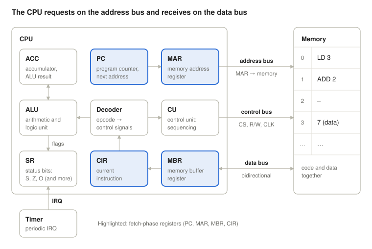
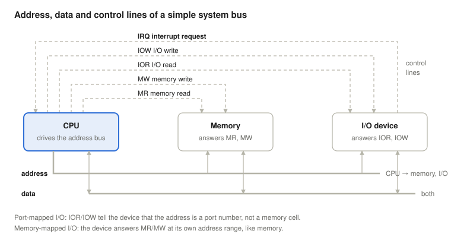
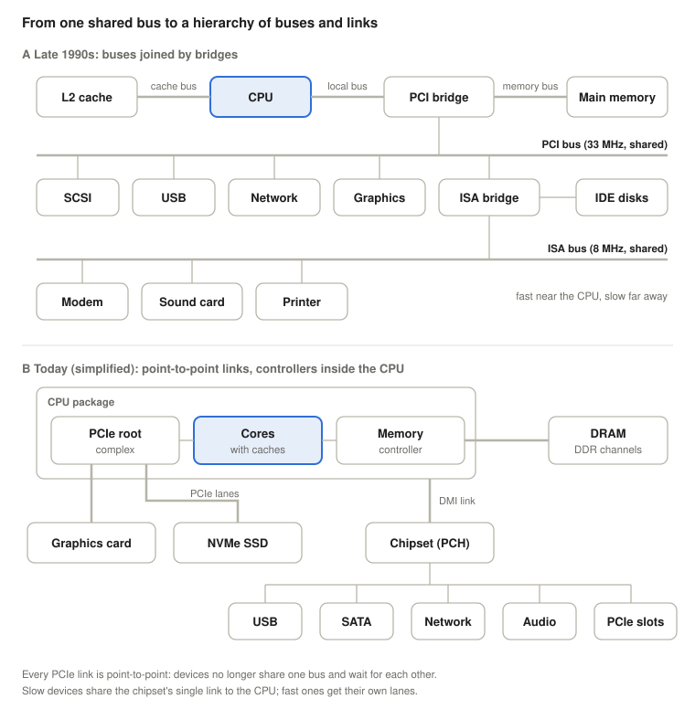
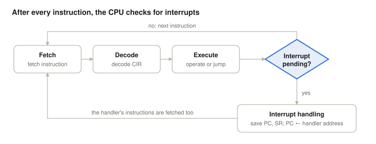

# The Fetch-Execute Cycle

*Operating Systems lecture: the von Neumann machine, the instruction cycle and interrupts, with Linux (x86-64) examples*

Previous: [Cognitive Ergonomics and Operating Systems UI](../03-cognitive-ergonomics/). Next: [Interrupts](../05-interrupts/).

> **How to read this lecture.** Wherever a new abbreviation or concept appears, a box marked **Explained simply** follows. Click it to open a plain-language explanation. You can skip these boxes if you already know the terms.

## Learning objectives

The processor repeats a single cycle: it fetches an instruction, decodes it, executes it, then checks whether an interrupt has arrived. This lesson follows that cycle at register level on a simple teaching CPU, then shows the same mechanisms on a real x86-64 Linux system.

<details>
<summary><b>Explained simply:</b> processor (CPU), instruction, register, interrupt, x86-64, Linux</summary>

- **Processor, CPU** (Central Processing Unit): the chip that runs programs. It does one small step after another, billions of times per second.
- **Instruction:** one elementary step in the CPU's own language, for example "add 2 to this number" or "jump to address 900". A program is a long list of instructions.
- **Register:** a tiny, very fast storage cell inside the CPU that holds one number. A CPU has only a few dozen of them.
- **Interrupt:** a signal that makes the CPU pause its program for a moment to deal with something urgent, like a doorbell while you are reading. The next lecture is all about it.
- **Teaching CPU:** an imaginary, very simple processor invented for learning. Real processors work on the same principles, with many more details.
- **x86-64:** the processor family in most PCs and laptops (Intel and AMD), in its 64-bit version.
- **Linux:** a free operating system used on most servers, in Android phones and on many desktops. An **operating system** is the program that manages the computer and lets other programs run (others: Windows, macOS).

</details>

By the end, students will be able to:

- state the von Neumann principle and explain why it is efficient and why it is not secure;
- name the main CPU registers (PC, MAR, MBR, CIR, ACC, SR) and their roles;
- explain the address, data and control lines of a bus, the difference between memory-mapped and port-mapped I/O, and why a PC uses a hierarchy of buses and links instead of one shared bus;
- describe the fetch phase in register transfer notation;
- trace the execution of a short machine-code program step by step, on paper and in `gdb`, with immediate and with direct addressing;
- sort instructions into the four categories (processor–memory, processor–I/O, data processing, control), and read simple real 8-bit machine code;
- explain how jumps and interrupts change the order of execution, and why the operating system needs the timer interrupt;
- find these mechanisms on a running Linux system (`/proc/<pid>/maps`, `/proc/interrupts`, `vmstat`).

## The von Neumann principle

In the von Neumann architecture (Stallings, 2018), the program (code) and the data live in the same memory and reach the CPU over the same bus system. The machine has three main units, the CPU, the memory and I/O, connected by a shared bus.

A memory cell alone does not tell whether it holds an instruction or data. The same bit pattern is an instruction if the CPU reads it during the fetch phase, and data if it is read as an instruction's operand.

**Why is it efficient?**

- One memory and one bus are enough, so the hardware is simple.
- A program can be handled as data: it can be loaded, copied and compiled. Loaders, compilers, JIT engines and the operating system itself all rely on this.

<details>
<summary><b>Explained simply:</b> memory, bit, bit pattern, operand, bus, I/O, loader, compiler, JIT</summary>

- **Memory** (RAM): the computer's working storage, a very long row of numbered cells. Each cell's number is its **address**, like house numbers on a street.
- **Bit:** the smallest piece of information, a 0 or a 1. A **bit pattern** is a row of bits, for example 00010011.
- **Operand:** the thing an instruction works on. In "add 2", the operand is 2.
- **Bus:** a shared set of wires that connects the CPU, the memory and the devices, like a road all traffic must use.
- **I/O** (Input/Output): everything the computer exchanges with the outside world: keyboard, disk, network, screen.
- **Loader:** the part of the operating system that copies a program from the disk into memory so it can run.
- **Compiler:** a program that translates code written by people (for example in C) into instructions the CPU understands.
- **JIT** (Just-In-Time) compiler: a compiler that translates code while the program is already running. Web browsers use one to run JavaScript fast.

</details>

**Why is it not secure?**

- If an attacker can write data into memory and redirect control there, the CPU executes it as instructions (for example, in a buffer overflow).
- A faulty program can overwrite its own code or the code of another program.

**The defence: permission bits.** The operating system assigns permissions to regions (pages) of memory, and the CPU's memory management unit (MMU) checks them on every access:

| Bit | Meaning | Typical use | Shown by Linux as |
| --- | --- | --- | --- |
| R | readable | code and data | `r` |
| W | writable | data only | `w` |
| NX (no-execute) | not executable | data, heap, stack | missing `x` |

Rule of thumb: a region is either writable or executable, never both at once. This policy is called **W^X** ("write xor execute"). A violation does not just get blocked: the CPU raises an exception (a page fault), and Linux delivers `SIGSEGV` to the process, the familiar "Segmentation fault".

<details>
<summary><b>Explained simply:</b> attacker, buffer overflow, page, permission, MMU, NX, heap, stack, exception, page fault, process, SIGSEGV, XOR</summary>

- **Buffer overflow:** a program writes more data into a storage area than fits, and the extra spills over into whatever lies next to it. An **attacker** (someone trying to break in) can use this to place their own instructions in memory.
- **Page:** memory is managed in fixed-size chunks called pages, usually 4096 bytes. Permissions are set per page.
- **Permission:** what may be done with a page: read it (r), write it (w), run it as instructions (x, execute).
- **MMU** (Memory Management Unit): the part of the CPU that translates the addresses a program uses into real memory addresses, and checks every access against the permissions, like a receptionist who knows which room everyone is really in and who may enter it.
- **NX** (No eXecute): the permission bit that says "this page holds data, never run it as instructions".
- **Heap and stack:** two memory areas every running program has. The **heap** holds data the program creates while running; the **stack** works like a stack of plates (last put on, first taken off) and holds temporary values.
- **Exception:** an interrupt caused by the current instruction itself, for example when it breaks a rule. A **page fault** is the exception raised when an instruction touches a page it may not use, or one that is not in memory right now.
- **Process:** a running program, together with its memory and its state.
- **SIGSEGV, "Segmentation fault":** the message Linux sends a program that broke a memory rule. Usually it ends the program.
- **XOR** (exclusive or): "one or the other, but not both". W^X means a page may be writable or executable, never both.

</details>

The shared bus also limits performance, because an instruction and data cannot travel at the same time (the von Neumann bottleneck). Modern CPUs soften this with separate instruction and data caches close to the core (a "modified Harvard" design), while main memory stays shared.

<details>
<summary><b>Explained simply:</b> bottleneck, cache, core, Harvard architecture</summary>

- **Bottleneck:** the narrowest point that slows everything down, like the neck of a bottle.
- **Cache:** a small, very fast memory close to the CPU that keeps copies of recently used data, so the CPU does not have to wait for the slower main memory. Like keeping the books you use most on your desk instead of in the library.
- **Core:** a modern processor chip contains several complete CPUs, called cores.
- **Harvard architecture:** a design with separate memories (and separate buses) for instructions and for data, named after the Harvard Mark I computer. "Modified Harvard" means separate only in the caches.

</details>

## Inside the CPU

The CPU is a set of registers, an arithmetic logic unit (ALU) and a control unit (CU). It touches memory through only two registers: it sends addresses through the MAR, and receives or sends data through the MBR.



One input of the ALU is the ACC; the other is the instruction's operand (the low bits of the CIR) or a general-purpose register (REG). The result goes into the ACC, and its properties (sign, zero, overflow) go into the SR.

Not all of these registers are visible to the programmer. PC, ACC/REG and SR can be read and changed by instructions. MAR, MBR and CIR are internal: they exist so the hardware can carry out the cycle, and no instruction names them.

<details>
<summary><b>Explained simply:</b> ALU, CU, PC, MAR, MBR, CIR, ACC, SR, REG</summary>

- **ALU** (Arithmetic Logic Unit): the CPU's calculator. It adds, subtracts, compares and does logical operations.
- **CU** (Control Unit): the CPU's conductor. It sends the signals that make every other part do the right thing at the right time.
- **PC** (Program Counter): holds the address of the next instruction, the CPU's bookmark.
- **MAR** (Memory Address Register): holds the address the CPU wants to read or write, the "which house?" register.
- **MBR** (Memory Buffer Register): holds the data just read from memory or about to be written, the "what's in the parcel?" register.
- **CIR** (Current Instruction Register): holds the instruction being carried out right now.
- **ACC** (Accumulator): the register where results of calculations are collected.
- **SR** (Status Register): a set of yes/no bits (flags) describing the last result, for example "it was zero".
- **REG** (general-purpose registers): extra registers the program can use for anything.

</details>

## The bus system

The CPU and memory communicate over three buses and a clock line. A memory read uses all three: the address goes out on the address bus, the control bus signals that this is a read, and the data comes back on the data bus.

| Bus | Direction | Carries | Example during fetch |
| --- | --- | --- | --- |
| Address bus (ADDR) | CPU → memory | the contents of the MAR, i.e. the cell address | 0, then 1 |
| Data bus (DATA) | bidirectional | the cell contents towards the MBR (the other way when writing) | 19, then 34 |
| Control bus (CTRL) | CPU → memory | CS (chip select: which device responds), R/W (read or write) | CS active, R/W = read |
| Clock (CLK) | everywhere | the timing every step follows | each register transfer on a clock tick |

I/O devices connect to the same bus system. The CS signal decides whether the memory or an I/O device responds to a given address. When a device answers to ordinary memory addresses, this is called **memory-mapped I/O**; on Linux, `/proc/iomem` lists which physical address ranges belong to RAM and which to devices.

<details>
<summary><b>Explained simply:</b> address bus, data bus, control bus, chip select, read/write, clock, RAM, memory-mapped I/O</summary>

- **Address bus:** the wires that carry *where* (which memory cell). **Data bus:** the wires that carry *what* (the number itself). **Control bus:** the wires that carry *how* (read or write, which chip should answer).
- **CS** (Chip Select): a signal that wakes up one specific chip and tells the others to ignore the bus.
- **R/W** (Read/Write): a signal that says whether the CPU wants to read or to write.
- **Clock** (CLK): a signal that ticks at a steady rate, billions of times per second. Every step happens on a tick, like rowers following the drum.
- **Bidirectional:** works in both directions.
- **RAM** (Random Access Memory): the main memory.
- **I/O** (Input/Output): everything the computer exchanges with the outside world: keyboard, disk, network, screen.
- **Memory-mapped I/O:** a device pretends to be a piece of memory. Writing to "its" address sends data to the device instead of to RAM.
- **Physical address:** the real address of a cell in the memory chips (programs normally see different, translated addresses).

</details>

### Control lines: memory or I/O?

The control bus of a real system carries more than CS and R/W. A classic arrangement, used in Intel 8080-based systems and in the model of Stallings (2018), has separate read and write lines for memory and for I/O, and an interrupt request line in the opposite direction:



| Line | Driven by | Meaning |
| --- | --- | --- |
| MR (memory read) | CPU | the address on the bus is a memory address; memory, put that cell's contents on the data bus |
| MW (memory write) | CPU | memory, store the value on the data bus at this address |
| IOR (I/O read) | CPU | the address on the bus is an I/O port number; the device that owns this port, put your data on the data bus |
| IOW (I/O write) | CPU | the device that owns this port, take the value from the data bus |
| IRQ (interrupt request) | I/O device | "I need attention": this is what the Check Interrupt step of the instruction cycle looks at |

With separate I/O lines, devices have an address space of their own, the **I/O ports**, and the CPU needs separate instructions to reach them: `in` and `out` on x86, which has 65,536 ports (16-bit port numbers). This is **port-mapped** (or isolated) I/O. The alternative is the memory-mapped I/O described above: a device answers MR and MW at a range of ordinary addresses, and the normal load and store instructions reach it. Most modern devices are memory-mapped, and most RISC processors (ARM, RISC-V) have no port instructions at all. x86 keeps its ports for compatibility, and Linux lists them in `/proc/ioports` ([see below](#buses-and-io-ports-on-a-running-system)). Either way, user programs may not touch devices directly: the operating system does it for them (see the [Interrupts](../05-interrupts/) lecture).

<details>
<summary><b>Explained simply:</b> control line, MR, MW, IOR, IOW, IRQ, I/O port, port-mapped I/O, address space, in/out, RISC</summary>

- **Control line:** a single wire of the control bus that carries one yes/no command, for example "memory, read now!".
- **MR, MW** (Memory Read, Memory Write): the commands "memory, give me this cell" and "memory, store this value".
- **IOR, IOW** (I/O Read, I/O Write): the same two commands, but addressed to devices instead of memory.
- **IRQ** (Interrupt Request): the wire on which a device tells the CPU "I need attention", like raising your hand.
- **I/O port:** a numbered "mailbox" of a device. The keyboard controller, for example, has port number 60h. Writing to a port sends a value to the device; reading from it gets a value back.
- **Port-mapped I/O:** devices have their own house numbers on a separate street; the CPU uses special instructions (`in`, `out` on x86) to visit them. **Memory-mapped I/O:** devices live on the same street as memory, and ordinary instructions reach them.
- **Address space:** the whole range of addresses that can be used, for example all 65,536 port numbers.
- **RISC** (Reduced Instruction Set Computer): a processor design with fewer, simpler instructions, such as ARM (in almost every phone) and RISC-V.

</details>

## From one bus to a hierarchy of buses

A single shared bus works for a small machine, but it becomes a problem when devices of very different speeds share it. Only one transfer can use the bus at a time, so a fast memory access must wait while a slow device holds the bus, and the more devices are attached, the slower the bus has to run (longer wires, more electrical load). The answer is to give each speed class its own bus and to join the buses with **bridges** (Stallings, 2018; Tanenbaum & Bos, 2015).



**Panel A, a late-1990s PC.** The CPU reaches its level-2 cache over a dedicated cache bus and everything else over the local bus. The PCI bridge (the "north bridge") connects the local bus to main memory over the memory bus, and to the PCI bus (32 bits at 33 MHz, at most 133 MB/s). The faster devices sit on the PCI bus: SCSI and USB controllers, the network card and the graphics adapter. A second bridge, the ISA bridge (the "south bridge"), connects the PCI bus to the old ISA bus (16 bits at about 8 MHz, a few MB/s) for slow legacy devices such as a modem, a sound card and the printer port; the IDE disk controller was also part of this chip. A bridge passes a transfer to the other side only when the target is there, so the buses work in parallel: a slow transfer on the ISA bus does not block the CPU's accesses to memory.

**Panel B, a PC today.** The memory controller and the PCI Express root complex have moved into the CPU package. PCI Express (PCIe) is no longer a shared bus at all, but a set of **point-to-point** serial links made of **lanes**: a graphics card typically gets 16 lanes, an NVMe SSD 4, and each link transfers independently of the others. Slower devices (USB, SATA disks, network, audio, extra PCIe slots) connect to the **chipset**, on Intel systems called the PCH (Platform Controller Hub), which reaches the CPU over a single link (DMI on Intel, a PCIe link on AMD). Software still sees the old structure: PCIe devices are discovered and configured exactly like PCI devices, which is why Linux tools still say "PCI".

This is the same idea as the memory hierarchy of [lecture 7](../07-two-level-memory-and-cache/): what is fast and used often sits close to the CPU, and what is slow sits further away, where it cannot slow down the rest.

<details>
<summary><b>Explained simply:</b> bridge, north/south bridge, PCI, ISA, MHz, MB/s, SCSI, USB, IDE, legacy, PCI Express, lane, point-to-point, NVMe SSD, root complex, chipset, PCH, DMI, SATA</summary>

- **Bridge:** a chip that connects two buses and passes messages between them only when needed, like a gate between two car parks. The **north bridge** was the one near the CPU (top of the drawing), the **south bridge** the one further down.
- **PCI** (Peripheral Component Interconnect) and **ISA** (Industry Standard Architecture): two standard expansion buses of PCs. ISA comes from the IBM PC (1981), widened to 16 bits in the PC/AT (1984); PCI replaced it in the 1990s.
- **MHz** (megahertz): million ticks per second. **MB/s:** megabytes per second, how much data a bus can move.
- **SCSI, IDE, SATA:** ways of connecting disks. SCSI was used in servers, IDE in ordinary PCs; SATA is today's version of IDE.
- **USB** (Universal Serial Bus): the connector for keyboards, mice, memory sticks and almost everything else.
- **Legacy:** old technology kept only so that old devices and programs still work.
- **PCI Express (PCIe):** the modern successor of PCI. Instead of one shared road, every device gets its own private road (**point-to-point link**) to the CPU or the chipset. A **lane** is two pairs of wires, one for each direction; more lanes mean a wider road.
- **NVMe SSD:** a fast solid-state disk (no moving parts) that connects directly to PCIe lanes.
- **Root complex:** the part of the CPU where the PCIe links start, the root of the tree of PCIe connections.
- **Chipset, PCH** (Platform Controller Hub): the support chip on the motherboard that connects the slower devices. **DMI** (Direct Media Interface): Intel's link between the CPU and the PCH.

</details>

## The instruction cycle

The CPU repeats a single cycle: Fetch, Decode, Execute, then Check Interrupt.



- **Fetch:** the instruction the PC points to is loaded into the CIR, and the PC is advanced.
- **Decode:** the decoder splits the opcode from the operand and sets the control signals.
- **Execute:** the ALU performs the operation, or for a jump the PC gets a new value.
- **Check Interrupt:** if no interrupt is pending, the next fetch follows; if one is, control passes to the interrupt handler.

<details>
<summary><b>Explained simply:</b> fetch, decode, execute, opcode, decoder, control signals, pending, interrupt handler</summary>

- **Fetch:** bring the next instruction from memory into the CPU. **Decode:** work out what it means. **Execute:** do it.
- **Opcode** (operation code): the part of an instruction that says *what* to do (add, load, jump). The rest is the operand: *with what*.
- **Decoder:** the circuit that reads the opcode and turns it into control signals.
- **Control signals:** the CPU's internal "switch on now" commands, for example "ALU, add!" or "memory, read!".
- **Pending:** waiting to be dealt with.
- **Interrupt handler:** the piece of operating system code that runs when an interrupt arrives.

</details>

## The fetch phase step by step

The fetch consists of four register transfer steps. `X ← Y` means X takes the value Y, `[R]` denotes the contents of register R, and `Mem[A]` denotes the contents of the memory cell at address A.

```
MAR ← [PC]
PC  ← [PC] + 1
MBR ← Mem[MAR]
CIR ← [MBR]
```

1. **MAR ← [PC]**: the address of the next instruction goes into the memory address register, and from there onto the address bus.
2. **PC ← [PC] + 1**: the program counter already points to the next instruction. In our teaching CPU every instruction is one memory word, hence +1. On a real CPU the PC advances by the instruction's length, which on x86-64 varies from 1 to 15 bytes.
3. **MBR ← Mem[MAR]**: the memory sends the requested cell over the data bus into the memory buffer register.
4. **CIR ← [MBR]**: the instruction goes into the current instruction register, where the decoder reads it.

The PC is advanced during the fetch, not after execution. This way a jump instruction has nothing to undo: during execute it simply overwrites the PC, and the next fetch reads from the new address.

<details>
<summary><b>Explained simply:</b> register transfer notation, memory word, byte, bracket notation</summary>

- **Register transfer notation:** a short way of writing what moves where inside the CPU. `MAR ← [PC]` reads: "copy the contents of PC into MAR".
- **`[PC]`:** the square brackets mean "the value stored in". `Mem[MAR]` means "the memory cell whose address is in MAR".
- **Memory word:** one memory cell of the machine's natural size. In our teaching CPU a word is 8 bits.
- **Byte:** 8 bits, enough to store one letter of text.

</details>

## Worked example: LD 3, ADD 2

At the end of this two-instruction program the accumulator holds 5: LD 3 loads 3, ADD 2 adds 2.

**Instruction format.** An instruction is 8 bits wide: the upper 4 bits are the opcode (what to do), the lower 4 bits are the operand.

| Opcode | Mnemonic | Effect |
| --- | --- | --- |
| 0001 | LD n | ACC ← n |
| 0010 | ADD n | ACC ← [ACC] + n |

**Memory contents before the run:**

| Address | Contents | Binary | Decimal |
| --- | --- | --- | --- |
| 0 | LD 3 | 0001 0011 | 19 |
| 1 | ADD 2 | 0010 0010 | 34 |
| 2 | (empty) | | |
| 3 | 7 (data) | 0000 0111 | 7 |

Memory stores only numbers. The 19 at address 0 is LD 3 because the CPU fetches it as an instruction. The 7 at address 3 is data, but if the PC pointed there, the CPU would try to interpret it as an instruction too. This is the von Neumann principle in practice.

**Tracing the run** (each row shows the state after the step):

| Step | PC | MAR | MBR | CIR (opcode / operand) | ACC |
| --- | --- | --- | --- | --- | --- |
| Start | 0 | – | – | – | – |
| 1st fetch | 1 | 0 | 19 | 0001 / 0011 | – |
| 1st decode | 1 | 0 | 19 | LD, 3 | – |
| 1st execute | 1 | 0 | 19 | LD, 3 | 3 |
| 2nd fetch | 2 | 1 | 34 | 0010 / 0010 | 3 |
| 2nd decode | 2 | 1 | 34 | ADD, 2 | 3 |
| 2nd execute | 2 | 1 | 34 | ADD, 2 | 5 |

When ADD executes, one ALU input is the ACC and the other is the operand field of the CIR. The result goes back into the ACC, while the decoder tells the ALU to add.

**Addressing modes.** Here the operand of LD 3 is the value itself (an *immediate* operand), so ACC ← 3: LD 3 loads the number 3, not the contents of address 3. If LD used direct (absolute) addressing, 3 would be a memory address, and ACC ← Mem[3] = 7. The same bit pattern therefore means different things depending on the addressing mode, and the opcode determines the addressing mode.

<details>
<summary><b>Explained simply:</b> mnemonic, binary, decimal, accumulator, trace, immediate operand, direct addressing, addressing mode</summary>

- **Mnemonic:** a short, memorable name for an opcode, such as LD (load) or ADD. People write mnemonics; the machine stores numbers.
- **Binary:** writing numbers with only 0 and 1 (base 2). 0001 0011 in binary is 19 in **decimal**, our everyday base-10 numbers.
- **Trace:** following a program step by step and writing down every register's value after each step.
- **Immediate operand:** the number in the instruction is the value itself. "LD 3" means "load the number 3".
- **Direct addressing:** the number in the instruction is an address. "LD 3" would then mean "load whatever is stored in memory cell 3".
- **Addressing mode:** the rule that says how to interpret the operand: as a value, as an address, or in some other way.

</details>

## A second example: direct addressing

Real programs mostly work on variables stored in memory, so the operand of most instructions is an address. Stallings (2018) shows this on a hypothetical machine:

- a memory word and an instruction are both 16 bits wide;
- an instruction has a 4-bit opcode and a 12-bit address;
- three opcodes are used: 0001 = load the AC from memory, 0101 = add a memory word to the AC, 0010 = store the AC to memory.

All numbers are written in hexadecimal. One hex digit is exactly 4 bits, so the first digit of an instruction is its opcode and the other three are its address: 1940 is 0001 1001 0100 0000, that is, opcode 1 (load) and address 940.

| Address | Contents | Meaning |
| --- | --- | --- |
| 300 | 1940 | LOAD 940: AC ← Mem[940] |
| 301 | 5941 | ADD 941: AC ← [AC] + Mem[941] |
| 302 | 2941 | STORE 941: Mem[941] ← [AC] |
| … | | |
| 940 | 0003 | data |
| 941 | 0002 | data |

**Tracing the run** (state after each complete instruction):

| After | PC | IR | AC | Mem[941] |
| --- | --- | --- | --- | --- |
| start | 300 | – | – | 0002 |
| LOAD 940 | 301 | 1940 | 0003 | 0002 |
| ADD 941 | 302 | 5941 | 0005 | 0002 |
| STORE 941 | 303 | 2941 | 0005 | 0005 |

The program computes 3 + 2 = 5 again, but now the operands are fetched from memory and the result is written back. Each of these instructions therefore uses the bus twice: once to fetch the instruction, and once more to read or write its operand. An immediate operand needs no second access, because it arrives together with the instruction.

**The address width sets the memory size.** A 12-bit address field can name $2^{12} = 4096$ different cells, so this machine can address 4K words (of 16 bits each, 8 KiB in total). The word width and the address width are independent design choices. The 4-bit operand of our teaching CPU, used as an address, could reach only $2^4 = 16$ cells; a 32-bit address reaches 4 GiB of byte-addressed memory.

<details>
<summary><b>Explained simply:</b> hexadecimal, AC, LOAD, STORE, word, address width, 4K, KiB, GiB</summary>

- **Hexadecimal** (hex): writing numbers in base 16, with the digits 0–9 and A–F. One hex digit stands for exactly 4 bits, so hex is a compact way to write bit patterns.
- **AC:** Stallings' name for the accumulator, the same as our ACC.
- **LOAD, STORE:** load copies a value from memory into a register; store copies a register's value into memory.
- **Word:** the natural unit of data the machine handles in one step, here 16 bits.
- **Address width:** how many bits an address has. Every extra bit doubles the number of cells that can be named, like adding a digit to house numbers.
- **4K, KiB, GiB:** 4K = 4 × 1024 = 4096. A KiB (kibibyte) is 1024 bytes; a GiB (gibibyte) is 1024 × 1024 × 1024 bytes, about a billion.

</details>

## Control transfer and flags

A jump instruction changes the order of execution by overwriting the PC. A conditional jump decides based on the ALU's flags.

**Flags.** After every ALU operation, the properties of the result are stored in the status register (SR):

| Flag | Set to 1 when | x86-64 equivalent |
| --- | --- | --- |
| S (sign) | the result is negative | SF |
| Z (zero) | the result is zero | ZF |
| O (overflow) | the signed result does not fit in the register | OF |

The condition "not zero" is Z = 0; it has no flag of its own and is tested by a separate jump instruction (on x86-64: `jz` and `jnz`). Processors also keep further flags, such as carry (CF), the unsigned counterpart of the overflow flag.

**Unconditional jump: JMP 1000.** During execute, PC ← 1000. The next fetch takes the instruction from address 1000. A jump is therefore nothing more than a load into the PC: JMP 1000 does exactly what an imaginary "LD PC, 1000" would do, and a conditional jump is a load into the PC that happens only if the condition holds.

**Conditional jump: JZ 900** (jump if zero). The execute phase checks the Z flag:

- **yes** (Z = 1, the previous result was zero): PC ← 900, and the program continues at address 900;
- **no** (Z = 0): the PC does not change. Since the fetch already advanced it, the program continues with the instruction after JZ.

Loops and branches (`if`, `while`, `for`) are all implemented with conditional jumps like this at machine level.

<details>
<summary><b>Explained simply:</b> flag, signed, unsigned, overflow, carry, jump, conditional jump, loop, branch</summary>

- **Flag:** a single yes/no bit in the status register, set by the last calculation (was it zero? negative? too big?).
- **Signed / unsigned numbers:** signed numbers can be negative (−128 … 127 in 8 bits); unsigned ones cannot (0 … 255 in 8 bits).
- **Overflow (OF):** a signed result does not fit, so it comes out with the wrong sign: in 8 bits, 127 + 1 gives −128.
- **Carry (CF):** an unsigned result does not fit, and a digit "falls off" the end, like a car odometer rolling over from 999999 to 000000.
- **Jump:** an instruction that changes the PC, so the program continues somewhere else instead of with the next instruction.
- **Conditional jump:** jump only if a condition holds (for example "if the result was zero"). This is how computers make decisions.
- **Loop, branch:** a loop repeats steps (`while`, `for`); a branch chooses between two paths (`if`). In C and most languages, these keywords become conditional jumps.

</details>

## Four categories of instructions

Every instruction set, however large, consists of four kinds of instructions (Stallings, 2018):

| Category | What it does | Examples in this lecture | x86-64 examples |
| --- | --- | --- | --- |
| Processor–memory | moves data between the CPU and memory | LOAD 940, STORE 941 | `mov 8(%rsp), %eax`, `mov %eax, 8(%rsp)` |
| Processor–I/O | moves data between the CPU and an I/O device | (port-mapped I/O) | `in`, `out` |
| Data processing | arithmetic or logic on data | ADD 2 | `add`, `and`, `cmp` |
| Control | changes the order of execution | JMP 1000, JZ 900 | `jmp`, `jz`, `call`, `ret` |

Real instructions often belong to more than one category: ADD 941 of the previous section both reads memory and adds. With memory-mapped I/O there is no separate processor–I/O category in practice: the processor–memory instructions do the job, because the device answers at a memory address.

<details>
<summary><b>Explained simply:</b> instruction set, call, ret, cmp</summary>

- **Instruction set:** the complete list of instructions a processor understands, its "vocabulary".
- **`call`, `ret`:** jump into a function and remember where to come back; jump back to that remembered place at the end of the function.
- **`cmp`** (compare): subtracts two numbers only to set the flags, without keeping the result, so that a conditional jump can follow.

</details>

## Real 8-bit machine code: the Z80

Our teaching CPU is invented, but real 8-bit processors work the same way. The Zilog Z80 (1976), a compatible extension of the Intel 8080, ran in many home computers of the 1980s (ZX Spectrum, Amstrad CPC, MSX), and its descendants are still used in embedded devices. It has an 8-bit accumulator A, a flag register F, six further 8-bit registers B, C, D, E, H and L (usable in pairs as the 16-bit registers BC, DE and HL), and a 16-bit PC, so it can address $2^{16} =$ 64 KiB of memory (Zilog, 2016). An instruction is 1 to 4 bytes long, and its first byte (sometimes the first two) is the opcode.

A three-instruction program, placed at address 59h (the `h` suffix means hexadecimal):

| Address | Bytes | Assembly | Effect | PC after the fetch |
| --- | --- | --- | --- | --- |
| 59h | `3C` | `INC A` | A ← [A] + 1 | 5Ah |
| 5Ah | `0E FF` | `LD C,FFh` | C ← FFh (255) | 5Ch |
| 5Ch | `C3 59 00` | `JP 0059h` | PC ← 0059h | 5Fh, then overwritten with 59h |

- **`INC A` is one byte**, 3Ch = 0011 1100. Nothing in memory marks it as an instruction: it is fetched as one only because the PC holds 59h. The fetch advances the PC by 1.
- **`LD C,FFh` is two bytes**: the opcode 0Eh followed by the immediate operand FFh. The fetch reads both bytes, so the PC advances by 2. This is the real form of our "LD 3": the operand travels with the instruction.
- **`JP 0059h` is three bytes**: the opcode C3h and a 16-bit address, stored low byte first (59h, then 00h; the Z80 is *little-endian*). Executing it is just a load into the PC, so the program loops forever, incrementing A.

Memory holds only bits, and the PC decides which bytes are instructions. The byte FFh at address 5Bh is data for `LD C`, but if a jump ever landed on 5Bh, the CPU would execute it as an instruction: on the Z80, FFh is `RST 38h`, a one-byte call to address 0038h. This is the "19 at address 0" lesson again, on a real CPU.

x86 grew out of the same family. The Intel 8086 (1978) was designed so that 8080 programs could be translated to it mechanically: A became AL (the low byte of the accumulator AX), the pair BC became CX, DE became DX, and HL became BX. The 32-bit and 64-bit extensions kept these names (EAX, RAX and so on), so the accumulator of an 8-bit processor from 1974 lives on as the low byte of RAX. Even the encoding pattern survives: `mov $0xff, %cl` assembles to the two bytes `b1 ff`, an opcode followed by an immediate byte, exactly like `LD C,FFh`.

<details>
<summary><b>Explained simply:</b> Z80, 8080, 8086, home computer, embedded device, register pair, 59h, little-endian, RST, AL, AX</summary>

- **Z80, 8080, 8086:** famous processor chips. The Intel 8080 (1974) and the Zilog Z80 (1976) are 8-bit processors; the Intel 8086 (1978) is the 16-bit ancestor of today's PC processors.
- **Home computer:** the small computers of the 1980s that people plugged into their TV at home, such as the ZX Spectrum.
- **Embedded device:** a computer hidden inside another product, for example in a washing machine or a calculator.
- **Register pair:** two 8-bit registers used together as one 16-bit register, like two digits forming a two-digit number.
- **59h:** the `h` at the end means the number is written in hexadecimal; 59h = 89 in decimal.
- **Little-endian:** a multi-byte number is stored with its smallest byte first, like writing a date as day-month-year.
- **`RST`** (restart): a one-byte instruction that calls a fixed address. It was designed for quick calls, for example into interrupt handlers.
- **AL, AX:** AX is the 16-bit accumulator of the 8086; AL is its lower ("Low") half, AH its upper ("High") half.

</details>

## Interrupts

An interrupt signals an external event, and the CPU only takes it into account at the end of the cycle, in the Check Interrupt step. This way an instruction is never interrupted halfway through. Real x86-64 CPUs follow the same rule: hardware interrupts are recognised at instruction boundaries. (Exceptions caused by the instruction itself, such as page faults, arise while the instruction is being fetched or executed; the [Interrupts](../05-interrupts/) lecture explains how they are handled.)

The sequence:

1. A device, for example the hardware **timer**, activates the interrupt request line (**IRQ**).
2. The request is recorded as pending (in our teaching CPU, as a bit in the SR).
3. The CPU finishes the current instruction.
4. In the Check Interrupt step it detects the pending request. It saves the PC and SR, switches to privileged (kernel) mode, and loads the address of the interrupt handler into the PC.
5. The handler runs (this is operating system code), then restores the saved PC and SR, and the program continues where it left off.

If no request is pending, the cycle simply restarts with the next fetch.

**Masking.** The CPU can be told to ignore interrupts for a short time. On x86-64 this is the IF (interrupt enable) flag in RFLAGS; the kernel clears it while it must not be disturbed. In the `gdb` trace later in this lesson, `[ IF ]` shows that interrupts are enabled in a normal user program.

**Interrupts, exceptions and system calls use the same mechanism.** An *interrupt* comes from outside (timer, disk, network card). An *exception* is caused by the current instruction itself, for example a page fault when it touches memory it may not use. A *system call* is a deliberate jump into the kernel (the `syscall` instruction on x86-64). In all three cases the CPU saves its state and the PC is set to a kernel handler.

**Why does this matter to the operating system?** The timer interrupt guarantees that the OS regularly regains control, even if a program gets stuck in an infinite loop. Time sharing and preemptive scheduling are built on this: in the interrupt handler, the OS decides which process runs next (Silberschatz et al., 2018).

<details>
<summary><b>Explained simply:</b> timer, IRQ, kernel mode, masking, RFLAGS, IF, system call, time sharing, preemptive scheduling, infinite loop</summary>

- **Timer:** a hardware clock that can send an interrupt at regular intervals.
- **IRQ** (Interrupt Request): the signal a device sends to ask for an interrupt, like raising your hand.
- **Kernel mode** (privileged mode): the CPU mode in which everything is allowed. Only the operating system's core, the **kernel**, runs in it; ordinary programs run in the restricted user mode.
- **Masking:** telling the CPU to ignore interrupts for a while, like "do not disturb" on a phone. The requests wait; they are not lost.
- **RFLAGS, IF:** RFLAGS is the x86-64 status register; IF (Interrupt enable Flag) is the bit in it that switches ordinary interrupts on or off.
- **System call:** a program's request to the operating system to do something it may not do itself, for example "read this file".
- **Time sharing:** giving each program short turns on the CPU in rotation, so they all seem to run at once.
- **Preemptive scheduling:** the OS may take the CPU away from a program at any moment to give another program a turn. Without it, a program would have to give the CPU back voluntarily.
- **Infinite loop:** a program that repeats the same steps forever and never finishes.

</details>

## The same ideas on Linux (x86-64)

Everything above is a simplified model. This section shows where each idea appears on a real x86-64 Linux machine. All outputs below come from a real system (kernel 6.18); addresses and counts will differ on yours.

<details>
<summary><b>Explained simply:</b> kernel, kernel version, real system</summary>

- **Kernel:** the core of the operating system, the part with full control over the hardware. "Kernel 6.18" is the version number of Linux's kernel.
- In the examples, lines starting with `$` are commands you type into a terminal; the other lines are the computer's answer.

</details>

### From the teaching CPU to x86-64

| Teaching CPU | x86-64 | Visible to programs? |
| --- | --- | --- |
| PC | RIP (instruction pointer) | yes, indirectly (jumps, calls) |
| ACC, REG | 16 general-purpose registers (RAX, RBX, …, R15) | yes |
| SR | RFLAGS (SF, ZF, OF, CF, IF, …) | yes |
| MAR, MBR, CIR | internal parts of the CPU's front end and memory pipeline | no |
| 8-bit instruction, 4-bit opcode | 1 to 15 bytes per instruction | yes (`objdump`) |
| LD n, ADD n | `mov $n, %eax`, `add $n, %eax` | yes |
| JMP, JZ | `jmp`, `jz` (also written `je`) | yes |
| R / W / NX bits | page table bits, NX supported by the CPU (`nx` in `/proc/cpuinfo`) | via `/proc/<pid>/maps` |
| Timer → IRQ | local APIC timer → "Local timer interrupts" | via `/proc/interrupts` |

<details>
<summary><b>Explained simply:</b> RIP, RAX, RFLAGS, pipeline, page table, PID, /proc, local APIC</summary>

- **RIP, RAX, RFLAGS:** the x86-64 names for the program counter (Instruction Pointer), the first general-purpose register, and the status register.
- **Front end, pipeline:** a real CPU works on several instructions at once, like an assembly line where each station does one step. The front end is the part that fetches and decodes.
- **Page table:** the list the operating system keeps for each program, saying which pages of memory it may use, where they really are in memory, and with what permissions.
- **PID** (process ID): the number Linux gives each running program. `/proc/<pid>/maps` means "the maps file of the program with that number".
- **`/proc`:** a folder in Linux that does not exist on any disk. Its "files" are windows into the kernel, showing live information. `/proc/cpuinfo` describes the processor.
- **Local APIC** (Advanced Programmable Interrupt Controller): a small interrupt controller built into each CPU core; it also contains the core's timer.

</details>

### The example program in x86-64 assembly

The same program, LD 3 then ADD 2, with a conditional jump added. The result becomes the process exit code, so the shell can show it. (AT&T syntax, as used by the GNU tools.)

```asm
    .globl _start
    .text
_start:
    mov  $3, %eax        # LD 3   (immediate operand)
    add  $2, %eax        # ADD 2
    jz   done            # JZ: jump if ZF = 1
    mov  %eax, %edi      # exit code = result
done:
    mov  $60, %eax       # system call number 60 = exit
    syscall              # enter the kernel
```

```console
$ as ldadd.s -o ldadd.o && ld ldadd.o -o ldadd
$ ./ldadd; echo $?
5
```

`objdump -d ldadd` shows the machine code. Just as in our memory table, the program is only a sequence of numbers in memory:

```console
0000000000401000 <_start>:
  401000:  b8 03 00 00 00     mov    $0x3,%eax
  401005:  83 c0 02           add    $0x2,%eax
  401008:  74 02              je     40100c <done>
  40100a:  89 c7              mov    %eax,%edi

000000000040100c <done>:
  40100c:  b8 3c 00 00 00     mov    $0x3c,%eax
  401011:  0f 05              syscall
```

Note the different instruction lengths (5, 3, 2 and 2 bytes): the "+1" of our fetch phase becomes "+ length of this instruction".

<details>
<summary><b>Explained simply:</b> assembly language, AT&T syntax, GNU, as, ld, exit code, shell, objdump, hexadecimal, EAX, EDI</summary>

- **Assembly language:** instructions written as readable mnemonics (`mov`, `add`) instead of numbers. Each line becomes one machine instruction.
- **AT&T syntax:** one of two common ways of writing x86 assembly; it puts the source first and the destination second (`mov $3, %eax` = "move 3 into EAX").
- **GNU tools, `as`, `ld`:** GNU is a large free-software project whose tools (compiler, assembler, linker) Linux systems use. `as` (assembler) turns assembly into machine code; `ld` (linker) turns that into a runnable program.
- **Exit code:** a number a program gives back when it ends. `echo $?` prints it. By convention 0 means "everything was fine".
- **Shell:** the program that reads the commands you type in the terminal and runs them.
- **`objdump -d`:** a tool that shows the machine instructions inside a program (disassembly).
- **Hexadecimal** (`0x…`): writing numbers in base 16, with digits 0–9 and a–f. `0x3c` = 60. Programmers like it because one hex digit is exactly 4 bits.
- **EAX, EDI:** the lower 32-bit halves of the 64-bit registers RAX and RDI. For the `exit` system call, RDI carries the exit code.
- **`syscall`:** the x86-64 instruction a program uses to call the operating system. Here it asks the kernel to end the program (system call number 60, "exit").

</details>

### Tracing it in gdb

`gdb` can execute one instruction at a time (`stepi`), so we can repeat the paper trace on the real CPU:

```console
$ gdb -q ./ldadd
(gdb) starti
(gdb) info registers rip rax eflags
(gdb) stepi
...
```

| After | RIP (PC) | RAX (ACC) | EFLAGS |
| --- | --- | --- | --- |
| start | 0x401000 | 0 | `[ IF ]` |
| `mov $3, %eax` | 0x401005 | 3 | `[ IF ]` |
| `add $2, %eax` | 0x401008 | 5 | `[ PF IF ]` |
| `je done` (not taken) | 0x40100a | 5 | `[ PF IF ]` |

The result is 5, not zero, so ZF stays 0 and the jump is not taken: RIP simply moves on to the next instruction, exactly like the "no" branch of JZ. (PF is the parity flag: the low byte of the result, 5 = 101₂, has an even number of 1 bits.)

<details>
<summary><b>Explained simply:</b> debugger, gdb, starti, stepi, EFLAGS, PF, 101₂</summary>

- **Debugger, `gdb`:** a tool that runs a program under supervision, so you can stop it, look inside, and run it one instruction at a time.
- **`starti`, `stepi`:** gdb commands: start the program and stop before its first instruction; execute exactly one instruction.
- **EFLAGS:** the 32-bit part of RFLAGS, the status register. gdb lists the flags that are 1.
- **PF** (Parity Flag): 1 if the lowest byte of the result has an even number of 1 bits.
- **101₂:** the small ₂ means "in binary": 101 in binary is 5.

</details>

### Addressing modes: one character makes the difference

In AT&T syntax, `$` marks an immediate operand. Without it, the number is a memory address:

| Instruction | Machine code | Meaning |
| --- | --- | --- |
| `mov $3, %eax` | `b8 03 00 00 00` | EAX ← 3 (immediate, like our LD 3) |
| `mov 3, %eax` | `8b 04 25 03 00 00 00` | EAX ← Mem[3] (direct addressing) |

The direct version assembles without complaint, but it crashes:

```console
$ ./direct
Segmentation fault
```

Address 3 is not mapped into the process, so the MMU raises a page fault, and the kernel kills the process with `SIGSEGV`. This is the [addressing-mode](#addressing-modes-one-character-makes-the-difference) difference of the LD 3 example, on a real CPU: the same "3" is a value in one mode and an address in the other.

<details>
<summary><b>Explained simply:</b> mapped, kernel kills the process</summary>

- **Mapped:** a memory address is mapped if the program has been given a page there. Low addresses such as 3 are deliberately never mapped, so that mistakes like this are caught.
- **The kernel kills the process:** the operating system ends the program. A **process** is a running program.

</details>

### Memory permissions in a real process

Every process can see its own memory map in `/proc/self/maps`. An excerpt for `cat /proc/self/maps`:

```console
56520cec6000-56520cec8000 r--p 00000000 fe:00 343944   /usr/bin/cat
56520cec8000-56520cecd000 r-xp 00002000 fe:00 343944   /usr/bin/cat
56520cecd000-56520cecf000 r--p 00007000 fe:00 343944   /usr/bin/cat
56520ced0000-56520ced1000 rw-p 00009000 fe:00 343944   /usr/bin/cat
565230d03000-565230d24000 rw-p 00000000 00:00 0        [heap]
...
7fff65453000-7fff65479000 rw-p 00000000 00:00 0        [stack]
```

The code (`r-x`) is readable and executable but not writable. The data, the heap and the stack (`rw-`) are writable but not executable. No region is `rwx`: this is W^X in practice.

The executable file itself asks for a non-executable stack. `readelf -lW /bin/ls` prints, among others:

```console
  GNU_STACK      0x000000 0x0000000000000000 0x0000000000000000 0x000000 0x000000 RW  0x10
```

`RW` with no `E`: the stack may be read and written, but not executed.

<details>
<summary><b>Explained simply:</b> /proc/self/maps, columns, readelf, ELF</summary>

- **`/proc/self/maps`:** a list of all the memory areas of the program that reads it ("self"), one per line: start and end address, permissions, and what is stored there.
- **`r-xp`:** the permission column: r = read, w = write, x = execute, `-` = not allowed; the final `p` means private: if the program writes there, it gets its own copy, and the change is not seen by other programs or written back to the file.
- **`readelf`:** a tool that shows the inside of a Linux program file. **ELF** (Executable and Linkable Format) is the file format of Linux programs, like `.exe` on Windows.

</details>

**Experiment: executing data.** This C program holds six bytes of machine code (`mov $5, %eax; ret`) in an array on the stack and tries to call it:

```c
#include <stdio.h>
#include <string.h>
#include <sys/mman.h>
#include <unistd.h>

int main(int argc, char **argv) {
    /* x86-64 machine code for:  mov $5, %eax ; ret */
    unsigned char code[] = { 0xb8, 0x05, 0x00, 0x00, 0x00, 0xc3 };

    if (argc > 1) {   /* "./nx fix": copy to a page, then make it executable */
        long pg = sysconf(_SC_PAGESIZE);
        unsigned char *p = mmap(NULL, pg, PROT_READ | PROT_WRITE,
                                MAP_PRIVATE | MAP_ANONYMOUS, -1, 0);
        memcpy(p, code, sizeof code);
        mprotect(p, pg, PROT_READ | PROT_EXEC);   /* W^X: drop write, add exec */
        printf("result = %d\n", ((int (*)(void))p)());
    } else {          /* "./nx": run the bytes where they are, on the stack */
        printf("result = %d\n", ((int (*)(void))code)());
    }
    return 0;
}
```

```console
$ gcc -o nx nx.c
$ ./nx
Segmentation fault
$ ./nx fix
result = 5
```

The bytes are identical in both cases. On the stack they are data, and the NX bit stops the CPU from fetching them as instructions. After `mprotect` switches the page from writable to executable, the very same bytes run. This is how JIT compilers (for example in web browsers) legitimately turn generated data into code.

<details>
<summary><b>Explained simply:</b> array, function pointer, mmap, mprotect, page size</summary>

- **Array:** a numbered row of values stored next to each other in memory. Here it holds six bytes of machine code.
- **Calling a function pointer:** in C you can tell the CPU "jump to this address and run what is there". That is how the program tries to run its array.
- **`mmap`:** asks the operating system for a fresh piece of memory (whole pages).
- **`mprotect`:** asks the operating system to change the permissions of some pages, here from "writable" to "executable".
- **Page size:** the size of one page, usually 4096 bytes; `sysconf(_SC_PAGESIZE)` asks the system for it.

</details>

### Buses and I/O ports on a running system

`/proc/ioports` lists the port-mapped I/O space of an x86 machine, the 65,536 port numbers reached with `in` and `out`:

```console
$ cat /proc/ioports
0000-0cf7 : PCI Bus 0000:00
  0000-001f : dma1
  0020-0021 : pic1
  0040-0043 : timer0
  0050-0053 : timer1
  0060-0060 : keyboard
  0064-0064 : keyboard
  0070-0071 : rtc_cmos
  0080-008f : dma page reg
  00a0-00a1 : pic2
  00c0-00df : dma2
  00f0-00ff : fpu
  03f8-03ff : serial
0cf8-0cff : PCI conf1
0d00-ffff : PCI Bus 0000:00
```

These are the fixed port addresses of the 1984 IBM PC/AT, from the ISA era of panel A: the DMA controllers, the two interrupt controllers (`pic1`, `pic2`, see the [Interrupts](../05-interrupts/) lecture), the timer, the keyboard controller, the real-time clock and the first serial port at 3F8h. Even this virtual machine still provides them. Ports CF8h–CFFh are the classic way to reach the PCI configuration space: the CPU writes a device's bus/device/function number to port CF8h and then reads or writes that device's configuration registers through port CFCh.

The memory-mapped side is in `/proc/iomem`. Its top-level lines show where RAM ends and devices begin:

```console
$ grep -v '^ ' /proc/iomem
00000000-00000fff : Reserved
00001000-0009fbff : System RAM
0009fc00-000fffff : Reserved
00100000-bfffffff : System RAM
c0001000-eebfffff : PCI Bus 0000:00
eec00000-febfffff : Reserved
fec00000-fec003ff : IOAPIC 0
100000000-23fffffff : System RAM
4000000000-7fffffffff : PCI Bus 0000:00
```

RAM stops at 3 GiB (BFFFFFFFh) and continues above 4 GiB: the addresses in between are taken by memory-mapped devices, among them the I/O APIC interrupt controller at FEC00000h. Memory-mapped I/O costs address space, which is one reason 32-bit PCs could rarely use a full 4 GiB of RAM.

The PCI devices themselves appear under `/sys/bus/pci/devices`, named domain:bus:device.function, with a class code that tells what kind of device each is:

```console
$ grep . /sys/bus/pci/devices/*/class
/sys/bus/pci/devices/0000:00:00.0/class:0x060000
/sys/bus/pci/devices/0000:00:01.0/class:0xffff00
/sys/bus/pci/devices/0000:00:02.0/class:0x018000
/sys/bus/pci/devices/0000:00:03.0/class:0x018000
/sys/bus/pci/devices/0000:00:04.0/class:0x018000
/sys/bus/pci/devices/0000:00:05.0/class:0x018000
/sys/bus/pci/devices/0000:00:06.0/class:0x018000
/sys/bus/pci/devices/0000:00:07.0/class:0x018000
/sys/bus/pci/devices/0000:00:08.0/class:0x020000
/sys/bus/pci/devices/0000:00:09.0/class:0xffff00
/sys/bus/pci/devices/0000:00:0a.0/class:0xffff00
```

Class 06 00 is a host bridge (the CPU's connection to the PCI world), 01 80 a storage controller (here six virtual disks), 02 00 an Ethernet network controller, and FF a device without a standard class. All of them sit on bus 00: a virtual machine has no physical hierarchy to imitate. On a physical PC, `lspci -tv` draws the real tree of root ports, bridges and devices (lab exercise 7; `lspci` was not installed on the measured system, so no output is shown here).

<details>
<summary><b>Explained simply:</b> /proc/ioports, /proc/iomem, DMA controller, real-time clock, serial port, configuration space, /sys, class code, host bridge, lspci</summary>

- **`/proc/ioports`, `/proc/iomem`:** two of Linux's "window" files: the first lists which I/O port numbers belong to which device, the second which physical memory addresses are RAM and which belong to devices.
- **DMA controller:** a helper chip that copies data between devices and memory without the CPU (explained in the next lecture).
- **Real-time clock (RTC):** a small battery-powered clock that keeps the date and time even when the computer is switched off.
- **Serial port:** an old, simple connector that sends data one bit after another; `serial` at 3F8h is the first one, called COM1 on Windows.
- **Configuration space:** a small set of registers on every PCI device that says what the device is and lets the OS tell it which addresses to use.
- **`/sys`:** another Linux "window" folder, organised as a tree of devices and drivers.
- **Class code:** a number on every PCI device that says what kind of device it is: storage, network, bridge, graphics and so on.
- **Host bridge:** the connection between the CPU and the PCI devices, the "front door" of the PCI tree.
- **`lspci`:** a command that lists the PCI devices; with `-tv` it draws them as a tree with their names.

</details>

### Interrupts on a running system

`/proc/interrupts` counts interrupts per CPU core since boot:

```console
$ grep -E 'LOC|RES' /proc/interrupts
LOC:      17996      16921   Local timer interrupts
RES:       1567       1431   Rescheduling interrupts
```

- **LOC** is the timer interrupt from our diagram: each core has its own local timer.
- **RES** are interrupts one core sends to another to ask it to reschedule.

How often does the timer fire? The kernel's tick rate is a build option, `CONFIG_HZ`. On this system it is 250 (250 ticks per second, one every 4 ms); common values are 100, 250, 300 and 1000. Modern kernels also stop the tick on idle cores to save power ("tickless" operation), which is why the counters grow more slowly than 250 per second on an idle machine.

`vmstat 1` shows the rates live. The `in` column is interrupts per second, `cs` is context switches per second:

```console
$ vmstat 1
procs -----------memory---------- ---swap-- -----io---- -system-- -------cpu-------
 r  b   swpd   free   buff  cache   si   so    bi    bo   in   cs us sy id wa st gu
 0  0      0 7319044  18932 620260    0    0     0     0  239  191  9  0 91  0  1  0
```

Each context switch happens inside the kernel, reached through an interrupt or a system call. When the timer interrupt arrives, the Linux scheduler (EEVDF, the default since kernel 6.6) checks whether the running task has used up its fair share of CPU time, and if so, switches to another one.

<details>
<summary><b>Explained simply:</b> grep, tick, CONFIG_HZ, tickless, vmstat, context switch, scheduler, EEVDF</summary>

- **`grep`:** a command that prints only the lines of a file that match a pattern.
- **Tick:** one regular timer interrupt. **`CONFIG_HZ`** is how many ticks per second the kernel was built for (Hz = per second).
- **Tickless:** an idle core switches off its regular tick to save power, and wakes only when there is something to do.
- **`vmstat 1`:** a command that prints a line of system statistics every second.
- **Context switch:** the CPU stops running one program and starts running another: it saves the first one's registers and loads the second one's. Like bookmarking one book and opening another.
- **Scheduler:** the part of the OS that decides which program gets the CPU next.
- **EEVDF** (Earliest Eligible Virtual Deadline First): the name of the method Linux's scheduler uses since version 6.6 to share CPU time fairly.

</details>

## Lab exercises

1. **Your process's memory.** Run `cat /proc/self/maps`. Find the code, the heap and the stack. Which regions are writable, which are executable? Is there any `rwx` region?
2. **Machine code.** Assemble and run `ldadd.s`. Check the exit code with `echo $?`. Change the program so that the result is 0 (for example, `add $-3, %eax`). What is the exit code now, and why? (Hint: which branch does `jz` take, and what is in EDI when the program starts?)
3. **Single stepping.** Trace `ldadd` in `gdb` with `starti`, `stepi` and `info registers rip rax eflags`. Fill in the trace table yourself, then repeat it for the modified version from exercise 2. When does ZF appear in EFLAGS?
4. **Addressing modes.** Remove the `$` from `mov $3, %eax`, assemble and run it. Explain the result using the words *direct addressing*, *page fault* and *SIGSEGV*.
5. **NX.** Compile and run `nx.c` both ways. Then look at `/proc/<pid>/maps` of a running copy (add a `sleep(60)` before the call) and find the stack's permissions.
6. **The timer.** Run `grep LOC /proc/interrupts` twice, 10 seconds apart. Roughly how many timer interrupts arrived per second on each core? Compare this with `CONFIG_HZ` (`grep CONFIG_HZ= /boot/config-$(uname -r)`). Then start a busy loop (`yes > /dev/null`) and measure again.
7. **Buses and ports.** Run `cat /proc/ioports` and `grep -v '^ ' /proc/iomem`. Which devices use port-mapped I/O, and where does RAM stop and the device range begin? On a physical PC (not a virtual machine), run `lspci -tv` and draw the tree: which devices hang directly off the CPU's root ports, and which sit behind the chipset? Compare your drawing with panel B of the bus hierarchy figure.

## Review questions

1. Address 0 in memory holds 19. Is it an instruction or data? What does the answer depend on?
2. Why is the PC advanced during the fetch phase rather than at the end of execution?
3. What would the ACC hold after the first instruction if LD used direct addressing?
4. JZ 900 is at address 20. What will the PC be after it executes if the previous result was 0, and what if it was 5?
5. Why is the PC not connected directly to the address bus? What is the role of the MAR?
6. Why does the CPU check for interrupts only at the end of the cycle?
7. Why could preemptive scheduling not work without a timer interrupt?
8. What does the NX bit prevent, and what can it not prevent?
9. On x86-64 the instruction at 0x401005 is 3 bytes long. What will RIP be after it is fetched? Why can a real CPU not simply use "PC + 1"?
10. `mov $3, %eax` and `mov 3, %eax` differ by one character. Why does only the second one crash?
11. In `/proc/self/maps`, the heap is `rw-p`. What would happen if a program jumped into its heap? Which Linux mechanism reports the error to the program?
12. What do a timer interrupt, a page fault and a `syscall` instruction have in common at CPU level, and how do they differ?
13. A CPU puts the number 60h on the address bus. How does the system know whether memory cell 60h or I/O port 60h is meant? How is this decided on a machine with only memory-mapped I/O?
14. Why did PCs move from a single shared bus to a hierarchy of buses joined by bridges, and what replaced the shared PCI bus in today's machines?
15. In Stallings' hypothetical machine an instruction is 16 bits with a 4-bit opcode. How many different opcodes and how many memory words are possible? How many bus accesses does `ADD 941` need in total, and how many would an immediate "add 2" need?
16. On a Z80, `LD C,FFh` (bytes `0E FF`) is stored at address 5Ah. What is the PC after it has been fetched? What would happen if a jump went to address 5Bh?

<details>
<summary><strong>Answer key (for instructors)</strong></summary>

1. Neither on its own. It is an instruction because the CPU fetches it based on the PC. If it were read as an operand, it would be data.
2. This way a jump can simply overwrite the PC, and after a non-jump instruction the PC already points to the correct next address.
3. 7, because ACC ← Mem[3].
4. If the result was 0, the Z flag is 1, so PC = 900. If it was 5, PC = 21, because the fetch already advanced it.
5. The MAR holds the address steady on the bus for the whole memory operation, while the PC already moves on to the next address. Data accesses also send their address out through the MAR, not the PC.
6. This makes every instruction atomic: an external interrupt never leaves a half-finished register state, and the saved PC unambiguously points to the next instruction. (Exceptions such as page faults are different: the faulting instruction is abandoned and later re-executed.)
7. A program that never gives up control voluntarily (for example, one in an infinite loop) would never let the OS run.
8. It prevents the CPU from executing code written into a data region (for example, the stack). It does not prevent an attacker from chaining together existing executable code fragments (for example, return-oriented programming).
9. 0x401008. x86-64 instructions have variable length (1 to 15 bytes), so the CPU must decode at least the start of the instruction to know how far to advance.
10. With `$`, 3 is an immediate value placed in the register. Without it, 3 is a memory address; address 3 is not mapped in the process, so the access causes a page fault and the kernel sends SIGSEGV.
11. The heap has no `x` permission, so the instruction fetch from it causes a page fault (an NX violation). The kernel turns it into a SIGSEGV signal, which by default terminates the program ("Segmentation fault").
12. In all three the CPU saves its state, switches to kernel mode and continues at a kernel handler. They differ in their source: the timer interrupt comes from outside and is asynchronous, the page fault is an exception caused by the current instruction, and `syscall` is a deliberate request made by the program.
13. By the control lines: with MR/MW active the address is a memory address, with IOR/IOW active it is a port number. The CPU activates IOR/IOW only for the special I/O instructions (`in`/`out` on x86). With only memory-mapped I/O there is just one address space: the address decoder assigns each address range either to RAM or to a device, so the address itself decides (the device's range is simply not RAM).
14. Devices of very different speeds shared one bus, and only one transfer could use it at a time, so slow devices held up fast ones, and a bus with many devices had to run slowly. Separate buses for each speed class, joined by bridges, can work in parallel, with the fast ones (cache, memory) closest to the CPU. Today the shared PCI bus has been replaced by PCI Express point-to-point links, with the memory controller and the PCIe root complex inside the CPU and the slower devices behind the chipset.
15. 4 bits give $2^4 = 16$ opcodes; 12 address bits give $2^{12} = 4096$ (4K) words. `ADD 941` needs two accesses: one to fetch the instruction and one to read Mem[941]. An immediate add needs only the instruction fetch, because the operand is part of the instruction.
16. 5Ch, because the instruction is two bytes long (opcode and operand). Address 5Bh holds the operand FFh; if the PC pointed there, the CPU would fetch FFh as an opcode and execute it (`RST 38h`, a call to address 0038h). Memory does not distinguish instructions from data; only the PC does.

</details>

## References

Silberschatz, A., Galvin, P. B., & Gagne, G. (2018). *Operating system concepts* (10th ed.). Wiley.

Stallings, W. (2018). *Operating systems: Internals and design principles* (9th ed.). Pearson.

Tanenbaum, A. S., & Bos, H. (2015). *Modern operating systems* (4th ed.). Pearson.

Zilog. (2016). *Z80 CPU user manual* (UM0080, Rev. 11). Zilog.

## Further reading

Kóczy, A., & Kondorosi, K. (Eds.). (2000). *Operációs rendszerek mérnöki megközelítésben* [Operating systems: An engineering approach]. Panem.
