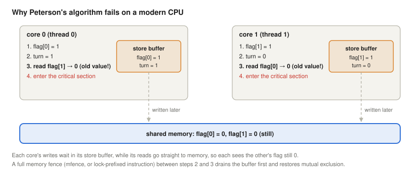
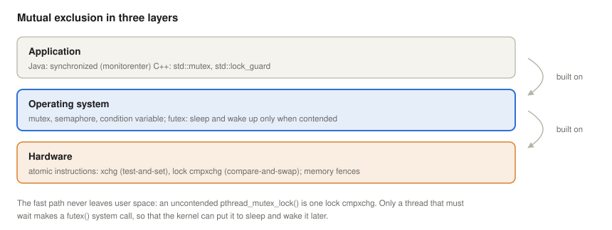
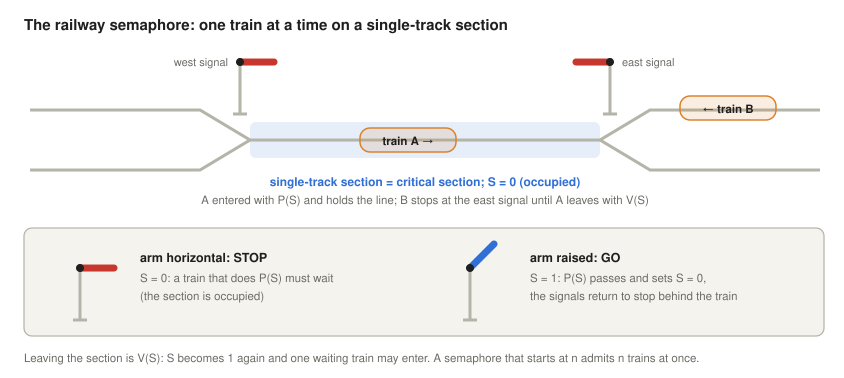
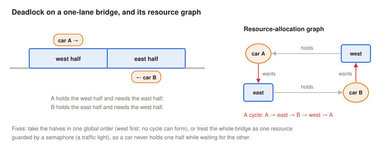
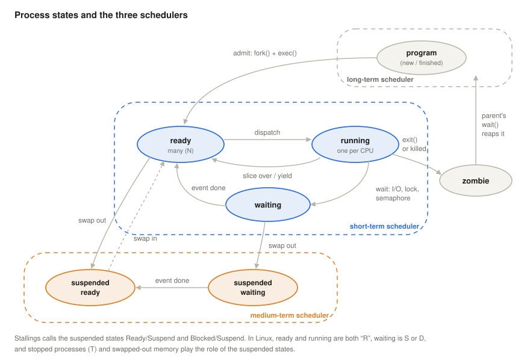
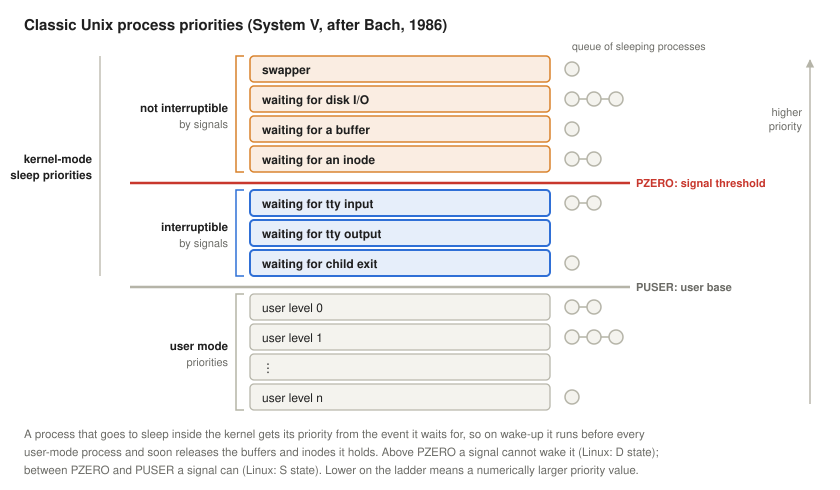
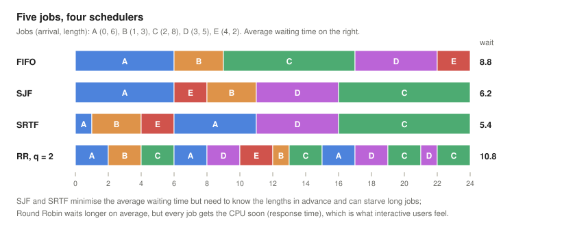
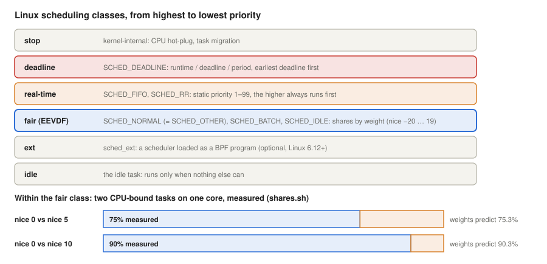

# Concurrency, Deadlocks, Process States and Linux Scheduling

*Operating Systems lecture: how processes share a CPU and shared data safely, why they can block each other for ever, which states a process passes through, and how Linux decides who runs next*

Previous: [Interrupts](../05-interrupts/). Next: [Two-Level Memories and Caches](../07-two-level-memory-and-cache/).

> **How to read this lecture.** Wherever a new abbreviation or concept appears, a box marked **Explained simply** follows. Click it to open a plain-language explanation. You can skip these boxes if you already know the terms.

## Learning objectives

The [interrupts lecture](../05-interrupts/) showed the mechanism that lets an operating system take the CPU away from a program at any moment, and the first race condition it causes. This lecture builds on it in three directions: how processes can share data correctly (concurrency), how they can get stuck waiting for each other (deadlock), and how the OS manages and schedules them (process states and scheduling), with Linux as the working example.

By the end, students will be able to:

- state the critical-section problem and its three requirements, trace a lost-update race (two withdrawals from one bank account) step by step, and explain why the test and the set of a lock must be one atomic step and why re-checking after the set does not help;
- explain Peterson's algorithm and why it fails on a modern multi-core CPU without memory fences;
- describe the three layers of synchronisation (hardware instruction, OS mutex and semaphore, language construct) and the futex fast path, and compare the cost of atomics, spinlocks and mutexes;
- use semaphores for mutual exclusion and for counting, and solve the producer–consumer and sleeping-barber problems;
- define deadlock, state the four Coffman conditions, draw a resource-allocation graph (including resources with several instances), and explain prevention, avoidance (banker's algorithm), detection and recovery; distinguish deadlock from livelock, starvation and priority inversion;
- draw the process state diagram, explain the long-, medium- and short-term schedulers, zombies and orphans, and map the states to Linux's `ps` codes, tracing interruptible and uninterruptible sleep back to the classic Unix sleep priorities;
- compute waiting, turnaround and response times for FIFO, SJF, SRTF, HRRN and Round Robin, and the efficiency cost of the time slice;
- explain Linux's scheduling classes, nice values and weights, and the EEVDF scheduler, and measure them.

<details>
<summary><b>Explained simply:</b> concurrency, process, thread, deadlock, scheduling</summary>

- **Concurrency:** several things in progress at the same time, either truly in parallel on several CPU cores or taking turns on one.
- **Process:** a running program, with its own memory. **Thread:** one line of execution inside a process; the threads of a process share its memory.
- **Deadlock:** a situation in which two or more processes each wait for something that another of them holds, so none of them can ever continue.
- **Scheduling:** deciding which process may use the CPU next, and for how long.

</details>

## From interrupts to concurrency

The interrupts lecture classified interrupts as **timer**, **I/O** (normal completion or an error condition), **program** (division by zero, overflow, illegal memory access) and **hardware failure** (power cut, memory parity error), and compared three ways of moving a block of data: **programmed I/O** (the CPU polls and does nothing useful), **interrupt-driven I/O with a buffer** (the CPU still copies the data) and **DMA** (the CPU only competes for the bus) ([Interrupts: classes](../05-interrupts/#classes-of-interrupts), [three I/O techniques](../05-interrupts/#moving-blocks-of-data-three-io-techniques)).

Each of these makes concurrency possible, and necessary:

- the **timer interrupt** lets the OS take the CPU away from a running program, so programs can share it (*preemption*);
- **I/O interrupts and DMA** let a program wait for a device while another one runs, so a process can be *waiting* instead of *running*;
- and because a switch can happen between any two instructions, programs that share data can interfere with each other: the **race condition** of the interrupts lecture, where two processes both passed a naive "test, then set" lock, and an interleaving left `X` with a wrong value ([Interrupts and concurrency](../05-interrupts/#interrupts-and-concurrency)).

On a multi-core CPU the problem is even sharper: two threads really run at the same moment, with no interrupt needed.

<details>
<summary><b>Explained simply:</b> preemption, polling, DMA, race condition, multi-core</summary>

- **Preemption:** taking the CPU away from a program before it has finished or given it up, like a referee ending one player's turn.
- **Polling:** asking a device "are you ready?" again and again.
- **DMA** (direct memory access): a helper chip that copies data between a device and memory without the CPU.
- **Race condition:** a bug where the result depends on the exact timing of two programs.
- **Multi-core:** a processor chip with several independent CPUs ("cores") that run at the same time.

</details>

## The critical-section problem

A race condition is easiest to see with money. Two cards belong to the same bank account, which holds 150. At the same moment, one card holder withdraws 100 from an ATM in Budapest and the other withdraws 100 from an ATM in Hong Kong. Both ATMs run the same code on the bank's server, as two concurrent processes sharing one variable, `balance`:

```text
withdraw(amount):
    b = balance                  // read the balance
    if b >= amount:              // check: is there enough money?
        balance = b - amount     // act: write the new balance
        dispense(amount)
```

Each request is correct on its own. Interleaved, they can go wrong:

| Step | ATM 1 (Budapest) | ATM 2 (Hong Kong) | `balance` |
|---|---|---|---|
| ① | reads `b = 150`; 150 ≥ 100, the check passes | | 150 |
| ② | | reads `b = 150`; 150 ≥ 100, the check passes | 150 |
| ③ | writes `balance = 150 − 100 = 50`; dispenses 100 | | 50 |
| ④ | | writes `balance = 150 − 100 = 50`; dispenses 100 | 50 |

The machines have paid out 200, and the account still shows 50: ATM 1's update has been overwritten and is lost. This is the classic **lost update**, and the pattern behind it is **check-then-act**: the decision (step ①) is based on a value that is no longer true when the action (step ③ or ④) happens. If the code re-read `balance` just before writing, the account would end at −50 instead, overdrawn although the check was meant to prevent exactly that. Either way, the read, the check and the write must form one indivisible unit. Banks get this from their database: the withdrawal runs as a **transaction** that locks the account row (or as a single atomic statement such as `UPDATE account SET balance = balance - 100 WHERE id = 42 AND balance >= 100`), so concurrent withdrawals from one account are **serialised**, executed one after the other.

The part of a program that works on shared data is its **critical section**. A correct solution to the critical-section problem must guarantee three things (Silberschatz et al., 2018):

1. **Mutual exclusion:** at most one process is in its critical section at a time.
2. **Progress:** if nobody is inside and some want to enter, one of them gets in; the decision cannot be postponed for ever.
3. **Bounded waiting:** a process that wants to enter will get in after a limited number of others have entered before it (no starvation).

It must also work whatever the relative speeds of the processes, and wherever an interrupt strikes.

The naive lock `while (S == 0); S = 0;` fails the first requirement because the **test** (`while (S == 0)`) and the **set** (`S = 0`) are two separate steps; an interrupt between them lets both processes in. The solution is a **test-and-set** instruction: a hardware instruction that tests and sets in one indivisible (atomic) step, `xchg` on x86, which the interrupts lecture used to build a spinlock.

### Two locks that do not work

Written as a semaphore, the naive lock is `while (s == 0); s--;` to enter and `s++;` to leave, with `s = 1` at the start. Let P1's critical section be `X = 1` and P2's be `X = 0; X = X + 1`. Run one after the other, in either order, both sections leave `X = 1`. The numbers give one interleaving:

| Step | P1 | P2 | `s` | `X` |
|---|---|---|---|---|
| ① | tests `s == 0`: false, leaves the loop | | 1 | |
| ② | | tests `s == 0`: false, leaves the loop | 1 | |
| ③ | `s--` | | 0 | |
| ④ | | `s--` | −1 | |
| ⑤ | | `X = 0` | −1 | 0 |
| ⑥ | `X = 1` | | −1 | 1 |
| ⑦ | | `X = X + 1` | −1 | 2 |

Both processes are inside, and `X` ends as 2, a value that no sequential order can produce. After both `s++` operations `s` is 1 again, so the lock even hides the evidence.

A tempting repair is to check afterwards whether the lock is really ours: each process writes its own ID into `S` and enters only if the ID is still there.

```c
retry:
    while (S != 0) ;              /* wait until the lock is free      */
    S = me;                       /* claim it with my ID (1 or 2)     */
    if (S != me) goto retry;      /* overwritten by the other? retry  */
    /* critical section */
    S = 0;
```

| Step | P1 | P2 | `S` |
|---|---|---|---|
| ① | sees `S == 0`, leaves the loop | | 0 |
| ② | | sees `S == 0`, leaves the loop | 0 |
| ③ | writes `S = 1` | | 1 |
| ④ | checks `S == 1`: still mine, enters | | 1 |
| ⑤ | | writes `S = 2` | 2 |
| ⑥ | | checks `S == 2`: still mine, enters | 2 |

The check catches the other process only if its write falls between my write and my check; it cannot see a write that comes later. A second check only moves the window. Two ways out remain: a hardware instruction that reads and writes in one atomic step (test-and-set), or an algorithm in which each process first announces its intention and then defers to the other, which is what Peterson's algorithm does.

<details>
<summary><b>Explained simply:</b> lost update, check-then-act, transaction, serialise, interleaving</summary>

- **Lost update:** two programs change the same value at the same time, and one change silently overwrites the other, as if it had never happened.
- **Check-then-act:** first look ("is there enough money?"), then do something based on what you saw. If someone else changes things between the look and the action, the action is based on old information.
- **Transaction:** a group of database operations that happens completely or not at all, and as if nobody else were using the database meanwhile.
- **Serialise:** make things happen one after the other instead of at the same time, like a single queue in front of one counter.
- **Interleaving:** the order in which the steps of two programs actually follow each other when they take turns on the CPU or run on two cores.

</details>

### Peterson's algorithm: a lock in plain software

Can mutual exclusion be achieved with ordinary reads and writes only, without a special instruction? For two processes, yes. Gary Peterson's algorithm (1981) uses two shared variables: `flag[i]`, "process *i* wants to enter", and `turn`, "whose turn it is to wait":

```c
static void lock(int i) {
    int j = 1 - i;
    flag[i] = 1;                 /* I want to enter ...                   */
    turn = j;                    /* ... but you go first if you want too  */
    while (flag[j] && turn == j)
        ;                        /* busy-wait                             */
}
static void unlock(int i) { flag[i] = 0; }
```

If both want to enter at the same time, both write `turn`, and the one who wrote it *last* waits; the other enters. The proof that this guarantees all three requirements fits on a page (Peterson, 1981), and the algorithm appears in every textbook. But on a modern multi-core processor it fails, as `peterson.c` shows ([Linux section](#peterson-on-a-real-multi-core-cpu)). The reason is not in the algorithm but in the hardware:



To be fast, each core puts its writes into a private **store buffer** and continues; the writes reach memory a little later. A later *read* from a different address may be served before the earlier *write* has become visible to the other core. On x86, for ordinary memory, this store-to-load reordering is the only kind of reordering the architecture allows (Intel Corporation, 2024), and it is exactly what Peterson's algorithm cannot tolerate: both cores write their flag, both read the other's flag as still 0, both enter. Processors with weaker memory models, such as ARM, reorder even more. The cure is a **memory fence**, an instruction that makes all earlier writes visible before any later read, or the C11/C++11 atomic operations, which insert the necessary fences. Correct synchronisation is therefore always built on the hardware's atomic instructions and fences, never on plain variables, and `volatile` in C does not help.

<details>
<summary><b>Explained simply:</b> critical section, mutual exclusion, starvation, atomic, xchg, busy-wait, store buffer, memory model, memory fence, volatile</summary>

- **Critical section:** the piece of code that touches shared data and must not be run by two at once.
- **Mutual exclusion:** the rule that only one may be inside at a time.
- **Starvation:** a process waits for ever because others always get in first.
- **Atomic:** indivisible: it happens completely or not at all, and nobody can see or interrupt it halfway.
- **`xchg`:** an x86 instruction that swaps a register with a memory location atomically; used as test-and-set.
- **Busy-wait:** waiting by checking a condition again and again in a loop, using the CPU all the time.
- **Store buffer:** a small queue inside each CPU core where written values wait before they reach memory, so the core does not have to wait for the slow memory.
- **Memory model:** the rules that say in which order one core's reads and writes can be seen by other cores.
- **Memory fence** (barrier): an instruction that forces the order: everything before the fence becomes visible before anything after it.
- **`volatile`:** a C keyword that tells the compiler not to optimise away reads and writes of a variable. It does not make them atomic and does not add fences.

</details>

## Three layers of mutual exclusion

Synchronisation is built in three layers: **applications** (Java, C++) use the **operating system's** mutex, which is built on the **hardware's** atomic test-and-set (or compare-and-swap) instruction.



- **Hardware** provides atomic instructions: test-and-set (`xchg`), **compare-and-swap** (`lock cmpxchg` on x86: "if the value is still what I read, replace it"), atomic increment (`lock add`), and fences.
- **The operating system** provides locks that can **sleep**: a thread that cannot get the lock is moved to the *waiting* state, uses no CPU, and is woken up when the lock is released. Linux implements this with the **futex** ("fast user-space mutex", Franke et al., 2002): the lock is a plain integer in the program's own memory, taken with an atomic instruction in user space; only if it is already taken does the thread make a `futex()` system call to sleep, and the releasing thread makes one to wake it. An uncontended lock never enters the kernel.
- **Programming languages** wrap this in constructs that are hard to misuse. Java's `synchronized` block compiles to the bytecodes `monitorenter` and `monitorexit`, and is released even when an exception occurs; C++11 offers `std::mutex` with `std::lock_guard`, which unlocks automatically at the end of the block ([Linux section](#the-three-layers-in-real-code)).

**Spin or sleep?** A spinlock busy-waits; a mutex sleeps. Sleeping costs two system calls and two context switches, a few microseconds; spinning costs nothing if the lock is released within a few hundred nanoseconds, but wastes a whole time slice if the holder has been preempted. The kernel uses spinlocks for very short critical sections (and where sleeping is impossible, as in interrupt handlers); applications should normally use mutexes. (glibc's default mutex sleeps as soon as it finds the lock taken; an "adaptive" mutex type that spins briefly first is also available.) The measurements in the Linux section show both sides: with two threads on two cores the spinlock is faster, with four threads on two cores it is twice as slow as the mutex.

<details>
<summary><b>Explained simply:</b> compare-and-swap, mutex, futex, system call, context switch, bytecode, exception, glibc, cache line</summary>

- **Compare-and-swap (CAS):** an atomic instruction: "if this memory location still holds the value I expect, write my new value; otherwise tell me it changed".
- **Mutex** (mutual-exclusion lock): a lock that one thread holds at a time; others wait, usually sleeping.
- **Futex:** Linux's building block for mutexes: a number in memory plus two system calls, "sleep while it has this value" and "wake up the sleepers".
- **System call:** a request from a program to the kernel. **Context switch:** the CPU stops running one thread and starts another, saving and restoring their registers.
- **Bytecode:** the instructions of the Java virtual machine, into which Java programs are compiled.
- **Exception:** an error that jumps out of the normal flow of a program (in Java and C++).
- **glibc:** the standard C library of most Linux systems; it contains `pthread_mutex_lock` and many other functions.
- **Cache line:** the unit (usually 64 bytes) in which data moves between memory and a core's cache. Two cores writing the same line must pass it back and forth.

</details>

## Semaphores: more than a lock

Dijkstra (1965) introduced the **semaphore**: a non-negative integer counter with two atomic operations, **P** and **V**, from Dutch words usually given as *proberen* ("try") and *verhogen* ("increase"); they are also called `wait` or `down`, and `signal`, `post` or `up`:

- `P(S)`: if S > 0, decrement it and continue; otherwise sleep until it is greater than 0 (this is Dijkstra's non-negative form; the interrupts lecture showed the equivalent variant in which S may go negative and then counts the waiting processes);
- `V(S)`: increment S, and wake one sleeper if there is any.

The name comes from the railway (Dijkstra's first note on the subject is titled *Over seinpalen*, "On semaphores"; Dijkstra, n.d.). On a single-track line, trains in both directions share one stretch of track, the critical section, and a **semaphore signal** at each end guards the entry. Its arm horizontal means stop, raised means go. A train that reaches the signal performs P: if the section is free, it enters and the signals behind it return to stop (S becomes 0); if not, it waits at the signal. A train that leaves the section performs V: the section is free again (S = 1), and one waiting train may go.



The interrupts lecture used a semaphore initialised to 1 as a lock (a **binary semaphore**). Initialised to *n*, it lets *n* processes in at once (a **counting semaphore**): *n* free printers, *n* database connections, *n* parking spaces. And because one process can call V while another calls P, a semaphore can also **signal** an event between processes, which a mutex cannot.

The classic example is the **producer–consumer** (bounded-buffer) problem: producers put items into a buffer of *N* slots, consumers take them out. Three semaphores solve it:

```text
semaphore mutex = 1      // protects the buffer itself
semaphore empty = N      // free slots
semaphore full  = 0      // filled slots

producer:  P(empty); P(mutex); put(item); V(mutex); V(full)
consumer:  P(full);  P(mutex); item = take(); V(mutex); V(empty)
```

A producer sleeps when the buffer is full, a consumer when it is empty, and nobody busy-waits. The order of the two P operations matters: a producer that took `mutex` first and then slept on `empty` would hold the buffer locked, and no consumer could ever free a slot, which is a deadlock.

**The sleeping barber.** Another classic from Dijkstra (1965): a barber's shop has one barber, one barber's chair and *n* chairs for waiting customers. With no customers, the barber sleeps in his chair. An arriving customer wakes the barber if he is asleep, sits down to wait if a chair is free, and leaves if all chairs are taken. The difficulty is a missed wake-up: a customer who sees the barber busy and is about to sit down, and a barber who finishes, sees no one waiting and is about to fall asleep, can each wait for the other for ever. Two semaphores used as signals and one as a lock solve it:

```text
semaphore customers = 0   // waiting customers; the barber sleeps on it
semaphore barber    = 0   // the barber is ready; a customer sleeps on it
semaphore mutex     = 1   // protects waiting
int waiting = 0           // customers on the waiting chairs (at most n)

barber:    loop { P(customers); P(mutex); waiting--; V(barber); V(mutex); cut_hair() }
customer:  P(mutex)
           if waiting < n:  waiting++; V(customers); V(mutex); P(barber); get_haircut()
           else:            V(mutex); leave()
```

Because a V is remembered by the counter even when nobody is waiting yet, no wake-up can be lost. The same structure appears in every server with a pool of worker threads and a bounded queue of requests: the barber is a worker, the chairs are the queue, and a customer who finds the queue full is a rejected request.

Semaphores are powerful but easy to misuse: one forgotten V, or a P and V swapped, and the program hangs or breaks mutual exclusion. **Monitors** (Hoare, 1974) package the shared data, the lock and **condition variables** (on which a thread can wait for a condition inside the lock) into one construct; Java objects with `synchronized`, `wait()` and `notify()`, and C++'s `std::condition_variable`, are monitors in practice. With POSIX threads, the bounded buffer looks like this:

```c
pthread_mutex_lock(&m);
while (count == N)                     /* buffer full: wait, releasing m meanwhile */
    pthread_cond_wait(&not_full, &m);
put(item); count++;
pthread_cond_signal(&not_empty);       /* wake one consumer, if any               */
pthread_mutex_unlock(&m);
```

Two details matter. `pthread_cond_wait` releases the mutex while sleeping and takes it back before returning, so the condition can be tested safely. And the test is a `while`, not an `if`: after being woken, the thread must check the condition again, because another thread may have got there first, and because the standard allows *spurious* wake-ups. This is because pthreads and Java use **Mesa semantics** (the signaller continues, the woken thread runs later), not Hoare's original semantics, in which the woken thread runs at once and the condition is guaranteed to hold (Lampson & Redell, 1980).

**Readers and writers.** Many shared structures are read far more often than written. A **readers–writer lock** (`pthread_rwlock_t`) lets any number of readers in together but a writer only alone; it must take care not to starve writers. The Linux kernel goes further for read-mostly data with **RCU** (read-copy-update): readers take no lock at all, and a writer publishes a new copy and frees the old one only when all readers that might still see it have finished (McKenney, 2023).

<details>
<summary><b>Explained simply:</b> semaphore, railway semaphore signal, P and V, binary and counting semaphore, producer–consumer, buffer, sleeping barber, missed wake-up, worker pool, monitor, condition variable, Mesa semantics, spurious wake-up, readers–writer lock, RCU</summary>

- **Semaphore:** a counter that controls entry, like a car park display: it counts down as cars enter, stops cars at 0, and counts up as cars leave.
- **P and V:** Dijkstra's Dutch names for "wait until you can take one" and "give one back".
- **Binary semaphore:** can only be 0 or 1, so it works as a lock. **Counting semaphore:** can be any number, for several identical resources.
- **Producer–consumer:** one part of a program makes items, another uses them, with a waiting area of limited size in between, like a bakery shelf between the baker and the customers.
- **Buffer:** that waiting area in memory.
- **Railway semaphore signal:** a post with a movable arm beside the track; arm horizontal means "stop", arm raised means "go". It lets only one train at a time onto a stretch of single track, the track that trains in both directions must share.
- **Sleeping barber:** a puzzle about a barber who sleeps when nobody is waiting and must be woken by the next customer, without anyone being forgotten.
- **Missed wake-up:** one side goes to sleep just after the other side's "wake up!" call, so the call is lost and both wait for ever. A semaphore counts the calls, so none are lost.
- **Worker pool:** a fixed number of threads in a server that take requests from a queue, like barbers taking customers from the waiting chairs.
- **Monitor:** a programming-language construct that bundles shared data with the lock that protects it, so you cannot forget to lock.
- **Condition variable:** a place inside a monitor where a thread can sleep until another thread tells it that something has changed ("the shelf is no longer empty").
- **Mesa semantics, spurious wake-up:** being woken up only means "something may have changed", not "your condition is true"; sometimes a thread is even woken for no reason at all. So it must look again.
- **Readers–writer lock:** a lock that lets many readers in at once, but a writer only alone, like a museum room that many may view but only one restorer may work in, with no visitors.
- **RCU** (read-copy-update): instead of locking, writers make a new copy and switch to it; old readers finish with the old copy, which is thrown away afterwards.

</details>

## Deadlock

A classic illustration is a one-lane bridge: two cars meet in the middle, and neither can go on. Seen as two halves, the bridge is two resources, and each car holds one and waits for the other:



A set of processes is **deadlocked** when each of them waits for an event that only another process of the set can cause. Coffman, Elphick and Shoshani (1971) showed that a deadlock can occur only if four conditions hold at the same time:

1. **Mutual exclusion:** a resource can be used by only one process at a time (a bridge half takes one car).
2. **Hold and wait:** a process holds a resource while waiting for another (each car stays on its half).
3. **No preemption:** a resource cannot be taken away; it is only released voluntarily (no crane lifts a car off).
4. **Circular wait:** there is a cycle of processes, each waiting for a resource held by the next.

A **resource-allocation graph** (Holt, 1972) makes this visible: an arrow from a process to a resource means "wants", from a resource to a process "held by". With one instance of each resource, a cycle in the graph means deadlock.

A gridlocked crossroads is the same situation with four parties. Every car going straight across needs two quarters of the crossing, the one it is in and the next one; when four cars have each entered one quarter, each waits for the quarter held by the next car, and the queues behind them make backing out impossible:


The graph uses Holt's standard notation: a **process** is a circle, a **resource** is a box with one dot for each **instance** (identical unit) of it, a **request edge** goes from a process to the box it waits for, and an **assignment edge** goes from one dot (the instance held) to its holder. With one instance per resource, a cycle is both necessary and sufficient for deadlock. With several instances, a cycle is necessary but not sufficient. Suppose resource R1 has two instances, one held by P1 and one by P3; P1 waits for R2, which P2 holds; P2 waits for R1. There is a cycle P1 → R2 → P2 → R1 → P1, yet P3 waits for nothing: it finishes, releases its instance of R1, P2 gets it and finishes, and then P1 (Silberschatz et al., 2018). Deciding deadlock in that case needs the reduction algorithm used by the banker's safety check: repeatedly let a process finish if its requests can be met, and see whether everyone can.

### Handling deadlocks

There are four strategies (Silberschatz et al., 2018; Stallings, 2018):

- **Prevention:** make one of the four conditions impossible. The most practical is to break **circular wait** with a global **lock order**: every program takes the west half before the east half, so no cycle can form. Breaking **hold and wait** means taking all resources at once (a semaphore acting as a "traffic light" lets one car onto the *whole* bridge); breaking **no preemption** means taking resources away (possible for the CPU or memory, not for a half-written file); breaking **mutual exclusion** means making a resource shareable (spooling a printer).
- **Avoidance:** the system knows in advance how much of each resource each process may need, and grants a request only if the resulting state is **safe**, that is, there is still an order in which every process can obtain its maximum and finish. **Dijkstra's banker's algorithm** (Dijkstra, 1965) checks this, like a bank that lends only if it can still satisfy all its customers' credit lines ([Linux section](#avoidance-the-bankers-algorithm)). It needs the maximum claims in advance, so general-purpose operating systems rarely use it.
- **Detection and recovery:** let deadlocks happen, find cycles in the wait-for graph, and break them by aborting a victim or rolling back its work. Database systems do exactly this with transactions. Detection needs global knowledge: the whole graph, at one moment. On one machine the kernel or the database has it; in a distributed system each node sees only its own locks, messages take time, and an assembled graph may contain edges that no longer exist (a "phantom" deadlock), so distributed systems often fall back on time-outs.
- **Ignoring the problem** (the "ostrich algorithm"): general-purpose operating systems, Linux and Windows included, do not detect deadlocks between user processes; it is the programmer's job to avoid them, and the user's job to kill a hung program. Inside the Linux kernel, the **lockdep** validator records the order in which every class of lock is taken and warns as soon as two code paths take two locks in opposite orders, even if the deadlock has never actually happened (Linux kernel documentation, n.d.-a).

The classic teaching example is Dijkstra's **dining philosophers** (Dijkstra, 1971): five philosophers around a table, one fork between each pair, each needs both neighbouring forks to eat. If all pick up their left fork at once, all wait for ever. Numbering the forks and always taking the lower-numbered first (a lock order) solves it.

### Relatives of deadlock

- **Livelock:** processes are not blocked but keep reacting to each other without progress, like two people who step aside in the same direction in a corridor again and again. A deadlock recovery that makes both parties back off and immediately retry in the same way can turn a deadlock into a livelock; random back-off times (as in Ethernet) are the usual cure.
- **Starvation:** a process could proceed but is always overtaken by others, for example a long job under shortest-job-first scheduling.
- **Priority inversion:** a high-priority task waits for a lock held by a low-priority task, which in turn cannot run because medium-priority tasks keep preempting it. In July 1997 this repeatedly reset the computer of NASA's Mars Pathfinder lander on Mars: a low-priority meteorological task held a mutex (inside the inter-task communication mechanism) that the high-priority bus-distribution task needed; when the bus scheduler found that the bus task had not finished its cycle, it reset the whole system. The engineers reproduced the problem on Earth and fixed it by uploading a patch that changed a global setting to turn on **priority inheritance** for that mutex: while a low-priority task holds a lock that a high-priority task needs, it temporarily runs at the high priority (Reeves, 1997). Linux offers the same with priority-inheritance futexes (`PTHREAD_PRIO_INHERIT`).

<details>
<summary><b>Explained simply:</b> resource, preemption of a resource, resource-allocation graph, gridlock, instance, request and assignment edge, cycle, distributed system, phantom deadlock, lock order, safe state, transaction, rollback, livelock, priority inversion, priority inheritance, watchdog, spooling, lockdep</summary>

- **Resource:** anything a process needs and may have to wait for: a lock, a printer, memory, a file.
- **Preemption of a resource:** taking it away from its holder by force.
- **Resource-allocation graph:** a drawing of who holds what and who wants what, with arrows.
- **Gridlock:** a traffic jam at a crossroads in which every car blocks the next one around the square, so nobody can move.
- **Instance:** one of several identical units of a resource, such as one of three identical printers. In the graph each instance is a dot.
- **Request edge, assignment edge:** the two kinds of arrows: "this process is waiting for that resource" and "this unit of the resource belongs to that process".
- **Cycle:** a path of arrows that comes back to where it started.
- **Distributed system:** many computers that work together over a network, none of which sees everything at once.
- **Phantom deadlock:** a deadlock that a detector reports from outdated information, although it has already gone away.
- **Lock order:** a fixed rule that everybody takes locks in the same order (always the west half first).
- **Safe state:** a situation from which the system can still give everyone what they may ask for, in some order.
- **Transaction, rollback:** a database transaction is a group of changes that happens completely or not at all; rolling back means undoing it.
- **Livelock:** everybody is busy moving, but nobody gets anywhere.
- **Priority inversion:** an important task is stuck behind an unimportant one. **Priority inheritance:** the unimportant task is temporarily promoted so that it finishes quickly and lets the important one go.
- **Watchdog:** a timer that restarts the computer if the software stops reporting that it is alive.
- **Spooling:** instead of letting programs use a printer directly, their output is saved to disk and printed one job after the other by a single service.
- **lockdep:** a checker built into the Linux kernel that remembers in which order locks are taken and warns about orders that could deadlock.

</details>

## The process state space

A **process** is a program in execution: *process = running program + context*. The **context** is everything needed to stop the process and continue it later as if nothing had happened: the CPU registers (including the program counter), the memory map, open files, the scheduling state. The OS keeps it in a **process control block** (PCB); in Linux, a `struct task_struct`. A PCB holds at least the process ID and the parent's ID, the state, the priority and other scheduling data, the saved registers (program counter, status word, stack pointer), pointers to the memory-management data (page tables), the open files, and accounting data such as the CPU time used. Linux creates a process with `fork()`, which duplicates the calling process, and usually loads a new program into the copy with `exec()`.



The diagram shows the seven-state model:

- **Ready** (many processes): able to run, waiting only for a CPU. **Running** (one process per CPU core): executing. The **dispatcher** moves a process from ready to running; the timer interrupt (time slice over) or the process itself (yield) moves it back.
- **Waiting** (often also called *blocked*): the process waits for an event, the end of an I/O operation, data in a buffer, a semaphore. When the event happens (an interrupt, a V operation), it becomes ready again, not running: it has to wait for the CPU like everyone else.
- **Suspended ready** and **suspended waiting** (Stallings calls them Ready/Suspend and Blocked/Suspend): the process has been moved out of memory (swapped out) to make room for others. A suspended waiting process whose event happens becomes suspended ready; it must be swapped in before it can run.
- **Zombie**: the process has ended (by `exit()` or because it was killed), but its exit status is kept until its parent collects it with `wait()`. Then the last trace is removed: the parent **reaps** the zombie. Every process that ends, normally or by a signal, from any state, passes through this state; the only exception is a child whose parent has declared that it does not want exit statuses (by ignoring `SIGCHLD` or setting `SA_NOCLDWAIT`), which the kernel removes at once.

The diagram is divided into three regions by **how often** decisions are made (Stallings, 2018):

| Scheduler | Decides | How often | In Linux |
|---|---|---|---|
| long-term | which programs become processes (admission) | rarely: when jobs are submitted | batch job systems, `systemd` limits, cgroup `pids` limits |
| medium-term | which processes stay in memory | seconds | swapping and memory reclaim, cgroup freezer, stopping with `SIGSTOP` (related: the out-of-memory killer, which ends processes instead of suspending them) |
| short-term | which ready process runs next | milliseconds: when the running task blocks or yields, or when a reschedule has been requested and the kernel returns from an interrupt or system call | the CPU scheduler (EEVDF and the other classes) |

**Linux's states.** `ps` shows the state of every process in its `STAT` column (procps-ng, n.d.):

| Code | Meaning | In the diagram |
|---|---|---|
| `R` | running or runnable (on a run queue) | ready *and* running |
| `S` | interruptible sleep: waiting for an event, wakes up on a signal | waiting |
| `D` | uninterruptible sleep, usually inside I/O | waiting (usually cannot even be killed until the I/O ends) |
| `T`, `t` | stopped by a job-control signal, or by a debugger | close to suspended |
| `Z` | zombie: terminated but not reaped by its parent | zombie |
| `I` | idle kernel thread | (kernel housekeeping) |

Linux does not distinguish ready from running in `ps`, because the difference changes thousands of times per second. Nor does it have separate suspended states: it swaps out individual memory pages rather than whole processes, so a process can be partly in memory. If a parent ends before its children, the **orphans** are adopted by `init` (PID 1, or a designated "subreaper"), which reaps them.

**Where S and D come from.** The two kinds of sleep go back to the classic Unix kernel, which gave every sleeping process a priority according to *what* it was waiting for (Bach, 1986):



A process that goes to sleep inside a system call keeps a **kernel-mode sleep priority** set by the event it waits for: the swapper highest, then waiting for disk I/O, for a buffer, for an inode, then waiting for terminal input or output, and lowest waiting for a child to exit. All of these are above every **user-mode priority**, so a woken process finishes its kernel work quickly and releases the buffers and inodes it may hold, which other processes need. A threshold divides the kernel priorities. A process sleeping above it (disk I/O, buffers, inodes) cannot be woken by a signal: the event is sure to come soon, and abandoning the operation halfway could leave kernel data structures inconsistent. A process sleeping below it (terminal, child exit) may wait indefinitely, so a signal wakes it and the system call returns early with an error (`EINTR`). Linux keeps exactly this distinction as the `D` (uninterruptible, `TASK_UNINTERRUPTIBLE`) and `S` (interruptible, `TASK_INTERRUPTIBLE`) states, and adds a "killable" variant of `D` that only fatal signals can interrupt. It no longer gives a woken process a priority according to the event; instead, the fair scheduler usually lets a task that wakes up after a sleep run soon, because it has used less than its share of the CPU.

<details>
<summary><b>Explained simply:</b> context, register, program counter, process control block, status word, accounting, fork, exec, dispatcher, yield, swap, zombie, reap, signal, SIGCHLD, orphan, init, cgroup, subreaper, admission, sleep priority, swapper, inode, tty, EINTR</summary>

- **Context:** everything the CPU and the OS need to remember about a process to continue it later, like a bookmark plus notes on the desk.
- **Register:** a tiny, very fast storage place inside the CPU. The **program counter** is the register that holds the address of the next instruction.
- **Process control block (PCB):** the OS's record card about one process.
- **Status word** (PSW, program status word): a register with the CPU's flags, such as the result of the last comparison and whether interrupts are allowed. **Accounting:** bookkeeping, such as how much CPU time a process has used.
- **`fork()`:** makes a copy of the running process. **`exec()`:** replaces the program in a process with another program.
- **Dispatcher:** the part of the OS that actually hands the CPU to the chosen process.
- **Yield:** a process voluntarily gives up the CPU.
- **Swap out / swap in:** move a process's memory to disk to free RAM, and bring it back later.
- **Zombie:** a finished process that still has an entry in the process table, because its parent has not yet asked how it ended. **Reap:** the parent collects that information, and the entry disappears.
- **Signal:** a short message the OS delivers to a process, such as "stop" (`SIGSTOP`) or "terminate" (`SIGKILL`).
- **Orphan:** a process whose parent has ended. **init:** the first process of the system (PID 1), which adopts orphans.
- **cgroup** (control group): a Linux feature that groups processes and limits their CPU, memory or number of processes.
- **Subreaper:** a process that has asked to adopt orphaned descendants instead of PID 1.
- **Admission:** deciding whether a new job may start at all, or must wait.
- **SIGCHLD:** the signal a parent receives when one of its children ends.
- **Sleep priority:** in classic Unix, how urgently a sleeping process should run once its event arrives, depending on what it was waiting for.
- **Swapper:** the classic Unix process that moves whole processes between memory and disk.
- **Inode:** the record on disk (and its copy in memory) that describes one file. **tty:** a terminal, the keyboard-and-screen line of a user (from "teletypewriter").
- **EINTR:** the error code a system call returns when a signal interrupted its waiting ("interrupted system call"); the program may simply try again.

</details>

## Scheduling algorithms

The short-term scheduler chooses, from the ready queue, the process to run next. What is "best" depends on the goal (Silberschatz et al., 2018):

- **CPU utilisation** and **throughput** (jobs finished per hour) matter for batch work;
- **turnaround time** (from arrival to completion) and **waiting time** (time spent in the ready queue) matter for jobs;
- **response time** (from arrival to the first time the job runs) matters for interactive users;
- **fairness** and the absence of starvation matter for everyone.

Four classic algorithms:

- **FIFO** (first in, first out; also FCFS, first come, first served): run each job to completion in arrival order. Simple and fair in a sense, but one long job makes everybody behind it wait (the *convoy effect*).
- **SJF** (shortest job first): run the shortest ready job next. For a set of jobs that are all available at the start, it gives the minimum average waiting time of all non-preemptive algorithms. Its preemptive form, **SRTF** (shortest remaining time first), switches to a newly arrived job if it is shorter than what remains of the current one. Two catches: job lengths are not known in advance, so they are predicted, usually by an exponential average of the earlier CPU bursts, $\tau_{n+1} = \alpha t_n + (1-\alpha) \tau_n$; and long jobs can starve. There is also a cost: choosing the shortest of $n$ ready jobs by scanning the list takes $O(n)$ time at every decision; keeping the queue sorted in a heap or tree makes it $O(\log n)$.
- **HRRN** (highest response ratio next): a non-preemptive compromise between SJF and FIFO (Stallings, 2018). Whenever the CPU becomes free, it computes for every ready job the **response ratio** $R = (W + S) / S$, where $W$ is the time the job has waited so far and $S$ its (predicted) service time, and runs the job with the largest $R$. A newly arrived job has $R = 1$; short jobs gain quickly, because $W$ is divided by a small $S$, but every waiting job's ratio keeps growing, so even a long job eventually beats any newcomer: no starvation, without an explicit aging rule.
- **RR** (Round Robin): FIFO with a time limit. Each job runs for at most one **time slice** (quantum) $q$, then goes to the back of the ready queue. No job waits more than $(n-1) q$ for its turn, which gives good response times.



The examples follow two conventions, which hand calculations must also use: a job that arrives at the moment another is preempted enters the ready queue *before* the preempted job, and ties go to the job that has been waiting longer.

**HRRN by hand.** For the same five jobs, A runs first (alone at time 0) until 6. Then the ratios decide at every completion:

| Time | B (arr. 1, S = 3) | C (arr. 2, S = 8) | D (arr. 3, S = 5) | E (arr. 4, S = 2) | Runs |
|---|---|---|---|---|---|
| 6 | (5 + 3) / 3 = 2.67 | (4 + 8) / 8 = 1.50 | (3 + 5) / 5 = 1.60 | (2 + 2) / 2 = 2.00 | B, 6–9 |
| 9 | | (7 + 8) / 8 = 1.88 | (6 + 5) / 5 = 2.20 | (5 + 2) / 2 = 3.50 | E, 9–11 |
| 11 | | (9 + 8) / 8 = 2.13 | (8 + 5) / 5 = 2.60 | | D, 11–16 |
| 16 | | only C is left | | | C, 16–24 |

The waiting times are A 0, B 5, C 14, D 8, E 5, on average 6.4: between SJF (6.2) and FIFO (8.8). Unlike SJF, HRRN ran B before the shorter E, because B had waited longer. Its real advantage shows when short jobs keep arriving: SJF postpones a long job as long as there is any shorter one, while under HRRN the long job's ratio grows until it wins ([Linux section](#scheduling-algorithms-side-by-side)).

**The cost of the time slice.** Every switch costs time $s$ for the OS: saving and restoring registers, running the scheduler, and refilling caches. With quantum $q$, the share of CPU time left for the applications is the **efficiency**:

$$\eta = \frac{\text{application time}}{\text{application time} + \text{OS time}} = \frac{q}{q + s}$$

A small $q$ gives quick responses but low efficiency; a large $q$ gives high efficiency but turns Round Robin into FIFO. With the switch cost measured below ($s \approx 1.5\ \mu s$, without cache effects) and $q = 4$ ms, $\eta \approx 0.9996$ (99.96%); the real limit on small slices is the cache refill and the loss of response-time benefit, not the switch itself. Real systems combine the ideas: **priority scheduling** (with **aging**, slowly raising the priority of jobs that wait long, against starvation), and **multilevel feedback queues**, which give short slices and high priority to jobs that often block (interactive ones) and longer slices to CPU-bound ones.

<details>
<summary><b>Explained simply:</b> throughput, turnaround, waiting and response time, FIFO/FCFS, convoy effect, SJF, SRTF, burst, exponential average, O(n), HRRN, response ratio, Round Robin, quantum, Gantt chart, aging</summary>

- **Throughput:** how many jobs are finished per unit of time.
- **Turnaround time:** from when a job arrives until it is finished. **Waiting time:** the part of that spent waiting in the queue. **Response time:** from arrival until the job first gets the CPU.
- **FIFO / FCFS:** first come, first served, like a queue at the post office.
- **Convoy effect:** many short jobs stuck behind one long one, like cars behind a slow truck.
- **SJF / SRTF:** always serve the shortest job (or the one with the least work left) first, like letting the customer with one item go ahead at the till.
- **CPU burst:** a stretch of time in which a process computes without waiting.
- **Exponential average:** a running average in which recent values count more than older ones.
- **O(n), O(log n):** "big-O" notation for how the work grows with the number of items: O(n) doubles when n doubles; O(log n) grows by only one step when n doubles.
- **HRRN, response ratio:** a score for each waiting job: (time waited + time needed) divided by time needed. Short jobs score high quickly, but a long job's score also keeps rising while it waits, so its turn surely comes.
- **Round Robin, quantum:** everybody gets a short turn (the quantum) in a circle, like passing a ball around.
- **Gantt chart:** a bar chart that shows who used the CPU when.
- **Aging:** the longer a job has waited, the higher its priority becomes, so it cannot wait for ever.

</details>

## Linux scheduling

Linux's CPU scheduler has been rewritten several times, each time for the same problem, the cost of choosing:

- **Linux 2.4** scanned the whole run queue at every decision to compute each task's "goodness": an $O(n)$ scheduler that slowed down with many processes.
- **Linux 2.6** (2003) brought Ingo Molnár's **O(1) scheduler**: an array of 140 priority queues with a bitmap, so finding the highest-priority task took constant time; heuristics guessed which tasks were interactive.
- **Linux 2.6.23** (October 2007) replaced it with the **Completely Fair Scheduler (CFS)**: each task accumulates *virtual runtime* (its CPU time divided by its weight), the tasks are kept in a red-black tree ordered by virtual runtime, and the one that has run least runs next, in $O(\log n)$ (Linux kernel documentation, n.d.-b).
- **Linux 6.6** (2023) replaced CFS with **EEVDF**, Earliest Eligible Virtual Deadline First, based on an algorithm by Stoica and Abdel-Wahab (1995) and implemented by Peter Zijlstra. Each task has a *lag* (how much CPU time it is owed compared with a perfectly fair share); only tasks with non-negative lag are *eligible*, and among them the one with the earliest *virtual deadline* (its eligible time plus its time slice divided by its weight) runs first. Tasks that ask for shorter slices (since Linux 6.12 through `sched_setattr()`) thus get earlier deadlines and better latency, without getting more CPU in total (Linux kernel documentation, n.d.-c).
- **Linux 6.12** (2024) added **sched_ext**, which lets a scheduling policy be loaded at run time as a BPF program, for experiments and special workloads.

**Scheduling classes.** The scheduler is a stack of classes; a class runs only when no class above it has a runnable task:



- **SCHED_DEADLINE** (since Linux 3.14): the task declares a runtime, a deadline and a period ("10 ms of CPU in every 100 ms, finished by the 50 ms mark"), and the kernel schedules by earliest deadline first, with admission control that refuses tasks it could not satisfy.
- **SCHED_FIFO** and **SCHED_RR** (real-time): fixed priorities from 1 to 99; the highest always runs. FIFO runs until the task blocks or yields; RR adds a time slice among tasks of equal priority (100 ms by default). To protect the system from a runaway real-time task, ordinary tasks are guaranteed a small share: traditionally by **RT throttling** (real-time tasks may use at most 950 ms of every second), and since Linux 6.12 by a deadline "fair server" that reserves 50 ms of every second on each CPU for the fair class, even under real-time load (Zijlstra, 2024). Strictly speaking, then, a lower class can run while a higher one is runnable, but only within this reserve.
- **Fair class** (`SCHED_NORMAL`, also called `SCHED_OTHER`, plus `SCHED_BATCH` and `SCHED_IDLE`): ordinary processes, scheduled by EEVDF. Their share is set by the **nice** value, from −20 (greedy) to +19 (nice to others). Each nice step changes the weight by a factor of about 1.25: nice 0 has weight 1024, nice 5 has 335, nice 10 has 110. Two CPU-bound tasks on one core therefore share it in proportion to their weights: 1024 / (1024 + 335) = 75.3% for nice 0 against nice 5, which is what the measurement shows ([Linux section](#fair-shares-nice-and-weights)).

**Many cores.** Linux keeps a separate run queue per CPU, so most scheduling decisions need no global lock. A periodic **load balancer** migrates tasks from busy to idle CPUs, preferring nearby ones (cores sharing a cache, then the same socket, then other NUMA nodes), because a migrated task loses its warm caches. **CPU affinity** restricts a task to a set of CPUs: `taskset -c 0`, used throughout the demonstrations, pins a process to core 0 so that the processes really compete for one CPU.

**Groups.** Weights also apply to groups of tasks. With control groups (cgroup v2), `cpu.weight` (default 100) divides the CPU between groups (for example between containers or systemd services) before the tasks inside a group divide its share by nice values. Desktop distributions also enable **autogroup**, which puts every terminal session into its own group: nice values then only compete *within* a session, so two CPU-bound programs started from two different terminals share a core about 50/50 whatever their nice values.

**When does a switch happen?** A running fair task is checked at every timer tick and when other tasks wake up. EEVDF's base slice is 0.7 ms multiplied by $1 + \log_2(\text{number of CPUs})$, counting at most 8 CPUs (Zhou, 2025), but a preemption can only take effect at a tick or another scheduling point, so on a kernel with a 250 Hz timer (a tick every 4 ms) two CPU-bound tasks alternate about every 4 ms. How eagerly the kernel preempts *itself* is a build and boot option (`none`, `voluntary`, `full`, `lazy`; which ones are offered depends on the kernel version and architecture): servers favour throughput, desktops and real-time systems favour latency. This kernel reports `Dynamic Preempt: none` at boot.

<details>
<summary><b>Explained simply:</b> run queue, red-black tree, virtual runtime, weight, lag, eligible, virtual deadline, BPF, real-time, nice, timer tick, Hz, load balancer, NUMA, CPU affinity, autogroup, cpu.weight, fair server</summary>

- **Run queue:** the kernel's list of ready tasks.
- **Red-black tree:** a sorted data structure in which finding, inserting and removing take about $\log_2 n$ steps.
- **Virtual runtime:** CPU time used, scaled by the task's weight, so heavier tasks' clocks run slower.
- **Weight:** how big a share of the CPU a task deserves compared with others.
- **Lag:** how far behind (or ahead of) its fair share a task is. **Eligible:** allowed to run now, because it is not ahead.
- **Virtual deadline:** the virtual time by which a task should have received its next slice; the earliest one runs first.
- **BPF:** a safe way to run small, checked programs inside the Linux kernel.
- **Real-time:** a task that must react within a guaranteed time, such as a machine controller.
- **Nice:** a number that says how "nice" a process is to others: a higher nice value means a smaller share of the CPU.
- **Timer tick, Hz:** the kernel's regular clock interrupt; 250 Hz means 250 ticks per second, one every 4 ms.
- **Load balancer:** the part of the scheduler that moves tasks from busy CPUs to idle ones.
- **NUMA** (non-uniform memory access): in big servers, each processor has its own memory, and reaching another processor's memory is slower.
- **CPU affinity:** the set of CPUs a task is allowed to run on.
- **Autogroup, `cpu.weight`:** ways to share the CPU between groups of processes first (terminal sessions, containers), and only then between the processes inside a group.
- **Fair server:** a reserved slice of CPU time for ordinary processes, so that real-time processes cannot take everything.

</details>

## The same ideas on Linux (x86-64)

The outputs below come from a real system: an Ubuntu 24.04 environment in a cloud data centre with 2 virtual CPU cores (Intel Xeon), running Linux 6.18 with a 250 Hz timer, gcc 13 and OpenJDK 21. Timings vary from run to run and between machines; the proportions are what matter.

<details>
<summary><b>Explained simply:</b> console, gcc, -O2, pthread, strace, taskset, ps</summary>

- **Console** (terminal): a window where you type commands as text. Lines starting with `$` are what you type; the other lines are the computer's answer.
- **gcc:** the C compiler. `-O2` asks it to optimise; `-pthread` adds thread support.
- **pthread:** the standard thread library of Unix-like systems.
- **strace:** a tool that shows the system calls a program makes.
- **taskset -c 0:** run a program on CPU core 0 only.
- **ps:** lists processes and their properties.

</details>

### Peterson on a real multi-core CPU

`peterson.c` runs Peterson's algorithm in two threads, ten million entries each. Inside the critical section each thread writes its number into `owner` and checks that it is still there; if not, the other thread was inside at the same time. With the argument `fence`, a full memory fence is placed between setting `turn` and reading the other's flag:

```console
$ gcc -O1 -pthread -o peterson peterson.c
$ ./peterson
without fence: 20000000 entries, 111 times both threads were inside
$ ./peterson
without fence: 20000000 entries, 51 times both threads were inside
$ ./peterson
without fence: 20000000 entries, 69 times both threads were inside
$ ./peterson fence
with fence   : 20000000 entries, 0 times both threads were inside
$ ./peterson fence
with fence   : 20000000 entries, 0 times both threads were inside
```

A textbook-correct algorithm violates mutual exclusion dozens of times per run, rarely enough to pass a quick test. (The check can miss some overlaps, so these are lower bounds.) The disassembly shows the fence: gcc implements `__atomic_thread_fence(__ATOMIC_SEQ_CST)` not with `mfence` but with a locked no-op on the stack, which orders ordinary memory accesses the same way and is cheaper:

```console
$ objdump -d --no-show-raw-insn peterson | grep -A1 'lock or'
    11f8:	lock orq $0x0,(%rsp)
    11fe:	jmp    1237 <worker+0x6e>
```

### Atomics, spinlocks and mutexes

`counter.c` lets two threads increment one counter ten million times each, in four ways: no protection, an atomic increment (`lock add`), a test-and-set spinlock, and a `pthread_mutex`:

```console
$ gcc -O2 -pthread -o counter counter.c
$ ./counter none
none   2 threads: x =  11488696 (expected  20000000)   0.05 s    2.6 ns per increment
$ ./counter atomic
atomic 2 threads: x =  20000000 (expected  20000000)   0.46 s   22.8 ns per increment
$ ./counter spin
spin   2 threads: x =  20000000 (expected  20000000)   1.01 s   50.3 ns per increment
$ ./counter mutex
mutex  2 threads: x =  20000000 (expected  20000000)   2.01 s  100.4 ns per increment
```

Correctness costs a factor of about 9 (atomic) to 39 (mutex) here. The racy version also moves the counter's cache line between the cores, but its plain stores go into the store buffer; a locked instruction must own the cache line exclusively and drain the store buffer before it completes, at every single increment. The atomic instruction is the cheapest correct solution for a single counter; a lock is needed when the critical section is more than one instruction. With more threads than cores the picture changes:

```console
$ ./counter spin 4
spin   4 threads: x =  40000000 (expected  40000000)   6.51 s  162.8 ns per increment
$ ./counter mutex 4
mutex  4 threads: x =  40000000 (expected  40000000)   3.44 s   85.9 ns per increment
```

With four threads on two cores, a thread is often preempted while holding the spinlock, and the others spin uselessly for their whole time slice; the mutex puts them to sleep instead, and is now twice as fast.

**The futex fast path.** How often does the mutex actually enter the kernel? `strace -c` counts the system calls:

```console
$ strace -f -c -e trace=futex ./counter mutex
mutex  2 threads: x =  20000000 (expected  20000000)   1.30 s   64.9 ns per increment
% time     seconds  usecs/call     calls    errors syscall
------ ----------- ----------- --------- --------- ----------------
100.00    0.493130          13     37531     13513 futex
```

Twenty million lock operations needed only 37,531 `futex()` calls: in more than 99.8% of the cases the lock was taken and released entirely in user space with one atomic instruction. (The "errors" are `futex` waits that returned at once because the lock had already been released, a normal race between the two threads.)

### The three layers in real code

At the application layer, Java's `synchronized` block (`Counter.java`) compiles to two bytecodes, with a second `monitorexit` on the exception path:

```console
$ javac Counter.java && javap -c Counter
  public void inc();
    Code:
       0: aload_0
       1: dup
       2: astore_1
       3: monitorenter
       4: aload_0
       5: dup
       6: getfield      #7                  // Field x:J
       9: lconst_1
      10: ladd
      11: putfield      #7                  // Field x:J
      14: aload_1
      15: monitorexit
      16: goto          24
      19: astore_2
      20: aload_1
      21: monitorexit
      22: aload_2
      23: athrow
      24: return
```

C++'s `std::lock_guard<std::mutex>` (`counter_cpp.cpp`) compiles to a call into the C library, and the C library's `pthread_mutex_lock` reaches the hardware layer, a compare-and-swap:

```console
$ g++ -O2 -c counter_cpp.cpp && objdump -dr -C counter_cpp.o | grep -A1 call
   f:	e8 00 00 00 00       	call   14 <inc()+0x14>
			10: R_X86_64_PLT32	pthread_mutex_lock-0x4
$ objdump -d /usr/lib/x86_64-linux-gnu/libc.so.6 --start-address=0xa00d0 --stop-address=0xa0170 | grep 'lock cmpxchg'   # 0xa00d0: address of pthread_mutex_lock (objdump -T)
   a0121:	f0 0f b1 17          	lock cmpxchg %edx,(%rdi)
```

The three layers, application, operating system and hardware, appear in one call chain.

### The bridge: a deadlock you can watch

`bridge.c` models the one-lane bridge as two mutexes, the west and the east half. A car going east takes the west half, drives for 1 ms, then takes the east half; a car going west does the opposite. In `naive` mode a car gives up and backs off if it waits more than 2 seconds for the far half; `ordered` makes every car take the west half first; `semaphore` lets one car at a time onto the whole bridge:

```console
$ gcc -O2 -pthread -o bridge bridge.c
$ ./bridge naive
naive       2 cars:   1 crossed,   1 stuck in a deadlock (gave up after 2 s)
$ ./bridge naive 20
naive      40 cars:   0 crossed,  40 stuck in a deadlock (gave up after 2 s)
$ ./bridge ordered 20
ordered    40 cars:  40 crossed,   0 stuck in a deadlock (gave up after 2 s)
$ ./bridge semaphore 20
semaphore  40 cars:  40 crossed,   0 stuck in a deadlock (gave up after 2 s)
```

With two cars, each holds its half and waits for the other: a deadlock. One of them times out first and backs off (in this program it gives up for good), and the other crosses: **recovery** by aborting a victim. With twenty cars from each side, recovery achieves nothing in this run: the two cars at the front time out at nearly the same moment, both give up, the next two drive on and deadlock again, and not a single car crosses. It is a chain of repeated deadlocks, each "resolved" by aborting both victims. The exact counts vary from run to run, because they depend on which time-out expires first. Breaking circular wait with a lock order, or hold-and-wait with a semaphore for the whole bridge, prevents the deadlock and every car crosses.

In `stuck` mode the cars wait without a time-out. The process hangs for ever, and `ps` shows why:

```console
$ ./bridge stuck &
$ ps -L -o pid,tid,stat,wchan:20,comm -p $(pgrep -x bridge)
  PID   TID STAT WCHAN                COMMAND
 2595  2595 Sl   futex_do_wait        bridge
 2595  2597 Sl   futex_do_wait        bridge
 2595  2598 Sl   futex_do_wait        bridge
$ cat /proc/2595/task/2597/stack
[<0>] futex_do_wait+0x48/0x90
[<0>] __futex_wait+0x9c/0x110
[<0>] futex_wait+0x6b/0x120
[<0>] do_futex+0x102/0x260
[<0>] __x64_sys_futex+0x108/0x200
[<0>] x64_sys_call+0x9c8/0x2350
[<0>] do_syscall_64+0x70/0x1e0
[<0>] entry_SYSCALL_64_after_hwframe+0x76/0x7e
```

All three threads (the main thread waiting in `pthread_join`, and the two cars) are in state `S`, sleeping in the kernel's futex wait. They use no CPU, and the kernel does not notice that they will never be woken: Linux, like other general-purpose systems, follows the ostrich strategy for user-space deadlocks.

### Avoidance: the banker's algorithm

`bankers.py` checks whether a state is safe, using the classic example of five processes and three resource types from Silberschatz et al. (2018), and whether a request can be granted without leaving the safe region:

```console
$ python3 bankers.py P1 1 0 2
available: [3, 3, 2]
state is SAFE, e.g. order P1 -> P3 -> P0 -> P2 -> P4
request P1 [1, 0, 2]: granted (safe order P1 -> P3 -> P0 -> P2 -> P4)
$ python3 bankers.py P4 3 3 0
available: [3, 3, 2]
state is SAFE, e.g. order P1 -> P3 -> P0 -> P2 -> P4
request P4 [3, 3, 0]: refused: granting it would make the state unsafe, P4 must wait
```

(The book checks P4's request after granting P1's; here it is checked against the initial state, so the reason for refusing differs.) P4's request could be satisfied from the free resources right now, but afterwards no process could be sure to finish; the banker refuses, although no deadlock exists yet. An unsafe state is not yet a deadlock, but the system can no longer guarantee to avoid one.

### Process states with `ps`

`states.sh` puts processes into different states: `sleep` waits for a timer, a shell loop computes, a second loop is stopped with `SIGSTOP`, and `zombie.c` forks a child that exits at once while the parent sleeps for 10 seconds before calling `waitpid()`:

```console
$ ./states.sh
parent 2179: child 2181 has exited; sleeping 10 s without wait()
  PID  PPID STAT WCHAN          CMD
 2175  2173 S    hrtimer_nanosl sleep 100
 2176  2173 R    -              bash -c while :; do :; done
 2177  2173 T    do_signal_stop bash -c while :; do :; done
 2179  2173 S    hrtimer_nanosl ./zombie
 2181  2179 Z    -              [zombie] <defunct>
parent: reaped child 2181, exit status 42
--- child 2181 after waitpid():
  PID  PPID STAT CMD
(no such process any more)
```

The `WCHAN` column names the kernel function in which a sleeping process waits: a high-resolution timer for `sleep`, the signal-stop code for the stopped one. The zombie has no memory and no code any more, only its process-table entry and exit status (42), which the parent collects with `waitpid()`; after that, the PID is gone.

### Stopping and continuing a process

`SIGSTOP` takes a process off the CPU until a `SIGCONT` arrives; unlike most signals, it cannot be caught or ignored. `stopcont.sh` starts a CPU-bound loop on core 0, stops it, waits, and continues it, printing each time the state letter (field 3) and the user-mode CPU time in clock ticks (field 14, `utime`, 100 ticks per second here) from `/proc/PID/stat`, and the `ps` view:

```console
$ ./stopcont.sh
running for 1 s:       state R  utime   98 ticks   ps: R    -
after SIGSTOP:         state T  utime   99 ticks   ps: T    do_signal_stop
2 s later, stopped:    state T  utime   99 ticks   ps: T    do_signal_stop
1 s after SIGCONT:     state R  utime  195 ticks   ps: R    -
19
18
```

While the process is stopped, its CPU time does not grow at all (99 ticks before and after the 2 seconds), and it waits in the kernel's `do_signal_stop`; after `SIGCONT` it is runnable again and collects almost a full second of CPU time per second. The last two lines are `kill -l STOP CONT`: on x86 Linux these signals have the numbers 19 and 18, so `kill -19 PID` is the same as `kill -STOP PID`, but the numbers differ on some other architectures, so scripts should use the names. (`kill 19 PID`, without the minus sign, would send the default `SIGTERM` to the processes 19 and PID.) In a terminal, Ctrl-Z sends the similar `SIGTSTP` (which a program may catch), and the shell's `fg` and `bg` send `SIGCONT`. A stopped process keeps all its memory; it is the nearest Linux equivalent of the diagram's *suspended* states, chosen by a user or a debugger rather than by a medium-term scheduler.

<details>
<summary><b>Explained simply:</b> SIGSTOP, SIGCONT, SIGTSTP, /proc/PID/stat, utime, clock tick, fg, bg</summary>

- **SIGSTOP, SIGCONT:** the "pause" and "play" buttons for a process. A paused process keeps everything but gets no CPU time.
- **SIGTSTP:** the polite pause request sent by Ctrl-Z; unlike SIGSTOP, a program may react to it or refuse it.
- **/proc/PID/stat:** a file that is not on any disk: the kernel writes the current facts about process PID into it each time it is read.
- **utime:** how much CPU time the process has used in user mode, counted in clock ticks.
- **Clock tick** (here): the unit of these counters, 1/100 of a second on Linux.
- **fg, bg:** shell commands that continue a stopped job in the foreground (it gets the keyboard) or in the background.

</details>

### Voluntary and involuntary switches

Linux counts, for every process, how often it left the CPU on its own (to wait: a **voluntary** switch, the running → waiting arrow) and how often it was preempted (the running → ready arrow, **involuntary**). `switches.sh` runs two CPU-bound loops and one loop that sleeps 10 ms at a time, all on core 0, for 5 seconds:

```console
$ ./switches.sh
1693   bash -c while :; do :; done           voluntary	0 nonvoluntary	604
1694   bash -c while :; do :; done           voluntary	1 nonvoluntary	619
1695   bash -c while :; do sleep 0.01; done  voluntary	331 nonvoluntary	2
```

The CPU-bound loops never wait, and are preempted about 600 times each in 5 seconds: together about 1,220 switches, roughly one every 4 ms, which matches the 250 Hz timer tick of this kernel (its `se.slice`, read from `/proc/self/sched`, is 1.4 ms = 0.7 ms × (1 + log₂ 2), but preemption takes effect at the next tick). The count is approximate, because some preemptions are caused by the third process waking up. That third shell almost always gives up the CPU itself: in each iteration it starts a `sleep` child and waits for it in `wait4()`, a voluntary switch.

### The cost of a switch

`cswitch.c` measures it: two processes pinned to the same core pass one byte back and forth through two pipes, so every round trip forces two context switches:

```console
$ gcc -O2 -o cswitch cswitch.c
$ taskset -c 0 ./cswitch
200000 round trips: 1.65 us per switch (including the pipe system calls)
$ taskset -c 0 ./cswitch
200000 round trips: 1.37 us per switch (including the pipe system calls)
$ taskset -c 0 ./cswitch
200000 round trips: 1.41 us per switch (including the pipe system calls)
```

About 1.4 to 1.7 µs per switch, including a `write` and a `read` system call. With the 4 ms that two CPU-bound tasks actually run between switches, the efficiency is $\eta = 4000 / (4000 + 1.5) \approx 0.9996$ (99.96%). The direct cost of switching is small; the indirect cost, refilling the caches that the other process has evicted, is usually larger and is not included in this measurement.

### Scheduling algorithms side by side

`sched_sim.py` simulates the classic algorithms on the five jobs of the Gantt figure:

```console
$ python3 sched_sim.py
jobs: A(arrives 0, needs 6), B(arrives 1, needs 3), C(arrives 2, needs 8), D(arrives 3, needs 5), E(arrives 4, needs 2)
algorithm    wait turnaround response    end   timeline (2 chars = 1 unit)
FIFO         8.80      13.60     8.80   24.0   AAAAAAAAAAAABBBBBBCCCCCCCCCCCCCCCCDDDDDDDDDDEEEE
SJF          6.20      11.00     6.20   24.0   AAAAAAAAAAAAEEEEBBBBBBDDDDDDDDDDCCCCCCCCCCCCCCCC
SRTF         5.40      10.20     4.40   24.0   AABBBBBBEEEEAAAAAAAAAADDDDDDDDDDCCCCCCCCCCCCCCCC
HRRN         6.40      11.20     6.40   24.0   AAAAAAAAAAAABBBBBBEEEEDDDDDDDDDDCCCCCCCCCCCCCCCC
RR q=1      10.60      15.40     1.20   24.0   AABBAACCBBDDAAEECCBBDDAAEECCDDAACCDDAACCDDCCCCCC
RR q=2      10.80      15.60     2.80   24.0   AAAABBBBCCCCAAAADDDDEEEEBBCCCCAAAADDDDCCCCDDCCCC
RR q=4      11.20      16.00     5.40   24.0   AAAAAAAABBBBBBCCCCCCCCDDDDDDDDEEEEAAAACCCCCCCCDD
```

SRTF has the lowest average waiting time, and Round Robin with $q = 1$ the best response time (1.2); all Round Robin variants have a worse turnaround (15.4–16.0) than FIFO, SJF and SRTF (10.2–13.6). Adding a context-switch cost of half a time unit shows the efficiency trade-off: the more slices, the more time goes to the OS, and the later everything finishes:

```console
$ python3 sched_sim.py --switch 0.5
...
FIFO         9.80      14.60     9.80   26.0   AAAAAAAAAAAA|BBBBBB|CCCCCCCCCCCCCCCC|DDDDDDDDDD|EEEE
RR q=1      18.30      23.10     2.50   34.5   AA|BB|AA|CC|BB|DD|EE|AA|CC|BB|DD|EE|AA|CC|DD|AA|CC|DD|AA|CC|DD|CCCCCC
RR q=4      13.50      18.30     6.40   27.5   AAAAAAAA|BBBBBB|CCCCCCCC|DDDDDDDD|EEEE|AAAA|CCCCCCCC|DD
```

With $q = 1$, 21 switches cost 10.5 units: the 24 units of work take 34.5, an efficiency of 24 / 34.5 ≈ 70%.

HRRN reproduces the hand calculation (6.4). Its point appears with a stream of short jobs: one long job L (10 units) arrives at time 0 together with a short one, and a new 2-unit job arrives every 2 units (the round-robin rows are omitted):

```console
$ python3 sched_sim.py S1:0:2 L:0:10 S2:1:2 S3:3:2 S4:5:2 S5:7:2 S6:9:2 S7:11:2
jobs: S1(arrives 0, needs 2), L(arrives 0, needs 10), S2(arrives 1, needs 2), S3(arrives 3, needs 2), S4(arrives 5, needs 2), S5(arrives 7, needs 2), S6(arrives 9, needs 2), S7(arrives 11, needs 2)
algorithm    wait turnaround response    end   timeline (2 chars = 1 unit)
FIFO         8.50      11.50     8.50   24.0   S1S1S1S1LLLLLLLLLLLLLLLLLLLLS2S2S2S2S3S3S3S3S4S4S4S4S5S5S5S5S6S6S6S6S7S7S7S7
SJF          2.50       5.50     2.50   24.0   S1S1S1S1S2S2S2S2S3S3S3S3S4S4S4S4S5S5S5S5S6S6S6S6S7S7S7S7LLLLLLLLLLLLLLLLLLLL
SRTF         2.50       5.50     2.50   24.0   S1S1S1S1S2S2S2S2S3S3S3S3S4S4S4S4S5S5S5S5S6S6S6S6S7S7S7S7LLLLLLLLLLLLLLLLLLLL
HRRN         6.50       9.50     6.50   24.0   S1S1S1S1S2S2S2S2S3S3S3S3LLLLLLLLLLLLLLLLLLLLS4S4S4S4S5S5S5S5S6S6S6S6S7S7S7S7
```

SJF has the best average, but L waits until the stream of short jobs dries up (14 units here; for ever if it never does). Under HRRN, L's ratio is (6 + 10) / 10 = 1.6 at time 6, higher than the 1.5 of the short job that has waited 1 unit, so L runs after waiting 6 units, and the short jobs after it wait somewhat longer.

### Fair shares: nice and weights

`shares.sh` runs two CPU-bound loops on core 0 for 10 seconds, one at nice 0 and one at nice *N*, and compares the CPU time they received:

```console
$ ./shares.sh 5
nice 0 : 748 ticks (75%)
nice 5 : 244 ticks (24%)
$ ./shares.sh 10
nice 0 : 897 ticks (90%)
nice 10 : 96 ticks (9%)
```

The weights predict 1024 / (1024 + 335) = 75.3% and 1024 / (1024 + 110) = 90.3%: the measurement agrees within a percent. (The percentages are rounded down by the shell's integer arithmetic.)

The real-time classes and their limits can be read without root rights:

```console
$ chrt -m
SCHED_OTHER min/max priority	: 0/0
SCHED_FIFO min/max priority	: 1/99
SCHED_RR min/max priority	: 1/99
SCHED_BATCH min/max priority	: 0/0
SCHED_IDLE min/max priority	: 0/0
SCHED_DEADLINE min/max priority	: 0/0
$ cat /proc/sys/kernel/sched_rr_timeslice_ms /proc/sys/kernel/sched_rt_runtime_us /proc/sys/kernel/sched_rt_period_us
100
950000
1000000
```

Round-robin real-time tasks get 100 ms slices (Linux man-pages project, 2024), and all real-time tasks together may use 950,000 µs of every 1,000,000 µs, leaving 5% for the rest of the system; this kernel is built with real-time group scheduling, which keeps the throttling, while on kernels without it the fair server provides the same 5%.

## Lab exercises

1. **Peterson and fences.** Run `peterson` and `peterson fence` five times each. Then replace the `volatile int` variables with C11 `atomic_int` and default (sequentially consistent) loads and stores, without the explicit fence. Does it work? Look at the disassembly: which instruction did the compiler use for the stores? Pin both threads to one core with `taskset -c 0` (compile with a smaller N, e.g. `-DN=20000`): what happens to the violations, and to the running time, and why?
2. **Lock costs.** Run `counter` with 1, 2, 4 and 8 threads in all four modes, and plot the time per increment. Explain where the spinlock and the mutex cross over. Use `strace -f -c` to count the `futex` calls for each case.
3. **Producer–consumer.** Write a bounded buffer of 8 slots in C with POSIX semaphores (`sem_init`, `sem_wait`, `sem_post`) and a mutex, with 2 producers and 2 consumers moving 1,000,000 numbers. Check that the sum received equals the sum sent. Then swap the order of `sem_wait(&empty)` and the mutex lock in the producer: what happens, and how does `ps -L -o stat,wchan` show it?
4. **The crossroads.** Extend `bridge.c` to a crossroads with four quarters, where every car goes straight through and needs two adjacent quarters, taking them in the same rotational direction. Find a lock order that prevents deadlock. Then implement the "traffic light" with a counting semaphore that lets up to three cars into the crossroads: is that enough to prevent deadlock? Why?
5. **Dining philosophers.** Implement five philosophers with five mutexes. Show the deadlock (all take their left fork, then sleep 1 ms, then take the right one). Fix it in two ways: lock ordering, and a semaphore that lets at most four philosophers sit down.
6. **Process states.** Using `ps -eo pid,ppid,stat,wchan:20,cmd`, find on your own machine processes in states `S`, `R` and `I`. Write a program that produces an **orphan**: a child that keeps running after its parent exits. What is its new parent (`ps -o ppid`)? Produce a `D` state: in C, call `vfork()` and let the child `sleep(30)`; the parent waits in `D` until the child execs or exits. Can you kill the parent with `kill -9`? Explain the difference between ordinary and "killable" uninterruptible sleeps.
7. **Scheduling.** With `sched_sim.py`, find a job set for which SJF is much worse than RR in average response time, and one where RR with $q = 1$ and a switch cost of 0.1 has worse turnaround than FIFO. Add a priority scheduler with aging to the simulator.
8. **Linux classes.** Run `shares.sh` with nice values 1, 3, 5 and 19, and compare with the weights 820, 526, 335 and 15. Then start the two loops from two *different* terminals: what changes, and why (autogroup)? Finally, with root rights, run one CPU-bound loop under `chrt -f 10` and one at nice −20 on the same core: who gets the CPU? (Do this on your own machine; the 5% reserve keeps the system usable.)
9. **The ATM race.** Write the `withdraw()` function of the lecture in C: two threads withdraw 100 from a shared balance of 150, with a `usleep(1000)` between the check and the write to widen the window. Count over 1,000 runs how often both withdrawals succeed. Then protect the read, the check and the write with one `pthread_mutex`, and, separately, implement the withdrawal as a compare-and-swap loop (`__atomic_compare_exchange_n`) that retries if the balance changed. Which version is correct, and which never blocks?
10. **The sleeping barber.** Implement the barber with POSIX semaphores for one barber, 3 waiting chairs and 20 customers arriving at random intervals (0–30 ms) with a 10 ms haircut. Count served and turned-away customers. Then remove the counter `waiting` and the mutex, and replace `P(barber)` by a check of a flag: show a lost wake-up or a customer served twice.
11. **Stop and continue.** Run `stopcont.sh`. Then stop a `sleep 100` instead of a loop: which state letter does `ps` show for it before and after `SIGSTOP`, and what happens to its timer while it is stopped (does it end later than 100 s after start)? Try Ctrl-Z, `jobs`, `bg` and `fg` on a loop in an interactive shell and follow the state with `ps -o pid,stat,cmd` from a second terminal.

## Review questions

1. List the three requirements of a correct solution to the critical-section problem, and show which one the naive `while (S == 0); S = 0;` lock violates, with an interleaving.
2. Explain Peterson's algorithm. Why does it work on a single-core machine but fail on a modern multi-core CPU, and how is this fixed?
3. Describe the three layers of mutual exclusion (hardware, OS, language) with one example each. What is a futex, and why does an uncontended mutex not need a system call?
4. When is a spinlock better than a sleeping mutex, and when worse? Use the measurements of `counter` with 2 and 4 threads.
5. Define P and V. Show how a semaphore is used (a) as a lock, (b) to count identical resources, (c) to signal an event between two processes.
6. Give the producer–consumer solution with three semaphores. What goes wrong if the producer takes the mutex before waiting for an empty slot?
7. State the four Coffman conditions and show each of them in the one-lane-bridge example.
8. Explain prevention, avoidance, detection and recovery, and ignoring deadlocks, with one example each. Which does Linux use for user processes, and which inside the kernel?
9. What is a safe state? Why is an unsafe state not necessarily a deadlock?
10. Distinguish deadlock, livelock, starvation and priority inversion. What happened on Mars Pathfinder, and how was it fixed?
11. Draw the process state diagram with the ready, running, waiting, suspended and zombie states, label every transition, and mark the regions of the long-, medium- and short-term schedulers.
12. What is a zombie process, why does it exist, and how does it disappear? What is an orphan?
13. For the jobs A (0, 6), B (1, 3), C (2, 8), D (3, 5), E (4, 2), compute the average waiting time under FIFO and SJF by hand. Why is SJF optimal for waiting time, and why is it hard to implement?
14. Derive the efficiency formula $q / (q + s)$ and discuss the choice of the quantum.
15. Explain how Linux shares the CPU between processes of different nice values, and compute the share of a nice 0 and a nice 5 process on one core. What did CFS and EEVDF change compared with the O(1) scheduler?
16. Why must a thread re-check its condition in a `while` loop after `pthread_cond_wait()` returns?
17. Two ATMs withdraw 100 each from one account holding 150, using "read the balance; if it is at least 100, write balance − 100 and pay out". Give a numbered interleaving in which both pay out, state the final balance, and name the type of race. How do banks prevent it?
18. A lock writes the process's own ID into `S` after waiting for `S == 0`, and enters only if `S` still holds its ID. Show with a step-by-step trace that two processes can still be inside together. Why does a second check not help?
19. In a resource-allocation graph, R1 has two instances held by P1 and P3, R2 has one instance held by P2; P1 requests R2 and P2 requests R1. Draw the graph. Is there a cycle? Is there a deadlock? Why is the answer different from the one-lane bridge?
20. For the jobs A (0, 6), B (1, 3), C (2, 8), D (3, 5), E (4, 2), schedule them with HRRN, showing the response ratios at every decision, and compute the average waiting time. Why can HRRN not starve a long job, while SJF can?
21. In classic Unix, why does a process sleeping for a disk buffer get a higher priority than any user-mode process, and why can a signal not wake it? Which Linux `ps` states correspond to the two kinds of kernel sleep?
22. In three systems, out of every 25 time units, the useful work and the overhead (switching, waiting for the OS) are 21 + 4, 7 + 18 and 1 + 24. Compute the efficiency of each. If the overhead is a fixed switch cost $s$ per time slice $q$, what ratio $q / s$ does each correspond to, and how large must $q / s$ be for 99% efficiency?
23. What do `SIGSTOP` and `SIGCONT` do to a process's state and to its CPU time? Which `ps` letter shows a stopped process, and how does stopping differ from the suspended states of the seven-state model?

<details>
<summary><strong>Answer key (for instructors)</strong></summary>

1. Mutual exclusion, progress, bounded waiting. With S = 1: P1 tests S == 0 (false, leaves the loop); interrupt; P2 tests S == 0 (false, leaves the loop) and sets S = 0, enters; P1 resumes, sets S = 0, enters: both inside, mutual exclusion is violated.
2. Each sets its flag, gives the turn to the other, and waits only while the other wants to enter and it is the other's turn; the last writer of `turn` waits. On a single core, all reads and writes are seen in program order. On multi-core x86, a store can sit in the store buffer while a later load reads the other's flag from memory, so both read 0 and enter. A full fence (or sequentially consistent atomics) between the stores and the load fixes it.
3. Hardware: `xchg`, `lock cmpxchg`, fences. OS: mutex, semaphore, futex-based sleeping and waking. Language: Java `synchronized` (monitorenter/monitorexit), C++ `std::mutex` with `lock_guard`. A futex is a lock word in user memory plus two system calls (wait while it has a value, wake waiters); the lock is taken with an atomic instruction in user space, and only contention requires the kernel.
4. Spinlock: better for very short critical sections when threads ≤ cores and the holder is not preempted (2 threads: 50 vs 100 ns). Worse when the holder can be preempted, because spinners waste whole slices (4 threads on 2 cores: 163 vs 86 ns), and on a single core it is pointless. Kernels also spin where sleeping is impossible (interrupt context).
5. P: wait until S > 0, then decrement; V: increment and wake a waiter. (a) S = 1, P before, V after the critical section. (b) S = n. (c) S = 0; the waiting process does P, the signalling process does V.
6. As in the lecture (mutex = 1, empty = N, full = 0). If the producer holds the mutex while sleeping on `empty`, no consumer can take the mutex to free a slot: deadlock.
7. Mutual exclusion: one car per half. Hold and wait: each car stays on its half while waiting for the other. No preemption: cars cannot be removed. Circular wait: A waits for B's half, B for A's.
8. Prevention: lock ordering (or acquiring everything at once). Avoidance: banker's algorithm. Detection and recovery: database deadlock detection with transaction rollback; the bridge's time-out and back-off. Ignoring: Linux and Windows for user processes. Inside the Linux kernel: prevention by lock ordering, checked by lockdep.
9. A state from which there is an order in which every process can get its maximum claim and finish. Unsafe means no such guarantee exists; a deadlock happens only if processes actually request their maximums in a bad order.
10. Deadlock: blocked for ever in a cycle. Livelock: active but no progress (two parties that back off and retry in lockstep). Starvation: could run but is always overtaken. Priority inversion: high-priority task blocked by a low-priority lock holder that medium-priority tasks preempt. Pathfinder (1997): a low-priority weather task held a mutex needed by the high-priority bus task; medium-priority tasks ran; the bus scheduler found the bus task's cycle unfinished and reset the system, repeatedly; fixed by an uploaded patch that switched on priority inheritance for the mutex.
11. As in the figure: admit (fork/exec) → ready; dispatch → running; slice over or yield → ready; wait for I/O, lock, semaphore → waiting; event → ready; swap out ready → suspended ready, waiting → suspended waiting; event → suspended ready; swap in → ready; exit or kill → zombie; reaped by parent's wait → gone. Long-term: admission; medium-term: suspended states; short-term: ready/running/waiting.
12. A terminated process whose exit status has not been collected; it exists so that the parent can learn how the child ended. It disappears when the parent calls wait()/waitpid(), or when the parent dies and init adopts and reaps it. An orphan is a running process whose parent has exited; it is re-parented to init or a subreaper.
13. FIFO: waits 0, 5, 7, 14, 18 → 8.8. SJF: A 0–6, E 6–8, B 8–11, D 11–16, C 16–24 → waits 0, 7, 14, 8, 2 → 6.2. Moving a short job before a long one reduces the short job's wait by more than it increases the long one's; the lengths are unknown in advance and must be predicted, and long jobs may starve.
14. In each cycle the CPU spends q on the application and s on the switch: η = q / (q + s). Small q: good response, low efficiency, more cache misses; large q: high efficiency, poor response (approaches FIFO). Choose q much larger than s but small enough for interactive response (a few ms).
15. By weight: each nice step about ×1.25 (nice 0 = 1024, nice 5 = 335); share = 1024 / (1024 + 335) ≈ 75%. O(1) used fixed time slices per priority and heuristics for interactivity; CFS shares CPU time in proportion to weights by always running the task with the smallest virtual runtime (red-black tree, O(log n)); EEVDF keeps the fair shares but picks among eligible tasks by earliest virtual deadline, so latency can be controlled through the slice length.
16. Because pthreads (and Java) use Mesa semantics: the signalling thread continues, and by the time the woken thread runs, another thread may have changed the condition again; the standard also allows spurious wake-ups. Hoare's original monitors guaranteed the condition on wake-up, which `if` would have been enough for.
17. ① ATM 1 reads 150, check passes; ② ATM 2 reads 150, check passes; ③ ATM 1 writes 50 and pays 100; ④ ATM 2 writes 50 (from its stale 150) and pays 100. Paid 200, balance 50: a lost update, caused by check-then-act on shared data. (If the balance is re-read before the write, the result is −50, an overdraft.) Banks make read–check–write one critical section: a database transaction that locks the row, or a single atomic conditional `UPDATE … WHERE balance >= 100`, so withdrawals on one account are serialised.
18. ① P1 sees S = 0; ② P2 sees S = 0; ③ P1 writes S = 1; ④ P1 checks S = 1, enters; ⑤ P2 writes S = 2; ⑥ P2 checks S = 2, enters. The check detects only a foreign write between one's own write and one's own check, not one that comes after the check; any further check has the same window. An atomic read-modify-write (test-and-set, compare-and-swap) or Peterson-style intention flags are needed.
19. Edges: R1 → P1, R1 → P3 (assignments), R2 → P2, P1 → R2, P2 → R1 (requests). Cycle P1 → R2 → P2 → R1 → P1 exists, but there is no deadlock: P3 needs nothing, finishes, releases its instance of R1; P2 gets it, finishes, releases R2; P1 finishes. With several instances per resource a cycle is necessary but not sufficient; on the bridge each half has a single instance, so the cycle is a deadlock.
20. A 0–6. At 6: B 8/3 = 2.67, C 12/8 = 1.5, D 8/5 = 1.6, E 4/2 = 2 → B 6–9. At 9: C 15/8 = 1.88, D 11/5 = 2.2, E 7/2 = 3.5 → E 9–11. At 11: C 17/8 = 2.13, D 13/5 = 2.6 → D 11–16; C 16–24. Waits 0, 5, 14, 8, 5 → 6.4. A waiting job's ratio (W + S)/S grows without limit as W grows, while a new job starts at 1, so every job eventually has the highest ratio; SJF compares only S, which does not change while a job waits.
21. A process holding or waiting for kernel resources (buffers, inodes) should finish its kernel work quickly after waking, so that it releases them; giving it a priority above all user priorities ensures this. Disk I/O, buffer and inode waits are short and certain to end, and abandoning them halfway could leave kernel data inconsistent, so they sleep above the signal threshold (PZERO) and are not interruptible. Terminal and child-exit waits can last for ever, so they are interruptible. Linux: `D` (uninterruptible, including the killable variant) and `S` (interruptible).
22. η = 21/25 = 84%, 7/25 = 28%, 1/25 = 4%. With η = q / (q + s), q / s = η / (1 − η): 21/4 = 5.25, 7/18 ≈ 0.39, 1/24 ≈ 0.042, i.e. the slice is 5 times, 0.4 times and 1/24 of the switch cost. For 99%: q / s ≥ 0.99 / 0.01 = 99, the slice must be about 100 times the switch cost (with s ≈ 1.5 µs, q ≥ 0.15 ms; Linux's 0.7–4 ms is well above this).
23. `SIGSTOP` moves the process to the stopped state (`T`; `t` when stopped by a debugger); it gets no CPU time, so its `utime` stays constant (99 ticks before and after 2 s in `stopcont.sh`). `SIGCONT` makes it runnable (`R`) again, or returns it to the sleep it was in. A stopped process keeps its memory and is stopped by a user's or debugger's decision; the suspended states of the model are entered when the medium-term scheduler swaps a process out of memory to free RAM.

**Lab answers.** Lab 1: sequentially consistent atomic stores compile to `xchg` on x86, which acts as a full barrier, so it works; on one core there are no violations (both threads run on the same core, which always sees its own stores in program order), but it is extremely slow, because a waiting thread spins until the end of its time slice. Lab 2: the spinlock is fastest at 1–2 threads, the mutex wins once threads exceed cores. Lab 3: with the swapped order, producers sleep on `empty` while holding the mutex; all threads end up in `S` with `futex` wait channels. Lab 4: with four quarters, a global order (for example by quarter number) prevents deadlock; with straight-through traffic, a semaphore of 3 also prevents it, because four cars are needed to close the cycle (turning cars could form shorter cycles). Lab 5: lock ordering, or at most four seated philosophers, both break circular wait. Lab 6: orphans are adopted by PID 1 or by a subreaper such as the user's `systemd --user`; the `vfork()` parent waits in a killable uninterruptible sleep, so `kill -9` works; a classic `D` sleep cannot be interrupted because the kernel is in the middle of an operation that cannot be safely abandoned. Lab 7: e.g. one long job arriving first and many short ones (SJF is non-preemptive, so they wait behind it), and many equal long jobs for RR versus FIFO. Lab 8: shares about 55/45, 66/34, 75/25 and 98.5/1.5; from two terminals (separate autogroups) about 50/50; the SCHED_FIFO task takes the core regardless of nice values, apart from the 5% reserve (RT throttling or the fair server). Lab 9: with the 1 ms window nearly every run pays out twice; the mutex version and the CAS loop are both correct; the CAS loop never blocks (a failed CAS re-reads the balance and repeats the check, so the second withdrawal is refused). Lab 10: with the semaphores no customer is lost or served twice, and served + turned away = 20; with a flag instead of `P(barber)` a customer can test the flag just before the barber sets it, and wait for ever or proceed without a barber. Lab 11: `sleep` is in `S`, then `T`; its timer keeps running in absolute time, so after `SIGCONT` it ends at the originally planned moment, or at once if that moment has already passed (measured: stopped for 1 s, a `sleep 3` still ended after 3.0 s; stopped for 4 s, it ended right after the `SIGCONT`, at 4.5 s); Ctrl-Z gives `T`, `bg` gives `R` in the background.

</details>

## References

Bach, M. J. (1986). *The design of the UNIX operating system*. Prentice Hall.

Coffman, E. G., Elphick, M., & Shoshani, A. (1971). System deadlocks. *ACM Computing Surveys, 3*(2), 67–78. https://doi.org/10.1145/356586.356588

Dijkstra, E. W. (n.d.). *Over seinpalen* [On semaphores] (EWD-74). E. W. Dijkstra Archive, University of Texas at Austin. https://www.cs.utexas.edu/~EWD/ewd00xx/EWD74.PDF

Dijkstra, E. W. (1965). *Cooperating sequential processes* (EWD-123). Technological University, Eindhoven. https://www.cs.utexas.edu/~EWD/transcriptions/EWD01xx/EWD123.html

Dijkstra, E. W. (1971). Hierarchical ordering of sequential processes. *Acta Informatica, 1*(2), 115–138. https://doi.org/10.1007/BF00289519

Franke, H., Russell, R., & Kirkwood, M. (2002). Fuss, futexes and furwocks: Fast userlevel locking in Linux. In *Proceedings of the Ottawa Linux Symposium* (pp. 479–495). https://kernel.org/doc/ols/2002/ols2002-pages-479-495.pdf

Hoare, C. A. R. (1974). Monitors: An operating system structuring concept. *Communications of the ACM, 17*(10), 549–557. https://doi.org/10.1145/355620.361161

Holt, R. C. (1972). Some deadlock properties of computer systems. *ACM Computing Surveys, 4*(3), 179–196. https://doi.org/10.1145/356603.356607

Intel Corporation. (2024). *Intel 64 and IA-32 architectures software developer's manual: Vol. 3A. System programming guide, Part 1* (Section 10.2, "Memory ordering"). https://www.intel.com/content/www/us/en/developer/articles/technical/intel-sdm.html

Lampson, B. W., & Redell, D. D. (1980). Experience with processes and monitors in Mesa. *Communications of the ACM, 23*(2), 105–117. https://doi.org/10.1145/358818.358824

Linux kernel documentation. (n.d.-a). *Runtime locking correctness validator*. Retrieved October 6, 2026, from https://docs.kernel.org/locking/lockdep-design.html

Linux kernel documentation. (n.d.-b). *CFS scheduler*. Retrieved October 6, 2026, from https://docs.kernel.org/scheduler/sched-design-CFS.html

Linux kernel documentation. (n.d.-c). *EEVDF scheduler*. Retrieved October 6, 2026, from https://docs.kernel.org/scheduler/sched-eevdf.html

Linux man-pages project. (2024). *sched(7): Overview of CPU scheduling*. https://man7.org/linux/man-pages/man7/sched.7.html

McKenney, P. E. (2023). *Is parallel programming hard, and, if so, what can you do about it?* https://mirrors.edge.kernel.org/pub/linux/kernel/people/paulmck/perfbook/perfbook.html

Peterson, G. L. (1981). Myths about the mutual exclusion problem. *Information Processing Letters, 12*(3), 115–116. https://doi.org/10.1016/0020-0190(81)90106-X

procps-ng. (n.d.). *ps(1): Report a snapshot of the current processes*. Retrieved October 6, 2026, from https://man7.org/linux/man-pages/man1/ps.1.html

Reeves, G. E. (1997, December 15). *What really happened on Mars?* [E-mail account by the Pathfinder flight software team lead]. https://www.cs.unc.edu/~anderson/teach/comp790/papers/mars_pathfinder_long_version.html

Silberschatz, A., Galvin, P. B., & Gagne, G. (2018). *Operating system concepts* (10th ed.). Wiley.

Stallings, W. (2018). *Operating systems: Internals and design principles* (9th ed.). Pearson.

Stoica, I., & Abdel-Wahab, H. (1995). *Earliest eligible virtual deadline first: A flexible and accurate mechanism for proportional share resource allocation* (Technical Report TR-95-22). Old Dominion University.

Zhou, Z. (2025, February 14). *sched: Reduce the default slice to avoid tasks getting an extra tick* [Commit message]. Linux kernel mailing list. https://lkml.rescloud.iu.edu/2502.1/11105.html

Zijlstra, P. (2024, May 27). *sched/rt: Remove default bandwidth control* [Commit message]. https://patchew.org/linux/172224924216.2215.1362872184696992440.tip-bot2@tip-bot2/

## Further reading

Arpaci-Dusseau, R. H., & Arpaci-Dusseau, A. C. (2023). *Operating systems: Three easy pieces* (Version 1.10). Arpaci-Dusseau Books. https://pages.cs.wisc.edu/~remzi/OSTEP/

Herlihy, M., Shavit, N., Luchangco, V., & Spear, M. (2020). *The art of multiprocessor programming* (2nd ed.). Morgan Kaufmann.

