# Virtual Memory

*Operating Systems lecture: how the operating system gives every process its own private, contiguous memory, protects processes from each other, and uses the disk to extend RAM: fragmentation, paging, page tables, the TLB, page faults and page replacement, with Linux measurements*

## Learning objectives

The [previous lecture](../08-two-level-memory-and-cache/) built a two-level memory from a cache and RAM. This lecture builds the next one down, from **RAM and the disk**, and shows that it does much more than add capacity: it is how an operating system separates processes, gives each of them a simple view of memory, and shares RAM between them.

By the end, students will be able to:

- explain the problems of placing several programs in one RAM: protection, relocation, fragmentation and size;
- distinguish internal and external fragmentation, and explain allocation strategies and compaction;
- describe overlays and swapping, the techniques used before paging, and explain why paging replaced them;
- explain paging: pages and frames, the page table, the page-table base register, the valid and access-rights bits, and translate a virtual address to a physical one;
- explain why page tables have several levels, and describe the x86-64 four-level page table;
- explain the TLB and its effect on performance, and the role of huge pages;
- describe what happens on a page fault, step by step in the hardware and the operating system, distinguish demand paging, copy-on-write, minor and major faults, and estimate their cost, including the write-back of a dirty victim;
- simulate and compare page-replacement algorithms (FIFO, OPT, LRU, clock), explain Bélády's anomaly and why LRU does not suffer from it, and explain working sets and thrashing;
- explain how memory is allocated in user space (`brk`, `mmap` and `malloc` with its bins, arenas and mmap threshold) and in the kernel (the buddy allocator, slab caches, `kmalloc` and `vmalloc`), and why freed memory is not always given back to the system;
- compare caches and virtual memory, and observe all of these mechanisms on Linux.

<details>
<summary><b>Explained simply:</b> virtual, physical, address space, page, frame, disk, swap</summary>

- **Virtual:** "as if". A virtual memory is the memory a program believes it has; **physical** memory is the real RAM chips.
- **Address space:** the range of addresses a program can use, from 0 up to some maximum.
- **Page:** a fixed-size piece of a program's memory, usually 4 KiB. **Frame:** a piece of RAM of the same size that can hold one page.
- **Disk:** the hard disk or SSD, which keeps data even without power, but is thousands of times slower than RAM.
- **Swap:** an area on the disk where the operating system puts pages that do not fit into RAM.

</details>

## Why virtual memory?

Virtual memory starts from the **RAM–disk pair as a two-level memory**, and from two problems that appear as soon as several programs share one computer, which the [history lecture](../01-historic-evolution/#vii-programs-share-the-memory-protection-and-virtual-memory) traced back to multiprogramming:

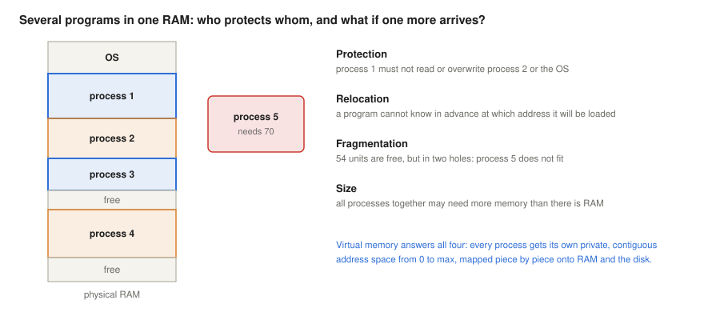

- **Separation (security).** With several processes in RAM, each must be protected from the others, and the operating system from all of them. A bug or an attack in one program must not be able to read or overwrite another's memory.
- **A simple, private view.** With **virtual** memory, *every process sees as if it had the whole memory alone, contiguously, from 0 to max*. A program can then be compiled for fixed addresses, wherever it actually lands in RAM (**relocation**), and it does not need to know about the other programs at all.
- **More memory than RAM.** Virtual memory extends RAM onto the disk: pages that are not needed at the moment can wait there, and the total memory of all processes can exceed the physical RAM.

The figure asks the question that starts it all: what happens when a fifth process arrives, or process 1 wants to grow, and no free piece of RAM is large enough? Side by side, the goals are **protection** (separation), **programs larger than RAM**, and **relocation**, which can also be put positively as the **reuse of addresses**: every process may start at address 0 and use the same addresses as all the others, because each has its own mapping. Only the second goal depends on RAM being scarce. The other two matter however much RAM there is: the machine of the [Linux section](#the-same-ideas-on-linux-x86-64) has no swap area at all, and still every process runs in its own virtual address space.

Virtual memory was first built on the **Atlas** computer at the University of Manchester, which went into operation in 1962. Its designers called it a *one-level storage system*: the programmer saw one large memory, while the hardware and the supervisor program moved 512-word pages between the small core memory and a magnetic drum automatically (Kilburn et al., 1962). Every general-purpose operating system today is built on the same idea.

<details>
<summary><b>Explained simply:</b> separation, protection, relocation, Atlas, core memory, drum</summary>

- **Separation, protection:** keeping each program inside its own memory, so that it cannot spy on or damage the others.
- **Relocation:** being able to place a program anywhere in RAM, although its instructions contain addresses.
- **Reuse of addresses:** every program may use the same addresses, starting from 0, like every house on different streets can be number 1.
- **Atlas:** a British computer of the early 1960s, one of the most powerful of its time, and the first with virtual memory.
- **Core memory:** the main memory technology of the 1950s and 1960s, made of tiny magnetic rings. **Drum:** a rotating magnetic cylinder, a slower predecessor of the hard disk.

</details>

## Fragmentation

The simplest solution gives each process one **contiguous** piece of RAM, its **partition**, and checks every address against the partition's limits (a base and a limit register). This breaks down because memory becomes fragmented. There are two kinds:

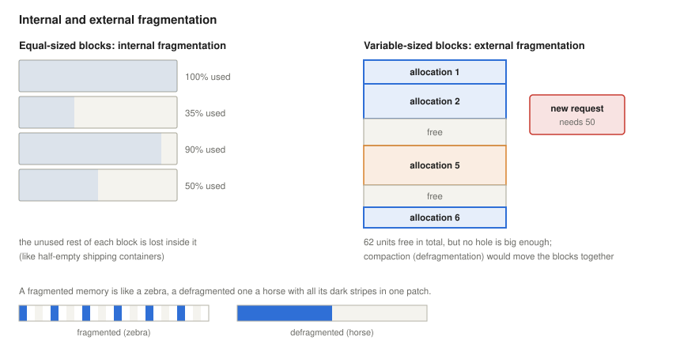

- **Internal fragmentation** comes with **equal block sizes**: memory is handed out in fixed units, and the unused rest of each unit is wasted *inside* it. An analogy is goods transport in containers: a half-empty container still takes a whole container's space on the ship.
- **External fragmentation** comes with **different block sizes**: as blocks are allocated and freed, the free memory is broken into holes *between* the blocks. A new request may not fit into any hole, although the holes together would be large enough.

With variable blocks, the allocator chooses a hole for each request: **first fit** (the first hole that is large enough), **best fit** (the smallest that is large enough) or **worst fit** (the largest). None of them avoids fragmentation; Knuth's analysis of first fit led to the "fifty-percent rule": in equilibrium there are about half as many holes as allocated blocks (Knuth, 1997). The remedy is **compaction**, moving the blocks together so that the free memory forms one hole: in the picture, turning the striped zebra into a horse with all its dark stripes in one patch. But compaction is slow, and it requires every program to be relocatable while it runs.

Paging, the subject of the next section, chooses equal block sizes, and so trades external fragmentation for a little internal fragmentation: on average half a page per memory region. Both kinds can be observed on Linux ([Linux section](#fragmentation-on-linux)).

<details>
<summary><b>Explained simply:</b> contiguous, partition, base and limit registers, internal and external fragmentation, first/best/worst fit, compaction</summary>

- **Contiguous:** in one piece, without gaps.
- **Partition:** the piece of RAM given to one program.
- **Base and limit registers:** two CPU registers that hold where a program's partition starts and how long it is; every address is checked against them.
- **Internal fragmentation:** space lost inside the blocks, because each block is bigger than what is put into it.
- **External fragmentation:** space lost between the blocks, in holes too small to use.
- **First fit, best fit, worst fit:** rules for choosing a free hole: the first that fits, the tightest that fits, or the largest.
- **Compaction (defragmentation):** moving everything together to make one big free area, like pushing all the books on a shelf to one side.

</details>

## Before paging: overlays and swapping

Two older techniques dealt with programs and workloads larger than memory, and both explain what paging had to do better.

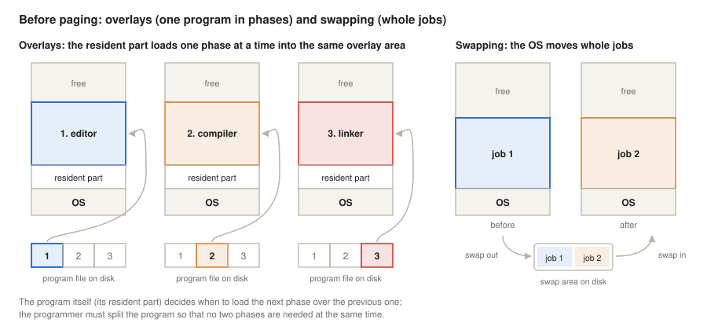

- **Overlays.** A program larger than its memory is split by the programmer into a **resident part**, which stays in memory all the time, and phases that are never needed at the same time. The phases take turns in one **overlay area**: the resident part loads the editor into it, later the compiler over the editor, and later the linker over the compiler. The operating system does nothing special: the program itself reads the next phase from disk, according to an overlay structure that the programmer designed and the linker built.
- **Swapping.** The operating system moves **whole jobs** between memory and a **swap area** on disk. A job that waits, for example for its user at a terminal, is swapped out, and another one is swapped in to run in its place. MIT's CTSS, one of the first time-sharing systems, swapped user programs between core memory and a drum when it switched from one user to the next (Corbató et al., 1962); swapped-out processes are the *suspended* states of the [scheduling lecture](../07-concurrency-deadlocks-scheduling/#the-process-state-space).

Both have a basic cost. Overlays put the burden on the programmer, who must know the structure of the program and the size of the memory, and must redo the split when either changes. Swapping moves the whole job, even if only a small part of it will be used before the next swap, so every swap costs time in proportion to the job's size; a job swapped back in still needs one contiguous hole, with all the fragmentation problems of the previous section; and a job larger than RAM cannot run at all. Paging solves all of these automatically: it transfers only the pages that are actually used, places each page in any free frame, and lets the operating system, not the programmer, decide what is in memory (Denning, 1970). The old name survives: Linux still calls its disk area **swap**, but it moves single pages, not whole processes.

<details>
<summary><b>Explained simply:</b> overlay, resident part, phase, swapping, swap area, job</summary>

- **Overlay:** loading one part of a program over another part that is no longer needed, into the same piece of memory, like a teacher who wipes the board to write the next topic.
- **Resident part:** the part of a program that always stays in memory and loads the other parts.
- **Phase:** a stage of the work, such as editing, then compiling, then linking.
- **Swapping:** moving a whole waiting program out of RAM to the disk to make room, and back again later.
- **Swap area:** the part of the disk reserved for programs or pages moved out of RAM.
- **Job:** an older word for a program run, as handed to the computer.

</details>

## Paging

**Paging** divides the virtual memory of each process into fixed-size **pages** (4 KiB on x86) and the physical RAM into **frames** of the same size. Any page can be placed into any free frame. The page is at the same time the **unit of mapping** (one page-table entry describes one page) and the **unit of transfer** (a whole page moves between RAM and the disk). The pages of a process are contiguous in its own address space, but the frames that hold them can lie anywhere in RAM, in any order, and some pages may not be in RAM at all:

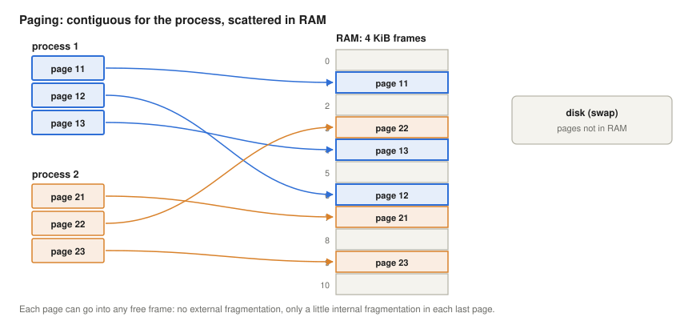

The measurement in the [Linux section](#where-pages-really-live) shows exactly this on a real system: four consecutive virtual pages of a process in four unrelated physical frames, and two pages that are not in RAM at all because they have never been used.

### Address translation

Take 32-bit virtual addresses and 4 KiB pages as an example. The low 12 bits of an address ($2^{12}$ = 4096) are the **offset** within the page, and the high 20 bits are the **page number**. The **page table** of the process has one entry per page number, and each entry holds the number of the physical frame where the page is, plus control bits:

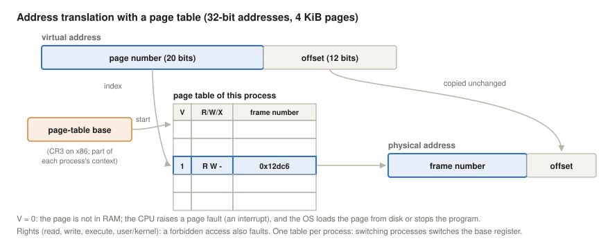

1. The **page-table base register** (PTBR; on x86 the CR3 register, on ARM the TTBR registers) holds the physical address of the current process's page table. It is part of each process's context, so a context switch that changes the process also changes the PTBR, and with it the whole address space.
2. The page number selects the entry: its address is the PTBR plus the page number times the entry size.
3. If the entry is valid, its **physical page (frame) number** is combined with the unchanged offset to form the physical address (in binary, the frame number is simply written in front of the offset).

The most important bits of an entry:

- **Valid (present):** 1 means the page is in a frame. 0 means it is not: the access causes a **page fault**, an exception (a program interrupt in the terms of the [interrupts lecture](../05-interrupts/#classes-of-interrupts)), and the operating system decides what to do.
- **Access rights:** read-only, read/write, executable. On x86-64 there is also a **user/supervisor** bit (kernel pages are not accessible from user mode) and the **NX** (no-execute) bit, the one the [fetch-execute lecture](../04-fetch-execute-cycle/#memory-permissions-in-a-real-process) demonstrated. An access that the rights do not allow also causes a page fault, which the OS turns into an error for the program (on Linux, the `SIGSEGV` signal: "segmentation fault").
- Hardware also sets an **accessed** bit when the page is used and a **dirty** bit when it is written; the OS uses them for page replacement, below.

A worked example: the virtual address `0x00403A7C` has page number `0x00403` and offset `0xA7C`. If entry `0x403` of the page table says "valid, read/write, frame `0x12DC6`", the physical address is `0x12DC6A7C`.

**The physical address can be longer than the virtual one.** The frame number and the offset are **joined** (concatenated), not added: the physical address is frame number × page size + offset, which in binary means writing the frame number in front of the offset. The width of the frame number is therefore a choice of the hardware, independent of the page number. A small example: with 16-bit virtual addresses and 4 KiB pages, the page number has 4 bits (16 pages, 64 KiB per process) and the offset 12 bits. If the page-table entries hold 7-bit frame numbers, physical addresses have 7 + 12 = 19 bits: 128 frames, 512 KiB of RAM. The virtual address `0x2ABC` is page 2, offset `0xABC`; if entry 2 holds frame `0x5D` (`101 1101`), the physical address is `0x5DABC` (`101 1101` followed by `1010 1011 1100`). No process can address more than 64 KiB, but eight such processes fit into RAM together. The **PAE** (physical address extension) of 32-bit x86 processors, introduced with the Pentium Pro in 1995, did the same on a larger scale: 32-bit virtual addresses, 4 GiB per process, were mapped to 36-bit physical addresses, up to 64 GiB of RAM, through 8-byte page-table entries with longer frame numbers (Intel Corporation, 2025). (On x86-64 it is the other way round: the machine used below has 48-bit virtual and 46-bit physical addresses.)

### Multi-level page tables

A flat table for a 32-bit address space has $2^{20}$ entries; at 4 bytes each, that is 4 MiB per process, even for a program that uses a few pages. For 48-bit addresses a flat table would need $2^{36}$ entries of 8 bytes, 512 GiB per process: impossible. Page tables are therefore **hierarchical**: the page number is split into several indices, and each level's table only exists where memory is in use. On x86-64, a 48-bit virtual address is split into four 9-bit indices and a 12-bit offset, and each table holds 512 eight-byte entries, exactly one 4 KiB page:

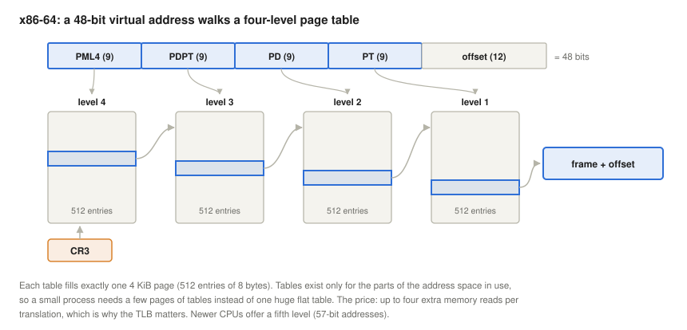

The machine used below reports `address sizes : 46 bits physical, 48 bits virtual` in `/proc/cpuinfo`, so it uses four levels; newer processors support a fifth level for 57-bit addresses. The price of the hierarchy is that a translation may need four extra memory reads, a **page-table walk**. This is where the next section comes in.

**Segmentation** is the older alternative: memory is divided into variable-sized logical **segments** (code, data, stack), each with its own base, limit and rights. It matches the program's structure, but suffers from external fragmentation. x86 processors had both, segments on top of pages; in 64-bit mode segmentation is essentially switched off, and modern operating systems rely on paging alone.

<details>
<summary><b>Explained simply:</b> paging, offset, page table, page-table entry, PTBR/CR3, page fault, exception, access rights, NX bit, user/supervisor, accessed and dirty bits, concatenation, PAE, hierarchy, segment, unit of mapping and of transfer</summary>

- **Paging:** cutting memory into equal pieces and placing each piece wherever there is room, keeping a list of where each one went.
- **Unit of mapping, unit of transfer:** the page is both the piece that the list describes and the piece that is moved between RAM and disk.
- **Offset:** the position of a byte inside its page.
- **Page table:** that list: for each page of a process, which frame of RAM holds it, and what may be done with it. Each line is a **page-table entry**.
- **PTBR (page-table base register), CR3, TTBR:** the CPU register (CR3 on Intel and AMD processors, TTBR on ARM) that says where the current process's page table is. Changing it switches to another process's memory.
- **Page fault:** the CPU's signal to the OS that a page is not in RAM, or that an access is not allowed.
- **Exception:** an interrupt caused by the instruction that is running.
- **Access rights:** whether a page may be read, written or executed. **NX** (no-execute): data pages cannot be run as code. **User/supervisor:** whether ordinary programs may touch the page, or only the kernel.
- **Accessed and dirty bits:** set by the hardware when a page is used, and when it is changed.
- **Concatenation:** writing two numbers one after the other, like an area code followed by a phone number, instead of adding them.
- **PAE** (physical address extension): a feature of 32-bit Intel and AMD processors that let the whole computer use more than 4 GiB of RAM, although each program could still see only 4 GiB.
- **Hierarchical (multi-level) page table:** a table of tables, like a book's table of contents pointing to chapter contents, so that only the parts in use need to exist.
- **Segment:** a variable-sized logical part of a program, such as its code or its stack.

</details>

## The TLB: a cache for translations

Every memory access needs a translation, and a page-table walk would multiply the cost of every access. The CPU therefore keeps recent translations in the **translation lookaside buffer (TLB)**, a small, fast cache of page-table entries:

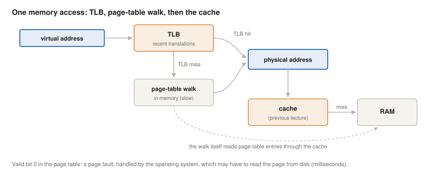

On a TLB **hit**, the translation is available within a cycle or two, and the physical address goes on to the cache of the previous lecture. On a TLB **miss**, the hardware on x86 and ARM walks the page tables itself (on some other architectures the OS does it in software) and stores the result in the TLB. Because the walk reads page-table entries through the data caches, a TLB miss is often much cheaper than four RAM accesses, but still costly.

A TLB has typically a few dozen entries in its first level and one to two thousand in its second (on the processor family used below, 64 entries for data and 1,536 shared entries, the same TLB as the Skylake server cores; Intel Corporation, 2024). With 4 KiB pages, 1,536 entries cover 6 MiB: the **TLB reach**. Programs that use more memory at random suffer TLB misses, which is why processors also support **huge pages** (2 MiB and 1 GiB on x86-64): one entry then covers 512 or 262,144 times more memory. The measurement in the [Linux section](#the-cost-of-translation) separates the cost of translation from the cost of the data itself: with the data in the cache, 4 KiB pages added about 2.3 ns per access while the second-level TLB still covered the pages, and 10 to 130 ns once it overflowed.

Because the TLB holds translations of the current address space, a context switch must invalidate them, or tag them with an address-space identifier (PCID on x86, ASID on ARM) so that several processes' entries can coexist, as mentioned in the [previous lecture](../08-two-level-memory-and-cache/#why-the-operating-system-cares).

<details>
<summary><b>Explained simply:</b> TLB, hit, miss, page-table walk, TLB reach, huge page, PCID/ASID</summary>

- **TLB** (translation lookaside buffer): a tiny memory inside the CPU that remembers about one or two thousand recent page translations, so the page table rarely has to be read.
- **Page-table walk:** looking up a translation in the page tables, level by level, when the TLB does not have it.
- **TLB reach:** how much memory the TLB can cover at once: number of entries × page size.
- **Huge page:** a page of 2 MiB or 1 GiB instead of 4 KiB, so that one TLB entry covers much more memory.
- **PCID, ASID:** a number that marks which process a TLB entry belongs to.

</details>

## Page faults: the OS takes over

When the valid bit is 0, or the access is not allowed, the CPU raises a page fault, and the kernel's page-fault handler looks at the address and at its own records of the process's memory regions (on Linux, the list of **VMAs** printed by `/proc/PID/maps`). There are four main cases:

- **The address belongs to no region, or the access breaks its rights:** a program error; Linux sends `SIGSEGV`, which usually ends the program.
- **Demand paging:** the region is valid, but the page has never been used. Linux gives memory to a process lazily: `malloc` and `mmap` only reserve virtual addresses, and a physical frame is assigned at the first access to each page. The [Linux section](#demand-paging) shows 1 GiB "allocated" with 1 MiB of RAM in use, until the program touches it.
- **Copy-on-write:** after `fork()`, parent and child share all pages read-only. The first write to a shared page faults, and the kernel gives the writer a private copy. `fork()` is therefore fast even for large processes ([Linux section](#copy-on-write)).
- **The page is on disk:** it was swapped out, or it belongs to a memory-mapped file that is not in the page cache. The kernel must read it from disk, which is a **major fault**: the process waits in the *waiting* state of the [scheduling lecture](../07-concurrency-deadlocks-scheduling/#the-process-state-space), and other processes run. Faults that need no disk access (demand-zero pages, copy-on-write, pages already in the page cache) are **minor faults**.

<details>
<summary><b>Explained simply:</b> page-fault handler, VMA, SIGSEGV, demand paging, lazy, copy-on-write, fork, major and minor fault</summary>

- **Page-fault handler:** the part of the kernel that runs when a page fault happens.
- **VMA** (virtual memory area): one region of a process's address space, such as its code, its heap or a mapped file, with its own rights.
- **SIGSEGV** ("segmentation fault"): the signal that tells a program it accessed memory it may not use.
- **Demand paging, lazy:** giving a page only when it is really used, not when it is asked for, like a restaurant that cooks a dish only when someone orders it.
- **Copy-on-write:** two processes share a page until one of them changes it; only then does it get its own copy.
- **fork():** the system call that creates a new process as a copy of the current one.
- **Major fault:** the page has to be read from disk (slow). **Minor fault:** the page can be provided without the disk (fast).

</details>

### A major fault, step by step

A major fault is the place where the hardware, the interrupt system, the scheduler and page replacement all work together:


1. **Hardware.** The TLB has no translation, the page-table walk finds the entry invalid (or the access forbidden), and the CPU raises a **page-fault exception**: it saves the state of the interrupted instruction and enters the kernel, telling it the faulting address (on x86 in the CR2 register) and the kind of access.
2. **Check.** The handler looks up the address in the process's VMAs. If it belongs to none, or the access breaks the region's rights, the process gets `SIGSEGV`.
3. **Find a frame.** If no frame is free, page replacement chooses a victim. The victim's page-table entry is marked invalid and its TLB entry is invalidated (on every core that may cache it), so that nobody can change the page any more; if the victim is dirty, it must then be written to disk before its frame can be reused.
4. **Start the read.** The handler asks the disk driver to read the page into the frame; the disk controller transfers it by DMA.
5. **Wait.** The faulting process is blocked, and the scheduler runs another process for the milliseconds the disk needs.
6. **Interrupt.** When the transfer is complete, the disk raises an **interrupt**. The kernel fills in the page-table entry (frame number, valid = 1), and the process becomes ready.
7. **Restart.** When the process runs again, the faulting instruction is executed again from the beginning, and this time finds a valid page.

The page fault itself is an exception, raised synchronously by the instruction; only the completion of the disk read is an interrupt request from a device, in the terms of the [interrupts lecture](../05-interrupts/#classes-of-interrupts). Steps 5 and 6 are the *waiting* and *ready* states of the [scheduling lecture](../07-concurrency-deadlocks-scheduling/#the-process-state-space). The order in step 3 matters: the frame must be free before the read can start, so a dirty victim makes the faulting process wait for a write *and* a read. A minor fault skips steps 4 to 6.

<details>
<summary><b>Explained simply:</b> MMU, CR2, DMA, restart an instruction</summary>

- **MMU** (memory management unit): the part of the CPU that translates virtual addresses to physical ones, with the TLB and the page-table walker.
- **CR2:** a register of x86 processors in which the CPU leaves the address that caused the last page fault, for the kernel to read.
- **DMA** (direct memory access): the disk controller copies the data into RAM by itself, while the CPU does other work.
- **Restarting an instruction:** running the same instruction again from its beginning, as if the fault had never happened; the program does not notice anything, except that it was slower.

</details>

### The cost of a fault

Major faults are expensive: microseconds on a fast SSD, milliseconds on a hard disk, against about 100 ns for a memory access. The two-level formula of the previous lecture shows how rare they must be. With a fault rate $p$, a memory access time of 100 ns and a fault time of 8 ms,

$$T = (1 - p) \cdot 100\ \text{ns} + p \cdot 8\ \text{ms}$$

and to keep the slowdown under 10%, $p$ must stay below about $1.25 \cdot 10^{-6}$: one fault in 800,000 accesses (example adapted from Silberschatz et al., 2018, who use 200 ns).

**A dirty victim doubles the cost.** When the frame for the new page must first be emptied of a dirty page, the fault needs a disk write and a disk read. A back-of-the-envelope model shows the effect: let a memory access take 1 time unit and a disk transfer 10,000 units, and let one access in 1,000 cause a fault. With clean victims, 1,000 accesses take 1,000 + 10,000 = 11,000 units, 11 times as long as without faults; with dirty victims, 1,000 + 10,000 + 10,000 = 21,000 units, 21 times as long. (The fault rate is unrealistically high on purpose; the formula above shows that real fault rates must be a thousand times lower.) Operating systems therefore try to keep both the write and part of the read out of the fault:

- **Keep clean frames ready.** Background threads reclaim and clean pages before memory runs out. On Linux, `kswapd` frees pages when the free memory falls below a low watermark, and the flusher threads write dirty pages to disk in the background, when dirty data exceeds a share of memory (`vm.dirty_background_ratio`) or has been dirty for too long (`vm.dirty_expire_centisecs`). A fault then usually finds a free frame, or a clean victim that can be reused at once (The kernel development community, n.d.-a).
- **Prefetch.** Read more than the faulting page, betting on spatial locality: **prepaging** or **read-ahead**. Linux reads file data ahead of a sequential reader, and at a fault on a swapped-out page it reads $2^n$ neighbouring pages from swap at once, where $n$ is the `vm.page-cluster` setting (3 by default: 8 pages). The fault-around of the [major-fault measurement](#major-faults) is the same bet for mapping pages that are already in memory.

The [Linux section](#keeping-faults-cheap) shows these settings on the machine used below.

<details>
<summary><b>Explained simply:</b> watermark, kswapd, flusher threads, prepaging, read-ahead</summary>

- **Watermark:** a level of free memory; below it, the kernel starts freeing pages, like refilling the fridge when only two bottles are left.
- **kswapd:** the Linux kernel thread that frees memory in the background, so that programs do not have to wait for it.
- **Flusher threads:** kernel threads that write changed (dirty) data to disk in the background.
- **Prepaging, read-ahead:** reading pages from disk before they are asked for, because they will probably be needed soon.

</details>

## Page replacement

When a page must be brought in and no frame is free, the OS must choose a **victim** page to evict; if the victim is dirty, it must first be written to disk. This is the replacement problem of the [previous lecture](../08-two-level-memory-and-cache/#which-line-to-throw-out), with two differences: a miss costs thousands to hundreds of thousands of times more, and the OS, not the hardware, makes the decision, so it can afford to think. The classic algorithms:

- **FIFO:** evict the page that has been in memory longest.
- **OPT** (Bélády, 1966): evict the page whose next use lies farthest in the future. Optimal, but it needs the future; it is the yardstick.
- **LRU:** evict the page unused for the longest time. Very good in practice, but exact LRU would need a timestamp or a list update at *every* memory access, which is impossible in software.
- **Clock (second chance):** an LRU approximation built on the hardware's **accessed bit**. The frames form a circle, and a "clock hand" moves around it: a page whose accessed bit is set gets a second chance (the bit is cleared and the hand moves on); the first page found with the bit clear is evicted (Corbató, 1968; his Multics version kept several bits of history per page, much like the aging algorithm below). The **aging** algorithm refines this with a small counter per page, shifted right at regular intervals with the accessed bit entering at the top: the page with the smallest counter has been unused longest.

Linux keeps pages on two kinds of lists, **active** and **inactive** (one pair for anonymous memory and one for file pages): pages that are used again are promoted to the active list, and reclaim takes victims from the tail of the inactive list, a two-handed variant of the clock idea. Since Linux 6.1, an optional multi-generational LRU (MGLRU), developed at Google, sorts pages into several generations by age instead of two lists (Larabel, 2022); it is not compiled into the kernel used below (there is no `/sys/kernel/mm/lru_gen` directory).

### Bélády's anomaly

A natural question: if a process gets more frames, does its fault rate always fall? A simple model says yes. Suppose a program has no locality at all, and every reference picks one of its $P$ pages at random. With $F$ frames, the referenced page is in RAM with probability $F/P$, whatever the replacement algorithm, so the fault rate is $1 - F/P$: with 4 of 16 pages in RAM, 75%; with 8 of 16, 50%. More frames, fewer faults; the simulator confirms it for FIFO, LRU and clock alike ([Linux section](#page-replacement-simulated)). For real reference strings and FIFO, however, not necessarily. With the reference string `3 2 1 0 3 2 4 3 2 1 0 4`, FIFO makes 9 faults with 3 frames, but 10 with 4:

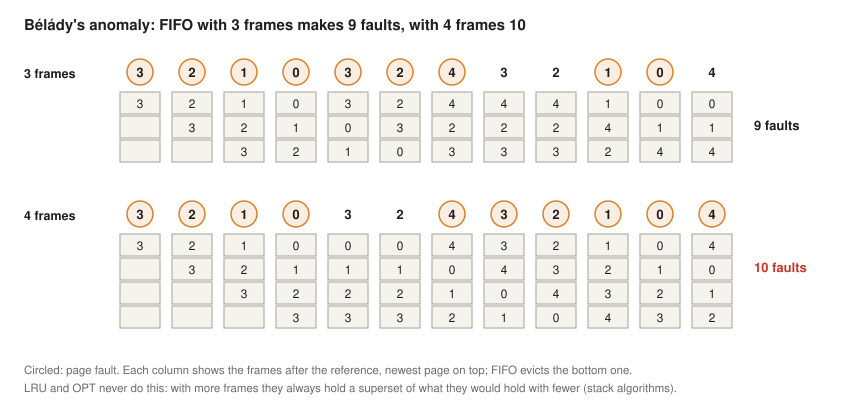

The simulator reproduces the figure column by column ([Linux section](#page-replacement-simulated)). Bélády et al. (1969) showed that such strings exist for FIFO. LRU and OPT can never behave like this, because they are **stack algorithms**: the set of pages they keep with *n* frames is always contained in the set they would keep with *n* + 1 frames, so an extra frame can only save faults (Mattson et al., 1970). FIFO lacks this inclusion property: in the example, at the seventh reference FIFO with 4 frames has just evicted page 3, which FIFO with 3 frames still holds and needs next.

### Working sets and thrashing

The **working set** of a process is the set of pages it has used in a recent window of time (Denning, 1968a). By the locality principle, it is usually much smaller than the whole program, and it changes slowly as the program moves from one phase to the next. If a process has at least as many frames as its working set, it faults rarely; if it has fewer, it faults on a large share of its references:

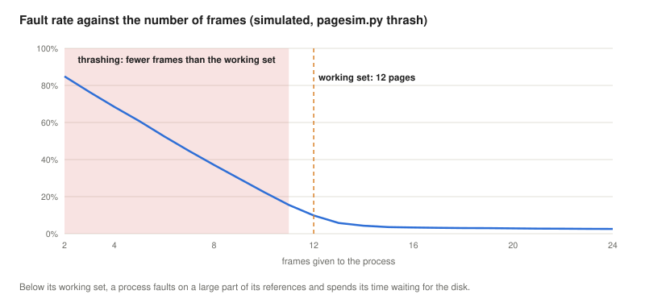

When the processes in memory together need more frames than there are, they spend their time waiting for page transfers and almost none computing: **thrashing**. Throughput collapses, and a naive scheduler that admits more processes because the CPU looks idle makes it worse (Denning, 1968b). The cure is to run fewer processes: the medium-term scheduler of the [scheduling lecture](../07-concurrency-deadlocks-scheduling/#the-process-state-space) suspends some, or, on Linux, the out-of-memory killer ends one when nothing else helps.

<details>
<summary><b>Explained simply:</b> victim, FIFO, OPT, LRU, clock, accessed bit, aging, active/inactive list, Bélády's anomaly, stack algorithm, working set, thrashing, out-of-memory killer</summary>

- **Victim:** the page chosen to leave RAM to make room.
- **FIFO, OPT, LRU:** first in first out; the optimal "evict what is needed latest"; least recently used.
- **Clock (second chance):** walk around the pages in a circle; a page that was used recently gets one more round, the first unused one leaves.
- **Accessed bit:** a bit the CPU sets automatically whenever a page is used.
- **Aging:** each page has a small counter that "remembers" how recently it was used; the page with the smallest counter leaves.
- **Active / inactive list:** Linux's two queues of pages: the ones used recently, and the candidates for eviction. **MGLRU** (multi-generational LRU): a newer Linux variant with several age groups instead of two.
- **Bélády's anomaly:** with FIFO, more frames can mean more faults.
- **Stack algorithm:** a replacement algorithm for which a bigger memory always holds everything a smaller one would; LRU and OPT are such algorithms.
- **Working set:** the pages a program needs right now.
- **Thrashing:** the computer is so busy moving pages between RAM and disk that hardly any real work gets done.
- **Out-of-memory killer:** the part of Linux that ends a process when memory has completely run out.

</details>

## Caches and virtual memory compared

Caches and virtual memory are both two-level memories built on locality, with the same structure, but with very different numbers, and these numbers explain every difference in design:

| | Cache | Virtual memory |
|---|---|---|
| unit | line (block) | page / frame (or segment) |
| unit size | 32–128 bytes, usually 64 | 4–16 KiB, plus huge pages of 2 MiB and 1 GiB |
| capacity of the fast level | 32 KiB (L1) to tens of MiB (L3) | GiB of RAM (typically 8–64 GiB in a PC) |
| a miss is called | cache miss | page fault |
| cost of a miss | 10–100 ns | µs (SSD) to ms (hard disk) |
| handled by | hardware alone | hardware (TLB, page walk) and the OS (fault handler) |
| placement | direct-mapped or set-associative | fully associative: any page in any frame |
| replacement | none (direct-mapped), random or pseudo-LRU in hardware | approximations of LRU in software (clock, aging, active/inactive lists) |
| writes | write-through or, mostly today, write-back | always write-back (dirty bit) |

Virtual memory is always write-back: writing every store through to the disk would make every store take milliseconds. Caches can use either policy; some L1 caches are write-through, but most caches today are write-back, as the [previous lecture](../08-two-level-memory-and-cache/#the-direct-mapped-cache) explained. The same reasoning explains placement and replacement: since a major page fault costs hundreds of thousands to millions of cycles, the OS can afford full associativity and a careful choice of victim, while a cache must decide within a cycle.

## Allocating memory: from malloc to the buddy and slab allocators

Paging decides *where* a page lives. Somebody must still decide *which* pieces of memory a program or the kernel gets when it asks for some, and take them back when they are freed. Two levels of allocators do this. In user space, a library allocator (`malloc` in C) obtains large regions from the kernel and cuts them into the small blocks that programs ask for. In the kernel, the **buddy allocator** hands out physical frames, and the **slab allocator** cuts frames into small kernel objects. Both levels meet the problems of the [fragmentation section](#fragmentation) again: they must be fast, and they must waste as little memory as possible inside blocks (internal fragmentation) and between them (external fragmentation). Wilson et al. (1995) survey the many designs that have been tried.

### In user space: brk, mmap and malloc

The kernel gives a process memory only in whole pages, through two system calls:

- **`brk` / `sbrk`** move the **program break**, the end of the **heap** region that lies above the program's data. Raising the break makes the heap longer, lowering it gives the end back. The heap is one region with one movable end, so it can only grow and shrink at the top.
- **`mmap`** with `MAP_ANONYMOUS` creates a new region of any size anywhere in the address space, and **`munmap`** removes it again, wherever it is.

Both only reserve virtual addresses: a frame is assigned at the first access to each page ([demand paging](#page-faults-the-os-takes-over)). System calls are slow compared with a function call, and they work in pages, so `malloc` does not call the kernel for every block. The GNU C library's `malloc` (glibc, derived from Doug Lea's allocator) works like this (GNU C Library, n.d.; Linux man-pages project, n.d.):

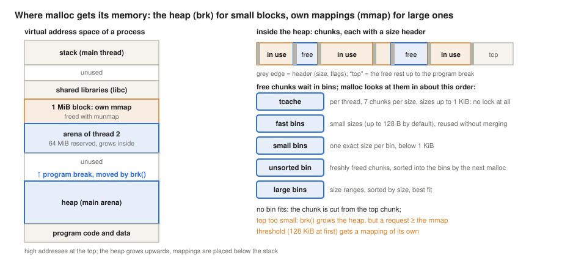

- The heap is cut into **chunks**. Each chunk starts with a header that holds its size and a few flag bits; the smallest chunk on x86-64 is 32 bytes, of which 24 can be used, which is why the [Linux section](#fragmentation-on-linux) saw 24 bytes for a 1-byte request.
- Freed chunks are not given back to the kernel but kept in **bins**, lists of free chunks by size: a small per-thread cache (**tcache**, up to 7 chunks of each size up to about 1 KiB, used without any lock), **fast bins** for very small chunks, **small bins** with one size each, an **unsorted bin** for freshly freed chunks, and **large bins** that hold ranges of sizes, sorted for best fit. A request is served from the first bin that has a fitting chunk, and two neighbouring free chunks are merged (**coalesced**) into one larger chunk, except those in the tcache and the fast bins, which are kept small on purpose because the same size is usually needed again soon.
- If no bin fits, the chunk is cut from the **top chunk**, the free end of the heap; if that is too small, `malloc` calls `brk` to grow the heap (by at least 128 KiB more than needed, so that the next requests need no system call).
- A request of at least the **mmap threshold**, 128 KiB at first, that the free memory of the heap cannot serve gets a mapping of its own, and `free` returns it at once with `munmap`. The threshold adapts: when such a block is freed, the threshold rises to its size (up to 32 MiB on 64-bit systems), because a program that frees a block of this size will probably allocate one again, and taking it from the heap avoids a pair of system calls and the page faults of a fresh mapping each time.
- Threads would wait for each other if they shared one heap behind one lock, so glibc gives threads separate **arenas**: the main arena is the `brk` heap, and the others are mapped regions of up to 64 MiB each, at most 8 per CPU core on 64-bit systems.

This explains a common surprise: **`free` does not make a process smaller.** Small blocks go back to the bins, not to the kernel. The heap can shrink only from the top, so a single block still in use near the top keeps everything below it in the process, however much of it is free; this is external fragmentation in user space. Only completely free pages can be returned: `malloc_trim` hands them back with `madvise(MADV_DONTNEED)`, which keeps the addresses but releases the frames. The [Linux section](#malloc-under-strace) shows each of these steps. Other allocators make other trade-offs, for example jemalloc (the allocator of FreeBSD's C library), Google's tcmalloc and Microsoft's mimalloc, which use per-thread caches and size classes more aggressively.

<details>
<summary><b>Explained simply:</b> allocator, program break, brk/sbrk, mmap/munmap, chunk, header, bin, tcache, coalescing, top chunk, mmap threshold, arena, lock, malloc_trim, madvise</summary>

- **Allocator:** the part of a program or of the kernel that hands out pieces of memory and takes them back, like a cloakroom that hands out hooks.
- **Program break, brk, sbrk:** the heap is like a shelf with a movable end-stop; `brk` and `sbrk` move the end-stop to make the shelf longer or shorter.
- **mmap, munmap:** asking the kernel for a completely new piece of address space anywhere, and giving it back.
- **Chunk:** one piece of the heap, used or free. **Header:** a small label at the start of each chunk with its size.
- **Bin:** a list of free chunks of similar size, kept for reuse, like boxes of screws sorted by size.
- **tcache:** a small private stock of free chunks for each thread, so that threads need not take turns.
- **Coalescing:** gluing two neighbouring free chunks together into a bigger one.
- **Top chunk:** the free space at the end of the heap, from which new chunks are cut.
- **mmap threshold:** the size from which `malloc` asks the kernel for a separate mapping instead of using the heap.
- **Arena:** a separate heap with its own lock; several threads can allocate in different arenas at the same time.
- **Lock:** a "one at a time" sign; a thread that finds it taken must wait.
- **malloc_trim, madvise(MADV_DONTNEED):** telling the kernel "I no longer need the contents of these pages": the frames are freed, but the addresses stay valid.

</details>

### In the kernel: the buddy allocator

The kernel manages the physical frames themselves. Most requests are for single pages, but some need several **physically contiguous** frames: buffers for devices that use DMA without an IOMMU, 2 MiB huge pages, and the slabs of the next section. (The 16 KiB kernel stack of each thread on x86-64 used to be one of them too; today it is usually mapped with `vmalloc`, described below, so that a stack overflow hits an unmapped page instead of overwriting other memory.) Linux uses the **buddy system** (Knowlton, 1965): free memory is kept in blocks of $2^k$ contiguous frames, where $k$ is the block's **order**, from order 0 (4 KiB) to order 10 (1,024 frames, 4 MiB), with one free list per order (in fact one per order, zone and kind of page):

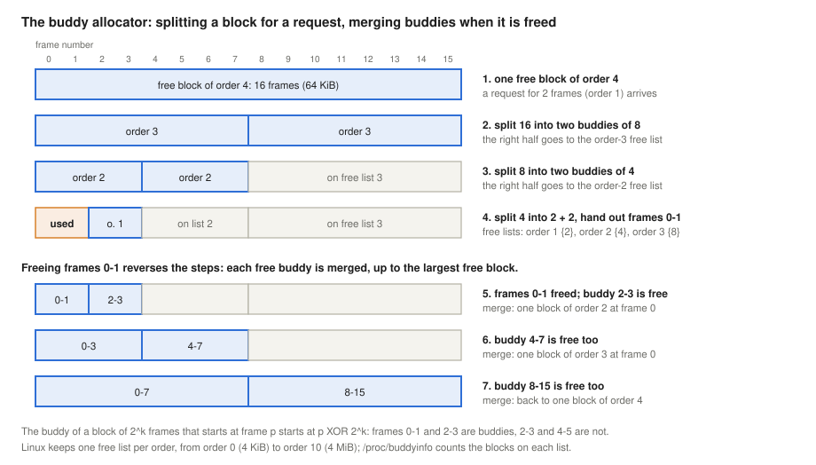

- **Allocation.** The request is rounded up to a power of two. If the list of that order is empty, the allocator takes a block from the next larger non-empty list and **splits** it into two halves, the two **buddies**; one half goes to the lower list, and the other is split further or handed out.
- **Freeing.** A freed block's buddy is found by a single bit operation: for a block of $2^k$ frames that starts at frame $p$, the buddy starts at $p$ XOR $2^k$. If the buddy is free and of the same order, the two are **merged** into a block of the next order, and the check is repeated one order higher. Only blocks that were split from each other can merge, so the free lists stay simple, and an allocation or a free needs at most 10 splits or merges.

The buddy system is fast and fights external fragmentation by merging, but it has costs. Rounding up to powers of two wastes memory inside blocks: 33 frames would take a block of 64, which is why the kernel requests memory in pages or orders, not in arbitrary sizes. And merging needs *both* buddies to be free: one frame still in use keeps its neighbours from forming large blocks, which is the external fragmentation seen in the [Linux section](#fragmentation-on-linux). Linux therefore groups pages that it can move (the pages of processes, which it can copy and remap) apart from those it cannot (most kernel memory), and compacts memory when large blocks run out. Single pages, the most common request, are taken from small **per-CPU lists** that are refilled from the buddy lists in batches, so that the CPUs do not compete for the zone's lock at every allocation (Gorman, 2004). `/proc/buddyinfo` counts the free blocks of each order ([Linux section](#the-buddy-allocator-at-work)).

### Small objects: the slab allocator

Most of the kernel's own allocations are small objects of a few fixed types: a directory entry (dentry), an inode, an open file, a process descriptor. Taking a whole 4 KiB page for a 192-byte dentry would waste 95% of it. Bonwick (1994) designed the **slab allocator** for SunOS 5.4 to solve this: one **cache** per object type, made of **slabs**, each slab being one or more contiguous pages from the buddy allocator, cut into objects of exactly that type's size:

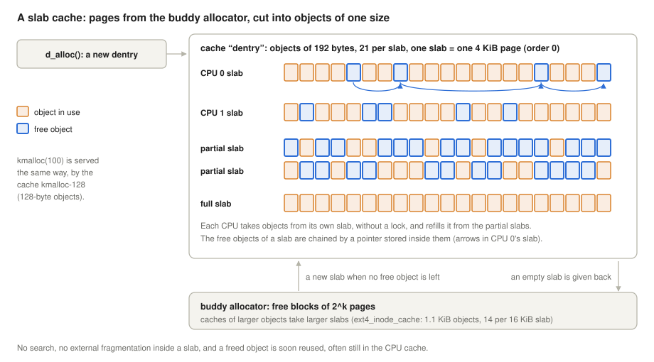

- Allocating an object takes the first free object of a slab, and freeing it puts it back: no search, no splitting, no merging, and no external fragmentation inside the slab, because all objects in it have the same size.
- A freed object stays in its cache, still partly initialised, and is often still in the CPU cache when it is reused: Bonwick's measurements showed that keeping objects of one type together, ready for reuse, also saves the cost of building them up and tearing them down.
- When a cache has no free object left, it takes a new slab from the buddy allocator; slabs that become completely empty can be given back under memory pressure.

Linux has had three implementations of this idea. **SLUB**, written by Christoph Lameter, replaced the original SLAB as the default in 2007; it keeps one active slab per CPU, chains the free objects of a slab through a pointer stored inside the free objects themselves, and merges caches of the same object size (Corbet, 2007). Since Linux 6.8 (2024) it is the only one: SLOB, for very small systems, was removed in 6.4 and SLAB in 6.8. The kernel used below shows the SLUB caches in `/sys/kernel/slab` ([Linux section](#slab-caches)).

Kernel code asks for memory through three main interfaces (The kernel development community, n.d.-c):

- **`kmalloc(size, flags)`**, the kernel's `malloc`, takes objects from a set of general-purpose caches with sizes from 8 bytes to 8 KiB (`kmalloc-8`, `kmalloc-16`, …, `kmalloc-8k`); larger requests go straight to the buddy allocator. The memory is **physically contiguous**, so it can be given to a device for DMA. The **flags** say what the allocator may do to find memory: `GFP_KERNEL` may sleep while memory is reclaimed, while `GFP_ATOMIC` never sleeps, as required in [interrupt context](../05-interrupts/#keep-the-handler-short-top-and-bottom-halves), but fails more easily.
- **`kmem_cache_create` / `kmem_cache_alloc`** create and use a dedicated cache for one object type, as the file systems do for their inodes and the VFS for dentries.
- **`vmalloc(size)`** returns memory that is contiguous only **virtually**: it takes single frames from anywhere and maps them one after the other into a separate address range of the kernel, the vmalloc area, through page tables. It can provide large buffers even when physical memory is fragmented, but it is slower (the mappings must be built, and they use the TLB), and the buffer cannot be handed to a device that needs contiguous physical memory. `kvmalloc` tries `kmalloc` first and falls back to `vmalloc`.

The user-space and kernel allocators answer the same question in similar ways: size classes, free lists for reuse, and per-thread or per-CPU caches so that the common case needs no lock.

<details>
<summary><b>Explained simply:</b> physically contiguous, buddy, split, merge, XOR, per-CPU list, slab, cache, object, SLUB, SLAB, SLOB, kmalloc, GFP flags, vmalloc, vmalloc area, IOMMU</summary>

- **Physically contiguous:** frames that lie next to each other in the real RAM, not just at neighbouring virtual addresses.
- **Buddy:** the other half of a block that was cut in two; two free buddies can be glued back together, like two halves of a torn ticket that only fit each other.
- **Split, merge:** cutting a free block in half to make it fit a smaller request; joining two free buddies into one block again.
- **XOR:** a bit operation that flips chosen bits; flipping one bit of a block's address gives the address of its buddy.
- **Per-CPU list:** a small stock of free pages kept by each processor core for itself, so that the cores do not wait for each other.
- **Slab:** one or more pages cut into equal compartments, like an egg box in which each compartment holds exactly one object.
- **Cache (here):** all the slabs for one kind of object, such as all the egg boxes for dentries. **Object:** one such kernel record, such as one dentry or one inode.
- **SLUB, SLAB, SLOB:** three Linux versions of the slab allocator; SLUB is the one in use today.
- **kmalloc:** the kernel's version of `malloc`. **GFP flags:** "get free pages" flags that say whether the kernel may wait for memory (`GFP_KERNEL`) or must not wait at all (`GFP_ATOMIC`).
- **vmalloc, vmalloc area:** memory that looks contiguous to the kernel but is put together from scattered frames, mapped into a special range of kernel addresses.
- **IOMMU:** an MMU for devices: it translates the addresses a device uses, so that the device, too, can work with scattered frames.

</details>

## The same ideas on Linux (x86-64)

The outputs below come from a real system: an Ubuntu 24.04 virtual machine in a cloud data centre with 2 virtual CPUs of an Intel Xeon (Cascade Lake family) at 2.8 GHz, 8 GiB of RAM and no swap, Linux 6.18 and gcc 13. The programs that read physical frame numbers need root rights.

<details>
<summary><b>Explained simply:</b> console, /proc, mmap, malloc, root, gcc</summary>

- **Console** (terminal): a window where you type commands as text. Lines starting with `$` are what you type (`#` when typed as the administrator, root); the other lines are the computer's answer.
- **/proc:** a set of virtual files in which the Linux kernel shows information about processes and memory.
- **mmap, malloc:** system and library calls that give a program a new piece of (virtual) memory.
- **Root:** the administrator account, which may see everything, including physical addresses.
- **gcc:** the C compiler.

</details>

### The address space of a process

Every process has its own virtual address space; `/proc/PID/maps` lists its regions (VMAs) with their rights (`r`ead, `w`rite, e`x`ecute, `p`rivate). Here is the address space of `cat` reading its own map:

```console
$ cat /proc/self/maps
5634e6dcc000-5634e6dce000 r--p 00000000 fe:00 343944                     /usr/bin/cat
5634e6dce000-5634e6dd3000 r-xp 00002000 fe:00 343944                     /usr/bin/cat
5634e6dd3000-5634e6dd5000 r--p 00007000 fe:00 343944                     /usr/bin/cat
5634e6dd5000-5634e6dd6000 r--p 00008000 fe:00 343944                     /usr/bin/cat
5634e6dd6000-5634e6dd7000 rw-p 00009000 fe:00 343944                     /usr/bin/cat
56352305f000-563523080000 rw-p 00000000 00:00 0                          [heap]
7fcc3abde000-7fcc3ac00000 rw-p 00000000 00:00 0
7fcc3ac00000-7fcc3ac28000 r--p 00000000 fe:00 344580                     /usr/lib/x86_64-linux-gnu/libc.so.6
7fcc3ac28000-7fcc3adb1000 r-xp 00028000 fe:00 344580                     /usr/lib/x86_64-linux-gnu/libc.so.6
7fcc3adb1000-7fcc3ae00000 r--p 001b1000 fe:00 344580                     /usr/lib/x86_64-linux-gnu/libc.so.6
7fcc3ae00000-7fcc3ae04000 r--p 001ff000 fe:00 344580                     /usr/lib/x86_64-linux-gnu/libc.so.6
7fcc3ae04000-7fcc3ae06000 rw-p 00203000 fe:00 344580                     /usr/lib/x86_64-linux-gnu/libc.so.6
7fcc3ae06000-7fcc3ae13000 rw-p 00000000 00:00 0
7fcc3ae29000-7fcc3ae2c000 rw-p 00000000 00:00 0
7fcc3ae3a000-7fcc3ae3c000 rw-p 00000000 00:00 0
7fcc3ae3c000-7fcc3ae40000 r--p 00000000 00:00 0                          [vvar]
7fcc3ae40000-7fcc3ae42000 r--p 00000000 00:00 0                          [vvar_vclock]
7fcc3ae42000-7fcc3ae44000 r-xp 00000000 00:00 0                          [vdso]
7fcc3ae44000-7fcc3ae45000 r--p 00000000 fe:00 344560                     /usr/lib/x86_64-linux-gnu/ld-linux-x86-64.so.2
7fcc3ae45000-7fcc3ae70000 r-xp 00001000 fe:00 344560                     /usr/lib/x86_64-linux-gnu/ld-linux-x86-64.so.2
7fcc3ae70000-7fcc3ae7a000 r--p 0002c000 fe:00 344560                     /usr/lib/x86_64-linux-gnu/ld-linux-x86-64.so.2
7fcc3ae7a000-7fcc3ae7c000 r--p 00036000 fe:00 344560                     /usr/lib/x86_64-linux-gnu/ld-linux-x86-64.so.2
7fcc3ae7c000-7fcc3ae7e000 rw-p 00038000 fe:00 344560                     /usr/lib/x86_64-linux-gnu/ld-linux-x86-64.so.2
7fff00dee000-7fff00e14000 rw-p 00000000 00:00 0                          [stack]
ffffffffff600000-ffffffffff601000 --xp 00000000 00:00 0                  [vsyscall]
```

The program's code is readable and executable but not writable (`r-xp`); its data is writable but not executable (`rw-p`); the C library is mapped from its file and shared with every other process that uses it (`p`, private, means copy-on-write: a page that a process writes becomes its own copy, but pages that nobody writes stay physically shared through the page cache); the heap and the stack are anonymous memory. All addresses are virtual, and, except for `[vsyscall]` (a legacy kernel page at the very top, kept for old programs), they are below $2^{47}$: the lower half of the 48-bit address space belongs to the process, the upper half to the kernel. The addresses change at every run, because Linux places the regions at random (**ASLR**, address space layout randomisation, `/proc/sys/kernel/randomize_va_space` = 2 here), which makes attacks that need known addresses harder:

```console
$ grep -E 'heap|libc.so' /proc/self/maps | head -2
559629cf9000-559629d1a000 rw-p 00000000 00:00 0                          [heap]
7f7aa6e00000-7f7aa6e28000 r--p 00000000 fe:00 344580                     /usr/lib/x86_64-linux-gnu/libc.so.6
$ grep -E 'heap|libc.so' /proc/self/maps | head -2
55590b854000-55590b875000 rw-p 00000000 00:00 0                          [heap]
7f0e01400000-7f0e01428000 r--p 00000000 fe:00 344580                     /usr/lib/x86_64-linux-gnu/libc.so.6
```

<details>
<summary><b>Explained simply:</b> VMA list, private and shared, anonymous memory, heap, stack, vdso/vvar/vsyscall, ASLR</summary>

- **`r`, `w`, `x`, `p`:** read, write, execute, private. **Private** means that if the process writes, it gets its own copy; **shared** (`s`) would mean that writes are seen by other processes too.
- **Anonymous memory:** memory that does not come from any file, such as the heap and the stack.
- **Heap:** where `malloc` takes memory from. **Stack:** where a function's local variables live.
- **vdso, vvar, vsyscall:** small pages the kernel puts into every process so that some system calls, such as reading the clock, can run without entering the kernel.
- **ASLR** (address space layout randomisation): placing the regions at random addresses at every start, so that an attacker cannot know where things are.

</details>

### Where pages really live

`v2p.c` maps six consecutive virtual pages, writes to the first four, and asks the kernel through `/proc/self/pagemap` (one 64-bit entry per virtual page: bit 63 "present", bits 0–54 the frame number; The kernel development community, n.d.-b) which physical frame holds each one:

```console
$ gcc -O2 -o v2p v2p.c
# ./v2p
page size 4096 bytes
virtual page 0x7f8a2f422 -> physical frame 0x11e493
virtual page 0x7f8a2f423 -> physical frame 0x12a7ae
virtual page 0x7f8a2f424 -> physical frame 0x18b953
virtual page 0x7f8a2f425 -> physical frame 0x138b5d
virtual page 0x7f8a2f426 -> not in RAM (never touched)
virtual page 0x7f8a2f427 -> not in RAM (never touched)
```

This is the picture of the [paging section](#paging) on a real system: contiguous virtual pages, scattered physical frames. The two pages that were never written have no frame at all: demand paging. (Since Linux 4.2, frame numbers are shown as 0 unless the reader has administrator rights (the `CAP_SYS_ADMIN` capability; Linux 4.0 and 4.1 blocked the file entirely), because knowing physical addresses helps attacks such as Rowhammer.)

<details>
<summary><b>Explained simply:</b> pagemap, frame number, Rowhammer, capability</summary>

- **pagemap:** a special file in which the kernel tells, for each virtual page of a process, whether it is in RAM and in which frame.
- **Frame number (PFN):** the serial number of a 4 KiB frame in physical RAM.
- **Rowhammer:** an attack that reads or writes one memory row very quickly many times, so that bits in a neighbouring row flip; it works better if the attacker knows physical addresses.
- **Capability (`CAP_SYS_ADMIN`):** one piece of the administrator's rights in Linux.

</details>

### Copy-on-write

`cow.c` writes to a page, forks, and prints the virtual address, the value and the physical frame of the same variable in the parent and the child:

```console
# ./cow
parent: x at 0x7f597cdd6000 = 1, frame 0x15fd27
child : x at 0x7f597cdd6000 = 1, frame 0x15fd27 (shared, read-only for now)
child : x at 0x7f597cdd6000 = 2, frame 0x1802b2 (after writing: its own copy)
parent: x at 0x7f597cdd6000 = 1, frame 0x15fd27 (unchanged)
```

Both processes use the same virtual address, which is possible because each has its own page table. After `fork()` both tables point to the same frame, marked read-only. The child's write causes a page fault; the kernel copies the page into a new frame, maps it writable into the child only, and restarts the write. The parent's value stays 1.

### Demand paging

`faults.c` maps 1 GiB, then writes one byte into each of its 262,144 pages, and reports the resident memory and the page faults counted by the kernel (`getrusage`):

```console
$ gcc -O2 -o faults faults.c
$ ./faults
at start:                    resident     1 MiB, minor faults      77, major faults 0
after mmap of 1 GiB:         resident     1 MiB, minor faults      89, major faults 0
after touching every page:   resident  1025 MiB, minor faults  262235, major faults 0
touching took 408 ms
page tables of this process: 	    2096 kB
$ ./faults huge
at start:                    resident     1 MiB, minor faults      78, major faults 0
after mmap of 1 GiB:         resident     1 MiB, minor faults      89, major faults 0
after touching every page:   resident  1025 MiB, minor faults     603, major faults 0
touching took 242 ms
page tables of this process: 	    2096 kB
```

The `mmap` of 1 GiB costs nothing: no RAM is used until the pages are touched. Then each of the 262,144 pages causes one minor fault, about 1.6 µs per page in total. Not all of that is fault handling: the kernel must also fill every new frame with zeros (so that no process can read another's old data), and zeroing 1 GiB alone takes a good part of the time. This is why huge pages, with 500 times fewer faults, were only 1.7 times faster (242 ms against 408 ms). With 2 MiB transparent huge pages (`madvise(MADV_HUGEPAGE)`), one fault provides 512 pages at once, and 512 faults suffice (plus the same 2 unrelated ones as in the first run). The page tables for 1 GiB of 4 KiB pages take about 2 MiB (262,144 entries of 8 bytes), 0.2% of the memory they describe. (With huge pages the kernel still keeps one page table per huge page in reserve, so that it can later split it into 4 KiB pages, which is why the figure does not shrink.)

<details>
<summary><b>Explained simply:</b> resident memory, getrusage, transparent huge pages, madvise, zeroing</summary>

- **Resident memory:** how much of a program's memory is really in RAM at the moment.
- **getrusage:** a system call that tells a program how many resources it has used, including its page faults.
- **Transparent huge pages (THP):** Linux uses 2 MiB pages by itself, without the program having to ask in a special way; with the `madvise` setting, only where the program asks for them with **madvise**, a call that gives the kernel hints about how memory will be used.
- **Zeroing:** filling a new frame with zeros, so that no program can see data left behind by another one.

</details>

### Major faults

`majfault.c` maps a 256 MiB file and reads one byte from each page, first after emptying the page cache, then again:

```console
$ head -c 256M /dev/urandom > data.bin
# sync; echo 1 > /proc/sys/vm/drop_caches
$ ./majfault data.bin
65536 pages: 65536 major + 2 minor faults, 3731 ms (56.9 us per page)
$ ./majfault data.bin
65536 pages: 0 major + 4098 minor faults, 10 ms (0.1 us per page)
```

The first time, every page must be read from the (virtual) disk: 65,536 major faults of 57 µs each. The second time, the pages are already in the page cache, so only the mapping is created: minor faults, and only 4,098 of them, because the kernel maps the neighbouring cached pages too ("fault-around", 16 pages at a time). Per page, reading from the (fast, cloud) disk cost about 400 times as much as mapping a cached page (57 µs against about 0.15 µs; 10 ms / 65,536 pages, which the output rounds to 0.1). Per fault the gap is smaller, about 24 times (57 µs against 10 ms / 4,098 ≈ 2.4 µs), because each minor fault maps 16 pages. On a hard disk, with milliseconds per read, the per-page factor would be tens of thousands.

<details>
<summary><b>Explained simply:</b> page cache, drop_caches, fault-around, KiB/MiB/GiB, µs</summary>

- **Page cache:** the part of RAM where Linux keeps copies of recently used file contents, so that they need not be read from disk again.
- **drop_caches:** a file through which the administrator can tell Linux to empty the page cache (for experiments like this one).
- **Fault-around:** at a minor fault on a file page, the kernel also maps the neighbouring pages that are already in the page cache, expecting that they will be needed soon.
- **KiB, MiB, GiB:** 1,024 bytes, 1,024 KiB, 1,024 MiB. **µs** (microsecond): a millionth of a second; **ns** (nanosecond): a thousandth of a microsecond.

</details>

### Keeping faults cheap

The settings behind background writeback and prefetching, and the kernel threads that do the work, on the machine used here:

```console
$ sysctl vm.page-cluster vm.dirty_background_ratio vm.dirty_ratio vm.dirty_writeback_centisecs vm.dirty_expire_centisecs
vm.page-cluster = 3
vm.dirty_background_ratio = 10
vm.dirty_ratio = 20
vm.dirty_writeback_centisecs = 500
vm.dirty_expire_centisecs = 3000
$ cat /sys/block/vda/queue/read_ahead_kb
128
$ ps -eo pid,comm | grep -E 'kswapd|writeback'
   12 kworker/u8:0-writeback
   35 kworker/R-writeback
   44 kswapd0
```

A swap-in reads $2^3$ = 8 pages at once (this machine has no swap, so the setting is idle here). The flusher threads (the `writeback` kernel workers) wake every 5 s (500 centiseconds), write back data that has been dirty for more than 30 s, and start writing in the background as soon as dirty pages exceed 10% of the available memory; at 20%, a process that keeps writing is made to wait and write itself. Sequential reads of files on the disk `vda` are read 128 KiB ahead. `kswapd0` is the background reclaimer of memory node 0 (The kernel development community, n.d.-a).

<details>
<summary><b>Explained simply:</b> sysctl, centisecond, kworker</summary>

- **sysctl:** a command that shows and changes the kernel's tunable settings (the files under `/proc/sys`).
- **Centisecond:** a hundredth of a second; 500 centiseconds are 5 seconds.
- **kworker:** a general kernel worker thread; its name shows which kind of job it is doing, here writeback.

</details>

### The cost of translation

`tlb.c` follows a random chain through one 64-byte line in each of *N* pages. The lines are placed so that they spread evenly over the cache sets: up to 4,096 pages, all the lines (256 KiB) fit in the L2 cache, so the data itself is always close. What grows with *N* is the number of different pages, and so the number of translations:

```console
$ gcc -O2 -o tlb tlb.c
$ taskset -c 0 ./tlb
   pages lines (KiB)    ns/access
      16          1          1.5
      64          4          1.6
     256         16          3.8
    1024         64          6.5
    4096        256         14.9
   16384       1024         27.7
   65536       4096        159.5
  262144      16384        221.4
huge pages in use by this process:         0 kB
$ taskset -c 0 ./tlb huge
   pages lines (KiB)    ns/access
      16          1          1.5
      64          4          1.5
     256         16          1.5
    1024         64          4.3
    4096        256          4.3
   16384       1024          5.6
   65536       4096         27.3
  262144      16384        104.4
huge pages in use by this process:   1048576 kB
```

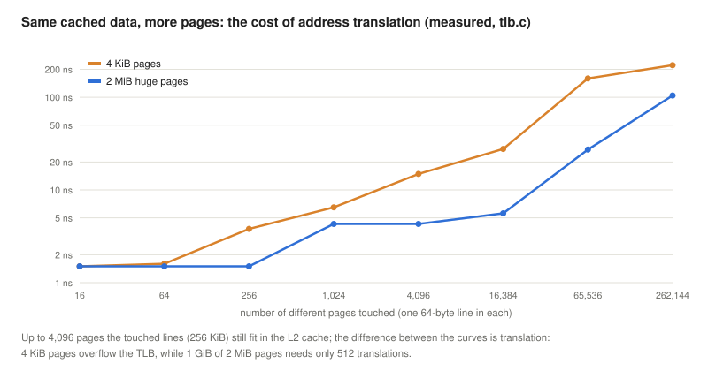

With 4 KiB pages, the time rises as soon as the pages exceed the 64 entries of the first-level data TLB (256 pages: 3.8 ns instead of 1.5), and steeply beyond the 1,536 entries of the second level (4,096 pages: 14.9 ns). With 2 MiB pages, the whole gigabyte needs only 512 translations, and the same accesses cost 1.5 and 4.3 ns. The difference is the cost of translation (including the cache space taken by the page-table entries that the walks bring in): about 2.3 ns per access while the second-level TLB still hits (256 and 1,024 pages), and 10 to 130 ns once it overflows (4,096 pages and more). This is why databases and virtual machines use huge pages.

<details>
<summary><b>Explained simply:</b> pointer chase, taskset, L1/L2 cache</summary>

- **Pointer chase:** each memory read gives the address of the next one, so the CPU cannot guess ahead or read several at once: every access is measured on its own.
- **taskset:** a command that keeps a program on one chosen CPU core, so that the measurement is not disturbed by moving between cores.
- **L1, L2 cache:** the smallest and fastest caches of the CPU, explained in the previous lecture.

</details>

### Protection

`protect.c` breaks the access rights of page-table entries on purpose and catches the resulting `SIGSEGV`:

```console
$ gcc -O2 -o protect protect.c
$ ./protect
1. write to a read-only page:
  -> SIGSEGV at 0x7f90fc657000, code SEGV_ACCERR (address is mapped, but this access is not allowed)
2. read address 0x10 (nothing mapped there):
  -> SIGSEGV at 0x10, code SEGV_MAPERR (no mapping at this address)
3. execute code stored in a read-write data page (NX bit):
  -> SIGSEGV at 0x7f90fc656000, code SEGV_ACCERR (address is mapped, but this access is not allowed)
4. the same after mprotect(PROT_READ | PROT_EXEC):
  -> executed and returned normally
```

The kernel distinguishes the cases of the page-fault handler: an address that belongs to no region (`SEGV_MAPERR`; a null-pointer access ends here, because Linux by default does not allow anything to be mapped in the lowest 64 KiB, `vm.mmap_min_addr` = 65536) and an access that the region's rights forbid (`SEGV_ACCERR`). The third case is the NX bit at work: the byte `0xC3` (`ret`) in a data page may not be executed; after `mprotect` has changed the page's rights to read + execute, the same instruction runs.

<details>
<summary><b>Explained simply:</b> signal, SEGV_MAPERR, SEGV_ACCERR, mprotect, null pointer, mmap_min_addr</summary>

- **Signal:** a message from the kernel to a program, such as "you made an illegal memory access"; a program can catch it with a handler function.
- **SEGV_MAPERR:** nothing is mapped at that address. **SEGV_ACCERR:** something is mapped, but this kind of access is forbidden.
- **mprotect:** a system call that changes the access rights of pages.
- **Null pointer:** a pointer with the value 0, used to mean "points nowhere"; following it is a common bug.
- **mmap_min_addr:** the lowest address at which Linux allows anything to be mapped, so that null-pointer bugs always cause an error.

</details>

### Fragmentation on Linux

**Internal fragmentation** appears in `malloc`, which hands out blocks in size classes (many size classes in 16-byte steps for small blocks in glibc); `malloc_usable_size` reveals how much each request really got:

```console
$ gcc -O2 -o internal internal.c
$ ./internal
   asked        got   wasted
       1         24      96%
       8         24      67%
      24         24       0%
      25         40      38%
      40         40       0%
     100        104       4%
    1000       1000       0%
    4000       4008       0%
    5000       5000       0%
```

("Wasted" is the share of the block received that was not asked for. Each block also carries 8 bytes of bookkeeping in front of it, not counted here.) **External fragmentation** appears in the kernel's own allocator of physical frames, the **buddy allocator** ([explained above](#in-the-kernel-the-buddy-allocator)), which keeps free memory in blocks of $2^0, 2^1, \ldots, 2^{10}$ contiguous frames (4 KiB to 4 MiB). `/proc/buddyinfo` counts the free blocks of each order:

```console
$ cat /proc/buddyinfo
Node 0, zone      DMA      0      0      0      0      0      0      0      0      1      1      3
Node 0, zone    DMA32      4      2      2      2      4      3      4      5      4      1    754
Node 0, zone   Normal   1040   1332   1862   1195    564    570   1006    497    133     14    260
```

In the `Normal` zone, most free blocks *by count* are small (1 to 8 frames, lying between used frames), but *by size* most free memory is still in large blocks: 260 blocks of 4 MiB are about 1 GiB, while all blocks of order 0 to 3 together are about 81 MiB. This machine had been running only briefly; on a long-running, busy machine the large orders run out. A request for physically contiguous memory, such as a 2 MiB huge page (order 9), can only be served from the larger blocks; when they run out, the kernel's `kcompactd` thread compacts memory by moving pages, which is possible because processes only see virtual addresses. Paging makes physical fragmentation invisible to programs, but not to the kernel.

<details>
<summary><b>Explained simply:</b> size class, malloc_usable_size, buddy allocator, order, zone, kcompactd</summary>

- **Size class:** `malloc` hands out blocks only in certain sizes; a request is rounded up to the next one.
- **malloc_usable_size:** a function that tells how large the block received really is.
- **Buddy allocator:** the kernel's allocator of physical frames. It keeps free memory in blocks of 1, 2, 4, 8 … frames; a block is split in half ("buddies") when a smaller one is needed, and two free buddies are joined again.
- **Order:** the size class of a buddy block: order *k* means $2^k$ frames.
- **Zone:** a part of physical RAM with its own rules: DMA and DMA32 for old devices that can only reach low addresses, Normal for everything else.
- **kcompactd:** a kernel thread that moves pages to create large free blocks.

</details>

### malloc under strace

`mallocdemo.c` allocates and frees memory in six steps and writes a marker line before each; `mallocdemo.sh` runs it under `strace`, keeps only the memory-related system calls (and the markers), and shortens long runs of `brk` calls:

```console
$ gcc -O2 -o mallocdemo mallocdemo.c
$ ./mallocdemo.sh
--- 1. 1000 small blocks of 100 bytes
brk(NULL)                               = 0x55fce146c000
brk(0x55fce148d000)                     = 0x55fce148d000
--- 2. one large block of 1 MiB
mmap(NULL, 1052672, PROT_READ|PROT_WRITE, MAP_PRIVATE|MAP_ANONYMOUS, -1, 0) = 0x7ff343aa3000
--- 3. free the large block
munmap(0x7ff343aa3000, 1052672)         = 0
--- 4. the same 1 MiB again
brk(0x55fce15a8000)                     = 0x55fce15a8000
--- 5. a second thread calls malloc
mmap(NULL, 8392704, PROT_NONE, MAP_PRIVATE|MAP_ANONYMOUS|MAP_STACK, -1, 0) = 0x7ff342fff000
mprotect(0x7ff343000000, 8388608, PROT_READ|PROT_WRITE) = 0
strace: Process 11102 attached
[pid 11102] mmap(NULL, 134217728, PROT_NONE, MAP_PRIVATE|MAP_ANONYMOUS, -1, 0) = 0x7ff33ae00000
[pid 11102] munmap(0x7ff33ae00000, 18874368) = 0
[pid 11102] munmap(0x7ff340000000, 48234496) = 0
[pid 11102] mprotect(0x7ff33c000000, 135168, PROT_READ|PROT_WRITE) = 0
[pid 11102] madvise(0x7ff342fff000, 8368128, MADV_DONTNEED) = 0
[pid 11102] +++ exited with 0 +++
--- 6. 100000 small blocks, then free all but the last one
brk(0x55fce15c9000)                     = 0x55fce15c9000
   ... 72 more brk() calls ...
brk(0x55fce1f32000)                     = 0x55fce1f32000
madvise(0x55fce1488000, 11083776, MADV_DONTNEED) = 0
madvise(0x55fce146d000, 106496, MADV_DONTNEED) = 0
brk(0x55fce1f1b000)                     = 0x55fce1f1b000
resident: 13524 KiB with all blocks, 13644 KiB after free, 2716 KiB after malloc_trim
+++ exited with 0 +++
```

Step by step, the rules of the [allocation section](#in-user-space-brk-mmap-and-malloc):

1. The first `malloc` asks where the break is (`brk(NULL)`) and moves it up by 0x21000 bytes, 132 KiB. The 1,000 blocks (112-byte chunks, 112,000 bytes in total) fit into it: 999 of the 1,000 `malloc` calls cost no system call at all.
2. 1 MiB is above the mmap threshold of 128 KiB: the block gets its own mapping of 1,052,672 bytes, 1 MiB plus one page for the chunk header.
3. `free` returns it to the kernel at once with `munmap`, and raises the mmap threshold to 1 MiB.
4. The same request now comes from the heap: the break moves up by 0x11B000 bytes (1,132 KiB: the block, plus 128 KiB of padding, minus what was still free at the top). Freeing it does not shrink the heap, because the limit for giving memory back at the top has risen with the threshold (to twice its value).
5. Creating a thread maps its 8 MiB stack (plus a 4 KiB guard page). The thread's first `malloc` creates a new arena: it reserves 128 MiB without any access rights (`PROT_NONE`), cuts away the parts below and above a 64 MiB-aligned window of 64 MiB, and makes only the first 132 KiB of it usable. When the thread ends, the C library releases the frames of its stack with `madvise`, but keeps the mapping for the next thread.
6. 99,000 more blocks (100,000 in all) grow the heap in 74 steps of about 132 KiB, to 11 MiB. Freeing all but the last one does not reduce the resident memory at all (it even grows a little, as the free chunks are sorted into bins): the last block sits near the top of the heap, so the break cannot move down. `malloc_trim` then returns the frames of the free pages inside the heap with `madvise(MADV_DONTNEED)` (10.6 MiB) and lowers the break by the 92 KiB that were free above the last block: the resident memory falls from 13.2 MiB to 2.7 MiB, while the addresses stay reserved.

<details>
<summary><b>Explained simply:</b> strace, marker, PROT_NONE, guard page</summary>

- **strace:** a tool that prints every system call a program makes, with its arguments and its result.
- **Marker:** a line the program prints only so that we can see where each step starts in the long list of system calls.
- **PROT_NONE:** a mapping that may not be read, written or executed: it only reserves the addresses for later.
- **Guard page:** an inaccessible page at the end of a stack; a stack that grows too far hits it and the program stops with an error instead of overwriting other memory.

</details>

### The buddy allocator at work

`buddy.sh` prints the free blocks of each order, and the free memory they add up to, before, while and after `hold.c` keeps 2 GiB of memory in use (every page written once), and, while the memory is held, splits the free blocks of the `Normal` zone by the kind of page they are kept for (`/proc/pagetypeinfo`):

```console
$ gcc -O2 -o hold hold.c
# ./buddy.sh
order:      0     1     2     3     4     5     6     7     8     9    10
--- before
DMA           0     0     0     0     0     0     0     0     1     1     3  =    15 MiB free
DMA32         2     1     2     2     4     3     4     5     4     1   754  =  3026 MiB free
Normal     9467  5928  4696  3404  1740   891   406   308   176   129   307  =  2400 MiB free
holding 2048 MiB
--- while 2 GiB are held
DMA           0     0     0     0     0     0     0     0     1     1     3  =    15 MiB free
DMA32         2     1     2     2     4     3     4     5     4     1   754  =  3026 MiB free
Normal       11     1     9     4     4    15    12    72    51     1   112  =   542 MiB free
--- the same Normal zone, split by the kind of page each free block is kept for:
Unmovable     1     0     0     0     1     1     1    54    37     0     0
Movable       0     0     0     0     1     1     0     0     0     1   112
--- after the program has ended
DMA           0     0     0     0     0     0     0     0     1     1     3  =    15 MiB free
DMA32         2     1     2     2     4     3     4     5     4     1   754  =  3026 MiB free
Normal     8742  5454  4506  3333  1674   891   416   287   179   134   318  =  2434 MiB free
```

The program's pages are taken from the `Normal` zone; the kernel prefers it and keeps the lower zones, which some old devices need, for later. Because each page fault asks for a single frame, the **smallest** blocks are used first: the lists of orders 0 to 6 are emptied almost completely, and only then are 4 MiB blocks split (from 307 to 112). The few blocks left in orders 7 and 8 belong to the lists for unmovable kernel memory, which the movable pages of a process do not use while other blocks are left. After the program has ended, its 2 GiB are free again, and the freed frames have merged with their buddies back into 4 MiB blocks: 318 of them, about as many as before. (The machine is shared with other running programs, so the numbers move a little between the snapshots.)

<details>
<summary><b>Explained simply:</b> pagetypeinfo, movable and unmovable pages</summary>

- **pagetypeinfo:** a file that shows the free blocks of each order once more, sorted by the kind of memory they are reserved for.
- **Movable page:** a page the kernel can move to another frame without anyone noticing, such as a page of a process (only its page-table entry must be changed). **Unmovable:** most kernel memory, whose physical address is used directly and so cannot change. Keeping the two kinds apart keeps large free blocks possible.

</details>

### Slab caches

`slab.sh` lists the largest slab caches with `slabtop`, looks at the dentry cache in `/sys/kernel/slab`, counts the objects of two caches while 100,000 empty files are created and deleted, and lists the caches behind `kmalloc`:

```console
# ./slab.sh
--- the largest caches (slabtop, sorted by cache size):
  OBJS ACTIVE  USE OBJ SIZE  SLABS OBJ/SLAB CACHE SIZE NAME                   
   672    672 100%    4.00K     84        8      2688K kmalloc-4k             
 14880  14812  99%    0.13K    496       30      1984K kernfs_node_cache      
  2828   2036  71%    0.57K    202       14      1616K radix_tree_node        
  1826   1422  77%    0.73K     83       22      1328K shmem_inode_cache      
  5124   2980  58%    0.19K    244       21       976K dentry                 
   130    105  80%    5.75K     26        5       832K task_struct            
  8120   5458  67%    0.07K    145       56       580K vmap_area              
--- one cache in detail: dentry
object size 192 B, 21 objects per slab, slab = 2^0 page(s)
--- active objects before, after creating 100000 files, after deleting them:
ext4_inode_cache 322  dentry 2980  | Slab:              24940 kB
ext4_inode_cache 100310  dentry 102984  | Slab:             166904 kB
ext4_inode_cache 341  dentry 3315  | Slab:              25960 kB
--- the general-purpose caches behind kmalloc():
kmalloc-8 kmalloc-16 kmalloc-32 kmalloc-64 kmalloc-96 kmalloc-128 kmalloc-192 kmalloc-256 kmalloc-512 kmalloc-1k kmalloc-2k kmalloc-4k kmalloc-8k 
--- caches merged with another cache of the same size (SLUB aliases):
143
Slab:              26064 kB
SReclaimable:       6052 kB
SUnreclaim:        20012 kB
VmallocUsed:        7720 kB
```

Every cache holds objects of one size: 21 dentries of 192 bytes fill one 4 KiB page (4,032 bytes, 64 left over), while `task_struct`, the process descriptor of 5.75 KiB, comes 5 to a slab of 8 pages (32 KiB), because one object per 8 KiB would waste more than a quarter of the memory. Creating 100,000 files added about 100,000 objects to the dentry cache and to the cache of ext4's in-memory inodes, and the slab memory grew by 139 MiB; deleting the files freed the objects, the empty slabs went back to the buddy allocator, and the slab memory fell back to 25 MiB. The `kmalloc` caches are powers of two from 8 bytes to 8 KiB, plus 96 and 192 bytes, two common sizes that would otherwise waste a quarter of a 128- or 256-byte object. SLUB merges caches whose objects have the same size and properties: 143 of the cache names are only aliases of another cache. `SReclaimable` is the part of the slab memory that the kernel can free when memory runs short, mainly dentries and inodes of unused files; `VmallocUsed` is the memory mapped with `vmalloc`.

<details>
<summary><b>Explained simply:</b> slabtop, task_struct, alias, SReclaimable/SUnreclaim, VmallocUsed</summary>

- **slabtop:** like `top`, but for the kernel's slab caches: which kinds of objects take the most memory.
- **task_struct:** the kernel's record of one process or thread, the process control block of the [scheduling lecture](../07-concurrency-deadlocks-scheduling/).
- **Alias:** a second name for the same cache: two kinds of objects of the same size share one set of slabs.
- **SReclaimable, SUnreclaim:** slab memory the kernel can free if needed (for example, remembered file names), and slab memory it cannot.
- **VmallocUsed:** how much memory the kernel has put together with `vmalloc`.

</details>

### Page replacement, simulated

`pagesim.py` replays the reference string of the figure with FIFO and prints the frames after each reference, newest first:

```console
$ python3 pagesim.py belady
FIFO, 3 frames (frames listed newest first for FIFO/LRU):
  reference:  3  2  1  0  3  2  4  3  2  1  0  4
  frame 1:    3  2  1  0  3  2  4  4  4  1  0  0
  frame 2:       3  2  1  0  3  2  2  2  4  1  1
  frame 3:          3  2  1  0  3  3  3  2  4  4
  fault:      *  *  *  *  *  *  *        *  *      -> 9 faults

FIFO, 4 frames (frames listed newest first for FIFO/LRU):
  reference:  3  2  1  0  3  2  4  3  2  1  0  4
  frame 1:    3  2  1  0  0  0  4  3  2  1  0  4
  frame 2:       3  2  1  1  1  0  4  3  2  1  0
  frame 3:          3  2  2  2  1  0  4  3  2  1
  frame 4:             3  3  3  2  1  0  4  3  2
  fault:      *  *  *  *        *  *  *  *  *  *   -> 10 faults
```

For 1 to 7 frames and five algorithms:

```console
$ python3 pagesim.py table
reference string: 3 2 1 0 3 2 4 3 2 1 0 4
frames    fifo     lru     opt   clock  random
     1      12      12      12      12      12
     2      12      12       9      12      11
     3       9      10       7       9       9
     4      10       8       6      10       6
     5       5       5       5       5       5
     6       5       5       5       5       5
     7       5       5       5       5       5
```

FIFO (and clock, which degenerates to FIFO when every page's accessed bit is set) goes from 9 to 10 faults when the fourth frame is added; LRU and OPT only improve. Note that on a single string LRU can lose to FIFO (10 against 9 faults with 3 frames): the stack property only guarantees that LRU never gets *worse* with more frames, not that it always beats FIFO. With 5 frames all five pages fit, and only the 5 compulsory faults remain. The naive model of uniformly random references, where every algorithm should give $1 - F/P$:

```console
$ python3 pagesim.py random
20000 uniformly random references to 16 pages
frames     fifo      lru    clock   1 - F/P
     1   93.5%   93.5%   93.5%    93.8%
     2   87.5%   87.5%   87.5%    87.5%
     4   75.0%   74.9%   74.9%    75.0%
     6   62.0%   62.3%   62.1%    62.5%
     8   49.7%   49.9%   49.9%    50.0%
    12   25.0%   25.0%   24.9%    25.0%
    16    0.1%    0.1%    0.1%     0.0%
```

Without locality, the algorithm makes no difference and every extra frame helps by the same amount; with 16 frames only the 16 compulsory faults remain (0.1% of 20,000). Real programs have locality, which is what makes the choice of the algorithm matter, and particular reference strings can then trigger FIFO's anomaly. And the working-set effect, for a program with three phases of 12 pages each:

```console
$ python3 pagesim.py thrash
6000 references, 3 phases with a working set of 12 pages each
frames  LRU faults  fault rate
     4        4107       68.5%  ##################################
     6        3150       52.5%  ##########################
     8        2225       37.1%  ###################
    10        1349       22.5%  ###########
    11         930       15.5%  ########
    12         589        9.8%  #####
    13         348        5.8%  ###
    14         257        4.3%  ##
    16         202        3.4%  ##
    20         173        2.9%  #
    24         153        2.5%  #
```

<details>
<summary><b>Explained simply:</b> simulator, reference string, compulsory fault, phase</summary>

- **Simulator:** a program that imitates a system, here the frames of RAM, to count faults without real hardware.
- **Reference string:** the list of page numbers a program uses, in order.
- **Compulsory fault:** the first use of a page always faults, whatever the algorithm, because the page has never been in RAM.
- **Phase:** a part of a program's run during which it uses one set of pages, for example while it processes one file.

</details>

## Lab exercises

1. **Your address space.** Write a C program that prints the addresses of a global variable, a local variable, a `malloc`ed block, a function and `main`, then sleeps. Find each address in `/proc/PID/maps`. Run it three times: which addresses change, and why? Turn ASLR off for one run with `setarch -R ./prog` and compare.
2. **Virtual to physical.** As root, extend `v2p.c` to map 64 pages and count how many of them are physically contiguous with their predecessor. Then map 4 MiB, aligned to 2 MiB as `tlb.c` does, with `MADV_HUGEPAGE`, and check the frame numbers of consecutive 4 KiB pages inside a huge page.
3. **Translate by hand.** For a 32-bit system with 4 KiB pages, translate the virtual addresses `0x00000FFF`, `0x00001000` and `0x00403A7C` with a page table in which page 0 → frame 7, page 1 → not present, page `0x403` → frame `0x12DC6`. Which access causes a page fault? For x86-64, split `0x00007F8A2F422ABC` into its four 9-bit indices and the offset.
4. **Page-table size.** How large is a flat page table for a 32-bit address space with 4 KiB pages and 4-byte entries? How many pages of page tables does a process using 8 MiB of contiguous memory need with the x86-64 four-level scheme? Check with `faults.c` (change its `SIZE` constant, and compare VmPTE before and after) by mapping 8 MiB, 64 MiB and 1 GiB.
5. **Demand paging and copy-on-write.** Modify `faults.c` to fork after touching the memory, and let the child write to every page. How many minor faults does the child cause, and how much does `fork()` itself take? Compare with a child that only reads.
6. **TLB.** Run `tlb` and `tlb huge` on your machine, and find the steps. Look up your processor's TLB sizes (`cpuid -1 | grep -i tlb`, or the vendor's documentation) and check whether the steps match the number of entries.
7. **Replacement.** Run `python3 pagesim.py trace lru 3 3 2 1 0 3 2 4 3 2 1 0 4` and the same with `opt` and `clock`, then add the aging algorithm to `pagesim.py` and run it on the same string. Then search, with a small script, for the shortest reference string over 5 pages that shows Bélády's anomaly for FIFO, and check that LRU never shows it on 1,000 random strings.
8. **Thrashing, for real.** In a virtual machine or a container with a memory limit (for example `sudo systemd-run --scope -p MemoryMax=256M ./prog` with swap enabled), run a program that touches 200, 250, 300 and 400 MiB at random. Measure its run time and its major faults. Where does thrashing begin?
9. **No locality, and the price of a fault.** Run `python3 pagesim.py random` and explain why all three algorithms give $1 - F/P$. Then add `opt` to the comparison (on 2,000 references, because OPT is slow in this simulator): why can OPT do much better even on random references? Finally, with the model of the [cost of a fault](#the-cost-of-a-fault) (memory access 1 unit, disk transfer 10,000 units), compute the slowdown for a fault rate of 1 in 10,000 accesses when no victim, half of the victims, or all victims are dirty.
10. **malloc's choices.** Write a program that allocates a block of *N* bytes, writes one byte into it and frees it, 1,000 times in a loop (store the pointer in a `volatile` global variable, so that the compiler cannot remove the pair). Count its system calls with `strace -c -e trace=brk,mmap,munmap ./prog N` for *N* = 64 KiB, 128 KiB, 256 KiB and 1 MiB, and subtract the calls of the dynamic loader (run it once with *N* = 16). Then repeat with the threshold fixed: `GLIBC_TUNABLES=glibc.malloc.mmap_threshold=131072 strace -c …`. Explain every count with the rules of the [allocation section](#in-user-space-brk-mmap-and-malloc). Finally, run `mallocdemo` with `GLIBC_TUNABLES=glibc.malloc.arena_max=1` under `strace -f`: what changes in step 5, and what could it cost a program with many threads?
11. **A buddy allocator of your own.** Write `buddy.py` that manages 64 frames with one free list per order (0 to 6), with `alloc(frames)` returning the first frame of a block and `free(frame)`, and print the free lists after every call. Replay review question 20 with it. Then allocate random sizes between 1 and 64 frames: what share of the allocated memory is lost to rounding up to powers of two? Finally, run `slab.sh` and explain why the dentry cache does not use blocks from the buddy allocator directly.

## Review questions

1. What problems arise when several processes share one RAM without virtual memory? Name four, and explain how virtual memory solves each.
2. Explain internal and external fragmentation with the two pictures of the fragmentation figure. Which one does paging avoid, and which one does it keep?
3. What are first fit, best fit and worst fit? Why does compaction help, and why is it expensive?
4. Explain the paging figure: why are the pages of a process contiguous in virtual memory and scattered in RAM? What does this solve?
5. Describe the translation of a 32-bit virtual address with 4 KiB pages step by step, including the role of the page-table base register. What happens at a context switch?
6. What do the valid bit and the access-rights bits of a page-table entry do? What happens when an access breaks them?
7. Why are page tables hierarchical? How is a 48-bit address split on x86-64, and how large is each table?
8. What is the TLB, why is it needed, and what is TLB reach? How do huge pages help?
9. What happens on a page fault? Distinguish demand paging, copy-on-write, and minor and major faults, with an example of each.
10. Compute the effective access time for a fault rate of $10^{-5}$, a memory access of 100 ns and a fault time of 8 ms. What fault rate keeps the slowdown under 10%?
11. Describe FIFO, OPT, LRU and the clock algorithm. Why is exact LRU not used for virtual memory, and what does Linux use?
12. Reproduce the classic example of Bélády's anomaly with 3 and 4 frames. Why can LRU not show the anomaly?
13. What is a working set, and what is thrashing? How can an operating system prevent thrashing?
14. Compare caches and virtual memory: unit, size, cost of a miss, placement, replacement and write policy. Explain each difference by the cost of a miss.
15. What did the Linux measurements show about demand paging, copy-on-write, major faults and the TLB? Give one number for each.
16. What are overlays and swapping? What problems of each did paging solve? What does "swap" mean on Linux today?
17. With uniformly random references to 16 pages, what fault rate do you expect with 4 and with 8 frames, and why does it not depend on the algorithm? How does Bélády's anomaly contradict the expectation that more frames always mean fewer faults?
18. A system has 16-bit virtual addresses, 4 KiB pages and 7-bit frame numbers. How long are the page number, the offset and the physical address? Translate the virtual address `0x2ABC` if page 2 is in frame `0x5D`. Then list the steps of a major fault in order, and say why a dirty victim makes it about twice as slow.
19. How does a C program get memory from Linux? Explain when `malloc` uses `brk` and when `mmap`, how the mmap threshold changes, and why the resident memory of a process often does not shrink after `free`.
20. A buddy allocator manages 64 free frames (one block of order 6). It receives the requests A = 3 frames, B = 8 frames and C = 1 frame, in this order. Which frames does each request get, and what are the free lists afterwards? How much memory does A waste? Then A is freed, and then C: which merges happen?
21. Why does the kernel use a slab allocator for objects such as dentries and inodes, instead of the buddy allocator? What is the difference between `kmalloc` and `vmalloc`, and when must a driver use `kmalloc`?

<details>
<summary><strong>Answer key (for instructors)</strong></summary>

1. Protection (each process gets its own page table; it cannot even address others' memory), relocation (each process sees its own addresses from 0; the mapping places it anywhere), external fragmentation (any page in any frame), size (pages not in use wait on disk; total memory may exceed RAM).
2. Internal: equal blocks, the unused rest of each block is wasted inside it. External: variable blocks, holes between blocks too small to use. Paging avoids external fragmentation, keeps a little internal fragmentation (on average half a page per region).
3. First fit: first hole large enough; best fit: smallest hole large enough; worst fit: largest hole. Compaction joins the holes into one, but it copies memory and requires running programs to be relocated.
4. Each process has its own page table that maps its contiguous virtual pages to any free frames. This solves external fragmentation and relocation, and lets each process see a contiguous memory.
5. Offset = low 12 bits; page number = high 20 bits; entry address = PTBR + page number × entry size; if valid and rights allow, physical address = frame number × 4096 + offset; otherwise page fault. At a context switch the OS loads the new process's PTBR (CR3), switching the whole address space (and the TLB must be flushed or tagged).
6. Valid: the page is in a frame; if 0, page fault, and the OS loads the page or ends the program. Rights (R/W/X, user/supervisor): a forbidden access causes a page fault, which the OS turns into SIGSEGV.
7. A flat table would be 4 MiB per process for 32 bits and impossibly large for 64 bits; with levels, tables exist only for used regions. x86-64: 9 + 9 + 9 + 9 index bits + 12 offset bits; each table has 512 eight-byte entries = 4 KiB.
8. A small cache of recent translations inside the CPU, needed because a page-table walk takes up to four memory reads per access. Reach = entries × page size (1,536 × 4 KiB = 6 MiB). Huge pages multiply the reach by 512 (2 MiB) or 262,144 (1 GiB).
9. The CPU traps to the kernel, which checks the address against the process's regions: invalid → SIGSEGV; never-used page → allocate a zeroed frame (demand paging, minor); write to a shared copy-on-write page after fork → copy it (minor); page on disk → read it while the process waits (major). Example numbers from the measurements: 262,144 minor faults for 1 GiB; 57 µs per major fault.
10. T = 0.99999 × 100 + 0.00001 × 8,000,000 ≈ 100 + 80 = 180 ns (80% slower). For under 10%: 110 > 100 + p × (8,000,000 − 100), p < 1.25 × 10⁻⁶.
11. FIFO evicts the oldest; OPT the one used farthest in the future; LRU the least recently used; clock goes around the frames and evicts the first whose accessed bit is clear, clearing bits as it passes. Exact LRU would need an update at every memory access; Linux uses active/inactive lists (and optionally MGLRU), based on the accessed bits.
12. String 3 2 1 0 3 2 4 3 2 1 0 4: FIFO 9 faults with 3 frames, 10 with 4. LRU is a stack algorithm: the n most recently used pages are always among the n + 1 most recently used, so more frames can only help.
13. The pages used in a recent time window. Thrashing: too few frames for the working sets, so processes mostly wait for paging. Prevent it by keeping fewer processes in memory (suspending or ending some), giving each enough frames for its working set, or adding memory.
14. Line (64 B) vs page (4 KiB); KiB–MiB vs GiB; 10–100 ns vs µs–ms; set-associative vs fully associative; hardware random/pseudo-LRU vs software LRU approximations; write-through or write-back vs always write-back. A major page fault costs hundreds of thousands to millions of cycles, so the OS can afford full associativity and careful replacement, and must avoid any unnecessary disk write.
15. Demand paging: 1 GiB mapped with 1 MiB resident until touched, then 262,144 faults. Copy-on-write: the child got a new frame (0x1802b2) only when it wrote. Major faults: 57 µs per page vs about 0.15 µs when cached. TLB: 14.9 ns vs 4.3 ns per access for 4,096 pages with 4 KiB vs 2 MiB pages.
16. Overlays: the programmer splits a program into a resident part and phases that are loaded in turn into one overlay area. Swapping: the OS moves whole jobs between memory and a swap area. Overlays burden the programmer and depend on the memory size; swapping moves whole processes (cost proportional to size), needs a contiguous hole on return, and cannot run a job larger than RAM. Paging moves only the pages used, into any frame, automatically. On Linux, swap is the disk area for single anonymous pages evicted from RAM.
17. $1 - F/P$: 75% with 4 frames, 50% with 8 (the simulator: 75.0% and 49.7–49.9%). Every page is equally likely to be referenced next, so which pages are kept does not matter, only how many. Bélády's anomaly: with FIFO and the string 3 2 1 0 3 2 4 3 2 1 0 4, 4 frames give 10 faults and 3 frames only 9; it happens because FIFO is not a stack algorithm.
18. Page number 4 bits, offset 12 bits, physical address 7 + 12 = 19 bits (512 KiB). `0x2ABC` → page 2, offset `0xABC` → physical `0x5DABC` (the frame number is written in front of the offset). Steps: exception, check of the address and rights, finding a frame (evicting and writing back a dirty victim), starting the disk read, running another process, disk interrupt, updating the page-table entry, restarting the instruction. A dirty victim must be written before its frame can be reused, so the fault costs a disk write plus a disk read instead of one read.
19. The kernel gives memory in pages, by moving the program break of the heap (`brk`/`sbrk`) or by creating a new mapping (`mmap`). `malloc` serves small requests from the heap, cut into chunks, reusing freed chunks from its bins and calling `brk` only when the heap is full; a request of at least the mmap threshold (128 KiB at first) that does not fit into the free memory of the heap gets its own mapping, which `free` returns with `munmap`. When such a block is freed, the threshold rises to its size (up to 32 MiB), so that repeated allocations of that size come from the heap. Small freed blocks stay in the bins, the heap can shrink only from the top, and one live block near the top keeps everything below it; only whole free pages can be returned (`malloc_trim`, `madvise`). The demo: 13.2 MiB resident with all blocks and still after freeing all but one, 2.7 MiB after `malloc_trim`.
20. A: 3 frames rounded up to 4 (order 2). The order-6 block is split into 32 + 32, 16 + 16, 8 + 8, 4 + 4; A gets frames 0–3, and the free lists hold order 2 {4}, order 3 {8}, order 4 {16}, order 5 {32}. B: 8 frames (order 3) from the order-3 list: frames 8–15. C: 1 frame; the smallest free block is 4–7 (order 2), split into 4–5 and 6–7, then 4–5 into 4 and 5: C gets frame 4. Free lists: order 0 {5}, order 1 {6}, order 4 {16}, order 5 {32}. A wastes 1 frame of 4 (25%). Freeing A: its buddy is 4–7 (0 XOR 4 = 4), which is not free as a whole, so no merge: order 2 {0} is added. Freeing C: buddy 5 is free → order 1 at 4; buddy 6–7 is free → order 2 at 4; buddy 0–3 is free → order 3 at 0; its buddy 8–15 is B, in use, so merging stops. Free lists: order 3 {0}, order 4 {16}, order 5 {32}.
21. The buddy allocator's smallest unit is a page; a 192-byte dentry in a 4 KiB page would waste 95%, and splitting and merging would be slow for objects allocated and freed all the time. A slab cache cuts pages into objects of exactly one size: allocation and freeing take a free object from a list without searching, there is no external fragmentation inside a slab, objects are reused while still in the CPU cache, and per-CPU slabs avoid locks. `kmalloc` returns physically contiguous memory from the general caches (or from the buddy allocator above 8 KiB); `vmalloc` maps scattered frames to contiguous virtual addresses through page tables, which works for large buffers but is slower and not physically contiguous. A driver must use `kmalloc` (or a DMA allocation function) for buffers a device accesses by DMA without an IOMMU, and `kmalloc` with `GFP_ATOMIC` in interrupt context, because `vmalloc` may sleep.

**Lab answers.** Lab 3: `0x00000FFF` → frame 7, physical `0x00007FFF`; `0x00001000` → page 1, not present: page fault; `0x00403A7C` → `0x12DC6A7C`. `0x00007F8A2F422ABC`: indices 0xFF (255), 0x28 (40), 0x17A (378), 0x22 (34), offset 0xABC. Lab 4: 2²⁰ × 4 B = 4 MiB; for 8 MiB contiguous (and aligned): 1 table at each of levels 4, 3 and 2, and 4 tables at level 1 (2,048 entries / 512), 7 pages = 28 KiB in total, in theory. Measured, VmPTE grows only by about 4–5 pages (16–20 kB): the new region usually lands next to the libraries, whose upper-level tables already exist, and VmPTE does not count the top-level table. Lab 5: one minor fault per page written by the child (262,144 for 1 GiB); fork itself must copy the page tables, about 2 MiB, which takes milliseconds; a reading child causes no copies and no faults at all. Lab 7: an exhaustive search over all strings of up to 12 references over up to 5 pages shows that 12 is the minimum length, and that, up to renaming the pages, the string of the figure, with 3 against 4 frames, is the only such string of length 12. Lab 9: OPT knows the future, so even without locality it keeps the pages that will be needed soonest; on 2,000 random references to 16 pages it faults about 50%, 25% and 10% of the time with 4, 8 and 12 frames, against about 74%, 49% and 24% for FIFO and LRU. Slowdown at 1 fault in 10,000 accesses: (10,000 + 10,000) / 10,000 = 2 times with clean victims, 2.5 times if half of them are dirty, 3 times if all are. Lab 10 (measured on the machine of the Linux section; the loader alone makes 8 `mmap`, 1 `munmap` and 3 `brk` calls): 64 KiB and 128 KiB add no system call at all, because both fit into the 132 KiB the heap already has (a request at the threshold is mapped only if the heap cannot serve it); 256 KiB and 1 MiB add exactly one `mmap`/`munmap` pair and one `brk`: the first block is mapped, freeing it raises the threshold, and the other 999 come from the heap. With the threshold fixed by the tunable, the dynamic adjustment is off, and 256 KiB and 1 MiB cost 1,000 `mmap`/`munmap` pairs. With `arena_max=1` the thread's 128 MiB reservation disappears from step 5: the thread uses the main arena, which saves address space and memory but makes threads that allocate at the same time wait for the arena's lock. Lab 11: with sizes uniformly distributed between 1 and 64 frames, about 24% of the allocated frames are lost to rounding (2,080 frames requested for every 2,731 allocated, over all 64 sizes).

</details>

## References

Bélády, L. A. (1966). A study of replacement algorithms for a virtual-storage computer. *IBM Systems Journal, 5*(2), 78–101. https://doi.org/10.1147/sj.52.0078

Bélády, L. A., Nelson, R. A., & Shedler, G. S. (1969). An anomaly in space-time characteristics of certain programs running in a paging machine. *Communications of the ACM, 12*(6), 349–353. https://doi.org/10.1145/363011.363155

Bonwick, J. (1994). The slab allocator: An object-caching kernel memory allocator. In *Proceedings of the USENIX Summer 1994 Technical Conference* (pp. 87–98). USENIX Association. https://www.usenix.org/legacy/publications/library/proceedings/bos94/bonwick.html

Corbató, F. J. (1968). *A paging experiment with the Multics system* (Report No. MAC-M-384). Massachusetts Institute of Technology, Project MAC. https://people.csail.mit.edu/saltzer/Multics/Multics-Documents/M00s/M0104.pdf

Corbató, F. J., Merwin-Daggett, M., & Daley, R. C. (1962). An experimental time-sharing system. In *Proceedings of the May 1–3, 1962, Spring Joint Computer Conference* (pp. 335–344). Association for Computing Machinery. https://doi.org/10.1145/1460833.1460871

Corbet, J. (2007, April 11). *The SLUB allocator*. LWN.net. https://lwn.net/Articles/229984/

Denning, P. J. (1968a). The working set model for program behavior. *Communications of the ACM, 11*(5), 323–333. https://doi.org/10.1145/363095.363141

Denning, P. J. (1968b). Thrashing: Its causes and prevention. In *Proceedings of the December 9–11, 1968, Fall Joint Computer Conference, Part I* (pp. 915–922). ACM. https://doi.org/10.1145/1476589.1476705

Denning, P. J. (1970). Virtual memory. *ACM Computing Surveys, 2*(3), 153–189. https://doi.org/10.1145/356571.356573

GNU C Library. (n.d.). *Overview of malloc* (MallocInternals). glibc wiki. Retrieved October 8, 2026, from https://sourceware.org/glibc/wiki/MallocInternals

Gorman, M. (2004). *Understanding the Linux virtual memory manager*. Prentice Hall. https://www.kernel.org/doc/gorman/

Intel Corporation. (2024). *Intel 64 and IA-32 architectures optimization reference manual: Volume 1*. https://www.intel.com/content/www/us/en/content-details/671488/intel-64-and-ia-32-architectures-optimization-reference-manual-volume-1.html

Intel Corporation. (2025). *Intel 64 and IA-32 architectures software developer's manual: Volume 3A. System programming guide, part 1*. https://www.intel.com/content/www/us/en/developer/articles/technical/intel-sdm.html

Kilburn, T., Edwards, D. B. G., Lanigan, M. J., & Sumner, F. H. (1962). One-level storage system. *IRE Transactions on Electronic Computers, EC-11*(2), 223–235. https://doi.org/10.1109/TEC.1962.5219356

Knowlton, K. C. (1965). A fast storage allocator. *Communications of the ACM, 8*(10), 623–624. https://doi.org/10.1145/365628.365655

Knuth, D. E. (1997). *The art of computer programming: Vol. 1. Fundamental algorithms* (3rd ed.). Addison-Wesley.

Larabel, M. (2022, October 11). *MGLRU merged for Linux 6.1*. Phoronix. https://www.phoronix.com/news/MGLRU-In-Linux-6.1

The kernel development community. (n.d.-a). *Documentation for /proc/sys/vm/*. The Linux Kernel documentation. Retrieved October 7, 2026, from https://docs.kernel.org/admin-guide/sysctl/vm.html

The kernel development community. (n.d.-b). *Examining process page tables*. The Linux Kernel documentation. Retrieved October 7, 2026, from https://docs.kernel.org/admin-guide/mm/pagemap.html

The kernel development community. (n.d.-c). *Memory allocation guide*. The Linux Kernel documentation. Retrieved October 8, 2026, from https://docs.kernel.org/core-api/memory-allocation.html

Linux man-pages project. (n.d.). *mallopt(3): Set memory allocation parameters*. Retrieved October 8, 2026, from https://man7.org/linux/man-pages/man3/mallopt.3.html

Mattson, R. L., Gecsei, J., Slutz, D. R., & Traiger, I. L. (1970). Evaluation techniques for storage hierarchies. *IBM Systems Journal, 9*(2), 78–117. https://doi.org/10.1147/sj.92.0078

Silberschatz, A., Galvin, P. B., & Gagne, G. (2018). *Operating system concepts* (10th ed.). Wiley.

Wilson, P. R., Johnstone, M. S., Neely, M., & Boles, D. (1995). Dynamic storage allocation: A survey and critical review. In H. G. Baker (Ed.), *Memory management: International Workshop IWMM 95* (Lecture Notes in Computer Science, Vol. 986, pp. 1–116). Springer. https://doi.org/10.1007/3-540-60368-9_19

## Further reading

Arpaci-Dusseau, R. H., & Arpaci-Dusseau, A. C. (2023). *Operating systems: Three easy pieces* (Version 1.10). Arpaci-Dusseau Books. https://pages.cs.wisc.edu/~remzi/OSTEP/
