# File Systems

*Operating Systems lecture: how hard disks and SSDs store data, and how a file system turns numbered blocks into named files and directories: inodes, directories, hard and symbolic links, allocation, journaling, and four real file systems, FAT16, ext4, XFS and NTFS, taken apart on Linux*

## Learning objectives

The [previous lecture](../09-virtual-memory/) used the disk as the slow, large level of memory. This lecture looks at the disk in its own right: as the place where data must survive power failures, crashes and decades, organised so that people and programs can find it by name.

By the end, students will be able to:

- describe how a hard disk and an SSD are built, estimate the cost of a random and a sequential access on each, and explain why SSDs need a flash translation layer, garbage collection, wear leveling and TRIM;
- explain the file and directory abstractions, the layers of the storage stack and the role of the virtual file system;
- describe an inode, explain why names are kept in directories and not in inodes, and compare block pointers with extents;
- explain hard and symbolic links and their behaviour when the target is deleted, moved or on another file system;
- name the seven Unix file types shown by `ls -l`, and find their way around the standard Linux directory tree (`/etc`, `/usr`, `/var`, `/run`, `/proc` …);
- describe how directories are stored, as lists and as hashed or balanced trees;
- explain free-space management, fragmentation, delayed allocation, crash consistency and journaling;
- describe the on-disk structure of FAT16, ext4, XFS and NTFS, and compare them;
- explain logical volume management (physical volumes, extents, volume groups, logical volumes) and plan the commands that grow a file system online or retire a disk;
- explain the role of device drivers and the Linux device model (buses, devices, drivers, sysfs, udev), and follow a read through the block layer (bios, requests, merging, blk-mq queues, I/O schedulers) to the device and back;
- inspect all of these on Linux with `stat`, `ls -i`, `debugfs`, `filefrag`, `dumpe2fs`, `xfs_db` and `ntfsinfo`.

<details>
<summary><b>Explained simply:</b> file system, persistent, block, sector, SSD, HDD</summary>

- **File system:** the method an operating system uses to store files on a disk: where each file's bytes are, what it is called, who may read it. Like a library's catalogue and shelving rules.
- **Persistent:** kept even when the power is off. RAM forgets everything at power-off; a disk does not.
- **Block, sector:** a disk does not store single bytes, only fixed-size pieces: a **sector** (512 bytes or 4 KiB) on the device, and a **block** (usually 4 KiB) in the file system.
- **HDD** (hard disk drive): a disk with spinning magnetic platters. **SSD** (solid-state drive): a "disk" made of flash memory chips, with no moving parts.

</details>

## Why file systems?

A storage device offers only one thing: an array of numbered blocks that can be read and written. A program, and a person, wants something very different: **files** with names, organised in **directories**, which survive crashes, can be shared and protected, and grow and shrink at will. The file system builds the second from the first. It must answer four questions for every file:

- **Naming:** how do we find a file? By a path such as `/home/peter/notes.txt`, resolved through directories.
- **Allocation:** which blocks hold its data, and which blocks are free?
- **Metadata:** how large is it, who owns it, who may read it, when was it changed?
- **Consistency:** what happens if the power fails in the middle of an update?

Unix, designed in the early 1970s, gave the answers that most systems still follow: a file is an unstructured sequence of bytes, a directory is a file that maps names to file numbers (**inodes**), and devices, pipes and even kernel information appear as files in one tree (Ritchie & Thompson, 1974). The [history lecture](../01-historic-evolution/#xi-persistent-data-file-systems) placed file systems among the services an OS added to keep valuable data; this lecture shows how they work.

<details>
<summary><b>Explained simply:</b> path, directory, metadata, consistency</summary>

- **Path:** the "address" of a file, the list of folders that lead to it, separated by `/`.
- **Directory:** a folder: a list of names, each pointing to a file or to another directory.
- **Metadata:** data about the data: size, owner, permissions, dates. Like the label on a box, not its content.
- **Consistency:** everything stored about the files agrees: no block belongs to two files, no file points to a free block.

</details>

## Storage devices

### Hard disks

A hard disk stores bits as tiny magnetised regions on the surfaces of rotating **platters**. A **head** on a moving **arm** flies a few nanometres above each surface. The surface is divided into concentric **tracks**, and each track into **sectors**, the smallest unit the disk reads or writes (512 bytes traditionally, 4 KiB on modern "Advanced Format" disks). The same track on all surfaces forms a **cylinder**:

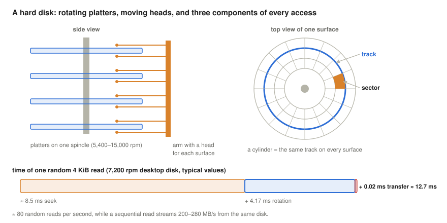

Reading a sector takes three steps:

1. **Seek:** move the arm to the right track, on average a few milliseconds (8–9 ms on a desktop disk, about 4 ms on a fast server disk).
2. **Rotational latency:** wait until the sector passes under the head. On average half a revolution: 7,200 revolutions per minute are 120 per second, so one turn takes 1/120 s = 8.33 ms, and the average wait is 4.17 ms.
3. **Transfer:** read the bits as they pass, at 200–280 MB/s on current disks; 4 KiB take about 0.02 ms.

A random 4 KiB read therefore costs about 12–13 ms, and a disk performs about 80 such reads per second, while a sequential read, which pays for the seek and the rotation only once, runs at its full transfer rate. The ratio between the two, several hundred to one, shaped the design of every classic file system: **keep related data together** (Ruemmler & Wilkes, 1994; McKusick et al., 1984).

The head does not touch the platter: it is mounted on a **slider** that rides on a thin cushion of air dragged along by the spinning surface. In current drives the gap, the **flying height**, is of the order of 1–2 nanometres while reading and writing (Matthes, 2016). A fine dust particle of 2.5 µm is over a thousand times larger than that gap, and a human hair, about 70 µm thick (U.S. Environmental Protection Agency, n.d.), tens of thousands of times:

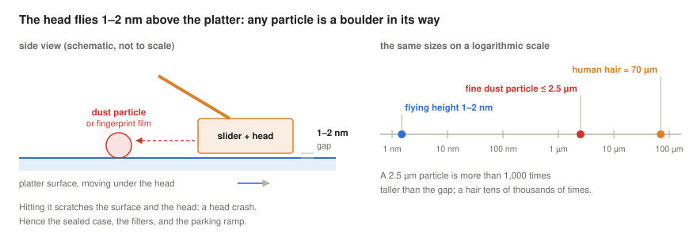

If the head hits a particle, a fingerprint film or the surface itself, it scratches the magnetic layer and itself: a **head crash**, which destroys the data under it and usually the drive. This is why hard disks are assembled in clean rooms and sealed, with a small filter that only lets air pressure equalise (or, in high-capacity drives, filled with helium and hermetically sealed), why a drive should never be opened outside a clean room, and why, in most current drives, the heads are parked on a ramp beside the platters before the spindle stops and when a laptop's drive detects a fall.

Modern disks hide their geometry. The OS sees a linear array of **logical block addresses** (LBA 0, 1, 2, …); the disk maps them to cylinders, heads and sectors itself, puts more sectors on the longer outer tracks (zoned recording, which makes the outer, low-numbered LBAs faster), and silently replaces bad sectors. Capacities keep growing with techniques such as shingled recording (overlapping tracks) and heat-assisted recording (HAMR): Seagate has announced HAMR drives of up to 36 TB (Seagate, n.d.). Hard disks remain the cheapest storage per terabyte and dominate in data centres for bulk data, while SSDs have replaced them in laptops and for anything latency-sensitive.

<details>
<summary><b>Explained simply:</b> platter, head, track, sector, cylinder, seek, rotational latency, rpm, LBA, Advanced Format</summary>

- **Platter:** a rotating disk coated with magnetic material, like a vinyl record that stores bits.
- **Head:** the tiny read/write element on the end of an arm, like the needle of a record player that never touches the record.
- **Track:** one ring on the platter. **Sector:** one slice of a track, the smallest piece the disk reads or writes.
- **Cylinder:** the same ring on all platters, reachable without moving the arm.
- **Seek:** moving the arm to the right ring. **Rotational latency:** waiting until the right slice comes around.
- **rpm:** revolutions per minute: how fast the platters spin.
- **LBA** (logical block address): simply the number of a sector, 0, 1, 2, …, without caring where it physically is.
- **Advanced Format:** disks with 4,096-byte sectors instead of 512-byte ones.
- **Zoned recording:** outer rings are longer, so they hold more sectors and pass under the head faster.
- **Shingled recording (SMR), heat-assisted recording (HAMR):** tricks to pack the rings closer: overlapping them like roof tiles, or heating a tiny spot with a laser while writing.
- **Bad-sector remapping:** the disk quietly uses a spare sector instead of a damaged one.
- **Slider, flying height:** the head sits on a tiny "sledge" that floats on the air moving with the platter, like a water-skier on the water; the flying height is how far above the surface it floats.
- **nm, µm:** a nanometre is a millionth of a millimetre, a micrometre a thousandth of a millimetre. A hair is about 70 µm thick.
- **Head crash:** the head touching the spinning platter; it scratches the surface like a needle dragged across a record, and the data there is lost.
- **Clean room:** a room with filtered air, almost free of dust, where disks are assembled.
- **Parking ramp:** a small ramp beside the platters where the heads rest when the disk stops, so that they never lie on the surface.

</details>

### Solid-state drives

An SSD stores bits as electric charge trapped in the cells of **NAND flash** chips. A cell holds one bit (SLC), two (MLC), three (TLC) or four (QLC); more bits per cell make flash cheaper but slower and less durable. Today's chips stack cells in hundreds of layers (3D NAND). Flash has three peculiar rules:

- Reading and **programming** (writing) work on **pages** of 4–16 KiB, in tens of microseconds for reads and hundreds for writes.
- A page can only be programmed when it is **erased**, and erasing works only on whole **blocks** of hundreds to thousands of pages, taking milliseconds.
- Each block survives a limited number of **program/erase cycles**: up to about 100,000 for SLC, a few thousand for MLC, one to three thousand for TLC, and a few hundred to a thousand for QLC (SpeedGuide, n.d.).

An SSD therefore cannot overwrite a logical block in place. Its controller runs firmware called the **flash translation layer (FTL)**, which makes the flash look like an ordinary disk (Agrawal et al., 2008):

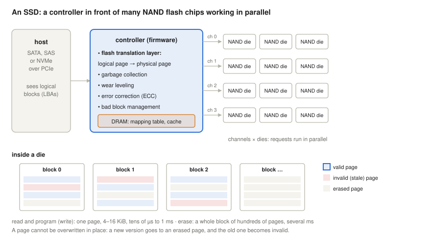

- **Mapping:** every write of a logical block goes to a fresh, erased page somewhere; a mapping table (kept in the controller's DRAM) records where each logical block currently lives, and the old copy is marked **invalid**.
- **Garbage collection:** when erased blocks run low, the controller picks a block with few valid pages, copies the valid ones elsewhere, and erases the block.
- **Wear leveling:** writes are spread over all blocks, so that no block wears out early.
- **Error correction**, bad block management, and parallelism: a controller drives several **channels**, each with several flash dies, so many requests run at the same time. This is why SSDs need deep request queues, which the NVMe interface provides.

The copies made by garbage collection are writes that the host never asked for. The ratio of flash writes to host writes is the **write amplification**. It depends on how much spare flash the FTL has to work with, its **over-provisioning**, and on the workload. The simulator `ftlsim.py` shows the effect ([Linux section](#an-ssd-simulated)):

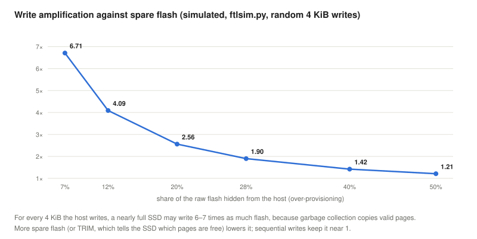

A full drive written at random with 7% spare flash writes 6.7 bytes of flash for every byte the host writes (Hu et al., 2009, analyse this case); with a quarter of the drive free, and the SSD informed of it, the factor falls below 2; sequential writes keep it at 1. The OS can help in two ways: by telling the SSD which blocks no longer hold data (**TRIM**, or *discard*, issued by `fstrim` or by the file system), and by writing large sequential chunks. The SSD in turn turns the hard disk's rule upside down: random reads are cheap (tens of microseconds), so seek-avoiding layout matters much less, while **write patterns** matter more.

<details>
<summary><b>Explained simply:</b> NAND flash, SLC/MLC/TLC/QLC, page, block, program, erase, P/E cycle, FTL, garbage collection, wear leveling, write amplification, over-provisioning, TRIM, NVMe, channel, die</summary>

- **NAND flash:** the memory chips in SSDs and USB sticks; they keep data without power by trapping electrons.
- **SLC, MLC, TLC, QLC:** one, two, three or four bits per memory cell. More bits: cheaper, but slower and wears out sooner.
- **Page:** the smallest piece of flash that can be read or written (a few KiB). **Block:** a group of hundreds of pages, the smallest piece that can be erased.
- **Program:** writing a page. **Erase:** clearing a whole block so its pages can be written again. **P/E cycle:** one program-and-erase round; a cell survives only so many.
- **FTL** (flash translation layer): the SSD's built-in software that keeps a map from "block number the computer asked for" to "where it really is in the flash", like a cloakroom attendant who puts your coat on any free hook and notes the number.
- **Garbage collection:** tidying up: moving the still-needed pages out of a block so that the whole block can be erased.
- **Wear leveling:** spreading the writes so that every block wears out at the same pace, like rotating the tyres of a car.
- **Write amplification:** the SSD writes more than the computer asked it to, because of the tidying up.
- **Over-provisioning:** extra flash the SSD keeps hidden, as working space.
- **TRIM:** the OS telling the SSD "these blocks are no longer used", so it need not copy them.
- **NVMe:** a fast way of connecting SSDs directly over PCIe, with many parallel request queues. **PCIe:** the computer's fastest internal expansion connection. **SATA, SAS:** older cables and protocols made for hard disks.
- **3D NAND:** flash cells stacked in hundreds of layers, like the floors of a skyscraper.
- **ECC** (error-correcting code): extra bits that let the controller detect and repair small errors in what it reads.
- **Channel, die:** a die is one flash chip; a channel is a connection to a group of chips. Many work at once.

</details>

## Files and the storage stack

A **file** is a named sequence of bytes plus metadata. Programs use it through a handful of system calls: `open` (look up the name, check permissions, return a **file descriptor**), `read` and `write` (at the current **offset**, which then advances), `lseek` (move the offset), `fsync` (force the data to the device), `close`, and on the directory level `rename`, `unlink`, `mkdir`, `link`, `symlink`. The kernel keeps, for each process, a table of open file descriptors; each points to an **open file description** holding the offset and the mode, which points to the file's in-memory inode. A file can also be mapped into memory with `mmap`; its page-cache pages then become pages of the process's address space, as the [virtual memory lecture](../09-virtual-memory/#major-faults) showed.

Between these calls and the device stand several layers:

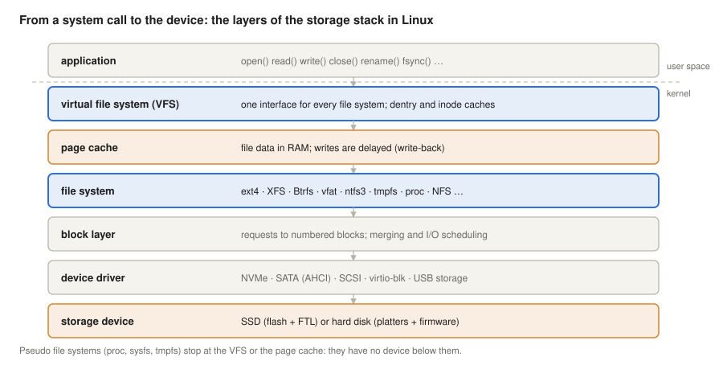

- The **virtual file system (VFS)** defines one set of operations (open, read, lookup, create, …) that every file system implements. This is how one `cat` command reads a file on ext4, on a USB stick formatted with FAT, on a network share, or a file that the kernel generates on the fly in `/proc`: the [Linux section](#one-interface-many-file-systems) shows the identical system calls. The VFS also caches directory entries (**dentry cache**) and inodes, so that repeated path lookups do not touch the disk.
- The **page cache**, which the [two-level memory lecture](../08-two-level-memory-and-cache/#ram-as-the-cache-of-the-disk) measured, holds file data in RAM. Writes normally just modify the page cache and return; the kernel writes the dirty pages back later: after about 30 seconds, when dirty data exceeds a share of memory (`dirty_background_ratio`), or under memory pressure. A program that needs its data to be safe on the device must call `fsync`, which is expensive ([Linux section](#the-price-of-durability)).
- The **file system** maps files and directories to blocks.
- The **block layer** queues, merges and schedules requests for numbered blocks, and the **device driver** speaks the device's protocol (NVMe, SATA, SCSI, virtio). The **I/O scheduler** in the block layer matters mainly for hard disks: `mq-deadline` and `bfq` sort and merge requests to reduce seeking (the old "elevator" idea), while fast NVMe SSDs usually run with `none`. The [I/O subsystem section](#the-io-subsystem-and-device-drivers) follows a request through these two layers in detail.

A disk is normally divided into **partitions**, described by a partition table (the old **MBR** or the current **GPT**), and each partition holds one file system. Between partitions and file systems, the **device mapper** can add layers: logical volumes (**LVM**) that can be resized and span disks ([section below](#logical-volume-management)), encryption (**dm-crypt**), and **RAID**, which combines disks so that data survives the failure of one (RAID 1 mirrors, RAID 5 and 6 add parity) or so that they work in parallel (RAID 0). RAID is not a backup: a deleted file is deleted on every disk at once.

Finally, each file system is **mounted** on a directory of the single Linux directory tree: the root file system on `/`, others on `/boot/efi`, `/home`, `/mnt/usb` and so on. `/etc/fstab` lists what to mount at boot, and `df` or `findmnt` show the current mounts.

<details>
<summary><b>Explained simply:</b> system call, file descriptor, offset, fsync, VFS, dentry, page cache, block layer, driver</summary>

- **System call:** a request from a program to the operating system, such as "open this file".
- **File descriptor:** a small number (3, 4, 5 …) that the OS gives a program for an opened file, like a cloakroom ticket.
- **Offset:** the position in the file where the next read or write happens, like a bookmark.
- **fsync:** "make sure this file is really on the disk now, not just in memory".
- **VFS** (virtual file system): the part of Linux that gives every kind of file system the same interface, like a universal power adapter.
- **Dentry:** a remembered (cached) link between a name in a directory and a file.
- **Page cache:** copies of file contents kept in RAM so they need not be read from the disk again.
- **Block layer:** the part of the kernel that collects and orders disk requests. **Driver:** the code that speaks to one kind of device.
- **Open file description:** the kernel's record of one opening of a file: where you are in it, and whether you may read or write.
- **Dirty page, write-back:** a page changed in memory but not yet saved to the disk; writing it out later is write-back.
- **mmap:** making a file appear directly in a program's memory.
- **I/O scheduler:** the part of the block layer that decides in which order disk requests are served, like a lift that stops at the floors in order rather than in the order the buttons were pressed.
- **Partition, MBR, GPT:** a disk can be cut into separate parts; the partition table (MBR is the old format, GPT the new one) lists them.
- **Device mapper, LVM, dm-crypt:** Linux layers that build "virtual disks" on top of real ones: resizable volumes (LVM) or encrypted ones (dm-crypt).
- **RAID:** several disks working as one, to survive a disk failure or to be faster.
- **Mount, mount point, /etc/fstab:** attaching a file system to a folder of the one big directory tree; `/etc/fstab` is the list of file systems to attach at start-up.

</details>

## Inodes

In Unix file systems a file's metadata is kept in a fixed-size record called an **index node**, or **inode**, identified by its number. The inode holds the file's type and permissions, owner and group, size, link count, timestamps, and the location of its data. It does **not** hold the file's name: names live in directories, which map names to inode numbers. This separation is what makes hard links, `rename` within a file system, and deleting an open file possible.

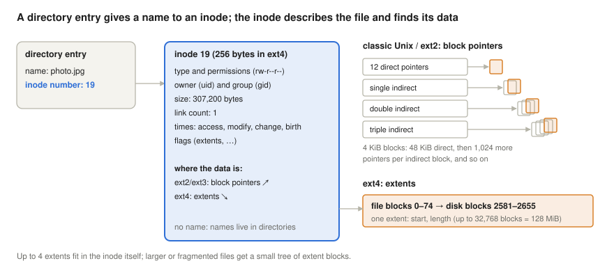

Two ways of recording where the data is:

- **Block pointers** (classic Unix, ext2, ext3): the inode contains 12 direct pointers to data blocks, then a single-indirect pointer to a block full of pointers, a double-indirect and a triple-indirect one. Small files need no extra reads, and large ones are reachable through a tree; but a 1 GiB file needs 262,144 pointers, one per block, even when its blocks are consecutive.
- **Extents** (ext4, XFS, NTFS's run lists, Btrfs): the inode records ranges: "file blocks 0–74 are disk blocks 2581–2655". A contiguous file needs one entry however large it is. ext4 keeps up to four extents in the inode itself and a small tree of extent blocks for more; one extent covers up to 32,768 blocks, 128 MiB with 4 KiB blocks (Mathur et al., 2007).

Two consequences that surprise many users:

- **Sparse files:** a file can have **holes**, ranges that were never written and have no blocks. They read as zeros. The [Linux section](#sparse-files-extents-and-delayed-allocation) creates a 1 GiB file that occupies 4 KiB.
- **The number of inodes is fixed** in ext2/3/4 when the file system is created (by default one inode per 16 KiB of space, one per 4 KiB on file systems below 512 MiB). A file system can be "full" with free space left if it holds very many small files ([Linux section](#running-out-of-inodes)). XFS and Btrfs allocate inodes dynamically, so they rarely run out of them: their limit is a share of the space, not a number fixed in advance.

The permissions in the inode are the classic Unix **mode bits**: read, write and execute (`rwx`) for the owner, the group and everyone else, usually written in octal: `0644` = `rw-r--r--`, read and write for the owner, read only for the others. The kernel checks them at `open` and at every step of path resolution. What exactly they mean for files and directories, the special bits (setuid, setgid, sticky), access control lists (ACLs, stored with the inode as extended attributes) and mandatory access control (SELinux) are the subject of the [next lecture](../11-access-control/).

<details>
<summary><b>Explained simply:</b> inode, inode number, block pointer, indirect block, extent, sparse file, hole</summary>

- **Inode:** the "identity card" of a file: everything about it except its name, including where its contents are on the disk.
- **Inode number:** the identity card's number. Directories connect names to these numbers.
- **Block pointer:** the number of one disk block that holds part of the file. **Indirect block:** a block that holds more pointers, like an index page that lists other index pages.
- **Extent:** a description of a whole run of consecutive blocks: "start here, this many blocks". Like saying "pages 10 to 85" instead of listing every page.
- **Sparse file, hole:** a file with gaps that were never written; the gaps take no space and read as zeros.
- **Btrfs:** a modern Linux file system that never overwrites data in place (copy-on-write, explained below).
- **Mode bits, rwx, octal:** the nine yes/no switches that say who may read, write or run a file: three for the owner, three for the group, three for everyone else. `0644` is a short way of writing them.
- **ACL** (access control list): a list of who may do what with a file, more detailed than the nine mode bits.

</details>

## Directories

A directory is a file whose content is a list of **entries**, each pairing a name with an inode number (and, in ext4, the file type). Every directory contains two special entries: `.` for itself and `..` for its parent. To open `/home/peter/notes.txt`, the kernel starts at the root directory's inode (inode 2 in ext4), reads its entries to find `home`, reads that directory to find `peter`, and so on: **path resolution**, one directory lookup per component, each helped by the dentry cache.

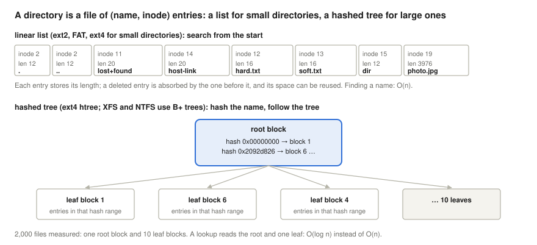

The simplest structure is a **linear list**, used by FAT, ext2 and ext4 for small directories. Each ext4 entry stores its own length, so deleting an entry just lengthens the previous one, and a lookup scans the list: O(n) for n entries. A directory with a million files would need a million comparisons per lookup. Modern file systems therefore index large directories:

- **ext4** turns a directory into an **htree** as soon as it outgrows one block: names are hashed, and a root block (and, for very large directories, one or two levels of index blocks) maps hash ranges to leaf blocks that hold the entries. A lookup reads the root and one leaf ([Linux section](#a-directory-with-2000-files)).
- **XFS** and **NTFS** store directories as **B+ trees**, sorted by hash (XFS) or by name (NTFS); XFS keeps very small directories inside the inode itself (Sweeney et al., 1996).

Because a directory contains `..`, and every subdirectory's `..` points back to its parent, a directory's link count is 2 plus the number of its subdirectories.

<details>
<summary><b>Explained simply:</b> directory entry, `.` and `..`, path resolution, linear list, hash, htree, B+ tree</summary>

- **Directory entry:** one line in a folder's list: a name and the number of the file's identity card.
- **`.` and `..`:** "this folder" and "the folder above".
- **Path resolution:** finding a file by walking the path, folder by folder.
- **Linear list:** a plain list, searched from the top, like a short shopping list.
- **Hash:** a number computed from a name, used to jump straight to the right part of a big list, like the letter tabs of a phone book.
- **Htree, B+ tree:** tree-shaped indexes in which a few steps lead to any entry, however many there are.

</details>

## Hard and symbolic links

Because names and inodes are separate, a file can have several names. A **hard link** is simply another directory entry pointing to the same inode: `ln notes.txt hard.txt`. Both names are equal; neither is "the original". In fact **every name is a hard link**: the name that `touch` or `open` created first is just the inode's first link. The inode's **link count** records how many names it has, and the file's data is freed only when the count reaches zero and no process has the file open. (The syntax of both commands is `ln [-s] TARGET LINK_NAME`: the existing file first, the new name second.)

A **symbolic link** (symlink, soft link) is a separate small file of type "symlink" whose content is a **path**: `ln -s notes.txt soft.txt`. The name `soft.txt` is itself an ordinary hard link, but to this second inode, not to the target's. Opening it makes the kernel continue path resolution with the stored path, so a symbolic link leads back to a **name**, never directly to an inode; the dashed arrow in the figure closes this loop.

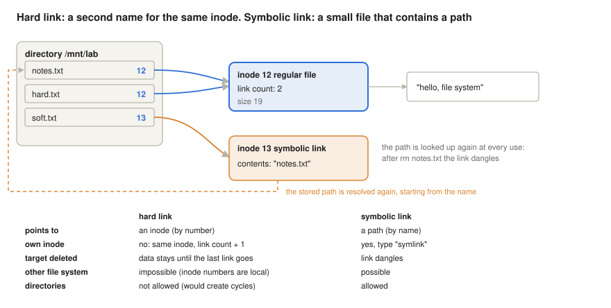

The differences follow from these definitions, and the [Linux section](#hard-and-symbolic-links-in-practice) shows each of them:

- Deleting `notes.txt` removes one name. The hard link still reaches the data; the symbolic link **dangles**, because the path it contains no longer resolves.
- A hard link cannot cross file systems, because inode numbers are only unique within one file system (`Invalid cross-device link`). A symbolic link can point anywhere, even to a path that does not exist yet.
- Hard links to directories are forbidden: they could create cycles in the tree, and `..` would become ambiguous. Symbolic links to directories are allowed, and tools that walk the tree (`find`, `du`) do not follow them by default.
- Moving the target breaks a symbolic link but not a hard link; `rename` within a file system just rewrites directory entries and never touches the inode.

Windows offers the same two concepts on NTFS: hard links (up to 1,023 per file) and symbolic links, plus *junctions*, an older kind of link to a directory.

<details>
<summary><b>Explained simply:</b> hard link, link count, symbolic link, dangling link, cross-device link</summary>

- **Hard link:** a second name for exactly the same file, like a person who is listed under two names in the phone book, with one phone.
- **Link count:** how many names a file has. The file is really deleted only when the last name is gone.
- **Symbolic link:** a note that says "the file you want is at this address", like a sign "we moved to number 12".
- **Dangling link:** a sign pointing to an address where nothing is anymore.
- **Cross-device link:** a hard link to a file on another disk or partition; impossible, because file numbers mean something only inside one file system.
- **Junction:** Windows' older form of a link to a folder.

</details>

## File types

Regular files and directories are not the only things with an inode. Unix puts many kinds of objects into the one directory tree, so that the same calls (`open`, `read`, `write`, `close`) and the same permissions work for all of them (Ritchie & Thompson, 1974). The inode records which kind an object is, and `ls -l` shows it as the first character of each line ([Linux section](#seven-file-types-in-practice)):

| `ls -l` | type | what it is | created by |
|---|---|---|---|
| `-` | regular file | a sequence of bytes on the disk | `touch`, `open(O_CREAT)` |
| `d` | directory | a list of (name, inode) entries | `mkdir` |
| `l` | symbolic link | a small file that contains a path | `ln -s` |
| `p` | named pipe (FIFO) | a one-way channel between processes: what one writes, the other reads, first in, first out; nothing is stored on the disk | `mkfifo` |
| `s` | socket | a two-way (full-duplex) channel between processes on the same machine (a Unix domain socket) | `bind()` of a program |
| `b` | block device | a device accessed in blocks, at any position (random access): disks, partitions, loop devices | `mknod`, `udev` |
| `c` | character device | a device accessed as a stream of bytes: terminals, `/dev/null`, `/dev/zero`, `/dev/random` | `mknod`, `udev` |

A device file has no data blocks. Its inode holds two numbers, the **major number**, which selects the driver, and the **minor number**, which selects the device of that driver: `/dev/null` is character device 1,3, `/dev/loop0` block device 7,0. Opening the file connects the process to the driver, so writing to `/dev/null` discards the bytes and reading `/dev/zero` returns zeros forever. The `/dev` directory is normally a `devtmpfs` that the kernel fills, with the `udev` service adding names and permissions. Disk names show the history of the interfaces: `hda` for the old IDE (PATA) disks, `sda`, `sdb` for SCSI, SATA and USB disks, `nvme0n1` for NVMe SSDs and `vda` for virtio disks in virtual machines.

Unix does not care about **file name extensions**: `report.txt` and `report` are just names, and the dot is an ordinary character (`notes.v2.anything.at.all` is a valid name). Only programs interpret extensions, by convention. The `file` command determines what a file contains by looking at its first bytes, the **magic number** of its format (`\x7fELF` for a Linux executable, `PK` for a ZIP archive, `%PDF` for a PDF), not at its name.

<details>
<summary><b>Explained simply:</b> file type, named pipe, FIFO, socket, block device, character device, /dev/null, /dev/zero, /dev/random, major and minor number, udev, devtmpfs, IDE, SATA, SCSI, NVMe, virtio, extension, magic number</summary>

- **File type:** what kind of thing a name stands for: ordinary data, a folder, a link, a channel between programs, or a device.
- **Named pipe, FIFO:** a "tube" with a name: one program pushes text in at one end, another takes it out at the other, in the same order (first in, first out).
- **Socket:** a two-way "telephone line" between two programs.
- **Block device:** a device read and written in pieces, at any position, like a disk. **Character device:** a device that gives or takes a stream of bytes one after the other, like a keyboard or a terminal.
- **`/dev/null`, `/dev/zero`, `/dev/random`:** a "bin" that swallows everything, an endless source of zero bytes, and a source of random bytes.
- **Major and minor number:** the two numbers in a device file: which driver, and which of its devices.
- **udev, devtmpfs:** the kernel creates the device files in `/dev` itself (devtmpfs), and the udev service gives them friendly names and permissions.
- **IDE, SATA, SCSI, NVMe, virtio:** kinds of disk connection, old and new; virtio is the one a virtual machine uses.
- **Extension:** the end of a file name after the dot, such as `.txt`; for Unix it is just part of the name.
- **Magic number:** the first few bytes of a file that reveal its format, like the cover of a book.

</details>

## The Linux directory tree

All file systems of a Linux system are mounted into one tree, and the **Filesystem Hierarchy Standard** (FHS) says what belongs where, so that programs, administrators and packages find things in the same place on every distribution (Linux Foundation, 2015):

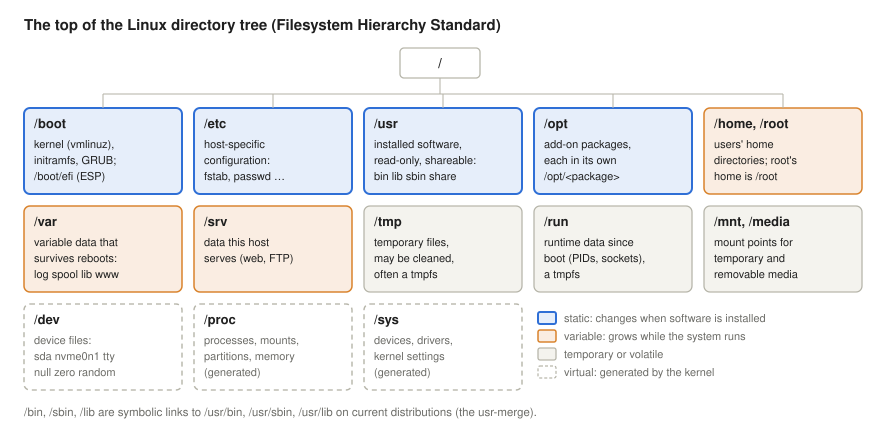

- `/boot`: what the boot loader needs: the kernel (`vmlinuz`, a compressed image), the initial RAM file system (`initramfs`), GRUB's files, and on UEFI machines the EFI system partition mounted on `/boot/efi`.
- `/etc`: the host-specific configuration, as text files: `fstab`, `passwd`, `hosts`, service settings. The name is the "et cetera" of early Unix, where it held everything that fitted nowhere else; "editable text configuration" is a later mnemonic.
- `/usr`: the installed software, shareable between machines and read-only in normal operation: `bin`, `sbin`, `lib`, `share` (documentation, data), and `/usr/local` for software built locally. Today's distributions have **merged** `/bin`, `/sbin` and `/lib` into `/usr`: the old names are symbolic links to `/usr/bin`, `/usr/sbin` and `/usr/lib`.
- `/opt`: add-on packages from third parties, each in its own `/opt/<package>`.
- `/var`: variable data that must survive a reboot: logs (`/var/log`), mail and print queues (`/var/spool`), databases and package state (`/var/lib`), web content (`/var/www`), caches. This is the part that grows while the system runs, and the classic candidate for a file system of its own.
- `/run`: runtime data since the last boot: process IDs, sockets, lock files; a tmpfs, empty after every boot. `/tmp`: temporary files of any user, cleaned at boot or after some days, and on some distributions, such as Fedora, also a tmpfs; `/var/tmp` is the temporary directory that survives reboots.
- `/home` holds the users' home directories, `/root` is the administrator's home (kept on the root file system, so that it is available even if `/home` cannot be mounted). `/srv` holds data the machine serves, `/mnt` is for temporarily mounted file systems, `/media` for removable media.
- `/dev`, `/proc` and `/sys` are **virtual**: the kernel generates their contents. `/proc` shows processes (`/proc/<PID>/`) and kernel information (`/proc/mounts`, `/proc/partitions`, `/proc/meminfo`), `/sys` shows devices and drivers and lets the administrator change kernel settings.

This split is practical, not cosmetic: `/usr` can be mounted read-only or shared, `/var` and `/home` can live on separate (logical) volumes and grow independently, and a full `/var/log` does not stop users from saving their files. The [Linux section](#the-top-of-the-directory-tree) looks at a real system.

<details>
<summary><b>Explained simply:</b> FHS, vmlinuz, initramfs, GRUB, usr-merge, tmpfs, virtual file system, /proc, /sys</summary>

- **FHS** (Filesystem Hierarchy Standard): the agreed "map" of a Linux system: which folder holds what.
- **vmlinuz:** the compressed Linux kernel. **initramfs:** a small starter file system loaded with the kernel that holds what is needed to find and mount the real one. **GRUB:** the boot loader, the program that starts the kernel.
- **usr-merge:** the old folders `/bin`, `/sbin`, `/lib` have become signposts (symbolic links) into `/usr`, so that all installed software lives in one place.
- **Spool:** a queue of jobs waiting on disk, such as e-mails to send or pages to print.
- **tmpfs:** a file system in RAM; it is empty again after every reboot.
- **Virtual file system** (here): a folder whose "files" do not exist on any disk; the kernel makes them up when you read them, like a live display board.
- **/proc, /sys:** windows into the running kernel: processes, memory, devices and settings.

</details>

## Allocation and free space

A file system must know which blocks are free, and choose blocks for new data:

- **Bitmaps:** one bit per block (and one per inode): ext2/3/4 and NTFS (`$Bitmap`).
- **The allocation table itself:** in FAT, a free cluster is marked by a 0 in the FAT.
- **B+ trees of free extents**, indexed both by position and by size: XFS, which can then find "a free run of at least 1 MiB near block X" quickly.

The goal is the hard disk rule: keep each file's blocks contiguous, and related files near each other. The Berkeley Fast File System introduced **cylinder groups** for this in 1984 (McKusick et al., 1984); ext2/3/4 call them **block groups**, XFS **allocation groups**. A file whose blocks are scattered is **fragmented**: on a hard disk every gap costs a seek. Fragmentation grows when files grow slowly side by side, when the disk is nearly full, or when clusters are handed out one by one without looking ahead, as FAT drivers do (first-fit or next-fit; `fat16.py` below uses first-fit).

**Delayed allocation** (ext4, XFS, Btrfs) is a strong remedy: data written to the page cache gets no disk blocks until it is written back. By then the file system knows how large the file has grown and can allocate one large extent. The [Linux section](#sparse-files-extents-and-delayed-allocation) shows two files written side by side ending up with one extent each, and with 16 extents each when the program forces a write-back after every 64 KiB.

The block size is a trade-off, like the page size of the previous lecture: large blocks mean fewer pointers and faster sequential I/O, but more space lost in the last, partly filled block of every file (internal fragmentation). 4 KiB is the usual choice, matching the page size; NTFS calls blocks **clusters**, and FAT uses clusters of 2–32 KiB.

<details>
<summary><b>Explained simply:</b> bitmap, first fit, block group, fragmentation, delayed allocation, cluster</summary>

- **Bitmap:** a long row of bits, one per block: 1 = used, 0 = free. Like a seating chart with ticks.
- **First fit:** take the first free place you find, even if it is too small to hold the whole file in one piece.
- **Block group, allocation group:** the disk divided into regions, each with its own bookkeeping, so that a file and its information can be kept close together.
- **Fragmentation:** a file scattered in many pieces across the disk.
- **Delayed allocation:** deciding where to put the data only at the last moment, when it is clear how much there is.
- **Cluster:** NTFS's and FAT's name for a block.
- **Berkeley Fast File System, cylinder group:** the 1984 Unix file system that first kept files near their directories, in groups of neighbouring cylinders.
- **Internal fragmentation:** the unused rest of a file's last block.

</details>

## Crash consistency and journaling

Creating a file touches several structures: the inode bitmap, the inode, the directory, the block bitmap, the data blocks. If the power fails between these writes, the disk is left inconsistent: a block marked used that belongs to no file, or, worse, a directory entry that points to an uninitialised inode. Three approaches exist:

- **Check and repair after the crash:** a program (`fsck`, `chkdsk`) scans all the metadata and fixes contradictions. This was the only method of FAT, ext2 and early Unix, and it takes time proportional to the size of the file system: hours on a large disk.
- **Journaling** (write-ahead logging), used by ext3/ext4, XFS and NTFS: before changing the metadata in place, the file system writes a description of the whole change to a **journal** and marks it complete (a **commit**). After a crash, it replays the complete transactions and discards incomplete ones, in seconds. Most journaling file systems log only **metadata**. ext4 offers three modes: `data=journal` logs the data too (safest, slowest), `data=writeback` logs only metadata in any order, and the default `data=ordered` writes a file's data blocks before committing the metadata that points to them, so a crash never exposes stale data from a previous owner of the blocks. NTFS calls its journal `$LogFile`; ext4's is a hidden file, inode 8 (16 MiB in the 512 MiB file system measured below).
- **Copy-on-write** (Btrfs, ZFS, APFS; and the log-structured file systems that preceded them, Rosenblum & Ousterhout, 1992): never overwrite live data; write new versions elsewhere and switch a single root pointer atomically. This also gives cheap snapshots and, in Btrfs and ZFS, checksums of all data. F2FS, a log-structured file system designed for flash, is common on Android phones.

A fourth approach, **soft updates** in BSD's FFS, orders the metadata writes carefully so that the disk is always consistent except for leaked blocks, which a background check reclaims.

None of these makes **application data** safe by itself: what the application has written but not yet `fsync`ed may be lost, and an application that rewrites a file in place may leave it half old, half new. The standard idiom for an atomic update is to write a new file, `fsync` it, `rename` it over the old one (a `rename` within a file system is atomic), and `fsync` the directory so that the rename itself is durable.

<details>
<summary><b>Explained simply:</b> crash consistency, fsck, journal, commit, write-ahead log, copy-on-write, snapshot, atomic</summary>

- **Crash consistency:** keeping the disk's bookkeeping correct even if the power goes off at the worst moment.
- **fsck, chkdsk:** repair tools that check the whole disk after a crash, like counting every book in a library after a burglary.
- **Journal, write-ahead log:** a diary in which the file system first writes "I am about to do this", and only then does it. After a crash it reads the diary and finishes or forgets the half-done work.
- **Commit:** the line in the diary that says "this change is complete".
- **Copy-on-write:** never change anything in place: write the new version somewhere else, then switch over in one step.
- **Snapshot:** a frozen picture of all files at one moment, which can be kept cheaply thanks to copy-on-write.
- **Atomic:** happens completely or not at all, never half.
- **Replay:** after a crash, redoing the changes recorded in the journal.
- **Stale data:** old contents of a block that belonged to a deleted file; a crash must not let them appear in a new file.
- **Log-structured file system:** a file system that writes everything, data and metadata, as one long sequential log. **F2FS:** such a file system made for flash.
- **Soft updates:** a way of ordering disk writes so carefully that no journal is needed.

</details>

## Four file systems

### FAT16

The **File Allocation Table** file system was written for Microsoft's floppy-disk BASIC in the late 1970s and became the file system of MS-DOS; FAT16 (16-bit table entries) served hard disks from the mid-1980s until Windows 95 OSR2 introduced FAT32 in 1996. Its variants are still everywhere: FAT32 and exFAT on USB sticks, memory cards and cameras, and FAT32 on the EFI system partition from which every modern PC boots. FAT is simple enough to take apart by hand ([Linux section](#fat16-by-hand)):

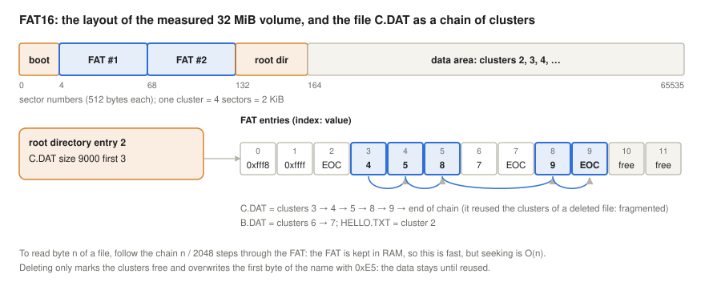

- The **boot sector** (with the BIOS parameter block) describes the geometry: bytes per sector, sectors per cluster, the number and size of the FATs, the size of the root directory.
- The **FAT** has one 16-bit entry per data cluster. The entry for cluster *n* holds the number of the file's *next* cluster, a value from `0xFFF8` to `0xFFFF` (end of chain) for its last cluster, `0xFFF7` for a bad cluster, 0 for a free cluster. Entries 0 and 1 are reserved: entry 0 repeats the media descriptor byte (`F8` for a hard disk). A file is a **linked list of clusters**, and the FAT is the list of links. Two identical copies are kept for safety.
- The **root directory** is a fixed-size table set at format time, typically 512 entries of 32 bytes on hard disks (224 on a 1.44 MB floppy): an 8.3 name, attributes, timestamps in a packed date/time format, the **first cluster** and the size. Subdirectories are ordinary files containing the same 32-byte entries.
- There is no inode: the directory entry *is* the file's metadata, so FAT cannot have hard links, and it has no owners or permissions.
- **Deleting** a file marks its clusters free in the FAT and replaces the first byte of its name with `0xE5`. The data stays on the disk until it is reused, which is why undelete tools work on FAT and why deleted files can be recovered forensically (Carrier, 2005).

FAT16 can address at most 65,524 clusters: a 16-bit entry has 65,536 values, but 0 (free), 1 (reserved) and the values from `0xFFF7` up (bad cluster, end of chain) cannot be cluster numbers, and Microsoft's specification keeps the count one below the remaining 65,525. The volume size is therefore the number of clusters times the cluster size: with 4 KiB clusters about 256 MiB, with 32 KiB clusters (the largest that MS-DOS and Windows 9x accept) 2 GB, or 4 GB with the 64 KiB clusters of Windows NT and later. As disks grew in the 1990s, clusters had to grow with them, and since every file wastes on average half a cluster, a 2 GB FAT16 disk full of small files lost a large share of its space. FAT32 (28-bit cluster numbers) solved this with 4 KiB clusters on volumes up to 8 GB (Microsoft, 2009). The 32-bit size field caps any FAT file at 4 GiB − 1 byte, a limit that matters for FAT32 (Microsoft, 2009). Long file names arrived in Windows 95 (**VFAT**) as extra directory entries with the attribute `0x0F` that old systems ignore. FAT's weaknesses follow from its structure: random access within a file follows the chain cluster by cluster; allocation without look-ahead fragments files (the measured `C.DAT` reuses the clusters of a deleted file); and there is no journal, so a crash requires a full check.

<details>
<summary><b>Explained simply:</b> FAT, cluster, boot sector, BIOS parameter block, chain, 8.3 name, VFAT, EOC, exFAT, EFI system partition</summary>

- **FAT** (file allocation table): a table with one line per piece of the disk; each line says which piece comes next in the same file. Like a treasure hunt where every clue tells you where the next one is.
- **Cluster:** FAT's name for a block: the piece of the disk the table keeps track of.
- **Boot sector, BIOS parameter block:** the first sector of the disk, which describes how the rest is organised.
- **Chain:** the list of a file's clusters, linked through the table. **EOC** (end of chain): "this was the last piece".
- **8.3 name:** the old DOS rule: at most 8 letters, a dot, and at most 3 letters, such as `HELLO.TXT`. **VFAT:** the trick that added long names to FAT, stored in extra directory entries marked with the attribute value `0x0F`.
- **0x…:** a number written in hexadecimal (base 16), whose digits go 0–9 and then A–F: `0x10` = 16.
- **Media descriptor:** a byte that says what kind of disk this is (`F8` = hard disk).
- **Undelete, forensics:** recovering deleted files; investigators use it to find evidence.
- **exFAT:** a newer member of the family for large memory cards and USB sticks.
- **EFI system partition:** a small FAT32 partition on every modern PC that holds the programs that start the operating system.

</details>

### ext4

The **ext** family is Linux's own: ext2 (1993) took its design from the Berkeley Fast File System (Card et al., 1994), ext3 (2001) added a journal and later hashed directories, and **ext4** (stable since Linux 2.6.28, December 2008) added extents, 48-bit block numbers, delayed allocation and nanosecond timestamps (Mathur et al., 2007), and later (2012) checksums of all metadata. It is the default of Debian, Ubuntu and many other distributions.

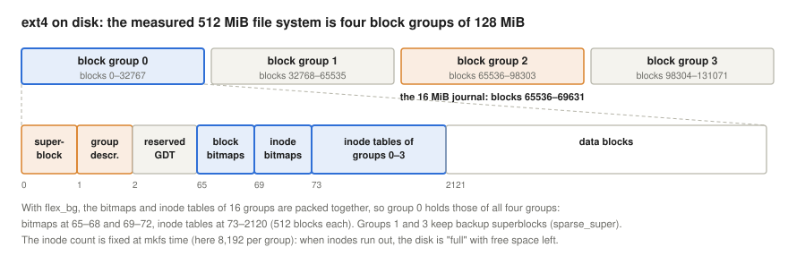

- The disk is divided into **block groups** of 32,768 blocks (128 MiB with 4 KiB blocks). Each group has a block bitmap, an inode bitmap and an inode table; the **superblock** (sizes, counts, features, state) and the **group descriptors** are at the start, with backup copies in some groups. With the `flex_bg` feature the bitmaps and inode tables of 16 groups are packed together ([Linux section](#the-ext4-on-disk-layout)).
- **Inodes** are 256 bytes, numbered from 1; inode 2 is the root directory, inode 8 the journal, 11 `lost+found`. File data is described by **extents**, and symbolic links shorter than 60 bytes are stored inside the inode ("fast symlinks").
- **Directories** are linear lists that become **htrees** when they grow. The **journal**, a hidden file (inode 8) that the 512 MiB example keeps in block group 2, runs in `data=ordered` mode by default.
- Limits: volumes up to 1 EiB and files up to 16 TiB with 4 KiB blocks; Red Hat supports ext4 file systems up to 50 TiB (Red Hat, n.d.-b). An ext4 file system can be grown and, unmounted, also shrunk.

<details>
<summary><b>Explained simply:</b> superblock, group descriptor, inode table, flex_bg, fast symlink, lost+found</summary>

- **Superblock:** the master record of the file system: how big it is, how many blocks and inodes it has, which features it uses. Copies are kept in case the first is damaged.
- **Group descriptor:** a short record per block group: where its bitmaps and inode table are, how much is free.
- **Inode table:** the array of all identity cards (inodes) of one group.
- **flex_bg:** an ext4 option that puts the bookkeeping of several groups next to each other, so that it can be read in one go.
- **Fast symlink:** a short symbolic link whose path fits inside the inode, so it needs no data block.
- **lost+found:** the folder where the repair tool puts files it found but could not place.
- **48-bit block numbers:** block addresses with 48 bits, enough for 2⁴⁸ blocks.
- **KiB, MiB, GiB, TiB, PiB, EiB:** units that each grow by a factor of 1,024. **KB, MB, GB, TB, PB:** the same names in steps of 1,000, as disk makers use them; 1 TB ≈ 0.91 TiB.
- **sparse_super:** backup copies of the superblock only in groups 0, 1 and the powers of 3, 5 and 7, not in every group.
- **Reserved GDT blocks, resize_inode:** space kept free so that the file system can later be enlarged while in use.
- **INODE_UNINIT, BLOCK_UNINIT, ITABLE_ZEROED:** flags saying that a group's inode table or bitmap has not been needed yet, or has been cleared, so that `mkfs` can skip work.

</details>

### XFS

**XFS** was created by Silicon Graphics in 1993 for IRIX workstations and servers that handled huge media files, and was ported to Linux in 2001 (Sweeney et al., 1996). It has been the default file system of Red Hat Enterprise Linux since RHEL 7 in 2014, and is designed for large file systems, large files and many parallel writers:

- The disk is split into a few large, independent **allocation groups** (four in the 1 GiB example of the [Linux section](#xfs-allocation-groups-and-b-trees)), each managing its own free space and inodes, so that several CPUs can allocate at once. Inode numbers encode the allocation group, and XFS deliberately spreads new directories over the groups, the old FFS idea: a new directory went to group 1 and got inode number 524,416 = 2¹⁹ + 128.
- **B+ trees** everywhere: free space (indexed twice, by block number and by size), inodes, large directories, and the extent lists of heavily fragmented files.
- **Inodes are allocated dynamically**, in chunks of 64, up to a share of the space (`imaxpct`, 25% by default on small file systems), so XFS rarely runs out of inodes. Small directories and small extent lists live inside the 512-byte inode itself.
- **Delayed allocation**, a metadata journal, and since Linux 4.9 **reflinks**: `cp --reflink` makes a copy that shares the data blocks until one side writes (copy-on-write for data).
- Limits: 8 EiB for volumes and files; Red Hat supports up to 1 PiB (Red Hat, n.d.-b). An XFS file system can grow but, in practice, not shrink.

<details>
<summary><b>Explained simply:</b> allocation group, B+ tree, dynamic inode allocation, reflink</summary>

- **Allocation group:** one of a few large independent regions of an XFS disk, each with its own bookkeeping, so that many programs can create files at the same time without waiting for each other.
- **B+ tree:** a sorted, shallow tree that finds any item among millions in a few steps; all items sit in the bottom row, linked in order.
- **Dynamic inode allocation:** identity cards are printed when needed, not all in advance, so they never run out early.
- **Reflink:** a copy that initially shares the original's data on the disk, and gets its own blocks only for the parts that are later changed.

</details>

### NTFS

**NTFS** (New Technology File System) shipped with Windows NT 3.1 in 1993 and is the file system of every Windows installation since (Microsoft, 2025). Its central idea is that **everything is a file, and every file is a set of attributes**:

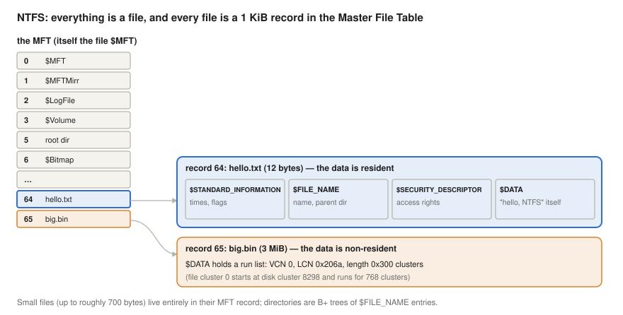

- The **Master File Table** (`$MFT`) has one record, usually 1 KiB, per file and directory. The first records describe the file system itself, as files: `$MFT` (0), `$MFTMirr` (1, a copy of the first records), `$LogFile` (2, the journal), `$Volume` (3), `$AttrDef` (4), the root directory (5), `$Bitmap` (6, free clusters), `$Boot` (7), `$BadClus` (8), `$Secure` (9), `$UpCase` (10).
- A record holds **attributes**: `$STANDARD_INFORMATION` (times, flags), `$FILE_NAME` (the name and the parent directory), security, and `$DATA`. An attribute is **resident** if it fits into the record: a small file's data, up to roughly 700 bytes, is stored in its MFT record and needs no cluster at all ([Linux section](#ntfs-the-master-file-table)). Larger attributes are **non-resident** and described by a **run list** of extents.
- Files can have several `$DATA` attributes (**alternate data streams**, `file.txt:stream`), and NTFS adds access control lists, per-file compression and encryption, hard links, sparse files, quotas, and a change journal (`$UsnJrnl`) that backup and search tools read.
- Directories are B+ trees of `$FILE_NAME` entries, sorted by name. Clusters are 4 KiB by default, which allows volumes of up to 16 TB; with the largest, 2 MiB clusters, current Windows supports volumes and files of up to 8 PB (Microsoft, 2025).

Linux reads and writes NTFS with the in-kernel `ntfs3` driver (since Linux 5.15) or the user-space `ntfs-3g`; Microsoft's newer **ReFS** adds copy-on-write and checksums for servers.

<details>
<summary><b>Explained simply:</b> MFT, attribute, resident, non-resident, run list, alternate data stream, ACL, ReFS</summary>

- **MFT** (Master File Table): NTFS's big table with one record (card) for every file, including the files that describe the disk itself.
- **Attribute:** one piece of information on the card: the name, the dates, the access rights, the contents.
- **Resident:** stored directly on the card. A very small file fits on its own card, so it needs no other space at all.
- **Non-resident, run list:** for larger files the card only says where the pieces are: "768 clusters starting at cluster 8298".
- **Alternate data stream:** a hidden second content attached to the same file name.
- **ACL** (access control list): a list of who may do what with a file, more detailed than Unix's owner/group/others.
- **ReFS:** Microsoft's newer server file system.
- **Compression, encryption, quotas:** NTFS can store files packed smaller, store them scrambled with a key, and limit how much space each user may fill.
- **Change journal (`$UsnJrnl`):** a running list of which files changed, so that backup and search programs need not scan the whole disk.
- **ntfs3, ntfs-3g:** the two Linux drivers for NTFS: one inside the kernel, one running as an ordinary program (through FUSE).

</details>

### Comparison

| | FAT16 | ext4 | XFS | NTFS |
|---|---|---|---|---|
| origin | Microsoft, 1980s | Linux, 2008 (ext2 1993) | SGI, 1993; Linux 2001 | Microsoft, 1993 |
| typical use today | small cards, legacy (FAT32/exFAT: USB, EFI) | Linux default (Debian, Ubuntu) | RHEL default, large servers | Windows |
| metadata per file | directory entry | 256-byte inode | 512-byte inode | 1 KiB MFT record |
| finding the data | linked list in the FAT | extents (tree) | extents (B+ tree) | run lists |
| free space | FAT entries = 0 | bitmaps per block group | B+ trees per allocation group | `$Bitmap` |
| directories | linear list | linear, htree when large | in inode, block, B+ tree | B+ tree |
| small files | one cluster (none if empty) | one block (inline data optional) | one block | resident in the MFT record |
| file count limit | 512 root entries; 65,524 clusters | inodes fixed at mkfs | dynamic (share of space) | dynamic (the MFT grows) |
| crash recovery | full check | journal (`data=ordered`) | metadata journal | `$LogFile` journal |
| links | none | hard and symbolic | hard and symbolic | hard, symbolic, junctions |
| permissions | read-only flag | owner/group/mode, ACLs | owner/group/mode, ACLs | ACLs |
| max volume / file | 2–4 GB / 2–4 GB | 1 EiB / 16 TiB | 8 EiB / 8 EiB | 16 TB (4 KiB clusters) to 8 PB / 8 PB |
| shrink | – | yes (unmounted) | no | yes |

The choice is rarely about raw speed, where ext4 and XFS are close for most workloads. It is about the platform (NTFS for Windows, FAT32/exFAT for portable media), about scale and parallelism (XFS), and about features: Btrfs and ZFS, not covered here in detail, add snapshots, checksums of all data and built-in RAID through copy-on-write; Fedora has used Btrfs by default on desktops since Fedora 33 in 2020.

<details>
<summary><b>Explained simply:</b> Btrfs, ZFS, RAID, APFS</summary>

- **Btrfs, ZFS:** modern copy-on-write file systems that never overwrite data in place; they can take snapshots, check every block with a checksum, and spread data over several disks.
- **RAID:** combining several disks so that data survives if one fails, or so that they work faster together.
- **APFS:** Apple's file system on Macs and iPhones since 2017, also copy-on-write.

</details>

## Logical volume management

A partition is fixed when the disk is partitioned: if `/var` fills up, it cannot simply borrow space from `/home` or from a new disk. The **Logical Volume Manager** (LVM), built on the kernel's device mapper, inserts a layer of indirection between disks and file systems, the same idea as paging between processes and RAM (Red Hat, n.d.-a):

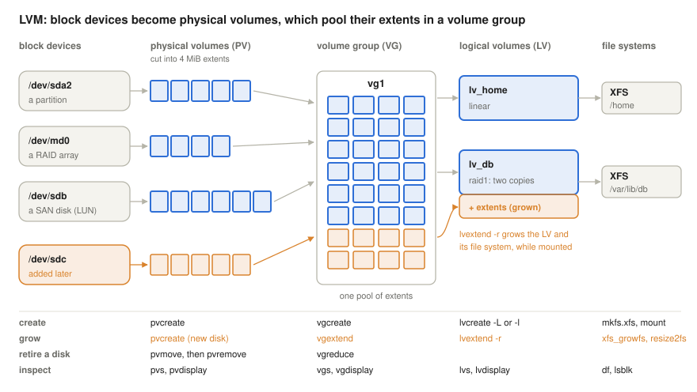

- A **physical volume (PV)** is any block device prepared for LVM: a whole disk, a partition (marked with the `lvm` flag, `parted /dev/sdb set 1 lvm on`), a RAID array, or a disk from a storage network (SAN). `pvcreate` writes an LVM label on it and divides it into **physical extents**, 4 MiB each by default.
- A **volume group (VG)** pools the extents of one or more PVs: `vgcreate vg1 /dev/sda2 /dev/sdb`. It is a single reservoir of storage, whatever disks it came from.
- A **logical volume (LV)** is a virtual block device made of extents from the group, wherever they are: `/dev/vg1/lv_home`. A **linear** LV simply concatenates extents, possibly from several disks; a **striped** LV spreads them over disks like RAID 0, and a **mirrored** LV (`--type raid1`) keeps two copies on different PVs. A table maps each logical extent to a physical one, just as a page table maps pages to frames.
- A file system is created on the LV and mounted as usual: `mkfs.xfs /dev/vg1/lv_home`, `mount /dev/vg1/lv_home /home`.

The size of a new LV is given either in bytes, `lvcreate -n lv_home -L 20G vg1`, or in extents, `-l 5120` (5,120 × 4 MiB = 20 GiB), which also accepts percentages: `-l 100%FREE` takes all the free space of the group, and `-l +50%FREE` in `lvextend` adds half of what is still free.

The workflows are where LVM pays off; the first two can run while the file system is mounted and in use:

1. **Growing a full file system.** Add a disk, `pvcreate /dev/sdc`, `vgextend vg1 /dev/sdc`, then `lvextend -r -l +100%FREE /dev/vg1/lv_db`. The `-r` (`--resizefs`) option grows the file system in the same step, calling `xfs_growfs` for XFS or `resize2fs` for ext4. Without it, the LV grows but the file system inside it does not.
2. **Retiring a disk.** `pvmove /dev/sda2` moves all used extents of that PV to free extents on the other PVs of the group, while the LVs stay in use; then `vgreduce vg1 /dev/sda2` removes the empty PV from the group and `pvremove /dev/sda2` deletes its label. The group must have enough free extents to receive the data.
3. **Shrinking.** XFS cannot be shrunk at all; ext4 can be shrunk only while unmounted (`lvreduce -r` shrinks the file system first, then the LV). Shrinking the LV without the file system first destroys data. For this reason, a common practice is to leave part of the group unallocated and grow LVs when needed.

`pvs`, `vgs` and `lvs` print one line per object; `pvdisplay`, `vgdisplay -v` and `lvdisplay` the details; `lsblk` shows the whole stack from disks to mount points. LVM can also take **snapshots** (`lvcreate -s`: a copy-on-write image of an LV at one moment, useful for consistent backups) and build **thin pools**, from which LVs receive extents only when data is actually written, so that more space can be promised than exists. The commands are shown in the [Linux section](#lvm-on-a-virtual-machine), to be tried on a virtual machine.

<details>
<summary><b>Explained simply:</b> LVM, physical volume, extent, volume group, logical volume, linear, striped, mirrored, SAN, snapshot, thin pool</summary>

- **LVM** (Logical Volume Manager): a Linux layer that lets you build flexible "virtual disks" out of real ones, and resize them later.
- **Physical volume (PV):** a real disk or partition handed over to LVM.
- **Extent:** a small, equal-sized piece (4 MiB) of a physical volume, the unit LVM hands out, like a brick.
- **Volume group (VG):** all the bricks of several disks thrown into one pile.
- **Logical volume (LV):** a "virtual disk" built from bricks of the pile, wherever they came from; it can get more bricks later.
- **Linear, striped, mirrored:** bricks used one after the other; spread over several disks for speed; or kept in two copies for safety.
- **SAN** (storage area network): a separate network of storage boxes that servers use as if they were local disks; a **LUN** is one such disk.
- **pvmove:** moving the bricks off one disk onto the others, so that the disk can be removed while everything keeps running.
- **Snapshot:** a frozen picture of a volume at one moment, made quickly because only later changes are copied.
- **Thin pool:** handing out space only when it is really written to, like an airline selling more seats than it has, counting on not everyone showing up.

</details>

## The I/O subsystem and device drivers

The file system ends where it asks for numbered blocks. Below it, the kernel's **I/O subsystem** must turn those requests into commands that a particular piece of hardware understands, keep many of them in flight, and notice when they are done. Disks are only one kind of device: the same structure serves keyboards, network cards and GPUs.

### What a device driver does

Every device controller has its own registers, command formats, interrupts and DMA rules. A **device driver** is the kernel code that knows them for one family of devices and offers the rest of the kernel a standard interface instead (Corbet et al., 2005). It initialises the device, translates the kernel's generic operations into device commands, programs DMA transfers, and handles the device's interrupts with the top and bottom halves of the [interrupts lecture](../05-interrupts/#keep-the-handler-short-top-and-bottom-halves). Linux sorts devices into three classes, which differ in the interface the driver offers:

- **Character devices** are accessed as a stream of bytes through `open`, `read`, `write` and `ioctl` (terminals, `/dev/null`, serial ports, sound, input devices); the driver supplies these operations itself.
- **Block devices** hold numbered blocks that can be read and written in any order (disks, partitions, loop devices); the driver does not see `read` and `write` at all, only block requests from the block layer below the file systems.
- **Network devices** send and receive packets for the network stack. They have no file in `/dev`: they are reached through sockets, and named `eth0`, `ens3` or `wlan0`.

The first two are the `c` and `b` types of the [file types section](#file-types): a device file holds a **major number**, which selects the driver, and a minor number, which selects one of its devices; `/proc/devices` lists the major numbers registered by the drivers. Drivers can be compiled into the kernel or loaded later as **modules** (`modprobe`, `lsmod`), so that a distribution kernel need not contain the code for every device ever made. Drivers form the largest part of the kernel's source code, and they run with full kernel rights: a bug in a driver can crash or corrupt the whole system. A study of Linux and OpenBSD found error rates in drivers three to seven times higher than in the rest of the kernel (Chou et al., 2001), which is why microkernels move drivers into user space, and why Linux offers interfaces (UIO, VFIO) through which some drivers can run as ordinary processes, as FUSE does for file systems.

### The Linux device model

The kernel keeps all devices in one tree, the **device model** (The kernel development community, n.d.-b). It has three kinds of objects:

- A **bus** is a way of connecting devices, with its own way of finding and identifying them: PCI (vendor and device ID in each device's configuration space), USB, virtio, and the "platform" bus for devices that cannot be discovered and are described by the firmware (ACPI tables or a device tree).
- A **device** is one piece of hardware found on a bus; it can itself be a bus for further devices (a USB controller is a PCI device, and the parent of every USB device behind it).
- A **driver** registers with a bus and lists the IDs it supports. When a device and a driver match, the bus calls the driver's **probe** function, which checks the hardware, allocates its resources and makes it available, for example as a block device; **remove** undoes this when the device disappears. This is how hot-plugging works: a new USB stick is found by the USB bus, matched to a driver and probed, while the system runs.

The tree is visible in **sysfs**, mounted on `/sys`: `/sys/devices` is the tree itself, `/sys/bus/*/devices` and `/sys/bus/*/drivers` group it by bus, `/sys/class` and `/sys/block` by function, and each device directory has a `driver` symbolic link to the driver bound to it ([Linux section](#devices-drivers-and-queues-in-sysfs)). Whenever a device appears or disappears, the kernel sends a **uevent** to user space. The **udev** daemon (part of systemd) receives it, loads the matching module if the driver is not yet loaded, creates or adjusts the device file in `/dev` (which the kernel's devtmpfs already provides) with the right permissions, and adds stable names such as `/dev/disk/by-uuid/…`, which do not change when `sda` and `sdb` swap places at the next boot.

### The block layer and blk-mq

The file system describes each piece of I/O as a **bio**: a device, a start sector, a direction, and a list of memory pages. The block layer turns bios into **requests** for the driver:

- **Merging.** A bio that continues an earlier one on the disk (the next sectors) is added to the same request, so that one large transfer replaces many small ones. A task first collects its bios in a short private list, a **plug**, and hands them over together, which gives merging a chance before anything reaches the device.
- **Queues.** The old block layer had one request queue per device, protected by one lock, which was fine for hard disks with a few hundred operations per second. A flash SSD serves hundreds of thousands to millions of operations per second from many cores at once, and the single lock became the bottleneck. The **multi-queue block layer (blk-mq)**, designed by Bjørling et al. (2013) and merged in Linux 3.13 (2014), gives each CPU its own **software queue**, and maps the software queues to the device's **hardware queues**; an NVMe SSD can offer one hardware queue per CPU, so a request can travel from the program to the device without touching a lock or a cache line shared with other CPUs. Since Linux 5.0 the old single-queue code is gone, and every driver that takes requests uses blk-mq. Each request gets a **tag**, a small number that identifies it when the device reports its completion; `nr_requests` is the number of requests a queue may hold.
- **Scheduling.** An optional **I/O scheduler** may hold requests back and reorder them. Linux offers four: `none` passes requests on in arrival order; **mq-deadline** sorts them by sector, like a lift, but serves any request that has waited too long (reads after 500 ms, writes after 5 s by default), so that sorting cannot starve anybody; **BFQ** (budget fair queueing) gives each process a fair share of the device's time and favours interactive programs, at a cost in CPU time; **Kyber** throttles the queues to keep read and write latencies near a target (2 ms for reads, 10 ms for writes by default) on fast devices (The kernel development community, n.d.-a).


Linux chooses `mq-deadline` by default for devices with a single hardware queue, such as SATA disks and the virtual disk of the [Linux section](#four-io-schedulers-one-virtual-disk), and `none` for devices with several hardware queues, such as **NVMe** SSDs. The reasons for `none` there: an SSD has no seek to avoid, so sorting by sector gains nothing; the device has many parallel queues and schedules its flash channels itself, better informed than the kernel; and at a million requests per second, the CPU time and the shared state that a scheduler adds per request cost more than any reordering could save. A scheduler still helps where the device is slow or shared: `mq-deadline` and BFQ on hard disks, BFQ for responsiveness on a desktop that copies large files in the background.

When the device has finished, it must tell the CPU. Usually it raises an **interrupt** (an MSI-X interrupt per hardware queue, delivered to one of the CPUs that the queue serves); the driver completes the request and its bios, either in the interrupt handler itself or, for a single-queue device or a request issued on another CPU, in the `BLOCK` softirq, and the waiting process is woken. For the fastest SSDs, whose reads take less than 10 µs, the interrupt itself becomes a noticeable part of the latency, so a program can ask the kernel to **poll** the completion queue instead, the same trade-off as NAPI in the [interrupts lecture](../05-interrupts/#the-three-io-techniques-today). Since Linux 5.1, **io_uring** lets programs submit many requests and collect their completions through two ring buffers shared with the kernel, with one system call for a whole batch, or none at all when a kernel thread polls the submission ring (Axboe, 2019). Some drivers bypass the request queues entirely and take bios directly: the device mapper (LVM, dm-crypt) passes them on to the devices below, and `zram`, a compressed RAM disk, serves them from memory.

<details>
<summary><b>Explained simply:</b> I/O subsystem, device driver, controller, ioctl, network device, module, UIO, VFIO, FUSE, device model, bus, PCI, USB, platform device, device tree, probe, hot-plug, sysfs, uevent, bio, request, merging, plug, blk-mq, software and hardware queue, tag, mq-deadline, BFQ, Kyber, starvation, MSI-X, polling, io_uring, ring buffer, zram</summary>

- **I/O subsystem:** all the parts of the kernel that move data between programs and devices.
- **Device driver:** the kernel's "interpreter" for one kind of device: it speaks the device's language on one side and the kernel's standard language on the other. **Controller:** the electronics on the device side that receives the driver's commands.
- **ioctl:** a "miscellaneous" system call for device-specific commands, such as "eject the CD" or "set the baud rate".
- **Network device:** a network card as the kernel sees it; it sends and receives packets and has no file in `/dev`.
- **Module:** a piece of the kernel, usually a driver, that can be loaded while the system runs, like a plug-in.
- **UIO, VFIO, FUSE:** doors through which a driver (UIO, VFIO) or a file system (FUSE) can run as an ordinary program outside the kernel, so that its bugs cannot crash the whole system.
- **Device model:** the kernel's family tree of all devices, with the bus each hangs on and the driver that runs it.
- **Bus:** a connection system with its own rules for finding devices: **PCI** (PCI Express) inside the computer, **USB** for plug-in devices. **Platform device:** a device that cannot announce itself, so the firmware lists it (in ACPI tables, or in a **device tree**, a description file used on ARM boards).
- **Probe:** the driver's "get to know the device and set it up" function, called when a device and a driver match.
- **Hot-plug:** adding or removing a device while the computer runs.
- **sysfs (/sys):** a virtual file system in which the kernel shows its device tree as folders and files.
- **uevent:** the kernel's message "a device has appeared (or gone)"; udev reacts to it by loading the driver and creating names and permissions in `/dev`.
- **bio:** the kernel's description of one block I/O: which device, which sectors, which memory pages.
- **Request:** one or more bios for neighbouring sectors, sent to the driver as one command. **Merging:** joining such neighbouring pieces into one request. **Plug:** a short pause in which a program's bios are collected, so that they can be merged before they are sent.
- **blk-mq:** the multi-queue block layer: every CPU core has its own queue, so the cores do not wait for each other. **Software queue:** the queue of one CPU. **Hardware queue:** a queue that the device itself offers; a fast SSD has many. **Tag:** the number of a request, by which the device later says which one it has finished.
- **mq-deadline:** sort by position, but never let anyone wait too long. **BFQ:** share the disk's time fairly between programs. **Kyber:** keep the waiting time short by letting fewer requests in at once.
- **Starvation:** a request that is always overtaken by others and never served.
- **MSI-X:** a kind of interrupt that a PCI Express device sends as a message; a device can have many, one per queue.
- **Polling (here):** the CPU checks again and again whether the device has finished, instead of waiting for an interrupt; worth it only when the answer comes within microseconds.
- **io_uring, ring buffer:** a modern Linux interface in which a program and the kernel exchange I/O requests and results through two circular lists in shared memory, like order slips on a revolving carousel in a diner's kitchen.
- **zram:** a "disk" in RAM whose contents are compressed, often used as fast swap.

</details>

## The same ideas on Linux (x86-64)

Two machines were used:

- **Machine A** is the Ubuntu 24.04 cloud virtual machine of the previous lectures (Linux 6.18, e2fsprogs 1.47, gcc 13), with a virtual disk. The ext4 demos run as root on small file system images attached as loop devices, so nothing on the real disk is touched.
- **Machine B** is an Ubuntu 22.04 virtual machine on a Windows laptop (Linux 6.8, dosfstools 4.2, xfsprogs 5.13, ntfs-3g 2021.8.22), used as an ordinary user, who cannot mount images. The FAT, XFS and NTFS demos therefore build file system images with the standard tools and inspect them without mounting.

To repeat the demos, make the scripts executable (`chmod +x *.sh`) and compile the C programs (`gcc -O2 -o fsync fsync.c`, `gcc -O2 -o seqrand seqrand.c`). `mkimg.sh` unmounts a previous image first; `umount /mnt/lab` and `rm lab.img` clean up at the end.

<details>
<summary><b>Explained simply:</b> console, root, image file, loop device, mount</summary>

- **Console** (terminal): a window where you type commands. Lines starting with `$` (or `#` when typed as the administrator) are what you type; the other lines are the computer's answer.
- **Root:** the administrator account.
- **Image file:** an ordinary file that contains a whole file system, byte for byte, as if it were a disk.
- **Loop device:** a Linux trick that makes an image file look like a disk.
- **Mount:** attach a file system to a folder, so that its files appear there.
- **e2fsprogs, dosfstools, xfsprogs, ntfs-3g:** the packages with the tools for ext2/3/4, FAT, XFS and NTFS.

</details>

### One interface, many file systems

```console
$ ./vfs.sh
Filesystem     Type  1K-blocks     Used Available Use% Mounted on
/dev/vda       ext4  264212084 16934796  28478480  38% /
tmpfs          tmpfs   8223864     1020   8222844   1% /dev/shm
proc           proc          0        0         0    - /proc
sysfs          sysfs         0        0         0    - /sys
--- the same system calls read a file on ext4 and a file made up by the kernel:
openat(AT_FDCWD, "/tmp/hello.txt", O_RDONLY) = 3
read(3, "hello\n", 131072)              = 6
read(3, "", 131072)                     = 0
close(3)                                = 0
openat(AT_FDCWD, "/proc/version", O_RDONLY) = 3
read(3, "Linux version 6.18.44-fc-v77 (bu"..., 131072) = 123
read(3, "", 131072)                     = 0
close(3)                                = 0
```

Four mounted file systems of four types (the cloud provider limits how much of the large virtual disk this machine may fill, hence the small "Available"), two of them (`proc`, `sysfs`) without any device: their "files" are generated by the kernel when read. `cat` uses exactly the same system calls for a file on ext4 and for `/proc/version`: the VFS dispatches them to the right file system.

<details>
<summary><b>Explained simply:</b> df, tmpfs, proc, sysfs, strace</summary>

- **df:** "disk free": lists the mounted file systems with their size and free space; `-T` adds their type.
- **tmpfs:** a file system that lives entirely in RAM, gone after a reboot.
- **proc, sysfs:** "file systems" whose files are made up by the kernel when you read them, to show information about processes and devices.
- **strace:** a tool that prints every system call a program makes.

</details>

### Hard and symbolic links in practice

`mkimg.sh` creates a 64 MiB ext4 image and mounts it on `/mnt/lab`; `links.sh` then runs the experiments of the links section (`ls -i` prints the inode number first):

```console
# ./mkimg.sh 64M
Filesystem     Type  Size  Used Avail Use% Mounted on
/dev/loop0     ext4   56M   24K   52M   1% /mnt/lab
# ./links.sh
12 -rw-r--r-- 2 root root 19 Oct  7 16:57 hard.txt
12 -rw-r--r-- 2 root root 19 Oct  7 16:57 notes.txt
13 lrwxrwxrwx 1 root root  9 Oct  7 16:57 soft.txt -> notes.txt
--- after rm notes.txt:
12 -rw-r--r-- 1 root root 19 Oct  7 16:57 hard.txt
13 lrwxrwxrwx 1 root root  9 Oct  7 16:57 soft.txt -> notes.txt
hello, file system
cat: soft.txt: No such file or directory
--- a hard link to another file system:
ln: failed to create hard link '/tmp/hard-elsewhere.txt' => 'hard.txt': Invalid cross-device link
--- a symbolic link to another file system:
lrwxrwxrwx 1 root root 13 Oct  7 16:57 host-link -> /etc/hostname
--- a hard link to a directory:
ln: dir: hard link not allowed for directory
--- link counts of directories:
dir: inode 15, 5 links
dir/a: inode 16, 2 links
.: inode 2, 4 links
```

`notes.txt` and `hard.txt` are the same inode, 12, with link count 2; the symbolic link is inode 13, a 9-byte file containing `notes.txt`. After `rm notes.txt` the link count drops to 1 and the data is still reachable through `hard.txt`, while `soft.txt` dangles. The 64 MiB image shows 56 MiB of size: the rest is metadata (inode tables, the journal). `dir` has 5 links: its entry in the parent, its own `.`, and the `..` of its three subdirectories; the root (inode 2) has 4. The full metadata of the remaining file:

```console
# stat /mnt/lab/hard.txt
  File: /mnt/lab/hard.txt
  Size: 19        	Blocks: 8          IO Block: 4096   regular file
Device: 7,0	Inode: 12          Links: 1
Access: (0644/-rw-r--r--)  Uid: (    0/    root)   Gid: (    0/    root)
Access: 2026-10-07 16:57:40.413662638 +0200
Modify: 2026-10-07 16:57:40.397662637 +0200
Change: 2026-10-07 16:57:40.409662638 +0200
 Birth: 2026-10-07 16:57:40.397662637 +0200
```

19 bytes occupy 8 sectors of 512 bytes, one 4 KiB block. The four timestamps are the last read (access), the last change of the content (modify), the last change of the inode itself (change: here the link count, when `notes.txt` was removed) and the creation (birth).

<details>
<summary><b>Explained simply:</b> ln, ls -i, stat, access/modify/change/birth time</summary>

- **ln, ln -s:** create a hard link, or with `-s` a symbolic link.
- **ls -i:** list files with their inode numbers.
- **stat:** show everything the inode says about a file.
- **Access, modify, change, birth time:** when the file was last read, when its content last changed, when its inode (owner, permissions, links) last changed, and when it was created.

</details>

### Seven file types in practice

`filetypes.sh` creates one object of each type in `/tmp/types` (as root, because of `mknod`; the socket is created by a one-line Python program that calls `bind`), then uses the pipe and the device files, and asks `file` about three misleadingly named files (machine A):

```console
# ./filetypes.sh
total 8
drwxr-xr-x 2 root root 4096 Oct  7 18:38 dir
lrwxrwxrwx 1 root root    9 Oct  7 18:38 link -> notes.txt
brw-r--r-- 1 root root 7, 0 Oct  7 18:38 myloop
crw-r--r-- 1 root root 1, 3 Oct  7 18:38 mynull
-rw-r--r-- 1 root root   19 Oct  7 18:38 notes.txt
prw-r--r-- 1 root root    0 Oct  7 18:38 pipe
srwxr-xr-x 1 root root    0 Oct  7 18:38 sock
--- the type as stat names it:
dir        directory
link       symbolic link
myloop     block special file
mynull     character special file
notes.txt  regular file
pipe       fifo
sock       socket
--- a FIFO passes bytes in one direction, from a writer to a reader:
through the pipe
--- a device file is only a name and two numbers; the driver does the rest:
crw-r--r-- 1 root root 1, 3 Oct  7 18:38 mynull
 00 00 00 00 00 00 00 00
--- extensions are just part of the name; file(1) looks at the content:
photo.jpg:  ASCII text
report.txt: gzip compressed data, was "notes.txt", last modified: Wed Oct  7 16:
notes.pdf:  ELF 64-bit LSB pie executable, x86-64, version 1 (SYSV), dynamically
pipe:       fifo (named pipe)
mynull:     character special (1/3)
link:       symbolic link to notes.txt
```

The first letter of each line is the type. For the two device files `ls` prints the major and minor numbers where the size would be: `mynull` is a second name for the driver behind `/dev/null` (1,3), so the text written into it vanishes and `cat` prints nothing, while `od` shows the eight zero bytes read from `/dev/zero`; and `myloop` (7,0) would give access to the same disk as `/dev/loop0`. This is also why creating device files is reserved for root: whoever can make a block device file for a disk can read the whole disk, bypassing every file permission on it. The FIFO and the socket have size 0: their data passes through the kernel and never touches the disk. `file` ignores the names: `photo.jpg` is text, `report.txt` a gzip archive, and `notes.pdf` a copy of the `ls` program (output cut at 80 characters).

<details>
<summary><b>Explained simply:</b> mknod, mkfifo, stat -c %F, od, gzip</summary>

- **mknod:** create a device file by giving its type (`b` or `c`) and its two numbers. **mkfifo:** create a named pipe.
- **`stat -c %F`:** print only the type of a file, in words.
- **od:** "octal dump": print the bytes of its input as numbers; `-tx1` in hexadecimal.
- **gzip:** a program that compresses files; `file` recognises its output by its first two bytes.

</details>

### The top of the directory tree

`fhs.sh` looks at the top of machine A's tree:

```console
$ ./fhs.sh
--- the usr-merge: /bin, /sbin and /lib are symbolic links into /usr
lrwxrwxrwx 1 root root 7 Apr 22  2024 /bin -> usr/bin
lrwxrwxrwx 1 root root 7 Apr 22  2024 /lib -> usr/lib
lrwxrwxrwx 1 root root 9 Apr 22  2024 /lib64 -> usr/lib64
lrwxrwxrwx 1 root root 8 Apr 22  2024 /sbin -> usr/sbin
--- which file system holds which top-level directory:
/         ext4   /dev/vda
/usr      ext4   /dev/vda
/var      ext4   /dev/vda
/etc      ext4   /dev/vda
/tmp      ext4   /dev/vda
/run      ext4   /dev/vda
/proc     proc   proc
/sys      sysfs  sysfs
/dev/shm  tmpfs  tmpfs
--- the virtual file systems in /proc/mounts (no device behind them):
proc /proc proc rw,relatime 0 0
sysfs /sys sysfs rw,relatime 0 0
--- /proc is generated by the kernel: one directory per process, and more
67
lrwxrwxrwx 1 root root 11 Oct  7 18:17 /proc/mounts -> self/mounts
major minor  #blocks  name

 254        0  268435456 vda
--- sizes of the big three:
6.7G	/usr
190M	/var
8.0M	/etc
```

The four symbolic links of the usr-merge date from the Ubuntu 24.04 base image. Everything except the virtual file systems lives on one ext4 file system on `/dev/vda` (major number 254, a virtio disk): this machine is a minimal cloud virtual machine without the usual service manager, so even `/run` is an ordinary directory here. On a standard installation `findmnt /run` shows a tmpfs, and servers often put `/var` or `/home` on logical volumes of their own. `/proc` holds 67 process directories at this moment, and `/proc/mounts`, the kernel's list of mounts, is itself a symbolic link into `/proc/self`, the directory of whichever process reads it. The installed software in `/usr` is more than 800 times larger than the configuration in `/etc`.

<details>
<summary><b>Explained simply:</b> findmnt, /proc/self, du -sh</summary>

- **findmnt:** shows which file system a folder belongs to, and from which device it comes. `-T` finds the file system that contains a given path.
- **/proc/self:** a magic folder that always means "the process that is looking at me".
- **du -sh:** total size of a folder, in human-readable units.

</details>

### Inside the inode and the directory

`debugfs` reads the file system's structures directly from the device:

```console
# ./inodes.sh
--- the inode of photo.jpg:
Inode: 19   Type: regular    Mode:  0644   Flags: 0x80000
Generation: 3092630692    Version: 0x00000000:00000002
User:     0   Group:     0   Project:     0   Size: 307200
File ACL: 0
EXTENTS:
(0-74):2581-2655
--- the same through filefrag:
Filesystem type is: ef53
File size of photo.jpg is 307200 (75 blocks of 4096 bytes)
 ext:     logical_offset:        physical_offset: length:   expected: flags:
   0:        0..      74:       2581..      2655:     75:             last,eof
photo.jpg: 1 extent found
--- the directory / as stored on disk (inode, name, entry length):
 2  (12) .    2  (12) ..    11  (20) lost+found    14  (20) host-link   
 12  (16) hard.txt    13  (16) soft.txt    15  (12) dir   
 19  (3976) photo.jpg   
--- the symbolic link: the path is stored inside the inode itself:
Inode: 13   Type: symlink    Mode:  0777   Flags: 0x0
Fast link dest: "notes.txt"
```

A 300 KiB file is one extent: file blocks 0–74 at disk blocks 2581–2655 (flag `0x80000` = "uses extents"; `ef53` is ext4's magic number). The root directory is a list of entries, each 8 bytes of header plus the name rounded up to 4 bytes (12 for `.`, 16 for `hard.txt`); the last entry's length, 3976, stretches to the 12-byte checksum at the end of the 4 KiB block. The entry of the deleted `notes.txt` was first absorbed by its neighbour, and then reused: `host-link` (inode 14), created later, sits in exactly that 20-byte slot, before `hard.txt`. The symbolic link is a "fast link": its target is kept inside the inode.

<details>
<summary><b>Explained simply:</b> debugfs, filefrag, magic number, flags</summary>

- **debugfs:** a tool that reads (and can change) the raw structures of an ext2/3/4 file system, like opening the back of a watch.
- **filefrag:** shows how many pieces (extents) a file is stored in, and where.
- **Magic number:** a fixed value at a known place that identifies a format, here `ef53` for ext2/3/4.
- **Flags:** single bits that switch a feature on or off for an inode, such as "uses extents".

</details>

### A directory with 2,000 files

```console
# ./bigdir.sh
drwxr-xr-x 2 root root 45056 Oct  7 16:57 big
Inode: 20   Type: directory    Mode:  0755   Flags: 0x81000
User:     0   Group:     0   Project:     0   Size: 45056
Fragment:  Address: 0    Number: 0    Size: 0
Size of extra inode fields: 32
Root node dump:
	 Reserved zero: 0
	 Hash Version: 1
	 Info length: 8
	 Indirect levels: 0
	 Flags: 0
Number of entries (count): 10
Number of entries (limit): 507
Checksum: 0x21dc7830
Entry #0: Hash 0x00000000, block 1
Entry #1: Hash 0x2092d826, block 6
Entry #2: Hash 0x408b3490, block 4
...
leaf blocks: 10
```

The directory has grown to 11 blocks (45,056 bytes) and carries the flag `0x1000` ("indexed") besides `0x80000`. Its first block is the htree root: names are hashed (hash version 1, half-MD4), and 10 index entries map hash ranges to 10 leaf blocks. The root could hold 507 entries before a second level is needed. Finding one of the 2,000 names reads two blocks instead of scanning up to eleven.

<details>
<summary><b>Explained simply:</b> index root, half-MD4, leaf block</summary>

- **Index root:** the first block of a large directory, which only says which other block holds which names.
- **Half-MD4:** the mathematical recipe (hash function) that turns a name into a number.
- **Leaf block:** a block at the bottom of the tree that holds the actual directory entries.

</details>

### Sparse files, extents and delayed allocation

```console
# ./mkimg.sh 64M > /dev/null; ./sparse.sh          # on a fresh image
-rw-r--r-- 1 root root 1.0G Oct  7 17:02 huge.bin
4.0K	huge.bin
/dev/loop0       56M   28K   52M   1% /mnt/lab
 ext:     logical_offset:        physical_offset: length:   expected: flags:
   0:   128000..  128000:       3089..      3089:      1:     128000: last
huge.bin: 1 extent found
--- two files growing at the same time, 16 x 64 KiB each:
a.dat: 1 extent found
b.dat: 1 extent found
--- the same, but with a sync after every 64 KiB:
c.dat: 16 extents found
d.dat: 16 extents found
 ext:     logical_offset:        physical_offset: length:   expected: flags:
   0:        0..      15:       3346..      3361:     16:            
   1:       16..      31:       3072..      3087:     16:       3362:
   2:       32..      47:       3874..      3889:     16:       3088:
```

A 1 GiB file lives on a 56 MiB file system: only the one byte written at 500 MiB (block 128,000) has a block, and the rest is a hole. Two files appended alternately in 64 KiB steps each end up as one extent, because delayed allocation chose their blocks only at the final `sync`, when their size was known. Forcing a write-back after every step makes the allocator place each 64 KiB piece as it comes, and each file is cut into 16 extents scattered over the disk. Sixteen extents no longer fit into the inode's four slots, so ext4 moves them into an extent block that the inode points to: an extent tree of depth 1.

<details>
<summary><b>Explained simply:</b> truncate, dd, sync, du</summary>

- **truncate:** set a file's length; making it longer creates a hole.
- **dd:** copy bytes to a chosen position in a file.
- **sync:** write everything still in memory to the disk now.
- **du:** "disk usage": how much space a file really takes, as opposed to its length shown by `ls`.

</details>

### Running out of inodes

```console
# ./inode-exhaust.sh
/dev/loop0       12M   24K   11M   1% /mnt/lab
/dev/loop0        256    11   245    5% /mnt/lab
created 245 empty files, then: touch: cannot touch 'tiny245': No space left on device
/dev/loop0       12M   24K   11M   1% /mnt/lab
/dev/loop0        256   256     0  100% /mnt/lab
```

A 16 MiB ext4 created with only 256 inodes (`mkfs.ext4 -N 256`): after 245 empty files every inode is in use, and the system reports "No space left on device" while `df -h` still shows 11 MiB free. `df -i` reveals the reason. Mail servers and caches with millions of tiny files hit this limit on file systems made with too few inodes.

<details>
<summary><b>Explained simply:</b> df -i, mkfs, -N</summary>

- **df -i:** like `df`, but counting inodes instead of bytes.
- **mkfs:** "make file system": formats a disk or an image. `-N 256` asks for exactly 256 inodes.

</details>

### The ext4 on-disk layout

```console
$ ./layout.sh
Filesystem features:      has_journal ext_attr resize_inode dir_index filetype extent 64bit flex_bg sparse_super large_file huge_file dir_nlink extra_isize metadata_csum
Inode count:              32768
Block count:              131072
Block size:               4096
Blocks per group:         32768
Inodes per group:         8192
Flex block group size:    16
Inode size:	          256
Total journal size:       16M
...
Group 0: (Blocks 0-32767) csum 0xc3a2 [ITABLE_ZEROED]
  Primary superblock at 0, Group descriptors at 1-1
  Reserved GDT blocks at 2-64
  Block bitmap at 65 (+65), csum 0x1a943615
  Inode bitmap at 69 (+69), csum 0x243e3009
  Inode table at 73-584 (+73)
  30641 free blocks, 8181 free inodes, 2 directories, 8181 unused inodes
  Free blocks: 2127-32767
Group 1: (Blocks 32768-65535) csum 0x0985 [INODE_UNINIT, BLOCK_UNINIT, ITABLE_ZEROED]
  Backup superblock at 32768, Group descriptors at 32769-32769
  Reserved GDT blocks at 32770-32832
  Block bitmap at 66 (bg #0 + 66), csum 0x00000000
```

A 512 MiB file system: 131,072 blocks of 4 KiB in four groups of 32,768, 8,192 inodes per group (one per 16 KiB), each inode 256 bytes, so an inode table of 512 blocks per group. Group 1 holds a backup of the superblock, but its block bitmap lives in group 0 (`bg #0 + 66`): this is `flex_bg`. The `features` line lists the ideas of this lecture by name: `has_journal`, `extent`, `dir_index` (htree), `metadata_csum` (checksums), `64bit`.

<details>
<summary><b>Explained simply:</b> dumpe2fs, features, checksum</summary>

- **dumpe2fs:** prints the superblock and the block group descriptors of an ext2/3/4 file system.
- **Features:** the list of options the file system was created with.
- **Checksum (csum):** a short number computed from a block's content; if the content is damaged, the number no longer matches.

</details>

### FAT16 by hand

`fat16.py` reads and writes a FAT16 image directly, following the structures described above; `mkfs.fat` creates the empty file system, and `fsck.fat` checks the result independently (machine B):

```console
$ ./fatdemo.sh
file system type field : 'FAT16   '
volume label           : 'LAB9       '
bytes per sector       : 512
sectors per cluster    : 4  (cluster = 2048 bytes)
reserved sectors       : 4  (the boot sector is the first)
number of FATs         : 2
sectors per FAT        : 64
root directory entries : 512  (32 sectors)
total sectors          : 65536  (32 MiB)
data clusters          : 16343  (numbered 2 .. 16344)
layout (sector numbers):
  boot sector + reserved  0 .. 3
  FAT #1                4 .. 67
  FAT #2                68 .. 131
  root directory          132 .. 163
  data area (cluster 2 ..) 164 .. 65535
--- adding three files:
HELLO.TXT: 12 bytes in 1 cluster(s): [2]
A.DAT: 5000 bytes in 3 cluster(s): [3, 4, 5]
B.DAT: 3000 bytes in 2 cluster(s): [6, 7]
entry  name         attr     size  first  cluster chain
    0  LAB9         label
    1  HELLO.TXT    -A         12      2  2 -> EOC
    2  A.DAT        -A       5000      3  3 -> 4 -> 5 -> EOC
    3  B.DAT        -A       3000      6  6 -> 7 -> EOC
[ 0] 0xfff8  [ 1] 0xffff  [ 2] EOC     [ 3] 4       [ 4] 5       [ 5] EOC   
[ 6] 7       [ 7] EOC     [ 8] free    [ 9] free    [10] free    [11] free  
--- deleting A.DAT, then adding a larger C.DAT:
A.DAT: entry marked 0xE5, clusters [3, 4, 5] marked free; the data is still there
entry  name         attr     size  first  cluster chain
    0  LAB9         label
    1  HELLO.TXT    -A         12      2  2 -> EOC
    2  ?.DAT        del      5000      3  (deleted: 0xE5 in byte 0)
    3  B.DAT        -A       3000      6  6 -> 7 -> EOC
C.DAT: 9000 bytes in 5 cluster(s): [3, 4, 5, 8, 9]
entry  name         attr     size  first  cluster chain
    0  LAB9         label
    1  HELLO.TXT    -A         12      2  2 -> EOC
    2  C.DAT        -A       9000      3  3 -> 4 -> 5 -> 8 -> 9 -> EOC
    3  B.DAT        -A       3000      6  6 -> 7 -> EOC
[ 0] 0xfff8  [ 1] 0xffff  [ 2] EOC     [ 3] 4       [ 4] 5       [ 5] 8     
[ 6] 7       [ 7] EOC     [ 8] 9       [ 9] EOC     [10] free    [11] free  
C.DAT reads back correctly
--- the root directory, raw (32 bytes per entry):
00010800: 4c 41 42 39 20 20 20 20 20 20 20 08 00 00 ab 76  LAB9       ....v
00010810: 47 5d 47 5d 00 00 ab 76 47 5d 00 00 00 00 00 00  G]G]...vG]......
00010820: 48 45 4c 4c 4f 20 20 20 54 58 54 20 00 00 ab 76  HELLO   TXT ...v
00010830: 47 5d 47 5d 00 00 ab 76 47 5d 02 00 0c 00 00 00  G]G]...vG]......
00010840: 43 20 20 20 20 20 20 20 44 41 54 20 00 00 ab 76  C       DAT ...v
00010850: 47 5d 47 5d 00 00 ab 76 47 5d 03 00 28 23 00 00  G]G]...vG]..(#..
00010860: 42 20 20 20 20 20 20 20 44 41 54 20 00 00 ab 76  B       DAT ...v
00010870: 47 5d 47 5d 00 00 ab 76 47 5d 06 00 b8 0b 00 00  G]G]...vG]......
00010880: 00 00 00 00 00 00 00 00 00 00 00 00 00 00 00 00  ................
00010890: 00 00 00 00 00 00 00 00 00 00 00 00 00 00 00 00  ................
--- an independent check with fsck.fat:
fsck.fat 4.2 (2021-01-31)
Checking file /LAB9
Checking file /HELLO.TXT
Checking file /C.DAT
Checking file /B.DAT
fat.img: 4 files, 8/16343 clusters
```

Everything of the FAT16 section can be read off: the layout from the boot sector, the chains in the FAT (entry 3 holds 4, entry 4 holds 5, entry 5 holds `EOC`), the deleted entry with `0xE5` in place of its first letter and its clusters free but its size and first cluster still visible, and first-fit allocation reusing clusters 3–5 for `C.DAT` and continuing at 8 and 9: a fragmented file. In the raw directory, `C.DAT`'s entry ends with the first cluster `03 00` and the size `28 23 00 00` = 0x2328 = 9,000 (little-endian); `47 5d` is the date 0x5D47 = 2026-10-07 and `ab 76` the time 0x76AB = 14:53:22, in two-second steps (machine B's clock runs in UTC).

<details>
<summary><b>Explained simply:</b> hex dump, little-endian, fsck.fat, attribute byte</summary>

- **Hex dump:** the raw bytes of a piece of disk, each written as two hexadecimal digits, with the printable characters on the right.
- **Little-endian:** multi-byte numbers are stored lowest byte first: `28 23` means 0x2328.
- **fsck.fat:** the official checking tool for FAT file systems; here it confirms that the hand-made structures are correct.
- **Attribute byte:** the byte in a directory entry that marks a volume label (`08`), a directory (`10`) or a file to be archived (`20`).

</details>

### XFS: allocation groups and B+ trees

`mkfs.xfs -p` fills a new XFS image from a description file; `xfs_db` then reads its structures (machine B):

```console
$ ./xfsdemo.sh
--- the superblock of allocation group 0:
blocksize = 4096
agcount = 4
agblocks = 65536
inodesize = 512
rootino = 128
--- the root directory: a short-form directory stored inside its inode:
core.format = 1 (local)
core.size = 50
core.nlinkv2 = 3
u3.sfdir3.hdr.count = 3
u3.sfdir3.hdr.i8count = 0
u3.sfdir3.hdr.parent.i4 = 128
u3.sfdir3.list[0].name = "hello.txt"
u3.sfdir3.list[0].inumber.i4 = 131
u3.sfdir3.list[1].name = "big.bin"
u3.sfdir3.list[1].inumber.i4 = 132
u3.sfdir3.list[2].name = "docs"
u3.sfdir3.list[2].inumber.i4 = 524416
--- the inode of big.bin and its extents (file offset, disk block, length):
core.format = 2 (extents)
core.size = 3145728
core.nextents = 1
data offset 0 startblock 24 (0/24) count 768 flag 0
```

The 1 GiB image is four allocation groups of 65,536 blocks (256 MiB). Inodes are 512 bytes. The root directory, with three entries, needs no block at all: it is stored "locally" in the inode (format 1). The 3 MiB file is a single extent of 768 blocks starting at block 24 of group 0 (`0/24`). The new directory `docs` was placed in another allocation group, which shows in its inode number: 524,416 = 2¹⁹ + 128, where the high bits select allocation group 1.

<details>
<summary><b>Explained simply:</b> xfs_db, protofile, local format, inode number bits</summary>

- **xfs_db:** the XFS debugger, which prints the structures of an XFS file system.
- **Protofile:** a text file that lists the files a new file system should be created with.
- **Local format:** XFS stores a small directory directly inside its inode.
- **Inode number bits:** in XFS, the high part of an inode number says which allocation group the inode is in.

</details>

### NTFS: the Master File Table

`mkntfs` formats an image, `ntfscp` copies two files in, `ntfsls` and `ntfsinfo` read the MFT (machine B):

```console
$ ./ntfsdemo.sh
--- the volume:
	Volume Name: LAB9
	Cluster Size: 4096
	Volume Size in Clusters: 65535
	MFT Record Size: 1024
--- the root directory, including the metadata files:
    2560 Oct  7 14:55 2026 $AttrDef
       0 Oct  7 14:55 2026 $BadClus
    8192 Oct  7 14:55 2026 $Bitmap
    8192 Oct  7 14:55 2026 $Boot
       0 Oct  7 14:55 2026 $Extend
 1339392 Oct  7 14:55 2026 $LogFile
   67584 Oct  7 14:55 2026 $MFT
    4096 Oct  7 14:55 2026 $MFTMirr
       0 Oct  7 14:55 2026 $Secure
  131072 Oct  7 14:55 2026 $UpCase
       0 Oct  7 14:55 2026 $Volume
 3145728 Oct  7 14:55 2026 big.bin
      12 Oct  7 14:55 2026 hello.txt
--- hello.txt: its data is resident, stored inside its own MFT record:
Dumping attribute $STANDARD_INFORMATION (0x10) from mft record 64 (0x40)
	Resident: 		 Yes
	Data size:		 48 (0x30)
Dumping attribute $FILE_NAME (0x30) from mft record 64 (0x40)
	Resident: 		 Yes
	Data size:		 84 (0x54)
Dumping attribute $SECURITY_DESCRIPTOR (0x50) from mft record 64 (0x40)
	Resident: 		 Yes
	Data size:		 80 (0x50)
Dumping attribute $DATA (0x80) from mft record 64 (0x40)
	Resident: 		 Yes
	Data size:		 12 (0xc)
--- big.bin: its data is non-resident, described by a run list:
Dumping attribute $DATA (0x80) from mft record 65 (0x41)
	Resident: 		 No
	Data size:		 3145728 (0x300000)
	Runlist:	VCN		LCN		Length
			0x0		0x206a		0x300
```

The metadata of NTFS is visible as files: the 66 KiB MFT itself, its mirror, the 1.3 MiB journal (`$LogFile`), the free-cluster bitmap, the boot sector. `hello.txt` is MFT record 64, and all four of its attributes, including its 12 bytes of data, are resident in that 1 KiB record. `big.bin` is record 65; its `$DATA` attribute is non-resident, and its run list says: virtual cluster 0 of the file is logical cluster 0x206A (8,298) of the volume, for 0x300 (768) clusters, so the whole 3 MiB file is one extent.

<details>
<summary><b>Explained simply:</b> ntfsprogs, VCN, LCN</summary>

- **ntfsprogs** (`mkntfs`, `ntfscp`, `ntfsls`, `ntfsinfo`): Linux tools to create, fill and inspect NTFS file systems.
- **VCN** (virtual cluster number): a cluster's position within the file. **LCN** (logical cluster number): its position on the volume.

</details>

### Sequential and random access

`seqrand.c` reads a 2 GiB file with `O_DIRECT`, which bypasses the page cache, first sequentially in 1 MiB requests, then at random 4 KiB offsets for ten seconds. Three runs on machine A (cloud virtual disk) and two on machine B (the laptop's SSD under a virtual machine):

```console
$ ./seqrand /root/big.bin            # machine A
sequential 1 MiB reads:   1933 MB/s
random 4 KiB reads:       82.9 MB/s,  20230 reads/s,    49.4 us per read
sequential 1 MiB reads:   2000 MB/s
random 4 KiB reads:      101.8 MB/s,  24843 reads/s,    40.3 us per read
sequential 1 MiB reads:   2165 MB/s
random 4 KiB reads:       95.9 MB/s,  23409 reads/s,    42.7 us per read
$ ./seqrand big.bin                  # machine B
sequential 1 MiB reads:   2586 MB/s
random 4 KiB reads:       40.0 MB/s,   9765 reads/s,   102.4 us per read
sequential 1 MiB reads:   2522 MB/s
random 4 KiB reads:       39.0 MB/s,   9534 reads/s,   104.9 us per read
$ cat /sys/block/vda/queue/rotational      # machine A
1
$ cat /sys/block/sdc/queue/rotational      # machine B
1
```

Both are flash-backed: a random 4 KiB read takes 40–105 µs, more than a hundred times less than the 12 ms of a hard disk, which would manage about 80 reads per second instead of 10,000–25,000. Sequential access is still 20–65 times faster in bytes per second, because each request carries a fixed overhead (system call, virtualisation layers, the device's command processing) and large requests let the SSD use its parallel channels. `seqrand` issues one random read at a time, so it measures latency; with many requests in flight (a deep queue), an SSD serves several times more random reads per second. Both virtual disks also report `rotational = 1`: the hypervisor does not tell the guest that the storage is flash, so the guest cannot rely on this flag.

<details>
<summary><b>Explained simply:</b> O_DIRECT, MB/s, hypervisor, request overhead</summary>

- **O_DIRECT:** an option that makes reads go straight to the device, skipping the page cache, so that we measure the disk and not the memory.
- **MB/s:** megabytes per second.
- **Hypervisor:** the software that runs virtual machines; it decides what kind of disk the virtual machine sees.
- **Request overhead:** the fixed cost of every read, however small: the system call, the queues, the device's command handling.

</details>

### The price of durability

`fsync.c` creates 1,000 files of 4 KiB, once relying on the page cache and once calling `fsync` after each file; two runs on each machine, in an ext4 directory:

```console
$ ./fsync dir; ./fsync dir sync       # machine A
1000 files of 4 KiB without fsync: 21 ms (21 us per file)
1000 files of 4 KiB with fsync   : 379 ms (379 us per file)
1000 files of 4 KiB without fsync: 15 ms (15 us per file)
1000 files of 4 KiB with fsync   : 456 ms (456 us per file)
$ ./fsync dir; ./fsync dir sync       # machine B
1000 files of 4 KiB without fsync: 13 ms (13 us per file)
1000 files of 4 KiB with fsync   : 1948 ms (1948 us per file)
1000 files of 4 KiB without fsync: 18 ms (18 us per file)
1000 files of 4 KiB with fsync   : 1298 ms (1298 us per file)
```

Without `fsync`, creating a file is a page-cache operation of 13–21 µs; the data reaches the device later. With `fsync`, each file waits for its data block, a journal commit and a cache flush on the device: 18 to 150 times slower. This is why databases group many changes into one `fsync`, and why "saved" does not mean "on the disk" until it has been synced.

<details>
<summary><b>Explained simply:</b> journal commit, cache flush, batching</summary>

- **Journal commit:** writing the "this change is complete" record to the journal.
- **Cache flush:** telling the device to move the data from its own small fast memory to the permanent storage.
- **Batching:** collecting many changes and making them safe with one `fsync`, like posting many letters in one envelope.

</details>

### An SSD, simulated

`ftlsim.py` models a 1,024-block flash device with 64 pages per block, a page-level FTL and greedy garbage collection. It first fills the drive, then writes six times the drive's logical capacity at random and counts the flash writes. "Spare flash" is the share of the raw flash hidden from the host:

```console
$ python3 ftlsim.py op
1024 blocks of 64 pages, random 4 KiB writes, greedy garbage collection
spare flash  write amplification   erases per block (min..max)
     7%            6.71               30 .. 47
    12%            4.09               18 .. 26
    20%            2.56               9 .. 15
    28%            1.90               6 .. 10
    40%            1.42               3 .. 6
    50%            1.21               2 .. 4
$ python3 ftlsim.py workload
spare flash 7%
random writes, drive full         write amplification  6.71
random writes, 25% trimmed        write amplification  1.79
sequential writes, drive full     write amplification  1.00
```

With 7% spare flash, a typical value for consumer SSDs, a victim block still holds most of its pages valid when it is collected, and every host write costs 6.7 flash writes; the flash wears out almost seven times faster than the host's write volume suggests. Spare flash, and free space the SSD knows about through TRIM, lower the factor sharply, and sequential writes, which invalidate whole blocks, need no copying at all. The spread of erase counts (30 to 47) shows why the real FTL also needs wear leveling.

<details>
<summary><b>Explained simply:</b> simulator, greedy, victim block</summary>

- **Simulator:** a program that imitates a device to count what would happen, here the inside of an SSD.
- **Greedy:** always choosing what looks best right now: here the block with the fewest still-needed pages.
- **Victim block:** the block chosen to be cleaned and erased.

</details>

### LVM on a virtual machine

Neither test machine provides LVM (machine A has no device mapper tools, machine B's user is not root), so this part is a lab to run as root on a virtual machine of your own (for example Fedora, AlmaLinux or Ubuntu Server) with two extra empty virtual disks of 1 GiB, here `/dev/vdb` and `/dev/vdc`; on a SATA or SCSI virtual disk the names are `/dev/sdb` and `/dev/sdc`. No output is shown, because none was measured: run the commands and read the output yourself. Check with `lsblk` first that the two disks are really empty, as these commands destroy their contents.

```console
# --- create: one partition marked for LVM, a PV, a VG, an LV of 600 MiB, XFS
parted -s /dev/vdb mklabel gpt mkpart lvm 1MiB 100% set 1 lvm on
udevadm settle                        # wait until /dev/vdb1 appears
pvcreate /dev/vdb1
vgcreate vg1 /dev/vdb1
lvcreate -n lv_data -L 600M vg1
mkfs.xfs /dev/vg1/lv_data
mkdir -p /data && mount /dev/vg1/lv_data /data
pvs; vgs; lvs; lsblk /dev/vdb
vgdisplay vg1 | grep -E 'PE Size|Total PE|Free  PE'
# --- fill it, then grow it online with a second disk
dd if=/dev/zero of=/data/big bs=1M count=550 status=none; df -h /data
pvcreate /dev/vdc
vgextend vg1 /dev/vdc
lvextend -r -l +20%FREE /dev/vg1/lv_data   # also runs xfs_growfs
df -h /data; lvs -o +devices vg1
# --- retire the first disk while /data stays mounted
pvmove /dev/vdb1
vgreduce vg1 /dev/vdb1
pvremove /dev/vdb1
lvs -o +devices vg1; cat /data/big > /dev/null && echo "data still readable"
# --- try to shrink: XFS refuses
lvreduce -r -L 400M /dev/vg1/lv_data
```

Things to observe: the extent size and count in `vgdisplay`; that `df` shows the larger file system immediately after `lvextend -r`, without unmounting; in `lvs -o +devices`, on which PV the extents of the LV lie before and after `pvmove`; and the error message of the last command. If the second disk is smaller than the used space of the first, `pvmove` fails: a disk can only be retired if the rest of the group can hold its data.

<details>
<summary><b>Explained simply:</b> parted, udevadm settle, lsblk</summary>

- **parted:** a tool for creating and changing partitions; `set 1 lvm on` marks partition 1 as intended for LVM.
- **udevadm settle:** wait until the system has finished creating the device files for the new partition.
- **lsblk:** shows the disks, their partitions and what is built on them, as a tree.

</details>

### Devices, drivers and queues in sysfs

`devices.sh` reads the [device model](#the-linux-device-model) of machine A from `/sys` and `/proc`:

```console
$ ./devices.sh
--- the block devices: I/O scheduler, request slots, hardware queues
vda    scheduler: none [mq-deadline] kyber bfq  nr_requests: 256  hw queues: 1
loop0  scheduler: [none] mq-deadline kyber bfq  nr_requests: 128  hw queues: 1
zram0  no scheduler, no request slots, hw queues: 0 (the driver takes bios directly)
CPUs served by hardware queue 0 of vda: 0, 1
--- where vda sits in the device tree
/sys/devices/pci0000:00/0000:00:02.0/virtio1/block/vda
--- the driver bound to each level
virtio1 on bus virtio -> driver virtio_blk
0000:00:02.0 on bus pci -> driver virtio-pci
PCI vendor 0x1af4, device 0x1042, class 0x018000
--- what the kernel tells udev about vda
MAJOR=254
MINOR=0
DEVNAME=vda
DEVTYPE=disk
DISKSEQ=9
brw------- 1 root root 254, 0 Oct  8 10:46 /dev/vda
--- the buses of this machine
acpi clockevents clocksource container cpu dax event_source faux hid mei memory memory_tiering nd node pci platform pnp serial serial-base virtio workqueue 
--- major numbers: the first character drivers, and all block drivers
Character devices:
  1 mem
  4 /dev/vc/0
  4 tty
  4 ttyS
  5 /dev/tty
  ...
Block devices:
  7 loop
253 zram
254 virtblk
259 blkext
--- loadable modules
no /proc/modules: # CONFIG_MODULES is not set
```

The scheduler in brackets is the active one: the virtual disk `vda` has one hardware queue and runs `mq-deadline`, the default for single-queue devices; the loop device has asked for `none`, since the file system below it schedules the real I/O; and `zram0`, a bio-based driver, has no request queue at all. The single hardware queue of `vda` serves both CPUs; an NVMe SSD would show one hardware queue per CPU here. The path through `/sys/devices` is the device tree: a PCI device at slot 2 of the PCI bus, with vendor ID 0x1af4 (Red Hat's ID for virtio devices) and device ID 0x1042 (a virtio block device), is bound to the `virtio-pci` driver, which creates the device `virtio1` on the virtio bus, which is bound to the `virtio_blk` driver, which creates the disk `vda`. The uevent of `vda` carries everything udev needs to create `/dev/vda`: its major and minor number and its name; major number 254 belongs to `virtblk` in `/proc/devices`. This kernel is built without support for loadable modules: every driver it has is compiled in, so `lsmod` has nothing to show (the command itself is not installed here). On a typical distribution kernel, `lsmod` lists dozens to a few hundred modules, and on a machine with an NVMe SSD, `/sys/block/nvme0n1/device` leads to the NVMe controller `nvme0`, whose PCI device is bound to the `nvme` driver.

<details>
<summary><b>Explained simply:</b> bio-based driver, vendor and device ID, loop device, CONFIG_MODULES</summary>

- **Bio-based driver:** a driver that takes the block layer's bios directly, without requests, queues or a scheduler.
- **Vendor ID, device ID:** two numbers every PCI device reports about itself: who made it and what it is. Drivers say which numbers they can handle.
- **Loop device:** a block device whose "disk" is an ordinary file (the images of this lecture's demos).
- **CONFIG_MODULES:** the kernel build option that allows drivers to be loaded later as modules; without it, every driver must be built into the kernel.

</details>

### How the block layer sees reads and writes

`requests.sh`, run as root in a directory on the disk `vda`, writes a 64 MiB file in 4 KiB pieces, reads it back in three ways, empties the page cache before each step, and counts the requests that reached the disk in `/sys/block/vda/stat`:

```console
# ./requests.sh
scheduler: none [mq-deadline] kyber bfq , read-ahead 128 KiB, largest request 4096 KiB
4 KiB writes, then fsync                6 read requests,      30 merged,     24 KiB per request
4 KiB writes, then fsync               90 write requests,      4 merged,    728 KiB per request
4 KiB reads, O_DIRECT               16385 read requests,       0 merged,      4 KiB per request
4 KiB reads through the cache         517 read requests,       0 merged,    127 KiB per request
1 MiB reads, O_DIRECT                  64 read requests,       0 merged,   1024 KiB per request
```

The same 64 MiB reach the disk in very different shapes. The 16,384 `write` calls of 4 KiB only filled the page cache; at the `fsync`, ext4 wrote the file out in 90 requests of 728 KiB on average, built large from the start because writeback hands whole runs of dirty pages to the block layer at once (the few reads in that step are the file system's metadata and other activity on the machine). `O_DIRECT` reads bypass the page cache: each 4 KiB `read` waits for its own request, 16,384 of them (plus one other request during the measurement), and nothing can be merged, because the next request is only issued after the previous one has completed. The same 4 KiB reads through the page cache become 517 requests of 127 KiB: read-ahead (128 KiB here) turned the sequential reads into large requests before the program asked for the data. And 1 MiB `O_DIRECT` reads produce one request per call (in another run 128 requests of 512 KiB, when the file's blocks were not contiguous on the disk). Merging in the block layer itself (the "merged" column) matters most when many small requests for neighbouring blocks are in the queue at the same time, for example from several writers or from asynchronous I/O; here the layers above had already built large requests.

<details>
<summary><b>Explained simply:</b> /sys/block/…/stat, O_DIRECT, read-ahead</summary>

- **/sys/block/vda/stat:** counters the kernel keeps for every disk: how many requests were completed, how many were merged, how many sectors were moved, and how long it took.
- **O_DIRECT:** an option that sends reads and writes straight to the device, skipping the page cache.
- **Read-ahead:** reading more of a file than asked, because a program that reads sequentially will soon want the next part.

</details>

### Four I/O schedulers, one virtual disk

`sched.sh` switches the scheduler of `vda` (`echo bfq > /sys/block/vda/queue/scheduler`, which takes effect immediately), reads a 64 MiB file in 4 KiB `O_DIRECT` requests, once with one reader and once with four readers at the same time on four files, and finally prints the main settings of each scheduler:

```console
# ./sched.sh
scheduler      one reader   four readers (total)
none               0.57 s                 0.85 s
mq-deadline        0.57 s                 0.84 s
kyber              0.60 s                 0.97 s
bfq                0.68 s                 0.96 s
--- the main settings of each scheduler (in /sys/block/vda/queue/iosched):
mq-deadline  read_expire=500 write_expire=5000 fifo_batch=16
kyber        read_lat_nsec=2000000 write_lat_nsec=10000000
bfq          low_latency=1 slice_idle=8
```

On this flash-backed virtual disk the scheduler makes no difference that can be measured: in five runs, the time for one reader was between 0.45 and 0.70 s under every scheduler, in no stable order, and these differences come from the other activity on the shared cloud host. What does matter is **parallelism**: one reader waits for each request before issuing the next, 35 µs per 4 KiB read, while four readers keep four requests in flight and move four times the data in about 1.5 times the time, 2.7 times the throughput. A deep queue is what flash devices need, and what blk-mq and io_uring are built to provide. On a hard disk the picture changes: there, sorting by sector (`mq-deadline`) and BFQ's fair share between a large copy and an interactive program make a clear difference ([lab 12](#lab-exercises)). The settings are the defaults quoted in the [block layer section](#the-block-layer-and-blk-mq): 500 ms and 5 s deadlines for reads and writes, 2 ms and 10 ms latency targets for Kyber, and BFQ's low-latency mode.

<details>
<summary><b>Explained simply:</b> in flight, throughput, deadline, latency target</summary>

- **In flight:** sent to the device but not yet finished.
- **Throughput:** how much data is moved per second, all requests together.
- **Deadline:** the latest moment by which a request should be served, after which the scheduler serves it first.
- **Latency target:** the waiting time a scheduler tries not to exceed.

</details>

## Lab exercises

1. **Disk arithmetic.** For a 15,000 rpm server disk with 3.5 ms average seek and 250 MB/s transfer, compute the average time of a random 4 KiB read and the number of such reads per second. How long does it take to read 1 GB sequentially, and as 4 KiB random reads? Repeat for 64 KiB requests.
2. **Your own storage.** Run `lsblk -o NAME,SIZE,ROTA,TYPE,FSTYPE,MOUNTPOINT` and `cat /sys/block/*/queue/rotational`. Compile `seqrand.c`, create a 2 GiB file with real data (`head -c 2G /dev/urandom > big.bin`; why would a file made with `truncate -s 2G` give meaningless results?) and measure your disk; if you have a USB stick, measure it too. Compare with the numbers of this lecture.
3. **Links.** Reproduce `links.sh` in your home directory (no root needed), using `/dev/shm` (a tmpfs) as the other file system for the cross-device test. Then: rename `notes.txt` while a symbolic link points to it; create a relative and an absolute symbolic link and move both to another directory; find all names of an inode with `find . -inum N`. Explain each result.
4. **Open but deleted.** Open a file in one terminal (`tail -f file`), delete it in another, and look at `ls -l /proc/PID/fd` and `df`. When is the space freed, and why?
5. **ext4 inside out.** With `./mkimg.sh 512M` and `debugfs`, find the inode of the root directory, of `lost+found` and of the journal (`debugfs -R "stat <8>"`). Create a file of 200 MiB and look at its extents: how many are there, and why? Then create a symbolic link with a target of 100 characters: is it still a fast link?
6. **FAT by hand.** Extend `fat16.py` with an `undelete` command that restores a deleted file if its clusters are still free, assuming they were contiguous. Test it on `A.DAT` before `C.DAT` is added. Why is the contiguity assumption needed?
7. **Three file systems, one workload.** On a Linux machine where you are root, create 1 GiB images formatted as ext4, XFS and (if available) Btrfs, mount them, and time the creation of 100,000 empty files and of one 500 MiB file. Compare `df -i` before and after.
8. **Write amplification.** Change `ftlsim.py` to use a cost-benefit victim selection (prefer old blocks with few valid pages) or to separate frequently and rarely written data into different blocks ("hot/cold separation") with a skewed workload in which 20% of the pages get 80% of the writes. How does write amplification change?
9. **File types.** Run `filetypes.sh`. Then, in two terminals: `cat pipe` in one, `echo hello > pipe` in the other; which of the two commands waits for the other, and why does `ls -l pipe` still show size 0? Find a socket, a block device and a character device on your own system (`find / -xdev -type s 2>/dev/null | head`, `ls -l /dev`), and use `file` on a few files of your home directory after renaming them. What does `2>/dev/null` do in the `find` command?
10. **LVM.** Carry out the [LVM lab](#lvm-on-a-virtual-machine) on a virtual machine. Write down the extent size, the number of extents of each PV before and after `lvextend`, and on which PV the LV's extents lie before and after `pvmove`. Then repeat the growth step with an ext4 file system instead of XFS, and shrink it with `lvreduce -r`: what does LVM do differently, and why must the file system be unmounted?
11. **Your devices.** On your own Linux machine, run `devices.sh` (change the disk names in its first loop). For each disk, note the active scheduler, `nr_requests` and the number of hardware queues (`ls /sys/block/DISK/mq`). Follow the `device` and `driver` links of one disk up to the PCI device, and compare with `lspci -k` and `udevadm info -q path -n /dev/DISK`. Run `lsmod`, pick the module of your disk or network driver and look at it with `modinfo`: which PCI IDs does it claim (the `alias:` lines)? Plug in a USB stick while `udevadm monitor` runs: which uevents arrive, and which names appear under `/dev/disk/by-id`?
12. **Schedulers under load.** In a virtual machine whose virtual disk is a file on a hard disk (or on a real hard disk), run `requests.sh` with `read_ahead_kb` set to 0, 128 and 1024: how does the request size change? Then start a large sequential writer (`dd if=/dev/zero of=big bs=1M count=4000 oflag=direct`) and, at the same time, time `sched.sh`'s single reader under `mq-deadline` and `bfq`, and with `ionice -c3` for the writer. Which scheduler protects the reader, and why does the result differ from the measurement on the flash-backed cloud disk?

## Review questions

1. What are the three components of the time of a random disk read? Estimate them for a 7,200 rpm disk, and explain why sequential access is so much faster.
2. Why can an SSD not overwrite a page in place? What does the FTL do instead, and why does that require garbage collection?
3. What is write amplification? Which three factors from the simulation influence it, and what can the OS do to reduce it?
4. Describe the layers between `read()` in a program and the storage device. What is the role of the VFS, and what of the page cache?
5. What does an inode contain, and what does it not contain? Why is that separation useful?
6. Compare block pointers with extents. How many entries does each need for a contiguous 1 GiB file with 4 KiB blocks?
7. What is a sparse file? How can a 1 GiB file occupy 4 KiB?
8. How is a directory stored in ext4? Why does a large directory become an htree, and what does a lookup cost then?
9. Explain hard and symbolic links. What happens to each when the target is deleted, renamed, or on another file system? Why are hard links to directories forbidden?
10. Why is a directory's link count 2 plus the number of its subdirectories?
11. How can a file system report "No space left on device" while `df -h` shows free space?
12. What is delayed allocation, and how does it reduce fragmentation?
13. What can go wrong if the power fails while a file is created? Compare `fsck`, journaling and copy-on-write as remedies.
14. Describe the FAT16 layout and how a file's clusters are found. What happens when a file is deleted, and why can it often be recovered?
15. Compare ext4, XFS and NTFS: metadata records, data location, directories, free space, inode allocation and typical use.
16. What is a resident attribute in NTFS? What does the run list of a non-resident attribute say?
17. Why did `fsync` make file creation up to 150 times slower in the measurement? When must an application call it?
18. Name the seven file types shown by `ls -l`. What is the difference between a named pipe and a socket, and between a block and a character device? What does the inode of a device file contain instead of data block addresses?
19. Where do the following belong in the Linux directory tree, and why: the configuration of the SSH server, the log files of the web server, the PID file of a running service, the `ls` program, a temporary file that must survive a reboot?
20. A 7,200 rpm disk's head flies 1–2 nm above the platter. How many revolutions does the platter make per second, what is the average rotational latency, and why is a dust particle a danger to the disk?
21. FAT16 has at most 65,524 clusters. What is the largest volume with 4 KiB and with 32 KiB clusters? Why did large clusters become a problem, and how did FAT32 solve it?
22. Describe the LVM layers from a disk to a mounted file system. A logical volume holding an XFS file system is full: list the commands that give it the space of a newly installed disk without unmounting. Why could it not be shrunk later?
23. What does a device driver do? Name the three classes of Linux devices and the interface each offers. How does the kernel know which driver to call when a program opens `/dev/vda`, and how did that driver come to be bound to the device in the first place? What do sysfs and udev contribute?
24. Why was the single request queue of the old block layer replaced by blk-mq? Describe the software and hardware queues, and explain why NVMe SSDs usually run without an I/O scheduler while `mq-deadline` or BFQ still help on hard disks.
25. In the `requests.sh` measurement, the same 64 MiB reached the disk as 16,385, 517 or 64 read requests. Explain each number. What is request merging, and when does it help most? How does a completion reach the waiting process, and when is polling better than an interrupt?

<details>
<summary><strong>Answer key (for instructors)</strong></summary>

1. Seek (≈ 8.5 ms), rotational latency (½ turn: 4.17 ms at 7,200 rpm), transfer (≈ 0.02 ms for 4 KiB at 200 MB/s): ≈ 12.7 ms, ≈ 80 reads/s. Sequential access pays seek and rotation once and then streams at the transfer rate.
2. Flash pages can only be programmed when erased, and erasing works on whole blocks. The FTL writes each new version to an erased page, updates its mapping table and marks the old page invalid; erased pages run out, so blocks with invalid pages must be cleaned (valid pages copied) and erased.
3. Flash writes / host writes. It grows with less spare flash (over-provisioning), with fuller drives, and with random small writes; it falls with TRIM (free space the SSD knows about) and sequential writes. The OS can issue TRIM/discard, and write large sequential chunks.
4. System call → VFS → page cache → file system → block layer → driver → device. The VFS gives all file systems one interface and caches names and inodes; the page cache keeps file data in RAM and delays writes.
5. Type, permissions, owner, group, size, link count, timestamps, data location; not the name. Names in directories allow several names per file (hard links), cheap renames and deleting open files.
6. Block pointers: one per block, 262,144 for 1 GiB (plus indirect blocks). Extents: one per contiguous run; a 1 GiB contiguous file needs 8 extents in ext4 (128 MiB max each), more than the 4 that fit in the inode, so they go into one extent block (a tree of depth 1); XFS needs 1.
7. A file with ranges never written (holes) that have no blocks and read as zeros. Only the written block (4 KiB) is allocated.
8. As a list of variable-length entries (inode, record length, name length, type, name). When it outgrows one block, ext4 builds an htree: hashed names, an index root mapping hash ranges to leaf blocks; a lookup reads the root (and index blocks) and one leaf: O(log n).
9. Hard link: another name for the inode; survives deletion of other names, unaffected by renames, impossible across file systems. Symbolic link: a file containing a path; dangles if the target is deleted or renamed, can cross file systems. Hard links to directories could create cycles and ambiguous `..`.
10. The entry in its parent, its own `.`, and each subdirectory's `..`.
11. All inodes are used (ext2/3/4 fix the inode count at mkfs time); `df -i` shows it.
12. Blocks are chosen at write-back, not at `write()`, when the final size is known, so a file gets large extents even if written in small pieces or alongside other files.
13. Metadata updated partially: leaked blocks, entries pointing to uninitialised inodes, blocks owned twice. fsck scans everything after the crash (slow, proportional to size); journaling logs changes first and replays committed ones (fast); copy-on-write never overwrites live data and switches a root pointer atomically.
14. Boot sector, FAT copies, fixed root directory, data area. Directory entry → first cluster; FAT entry n → next cluster; EOC ends the chain. Deletion frees the chain in the FAT and writes 0xE5 into the name's first byte; data, size and first cluster remain until overwritten.
15. See the comparison table: inode 256 B / inode 512 B / MFT record 1 KiB; extents / B+-tree extents / run lists; htree / local, block, B+ tree / B+ tree; bitmaps / B+ trees per AG / `$Bitmap`; fixed / dynamic / dynamic; Linux default / RHEL and large servers / Windows.
16. An attribute stored inside the MFT record itself (for small files, also the data). A run list gives runs of clusters: file cluster (VCN), volume cluster (LCN), length.
17. Each fsync waits for the data block, a journal commit and a device cache flush, instead of returning after a memory copy. Applications must call it when the data must survive a crash before they report success (databases, editors saving files, mail servers), ideally batching changes.
18. `-` regular file, `d` directory, `l` symbolic link, `p` named pipe (FIFO), `s` socket, `b` block device, `c` character device. A FIFO is a one-way byte channel (one writer end, one reader end); a Unix domain socket is two-way, and can carry a connection (stream) or separate messages (datagrams). A block device is accessed in blocks at arbitrary positions (disks), a character device as a byte stream (terminals, `/dev/null`). A device file's inode holds the major number (driver) and minor number (device), and no data blocks.
19. `/etc/ssh/sshd_config` (host-specific configuration); `/var/log/...` (variable data that must persist); `/run/...` (runtime data, valid only since boot, tmpfs); `/usr/bin/ls` (installed read-only software; `/bin/ls` is the same file through the usr-merge symlink); `/var/tmp` (temporary but kept across reboots, unlike `/tmp`).
20. 7,200 / 60 = 120 revolutions per second, 8.33 ms per turn, 4.17 ms average rotational latency. A particle of even 2.5 µm is more than a thousand times larger than the gap; the head hits it, scratches the surface and itself (head crash), destroying data. Hence sealed, filtered cases and parking ramps.
21. 65,524 × 4 KiB ≈ 256 MiB; 65,524 × 32 KiB ≈ 2 GiB (2 GB). Every file wastes on average half a cluster (internal fragmentation), so with 32 KiB clusters many small files waste much of the disk. FAT32 uses 28-bit cluster numbers, so it can keep 4 KiB clusters on volumes up to 8 GB (and use larger clusters only on larger volumes).
22. Block device (disk, partition, RAID, SAN LUN) → `pvcreate` → physical volume divided into extents (4 MiB) → `vgcreate`/`vgextend` → volume group (pool) → `lvcreate` → logical volume → `mkfs` → file system → `mount`. Growing: `pvcreate /dev/sdX`, `vgextend vg /dev/sdX`, `lvextend -r -l +100%FREE /dev/vg/lv` (the `-r` runs `xfs_growfs`). XFS supports growing only; to shrink, one must back up, recreate a smaller file system and restore.
23. A driver knows the registers, commands, DMA and interrupts of one family of devices and offers the kernel a standard interface: it initialises the device, turns generic operations into device commands, and handles completions. Character devices: a byte stream through `open`/`read`/`write`/`ioctl` implemented by the driver; block devices: numbered blocks, the driver receives requests from the block layer; network devices: packets for the network stack, no `/dev` file. Opening `/dev/vda` finds a block device file with major number 254, which the `virtio_blk` driver registered (`/proc/devices`: `virtblk`). The binding happened at boot: the PCI bus found a device with vendor 0x1af4 and device 0x1042, matched it to `virtio-pci`, whose probe created `virtio1` on the virtio bus, which was matched to `virtio_blk`, whose probe created the disk `vda`. sysfs shows this tree (`/sys/devices`, the `driver` links); the kernel's uevent tells udev about the new disk, and udev sets permissions and stable names in `/dev` and loads modules when needed.
24. One queue with one lock for all CPUs limited the old block layer to far fewer operations per second than flash SSDs can do, and the cores competed for the lock and its cache line. blk-mq gives each CPU a software queue (where merging and optional scheduling happen) and maps these to the device's hardware queues (up to one per CPU on NVMe); requests are identified by tags. NVMe SSDs have no seek, many internal channels and deep queues of their own, so reordering gains nothing and a scheduler only adds CPU time and shared state per request; `none` is chosen by default for devices with several hardware queues. On a hard disk, sorting by sector (`mq-deadline`, with deadlines against starvation) reduces seeking, and BFQ divides the disk's time fairly so that an interactive program stays responsive next to a large copy.
25. 16,385: `O_DIRECT` 4 KiB reads bypass the page cache, and each waits for its own request before the next is issued, so nothing can be merged (plus one unrelated request). 517 (127 KiB each): through the page cache, read-ahead turns sequential 4 KiB reads into requests of up to 128 KiB. 64: each 1 MiB `O_DIRECT` read is one request. Merging joins bios for neighbouring sectors into one request (in the task's plug or in the queue); it helps most when many small requests for adjacent blocks are queued at the same time (several writers, asynchronous I/O, writeback of small pieces). Completion: the device raises an interrupt (MSI-X), the driver completes the request and its bios (in the interrupt handler or in the BLOCK softirq), and the process is woken. Polling is better for very fast devices (completions within a few microseconds), where the cost of an interrupt and a wake-up is a large share of the latency, and when the CPU has nothing better to do meanwhile; io_uring can also batch submissions and completions.

**Lab answers.** Lab 1: 3.5 + 2 + 0.016 ≈ 5.5 ms, ≈ 180 reads/s; 1 GB sequential ≈ 4 s, as 4 KiB random reads ≈ 244,000 × 5.5 ms ≈ 22 min; with 64 KiB requests ≈ 15,250 × 5.77 ms ≈ 88 s. Lab 4: the space is freed only when the last file descriptor is closed: the inode's link count is 0, but the open file keeps it alive. Lab 5: root = 2, lost+found = 11, journal = 8; a 200 MiB file needs at least 2 extents (128 MiB max each); a 100-character target no longer fits in the 60-byte i_block and gets a data block. Lab 6: FAT keeps no record of the deleted chain, only the first cluster and the size, so the rest of the chain must be guessed. Lab 2: a file made by `truncate` is one big hole, and reading a hole never touches the device. Lab 7: a 1 GiB ext4 has 65,536 inodes by default, so creating 100,000 files fails at about 65,500 with "No space left on device" (use `mkfs.ext4 -N` or `-i`); XFS and Btrfs succeed. Lab 9: each side of a FIFO blocks in `open` until the other side opens it; the bytes are passed through a kernel buffer, never written to the disk, so the size stays 0. `2>/dev/null` sends the error messages (file descriptor 2, e.g. "Permission denied") to the null device, which discards them. Lab 10: with ext4, `lvextend -r` calls `resize2fs` instead of `xfs_growfs`; `lvreduce -r` must first shrink the file system with `resize2fs` (ext4 can only shrink offline, so it is unmounted, or the command refuses) and only then reduce the LV, otherwise the end of the file system would be cut off. Lab 12: on machine A, the reads through the cache became 16,386 requests of 4 KiB with `read_ahead_kb` = 0, 517 of 127 KiB with 128, and 72 of about 910 KiB with 1024 (each read-ahead window is one or a few requests). On a hard disk, a large writer makes the reader wait behind long queues of write requests: `mq-deadline` serves the reads by their 500 ms deadline, BFQ gives the reader its fair share of the disk's time and usually much lower latency, and `ionice -c3` (idle class, honoured by BFQ) lets the writer use the disk only when nobody else does. On the flash-backed cloud disk there is no seek and the host's own scheduling dominates, so the schedulers make no measurable difference.

</details>

## References

Agrawal, N., Prabhakaran, V., Wobber, T., Davis, J. D., Manasse, M., & Panigrahy, R. (2008). Design tradeoffs for SSD performance. In *Proceedings of the 2008 USENIX Annual Technical Conference* (pp. 57–70). USENIX Association. https://www.usenix.org/legacy/event/usenix08/tech/full_papers/agrawal/agrawal.pdf

Axboe, J. (2019). *Efficient IO with io_uring*. https://kernel.dk/io_uring.pdf

Bjørling, M., Axboe, J., Nellans, D., & Bonnet, P. (2013). Linux block IO: Introducing multi-queue SSD access on multi-core systems. In *Proceedings of the 6th International Systems and Storage Conference (SYSTOR '13)* (Article 22). ACM. https://doi.org/10.1145/2485732.2485740

Card, R., Ts'o, T., & Tweedie, S. (1994). Design and implementation of the second extended filesystem. In *Proceedings of the First Dutch International Symposium on Linux*.

Carrier, B. (2005). *File system forensic analysis*. Addison-Wesley.

Chou, A., Yang, J., Chelf, B., Hallem, S., & Engler, D. (2001). An empirical study of operating systems errors. In *Proceedings of the 18th ACM Symposium on Operating Systems Principles (SOSP '01)* (pp. 73–88). ACM. https://doi.org/10.1145/502034.502042

Corbet, J., Rubini, A., & Kroah-Hartman, G. (2005). *Linux device drivers* (3rd ed.). O'Reilly Media. https://lwn.net/Kernel/LDD3/

Hu, X.-Y., Eleftheriou, E., Haas, R., Iliadis, I., & Pletka, R. (2009). Write amplification analysis in flash-based solid state drives. In *Proceedings of SYSTOR 2009: The Israeli Experimental Systems Conference* (Article 10). ACM. https://doi.org/10.1145/1534530.1534544

The kernel development community. (n.d.-a). *Block* (blk-mq, BFQ, deadline and Kyber I/O schedulers). The Linux Kernel documentation. Retrieved October 8, 2026, from https://docs.kernel.org/block/index.html

The kernel development community. (n.d.-b). *The Linux kernel device model*. The Linux Kernel documentation. Retrieved October 8, 2026, from https://docs.kernel.org/driver-api/driver-model/overview.html

Linux Foundation. (2015). *Filesystem Hierarchy Standard* (Version 3.0). https://refspecs.linuxfoundation.org/FHS_3.0/fhs-3.0.html

Mathur, A., Cao, M., Bhattacharya, S., Dilger, A., Tomas, A., & Vivier, L. (2007). The new ext4 filesystem: Current status and future plans. In *Proceedings of the Linux Symposium* (Vol. 2, pp. 21–34). https://www.kernel.org/doc/ols/2007/ols2007v2-pages-21-34.pdf

Matthes, L. M. (2016). *Experimental studies of the head-disk interface from a tribological and controls point of view for flying heights below 2 nm* [Doctoral dissertation, University of California, San Diego]. eScholarship. https://escholarship.org/uc/item/12d6n2s5

McKusick, M. K., Joy, W. N., Leffler, S. J., & Fabry, R. S. (1984). A fast file system for UNIX. *ACM Transactions on Computer Systems, 2*(3), 181–197. https://doi.org/10.1145/989.990

Microsoft. (2009). *How FAT works*. https://learn.microsoft.com/en-us/previous-versions/windows/it-pro/windows-server-2003/cc776720(v=ws.10)

Microsoft. (2025). *NTFS overview*. https://learn.microsoft.com/en-us/windows-server/storage/file-server/ntfs-overview

Red Hat. (n.d.-a). *Configuring and managing logical volumes: Red Hat Enterprise Linux 9*. Retrieved October 7, 2026, from https://docs.redhat.com/en/documentation/red_hat_enterprise_linux/9/html-single/configuring_and_managing_logical_volumes/index

Red Hat. (n.d.-b). *Managing file systems: Red Hat Enterprise Linux 10*. Retrieved October 7, 2026, from https://docs.redhat.com/en/documentation/red_hat_enterprise_linux/10/html-single/managing_file_systems/index

Ritchie, D. M., & Thompson, K. (1974). The UNIX time-sharing system. *Communications of the ACM, 17*(7), 365–375. https://doi.org/10.1145/361011.361061

Rosenblum, M., & Ousterhout, J. K. (1992). The design and implementation of a log-structured file system. *ACM Transactions on Computer Systems, 10*(1), 26–52. https://doi.org/10.1145/146941.146943

Ruemmler, C., & Wilkes, J. (1994). An introduction to disk drive modeling. *Computer, 27*(3), 17–28. https://doi.org/10.1109/2.268881

Seagate. (n.d.). *Seagate introduces hard drive capacities of up to 36TB, extending its HAMR-based Mozaic 3+ technology platform*. Retrieved October 7, 2026, from https://www.seagate.com/stories/articles/seagate-introduces-hard-drive-capacities-of-up-to-36tb-extending-its-hamr-based-mozaic-3-technology-platform-pr/

SpeedGuide. (n.d.). *SLC, MLC or TLC NAND for solid state drives?* Retrieved October 7, 2026, from https://www.speedguide.net/faq/slc-mlc-or-tlc-nand-for-solid-state-drives-406

Sweeney, A., Doucette, D., Hu, W., Anderson, C., Nishimoto, M., & Peck, G. (1996). Scalability in the XFS file system. In *Proceedings of the USENIX 1996 Annual Technical Conference*. USENIX Association. https://www.usenix.org/legacy/publications/library/proceedings/sd96/sweeney.html

U.S. Environmental Protection Agency. (n.d.). *Particulate matter (PM) basics*. Retrieved October 7, 2026, from https://www.epa.gov/pm-pollution/particulate-matter-pm-basics

## Further reading

Arpaci-Dusseau, R. H., & Arpaci-Dusseau, A. C. (2023). *Operating systems: Three easy pieces* (Version 1.10). Arpaci-Dusseau Books. https://pages.cs.wisc.edu/~remzi/OSTEP/ (chapters 37–45 on persistence)

The kernel development community. (n.d.). *ext4 data structures and algorithms*. The Linux Kernel documentation. https://docs.kernel.org/filesystems/ext4/index.html
