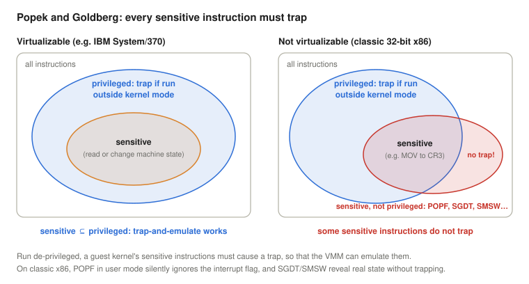
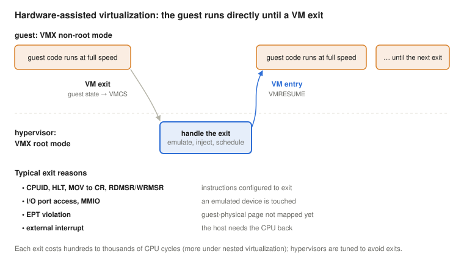
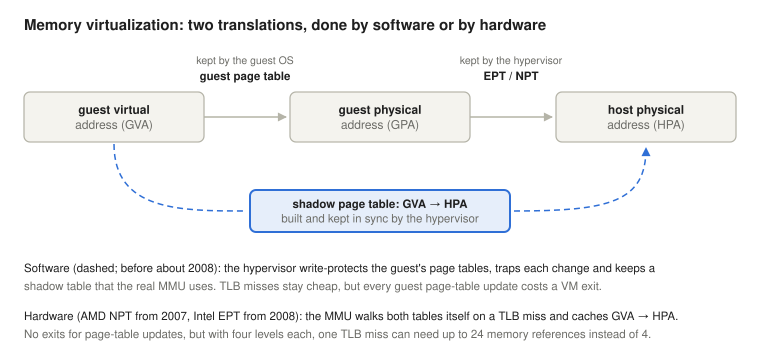
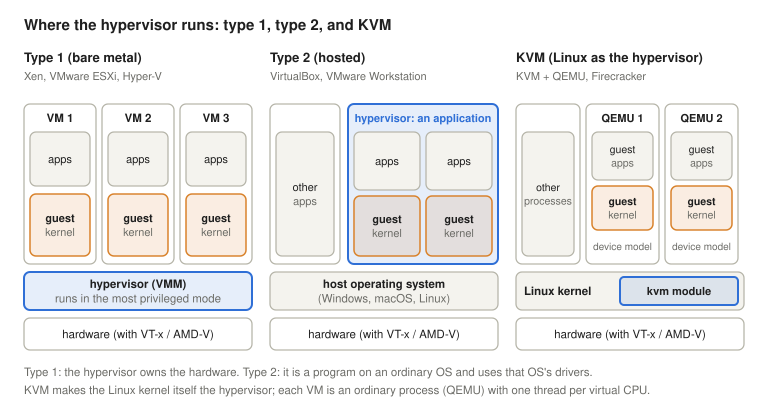
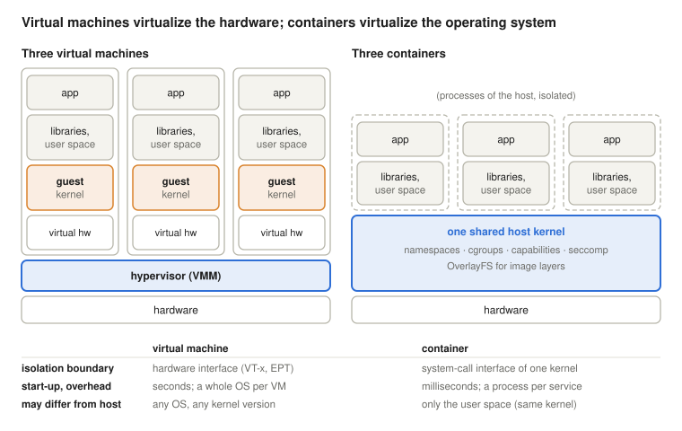
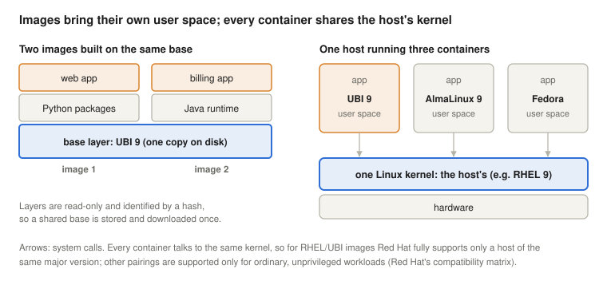
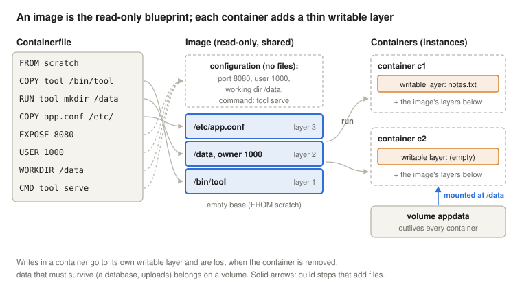
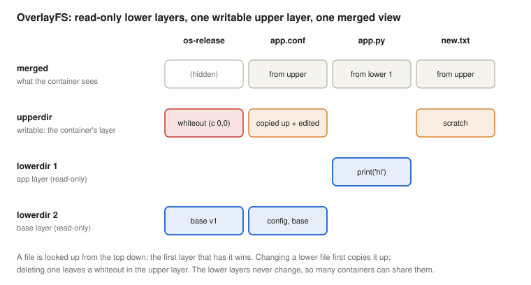

# Virtualization and Containerization

*Operating Systems lecture: how one computer becomes many: virtual machine monitors, the Popek–Goldberg requirements, trap-and-emulate, binary translation, paravirtualization and hardware support (VT-x, AMD-V), virtual memory and I/O for guests, KVM and live migration; then containers: images, layers and registries, and the kernel mechanisms underneath (namespaces, cgroups, capabilities, seccomp, OverlayFS, OCI runtimes, rootless containers), all measured on Linux*

## Learning objectives

The [first lecture](../01-historic-evolution/#what-an-operating-system-is-and-why-it-is-hard) defined the operating system as a machine that turns one real machine into another, more convenient one, and one machine into N machines. This lecture takes that idea literally twice. A **virtual machine** is a complete copy of the hardware interface, on which a whole operating system runs as if it owned the computer. A **container** goes one level up: it shares one kernel, but gives each group of processes its own view of the operating system. Both rest on mechanisms of earlier lectures: privileged instructions and traps ([lecture 5](../05-interrupts/)), page tables and the TLB ([lecture 8](../08-virtual-memory/)), scheduling ([lecture 6](../06-concurrency-deadlocks-scheduling/)) and capabilities and SELinux ([lecture 10](../10-access-control/)).

By the end, students will be able to:

- explain why organisations virtualize (consolidation, isolation, encapsulation and migration, testing, the cloud), and outline the history from IBM VM/370 to KVM and Docker;
- state the Popek–Goldberg requirements for a virtual machine monitor, distinguish sensitive from privileged instructions, and explain why classic x86 could not be virtualized by trap-and-emulate;
- compare binary translation, paravirtualization and hardware-assisted virtualization (VMX root and non-root mode, VM entry and VM exit), and estimate the cost of a VM exit;
- explain shadow page tables and nested paging (EPT/NPT), and the three ways to give a guest I/O devices (emulation, virtio, passthrough and SR-IOV);
- distinguish type 1 and type 2 hypervisors, explain how KVM, QEMU and libvirt divide the work, and describe live migration and nested virtualization;
- compare virtual machines and containers: what each brings of its own, what a container shares with the host, and what follows for isolation, compatibility and support;
- explain container images (layers, registries, OCI), distinguish an image, a container and a volume, build an image from a Containerfile, and explain why a container's main process must run in the foreground;
- name the roles of Docker, Podman, Buildah and Skopeo, and of the OCI runtimes runc and crun;
- explain the kernel mechanisms of containers: the eight namespaces, cgroup limits, the reduced capability set and seccomp, OverlayFS layers and rootless containers with user namespaces;
- inspect all of this on Linux with `lscpu`, `systemd-detect-virt`, `unshare`, `nsenter`, the cgroup files, `mount -t overlay`, `docker`/`podman` and `/proc`.

<details>
<summary><b>Explained simply:</b> virtualization, virtual machine, host, guest, hypervisor, container</summary>

- **Virtualization:** making one real thing look like several (or like a different thing), each user believing it has its own. A large house divided into flats is a "virtualized" house.
- **Virtual machine (VM):** a computer made of software, running on a real computer. It has its own (simulated) processor, memory, disk and network card, and a whole operating system runs inside it.
- **Host, guest:** the host is the real computer (and its operating system); a guest is an operating system running inside a virtual machine on it.
- **Hypervisor** (virtual machine monitor, VMM): the program that creates and runs virtual machines and shares the real hardware among them, like a landlord who divides the house and keeps the tenants apart.
- **Container:** a group of programs that run directly on the host's operating system, but are fenced off so that they see only their own files, processes and network, like a flat that shares the building's foundations, pipes and wiring with the others.

</details>

## Why virtualize?

The first lecture showed **multiplexing**: an operating system lets many programs share one machine, in time and in space. Virtualization multiplexes at a lower level: whole operating systems share one machine, each in a virtual machine of its own. The reasons are practical:

- **Consolidation.** A typical server running one service is busy only a small part of the time, but still needs power, cooling, rack space and maintenance. Running ten such services as ten virtual machines on one larger server uses the hardware far better, and each service keeps its own operating system, with its own versions and settings.
- **Isolation.** A crash, an overload or a break-in in one VM stays in that VM. The hypervisor also enforces each VM's share of CPU, memory and I/O, so one tenant cannot starve the others.
- **Encapsulation and migration.** A whole VM is a set of files (its virtual disk and configuration) plus the contents of its memory. It can be copied, snapshotted before a risky update, rolled back, and moved to another physical machine, even while it runs (live migration, below). Hardware maintenance then no longer means downtime for the services.
- **Testing and compatibility.** Developers test on several operating systems and versions on one laptop; an old application keeps running in a VM with the old operating system it needs, long after the old hardware is gone.
- **The cloud.** Rented computing capacity, the opex model of [lecture 2](../02-quality-and-enterprise-linux/#owning-or-renting-capex-opex-and-the-cloud), is sold mostly as virtual machines and containers: a customer gets a VM in minutes, and the provider packs many customers' VMs onto each server. At that scale the hardware itself became a building block: in the late 2000s, Google and Microsoft built data centres from standard shipping containers, each one packed with racks of servers, cooling and power distribution, delivered and replaced as a unit (these hardware containers are unrelated to the software containers later in this lecture, apart from the shared idea of a standard box).

### A short history

Virtualization is older than the personal computer. In the mid-1960s, IBM's Cambridge Scientific Center built **CP-40** (on a specially modified System/360 Model 40) and then **CP-67**, a control program that gave each user of an IBM System/360 Model 67 a virtual machine of their own, in which a simple single-user operating system (CMS) ran. In 1972 this became **VM/370** for the new System/370 (Creasy, 1981). Instead of one complex time-sharing system, each user got a whole private computer, and the operating systems inside could even be different ones: a new version of IBM's main operating system could be tested in a VM while the old one served the users in another. Its descendant, z/VM, still runs on IBM mainframes.

On minicomputers and PCs, virtualization almost disappeared for two decades, because the hardware did not support it well (next section). **VMware** brought it back to x86 in 1999 with a clever software technique; **Xen** (2003) offered another one; Intel and AMD added hardware support in 2005 and 2006; and **KVM** turned Linux itself into a hypervisor in 2007. Containers have a parallel history: FreeBSD jails (2000), Solaris Zones (2004), Linux namespaces and cgroups (from 2002 and 2008), and **Docker** (2013), which made them popular.

<details>
<summary><b>Explained simply:</b> multiplexing, consolidation, isolation, encapsulation, snapshot, migration, data centre, IBM System/360, mainframe, CMS, VMware, Xen, KVM, Docker</summary>

- **Multiplexing:** letting many users share one thing so that each seems to have it alone, like many phone calls sharing one cable.
- **Consolidation:** putting the work of many half-idle machines onto fewer, busier ones, like car-sharing instead of every family keeping a car that stands in the garage most of the day.
- **Isolation:** keeping things apart so that trouble in one cannot spread to another.
- **Encapsulation:** packing everything that belongs to one machine into one bundle (a few files) that can be handled as a whole.
- **Snapshot:** a saved copy of a machine's state at one moment, to which it can be returned.
- **Migration:** moving a running virtual machine from one physical computer to another.
- **Data centre:** a building full of servers, with the power, cooling and network they need.
- **IBM System/360, mainframe:** IBM's family of large computers from 1964; "mainframe" is the name for such large central computers that serve a whole organisation.
- **CMS** (Conversational Monitor System): a small single-user operating system that ran in each virtual machine of VM/370.
- **VMware, Xen, KVM:** three well-known hypervisors: VMware's commercial products, the open-source Xen, and KVM, which is part of Linux.
- **Docker:** the company and tool that made containers popular.

</details>

## Virtual machine monitors

### What a VMM must do

The program that creates virtual machines is a **virtual machine monitor** (VMM), or **hypervisor**. Popek and Goldberg (1974) defined it by three properties:

- **Equivalence (fidelity):** a program running in a VM behaves exactly as it would on the real machine, apart from timing and the amount of available resources.
- **Resource control (safety):** the VMM is in complete control of the real resources; a VM cannot use memory, devices or CPU time it was not given, or take control from the VMM.
- **Efficiency (performance):** the great majority of the guest's instructions run directly on the real processor, without the VMM's intervention.

The third property excludes a simple emulator, which interprets every instruction in software and is therefore tens of times slower. A VMM must let the guest run on the real CPU, and still take over whenever the guest does something that would break the first two properties.

### Sensitive and privileged instructions

[Lecture 5](../05-interrupts/#user-mode-and-kernel-mode) showed that a processor has a user mode and a kernel mode, and that **privileged** instructions (disabling interrupts, loading the page-table base register, starting I/O) cause a trap when a user-mode program tries them. Popek and Goldberg called an instruction **sensitive** if it changes the configuration of the machine (control-sensitive, like loading the page-table base register) or if its result depends on that configuration (behaviour-sensitive, like an instruction that reads the current privilege level). Their main theorem says: a VMM satisfying all three properties can be built for a machine if **every sensitive instruction is privileged**. Then the guest kernel can simply run in user mode: everything harmless runs at full speed, and every sensitive instruction traps into the VMM.



IBM's System/370 met this condition. The 32-bit x86 did not: Robin and Irvine (2000) listed 17 instructions of the Pentium that are sensitive but not privileged. `POPF`, for example, loads the flags register, including the interrupt-enable flag; in kernel mode it can switch interrupts off, but in user mode it silently leaves the flag unchanged, without a trap. A guest kernel running in user mode that executes `POPF` to disable interrupts would believe that interrupts were off, while they were not, and the VMM would never find out. `SGDT`, `SIDT` and `SMSW` let user mode read processor registers that reveal the real machine's configuration, again without a trap. Such a machine cannot be virtualized by trapping alone.

### Trap-and-emulate

On a machine that meets the condition, a VMM works by **trap-and-emulate**. The guest's kernel runs **de-privileged**, in user mode. Its ordinary instructions run directly. When it executes a privileged instruction, the processor traps to the VMM, which **emulates** the instruction on the guest's *virtual* state: "disable interrupts" sets a bit in the VMM's record of the virtual CPU, "load the page-table base register" switches to the page tables the VMM keeps for that guest, "start I/O" starts the emulated device. Then the VMM resumes the guest after the instruction. Real interrupts always go to the VMM, which delivers them to the guest that should see them as virtual interrupts. This is exactly how VM/370 worked.

### Binary translation

VMware's answer to the x86 problem, in 1999, was to rewrite the problematic code before it runs. User-mode code of the guest ran directly, since it contains nothing that needs the VMM. Guest *kernel* code ran through **binary translation**: the VMM read the guest's machine code block by block just before it was first executed, copied the harmless instructions unchanged, replaced every sensitive instruction (such as `POPF`) with a short sequence that updates the virtual CPU state or calls the VMM, and kept the translated blocks in a **translation cache**, so that each block was translated only once. The guest operating system needed no changes at all (Adams & Agesen, 2006).

### Paravirtualization

**Xen** took the opposite route (Barham et al., 2003). Instead of hiding the virtualization from the guest, it changed the guest: the guest kernel is ported to a slightly different machine, on which the sensitive operations are replaced by explicit calls to the hypervisor, **hypercalls**, much like system calls one level lower. Porting Linux to Xen changed only about 3000 lines of its code, and the guest ran with very low overhead, but closed-source systems such as Windows could not be ported this way. Amazon's EC2 cloud started on Xen in 2006.

Paravirtualization survives today in a milder form: an unmodified guest kernel detects that it runs in a VM and uses **paravirtual drivers and interfaces** where they help: virtio devices (below), a paravirtual clock, and hints that save VM exits. The Linux demo below shows a KVM guest doing exactly that.

### Hardware-assisted virtualization

In 2005 Intel added **VT-x** to its processors (Uhlig et al., 2005), and in 2006 AMD added AMD-V. Both introduce a new dimension of privilege. The processor runs either in **VMX root mode**, for the hypervisor, or in **VMX non-root mode**, for guests; each of the two has the usual four rings, so the guest kernel runs in ring 0 as it expects, but in non-root mode. A memory structure, the **VMCS** (virtual machine control structure), holds the guest's saved processor state, the host's state, and controls that tell the processor which events must leave the guest. The hypervisor starts the guest with **VM entry** (the instructions `VMLAUNCH` and `VMRESUME`). When the guest does something the controls mark, the processor performs a **VM exit**: it saves the guest's state in the VMCS, loads the host's, and continues in the hypervisor with the reason of the exit. The guest kernel now runs in ring 0, so an instruction such as `POPF` behaves exactly as it expects, and the sensitive instructions that would touch the real machine's state (loading CR3, reading the descriptor-table registers, `CPUID`) can be made to exit: x86 meets the Popek–Goldberg condition at last.



A VM exit costs far more than a system call, because the whole processor state is switched and caches and TLB entries suffer. The first generation of VT-x was in fact often *slower* than VMware's mature binary translation, because every page-table update of the guest caused an exit (Adams & Agesen, 2006). Later processors made exits cheaper and, above all, removed the most frequent ones with nested paging (next section). Today every server hypervisor uses hardware assistance; the [measured cost of a VM exit](#the-price-of-a-vm-exit) on the lecture's machine is shown below.

<details>
<summary><b>Explained simply:</b> VMM, equivalence, resource control, efficiency, emulator, privileged instruction, sensitive instruction, trap, de-privileged, POPF, binary translation, translation cache, paravirtualization, hypercall, VT-x, AMD-V, VMX root and non-root mode, VMCS, VM entry, VM exit</summary>

- **VMM** (virtual machine monitor): another name for the hypervisor.
- **Equivalence, resource control, efficiency:** the three promises of a VMM: programs behave as on real hardware, the VMM stays in charge of everything, and most instructions run at full speed.
- **Emulator:** a program that imitates a processor by reading and carrying out each instruction in software, like a person who reads a recipe aloud for someone else to cook. Correct, but slow.
- **Privileged instruction:** a processor instruction that only the kernel may use; in user mode it causes a trap.
- **Sensitive instruction:** an instruction that changes or reveals how the machine is set up, such as which memory a program may see or whether interrupts are on.
- **Trap:** an automatic jump into the kernel (or the hypervisor) caused by the running instruction itself.
- **De-privileged:** running with fewer rights than it believes it has. A guest kernel thinks it is in charge, but runs in a mode where the important instructions trap.
- **POPF:** an x86 instruction that loads the processor's flags, including the "interrupts allowed" flag.
- **Binary translation:** rewriting a program's machine code just before it runs, replacing the dangerous instructions with safe ones, like an interpreter who quietly softens a few words while translating a speech.
- **Translation cache:** the store of already translated code, so that each piece is translated only once.
- **Paravirtualization:** changing the guest operating system so that it cooperates with the hypervisor, instead of pretending it runs on real hardware.
- **Hypercall:** a request from a guest kernel to the hypervisor, as a system call is a request from a program to the kernel.
- **VT-x, AMD-V:** the virtualization extensions of Intel and AMD processors.
- **VMX root and non-root mode:** two worlds of the processor: one for the hypervisor and one for the guests. A guest's kernel is at the top of its own world, but the hypervisor's world is above it.
- **VMCS:** a table in memory where the processor saves a guest's state and reads the rules for when the guest must stop and hand over to the hypervisor.
- **VM entry, VM exit:** switching from the hypervisor into a guest, and back.

</details>

## Virtualizing memory and I/O

### Memory: two translations

In a VM there are three kinds of addresses. The guest's programs use **guest virtual addresses**; the guest kernel's page tables, the ones of [lecture 8](../08-virtual-memory/#multi-level-page-tables), map them to what the guest believes are physical addresses, the **guest physical addresses**; and the hypervisor decides which real memory, **host physical addresses**, stands behind each guest physical page. The guest must not be allowed to load its own page tables into the real MMU, since they would give it access to any real memory.



Before hardware support, hypervisors used **shadow page tables**. The hypervisor write-protects the guest's page tables, so that every change the guest makes to them traps. For each guest page table it keeps a shadow table that maps guest virtual addresses *directly* to host physical addresses, and loads the shadow table into the real MMU. TLB misses are as cheap as without virtualization, but every page-table update of the guest (and processes create and change page tables constantly) costs a trap and work in the hypervisor.

**Nested paging**, introduced by AMD as NPT (or RVI) in 2007 and by Intel as **EPT** (extended page tables) in 2008, moves the second translation into hardware. The hypervisor keeps one more page table per VM, mapping guest physical to host physical addresses, and the MMU walks both: the guest's tables, whose entries are themselves guest physical addresses that must be translated through the EPT. The guest may now change its own page tables freely, without exits. The price is paid on TLB misses: with four-level tables on both sides, one miss can need up to 24 memory references instead of 4, which is why hypervisors and guests prefer huge pages, and why the TLB and the page-walk caches matter even more in a VM (Bhargava et al., 2008). TLB entries are tagged with the VM (VPID on Intel, ASID on AMD), the same idea as the PCID of [lecture 8](../08-virtual-memory/#the-tlb-a-cache-for-translations), so that switching between VMs does not flush the TLB.

Memory can also be **overcommitted**: the guests together may be promised more memory than the host has, since most of them do not use all of it. A **balloon driver** in the guest takes memory back politely: on the hypervisor's request it allocates pages inside the guest (so the guest's own page replacement decides what to give up) and reports them to the hypervisor, which can give the frames to another VM (Waldspurger, 2002). Identical pages of different VMs (the same kernel code, zero pages) can be merged into one copy-on-write page; on Linux this is **KSM**, kernel samepage merging.

### I/O: emulated, paravirtual, passed through

A guest needs a disk, a network card and a console. There are three ways to give them:

- **Emulation.** The hypervisor imitates a real, well-known device, for example an Intel e1000 network card or an IDE disk controller, register by register. The guest uses its ordinary driver and needs no changes; but every access to a device register causes a VM exit, and a single network packet may need several of them.
- **Paravirtual devices.** The guest uses a driver for a device that exists only in VMs and is designed to be cheap to virtualize. The standard on Linux and KVM is **virtio** (Russell, 2008): guest and hypervisor share ring buffers in memory (*virtqueues*), the guest puts many requests into a queue and notifies the hypervisor once, and the hypervisor answers with one interrupt for many completions. Exits per byte fall by orders of magnitude. The lecture's own machine uses virtio for its disks and network (demo below).
- **Device passthrough.** The hypervisor gives a real PCI device directly to one guest, whose driver then talks to the hardware without exits. The device's DMA must be confined to that guest's memory, which needs an **IOMMU** (Intel VT-d, AMD-Vi), an MMU for devices. With **SR-IOV**, one physical network card or SSD presents itself as several *virtual functions*, each of which can be passed to a different VM. Passthrough gives native speed, but ties the VM to that physical machine, which makes live migration hard.

<details>
<summary><b>Explained simply:</b> guest virtual, guest physical and host physical address, MMU, shadow page table, nested paging, EPT, NPT, huge page, VPID, overcommit, balloon driver, KSM, emulated device, virtio, virtqueue, passthrough, IOMMU, SR-IOV, DMA</summary>

- **Guest virtual, guest physical, host physical address:** a program's address inside the VM; the address the guest's kernel thinks is real memory; and the address in the computer's actual memory chips.
- **MMU** (memory management unit): the part of the processor that translates virtual addresses to physical ones using the page tables.
- **Shadow page table:** a combined, ready-made translation table that the hypervisor maintains behind the guest's back.
- **Nested paging, EPT, NPT:** processor support for the second translation step: the hardware itself looks up both tables. EPT is Intel's name, NPT AMD's.
- **Huge page:** a page of 2 MiB or 1 GiB instead of 4 KiB, so that one TLB entry covers much more memory.
- **VPID, ASID:** a label on each TLB entry saying which VM (or address space) it belongs to, so the TLB need not be emptied at every switch.
- **Overcommit:** promising more than you have, counting on not everyone using all of it at once, like an airline that sells a few more tickets than seats.
- **Balloon driver:** a driver in the guest that "inflates" by taking memory for itself and handing it to the hypervisor, and "deflates" to give it back.
- **KSM** (kernel samepage merging): Linux finds memory pages with identical content and keeps only one copy.
- **Emulated device:** a pretend copy of a real piece of hardware, built in software.
- **virtio, virtqueue:** a family of simple virtual devices designed for VMs; a virtqueue is the shared list through which the guest and the hypervisor pass requests and answers.
- **Passthrough:** giving a real device to one VM for its exclusive use.
- **IOMMU:** a translator and guard for devices' memory accesses, so that a device given to a VM can reach only that VM's memory.
- **SR-IOV:** a device that can split itself into several smaller virtual devices, one per VM.
- **DMA** (direct memory access): a device writing into or reading from memory by itself, without the CPU (lecture 5).

</details>

## Hypervisors in practice

### Type 1 and type 2



A **type 1** (bare-metal) hypervisor runs directly on the hardware and is itself a small operating system that manages CPUs, memory and the scheduling of VMs: VMware ESXi, Xen and Microsoft Hyper-V are examples. Xen and Hyper-V leave device drivers and management to one privileged VM (Xen's *domain 0*, Hyper-V's *root partition*), so that the hypervisor itself stays small. A **type 2** (hosted) hypervisor is an application on an ordinary operating system and uses that system's drivers, scheduler and memory management: VirtualBox and VMware Workstation are examples. Type 1 is the choice for servers, type 2 for desktops.

### KVM, QEMU and libvirt

**KVM** (Kernel-based Virtual Machine) blurs this distinction (Kivity et al., 2007). It is a module of the Linux kernel, merged in 2007, that uses VT-x or AMD-V and offers a device file, `/dev/kvm`. A user-space program opens it and creates a VM and its virtual CPUs with `ioctl` calls; each virtual CPU is a thread that calls `ioctl(KVM_RUN)`, which enters the guest and returns only when an exit needs user space, for example an access to an emulated device. Everything else Linux already has: the virtual CPUs are scheduled by the [ordinary Linux scheduler](../06-concurrency-deadlocks-scheduling/#linux-scheduling), guest memory is ordinary process memory managed by the kernel's virtual memory, and the VM can be limited with cgroups like any process. Is KVM type 1 or type 2? Linux runs on the bare hardware and is the hypervisor, as in type 1; but it is a complete general-purpose operating system that also runs ordinary programs, as the host of type 2. The labels matter less than the division of work.

The user-space part is usually **QEMU**, which emulates the machine's devices (and, without KVM, can emulate a whole processor of another architecture by binary translation). Lighter alternatives exist for special uses: Amazon's **Firecracker** runs each serverless function or container of its cloud in a *microVM* with only a handful of virtio devices; it boots a Linux guest in about 125 ms with a few megabytes of overhead per VM (Agache et al., 2020). On top of these, **libvirt** offers one management interface (the `virsh` command, the virt-manager GUI) for KVM and other hypervisors, and cloud platforms such as OpenStack manage thousands of hosts.

### Live migration

Because a VM is encapsulated, it can be moved to another host while it runs. **Live migration** with the pre-copy method (Clark et al., 2005) works in rounds: the source host copies all of the VM's memory to the destination while the VM keeps running; then it copies again the pages that the VM changed meanwhile (the hypervisor tracks them by write-protecting pages or with dirty bits); and it repeats with ever fewer pages. When the remaining set is small, the VM is paused for a moment, the last pages and the CPU state are copied, and the VM resumes on the destination, which announces the VM's network address from its new place. The disk is usually on shared network storage, so it need not move. The pause lasts tens to a few hundred milliseconds, short enough that network connections survive. For the quality measures of [lecture 2](../02-quality-and-enterprise-linux/#the-nines), this turns hardware maintenance from planned downtime into a non-event, and lets the operator move load away from a server that shows signs of failing.

### Nested virtualization

A hypervisor can itself run inside a VM: **nested virtualization** (Ben-Yehuda et al., 2010). The processor's VT-x support exists only once, so the outer hypervisor (L0) emulates VT-x for the inner one (L1), which runs its own guests (L2). Every exit of an L2 guest first goes to L0, which often has to forward it to L1 and handle the exits that L1's handling causes, so exits multiply. Nested virtualization is used for testing hypervisors, for running VMs in cloud instances, and for development environments; cloud providers enable it only on some instance types. The [machine of this lecture's demos](#is-this-machine-virtual) is itself a KVM guest without VT-x, so it cannot run VMs of its own.

<details>
<summary><b>Explained simply:</b> type 1 and type 2 hypervisor, ESXi, Hyper-V, VirtualBox, domain 0, KVM, /dev/kvm, ioctl, QEMU, Firecracker, microVM, serverless, libvirt, virsh, OpenStack, live migration, pre-copy, dirty page, nested virtualization</summary>

- **Type 1 / type 2 hypervisor:** a type 1 hypervisor sits directly on the hardware, like a building's owner who manages it; a type 2 hypervisor is a program on an ordinary operating system, like a tenant who sublets rooms of their flat.
- **ESXi, Hyper-V, VirtualBox:** hypervisors of VMware, Microsoft and Oracle.
- **Domain 0, root partition:** a special, trusted VM that holds the device drivers and management tools for the other VMs.
- **KVM, /dev/kvm:** KVM is the part of Linux that runs VMs; programs ask it for VMs through the special file `/dev/kvm`.
- **ioctl:** a general-purpose system call for giving a device driver commands that the ordinary read and write calls cannot express.
- **QEMU:** an open-source program that imitates a whole computer's devices (and, if needed, its processor).
- **Firecracker, microVM:** a very small hypervisor program from Amazon that starts tiny VMs (microVMs) in a fraction of a second.
- **Serverless:** a cloud service where customers upload only a function, and the provider runs it on demand, somewhere, for a few milliseconds or seconds.
- **libvirt, virsh, OpenStack:** management software: libvirt and its command `virsh` control the VMs of one host, OpenStack those of a whole data centre.
- **Live migration, pre-copy:** moving a running VM to another computer; pre-copy copies the memory while the VM still runs, and then only what changed meanwhile.
- **Dirty page:** a memory page that was written since it was last copied or saved.
- **Nested virtualization:** a VM inside a VM: the inner hypervisor runs as a guest of the outer one.

</details>

## Containers: virtualizing the operating system

### Virtual machines and containers compared

A virtual machine simulates a whole computer, so each one boots its own kernel. A **container** is lighter: it is an ordinary group of processes on the host, which the host's kernel isolates from the others (with *namespaces*, which give each container its own view of files, processes and network, and *cgroups*, which limit its CPU and memory). A container therefore brings its own **user space** (libraries, tools, configuration, `/etc/os-release`) but **no kernel of its own**: every system call goes to the host's kernel.



The difference decides where each fits. A container starts in milliseconds, since it is only a process; it needs no memory for a second kernel and no virtual hardware; and hundreds of containers fit on a host that would hold tens of VMs. But all containers depend on one kernel. They cannot run another operating system (no Windows container on a Linux kernel), nor another kernel version than the host's, which is why the [compatibility](#kernel-and-image-must-fit-together) of image and host matters. And the isolation boundary is the whole system-call interface of a large kernel, several hundred calls, against the much narrower hardware interface of a VM: a kernel bug reachable from a container may let it escape to the host. Where tenants do not trust each other, providers therefore combine the two: each container, or each customer's group of containers, runs in its own small VM, as in Firecracker or Kata Containers, or behind a user-space kernel that intercepts the system calls, as in gVisor.

### Container images



A **container image** is the packaged file system a container starts from. It is a stack of read-only **layers**, each identified by a cryptographic hash of its contents: a base layer with a distribution's user space, then a layer per build step that adds packages or the application. Images built on the same base share that layer, which is stored and downloaded only once. Images are kept in **registries**, servers from which they are pulled by name, such as `registry.access.redhat.com/ubi9/ubi-minimal`.

The isolation itself is older than the word "container" suggests: FreeBSD jails (2000), Solaris Zones (2004), and Linux cgroups and LXC (2008) came first. Docker, from 2013, made it popular by adding a simple image format and workflow: build an image once, push it to a registry, run it anywhere (Merkel, 2014). So that images would not depend on one company's tools, Docker, CoreOS and others founded the **Open Container Initiative (OCI)** under the Linux Foundation on 22 June 2015. It maintains three specifications: the *runtime* specification (how to run a container), the *image* specification (the format of images and layers; Open Container Initiative, n.d.-b), and the *distribution* specification (how registries serve them) (Open Container Initiative, n.d.-a). An image built with one OCI tool can be pulled and run by any other (on the same CPU architecture), which is what makes an image ecosystem across vendors possible.

### Image, container, volume

An image and a container relate as a blueprint and the things built from it, or as a class and its objects in programming: `podman run` *instantiates* an image, and any number of containers can run from the same image at the same time. The image itself never changes; it is **immutable**. Each container gets its own thin **writable layer** on top of the image's read-only layers. When a process in the container creates or changes a file, the change goes into this layer (a changed file is first copied up from the read-only layer below, **copy-on-write**; a deleted one is only hidden). The writable layer belongs to the container and is deleted together with it (Docker Inc., n.d.-c). How the kernel stacks the layers is shown under [OverlayFS](#overlayfs-the-layers-on-disk) below.



Data that must survive therefore does not belong in the container. A **volume** is storage managed by the container engine (or, as a *bind mount*, a directory of the host) that is mounted into the container at a path such as `/data` or `/var/lib/mysql`. It lives independently of every container, so a container can be removed and replaced by one from a newer image (the "rebuild and redeploy" below) while the database files stay where they are. Containers are thus disposable, and the state of a service lives in its volumes; the measured demonstration is in the section [Container, writable layer and volume](#container-writable-layer-and-volume).

A container also lives exactly as long as its **main process**. The command given to `podman run`, or the image's default `CMD`, runs as process 1 in the container's own process namespace; when it exits, the container stops and every other process in it is killed. A traditional Unix server **daemonises**: the process that was started forks a child to do the work in the background and exits at once, which in a container would stop the container immediately. Servers are therefore started in the foreground in containers, for example Apache with `httpd -D FOREGROUND` or nginx with `-g 'daemon off;'`. The engine also collects the main process's standard output and error as the container's log (`podman logs`).

### Building an image: by hand or from a Containerfile

An image can be made by hand, much as one would set up a server:

```bash
podman pull registry.access.redhat.com/ubi9/ubi
podman run -it --name work registry.access.redhat.com/ubi9/ubi /bin/bash
#   inside the container: dnf install -y httpd, edit /etc/httpd/conf/httpd.conf, then exit
podman commit work registry.example.com/web/httpd:1.0
podman push registry.example.com/web/httpd:1.0
```

Leaving the shell ends the container's main process, so the container stops (a container started in the background with `-d` is stopped with `podman stop`). `podman commit` turns the stopped container's writable layer into a new image layer, and `podman push` uploads the image to a registry. This works, but it is an anti-pattern for anything that will be used for real. Nobody can tell later exactly what was done: the image records only the command that the container ran, not the commands typed in the shell. The work cannot be repeated automatically when the base image receives a security fix, which defeats "rebuild and redeploy". Everything left in the container ends up in the image: package caches, temporary files, the shell history. And the container's settings become the image's settings, as the demonstration below shows.

The reproducible way is a **Containerfile** (Docker's name: Dockerfile), a text file of build steps kept in version control next to the application, and one command that builds it:

```dockerfile
FROM registry.access.redhat.com/ubi9/ubi
RUN dnf install -y httpd && dnf clean all
COPY httpd.conf /etc/httpd/conf/httpd.conf
EXPOSE 8080
USER apache
CMD ["httpd", "-D", "FOREGROUND"]
```

```bash
podman build -t registry.example.com/web/httpd:1.0 .
```

(A sketch: the configuration file makes httpd listen on port 8080, because ports below 1024 need root; a production image also adjusts the ownership of the log and run directories for the non-root user.) The final `.` is the **build context**, the directory whose files `COPY` may use. Each instruction becomes either a layer or a line of configuration (Docker Inc., n.d.-a):

| Instruction | What it does | In the image |
| --- | --- | --- |
| `FROM` | names the base image to build on | the base image's layers, reused unchanged |
| `RUN` | runs a command in a temporary container during the build | a new layer with the files the command changed |
| `COPY` | copies files from the build context into the image | a new layer |
| `EXPOSE` | documents the port the service listens on | configuration only |
| `USER` | the user that later `RUN` steps and the container's main process run as | configuration only |
| `WORKDIR` | the current directory for later steps and for the container | configuration (the directory is created if missing) |
| `CMD` | the default command: the container's main process | configuration only |

Two consequences follow from the layers. A file deleted in a later step still takes up space in the earlier layer, so `dnf install` and `dnf clean all` are run in *one* `RUN` step. And the builder reuses the layers of unchanged steps from earlier builds, so steps that rarely change (installing packages) come before those that change often (copying the application).

**Image names.** A full image name has the form `registry/namespace/name:tag`, for example `registry.example.com/web/httpd:1.0` or `registry.access.redhat.com/ubi9/ubi-minimal:latest`: the registry's host name (optionally with a port), a namespace (a user, organisation or project), the repository name, and a **tag** (Docker Inc., n.d.-b). Without a registry, Docker assumes Docker Hub (`docker.io`), while Podman searches the registries listed in `/etc/containers/registries.conf`, which is why full names are safer. Without a tag, the tag `latest` is used. Despite its name, `latest` is just a default label, not a guarantee of the newest version: it points to whatever was last pushed with that tag, and it moves. Version tags such as `:1.0` can also be moved by whoever pushes, so a deployment that must be exactly reproducible names the image by its **digest** (`name@sha256:…`), the hash of its content. The price is the one discussed under "rebuild and redeploy" below: an image pinned to a digest receives no fixes until someone rebuilds it and changes the pin deliberately.

### Base images and registries

Most images start `FROM` a base image that provides a distribution's user space. Every major distribution publishes them:

| Image source | Where | Terms |
|---|---|---|
| **UBI** (Universal Base Image), from RHEL packages | `registry.access.redhat.com` (no login) | free to use and redistribute under the UBI licence; supported only on RHEL or OpenShift with a subscription |
| **RHEL** images for customers | `registry.redhat.io` (Red Hat login or service account) | subscription |
| **Certified partner** images (databases, middleware) | `registry.connect.redhat.com` (login), listed in the Red Hat Ecosystem Catalog | vendor's terms |
| **Fedora**, **CentOS Stream** | `quay.io` (e.g. `quay.io/centos/centos:stream9`), Fedora's own registry | free, community |
| **AlmaLinux**, **Rocky Linux** | Docker Hub and Quay.io (e.g. `quay.io/almalinuxorg/almalinux:9`, `docker.io/rockylinux/rockylinux:9`) | free, community |
| **Debian**, **Ubuntu**, **Alpine** and many others | Docker Hub "official images" (e.g. `docker.io/library/debian:12`) | free, community or vendor |

The first two rows, why Red Hat created UBI in 2019, its four variants (ubi, ubi-minimal, ubi-micro, ubi-init) and the limits that protect the subscription business, are discussed in [lecture 2](../02-quality-and-enterprise-linux/#base-images-and-registries). The choice of a base image is a choice of a distribution, with its life cycle, update policy and support terms, exactly as for a server; only the kernel is not part of it.

### Kernel and image must fit together

Because a container shares the host's kernel, "it runs in a container, so it runs anywhere" is only partly true. A RHEL 7 image on a RHEL 9 host runs RHEL 7 libraries against a kernel that is two major versions newer, which RHEL 7's developers never tested. Red Hat therefore publishes a **Container Compatibility Matrix** (Red Hat, n.d.-b). A RHEL 9 host, for example, runs RHEL or UBI 7, 8, 9 and 10 images, but only the matching major version (UBI 9 on RHEL 9) is "fully compatible"; the other combinations are supported only as "workload specific": the container must be unprivileged and must not use interfaces that depend on the kernel version, such as special `ioctl` calls, files in `/proc` and `/sys`, firewall rules (iptables, nftables) or eBPF, apart from the most common uses. Everything else, including privileged containers that act on the host itself, needs matching versions. A *newer* image on an *older* host (UBI 10 on RHEL 9) gets the strictest terms, because the image may expect kernel features that the old kernel lacks: a problem must also be reproducible on a matching host before Red Hat will treat it. This is the kABI and certification logic of the [commercial side of an enterprise distribution](../02-quality-and-enterprise-linux/#the-commercial-side-of-an-open-source-operating-system), applied to containers: a promise of support covers only the combinations that were tested. Virtual machines do not have this problem, since each brings its own kernel.

### Updating images: rebuild and redeploy

A running container is not patched in place. When a fix appears, for example a fixed `glibc` in UBI 9, the image is **rebuilt** on the updated base layer and the containers are **replaced** with new ones from it. Because the base layer is shared, one updated base is downloaded once and serves every image built on it. The fix itself still comes from the same backporting process as on a server: the `glibc` of UBI 9 stays at version 2.34 for the whole of RHEL 9 and receives backported fixes (a few components are occasionally rebased to a newer upstream version within a major release, as OpenSSL was from 3.0 to 3.2 in RHEL 9.5, but that is the exception), so the [version-number lesson of the Dirty Pipe example](../02-quality-and-enterprise-linux/#why-the-version-number-lies-backporting-in-practice) applies inside containers too, and image scanners need the vendor's security data just as server scanners do.

### The tools: Podman, Buildah, Skopeo

Docker's own tool chain is a client, `docker`, that talks to a daemon, `dockerd`, which runs as root and passes the work on to `containerd` and an OCI runtime (measured [below](#a-container-seen-from-the-host)). Since RHEL 8 (2019), Red Hat ships its own OCI tools instead of Docker, in the `container-tools` package set (Red Hat, n.d.-a):

- **Podman** runs and manages containers, images and *pods* (groups of containers); its commands mirror Docker's (`podman run` for `docker run`);
- **Buildah** builds images, from a `Containerfile` (Docker's `Dockerfile` format) or step by step from a script;
- **Skopeo** works directly against registries, with no local image store: it copies, inspects, signs and deletes images; `skopeo inspect` reads an image's metadata without pulling it.

Two design differences from Docker matter for quality. Podman needs **no daemon**: there is no central background service that runs as root and through which every container is started, so there is no single point of failure for all containers, and containers can be run as ordinary `systemd` services (with Podman's Quadlet files). And Podman can run **rootless** (generally available since RHEL 8.1): when an ordinary user runs it, containers start without administrator rights, so an attacker who breaks out of a container gains only that user's rights (the mechanism is [explained below](#rootless-containers)). Docker later added a rootless mode too, but its usual setup is still a daemon running as root. Both are robustness and security criteria from the [quality criteria of lecture 2](../02-quality-and-enterprise-linux/#what-makes-an-operating-system-good). The same image idea is also applied to whole servers: RHEL's [image mode](../02-quality-and-enterprise-linux/#image-mode-the-whole-operating-system-as-an-image) boots the operating system itself from an OCI image.

<details>
<summary><b>Explained simply:</b> user space, system call, namespace, cgroup, image, layer, hash, registry, OCI, jails, Zones, LXC, gVisor, Kata Containers, blueprint, instance, immutable, writable layer, copy-on-write, volume, bind mount, main process, daemonise, commit, push, anti-pattern, Containerfile, build context, EXPOSE, tag, latest, digest, Quay, privileged container, ioctl, /proc, /sys, iptables, eBPF, glibc, OpenSSL, Podman, Buildah, Skopeo, daemon, rootless, pod, Quadlet</summary>

- **User space:** everything of an operating system except the kernel: libraries, tools and programs.
- **System call:** a request from a program to the kernel, for example "open this file" or "tell me your version". Programs cannot touch the hardware themselves; they ask the kernel.
- **Namespace, cgroup:** two Linux features. Namespaces give a group of processes its own private view (its own list of files, processes, network); cgroups limit how much CPU time and memory the group may use. Both are explained later in this lecture.
- **Image:** a packaged, ready-to-start set of files from which containers are started, like a template.
- **Layer:** one slice of an image, for example "the base system" or "the added Python packages". Images are stacked from layers.
- **Hash:** a short "fingerprint" computed from data; different data gives a different fingerprint, so identical layers can be recognised.
- **Registry:** a server that stores images, like an app store for containers. **Quay.io** and **Docker Hub** are well-known public registries.
- **OCI** (Open Container Initiative): an industry group that writes the common rules for container images and for running them, so that tools of different companies work together.
- **Jails, Zones, LXC:** earlier ways of isolating programs on FreeBSD, Solaris and Linux, before Docker made containers popular.
- **gVisor, Kata Containers:** two ways to make containers safer: gVisor puts a small imitation kernel between the container and the real one; Kata runs each container in its own tiny VM.
- **Blueprint, instance:** a blueprint is the plan of a house; each house built from it is an instance. The image is the plan, each container a house.
- **Immutable:** cannot be changed after it is made. To change an image, you build a new one.
- **Writable layer:** a container's private scratch sheet laid over the image; everything the container writes goes there, and it is thrown away with the container.
- **Copy-on-write:** a file is copied only at the moment someone wants to change it, like photocopying a library book's page before writing on it.
- **Volume, bind mount:** a storage area that lives outside the container and is plugged into it at a folder; a bind mount plugs in a folder of the host itself. What is written there stays when the container is deleted.
- **Main process, process 1:** the first program started in the container; when it ends, the container ends.
- **Daemonise, foreground:** a daemonising program starts a copy of itself in the background and quits; a program in the foreground keeps running itself. In a container, quitting the first program stops everything.
- **Commit, push:** commit saves a container's changes as a new image; push uploads an image to a registry.
- **Anti-pattern:** a way of doing something that seems to work but causes problems later.
- **Containerfile, build context:** the recipe of an image, step by step, and the folder from which the recipe may take files.
- **EXPOSE:** a note in the image saying which network port the program listens on.
- **Tag, latest:** a tag is a label on an image version, like "1.0"; "latest" is the label used when none is given, and it does not have to mean the newest.
- **Digest:** the fingerprint (hash) of an image's exact content; the same digest always means exactly the same image.
- **Privileged container:** a container given extra rights over the host, for example to manage its hardware.
- **ioctl, /proc, /sys:** special ways for programs to talk to the kernel directly; they change between kernel versions more than ordinary system calls do.
- **iptables, nftables, eBPF:** kernel features for firewall rules and for running small checked programs inside the kernel.
- **glibc, OpenSSL:** glibc is the basic C library almost every Linux program uses; OpenSSL provides encryption, for example for HTTPS.
- **Podman, Buildah, Skopeo:** Red Hat's three container tools: Podman runs containers, Buildah builds images, Skopeo moves and examines images in registries.
- **Daemon:** a program that runs in the background all the time, waiting for requests.
- **Root, rootless:** root is the administrator account with all rights; rootless means running without those rights.
- **Pod:** a small group of containers that work together and share a network address.
- **Quadlet:** a small configuration file that tells systemd to run a Podman container as a service.

</details>

## Under the hood: the kernel mechanisms of containers

There is no "container" object in the Linux kernel. A container engine builds one from several independent kernel features, each of which can also be used alone, and the [demos](#the-same-ideas-on-linux-x86-64) below do exactly that by hand.

### Namespaces

A **namespace** wraps one kind of global system resource so that the processes inside it see their own isolated instance of it (Linux man-pages project, n.d.-b). Linux has eight kinds:

| Namespace | What the processes inside get their own copy of |
| --- | --- |
| **mount** (`mnt`) | the mount table: which file systems are mounted where; with a different root file system, a different `/` |
| **UTS** | the host name and the NIS domain name |
| **IPC** | System V IPC objects and POSIX message queues |
| **PID** | process IDs: the first process inside is PID 1, and processes outside are invisible |
| **network** (`net`) | network interfaces, IP addresses, routing tables, firewall rules and port numbers |
| **user** | user and group IDs and capabilities: UID 0 inside may be an ordinary user outside |
| **cgroup** | the view of the cgroup hierarchy: the container's own cgroup appears as the root |
| **time** | the offsets of the monotonic and boot-time clocks (for example after migrating a container) |

The mount namespace came first, in 2002 (hence its generic flag name `CLONE_NEWNS`, "new namespace"); the user namespace, the most delicate one, was completed in Linux 3.8 in 2013. Three system calls manage them: `clone` creates a process in new namespaces, `unshare` moves the caller into new ones, and `setns` joins an existing one (this is what `docker exec` and the `nsenter` command use). Each process's namespaces are visible as links in `/proc/PID/ns/`; two processes are in the same namespace exactly when the links show the same inode number.

A PID namespace only renumbers: a process in it has its own PID inside (1 for the first one) and an ordinary PID outside, and the host still sees and schedules it like any other process. The first process plays the role of `init` for its namespace: orphans are re-parented to it, and when it exits, the kernel kills every other process in the namespace. This is the kernel mechanism behind "a container lives as long as its main process".

### Control groups

Namespaces limit what a process can *see*; **control groups** (cgroups) limit what it can *use* (Linux man-pages project, n.d.-a). A cgroup is a directory in the special file system mounted at `/sys/fs/cgroup`; writing a PID into its `cgroup.procs` file moves the process (and its future children) into the group, and the files of the **controllers** set the limits and report the usage:

- **memory:** `memory.max` is a hard limit (above it the kernel reclaims the group's pages and, if that fails, the OOM killer kills a process *of this group*, not of the whole system); `memory.high` throttles the group before that;
- **cpu:** `cpu.max` sets a quota per period ("20000 100000": at most 20 ms of CPU time in every 100 ms, that is, 20% of one CPU); `cpu.weight` shares the CPU proportionally between groups (the group weights of [lecture 6](../06-concurrency-deadlocks-scheduling/#linux-scheduling));
- **io**, **pids** (a maximum number of processes, which stops fork bombs) and **cpuset** (which CPUs and memory nodes the group may use).

Cgroups were added in 2008 (Linux 2.6.24) by Google engineers. The first version let each controller have its own hierarchy, which turned out to be hard to use consistently; **cgroup v2** (stable since Linux 4.5, 2016) has one unified hierarchy for all controllers (The kernel development community, n.d.-a). Current distributions use v2 only; some systems, among them the one used for the demos below, still mount the v1 controllers in a "hybrid" layout, where the same limits are called `memory.limit_in_bytes` and `cpu.cfs_quota_us`. A container engine creates one cgroup per container and writes the limits given with `--memory` and `--cpus` into it, which the [demo](#a-container-seen-from-the-host) shows.

### Capabilities, seccomp and mandatory access control

Root inside a container is still a powerful user of the host's kernel, so engines take most of its power away, with the mechanisms of [lecture 10](../10-access-control/):

- **Capabilities.** A container's root keeps only a small set of [capabilities](../10-access-control/#root-and-capabilities); Docker's default is 14, for example `CAP_CHOWN` and `CAP_NET_BIND_SERVICE`, while `CAP_SYS_ADMIN`, `CAP_SYS_MODULE` and `CAP_SYS_TIME` are missing, so the container cannot mount file systems, load kernel modules or set the clock (measured below).
- **Seccomp.** A **seccomp** filter, a small BPF program attached to the process, checks every system call and its arguments before the kernel executes it, and rejects the calls the profile does not allow. Engines apply a default profile: Docker's is an allow list of the calls ordinary programs need, which leaves out several dozen rarely needed but risky ones (for example `kexec_load`, `init_module` or `reboot`) and so reduces the kernel's attack surface.
- **Mandatory access control.** On Fedora and RHEL, every container process runs with the SELinux type `container_t` and a unique pair of MCS categories, so that even a process that escapes its namespaces cannot touch the host's files or another container's (see [SELinux](../10-access-control/#selinux-labels-and-type-enforcement)); Ubuntu uses an AppArmor profile instead.

### OverlayFS: the layers on disk

The layers of an image are stacked by a **union file system**; on Linux today this is **OverlayFS**, part of the kernel since 3.18 (2014) (The kernel development community, n.d.-b). An overlay mount combines one or more read-only **lower** directories with one writable **upper** directory into a **merged** view:



- a file is looked up from the top down, and the first layer that has it wins;
- writing a file that exists only in a lower layer first **copies it up** into the upper layer (copy-on-write at file granularity, which is why changing one byte of a large file costs a copy of the whole file);
- deleting a lower file creates a **whiteout** in the upper layer, a character device with device number 0/0 that hides the file below; the lower layer itself never changes.

A container's root file system is exactly such a mount: the image's layers are the lower directories, shared read-only by every container of the image, and the container's writable layer is the upper directory. It is a [virtual file system](../09-file-systems/#files-and-the-storage-stack) in the sense of lecture 9: it stores nothing on its own, but passes each operation on to the file systems of its layers.

### The OCI runtime: runc and crun

At the bottom of every engine is a small program that does the actual work: the **OCI runtime**. It receives a *bundle*, a directory with the container's root file system and a `config.json` file that lists, in the format of the OCI runtime specification (Open Container Initiative, n.d.-c), the namespaces to create, the cgroup limits, the capabilities, the seccomp filter, the mounts and the program to start. The runtime makes the system calls (`clone` with the namespace flags, mounts, `pivot_root` into the new root, writing the cgroup files, dropping capabilities, loading the seccomp filter), starts the main process, and exits; a small supervisor process (Docker's `containerd-shim`, Podman's `conmon`) stays behind as the container's parent to collect its exit status and output. The reference runtime is **runc**, written in Go from Docker's libcontainer code and donated to the OCI in 2015; **crun**, written in C at Red Hat, is smaller and faster to start, and Fedora's Podman has used it since 2019, when runc did not yet support cgroup v2.

### Rootless containers

A **user namespace** maps a range of user IDs inside it to a range outside. With the mapping "0 inside = 1000 outside", a process of user 1000 becomes root *inside* its namespace: it gets all capabilities there, so it may create the other kinds of namespaces, mount an overlay, set a host name; but each of these rights applies only to resources that belong to its user namespace, and towards the rest of the system it remains user 1000 (Linux man-pages project, n.d.-c). Files of the host owned by real root appear inside as owned by the "overflow" user 65534 (`nobody`), and the namespace's root cannot change them.

This is how **rootless containers** work. Podman, run by an ordinary user, creates a user namespace in which that user is root, and maps a further range of subordinate IDs (listed per user in `/etc/subuid` and `/etc/subgid`, by default 65,536 of them, installed by the setuid helpers `newuidmap` and `newgidmap`) so that images with several users still work. The container's root is then the ordinary user on the host: a container escape gives an attacker only that user's rights. The limits follow from the same fact: a rootless container cannot bind ports below 1024 on the host and needs a user-space network stack (Podman uses `pasta`), and anything that needs real root, such as loading a kernel module, is impossible. User namespaces also widen the kernel code that an unprivileged user can reach, so some distributions restrict them; Ubuntu since 23.10, for example, allows unprivileged user namespaces only for programs whose AppArmor profile permits them.

<details>
<summary><b>Explained simply:</b> namespace, mount table, UTS, IPC, PID namespace, network namespace, user namespace, clone, unshare, setns, nsenter, init, orphan, cgroup, controller, OOM killer, quota, fork bomb, cgroup v1 and v2, capability, seccomp, BPF, attack surface, container_t, MCS, union file system, OverlayFS, lower and upper directory, copy-up, whiteout, OCI runtime, bundle, config.json, pivot_root, runc, crun, containerd-shim, conmon, UID mapping, subordinate IDs, newuidmap, pasta</summary>

- **Namespace:** a private copy of one kind of system resource for a group of processes, like a separate phone book that lists only the people in your own office.
- **Mount table:** the list of which disks and file systems are attached at which folders.
- **UTS:** the namespace for the computer's name (the name comes from an old Unix structure, "UNIX Time-sharing System").
- **IPC** (inter-process communication): ways for programs to exchange messages or share memory.
- **PID namespace:** a private numbering of processes; inside, the first one is number 1.
- **Network namespace:** a private set of network cards, addresses and ports.
- **User namespace:** a private numbering of users, in which an ordinary user can be "root" without being root on the real system.
- **clone, unshare, setns, nsenter:** system calls (and a command) that create a process in new namespaces, move a process into new ones, and join existing ones.
- **init, orphan:** init is process number 1, the ancestor of all others; an orphan is a process whose parent has ended, and init adopts it.
- **Cgroup, controller:** a cgroup is a group of processes with shared limits; each controller handles one resource (memory, CPU, disk I/O, number of processes).
- **OOM killer:** the kernel's last resort when memory runs out ("out of memory"): it kills a process to free memory.
- **Quota:** a fixed allowance, like a monthly data allowance on a phone.
- **Fork bomb:** a program that creates copies of itself without end, until the system has no room for anything else.
- **cgroup v1, v2:** the first and the second, cleaner version of the cgroup interface.
- **Capability:** one of the separate pieces into which Linux splits root's power (lecture 10).
- **Seccomp, BPF:** seccomp lets a process restrict which system calls it may make; the rules are written as a tiny BPF program that the kernel runs on every call.
- **Attack surface:** all the places where an attacker could try to get in; fewer allowed system calls mean a smaller surface.
- **container_t, MCS:** the SELinux label of container processes, and the extra "category" labels that keep containers apart from each other (lecture 10).
- **Union file system, OverlayFS:** a file system that lays several folders on top of each other and shows them as one, like transparent sheets on an overhead projector.
- **Lower, upper directory:** the read-only sheets at the bottom, and the one sheet on top that may be written on.
- **Copy-up:** copying a file from a lower sheet to the top sheet before changing it.
- **Whiteout:** a special mark on the top sheet that says "this file is deleted", hiding the copy below.
- **OCI runtime, bundle, config.json:** the program that actually starts a container; the bundle is the folder it gets, and config.json the instruction sheet in it.
- **pivot_root:** a system call that makes another directory the root `/` of the process's mount namespace.
- **runc, crun:** two OCI runtimes: runc written in Go, crun in C.
- **containerd-shim, conmon:** small helper processes that stay with each running container to watch it and keep its output.
- **UID mapping:** the translation table between user numbers inside and outside a user namespace.
- **Subordinate IDs, newuidmap:** extra user numbers set aside for one user's containers, and the helper program that installs them.
- **pasta:** a program that gives a rootless container network access without administrator rights.

</details>

## The same ideas on Linux (x86-64)

The demos run as root on the Ubuntu 24.04 cloud virtual machine of the previous lectures (Linux 6.18, gcc 13, Python 3.13, util-linux 2.39). Docker Engine 29.8.2 was installed there with containerd 2.3.6 and runc 1.5.1, and its daemon was started by hand (`dockerd &`); Podman accepts the same commands. The folder of this lecture contains every script and program; the scripts are run with `bash script.sh`. The demos with Docker need the images built in [the image demo](#an-image-brings-its-own-distribution-not-its-own-kernel) and [the life-cycle demo](#container-writable-layer-and-volume). The machine itself is a virtual machine without VT-x, so it cannot run KVM guests; running a VM is therefore [lab exercise 3](#lab-exercises), with commands only.

<details>
<summary><b>Explained simply:</b> console, root, script, Docker Engine, containerd, runc</summary>

- **Console** (terminal): a window where you type commands. Lines starting with `$` are what you type; the other lines are the computer's answer.
- **Root:** the administrator account, needed here to create namespaces, cgroups and mounts.
- **Script** (`.sh` file): a list of commands saved in a file and run one after the other.
- **Docker Engine, containerd, runc:** the parts of Docker: the engine (daemon) receives commands, containerd manages the containers' life, runc starts each one.

</details>

### Is this machine virtual?

`whereami.sh` asks the processor, the kernel and systemd:

```console
$ grep -o -w -m1 hypervisor /proc/cpuinfo
hypervisor
$ lscpu | grep -E "^(Model name|Hypervisor vendor|Virtualization type)"
Model name:                              Intel(R) Xeon(R) Processor @ 2.10GHz
Hypervisor vendor:                       KVM
Virtualization type:                     full
$ dmesg | grep -m3 -E "Hypervisor detected|kvm-clock: Using|kvm-guest"
[    0.000000] Hypervisor detected: KVM
[    0.000000] kvm-clock: Using msrs 4b564d01 and 4b564d00
[    0.137542] kvm-guest: APIC: eoi() replaced with kvm_guest_apic_eoi_write()
$ for d in /sys/bus/virtio/devices/*; do basename "$(readlink "$d/driver")"; done | sort | uniq -c
      1 virtio_balloon
      6 virtio_blk
      1 virtio_net
      1 virtio_rng
      1 vmw_vsock_virtio_transport
$ grep -c -w -E "vmx|svm" /proc/cpuinfo
0
$ ls /dev/kvm
ls: cannot access '/dev/kvm': No such file or directory
$ systemd-detect-virt --vm
kvm
$ systemd-detect-virt --container
docker
$ cat /run/systemd/container
docker
```

The processor reports a `hypervisor` flag: the CPUID instruction, which the hypervisor intercepts, sets a bit that real processors leave clear, and names the hypervisor, KVM. The kernel noticed it at boot and switched to paravirtual interfaces: the **kvm-clock**, a clock the hypervisor keeps up to date in shared memory, and a paravirtual way of acknowledging interrupts (the `eoi` line) that saves a VM exit per interrupt. All devices are virtio devices: six block devices (the disks), a network card, a memory balloon, a random-number source and a socket for host–guest communication. There is no `vmx` or `svm` flag and no `/dev/kvm`: the hypervisor does not offer VT-x to this guest, so nested virtualization is not available. Finally, `systemd-detect-virt` reports both a VM and a container. The VM is real; the "container" verdict comes from the marker file `/run/systemd/container`, which the environment's start-up wrote, and which systemd trusts. Detection is only as good as its evidence.

### The price of a VM exit

`vmexit.c` times three things: an ordinary addition, a system call that does almost nothing (`getppid`), and the `CPUID` instruction, which under VT-x always causes a VM exit:

```c
static inline void cpuid(unsigned leaf) {
    unsigned a, b, c, d;
    __asm__ volatile("cpuid" : "=a"(a), "=b"(b), "=c"(c), "=d"(d) : "a"(leaf), "c"(0));
}
...
for (int i = 0; i < N; i++) x += i;                  /* ordinary work, no trap */
for (int i = 0; i < N; i++) syscall(SYS_getppid);    /* user -> kernel -> user */
for (int i = 0; i < N; i++) cpuid(0);                /* guest -> hypervisor -> guest */
```

```console
$ gcc -O2 -o vmexit vmexit.c
$ ./vmexit
ordinary add:                     1.8 ns
system call (getppid):          126.0 ns
CPUID (VM exit in a guest):    7229.0 ns
```

A system call, which only crosses from user mode into the guest's kernel, costs about 126 ns. A `CPUID` leaves the guest altogether: the processor saves the guest's state, the hypervisor emulates the instruction and resumes the guest, and the round trip costs about 7.2 µs here, almost 60 system calls or some 15,000 clock cycles at 2.1 GHz. The exact figure depends on the processor, on the hypervisor and on whether the exit can be handled in the host's kernel; under nested virtualization each exit passes through more than one hypervisor. On real hardware the same `CPUID` costs on the order of a hundred cycles. This is why hypervisors, and paravirtual guests like this one, work so hard to avoid exits, and why virtio sends many requests per notification.

<details>
<summary><b>Explained simply:</b> CPUID, hypervisor flag, lscpu, dmesg, kvm-clock, APIC, EOI, vsock, systemd-detect-virt, getppid, clock cycle, ns, µs</summary>

- **CPUID:** an x86 instruction with which a program asks the processor what it is and what it can do; one of its answer bits says "you are running under a hypervisor" (the **hypervisor flag**).
- **lscpu, dmesg:** `lscpu` summarises what the processor reports; `dmesg` prints the messages the kernel wrote while starting and running.
- **kvm-clock:** a clock that the hypervisor keeps up to date in memory shared with the guest, so the guest can read the time without asking.
- **APIC, EOI:** the APIC is the interrupt controller of each x86 core; EOI ("end of interrupt") is the message that tells it an interrupt has been handled.
- **vsock:** a direct "socket" connection between a guest and its host, without a network.
- **systemd-detect-virt:** a command that guesses, from the available clues, whether it runs in a VM or a container.
- **getppid:** a system call that only returns the number of the calling process's parent, so it measures the bare cost of entering and leaving the kernel.
- **Clock cycle:** one tick of the processor's clock; at 2.1 GHz there are 2.1 billion ticks per second.
- **ns, µs:** a nanosecond is a billionth of a second; a microsecond (µs) is a thousand nanoseconds.

</details>

### Namespaces by hand

`ns.sh` lists the namespaces of the shell, then starts a shell in new PID, UTS and mount namespaces with `unshare`. `--fork` makes the new shell the first process of the new PID namespace, and `--mount-proc` mounts a fresh `/proc` in the new mount namespace, so that `ps` sees only the namespace's processes:

```console
$ ls -l /proc/self/ns | awk "NR>1 {print \$9, \$10, \$11}"
cgroup -> cgroup:[4026531835]
ipc -> ipc:[4026531839]
mnt -> mnt:[4026531832]
net -> net:[4026531833]
pid -> pid:[4026531836]
pid_for_children -> pid:[4026531836]
time -> time:[4026531834]
time_for_children -> time:[4026531834]
user -> user:[4026531837]
uts -> uts:[4026531838]
$ hostname
vm
$ unshare --pid --uts --mount --fork --mount-proc bash -c 'hostname box; echo "hostname: $(hostname)"; echo "my PID: $$"; ps -e -o pid,ppid,comm; readlink /proc/self/ns/pid /proc/self/ns/uts /proc/self/ns/net'
hostname: box
my PID: 1
    PID    PPID COMMAND
      1       0 bash
      4       1 ps
pid:[4026532320]
uts:[4026532319]
net:[4026531833]
$ hostname
vm
```

Inside, the shell is PID 1 and sees only itself and `ps`; the host name is `box`; the PID and UTS namespaces have new numbers, while the network namespace is still the host's, because it was not unshared. Outside, the host name never changed. The same kind of process seen from the host (the script starts `unshare --pid --fork --mount-proc sleep 60` in the background):

```console
$ ps -o pid,ppid,comm -p 4509
  PID  PPID COMMAND
 4509  4507 sleep
$ grep NSpid /proc/4509/status
NSpid:  4509    1
$ readlink /proc/4509/ns/pid
pid:[4026532319]
```

The `NSpid` line gives the process's PID in each PID namespace it belongs to, from the outermost: 4509 for the host, 1 inside. A PID namespace hides nothing from the host; it only gives the inside its own numbering.

### Root without root: a user namespace

`userns.sh` runs every step as the ordinary user `lab11`:

```console
$ id
uid=30039(lab11) gid=30039(lab11) groups=30039(lab11)
$ hostname box
hostname: you must be root to change the host name
$ unshare --user --map-root-user bash -c 'id; cat /proc/self/uid_map; grep CapEff /proc/self/status'
uid=0(root) gid=0(root) groups=0(root)
         0      30039          1
CapEff: 000001ffffffffff
$ unshare --user --map-root-user bash -c 'touch /etc/owned-by-me; ls -ln /etc/hostname'
touch: cannot touch '/etc/owned-by-me': Permission denied
-rw-r--r-- 1 65534 65534 3 Oct  8 01:46 /etc/hostname
$ unshare --user --map-root-user --uts bash -c 'hostname box; hostname'
box
```

Without privileges, the user may create a user namespace, and inside it is `root` with every capability (`CapEff` has all bits set). The `uid_map` line reads "inside from 0, outside from 30039, 1 ID". But this root is root only of its own namespace: `/etc` belongs to the real root, which appears as the unmapped user 65534, and writing there is refused. Inside its user namespace, however, the user may create a UTS namespace and set its host name, which an ordinary user cannot do otherwise. This is the foundation of rootless Podman.

### Limits with cgroups

`cgroup.sh` creates a group, limits it to 64 MiB of memory and 20% of one CPU, and runs two small Python programs in it: `spin.py`, which keeps the CPU busy for 2 seconds of wall-clock time and reports the CPU time it got, and `eat.py`, which allocates memory in 10 MiB steps. The script uses cgroup v2 where its memory controller is available; this machine mounts the v1 controllers (the hybrid layout), so the v1 files are used:

```console
$ mkdir -p /sys/fs/cgroup/memory/lab11 /sys/fs/cgroup/cpu/lab11
$ echo 64M > /sys/fs/cgroup/memory/lab11/memory.limit_in_bytes; cat /sys/fs/cgroup/memory/lab11/memory.limit_in_bytes
67108864
$ echo 100000 > /sys/fs/cgroup/cpu/lab11/cpu.cfs_period_us; echo 20000 > /sys/fs/cgroup/cpu/lab11/cpu.cfs_quota_us
$ python3 spin.py
wall 2.00 s, CPU 1.97 s
$ sh -c 'echo $$ > /sys/fs/cgroup/cpu/lab11/cgroup.procs; exec python3 spin.py'
wall 2.00 s, CPU 0.41 s
$ sh -c 'echo $$ > /sys/fs/cgroup/memory/lab11/cgroup.procs; exec python3 eat.py'
10 MiB
20 MiB
30 MiB
40 MiB
50 MiB
60 MiB
cgroup.sh: line 4:  2347 Killed                  sh -c 'echo $$ > /sys/fs/cgroup/memory/lab11/cgroup.procs; exec python3 eat.py'
$ cat /sys/fs/cgroup/memory/lab11/memory.max_usage_in_bytes; grep oom_kill /sys/fs/cgroup/memory/lab11/memory.oom_control
67108864
oom_kill_disable 0
oom_kill 1
```

(`sh -c 'echo $$ > …/cgroup.procs; exec …'` moves the shell into the group and then replaces it with the program, which inherits the group.) Outside the group, `spin.py` got 1.97 s of CPU time in 2 s; inside, 0.41 s, the 20% quota. The memory-limited program reached 60 MiB; the next 10 MiB would have exceeded 64 MiB together with the Python interpreter itself, and the kernel's OOM killer killed it (exit by signal 9, `Killed`). The counters confirm it: the group's peak usage was exactly the limit, and one OOM kill happened, inside the group; nothing else on the machine was affected. On a cgroup v2 system, the same script writes `64M` into `memory.max` and `20000 100000` into `cpu.max`.

<details>
<summary><b>Explained simply:</b> --fork, --mount-proc, NSpid, uid_map, CapEff, wall-clock time, CPU time, exec, signal 9</summary>

- **`--fork`, `--mount-proc`:** options of `unshare`: start the command as a new child process (so that it becomes number 1 in the new PID namespace), and give it a fresh `/proc` that lists only the processes of that namespace.
- **NSpid:** a line of `/proc/PID/status` listing a process's number in each PID namespace it belongs to.
- **uid_map:** the file that shows how user numbers inside a user namespace correspond to numbers outside it.
- **CapEff:** the capabilities a process can use right now, written as a bit mask in hexadecimal; all bits set means all capabilities.
- **Wall-clock time, CPU time:** the time that passes on a clock on the wall, and the time a processor actually spent running the program; a program that gets 20% of a CPU uses 0.4 s of CPU time in 2 s of wall-clock time.
- **exec:** replacing the running program with another one in the same process, which keeps its number and its cgroup.
- **Signal 9 (SIGKILL), `Killed`:** the signal that ends a process at once, without a chance to clean up; the shell reports it as `Killed`.

</details>

### OverlayFS by hand

`overlay.sh` builds a two-layer "image" (a base layer with `os-release` and `app.conf`, an application layer with `app.py`), mounts it with an empty upper directory, and then changes, creates and deletes a file through the merged view:

```console
$ mount -t overlay overlay -o lowerdir=app:base,upperdir=upper,workdir=work merged
$ ls merged
app.conf
app.py
os-release
$ echo 'config, changed' >> merged/app.conf; echo 'scratch' > merged/new.txt; rm merged/os-release
$ ls merged
app.conf
app.py
new.txt
$ cat base/app.conf; ls base
config, base
app.conf
os-release
$ ls -l upper | tail -n +2
-rw-r--r-- 1 root root   29 Oct  8 02:05 app.conf
-rw-r--r-- 1 root root    8 Oct  8 02:05 new.txt
c--------- 2 root root 0, 0 Oct  8 02:05 os-release
$ cat upper/app.conf
config, base
config, changed
$ umount merged; ls merged
```

The merged view shows the files of both lower layers. After the changes, the base layer is untouched: it still has its original `app.conf` and the deleted `os-release`. All changes are in the upper directory: `app.conf` was copied up and then appended to (it contains both lines), `new.txt` is new, and `os-release` is a whiteout, a character device 0, 0 that hides the lower file. After `umount`, `merged` is an empty directory again. The `workdir` is a scratch directory that OverlayFS needs on the same file system as the upper directory, to make copy-up atomic.

### An image brings its own distribution, not its own kernel

A minimal container image shows both halves of the container picture. `container-demo/whoami-os.c` prints two things: the kernel, as the running kernel reports it through the `uname` system call, and the distribution, as written in the file `/etc/os-release` that the program can see:

```c
struct utsname u;
uname(&u);                                   /* system call: ask the kernel */
printf("kernel (from the running kernel): %s %s\n", u.sysname, u.release);
FILE *f = fopen("/etc/os-release", "r");     /* a file in this filesystem */
/* ... print the PRETTY_NAME= line ... */
```

The image contains no distribution at all, only two files: the program (statically linked, so it needs no libraries) and a hand-written `os-release`:

```dockerfile
# A minimal image: no base distribution at all, just two files.
FROM scratch
COPY whoami-os /whoami-os
COPY os-release /etc/os-release
CMD ["/whoami-os"]
```

Built and run with Docker (Podman accepts the same commands), first on the host and then in the container:

```console
$ gcc -static -O2 -o whoami-os whoami-os.c
$ ./whoami-os
kernel (from the running kernel): Linux 6.18.44-fc-v77
distribution (from /etc/os-release): "Ubuntu 24.04.5 LTS"
$ docker build -f Containerfile -t demo-os:1.0 .
$ docker run --rm demo-os:1.0
kernel (from the running kernel): Linux 6.18.44-fc-v77
distribution (from /etc/os-release): "Demo Linux 1.0 (a two-file distribution)"
```

The kernel line is identical: the container has no kernel of its own. The distribution line changed completely: a "distribution", seen from inside, is just the files in the image. This is why a UBI 9 container on an Ubuntu host says "Red Hat Enterprise Linux 9" in `/etc/os-release` while `uname -r` shows Ubuntu's kernel, and why the compatibility matrix is needed.

The image is made of layers, one for each build step that changes the file system (such as `COPY` or `RUN`); other steps only add a history entry:

```console
$ docker history demo-os:1.0
IMAGE          CREATED        CREATED BY                                   SIZE      COMMENT
36144a1b7c7a   1 second ago   CMD ["/whoami-os"]                           0B        buildkit.dockerfile.v0
<missing>      1 second ago   COPY os-release /etc/os-release # buildkit   12.3kB    buildkit.dockerfile.v0
<missing>      1 second ago   COPY whoami-os /whoami-os # buildkit         791kB     buildkit.dockerfile.v0
```

(`CMD` only sets metadata, so it adds no layer; `<missing>` means the intermediate steps were not kept as separate images. The `os-release` layer is 12.3 kB although the file has 81 bytes: a layer is an archive, with headers and directory entries of its own.) Changing only `os-release` to version 1.1 and rebuilding as `demo-os:1.1` gives a new image whose first layer is the very same one, recognised by its hash, while only the changed layer is new. (These are *diff IDs*, hashes of the uncompressed layer archive, so they cover file contents and also file metadata such as timestamps and permissions.)

```console
$ docker image inspect -f '{{range .RootFS.Layers}}{{println .}}{{end}}' demo-os:1.0 demo-os:1.1
sha256:6bdc7344afdd76b455e02127fe6c67f4bd385b2a9de9f3acdcccb03307d8d8aa
sha256:d051e5f389aeffbeb3bcd15f4b38e3befea2717bb34b2c7338fbbf539fe1538e

sha256:6bdc7344afdd76b455e02127fe6c67f4bd385b2a9de9f3acdcccb03307d8d8aa
sha256:8cd147f4d132bc71827b75046af5651ed4c15655fa2551daec9892bd5416e988
$ docker run --rm demo-os:1.1
kernel (from the running kernel): Linux 6.18.44-fc-v77
distribution (from /etc/os-release): "Demo Linux 1.1 (a two-file distribution)"
```

The same mechanism, at a larger scale, is what lets hundreds of images built on UBI 9 share one copy of the base layer, and what makes "rebuild on the updated base" cheap.

<details>
<summary><b>Explained simply:</b> statically linked, FROM scratch, docker build, docker run, docker history, metadata</summary>

- **Statically linked:** the program file contains all the library code it needs, so it runs even where no libraries are installed.
- **`FROM scratch`:** start the image from nothing, an empty file system.
- **`docker build` / `docker run`:** make an image from a Containerfile / start a container from an image (`--rm` deletes the container when it ends).
- **`docker history`:** lists the layers of an image and the build step that created each.
- **Metadata:** data about the image (such as which program to start), not files inside it.

</details>

### Container, writable layer and volume

The folder `container-lifecycle/` holds a second minimal image. Its only program, `tool.c` (statically linked again), can append a line to a file (`tool write FILE TEXT`), print a file (`tool cat FILE`), create a directory for a given owner (`tool mkdir DIR UID`, used during the build) and pretend to be a server (`tool serve`), either in the foreground or, with `--daemon`, by forking a background child and exiting like a classic daemon. The `Containerfile` uses most of the instructions of the table above:

```dockerfile
# Each instruction below adds either a file-system layer or only metadata.
FROM scratch
COPY --chmod=755 tool /bin/tool
RUN ["/bin/tool", "mkdir", "/data", "1000"]
COPY app.conf /etc/app.conf
EXPOSE 8080
USER 1000
WORKDIR /data
CMD ["/bin/tool", "serve"]
```

(`--chmod=755` sets the program's mode in the image whatever its mode in the build directory; `RUN` uses the exec form, a list of arguments, because an image built `FROM scratch` has no shell.) Built with `docker build -f Containerfile -t course/app:1.0 .`, the history shows which steps added files:

```console
$ docker history course/app:1.0
IMAGE          CREATED        CREATED BY                                   SIZE      COMMENT
4af8e2460545   1 second ago   CMD ["/bin/tool" "serve"]                    0B        buildkit.dockerfile.v0
<missing>      1 second ago   WORKDIR /data                                4.1kB     buildkit.dockerfile.v0
<missing>      1 second ago   USER 1000                                    0B        buildkit.dockerfile.v0
<missing>      1 second ago   EXPOSE [8080/tcp]                            0B        buildkit.dockerfile.v0
<missing>      1 second ago   COPY app.conf /etc/app.conf # buildkit       12.3kB    buildkit.dockerfile.v0
<missing>      1 second ago   RUN /bin/tool mkdir /data 1000 # buildkit    20.5kB    buildkit.dockerfile.v0
<missing>      1 second ago   COPY --chmod=755 tool /bin/tool # buildkit   836kB     buildkit.dockerfile.v0
```

`COPY` and `RUN` added layers; `EXPOSE`, `USER` and `CMD` added none. This builder recorded `WORKDIR` as a tiny layer of its own although `/data` already existed: exactly which steps produce a layer is a detail of the builder, but only file changes take real space. The commands below are in `container-lifecycle/demo.sh`, and the outputs come from the same run as the build above.

**The writable layer disappears with the container.** A file written in container `c1` is not visible in a second container started from the same image, and `docker diff` lists what `c1` has in its writable layer (`A` added, `C` changed):

```console
$ docker run --name c1 course/app:1.0 tool write notes.txt "written in container c1"
$ docker run --rm course/app:1.0 tool cat notes.txt
notes.txt: No such file or directory
$ docker diff c1
C /data
A /data/notes.txt
```

When `c1` is removed (`docker rm c1`), its writable layer and `notes.txt` are gone for good. With a **volume** mounted at `/data`, the file outlives the container that wrote it (`--rm` deletes each container as soon as it ends):

```console
$ docker volume create appdata
appdata
$ docker run --rm -v appdata:/data course/app:1.0 tool write notes.txt "kept in the volume"
$ docker run --rm -v appdata:/data course/app:1.0 tool cat notes.txt
kept in the volume
```

**A container lives as long as its main process.** Two containers are started in the background (`-d`): one with the default command, a server in the foreground, and one with the daemonising variant:

```console
$ docker run -d --name fg course/app:1.0
87bdffab201271f847b0b10fd3c729e098bfcc7fd312e6800b0a5f5cdd6e78a3
$ docker run -d --name bg course/app:1.0 tool serve --daemon
89e377812c88b1b48918ae256e6ee75ffbb8fbac3838d4671acb6b3548363deb
$ docker ps -a --filter name=fg --filter name=bg --format 'table {{.Names}}\t{{.Command}}\t{{.Status}}'
NAMES     COMMAND                 STATUS
bg        "tool serve --daemon"   Exited (0) 2 seconds ago
fg        "/bin/tool serve"       Up 2 seconds
$ docker logs bg
server: started in the background as pid 6, parent (pid 1) exits
```

The daemonising server was process 1 of its container. It started its background child (process 6) and exited "successfully", and the container stopped with it, taking the child along: the kernel kills the rest of a PID namespace when its first process exits. This is what `httpd -D FOREGROUND` prevents.

**What `commit` records.** A container started as root (`--user 0`) changes `/etc/app.conf`, and the container is committed as a new image:

```console
$ docker run --user 0 --name edit course/app:1.0 tool write /etc/app.conf "colour=blue"
$ docker commit edit course/app:1.1-manual
sha256:f36334313c9f7b6f75080fbaeeba3175b803d1ec13a838f42561381eff4b2ec5
$ docker history course/app:1.1-manual
IMAGE          CREATED                  CREATED BY                                   SIZE      COMMENT
f36334313c9f   Less than a second ago   tool write /etc/app.conf colour=blue         12.3kB    
4af8e2460545   4 seconds ago            CMD ["/bin/tool" "serve"]                    0B        buildkit.dockerfile.v0
<missing>      4 seconds ago            WORKDIR /data                                4.1kB     buildkit.dockerfile.v0
<missing>      4 seconds ago            USER 1000                                    0B        buildkit.dockerfile.v0
<missing>      4 seconds ago            EXPOSE [8080/tcp]                            0B        buildkit.dockerfile.v0
<missing>      4 seconds ago            COPY app.conf /etc/app.conf # buildkit       12.3kB    buildkit.dockerfile.v0
<missing>      4 seconds ago            RUN /bin/tool mkdir /data 1000 # buildkit    20.5kB    buildkit.dockerfile.v0
<missing>      4 seconds ago            COPY --chmod=755 tool /bin/tool # buildkit   836kB     buildkit.dockerfile.v0
$ docker image inspect -f 'Cmd={{.Config.Cmd}} User={{.Config.User}}' course/app:1.0 course/app:1.1-manual
Cmd=[/bin/tool serve] User=1000
Cmd=[tool write /etc/app.conf colour=blue] User=0
```

The new layer is there, but the history says only which command the container ran, not why or what else was typed. Worse, the committed image took over the editing container's settings: its default command is now the one-off edit, and it runs as root instead of user 1000. A container started from it would append the same line to the configuration file once more and exit, instead of starting the server. Fixing such an image means doing the work again by hand; with a Containerfile, the change is one more reviewed line and a rebuild.

**Names and tags.** A tag is only a name pointing at an image: tagging creates no copy, and leaving the tag out means `latest`:

```console
$ docker tag course/app:1.0 registry.example.com/course/app:1.0
$ docker tag course/app:1.0 course/app
$ docker image ls --format 'table {{.Repository}}\t{{.Tag}}\t{{.ID}}' --filter reference='*/app' --filter reference='*/*/app'
REPOSITORY                        TAG          IMAGE ID
course/app                        1.1-manual   f36334313c9f
course/app                        1.0          4af8e2460545
course/app                        latest       4af8e2460545
registry.example.com/course/app   1.0          4af8e2460545
```

Three names, one image ID. Note that `course/app:latest` points to version 1.0, not to the newer `1.1-manual`: `latest` is whatever was last tagged so. The full name with a registry host is what `push` needs; no registry could be reached from the measuring environment, so pushing is left to lab exercise 10.

<details>
<summary><b>Explained simply:</b> exec form, docker diff, docker volume, -d, docker ps, docker logs, docker commit, docker tag</summary>

- **Exec form:** writing a command as a list (`["/bin/tool", "mkdir", ...]`), so that it is started directly, without a shell to interpret it.
- **`docker diff`:** lists the files a container has added (A), changed (C) or deleted (D) compared with its image.
- **`docker volume create`, `-v appdata:/data`:** make a named volume, and plug it into a container at the folder `/data`.
- **`-d`** (detached): start the container in the background and give the prompt back.
- **`docker ps -a`:** list containers, including stopped ones, with their state.
- **`docker logs`:** show what a container's main process printed.
- **`docker commit`:** save a container's writable layer and settings as a new image.
- **`docker tag`:** give an existing image another name; nothing is copied.

</details>

### A container seen from the host

`container-lifecycle/inspect.sh` starts the server container `fg` again and examines it from the host with the tools of the earlier demos; then it starts a second container with `--memory 64m --cpus 0.2`:

```console
$ docker inspect -f '{{.State.Pid}}' fg
4125
$ ps -o pid,ppid,user,comm -p 4125
  PID  PPID USER     COMMAND
 4125  4101 ubuntu   tool
$ ps -o comm= -p $(ps -o ppid= -p 4125)
containerd-shim
$ grep -E 'NSpid|^Uid|CapEff|Seccomp:' /proc/4125/status
Uid:    1000    1000    1000    1000
NSpid:  4125    1
CapEff: 0000000000000000
Seccomp:        2
$ for n in pid mnt net uts ipc user; do echo "$n: $(readlink /proc/4125/ns/$n)  host: $(readlink /proc/self/ns/$n)"; done
pid: pid:[4026532265]  host: pid:[4026531836]
mnt: mnt:[4026532262]  host: mnt:[4026531832]
net: net:[4026532266]  host: net:[4026531833]
uts: uts:[4026532263]  host: uts:[4026531838]
ipc: ipc:[4026532264]  host: ipc:[4026531839]
user: user:[4026531837]  host: user:[4026531837]
$ findmnt -N 4125 -n -o FSTYPE,OPTIONS / | sed 's#/var/lib/docker/[^:,]*/snapshots/#...#g' | tr ',' '\n' | grep -E 'overlay|dir='
overlay rw
lowerdir=...201/fs:...171/fs:...170/fs:...169/fs:...168/fs
upperdir=...202/fs
workdir=...202/work
$ cat /sys/fs/cgroup/memory/docker/2327e8a2f69a*/memory.limit_in_bytes /sys/fs/cgroup/cpu/docker/2327e8a2f69a*/cpu.cfs_quota_us
67108864
20000
$ docker run --rm --user 0 course/app:1.0 tool cat /proc/self/status | grep CapEff
CapEff: 00000000a80425fb
$ capsh --decode=$(docker run --rm --user 0 course/app:1.0 tool cat /proc/self/status | awk '/CapEff/ {print $2}')
0x00000000a80425fb=cap_chown,cap_dac_override,cap_fowner,cap_fsetid,cap_kill,cap_setgid,cap_setuid,cap_setpcap,cap_net_bind_service,cap_net_raw,cap_sys_chroot,cap_mknod,cap_audit_write,cap_setfcap
$ docker info -f '{{.DefaultRuntime}}'
runc
```

Every mechanism of this lecture is visible:

- **An ordinary process.** The container's main process is PID 4125 on the host, a child of `containerd-shim`; `runc` started it and exited. Inside its PID namespace it is PID 1 (`NSpid`).
- **Namespaces.** It has its own PID, mount, network, UTS and IPC namespaces, but shares the host's user namespace: Docker does not use user namespaces by default. Its UID 1000 (from `USER 1000`) is therefore the host's UID 1000, which on this host belongs to the user `ubuntu`. Rootless Podman would map it to a subordinate ID instead.
- **Capabilities and seccomp.** As user 1000 it has no capabilities at all; even with `--user 0`, root in the container has only Docker's 14 default capabilities, without `cap_sys_admin`, `cap_sys_module` or `cap_sys_time`. `Seccomp: 2` means that a seccomp filter is active (mode 2, "filter"), Docker's default profile.
- **OverlayFS.** Its root file system is an overlay mount with five read-only lower directories and one upper directory, the container's writable layer. Four lower directories are the image's file layers (168: `/bin/tool`, 169: the `RUN` step's `/data`, 170: `/etc/app.conf`, 171: the `WORKDIR` step), and the topmost (201) is a small layer the engine adds for each container, holding empty placeholders, such as the files `/etc/hostname`, `/etc/hosts` and `/etc/resolv.conf` and mount points under `/dev`, over which the container's own copies and devices are mounted.
- **Cgroups.** The second container's limits are plain cgroup files: 64 MiB in `memory.limit_in_bytes` and a quota of 20,000 µs per 100,000 µs period, the same values that `cgroup.sh` wrote by hand.

<details>
<summary><b>Explained simply:</b> docker inspect, NSpid, CapEff, Seccomp, findmnt, capsh</summary>

- **`docker inspect`:** prints the details the engine stores about a container, such as the host PID of its main process.
- **NSpid, CapEff, Seccomp:** lines of `/proc/PID/status`: the process's number in each PID namespace, its effective capabilities as a bit mask, and whether a seccomp filter is active.
- **`findmnt -N PID`:** shows the mounts as the given process sees them, in its own mount namespace.
- **`capsh --decode`:** translates a capability bit mask into the capability names.

</details>

## Lab exercises

1. **Is it virtual?** Run `bash whereami.sh` on your own computer, in a cloud VM, in WSL or in a VirtualBox VM, and inside a container (`docker run` or `podman run` of an image with a shell). Which lines change? On a physical machine, which line tells you that the processor can run VMs? Which evidence would you trust, and which can be faked from inside a VM?
2. **The price of an exit.** Compile and run `vmexit.c` on a physical Linux machine and in a VM on it (if you have neither, compare a cloud VM with a laptop). Compare the cost of `CPUID` with that of the system call in both. Then replace `CPUID` with `RDTSC` (`__asm__ volatile("rdtsc" ::: "eax", "edx")`): does it exit on your hypervisor?
3. **A VM with KVM** (on a physical Linux machine with VT-x or AMD-V; no outputs are given here, since the lecture's machine cannot run VMs). Check `grep -c -w -E "vmx|svm" /proc/cpuinfo` and `ls -l /dev/kvm`. Install QEMU and libvirt (`sudo dnf install qemu-kvm libvirt virt-install` or `sudo apt install qemu-system-x86 libvirt-daemon-system virtinst`), download a Fedora or Ubuntu cloud image, and start it with `qemu-system-x86_64 -enable-kvm -m 1024 -smp 2 -drive file=IMAGE,if=virtio -nographic` (or with `virt-install --import`). On the host, find the QEMU process and list its threads with `ps -L -p PID`: which threads are the virtual CPUs? Inside the guest, run `whereami.sh`. Then start the same VM without `-enable-kvm` (pure emulation by QEMU's binary translator) and compare the boot times.
4. **Namespaces.** Extend `ns.sh` with `--net`: what does `ip link` show inside, and why can the shell no longer reach the network? Then, while the `fg` container of `inspect.sh` runs, enter its namespaces with `nsenter -t PID -u -n -p -m /bin/tool cat /etc/hostname` (or `docker exec fg tool cat /etc/hostname`). Which host name does it have, and where did it come from?
5. **Cgroups v2.** On a system with cgroup v2 only (Fedora, Ubuntu 22.04 or later; check with `stat -fc %T /sys/fs/cgroup`, which prints `cgroup2fs`), run `bash cgroup.sh` and compare the files it uses with the v1 ones above. Then limit a group with `pids.max` to 20 and start `for i in $(seq 50); do sleep 60 & done` inside it: what happens? Finally replace `memory.max` by `memory.high` and run `eat.py` again: what changes?
6. **OverlayFS.** Extend `overlay.sh`: remove a whole directory that exists in a lower layer (with a file in it) and look at the upper directory with `ls -l upper`; then create the directory again with `mkdir` in `merged` and inspect it with `getfattr -d -m - upper/DIR` (an *opaque* directory, `trusted.overlay.opaque`). What does `ls merged/DIR` show now? Then write one byte into a 100 MB file of a lower layer and measure with `time` how long the first and the second write take. Explain the difference.
7. **Kernel versus distribution in containers.** On a Fedora, AlmaLinux or Rocky Linux machine with Podman, run `uname -r` and `cat /etc/os-release` on the host, then `podman run --rm registry.access.redhat.com/ubi9/ubi-minimal cat /etc/os-release` and `podman run --rm registry.access.redhat.com/ubi9/ubi-minimal uname -r`. Repeat with `quay.io/centos/centos:stream9`, `quay.io/almalinuxorg/almalinux:9` and `docker.io/rockylinux/rockylinux:9` (full names, so that Podman does not have to ask which registry to use). Which lines change, which stay the same, and why? Then build the two-file image in `container-demo/`: compile with `gcc -static -O2 -o whoami-os whoami-os.c` (this needs the `glibc-static` package; on AlmaLinux and Rocky Linux it is in the CRB repository: `sudo dnf --enablerepo=crb install glibc-static`), then `podman build -f Containerfile -t demo-os:1.0 .` and compare its output with the UBI container's.
8. **Images without downloading.** Run `skopeo inspect docker://registry.access.redhat.com/ubi9/ubi-minimal` and `skopeo inspect docker://registry.access.redhat.com/ubi9/ubi`. Compare the layers and their sizes (`LayersData`) and the labels (look for the version and release). Then `podman pull` both and compare their sizes with `podman images`. Then try `dnf install -y bzip2` and `microdnf install -y bzip2` in containers of `ubi`, `ubi-minimal` and `ubi-micro` (for example `podman run --rm registry.access.redhat.com/ubi9/ubi-minimal microdnf install -y bzip2`). Which commands exist in which image, and why would anyone choose the image that has none?
9. **Layer sharing.** Change only `os-release` in `container-demo/`, rebuild as `demo-os:1.1`, and compare the layer hashes of the two images with `podman image inspect -f '{{range .RootFS.Layers}}{{println .}}{{end}}' demo-os:1.0 demo-os:1.1` (do not recompile or `touch` `whoami-os` in between: a new timestamp alone gives a new hash). Then write a `Containerfile` that starts `FROM registry.access.redhat.com/ubi9/ubi-minimal` and adds one package, build it, and check with `podman history` which layers come from UBI.
10. **Container life cycle.** In `container-lifecycle/`, compile `tool.c` with `gcc -static -O2 -o tool tool.c`, build with `podman build -f Containerfile -t course/app:1.0 .`, and run `D=podman bash demo.sh writable`, then `volume`, `foreground`, `commit` and `tags` (and `clean` at the end). Compare your outputs with the ones in this lecture. After `podman rm c1`, where is `notes.txt`? Why did the `bg` container stop, although its server process never exited? Then start a local registry (`podman run -d -p 5000:5000 --name registry docker.io/library/registry:2`), tag the image as `localhost:5000/course/app:1.0`, push it with `podman push --tls-verify=false localhost:5000/course/app:1.0`, remove the local copy and pull it back.
11. **Rootless.** As an ordinary user with Podman, run `podman unshare cat /proc/self/uid_map` and `grep $USER /etc/subuid`, and explain the two lines of the map. Start `podman run -d --name fg course/app:1.0` (built as in lab 10, rootless) and find the main process on the host with `ps -o pid,user,comm -C tool`: which user owns it, and how does that follow from the map and from `USER 1000`? Compare with the same container run by root (`sudo podman run …`) and with the output of `inspect.sh` above.

## Review questions

1. Give four reasons why organisations run their servers as virtual machines, and relate one of them to the "one machine into N machines" view of the operating system.
2. State the three properties of a VMM according to Popek and Goldberg, and their condition for when trap-and-emulate works. Why did the 32-bit x86 fail it? Explain with `POPF`.
3. Describe trap-and-emulate for a guest kernel that loads its page-table base register. Who executes what, in which mode?
4. Compare binary translation, paravirtualization and hardware-assisted virtualization: what does each change (the guest's code, the guest's source, the processor), and what is the main cost of each?
5. What are VMX root and non-root mode, the VMCS, VM entry and VM exit? Why was the first generation of VT-x often slower than VMware's binary translation?
6. In the measurement of this lecture, a system call cost about 126 ns and a `CPUID` about 7.2 µs. Explain the difference, and name two techniques that reduce the number of VM exits.
7. Explain the three kinds of addresses in a VM. Compare shadow page tables with EPT/NPT: which operations are expensive in each? Why can one TLB miss need up to 24 memory references with nested paging?
8. Compare emulated devices, virtio and device passthrough (with SR-IOV) for a VM's network card: speed, guest changes, and consequences for live migration. Why does passthrough need an IOMMU?
9. Explain type 1 and type 2 hypervisors with examples. Why is KVM hard to classify, and how do KVM and QEMU divide the work?
10. Describe pre-copy live migration step by step. Which availability measure of lecture 2 does it improve, and when would it fail to converge?
11. A container and a virtual machine both isolate an application. What does each bring of its own, and what does a container share with the host? What follows for running a RHEL 7 image on a RHEL 9 host, and for running a Windows application?
12. Name the eight namespaces and what each isolates. In the demo, the shell inside the new PID namespace was PID 1, yet the host saw it as an ordinary process. Explain with the `NSpid` line, and say what happens to the other processes of the namespace when PID 1 exits.
13. What do cgroups add to namespaces? Explain `memory.max` and `cpu.max` with the measured numbers of the demo (0.41 s of CPU time in 2 s; a kill at 60 MiB with a 64 MiB limit). Why was the rest of the machine unaffected by the OOM kill?
14. How does OverlayFS implement an image's layers and a container's writable layer? Explain copy-up and whiteouts with the `overlay.sh` demo, and say why changing one byte of a large file in a container can be slow.
15. What is the job of an OCI runtime such as runc or crun, and which processes remain after it has started a container under Docker and under Podman?
16. How does a user namespace make rootless containers possible? In the `userns.sh` demo, why was the user `root` with all capabilities, yet unable to create a file in `/etc`? Name two limitations of rootless containers.
17. Why does one updated base layer fix a vulnerability in many images, and why must the images still be rebuilt and the containers replaced?
18. Name two design differences between Podman and Docker, and relate each to a quality criterion of lecture 2. Which of the two did the `inspect.sh` demo show (look at the owner of the container's process)?
19. What is the difference between an image, a container and a volume? A database runs in a container without a volume; what happens to its data when the container is replaced by one from an updated image?
20. Why is `podman commit` a poor way to make images for production, and what does a Containerfile give instead? Why does a web server's image use `CMD ["httpd", "-D", "FOREGROUND"]`, and what is the risk of deploying an image by the tag `latest`?

<details>
<summary><strong>Answer key (for instructors)</strong></summary>

1. Consolidation (better use of the hardware), isolation (faults, overload and attacks stay in one VM; enforced resource shares), encapsulation and migration (snapshots, cloning, moving running VMs for maintenance), testing and compatibility (several OS versions on one machine; old systems on new hardware), the cloud (renting VMs). Multiplexing: the hypervisor multiplexes the real machine among whole operating systems, in time (virtual CPUs scheduled on real ones) and in space (memory, disks), so each seems to have a machine of its own, as the OS does for processes.
2. Equivalence (programs behave as on the real machine, apart from timing and resource amounts), resource control (the VMM keeps full control of the real resources), efficiency (most instructions run directly). Condition: every sensitive instruction (one that changes or depends on the machine's configuration) is privileged, that is, traps in user mode. x86-32 had 17 sensitive but unprivileged instructions: `POPF` in user mode silently ignores the interrupt flag, so a de-privileged guest kernel that disables interrupts with it would not trap, and the VMM would not know; `SGDT`/`SMSW` reveal real state without trapping.
3. The guest kernel runs in user mode (de-privileged). Its instruction that loads the page-table base register is privileged, so it traps into the VMM (kernel mode). The VMM checks the guest's tables, records the new value in the virtual CPU state, switches the real MMU to the page tables it maintains for this guest (shadow tables), and resumes the guest after the instruction.
4. Binary translation rewrites the guest kernel's machine code at run time, so no change to the guest or the CPU is needed; cost: translation work and the complexity of the translator, plus traps on page-table updates. Paravirtualization changes the guest's source to use hypercalls; very low overhead, but only for guests that can be modified (not closed-source systems). Hardware assistance changes the processor (VT-x/AMD-V): unmodified guests, simple VMM; cost: expensive VM exits.
5. Root mode is for the hypervisor, non-root for guests, each with rings 0–3, so the guest kernel runs in ring 0 non-root. The VMCS holds guest state, host state and the controls that decide which events cause exits. VM entry (VMLAUNCH/VMRESUME) starts or resumes the guest; a VM exit saves the guest state and continues in the hypervisor with an exit reason. Early VT-x had expensive exits and no nested paging, so every guest page-table update exited, while mature binary translation handled many of these cases in the translated code without leaving the VM context.
6. A system call only switches from user to kernel mode within the guest. A VM exit leaves the guest: the processor saves and loads the full state through the VMCS, the hypervisor (possibly several, when nested) handles the exit, and the guest is resumed; caches and TLB are also disturbed. Techniques: nested paging (no exits on page-table updates), paravirtual devices with batched notifications (virtio), paravirtual interfaces such as kvm-clock and paravirtual EOI, device passthrough, posted interrupts.
7. Guest virtual (used by guest programs), guest physical (what the guest kernel believes is RAM), host physical (real RAM). Shadow page tables: TLB misses are cheap (one walk of a combined table), but every guest page-table update traps to the hypervisor. EPT/NPT: page-table updates are free, but a TLB miss walks both tables: each of the guest's 4 levels plus the final address is a guest physical address needing a 4-level EPT walk, which gives (4 + 1) × (4 + 1) − 1 = 24 references.
8. Emulated: unmodified guest driver, but an exit per register access, slow. virtio: a paravirtual driver in the guest, shared virtqueues and batched notifications, much faster, still fully migratable. Passthrough/SR-IOV: native speed and no exits per I/O, but the VM is tied to the physical device, so live migration is hard. The IOMMU confines the device's DMA to the guest's memory; without it a guest could program the device to read or write any host memory.
9. Type 1 runs on the hardware (ESXi, Xen, Hyper-V); type 2 is an application on a host OS (VirtualBox, VMware Workstation). KVM is part of the Linux kernel, which runs on the hardware and acts as the hypervisor (type 1), but Linux is also a full general-purpose host OS (type 2). KVM (kernel) handles the CPU and memory virtualization and the VM exits that it can; QEMU (user space) emulates devices and sets up the VM, with one thread per virtual CPU calling KVM_RUN.
10. Copy all memory while the VM runs; repeatedly copy the pages dirtied meanwhile; when few remain, pause the VM, copy the rest and the CPU state, resume it on the destination and redirect the network. Improves availability by turning planned downtime for hardware maintenance into a pause of milliseconds (shorter downtime, also lower MTTR when moving away from failing hardware). It does not converge if the VM dirties memory faster than the network can copy it; then the hypervisor must slow the VM down or accept a longer pause (or use post-copy).
11. A VM brings its own kernel and user space on virtual hardware; a container brings only a user space (libraries, tools, files) and shares the host's kernel, isolated by namespaces and cgroups. A RHEL 7 image on RHEL 9 runs RHEL 7 libraries on a much newer kernel; Red Hat supports it only as "workload specific" (unprivileged, no kernel-version-specific interfaces); matching versions are fully supported. A Windows application needs a Windows kernel, so it cannot run in a container on a Linux host; it needs a VM.
12. mount (mount table), UTS (host name), IPC (System V IPC, POSIX message queues), PID (process numbers), network (interfaces, addresses, ports, firewall), user (UIDs, GIDs, capabilities), cgroup (view of the cgroup tree), time (monotonic and boot-time clock offsets). `NSpid: 4509 1` shows that the process has PID 4509 in the host's namespace and PID 1 in the new one: a PID namespace only adds a second numbering, the host sees and schedules it normally. When PID 1 of a namespace exits, the kernel kills all other processes in it.
13. Namespaces limit what processes see; cgroups limit what they use. `cpu.max` (v1: `cpu.cfs_quota_us`) allowed 20 ms per 100 ms, so 2 s of wall-clock time gave about 0.4 s of CPU time (measured 0.41 s). `memory.max` (v1: `memory.limit_in_bytes`) of 64 MiB: at 60 MiB of data plus the interpreter, the next 10 MiB exceeded the limit; reclaim could not help (no swap), so the OOM killer killed a process of this group. The limit and the OOM kill are per cgroup, so only the group's processes are candidates, and the host had plenty of free memory.
14. The image's layers are the read-only lower directories, the container's writable layer is the upper directory, and the container sees the merged view. Copy-up: writing a lower file first copies the whole file to the upper layer (`app.conf` then contained both lines while `base/app.conf` was unchanged). Whiteout: deleting a lower file creates a 0, 0 character device in the upper layer that hides it (`os-release`). Copy-up copies the whole file, so the first write to a large file of the image copies all of it.
15. It takes a bundle (root file system and `config.json`) and makes the system calls that create the container: namespaces, mounts and `pivot_root`, cgroup limits, capabilities, seccomp, then starts the main process and exits. Under Docker the container's process remains a child of `containerd-shim` (measured), with `dockerd` and `containerd` running as daemons; under Podman it remains a child of `conmon`, and no daemon is needed.
16. A user namespace maps UIDs inside to UIDs outside; an unprivileged user may create one in which it is UID 0 with all capabilities, but these apply only to resources owned by that namespace (its own UTS, mount, network namespaces, and so on). `/etc` belongs to the host's real root, which is not mapped into the namespace (shown as 65534), so the namespace's root has no rights over it. Podman adds subordinate ID ranges (`/etc/subuid`) for images with several users. Limitations: no binding of host ports below 1024, user-space networking (pasta), no operations that need real root (kernel modules, some mounts and devices), and some distributions restrict unprivileged user namespaces.
17. Layers are identified by hash and shared, so one updated base is pulled once and used by every image built on it. But an image's layers are read-only and a container is started from a fixed image, so the fix reaches an application only when its image is rebuilt on the new base and new containers replace the old ones.
18. No daemon: no central root service, so no single point of failure for all containers, and containers can run as ordinary systemd services (robustness). Rootless operation: ordinary users run containers without administrator rights, so a container escape gains only that user's rights (security); Docker offers a rootless mode too, but its usual setup is a root daemon. The demo showed the consequence of Docker's default: no user namespace, so the container's UID 1000 was the host's user `ubuntu`, and a container started with `--user 0` is real root on the host, restricted only by capabilities, seccomp and MAC.
19. An image is the read-only, immutable blueprint made of shared layers; a container is a running instance of it: the image's layers plus its own thin writable layer and its processes; a volume is storage mounted into a container that lives independently of any container. Without a volume, the database files are in the container's writable layer; when the container is removed and replaced, they are deleted with it. With a volume, the new container mounts the same volume and finds the data.
20. A committed image does not record what was done (only the command the container ran), cannot be rebuilt automatically when the base image is fixed, carries leftovers (caches, temporary files, shell history) and takes over the container's settings (in the demonstration, the default command and the user changed). A Containerfile is a reviewable text in version control, gives the same result every time with `podman build`, makes rebuilding on an updated base trivial, and uses the layer cache. A container lives as long as its main process; `httpd` without `-D FOREGROUND` would daemonise, its first process would exit and the container would stop at once; in the foreground it also leaves its output to the engine's log. `latest` is a moving label: different servers may run different images under the same name, an upgrade can happen unnoticed at the next pull, and rolling back is unclear; pin a version tag or a digest and update deliberately.

**Lab answers.** Lab 1: on a physical machine there is no `hypervisor` flag, `systemd-detect-virt` prints `none`, and the `vmx` or `svm` flag shows that the CPU supports virtualization; in a VM the flag and the hypervisor name appear; in a container on a physical host the CPU lines are those of the host, and only container markers differ. A hypervisor controls CPUID and the device list, so a VM can be made to look physical; detection is a matter of evidence, not proof. Lab 2: on bare metal `CPUID` costs roughly as much as a system call or less; in a VM it costs microseconds. `RDTSC` normally does not exit on KVM (the TSC is read directly with an offset), so it stays cheap. Lab 3: the QEMU process has one thread per virtual CPU (named like `CPU 0/KVM`) plus I/O threads; without `-enable-kvm` the guest boots many times slower. Lab 4: only the loopback interface `lo`, which is down; the new network namespace has no connection to the outside until a virtual Ethernet pair is added. The container's host name is its short container ID, which the engine sets in the container's UTS namespace and also provides as the container's `/etc/hostname`. Lab 5: with `pids.max` = 20, `fork` fails with "Resource temporarily unavailable" once the group has 20 processes; with `memory.high` the program is not killed but throttled and pushed into reclaim (and swap, if any), so it slows down instead. Lab 6: removing the directory leaves a whiteout (a 0, 0 character device) of that name in the upper layer; recreating it replaces the whiteout with an opaque directory, which hides all lower contents of that directory, so `ls merged/DIR` shows it empty; the first write copies the whole 100 MB file up (slow), the second writes only into the upper copy (fast). Lab 7: `/etc/os-release` shows the image's distribution in each container, while `uname -r` shows the host's kernel everywhere. Lab 8: the standard ubi image has `dnf`, ubi-minimal only `microdnf`, and ubi-micro neither, so both commands fail there; ubi-micro is chosen because it is the smallest and contains the least software that could have vulnerabilities, with packages added at build time from outside the image. Lab 9: the layer holding the unchanged program keeps its hash; only the `os-release` layer is new. Lab 10: `notes.txt` was only in `c1`'s writable layer, so after `podman rm c1` it no longer exists anywhere, while the file in the volume remains; the `bg` container stopped because its process 1 exited after forking, and the child was killed with the container. Lab 11: the first line maps UID 0 in the namespace to the user's own UID, the second maps UIDs from 1 up to the user's subordinate range; UID 1000 in the container is therefore subordinate ID (start + 999) on the host, shown as a number without a name, whereas rootful Podman, like Docker, shows the host's UID 1000.

</details>

## References

Adams, K., & Agesen, O. (2006). A comparison of software and hardware techniques for x86 virtualization. In *Proceedings of the 12th International Conference on Architectural Support for Programming Languages and Operating Systems (ASPLOS XII)* (pp. 2–13). ACM. https://doi.org/10.1145/1168857.1168860

Agache, A., Brooker, M., Florescu, A., Iordache, A., Liguori, A., Neugebauer, R., Piwonka, P., & Popa, D.-M. (2020). Firecracker: Lightweight virtualization for serverless applications. In *Proceedings of the 17th USENIX Symposium on Networked Systems Design and Implementation (NSDI '20)* (pp. 419–434). USENIX Association. https://www.usenix.org/conference/nsdi20/presentation/agache

Barham, P., Dragovic, B., Fraser, K., Hand, S., Harris, T., Ho, A., Neugebauer, R., Pratt, I., & Warfield, A. (2003). Xen and the art of virtualization. In *Proceedings of the 19th ACM Symposium on Operating Systems Principles (SOSP '03)* (pp. 164–177). ACM. https://doi.org/10.1145/945445.945462

Ben-Yehuda, M., Day, M. D., Dubitzky, Z., Factor, M., Har'El, N., Gordon, A., Liguori, A., Wasserman, O., & Yassour, B.-A. (2010). The Turtles project: Design and implementation of nested virtualization. In *Proceedings of the 9th USENIX Symposium on Operating Systems Design and Implementation (OSDI '10)* (pp. 423–436). USENIX Association.

Bhargava, R., Serebrin, B., Spadini, F., & Manne, S. (2008). Accelerating two-dimensional page walks for virtualized systems. In *Proceedings of the 13th International Conference on Architectural Support for Programming Languages and Operating Systems (ASPLOS XIII)* (pp. 26–35). ACM. https://doi.org/10.1145/1346281.1346286

Clark, C., Fraser, K., Hand, S., Hansen, J. G., Jul, E., Limpach, C., Pratt, I., & Warfield, A. (2005). Live migration of virtual machines. In *Proceedings of the 2nd Symposium on Networked Systems Design and Implementation (NSDI '05)* (pp. 273–286). USENIX Association.

Creasy, R. J. (1981). The origin of the VM/370 time-sharing system. *IBM Journal of Research and Development, 25*(5), 483–490. https://doi.org/10.1147/rd.255.0483

Docker Inc. (n.d.-a). *Dockerfile reference*. Docker Docs. Retrieved October 7, 2026, from https://docs.docker.com/reference/dockerfile/

Docker Inc. (n.d.-b). *docker image tag*. Docker Docs. Retrieved October 7, 2026, from https://docs.docker.com/reference/cli/docker/image/tag/

Docker Inc. (n.d.-c). *Storage*. Docker Docs. Retrieved October 7, 2026, from https://docs.docker.com/engine/storage/

Kivity, A., Kamay, Y., Laor, D., Lublin, U., & Liguori, A. (2007). kvm: The Linux virtual machine monitor. In *Proceedings of the Linux Symposium* (Vol. 1, pp. 225–230). https://www.kernel.org/doc/ols/2007/ols2007v1-pages-225-230.pdf

Linux man-pages project. (n.d.-a). *cgroups(7): Linux control groups*. Retrieved October 8, 2026, from https://man7.org/linux/man-pages/man7/cgroups.7.html

Linux man-pages project. (n.d.-b). *namespaces(7): Overview of Linux namespaces*. Retrieved October 8, 2026, from https://man7.org/linux/man-pages/man7/namespaces.7.html

Linux man-pages project. (n.d.-c). *user_namespaces(7): Overview of Linux user namespaces*. Retrieved October 8, 2026, from https://man7.org/linux/man-pages/man7/user_namespaces.7.html

Merkel, D. (2014). Docker: Lightweight Linux containers for consistent development and deployment. *Linux Journal, 2014*(239), Article 2. https://www.linuxjournal.com/content/docker-lightweight-linux-containers-consistent-development-and-deployment

Open Container Initiative. (n.d.-a). *About the Open Container Initiative*. Retrieved October 6, 2026, from https://opencontainers.org/about/overview/

Open Container Initiative. (n.d.-b). *OCI image format specification*. GitHub. Retrieved October 8, 2026, from https://github.com/opencontainers/image-spec

Open Container Initiative. (n.d.-c). *OCI runtime specification*. GitHub. Retrieved October 8, 2026, from https://github.com/opencontainers/runtime-spec

Popek, G. J., & Goldberg, R. P. (1974). Formal requirements for virtualizable third generation architectures. *Communications of the ACM, 17*(7), 412–421. https://doi.org/10.1145/361011.361073

Red Hat. (n.d.-a). *Building, running, and managing containers* (Red Hat Enterprise Linux 9 documentation). Retrieved October 6, 2026, from https://docs.redhat.com/en/documentation/red_hat_enterprise_linux/9/html/building_running_and_managing_containers/index

Red Hat. (n.d.-b). *Red Hat Enterprise Linux container compatibility matrix*. Retrieved October 6, 2026, from https://access.redhat.com/support/policy/rhel-container-compatibility

Robin, J. S., & Irvine, C. E. (2000). Analysis of the Intel Pentium's ability to support a secure virtual machine monitor. In *Proceedings of the 9th USENIX Security Symposium* (pp. 129–144). USENIX Association. https://www.usenix.org/legacy/events/sec2000/full_papers/robin/robin_html/

Russell, R. (2008). virtio: Towards a de-facto standard for virtual I/O devices. *ACM SIGOPS Operating Systems Review, 42*(5), 95–103. https://doi.org/10.1145/1400097.1400108

The kernel development community. (n.d.-a). *Control Group v2*. The Linux Kernel documentation. Retrieved October 8, 2026, from https://docs.kernel.org/admin-guide/cgroup-v2.html

The kernel development community. (n.d.-b). *Overlay filesystem*. The Linux Kernel documentation. Retrieved October 8, 2026, from https://docs.kernel.org/filesystems/overlayfs.html

Uhlig, R., Neiger, G., Rodgers, D., Santoni, A. L., Martins, F. C. M., Anderson, A. V., Bennett, S. M., Kägi, A., Leung, F. H., & Smith, L. (2005). Intel virtualization technology. *Computer, 38*(5), 48–56. https://doi.org/10.1109/MC.2005.163

Waldspurger, C. A. (2002). Memory resource management in VMware ESX Server. In *Proceedings of the 5th Symposium on Operating Systems Design and Implementation (OSDI '02)* (pp. 181–194). USENIX Association. https://doi.org/10.1145/844128.844146

## Further reading

Arpaci-Dusseau, R. H., & Arpaci-Dusseau, A. C. (2018). *Operating systems: Three easy pieces* (Version 1.00). Arpaci-Dusseau Books. https://pages.cs.wisc.edu/~remzi/OSTEP/ (appendix "Virtual Machine Monitors")

Bugnion, E., Nieh, J., & Tsafrir, D. (2017). *Hardware and software support for virtualization*. Morgan & Claypool. https://doi.org/10.2200/S00754ED1V01Y201701CAC038

Kerrisk, M. (2013). *Namespaces in operation* [Article series]. LWN.net. https://lwn.net/Articles/531114/

Smith, J. E., & Nair, R. (2005). *Virtual machines: Versatile platforms for systems and processes*. Morgan Kaufmann.
