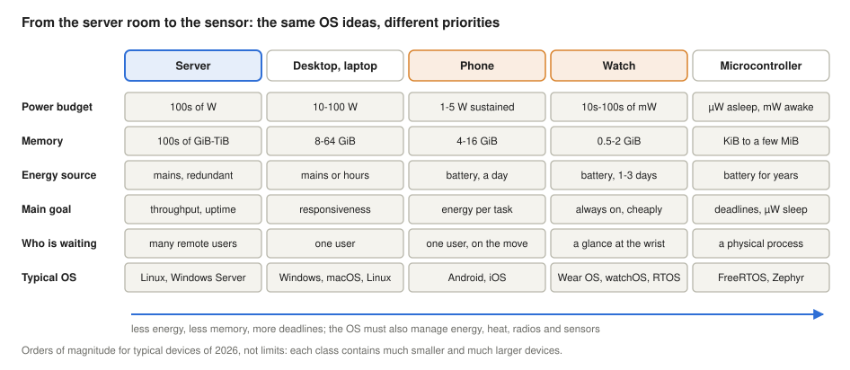
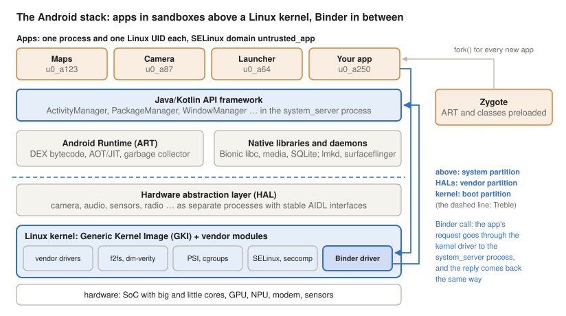
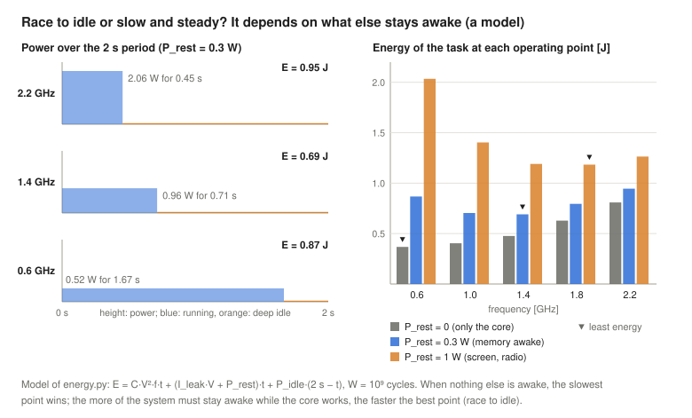
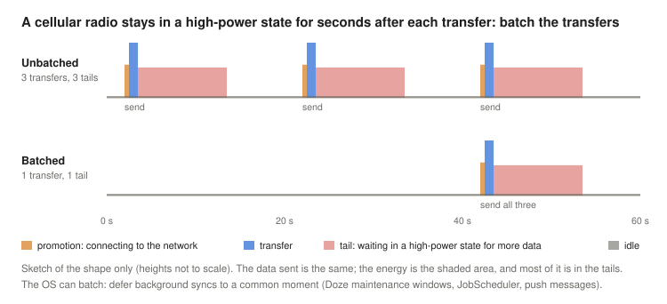
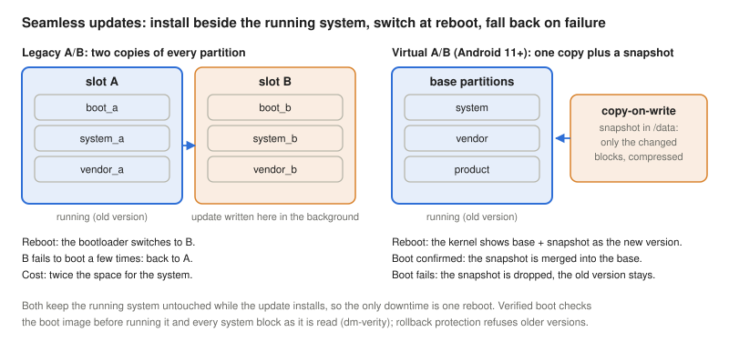
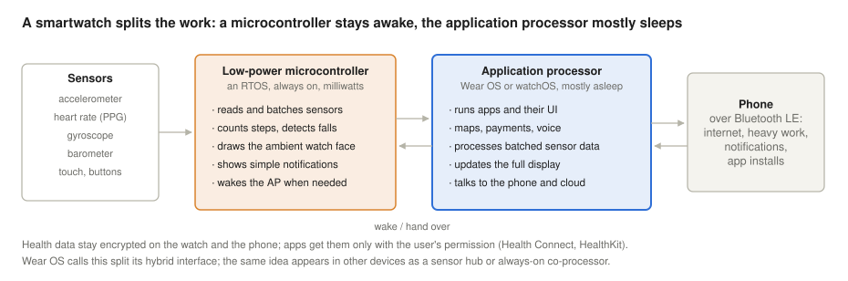
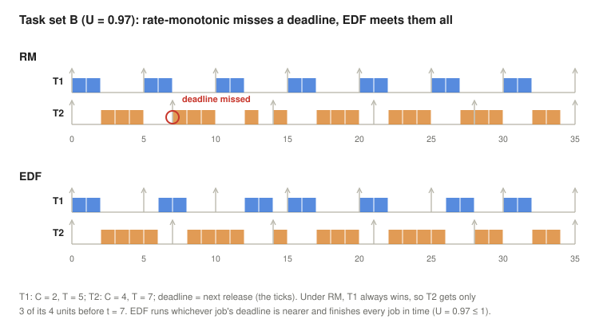

# Mobile, Wearable and Embedded Operating Systems

*Operating Systems lecture: what changes when the computer runs on a battery, fits in a pocket, on a wrist or in a sensor: energy, heat, memory and radios as resources; Android (Linux with GKI, Binder, HALs and Treble, ART and Zygote, the app sandbox, process importance, lmkd, zram, Doze) and iOS (XNU, code signing, sandbox and entitlements, jetsam, the Secure Enclave); DVFS, idle states, race to idle, heterogeneous cores and energy-aware scheduling, wakeups and radio tails; flash file systems, file-based encryption, verified boot and A/B updates; wearables with two processors; microcontrollers, real-time scheduling (rate-monotonic, EDF, priority inheritance), RTOSs, sensor networks, embedded Linux, cars and headsets; on-device AI, Rust and verified kernels, all with measurements on Linux*

## Learning objectives

Most computers in the world are not servers or desktops. They are phones, watches, earbuds, cars, washing machines and sensors, and each of them runs an operating system, or at least the parts of one that it needs. The [first lecture](../01-historic-evolution/#xiv-small-and-portable) ended its history with "small and portable" devices, whose new constraint was the battery. This lecture follows that thread. The ideas are the ones of the whole course: processes and their states, scheduling ([lecture 7](../07-concurrency-deadlocks-scheduling/)), virtual memory and copy-on-write ([lecture 9](../09-virtual-memory/)), flash storage ([lecture 10](../10-file-systems/)), mandatory access control ([lecture 11](../11-access-control/)), cgroups and images ([lecture 13](../13-virtualization-containerization/)). What changes is the weighting: on a battery-powered device, energy per task and responsiveness count for more than throughput, and on a microcontroller a missed deadline can be a failure.

By the end, students will be able to:

- explain why mobile, wearable and embedded devices need different operating-system priorities (energy, heat, memory, connectivity, sensors, always-on operation, privacy, long update life) and compare the design goals of five device classes;
- describe the Android stack: the Linux kernel with GKI, Binder, HALs and Treble, ART and Zygote (fork and copy-on-write), the app sandbox (one UID per app, SELinux, seccomp, runtime permissions), and explain how app life cycle, process importance, `oom_score_adj`, lmkd with PSI and zram replace swapping;
- explain Doze and App Standby buckets and why mobile systems limit background work;
- describe iOS and iPadOS: the XNU hybrid kernel, mandatory code signing, sandbox profiles and entitlements, jetsam, the background execution model and the Secure Enclave, and compare them with Android;
- compute dynamic power with $P = C \cdot V^2 \cdot f$, explain DVFS, idle states, race to idle versus slow and steady, heterogeneous cores and energy-aware scheduling, wakelocks and radio tail energy, and thermal throttling;
- explain f2fs, file-based encryption, verified boot (dm-verity), A/B and virtual A/B updates, Mainline modules and the long-term kernel support problem;
- explain how wearables divide work between a microcontroller, an application processor and a phone;
- distinguish hard and soft real-time systems, test task sets for rate-monotonic and EDF scheduling (Liu and Layland bound, response-time analysis), explain priority inheritance, and name the main RTOSs, sensor-network systems and embedded Linux tools;
- describe current trends: NPUs and on-device AI, Rust in kernels, verified microkernels, Fuchsia and HarmonyOS, and the convergence of device classes;
- measure on Linux what lmkd, zram, real-time priorities and schedulability tests do, and inspect an Android device with `adb`.

<details>
<summary><b>Explained simply:</b> mobile, wearable, embedded, battery, energy, power, microcontroller, real-time</summary>

- **Mobile device:** a computer you carry: a phone or a tablet.
- **Wearable:** a computer you wear on your body, such as a smartwatch, a fitness band or a headset.
- **Embedded system:** a computer built into another device to control it, such as the controller of a washing machine, a car's brakes or a thermostat. Its users often do not know it is there.
- **Battery:** a store of energy. When it is empty, the device stops, however fast its processor is.
- **Energy, power:** energy is the amount of work that can be done (measured in joules or watt-hours); power is how fast energy is used (watts). A 1-watt lamp uses 1 joule every second. A battery holds energy; a processor draws power.
- **Microcontroller (MCU):** a tiny, cheap computer on one chip, with its processor, a little memory and input/output pins, made to control one device.
- **Real-time:** a system is real-time when a correct answer that comes too late is wrong. An airbag that opens one second late has failed.

</details>

## Why small devices need different operating systems

### Constraints the server never had

A server sits in an air-conditioned room, plugged into the mains, with hundreds of gigabytes of memory and a fast network that never goes away. A phone has none of this:

- **Energy.** A phone battery stores roughly 15 to 20 watt-hours, enough for one day of use. Every component the OS leaves switched on (a processor core, the radio, the screen, a sensor) shortens that day. Energy, not CPU time, is the scarcest resource.
- **Heat.** There is no fan. A phone can sustain only a few watts before its surface becomes uncomfortably hot, so the processor may run at full speed only in short bursts; the OS must then slow it down (thermal throttling, below).
- **Memory.** A phone has a few gigabytes of RAM, more than a 2010 server, but it runs dozens of apps and keeps them ready to resume instantly. As the next sections show, it has no swap partition on its flash storage, so when memory runs out, processes are killed.
- **Intermittent connectivity.** The network comes and goes (tunnels, lifts, roaming between Wi-Fi and mobile data), and each use of the radio costs much energy. Applications must work offline and synchronise later.
- **Sensors and always-on operation.** Accelerometers, gyroscopes, GPS, microphones, heart-rate sensors produce data continuously; the device must react to a wake word, a fall or a notification while it seems to be asleep.
- **Privacy and security.** A phone holds its owner's location history, messages, photos, health data and payment keys, and it runs code from thousands of developers who do not trust each other. Every app must be isolated from the others and from the system.
- **Long update life.** Devices stay in use for many years, so the OS must be updated safely over the air, and the vendor must support its kernel long after the hardware design is finished.

### From throughput to energy per task

The operating systems of the earlier lectures optimised **throughput** (jobs per hour on a mainframe) and later **responsiveness** (time sharing, desktops). Battery-powered devices add a third measure, **energy per task**: how many joules it costs to load a web page, take a photo or count steps for a day. The OS must deliver responsiveness when the user is looking and spend almost nothing when nobody is. Further down, devices have even less memory and energy, and the main concern becomes meeting **deadlines** with predictable timing.



The [classification of the first lecture](../01-historic-evolution/#classifying-operating-systems) still applies, but the boundaries move: a phone runs a general-purpose, multi-user Linux kernel (each app is a "user"), a smartwatch often runs two operating systems on two processors, and a microcontroller may run an RTOS without any memory protection at all.

<details>
<summary><b>Explained simply:</b> watt-hour, thermal throttling, swap, connectivity, sensor, wake word, over-the-air update, throughput, responsiveness, energy per task, deadline</summary>

- **Watt-hour (Wh):** an amount of energy: one watt used for one hour. A phone battery holds about as much as a 15-watt lamp uses in an hour.
- **Thermal throttling:** slowing the processor down because it is getting too hot, like a runner who must slow down on a hot day.
- **Swap:** space on the disk where the operating system parks memory pages it has no room for in RAM (lecture 9).
- **Connectivity:** being connected to a network. "Intermittent" means it comes and goes.
- **Sensor:** a part that measures something in the world: movement, light, location, sound, heartbeat.
- **Wake word:** a word such as "Hey Google" that makes a sleeping device start listening properly.
- **Over-the-air (OTA) update:** a new version of the system downloaded and installed through the network, without a cable or a shop.
- **Throughput:** how much work is done per hour. **Responsiveness:** how quickly the device reacts when you touch it.
- **Energy per task:** how much of the battery one job (one photo, one web page) uses up.
- **Deadline:** the latest moment by which a job must be finished.

</details>

## Android

Android is the most widely used operating system in the world. It was released in 2008 and is developed by Google as the Android Open Source Project (AOSP); phone makers add their own drivers, apps and user interfaces on top. As of 2026, the current version is Android 17, released for Google's Pixel phones on 16 June 2026 and for other devices in the following months (Chau, 2026), and its kernels come from the `android17-6.18` branch, based on Linux 6.18 (Android Open Source Project [AOSP], n.d.-f).

### The stack



From the top: **apps** are written mostly in Kotlin or Java and run in their own processes; the **API framework** (the activity manager, package manager, window manager and dozens of other services) runs in one large process, `system_server`; apps and services run on the **Android Runtime (ART)** and on native libraries such as Bionic (Android's own C library); below them, **hardware abstraction layers** (HALs) hide each vendor's hardware behind standard interfaces; at the bottom is a **Linux kernel**. Android therefore *is* Linux in the kernel sense, but not in the user-space sense: there is no GNU C library, no X11 or Wayland, no shell users, and the "users" of the kernel are apps (Yaghmour, 2013).

### Binder: the IPC of Android

Almost everything an app does goes through another process: showing a window, reading the location, starting another app, all are requests to services in `system_server` or in HAL processes. Android uses its own IPC mechanism for this, **Binder**, implemented as a kernel driver (`/dev/binder`). A client calls a method on a proxy object; the Binder driver copies the request directly into a buffer mapped into the server's address space (one copy instead of the two of a pipe), wakes a server thread, and carries the reply back. The driver also tells the server the caller's **UID and PID**, which the kernel guarantees, so every service can check permissions against an identity that cannot be forged. Interfaces are described in AIDL (Android Interface Definition Language), from which the proxy and stub code is generated.

### HALs and Treble

Before 2017, a new Android version needed new vendor code (drivers and HALs from the chip maker) for every phone, which is why phones rarely got updates. **Project Treble**, introduced with Android 8.0, put a stable, versioned interface between the Android framework and the vendor implementation: HALs became separate processes talking Binder, the vendor's code moved to its own `vendor` partition, and a test suite (VTS) checks the interface. A phone maker can then update the framework without waiting for new vendor code (Malchev, 2017). The kernel was the next piece to be separated (GKI, under [storage, boot and updates](#storage-boot-and-updates)).

### ART and Zygote

Apps are compiled to DEX bytecode, which **ART** turns into machine code: ahead of time at installation or in idle periods (guided by profiles of the code that is actually used), and just in time for the rest, with a garbage collector for memory. Starting a runtime and loading the framework's thousands of classes takes seconds, far too long for every app launch. Android therefore starts one process at boot, **Zygote**, which initialises ART, preloads the common classes and resources, and then waits. To start an app, the activity manager asks Zygote, which calls `fork()`: the child already has a warm runtime, sets its UID, SELinux domain and seccomp filter, and loads the app's code. Thanks to [copy-on-write](../09-virtual-memory/#copy-on-write), the preloaded pages are shared physically by all apps until one of them writes, which saves both start-up time and memory (Yaghmour, 2013).

<details>
<summary><b>Explained simply:</b> AOSP, app, framework, system_server, ART, Bionic, HAL, Binder, IPC, proxy, AIDL, UID, Treble, VTS, vendor, partition, DEX, bytecode, ahead-of-time and just-in-time compilation, garbage collector, Zygote, fork, copy-on-write</summary>

- **AOSP** (Android Open Source Project): the freely available source code of Android, which phone makers build on.
- **App:** a program on a phone. **Framework:** the large set of ready-made services that apps call (windows, location, notifications).
- **system_server:** the one big process that runs most of Android's system services.
- **ART** (Android Runtime): the part that runs app code and cleans up unused memory. **Bionic:** Android's small C library.
- **HAL** (hardware abstraction layer): a translator between Android and one maker's hardware, so that Android does not need to know which camera chip is inside.
- **IPC** (inter-process communication): ways for two processes to talk. **Binder** is Android's IPC: like an internal post office in the kernel that delivers requests and stamps each one with the sender's identity.
- **Proxy:** a stand-in object in the app that looks like the real service and forwards each call to it.
- **AIDL:** a short description of a service's methods, from which the forwarding code is generated automatically.
- **UID** (user ID): a number that identifies an owner in Linux. Android gives each app its own UID.
- **Treble:** Android's split between Google's part and the hardware maker's part, so that each can be updated separately. **VTS** (Vendor Test Suite): the tests that check that the maker's part keeps to the agreed interface.
- **Vendor:** the company that makes the chip or the phone. **Partition:** a separate section of the storage, like a separate drawer.
- **DEX, bytecode:** the compact, portable form of an app's code, which is not yet machine code for a particular processor.
- **Ahead-of-time (AOT), just-in-time (JIT) compilation:** translating code into machine code before it is needed, or at the moment it is first needed.
- **Garbage collector:** a part of the runtime that finds memory no longer used and frees it automatically.
- **Zygote:** a pre-started, half-ready app process that is copied for every new app, like a pre-heated oven. (A zygote is the first cell of a new living being.)
- **fork:** the system call that makes a copy of a process. **Copy-on-write:** the copy shares the original's memory until one of them changes something (lecture 9).

</details>

### The application sandbox

Android turns the Unix user model around. On a desktop, users are people and programs run with their user's rights; on Android, **every app gets its own Linux UID** at installation (shown as `u0_a123`: app number 123 of user 0), its own private directory under `/data/data/` and its own process. The kernel's ordinary [discretionary access control](../11-access-control/) then keeps apps from reading each other's files. Over the years further layers were added (AOSP, n.d.-b):

- **SELinux** in enforcing mode for the whole system since Android 5.0; since Android 9, each non-privileged app (targeting API level 28 or later) runs in its own SELinux sandbox, in the domain `untrusted_app` with a per-app category, so that even a file an app makes world-readable cannot be read by another app. This is the [type enforcement of lecture 11](../11-access-control/#selinux-labels-and-type-enforcement), with a policy written by Google;
- a **seccomp-bpf** filter on every app since Android 8.0, which forbids system calls that apps have no need for and so shrinks the kernel's attack surface;
- **scoped storage** since Android 10: no direct access to shared folders such as `/sdcard/DCIM`, only to the app's own directories and to files the user picks;
- **runtime permissions** since Android 6.0: dangerous permissions (camera, location, contacts, microphone) are requested at the moment of use, and the user can revoke them later (Android Developers, n.d.-d).

Permissions are checked by the service that owns the resource, using the caller's UID that Binder delivers; a few, such as network access, are enforced in the kernel through group membership.

<details>
<summary><b>Explained simply:</b> sandbox, u0_a123, discretionary access control, SELinux, enforcing, untrusted_app, category, seccomp-bpf, attack surface, scoped storage, runtime permission</summary>

- **Sandbox:** a closed play area. Each app plays in its own, and cannot reach into the others'.
- **u0_a123:** the user name of an app on Android: user 0 (the phone's main owner), app number 123.
- **Discretionary access control:** the ordinary owner/group/others permissions on files (lecture 11).
- **SELinux, enforcing:** a second, stricter set of rules that even the owner of a file cannot change; "enforcing" means violations are blocked, not just reported.
- **untrusted_app:** the SELinux label of ordinary apps. **Category:** an extra label per app, so that two apps with the same type still cannot touch each other's files.
- **seccomp-bpf:** a filter that lists which system calls a process may make; any other call is refused.
- **Attack surface:** all the places where an attacker could try to get in; fewer allowed system calls means fewer doors.
- **Scoped storage:** apps see only their own files and the ones the user hands them, not the whole shared storage.
- **Runtime permission:** the app asks "may I use the camera?" when it needs it, and you can say no or change your mind later.

</details>

### App life cycle and process importance

[Lecture 7](../07-concurrency-deadlocks-scheduling/#the-process-state-space) described process states as the kernel sees them: ready, running, waiting, and the suspended states of medium-term scheduling. Android adds a second state machine on top, the **app life cycle**, managed by the activity manager in `system_server`: an app's activity is *resumed* while it is on screen, *paused* when partly hidden, *stopped* when in the background, and may be *destroyed* at any time after that. The user does not close apps; the system decides. To make that decision, the activity manager ranks every app process by **importance** and writes the result into the kernel file `/proc/PID/oom_score_adj`, a number from −1000 (never kill) to 1000 (kill first) (AOSP, n.d.-i):


The app on screen has 0; an app that is visible but not in front 100; one the user would notice losing, such as a music player, 200; background services 500; the launcher 600; the previous app 700; and **cached** apps, which only keep their state so that they can be shown again quickly, 900 to 999, the most recently used ones at the low end. Since Android 11, cached apps can also be **frozen** with the cgroup v2 freezer (the *cached apps freezer*, switched on by the device configuration): their threads stay in memory but get no CPU time at all, the kernel's version of the *suspended* state (AOSP, n.d.-c).

### No swap, but zram: the low-memory killer

A desktop Linux system that runs out of memory pages out to a swap partition, and if that is not enough, the kernel's OOM killer kills a process. A phone does neither in the usual way. Its storage is flash, whose cells wear out with writes ([lecture 10](../10-file-systems/#solid-state-drives)), and paging to it would cost energy and make the phone [thrash](../09-virtual-memory/#working-sets-and-thrashing). Android therefore uses two other tools:

- **zram**, a compressed block device in RAM used as swap: pages that would be swapped out are compressed (typically to a third or a quarter of their size) and kept in memory. Compressing and decompressing costs CPU time, but much less than a flash write, and no flash wears out (The kernel development community, n.d.-c).
- **lmkd**, the low-memory killer daemon, a user-space process that watches memory pressure and kills whole processes, starting with the highest `oom_score_adj` values, *before* the kernel's OOM killer has to act. Since Android 10 it measures pressure with the kernel's **PSI** (pressure stall information), which reports the share of time in which tasks were stalled waiting for memory; the earlier in-kernel "lowmemorykiller" driver was removed from the upstream kernel in Linux 4.12. Under moderate pressure lmkd kills only cached and similar processes; only under critical pressure does it go up to the perceptible and foreground levels (AOSP, n.d.-g; The kernel development community, n.d.-b).

For the user, a killed cached app is invisible: Android saves the state of each activity (`onSaveInstanceState`) when it is stopped, so that when the user returns, the app is started again from Zygote and restores the screen as it was. Apps must therefore be written to be killed at any moment, which is very different from a desktop program. The demos below show the kill order [with the kernel's OOM killer and with a toy lmkd](#who-is-killed-first), and zram [at work](#compressed-swap-in-ram-zram).

<details>
<summary><b>Explained simply:</b> life cycle, activity, resumed, paused, stopped, destroyed, importance, oom_score_adj, cached app, freezer, OOM killer, thrash, zram, lmkd, daemon, memory pressure, PSI</summary>

- **Life cycle:** the stages an app goes through, like the stages of a butterfly. **Activity:** one screen of an app.
- **Resumed, paused, stopped, destroyed:** on screen and active; partly covered; in the background; removed from memory.
- **Importance:** how much the user would miss an app if it were closed now.
- **oom_score_adj:** a number per process that tells the kernel how willing it should be to kill that process when memory runs out; higher means "kill me first".
- **Cached app:** an app you used earlier and left; it stays in memory only so that it can come back quickly.
- **Freezer:** a kernel feature that stops all threads of a group completely until they are thawed.
- **OOM killer** (out-of-memory killer): the kernel's emergency measure: when no memory can be found, it kills a process.
- **Thrash:** spending all the time moving pages back and forth between memory and storage instead of doing useful work (lecture 9).
- **zram:** a "disk" made of compressed memory. Swapped-out pages are squeezed and kept in RAM, like vacuum-packing clothes to fit more into a wardrobe.
- **lmkd:** Android's low-memory killer daemon. **Daemon:** a background program that provides a service.
- **Memory pressure:** how hard the system has to work to find free memory.
- **PSI** (pressure stall information): a kernel report of how much of the time programs were stuck waiting for memory (or CPU, or I/O).

</details>

### Background limits: Doze and App Standby

An app in the background that wakes the phone every minute to check for news keeps the processor and the radio from ever sleeping. Android has restricted background work step by step (Android Developers, n.d.-a, n.d.-c, n.d.-e):

- **Doze** (since Android 6.0): when the device is unplugged, stationary and has its screen off for a while, the system suspends network access for apps, ignores their wakelocks, defers their alarms and jobs, and stops Wi-Fi scans. Every so often it opens a short **maintenance window** in which all deferred work runs together, and the windows become rarer the longer the phone lies still. High-priority push messages and alarm-clock alarms still get through.
- **App Standby buckets** (since Android 9): each app is put into a bucket by how recently and how often the user uses it, *active*, *working set*, *frequent*, *rare* or (since Android 12) *restricted*, and the bucket sets its budget. A *frequent* app, for example, may run background jobs for up to 10 minutes in a rolling 12-hour period and set 2 alarms per hour; a *rare* app gets 10 minutes per 24 hours, 1 alarm per hour and no network for its jobs; a *restricted* app, one job and one alarm per day.
- **Background execution limits:** apps may not start background services freely; long work must be scheduled through `JobScheduler` or `WorkManager` (which the system can batch and defer) or shown to the user as a *foreground service* with a notification.

All three express one principle: the OS, not the app, decides when background work runs, so that it can be **batched** into the moments when the device is awake anyway ([energy management](#energy-management) explains why that saves so much).

<details>
<summary><b>Explained simply:</b> background, wakelock, alarm, job, Doze, maintenance window, push message, App Standby bucket, JobScheduler, WorkManager, foreground service, batching</summary>

- **Background:** running while you are not looking at the app.
- **Wakelock:** an app's request "do not let the phone fall asleep yet".
- **Alarm, job:** an alarm wakes an app at a given time; a job is a piece of background work that can run "some time soon".
- **Doze:** the phone's deep-sleep mode when it lies untouched with the screen off.
- **Maintenance window:** a short moment when the dozing phone wakes up and lets all waiting apps do their work at once.
- **Push message:** a message sent from a server through one shared connection that wakes the right app, so that each app does not have to keep asking.
- **App Standby bucket:** a class that an app is sorted into by how much you use it; rarely used apps get less background time.
- **JobScheduler, WorkManager:** the official ways to ask Android "please run this when it suits you".
- **Foreground service:** background work the user is told about with a permanent notification, such as music playback or navigation.
- **Batching:** collecting small jobs and doing them together, like doing all your errands in one trip.

</details>

## iOS and iPadOS

Apple's iPhone (2007) runs iOS; iPadOS (since 2019), watchOS, tvOS and visionOS share the same core. Unlike Android, the whole stack, from the processor to the App Store, comes from one company.

### XNU: a hybrid kernel

The kernel is **XNU**, which is also the kernel of macOS. It is a **hybrid**: the Mach microkernel (tasks, threads, virtual memory, message passing through ports) and a BSD layer (processes, the Unix system calls, the file systems and networking) are compiled into one kernel and run in one address space, with I/O Kit for drivers (Levin, 2019a). The [classification of lecture 1](../01-historic-evolution/#classifying-operating-systems) puts it next to Windows NT for this reason. Mach messages play the role that Binder plays on Android: services run in daemons, and apps reach them through Mach ports (wrapped in the XPC library).

### Code signing, sandbox and entitlements

iOS is stricter than Android in one respect: it runs **only signed code**. Every executable page must carry a valid signature that traces back to Apple; apps from the App Store are signed by Apple after review, and the kernel refuses to map memory as executable without a signature, so an app cannot download and run new machine code (just-in-time compilers are allowed only to processes with a special entitlement, such as Safari's JavaScript engine). Every third-party app runs as the non-privileged user `mobile`, in its own randomly named home directory, inside a **sandbox**, a mandatory access control profile enforced by the kernel's sandbox extension (a MAC framework inherited from TrustedBSD, similar in spirit to SELinux). **Entitlements**, key–value pairs embedded in the signed app, grant individual capabilities beyond the default sandbox, such as access to iCloud, HealthKit or a push-notification service; because they are signed, an app cannot change its own (Apple Inc., 2026; Levin, 2019b).

### Memory: jetsam

iOS has no swap on flash either, but it compresses memory, like zram. When memory is short, the system first sends **low-memory notifications** so that apps can free caches; if that is not enough, the kernel's memory-status mechanism, **jetsam**, terminates processes. A jetsam event report records why: `vm-pageshortage` (memory was needed for the foreground app, so a background process was killed), `per-process-limit` (an app went over the resident-memory limit every app has; extensions have much lower limits), and a few others. Pages are 16 KiB on current Apple devices (Apple Inc., n.d.-b). The principle is the same as lmkd's: a priority order of processes, and the least important ones go first.

### Background execution

An iOS app that leaves the screen is normally **suspended** within seconds: it stays in memory but gets no CPU time at all, much like Android's frozen cached apps. Only a few kinds of work may continue: audio playback, navigation, VoIP calls, short tasks to finish what the user started, and work scheduled through the **BackgroundTasks** framework (since iOS 13), in which an app asks for a refresh task or a longer processing task and the *system* decides when to run it, for example while the phone is charging and on Wi-Fi (Apple Inc., n.d.-a). Push notifications are delivered through one shared connection of the system, not by each app's own server connection.

### The Secure Enclave

Apple's chips contain a **Secure Enclave**, a separate processor with its own boot ROM, encrypted memory and operating system (sepOS), isolated from the main processor. It holds the keys of data protection and of Face ID and Touch ID: the main processor can ask it to use a key, but never sees the key itself, so even a fully compromised iOS kernel cannot extract it (Apple Inc., 2026). Android phones have equivalents (a trusted execution environment in the main chip, often with a separate security chip such as Google's Titan M), accessed through the Keystore and KeyMint interfaces.

### Android and iOS compared

| | Android | iOS / iPadOS |
| --- | --- | --- |
| Kernel | Linux (monolithic, modules), GKI | XNU (hybrid: Mach + BSD) |
| Source | AOSP open source; vendors add drivers and apps | kernel open source, the rest proprietary |
| IPC | Binder | Mach messages, XPC |
| App isolation | one UID per app, SELinux `untrusted_app`, seccomp | user `mobile`, sandbox profiles, entitlements |
| Code | DEX bytecode run by ART; native code allowed; sideloading possible (with restrictions) | only Apple-signed native code; no JIT for apps |
| Out of memory | lmkd (PSI, `oom_score_adj`), zram, kernel OOM killer last | low-memory notifications, memory compression, jetsam |
| Background | Doze, App Standby buckets, JobScheduler, foreground services, freezer | suspension, BackgroundTasks, a few background modes |
| Updates | Mainline modules, A/B or virtual A/B OTA, vendor-dependent | whole system from Apple for all supported devices |

<details>
<summary><b>Explained simply:</b> XNU, hybrid kernel, Mach, microkernel, BSD, I/O Kit, port, XPC, code signing, signature, App Store review, entitlement, TrustedBSD, jetsam, suspended, BackgroundTasks, Secure Enclave, sepOS, Face ID, Touch ID, trusted execution environment, Titan M, Keystore, sideloading</summary>

- **XNU:** the kernel of iOS and macOS. **Hybrid kernel:** a kernel designed with microkernel ideas but built as one program for speed.
- **Mach, microkernel:** Mach was a research kernel that does only the basics (tasks, memory, messages) and leaves the rest to separate programs; a microkernel is a kernel built that way.
- **BSD:** a Unix family from the University of California, Berkeley; XNU's Unix part comes from it.
- **I/O Kit:** Apple's framework for writing device drivers.
- **Port, XPC:** a Mach port is a mailbox for messages to a service; XPC is Apple's convenient library on top of it.
- **Code signing, signature:** a digital seal on a program that proves who made it and that nobody changed it. A broken seal means the program will not run.
- **App Store review:** Apple checks each app before publishing it in its store.
- **Entitlement:** a signed permission slip inside the app, such as "this app may use HealthKit".
- **TrustedBSD:** a security extension of FreeBSD on which Apple's sandbox is built.
- **Jetsam:** iOS's low-memory killer. (Jetsam is cargo thrown overboard to lighten a ship.)
- **Suspended:** kept in memory but not allowed to run at all.
- **BackgroundTasks:** the iOS way of asking "please let me do this later, when it suits you".
- **Secure Enclave, sepOS:** a small separate computer inside the chip that guards the secret keys, with its own tiny operating system; like a safe-deposit box whose key never leaves the bank.
- **Face ID, Touch ID:** unlocking with your face or fingerprint.
- **Trusted execution environment, Titan M:** Android's equivalents: a protected area of the main chip, or a separate security chip.
- **Keystore, KeyMint:** the Android service that keeps keys inside this protected hardware.
- **Sideloading:** installing an app from outside the official store.

</details>

## Energy management

### Where the energy goes

A classic measurement of a smartphone, broken down by component, found that in most usage scenarios the largest consumers were the radio (the GSM module) and the display with its backlight, while the processor and memory mattered mainly under heavy computation (Carroll & Heiser, 2010). Since then screens have become OLED (power depends on the image), processors have become far faster, and LTE and 5G radios have added new costs, but the lesson holds: the OS saves energy by managing *all* components, by switching off what is not needed, and above all by keeping the device asleep as much as possible. The OS does this with several mechanisms.

### Dynamic power and DVFS

A CMOS chip uses power in two ways. **Dynamic power** is spent each time transistors switch: every clock cycle charges and discharges capacitances, so

$$P_{dyn} = C \cdot V^2 \cdot f$$

where $C$ is the effective switched capacitance, $V$ the supply voltage and $f$ the clock frequency. **Static power** (leakage) flows as long as the circuit has voltage, whether it switches or not. A circuit can run at a lower frequency with a lower voltage, so modern processors offer a table of **operating performance points** (OPPs), pairs of frequency and voltage, and the OS chooses among them: **dynamic voltage and frequency scaling** (DVFS) (Pering et al., 1998; Weiser et al., 1994).

**A worked example.** A core with $C$ = 0.6 nF runs at 2.2 GHz and 1.1 V:

$$P = 0.6 \cdot 10^{-9} \cdot 1.1^2 \cdot 2.2 \cdot 10^9 \approx 1.60 \text{ W}$$

At 0.6 GHz and 0.6 V the same core needs $0.6 \cdot 10^{-9} \cdot 0.6^2 \cdot 0.6 \cdot 10^9 \approx 0.13$ W: about 12 times less power for a 3.7 times slower clock. The energy of one cycle, $C \cdot V^2$, falls from 0.73 nJ to 0.22 nJ, so a task of $10^9$ cycles needs 0.73 J at full speed and 0.22 J at the slowest point. Because the energy per cycle depends on $V^2$, lowering the voltage is what saves energy; lowering the frequency alone, at the same voltage, only stretches the same energy over a longer time.

On Linux, DVFS is the job of the **cpufreq** subsystem: a *driver* knows the hardware's OPPs, and a *governor* chooses. The current default, **schedutil**, takes its decisions from the scheduler's own estimate of each CPU's utilisation, so frequency follows load within milliseconds.

### Idle states

When there is nothing to run, the scheduler runs the idle task, which puts the core into an **idle state** (C-state on x86, WFI and deeper states on Arm). Deeper states save more: clock gating stops the clock, power gating cuts the voltage of the core altogether (no leakage), and the deepest states also switch off caches and parts of the chip. But a deeper state takes longer to leave (its **exit latency**) and costs energy to enter and leave, so it pays off only if the core stays idle long enough (its **target residency**). The Linux **cpuidle** subsystem chooses the state with a governor (`menu`, `teo`, `ladder`, `haltpoll`) that predicts how long the CPU will be idle, mostly from the next timer event and recent history. Every unnecessary timer interrupt or wakeup therefore costs twice: the work itself, and a shallower idle state.

### Race to idle or slow and steady?

Should a task run at full speed and then sleep (**race to idle**), or as slowly as its deadline allows (**slow and steady**)? The formula suggests slow: the energy per cycle falls with $V^2$. But while the core works, other things stay awake and draw power too: the core's own leakage, the memory and the interconnect, and sometimes the screen and the radio. Running slowly keeps all of them on longer. The model `energy.py` (measured [below](#race-to-idle-modelled), with invented but realistic parameters) computes the energy of one task at each operating point:



If only the core's dynamic power mattered, the slowest point would win; with 0.3 W of the rest of the system awake, a middle frequency, the **critical frequency**, uses the least energy; with 1 W (screen and radio on), a fast point wins. Measurements on real hardware point the same way: on three generations of AMD Opteron servers, as the voltage range shrank, static power grew and idle states improved, the savings from running slower diminished, and on the newest platform DVFS increased the energy even of a highly memory-bound workload, so that race to idle became the better default (Le Sueur & Heiser, 2010).

### Heterogeneous cores and energy-aware scheduling

Phone chips go further: they combine **different kinds of cores**. Arm's big.LITTLE (2011) paired fast, power-hungry "big" cores with slow, efficient "little" ones; DynamIQ (2017) allows different kinds of cores in one cluster, and current phone chips typically have one or two prime cores, several performance cores and several efficiency cores. A little core cannot reach the big core's top speed, but at the speeds it can reach, it needs much less energy per instruction. Scheduling becomes a placement problem: which task on which kind of core, at which frequency?

Linux answers with **Energy Aware Scheduling** (EAS). Each CPU has a *capacity* (1024 for the fastest, less for slower ones), and an **Energy Model** gives the power of each performance domain at each OPP. When a task wakes up, EAS estimates the total energy of placing it on each candidate CPU and picks the cheapest one that still has enough spare capacity; schedutil then sets the frequency. EAS works only on asymmetric systems, needs schedutil, and switches itself off when a CPU becomes **over-utilised** (above 80% of its capacity), because then performance matters more than energy (The kernel development community, n.d.-a). Android adds its own hints: the foreground app's threads are placed in cgroups that may use the big cores, background threads are restricted to the little ones.

### Wakeups, wakelocks and the radio tail

The most expensive thing a sleeping phone can do is wake up. A **wakeup source** (an interrupt from the modem, a timer, a sensor) brings the processor out of suspend; a **wakelock** (on Linux, a wakeup source held by a driver or by the framework on behalf of an app) keeps the system from suspending again. A forgotten wakelock keeps a phone awake all night; this was one of the main reasons for the background limits above.

Radios add their own trap. A cellular modem does not switch off right after a transfer: it first connects (*promotion*), then transfers, then stays in a high-power state for a while in case more data comes (the **tail**), and only then drops back to idle. A study of 4G LTE networks found the tail to be a key part of the radio's energy, and LTE up to 23 times less power-efficient than Wi-Fi (Huang et al., 2012). Three small transfers a few seconds apart cost three tails; batched together, they cost one:



Doze maintenance windows, JobScheduler and push messages all exist to produce the lower picture.

### Heat: thermal throttling

A phone can briefly draw well over 10 W, but its case can dissipate only a few watts without getting hot. Thermal sensors on the chip and in the case feed the kernel's **thermal framework**: when a *thermal zone* crosses a *trip point*, a *cooling device* acts, usually by capping the maximum frequency of the big cores or the GPU, or by limiting charging. The OS then also tells apps (Android's thermal status API) so that a game can lower its resolution before the system does it more crudely. Sustained performance, not peak performance, is what a phone really offers.

<details>
<summary><b>Explained simply:</b> GSM, LTE, 5G, OLED, CMOS, dynamic power, static power, leakage, capacitance, voltage, frequency, operating performance point, DVFS, nJ, cpufreq, governor, schedutil, idle state, C-state, WFI, clock gating, power gating, exit latency, target residency, cpuidle, race to idle, critical frequency, big.LITTLE, DynamIQ, capacity, EAS, Energy Model, over-utilised, wakeup source, suspend, wakelock, promotion, tail, thermal zone, trip point, cooling device</summary>

- **GSM, LTE, 5G:** generations of mobile-phone networks (2G, 4G and 5G).
- **OLED:** a screen whose pixels make their own light, so dark pixels use almost no power.
- **CMOS:** the transistor technology of almost all chips.
- **Dynamic power, static power, leakage:** the power used by switching, and the power that "leaks" through the transistors just because the chip is switched on, like a tap that drips.
- **Capacitance:** how much electric charge a wire or transistor stores; charging it at every tick costs energy.
- **Voltage, frequency:** the electrical "pressure" the chip runs at, and how many ticks its clock makes per second.
- **Operating performance point (OPP):** one allowed pair of speed and voltage.
- **DVFS:** changing the processor's speed and voltage on the fly, like changing gears in a car.
- **nJ** (nanojoule): a billionth of a joule.
- **cpufreq, governor, schedutil:** the Linux part that changes the CPU speed; the governor is the rule it follows; schedutil is the rule that follows the scheduler's view of the load.
- **Idle state, C-state, WFI:** sleep levels of a processor core; WFI ("wait for interrupt") is the basic Arm instruction for napping.
- **Clock gating, power gating:** stopping the clock of an idle part (it stops working), or cutting its power completely (it also stops leaking).
- **Exit latency, target residency:** how long it takes to wake up from a sleep level, and how long you must sleep for that level to be worth it; a short nap is not worth changing into pyjamas.
- **cpuidle:** the Linux part that chooses the sleep level.
- **Race to idle:** finish quickly, then sleep deeply. **Critical frequency:** the speed at which a task uses the least energy.
- **big.LITTLE, DynamIQ:** Arm designs that combine fast and efficient cores in one chip, like a car with a strong engine for overtaking and an electric motor for town.
- **Capacity:** how much work a CPU can do compared with the fastest one (1024).
- **EAS** (Energy Aware Scheduling), **Energy Model:** the Linux scheduler's mode that puts each task where it costs the least energy, using a table of how much power each core uses at each speed.
- **Over-utilised:** so busy that saving energy must wait.
- **Wakeup source, suspend:** something that can wake the sleeping system; suspend is the deep sleep of the whole system.
- **Promotion, tail:** the radio's start-up before sending, and the time it stays awake afterwards just in case.
- **Thermal zone, trip point, cooling device:** a measured temperature area; a temperature at which the system must act; and the thing that acts (for example, a speed limit for the CPU).

</details>

## Storage, boot and updates

### Flash file systems: f2fs

Phones store data in eMMC or UFS flash, with the [flash translation layer of lecture 10](../10-file-systems/#solid-state-drives) inside. **f2fs** (flash-friendly file system), developed by Samsung and in the Linux kernel since 3.8 (2013), is designed for it: it writes in a log-structured way (new data goes to fresh segments instead of overwriting in place), separates hot and cold data so that the FTL's garbage collection has less to copy, and keeps its metadata in a layout that suits flash. Many Android phones use f2fs for the `/data` partition, while the read-only system partitions use ext4 or EROFS.

### File-based encryption

Since Android 10, new devices must use **file-based encryption** (FBE), introduced in Android 7.0; the older full-disk encryption is not allowed on new devices. With FBE, different files are encrypted with different keys that can be unlocked independently: **device-encrypted** storage is available as soon as the device boots, **credential-encrypted** storage only after the user enters the PIN or password. This makes **Direct Boot** possible: after a reboot, alarms, calls and accessibility services work on the lock screen while the user's private data remain encrypted. **Metadata encryption** (since Android 9) also hides file sizes, permissions and timestamps (AOSP, n.d.-d). The keys are protected by the hardware-backed KeyMint (and on iPhones by the Secure Enclave).

### Verified boot

A phone must not boot a modified system. **Verified boot** builds a chain of trust from a key in the hardware: the boot ROM checks the bootloader, the bootloader checks the boot image (the kernel), and the large system partitions are checked block by block as they are read, by the kernel's **dm-verity**, which compares each block's hash with a hash tree whose root is signed. **Android Verified Boot** (AVB, since Android 8.0) also provides **rollback protection**: a device refuses to boot an older, signed but vulnerable version (AOSP, n.d.-j). The system partitions are read-only and identical on every device of a model, which is exactly the idea of [image mode in lecture 2](../02-quality-and-enterprise-linux/#image-mode-the-whole-operating-system-as-an-image) and of the immutable [container images of lecture 13](../13-virtualization-containerization/#image-container-volume).

### A/B and virtual A/B updates

Updating a running system in place is risky: if the power fails halfway, the phone does not boot. **A/B (seamless) updates** keep two copies, *slots*, of every system partition. The update is written to the inactive slot in the background while the user keeps using the phone; at the next reboot the bootloader switches slots; and if the new slot fails to boot several times, it falls back to the old one (AOSP, n.d.-a). The price is double the space. **Virtual A/B**, required for devices launching with Android 11 or later with Google services, keeps only one copy of the dynamic partitions: the update is written as a compressed **copy-on-write snapshot** into free space of `/data`; after the reboot, the kernel presents base plus snapshot as the new system, and only after a successful boot is the snapshot **merged** into the base. Compression made the snapshot of a full update about 45% smaller (AOSP, n.d.-k).



### Mainline, APEX and GKI: the long-term support problem

A phone's software comes from a chain of companies: the upstream Linux kernel, Google's Android Common Kernel, the chip maker's kernel, the phone maker's kernel. Before 2020, up to half of a device's kernel code was out-of-tree, and a fix in a Linux long-term release could take up to 18 months to reach a device, if ever (AOSP, n.d.-e). Two projects attack this from both ends:

- **Project Mainline** (Android 10): system components are packaged as modules that Google updates directly through the Play Store, without a full OTA: some as APKs, others as **APEX** containers (a signed file-system image that is mounted at boot), such as the DNS resolver, the TLS library Conscrypt, the media codecs, and since Android 12 ART itself (AOSP, n.d.-h).
- **GKI** (Generic Kernel Image): since Android 12, devices with kernel 5.10 or later must ship Google's generic kernel binary for their architecture and Linux version, with all chip- and board-specific code in loadable **vendor modules**. A stable **kernel module interface** (KMI) within each branch lets the kernel be updated without rebuilding the vendor modules (AOSP, n.d.-e). Current branches range from `android12-5.10` to `android17-6.18` (AOSP, n.d.-f).

This is the [backporting and long-term support problem of lecture 2](../02-quality-and-enterprise-linux/#the-vocabulary-of-code-lines) in its hardest form: millions of devices, dozens of vendors, and hardware that its maker stops supporting long before the device stops working.

<details>
<summary><b>Explained simply:</b> eMMC, UFS, f2fs, log-structured, hot and cold data, EROFS, file-based encryption, device-encrypted, credential-encrypted, Direct Boot, metadata encryption, KeyMint, verified boot, chain of trust, boot ROM, bootloader, dm-verity, hash tree, rollback protection, slot, seamless update, snapshot, merge, Mainline, APK, APEX, Conscrypt, GKI, vendor module, KMI, out-of-tree</summary>

- **eMMC, UFS:** the kinds of flash chips used in phones; UFS is the faster, newer one.
- **f2fs:** a Linux file system designed for flash memory. **Log-structured:** always writing new data to the next free place, like writing in a notebook without erasing.
- **Hot and cold data:** data that changes often and data that rarely changes; keeping them apart makes cleaning up the flash cheaper.
- **EROFS:** a compact, read-only Linux file system for system partitions.
- **File-based encryption:** every file is locked separately, so some can be opened before you unlock the phone and others only after.
- **Device-encrypted, credential-encrypted:** files available right after start-up, and files that need your PIN first.
- **Direct Boot:** the phone works on the lock screen (alarm, calls) before you unlock it.
- **Metadata encryption:** hiding the information about files (names, sizes, dates), not only their contents.
- **KeyMint:** Android's hardware-protected key safe.
- **Verified boot, chain of trust:** each part of the start-up checks the signature of the next before handing over, like a relay where each runner checks the next runner's badge.
- **Boot ROM, bootloader:** the unchangeable first program in the chip, and the small program that loads the operating system.
- **dm-verity, hash tree:** a kernel feature that checks every block read from the system partition against a tree of fingerprints whose top is signed.
- **Rollback protection:** refusing to go back to an older version that has known holes.
- **Slot, seamless update:** one complete copy of the system; installing into the spare copy while you keep using the phone.
- **Snapshot, merge:** a record of only the changes, later folded into the original.
- **Mainline, APK, APEX:** Google's way of updating parts of Android through the Play Store; APK is the app package format, APEX a package for low-level system parts.
- **Conscrypt:** the library that encrypts Android's network connections (TLS, the "s" in https).
- **GKI, vendor module, KMI:** one common kernel for all phones, plus loadable pieces from each chip maker, connected through an interface that does not change.
- **Out-of-tree:** code that is not part of the official Linux source, kept separately by a company.

</details>

## Wearables

A smartwatch is a phone's constraints squeezed further: a battery of about 1 Wh or less, a screen that should always show the time, sensors that run day and night, and a radio link to the phone. Google's Wear OS is based on Android; Apple's watchOS on iOS. Both run apps on an application processor, but that processor is far too power-hungry to stay awake all day.

The answer is to divide the work between **two processors**. A low-power **microcontroller**, running a small RTOS, stays awake: it reads and batches the sensors, counts steps, detects falls, draws a simple watch face and shows routine notifications. The **application processor**, running Wear OS or watchOS, sleeps most of the time and wakes for apps, maps, payments and the full user interface. Wear OS calls this its **hybrid interface**, introduced with the OnePlus Watch 2 (2024): notifications bridged from the phone can be read and dismissed while the application processor sleeps, and sensor data are batched on the microcontroller and handed to apps periodically; OnePlus claimed up to 100 hours of regular use (Shumelchyk, 2024). Watch faces declared in the XML-based Watch Face Format, rather than drawn by app code, are data that the platform can also render on the microcontroller of newer watches.



The **always-on display** shows the same trade-off in hardware. Apple Watch Series 5 (2019) introduced an always-on screen made possible by an LTPO display, a power-management chip and an ambient light sensor (Apple Inc., 2019); the display can lower its refresh rate from 60 Hz to 1 Hz when the watch is not in active use (Purdy, 2019). The OS switches to an **ambient mode** with a dimmed, simplified face updated once a minute or so, and apps must follow the same rules.

Much work moves to the **phone** (and from there to the cloud): the watch talks to it over Bluetooth Low Energy, receives notifications through it, and leaves heavy computation to it. Health data are especially sensitive: heart rhythm, sleep, blood oxygen, cycles. Both platforms keep them in a protected store (HealthKit on Apple devices, Health Connect on Android) and hand them to apps only with the user's explicit, per-type permission; on Apple devices they are encrypted with the data-protection keys of the Secure Enclave (Apple Inc., 2026).

<details>
<summary><b>Explained simply:</b> Wear OS, watchOS, application processor, RTOS, batching sensors, hybrid interface, bridged notification, Watch Face Format, always-on display, LTPO, refresh rate, ambient mode, Bluetooth Low Energy, HealthKit, Health Connect</summary>

- **Wear OS, watchOS:** the smartwatch operating systems of Google and Apple.
- **Application processor:** the watch's "big" processor that runs apps; it is fast but uses much power.
- **RTOS** (real-time operating system): a small operating system for microcontrollers that reacts on time (explained below).
- **Batching sensors:** collecting many measurements and passing them on in one go instead of one by one.
- **Hybrid interface:** Wear OS's way of sharing the work between the small and the big processor.
- **Bridged notification:** a phone notification that is copied to the watch.
- **Watch Face Format:** a description of a watch face as data ("put the hour hand here") instead of a program, so that the small processor can draw it.
- **Always-on display, LTPO, refresh rate:** a screen that never goes fully dark; LTPO is a display technology that can redraw the picture very rarely; the refresh rate is how many times per second the picture is redrawn.
- **Ambient mode:** the dim, simple look of a watch when you are not looking at it.
- **Bluetooth Low Energy (BLE):** a short-range radio made to use very little power.
- **HealthKit, Health Connect:** the protected health-data stores of iPhone and Android.

</details>

## Embedded and IoT systems

### Microcontrollers: memory protection without virtual memory

At the bottom of the scale, a microcontroller such as an Arm Cortex-M has tens to hundreds of kilobytes of RAM, flash for its program, and no MMU: there is no [virtual memory](../09-virtual-memory/), no paging and no separate address space per process. Programs and the OS are linked into one image that runs in one physical address space. Many Cortex-M chips have a **memory protection unit** (MPU) instead: a handful of regions (8 or 16) with access rights, enough to keep a task from writing into another task's stack or the kernel's data, and to mark RAM as non-executable, but without address translation. A fault in a task without MPU protection can corrupt everything, which is why safety-critical systems use it.

### Hard and soft real time

A **real-time system** must produce its results within a **deadline**. In a **hard** real-time system a missed deadline is a failure (an airbag controller, an engine's fuel injection, a pacemaker); in a **soft** one it reduces quality (a video frame shown late, a dropped audio sample); in between, a **firm** deadline makes a late result useless but not harmful. What matters is not average speed but the **worst case**: a real-time OS must make every source of delay bounded and predictable: [interrupt latency](../05-interrupts/#interrupt-latency), the time interrupts are disabled, the length of critical sections, the scheduler's own overhead. Most real-time work is **periodic**: a control loop reads its sensors and sets its outputs every 1 ms, 10 ms or 100 ms.

### Rate-monotonic and EDF scheduling

Liu and Layland (1973) analysed the basic model: $n$ independent periodic tasks, task $i$ with worst-case execution time $C_i$ and period $T_i$, whose deadline is the end of its period, on one processor with preemption. The **utilisation** is

$$U = \sum_{i=1}^{n} \frac{C_i}{T_i}$$

No scheduler can meet all deadlines if $U > 1$. Two algorithms are classic.

**Rate-monotonic (RM)** scheduling uses fixed priorities: the shorter the period, the higher the priority. It is the optimal fixed-priority algorithm for this model, and it is guaranteed to meet all deadlines if

$$U \le n(2^{1/n} - 1)$$

The bound is 0.828 for two tasks and 0.780 for three, and falls towards $\ln 2 \approx 0.693$ for many. It is **sufficient but not necessary**: a task set above it may still be schedulable, which the exact **response-time analysis** decides. The worst-case response time $R_i$ of task $i$ is the smallest solution of

$$R_i = C_i + \sum_{j \in hp(i)} \left\lceil \frac{R_i}{T_j} \right\rceil \cdot C_j$$

where $hp(i)$ are the tasks with higher priority: task $i$'s own work plus every job of a higher-priority task released while it waits. It is computed by iteration from $R_i = C_i$; the task set is schedulable if $R_i \le T_i$ for every task.

**Earliest deadline first (EDF)** uses dynamic priorities: it always runs the job whose absolute deadline is nearest. EDF is optimal on one processor: for this model it meets all deadlines **if and only if** $U \le 1$.

The simulator `rtsim.py` ([below](#rate-monotonic-and-edf-simulated)) shows the difference on the task set $T_1$ = (2, 5), $T_2$ = (4, 7), with $U$ = 0.97:



Fixed priorities remain popular despite EDF's better bound: they are simpler, supported by every RTOS and by POSIX (`SCHED_FIFO`), and when the system is overloaded they fail predictably (the lowest-priority tasks miss their deadlines), whereas EDF under overload can make every task late. Linux offers both: `SCHED_FIFO` and `SCHED_RR` with fixed priorities, and `SCHED_DEADLINE`, an EDF scheduler with bandwidth reservation ([lecture 7](../07-concurrency-deadlocks-scheduling/#linux-scheduling)).

### Priority inversion and inheritance

Fixed-priority scheduling breaks down when tasks share resources. If a low-priority task holds a mutex that a high-priority task needs, and medium-priority tasks keep preempting the low one, the high-priority task waits for the medium ones: **priority inversion**, with no bound on the delay. It reset the Mars Pathfinder lander in 1997, as told in [lecture 7](../07-concurrency-deadlocks-scheduling/#relatives-of-deadlock). The cure is **priority inheritance**: while a task holds a lock that a higher-priority task waits for, it runs at that higher priority; the **priority ceiling protocol** goes further and also prevents deadlock and chains of blocking (Sha et al., 1990). RTOS mutexes implement inheritance, by default or as an option (FreeRTOS and Zephyr mutexes always do; ThreadX and VxWorks offer it as a flag); on Linux, `PTHREAD_PRIO_INHERIT` mutexes use priority-inheritance futexes.

### Real-time operating systems

An **RTOS** is a small kernel that provides tasks (threads), priority-based preemptive scheduling, a periodic tick or a tickless timer, semaphores, mutexes with priority inheritance, message queues and timers, with bounded execution times for all of them. Its kernel is often a few kilobytes of code, linked into the application. Three widely used open-source examples, as of 2026:

- **FreeRTOS**, created by Richard Barry in 2003, under the stewardship of Amazon Web Services since 2017, when its licence changed to MIT (Straughan, 2017);
- **Zephyr**, a Linux Foundation project with a Linux-like build and configuration system, device tree and drivers for hundreds of boards, released every six months (4.4 in April 2026) with long-term-support versions (Zephyr Project, n.d.);
- **Eclipse ThreadX**, formerly Microsoft's Azure RTOS, handed to the Eclipse Foundation and made available under the MIT licence, with safety certifications such as IEC 61508 (Eclipse Foundation, 2024).

Commercial RTOSs such as QNX (a microkernel), VxWorks and INTEGRITY dominate where certification for safety (cars, aircraft, medical devices) is required.

### Sensor networks: TinyOS and Contiki

A **wireless sensor network** consists of many tiny, battery-powered nodes (a few kilobytes of RAM, a low-power radio) that measure something (temperature, vibration, soil moisture) and pass the data hop by hop to a base station, for years on one battery. Two research operating systems shaped the field. **TinyOS** (Hill et al., 2000) has no threads at all: a program is a set of components wired together, which react to *events* (an interrupt, a received packet) and post short *tasks* that run to completion one after the other, so that a single stack suffices. **Contiki** (Dunkels et al., 2004) kept an event-driven kernel but added dynamic loading of program modules over the radio and optional threads, and came with a tiny TCP/IP stack (uIP); later versions added *protothreads*, which let event-driven code be written like sequential threads at the cost of two bytes per thread. The radio and the processor of such a node typically spend more than 99% of their time asleep; the OS's main job is to make that possible. Their ideas live on in Contiki-NG, RIOT and Zephyr, and in the IPv6-based protocols of today's Internet of Things (6LoWPAN, Thread).

### Embedded Linux and PREEMPT_RT

Where a device has an MMU and some tens of megabytes of RAM (routers, TVs, industrial controllers, cars' infotainment), it usually runs **embedded Linux**. Its distribution is built specifically for the device, typically with the **Yocto Project** or Buildroot: they cross-compile the kernel, a minimal user space (often BusyBox and musl or glibc) and the application into a firmware image, often with the A/B update scheme above. For real-time work, the **PREEMPT_RT** patches, developed outside the mainline kernel for about two decades, make almost all of the kernel preemptible (spinlocks become sleeping, priority-inheriting locks; interrupt handlers run as threads with priorities). They were merged into mainline Linux 6.12 (released on 17 November 2024), initially for x86, Arm64 and RISC-V (Kernelnewbies, 2024; Larabel, 2024). A real-time kernel does not make Linux fast; it makes its worst-case latency bounded, typically to tens of microseconds on suitable hardware.

### Cars and headsets

A modern car contains around a hundred electronic control units. Their software follows **AUTOSAR**, a standard of a partnership of carmakers and suppliers formed in 2002–2003 (AUTOSAR, n.d.): the *Classic Platform* for small, statically configured ECUs, with an OSEK-derived RTOS and fixed priorities, and the *Adaptive Platform* (since 2017) for powerful POSIX-based computers that run updatable services. For the dashboard, **Android Automotive** runs Android directly on the car's hardware (unlike Android Auto, which only projects a phone's screen), and is expanding to software-defined vehicles in which headless virtual machines on VirtIO hypervisors run vehicle functions next to the cockpit (AOSP, n.d.-l), the [virtualization of lecture 13](../13-virtualization-containerization/) applied to safety.

Headsets for virtual and augmented reality, such as Apple's Vision Pro (visionOS) and Samsung's Galaxy XR (October 2025), the first device built on Google's Android XR platform (Samsung Electronics, 2025), have the hardest timing requirement of consumer devices: the **motion-to-photon latency**, from a head movement to the updated image on the display, must stay below about 20 ms, or users feel sick (Savage, 2013). The OS schedules the rendering, the tracking and the display as a real-time pipeline, and a compositor at the last moment re-projects the latest image to the newest head position.

<details>
<summary><b>Explained simply:</b> IoT, Cortex-M, MMU, MPU, region, hard, soft and firm real time, worst case, periodic task, execution time, period, utilisation, rate-monotonic, sufficient and necessary, response time, EDF, optimal, SCHED_DEADLINE, priority inversion, priority inheritance, priority ceiling, mutex, futex, RTOS, tick, tickless, FreeRTOS, Zephyr, ThreadX, QNX, VxWorks, certification, sensor network, node, TinyOS, Contiki, protothread, uIP, 6LoWPAN, embedded Linux, Yocto, Buildroot, cross-compile, BusyBox, musl, PREEMPT_RT, ECU, AUTOSAR, OSEK, Android Automotive, software-defined vehicle, headless virtual machine, VirtIO, XR, motion-to-photon latency, compositor</summary>

- **IoT** (Internet of Things): everyday devices connected to the internet: thermostats, lights, sensors.
- **Cortex-M:** Arm's family of microcontroller processors.
- **MMU, MPU:** the MMU translates addresses and gives each program its own memory map (lecture 9); the simpler MPU only guards a few memory areas, like a fence without a map.
- **Region:** one guarded area of memory with its own rules.
- **Hard, soft, firm real time:** late means failure; late means worse; late means useless.
- **Worst case:** the slowest it can ever be, not the usual speed.
- **Periodic task, execution time, period:** a job that repeats regularly; how long one run takes at most; how often it repeats.
- **Utilisation:** the fraction of the processor's time the tasks need together.
- **Rate-monotonic:** "the more often a task runs, the more important it is".
- **Sufficient, necessary:** a sufficient test that says "yes" can be trusted; one that says "no" may be wrong. A necessary and sufficient (exact) test is always right.
- **Response time:** how long after its start a job is finished, including waiting for others.
- **EDF** (earliest deadline first): "always do the job that is due soonest", like a student doing homework in order of due dates.
- **Optimal:** no other method can do better in this model.
- **SCHED_DEADLINE:** Linux's EDF scheduling class.
- **Priority inversion, priority inheritance, priority ceiling:** an important task stuck behind an unimportant one; temporarily promoting the unimportant one; and giving every lock a fixed high priority in advance.
- **Mutex, futex:** a lock that only one task can hold; the Linux mechanism used to build such locks.
- **RTOS, tick, tickless:** a real-time operating system; a regular timer interrupt, and a design that sets the timer only when something is due, to sleep longer.
- **FreeRTOS, Zephyr, ThreadX, QNX, VxWorks:** well-known real-time operating systems.
- **Certification:** an official check, for example for cars or medical devices, that software meets a safety standard.
- **Sensor network, node:** many small measuring devices that pass their data by radio from one to the next; each device is a node.
- **TinyOS, Contiki:** operating systems for such tiny nodes. **Protothread:** a very light way of writing a task as a sequence of steps without a stack of its own. **uIP:** a tiny implementation of the internet protocols (TCP/IP) for such nodes.
- **6LoWPAN, Thread:** ways to use internet addresses (IPv6) over tiny, low-power radios.
- **Embedded Linux, Yocto, Buildroot:** Linux trimmed for a device, and tools that build such a tailored system.
- **Cross-compile:** building programs on a PC for a different processor.
- **BusyBox, musl:** one small program that contains the most common Unix commands, and a small C library.
- **PREEMPT_RT:** the Linux option that makes the kernel interruptible almost everywhere, so that urgent tasks never wait long.
- **ECU** (electronic control unit): one of the many small computers in a car.
- **AUTOSAR, OSEK:** standards for car software; OSEK is an older standard for small car RTOSs.
- **Android Automotive:** Android built into the car itself. **Software-defined vehicle:** a car whose functions are mostly software that can be updated.
- **Headless virtual machine, VirtIO:** a virtual machine without a screen of its own that only does background work; VirtIO is a standard set of simple virtual devices (disk, network) through which such machines talk to the hypervisor (lecture 13).
- **XR** (extended reality): virtual and augmented reality together.
- **Motion-to-photon latency:** the delay between moving your head and seeing the picture move.
- **Compositor:** the part of the system that puts the final picture together just before it is shown.

</details>

## Trends

### On-device AI and NPUs

Phones, watches and laptops now contain a **neural processing unit** (NPU), an accelerator for the matrix arithmetic of neural networks, which runs speech recognition, image processing and small language models locally, faster and at a fraction of the energy of the CPU or GPU, and without sending private data to a server. For the OS, the NPU is a new shared resource with its own memory, power states and queue of jobs from several apps. Android's first answer, the Neural Networks API (NNAPI, Android 8.1), was deprecated in Android 15; instead of a platform API that changes only with each Android release, apps now use an updatable runtime (TensorFlow Lite in Google Play services) with hardware delegates, and system-wide generative models such as Gemini Nano are served by a system service, AICore (Android Developers, n.d.-b). Scheduling, isolating and power-managing accelerators is one of the open questions of current OS design, as the GPU was before it.

### Rust in kernels

Memory-safety bugs (out-of-bounds accesses, use after free) used to be the largest class of vulnerabilities in Android, which is written mostly in C and C++. Android has favoured Rust for new low-level code for several years, and in 2025 memory-safety bugs fell below 20% of its vulnerabilities for the first time; Google measured a memory-safety vulnerability density in its Rust code about a thousand times lower than in its C and C++ (Vander Stoep, 2025). The kernel follows: Rust support entered Linux in 6.1 (2022); Android's 6.12-based kernel was its first with Rust enabled, shipping a Rust driver in production; the Binder driver was rewritten in Rust and merged in Linux 6.18; in December 2025 the kernel maintainers declared Rust in the kernel no longer experimental (Corbet, 2025); and the removal of the old C Binder driver was queued in September 2026 for Linux 7.4 (Larabel, 2026).

### Verified microkernels: seL4

For the highest assurance, testing is not enough. **seL4**, a microkernel of under 10,000 lines of C, was the first general-purpose OS kernel with a machine-checked proof that its implementation matches its formal specification (Klein et al., 2009): it cannot crash, and it cannot violate the isolation its specification promises, as long as the proof's assumptions (the compiler, the hardware, the boot code) hold. seL4 is used in defence and aviation projects and as a foundation for secure embedded systems, often running Linux virtual machines next to trusted components.

### New operating systems: Fuchsia and HarmonyOS

**Fuchsia**, Google's operating system built from scratch on the **Zircon** microkernel (object-capability based, derived from the Little Kernel), replaced the software of Google's first-generation Nest Hub in 2021 and the second generation in 2023; it remains under development, with numbered releases (up to F31 in its release notes, as of 2026), but has not replaced Android (Fuchsia, 2026; Fuchsia Project, n.d.). Huawei's **HarmonyOS** has gone furthest: HarmonyOS NEXT (HarmonyOS 5, released in October 2024) dropped the Android code base and Android app compatibility entirely, runs on Huawei's own HongMeng microkernel, which is compatible with the Linux API and ABI so that Linux drivers and applications can be reused (Chen et al., 2024), and is based on the open-source OpenHarmony project; HarmonyOS 6 followed in 2025 (HarmonyOS 5, 2026).

### Convergence

The boundaries between device classes are blurring. Phone chips power laptops; Android runs on tablets, foldables, cars, TVs, watches and headsets; Apple's operating systems share one kernel and most frameworks; and in September 2025 Google announced that it is building "a common technical foundation" for its PC and smartphone platforms, a step widely expected to bring Android to laptops in place of ChromeOS (Sharma, 2025). Android 15 started supporting 16 KiB memory pages (the size Apple uses), which in Google's tests made app launches under memory pressure 3% faster on average and boots about 8% faster; apps targeting Android 15 or later must support them on Google Play (Android Developers, n.d.-f). One kernel, many form factors, and the OS ideas of this course everywhere.

<details>
<summary><b>Explained simply:</b> NPU, neural network, language model, NNAPI, TensorFlow Lite, delegate, Gemini Nano, AICore, memory safety, Rust, vulnerability density, seL4, formal verification, proof, Fuchsia, Zircon, object capability, HarmonyOS, OpenHarmony, HongMeng, convergence, foldable, 16 KiB pages</summary>

- **NPU** (neural processing unit): a part of the chip specialised for AI calculations, as the GPU is for graphics.
- **Neural network, language model:** a program that learns from examples; a language model is one that works with text.
- **NNAPI, TensorFlow Lite, delegate:** Android's former AI interface; a small AI runtime that apps ship themselves; a delegate hands parts of the work to the GPU or NPU.
- **Gemini Nano, AICore:** Google's small language model that runs on the phone, and the system service that runs it for apps.
- **Memory safety:** a program never reads or writes memory it should not; many security holes in C programs break this.
- **Rust:** a programming language that checks memory safety when the program is compiled.
- **Vulnerability density:** the number of security holes per million lines of code.
- **seL4, formal verification, proof:** a microkernel for which a computer-checked mathematical proof shows that the code does exactly what its specification says.
- **Fuchsia, Zircon:** Google's newer operating system and its microkernel.
- **Object capability:** a design in which a program can use a resource only if it holds an unforgeable token for it.
- **HarmonyOS, OpenHarmony, HongMeng:** Huawei's operating system, its open-source base, and its kernel.
- **Convergence:** different kinds of devices growing together onto the same software.
- **Foldable:** a phone with a screen that folds open into a tablet.
- **16 KiB pages:** bigger memory pages (lecture 9), so the page tables and the TLB cover more memory with fewer entries.

</details>

## The same ideas on Linux (x86-64)

The demos run as root on the Ubuntu 24.04 cloud virtual machine of the previous lectures (Linux 6.18, 2 virtual CPUs, 8 GiB of RAM, gcc 13, Python 3.13, util-linux 2.39). It is not a phone, but its kernel has the mechanisms that Android builds on: memory cgroups, `oom_score_adj`, PSI, zram and real-time scheduling classes. The folder of this lecture contains every script and program; the scripts are run with `bash script.sh` and compile what they need. The machine mounts the cgroup v1 memory controller, as in [lecture 13](../13-virtualization-containerization/#limits-with-cgroups); the scripts use cgroup v2 where it is available. The Android commands at the end need a phone or an emulator and are given without outputs.

<details>
<summary><b>Explained simply:</b> console, root, script, cgroup</summary>

- **Console:** a window where you type commands. Lines starting with `$` are what was typed; the other lines are the computer's answer.
- **Root:** the administrator account, needed here for cgroups, zram and real-time priorities.
- **Script:** a file of commands run one after the other.
- **cgroup:** a Linux group of processes whose memory or CPU use can be limited (lecture 13).

</details>

### What this machine knows about power

`power.sh` looks at the interfaces a phone uses for power management:

```console
$ ls /sys/devices/system/cpu/cpufreq/ | wc -l
0
$ ls /sys/devices/system/cpu/cpu0/cpufreq
ls: cannot access '/sys/devices/system/cpu/cpu0/cpufreq': No such file or directory
$ cat /sys/devices/system/cpu/cpuidle/current_driver /sys/devices/system/cpu/cpuidle/current_governor
none
menu
$ cat /sys/devices/system/cpu/cpuidle/available_governors
ladder menu haltpoll 
$ ls /sys/devices/system/cpu/cpu0/cpuidle
ls: cannot access '/sys/devices/system/cpu/cpu0/cpuidle': No such file or directory
$ ls -A /sys/class/thermal /sys/class/power_supply
/sys/class/power_supply:

/sys/class/thermal:
$ cat /sys/devices/system/cpu/cpu*/cpu_capacity
1024
1024
$ ls /sys/devices/system/cpu/cpu0/topology/
cluster_cpus
cluster_cpus_list
cluster_id
core_cpus
core_cpus_list
core_id
core_siblings
core_siblings_list
die_cpus
die_cpus_list
die_id
package_cpus
package_cpus_list
physical_package_id
thread_siblings
thread_siblings_list
$ cat /proc/self/timerslack_ns; chrt -f 80 cat /proc/self/timerslack_ns
50000
0
$ uname -v
#1 SMP PREEMPT_DYNAMIC @0
```

Honestly: almost nothing. A virtual machine's CPU frequency and sleep states belong to the host, so there is no cpufreq driver and no OPP table, and the cpuidle framework has governors (`menu` selected) but no driver and no idle states: an idle virtual CPU simply executes `HLT`, which exits to the hypervisor. There are no thermal zones and no battery (`power_supply` is empty). Both CPUs report the same capacity, 1024, so the system is symmetric and Energy Aware Scheduling could not work here even if an Energy Model existed. On a phone, the same commands list several cpufreq *policies* (one per cluster) with their available frequencies, cpuidle states with their exit latencies and residencies, capacities such as 1024 for the big cores and a few hundred for the little ones, dozens of thermal zones and a battery ([lab 9](#lab-exercises)).

Two lines are useful even here. Ordinary tasks have a **timer slack** of 50 µs: the kernel may fire their timers up to 50 µs late, so that nearby wakeups can be served together and the CPU can sleep longer, an energy optimisation inherited from laptops and phones; real-time tasks have no slack. And the kernel is built with `PREEMPT_DYNAMIC`, so its preemption model is chosen at boot (on this machine the kernel log reports `PREEMPT(none)`, the throughput-oriented choice for servers); it is not a PREEMPT_RT kernel.

### Who is killed first?

`lmk.sh` creates a 256 MiB memory cgroup and starts five pretend apps in it (`app.py`), each holding 30 MiB and setting its own `oom_score_adj` to an Android-like value: the launcher 0, a music player 200, a sync service 500, and two cached apps, 900 and 950. Then a "game" in the foreground (adjustment 0) starts and grows by 20 MiB every 0.3 s up to 180 MiB. In part 1 the kernel's OOM killer has to deal with the shortage; in part 2 the toy user-space killer `mini_lmkd.py` watches the cgroup's usage and kills by `oom_score_adj` before the kernel must: above 70% of the limit only cached apps (900 or more), above 85% also down to perceptible ones (200 or more), never below 200.

```console
$ cat /proc/pressure/memory
some avg10=0.00 avg60=0.00 avg300=0.00 total=900571
full avg10=0.00 avg60=0.00 avg300=0.00 total=896443
# Part 1: the kernel's OOM killer
launcher     pid   752  oom_score_adj    0  holds 30 MiB
music        pid   754  oom_score_adj  200  holds 30 MiB
sync         pid   756  oom_score_adj  500  holds 30 MiB
browser      pid   758  oom_score_adj  900  holds 30 MiB
gallery      pid   760  oom_score_adj  950  holds 30 MiB
launcher   adj    0  oom_score  669
music      adj  200  oom_score  802
sync       adj  500  oom_score 1002
browser    adj  900  oom_score 1269
gallery    adj  950  oom_score 1302
game         pid   788  oom_score_adj    0  holds 20 MiB
game         grows to 40 MiB
game         grows to 60 MiB
game         grows to 80 MiB
game         grows to 100 MiB
game         grows to 120 MiB
game         grows to 140 MiB
game         grows to 160 MiB
$ dmesg | grep 'Killed process' | sed -E 's/.*(Killed process [0-9]+).*(anon-rss:[0-9]+kB).*(oom_score_adj:-?[0-9]+)/\1 \2 \3/'
Killed process 760 anon-rss:33792kB oom_score_adj:950
Killed process 758 anon-rss:33792kB oom_score_adj:900
Killed process 788 anon-rss:172288kB oom_score_adj:0
# still running:
launcher music sync 
# Part 2: a user-space killer acts first
mini_lmkd: watching /sys/fs/cgroup/memory/lab12, limit 256 MiB
launcher     pid   809  oom_score_adj    0  holds 30 MiB
music        pid   811  oom_score_adj  200  holds 30 MiB
sync         pid   813  oom_score_adj  500  holds 30 MiB
browser      pid   815  oom_score_adj  900  holds 30 MiB
gallery      pid   817  oom_score_adj  950  holds 30 MiB
game         pid   819  oom_score_adj    0  holds 20 MiB
game         grows to 40 MiB
mini_lmkd: usage 75% of limit -> kill gallery (pid 817, adj 950, rss 38 MiB)
game         grows to 60 MiB
mini_lmkd: usage 71% of limit -> kill browser (pid 815, adj 900, rss 38 MiB)
game         grows to 80 MiB
game         grows to 100 MiB
game         grows to 120 MiB
game         grows to 140 MiB
mini_lmkd: usage 90% of limit -> kill sync (pid 813, adj 500, rss 38 MiB)
game         grows to 160 MiB
mini_lmkd: usage 86% of limit -> kill music (pid 811, adj 200, rss 38 MiB)
game         grows to 180 MiB
$ dmesg | grep -c 'Killed process'
0
# still running:
game launcher 
$ cat /proc/pressure/memory
some avg10=0.00 avg60=0.00 avg300=0.00 total=901584
full avg10=0.00 avg60=0.00 avg300=0.00 total=897282
```

The `oom_score` file shows the kernel's ranking, a scaled form of its "badness" (higher means a more likely victim): it grows with the adjustment. In part 1, the kernel's OOM killer first killed the two cached apps, highest adjustment first (gallery, then browser). But at the third shortage it killed the *game*, the app in the foreground, and not the sync service. The kernel's badness is the process's memory (resident pages, swap and page tables) plus the adjustment scaled to the available memory: within this cgroup, adjustment 500 counts as half of 256 MiB, so the sync service scored about 38 + 128 = 166 MiB, while the game, which by then held about 168 MiB of anonymous memory alone (172,288 kB), scored more with adjustment 0. The kernel's OOM killer is a last resort that balances size against importance; it does not know what the user is looking at.

In part 2, `mini_lmkd.py` acted at 70% and 85% of the limit, always on the least important process allowed at that level: gallery, browser, then (when the game pushed usage above 85%) sync and music. The game reached its 180 MiB, the launcher survived, and the kernel's OOM killer never ran (zero `Killed process` lines). This is the point of lmkd: it knows the user's priorities (through `oom_score_adj`), and it acts early, while there is still room to choose. The real lmkd uses PSI instead of a fixed percentage. PSI hardly moved here (its `total` counters, in microseconds of stall since boot, grew by about 1 ms), because nothing could be reclaimed or swapped: memory ran out abruptly. The next demo shows a real stall.

### Compressed swap in RAM: zram

`zram.sh` gives a 128 MiB memory cgroup to `heap.py`, which allocates 200 MiB that looks like an app's heap (each 4 KiB page holds 1 KiB of random bytes and 3 KiB of zeros), reads it all back and checks it. First without swap, then with a zram swap device:

```console
$ cat /proc/pressure/memory
some avg10=0.00 avg60=0.00 avg300=0.00 total=901584
full avg10=0.00 avg60=0.00 avg300=0.00 total=897282
# Part 1: no swap
$ swapon --show; sh -c 'echo $$ > /sys/fs/cgroup/memory/lab12z/cgroup.procs; exec python3 heap.py 200'
heap.py: 50 MiB allocated
heap.py: 100 MiB allocated
zram.sh: line 5:   839 Killed                  sh -c 'echo $$ > /sys/fs/cgroup/memory/lab12z/cgroup.procs; exec python3 heap.py 200'
# Part 2: zram swap
$ cat /sys/block/zram0/comp_algorithm
[lzo-rle] lzo lz4 
$ echo lz4 > /sys/block/zram0/comp_algorithm; echo 512M > /sys/block/zram0/disksize
$ mkswap /dev/zram0 >/dev/null; swapon -p 100 /dev/zram0; swapon --show
NAME       TYPE      SIZE USED PRIO
/dev/zram0 partition 512M   0B  100
$ sh -c 'echo $$ > /sys/fs/cgroup/memory/lab12z/cgroup.procs; exec python3 heap.py 200 3' &
heap.py: 50 MiB allocated
heap.py: 100 MiB allocated
heap.py: 150 MiB allocated
heap.py: 200 MiB allocated
heap.py: all data read back intact: True
$ grep -E '^(rss|swap) ' /sys/fs/cgroup/memory/lab12z/memory.stat
rss 133304320
swap 84676608
$ cat /sys/block/zram0/mm_stat
84615168 22236390 24281088        0 24334336        0        0        0        0
# stored 80 MiB of pages in 23 MiB of RAM: ratio 3.5
$ cat /proc/pressure/memory
some avg10=2.45 avg60=0.48 avg300=0.10 total=1325512
full avg10=2.45 avg60=0.48 avg300=0.10 total=1320790
```

(`swapon --show` printed nothing in part 1: there was no swap.) Without swap, the process was killed somewhere after 100 MiB, as in [lecture 13's cgroup demo](../13-virtualization-containerization/#limits-with-cgroups). With zram, the same program allocated all 200 MiB and read every byte back correctly: the cgroup kept about 127 MiB resident (`rss`, its limit) and about 81 MiB were swapped out (`swap`). The zram statistics (`mm_stat`: original data size, compressed size, memory used in total, …) show that those pages took 81 MiB uncompressed but only 23 MiB of real memory: a compression ratio of 3.5 for this data. The difference was paid in time: the PSI counters show that during this run, tasks were stalled waiting for memory for about 0.42 s in total (the growth of `full total`, in microseconds), 2.45% of the last 10 seconds. That stall time is exactly the signal lmkd watches: a little stall is the price of zram; a lot of it means that it is time to kill. Real app memory compresses less well than zeros and better than random bytes; Android devices typically give zram a size of about half their RAM.

### Timer latency: SCHED_OTHER and SCHED_FIFO

`latency.c` is a periodic task: every 1 ms it sleeps until an absolute deadline with `clock_nanosleep(TIMER_ABSTIME)`, then records how late it woke up. `latency.sh` runs it pinned to CPU 0 for 5000 periods, as an ordinary task (`SCHED_OTHER`) and as a real-time task (`chrt -f 80`: `SCHED_FIFO`, priority 80), first on an idle CPU, then next to two CPU-bound `hog` processes on the same CPU:

```console
# CPU 0 idle
$ taskset -c 0 ./latency 5000
SCHED_OTHER n=5000 period=1000 us  lateness [us]: min 56.6  median 82.8  avg 97.8  p99 253.2  max 2601.7  missed periods 11
$ chrt -f 80 taskset -c 0 ./latency 5000
SCHED_FIFO n=5000 period=1000 us  lateness [us]: min 15.4  median 37.5  avg 129.4  p99 376.2  max 27304.0  missed periods 33
# two CPU hogs on CPU 0
$ taskset -c 0 ./latency 5000
SCHED_OTHER n=5000 period=1000 us  lateness [us]: min 64.3  median 68.0  avg 162.1  p99 3166.3  max 8099.5  missed periods 155
$ chrt -f 80 taskset -c 0 ./latency 5000
SCHED_FIFO n=5000 period=1000 us  lateness [us]: min 12.3  median 17.9  avg 35.4  p99 573.8  max 2686.5  missed periods 24
```

("missed periods" counts wakeups more than one whole period late.) Three effects are visible:

- **Timer slack.** As `SCHED_OTHER`, the task woke at best about 55 to 65 µs late; as `SCHED_FIFO`, 12 to 15 µs late. The difference is mostly the 50 µs timer slack shown above, which real-time tasks do not get. (The slack is an allowance, not a fixed delay: if the CPU happens to wake up earlier for another reason, the timer is served then, so in an occasional run under load the `SCHED_OTHER` minimum was lower.)
- **Competition.** Next to the two hogs, the ordinary task usually still woke up quickly (median 68 µs: the fair scheduler lets a task that slept run soon), but in 1% of the periods it waited more than 3 ms, and 155 times it lost a whole period: sometimes it had to wait for a hog's time slice to end. The real-time task preempts the hogs at once: median 18 µs and a p99 more than five times smaller.
- **The machine itself.** The maximum values (2.6 to 27 ms) and the missed periods even of the real-time task do not come from this kernel's scheduler but from the layer below: this is a virtual machine, whose virtual CPU the host can stop at any time, and an idle virtual CPU halts and must be woken by the hypervisor (which is also why the idle case is slower than the loaded one for `SCHED_FIFO`: on the loaded CPU the vCPU is already running). Across four runs the medians were stable (`SCHED_FIFO` under load 18 to 19 µs; `SCHED_OTHER` under load 68 to 69 µs), while the maxima varied between 2 and 37 ms.

A priority makes a task's *typical* latency short and independent of the load; it does not by itself make the *worst case* bounded. For that the whole stack must be real-time: a PREEMPT_RT kernel, no virtualization layer (or a real-time hypervisor), CPU isolation, and no deep idle states that take long to leave. On such a system, the same measurement (usually done with `cyclictest` from the rt-tests package) gives maxima of tens of microseconds ([lab 7](#lab-exercises)).

### Rate-monotonic and EDF, simulated

`rtsim.py` checks three task sets with the Liu–Layland bound, response-time analysis and the EDF test, and simulates each over its hyperperiod under RM and EDF (one character per time unit: the running task, or `.` for idle):

```console
$ python3 rtsim.py
Task set A: T1(C=1, T=4), T2(C=2, T=6), T3(C=1, T=12)
  U = 0.667   Liu-Layland bound for n=3: 0.780 -> RM guaranteed
  RM response times: R1=1, R2=3, R3=4 -> RM schedulable
  EDF test U <= 1 -> EDF schedulable
  RM  |12231.221...|  deadline misses: none
  EDF |12231.221...|  deadline misses: none

Task set B: T1(C=2, T=5), T2(C=4, T=7)
  U = 0.971   Liu-Layland bound for n=2: 0.828 -> bound says nothing
  RM response times: R1=2, R2=miss -> RM NOT schedulable
  EDF test U <= 1 -> EDF schedulable
  RM  |1122211222112.21122211222112221122.|  deadline misses: T2 at t=7
  EDF |1122221122221121122211222211221122.|  deadline misses: none

Task set C: T1(C=2, T=4), T2(C=4, T=8)
  U = 1.000   Liu-Layland bound for n=2: 0.828 -> bound says nothing
  RM response times: R1=2, R2=8 -> RM schedulable
  EDF test U <= 1 -> EDF schedulable
  RM  |11221122|  deadline misses: none
  EDF |11221122|  deadline misses: none
```

Set A is below the bound, so RM is guaranteed, and both schedules are identical. Set B is the one in the figure above: response-time analysis for $T_2$ gives $R$ = 4, then $4 + \lceil 4/5 \rceil \cdot 2$ = 6, then $4 + \lceil 6/5 \rceil \cdot 2$ = 8 > 7, so RM misses, and the simulation confirms it at $t$ = 7; EDF, with $U$ = 0.971 ≤ 1, meets every deadline and leaves exactly one idle unit in the 35-unit hyperperiod ($35 \cdot (1 - 0.971)$ = 1). Set C shows that the bound is only sufficient: with $U$ = 1 but **harmonic** periods (each period divides the next), RM still meets every deadline, $R_2$ = 8 exactly at the deadline, and the processor is never idle.

### Race to idle, modelled

`energy.py` is a **model, not a measurement** (this machine has no OPPs to measure, see above): a core with five operating points runs a task of $10^9$ cycles within a 2 s period, with $C$ = 0.6 nF, a leakage current of 0.15 A, 5 mW in deep idle, and three amounts of power `P_rest` that the rest of the system draws while the core works; a fourth case adds 0.4 s of memory stalls that do not get shorter at a higher clock:

```console
$ python3 energy.py
MODEL: W = 1e9 cycles, deadline 2 s, C_eff = 0.6 nF, I_leak = 0.15 A, P_idle = 5 mW

CPU-bound, nothing else awake (P_rest = 0)
  f [GHz]  V [V]  P_run [W]  busy [s]  E_dyn [J]  E_static+rest [J]  E_idle [J]  E_total [J]
     0.6   0.60     0.220     1.667      0.216              0.150      0.002       0.368  <- least energy
     1.0   0.70     0.399     1.000      0.294              0.105      0.005       0.404
     1.4   0.80     0.658     0.714      0.384              0.086      0.006       0.476
     1.8   0.95     1.117     0.556      0.541              0.079      0.007       0.628
     2.2   1.10     1.762     0.455      0.726              0.075      0.008       0.809

CPU-bound, memory and interconnect awake (P_rest = 0.3 W)
  f [GHz]  V [V]  P_run [W]  busy [s]  E_dyn [J]  E_static+rest [J]  E_idle [J]  E_total [J]
     0.6   0.60     0.520     1.667      0.216              0.650      0.002       0.868
     1.0   0.70     0.699     1.000      0.294              0.405      0.005       0.704
     1.4   0.80     0.958     0.714      0.384              0.300      0.006       0.690  <- least energy
     1.8   0.95     1.417     0.556      0.541              0.246      0.007       0.795
     2.2   1.10     2.062     0.455      0.726              0.211      0.008       0.945

CPU-bound, screen and radio awake (P_rest = 1.0 W)
  f [GHz]  V [V]  P_run [W]  busy [s]  E_dyn [J]  E_static+rest [J]  E_idle [J]  E_total [J]
     0.6   0.60     1.220     1.667      0.216              1.817      0.002       2.034
     1.0   0.70     1.399     1.000      0.294              1.105      0.005       1.404
     1.4   0.80     1.658     0.714      0.384              0.800      0.006       1.190
     1.8   0.95     2.117     0.556      0.541              0.635      0.007       1.183  <- least energy
     2.2   1.10     2.762     0.455      0.726              0.530      0.008       1.263

memory-bound: 0.4 s of stalls (P_rest = 0.3 W)
  f [GHz]  V [V]  P_run [W]  busy [s]  E_dyn [J]  E_static+rest [J]  E_idle [J]  E_total [J]
     0.6   0.60   misses the deadline
     1.0   0.70     0.615     1.400      0.294              0.567      0.003       0.864
     1.4   0.80     0.765     1.114      0.384              0.468      0.004       0.856  <- least energy
     1.8   0.95     1.009     0.956      0.541              0.423      0.005       0.970
     2.2   1.10     1.315     0.855      0.726              0.397      0.006       1.129
```

The dynamic energy (`E_dyn`) depends only on the voltage: 0.216 J at 0.6 V, 0.726 J at 1.1 V, as in the worked example. Everything that is on *for a time* (leakage and the rest of the system) favours finishing early. With nothing else awake, the slowest point wins (0.37 J against 0.81 J at full speed); with 0.3 W awake, 1.4 GHz wins and both extremes lose; with 1 W awake, 1.8 GHz is best and even full speed beats the slowest point by a factor of 1.6. A memory-bound task gains little time from a higher clock (0.855 s instead of 1.4 s, not 0.455 s instead of 1.0 s), so it should not run at the top frequency; at 0.6 GHz it would not even meet its deadline. This is why schedutil and EAS take decisions from measured utilisation and an Energy Model of the real chip, not from a rule of thumb.

### Android with adb

The Android Debug Bridge (`adb`) gives a shell on an Android device or emulator (Android Studio's emulator; enable *USB debugging* in the developer options of a real phone). The commands below show this lecture's mechanisms on a real system; no outputs are given here, since they depend on the device. Commands marked *root* need an emulator image without Google Play (on which `adb root` works) or a rooted phone.

```console
$ adb shell ps -A -o USER,PID,PPID,NAME,LABEL | head -30      # UIDs, SELinux domains, zygote64 as parent of apps
$ adb shell getenforce                                          # Enforcing
$ adb shell uname -r                                            # the GKI branch, e.g. 6.12.x-android16-...
$ adb shell pidof com.android.systemui
$ adb shell cat /proc/PID/oom_score_adj                         # importance of a process
$ adb shell grep -E 'Seccomp|Cpus_allowed_list' /proc/PID/status
$ adb shell dumpsys meminfo | head -40                          # memory per process and importance class
$ adb shell cat /proc/pressure/memory                           # PSI, as lmkd sees it
$ adb shell cat /proc/swaps                                     # the zram swap device
$ adb shell getprop | grep ro.lmk                               # lmkd's settings
$ adb shell dumpsys battery
$ adb shell dumpsys battery unplug
$ adb shell dumpsys deviceidle force-idle                       # enter Doze now
$ adb shell dumpsys deviceidle unforce
$ adb shell dumpsys battery reset
$ adb shell am get-standby-bucket PACKAGE
$ adb shell getprop ro.boot.slot_suffix                         # _a or _b: the active A/B slot
$ adb shell getprop ro.virtual_ab.enabled
$ adb shell getconf PAGE_SIZE                                   # 4096 or 16384
$ adb shell ls -Z /data                                         # root: SELinux labels of the data partition
$ adb shell cat /sys/devices/system/cpu/cpu*/cpu_capacity       # big and little cores
$ adb shell ls /sys/devices/system/cpu/cpufreq/                 # one policy per cluster
$ adb shell cat /sys/devices/system/cpu/cpufreq/policy0/scaling_available_frequencies
$ adb shell cat /sys/devices/system/cpu/cpufreq/policy0/scaling_governor
$ adb shell cat /sys/class/thermal/thermal_zone*/type
```

<details>
<summary><b>Explained simply:</b> HLT, cpufreq policy, timer slack, PREEMPT_DYNAMIC, oom_score, badness, anonymous memory, mm_stat, compression ratio, SCHED_OTHER, SCHED_FIFO, clock_nanosleep, TIMER_ABSTIME, chrt, taskset, median, p99, hyperperiod, harmonic periods, adb, emulator, USB debugging, dumpsys, getprop</summary>

- **HLT:** the x86 instruction "halt until the next interrupt"; in a virtual machine it hands the CPU back to the host.
- **cpufreq policy:** the speed settings shared by a group of cores that must run at the same frequency (a cluster).
- **Timer slack:** permission for the kernel to fire a program's timer a little late, so that several wakeups can be combined into one.
- **PREEMPT_DYNAMIC:** a kernel whose preemption style (how readily it interrupts itself for an urgent task) is chosen when it starts.
- **oom_score, badness:** the kernel's "who should go first" score; badness is the kernel's internal number behind it.
- **Anonymous memory:** memory a program allocated for its own data, not read from a file.
- **mm_stat:** zram's statistics file. **Compression ratio:** how many times smaller the data became.
- **SCHED_OTHER, SCHED_FIFO:** Linux's ordinary, fair scheduling class, and its real-time class with fixed priorities, in which a task runs until it blocks or a task of higher priority arrives (lecture 7).
- **clock_nanosleep, TIMER_ABSTIME:** a system call to sleep until a given moment on a clock, not for a given amount of time, so that small delays do not add up.
- **chrt, taskset:** commands that start a program with a given scheduling policy and priority, or on given CPUs only.
- **Median, p99:** the middle value (half are smaller, half larger), and the value that 99% of the measurements stay below.
- **Hyperperiod:** the time after which the whole pattern of periodic tasks repeats.
- **Harmonic periods:** periods where each one divides the next (4 and 8 ms), so the tasks fit together neatly.
- **adb, emulator, USB debugging:** the Android Debug Bridge, a command-line link to a phone; a virtual phone on a PC; the phone setting that allows the link.
- **dumpsys, getprop:** Android commands that print the state of a system service, and the system's settings.

</details>

## Lab exercises

1. **Android's processes.** On an emulator or phone, run `adb shell ps -A -o USER,PID,PPID,NAME,LABEL`. Find `zygote64` and count the processes whose parent it is. Which UIDs and SELinux domains do apps have, and which do `system_server`, `surfaceflinger` and `lmkd` have? Compare with a desktop Linux `ps -eo user,pid,ppid,comm`: what plays the role of Zygote there, and why does a desktop not need one?
2. **Importance in action.** Start an app (say, the calculator) and read its `oom_score_adj` with `adb shell cat /proc/$(adb shell pidof com.google.android.calculator)/oom_score_adj` (the package name may differ on your device). Press Home, then open three other apps one after the other, and read the value after each step. Explain the sequence of values with the importance ladder. When does the value enter the cached range, and what does `adb shell dumpsys meminfo` say about the app at that point?
3. **Doze by hand.** Follow the Doze test sequence of the [adb section](#android-with-adb): `dumpsys battery unplug`, `dumpsys deviceidle force-idle`, then check whether an app that polls the network (a weather or mail app) still updates, and read `am get-standby-bucket` for a few installed packages. Restore with `dumpsys deviceidle unforce` and `dumpsys battery reset`. Which apps are in the *rare* or *restricted* bucket, and why?
4. **Storage and updates.** Read `getprop ro.boot.slot_suffix`, `getprop ro.virtual_ab.enabled` and `getconf PAGE_SIZE`, and list the mounts with `adb shell mount | grep -E ' /data | /system | /vendor '`. Which file systems are used for which partitions, and which are mounted read-only? On an emulator with root, compare `ls -Z /data/data` for two apps: which parts of the SELinux label differ?
5. **The killer, varied.** Run `bash lmk.sh` on your own Linux machine. Then (a) give the music player adjustment −100 and the game 300: who survives in part 1 and in part 2? (b) Change `mini_lmkd.py` so that within a level it kills the *largest* eligible process (as lmkd's `ro.lmk.kill_heaviest_task` does): when does that kill fewer processes? (c) On a cgroup v2 system, add a PSI trigger: write `some 50000 1000000` to the cgroup's `memory.pressure` file and wait for it with `select`/`poll` in Python, as lmkd does.
6. **zram.** Repeat `zram.sh` with `lzo-rle` instead of `lz4`, and with `heap.py` changed to fill pages with zeros only, with random bytes only, and with text (for example, repeated lines of a log file). Compare the compression ratios and the PSI stall times. Which field of `mm_stat` counts pages that contain only zeros, and how much memory do they take?
7. **Latency.** Compile `latency.c` and run `latency.sh` on a physical Linux machine. Compare with the VM results above: which numbers change most? If you can, boot a PREEMPT_RT kernel (for example Ubuntu's real-time kernel, or any kernel of version 6.12 or later built with `CONFIG_PREEMPT_RT=y`), check `cat /sys/kernel/realtime`, and repeat with `stress-ng --cpu 4 --io 2` running and with `cyclictest -m -p 80 -i 1000 -l 10000` from rt-tests. What happens to the maximum?
8. **Schedulability.** Add to `rtsim.py` a task set of three tasks that fails the Liu–Layland bound but passes response-time analysis, and one that has $U$ ≤ 1 but misses deadlines under RM even though no single task has $C > T$. Then extend the simulator to deadlines shorter than periods ($D_i < T_i$) and implement deadline-monotonic priorities. Which test replaces $U \le 1$ for EDF in that case?
9. **Energy on a real chip.** With `adb`, list a phone's cpufreq policies, their `scaling_available_frequencies` and the `cpu_capacity` of each CPU, and read the thermal zones. How many kinds of cores does the phone have? Then change `energy.py` to use the frequencies of one of its clusters and guess the voltages (they rise roughly linearly with frequency). Find the critical frequency for `P_rest` = 0.1, 0.3 and 1 W, and explain why a governor that knows only utilisation cannot find it.

## Review questions

1. Name six constraints that distinguish a phone or a watch from a server, and explain for two of them which OS mechanism of this lecture deals with them.
2. What does "energy per task" mean, and why is it a different goal from throughput and from responsiveness? Give an example in which the fastest schedule is not the most energy-efficient one.
3. Draw the Android stack from the apps to the kernel. Where do `system_server`, ART, the HALs and the Binder driver sit, and what did Project Treble change in this picture?
4. Explain Binder: how does a call from an app reach a system service, and why can the service trust the caller's UID?
5. Why does Android start apps by forking Zygote instead of starting a new runtime each time? Explain the role of copy-on-write, and what would happen to memory use if every app loaded the framework itself.
6. Describe the layers of the Android app sandbox (UID, SELinux, seccomp, permissions). What does each one prevent that the others would not?
7. Explain how the app life cycle and process importance relate to the kernel's process states. What is `oom_score_adj`, who writes it, and what does a cached app at 950 risk?
8. Why do phones use zram instead of a swap partition on flash? In the zram demo, 81 MiB of pages took 23 MiB of RAM, and PSI recorded about 0.42 s of stalls. What do these two numbers mean, and how does lmkd use the second?
9. In the `lmk.sh` demo, the kernel's OOM killer killed the foreground game before the sync service, but `mini_lmkd.py` did not. Explain both decisions from the badness formula and the killer's rules.
10. What do Doze and App Standby buckets restrict, and why does batching background work save more energy than its CPU time suggests? Use the radio tail in your answer.
11. Compare iOS and Android in four respects: kernel, app isolation, memory pressure handling and background execution. What does the Secure Enclave protect against that a sandbox cannot?
12. A core runs at 2.0 GHz and 1.0 V and draws 2 W of dynamic power. What does it draw at 1.0 GHz and 0.7 V? How much dynamic energy does a task of $2 \cdot 10^9$ cycles need at each point?
13. Explain race to idle and slow and steady. Under which conditions does each save more energy? Use the results of `energy.py`.
14. What are idle states, exit latency and target residency? Why does an unnecessary timer interrupt cost energy twice, and how does timer slack help?
15. What does Energy Aware Scheduling need (hardware and kernel), how does it choose a CPU for a waking task, and when does it switch itself off?
16. Explain verified boot with dm-verity and rollback protection, and compare A/B and virtual A/B updates. What do Project Mainline and GKI each separate, and which problem do they solve?
17. Three periodic tasks have $(C, T)$ = (1, 4), (1, 5) and (2, 10). Compute $U$, compare it with the Liu–Layland bound, and compute the response time of the lowest-priority task under RM. Is the set schedulable under RM? Under EDF?
18. What is priority inversion, how does priority inheritance solve it, and why do RTOS mutexes implement it (by default or as an option)? Why did `SCHED_FIFO` in the latency demo still show maxima of several milliseconds?
19. Compare an RTOS on a microcontroller (FreeRTOS, Zephyr) with embedded Linux using PREEMPT_RT: memory protection, footprint, worst-case latency and when each is chosen. How did TinyOS and Contiki manage without threads, or with almost free ones?
20. Name three current trends in mobile and embedded operating systems (for example NPUs, Rust, verified kernels, new kernels, convergence) and, for each, the OS problem it addresses.

<details>
<summary><strong>Answer key (for instructors)</strong></summary>

1. Energy (battery; DVFS, idle states, Doze, buckets, batching), heat (thermal throttling, sustained power of a few watts), memory (lmkd with `oom_score_adj`, zram, killing cached apps, app state saving), intermittent connectivity (offline operation, push messages, batched sync), sensors and always-on (microcontroller co-processors, sensor batching), privacy and many untrusted apps (UID per app, SELinux, seccomp, permissions, Secure Enclave), long update life (A/B, Mainline, GKI). Any two explained with their mechanism.
2. The energy (joules) one unit of useful work costs, such as loading a page or a day of step counting. Throughput counts work per time and responsiveness the delay seen by the user; neither counts the joules. Example: with only the core's dynamic power counted, running a task at the lowest operating point that meets the deadline uses less energy than racing at full speed (0.37 J against 0.81 J in the model), although it finishes later.
3. Apps (own processes and UIDs) → API framework, mostly in `system_server` → ART and native libraries (Bionic, media, SQLite) and native daemons → HALs (separate processes, AIDL interfaces) → Linux kernel (GKI plus vendor modules) with the Binder driver used by all layers above it. Treble (Android 8.0) made the HAL interface stable and versioned, moved vendor code to the vendor partition and tested it with VTS, so that the framework can be updated without new vendor code.
4. The app calls a method on a proxy; the proxy marshals the arguments into a parcel and makes an `ioctl` on `/dev/binder`; the driver copies the data into a buffer mapped in the server process, wakes a thread of the server's thread pool, which unmarshals and runs the method; the reply returns the same way. The driver, i.e. the kernel, attaches the caller's PID and UID, which user space cannot forge, so the service can check permissions against them.
5. Starting ART and loading thousands of framework classes and resources takes too long for every launch. Zygote does it once; `fork()` gives each app an initialised runtime in milliseconds. With copy-on-write, the preloaded pages are physically shared by all apps until written, so the framework is in memory once; without it, every app would hold its own copy, tens of megabytes each, and launches would be slow.
6. UID per app: DAC keeps apps out of each other's files and processes. SELinux (`untrusted_app` with per-app categories): MAC that the app cannot override, even for files it makes world-readable, and confinement of what system resources apps can reach. seccomp-bpf: removes system calls apps do not need, shrinking the kernel attack surface against exploits. Runtime permissions: the user decides access to sensitive data and sensors, enforced by services using the Binder UID. Scoped storage limits shared storage access.
7. Kernel states (ready, running, waiting, frozen/suspended) describe whether a process can run; the life cycle (resumed, paused, stopped, destroyed) and importance describe how much the user needs it. ActivityManager in `system_server` maps importance to `oom_score_adj` (−1000…1000) and writes it to `/proc/PID/oom_score_adj`; it is used by lmkd and by the kernel's OOM killer. A cached app at 950 is among the first killed under memory pressure (and is frozen meanwhile); it must have saved its state to be restored later.
8. Flash wears out, paging to it costs energy and causes thrashing, and phones have no spare storage bandwidth for it; zram compresses pages and keeps them in RAM, trading CPU time for memory. 81 MiB of swapped pages compressed to 23 MiB (ratio 3.5 for that data); the program survived. The 0.42 s is time in which tasks were stalled waiting for memory (reclaim, compression and decompression). lmkd sets PSI triggers: when the stall time in a window exceeds a threshold, memory pressure is too high and it kills processes by `oom_score_adj`.
9. Kernel: badness = resident memory + swap + page tables + `oom_score_adj` × (available memory, here the 256 MiB limit) / 1000. Cached apps: 38 MiB + 0.9–0.95 × 256 MiB, killed first. Then sync ≈ 38 + 128 = 166 MiB against the game ≈ 168 MiB anonymous + file pages and page tables with adjustment 0, so the game scored higher and was killed. `mini_lmkd.py` never kills below adjustment 200 and kills strictly by adjustment, acting early (70% and 85% of the limit), so it killed the cached apps, sync and music, and the game survived; the kernel never had to act.
10. Doze: network access, wakelocks, alarms, jobs, syncs and Wi-Fi scans are deferred to maintenance windows while the device is idle and unplugged. Buckets limit job time, alarms and network access according to how recently the app was used. A wakeup costs far more than the work: leaving deep idle and suspend, and for the network a radio promotion and a tail of seconds in a high-power state. Ten small transfers cost ten tails; batched, one.
11. Kernel: Linux (monolithic, GKI) vs XNU (hybrid Mach + BSD). Isolation: UID per app + SELinux + seccomp vs user `mobile`, sandbox profiles and signed entitlements, plus mandatory code signing (no unsigned executable pages, no JIT). Memory: lmkd with PSI and `oom_score_adj`, zram vs low-memory notifications, compression and jetsam. Background: Doze, buckets, JobScheduler, foreground services, freezer vs near-immediate suspension, BackgroundTasks scheduled by the system and a few background modes. The Secure Enclave keeps keys in a separate processor with its own OS and memory, so even a compromised kernel cannot read them; a sandbox only confines processes under a kernel that is assumed to be intact.
12. $P$ scales with $V^2 \cdot f$: $2 \cdot 0.7^2 \cdot 0.5$ = 0.49 W. $C$ = 2 / (1.0² · 2·10⁹) = 1 nF. Energy per cycle $C \cdot V^2$: 1 nJ at 1.0 V, 0.49 nJ at 0.7 V; for $2 \cdot 10^9$ cycles 2 J and 0.98 J. (Time: 1 s and 2 s; power × time gives the same.)
13. Race to idle: run fast, finish early, enter a deep idle state. Slow and steady: the lowest frequency (and voltage) that meets the deadline. Slow saves when dynamic energy dominates and nothing else must stay awake (model: 0.6 GHz best with `P_rest` = 0). Race saves when static power, the rest of the system or the screen and radio draw power for as long as the task runs, and when the idle state is deep (model: 1.4 GHz best at 0.3 W, 1.8 GHz at 1 W). Memory-bound tasks gain little speed from frequency, so a lower point is better for them.
14. Idle states are sleep levels of a core (clock gating, power gating, cache and cluster off). Exit latency: time to return to execution; target residency: minimum idle time for the state to save energy. An unneeded interrupt costs the energy of the wakeup and its work, and it shortens the predicted idle time so that cpuidle chooses a shallower, less efficient state. Timer slack lets the kernel merge nearby timers into one wakeup.
15. Asymmetric CPU capacities (big.LITTLE/DynamIQ), an Energy Model (power cost per performance domain and OPP), the schedutil governor, frequency- and CPU-invariant load tracking, no SMT. For a waking task it estimates the system's energy with the task placed on each candidate CPU (one per performance domain, plus the previous CPU) and picks the cheapest one with enough spare capacity. It switches off when a CPU is over-utilised (above 80% of its capacity), and falls back to normal load balancing.
16. Verified boot: a chain from the hardware root of trust; each stage verifies the signature of the next; dm-verity checks each block of the read-only system partitions against a signed hash tree when it is read; rollback protection refuses older versions. A/B: two slots, install into the inactive one, switch at reboot, fall back on failure; double space. Virtual A/B: one copy plus a compressed COW snapshot in `/data`, merged after a confirmed boot. Mainline separates system components (APEX/APK modules) from the OTA, so Google can update them through the Play Store; GKI separates the core kernel (Google's binary) from vendor modules via a stable KMI, so kernels can be updated without vendor work. Together they address fragmentation and the long-term support problem.
17. $U$ = 0.25 + 0.2 + 0.2 = 0.65 ≤ 0.780 (bound for $n$ = 3), so RM is guaranteed. RTA for (2, 10): $R$ = 2 → $2 + \lceil 2/4 \rceil + \lceil 2/5 \rceil$ = 4 → $2 + \lceil 4/4 \rceil + \lceil 4/5 \rceil$ = 4, converged: $R_3$ = 4 ≤ 10. Schedulable under RM and under EDF ($U$ ≤ 1).
18. A high-priority task waits for a lock held by a low-priority task that medium-priority tasks preempt, so the waiting time is unbounded (Mars Pathfinder). With priority inheritance, the lock holder runs at the waiter's priority until it releases the lock, so the blocking is bounded by the critical section. Without it, no response-time analysis holds for tasks sharing locks, so RTOS mutexes provide it (FreeRTOS and Zephyr always, ThreadX and VxWorks as an option). The `SCHED_FIFO` maxima came from below the guest's scheduler: the host can preempt the virtual CPU, an idle vCPU must be woken by the hypervisor, and the guest kernel is not PREEMPT_RT (non-preemptible sections), so priority alone does not bound the worst case.
19. RTOS: no MMU (at most an MPU), kilobytes of RAM, kernel linked with the application, deterministic microsecond latencies, certifiable; chosen for small, cheap, low-power or safety-critical controllers. Embedded Linux with PREEMPT_RT: MMU and process isolation, megabytes of RAM, full networking and drivers, worst-case latencies of tens of microseconds on suitable hardware; chosen when rich functionality is needed. TinyOS: no threads; event handlers and run-to-completion tasks on one stack. Contiki: event-driven kernel with optional threads and, later, protothreads (stackless, two bytes of state each), so blocking-style code without per-thread stacks.
20. For example: NPUs and on-device AI (scheduling, isolating and power-managing a new accelerator; privacy by local processing); Rust in kernels (memory-safety vulnerabilities; Binder rewritten in Rust); seL4 (formal assurance of isolation for critical systems); Fuchsia and HarmonyOS (new kernels designed for capabilities and many device classes; independence from Android); convergence (one OS for phones, PCs, cars and headsets: Android PCs, shared kernels; 16 KiB pages for efficiency).

**Lab answers.** Lab 1: all apps have PPID equal to `zygote64` (or `zygote` for 32-bit apps), UIDs `u0_aNNN` and SELinux domains such as `untrusted_app` or `priv_app` with categories; `system_server` runs as `system` in domain `system_server`, `surfaceflinger` and `lmkd` as native daemons with their own domains. On a desktop, programs are started by the shell or the session manager with `fork` + `exec`; there is no shared preloaded runtime, because programs are written in many languages and start less often. Lab 2: typically 0 on screen, 700 (previous app) after Home and the next app, then 900 or more (cached) as further apps are opened, rising towards 999 (exact values depend on the Android version); meminfo lists it under "Cached". Lab 3: the polling app stops updating until a maintenance window or `unforce`; rarely used apps are in *rare*, apps not opened for a long time or misbehaving in *restricted*. Lab 4: usually `_a` or `_b`, virtual A/B `true` on recent devices, page size 4096 or 16384; system partitions are read-only ext4 or EROFS, `/data` is f2fs or ext4; the categories (`c512,c768,…`) of the two apps' labels differ. Lab 5: (a) with −100 the music player is never killed by `mini_lmkd.py` (below 200) and is less likely in part 1; with 300 the game is eligible for `mini_lmkd.py` at the 85% level and dies before music; (b) killing the heaviest eligible process frees more memory per kill and can reduce the number of kills when sizes differ; (c) the PSI trigger fires when 50 ms of stall occur within 1 s. Lab 6: zero pages are counted in `same_pages` and take almost no memory; random data does not compress (ratio about 1, pages may be stored as huge/incompressible); text compresses well; lzo-rle and lz4 give similar ratios, lz4 is usually faster. Lab 7: on bare metal the minima and medians drop and the virtualization outliers disappear; with PREEMPT_RT, the maximum under load falls to tens of microseconds for `SCHED_FIFO`, while `SCHED_OTHER` still suffers from the hogs. Lab 8: e.g. (2, 5), (2, 7), (1, 10): $U$ ≈ 0.786 > 0.780 but RTA gives $R$ = 2, 4, 5, schedulable; an RM failure with $U$ ≤ 1: set B of this lecture. For $D < T$ the EDF test becomes the processor-demand criterion: for every interval length $L$, the demand $\sum \lfloor (L - D_i)/T_i + 1 \rfloor \cdot C_i \le L$ (for jobs with $L \ge D_i$). Lab 9: typically two or three clusters (efficiency, performance, prime); the critical frequency rises with `P_rest`; utilisation alone says how busy a CPU is, not how much power the rest of the system draws while it works, nor the voltage curve, which is why EAS uses an Energy Model.

</details>

## References

Android Developers. (n.d.-a). *App Standby Buckets*. Retrieved October 8, 2026, from https://developer.android.com/topic/performance/appstandby

Android Developers. (n.d.-b). *NNAPI migration guide*. Retrieved October 8, 2026, from https://developer.android.com/ndk/guides/neuralnetworks/migration-guide

Android Developers. (n.d.-c). *Optimize for Doze and App Standby*. Retrieved October 8, 2026, from https://developer.android.com/training/monitoring-device-state/doze-standby

Android Developers. (n.d.-d). *Permissions on Android*. Retrieved October 8, 2026, from https://developer.android.com/guide/topics/permissions/overview

Android Developers. (n.d.-e). *Power management restrictions*. Retrieved October 8, 2026, from https://developer.android.com/topic/performance/power/power-details

Android Developers. (n.d.-f). *Support 16 KB page sizes*. Retrieved October 8, 2026, from https://developer.android.com/guide/practices/page-sizes

Android Open Source Project. (n.d.-a). *A/B (seamless) system updates*. Retrieved October 8, 2026, from https://source.android.com/docs/core/ota/ab

Android Open Source Project. (n.d.-b). *Application sandbox*. Retrieved October 8, 2026, from https://source.android.com/docs/security/app-sandbox

Android Open Source Project. (n.d.-c). *Cached apps freezer*. Retrieved October 8, 2026, from https://source.android.com/docs/core/perf/cached-apps-freezer

Android Open Source Project. (n.d.-d). *Encryption*. Retrieved October 8, 2026, from https://source.android.com/docs/security/features/encryption

Android Open Source Project. (n.d.-e). *Generic Kernel Image (GKI) project*. Retrieved October 8, 2026, from https://source.android.com/docs/core/architecture/kernel/generic-kernel-image

Android Open Source Project. (n.d.-f). *GKI release builds*. Retrieved October 8, 2026, from https://source.android.com/docs/core/architecture/kernel/gki-release-builds

Android Open Source Project. (n.d.-g). *Low memory killer daemon*. Retrieved October 8, 2026, from https://source.android.com/docs/core/perf/lmkd

Android Open Source Project. (n.d.-h). *Modular system components*. Retrieved October 8, 2026, from https://source.android.com/docs/core/ota/modular-system

Android Open Source Project. (n.d.-i). *ProcessList.java* [Source code]. Repository `platform/frameworks/base`. Retrieved October 8, 2026, from https://android.googlesource.com/platform/frameworks/base/+/refs/heads/main/services/core/java/com/android/server/am/ProcessList.java

Android Open Source Project. (n.d.-j). *Verified Boot*. Retrieved October 8, 2026, from https://source.android.com/docs/security/features/verifiedboot

Android Open Source Project. (n.d.-k). *Virtual A/B overview*. Retrieved October 8, 2026, from https://source.android.com/docs/core/ota/virtual_ab

Android Open Source Project. (n.d.-l). *What is Android Automotive?* Retrieved October 8, 2026, from https://source.android.com/docs/automotive/start/what_automotive

Apple Inc. (n.d.-a). *Background Tasks*. Apple Developer Documentation. Retrieved October 8, 2026, from https://developer.apple.com/documentation/backgroundtasks

Apple Inc. (n.d.-b). *Identifying high-memory use with jetsam event reports*. Apple Developer Documentation. Retrieved October 8, 2026, from https://developer.apple.com/documentation/xcode/identifying-high-memory-use-with-jetsam-event-reports

Apple Inc. (2019, September 10). *Apple unveils Apple Watch Series 5* [Press release]. https://www.apple.com/newsroom/2019/09/apple-unveils-apple-watch-series-5/

Apple Inc. (2026). *Apple platform security*. Retrieved October 8, 2026, from https://support.apple.com/guide/security/welcome/web

AUTOSAR. (n.d.). *History*. Retrieved October 8, 2026, from https://www.autosar.org/about/history

Carroll, A., & Heiser, G. (2010). An analysis of power consumption in a smartphone. In *Proceedings of the 2010 USENIX Annual Technical Conference* (pp. 271–284). USENIX Association. https://www.usenix.org/conference/usenix-atc-10/analysis-power-consumption-smartphone

Chau, S. (2026, June 16). Check out what's new in Android 17. *The Keyword* (Google blog). https://blog.google/products-and-platforms/platforms/android/android-17-features

Chen, H., Miao, X., Jia, N., Wang, N., Li, Y., Liu, N., Liu, Y., Wang, F., Huang, Q., Li, K., Yang, H., Wang, H., Yin, J., Peng, Y., & Xu, F. (2024). Microkernel goes general: Performance and compatibility in the HongMeng production microkernel. In *Proceedings of the 18th USENIX Symposium on Operating Systems Design and Implementation (OSDI '24)* (pp. 465–485). USENIX Association. https://www.usenix.org/conference/osdi24/presentation/chen-haibo

Corbet, J. (2025, December 13). The state of the kernel Rust experiment. *LWN.net*. https://lwn.net/Articles/1050174/

Dunkels, A., Grönvall, B., & Voigt, T. (2004). Contiki: A lightweight and flexible operating system for tiny networked sensors. In *Proceedings of the 29th Annual IEEE International Conference on Local Computer Networks (LCN '04)* (pp. 455–462). IEEE. https://doi.org/10.1109/LCN.2004.38

Eclipse Foundation. (2024, April 30). *Eclipse ThreadX: Announcement FAQ*. Retrieved October 8, 2026, from https://threadx.io/announcement-faq

Fuchsia (operating system). (2026). In *Wikipedia*. Retrieved October 8, 2026, from https://en.wikipedia.org/wiki/Fuchsia_(operating_system)

Fuchsia Project. (n.d.). *Release notes*. Retrieved October 8, 2026, from https://fuchsia.dev/whats-new/release-notes

HarmonyOS 5. (2026). In *Wikipedia*. Retrieved October 8, 2026, from https://en.wikipedia.org/wiki/HarmonyOS_5

Hill, J., Szewczyk, R., Woo, A., Hollar, S., Culler, D., & Pister, K. (2000). System architecture directions for networked sensors. In *Proceedings of the Ninth International Conference on Architectural Support for Programming Languages and Operating Systems (ASPLOS IX)* (pp. 93–104). ACM. https://doi.org/10.1145/378993.379006

Huang, J., Qian, F., Gerber, A., Mao, Z. M., Sen, S., & Spatscheck, O. (2012). A close examination of performance and power characteristics of 4G LTE networks. In *Proceedings of the 10th International Conference on Mobile Systems, Applications, and Services (MobiSys '12)* (pp. 225–238). ACM. https://doi.org/10.1145/2307636.2307658

Kernelnewbies. (2024). *Linux 6.12*. Retrieved October 8, 2026, from https://kernelnewbies.org/Linux_6.12

Klein, G., Elphinstone, K., Heiser, G., Andronick, J., Cock, D., Derrin, P., Elkaduwe, D., Engelhardt, K., Kolanski, R., Norrish, M., Sewell, T., Tuch, H., & Winwood, S. (2009). seL4: Formal verification of an OS kernel. In *Proceedings of the ACM SIGOPS 22nd Symposium on Operating Systems Principles (SOSP '09)* (pp. 207–220). ACM. https://doi.org/10.1145/1629575.1629596

Larabel, M. (2024, September 20). Real-time "PREEMPT_RT" support merged for Linux 6.12. *Phoronix*. https://www.phoronix.com/news/Linux-6.12-Does-Real-Time

Larabel, M. (2026, September 18). Google's "painful to maintain" Binder C Linux driver being removed in favor of Rust. *Phoronix*. https://www.phoronix.com/news/Google-Binder-C-Goodbye

Le Sueur, E., & Heiser, G. (2010). Dynamic voltage and frequency scaling: The laws of diminishing returns. In *Proceedings of the 2010 Workshop on Power Aware Computing and Systems (HotPower '10)* (pp. 1–5). USENIX Association. https://www.usenix.org/legacy/events/hotpower10/tech/full_papers/LeSueur.pdf

Levin, J. (2019a). *MacOS and iOS internals, Volume II: Kernel mode* (2nd ed.). Technologeeks.com.

Levin, J. (2019b). *MacOS and iOS internals, Volume III: Security & insecurity* (2nd ed.). Technologeeks.com.

Liu, C. L., & Layland, J. W. (1973). Scheduling algorithms for multiprogramming in a hard-real-time environment. *Journal of the ACM, 20*(1), 46–61. https://doi.org/10.1145/321738.321743

Malchev, I. (2017, May 12). Here comes Treble: A modular base for Android. *Android Developers Blog*. https://android-developers.googleblog.com/2017/05/here-comes-treble-modular-base-for.html

Pering, T., Burd, T., & Brodersen, R. (1998). The simulation and evaluation of dynamic voltage scaling algorithms. In *Proceedings of the 1998 International Symposium on Low Power Electronics and Design (ISLPED '98)* (pp. 76–81). ACM. https://doi.org/10.1145/280756.280790

Purdy, K. (2019, September 18). *How Apple's newest watch achieves an always-on display (probably)*. iFixit. https://www.ifixit.com/News/32943/apple-watch-ltpo-always-on-display

Samsung Electronics. (2025, October 22). *Introducing Galaxy XR: Opening new worlds* [Press release]. Samsung Newsroom. https://news.samsung.com/global/introducing-galaxy-xr-opening-new-worlds

Savage, P. (2013, April 2). GDC 2013: Valve's Michael Abrash on the challenges of VR – "a new world is emerging". *PC Gamer*. https://www.pcgamer.com/2013/04/02/gdc-2013-valves-michael-abrash-on-the-challenges-of-virtual-reality/

Sha, L., Rajkumar, R., & Lehoczky, J. P. (1990). Priority inheritance protocols: An approach to real-time synchronization. *IEEE Transactions on Computers, 39*(9), 1175–1185. https://doi.org/10.1109/12.57058

Sharma, A. (2025, September 23). Google just teased its Android-powered PC project, Qualcomm CEO says he's seen it. *Android Authority*. https://www.androidauthority.com/google-android-on-pc-qualcomm-snapdragon-summit-3600612/

Shumelchyk, K. (2024, February 26). Wear OS hybrid interface: Boosting power and performance. *Android Developers Blog*. https://android-developers.googleblog.com/2024/02/wear-os-hybrid-interface-boosting-power-and-performance.html

Straughan, D. (2017, November 29). Announcing FreeRTOS kernel version 10. *AWS Open Source Blog*. https://aws.amazon.com/blogs/opensource/announcing-freertos-kernel-v10/

The kernel development community. (n.d.-a). *Energy Aware Scheduling*. The Linux Kernel documentation. Retrieved October 8, 2026, from https://docs.kernel.org/scheduler/sched-energy.html

The kernel development community. (n.d.-b). *PSI - Pressure Stall Information*. The Linux Kernel documentation. Retrieved October 8, 2026, from https://docs.kernel.org/accounting/psi.html

The kernel development community. (n.d.-c). *zram: Compressed RAM-based block devices*. The Linux Kernel documentation. Retrieved October 8, 2026, from https://docs.kernel.org/admin-guide/blockdev/zram.html

Vander Stoep, J. (2025, November 13). Rust in Android: Move fast and fix things. *Google Security Blog*. https://blog.google/security/rust-in-android-move-fast-fix-things/

Weiser, M., Welch, B., Demers, A., & Shenker, S. (1994). Scheduling for reduced CPU energy. In *Proceedings of the First USENIX Symposium on Operating Systems Design and Implementation (OSDI '94)* (pp. 13–23). USENIX Association.

Yaghmour, K. (2013). *Embedded Android: Porting, extending, and customizing*. O'Reilly Media.

Zephyr Project. (n.d.). *Releases*. Zephyr Project Documentation. Retrieved October 8, 2026, from https://docs.zephyrproject.org/latest/releases/index.html

## Further reading

Buttazzo, G. C. (2011). *Hard real-time computing systems: Predictable scheduling algorithms and applications* (3rd ed.). Springer. https://doi.org/10.1007/978-1-4614-0676-1

Elenkov, N. (2014). *Android security internals: An in-depth guide to Android's security architecture*. No Starch Press.

Liu, J. W. S. (2000). *Real-time systems*. Prentice Hall.
