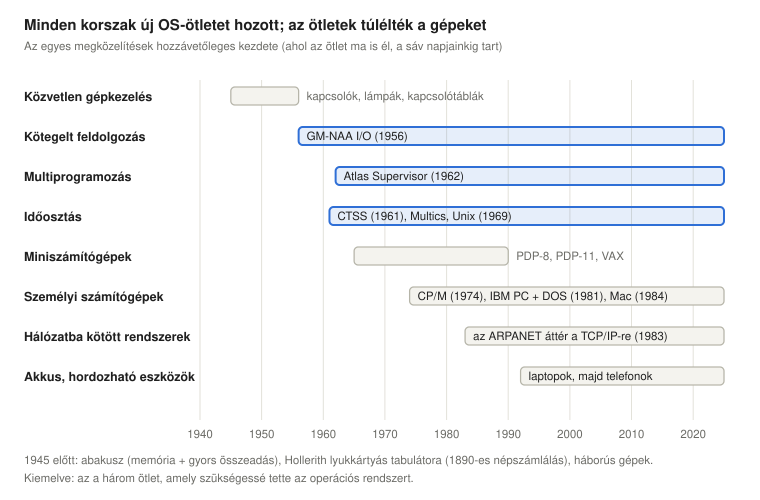
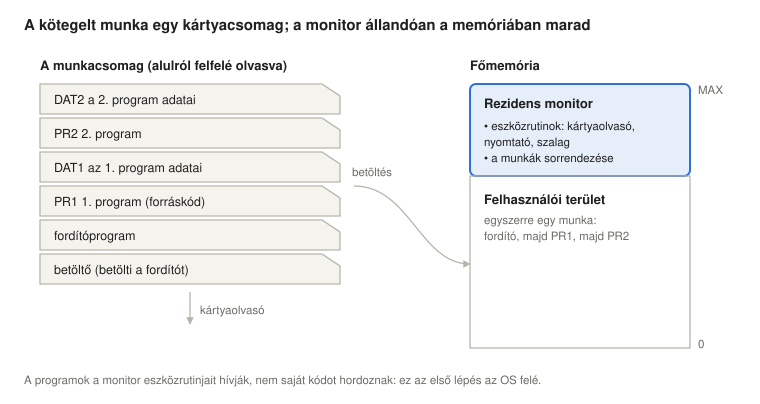
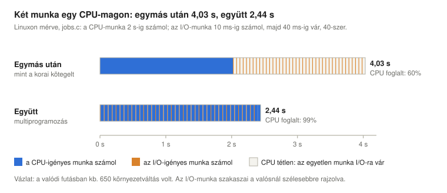
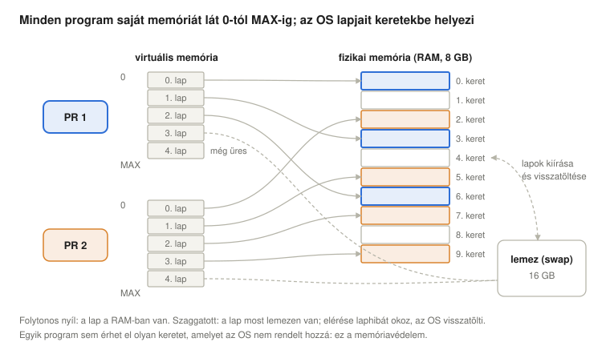
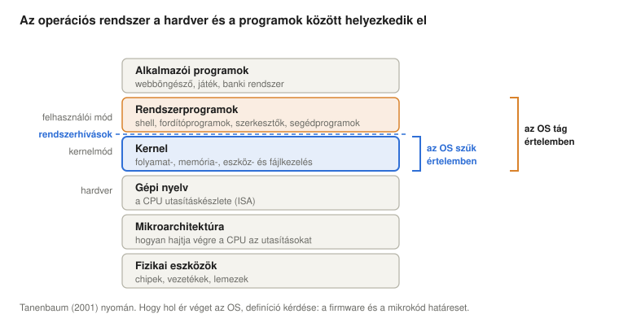

# Az operációs rendszerek történeti fejlődése

*Operációs rendszerek előadás: miért léteznek operációs rendszerek – problémák és megoldások láncolataként elmesélve a lyukkártyától az okostelefonig, minden ötlet Linuxos (x86-64) bemutatásával*

Következő: [Minőség, üzleti szempontok és az Enterprise Linux ökoszisztéma](../02-quality-and-enterprise-linux/).

> **Hogyan olvasd ezt az előadást?** Ahol új rövidítés vagy fogalom jelenik meg, utána egy **Egyszerűen elmagyarázva** feliratú doboz következik. Kattints rá, és kinyílik egy köznapi nyelvű magyarázat. Ha már ismered a fogalmakat, nyugodtan átugorhatod ezeket a dobozokat.

## Tanulási célok

A modern operációs rendszerek szinte minden szolgáltatását azért találták ki, hogy megszüntessenek egy-egy, a saját korukra jellemző szűk keresztmetszetet. Az előadás ezeket a szűk keresztmetszeteket követi sorban. Minden lépés egy újabb darabot ad az operációs rendszerhez, és ezek a darabok ma is mind megvannak abban a Linuxban, Windowsban, macOS-ben vagy Androidban, amelyet használsz.

Az előadás végére a hallgatók képesek lesznek:

- megmagyarázni, hogyan alakította az operációs rendszerek történetét a hardver és az emberi munka viszonylagos költsége;
- leírni a kötegelt feldolgozást, a rezidens monitort, a multiprogramozást, a virtuális memóriát és az időosztást, valamint azt, hogy melyik milyen problémát oldott meg;
- megindokolni, miért növeli a multiprogramozás a CPU kihasználtságát, és ezt egy idődiagramból kiszámítani;
- definiálni a hatásfokot és az operációs rendszer saját többletterhelését (overhead), és megmérni őket;
- elhelyezni ebben a történetben a Multicsot, a Unixot, a miniszámítógépeket, a CP/M-et és az MS-DOS-t, és megmagyarázni, miért mondtak le az első személyi számítógépes rendszerek olyan szolgáltatásokról, amelyek a nagygépeken már megvoltak;
- elmondani az MS-DOS és a grafikus felület piacra kerülésének dokumentált történetét, és elválasztani a legendáktól;
- megnevezni az operációs rendszer négy szerepét, és elhelyezni az OS-t a számítógépes rendszer rétegei között;
- megtalálni minden történeti ötletet egy futó Linux rendszeren.

<details>
<summary><b>Egyszerűen elmagyarázva:</b> operációs rendszer, szűk keresztmetszet, Linux, Windows, macOS, Android, x86-64</summary>

- **Operációs rendszer** (operating system, OS): az a program, amely a számítógépet irányítja, és lehetővé teszi, hogy más programok fussanak rajta. Eldönti, melyik program használhatja a processzort, elválasztja egymástól a programok memóriáját, és a programok helyett „beszél” a hardverrel (lemezzel, billentyűzettel, hálózattal). A Linux, a Windows, a macOS és az Android mind operációs rendszer.
- **Szűk keresztmetszet** (bottleneck, szó szerint „palacknyak”): a legszűkebb pont, amely mindent lelassít – mint a palack nyaka, amely megszabja, milyen gyorsan folyhat ki belőle a víz.
- **x86-64:** a legtöbb PC-ben és laptopban található processzorcsalád (Intel és AMD) 64 bites változata.

</details>

## A történet két hajtóereje

**A hajtóerő: a hardver és az ember viszonylagos költsége.** Az első húsz évben egy számítógép milliókba került és egy egész termet megtöltött, a használói viszont ehhez képest olcsók voltak. Mindent úgy szerveztek meg, hogy a drága gép folyamatosan dolgozzon, még ha az embereknek várniuk kellett is. Ahogy a hardver olcsóbb lett, és az emberek ideje vált a drágább erőforrássá, megfordult a sorrend: most már a gép várjon az emberre, ne fordítva. Ennek a történetnek a legtöbb fordulata ebből az egy változásból következik.

**A hatókör: milyen feladatokat oldunk meg számítógéppel.** A korai számítógépek számoltak: lőtáblázatokat, népszámlálási statisztikákat, mérnöki feladatokat. Később nyilvántartásokat vezettek, embereket kötöttek össze, zenét játszottak, és a zsebekbe is bekerültek. Minden új feladattípus új követelményeket támasztott az operációs rendszerrel szemben.

A történet során végig két cél húz ellentétes irányba: a **hatásfok** (minél több hasznos munkát kihozni a gépből) és a **biztonság** (megakadályozni, hogy a programok és a felhasználók kárt tegyenek egymásban). Minden védelmi mechanizmus elvesz valamennyit a hatásfokból, és minden időt spóroló rövidítés kockázatot nyit.

**A hatásfok pontosan.** Általában a hatásfok a hasznos munka aránya a teljes munkán belül:

$$\eta = \frac{\text{hasznos munka}}{\text{teljes munka}}$$

Operációs rendszernél a „hasznos munka” az az idő, amelyet a CPU a felhasználók programjainak futtatásával tölt; a többi az OS saját munkája (a **többletterhelése**, overhead):

$$\eta_{OS} = \frac{t_{user}}{t_{user} + t_{OS}}$$

Az az OS, amely sokkal könnyebben használhatóvá teszi a gépet, de elviszi az idejének a felét ($\eta_{OS} = 0{,}5$, azaz 50%), rossz üzlet, ha a gép drága, és jó üzlet lehet, ha az emberek ideje a drága. A Linuxos szakasz megmutatja, hogyan mérhető $t_{user}$ és $t_{OS}$. A képlet feltételezi, hogy a felhasználó programjában töltött idő a hasznos rész; ez általában igaz, de nem mindig.

<details>
<summary><b>Egyszerűen elmagyarázva:</b> hardver, hatásfok, biztonság, többletterhelés, CPU, η</summary>

- **Hardver:** a számítógép fizikai részei: chipek, vezetékek, lemezek, képernyő. A programok összessége a **szoftver**.
- **CPU** (Central Processing Unit, központi feldolgozóegység), vagyis a **processzor:** az a chip, amely a programok utasításait végrehajtja, apró lépésről apró lépésre.
- **Hatásfok:** a befektetett erőfeszítés mekkora része válik hasznos eredménnyé. Ha egy autómotor az üzemanyag energiájának 30%-át alakítja mozgássá, a hatásfoka 30%.
- **η** (a görög éta betű): a hatásfok szokásos jele.
- **Többletterhelés** (overhead): olyan munka, amelyet el kell végezni, de nem ez az, amit valójában akartunk – mint az orvosi vizsgálat előtti nyomtatványkitöltés.
- **Biztonság:** védelem a károkozás ellen, akár szándékos (támadó), akár véletlen (hibás program).

</details>

## Az operációs rendszerek előtt

A számítógép két alapötlete régebbi az elektronikánál. Egy **abakusz** már mindkettőt tudja: **megjegyzi** a számokat (a golyók helyzete memória), és egy gyakorlott használónak lehetővé teszi, hogy **gyorsan adjon össze nagy számokat**.

A gépek a statisztika kedvéért kezdtek tömegesen adatot feldolgozni. Az **1890-es amerikai népszámlálásnál** Herman Hollerith tabulátorgépei **lyukkártyákról** olvasták az adatokat: minden kártya egy ember válaszait tárolta lyukak mintázataként, és a gép elektromosan számolta össze őket, sokkal gyorsabban, mint ahogy a hivatalnokok kézzel tudták volna (U.S. Census Bureau, n.d.). A lyukkártya egészen az 1970-es évekig maradt az adatok és programok számítógépbe juttatásának fő eszköze.

**A második világháború** hozta az első elektronikus számítógépeket, katonai célokra, katonai erőforrásokból: a Colossust a kódfejtéshez Nagy-Britanniában (1944) és az ENIAC-ot az Egyesült Államokban, amelyet a háború alatt terveztek tüzérségi lőtáblázatok kiszámítására, és 1945 végén készült el.

**Az 1940-es és az 1950-es évek elején** operációs rendszer egyáltalán nem létezett. A programozó egy időszakra lefoglalta az egész gépet, és közvetlenül kezelte az előlapján lévő **kapcsolókkal, nyomógombokkal és lámpasorokkal**, vagy a **kapcsolótáblák** átkábelezésével. A gép interaktív volt, de egyszerre csak egy felhasználó számára, és a felhasználói felület maga a nyers hardver *volt*. Egy híres epizód ebből a korból: 1947 szeptemberében a Harvard Mark II relés számítógép kezelői egy relébe szorult molylepkét találtak, és beragasztották a naplóba ezzel a megjegyzéssel: „first actual case of bug being found” (az első eset, amikor tényleg bogarat találtak). A hibát jelentő *bug* (bogár) szó régebbi (Edison már az 1870-es években használta); a tréfa az volt, hogy ezúttal valódi rovarról volt szó.

<details>
<summary><b>Egyszerűen elmagyarázva:</b> abakusz, memória, népszámlálás, lyukkártya, tabulátorgép, előlap, kapcsolótábla, Colossus, ENIAC, relé, bug</summary>

- **Abakusz:** rudakra fűzött golyókból álló keret, amelyet évezredek óta használnak számolásra.
- **Memória:** a számítógép azon része, amely számokat tárol, hogy később fel lehessen használni őket.
- **Népszámlálás** (census): egy ország teljes lakosságának megszámlálása és adataik összegyűjtése; az Egyesült Államokban tízévente tartják.
- **Lyukkártya:** merev papírkártya, amelybe meghatározott helyeken lyukakat ütnek. Egy-egy helyen a lyuk vagy annak hiánya egy igen/nem választ tárol, több hely együtt pedig egy számjegyet vagy betűt. Egy program akár több száz kártyából álló doboz is lehetett.
- **Tabulátorgép:** lyukkártyákat olvasó gép, amely megszámolja, hány kártyán van lyuk az egyes helyeken.
- **Előlap** (front panel): a korai számítógépek kezelőtáblája, tele kapcsolókkal a számok bevitelére és lámpákkal, amelyek mutatták, mi van a gépben tárolva.
- **Kapcsolótábla** (plugboard): kábelekkel összekötött aljzatokból álló tábla; a kábelek átdugásával megváltozott, mit csinál a gép – vezetékekből álló program.
- **Colossus, ENIAC:** az első elektronikus számítógépek közül kettő. A Colossus német rejtjelek feltörésében segített (kódfejtés: titkos üzenetek elolvasása kulcs nélkül); az ENIAC lőtáblázatokat számolt, amelyek alapján a tüzérek a lövegeket irányozták.
- **Relé:** elektromosan működtetett kapcsoló mozgó fém érintkezővel. A korai számítógépek több ezer reléből épültek, és egy lepke beszorulhatott az érintkezők közé.
- **Bug:** hiba egy programban vagy gépben. A **debuggolás** (hibakeresés) a hibák megtalálása és kijavítása.

</details>

## Tizennégy lépés, egy operációs rendszer

Innentől a történet problémák sorozataként olvasható. Minden lépés az előző szűk keresztmetszetét oldja meg, és a megoldás az operációs rendszer állandó részévé válik. A sorrend inkább logikai, mint szigorúan időrendi: ezen ötletek közül sok szinte egyszerre jelent meg, az 1950-es évek végén és az 1960-as évek elején.



| Lépés | Probléma | Megoldás | Ma is megvan az OS-ben |
| --- | --- | --- | --- |
| I | lassú a kártyák beolvasása és a következő program elindítása | kötegelt feldolgozás | háttérfeladatok, szkriptek |
| II | minden program saját eszközkezelő kódot tartalmaz | eszközrutinok rezidens könyvtára | eszközmeghajtók, rendszerhívási interfész |
| III | drága a gép, és lassú az előkészítése | szakosodott személyzet (operátorok) | rendszergazdák, automatizálás |
| IV | gyorsul a CPU, az emberek nem tudnak lépést tartani | a kötegelt monitor automatikusan futtatja a munkákat | munkavezérlés, a betöltő |
| V | az I/O kb. ezerszer lassabb a CPU-nál | pufferek és megszakítások | megszakításkezelés, pufferelés |
| VI | a programok vagy CPU-, vagy I/O-igényesek | multiprogramozás, környezetváltás | a folyamatütemező |
| VII | a programok osztoznak a memórián | védelem, virtuális memória | virtuális memória, lapozás |
| VIII | olcsóbbak a gépek, számít az emberek ideje | időosztás, sok felhasználó terminálokon | többfelhasználós rendszerek, távoli bejelentkezés |
| IX | a felhasználók válaszra várnak | preemptív ütemezés | időszeletek |
| X | nem minden munka egyformán sürgős | prioritásos ütemezés | prioritások, `nice` |
| XI | az adatoknak túl kell élniük a programot | fájlrendszerek | fájlrendszerek |
| XII | bárkinek lehet saját számítógépe | minimális OS minimális hardveren | (a szolgáltatások visszatértek) |
| XIII | a számítógépek összekapcsolódnak | hálózatkezelés | a hálózati protokollkészlet |
| XIV | a számítógépek kicsik és akkuról működnek | energiagazdálkodás | energiakezelés, energiatudatos ütemezés |

<details>
<summary><b>Egyszerűen elmagyarázva:</b> köteg, I/O, megszakítás, puffer, multiprogramozás, környezetváltás, ütemező, lapozás, terminál, fájlrendszer, meghajtó</summary>

- **Köteg** (batch): munkák csoportja, amelyet összegyűjtenek, majd egymás után, emberi beavatkozás nélkül lefuttatnak – mint amikor a mosógép egy teli adagot mos ki.
- **I/O** (Input/Output, bemenet/kimenet): minden, amit a számítógép a külvilággal cserél: kártyaolvasók, nyomtatók, lemezek, billentyűzetek, a hálózat.
- **Megszakítás** (interrupt): jelzés, amelyre a processzor egy pillanatra félreteszi az éppen futó programot, hogy valami sürgőssel foglalkozzon – mint egy csengő az ajtón. A [Megszakítások](../05-interrupts/) előadás részletesen tárgyalja.
- **Puffer** (buffer): kis átmeneti tárterület, ahol az adat vár, amíg valaki el nem viszi – mint egy postaláda.
- **Multiprogramozás:** egyszerre több program van a memóriában, így ha az egyiknek várnia kell, a processzor egy másikon dolgozhat.
- **Környezetváltás** (context switch): a processzor abbahagyja az egyik program futtatását, és egy másikat kezd futtatni. Elmenti az első állapotát, és betölti a másikét – mint amikor az egyik könyvbe könyvjelzőt teszünk, és kinyitunk egy másikat.
- **Ütemező** (scheduler): az OS azon része, amely eldönti, melyik program kapja meg legközelebb a processzort.
- **Lapozás** (paging): a memória egyforma méretű darabokra (lapokra) osztása, amelyeket az OS egymástól függetlenül helyezhet el és mozgathat.
- **Terminál:** egy távoli számítógéphez kapcsolt billentyűzet és képernyő (korábban írógép). Sok terminál osztozhat egy számítógépen.
- **Fájlrendszer:** az a mód, ahogyan az OS a lemezen lévő adatokat elnevezett fájlokba és mappákba szervezi.
- **Eszközmeghajtó** (device driver): az OS azon kódrésze, amely egy bizonyos fajta eszköz kezelését ismeri.

</details>

## A kötegelt feldolgozás korszaka

### I. Lassú kártyák, lassú átállás: kötegelt feldolgozás

A program beolvasása lyukkártyákról lassú volt, és ugyanilyen lassú volt a programok közötti átállás is: kikerültek az egyik felhasználó kártyái, bekerültek a következőéi, és a következő felhasználó előkészítette a gépet. Eközben a nagyon drága CPU semmit sem csinált. A válasz a **kötegelt feldolgozás** (batch processing) lett: sok munkát összegyűjtenek, és egymás után futtatják őket, közben a lehető legkevesebb emberi beavatkozással.

### II. Minden program minden eszközt maga kezel: a rezidens könyvtár

Minden programnak kártyákat kellett olvasnia, eredményeket nyomtatnia és szalagra írnia, és minden programozó újra és újra megírta ezt az **eszközkezelő kódot**, minden programhoz. A megoldás egy jól kipróbált eszközrutinokból álló könyvtár lett, amely állandóan a memóriában maradt (**rezidens**), általában a memória tetején, és amelyet minden program meghívhatott. Ennek a könyvtárnak már megvoltak a modern OS-interfész fő tulajdonságai:

- **absztrakt** interfész (a program azt kéri, hogy „nyomtasd ki ezt a sort”, anélkül, hogy ismerné a nyomtató elektronikáját), amelyet egyszer, szakértők írnak meg és **optimalizálnak**;
- **mindig elérhető**, mert a munkák között is a memóriában marad;
- **szabványos**, így a különböző emberek által írt programok ugyanúgy használják az eszközöket;
- feloldja az **egymással nem kompatibilis eszközök** és a **kódmegosztás** közötti ellentétet: ha új nyomtató érkezik, csak a könyvtár változik, és minden program tovább működik.

Ez a közös, rezidens eszközrutin-gyűjtemény az operációs rendszer csírája.



### III. Drága hardver, lassú előkészítés: szakosodott személyzet

A hardver, különösen a CPU-idő, nagyon drága volt, és a gép előkészítése minden munkához lassan ment. A számítóközpontok ezért **szakosodott személyzetet** alkalmaztak: programozókat, akik megírták a programokat, de a géphez nem nyúltak; **operátorokat**, akik előkészítették a gépet, betöltötték a munkákat és cserélték a szalagokat; karbantartó mérnököket; sőt még a kártyaolvasók tisztítására is külön embereket. A programozó leadott egy kártyacsomagot, és órákkal (vagy egy nappal) később jött vissza a nyomatért.

### IV. Gyorsabb CPU-k: a kötegelt monitor

Ahogy a CPU-k gyorsultak, már az operátorok sem tudtak lépést tartani velük. A következő lépés az operátor rutinmunkájának automatizálása volt egy programmal, a **kötegelt monitorral** (batch monitor). Egy munka olyan kártyacsomaggá vált, amely sorrendben tartalmazott mindent, ami kellett: a **betöltőt** (loader), a **fordítóprogramot** (compiler), az első programot (PR1) és adatait (DAT1), a következő programot (PR2) és adatait (DAT2). A monitor beolvasta a csomagot, és sorban lefuttatta az egyes részeit, emberi beavatkozás nélkül.

Az egyik első ilyen rendszer a **GM-NAA I/O** volt, amelyet a General Motors Research és a North American Aviation írt, és először 1956-ban használtak éles üzemben egy IBM 704-en. Azért tervezték, hogy növelje a gép által naponta feldolgozható munkák számát (Computer History Museum Software Preservation Group, n.d.).

<details>
<summary><b>Egyszerűen elmagyarázva:</b> rezidens, rutin, könyvtár, absztrakt interfész, optimalizált, szabványos, operátor, betöltő, fordítóprogram, FORTRAN, IBM 704, munka</summary>

- **Rezidens:** állandóan a memóriában „lakó”, ahelyett hogy csak szükség esetén töltenék be – mint egy ház állandó lakója.
- **Rutin, szubrutin:** kis programrész, amely egyetlen feladatot végez, és más programokból meghívható (felhasználható), például „nyomtasd ki ezt a sort”.
- **Könyvtár** (library): ilyen rutinok gyűjteménye, amelyen sok program osztozik.
- **Absztrakt interfész:** egy dolog használatának módja anélkül, hogy tudnánk, hogyan működik belül – mint az autó kormánya: vezetni úgy is lehet, hogy nem ismerjük a kormánymű szerkezetét.
- **Optimalizált:** a lehető leggyorsabbá vagy legtakarékosabbá tett.
- **Szabványos:** mindenhol ugyanúgy, a megállapodott módon működő.
- **Operátor:** a számítógép üzemeltetésére alkalmazott ember: munkákat tölt be, szalagokat helyez fel, nyomatokat szed össze.
- **Betöltő** (loader): az a program, amely egy másik programot bemásol a memóriába, és elindítja.
- **Fordítóprogram** (compiler): olyan program, amely az emberek által (például FORTRAN-ban vagy C-ben) írt kódot a CPU számára érthető utasításokra fordítja.
- **FORTRAN:** az egyik első programozási nyelv (1957), tudományos számításokhoz készült.
- **IBM 704:** az 1950-es évek közepének nagy IBM-számítógépe, cégek és kutatólaboratóriumok használták.
- **Munka** (job): a számítógépnek leadott egyetlen munkaegység: egy program az adataival és a futtatására vonatkozó utasításokkal együtt.

</details>

### Mit kívánt a monitor a hardvertől

Egy kötegelt monitor csak akkor biztonságos, ha az általa futtatott programok nem tudják tönkretenni. Stallings (2018) felsorolja azokat a hardveres szolgáltatásokat, amelyekre a kötegelt monitorok építettek, és ezek mindegyike ma is megvan a processzorokban:

- **Memóriavédelem:** a felhasználói program nem módosíthatja a monitort tartalmazó memóriaterületet.
- **Időzítő** (timer): egy munka nem futhat örökké. Ha lejár az ideje, az időzítő megszakítja, és a monitor visszaveszi az irányítást.
- **Privilegizált utasítások:** bizonyos utasításokat, mindenekelőtt az I/O-utasításokat, csak a monitor hajthat végre. Ha egy program kártyát akar olvasni, a monitort kell megkérnie – ez azt is megakadályozza, hogy egy munka a következő munka kártyáit olvassa be.
- **Megszakítások:** ezekkel tudja a monitor visszaszerezni az irányítást, és ezek teszik lehetővé, hogy a CPU dolgozzon, amíg az eszközök foglaltak (V. lépés).

Ezek a szolgáltatások együtt két működési módot igényelnek: a programok számára egy korlátozott **felhasználói módot** (user mode), a monitor számára pedig egy privilegizált **monitormódot** (ma: kernelmód).

A monitornak azt is tudnia kellett, mit kezdjen a csomag egyes részeivel. Ezt különleges **vezérlőkártyák** (control card) mondták meg neki, amelyeket egy **munkavezérlő nyelven** (job control language, JCL) írtak. Stallings példájában egy FORTRAN-munka így néz ki: a `$JOB` indítja a munkát, a `$FTN` meghívja a FORTRAN-fordítót az utána következő kártyákra, a `$LOAD` betölti az eredményt, a `$RUN` elindítja a mögötte lévő adatkártyákon, a `$END` pedig lezárja a munkát. A JCL a mai shellszkriptek őse volt.

<details>
<summary><b>Egyszerűen elmagyarázva:</b> memóriavédelem, időzítő, privilegizált utasítás, felhasználói mód, monitormód, vezérlőkártya, JCL, shellszkript</summary>

- **Memóriavédelem:** hardveres ellenőrzés, amely megakadályozza, hogy egy program olyan memóriához nyúljon, amely nem az övé.
- **Időzítő** (timer): hardveres óra, amely beállított idő után meg tudja szakítani a processzort – mint egy konyhai időzítő.
- **Privilegizált utasítás:** olyan utasítás, amelyet csak az operációs rendszer használhat – mint egy kulcs, amelyet csak a személyzet kap meg.
- **Felhasználói mód / monitormód:** a processzor két üzemmódja. Felhasználói módban a veszélyes utasítások tiltottak; monitor- (kernel)módban minden megengedett.
- **Vezérlőkártya, JCL** (Job Control Language, munkavezérlő nyelv): különleges lyukkártyák, amelyek nem programot vagy adatot tartalmaztak, hanem utasításokat a monitornak: „fordítsd le ezt”, „most futtasd”.
- **Shellszkript:** parancsok listáját tartalmazó szövegfájl, amelyet a shell egymás után végrehajt – a régi munkacsomag mai megfelelője.

</details>

## A CPU az eszközökre vár

### V. Az I/O ezerszer lassabb: pufferek és megszakítások

Az elektronikus CPU-k nagyjából ezerszer – vagy még annál is többször – gyorsabbak voltak a mechanikus kártyaolvasóknál, nyomtatóknál és szalagegységeknél. Amíg egy program arra várt, hogy beolvassanak egy kártyát vagy kinyomtassanak egy sort, a CPU tétlenül állt. Két találmány vette fel a harcot ez ellen:

- A **pufferek** lehetővé teszik, hogy az eszköz és a CPU a saját tempójában dolgozzon: az eszköz feltölti a puffert, miközben a CPU mással foglalkozik, majd a CPU egyszerre üríti ki.
- A **megszakítások** révén az eszköz szólni tud a CPU-nak, ha a puffer **megtelt** (bemenetnél) vagy **kiürült** (kimenetnél), így a CPU-nak nem kell folyton ellenőrizgetnie.

Egy harmadik ötlet az volt, hogy a lassú eszközöket teljesen távol tartsák a drága számítógéptől. Az **offline I/O** során egy kis, olcsó számítógép (például az IBM 1401) mágnesszalagra másolta a kártyacsomagokat, a nagy gép a sokkal gyorsabb szalagot olvasta, és a kicsi nyomtatta ki az eredményeket a szalagról. A **spooling** (Simultaneous Peripheral Operations On-Line, egyidejű online perifériaműveletek) ugyanezt az ötletet egyetlen gépen belül valósította meg: az OS előre a lemezre másolja a bemenetet, és ott gyűjti a kimenetet is, így a programok soha nem várnak közvetlenül a kártyaolvasóra vagy a nyomtatóra. Később a **DMA** (Direct Memory Access, közvetlen memória-hozzáférés) lehetővé tette, hogy az eszközök a CPU nélkül másoljanak egész blokkokat a memóriába.

A megszakítások, a pufferek és a spooling kezelése az operációs rendszer alapfeladatává vált. A [Megszakítások](../05-interrupts/) előadás megmutatja, mennyi CPU-időt takarít meg ez.

### VI. CPU-igényes és I/O-igényes programok: multiprogramozás

A programok különbözőek. Egyesek szinte folyamatosan számolnak (**CPU-igényes**, CPU-bound programok); mások többnyire az eszközökre várnak (**I/O-igényes**, I/O-bound programok). Ha egymás után futnak, mindegyik hagy valamit kihasználatlanul: a CPU-igényes program az eszközöket, az I/O-igényes a CPU-t.

A **multiprogramozás** egyszerre több programot tart a memóriában. Ha a futó programnak I/O-ra kell várnia, az OS elmenti az állapotát, és egy másik programnak adja a CPU-t: ez a **környezetváltás** (context switch). Az ábra ezt Linuxon mérve mutatja, egy CPU-igényes és egy I/O-igényes munkával egyetlen CPU-magon (a program és a számok a Linuxos szakaszban találhatók):



A két munkának együtt 2,4 másodperc CPU-időre van szüksége. Egymás után futtatva 4,03 másodpercig tartanak, vagyis a CPU az idő 2,4 / 4,03 = 60%-ában dolgozik. Együtt futtatva 2,44 másodperc alatt végeznek, a CPU az idő 99%-ában foglalt – és semmi sem lett gyorsabb: a CPU-nak egyszerűen soha nem kellett várnia.

Az 1960-as évek elejének több számítógépe is úttörő volt a multiprogramozásban. A legismertebb az **Atlas**, amelyet a Manchesteri Egyetem és a Ferranti épített. Az 1950-es évek végétől tervezték, és 1962 decemberében helyezték üzembe; operációs rendszere, az **Atlas Supervisor** egyszerre több felhasználói programot futtatott, és sokan az első, mai szemmel is felismerhetően modern operációs rendszernek tartják (IEEE, n.d.-a). Ütemezte a programokat (eldöntötte, melyik fusson következőként), de kezelte a memóriát is, a dobtárán keresztül pufferelte a lassú eszközöket, és irányította a munkákat. 1966-tól az IBM OS/360 rendszere kereskedelmi számítógépek egész családjába hozta el a multiprogramozást, MFT és (1967-től) MVT változatában.

### VII. A programok osztoznak a memórián: védelem és virtuális memória

Amikor egyszerre több program van a memóriában, új veszély jelenik meg: egy hibás program felülírhatja egy másik program vagy az operációs rendszer memóriáját. A közös memória **védelmet igényel**. A legegyszerűbb hardveres válasz egy **bázis- és határregiszter** (base and limit register) pár: a CPU a program által használt minden címet összevet a saját memóriaterülete elejével és végével. Az Atlas sokkal tovább ment. Tervezői azt akarták, hogy egy kicsi, gyors memória és egy nagy, lassú dob egyetlen nagy memóriának látsszon, hogy a programozóknak ne kelljen kézzel ide-oda pakolniuk az adatokat közöttük. Az eredmény, a **virtuális memória**, ráadásul minden programnak saját, védett memóriát adott (Kilburn et al., 1962; IEEE, n.d.-a). Ma minden számítógép használja.



Minden program a saját, privát memóriáját látja, a **virtuális memóriáját**, amely a 0 címtől egy maximumig (MAX) terjed. Ez a memória egyforma méretű **lapokra** (page) van osztva. A valódi memóriachipek (a **fizikai memória**, az ábrán 8 GB) ugyanekkora **lapkeretekre** (frame) oszlanak. Az OS minden programhoz nyilvántart egy táblázatot arról, hogy melyik lapja melyik keretben van, a hardver pedig menet közben lefordít minden címet. Ez egyszerre három dolgot ad:

- **Védelem:** egy program csak azokat a kereteket érheti el, amelyeket az OS hozzárendelt. PR1-nek egyszerűen nincs módja megnevezni PR2 memóriáját.
- **Rugalmasság:** egy program lapjai bárhol lehetnek a fizikai memóriában, bármilyen sorrendben, így a memória kis darabokban osztható szét.
- **Több memória, mint amennyi van:** az éppen nem szükséges lapok kiírhatók lemezre (az ábrán 16 GB **lapozóterület**, swap), és visszatölthetők, amikor a program hozzájuk nyúl. Az Atlason a lassú memória egy mágnesdob volt; a felhasználó „egy nagyon nagy, gyors memóriát” látott.

<details>
<summary><b>Egyszerűen elmagyarázva:</b> CPU-igényes, I/O-igényes, tétlen, kihasználtság, mag, Atlas, Ferranti, lap, keret, swap, dob, laphiba, folyamat, bázis- és határregiszter, spooling, DMA, OS/360</summary>

- **CPU-igényes / I/O-igényes:** a CPU-igényes program olyan, mint egy diák, aki matekfeladatokat old meg: a gondolkodás sebessége korlátozza. Az I/O-igényes program olyan, mint egy diák, aki a könyvtárból vár könyveket: a kiszállítás korlátozza.
- **Tétlen** (idle): nem csinál semmit, vár.
- **Kihasználtság** (utilisation): az idő hányad részében foglalt valami. A 60%-os CPU-kihasználtság azt jelenti, hogy a CPU az idő 60%-ában dolgozott, 40%-ában várt.
- **Mag** (core): egy modern processzorchip több teljes CPU-t tartalmaz, ezek a magok. A bemutató csak egyet használt, hogy olyan legyen, mint egy egyetlen CPU-val rendelkező 1960-as évekbeli gép.
- **Atlas, Ferranti:** az Atlas az 1960-as évek elejének brit számítógépe volt, kora egyik legerősebb gépe. A Ferranti az a brit elektronikai cég, amely a Manchesteri Egyetemmel közösen építette.
- **Virtuális memória:** minden program saját, „látszat” memóriát kap, és az OS meg a hardver a háttérben dönti el, hogy melyik darab valójában hol van. Mint egy szálloda, ahol minden vendég kártyáján az áll, hogy „1-es szoba”, de a recepció mindenkit más valódi szobába küld.
- **Lap, keret:** a lap a program virtuális memóriájának rögzített méretű darabja (ma általában 4 KB); a keret egy lapnyi hely a valódi memóriachipekben.
- **Swap** (lapozóterület): hely a lemezen, ahová az OS azokat a lapokat teszi félre, amelyek nem férnek el a valódi memóriában.
- **Dob:** korai tárolóeszköz, mágneses anyaggal bevont forgó fémhenger; lassabb, de nagyobb, mint a főmemória.
- **GB** (gigabájt): körülbelül egymilliárd bájt. Egy **bájt** 8 bit, egy betű tárolásához elég.
- **Laphiba** (page fault): ez történik, amikor egy program olyan laphoz nyúl, amely éppen nincs a RAM-ban: a hardver megállítja a programot, az OS behozza a lapot a lemezről, a program pedig úgy folytatódik, mintha mi sem történt volna.
- **Folyamat** (process): futó program a memóriájával és az állapotával együtt.
- **Bázis- és határregiszter:** két szám, amelyet a CPU a futó programról tárol: hol kezdődik a memóriája, és milyen hosszú. Minden ezen kívül eső címet elutasít.
- **Offline I/O, spooling:** a lassú kártyaolvasók és nyomtatók távol tartása a drága CPU-tól – vagy egy külön kis számítógépen, vagy úgy, hogy az OS egy gyors lemezen készíti elő az adatokat.
- **DMA** (Direct Memory Access, közvetlen memória-hozzáférés): segédchip, amely a CPU nélkül másol adatot egy eszköz és a memória között.
- **OS/360, MFT, MVT:** az IBM operációs rendszere a System/360 számítógépeihez. Az MFT és az MVT ennek multiprogramozó változatai voltak: Multiprogramming with a Fixed / Variable number of Tasks (multiprogramozás rögzített, illetve változó számú feladattal).

</details>

## Az első fordulat: drága lesz az emberek ideje

Az 1960-as évek közepére a számítógépek olcsóbbak és számosabbak lettek, és a mérleg billenni kezdett: a nyomataikra váró emberek költsége ugyanannyira számítani kezdett, mint a gépé. Az új célok a **könnyű használat** és a **termelékenység** lettek, miközben továbbra is számított a hatásfok, és most már a biztonság is, hiszen sokan használták ugyanazt a gépet egyszerre (**többfelhasználós** rendszerek).

### VIII. Időosztás

Ahelyett, hogy kártyákat adtak volna le és órákig vártak volna, a felhasználók egy központi **gazdagéphez** (host) kapcsolt **terminálok** előtt ültek, a gazdagép pedig olyan gyorsan váltogatott közöttük, hogy mindegyikük úgy érezte, övé az egész gép. Ez az **időosztás** (time sharing). Az MIT CTSS (Compatible Time-Sharing System) rendszerét 1961 novemberében mutatták be először (Corbató et al., 1962; Multicians, n.d.).

Két fogalompárt könnyű összekeverni. A **kötegelt** és az **interaktív** feldolgozás a felhasználóról szól: kötegelt munkánál senki sem vár a gépnél, interaktív munkánál viszont egy ember vár minden egyes válaszra. A **multiprogramozás** és az **időosztás** a célról szól: a multiprogramozás azért váltogatja a programokat, hogy a CPU foglalt maradjon (hatásfok); az időosztás azért, hogy minden felhasználó gyors választ kapjon (kényelem). Az időosztás a multiprogramozásra épül.

### IX. Válaszidő: preemptív ütemezés

A kötegelt rendszereket az érdekelte, hány munka készül el naponta (**átbocsátóképesség**, throughput). A terminál előtt ülő embert az érdekli, milyen gyorsan válaszol a gép az egyes parancsaira (**válaszidő**, response time). Ha egy felhasználó hosszú számítása a befejezéséig magánál tarthatná a CPU-t, mindenki másnak várnia kellene. A **preemptív (kiszorításos) ütemezés** ezt oldja meg: egy időzítő-megszakítás rendszeresen elveszi a CPU-t a futó programtól, és az ütemező kiválasztja a következőt, így minden program sorban kap egy rövid **időszeletet**.

### X. Prioritásos ütemezés

Nem minden munka egyformán sürgős: a terminálnál váró felhasználónak meg kell előznie egy hosszú háttérszámítást. A **prioritásos ütemezés** minden programhoz prioritást rendel, és az ütemező a fontosabbakat részesíti előnyben. A Linux ma is ezt teszi, ahogy az alábbi `nice`-bemutató mutatja.

### XI. Tartós adatok: fájlrendszerek

Amikor már sok felhasználó dolgozott hónapokig ugyanazon a gépen, a programjaikat és adataikat tartósan tárolni kellett, és név szerint újra megtalálni: az adatnak **perzisztensnek** (tartósnak) kell lennie, túl kell élnie az azt létrehozó programot. A **fájlrendszerek** elnevezett fájlokba és könyvtárakba szervezik a lemezt, és nyilvántartják, ki olvashatja vagy módosíthatja az egyes fájlokat.

### Multics és Unix

A legnagyratörőbb időosztásos projekt a **Multics** volt, amelyet 1965-ben indított az MIT, a General Electric és a Bell Labs. Számos ma is használt ötletet vezetett be, a hierarchikus fájlrendszerektől a védelmi gyűrűkig, és az MIT 1969 őszén kezdett szolgáltatást nyújtani rajta (Multicians, n.d.). Csakhogy nagy volt és késett, és 1969-ben a Bell Labs kilépett a projektből.

A Bell Labsnél ezután Ken Thompson és Dennis Ritchie egy sokkal **egyszerűbb** rendszert írt, eleinte egy kicsi PDP-7 számítógépre: a **Unixot** (a neve szójáték a Multics nevére). A Unix a lényeget (időosztás, hierarchikus fájlrendszer, folyamatok) egy kicsi **kernelben** tartotta, minden mást – még a parancsértelmezőt (a shellt) is – közönséges programokba tett ki. 1973-ban átírták az új C programozási nyelvre, így könnyen át lehetett vinni más számítógépekre (Ritchie & Thompson, 1974). Az egyszerűség szándékos volt. Tom Van Vleck, a Multics egyik fejlesztője úgy emlékszik, hogy az ő Multics-kódjának fele hibakezelés volt, Ritchie pedig azt mondta neki, hogy a Unix mindezt elhagyta: súlyos hiba esetén egy `panic()` nevű rutin egyszerűen leállította a gépet, és valaki újraindította (Van Vleck, n.d.). A Linux „kernel panic” üzenete ma is ezt a nevet viseli.

<details>
<summary><b>Egyszerűen elmagyarázva:</b> többfelhasználós, gazdagép, CTSS, időosztás, átbocsátóképesség, válaszidő, preemptív, időszelet, prioritás, perzisztens, könyvtár (mappa), kernel, shell, Unix, C, MIT, Bell Labs, PDP-7, Multics, hierarchikus fájlrendszer, védelmi gyűrűk, kernel panic</summary>

- **Többfelhasználós** (multi-user): sok ember használja egyszerre ugyanazt a számítógépet, mindenki a saját felhasználói fiókjával.
- **Gazdagép** (host): az a központi számítógép, amelyhez sok terminál kapcsolódik.
- **CTSS:** Compatible Time-Sharing System, korai időosztásos rendszer az MIT-n.
- **Időosztás** (time sharing): a processzor olyan gyors váltogatása a felhasználók között, hogy mindegyikük úgy érzi, egyedül használja – mint egy sakknagymester szimultánja 30 ellenféllel, aki tábláról táblára jár.
- **Átbocsátóképesség** (throughput): mennyi munka készül el óránként vagy naponta. **Válaszidő** (response time): mennyit vár egy ember egyetlen válaszra.
- **Preemptív** (kiszorításos): az OS bármikor elveheti a processzort egy programtól, anélkül hogy megkérdezné.
- **Időszelet** (time slice): az a rövid idő, amíg egy program futhat, mielőtt a következő sorra kerül; jellemzően néhány ezredmásodperc.
- **Prioritás:** mennyire sürgős valami. A mentőautónak elsőbbsége van egy szállítókocsival szemben.
- **Perzisztens** (tartós): a program befejeződése vagy a számítógép kikapcsolása után is megmarad.
- **Könyvtár** (directory): mappa, amely fájlokat és más mappákat tartalmaz.
- **Kernel:** az operációs rendszer magja, az a része, amely teljes irányítással rendelkezik a hardver felett.
- **Shell:** az a program, amely beolvassa a begépelt parancsokat, és végrehajtja őket.
- **Unix:** a Bell Labs operációs rendszere (1969). A Linux és a macOS felépítésüket tekintve a leszármazottai.
- **C:** programozási nyelv, amelyet 1972 körül hoztak létre a Bell Labsnél a Unix megírásához. A legtöbb operációs rendszert ma is ebben írják.
- **MIT, Bell Labs:** a Massachusetts Institute of Technology egyetem, illetve az amerikai AT&T telefontársaság kutatólaboratóriuma.
- **PDP-7:** a Digital Equipment Corporation kis számítógépe az 1960-as évekből.
- **Multics:** Multiplexed Information and Computing Service, nagy időosztásos rendszer 1965-ből.
- **Hierarchikus fájlrendszer:** mappák a mappákban, mint egy családfa, a fájlok egyetlen hosszú listája helyett.
- **Védelmi gyűrűk** (protection rings): jogosultsági szintek, a legmegbízhatóbbtól (a kernel, 0. gyűrű) kifelé haladva a legkevésbé megbízhatóig (a felhasználói programok).
- **Kernel panic:** a kernel leállítja az egész számítógépet, mert olyan hibát talált, amelyből nem tud biztonságosan helyreállni.

</details>

### Miniszámítógépek

A teremnyi nagyszámítógépek és a személyi számítógép között van egy korszak, amelyet sok rövid történeti összefoglaló kihagy: a **miniszámítógépé**. 1965-ben a Digital Equipment Corporation (DEC) bemutatta a PDP-8-at, egy kb. 18 000 dolláros kis számítógépet, amely elég olcsó volt ahhoz, hogy egyetlen laboratórium vagy tanszék megvehesse (Information Processing Society of Japan, n.d.). A DEC későbbi, 16 bites PDP-11 családja (1970) a Unix otthona lett, a 32 bites VAX (1977) pedig a VMS operációs rendszert futtatta, virtuális memóriával és időosztással. A miniszámítógépek sokkal több emberhez juttatták el az interaktív számítástechnikát, operációs rendszereik pedig közvetlen mintái voltak a korai személyi számítógépes rendszereknek. Kb. 1980-tól az egyetlen chipből álló **mikroprocesszorra** épülő gépek kezdték átvenni a helyüket, és az 1990-es évekre a legtöbb miniszámítógép-gyártó eltűnt.

<details>
<summary><b>Egyszerűen elmagyarázva:</b> nagyszámítógép, miniszámítógép, DEC, PDP-8, PDP-11, VAX, VMS, mikroprocesszor</summary>

- **Nagyszámítógép** (mainframe): nagy, nagyon drága központi számítógép, amelyet egy számítóközpont üzemeltet egy egész cég vagy egyetem számára.
- **Miniszámítógép:** kisebb és sokkal olcsóbb számítógép, nagyjából egy hűtőszekrény vagy szekrény méretű, amelyet egy-egy tanszék vagy labor vásárolt meg.
- **DEC, PDP-8, PDP-11, VAX:** a Digital Equipment Corporation, a vezető miniszámítógép-gyártó, és három híres számítógépcsaládja.
- **VMS:** a VAX operációs rendszere, fontos kereskedelmi többfelhasználós rendszer.
- **Mikroprocesszor:** egy teljes CPU egyetlen chipen. Ez tette a számítógépeket elég kicsivé és olcsóvá ahhoz, hogy egy ember is birtokolhasson egyet.

</details>

## A második fordulat: mindenkinek lehet saját gépe

### XII. Személyi számítógépek: egy lépés hátra

Az 1970-es évek végén és az 1980-as években a számítógépek annyira olcsók lettek, hogy egy ember is megvehetett egyet. A célok ismét megváltoztak: az alacsony **beszerzési ár** és a rövid **piacra jutási idő** mindennél fontosabb lett. Az 1981 augusztusában bejelentett IBM PC alapváltozata 1565 dollárba került, 16 KB memóriával, lemezmeghajtó nélkül, kazettás magnóhoz való csatlakozóval; egy monitorral és a DOS futtatásához szükséges 160 KB-os hajlékonylemez-meghajtóval felszerelt, használható rendszer kb. 3000 dollárba került ("IBM Personal Computer," n.d.). A szokásos operációs rendszere a **DOS** volt (az IBM-től PC DOS, a Microsofttól MS-DOS), amely a Tim Paterson által a Seattle Computer Productsnál írt 86-DOS-on alapult (Necasek, n.d.). Az, hogy hogyan került a DOS – és nem a kor bevett rendszere – az IBM PC-re, a számítástechnika egyik legtöbbet mesélt története, és érdemes gondosan elmondani, mert a népszerű változat részben legenda.

**A CP/M, az első személyi számítógépes OS.** 1974-ben Gary Kildall, aki a Washingtoni Egyetemen szerzett PhD-fokozatot számítástudományból, a kaliforniai Pacific Grove-ban bemutatta a **CP/M** (Control Program for Microcomputers, mikroszámítógépek vezérlőprogramja) első működő változatát. Fő ötlete az volt, hogy minden hardverfüggő kódot egy kicsi, különálló részbe, a **BIOS**-ba (Basic Input/Output System, alapvető bemeneti/kimeneti rendszer) tett. Ahhoz, hogy a CP/M-et egy új számítógépre vigyék át, a gyártónak csak új BIOS-t kellett írnia, és minden CP/M-program változtatás nélkül futott (IEEE, n.d.-b). Ez ismét a II. lépés, és az OS „gyorsétteremlánc”-szerepe: ugyanazok a programok és ugyanaz az élmény több tucat gyártó gépein. 1980-ra a Kildall cége, a Digital Research (DRI) által forgalmazott CP/M a kis számítógépek szabványos operációs rendszere lett.

**Az IBM, a CP/M és a „QDOS”.** 1980-ban az IBM sietve építette személyi számítógépét, és operációs rendszerre volt szüksége hozzá. A BASIC programozási nyelvre az IBM már szerződést kötött a Microsofttal. 1980 augusztusában az IBM megkereste a Digital Researchet a CP/M egy, a PC Intel 8088-as processzorára (a 8086-os család tagjára) készülő változata ügyében (Shustek, 2014). Itt kezdődik a legenda, amelyet sok népszerű beszámoló és néhány tankönyv is továbbad: Kildall állítólag repülni ment a gépével ahelyett, hogy az IBM-mel tárgyalt volna, és így elvesztette az évszázad üzletét. A dokumentumok szerint a helyzet kevésbé drámai. Kildall valóban repült aznap, egy kollégájával, hogy szoftvert szállítson egy ügyfélnek, és az első megbeszélést a feleségére és üzlettársára, Dorothy McEwenre bízta. Ügyvédjük tanácsára az asszony nem írta alá az IBM nagyon tág titoktartási megállapodását, mielőtt Kildall látta volna. A beszámolók eltérnek abban, hogy Kildall később aznap találkozott-e az IBM csapatával. A mélyebb nézeteltérések a pénzről és az időről szóltak: a DRI minden eladott példány után jogdíjat akart, az IBM egyszer akart fizetni, a 16 bites CP/M-86 pedig késett ("Gary Kildall," n.d.).

Az IBM ezután a Microsoftot kérte meg, hogy keressen operációs rendszert. A Microsoft 1980 decemberében 25 000 dollárért licencelte a Seattle Computer Productstól a **86-DOS**-t, becenevén **QDOS**-t („Quick and Dirty Operating System”, gyors és piszkos operációs rendszer), 1981 nyarán pedig további 50 000 dollárért megvette hozzá az összes jogot; a szerző, Tim Paterson a Microsofthoz szerződött (Shustek, 2014). Az IBM gépein ebből lett a PC DOS, példányonként 40 dollárért. Amikor néhány hónappal később végre megjelent a CP/M-86 az IBM PC-re, 240 dollárba került, és rosszul fogyott ("Gary Kildall," n.d.).

Kildall élete végéig azt állította, hogy a DOS a CP/M másolata. A QDOS szándékosan lemásolta a CP/M rendszerhívási interfészét, és hasonló parancsokat használt, hogy a CP/M-programokat könnyen át lehessen alakítani – Kildall ezt tekintette másolásnak. A belső felépítése és a fájltárolási formátuma azonban eltért, és Bob Zeidman igazságügyi forráskód-összehasonlítása nem talált átmásolt kódot (Shustek, 2014). A döntő lépés a szerződésben történt: a Microsoft megtartotta a jogot, hogy az MS-DOS-t más gyártóknak is licencelje. Amikor más cégek IBM-kompatibilis „klón” PC-ket kezdtek építeni, mind a Microsofttól vették az MS-DOS-t, ami a következő évtizedek domináns szoftvercégévé tette. A tanulság egy OS-kurzus számára: az 1980-as évek legelterjedtebb operációs rendszere az időzítésnek, az árnak és a licencelésnek köszönhetően győzött, nem a műszaki fölényének.

**A grafikus felület: Xerox, Apple és Microsoft.** Az ablakokra, ikonokra és egérre épülő felületet az 1970-es években fejlesztették ki a Xerox Palo Altó-i kutatóközpontjában (Palo Alto Research Center, PARC), Douglas Engelbart 1960-as évekbeli, a Stanford Research Institute-ban (SRI) végzett munkájára építve – ott találták fel az egeret. A PARC az Alto számítógépen (1973) valósította meg, az Ethernet hálózattal és a Smalltalk programozási rendszerrel együtt. 1979 decemberében Steve Jobs kétszer is meglátogatta a PARC-ot. A látogatások egy üzlet részei voltak: a Xerox kockázatitőke-részlege az Apple tőzsdei bevezetése előtt 100 000 Apple-részvényt vásárolhatott, részvényenként 10,50 dollárért, azzal a feltétellel, hogy az Apple munkatársainak megmutatják a PARC munkáit (Living Computers: Museum + Labs, 2020). Az Apple több PARC-kutatót is felvett, köztük Larry Teslert, és a Lisában (1983) meg a **Macintoshban** (1984) vitte piacra az ötleteket.

A népszerű történet szerint „az Apple meglopta a Xeroxot”. A tények árnyaltabbak: a látogatásokat megszervezték, és a részvényüzlettel fizettek értük, az Apple nem vitt el sem kódot, sem hardvert, a grafikus felület (GUI) ötleteit sok látogatónak megmutatták és publikálták is, az Apple Lisa-projektje pedig már a látogatások előtt elindult. Amit az Apple elvitt, az az ötletek és annak bizonyítéka volt, hogy működnek; ezeket aztán a saját módján valósította meg, sokkal olcsóbb hardveren. Amikor a Xerox 1989-ben végül beperelte az Apple-t, a bíróság 1990-ben elutasította a keresetet, részben azért, mert a Xerox túl sokáig várt ("Apple Computer, Inc. v. Microsoft Corp.," n.d.).

**Gates és Jobs.** A Microsoft az elsők között írt alkalmazásokat a Macintoshra, így jóval a bemutatása előtt látta a gépet. 1983 novemberében a Microsoft bejelentette saját grafikus rendszerét, a **Windowst**. Andy Hertzfeld, a Macintosh-csapat tagja úgy emlékszik, hogy Jobs berendelte Gatest az Apple-höz, és azzal vádolta, hogy meglopta az Apple-t. Gates azt felelte, hogy mindkettejüknek volt egy gazdag szomszédja, a Xerox: ő betört a házba, hogy ellopja a tévét, és kiderült, hogy Jobs már elvitte (Hertzfeld, n.d.). 1985-ben az Apple licencet adott a Microsoftnak a Mac néhány vizuális elemére a Windows 1.0-hoz. Amikor a Windows 2.0 (1987) ennél tovább ment, az Apple 1988-ban beperelte a Microsoftot a Macintosh „look and feel”-je (megjelenése és kezelési érzete) miatt. Az Apple veszített: 1992-ben, majd fellebbezés után 1994-ben a bíróságok úgy találták, hogy a vitatott elemek többségére kiterjedt az 1985-ös licenc, és hogy a grafikus felület alapötletei (ablakok, ikonok, menük) nem védhetők; jogsértő csak konkrét tervek szoros lemásolása lehet ("Apple Computer, Inc. v. Microsoft Corp.," n.d.). Az operációs rendszerek szempontjából ez tartós döntés volt: a GUI közjóvá vált, amelyet minden OS átvehetett, és ma a tágabb értelemben vett operációs rendszer része.

Hogy elférjen az ilyen **minimális hardveren**, a DOS szinte mindent elhagyott, amit a nagyszámítógépek húsz év alatt kifejlesztettek:

- kevés memória, és sem virtuális memória, sem memóriavédelem;
- az első változatban csak hajlékonylemezek, merevlemez-támogatás nélkül;
- egy felhasználó és egyszerre egy program: se többfelhasználós működés, se multiprogramozás;
- se prioritások, se preempció, se időosztás.

Az előadás fogalmaival: az operációs rendszer **visszaesett egy közös szubrutinkönyvtár szintjére**, ismét a II. lépésre: a lemez, a képernyő és a billentyűzet kezelésére szolgáló rutinok gyűjteménye lett, amelyet a programok használhattak, vagy megkerülhettek, és közvetlenül vezérelhették a hardvert. Bármely program felülírhatott bármilyen memóriát, és egyetlen program összeomlása az egész gépet magával rántotta. A következő húsz évben a régi szolgáltatások egyenként visszatértek a személyi számítógépekre, míg 2000 körül a hétköznapi PC-k már védett memóriájú, preemptív multitaszkingot és több felhasználót támogató rendszereket futtattak: a Linuxot (1991-től), a Windows NT családot (1993-tól, otthoni felhasználóknak 2001-től a Windows XP-vel) és a Mac OS X-et (2001) – pontosan azt, amit az Atlas, a Multics és a Unix évtizedekkel korábban már nyújtott. A személyi számítógépek azért hozzáadtak valami saját újdonságot is: a **grafikus felhasználói felületet** ablakokkal, ikonokkal és egérrel, amelyet a Xerox PARC fejlesztett ki az 1970-es években, és az Apple Macintosh (1984) meg a Microsoft Windows vitt el a tömegpiacra.

### XIII. Hálózatok

Az 1980-as évektől, mindenki számára pedig az 1990-es évektől, a számítógépeket összekötötték egymással. Az OS-be bekerült egy **hálózati protokollkészlet** (network stack), és vele egy újfajta kitettség: a támadónak már nem kellett a gép előtt ülnie. A biztonság, amely egykor azt jelentette, hogy egy számítógép felhasználóit elválasztjuk egymástól, most azt jelentette, hogy minden hálózatba kötött gépet meg kell védeni az egész világgal szemben; ezt az 1988-as Morris-féreg tette fájdalmasan világossá, amely egyetlen nap alatt több ezer internetes számítógépre terjedt át. Magát a Linuxot 1991-ben hozta létre Linus Torvalds, és önkéntesek fejlesztették tovább az interneten keresztül.

### XIV. Kicsi és hordozható

A laptopok, majd később a telefonok és táblagépek (az iPhone 2007-ben, a Linux kernelt futtató Android 2008-ban) olyan korlátot hoztak, amely a nagyszámítógépeknél sosem létezett: az **akkumulátoros üzemidőt**. Az energiagazdálkodás az 1990-es években vált a laptopokon OS-feladattá, a telefonokon pedig központi kérdés lett. Az OS ma az **energiafogyasztást** is kezeli: lekapcsolja a hardver nem használt részeit, lelassítja a CPU-t, ha nincs szükség a teljes sebességre, és eldönti, mely programok futhatnak egyáltalán a háttérben. A hatásfok új jelentést kapott: hasznos munka egységnyi energiára vetítve.

<details>
<summary><b>Egyszerűen elmagyarázva:</b> beszerzési ár, piacra jutási idő, KB, hajlékonylemez, DOS, MS-DOS, multitasking, GUI, hálózati protokollkészlet, akkumulátoros üzemidő, CP/M, BIOS, PhD, DRI, SCP, BASIC, 8086/8088, Engelbart, NDA, jogdíj, licenc, kompatibilis, klón, Xerox PARC, Alto, Ethernet, Smalltalk, részvények, Lisa, Macintosh, look and feel</summary>

- **Beszerzési ár** (initial cost): az az ár, amelyet valamiért induláskor kifizetünk. **Piacra jutási idő** (time to market): milyen gyorsan lehet egy terméket elkészíteni és árusítani.
- **KB** (kilobájt): körülbelül ezer bájt, nagyjából fél oldal egyszerű szövegnek elég. 16 KB nagyjából milliószor kevesebb egy mai telefon memóriájánál.
- **Grafikus felhasználói felület** (graphical user interface, GUI): a számítógép használata ablakokon, ikonokon és egérmutatón keresztül, begépelt parancsok helyett.
- **Hajlékonylemez** (floppy): vékony, hajlékony mágneslemez műanyag tokban, a korai személyi számítógépeken az adatok tárolásának és hordozásának fő eszköze.
- **DOS** (Disk Operating System, lemezes operációs rendszer), **MS-DOS:** a korai IBM-kompatibilis személyi számítógépek operációs rendszere. MS = Microsoft.
- **Multitasking:** több program egyidejű futtatása; a személyi számítógépeken ez a szó ugyanazt jelentette, mint a multiprogramozás.
- **Hálózati protokollkészlet** (network stack): az OS azon része, amely adatokat küld és fogad a hálózaton; egymásra épülő („egymásra rakott”) rétegekből áll.
- **Linux:** 1991-ben indult szabad, Unix-szerű operációs rendszer. Ez fut a legtöbb szerveren, az androidos telefonokon és sok más eszközön.
- **Akkumulátoros üzemidő** (battery life): mennyi ideig működik egy eszköz, mielőtt tölteni kell.
- **CP/M** (Control Program for Microcomputers): az 1970-es évek végének vezető operációs rendszere a kis számítógépeken.
- **BIOS** (Basic Input/Output System, alapvető bemeneti/kimeneti rendszer): a CP/M (és később minden PC) kicsi, hardverfüggő része, amely a tényleges eszközökkel kommunikál. Kicseréljük a BIOS-t, és az OS többi része egy új gépen is működik.
- **PhD:** a legmagasabb egyetemi fokozat (doktori fokozat), amelyet több év önálló kutatással lehet megszerezni.
- **Digital Research (DRI), Seattle Computer Products (SCP), Microsoft:** a kor szoftver- és hardvercégei. A Microsoft akkor még programozási nyelveket árusító kis cég volt.
- **BASIC:** egyszerű programozási nyelv, amelyet a legtöbb korai személyi számítógéphez mellékeltek.
- **Intel 8086/8088:** a 16 bites mikroprocesszorcsalád, amelyet az IBM PC használt (annak 8088-as változatát); a mai x86 processzorok ennek leszármazottai.
- **Douglas Engelbart, SRI:** amerikai mérnök, aki az 1960-as években a Stanford Research Institute-ban feltalálta az egeret, és 1968-ban bemutatta az ablakokat, a hipertextet és a videokonferenciát.
- **Titoktartási megállapodás** (non-disclosure agreement, NDA): szerződés, amelyben megígérjük, hogy titokban tartjuk, amit elmondanak nekünk.
- **Jogdíj, licenc:** a licenc engedély valaminek a használatára vagy árusítására; a jogdíj (royalty) minden eladott példány után fizetett díj, egyetlen fix ár helyett.
- **Kompatibilis:** kívülről ugyanúgy működik, így ugyanazok a programok futnak rajta, még ha belül más is.
- **Klón:** egy másik cég által épített számítógép, amely pontosan úgy működik, mint az eredeti, itt az IBM PC.
- **Xerox PARC, Alto:** a Xerox kutatólaboratóriuma a kaliforniai Palo Altóban, illetve annak kísérleti számítógépe grafikus képernyővel és egérrel.
- **Ethernet:** a számítógépek helyi hálózatba kötésének technológiája, a vezetékes hálózatokban ma is használják.
- **Smalltalk:** a PARC korai objektumorientált programozási nyelve és környezete.
- **Részvény, tőzsdei bevezetés:** a részvény egy cég tulajdonának kis darabja. A tőzsdei bevezetés (going public) azt jelenti, hogy a cég részvényeit először kínálják eladásra a tőzsdén.
- **Lisa, Macintosh:** az Apple első két grafikus felületű számítógépe. A Lisa drága volt és megbukott; a Macintosh klasszikussá vált.
- **„Look and feel”:** hogyan néz ki és hogyan viselkedik egy program a képernyőn. Az Apple azt állította, hogy a Mac összhatása védett; a bíróságok nem értettek egyet.

</details>

### A tizennégy lépés után

A történet nem állt meg a telefonoknál. Három későbbi fordulattal a későbbi előadások foglalkoznak (a konténerekkel a [következő](../02-quality-and-enterprise-linux/#konténerképek-a-család-konténerekben)): a **virtualizációval**, amely teljes operációs rendszereket futtat programként egy másik OS-en (úttörője az IBM volt az 1960-as évek végén, majd 1972-ben a VM/370-nel; a PC-kre 1999 körül a VMware hozta el); a **felhő-számítástechnikával** (cloud computing) és a **konténerekkel** (container), amelyek virtualizált gépeket és elszigetelt alkalmazáscsomagokat adnak bérbe óradíjért; valamint a **többmagos** (multicore) processzorokkal (kb. 2005-től), amelyek minden PC-t és telefont többprocesszoros géppé tettek.

E történet fővonala mellett speciális operációsrendszer-fajták is kifejlődtek. A **valós idejű operációs rendszerek** garantálják, hogy a feladatok rögzített határidőn belül befejeződjenek, például ipari vezérlőkben vagy egy autó fékrendszerében. A **beágyazott rendszerek** olyan eszközökben futnak, amelyek egyáltalán nem néznek ki számítógépnek, a mosógépektől a routerekig; a világ számítógépeinek többsége ma beágyazott. Az **elosztott rendszerek** a hálózattal összekötött sok számítógépet úgy dolgoztatják együtt, mintha egyetlen gép lennének.

<details>
<summary><b>Egyszerűen elmagyarázva:</b> virtualizáció, felhő, konténer, többmagos, valós idejű OS, beágyazott rendszer, elosztott rendszer</summary>

- **Virtualizáció:** szoftver, amely egyetlen valódi számítógépet több különálló számítógépként működtet, mindegyiken saját operációs rendszerrel.
- **Felhő-számítástechnika** (cloud computing): valaki más adatközpontjának számítógépeit használjuk az interneten keresztül, és annyit fizetünk, amennyit használunk.
- **Konténer** (container): könnyűsúlyú csomag, amely egy alkalmazást mindazzal együtt tartalmaz, amire szüksége van, és elkülönítve tartja az ugyanazon az OS-en futó többi alkalmazástól.
- **Többmagos** (multicore): olyan processzorchip, amelyen több teljes CPU (mag) van.
- **Valós idejű OS:** olyan OS, amely garantálja, hogy a feladatok időben befejeződnek, mindig – nem csak átlagosan gyorsan.
- **Beágyazott rendszer:** egy másik eszközbe épített, azt vezérlő számítógép, gyakran saját, nagyon kicsi OS-sel.
- **Elosztott rendszer:** sok hálózatba kötött számítógép, amelyek együttműködnek, és a felhasználó számára egyetlen rendszernek látszanak – mint egy keresőmotor adatközpontjai.

</details>

## Az előadás és a tankönyvek

Ez az előadás problémák és megoldások láncolataként meséli el a történetet. A szokásos tankönyvek ugyanezt a történetet más keretben mondják el; aki párhuzamosan olvassa őket, ezt a megfeleltetést használhatja:

| Ez az előadás | Tanenbaum & Bos (2015): generációk | Stallings (2018): a fejlődés szakaszai |
| --- | --- | --- |
| Az operációs rendszerek előtt | 1. generáció (1945–55): elektroncsövek | soros feldolgozás |
| I–IV. lépés: kötegelt feldolgozás, rezidens könyvtár, kötegelt monitor | 2. generáció (1955–65): tranzisztorok és kötegelt rendszerek | egyszerű kötegelt rendszerek |
| V–VII. lépés: pufferek, megszakítások, multiprogramozás, virtuális memória | 3. generáció (1965–80): integrált áramkörök és multiprogramozás | multiprogramozott kötegelt rendszerek |
| VIII–XI. lépés, Multics, Unix, miniszámítógépek | 3. generáció (időosztás, MULTICS, UNIX) | időosztásos rendszerek |
| XII. lépés: személyi számítógépek, CP/M, DOS, a GUI | 4. generáció (1980-tól napjainkig): személyi számítógépek | (későbbi fejezetek) |
| XIII. lépés: hálózatok | 4. generáció (1980-tól napjainkig) | (későbbi fejezetek) |
| XIV. lépés: kicsi és hordozható | 5. generáció (1990-től napjainkig): mobil számítógépek | (későbbi fejezetek) |

Tanenbaum generációi egy olyan összefüggést mutatnak meg, amely ebben az előadásban a háttérben marad: minden új hardvertechnológia megfizethetővé tette a következő OS-ötletet. A megbízható **tranzisztorok** révén a számítógépek elég üzembiztosak lettek ahhoz, hogy eladhatók legyenek, és kötegelt rendszereket futtathassanak; az **integrált áramkörök** lehetővé tették a kompatibilis gépcsaládokat (IBM System/360) és az olcsó miniszámítógépeket; a **mikroprocesszor** (Intel 4004, 1971) pedig egyetlen chipre tette a teljes CPU-t, és lehetővé tette a személyi számítógépet. Anderson és Dahlin (2014) ugyanabból a hajtóerőből vezeti le a történetet, mint ez az előadás: abból, hogy a hardver költsége az emberi munkáéhoz képest csökken.

<details>
<summary><b>Egyszerűen elmagyarázva:</b> elektroncső, tranzisztor, integrált áramkör, generáció, soros feldolgozás</summary>

- **Elektroncső** (vacuum tube): korai elektronikus kapcsoló, egy kis villanykörtéhez hasonló üvegbura. Egyetlen számítógéphez több ezer kellett belőle, és gyakran kiégtek.
- **Tranzisztor:** apró, félvezető anyagból készült elektronikus kapcsoló, 1947-ben találták fel. Felváltotta az elektroncsövet: kisebb, olcsóbb, kevésbé melegszik, és sokkal megbízhatóbb.
- **Integrált áramkör** (chip): sok tranzisztor, amelyet együtt, egyetlen kis szilíciumdarabon állítanak elő. Ma egyetlen chip több milliárdot is tartalmazhat.
- **Generáció:** itt a számítástechnika egy korszaka, amelyet az adott idő fő hardvertechnológiája határoz meg.
- **Soros feldolgozás** (serial processing): Stallings elnevezése a legkorábbi korszakra, amikor a felhasználók egymás után, sorban, közvetlenül használták a gépet, operációs rendszer nélkül.

</details>

## Az operációs rendszer szerepei

Visszatekintve a tizennégy lépésre, az operációs rendszer négy szerepet játszik:

| Szerep | Mit csinál | Mely lépésekben jelent meg |
| --- | --- | --- |
| **Bűvész** | absztrakt, virtuális gépet teremt a nyers hardver fölött: minden program „saját” memóriát, „saját” CPU-t és számozott lemezblokkok helyett egyszerű, elnevezett fájlokat lát | II, VII, XI |
| **Karmester** | elosztja az erőforrásokat (CPU-idő, memória, eszközök), és beosztja, ki mikor fut, hogy minden rész összhangban szóljon | IV, V, VI, IX, X |
| **Gyorsétteremlánc** | ugyanazt az élményt adja különböző környezetekben: az OS-re írt program nagyon különböző hardvereken is fut, ahogy a hamburger is ugyanolyan ízű minden étteremben | II, a Unix hordozhatósága |
| **Biztonsági őr** | védi a közös erőforrásokat: megakadályozza, hogy a programok és felhasználók kárt tegyenek egymásban (security), és működésben tartja a rendszert, ha valami meghibásodik (safety) | VII, VIII, XIII, XIV |

Egy széles körben használt tankönyv ugyanezeket a feladatokat három szereppel írja le: az OS mint **illuzionista** (a mi bűvészünk), **játékvezető** (a mi karmesterünk és biztonsági őrünk) és **ragasztó** (a közös szolgáltatások, amelyek minden programnak ugyanazt az élményt adják) (Anderson & Dahlin, 2014).

<details>
<summary><b>Egyszerűen elmagyarázva:</b> erőforrás, elosztás, virtuális gép, hordozhatóság, safety</summary>

- **Erőforrás** (resource): bármi, amire a programoknak szükségük van, és amin osztozniuk kell: processzoridő, memória, lemezterület, a nyomtató, a hálózat.
- **Elosztás** (allocate): szétosztani, eldönteni, ki mennyit kap.
- **Virtuális gép:** szoftverrel létrehozott, „látszat” számítógép. Itt azt a „gépet” jelenti, amelyet egy program lát, saját memóriával és egyszerű parancsokkal, és amely ebben a formában nem létezik: az OS kelti az illúziót. (Ugyanezt a kifejezést használják egy teljes, szimulált, másik OS-t futtató számítógépre is, mint a Linuxos szakaszban; az ötlet ugyanaz, csak egy szinttel feljebb.)
- **Hordozhatóság** (portability): egy program hordozható, ha át lehet vinni egy másik számítógépre, és ott is működik.
- **Security és safety:** magyarul mindkettő „biztonság”, de mást jelent. A security azok ellen véd, akik kárt akarnak okozni (védelem a támadások ellen); a safety a balesetek és meghibásodások ellen (üzembiztonság).

</details>

## Hol helyezkedik el az operációs rendszer



Egy számítógépes rendszer rétegekként írható le, amelyek mindegyike az alatta lévőt használja (Tanenbaum, 2001 nyomán). Legalul vannak a **fizikai eszközök**; fölöttük a **mikroarchitektúra**, az utasításokat végrehajtó áramkörök; majd a **gépi nyelv**, az az utasításkészlet, amelyet a programok látnak. A **kernel** közvetlenül ezen a gépi nyelven fut, a processzor privilegizált **kernelmódjában**. Fölötte a **rendszerprogramok** (shell, fordítóprogramok, szerkesztők, segédprogramok) és az **alkalmazói programok** a korlátozott **felhasználói módban** futnak, és a kernelt csak **rendszerhívásokon** keresztül érik el.

Hogy pontosan hol ér véget az operációs rendszer, az definíció kérdése. Szűkebb értelemben az OS maga a kernel. Tágabb értelemben – ahogy az emberek a „Windows” vagy az „Android” szót használják – a vele együtt szállított rendszerprogramok is beletartoznak. A hardverbe épített firmware, amely elindítja a számítógépet, és néha eszközöket is kezel, határeset.

<details>
<summary><b>Egyszerűen elmagyarázva:</b> réteg, mikroarchitektúra, gépi nyelv, utasításkészlet, kernelmód, felhasználói mód, rendszerhívás, firmware, segédprogram</summary>

- **Réteg:** olyan szint, amely az alatta lévőre épül, és elrejti annak részleteit a fölötte lévő elől – mint egy épület emeletei.
- **Mikroarchitektúra:** hogyan van belül felépítve egy adott processzor, hogy végrehajtsa az utasításait. Két processzor értheti ugyanazokat az utasításokat, mégis nagyon különbözően lehet felépítve.
- **Gépi nyelv, utasításkészlet, ISA:** azoknak az alapvető utasításoknak a listája, amelyeket egy processzor számok formájában megért (ISA = Instruction Set Architecture, utasításkészlet-architektúra). Végül minden más ezekre fordítódik le.
- **Mikrokód:** apró programok rétege egyes processzorok belsejében, amelyek a bonyolultabb utasításokat lépésről lépésre hajtják végre.
- **Kernelmód / felhasználói mód:** a processzor két üzemmódja. Kernelmódban minden megengedett; felhasználói módban a veszélyes utasítások és más programok memóriája tiltott terület. A közönséges programok felhasználói módban futnak.
- **Rendszerhívás** (system call): egy program kérése a kernelhez, hogy tegyen meg valamit, amit ő maga nem tehet meg, például „olvasd be ezt a fájlt” vagy „küldd el ezt a hálózaton”.
- **Firmware:** egy hardvereszközbe tartósan beépített szoftver, például az a program, amely bekapcsoláskor elindítja a számítógépet.
- **Segédprogram** (utility): kis kisegítő program, például olyan, amely fájlokat másol, vagy megmutatja a szabad lemezterületet.

</details>

## Ugyanezek az ötletek Linuxon (x86-64)

Minden történeti lépés ma is látható egy modern Linux rendszerben. Az alábbi kimenetek mind valódi rendszerről származnak (6.18-as kernel, 2 CPU-mag, 8 GB memória, egy felhőbeli adatközpontban virtuális gépként futtatva); a te gépeden mások lesznek a számok.

<details>
<summary><b>Egyszerűen elmagyarázva:</b> konzol, parancs, gcc, Bash, C program, virtuális gép</summary>

- **Konzol** (terminál): ablak, amelyben szövegként gépeljük be a parancsokat. A példákban a `$` jellel kezdődő sorokat kell begépelni; a többi sor a számítógép válasza.
- **gcc:** az a fordítóprogram, amely egy C programot (egy `.c` fájlt) a számítógép által futtatható programmá fordít.
- **Bash:** a Linux legelterjedtebb shellje, az a program, amely beolvassa és végrehajtja a begépelt parancsokat.
- **Virtuális gép:** szoftverrel szimulált számítógép egy nagyobb számítógépen, amely másokkal osztozik annak valódi hardverén.

</details>

### A II. lépés ma: a megosztott könyvtár

Az eszközrutinok rezidens könyvtára a **C könyvtárban** (C library) él tovább, amelyen szinte minden program osztozik. Az `ldd` kilistázza, milyen könyvtárakat használ egy program:

```console
$ ldd /bin/ls
	linux-vdso.so.1 (0x00007fc81eff7000)
	libselinux.so.1 => /lib/x86_64-linux-gnu/libselinux.so.1 (0x00007fc81ef8f000)
	libc.so.6 => /lib/x86_64-linux-gnu/libc.so.6 (0x00007fc81ec00000)
	libpcre2-8.so.0 => /lib/x86_64-linux-gnu/libpcre2-8.so.0 (0x00007fc81eef5000)
	/lib64/ld-linux-x86-64.so.2 (0x00007fc81eff9000)
```

A `libc.so.6` a C könyvtár. Egyszer töltődik be a memóriába, és minden program osztozik rajta, amely használja – pontosan úgy, mint az 1950-es évek rezidens könyvtáránál. A különbség az, hogy ma a könyvtár nem maga nyúl az eszközökhöz: rendszerhívásokon keresztül a kernelt kéri meg.

### A VI. lépés ma: a multiprogramozás mérése

A `jobs.c` a VI. lépés kétféle programját tartalmazza: egy CPU-igényes munkát, amely 2 másodpercig számol, és egy I/O-igényes munkát, amely 10 ms-ig számol, majd 40 ms-ig vár, 40-szer egymás után. (A várakozás egy lassú eszközt helyettesít: a valódi eszközre várakozáshoz hasonlóan a program blokkolódik, és lemond a CPU-ról.) Mindkét munka kiírja a falióra szerint eltelt idejét, a CPU-idejét és a környezetváltásai számát.

```c
#include <stdio.h>
#include <string.h>
#include <sys/resource.h>
#include <time.h>
#include <unistd.h>

static double now(clockid_t c) {
    struct timespec t;
    clock_gettime(c, &t);
    return t.tv_sec + t.tv_nsec / 1e9;
}

static void compute(double seconds) {            /* burn this much CPU time */
    double end = now(CLOCK_PROCESS_CPUTIME_ID) + seconds;
    volatile unsigned long x = 0;
    while (now(CLOCK_PROCESS_CPUTIME_ID) < end)
        for (int i = 0; i < 1000; i++) x++;
}

int main(int argc, char **argv) {
    const char *mode = (argc > 1) ? argv[1] : "cpu";
    double start = now(CLOCK_MONOTONIC);
    unsigned long count = 0;

    if (strcmp(mode, "cpu") == 0) {
        compute(2.0);
    } else if (strcmp(mode, "io") == 0) {
        for (int i = 0; i < 40; i++) {
            compute(0.010);                      /* prepare the next request  */
            usleep(40000);                       /* wait for the "device"     */
        }
    } else {                                     /* count */
        while (now(CLOCK_MONOTONIC) - start < 3.0)
            for (int i = 0; i < 1000; i++) count++;
    }

    struct rusage ru;
    getrusage(RUSAGE_SELF, &ru);
    double cpu = ru.ru_utime.tv_sec + ru.ru_utime.tv_usec / 1e6
               + ru.ru_stime.tv_sec + ru.ru_stime.tv_usec / 1e6;
    printf("%-5s wall %5.2f s  cpu %5.2f s  switches: voluntary %4ld, involuntary %4ld",
           mode, now(CLOCK_MONOTONIC) - start, cpu, ru.ru_nvcsw, ru.ru_nivcsw);
    if (count) printf("  count %lu million", count / 1000000);
    printf("\n");
    return 0;
}
```

A `taskset -c 0` a 0. CPU-magon tartja a programot, így a gép úgy viselkedik, mint egy egyetlen CPU-val rendelkező 1960-as évekbeli számítógép. Először egymás után, majd mindkettőt együtt:

```console
$ gcc -o jobs jobs.c
$ time (taskset -c 0 ./jobs cpu; taskset -c 0 ./jobs io)
cpu   wall  2.02 s  cpu  2.00 s  switches: voluntary    4, involuntary   10
io    wall  2.01 s  cpu  0.41 s  switches: voluntary   41, involuntary    2

real	0m4.033s
user	0m2.272s
sys	0m0.137s
$ time (taskset -c 0 ./jobs cpu & taskset -c 0 ./jobs io; wait)
io    wall  2.41 s  cpu  0.40 s  switches: voluntary   41, involuntary  281
cpu   wall  2.43 s  cpu  2.00 s  switches: voluntary    0, involuntary  339

real	0m2.436s
user	0m2.164s
sys	0m0.243s
```

A teljes idő (`real`) 4,03-ról 2,44 másodpercre csökkent – ezt mutatja a VI. lépés ábrája. A környezetváltások száma belülről mondja el ugyanezt:

- Az I/O-munka 41-szer mond le **önként** (voluntary) a CPU-ról, nagyjából egyszer mind a 40 várakozásánál.
- Együtt futtatva a CPU-munkát 339-szer váltották le **kényszerből** (involuntary), sőt még az I/O-munkát is 281-szer. Az I/O-munka várakozásai ezek közül csak kb. 40-et magyaráznak; a többi azért történt, mert az I/O-munka minden 10 ms-os számolási szakasza alatt mindkét munka az egyetlen magot akarta, és az ütemező folyamatosan felszeletelte közöttük az időt. Ez a preempció (IX. lépés) működés közben, és ezért nőtt az I/O-munka saját falióra-ideje is 2,01-ről 2,41 másodpercre.

A `user` és a `sys` sor megadja az előadás elején bevezetett OS-hatásfokot: egymás után $\eta_{OS} = 2{,}272 / (2{,}272 + 0{,}137) \approx 0{,}94$ (94%); együtt $2{,}164 / (2{,}164 + 0{,}243) \approx 0{,}90$ (90%). A multiprogramozás a gépet egészében sokkal jobban kihasználta, de maga az OS többet dolgozott, több száz extra környezetváltással: a hatásfoknak ára van, és itt meg is mértük.

### A X. lépés ma: prioritások

Két számláló munka ugyanazon a magon 3 másodpercig, a második alacsonyabb prioritással (`nice -n 10`):

```console
$ taskset -c 0 ./jobs count & taskset -c 0 nice -n 10 ./jobs count; wait
count wall  3.00 s  cpu  2.65 s  switches: voluntary    1, involuntary   80  count 1082 million
count wall  3.00 s  cpu  0.31 s  switches: voluntary    3, involuntary   74  count 124 million
```

Mindkettő ugyanannyi, 3 másodpercig futott, de a normál prioritású munka 2,65 másodperc CPU-időt kapott, az alacsony prioritású pedig csak 0,31 másodpercet, ami kb. 8,5 : 1 arány. Ez megfelel a Linux ütemezőjének, amely a nice 0 értékű feladatnak 1024-es, a nice 10 értékűnek 110-es súlyt ad, ami kb. 9,3 : 1 arány.

### A VII. lépés ma: virtuális memória

A `vm.c` a `fork()` hívással másolatot készít önmagáról. Mindkét példány kiírja ugyanannak az `x` változónak a címét és értékét, miután a másolat megváltoztatta:

```c
#include <stdio.h>
#include <sys/wait.h>
#include <unistd.h>

int x = 1;

int main(void) {
    pid_t pid = fork();                 /* make a copy of this process */
    if (pid == 0) {                     /* the copy (child) */
        x = 2;
        printf("child  (pid %d): &x = %p, x = %d\n", getpid(), (void *)&x, x);
        return 0;
    }
    wait(NULL);                         /* the original (parent) waits for the child */
    printf("parent (pid %d): &x = %p, x = %d\n", getpid(), (void *)&x, x);
    return 0;
}
```

```console
$ gcc -o vm vm.c && ./vm
child  (pid 297): &x = 0x55d4df268010, x = 2
parent (pid 296): &x = 0x55d4df268010, x = 1
```

**Ugyanaz a cím**, két **különböző érték**. Ez csak azért lehetséges, mert a cím virtuális: minden folyamatban más fizikai keretre fordítódik le, pontosan úgy, mint PR1 és PR2 esetében a VII. lépés ábráján. (Közvetlenül a `fork()` után a Linux hagyja, hogy a szülő és a gyerek ugyanazon a kereten osztozzon, csak olvashatóként megjelölve, hogy megspórolja a másolást. A gyerek első írása az `x`-be laphibát vált ki, és a kernel csak ekkor ad a gyereknek saját másolatot az adott lapról: ez az **írásra másolás** (copy-on-write).) A gyerek akkor sem tudná megváltoztatni a szülő `x`-ét, ha megpróbálná.

### A kernelbe lépés ára

Minden rendszerhívás időbe kerül: a kernelmódba váltás és vissza, valamint a kernel ellenőrzései. A `dd` 10 MB-ot másol a `/dev/zero`-ból (végtelen nulla bájt) a `/dev/null`-ba (egy kuka, amely mindent eldob), először rendszerhívásonként 1 bájtot, majd rendszerhívásonként 1 MB-ot. A Bash `time` parancsa megmutatja a programban (`user`) és a kernelben a program érdekében (`sys`) eltöltött CPU-időt:

```console
$ TIMEFORMAT='real %R s   user %U s   sys %S s'     # print time's result on one line
$ time dd if=/dev/zero of=/dev/null bs=1 count=10M
10485760 bytes (10 MB, 10 MiB) copied, 3.0811 s, 3.4 MB/s
real 3.084 s   user 1.200 s   sys 1.861 s
$ time dd if=/dev/zero of=/dev/null bs=1M count=10
10485760 bytes (10 MB, 10 MiB) copied, 0.0012063 s, 8.7 GB/s
real 0.004 s   user 0.002 s   sys 0.004 s
```

1 bájtos blokkokkal a `dd` kb. 21 millió rendszerhívást végzett (bájtonként egy olvasást és egy írást), és 3,06 másodperc CPU-időt használt. 1 MB-os blokkokkal 20-at végzett, és kb. 0,006 másodpercet használt: nagyjából 500-szor kevesebbet pontosan ugyanarra a 10 MB-ra. Az első futás szinte teljes egészében a kernelbe lépés és visszatérés költsége volt.

Ez a kísérlet a hatásfok-képlet egy korlátját is megmutatja. Itt a „hasznos munka” (a nullák előállítása és eldobása) a kernelen *belül* történik, a dd saját `user` ideje pedig nagyrészt a több millió hívás előkészítésének többletterhelése. Így a $t_{user}/(t_{user}+t_{OS})$ itt semmi értelmeset nem mondana; csak akkor méri azt, amit szeretnénk, ha a felhasználó programja végzi a valódi munkát, mint a fenti `jobs.c`-mérésben.

### A kernel határa: rendszerhívások

A `strace -c` megszámolja, hány rendszerhívást végez egy program – vagyis hányszor lép át a rétegdiagramon a felhasználói módból a kernelbe. Egy könyvtár listázása:

```console
$ strace -c ls / > /dev/null
% time     seconds  usecs/call     calls    errors syscall
------ ----------- ----------- --------- --------- ----------------
 38.31    0.000713          41        17           mmap
  9.56    0.000178          19         9           close
  7.25    0.000135          19         7           openat
  6.82    0.000127          25         5           mprotect
  6.34    0.000118          16         7           read
...
  0.81    0.000015          15         1           write
...
100.00    0.001861          24        76         5 total
```

Még az `ls`-nek is 76 rendszerhívásra van szüksége: a programkönyvtárai betöltéséhez (`mmap`, `openat`), a könyvtár (mappa) tartalmának beolvasásához (`getdents64`, nem látszik) és az eredmény kiírásához (`write`). Mindegyik egy-egy kérés a kernelhez. A C könyvtár és a kernel rendszerhívási interfésze együtt az 1950-es évek rezidens könyvtárának leszármazottai.

<details>
<summary><b>Egyszerűen elmagyarázva:</b> ldd, libc, folyamat, fork, pid, falióra-idő, CPU-idő, önkéntes/kényszerű váltás, nice, dd, /dev/zero, /dev/null, strace, mmap</summary>

- **`ldd`:** parancs, amely kilistázza, milyen megosztott könyvtárakra van szüksége egy programnak. A **libc** a C könyvtár, azok az alaprutinok, amelyeket szinte minden program használ.
- **Folyamat** (process): futó program a memóriájával és az állapotával együtt. **pid** (process ID, folyamatazonosító): az a szám, amelyet a Linux minden folyamatnak ad.
- **`fork()`:** rendszerhívás, amely pontos másolatot készít a futó folyamatról. A másolat a **gyerek** (child), az eredeti a **szülő** (parent).
- **`&x`, `%p`:** C-ben az `&x` azt jelenti, hogy „x címe”, a `%p` pedig egy címet ír ki, hexadecimálisan (`0x…`, 16-os számrendszerben).
- **Falióra-idő** (wall-clock time): a falon lógó órával mért idő az indítástól a befejezésig. **CPU-idő:** csak az az idő, amíg a program ténylegesen a processzoron futott.
- **Önkéntes / kényszerű környezetváltás:** önkéntes (voluntary): a program maga mondott le a processzorról, mert várnia kellett. Kényszerű (involuntary): az ütemező vette el tőle a processzort (preempció).
- **`nice`:** parancs, amely alacsonyabb prioritással indít el egy programot, hogy „kedves” (nice) legyen a többiekkel. A nagyobb nice érték alacsonyabb prioritást jelent.
- **`time`:** parancs, amely megméri, mennyi ideig tart egy másik parancs: a `real` a falióra-idő, a `user` a program saját CPU-ideje, a `sys` a kernel által a program érdekében elhasznált CPU-idő.
- **`dd`:** parancs, amely választott méretű blokkokban másol adatot (`bs` = block size, blokkméret).
- **`/dev/zero`, `/dev/null`:** a kernel által biztosított különleges „fájlok”: az egyik végtelen nullát ad, a másik elnyel mindent, amit beleírnak.
- **MB, MiB:** megabájt, kb. egymillió bájt (MiB: pontosan 1 048 576 bájt).
- **`strace`:** eszköz, amely megmutatja egy program összes rendszerhívását. **`mmap`, `openat`, `read`, `write`:** rendszerhívások, amelyek memóriát képeznek le, fájlt nyitnak meg, adatot olvasnak és adatot írnak.

</details>

## Laborfeladatok

1. **Megosztott könyvtárak.** Futtasd le az `ldd`-t három programra (`/bin/ls`, `/bin/bash`, `python3` vagy egy másik). Melyik könyvtár szerepel mindegyikben? Ezután számold meg, hány futó folyamat használja: `sudo sh -c 'grep -l libc.so.6 /proc/[0-9]*/maps 2>/dev/null | wc -l'` (`sudo` nélkül csak a saját folyamataidat látod).
2. **Multiprogramozás.** Fordítsd le a `jobs.c`-t, és ismételd meg a VI. lépés kísérletét egy magon. Számítsd ki a saját számaidból a CPU-kihasználtságot mindkét esetben. Ezután futtass inkább két `cpu` munkát együtt: van-e bármi nyereség? Magyarázd meg, miért.
3. **Környezetváltások.** Hasonlítsd össze a `cpu` és az `io` munka önkéntes és kényszerű váltásainak számát külön-külön és együtt futtatva. Melyik fajta váltás mutatja, hogy a program várt, és melyik, hogy kiszorították (preempció)?
4. **Prioritások.** Ismételd meg a `nice`-kísérletet `nice -n 5` és `nice -n 19` értékkel. Mindkét munkát ugyanabból a shellből indítsd, mint a példában: a Linux a különböző terminálokból indított programokat külön csoportba sorolja („autogroup”), és akkor a `nice`-nak nincs látható hatása közöttük. Ábrázold a CPU-idők arányát a nice érték függvényében, és vesd össze a Linux súlyaival: nice 5 = 335, nice 19 = 15, szemben a nice 0 értékhez tartozó 1024-gyel.
5. **Virtuális memória.** Futtasd le a `vm.c`-t. Ezután módosítsd úgy, hogy a gyerek még egyszer kiírja `x`-et, *mielőtt* beállítja az `x = 2` értéket. Magyarázd meg, miért látja a gyerek először az `x = 1` értéket, és miért nem jut el a változtatása a szülőhöz. Szorgalmi: tegyél a szülőbe egy `printf`-et a `fork()` elé, újsor és `fflush(stdout)` nélkül, és futtasd így: `./vm | cat`. Miért jelenik meg kétszer ez a szöveg?
6. **Többletterhelés.** Ismételd meg a `dd`-kísérletet 1, 16, 512, 4096 és 1M bájtos blokkmérettel (az összesen 10 MB maradjon: igazítsd a `count` értékét). Ábrázold a teljes CPU-időt (`user` + `sys`) a blokkméret függvényében. Melyik blokkmérettől nem számít már a rendszerhívások költsége, és miért?
7. **Rendszerhívások.** Futtasd le a `strace -c`-t az `ls`-re, a `cat /etc/os-release`-re és a `python3 -c 'print(1)'`-re. Melyiknek kell a legtöbb rendszerhívás, és miért?

## Ellenőrző kérdések

1. Mi hajtotta az operációs rendszerek történetét, és hogyan változott meg az irány, amikor a hardver olcsóbb lett az emberek idejénél?
2. Milyen problémát oldott meg az eszközrutinok rezidens könyvtára, és a modern OS-interfész melyik négy tulajdonságával rendelkezett már?
3. Egy kötegelt munkacsomag egy betöltőt, egy fordítót, valamint PR1-et, DAT1-et, PR2-t és DAT2-t tartalmaz. Milyen sorrendben használják őket, és mit csinál közöttük a kötegelt monitor?
4. Miért növeli a multiprogramozás a CPU kihasználtságát? Használd a mért példát: mekkora volt a kihasználtság vele és nélküle?
5. Két CPU-igényes munka egy magon együtt futtatva hamarabb végezne, mint egymás után futtatva? Miért igen, vagy miért nem?
6. Nevezz meg három dolgot, amelyet a virtuális memória nyújt, és magyarázd meg, hogyan írhatja ki a `vm.c` ugyanazt a címet két különböző értékkel!
7. Mi a különbség az átbocsátóképesség és a válaszidő között, és melyik ütemezési technikát vezették be a válaszidő miatt?
8. Miért lett sikeres a Bell Labs Unixa ott, ahol a Multics nehézségekkel küzdött? Mit árul el a `panic()` rutin a tervezési filozófiájáról?
9. Sorolj fel négy szolgáltatást, amelyet az MS-DOS az 1960-as évek időosztásos rendszereihez képest elhagyott, és magyarázd meg, miért hagyta el őket!
10. Add meg az OS hatásfokának képletét, és számítsd ki egy olyan programra, amely 3 másodpercig futott felhasználói módban és 1 másodpercig a kernelben!
11. Nevezd meg az operációs rendszer négy szerepét ebből az előadásból, és mindegyikre adj példát a tizennégy lépés közül!
12. Hol van a rétegdiagramon a határ a felhasználói mód és a kernelmód között, és hogyan lép át rajta egy program?
13. Melyik négy hardveres szolgáltatásra volt szükségük a kötegelt monitoroknak, és mi romlana el mindegyik nélkül?
14. Miért az MS-DOS lett az IBM PC és klónjai operációs rendszere, és nem a CP/M? Válaszd szét a dokumentált tényeket és a legendát!
15. „Az Apple ellopta a grafikus felületet a Xeroxtól, a Microsoft pedig az Apple-től.” Mi pontos ebben a mondatban, és mi nem? Mit döntöttek a bíróságok a GUI-ról, és miért fontos ez az operációs rendszerek szempontjából?

<details>
<summary><strong>Megoldókulcs (oktatóknak)</strong></summary>

1. A hardver és az ember viszonylagos költsége (és a számítógéppel megoldott feladatok bővülő köre). Amíg a hardver drága volt, minden azt szolgálta, hogy a gép foglalt maradjon (kötegelt feldolgozás, multiprogramozás), még ha az emberek vártak is. Amikor az emberek ideje lett a drága, a rendszereket a könnyű használat és a gyors válasz érdekében szervezték át (időosztás, interaktív használat), a gép hatásfokának egy részét feláldozva.
2. Minden program saját, újra és újra megírt eszközkezelő kódot tartalmazott, és minden új eszköz tönkretette a programokat. A könyvtár absztrakt, optimalizált interfészt nyújtott; mindig elérhető volt (rezidens); szabványos volt; és lehetővé tette a kódmegosztást az egymással nem kompatibilis eszközök ellenére.
3. Először a betöltőt olvassák be és indítják el; ez betölti a fordítót; a fordító lefordítja PR1-et; PR1 lefut, és bemenetként DAT1-et olvassa; ezután PR2-t lefordítják vagy betöltik, és DAT2-n fut. A monitor beolvassa a csomag következő részét, betölti és elindítja, majd a végén visszaveszi az irányítást, operátori beavatkozás nélkül.
4. Mert amíg az egyik program I/O-ra vár, a CPU egy másikat futtathat, ahelyett hogy tétlenül állna. Egymás után: 2,4 s CPU-munka 4,03 s alatt, kb. 60%. Együtt: 2,4 s 2,44 s alatt, kb. 99%.
5. Nem. Mindkét munkának csak a CPU kell, és csak egy CPU van, így nincs kitölthető tétlen idő. Együtt nagyjából ugyanannyi ideig tartanak összesen (a környezetváltások miatt kicsit tovább), és külön-külön mindegyik később végez.
6. Védelem (egy program csak a saját kereteit érheti el), a lapok rugalmas elhelyezése bárhol a fizikai memóriában, és több memória, mint amennyi fizikailag létezik (lapok kiírása lemezre). A kiírt cím virtuális. A `fork()` után a két folyamatnak külön laptáblája van; ezek eleinte ugyanarra a csak olvashatóként megjelölt keretre mutatnak (copy-on-write), és a gyerek első írása az `x`-be arra készteti a kernelt, hogy a gyereknek saját másolatot adjon. Ettől kezdve ugyanaz a virtuális cím különböző fizikai keretekhez vezet, így a gyerek írása nem érinti a szülő példányát.
7. Az átbocsátóképesség az időegység alatt elvégzett munka mennyisége; a válaszidő az, hogy egy felhasználó mennyit vár egyetlen kérésére adott válaszra. A válaszidő miatt vezették be az időszeletekkel dolgozó preemptív ütemezést (és később a prioritásos ütemezést).
8. A Multics mindent meg akart oldani, a kifinomult hibakezelést is beleértve, és nagy lett és késett. A Unix csak a lényeget tartotta meg egy kis kernelben, a többit közönséges programokba tette ki, és átírták C-re, ami hordozhatóvá tette. A `panic()` az egyszerűség tudatos választását mutatja: bonyolult helyreállító kód helyett súlyos hiba esetén a rendszer egyszerűen leáll.
9. Például: memóriavédelem és virtuális memória, multiprogramozás, több felhasználó, preemptív (prioritásos) ütemezés és időosztás; továbbá az első változatban a merevlemez-támogatás. Azért hagyták el őket, mert a hardver minimális volt (16–64 KB memória, hajlékonylemez vagy kazetta), és mert az alacsony beszerzési ár és a rövid piacra jutási idő egy egyfelhasználós gépnél fontosabb volt ezeknél a szolgáltatásoknál.
10. $\eta_{OS} = t_{user} / (t_{user} + t_{OS})$. Itt 3 / (3 + 1) = 75%.
11. Bűvész: virtuális memória, lemezszektorok helyett fájlok (VII., XI. lépés). Karmester: ütemezés és multiprogramozás (VI., IX., X.). Gyorsétteremlánc: ugyanaz az interfész különböző hardvereken, a rezidens könyvtártól (II.) a hordozható Unixig. Biztonsági őr: memóriavédelem (VII.), a felhasználók elkülönítése (VIII.), hálózati biztonság (XIII.).
12. A rendszerprogramok (felhasználói mód) és a kernel (kernelmód) között. Egy program rendszerhívással lép át rajta, amely a processzort kernelmódba kapcsolja, és a kernel által előre beállított belépési ponton lép be a kernelbe; a közönséges programok semmilyen más módon nem juthatnak kernelmódba.
13. Memóriavédelem (különben egy munka felülírhatná a monitort), időzítő (különben egy végtelen ciklusba került munka soha nem adná vissza az irányítást), privilegizált utasítások (különben egy munka maga végezhetne I/O-t, például beolvashatná a következő munka kártyáit) és megszakítások (különben a monitor nem tudná visszaszerezni az irányítást, és nem tudná átlapolni az I/O-t a számolással). Ezek felhasználói módot és privilegizált monitor- (kernel)módot igényelnek.
14. Dokumentált: az IBM először a Digital Researchet kereste meg (1980 augusztusában); az IBM titoktartási megállapodása körüli vita késleltette az első megbeszélést, a tárgyalások pedig azon buktak meg, hogy a DRI egyszeri díj helyett jogdíjat akart, és hogy a CP/M-86 késett. A Microsoft licencelte, majd megvette a 86-DOS-t (QDOS) a Seattle Computer Productstól, és leszállította az IBM-nek; a PC DOS 40 dollárba, a CP/M-86 később 240 dollárba került; és a Microsoft megtartotta a jogot, hogy az MS-DOS-t a klóngyártóknak is licencelje. Legenda: hogy Kildall egyszerűen „elment repülni” ahelyett, hogy az IBM-mel tárgyalt volna, és figyelmetlenségből vesztette el az üzletet; aznap valóban repült, de üzleti ügyben, és az okok szerződésesek és üzletiek voltak. Az az állítás, hogy a DOS kódját lemásolták, nem igazolható: a DOS szándékosan lemásolta a CP/M rendszerhívási interfészét (ezt kifogásolta Kildall), de a kódja és a belső felépítése eltért.
15. Pontos: a GUI ötletei a Xerox PARC-tól származtak, az Apple Jobs látogatásai után fejlesztette tovább őket, a Microsoft pedig a Mac megismerése után építette meg a Windowst. Nem pontos: a „lopás” az Apple esetében (a látogatások egy részvényüzlet részei voltak, kódot nem vittek el, az ötleteket széles körben bemutatták, és a Lisa-projekt korábban indult a látogatásoknál), és a Microsoft esetében (az Apple 1985-ben licencet adott a Microsoftnak a Mac egyes elemeire, és elvesztette a pert). A bíróságok megállapították (1992, 1994), hogy a vitatott elemek többségére kiterjedt a licenc, és hogy a GUI alapötletei nem védhetők, csak konkrét tervek szoros lemásolása sérthet jogot; így a GUI minden operációs rendszer közös részévé vált.

</details>

## Irodalom

Anderson, T., & Dahlin, M. (2014). *Operating systems: Principles and practice* (2nd ed.). Recursive Books.

Apple Computer, Inc. v. Microsoft Corp. (n.d.). In *Wikipedia*. Retrieved October 6, 2026, from https://en.wikipedia.org/wiki/Apple_Computer,_Inc._v._Microsoft_Corp.

Computer History Museum Software Preservation Group. (n.d.). *Operating systems at conception*. Retrieved October 6, 2026, from https://softwarepreservation.computerhistory.org/os/gm.html

Corbató, F. J., Merwin-Daggett, M., & Daley, R. C. (1962). An experimental time-sharing system. In *Proceedings of the May 1–3, 1962, Spring Joint Computer Conference* (pp. 335–344). Association for Computing Machinery. https://doi.org/10.1145/1460833.1460871

Gary Kildall. (n.d.). In *Wikipedia*. Retrieved October 6, 2026, from https://en.wikipedia.org/wiki/Gary_Kildall

Hertzfeld, A. (n.d.). *A rich neighbor named Xerox*. Folklore.org. Retrieved October 6, 2026, from https://www.folklore.org/A_Rich_Neighbor_Named_Xerox.html

IBM Personal Computer. (n.d.). In *Wikipedia*. Retrieved October 6, 2026, from https://en.wikipedia.org/wiki/IBM_Personal_Computer

IEEE. (n.d.-a). *Milestones: The Atlas computer and the invention of virtual memory, 1957–1962*. Engineering and Technology History Wiki. Retrieved October 6, 2026, from https://ieeemilestones.ethw.org/Milestones:The_Atlas_computer_and_the_Invention_of_Virtual_Memory

IEEE. (n.d.-b). *Milestones: The CP/M microcomputer operating system, 1974*. Engineering and Technology History Wiki. Retrieved October 6, 2026, from https://ethw.org/Milestones:The_CP/M_Microcomputer_Operating_System,_1974

Information Processing Society of Japan. (n.d.). *Minicomputers: Brief history*. IPSJ Computer Museum. Retrieved October 6, 2026, from https://museum.ipsj.or.jp/en/computer/mini/history.html

Kilburn, T., Edwards, D. B. G., Lanigan, M. J., & Sumner, F. H. (1962). One-level storage system. *IRE Transactions on Electronic Computers, EC-11*(2), 223–235. https://doi.org/10.1109/TEC.1962.5219356

Living Computers: Museum + Labs. (2020, April 9). *What really happened: Steve Jobs @ Xerox PARC '79*. https://www.livingcomputers.org/Blog/What-Really-Happened-Steve-Jobs-@-Xerox-PARC-79.aspx

Multicians. (n.d.). *Multics history*. Retrieved October 6, 2026, from https://multicians.org/history.html

Necasek, M. (n.d.). *DOS 1.0 and 1.1*. OS/2 Museum. Retrieved October 6, 2026, from https://www.os2museum.com/wp/dos/dos-1-0-and-1-1/

Ritchie, D. M., & Thompson, K. (1974). The UNIX time-sharing system. *Communications of the ACM, 17*(7), 365–375. https://doi.org/10.1145/361011.361061

Shustek, L. (2014, March 25). *Microsoft MS-DOS early source code*. Computer History Museum. https://computerhistory.org/blog/microsoft-ms-dos-early-source-code/

Stallings, W. (2018). *Operating systems: Internals and design principles* (9th ed.). Pearson.

Tanenbaum, A. S. (2001). *Modern operating systems* (2nd ed.). Prentice Hall.

Tanenbaum, A. S., & Bos, H. (2015). *Modern operating systems* (4th ed.). Pearson.

U.S. Census Bureau. (n.d.). *The Hollerith machine*. Retrieved October 6, 2026, from https://www.census.gov/about/history/bureau-history/census-innovations/technology/hollerith-machine.html

Van Vleck, T. (n.d.). *Unix and Multics*. Multicians. Retrieved October 6, 2026, from https://multicians.org/unix.html

## További olvasnivaló

Kóczy, A., & Kondorosi, K. (Eds.). (2000). *Operációs rendszerek mérnöki megközelítésben* [Operating systems: An engineering approach]. Panem.

Silberschatz, A., Galvin, P. B., & Gagne, G. (2018). *Operating system concepts* (10th ed.). Wiley.
