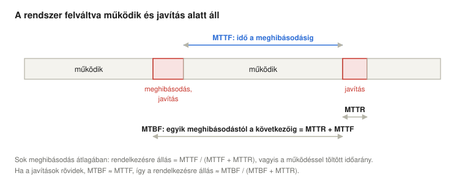
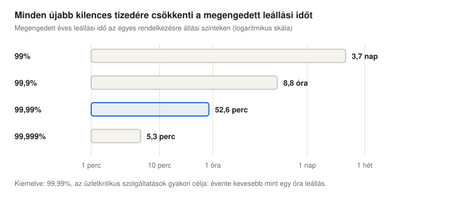
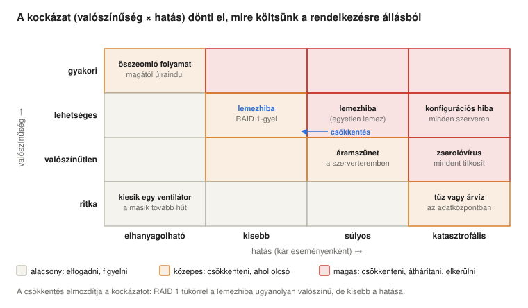
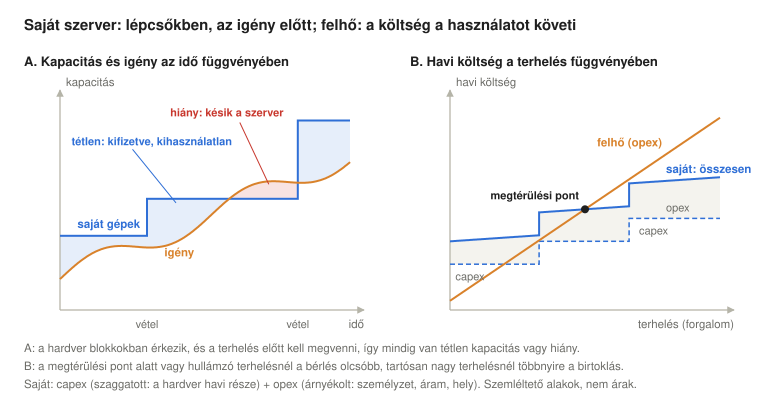
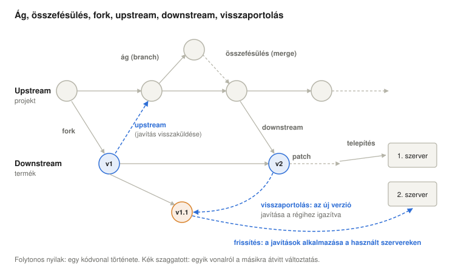
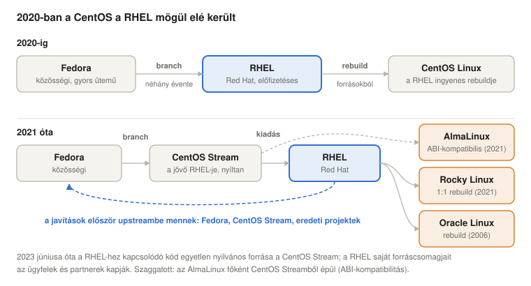
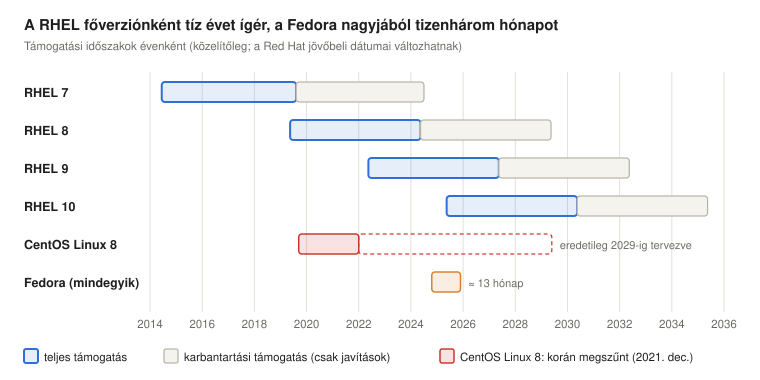
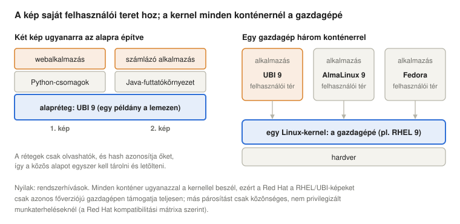
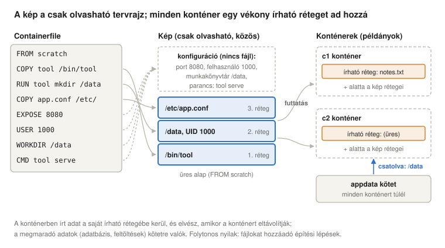

# Minőség, üzleti szempontok és az Enterprise Linux ökoszisztéma

*Operációs rendszerek előadás: mitől jó egy operációs rendszer, hogyan mérik és adják el a minőségét (MTBF, rendelkezésre állás, SLA), hogyan épül fel és hogyan tartják karban a Fedora, CentOS Stream, RHEL, AlmaLinux és Rocky Linux alkotta családot, és hogyan jut el mindez a konténerekig (UBI, registryk, Podman, image mode)*

Előző: [Az operációs rendszerek történeti fejlődése](../01-historic-evolution/). Következő: [Kognitív ergonómia és az operációs rendszerek felhasználói felülete](../03-cognitive-ergonomics/).

> **Hogyan olvasd ezt az előadást?** Ahol új rövidítés vagy fogalom jelenik meg, utána egy **Egyszerűen elmagyarázva** feliratú doboz következik. Kattints rá, és kinyílik egy köznapi nyelvű magyarázat. Ha már ismered a fogalmakat, nyugodtan átugorhatod ezeket a dobozokat.

## Tanulási célok

Az előző előadás azt mutatta be, hogyan alakultak ki az operációs rendszerek; a következők a rendszert használó emberek felé fordulnak, majd a gép belsejébe néznek: az utasítás-végrehajtási ciklust és a megszakításokat vizsgálják. A kettő között ez az előadás hátrébb lép, és azt kérdezi: mennyire jó egy operációs rendszer, hogyan mérik ezt és hogyan ígérik meg szerződésben, és hogyan épül fel egy közösségi projektből egy kereskedelmi Linux-disztribúció, amelyet aztán tíz évig stabilan tartanak.

Az előadás végére a hallgatók képesek lesznek:

- felsorolni egy operációs rendszer minőségi szempontjait, és összevetni őket az ISO/IEC 25010 minőségmodellel;
- definiálni az MTTF, MTTR, MTBF és a rendelkezésre állás fogalmát, kiszámítani a rendelkezésre állást és a megengedett leállási időt;
- kiszámítani sorosan és párhuzamosan kapcsolt komponensek rendelkezésre állását, és megmagyarázni, miért segít a redundancia;
- valószínűség és hatás szerint kockázati mátrixban értékelni a kockázatokat, és ennek alapján eldönteni, mire érdemes költeni a rendelkezésre állás javításából;
- elmagyarázni az SLI, az SLO és az SLA közötti különbséget, és megmérni egy egyszerű SLI-t;
- összehasonlítani a saját szerverek birtoklását (capex) a felhőkapacitás bérlésével (opex), és megmagyarázni, mikor melyik az olcsóbb;
- használni a kódvonalak szókincsét: ág (branch), összefésülés (merge), fork, upstream, downstream, javítócsomag (patch), visszaportolás (backport), frissítés (update);
- leírni, hogyan viszonyul egymáshoz a Fedora, a CentOS Stream, a RHEL, az AlmaLinux, a Rocky Linux és az Oracle Linux, és mi változott 2020-ban és 2023-ban;
- megmagyarázni, miért portolja vissza egy vállalati disztribúció a javításokat ahelyett, hogy új verzióra váltana, és miért mond önmagában keveset a verziószám a biztonságról;
- elmagyarázni, mi a konténerkép (rétegek, registryk, OCI), miért osztozik a konténer a gazdagép (host) kernelén, és mi következik ebből a kompatibilitásra és a támogatásra;
- megkülönböztetni a konténerképet, a konténert és a kötetet (volume), konténerképet építeni Containerfile-ból, és megmagyarázni, miért kell a konténer fő folyamatának az előtérben futnia;
- összehasonlítani a család alapképeit (UBI és változatai, Fedora, CentOS Stream, AlmaLinux, Rocky Linux) és felhasználási feltételeiket, valamint megnevezni a Podman, a Buildah, a Skopeo és az image mode szerepét.

<details>
<summary><b>Egyszerűen elmagyarázva:</b> disztribúció, közösségi projekt, enterprise (vállalati), Fedora, RHEL, CentOS, AlmaLinux, Rocky Linux</summary>

- **Disztribúció (disztró):** a Linux-kernelre épülő teljes operációs rendszer: a kernel és több ezer program, egy telepítő és egy frissítési rendszer, amelyeket együtt teszteltek, hogy összeműködjenek. Az Ubuntu, a Fedora és a RHEL disztribúció.
- **Közösségi projekt:** olyan szoftver, amelyet önkéntesek és cégek együtt, nyíltan fejlesztenek, és általában ingyenes.
- **Enterprise (vállalati):** cégeknek és szervezeteknek szól, amelyeknek stabilitás, hosszú támogatás és valaki kell, akit fel lehet hívni, ha valami elromlik.
- **Fedora, RHEL, CentOS, AlmaLinux, Rocky Linux:** egyetlen Linux-disztribúciócsalád tagjai. A RHEL (Red Hat Enterprise Linux) a kereskedelmi változat; a többit ez az előadás mutatja be.

</details>

## Mitől jó egy operációs rendszer?

Egy operációs rendszert nem csak a sebessége alapján ítélünk meg. A legfontosabb minőségi szempontok:

| Szempont | Jelentés | Példa |
| --- | --- | --- |
| **Robusztus** | váratlan helyzetben is helyesen működik tovább: hibás bemenet, túlterhelés, meghibásodó lemez esetén | egy összeomló program nem rántja magával az egész rendszert |
| **Következetes** | ugyanazok a dolgok mindenhol ugyanúgy működnek, így a felhasználók és a programozók előre láthatják a viselkedést | minden program ugyanazokkal a rendszerhívásokkal olvas fájlt; minden beállítás ugyanúgy módosítható |
| **Arányos** | a felhasznált erőforrás arányos az elvégzett munkával: a kis feladat olcsó, a tétlen rendszer (szinte) semmit sem fogyaszt | a tétlen laptop kevés energiát vesz fel; a hálózatot nem használó program nem fizet érte |
| **Elnéző** | eltűri az emberi hibákat, és lehetővé teszi visszacsinálásukat | lomtár az azonnali törlés helyett, pillanatkép frissítés előtt, „Biztos benne?” kérdés lemezformázás előtt |
| **Visszafelé kompatibilis** | a régebbi verziókhoz készült programok és adatok az újabbakon is működnek | a RHEL 9.0-ra fordított program a RHEL 9.6-on is fut |
| **Kényelmes** | könnyű telepíteni, megtanulni és használni | értelmes alapbeállítások, világos hibaüzenetek |
| **Nagy teljesítőképességű** | sok mindenre képes: gazdag funkciókészlet, nagy gépekre és nagy terhelésre is skálázódik | fut laptopon és több száz magos szerveren is |
| **Kis többletterhelésű** | maga az operációs rendszer a gép idejének és memóriájának csak kis részét használja | az $\eta_{OS}$ mérés a [történeti előadásban](../01-historic-evolution/) |
| **Alacsony üzemeltetési költségű** | olcsó működésben tartani: kevés kézi beavatkozás, egyszerű frissítés, hosszú támogatás | automatikus biztonsági frissítések, tízéves támogatási időszak |

E szempontok közül néhány egymás ellen hat. A „nagy teljesítőképesség” több funkció felé húz, a „kis többletterhelés” és az „alacsony üzemeltetési költség” kevesebb felé. A „visszafelé kompatibilitás” megnehezíti a régi, rosszul tervezett interfészek eltávolítását. Az „elnézőség” (a régi verziók és a visszavonási információk megőrzése) tárhelybe kerül. Operációs rendszert tervezni annyit jelent, mint a felhasználók számára megfelelő egyensúlyt választani: egy telefonnak, egy asztali gépnek és egy bank szerverének más-más egyensúly kell.

Az „arányosság” külön megjegyzést érdemel: az adatközpontokban az **energiaarányosság** (energy proportionality) önálló tervezési céllá vált. Barroso és Hölzle (2007) kimutatta, hogy a jellemző szerverek szinte tétlenül is csúcsteljesítményük nagyjából felét fogyasztották, és olyan hardvert és szoftvert sürgettek, amelynek energiafelhasználása az elvégzett munkával együtt nő és csökken. A modern operációs rendszerek energiatakarékos funkciói (tétlenségi állapotok, frekvenciaskálázás) éppen ezt a célt szolgálják, és a szerverek üresjárati fogyasztása 2007 óta sokat csökkent.

**A szabvány szemlélete.** A szoftverminőség nemzetközi szabványa, az ISO/IEC 25010 (2023-ban átdolgozva) kilenc jellemzővel írja le a termékminőséget: funkcionális megfelelőség, teljesítményhatékonyság, kompatibilitás, interakciós képesség (korábban „használhatóság”), megbízhatóság, biztonság (security), karbantarthatóság, rugalmasság (korábban „hordozhatóság”) és biztonságosság (safety) (International Organization for Standardization, 2023). A fenti szempontok megfeleltethetők ezeknek, bár nem egy az egyben: a *robusztus* a megbízhatóságnak felel meg (annak hibatűrés és helyreállíthatóság nevű aljellemzőinek; a 2023-as átdolgozás az „érettséget” is „hibamentességre” nevezte át); a *következetes* és a *kényelmes* az interakciós képességnek (kezelhetőség, megtanulhatóság); az *elnéző* ugyanennek a felhasználói hibák elleni védelem nevű aljellemzőjének; a *visszafelé kompatibilis* a rugalmasságnak, a cserélhetőség alatt (egy újabb verzió helyettesítheti a régebbit); a *kis többletterhelésű* és az *arányos* a teljesítményhatékonyságnak; a *nagy teljesítőképességű* a funkcionális megfelelőségnek és részben a rugalmasságnak (skálázhatóság). Az *alacsony üzemeltetési költségnek* nincs egyetlen helye: a szabvány karbantarthatósága arról szól, milyen könnyen tudják a *fejlesztők* módosítani a terméket, az *üzemeltetők* munkája viszont a kezelhetőség és a telepíthetőség alá tartozik.

<details>
<summary><b>Egyszerűen elmagyarázva:</b> szempont (kritérium), robusztus, következetes, arányos, elnéző, visszafelé kompatibilis, többletterhelés, karbantartás, pillanatkép, ISO/IEC 25010, energiaarányosság</summary>

- **Szempont (kritérium):** mérce, amely alapján valamit megítélünk.
- **Robusztus:** nehezen romlik el, mint az az autó, amely göröngyös úton is gond nélkül elmegy.
- **Következetes:** mindig ugyanazokat a szabályokat követi, így ha egy részét megtanultuk, a többi is úgy működik, ahogy várjuk.
- **Arányos:** a költség a használattal nő. Egy rövid telefonhívás kevesebbe kerül, mint egy hosszú, és ha nem telefonálunk, nem fizetünk semmit.
- **Elnéző:** hagyja visszacsinálni a hibáinkat, mint a szövegszerkesztő „Visszavonás” gombja.
- **Visszafelé kompatibilis:** az új verzió a régi dolgokkal is működik, mint az új játékkonzol, amelyen a régi játékok is futnak.
- **Többletterhelés (overhead):** az a munka, amelyet az operációs rendszer önmagáért végez, és nem a programjainkért.
- **Karbantartás:** a rendszer működésben tartásának folyamatos munkája: frissítések, javítások, felügyelet.
- **Pillanatkép (snapshot):** a rendszer állapotáról egy adott pillanatban mentett másolat, amelyhez vissza lehet térni, ha egy frissítés rosszul sül el.
- **ISO/IEC 25010:** nemzetközi szabvány (közösen elfogadott szabálykönyv), amely felsorolja, mit jelent a „minőség” szoftverek esetében. Az ISO és az IEC a nemzetközi szabványügyi szervezetek.
- **Energiaarányosság:** a számítógép kevés energiát fogyasszon, ha kevés a dolga, mint az autó, amelynek motorja leáll a piros lámpánál.
- **Tétlenségi állapotok, frekvenciaskálázás:** a processzor energiatakarékossági módjai: ha nincs dolga, részeket kapcsol ki magában, és lassabban fut, ha nincs szükség a teljes sebességre.
- **Skálázhatóság:** az a képesség, hogy több erőforrással (például több processzorral) több munkát tud elvégezni.
- **Kezelhetőség, telepíthetőség:** mennyire könnyű a rendszert üzemeltetni (futtatni és felügyelni), illetve telepíteni.

</details>

## A minőség mérése: KPI-k

Amit nem lehet mérni, azt nem lehet megígérni. A szervezetek ezért **kulcsfontosságú teljesítménymutatókat** (key performance indicators, KPI) követnek: néhány számot, amelyből látszik, hogy egy rendszer azt teszi-e, amit kell. Egy operációs rendszer vagy a rajta futó szolgáltatás legfontosabb KPI-jai a **megbízhatóságot** (milyen ritkán hibásodik meg) és a **rendelkezésre állást** (az idő mekkora részében működik) mérik.

Nem ezek az egyetlenek. Egy operációs rendszer és a rajta futó szolgáltatások KPI-jai három csoportba sorolhatók:

- **teljesítmény:** **átbocsátóképesség** (throughput: kérés vagy tranzakció másodpercenként), **késleltetés** (latency: válaszidő, általában **percentilisként** megadva, például „a kérések 99%-ára 200 ms-on belül érkezik válasz”, mert az átlag elrejti azt a lassú kisebbséget, amelyet a felhasználók észrevesznek), valamint a CPU, a memória, a lemez és a hálózat **kihasználtsága** (utilisation);
- **hatékonyság:** magának az operációs rendszernek a többletterhelése (a [történeti előadás](../01-historic-evolution/) $\eta_{OS}$-e), a kérésenként felhasznált energia, az indulási (boot) idő;
- **üzemeltetés:** egy biztonsági javítás közzétételétől addig eltelt idő, amíg minden szerverre feltelepül, a teljesen naprakész szerverek aránya, a havi incidensek száma és az MTTR.

A jó KPI-t automatikusan mérik, célértéke van, és ha nem teljesül, intézkedés következik belőle. A szakasz további része a két legfontosabbal, a megbízhatósággal és a rendelkezésre állással foglalkozik.

### MTTF, MTTR és MTBF



Egy javítható rendszer felváltva működik és áll javítás alatt. Sok meghibásodás átlagában (Avižienis et al., 2004):

- **MTTF** (mean time to failure, átlagos idő a meghibásodásig): az az átlagos idő, ameddig a rendszer a meghibásodás előtt működik. A **megbízhatóságot** méri.
- **MTTR** (mean time to repair vagy to recovery, átlagos javítási/helyreállítási idő): a meghibásodástól az újbóli működésig eltelt átlagos idő. Beletartozik a hiba észlelése, az ok megtalálása és a javítás, így függ attól is, mennyire karbantartható a rendszer, és attól is, milyen a szervezet felügyeleti rendszere, személyzete és alkatrészkészlete.
- **MTBF** (mean time between failures, meghibásodások közötti átlagos idő): az egyik meghibásodástól a következőig eltelt átlagos idő, tehát MTBF = MTTF + MTTR.

Az idő azon része, amikor a rendszer működik, a **rendelkezésre állás** (availability) (Hennessy & Patterson, 2019):

$$A = \frac{MTTF}{MTTF + MTTR}$$

Ha a javítások sokkal rövidebbek, mint a meghibásodások közötti idő, akkor MTBF ≈ MTTF, így $A \approx MTBF / (MTBF + MTTR)$. Egy szerver, amely átlagosan 2000 órát működik a meghibásodás előtt (MTTF), és 4 óra a javítása, az idő 2000 / 2004 = 99,8%-ában áll rendelkezésre.

**Az MTBF nem élettartam.** A hardverek adatlapjai gyakran óriási MTBF-értékeket adnak meg: egy 1,2 millió óra MTBF-ű lemez nem tart ki 137 évig. A szám egy meghibásodási *ráta*, amelyet sok fiatal eszközön mértek: 1000 ilyen lemezből évente nagyjából 7 hibásodik meg. A hardverek meghibásodási rátája a **kádgörbét** (bathtub curve) követi: az elején magas (korai hibák), a hasznos élettartam alatt alacsony és nagyjából állandó, majd az alkatrészek kopásával újra nő; az MTBF-értékek csak a lapos középső részt írják le. A szoftver nem kopik el: azért hibásodik meg, mert bizonyos bemenetek, terhelések vagy időzítések hibákat (bugokat) hoznak elő, és meghibásodási rátája minden frissítéssel változik.

A képlet a rendelkezésre állás javításának két útját mutatja: ritkábban meghibásodni (hosszabb MTTF), vagy gyorsabban helyreállni (rövidebb MTTR). A második gyakran olcsóbb. Az automatikus újraindítás, az átvételre kész tartalék gépek és a jó felügyelet órákról másodpercekre rövidítik az MTTR-t.

### A kilencesek

A rendelkezésre állást általában „kilencesekben” adják meg:



| Rendelkezésre állás | Megnevezés | Leállási idő évente | Leállási idő havonta |
| --- | --- | --- | --- |
| 99% | két kilences | 3,7 nap | 7,3 óra |
| 99,9% | három kilences | 8,8 óra | 43,8 perc |
| 99,99% | négy kilences | 52,6 perc | 4,4 perc |
| 99,999% | öt kilences | 5,3 perc | 26,3 másodperc |

Minden újabb kilences tízszer kevesebb leállást enged meg, és általában sokkal többe kerül, mint az előző. Öt kilences évente nagyjából öt percet hagy, kevesebbet, mint sok szerver egyetlen újraindítása: ilyen rendszert egyetlen gépből egyáltalán nem lehet építeni, csak több, egymást helyettesítő gépből.

A gyakorlatban két részlet fontos. A **tervezett** (frissítések miatti) és a **nem tervezett** (meghibásodás okozta) leállást gyakran külön számolják, és a szerződések kizárhatják a tervezett részt. A rendelkezésre állás ráadásul nem mindig „minden vagy semmi”: a lassan válaszoló, vagy csak a felhasználók egy részét kiszolgáló rendszer **csökkent szolgáltatási szinten** (degraded) működik, és SLI-jének (lásd lent) el kell döntenie, hogyan számolja ezt. Adatokra két további célt használnak: az **RTO**-t (recovery time objective, helyreállítási időcél: mennyi ideig tarthat a szolgáltatás helyreállítása) és az **RPO**-t (recovery point objective, helyreállítási pontcél: mennyi friss adat veszhet el, például a legutóbbi mentés óta eltelt 15 perc adatai).

### Soros és párhuzamos kapcsolás

Egy szolgáltatás általában több komponenstől függ, és összekapcsolásuk számtana megmagyarázza, miért működik a redundancia:

- **Soros kapcsolás** (minden komponensre szükség van: egy szerverre *és* a lemezére *és* a hálózatára): a rendelkezésre állások összeszorzódnak. Két 99%-os komponens együtt 0,99 × 0,99 = 98,01%, rosszabb bármelyiknél.
- **Párhuzamos kapcsolás** (bármelyik komponens elég: két szerver, amelyek közül bármelyik kiszolgálhatja a kérést): a rendszer csak akkor hibásodik meg, ha mind meghibásodik. Két 99%-os komponens együtt 1 − 0,01 × 0,01 = 99,99%.

Két egyszerű, egyenként két kilences gép együtt négy kilencest ad, feltéve, hogy egymástól függetlenül hibásodnak meg, és az átkapcsolás működik. Ezért építik a magas rendelkezésre állású rendszereket redundáns, független részekből, és ezért olyan veszélyes egy közös egyedüli hibapont (egyetlen tápegység, egyetlen hálózati kapcsoló, egyetlen, minden gépre átmásolt konfigurációs hiba). Maga az átkapcsoló mechanizmus, például egy **terheléselosztó** (load balancer), amely minden kérést egy működő szerverre küld, sorosan kapcsolódik a redundáns részhez, ezért legalább olyan rendelkezésre állásúnak kell lennie, mint a cél.

<details>
<summary><b>Egyszerűen elmagyarázva:</b> KPI, megbízhatóság, rendelkezésre állás, MTTF, MTTR, MTBF, leállási idő, redundancia, soros, párhuzamos, egyedüli hibapont, terheléselosztó, kádgörbe, tervezett leállás, csökkent szolgáltatási szint, RTO, RPO, hibatűrés</summary>

- **KPI** (Key Performance Indicator, kulcsfontosságú teljesítménymutató): az a néhány legfontosabb szám, amely megmutatja, mennyire mennek jól a dolgok, mint egy diák tanulmányi átlaga.
- **Átbocsátóképesség, késleltetés:** az átbocsátóképesség az, hogy másodpercenként mennyi munka készül el, mint ahány autó percenként áthalad egy hídon; a késleltetés az, hogy egyetlen munka mennyi ideig tart, mint ameddig egy autó átér a hídon.
- **Percentilis:** „a 99. percentilis 200 ms” azt jelenti, hogy 100 kérésből 99 legfeljebb 200 ms alatt teljesült. Megmutatja azokat a lassú eseteket, amelyeket az átlag elrejt.
- **Kihasználtság:** az idő mekkora részében dolgozik egy erőforrás, mint ahány órát naponta jár egy mosógép.
- **Incidens:** nem tervezett esemény, amely megzavar egy szolgáltatást, például egy leállás vagy egy biztonsági betörés.
- **Megbízhatóság:** milyen ritkán romlik el valami. **Rendelkezésre állás:** az idő mekkora részében használható. Az az autó, amely évente egyszer romlik el, de egy hónapig javítják, megbízható, de nem nagyon áll rendelkezésre.
- **MTTF, MTTR, MTBF:** átlagos idő a meghibásodásig, a javításig, illetve két meghibásodás között.
- **Leállási idő:** az az idő, amíg a rendszer nem működik.
- **Redundancia:** tartalék részek, amelyek át tudják venni a feladatot, mint a kétmotoros repülőgép.
- **Soros / párhuzamos:** sorosan a lánc minden elemének működnie kell, mint a régi karácsonyi égősornál, ahol egy kiégett izzó az egész sort elsötétíti; párhuzamosan egy működő rész is elég, mint két út ugyanabba a városba.
- **Egyedüli hibapont (single point of failure):** olyan rész, amelynek meghibásodása mindent leállít, akárhány tartalék van máshol.
- **Terheléselosztó (load balancer):** eszköz vagy program, amely a beérkező kéréseket több szerver között osztja szét, és a meghibásodott szervernek nem küld több munkát.
- **Kádgörbe:** a hardver jellemző meghibásodási rátája élete során: újonnan sok a hiba, középen kevés, a kopással ismét több; oldalról nézve olyan, mint egy fürdőkád.
- **Tervezett / nem tervezett leállás:** frissítés miatt előre bejelentett leállás, illetve váratlan meghibásodás.
- **Csökkent szolgáltatási szint (degraded):** működik, de rosszabbul a szokásosnál, például lassan vagy csak a felhasználók egy részének.
- **RTO, RPO** (Recovery Time / Point Objective): milyen gyorsan kell a szolgáltatásnak egy katasztrófa után újra működnie, és mennyi a legfrissebb adatokból veszhet el.
- **Hibatűrés, helyreállíthatóság:** az a képesség, hogy hiba ellenére is tovább működik, illetve hogy hiba után visszatér a normális működéshez.

</details>

### Mire költsünk a rendelkezésre állásból: a kockázati mátrix

Minden újabb kilences pénzbe kerül, ezért oda érdemes költeni, ahol a legtöbb kockázatot szünteti meg. A kockázatértékelés minden fenyegetést két tényező szerint ítél meg: a **valószínűsége** (milyen gyakran várható, hogy bekövetkezik) és a **hatása** (mekkora kárt okoz, ha bekövetkezik) szerint; a kockázat e kettő együttese (Joint Task Force Transformation Initiative, 2012). Ha mindkettő számszerűen becsülhető, szorzatuk az évi várható veszteség: egy ötévente egyszer várható meghibásodás, amely 50 000 euró kiesett bevételbe és javításba kerül, évi 10 000 euró kockázatot jelent, így egy intézkedés, amely megszünteti, évente nagyjából ennyit ér meg. Gyakrabban mindkettőt durva skálán becsülik, és a fenyegetéseket egy **kockázati mátrixban** helyezik el:



A cella színe a választ sugallja. Az alacsony kockázatot **elfogadják** és figyelik. A nagyobbat **csökkentik**: vagy kevésbé valószínűvé teszik (teszteléssel, karbantartással, olyan felügyelettel, amely észreveszi a problémát, mielőtt meghibásodás lesz belőle), vagy kevésbé károssá (redundanciával, mentésekkel, gyors helyreállítással). **Át is hárítható** valaki másra, biztosítással vagy SLA-t tartalmazó kiszervezési szerződéssel, bár a jóváírás ritkán fedezi az ügyfél teljes kárát. És **elkerülhető** is, ha a kockázatos dolgot egyáltalán nem tesszük.

Ennek az előadásnak a mennyiségei mindkét tengelyhez eszközt adnak. A meghibásodási ráta (1/MTTF) a meghibásodás valószínűsége; az MTTR, az RTO és az RPO a hatását határozza meg: meddig áll a szolgáltatás, és mennyi adat vész el. A redundancia főleg a hatást csökkenti: egy RAID 1 tükörben lévő lemez ugyanolyan gyakran hibásodik meg, mint addig, de a meghibásodása leállás helyett csak egy lemezcserébe kerül. A mátrix azt is megmutatja, hogy a legsúlyosabb kockázatok gyakran nem egyes komponensek. Egy minden szerverre átmásolt konfigurációs hiba egyszerre hatástalanítja az összes redundanciát (a fenti közös egyedüli hibapont), zsarolóvírus vagy adatközponti tűz ellen pedig csak a máshol tárolt mentések segítenek, mert az ugyanott lévő redundáns másolatokat együtt titkosítják vagy együtt égnek el.

<details>
<summary><b>Egyszerűen elmagyarázva:</b> kockázat, valószínűség, hatás, várható veszteség, kockázati mátrix, elfogadás, csökkentés (mitigáció), áthárítás, elkerülés, RAID 1, zsarolóvírus, mentés</summary>

- **Kockázat:** valami rossz, ami megtörténhet, aszerint megítélve, mennyire valószínű és mekkora kárt okozna.
- **Valószínűség, hatás:** milyen gyakran várható, hogy valami bekövetkezik, és mekkora kárt okoz, ha bekövetkezik. A defekt valószínű, de olcsó; a háztűz valószínűtlen, de szörnyű.
- **Várható veszteség:** egy esemény kára szorozva azzal, milyen gyakran fordul elő. Egy kétévente várható 500 eurós javítás átlagosan évi 250 euróba „kerül”.
- **Kockázati mátrix:** táblázat, amelynek egyik oldalán a valószínűség, a másikon a hatás áll; minden fenyegetés kap egy cellát, és a veszélyes sarok az, ahol mindkettő nagy.
- **Elfogadás, csökkentés (mitigáció), áthárítás, elkerülés:** a négy dolog, amit egy kockázattal tehetsz: együtt élsz vele, kisebbé teszed, mással viseled (mint a biztosításnál), vagy abbahagyod azt, ami okozza.
- **RAID 1** (tükrözés): két lemez, amelyeken mindig ugyanaz az adat van, így az egyik tönkremehet anélkül, hogy bármi elveszne.
- **Zsarolóvírus (ransomware):** kártevő program, amely titkosítja az áldozat fájljait, és pénzt követel a kulcsért.
- **Mentés (backup):** az adatok külön másolata, amelyből visszaállíthatók; legjobb, ha másik helyen tárolják, hogy egyetlen katasztrófa ne pusztíthassa el mindkettőt.

</details>

## A minőség ígérete: SLI, SLO, SLA

Ha egy cég ügyfeleknek üzemeltet operációs rendszert vagy szolgáltatást, a rendelkezésre állás szerződéses ígéretté válik. Három kifejezést használnak, amelyeket könnyű összekeverni (Beyer et al., 2016):

| Kifejezés | Mi ez? | Példa |
| --- | --- | --- |
| **SLI**, service level indicator (szolgáltatásiszint-mutató) | egy mért szám | a sikeresen megválaszolt kérések aránya az elmúlt 30 napban |
| **SLO**, service level objective (szolgáltatásiszint-cél) | az SLI belső célértéke | a kérések legalább 99,9%-a sikeres, 30 napra mérve |
| **SLA**, service level agreement (szolgáltatásiszint-megállapodás) | az ügyféllel kötött szerződés, beleértve azt is, mi történik, ha a cél nem teljesül | 99,5% havi rendelkezésre állás; ez alatt az ügyfél visszakapja a havidíj 10%-át |

Az SLA általában lazább, mint az SLO: a szolgáltató magasabbra céloz, mint amit megígér, hogy biztonsági tartaléka maradjon. Egy valódi SLA pontosan meghatározza azt is, hogyan mérik a rendelkezésre állást, mi számít leállásnak (a tervezett karbantartási ablakokat gyakran kizárják), milyen gyorsan kell a szolgáltatónak reagálnia egy bejelentett problémára (a támogatás **válaszideje**), és milyen **jóváírás** (service credit) jár, ha nem teljesít.

A 100% és az SLO közötti különbség a **hibakeret** (error budget). Ha az SLI kéréseket számol, egy 99,9%-os SLO a kérések 0,1%-ának sikertelenségét engedi meg; ha időt számol, 30 nap alatt nagyjából 43 perc hibás működést. Amíg a keret nem fogy el, a csapat vállalhat kockázatot, például telepíthet új verziókat; ha elfogyott, a stabilitás kerül előtérbe.

<details>
<summary><b>Egyszerűen elmagyarázva:</b> SLI, SLO, SLA, jóváírás, hibakeret, karbantartási ablak</summary>

- **SLI** (Service Level Indicator, szolgáltatásiszint-mutató): amit mérünk, például egy vasúttársaság pontossági aránya.
- **SLO** (Service Level Objective, szolgáltatásiszint-cél): a magunk elé tűzött cél, például „a vonatok 95%-a érjen be időben”.
- **SLA** (Service Level Agreement, szolgáltatásiszint-megállapodás): a szerződésben tett ígéret, következményekkel, például „ha a vonatod több mint egy órát késik, visszakapod a jegyár felét”.
- **Jóváírás (service credit):** az a pénz vagy kedvezmény, amellyel a szolgáltató tartozik, ha megszegi az SLA-t.
- **Hibakeret (error budget):** az a hibamennyiség, amelyet a cél még megenged; amíg tart, a csapat vállalhat kockázatot.
- **Karbantartási ablak:** bejelentett időszak, amikor a szolgáltatás frissítés miatt leállhat; általában nem számít leállásnak.
- **Telepítés (deploy):** egy program új verziójának üzembe helyezése azokon a szervereken, ahol valódi felhasználókat szolgál ki.
- **Felügyelet (monitoring):** annak automatikus, folyamatos ellenőrzése, hogy a rendszerek működnek-e, riasztással, ha nem.

</details>

## A nyílt forráskódú operációs rendszer üzleti oldala

A Linux és egy Linux-disztribúció szinte minden szoftvere nyílt forráskódú: bárki elolvashatja, módosíthatja és továbbadhatja a kódot, és az olyan licencek szerint, mint a GNU GPL, aki módosított változatot terjeszt, annak a módosításait is meg kell osztania. Hogyan adhat el akkor egy cég ilyen operációs rendszert? A Red Hat válasza, amely a legnagyobb nyílt forráskódú cégek egyikévé tette (az IBM 2019-ben mintegy 34 milliárd dollárért vásárolta meg), az, hogy nem a kódot adja el. **Előfizetést** (subscription) árul, amely a következőket nyújtja:

- **támogatás:** felhívható szakértők, szerződésben (SLA-ban) rögzített válaszidőkkel;
- **hosszú életciklus:** biztonsági és hibajavítások főverziónként tíz évig, anélkül, hogy új verzióra kellene váltani, és választhatóan hosszabb támogatás egyes alverziókra (Extended Update Support, EUS);
- **stabilitás:** egy főverzión belül rögzített interfészkészlet, hogy a programok és az eszközmeghajtók (driverek) a frissítések után is működjenek (például stabil kernelinterfész a driverek számára, a **kABI**);
- **tanúsítás:** a hardvergyártók tanúsítják szervereiket, a független szoftverszállítók (ISV-k: adatbázisok, üzleti szoftverek, például az SAP és mások gyártói) pedig termékeiket a RHEL-en, így az ügyfél mindkét oldalról támogatást kap;
- **jogi és biztonsági garancia:** nyomon követhető biztonsági közlemények minden javított sebezhetőségről, és segítség, ha licenckérdések merülnek fel.

Az ügyfél számára az előfizetés ára csak egy része a **teljes birtoklási költségnek** (total cost of ownership, TCO): beleszámít a hardver, az üzemeltető személyzet, a leállások és a néhány évenkénti új verzióra való átállás költsége is. Egy rövid életciklusú ingyenes disztribúció több személyzeti időbe kerülhet, mint egy fizetős, tízéves frissítésekkel, de a fordítottja is előfordulhat. A választás egyszerre mérnöki és üzleti döntés.

<details>
<summary><b>Egyszerűen elmagyarázva:</b> nyílt forráskód, GPL, előfizetés, életciklus, kABI, ISV, SAP, IBM, Oracle, SUSE, EUS, driver, tanúsítás, biztonsági közlemény, sebezhetőség, TCO</summary>

- **Nyílt forráskód (open source):** olyan szoftver, amelynek licence megengedi, hogy bárki elolvassa, módosítsa és továbbadja a forráskódját. Az a kód, amely csak megtekinthető, de nincs ilyen licence, nem nyílt forráskódú.
- **GPL** (GNU General Public License): a Linux-kernel és sok más program licence. Akinek a programot továbbadjuk, akár módosítva, akár változatlanul, annak joga van a forráskódjához, és ugyanezzel a licenccel továbbadhatja.
- **Előfizetés:** rendszeres (például évenkénti) fizetés egy szolgáltatásért, mint egy streamingszolgáltatásnál, egyszeri vásárlás helyett.
- **Életciklus:** meddig támogatnak egy verziót a kiadásától addig, amíg a frissítések megszűnnek.
- **kABI** (kernel Application Binary Interface, kernel bináris alkalmazásinterfész): azok a rögzített „csatlakozók”, amelyeken át a driverek a kernelhez kapcsolódnak. A Red Hat ezek egy felsorolt körét egy főverzión belül változatlanul tartja, így egyszer lefordított driver az adott verzió kernelfrissítései után is működik.
- **ISV, SAP:** az ISV (Independent Software Vendor, független szoftverszállító) olyan cég, amely más platformján futó szoftvert árul; az SAP egy nagy német üzleti szoftvergyártó.
- **IBM, Oracle, SUSE:** nagy informatikai cégek. Az IBM a Red Hat tulajdonosa; az Oracle adatbázisokat és saját Linuxot árul; a SUSE egy másik vállalati Linux-disztribúciót készít.
- **EUS** (Extended Update Support, kiterjesztett frissítési támogatás): fizetős, hosszabb támogatás egy adott alverzióra azoknak az ügyfeleknek, akik nem tudnak gyakran frissíteni.
- **Driver (eszközmeghajtó):** az a szoftver, amely egyfajta hardvert működtet, például egy hálózati kártyát.
- **Tanúsítás:** hivatalos megerősítés, hogy egy terméket teszteltek, és együttműködik egy másikkal, mint a telefonunkhoz tanúsított töltő.
- **Biztonsági közlemény, sebezhetőség:** a sebezhetőség biztonsági rés; a közlemény (advisory) a gyártó hivatalos értesítése, amely leírja a rést és az azt javító frissítést.
- **TCO** (Total Cost of Ownership, teljes birtoklási költség): minden, amibe valami teljes élete során kerül, nem csak a vételára; olyan, mint amikor egy autó árához hozzáadjuk az üzemanyagot, a biztosítást és a javításokat.

</details>

### Birtoklás vagy bérlés: capex, opex és a felhő

A TCO nagy részéről az dönt, hogy egy szervezet egyáltalán saját szervereket üzemeltet-e. A két lehetőség költségszerkezete eltérő:

- **Saját adatközpont (on-premises).** A szervereket, tárolókat és hálózati eszközöket blokkokban vásárolják meg, **tőkekiadásként** (capital expenditure, **capex**): ez előre kifizetett beruházás, amelyet több év alatt írnak le. Az üzemeltetés **működési kiadással** (operating expenditure, **opex**) jár: személyzet, áram, hűtés, hely és támogatási előfizetések. Mivel az új hardver megrendelése és üzembe helyezése heteket vesz igénybe, az igény *előtt* kell megvenni. Minden vásárlás után van kifizetett, de kihasználatlan, tétlen kapacitás; ha az igény az előrejelzésnél gyorsabban nő, a következő blokk megérkezéséig hiány van (lent az A panel).
- **Felhő.** A számítási kapacitást órára vagy másodpercre, a tárhelyet gigabájtra és hónapra bérlik, tisztán opexként. A kapacitás perceken belül követheti az igényt (**rugalmasság**, elasticity), így sem a tétlen kapacitással, sem a hiánnyal nem kell előre tervezni: a téves előrejelzés kockázata az ügyféltől a szolgáltatóra kerül (Armbrust et al., 2010).



A B panel a havi költségeket hasonlítja össze a terhelés függvényében. A birtoklásnak nagy fix része van (legalább egy blokk szerver és egy minimális személyzet, kis terhelés mellett is), utána lépcsőkben nő; a bérlés közel nulláról indul, és a használattal arányosan nő, de meredekebben, mert a szolgáltató ára fedezi a saját hardverét, személyzetét, az összes ügyfele számára fenntartott tartalékkapacitást és a nyereségét. Innen a hüvelykujjszabály: a felhő olcsóbb egy új vagy kis szolgáltatásnak, hullámzó vagy szezonális terhelésnél (egy webáruház karácsony előtt, egy egyetem tárgyfelvétele a félév első hetében) és olyan kísérleteknél, amelyeket a következő hónapban talán leállítanak; nagy, egyenletes és kiszámítható terhelésnél általában a birtoklás az olcsóbb. Több nagy cég ezért költöztetett vissza szolgáltatásokat a nyilvános felhőből a saját adatközpontjába; a Dropbox például közel 75 millió dollár megtakarításról számolt be két év alatt, miután munkaterhelései nagy részét a nyilvános felhőből saját, egyedi tervezésű infrastruktúrájára költöztette bérelt adatközponti helyeken (Wang & Casado, 2021). Sok szervezet ezért kombinálja a kettőt: saját szerverek az egyenletes alapterhelésre, felhő a csúcsokra.

Nem az ár az egyetlen szempont. A törvény előírhatja, hogy bizonyos adatokat egy adott országban tároljanak; az adatok *kivitele* a felhőből külön díjba kerül (kimenő forgalmi díj, egress fee); egy szolgáltató szolgáltatásait nehéz átvinni egy másikhoz (szállítói függőség, vendor lock-in); és a személyzetnek más készségekre van szüksége. Ennek az előadásnak a fogalmaival: a felhő a capex-döntést opex-döntéssé alakítja, és a költséget a használattal *arányossá* teszi, ami ugyanaz a szempont, mint az első szakasz energiaarányossága.

<details>
<summary><b>Egyszerűen elmagyarázva:</b> on-premises, capex, opex, leírás, felhő, rugalmasság, megtérülési pont, kimenő forgalmi díj, szállítói függőség</summary>

- **On-premises (helyben üzemeltetett):** a szerverek a szervezet saját épületében vagy bérelt szervertermében állnak, és ő maga birtokolja és üzemelteti őket.
- **Capex** (capital expenditure, tőkekiadás): egyszerre kifizetett pénz valamiért, amit évekig használnak, mint egy autó megvásárlása.
- **Opex** (operating expenditure, működési kiadás): folyamatosan fizetett pénz a működtetésért, mint az üzemanyag, vagy egy autó napi bérlése.
- **Leírás (értékcsökkenés):** egy hosszú életű vásárlás árának szétosztása a használat éveire, így egy négy évig használt, 4000 eurós szerver évente 1000 euróba „kerül”.
- **Felhő:** egy szolgáltató adatközpontjaiban álló számítógépek, amelyeket az ügyfelek az interneten át bérelnek, és a használat szerint fizetnek értük.
- **Rugalmasság (elasticity):** az a képesség, hogy terhelésnövekedéskor perceken belül több kapacitást kapjunk, és csökkenéskor visszaadjuk.
- **Megtérülési pont (break-even):** az a pont, ahol két lehetőség ugyanannyiba kerül; az egyik oldalán az első olcsóbb, a másikon a második.
- **Kimenő forgalmi díj (egress fee):** az a díj, amelyet egy felhőszolgáltató az adatközpontjaiból kiküldött adatokért számol fel.
- **Szállítói függőség (vendor lock-in):** annyira függeni egyetlen szállító különleges szolgáltatásaitól, hogy a másikra való átállás nagyon drágává válik.

</details>

## A kódvonalak szókincse

Egy operációs rendszer nem egyetlen kódbázis, hanem több ezer projekt, amelyek mindegyike szétváló és egyesülő történeti vonalak mentén fejlődik. Ennek szavai a szoftverfejlesztésből és az üzemeltetésből származnak; az elsők az olyan verziókezelő rendszerekből, mint a Git:



| Kifejezés | Jelentés |
| --- | --- |
| **ág (branch)** | külön fejlesztési vonal egy projekten *belül*, egy új funkcióhoz vagy egy kiadáshoz |
| **összefésülés (merge)** | egy ág változtatásainak visszaillesztése egy másik vonalba |
| **fork** | egy teljes projekt másolata, amely külön folytatódik, általában egy **másik közösség** vagy cég gondozásában, és idővel eltávolodik az eredetitől |
| **újrafordított másolat (rebuild)** | egy projekt közzétett forrásainak újrafordítása, a neveken és logókon kívül változtatás nélkül, hogy kompatibilis, az eredetit pontosan követő másolatot kapjunk |
| **upstream** | az eredeti projekt, amelyre mások építenek (a RHEL esetében: a Fedora, a Linux-kernel, a GNOME és több ezer más projekt) |
| **downstream** | upstream projektből épített projekt vagy termék |
| **javítócsomag (patch)** | a kód módosítása, általában javítás, olyan formában, amely egy kódvonalra alkalmazható |
| **függőség (dependency)** | másik csomag, amelyre egy programnak a működéséhez szüksége van; egy patch is függhet attól, hogy más patcheket előbb alkalmazzanak |
| **visszaportolás (backport)** | egy újabb verzióban készült javítás átvétele és hozzáigazítása egy régebbi, még támogatott verzióhoz |
| **telepítés (install)** | egy kiadás felrakása egy gépre |
| **frissítés (update, patch deployment, retrofit)** | javítások alkalmazása már telepített, használatban lévő rendszereken, újratelepítés nélkül |

**A patchek függőségei a gyakorlatban.** Tegyük fel, hogy egy biztonsági javítás a legújabb kernelhez készült. Amikor egy öt évvel régebbi kernelre portolják vissza, a karbantartók gyakran azt tapasztalják, hogy a javítás olyan segédfüggvényekre vagy adatszerkezet-változásokra támaszkodik, amelyek közben kerültek be. Ilyenkor előbb ezeket a korábbi patcheket (a javítás függőségeit) is vissza kell portolniuk, mindegyiket a régi kódhoz igazítva, és tesztelniük kell, hogy egyikük sem változtatja meg a stabil interfészeket. Egyetlen upstream patchből így egy tucatnyi downstream patchből álló sorozat lehet.

Ebből a szókincsből két munkaszabály következik:

- **Előbb upstream (upstream first).** A javítást először az upstream projektben kell elkészíteni, és csak utána átvenni downstream. Különben minden downstream terméknek örökké hurcolnia kell a saját privát patchét, és minden új upstream verziónál meg kell ismételnie a munkát. A Red Hat ezt az elvet követi: mérnökei a változtatásaikat a Fedorába, a Linux-kernelbe és a többi eredeti projektbe küldik be.
- **Visszaportolni, nem verziót váltani (backport, don't upgrade).** Egy vállalati disztribúció tíz évre stabil interfészeket ígér, ezért nem válthat egyszerűen minden új upstream verzióra. Ehelyett megtartja a kiadott verziókat, és visszaportolja a javításokat, néha új funkciókat is. Ez nagy mennyiségű, gondos munka, és központi része annak, amiért az előfizetést fizetik. A javítások alkalmazása a már használatban lévő szervereken általában frissített csomagok telepítését és újraindítást jelent; **élő javítással** (live patching) a kritikus kerneljavítások akár a futó kernelre is alkalmazhatók újraindítás nélkül.

<details>
<summary><b>Egyszerűen elmagyarázva:</b> verziókezelés, Git, ág, összefésülés, fork, újrafordított másolat, GNOME, upstream, downstream, patch, függőség, visszaportolás, frissítés, élő javítás</summary>

- **Verziókezelés, Git:** olyan rendszer, amely egy projekt kódjának minden valaha történt változását rögzíti, azzal együtt, hogy ki és miért végezte, így bármely korábbi állapot visszaállítható. A Git a legelterjedtebb ilyen rendszer.
- **Ág / összefésülés (branch / merge):** mintha egy közös dokumentum új fejezetét egy külön példányban írnánk meg, majd ha kész, visszatennénk a fő dokumentumba.
- **Fork:** mintha egy csoport lemásolná az egész dokumentumot, és saját változatként, saját szerkesztőkkel folytatná.
- **Újrafordított másolat (rebuild):** mintha egy könyvet a kiadó fájljaiból újranyomnánk, más borítóval: a szöveg pontosan ugyanaz marad.
- **GNOME:** elterjedt asztali környezet (az ablakokból és menükből álló grafikus felület) Linuxra.
- **Upstream / downstream:** mint egy folyó: a változások a forrástól (upstream, „folyásirányban felfelé”) azok felé áramlanak, akik ráépítenek (downstream, „folyásirányban lefelé”).
- **Patch (javítócsomag):** pontos leírás arról, mely sorokat kell megváltoztatni, mint egy nyomtatott könyvhöz mellékelt hibajegyzék.
- **Függőség:** valami, ami egy programnak a működéséhez kell, mint a távirányítónak az elem.
- **Visszaportolás (backport):** az új modellhez tervezett javítás átvétele és hozzáigazítása a régi modellhez, amelyet a vásárlók még használnak.
- **Frissítés (patch deployment, retrofit):** fejlesztés beszerelése valamibe, ami már használatban van, mint amikor régi autókba utólag biztonsági övet szerelnek; a „retrofit” (utólagos beépítés) éppen erre használt általános mérnöki szó.
- **Élő javítás (live patching):** a futó kernel javítása a memóriában, újraindítás nélkül (a Red Hat eszköze a kpatch, az Oracle-é a Ksplice): olyan frissítés, amely elkerüli a tervezett leállást.

</details>

## Az Enterprise Linux család

### 2020-ig: Fedora, RHEL és CentOS



A **Fedora** a Red Hat által támogatott közösségi disztribúció. Gyorsan halad: nagyjából félévente jelenik meg új kiadása, és mindegyiket nagyjából 13 hónapig támogatják (Itechtics, n.d.). Az új technológiák először a Fedorában jelennek meg.

A **Red Hat Enterprise Linux (RHEL)** a Red Hat kereskedelmi disztribúciója. A Red Hat néhány évente egy Fedora-kiadást vesz kiindulópontnak, stabilizálja és teszteli, majd a RHEL új főverziójaként kiadja, és tíz évig támogatja. A fenti fogalmakkal: minden RHEL-főverzió egy Fedora-kiadásból ágazik le, és utána a Red Hat külön, saját változtatásokkal fejleszti tovább; 2021 óta ezt az ágat nyilvánosan, CentOS Stream néven fejlesztik, ahogy lent olvasható.

A **CentOS** (Community Enterprise Operating System), amely 2004-ben jelent meg először, a RHEL-t fordította újra azokból a forráscsomagokból, amelyeket a Red Hat nyilvánosan közzétett (többet, mint amennyit maga a GPL megkövetel, és sok más licencű csomagot is), eltávolította a Red Hat védjegyeit és logóit, és az eredményt ingyen adta. A CentOS a RHEL újrafordított másolata (rebuild) volt: pontosan követte a RHEL-t, eltérés nélkül. A CentOS a RHEL downstreamje volt: binárisan kompatibilis vele, de támogatás és tanúsítás nélkül. Nagyon népszerű lett szervereken, webtárhely-szolgáltatóknál és egyetemeken. 2014 januárjában a CentOS projekt csatlakozott a Red Hathez, amely átvette védjegyeit, és alkalmazta fő fejlesztőit ("CentOS," n.d.).

### 2020. december: a CentOS Stream upstreambe kerül

2020. december 8-án a Red Hat bejelentette, hogy megszünteti a **CentOS Linuxot**, és a 2019-ben elindított **CentOS Streamre** összpontosít. A CentOS Linux 8 frissítései 2021 végén megszűntek, nem pedig 2029-ben, a hivatalosan közzétett befejezési dátumon; a CentOS Linux 7 2024. június 30-ig folytatódott (Red Hat, 2020).

A CentOS Stream másfajta disztribúció. Nem egy kész RHEL-kiadás újrafordított másolata, hanem a RHEL *előtt* járó nyilvános fejlesztési ág: az a hely, ahol a következő RHEL-alverziót előkészítik, és ahol külső cégek is beküldhetik változtatásaikat, mielőtt azok a RHEL-be kerülnek. Az ábrán a CentOS a RHEL mögül elé került, downstreamből upstreambe. Minden főverzió a Fedorából ágazik le (a CentOS Stream 10 például a Fedora 40-re épül), és a következő RHEL-főverzióhoz vezet (OpenLogic, n.d.).

A Red Hat érve az volt, hogy a CentOS Stream valódi utat ad a külső fejlesztőknek és cégeknek a következő RHEL-hez való hozzájárulásra, amire egy downstream rebuild sosem lehetett képes. Sok felhasználó számára azonban ez a bizalom megsértése volt: a CentOS Linux 8-at a közzétett tízéves életciklusa miatt választották, és két év után elvesztették. A Red Hat ingyenes RHEL-előfizetést kínált egyéni fejlesztőknek (legfeljebb 16 rendszerre), valamint programokat nyílt forráskódú projekteknek és közösségeknek (Red Hat, 2020). Napokon belül új közösségi rebuildeket jelentettek be, és hónapokon belül ki is adták őket.

### AlmaLinux és Rocky Linux

- Az **AlmaLinux** 2021 márciusában adta ki első stabil verzióját (Linuxiac, n.d.). A CloudLinux cég indította, ma pedig az AlmaLinux OS Foundation működteti: egy nonprofit szervezet, amelynek kuratóriumát a tagok választják.
- A **Rocky Linuxot** 2020 decemberében alapította Gregory Kurtzer, az eredeti CentOS egyik társalapítója, és elhunyt CentOS-alapítótársáról, Rocky McGaugh-ról nevezte el. Első stabil kiadása, a 8.4, 2021. június 21-én jelent meg. Gazdája a Rocky Enterprise Software Foundation, egy alapítója által irányított közhasznú társaság (public-benefit corporation) (Rocky Enterprise Software Foundation, n.d.); fő kereskedelmi szponzora Kurtzer cége, a CIQ.
- Az **Oracle Linux**, az Oracle 2006 óta készülő RHEL-rebuildje, a kereskedelmi rebuildek közül a legrégebbi, és ingyenesen letölthető és használható.

### 2023. június: a források költöznek

2023. június 21-én a Red Hat bejelentette, hogy a CentOS Stream lesz a RHEL-lel kapcsolatos forráskód egyetlen nyilvános tárolója. A RHEL saját forráscsomagjait már nem teszik közzé a nyilvános git.centos.org oldalon, de az ügyfelek és partnerek (köztük az ingyenes fejlesztői előfizetés birtokosai) továbbra is hozzáférnek a Red Hat Customer Portalon, előfizetési szerződésük feltételei szerint (McGrath, 2023); a szabadon letölthető Universal Base Image (UBI) csomagjainak forrásai is nyilvánosak maradnak. A vita tárgya az, hogy az előfizetési feltételek elriasztanak e források továbbterjesztésétől. A rebuildek számára, amelyek éppen ezeket a csomagokat másolták, ez megváltoztatta a játékszabályokat:

- Az **AlmaLinux** 2023. július 13-án célját a RHEL 1:1 arányú, „hibáról hibára” (bug-for-bug) másolatáról **ABI-kompatibilitásra** változtatta: a RHEL-re készült programok futnak AlmaLinuxon, de az AlmaLinux főként a CentOS Streamből épül, és részletekben eltérhet, például kiadhat olyan javítást, amely a RHEL-ben még nincs meg (AlmaLinux OS Foundation, 2023).
- A **Rocky Linux** megtartotta az 1:1 rebuild célját, és olyan utakon szerzi be a forrásokat, amelyeket a GPL által megengedettnek tart: a Red Hat ingyenes UBI-konténerképeiből és nyilvános felhőkben óradíjjal bérelt RHEL-példányokból (Rocky Linux, 2023). A Red Hat az ilyen újrafordítást feltételei szellemével ellentétesnek tartja.
- A **CIQ**, az **Oracle** és a **SUSE** 2023. augusztus 10-én megalapította az **Open Enterprise Linux Associationt (OpenELA)**, hogy az Enterprise Linux forráskódját nyíltan közzétegye mindenkinek, aki kompatibilis disztribúciót épít (OpenELA, 2023).

Az eset tanulság a nyílt forráskód üzleti oldaláról. A GPL (a 2-es verzió, a kernel licence) arra kötelezi a terjesztőt, hogy a forráskódot azoknak adja meg, akik a binárisokat megkapják: vagy a binárisokkal együtt, ahogy a Red Hat teszi, vagy egy írásos ajánlattal, amellyel bárki élhet; azt nem írja elő, hogy bárki az egész világ számára közzétegye a forrásokat, és sok RHEL-komponens más licenc alatt áll, amely ilyen kötelezettséget egyáltalán nem tartalmaz (Free Software Foundation, 1991). A vitatott kérdés más: a GPL megtiltja, hogy a címzettek jogaira „további korlátozásokat” rakjanak. A kritikusok szerint ilyen korlátozás, ha egy ügyfél előfizetésének megszüntetésével fenyegetnek, amennyiben megosztja a forrásokat; a Red Hat szerint a GPL nem kötelezi arra, hogy bárkivel üzleti kapcsolatban maradjon, és a rebuildek készítői a Red Hat mérnökeinek munkáját használták fel, anélkül hogy bármivel hozzájárultak volna. Mind a jogi, mind az etikai kérdések vitatottak még, és mindkettő része annak, amit egy mérnöknek mérlegelnie kell, amikor tíz évre platformot választ.

<details>
<summary><b>Egyszerűen elmagyarázva:</b> szponzor, újrafordított másolat (rebuild), védjegy, binárisan kompatibilis, CentOS Stream, UBI, git.centos.org, CIQ, fordítás, bináris, ABI, forráscsomag, konténerkép, nonprofit</summary>

- **Szponzor:** olyan cég, amely fizet egy projektért és támogatja, anélkül hogy teljes egészében a tulajdonosa volna.
- **Újrafordított másolat (rebuild):** ugyanannak a forráskódnak az újrafordítása, hogy egy ugyanúgy működő disztribúció-másolatot kapjunk.
- **Védjegy:** védett név vagy logó. A rebuildeknek el kell távolítaniuk a Red Hat nevét és logóját, bár a kód szabad.
- **Binárisan kompatibilis:** az egyik rendszerre lefordított programok változtatás nélkül futnak a másikon.
- **CentOS Stream:** a következő RHEL-*alverzió* nyilvános, folyamatosan frissülő előzetese, ahol a változtatásokat tesztelik, mielőtt bekerülnek a RHEL-be.
- **UBI** (Universal Base Image, univerzális alapkép): RHEL-csomagok egy részéből épített konténerképek, amelyeket bárki ingyen letölthet és használhat.
- **git.centos.org:** az a nyilvános weboldal, ahol a CentOS (és 2023-ig a RHEL csomagjainak) forráskódját közzétették.
- **CIQ:** Gregory Kurtzer által alapított cég, amely támogatást árul a Rocky Linuxhoz.
- **Fordítás, bináris:** a fordítás (compile) a forráskódot binárissá alakítja: abba a gépi utasításokat tartalmazó fájlba, amelyet a számítógép ténylegesen futtat.
- **ABI** (Application Binary Interface, bináris alkalmazásinterfész): az a pontos mód, ahogyan egy lefordított program az operációs rendszerrel és annak könyvtáraival kommunikál. Ha két rendszer ABI-ja azonos, ugyanaz a lefordított program mindkettőn fut.
- **Forráscsomag:** egy program forráskódja azokkal az utasításokkal és patchekkel együtt, amelyekkel egy disztribúcióhoz lefordítják.
- **Konténerkép (container image):** egy alkalmazás kész, becsomagolt példánya az operációs rendszer azon részeivel együtt, amelyekre szüksége van; letölthető és futtatható.
- **Nonprofit:** olyan szervezet, amely nem a tulajdonosai számára akar pénzt keresni; minden bevétele a küldetésére fordítódik.

</details>

### Életciklusok



Minden RHEL-főverziót nagyjából tíz évig támogatnak: öt év **teljes támogatás** (javítások, valamint néhány új funkció és új hardver támogatása) és öt év **karbantartási támogatás** (csak javítások), utána választható, fizetős meghosszabbításokkal (Red Hat, n.d.-d). A RHEL 7 2014 júniusában jelent meg, karbantartása 2024 júniusában ért véget; a RHEL 8 (2019. május) és a RHEL 9 (2022. május) támogatása nagyjából 2029-ig, illetve 2032-ig tart; a RHEL 10 2025 májusában vált általánosan elérhetővé (Larabel, 2025). Egy Fedora-kiadást ezzel szemben nagyjából 13 hónapig támogatnak. Az AlmaLinux és a Rocky Linux a RHEL főverzióinak életciklusát követi.

Ugyanez a minta a Red Haten kívül is megvan. A **Debian** hosszú, stabil kiadásokkal dolgozó közösségi disztribúció; az **Ubuntu** ennek downstreamjeként készül a Canonical cégnél, amely hosszú távú támogatású (LTS) verzióihoz öt év ingyenes frissítést, azon túl fizetős meghosszabbítást kínál. A **SUSE**-nak vannak közösségi disztribúciói, az openSUSE Tumbleweed (gördülő kiadású, mint a Fedora) és a Leap, valamint kereskedelmi terméke, a SUSE Linux Enterprise Server. Upstream közösség, downstream vállalati termék, hosszú fizetős támogatás: a gazdasági logika ugyanaz.

Az ábra egyetlen képben mutatja meg az egész előadás mérnöki kompromisszumát: a Fedora a legújabb technológia helye, annak árán, hogy évente frissíteni kell; a RHEL és rebuildjei tíz nyugodt évet kínálnak, a régebbi verziók és a biztonságukat fenntartó sok visszaportolási munka árán.

<details>
<summary><b>Egyszerűen elmagyarázva:</b> főverzió, alverzió, teljes támogatás, karbantartási támogatás, általános elérhetőség, Debian, Ubuntu, LTS, gördülő kiadás</summary>

- **Főverzió / alverzió (major / minor version):** a „RHEL 9.4” jelölésben a 9 a főverzió (nagy lépés, új technológiákkal), a 4 az alverzió (ugyanannak a főverziónak egy kisebb frissítése).
- **Teljes támogatás / karbantartási támogatás:** teljes támogatás alatt egy verzió még fejlesztéseket és új hardverek támogatását kapja; karbantartási támogatás alatt már csak fontos javításokat.
- **Általános elérhetőség (general availability, GA):** az a nap, amikor egy termék hivatalosan megjelenik, és bárki megvásárolhatja és használhatja.
- **Debian, Ubuntu, Canonical, LTS:** a Debian egy nagy közösségi Linux-disztribúció; az Ubuntu egy belőle épített népszerű disztribúció, amelyet a Canonical cég készít. Az LTS (Long-Term Support, hosszú távú támogatás) azokat a verziókat jelöli, amelyek sok évig kapnak frissítéseket.
- **Gördülő kiadás (rolling release):** olyan disztribúció, amelyet számozott verziók helyett folyamatosan frissítenek.

</details>

## Konténerképek: a család konténerekben

Ma sok vállalati szoftvert nem közvetlenül a szerverre telepítenek, hanem **konténerképként** (container image) szállítanak, és az Enterprise Linux család itt is jelen van, olyan formában, amely ugyanazokat az üzleti gondolatokat új szögből mutatja.

### A konténerek egy képben

Egy virtuális gép egy teljes számítógépet szimulál, így mindegyik a saját kernelét indítja el. A **konténer** könnyebb: a gazdagépen (hoston) futó közönséges folyamatcsoport, amelyet a gazdagép kernele elszigetel a többitől (*névterekkel* (namespace), amelyek minden konténernek saját nézetet adnak a fájlokra, folyamatokra és a hálózatra, és *cgroupokkal*, amelyek korlátozzák CPU- és memóriahasználatát). A konténer tehát saját **felhasználói teret** (user space) hoz (könyvtárakat, eszközöket, konfigurációt, `/etc/os-release`-t), de **saját kernelt nem**: minden rendszerhívás a gazdagép kerneléhez fut be.



A **konténerkép** az a becsomagolt fájlrendszer, amelyből egy konténer elindul. Csak olvasható **rétegek** (layer) halmaza, mindegyiket tartalmának kriptográfiai hash-e (ujjlenyomata) azonosítja: egy alapréteg egy disztribúció felhasználói terével, majd építési lépésenként egy-egy réteg, amely csomagokat vagy az alkalmazást adja hozzá. Az ugyanarra az alapra épített képek osztoznak ezen a rétegen, amelyet így csak egyszer kell tárolni és letölteni. A képeket **registrykben** (regisztrációs adatbázis, registry) tárolják: olyan szervereken, amelyekről név alapján letölthetők (pull), például `registry.access.redhat.com/ubi9/ubi-minimal`.

Maga az elszigetelés régebbi, mint amit a „konténer” szó sejtet: előbb jöttek a FreeBSD jailek (2000), a Solaris Zones (2004), valamint a Linux cgroupok és az LXC (2008). A Docker 2013-tól tette népszerűvé, egyszerű képformátumot és munkafolyamatot adva hozzá: építsd meg a képet egyszer, töltsd fel egy registrybe, és futtasd bárhol. Hogy a képek ne egyetlen cég eszközeitől függjenek, a Docker, a CoreOS és mások 2015. június 22-én a Linux Foundation keretében megalapították az **Open Container Initiative-et (OCI)**. Ez három specifikációt gondoz: a *futtatási* (runtime) specifikációt (hogyan kell egy konténert futtatni), a *kép* (image) specifikációt (a képek és rétegek formátuma) és a *terjesztési* (distribution) specifikációt (hogyan szolgálják ki őket a registryk) (Open Container Initiative, n.d.). Az egyik OCI-eszközzel épített kép bármely másikkal letölthető és futtatható (ugyanazon a CPU-architektúrán), és ez teszi lehetővé a gyártókon átívelő képökoszisztémát.

### Kép, konténer, kötet

A kép és a konténer úgy viszonyul egymáshoz, mint egy tervrajz és az alapján épült dolgok, vagy mint a programozásban egy osztály és objektumai: a `podman run` *példányosítja* a képet, és ugyanabból a képből egyszerre akárhány konténer futhat. Maga a kép sosem változik, **megváltoztathatatlan** (immutable). Minden konténer saját vékony **írható réteget** (writable layer) kap a kép csak olvasható rétegei fölött. Ha egy folyamat a konténerben fájlt hoz létre vagy módosít, a változás ebbe a rétegbe kerül (a módosított fájlt előbb felmásolják az alatta lévő csak olvasható rétegből, ez az **írásra másolás**, copy-on-write; a törölt fájlt csak elrejtik). Az írható réteg a konténerhez tartozik, és vele együtt törlődik (Docker Inc., n.d.-c).



A megmaradó adatoknak ezért nincs helyük a konténerben. A **kötet** (volume) a konténermotor által kezelt tárhely (vagy *bind mount*-ként a gazdagép egy könyvtára), amelyet a konténerbe egy útvonalra, például a `/data` vagy a `/var/lib/mysql` alá csatolnak. Minden konténertől függetlenül él, így egy konténer eltávolítható és egy újabb képből indított konténerre cserélhető (ez a lent tárgyalt „újraépítés és újratelepítés”), miközben az adatbázisfájlok a helyükön maradnak. A konténerek tehát eldobhatók, egy szolgáltatás állapota a köteteiben él; a mért bemutató a [Konténer, írható réteg és kötet](#konténer-írható-réteg-és-kötet) szakaszban található.

A konténer pontosan addig él, amíg a **fő folyamata** (main process). A `podman run` parancsnak megadott vagy a kép alapértelmezett `CMD`-jében szereplő parancs a konténer saját folyamatnévterében az 1-es folyamatként fut; amikor kilép, a konténer leáll, és minden más folyamatát leállítják. Egy hagyományos Unix-szerver **démonizálja magát** (daemonise): az elindított folyamat forkol egy gyermeket, amely a háttérben végzi a munkát, ő maga pedig azonnal kilép, ami konténerben a konténer azonnali leállását jelentené. Konténerben ezért a szervereket az előtérben indítják, például az Apache-t `httpd -D FOREGROUND`, az nginxet `-g 'daemon off;'` kapcsolóval. A motor a fő folyamat szabványos kimenetét és hibakimenetét a konténer naplójaként gyűjti is (`podman logs`).

### Kép építése: kézzel vagy Containerfile-ból

Egy kép kézzel is elkészíthető, nagyjából úgy, ahogy egy szervert beállítanánk:

```bash
podman pull registry.access.redhat.com/ubi9/ubi
podman run -it --name work registry.access.redhat.com/ubi9/ubi /bin/bash
#   inside the container: dnf install -y httpd, edit /etc/httpd/conf/httpd.conf, then exit
podman commit work registry.example.com/web/httpd:1.0
podman push registry.example.com/web/httpd:1.0
```

A shellből való kilépés befejezi a konténer fő folyamatát, így a konténer leáll (a `-d` kapcsolóval a háttérben indított konténert a `podman stop` állítja le). A `podman commit` a leállt konténer írható rétegéből új képréteget készít, a `podman push` pedig feltölti a képet egy registrybe. Ez működik, de mindenhez, amit élesben használnak, antiminta (anti-pattern). Később senki sem tudja megmondani, pontosan mi történt: a kép csak a konténer által futtatott parancsot rögzíti, a shellbe gépelt parancsokat nem. A munka nem ismételhető meg automatikusan, amikor az alapkép biztonsági javítást kap, ami meghiúsítja az „újraépítés és újratelepítés” elvét. Minden, ami a konténerben maradt, a képbe kerül: csomaggyorsítótárak, ideiglenes fájlok, a shell előzményei. És a konténer beállításaiból a kép beállításai lesznek, ahogy az alábbi bemutató megmutatja.

A reprodukálható út a **Containerfile** (a Docker nevén Dockerfile): építési lépések szövegfájlja, amelyet az alkalmazás mellett verziókezelőben tartanak, és egyetlen parancs, amely felépíti:

```dockerfile
FROM registry.access.redhat.com/ubi9/ubi
RUN dnf install -y httpd && dnf clean all
COPY httpd.conf /etc/httpd/conf/httpd.conf
EXPOSE 8080
USER apache
CMD ["httpd", "-D", "FOREGROUND"]
```

```bash
podman build -t registry.example.com/web/httpd:1.0 .
```

(Ez vázlat: a konfigurációs fájl a 8080-as portra állítja a httpd-t, mert az 1024 alatti portokhoz root kell; egy éles kép a napló- és futási könyvtárak tulajdonosát is a nem root felhasználóhoz igazítja.) A végén álló `.` az **építési környezet** (build context), az a könyvtár, amelynek fájljait a `COPY` használhatja. Minden utasításból vagy egy réteg, vagy egy konfigurációs sor lesz (Docker Inc., n.d.-a):

| Utasítás | Mit csinál? | A képben |
| --- | --- | --- |
| `FROM` | megnevezi az alapképet, amelyre az építés épül | az alapkép rétegei, változatlanul újrahasznosítva |
| `RUN` | építés közben egy parancsot futtat egy ideiglenes konténerben | új réteg a parancs által módosított fájlokkal |
| `COPY` | fájlokat másol az építési környezetből a képbe | új réteg |
| `EXPOSE` | dokumentálja a portot, amelyen a szolgáltatás figyel | csak konfiguráció |
| `USER` | az a felhasználó, amelynek nevében a későbbi `RUN` lépések és a konténer fő folyamata fut | csak konfiguráció |
| `WORKDIR` | a munkakönyvtár a későbbi lépések és a konténer számára | konfiguráció (a könyvtárat létrehozza, ha hiányzik) |
| `CMD` | az alapértelmezett parancs: a konténer fő folyamata | csak konfiguráció |

A rétegekből két következmény adódik. Egy későbbi lépésben törölt fájl a korábbi rétegben továbbra is helyet foglal, ezért a `dnf install` és a `dnf clean all` *egyetlen* `RUN` lépésben fut. Az építő ráadásul a korábbi építésekből újrahasznosítja a változatlan lépések rétegeit, ezért a ritkán változó lépések (csomagok telepítése) a gyakran változók (az alkalmazás bemásolása) előtt állnak.

**Képnevek.** A teljes képnév alakja `registry/namespace/name:tag`, például `registry.example.com/web/httpd:1.0` vagy `registry.access.redhat.com/ubi9/ubi-minimal:latest`: a registry gépneve (opcionálisan porttal), egy névtér (felhasználó, szervezet vagy projekt), a tároló (repository) neve és egy **címke** (tag) (Docker Inc., n.d.-b). Registry megadása nélkül a Docker a Docker Hubot (`docker.io`) feltételezi, a Podman pedig az `/etc/containers/registries.conf` fájlban felsorolt registrykben keres, ezért biztonságosabbak a teljes nevek. Címke nélkül a `latest` címkét használják. A neve ellenére a `latest` csak alapértelmezett címke, nem garancia a legújabb verzióra: arra mutat, amit legutóbb ezzel a címkével töltöttek fel, és elmozdul. A `:1.0`-hoz hasonló verziócímkéket is áthelyezheti, aki feltölt, ezért a pontosan reprodukálandó telepítés a kép **kivonatával** (digest, `name@sha256:…`), a tartalma hash-ével nevezi meg a képet. Ennek ára ugyanaz, mint amit lent az „újraépítés és újratelepítés” kapcsán tárgyalunk: a kivonathoz rögzített kép addig nem kap javításokat, amíg valaki újra nem építi, és szándékosan át nem állítja a rögzítést.

<details>
<summary><b>Egyszerűen elmagyarázva:</b> tervrajz, példány, megváltoztathatatlan, írható réteg, írásra másolás, kötet, bind mount, fő folyamat, 1-es folyamat, démonizálás, előtér, commit, push, antiminta, Containerfile, építési környezet, EXPOSE, címke, latest, kivonat</summary>

- **Tervrajz, példány:** a tervrajz egy ház terve; minden belőle épült ház egy példány. A kép a terv, minden konténer egy ház.
- **Megváltoztathatatlan (immutable):** elkészülte után nem lehet megváltoztatni. Ha a képen változtatni akarsz, újat építesz.
- **Írható réteg:** a konténer saját piszkozatlapja a kép fölé terítve; minden, amit a konténer ír, oda kerül, és a konténerrel együtt kidobják.
- **Írásra másolás (copy-on-write):** egy fájlt csak abban a pillanatban másolnak le, amikor valaki módosítani akarja, mint amikor egy könyvtári könyv oldalát lefénymásolod, mielőtt ráírnál.
- **Kötet, bind mount:** a konténeren kívül élő tárhely, amelyet egy mappánál bedugnak a konténerbe; a bind mount magának a gazdagépnek egy mappáját dugja be. Ami oda kerül, megmarad, amikor a konténert törlik.
- **Fő folyamat, 1-es folyamat:** az első program, amely a konténerben elindul; amikor véget ér, a konténer is véget ér.
- **Démonizálás, előtér:** a démonizáló program elindítja egy másolatát a háttérben, és kilép; az előtérben futó program maga fut tovább. Konténerben az első program kilépése mindent leállít.
- **Commit, push:** a commit egy konténer változásait új képként menti el; a push feltölt egy képet egy registrybe.
- **Antiminta (anti-pattern):** olyan módszer, amely látszólag működik, de később gondokat okoz.
- **Containerfile, építési környezet:** a kép receptje lépésről lépésre, és az a mappa, amelyből a recept fájlokat vehet.
- **EXPOSE:** megjegyzés a képben arról, melyik hálózati porton figyel a program.
- **Címke (tag), latest:** a címke egy képverzió felirata, például „1.0”; a „latest” az a felirat, amelyet akkor használnak, ha nincs megadva más, és nem feltétlenül a legújabbat jelenti.
- **Kivonat (digest):** egy kép pontos tartalmának ujjlenyomata (hash-e); ugyanaz a kivonat mindig pontosan ugyanazt a képet jelenti.

</details>

### Alapképek és registryk

A család minden tagja közzétesz alapképeket:

| Képforrás | Hol? | Feltételek |
|---|---|---|
| **UBI** (Universal Base Image), RHEL-csomagokból | `registry.access.redhat.com` (bejelentkezés nélkül) | a UBI-licenc szerint szabadon használható és továbbterjeszthető; támogatás csak RHEL-en vagy OpenShiften, előfizetéssel jár hozzá |
| **RHEL**-képek ügyfeleknek | `registry.redhat.io` (Red Hat-bejelentkezés vagy szolgáltatásfiók) | előfizetés |
| **Tanúsított partneri** képek (adatbázisok, köztes szoftverek) | `registry.connect.redhat.com` (bejelentkezés), a Red Hat Ecosystem Catalogban listázva | a gyártó feltételei |
| **Fedora**, **CentOS Stream** | `quay.io` (pl. `quay.io/centos/centos:stream9`), a Fedora saját registryje | ingyenes, közösségi |
| **AlmaLinux**, **Rocky Linux** | Docker Hub és Quay.io (pl. `quay.io/almalinuxorg/almalinux:9`, `docker.io/rockylinux/rockylinux:9`) | ingyenes, közösségi |

A Red Hat 2019-ben vezette be a **UBI**-t egy üzleti probléma megoldására: a szoftvergyártók a RHEL-re akarták építeni termékeiket, és az így kapott képeket bárkinek szállítani akarták, RHEL-előfizetéssel nem rendelkezőknek is, amit a RHEL feltételei nem engedtek meg. A UBI a RHEL csomagjainak egy részhalmaza, amelyet a RHEL biztonsági javításaival építenek és frissítenek, és amely szabadon továbbterjeszthető. Négy változatban létezik (Red Hat, n.d.-f):

- **ubi**: a szabványos kép, a teljes `dnf`/`yum` csomagkezelővel;
- **ubi-minimal**: kisebb, a lecsupaszított `microdnf` csomagkezelővel;
- **ubi-micro**: a legkisebb, egyáltalán nincs benne csomagkezelő; a csomagokat építéskor, a képen kívülről adják hozzá;
- **ubi-init**: `systemd`-t futtat, több szolgáltatást futtató képekhez.

Két korlát tartja épen az üzleti modellt. Előfizetés nélkül a képen belül csak a UBI csomagtárolói érhetők el, a RHEL csomagjainak egy válogatott részhalmaza; az a kép, amely a UBI-n kívüli RHEL-csomagokat ad hozzá, elveszíti a szabad továbbterjeszthetőséget. Továbbá egy UBI-kép mindenhol kap frissítéseket, de a Red Hat csak akkor *támogatja* (válaszol a róla szóló támogatási kérésekre), ha RHEL-en vagy OpenShiften fut, előfizetéssel (Red Hat, n.d.-f). A registryk ugyanezt a megosztást tükrözik: a `registry.access.redhat.com` hitelesítés nélkül szolgálja ki a szabadon elérhető képeket, míg a `registry.redhat.io` Red Hat-fiókot vagy registry-szolgáltatásfiókot kér, így a hozzáférés egy fiókhoz és annak jogosultságaihoz kötődik (Red Hat, n.d.-b).

### A kernelnek és a konténerképnek illeszkednie kell

Mivel a konténer a gazdagép kernelén osztozik, a „konténerben fut, tehát bárhol fut” állítás csak részben igaz. Egy RHEL 7-es kép egy RHEL 9-es gazdagépen RHEL 7-es könyvtárakat futtat egy két főverzióval újabb kernelen, amellyel a RHEL 7 fejlesztői sosem teszteltek. A Red Hat ezért közzétesz egy **konténer-kompatibilitási mátrixot** (Container Compatibility Matrix) (Red Hat, n.d.-c). Egy RHEL 9-es gazdagép például futtat RHEL vagy UBI 7, 8, 9 és 10 képeket, de csak az egyező főverzió (UBI 9 RHEL 9-en) „teljesen kompatibilis” (fully compatible); a többi kombinációt csak „munkaterhelés-specifikusan” (workload specific) támogatják: a konténer nem lehet privilegizált, és nem használhat a kernelverziótól függő interfészeket, például speciális `ioctl` hívásokat, `/proc` és `/sys` alatti fájlokat, tűzfalszabályokat (iptables, nftables) vagy eBPF-et – a legszokásosabb felhasználásokat kivéve. Minden máshoz, köztük a magán a gazdagépen dolgozó privilegizált konténerekhez, egyező verziók kellenek. Egy *újabb* kép egy *régebbi* gazdagépen (UBI 10 RHEL 9-en) a legszigorúbb feltételeket kapja, mert a kép olyan kernelfunkciókat várhat, amelyek a régi kernelből hiányoznak: a problémát egyező gazdagépen is reprodukálni kell, mielőtt a Red Hat foglalkozik vele. Ez az üzleti oldal kABI- és tanúsítási logikája konténerekre alkalmazva: a támogatási ígéret csak a tesztelt kombinációkra vonatkozik.

### A konténerképek frissítése: újraépítés és újratelepítés

A futó konténert nem javítják helyben. Ha megjelenik egy javítás, például egy javított `glibc` a UBI 9-ben, a képet a frissített alaprétegre **újraépítik**, és a konténereket az új képből indított példányokra **cserélik**. Mivel az alapréteg közös, egy frissített alapot egyszer kell letölteni, és az minden rá épített képet kiszolgál. Maga a javítás ugyanabból a visszaportolási folyamatból származik, mint egy szerveren: a UBI 9 `glibc`-je a RHEL 9 teljes élettartama alatt a 2.34-es verzión marad, és visszaportolt javításokat kap (néhány komponenst egy főverzión belül alkalmanként újabb upstream verzióra emelnek (rebase), ahogy az OpenSSL-t 3.0-ról 3.2-re a RHEL 9.5-ben, de ez kivétel), így a Dirty Pipe példájából levont verziószám-tanulság konténereken belül is érvényes, és a képszkennereknek ugyanúgy szükségük van a gyártó biztonsági adataira, mint a szerverszkennereknek.

### Az eszközök: Podman, Buildah, Skopeo

A RHEL 8 (2019) óta a Red Hat a Docker helyett saját OCI-eszközeit szállítja, a `container-tools` csomagkészletben (Red Hat, n.d.-a):

- a **Podman** konténereket, képeket és *podokat* (konténercsoportokat) futtat és kezel; parancsai a Dockeréit tükrözik (`podman run` a `docker run` helyett);
- a **Buildah** képeket épít, `Containerfile`-ból (a Docker `Dockerfile` formátumából) vagy lépésről lépésre egy szkriptből;
- a **Skopeo** közvetlenül a registrykkel dolgozik, helyi képtár nélkül: képeket másol, vizsgál, aláír és töröl; a `skopeo inspect` letöltés nélkül olvassa be egy kép metaadatait.

A minőség szempontjából a Dockertől való két tervezési eltérés lényeges. A Podmannek **nincs szüksége démonra**: nincs központi, rootként futó háttérszolgáltatás, amelyen keresztül minden konténer elindul, így nincs minden konténerre kiterjedő egyedüli hibapont, és a konténerek közönséges `systemd`-szolgáltatásként futtathatók (a Podman Quadlet fájljaival). A Podman ráadásul **rootless** módon is futhat (a RHEL 8.1 óta általánosan elérhető): ha egy közönséges felhasználó futtatja, a konténerek rendszergazdai jogok nélkül indulnak, így egy konténerből kitörő támadó csak az adott felhasználó jogait szerzi meg. A Docker később szintén bevezetett rootless módot, de szokásos beállítása továbbra is rootként futó démon. Mindkettő az előadás első részében tárgyalt robusztussági, illetve biztonsági szemponthoz kapcsolódik.

### Image mode: a teljes operációs rendszer konténerképként

A Red Hat ugyanezt a gondolatot magára az operációs rendszerre is alkalmazta. Az **image mode for RHEL** (a RHEL képalapú üzemmódja) esetében, amely a RHEL 9.4-től technológiai előzetes, 2025. május 20. óta pedig a RHEL 9.6 és a RHEL 10 számára általánosan elérhető, egy szerver teljes operációs rendszerét, a kernelt is beleértve, bootolható OCI-képként építik meg (a `bootc` eszközzel), és registryből telepítik vagy frissítik (Breard, 2025). A frissítés letölti az új képet, és a következő rendszerindításkor atomi módon átvált rá: a rendszer vagy a régi, vagy az új verziót futtatja, sosem félig frissített keveréket, és ha az új hibás, **visszaállhat** (roll back) az előző képre (Red Hat, n.d.-g). A RHEL hagyományos, csomagonkénti telepítése és frissítése *package mode* (csomagalapú üzemmód) néven továbbra is elérhető. Az előadás fogalmaival: az image mode egy rossz frissítés után lerövidíti az MTTR-t (javítás helyett visszaállás), és egy géppark minden szerverét azonossá teszi, ami következetesebb viselkedést eredményez.

<details>
<summary><b>Egyszerűen elmagyarázva:</b> konténer, virtuális gép, kernel, felhasználói tér, rendszerhívás, névtér, cgroup, kép, réteg, hash, registry, OCI, Docker, jailek, LXC, UBI, OpenShift, Quay, privilegizált, ioctl, /proc, /sys, iptables, eBPF, glibc, OpenSSL, Podman, Buildah, Skopeo, technológiai előzetes, Quadlet, démon, root, rootless, pod, Containerfile, systemd, bootc, atomi frissítés, visszaállás</summary>

- **Konténer:** egy program a szükséges fájljaival együtt, a számítógép egy elzárt terében futva: a saját fájljait és folyamatait látja, de a számítógép operációsrendszer-magján az összes többi konténerrel osztozik.
- **Virtuális gép:** szoftverrel szimulált teljes számítógép, benne saját operációs rendszerrel. Nehezebb, mint egy konténer, mert mindegyik a saját magját indítja el.
- **Kernel:** az operációs rendszer magja, az a rész, amely a hardvert vezérli. A **felhasználói tér** (user space) minden más: könyvtárak, eszközök és programok.
- **Rendszerhívás:** egy program kérése a kernelhez, például „nyisd meg ezt a fájlt” vagy „mondd meg a verziódat”. A programok nem nyúlhatnak közvetlenül a hardverhez; a kernelt kérik meg.
- **Névtér, cgroup:** két Linux-funkció. A névterek (namespace) egy folyamatcsoportnak saját, privát nézetet adnak (saját fájllistát, folyamatlistát, hálózatot); a cgroupok korlátozzák, mennyi CPU-időt és memóriát használhat a csoport.
- **Kép (image):** becsomagolt, indításra kész fájlkészlet, amelyből a konténerek elindulnak, mint egy sablon.
- **Réteg (layer):** a kép egy szelete, például „az alaprendszer” vagy „a hozzáadott Python-csomagok”. A képek rétegekből rakódnak össze.
- **Hash:** adatokból kiszámított rövid „ujjlenyomat”; más adat más ujjlenyomatot ad, így az azonos rétegek felismerhetők.
- **Registry:** képeket tároló szerver, mint egy alkalmazásbolt a konténerek számára. A **Quay.io** és a **Docker Hub** ismert nyilvános registryk.
- **OCI** (Open Container Initiative): iparági csoport, amely megírja a konténerképek és futtatásuk közös szabályait, hogy a különböző cégek eszközei együttműködjenek.
- **Docker:** az a cég és eszköz, amely népszerűvé tette a konténereket.
- **UBI** (Universal Base Image): a Red Hat szabadon megosztható, RHEL-csomagokból épített konténer-alapképei.
- **OpenShift:** a Red Hat kereskedelmi platformja sok konténer sok szerveren való futtatására.
- **Privilegizált konténer:** olyan konténer, amely többletjogokat kap a gazdagép felett, például annak hardverét kezelheti.
- **ioctl, /proc, /sys:** speciális módok, amelyekkel a programok közvetlenül a kernellel beszélnek; ezek a kernelverziók között jobban változnak, mint a közönséges rendszerhívások.
- **Podman, Buildah, Skopeo:** a Red Hat három konténereszköze: a Podman konténereket futtat, a Buildah képeket épít, a Skopeo képeket mozgat és vizsgál a registrykben.
- **Jailek, Zones, LXC:** a programok elszigetelésének korábbi módjai FreeBSD-n, Solarison és Linuxon, mielőtt a Docker népszerűvé tette a konténereket.
- **iptables, nftables, eBPF:** kernelfunkciók tűzfalszabályokhoz, illetve kis, ellenőrzött programok kernelen belüli futtatásához.
- **glibc, OpenSSL:** a glibc az alapvető C-könyvtár, amelyet szinte minden Linux-program használ; az OpenSSL titkosítást nyújt, például a HTTPS-hez.
- **Technológiai előzetes (technology preview):** korai változat, amelyet a gyártó kipróbálásra ad az ügyfeleknek, teljes támogatás nélkül.
- **Quadlet:** kis konfigurációs fájl, amely megmondja a systemd-nek, hogy egy Podman-konténert szolgáltatásként futtasson.
- **Démon (daemon):** olyan program, amely folyamatosan a háttérben fut, és kérésekre vár.
- **Root, rootless:** a root a minden joggal rendelkező rendszergazdai fiók; a rootless ezeknek a jogoknak a nélkülözésével való futtatást jelenti.
- **Pod:** együttműködő konténerek kis csoportja, amelyek egy hálózati címen osztoznak.
- **Containerfile** (Dockerfile): építési lépéseket tartalmazó szövegfájl, amelyből egy kép készül.
- **systemd:** az a program, amely egy Linux-rendszer szolgáltatásait elindítja és felügyeli.
- **bootc:** eszköz, amely egy teljes operációs rendszert konténerképből telepít és frissít.
- **Atomi frissítés:** olyan frissítés, amely vagy teljesen megtörténik, vagy egyáltalán nem, sosem félig.
- **Visszaállás (roll back):** visszatérés az előző, működő verzióhoz.

</details>

## Ugyanezek az ötletek Linuxon (x86-64)

Az alábbi kimenetek valódi rendszerről származnak: egy felhőalapú adatközpontban futó Ubuntu 24.04-környezetből, amely a gazdagép Linux 6.18-as kernelén fut (így ott a `uname -r` a gazdagép kernelét mutatja, nem az Ubuntuét). A RHEL-családot ott nem lehetett letölteni, ezért a laborfeladatok azt kérik, hogy a RHEL-specifikus parancsokat magad futtasd le Fedorán, AlmaLinuxon vagy Rocky Linuxon.

<details>
<summary><b>Egyszerűen elmagyarázva:</b> konzol, Python, Ubuntu, virtuális gép, webszerver, HTTP, állapotkód</summary>

- **Konzol** (terminál): ablak, amelybe szövegként gépeljük a parancsokat. A `$` jellel kezdődő sorokat mi írjuk be; a többi sor a számítógép válasza.
- **Python:** népszerű, könnyen olvasható programozási nyelv; a `python3 file.py` lefuttatja a benne írt programot.
- **Ubuntu:** egy másik elterjedt Linux-disztribúció, a Debian downstreamje.
- **Virtuális gép:** egy nagyobb számítógépen szoftverrel szimulált számítógép.
- **Webszerver, HTTP, állapotkód:** a webszerver kérésre weboldalakat küld; a HTTP az a nyelv, amelyen a böngészők és a szerverek beszélnek; minden válasz állapotkódot visel, például 200 (OK), 404 (az oldal nem található) vagy 500 (szerverhiba).

</details>

### Rendelkezésre állási számítások

Az `availability.py` elvégzi az előadás számításait:

```python
#!/usr/bin/env python3
"""availability.py - the arithmetic of availability."""
import sys

YEAR_MIN = 365.25 * 24 * 60          # minutes in an average year
MONTH_MIN = YEAR_MIN / 12


def fmt(minutes):
    if minutes >= 24 * 60:
        return f"{minutes / (24 * 60):.1f} days"
    if minutes >= 60:
        return f"{minutes / 60:.1f} hours"
    if minutes >= 1:
        return f"{minutes:.1f} minutes"
    return f"{minutes * 60:.1f} seconds"


def nines():
    print(f"{'availability':>13}  {'downtime per year':>18}  {'per month':>14}")
    for a in (0.99, 0.999, 0.9999, 0.99999):
        down = 1 - a
        print(f"{a * 100:12.3f}%  {fmt(down * YEAR_MIN):>18}  {fmt(down * MONTH_MIN):>14}")


def mttf(mttf_h, mttr_h):
    a = mttf_h / (mttf_h + mttr_h)
    print(f"MTTF {mttf_h} h, MTTR {mttr_h} h  ->  availability {a * 100:.3f}%, "
          f"downtime {fmt((1 - a) * YEAR_MIN)} per year")


def combine(a1, a2):
    series = a1 * a2                      # both must work
    parallel = 1 - (1 - a1) * (1 - a2)    # at least one must work
    print(f"A1 = {a1 * 100:.2f}%, A2 = {a2 * 100:.2f}%")
    print(f"in series   (both needed):   {series * 100:.4f}%  downtime {fmt((1 - series) * YEAR_MIN)} per year")
    print(f"in parallel (either enough): {parallel * 100:.4f}%  downtime {fmt((1 - parallel) * YEAR_MIN)} per year")


if __name__ == "__main__":
    cmd = sys.argv[1] if len(sys.argv) > 1 else "nines"
    if cmd == "nines":
        nines()
    elif cmd == "mttf":
        mttf(float(sys.argv[2]), float(sys.argv[3]))
    elif cmd == "combine":
        combine(float(sys.argv[2]), float(sys.argv[3]))
```

```console
$ python3 availability.py nines
 availability   downtime per year       per month
      99.000%            3.7 days       7.3 hours
      99.900%           8.8 hours    43.8 minutes
      99.990%        52.6 minutes     4.4 minutes
      99.999%         5.3 minutes    26.3 seconds
$ python3 availability.py mttf 2000 4
MTTF 2000.0 h, MTTR 4.0 h  ->  availability 99.800%, downtime 17.5 hours per year
$ python3 availability.py combine 0.99 0.99
A1 = 99.00%, A2 = 99.00%
in series   (both needed):   98.0100%  downtime 7.3 days per year
in parallel (either enough): 99.9900%  downtime 52.6 minutes per year
```

### Egy SLI mérése

Egy felügyeleti rendszer kívülről méri a rendelkezésre állást: rendszeresen megkérdezi a szolgáltatást, hogy működik-e. A `probe.py` pontosan ezt teszi: félmásodpercenként lekér egy weboldalt, és megszámolja a válaszokat.

```python
#!/usr/bin/env python3
"""probe.py - measure an availability SLI the way a monitoring system does."""
import sys
import time
import urllib.request

url = sys.argv[1] if len(sys.argv) > 1 else "http://127.0.0.1:8000/"
duration = float(sys.argv[2]) if len(sys.argv) > 2 else 60
ok = total = 0
end = time.time() + duration
while time.time() < end:
    total += 1
    try:
        with urllib.request.urlopen(url, timeout=1) as r:
            ok += (r.status == 200)
    except Exception:
        pass                                   # no answer = a failed probe
    time.sleep(0.5)
print(f"{ok} of {total} probes succeeded: availability SLI = {100 * ok / total:.2f}%")
```

Elindítottunk egy kis webszervert (`python3 -m http.server 8000`), a `probe.py` 60 másodpercig futott, és 20 másodperc után a szervert leállítottuk, majd 6 másodperccel később újraindítottuk:

```console
$ python3 probe.py http://127.0.0.1:8000/ 60
108 of 120 probes succeeded: availability SLI = 90.00%
```

A 6 másodperces kiesés a 120 próbából 12-be került, pontosan az idő 6 / 60 = 10%-ába. A valódi felügyelet ugyanígy működik, csak hónapokon át, és egyszerre több helyről. Figyeljük meg, mit nem lát a próba: egy szerver, amely 200-as állapotkóddal, de hibás tartalommal válaszol, itt elérhetőnek számít. Figyeljük meg azt is, mit tekint hibának: bármilyen hibát, beleértve a 404-et (az oldal nem található) is, amely általában a kliens hibája, nem a szolgáltatásé. Az SLI legnehezebb része annak eldöntése, hogy mit mérjünk.

### Ki kinek az upstreamje?

Minden Linux-disztribúció az `/etc/os-release` fájlban írja le önmagát. Az `ID_LIKE` mező azokat a disztribúciókat nevezi meg, amelyekből származik vagy amelyekkel kompatibilis, vagyis upstream családját:

```console
$ cat /etc/os-release
PRETTY_NAME="Ubuntu 24.04.5 LTS"
NAME="Ubuntu"
VERSION_ID="24.04"
VERSION="24.04.5 LTS (Noble Numbat)"
VERSION_CODENAME=noble
ID=ubuntu
ID_LIKE=debian
...
```

Az Ubuntu a Debian downstreamje, ahogy a RHEL a Fedoráé. A rebuildeken az `ID_LIKE` a rokonaikat nevezi meg (4. laborfeladat); a Fedorában, amely családja csúcsán áll, egyáltalán nincs `ID_LIKE` sor.

### A konténerkép saját disztribúciót hoz, saját kernelt nem

Egy minimális konténerkép a fenti, konténerekről szóló kép mindkét felét megmutatja. A `container-demo/whoami-os.c` két dolgot ír ki: a kernelt, ahogy a futó kernel a `uname` rendszerhíváson át jelenti, és a disztribúciót, ahogy a program számára látható `/etc/os-release` fájlban szerepel:

```c
struct utsname u;
uname(&u);                                   /* system call: ask the kernel */
printf("kernel (from the running kernel): %s %s\n", u.sysname, u.release);
FILE *f = fopen("/etc/os-release", "r");     /* a file in this filesystem */
/* ... print the PRETTY_NAME= line ... */
```

A képben egyáltalán nincs disztribúció, csak két fájl: a program (statikusan linkelve, így nincs szüksége könyvtárakra) és egy kézzel írt `os-release`:

```dockerfile
# A minimal image: no base distribution at all, just two files.
FROM scratch
COPY whoami-os /whoami-os
COPY os-release /etc/os-release
CMD ["/whoami-os"]
```

Dockerrel építve és futtatva (a Podman ugyanezeket a parancsokat fogadja el), először a gazdagépen, majd a konténerben:

```console
$ gcc -static -O2 -o whoami-os whoami-os.c
$ ./whoami-os
kernel (from the running kernel): Linux 6.18.44-fc-v70
distribution (from /etc/os-release): "Ubuntu 24.04.5 LTS"
$ docker build -f Containerfile -t demo-os:1.0 .
$ docker run --rm demo-os:1.0
kernel (from the running kernel): Linux 6.18.44-fc-v70
distribution (from /etc/os-release): "Demo Linux 1.0 (a two-file distribution)"
```

A kernelsor azonos: a konténernek nincs saját kernele. A disztribúciósor teljesen megváltozott: egy „disztribúció” belülről nézve csak a kép fájljai. Ezért mondja egy Ubuntu gazdagépen futó UBI 9-konténer az `/etc/os-release`-ben, hogy „Red Hat Enterprise Linux 9”, miközben a `uname -r` az Ubuntu kernelét mutatja, és ezért van szükség a kompatibilitási mátrixra.

A kép rétegekből áll: minden olyan építési lépés (például `COPY` vagy `RUN`), amely a fájlrendszert módosítja, egy réteget ad hozzá; a többi lépés csak egy előzménybejegyzést:

```console
$ docker history demo-os:1.0
IMAGE          CREATED         CREATED BY                                   SIZE      COMMENT
e742ae003cf5   2 minutes ago   CMD ["/whoami-os"]                           0B        buildkit.dockerfile.v0
<missing>      2 minutes ago   COPY os-release /etc/os-release # buildkit   12.3kB    buildkit.dockerfile.v0
<missing>      2 minutes ago   COPY whoami-os /whoami-os # buildkit         791kB     buildkit.dockerfile.v0
```

(A `CMD` csak metaadatot állít be, így nem ad hozzá réteget; a `<missing>` azt jelenti, hogy a köztes lépéseket nem őrizték meg külön képként. Az `os-release` réteg 12,3 kB, bár a fájl 81 bájtos: a réteg egy archívum, saját fejlécekkel és könyvtárbejegyzésekkel.) Ha csak az `os-release`-t módosítjuk 1.1-es verzióra, és `demo-os:1.1` néven újraépítjük, olyan új képet kapunk, amelynek első rétege pontosan ugyanaz, amit a hash-e alapján ismerünk fel, és csak a megváltozott réteg új. (Ezek *diff ID*-k, a tömörítetlen rétegarchívum hash-ei, így a fájlok tartalmát és metaadatait, például időbélyegeit és jogosultságait is lefedik.)

```console
$ docker image inspect -f '{{range .RootFS.Layers}}{{println .}}{{end}}' demo-os:1.0 demo-os:1.1
sha256:76e517d774124520b35cabd7ff82486de9543814cf01d46f751087fe68d76be7
sha256:6f46b4c467e179d7da25d2aa14430186d6eb3a88ca1e2d3387af28757598172b

sha256:76e517d774124520b35cabd7ff82486de9543814cf01d46f751087fe68d76be7
sha256:02fe7db5aff3efb9a29fe5d9a97029bd5bef8389166d2baa9bd31677097e83f6
$ docker run --rm demo-os:1.1
kernel (from the running kernel): Linux 6.18.44-fc-v70
distribution (from /etc/os-release): "Demo Linux 1.1 (a two-file distribution)"
```

Nagyobb léptékben ugyanez a mechanizmus teszi lehetővé, hogy több száz, UBI 9-re épített kép az alapréteg egyetlen példányán osztozzon, és ez teszi olcsóvá a „frissített alapra újraépítést”.

<details>
<summary><b>Egyszerűen elmagyarázva:</b> statikusan linkelt, FROM scratch, docker build, docker run, docker history, metaadat</summary>

- **Statikusan linkelt:** a programfájl tartalmazza az összes szükséges könyvtárkódot, így ott is fut, ahol nincsenek könyvtárak telepítve.
- **`FROM scratch`:** a kép a semmiből, üres fájlrendszerből indul.
- **`docker build` / `docker run`:** képet készít egy Containerfile-ból / konténert indít egy képből (a `--rm` a konténert a futás végén törli).
- **`docker history`:** kilistázza egy kép rétegeit és azt az építési lépést, amely mindegyiket létrehozta.
- **Metaadat:** a képről szóló adat (például hogy melyik programot kell elindítani), nem pedig a benne lévő fájlok.

</details>

### Konténer, írható réteg és kötet

A `container-lifecycle/` mappa egy második minimális képet tartalmaz. Egyetlen programja, a `tool.c` (ismét statikusan linkelve) egy sort tud hozzáfűzni egy fájlhoz (`tool write FILE TEXT`), ki tud írni egy fájlt (`tool cat FILE`), létre tud hozni egy könyvtárat adott tulajdonossal (`tool mkdir DIR UID`, ezt építéskor használjuk), és szervert tud játszani (`tool serve`), vagy az előtérben, vagy a `--daemon` kapcsolóval úgy, hogy egy klasszikus démonhoz hasonlóan háttérben futó gyermeket forkol, és kilép. A `Containerfile` a fenti táblázat utasításainak többségét használja:

```dockerfile
# Each instruction below adds either a file-system layer or only metadata.
FROM scratch
COPY --chmod=755 tool /bin/tool
RUN ["/bin/tool", "mkdir", "/data", "1000"]
COPY app.conf /etc/app.conf
EXPOSE 8080
USER 1000
WORKDIR /data
CMD ["/bin/tool", "serve"]
```

(A `--chmod=755` a program jogosultságait a képben állítja be, függetlenül attól, milyenek az építési könyvtárban; a `RUN` az exec formát, argumentumlistát használ, mert egy `FROM scratch` alapú képben nincs shell.) A `docker build -f Containerfile -t course/app:1.0 .` paranccsal megépítve az előzmények megmutatják, mely lépések adtak hozzá fájlokat:

```console
$ docker history course/app:1.0
IMAGE          CREATED                  CREATED BY                                   SIZE      COMMENT
cfe360c7eca9   Less than a second ago   CMD ["/bin/tool" "serve"]                    0B        buildkit.dockerfile.v0
<missing>      Less than a second ago   WORKDIR /data                                4.1kB     buildkit.dockerfile.v0
<missing>      Less than a second ago   USER 1000                                    0B        buildkit.dockerfile.v0
<missing>      Less than a second ago   EXPOSE [8080/tcp]                            0B        buildkit.dockerfile.v0
<missing>      Less than a second ago   COPY app.conf /etc/app.conf # buildkit       12.3kB    buildkit.dockerfile.v0
<missing>      Less than a second ago   RUN /bin/tool mkdir /data 1000 # buildkit    20.5kB    buildkit.dockerfile.v0
<missing>      Less than a second ago   COPY --chmod=755 tool /bin/tool # buildkit   836kB     buildkit.dockerfile.v0
```

A `COPY` és a `RUN` rétegeket adott hozzá; az `EXPOSE`, a `USER` és a `CMD` egyet sem. Ez az építő a `WORKDIR`-t saját apró rétegként rögzítette, bár a `/data` már létezett: hogy pontosan mely lépésekből lesz réteg, az az építő részletkérdése, de valódi helyet csak a fájlváltozások foglalnak. Az alábbi parancsok a `container-lifecycle/demo.sh` szkriptben vannak, a kimenetek pedig ugyanabból a futásból származnak, mint a fenti építés.

**Az írható réteg a konténerrel együtt eltűnik.** A `c1` konténerben írt fájl nem látszik egy második, ugyanabból a képből indított konténerben, a `docker diff` pedig felsorolja, mi van a `c1` írható rétegében (`A` hozzáadott, `C` módosított):

```console
$ docker run --name c1 course/app:1.0 tool write notes.txt "written in container c1"
$ docker run --rm course/app:1.0 tool cat notes.txt
notes.txt: No such file or directory
$ docker diff c1
C /data
A /data/notes.txt
```

Amikor a `c1`-et eltávolítják (`docker rm c1`), az írható rétege és a `notes.txt` végleg eltűnik. A `/data` alá csatolt **kötettel** a fájl túléli az őt író konténert (a `--rm` minden konténert töröl, amint véget ér):

```console
$ docker volume create appdata
appdata
$ docker run --rm -v appdata:/data course/app:1.0 tool write notes.txt "kept in the volume"
$ docker run --rm -v appdata:/data course/app:1.0 tool cat notes.txt
kept in the volume
```

**A konténer addig él, amíg a fő folyamata.** Két konténert indítunk a háttérben (`-d`): az egyiket az alapértelmezett paranccsal, egy előtérben futó szerverrel, a másikat a démonizáló változattal:

```console
$ docker run -d --name fg course/app:1.0
99bc7b3683c32bc58b2b3da0125a485e8fee2cc6d538ea50ff51fd33bb4862eb
$ docker run -d --name bg course/app:1.0 tool serve --daemon
094ad61fdc11042a1030a98a782e2e2161018ea26e22e583af6edfaab25dd416
$ docker ps -a --filter name=fg --filter name=bg --format 'table {{.Names}}\t{{.Command}}\t{{.Status}}'
NAMES     COMMAND                 STATUS
bg        "tool serve --daemon"   Exited (0) 2 seconds ago
fg        "/bin/tool serve"       Up 2 seconds
$ docker logs bg
server: started in the background as pid 7, parent (pid 1) exits
```

A démonizáló szerver a konténere 1-es folyamata volt. Elindította háttérben futó gyermekét (a 7-es folyamatot), majd „sikeresen” kilépett, és vele együtt leállt a konténer is, magával víve a gyermeket. Ezt akadályozza meg a `httpd -D FOREGROUND`.

**Mit rögzít a `commit`?** Egy rootként (`--user 0`) indított konténer módosítja az `/etc/app.conf` fájlt, majd a konténert új képként mentjük (commit):

```console
$ docker run --user 0 --name edit course/app:1.0 tool write /etc/app.conf "colour=blue"
$ docker commit edit course/app:1.1-manual
sha256:12301fc7ca5bdbdff31c89804bbee167642a8e77e1c38dc7eff60dc1c9ec0e06
$ docker history course/app:1.1-manual
IMAGE          CREATED                  CREATED BY                                   SIZE      COMMENT
12301fc7ca5b   Less than a second ago   tool write /etc/app.conf colour=blue         12.3kB    
cfe360c7eca9   4 seconds ago            CMD ["/bin/tool" "serve"]                    0B        buildkit.dockerfile.v0
<missing>      4 seconds ago            WORKDIR /data                                4.1kB     buildkit.dockerfile.v0
<missing>      4 seconds ago            USER 1000                                    0B        buildkit.dockerfile.v0
<missing>      4 seconds ago            EXPOSE [8080/tcp]                            0B        buildkit.dockerfile.v0
<missing>      4 seconds ago            COPY app.conf /etc/app.conf # buildkit       12.3kB    buildkit.dockerfile.v0
<missing>      4 seconds ago            RUN /bin/tool mkdir /data 1000 # buildkit    20.5kB    buildkit.dockerfile.v0
<missing>      4 seconds ago            COPY --chmod=755 tool /bin/tool # buildkit   836kB     buildkit.dockerfile.v0
$ docker image inspect -f 'Cmd={{.Config.Cmd}} User={{.Config.User}}' course/app:1.0 course/app:1.1-manual
Cmd=[/bin/tool serve] User=1000
Cmd=[tool write /etc/app.conf colour=blue] User=0
```

Az új réteg megvan, de az előzmények csak azt mondják meg, milyen parancsot futtatott a konténer, azt nem, hogy miért, vagy mi mást gépeltek még be. Ami rosszabb: a commitolt kép átvette a szerkesztő konténer beállításait: alapértelmezett parancsa most az egyszeri szerkesztés, és az 1000-es felhasználó helyett rootként fut. Egy belőle indított konténer a szerver elindítása helyett még egyszer hozzáfűzné ugyanazt a sort a konfigurációs fájlhoz, és kilépne. Egy ilyen kép javítása a munka kézi megismétlését jelenti; Containerfile-lal a változás egyetlen további, átnézett sor és egy újraépítés.

**Nevek és címkék.** A címke csak egy névre mutató hivatkozás: a címkézés nem készít másolatot, és ha a címkét elhagyjuk, az `latest` lesz:

```console
$ docker tag course/app:1.0 registry.example.com/course/app:1.0
$ docker tag course/app:1.0 course/app
$ docker image ls --format 'table {{.Repository}}\t{{.Tag}}\t{{.ID}}' --filter reference='*/app' --filter reference='*/*/app'
REPOSITORY                        TAG          IMAGE ID
course/app                        1.1-manual   12301fc7ca5b
registry.example.com/course/app   1.0          cfe360c7eca9
course/app                        1.0          cfe360c7eca9
course/app                        latest       cfe360c7eca9
```

Három név, egy képazonosító. Figyeld meg, hogy a `course/app:latest` az 1.0-s verzióra mutat, nem az újabb `1.1-manual`-ra: a `latest` az, amit legutóbb így címkéztek. A registry gépnevét is tartalmazó teljes név az, amire a `push`-nak szüksége van; a mérőkörnyezetből egyetlen registry sem volt elérhető, ezért a feltöltés a 10. laborfeladatra marad.

<details>
<summary><b>Egyszerűen elmagyarázva:</b> exec forma, docker diff, docker volume, -d, docker ps, docker logs, docker commit, docker tag</summary>

- **Exec forma:** a parancs listaként való megadása (`["/bin/tool", "mkdir", ...]`), hogy közvetlenül induljon el, shell nélkül, amely értelmezné.
- **`docker diff`:** felsorolja azokat a fájlokat, amelyeket egy konténer a képéhez képest hozzáadott (A), módosított (C) vagy törölt (D).
- **`docker volume create`, `-v appdata:/data`:** névvel ellátott kötet létrehozása, illetve bedugása egy konténerbe a `/data` mappánál.
- **`-d`** (detached, leválasztott): a konténer elindítása a háttérben, és a parancssor visszaadása.
- **`docker ps -a`:** a konténerek listája, a leállítottakat is beleértve, az állapotukkal.
- **`docker logs`:** megmutatja, mit írt ki egy konténer fő folyamata.
- **`docker commit`:** egy konténer írható rétegének és beállításainak mentése új képként.
- **`docker tag`:** egy meglévő kép újabb névvel való ellátása; semmi sem másolódik.

</details>

### Miért hazudik a verziószám: a visszaportolás a gyakorlatban

Egy vállalati kernel egy főverzió teljes élettartama alatt megtartja verziószámát, miközben több ezer javítást és funkciót portolnak vissza bele. A RHEL 8 egy 4.18-as számú kernelt szállít; a RHEL 10.1 a 6.12.0-124.8.1-et, ahol a 6.12.0 az upstream alap, a többi pedig a Red Hat saját buildszáma (Red Hat, 2025).

Egy valódi példa megmutatja, miért fontos ez. 2022 márciusában Max Kellermann nyilvánosságra hozta a **Dirty Pipe** (CVE-2022-0847) nevű hibát, amellyel egy közönséges felhasználó csak olvasható fájlokat írhatott felül, és átvehette a rendszer irányítását. Története két lépésből áll. Az alapjául szolgáló hiba, egy inicializálatlanul hagyott mező, 2016-ban, a Linux 4.9-ben került a kernelbe, ahol gyakorlati hatása nem volt; a Linux 5.8 (2020) egyik változtatása tette kihasználhatóvá. Upstream az 5.16.11-es, az 5.15.25-ös és az 5.10.102-es verzióban javították (Kellermann, 2022).

A legtöbb beszámoló azt írta, hogy „a Linux 5.8-at és az újabbakat érinti”, így verziószáma alapján a RHEL 8 4.18-as kernele biztonságosnak tűnt. A Red Hat elemzése alaposabb volt: az ismert exploitokhoz az 5.8-as változtatás kellett, amely nem volt benne a RHEL 8 kernelében, de az alapjául szolgáló hiba jelen volt, örökölve abból az upstream kódból, amelyre a 4.18-as kernel épült. A Red Hat ezért a RHEL 8-at érintettnek minősítette, és javított kerneleket adott ki, például az RHSA-2022:0825 közleményben (Red Hat, n.d.-e).

A tanulság kétirányú: az a biztonsági szkenner, amely csak verziószámok alapján ítél, egy „régi” kernelben tévesen hiányzónak jelenthet egy visszaportolt javítást, és – mint itt – tévesen biztonságosnak nyilváníthat egy „régi” kernelt. Egy vállalati disztribúcióban csak a gyártó közleményeiből derül ki, mi érintett és mi javított.

<details>
<summary><b>Egyszerűen elmagyarázva:</b> /etc/os-release, ID_LIKE, CVE, exploit, biztonsági szkenner, buildszám</summary>

- **`/etc/os-release`:** kis szövegfájl, amelyben minden Linux-disztribúció megadja nevét és verzióját. Az `ID_LIKE` a rokonait sorolja fel.
- **CVE** (Common Vulnerabilities and Exposures, közismert sebezhetőségek és kitettségek): a biztonsági rések világméretű katalógusa, mindegyik egy számmal, például CVE-2022-0847, hogy mindenki ugyanarról a problémáról beszéljen.
- **Exploit:** olyan módszer vagy program, amely egy biztonsági rést kihasználva tiltott dolgot tesz.
- **Biztonsági szkenner:** eszköz, amely ismert biztonsági réseket keres egy rendszerben, gyakran úgy, hogy verziószámokat vet össze egy listával.
- **Buildszám:** a verziónak az a része, amely a gyártó saját frissítéseit számolja ugyanazon alapverzióhoz.

</details>

## Laborfeladatok

1. **Saját kilencesek.** Az `availability.py` segítségével határozd meg egy olyan szerver rendelkezésre állását, amely átlagosan 1000 órát működik a meghibásodás előtt (MTTF), és 8 óra a javítása. Ezután felezd meg az MTTR-t. Az MTTF milyen változása adná ugyanezt a javulást?
2. **Redundancia.** Három, egyenként 99,5%-os komponens: mennyi a rendelkezésre állás, ha mindhárom kell? Ha bármelyik elég? Bővítsd ki a `combine` függvényt úgy, hogy tetszőleges számú komponenst fogadjon.
3. **Egy SLI.** Ismételd meg a `probe.py` kísérletet 2 másodperces kieséssel. Ezután kérdezz le egy nem létező oldalt (például `http://127.0.0.1:8000/missing.html`): mit jelez a próba, és a 404-nek a szolgáltatás terhére kell-e számítania? Végül módosítsd a `probe.py`-t úgy, hogy az időtúllépéseket, az elutasított kapcsolatokat és a HTTP-hibákat külön számolja, és egy 200-as válasz csak akkor számítson sikernek, ha az oldal tartalmazza a várt szöveget.
4. **A családfa.** CentOS Streamen, AlmaLinuxon vagy Rocky Linuxon, valamint Fedorán (virtuális gépekben vagy konténerekben) futtasd a `cat /etc/os-release` és a `cat /etc/redhat-release` parancsot. Mit mond az `ID_LIKE` az egyes rendszereken, miért nincs a Fedorában, és hogyan egyezik ez a családot bemutató ábrával?
5. **Visszaportolások.** AlmaLinuxon vagy Rocky Linuxon (a Fedora nem portol vissza, a CentOS Stream pedig nem ad ki biztonsági közleményeket) futtasd az `uname -r` és az `rpm -q --changelog kernel-core-$(uname -r) | grep -c CVE` parancsot. Hány CVE-javítást említ a futó kernel változásnaplója, bár az alapverziója sosem változott? Ezután listázd ki a biztonsági közleményeket a `dnf updateinfo list --security --all` paranccsal (`--all` nélkül csak a még nem telepítettek jelennek meg).
6. **Életciklusok.** A laptopod operációs rendszerére és egy szerverdisztribúcióra nézd meg, meddig kap biztonsági frissítéseket a telepített verzió. Mennyibe kerülne a szervezetednek (munkaórában) a következő főverzióra való átállás?
7. **Kernel és disztribúció a konténerekben.** Egy Podmannel felszerelt Fedora, AlmaLinux vagy Rocky Linux gépen futtasd a gazdagépen az `uname -r` és a `cat /etc/os-release` parancsot, majd a `podman run --rm registry.access.redhat.com/ubi9/ubi-minimal cat /etc/os-release` és a `podman run --rm registry.access.redhat.com/ubi9/ubi-minimal uname -r` parancsot. Ismételd meg a `quay.io/centos/centos:stream9`, a `quay.io/almalinuxorg/almalinux:9` és a `docker.io/rockylinux/rockylinux:9` képpel (teljes nevekkel, hogy a Podmannek ne kelljen megkérdeznie, melyik registryt használja). Mely sorok változnak, melyek maradnak ugyanazok, és miért? Ezután építsd meg a kétfájlos képet a `container-demo/` mappában: fordíts a `gcc -static -O2 -o whoami-os whoami-os.c` paranccsal (ehhez a `glibc-static` csomag kell; AlmaLinuxon és Rocky Linuxon a CRB tárolóban van: `sudo dnf --enablerepo=crb install glibc-static`), majd `podman build -f Containerfile -t demo-os:1.0 .`, és vesd össze a kimenetét a UBI-konténerével.
8. **Képek letöltés nélkül.** Futtasd a `skopeo inspect docker://registry.access.redhat.com/ubi9/ubi-minimal` és a `skopeo inspect docker://registry.access.redhat.com/ubi9/ubi` parancsot. Hasonlítsd össze a rétegeket és méretüket (`LayersData`) és a címkéket (keresd a verziót és a kiadást). Ezután töltsd le mindkettőt `podman pull`-lal, és hasonlítsd össze a méretüket a `podman images` paranccsal. Próbáld ki a `dnf install -y bzip2` és a `microdnf install -y bzip2` parancsot `ubi`, `ubi-minimal` és `ubi-micro` konténerekben (például `podman run --rm registry.access.redhat.com/ubi9/ubi-minimal microdnf install -y bzip2`). Melyik parancs melyik képben létezik, és miért választaná bárki azt a képet, amelyikben egyik sincs?
9. **Rétegmegosztás.** A `container-demo/` mappában csak az `os-release`-t módosítsd, építsd újra `demo-os:1.1` néven, és hasonlítsd össze a két kép rétegeinek hash-ét a `podman image inspect -f '{{range .RootFS.Layers}}{{println .}}{{end}}' demo-os:1.0 demo-os:1.1` paranccsal (közben ne fordítsd újra és ne `touch`-old a `whoami-os`-t: már egy új időbélyeg is új hash-t ad). Ezután írj egy `Containerfile`-t, amely `FROM registry.access.redhat.com/ubi9/ubi-minimal` sorral kezdődik, és egy csomagot ad hozzá; építsd meg, és a `podman history` paranccsal ellenőrizd, mely rétegek származnak a UBI-ból.
10. **A konténer életciklusa.** A `container-lifecycle/` mappában fordítsd le a `tool.c`-t a `gcc -static -O2 -o tool tool.c` paranccsal, építsd meg a képet a `podman build -f Containerfile -t course/app:1.0 .` paranccsal, és futtasd a `D=podman bash demo.sh writable`, majd a `volume`, `foreground`, `commit` és `tags` részt (a végén pedig a `clean`-t). Vesd össze a kimeneteidet az ebben az előadásban szereplőkkel. A `podman rm c1` után hol van a `notes.txt`? Miért állt le a `bg` konténer, bár a szerverfolyamata sosem lépett ki? Ezután indíts egy helyi registryt (`podman run -d -p 5000:5000 --name registry docker.io/library/registry:2`), címkézd fel a képet `localhost:5000/course/app:1.0` néven, töltsd fel a `podman push --tls-verify=false localhost:5000/course/app:1.0` paranccsal, töröld a helyi példányt, és töltsd le újra.
11. **Birtokolni vagy bérelni?** Egy szerver 6000 euróba kerül, és négy év alatt írják le; az áram, a hely és a személyzet idejéből rá eső rész további havi 100 euró. Egy hasonló felhőpéldány óránként 0,40 euróba kerül. Mennyibe kerül havonta az egyik és a másik, ha a szolgáltatás éjjel-nappal fut (havi 730 óra)? Az órák mekkora aránya fölött lesz olcsóbb a birtoklás? Mennyibe kerül a felhő, ha a szolgáltatásra csak napi 10 órában, 22 munkanapon van szükség? Mely, a számításból kihagyott tényezők változtathatnák meg a döntést?

## Ellenőrző kérdések

1. Nevezz meg egy operációs rendszer négy minőségi szempontját, adj mindegyikre példát, és nevezz meg egy egymásnak ellentmondó párt!
2. Egy szerver átlagosan 500 órát működik a meghibásodás előtt, a javítás 2 óra. Mennyi a rendelkezésre állása, és évente mennyi a leállási ideje?
3. Miért olcsóbb gyakran az MTTR rövidítésével javítani a rendelkezésre állást, mint az MTTF növelésével?
4. Egy webszolgáltatásnak terheléselosztóra, webszerverre és adatbázisra van szüksége, mindegyik 99,9%-os rendelkezésre állású. Mennyi a szolgáltatás rendelkezésre állása? Hogyan változik, ha a webszervert megkettőzik?
5. Magyarázd el példán az SLI, az SLO és az SLA közötti különbséget! Miért lazább általában az SLA, mint az SLO?
6. Mi a hibakeret, és hogyan befolyásolja egy új verzió telepítéséről szóló döntést?
7. Miért fizet az ügyfél egy RHEL-előfizetésben, ha a forráskód nyílt?
8. Magyarázd el a fork, az ág, az upstream, a downstream és a visszaportolás fogalmát a Fedora–RHEL kapcsolat példáján!
9. Miért portolja vissza a javításokat egy vállalati disztribúció, ahelyett hogy a legújabb upstream verzióra váltana?
10. Hogyan változott meg a CentOS helye a családban 2020 decemberében, és miért érezte magát sok felhasználó elárulva?
11. Mi változott 2023 júniusában, és miben különbözött az AlmaLinux és a Rocky Linux válasza?
12. Miért tévedhet mindkét irányban RHEL-en az a biztonsági szkenner, amely verziószámokat hasonlít össze? Használd a Dirty Pipe példáját!
13. A konténer és a virtuális gép is elszigetel egy alkalmazást. Mit hoz mindkettő sajátként, és min osztozik a konténer a gazdagéppel? Mi következik ebből egy RHEL 7-es kép RHEL 9-es gazdagépen való futtatására?
14. Milyen problémát oldott meg a Red Hat a UBI-val, és melyik két korlát védi előfizetéses üzletét? Hasonlítsd össze az ubi, ubi-minimal, ubi-micro és ubi-init képet!
15. Miért javít ki egyetlen frissített alapréteg egy sebezhetőséget sok képben, és miért kell a képeket mégis újraépíteni és a konténereket lecserélni?
16. Nevezz meg két tervezési különbséget a Podman és a Docker között, és kapcsold mindegyiket az előadás egy minőségi szempontjához!
17. Hogyan változtatja meg az image mode for RHEL egy szerver frissítését, és melyik KPI-t javítja a visszaállás lehetősége?
18. Egy startup arra számít, hogy forgalma egy éven belül tízszeresére nő, hétvégi csúcsokkal. Vásároljon szervereket, vagy béreljen felhőkapacitást? Magyarázd el a capex, az opex és a tétlen kapacitás fogalmával, és mondd meg, mikor változna a válasz!
19. Helyezz el két fenyegetést egy kockázati mátrixban: (a) egy adatbázis egyetlen példánya egyetlen lemezen van; (b) egy munkafolyamat (worker) naponta nagyjából egyszer összeomlik, és egy másodpercen belül automatikusan újraindul. Melyik válasz illik az egyes esetekhez, és az előadás melyik mennyiségét (MTTF, MTTR, RPO) javítják az egyes válaszok?
20. Mi a különbség a kép, a konténer és a kötet között? Egy adatbázis kötet nélküli konténerben fut; mi lesz az adataival, amikor a konténert egy frissített képből indított konténerre cserélik?
21. Miért rossz módszer a `podman commit` éles használatra szánt képek készítésére, és mit ad helyette a Containerfile? Miért használja egy webszerver képe a `CMD ["httpd", "-D", "FOREGROUND"]` sort, és mi a kockázata annak, ha egy képet a `latest` címkével telepítenek?

<details>
<summary><strong>Megoldókulcs (oktatóknak)</strong></summary>

1. Például: robusztus (egy összeomló program nem dönti le a rendszert), visszafelé kompatibilis (a régi programok is futnak), kis többletterhelésű (az operációs rendszer kevés CPU-időt használ), elnéző (a fájlok előbb a lomtárba kerülnek). Ellentmondó párok: nagy teljesítőképesség kontra kis többletterhelés vagy alacsony üzemeltetési költség; visszafelé kompatibilitás kontra tiszta tervezés; elnézőség kontra tárhelyhasználat.
2. A = 500 / 502 ≈ 99,60%. Leállási idő ≈ az év 0,40%-a ≈ évente 35 óra.
3. A meghibásodásokat nehéz teljesen megelőzni (a hardver öregszik, a szoftverben hibák vannak), a helyreállítás viszont automatizálható: azonnal észlelő felügyelet, automatikus újraindítás, átvételre kész tartalék gépek. Ezek mérsékelt költséggel órákról másodpercekre csökkenthetik az MTTR-t.
4. Sorosan: 0,999³ ≈ 99,70%. Két párhuzamos webszerverrel ez a fokozat 1 − 0,001² = 99,9999% lesz, így a teljes szolgáltatás 0,999 × 0,999999 × 0,999 ≈ 99,80%: most a megmaradt egyedüli hibapontok (terheléselosztó, adatbázis) a meghatározók.
5. SLI: a sikeres kérések mért aránya; SLO: belső cél, pl. 99,9% 30 napra; SLA: szerződés, pl. 99,5%, alatta 10% visszatérítéssel. Az SLA azért lazább, hogy a szolgáltatónak biztonsági tartaléka legyen aközött, amire céloz, és aközött, amiért fizetnie kell.
6. Az a hibamennyiség, amelyet az SLO még megenged (100% mínusz az SLO, a mérési időszakra). Amíg marad keret, kockázatos változtatások, például telepítések is mehetnek; ha elfogyott, a változtatásokat lassítják vagy leállítják, és az erőfeszítés a megbízhatóságra összpontosul.
7. Szerződéses válaszidejű támogatásért, főverziónként tízévnyi javításért, stabil interfészekért (ABI, kABI), hardver- és szoftvertanúsításért, biztonsági közleményekért és jogi garanciáért; valamint a visszaportolási munkáért, amely a régi verziókat biztonságban tartja.
8. Ág: fejlesztési vonal egy projekten belül (egy Fedora-kiadási ág). Fork: különálló folytatás (a RHEL egy Fedora-kiadásból indult, a Red Hat gondozza). Upstream: a Fedora (és az eredeti projektek) a RHEL-hez képest; downstream: a RHEL a Fedorához képest, és a rebuildek a RHEL-hez képest. Visszaportolás: egy újabb kernelben vagy a Fedorában készült javítás hozzáigazítása egy régebbi, még támogatott RHEL-verzióhoz.
9. Mert nagyjából tíz évre stabil interfészeket és viselkedést ígér; az új upstream verziókra váltás megváltoztatná az interfészeket, tönkretenné a tanúsított szoftvereket és drivereket, és arra kényszerítené az ügyfeleket, hogy mindent újrateszteljenek. A visszaportolás ilyen változások nélkül tartja biztonságban a rendszert.
10. Előtte: a CentOS Linux a RHEL ingyenes, downstream rebuildje volt, utána jelent meg. Utána: a CentOS Stream a RHEL-hez képest upstream, előtte járó fejlesztési ág. A felhasználók a CentOS Linux 8-at 2029-ig tartó frissítésekre számítva választották; ezek 2021 végén megszűntek.
11. A RHEL forráscsomagjait már nem tették közzé a git.centos.org-on; a CentOS Stream lett az egyetlen nyilvános forrás, a RHEL saját forrásai pedig a Customer Portalon keresztül az ügyfelekhez és partnerekhez kerültek (köztük az ingyenes fejlesztői fiókokhoz), a továbbterjesztéstől elriasztó feltételekkel. Az AlmaLinux ABI-kompatibilitásra váltott, és főként a CentOS Streamből épül; a Rocky Linux más legitim forrásbeszerzési utakkal megtartotta az 1:1 célt; a CIQ, az Oracle és a SUSE megalapította az OpenELA-t az Enterprise Linux forrásainak közzétételére.
12. Mert a RHEL évekig megtartja az alapverzió számát, miközben változtatásokat portol vissza bele. A szkenner jelenlévőnek jelenthet egy sebezhetőséget, bár a javítást visszaportolták (fals pozitív). Vagy, mint a Dirty Pipe esetében, a „az 5.8-ban jelent meg, a 4.18 pedig régebbi” elv alapján biztonságosnak nyilváníthatja a RHEL 8-at (fals negatív), bár az alapjául szolgáló hiba a 4.9-ből származott, és jelen volt a RHEL 8 kernelében; a Red Hat a RHEL 8-at érintettnek minősítette, és javításokat adott ki (RHSA-2022:0825). Csak a gyártó közleményei mutatják a valódi állapotot.
13. A virtuális gép saját kernelt és felhasználói teret hoz szimulált hardveren; a konténer csak felhasználói teret (könyvtárakat, eszközöket, fájlokat) hoz, és a gazdagép kernelén osztozik, névterekkel és cgroupokkal elszigetelve. Egy RHEL 7-es kép RHEL 9-en RHEL 7-es könyvtárakat futtat egy sokkal újabb kernelen, amellyel a RHEL 7-et sosem tesztelték; a Red Hat kompatibilitási mátrixa ezért „munkaterhelés-specifikusnak” (workload specific) tekinti: csak olyan nem privilegizált konténerekre támogatott, amelyek nem használnak kernelverzió-specifikus interfészeket (ioctl, /proc, /sys, iptables/nftables, eBPF – a legszokásosabb felhasználásokat kivéve); a privilegizált konténerekhez és minden máshoz egyező főverzió kell. Az ellenkező irány (újabb kép, régebbi gazdagép) még szigorúbb feltételeket kap.
14. A gyártók RHEL-alapú képeket akartak bárkinek szállítani, amit a RHEL feltételei nem engedtek meg. A UBI a RHEL-csomagok szabadon továbbterjeszthető részhalmaza, a RHEL frissítéseivel. Korlátok: előfizetés nélkül csak a UBI-tárolók érhetők el (más RHEL-csomagok hozzáadása megszünteti a szabad továbbterjeszthetőséget), és a Red Hat a UBI-t csak RHEL-en vagy OpenShiften, előfizetéssel támogatja. ubi: teljes dnf; ubi-minimal: microdnf, kisebb; ubi-micro: nincs csomagkezelő, a legkisebb; ubi-init: systemd-t futtat több szolgáltatáshoz.
15. A rétegeket hash azonosítja, és közösek, így egy frissített alapot egyszer kell letölteni, és minden rá épített kép használja. A kép rétegei azonban csak olvashatók, és a konténer egy rögzített képből indul, így a javítás csak akkor jut el egy alkalmazáshoz, ha a képét az új alapra újraépítik, és új konténerek váltják le a régieket.
16. Nincs démon: nincs központi, rootként futó szolgáltatás, így nincs minden konténerre kiterjedő egyedüli hibapont, és a konténerek közönséges systemd-szolgáltatásként futhatnak (robusztusság). Rootless működés: közönséges felhasználók rendszergazdai jogok nélkül futtatnak konténereket, így egy konténerből való kitörés csak az adott felhasználó jogait adja (biztonság); a Docker is kínál rootless módot, de szokásos beállítása rootként futó démon.
17. A teljes operációs rendszer, a kernelt is beleértve, bootolható OCI-kép; a frissítés újraindításkor atomi módon átvált az új képre, a sikertelen frissítést pedig az előző képre való visszaállással lehet visszacsinálni. Ez egy rossz frissítés után lerövidíti az MTTR-t, az azonos képek pedig következetesebbé teszik a gépparkot.
18. Kezdetben bérelni. Nincs előre fizetendő capex, és a kapacitás követi a növekedést és a hétvégi csúcsokat is (rugalmasság), így a startup sem az igény előtt vett tétlen szerverekért nem fizet, sem hiányt nem szenved, ha a növekedés meghaladja az előrejelzést: az előrejelzés kockázata a szolgáltatóra kerül. A válasz akkor változik, amikor a terhelés nagy, egyenletes és kiszámítható lesz: ekkor a saját hardver olcsóbb munkaegységenként (a megtérülési ponton túl), és gyakori a kettő kombinációja (saját szerverek az alapterhelésre, felhő a csúcsokra). Az adatok helyére vonatkozó jogszabályok, a kimenő forgalmi díjak és a szállítói függőség is számítanak.
19. (a) A lemezek tönkremennek, és a hatás katasztrofális (minden adat elvész): magas kockázat, csökkenteni kell. A tükrözés (RAID 1) egy lemez meghibásodásának hatását leállás nélküli lemezcserére csökkenti (gyakorlatilag sokkal rövidebb MTTR), a rendszeresen, máshol tárolt mentések pedig az adatvesztést (RPO) is korlátozzák, még ha az egész szerver elvész is. (b) Gyakori, de elhanyagolható: a mátrix sarokcellája, legfeljebb közepes kockázat, és az olcsó csökkentés már a helyén van: az automatikus újraindítás egy másodpercen tartja az MTTR-t, így ami marad, azt elfogadják és figyelik. Ha az összeomlások gyakoribbá válnak, a hiba kijavítása meghosszabbítaná az MTTF-et.
20. A kép a csak olvasható, megváltoztathatatlan tervrajz, közös rétegekből; a konténer ennek futó példánya: a kép rétegei plusz saját vékony írható rétege és folyamatai; a kötet a konténerbe csatolt tárhely, amely minden konténertől függetlenül él. Kötet nélkül az adatbázisfájlok a konténer írható rétegében vannak; amikor a konténert eltávolítják és lecserélik, velük együtt törlődnek. Kötettel az új konténer ugyanazt a kötetet csatolja, és megtalálja az adatokat.
21. A commitolt kép nem rögzíti, mi történt (csak a konténer által futtatott parancsot), nem építhető újra automatikusan, amikor az alapkép javítást kap, maradványokat hordoz (gyorsítótárak, ideiglenes fájlok, shell-előzmények), és átveszi a konténer beállításait (a bemutatóban megváltozott az alapértelmezett parancs és a felhasználó). A Containerfile átnézhető szöveg a verziókezelőben, a `podman build` minden alkalommal ugyanazt az eredményt adja vele, a frissített alapra való újraépítés triviálissá válik, és kihasználja a rétegek gyorsítótárát. A konténer addig él, amíg a fő folyamata; a `-D FOREGROUND` nélküli `httpd` démonizálná magát, az első folyamata kilépne, és a konténer azonnal leállna; az előtérben ráadásul a kimenetét a motor naplójára bízza. A `latest` elmozduló címke: különböző szervereken ugyanazon a néven különböző képek futhatnak, a következő letöltéskor észrevétlenül megtörténhet egy frissítés, és a visszaállás sem egyértelmű; rögzíts verziócímkét vagy kivonatot, és szándékosan frissíts.

**Laborválaszok.** 1. labor: 1000 / 1008 ≈ 99,21%; 4 órás MTTR-rel 1000 / 1004 ≈ 99,60%, ugyanannyi, mintha az MTTF-et 2000 órára dupláznánk (2000 / 2008). 2. labor: ha mindhárom kell: 0,995³ ≈ 98,51%; ha bármelyik elég: 1 − 0,005³ ≈ 99,99999%. 3. labor: a hiányzó oldal 404-gyel válaszol; az `urlopen` erre hibát dob, így a próba minden kérést sikertelennek számol, bár a szerver rendben van; a legtöbb SLI csak a szerverhibákat (5xx) és az időtúllépéseket számolja a szolgáltatás terhére. 7. labor: az `/etc/os-release` minden konténerben a kép disztribúcióját mutatja, a `uname -r` viszont mindenhol a gazdagép kernelét. 8. labor: a szabványos ubi képben van `dnf`, az ubi-minimalban csak `microdnf`, az ubi-microban egyik sem, így ott mindkét parancs sikertelen; az ubi-micro-t azért választják, mert a legkisebb, és a legkevesebb olyan szoftvert tartalmazza, amelyben sebezhetőség lehet, a csomagokat pedig építéskor, a képen kívülről adják hozzá. 9. labor: a változatlan programot tartalmazó réteg megtartja a hash-ét; csak az `os-release` réteg új. 10. labor: a `notes.txt` csak a `c1` írható rétegében volt, így a `podman rm c1` után már sehol sem létezik, a kötetben lévő fájl viszont megmarad; a `bg` konténer azért állt le, mert az 1-es folyamata a forkolás után kilépett, a gyermeket pedig a konténerrel együtt leállították. 11. labor: a birtoklás havi 6000 / 48 + 100 = 225 euróba kerül; a felhő éjjel-nappal 0,40 × 730 = 292 euróba; a megtérülési pont az órák 225 / 292 ≈ 77%-ánál van; 10 × 22 = 220 óra 88 euróba kerül. Kimaradt: a beszerzésre és telepítésre fordított személyzeti idő, a csúcsokhoz és a növekedéshez szükséges tartalékkapacitás, az adatátviteli díjak, a lefoglalt felhőkapacitás kedvezményei, a jogi követelmények és a hardver maradványértéke.

</details>

## Irodalom

AlmaLinux OS Foundation. (2023, July 13). *The future of AlmaLinux is bright*. https://almalinux.org/blog/future-of-almalinux/

Armbrust, M., Fox, A., Griffith, R., Joseph, A. D., Katz, R., Konwinski, A., Lee, G., Patterson, D., Rabkin, A., Stoica, I., & Zaharia, M. (2010). A view of cloud computing. *Communications of the ACM, 53*(4), 50–58. https://doi.org/10.1145/1721654.1721672

Avižienis, A., Laprie, J.-C., Randell, B., & Landwehr, C. (2004). Basic concepts and taxonomy of dependable and secure computing. *IEEE Transactions on Dependable and Secure Computing, 1*(1), 11–33. https://doi.org/10.1109/TDSC.2004.2

Barroso, L. A., & Hölzle, U. (2007). The case for energy-proportional computing. *Computer, 40*(12), 33–37. https://doi.org/10.1109/MC.2007.443

Beyer, B., Jones, C., Petoff, J., & Murphy, N. R. (Eds.). (2016). *Site reliability engineering: How Google runs production systems*. O'Reilly Media. https://sre.google/sre-book/table-of-contents/

Breard, B. (2025, May 20). *Image mode for Red Hat Enterprise Linux is generally available*. Red Hat. https://www.redhat.com/en/blog/image-mode-for-red-hat-enterprise-linux-generally-available

CentOS. (n.d.). In *Wikipedia*. Retrieved October 6, 2026, from https://en.wikipedia.org/wiki/CentOS

Docker Inc. (n.d.-a). *Dockerfile reference*. Docker Docs. Retrieved October 7, 2026, from https://docs.docker.com/reference/dockerfile/

Docker Inc. (n.d.-b). *docker image tag*. Docker Docs. Retrieved October 7, 2026, from https://docs.docker.com/reference/cli/docker/image/tag/

Docker Inc. (n.d.-c). *Storage*. Docker Docs. Retrieved October 7, 2026, from https://docs.docker.com/engine/storage/

Free Software Foundation. (1991). *GNU General Public License, version 2*. https://www.gnu.org/licenses/old-licenses/gpl-2.0.html

Hennessy, J. L., & Patterson, D. A. (2019). *Computer architecture: A quantitative approach* (6th ed.). Morgan Kaufmann.

International Organization for Standardization. (2023). *Systems and software engineering — Systems and software Quality Requirements and Evaluation (SQuaRE) — Product quality model* (ISO/IEC Standard No. 25010:2023). https://www.iso.org/standard/78176.html

Itechtics. (n.d.). *Fedora Linux lifecycle: End of life and support status*. Retrieved October 6, 2026, from https://itechtics.com/eol/fedora-linux/

Joint Task Force Transformation Initiative. (2012). *Guide for conducting risk assessments* (NIST Special Publication 800-30, Rev. 1). National Institute of Standards and Technology. https://doi.org/10.6028/NIST.SP.800-30r1

Kellermann, M. (2022). *The Dirty Pipe vulnerability*. CM4all. https://dirtypipe.cm4all.com/

Larabel, M. (2025, May 14). *Red Hat Enterprise Linux 10 reaches GA*. Phoronix. https://phoronix.com/news/Red-Hat-RHEL-10-GA

Linuxiac. (n.d.). *AlmaLinux vs Rocky Linux: Which one to choose?* Retrieved October 6, 2026, from https://linuxiac.com/almalinux-vs-rocky-linux/

McGrath, M. (2023, June 21). *Furthering the evolution of CentOS Stream*. Red Hat. https://www.redhat.com/en/blog/furthering-evolution-centos-stream

Open Container Initiative. (n.d.). *About the Open Container Initiative*. Retrieved October 6, 2026, from https://opencontainers.org/about/overview/

OpenELA. (2023, August 10). *CIQ, Oracle and SUSE create OpenELA*. https://openela.org/news/2023/08/hello_world/

OpenLogic. (n.d.). *CentOS Stream 10*. Retrieved October 6, 2026, from https://www.openlogic.com/blog/centos-stream-10

Red Hat. (n.d.-a). *Building, running, and managing containers* (Red Hat Enterprise Linux 9 documentation). Retrieved October 6, 2026, from https://docs.redhat.com/en/documentation/red_hat_enterprise_linux/9/html/building_running_and_managing_containers/index

Red Hat. (n.d.-b). *Red Hat container registry authentication*. Retrieved October 6, 2026, from https://access.redhat.com/articles/3399531

Red Hat. (n.d.-c). *Red Hat Enterprise Linux container compatibility matrix*. Retrieved October 6, 2026, from https://access.redhat.com/support/policy/rhel-container-compatibility

Red Hat. (n.d.-d). *Red Hat Enterprise Linux life cycle*. Retrieved October 6, 2026, from https://access.redhat.com/node/493203

Red Hat. (n.d.-e). *RHSB-2022-002: Dirty Pipe – kernel arbitrary file manipulation (CVE-2022-0847)*. Retrieved October 6, 2026, from https://access.redhat.com/security/vulnerabilities/RHSB-2022-002

Red Hat. (n.d.-f). *Universal Base Images FAQ*. Red Hat Developer. Retrieved October 6, 2026, from https://developers.redhat.com/articles/ubi-faq

Red Hat. (n.d.-g). *Using image mode for RHEL to build, deploy, and manage operating systems* (Red Hat Enterprise Linux 10 documentation). Retrieved October 6, 2026, from https://docs.redhat.com/en/documentation/red_hat_enterprise_linux/10/html/using_image_mode_for_rhel_to_build_deploy_and_manage_operating_systems/index

Red Hat. (2020, December 8). *FAQ: CentOS Stream updates*. https://www.redhat.com/en/blog/faq-centos-stream-updates

Red Hat. (2025). *Red Hat Enterprise Linux 10: 10.1 release notes*. https://linux.web.cern.ch/rhel/rhel10/Red_Hat_Enterprise_Linux-10-10.1_Release_Notes-en-US.pdf

Rocky Enterprise Software Foundation. (n.d.). *About Rocky Linux*. Retrieved October 6, 2026, from https://rockylinux.org/about

Rocky Linux. (2023, June 29). *Keeping open source open*. https://rockylinux.org/news/keeping-open-source-open/

Wang, S., & Casado, M. (2021, May 27). *The cost of cloud, a trillion dollar paradox*. Andreessen Horowitz. https://a16z.com/the-cost-of-cloud-a-trillion-dollar-paradox/

## További olvasnivaló

Anderson, T., & Dahlin, M. (2014). *Operating systems: Principles and practice* (2nd ed.). Recursive Books.

Silberschatz, A., Galvin, P. B., & Gagne, G. (2018). *Operating system concepts* (10th ed.). Wiley.
