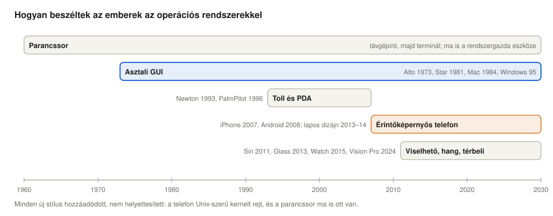
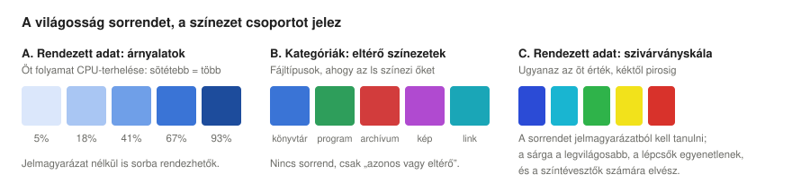
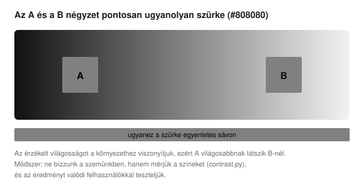
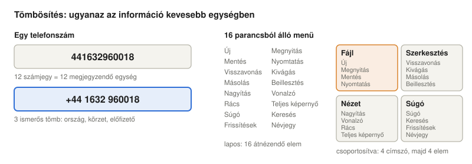
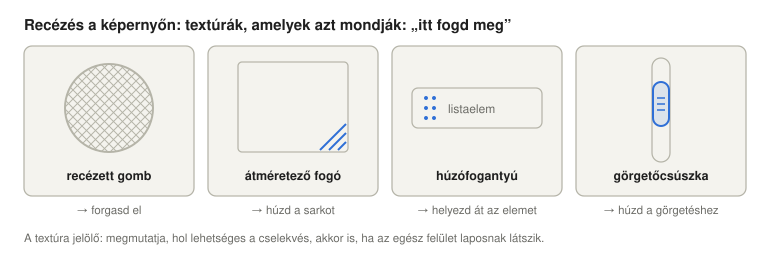
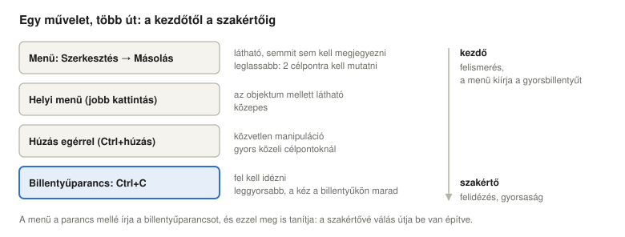
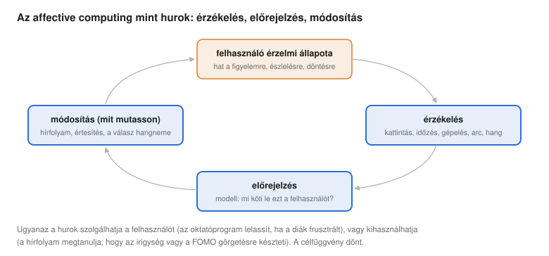
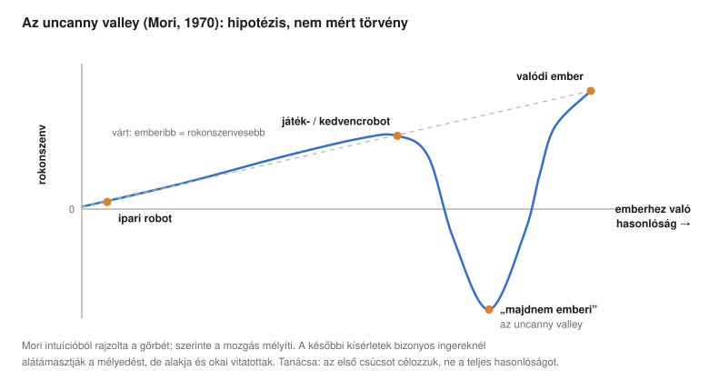

# Kognitív ergonómia és az operációs rendszerek felhasználói felülete

*Operációs rendszerek előadás: hogyan alakítja az emberi észlelés, emlékezet és érzelem egy operációs rendszer felhasználói felületét, a parancssortól és az asztali felülettől a telefonokig, órákig, szemüvegekig és robotokig*

## Tanulási célok

Az első két előadás kívülről nézte az operációs rendszereket: honnan jöttek, és mennyire jók. A minőség egy részéről azonban nem a gép dönt, hanem az az ember, aki előtte ül. Ez az előadás azt vizsgálja, mit kell egy operációs rendszer felhasználói felületének figyelembe vennie az emberi észlelésből, emlékezetből, jártasságból és érzelmekből, és hogyan változtak a válaszok a termináltól a telefonon és az órán át a fejre szerelt eszközökig.

Az előadás végére a hallgatók képesek lesznek:

- meghatározni a kognitív ergonómia fogalmát, és megmagyarázni, miért része a felhasználói felület egy operációs rendszer minőségének;
- felvázolni az operációs rendszerek felületeinek fejlődését: parancssor, asztali grafikus felület, tollal vezérelt számítógépek, érintőképernyős telefonok, viselhető eszközök, hangvezérlés és térbeli számítástechnika;
- a világosságot sorrendre, a színezetet kategóriákra használni, kontrasztot mérni, és színtévesztők számára is használható felületet tervezni;
- megmagyarázni a rövid távú memória korlátait, a tömbösítést (chunking), valamint a széles és a mély menük közötti kompromisszumot;
- megkülönböztetni az affordanciát a signifiertől (a cselekvést jelző jeltől), és alkalmazni őket a grafikus vezérlőelemekre és az érintési célpontokra, Fitts törvényének segítségével;
- megmagyarázni a felismerés és a felidézés különbségét, és azt, hogyan kerülik meg a parancssoros és a hangalapú felületek a felidézés nehézségét;
- kezdőknek és szakértőknek egyaránt tervezni, ugyanahhoz a művelethez több utat kínálva;
- bemutatni az affective computingot, alkalmazásait és kockázatait (hírfolyamok, FOMO, sötét minták), valamint az erre válaszoló szabályozást;
- megmagyarázni a kölcsönös tekintet szerepét, a tekintetkorrekciót és mellékhatásait, az uncanny valley hipotézisét és a robotok etológiai megközelítését;
- megmagyarázni a visszajelzés és a válaszidő határait, a hibamegelőzést és a visszavonást, a félbeszakítások árát, valamint az operációs rendszer akadálymentesítési szolgáltatásait;
- personát és elfogadási kritériumokkal ellátott felhasználói történeteket írni egy operációsrendszer-funkcióhoz, és összekapcsolni őket az előadás használhatósági elveivel;
- Linuxon alkalmazni Fitts törvényét és a Hick–Hyman-törvényt, valamint a színkontraszt-számításokat.

<details>
<summary><b>Egyszerűen elmagyarázva:</b> ergonómia, kognitív, felhasználói felület, HMI, HCI, GUI, CLI, operációs rendszer shellje</summary>

- **Ergonómia:** az a tudomány, amely az eszközöket és a munkát igazítja az emberhez, ahelyett hogy az embernek kellene alkalmazkodnia az eszközhöz. Az a szék, amelyik megtámasztja a hátadat, ergonomikus.
- **Kognitív:** a gondolkodással kapcsolatos: látás, emlékezés, döntés, tanulás.
- **Felhasználói felület (UI, user interface):** minden, amin keresztül ember és gép kommunikál: a képernyő, a gombok, a hangok, a billentyűzet, a beszéd.
- **HMI** (human–machine interface, ember–gép interfész): a felhasználói felület mérnöki neve, főleg az ipari vezérléseknél használatos.
- **HCI** (human–computer interaction, ember–számítógép interakció): az a kutatási terület, amely azt vizsgálja, hogyan használják az emberek a számítógépet, és hogyan lehet ezt könnyebbé tenni.
- **GUI** (graphical user interface, grafikus felhasználói felület): a számítógép használata ablakokkal, ikonokkal és egérmutatóval.
- **CLI** (command-line interface, parancssoros felület): a számítógép használata begépelt szöveges parancsokkal.
- **Shell (héj):** az a program, amely az operációs rendszer felhasználói felületét adja; egy parancsértelmező (például a `bash`) parancssoros felület, egy asztali környezet (például a GNOME vagy a Windows Intéző) pedig grafikus shell.

</details>

## Miért foglalkozik az emberrel egy operációsrendszer-kurzus

A Nemzetközi Ergonómiai Társaság (International Ergonomics Association) meghatározása szerint a **kognitív ergonómia** az ergonómiának az az ága, amely a „mentális folyamatokkal, például az észleléssel, az emlékezettel, a gondolkodással és a motoros válasszal foglalkozik, amennyiben ezek befolyásolják az emberek és a rendszer más elemei közötti interakciókat” (International Ergonomics Association [IEA], n.d.). Egy operációs rendszerben ezek az interakciók a **shellben** zajlanak, abban a legkülső rétegben, amelyet a [történeti előadás](../01-historic-evolution/#hol-helyezkedik-el-az-operációs-rendszer) a felhasználó és minden más közé helyezett.

Két érv teszi ezt operációsrendszer-témává, nem csupán tervezési kérdéssé:

- **A felhasználó a rendszer része.** Az [előző előadás](../02-quality-and-enterprise-linux/#mitől-jó-egy-operációs-rendszer) minőségi szempontjai közül több is az emberről szól: következetes (ugyanaz mindenhol ugyanúgy működik), megbocsátó (a hibák visszavonhatók), kényelmes (könnyű telepíteni, megtanulni és használni). Egy hibás parancs, egy félreolvasott figyelmeztetés vagy egy zavaros párbeszédablak ugyanúgy leállíthat egy rendszert, mint egy meghibásodott lemez; az a felület, amely valószínűvé teszi a hibákat, rontja a rendelkezésre állást.
- **Az operációs rendszer szabja meg a konvenciókat.** Az alkalmazások az operációs rendszertől és annak tervezési irányelveitől öröklik a megjelenést, a billentyűparancsokat, a párbeszédablakokat, az értesítési rendszert és az akadálymentesítési funkciókat. Ha egy platform ezeken változtat, egyszerre programok milliói viselkednek másképp; ezért van akkora súlya az Apple, a Google, a Microsoft és a GNOME tervezési irányelveinek.

Az előadás további része – egy rövid áttekintés után arról, hogyan „beszéltek” az emberek az operációs rendszerekkel – kilenc témát tárgyal, majd három olyan témával zárul, amelyet minden OS-felületnek kezelnie kell: a visszajelzés és a válaszidő, a hibák és a félbeszakítások, valamint az akadálymentesség. Végül bemutat két eszközt, amellyel a tervezőcsapatok a valódi felhasználókat szem előtt tartják: a personákat és a felhasználói történeteket.

## A távgépírótól a szemüvegig: hogyan fejlődtek az OS-felületek



**Parancssor.** Az 1960-as évek első interaktív rendszereit távgépírókon (teletype), később képernyős terminálokon keresztül használták: a felhasználó begépel egy parancsot, a rendszer kiírja a választ. A Unix shellek (1971-től) ezt kis, egymással kombinálható parancsok nyelvévé tették, és ma is ez a szerverek és a rendszergazdák fő felülete – a kurzus laborjaiban is.

**Asztali grafikus felület.** Az ablak–ikon–egér felület Douglas Engelbart 1960-as évekbeli munkájából és a Xerox PARC Alto gépéből (1973) született, az irodákba a Xerox Star (1981), a tömegpiacra az Apple Macintosh (1984) és a Microsoft Windows vitte; a Xerox, az Apple és a Microsoft történetét a [történeti előadás](../01-historic-evolution/#xii-személyi-számítógépek-egy-lépés-hátra) meséli el. Kulcsgondolata, amelyet Ben Shneiderman (1983) **közvetlen manipulációnak** (direct manipulation) nevezett el: mutassuk meg az objektumokat, és hagyjuk, hogy a felhasználó közvetlenül hasson rájuk – húzza a fájlt a mappába ahelyett, hogy `mv`-t gépelne.

**Tollal vezérelt számítógépek és PDA-k.** Az Apple Newton MessagePad (1993) a közönséges kézírást próbálta felismerni, és tévedéseiről vált híressé. A Palm Pilot (1996) megfordította a feladatot: **Graffiti** ábécéje arra kérte a felhasználókat, hogy tanuljanak meg egyszerűsített betűformákat, amelyeket a gép megbízhatóan fel tud ismerni. Mindkettő tanulság arról, hogy ki alkalmazkodik kihez. Az IBM Simon (1994) már egyesítette a telefont az érintőképernyővel, az érintőtollal és kis alkalmazásokkal. A hagyományos mobiltelefonok a szövegbevitelnél ugyanezzel a problémával találkoztak: a **T9** prediktív szövegbevitel lehetővé tette, hogy betűnként csak egyszer nyomjuk meg a számbillentyűt, a szót pedig egy szótárból választotta ki a telefon; a BlackBerry telefonok (2002-től) apró hardveres billentyűzetükkel és push e-mail szolgáltatásukkal nyerték meg az üzleti felhasználókat.

**Érintőképernyős telefonok.** Az iPhone (bejelentve 2007 januárjában) az érintőtollat az ujjal váltotta fel egy kapacitív multitouch képernyőn, az Android 2008-ban követte. A közvetlen manipuláció szó szerintivé vált: magát a tartalmat toljuk el. A korai telefonfelületek fizikai tárgyakat utánoztak (**szkeuomorfizmus**: bőr, papír, fapolcok); a Microsoft Windows Phone 7 (2010) és az Apple iOS 7 (2013) áttért a **lapos dizájnra** (flat design), a Google Material Designja (2014) pedig olyan lapos stílussal követte őket, amely szándékosan megtartotta az árnyékokat és a „kiemelkedést” (elevation) mint mélységi jeleket. A lapos dizájn csökkentette a zsúfoltságot, de sok vizuális utalást is eltüntetett arról, mit lehet megnyomni – ezt a kompromisszumot alább, az affordanciáknál vizsgáljuk.

**Viselhető eszközök, hangvezérlés és térbeli számítástechnika.** A fitneszkarkötők (Fitbit, 2009-től) megmutatták, hogy egy viselhető eszköz szinte felület nélkül is hasznos lehet. Az okosórákat, például a Pebble-t (2013), az Android Wear (ma Wear OS, 2014) órákat és az Apple Watchot (2015. április 24-től kapható) néhány másodperces pillantásokkal használjuk; az Apple Watch visszahozott egy mechanikus kezelőszervet, a **Digital Crownt**, egy forgatható gombot, egy haptikus motorral együtt, amely megkopogtatja a csuklót (Apple, 2015). A hangalapú asszisztensek (a Siri 2011-ben, az Amazon Echo 2014-ben) teljesen elhagyják a képernyőt. A fejen viselt eszközök hullámokban érkeztek: a Google Glass (2013) erős társadalmi ellenállásba ütközött, részben azért, mert a környezetben lévők nem tudhatták, nézik vagy filmezik-e őket; a virtuális és kevert valóság headsetjei (a Microsoft HoloLens és az Oculus Rift 2016-ban, a Meta Quest 2019-től) a kezet és a fejet követik; az Apple Vision Pro (2024) azt választja ki, **ahová nézünk**, és az ujjak összecsippentésével erősítünk meg; a Meta Ray-Ban Display szemüvege (2025) kis kijelzőt helyez az egyik lencsébe, az ujjmozdulatokat pedig egy, az izmok jeleit érzékelő **EMG**-csuklópánttal olvassa le (Sharma, 2025). Nem minden próbálkozás sikerült: a képernyő nélküli Humane AI Pin 2024 áprilisában került forgalomba 700 dollárért, és 2025 februárjában lekapcsolták, miután gyártója eladta technológiáját a HP-nek (Clover, 2025). Képernyő nélkül a felhasználók nem láthatták, mire képes az eszköz – ez a IV. szakasz felidézési problémája a legtisztább formájában.

Mindezek alatt hagyományos kernel fut: az Apple telefonjai, órái és headsetjei ugyanazt a Darwin/XNU magot használják, mint a macOS, az Android és a Wear OS pedig Linuxot. Az új stílusok **hozzáadódtak, nem helyettesítettek**: a parancssor ma is ott van, egy réteggel lejjebb.

<details>
<summary><b>Egyszerűen elmagyarázva:</b> távgépíró, terminál, Unix shell, Xerox PARC, közvetlen manipuláció, PDA, érintőtoll, kézírás-felismerés, kapacitív multitouch, szkeuomorfizmus, lapos dizájn, haptikus, hangalapú asszisztens, térbeli számítástechnika, EMG, kernel, Darwin/XNU</summary>

- **Távgépíró (teletype):** számítógéphez kötött elektromos írógép: te gépeltél, a számítógép papírra gépelt vissza. **Terminál:** ugyanez képernyővel.
- **Unix shell:** a Unix rendszerek parancsértelmezője, például az `sh` vagy a `bash`.
- **Xerox PARC:** a Xerox cég kutatólaboratóriuma, ahol a mai asztali felület sok ötletét kitalálták.
- **Közvetlen manipuláció:** látható objektumokkal dolgozunk, rájuk mutatunk, húzzuk és megérintjük őket, ahelyett hogy parancsokban írnánk le, mit akarunk velük.
- **PDA** (personal digital assistant, személyi digitális asszisztens): az 1990-es évek zsebszámítógépe naptárhoz, névjegyekhez és jegyzetekhez, általában tollal használták.
- **Érintőtoll (stylus):** műanyag „toll”, amellyel az érintőképernyőn lehet mutatni.
- **Kézírás-felismerés:** szoftver, amely a kézzel írt betűket szöveggé alakítja.
- **Kapacitív multitouch:** olyan érintőképernyő, amely az ujjak apró elektromos töltését érzékeli, és egyszerre több ujjat is tud követni (így működik a két ujjal nagyítás).
- **Szkeuomorfizmus:** a képernyőn lévő dolgok valódi tárgyakra hasonlítanak (papírtextúrás jegyzetfüzet, kiemelkedőnek látszó gomb).
- **Lapos dizájn (flat design):** egyszerű színekkel és formákkal dolgozó stílus, amely nem utánoz valódi anyagokat.
- **Haptikus:** érintéssel ad visszajelzést, például rezgéssel vagy finom koppintással.
- **Hangalapú asszisztens:** program, amelyhez beszélhetünk, és beszéddel válaszol (Siri, Alexa, Google Asszisztens).
- **Térbeli számítástechnika (spatial computing):** headsettel vagy szemüveggel az alkalmazások körülöttünk, a szobában jelennek meg.
- **EMG** (electromyography, elektromiográfia): az izmok mozgáskor keletkező kis elektromos jeleinek mérése.
- **Kernel:** az operációs rendszer magja, amely a hardvert vezérli. A **Darwin/XNU** az Apple rendszereinek magja.

</details>

## I. Szín: az árnyalat sorrendet, a színezet csoportot jelez



Az emberi színlátásnak nagyjából két külön képessége van, amelyre egy felület építhet. A **világosságot** (és a telítettséget) mennyiségként érzékeljük: a sötétebb árnyalat „többnek” látszik, így egy színezet árnyalatai **sorrendet** fejezhetnek ki, és jelmagyarázat nélkül bárki sorba tudja rendezni őket. A **színezetet** azonosságként érzékeljük: a piros, a zöld és a kék különböző, de egyik sem „több” a másiknál, így a színezet a kategóriák **csoportosítására** jó, a sorrendre rossz. A vizualizációs szakirodalom ezeket *nagyságcsatornáknak* (magnitude channels) és *azonosságcsatornáknak* (identity channels) nevezi; rendezett adatokhoz világosságot vagy telítettséget, kategóriákhoz színezetet ajánl, és abból is csak néhányat, mert a szem nagyjából hat–tizenkét színezetnél többet nem tud megbízhatóan megkülönböztetni (Munzner, 2014). A C panel szivárványskálája, amely a hőtérképeken ma is gyakori, megsérti ezt a szabályt: színezettel fejez ki sorrendet. A sorrendet jelmagyarázatból kell megtanulni, az érzékelt lépések egyenetlenek (a sárga sokkal világosabbnak látszik a szomszédainál, így hamis határokat hoz létre), a színtévesztő olvasók számára pedig elvész.

**A szemünk nem mérőműszer.** Egy szín érzékelt világossága a környezetétől függ:



Ezért fontos a módszer: a felület színeit **mérni** kell (kontrasztarányok, a színtévesztés szimulációja), az eredményt pedig valódi felhasználókkal **tesztelni**, nem a tervező saját monitorán szemre megítélni.

**Kontraszt és színtévesztés.** A webes akadálymentességi irányelvek (Web Content Accessibility Guidelines), amelyeket az operációs rendszerek saját irányelvei szorosan követnek, a szokásos AA megfelelési szinten legalább 4,5:1 kontrasztarányt írnak elő a normál szöveg és háttere között (World Wide Web Consortium [W3C], 2024). Az észak-európai származású férfiak mintegy 8%-a (és jóval kevesebb nő) vörös–zöld színtévesztő (Birch, 2012). Az a felület tehát, amely a „hibát” pirossal, az „OK”-t zölddel jelöli, és semmi mással, minden száz felhasználóból többet cserben hagy. A szabály: a színezet soha ne legyen az egyetlen jel; adjunk hozzá alakot, ikont, szót vagy világosságkülönbséget. Az operációs rendszerek ma már rendszerszintű segítséget kínálnak: nagy kontrasztú témákat, színszűrőket színtévesztőknek, sötét módot és az átlátszóság csökkentésére szolgáló beállításokat.

Linuxon az `ls` a színezetet csoportosításra használja: a könyvtárak kékek, a programok zöldek, az archívumok pirosak ([Linux szakasz](#színek-a-terminálban)).

<details>
<summary><b>Egyszerűen elmagyarázva:</b> világosság, telítettség, színezet, csatorna, jelmagyarázat, hőtérkép, kontrasztarány, WCAG, megfelelési szint, színtévesztés, sötét mód, deuteranópia, protanópia</summary>

- **Világosság:** mennyire világos vagy sötét egy szín. **Telítettség:** mennyire erős vagy fakó. **Színezet:** melyik szín (piros, zöld, kék…).
- **Csatorna:** a kép egy olyan tulajdonsága, amely információt hordozhat, például a hely, a méret, a világosság vagy a színezet.
- **Jelmagyarázat:** a diagram kis kulcsa, amely megmondja, melyik szín mit jelent.
- **Hőtérkép:** kép, amelyen a színek számokat jelölnek, mint az időjárás-jelentés hőmérsékleti térképén.
- **Kontrasztarány:** mennyivel világosabb az egyik szín a másiknál, 1:1-től (azonos) 21:1-ig (fekete a fehéren).
- **WCAG** (Web Content Accessibility Guidelines, webes tartalmak akadálymentességi irányelvei): a nemzetközi szabályok arról, hogyan lehet a weboldalakat és alkalmazásokat fogyatékossággal élők számára is használhatóvá tenni. **Megfelelési szintjei:** A (minimum), AA (a szokásos cél) és AAA (a legszigorúbb).
- **Színtévesztés** („színvakság”): leggyakrabban a piros és a zöld megkülönböztetésének nehézsége, mert a szem egyik fajta színérzékelő sejtje hiányzik vagy másképp működik.
- **Sötét mód:** színséma világos betűkkel sötét háttéren.
- **Deuteranópia, protanópia:** a vörös–zöld színtévesztés két erős formája, amelyben a szem zöldérzékelő (deuteranópia), illetve vörösérzékelő (protanópia) sejtjei hiányoznak.

</details>

## II. Rövid távú memória: hét, plusz-mínusz kettő

George Miller 1956-ban megfigyelte, hogy az emberek nagyjából **hét, plusz-mínusz kettő** elemet tudnak az azonnali emlékezetükben tartani, akár számjegyekről, akár betűkről vagy szavakról van szó, és hogy ezt a korlátot **tömbösítéssel** (chunking) kerüljük meg: az elemeket nagyobb egységekbe csoportosítjuk, amelyek egynek számítanak (Miller, 1956). Későbbi kutatások alacsonyabbra, körülbelül **négy tömbre** tették a kapacitást, ha az ismétlést és a tömbösítést megakadályozzák (Cowan, 2001). Akárhogy is, a munkamemória parányi, és az a felület, amely arra kényszeríti a felhasználót, hogy egyszerre sok elemmel zsonglőrködjön fejben, hibákat fog okozni.



A felületek mindenütt tömbösítenek:

- **Számok tömbökben.** A telefonszámokat, kártyaszámokat és IP-címeket csoportokban írjuk; az `ls -lh` `123671544` helyett `118M`-et ír ki ([Linux szakasz](#tömbösítés-a-parancssorban)).
- **Menücsoportosítás.** A parancsok néhány címszó alá kerülnek (Fájl, Szerkesztés, Nézet, Súgó), így a felhasználó előbb négy címszó, majd négy elem közül választ, ahelyett hogy tizenhatot nézne végig.
- **Hierarchikus felépítés.** Mappák a mappákban, beállítások kategóriákban, a Start menü alkalmazástípusok szerint csoportosítva.

Két korlát érvényes. Először: Miller korlátja arra vonatkozik, amit **emlékezetben kell tartani**, nem arra, ami **látható**: a képernyőn látható menüt nem kell megjegyezni, így a „soha ne legyen hétnél több menüpont” szabály mítosz. Másodszor: a mélyebb nem mindig jobb. A hierarchia minden szintje egy újabb döntés, és egy újabb esély arra, hogy rosszul találjuk ki, hol van valami. Egy 512 elemű webes linkhierarchiákat vizsgáló kísérletben a három szint lassabb volt a kettőnél, és a mélység és szélesség közepes kombinációja jobbnak bizonyult a vizsgált legszélesebb szerkezetnél (Larson & Czerwinski, 1998); az 1980-as évek menükísérletei hasonló következtetésre jutottak. Az alább bemutatott Hick–Hyman-törvény megmutatja, miért nem csökkenti a választás teljes mennyiségét, ha egy menüt szintekre bontunk.

**A Hick–Hyman-törvény.** Az $n$ egyformán valószínű lehetőség közüli választás ideje nem magával $n$-nel, hanem a választásban rejlő információval nő: $T = a + b \log_2(n+1)$ (Hick, 1952; Hyman, 1953). Az $n$ közül egy kiválasztása $\log_2 n$ bitet hordoz; Hick $+1$ tagja azt a további lehetőséget veszi számításba, hogy egyáltalán nem jelenik meg inger. A lehetőségek számának megduplázása tehát nagyjából állandó idővel növeli a választási időt. A $b$ meredekség erősen függ attól, mennyire természetes a megfeleltetés aközött, amit látunk, és amit tennünk kell: önkényes kódoknál nagy, nagyon kompatibilis megfeleltetéseknél kicsi, például ha azt a billentyűt kell megnyomni, amelynek számjegyét látjuk. A törvény ismert lehetőségek közüli választásra érvényes; nem alkalmazható egy ismeretlen lista átkutatására, ahol az idő nagyjából a lista hosszával arányosan nő.

<details>
<summary><b>Egyszerűen elmagyarázva:</b> rövid távú (munka)memória, tömbösítés, IP-cím, hierarchia, bit, logaritmus</summary>

- **Rövid távú memória, munkamemória:** a „fejben lévő jegyzettömb”, amelyben azt tartjuk, amin éppen gondolkodunk, például egy telefonszámot, amelyet mindjárt tárcsázunk. Kicsi, és gyorsan felejt.
- **Tömbösítés (chunking):** a dolgok csoportosítása, hogy könnyebb legyen megjegyezni őket: az „1 9 8 4” helyett az „1984” évszámot jegyezzük meg.
- **IP-cím:** az a szám, amely egy számítógépet azonosít az interneten, négy csoportban írva, például 192.168.1.10.
- **Hierarchia:** szintekbe rendezett felépítés, mint egy családfa vagy a mappákban lévő mappák.
- **Bit:** az információ legkisebb egysége: egy igen-nem kérdésre adott válasz. Nyolc dolog közül egyet három igen-nem kérdéssel lehet kiválasztani, ez tehát 3 bit.
- **Logaritmus** ($\log_2 n$): hányszor kell $n$-et megfelezni, hogy 1-hez jussunk; $\log_2 8 = 3$.

</details>

## III. Affordanciák: a tárgy elárulja, hogyan kell használni

James Gibson pszichológus egy környezet **affordanciáinak** nevezte azokat a cselekvéseket, amelyeket a környezet egy élőlénynek kínál: a szék ülést kínál, a fogantyú húzást (Gibson, 1979). Donald Norman vitte át a szót a tervezésbe, és később pontosította: az affordancia maga a lehetséges cselekvés, a **signifier** pedig az az érzékelhető jel, amely elárulja, hogy a cselekvés lehetséges, és hol kell végrehajtani (Norman, 2013). Klasszikus példák:

| Tárgy | Az általa jelzett cselekvés |
|---|---|
| lapos lemez | tolás |
| gomb (forgatógomb) | forgatás |
| rés | behelyezés |
| függőleges húzórúd | húzás |
| recézés (finom bordázott felület) | itt kell megfogni |

Az olyan ajtó, amelynek húzófogantyúja van, mégis tolni kell, annyira gyakori hiba, hogy a tervezők „Norman-ajtónak” hívják. A megoldás nem egy „TOLNI” felirat, hanem egy lapos lemez, amelyet csak tolni lehet.



**Recézés a képernyőn.** A grafikus felületek ugyanezeket a textúrákat ugyanerre a célra vették át: az ablak sarkán lévő ferde bordák azt mondják, „húzd az átméretezéshez”, egy listaelemen lévő pontoszlop azt, hogy „húzd az áthelyezéshez”, a görgetősáv bordái azt, hogy „fogd meg a görgetéshez”. Az árnyékkal rajzolt gombok megnyomhatónak látszanak, az aláhúzott kék szöveg kattinthatónak.

**A lapos dizájn ára.** A lapos dizájn sok ilyen signifiert eltüntetett. Egy 71 résztvevős szemmozgáskövetéses vizsgálatban a gyenge kattinthatósági signifierekkel ellátott oldalakon a felhasználók 22%-kal több időt töltöttek, és 25%-kal több fixációt végeztek, mint ugyanazokon az oldalakon erős signifierekkel (Moran, 2017). A dizájnrendszerek azóta visszahoztak néhány signifiert, és az inga tovább leng: az Apple áttetsző **Liquid Glass** dizájnját, amelyet 2025 júniusában jelentett be valamennyi operációs rendszerére (Apple, 2025), korai tesztváltozataiban rossz olvashatósága miatt bírálták, és az Apple a kiadás előtt megnövelte a kontrasztját (Abdullahi, 2025).

**Méret és távolság: Fitts törvénye.** Egy vezérlőelemnek nemcsak felismerhetőnek, hanem elérhetőnek is kell lennie. Fitts törvénye szerint egy célpontra mutatás ideje a **nehézségi indexszel** (index of difficulty) nő: $ID = \log_2(D/W + 1)$ bit, ahol $D$ a célpont távolsága, $W$ pedig a szélessége (Fitts, 1954; MacKenzie, 1992). Két tervezési szabály következik belőle:

- **A gyakori célpontok legyenek nagyok és közeliek.** Az érintéses irányelvek ezért minimális célpontméreteket írnak elő: 44 × 44 pont az Apple telefonjain és táblagépein (60 pont a visionOS headsetben, ahol a szem a mutató) (Apple, n.d.-a), 48 × 48 sűrűségfüggetlen képpont a Material Designban (Google, n.d.), a WCAG 2.2 pedig AA szinten legalább 24 × 24 CSS-képpontot (vagy a kisebb célpontok körül elegendő térközt), AAA szinten 44 × 44-et követel meg (W3C, 2024).
- **Használjuk ki a képernyő széleit.** Az egérmutató megáll a képernyő szélén, így az ott lévő célpont a mozgás irányában gyakorlatilag végtelenül mély: a felhasználó egyszerűen „odadobhatja” a mutatót. Ezért van a macOS menüsora a képernyő felső szélén, és ezért kiváló helyek a képernyő sarkai („aktív sarkok”, hot corners) a gyakori műveletekhez.

Egy kézben tartott telefonon Fitts törvényéhez egy második korlát társul: az elérhetőség, mert a hüvelykujj nem éri el kényelmesen a felső sarkokat; ezért helyezték át a telefonos rendszerek a gyakori vezérlőket a képernyő aljára. Egy órán a célpontok annyira kicsik, hogy a forgatógomb és a hang veszi át a szerepüket; egy headsetben a „mutató” a szem, és célpont lesz bármi, amire ránézünk. Vegyük észre azt is, hogy a képernyő széle csak akkor szél, ha ott megáll a mutató: két monitor között nem az.

<details>
<summary><b>Egyszerűen elmagyarázva:</b> affordancia, signifier, recézés, szemmozgáskövetés, fixáció, olvashatóság, Fitts törvénye, nehézségi index, pont, sűrűségfüggetlen képpont, CSS-képpont</summary>

- **Affordancia:** amit egy tárgy lehetővé tesz: a bögre megfogható, és lehet belőle inni.
- **Signifier:** látható (vagy hallható, tapintható) jel, amely megmutatja, mit és hol lehet csinálni: a bögre füle.
- **Recézés:** apró bordák mintázata fém gombokon és fogantyúkon, amely megakadályozza, hogy az ujjunk megcsússzon.
- **Szemmozgáskövetés (eyetracking):** kamerával mérjük, hová néz valaki a képernyőn. A **fixáció** a szem rövid megállása egy ponton.
- **Olvashatóság:** mennyire könnyű elolvasni egy szöveget.
- **Fitts törvénye:** a kicsi és távoli célpontokat lassabban találjuk el egérrel vagy ujjal, mint a nagyokat és közelieket, mégpedig pontosan kiszámítható módon. **Nehézségi index:** az a szám, amely azt méri, mennyire nehéz eltalálni egy célpontot.
- **Pont, sűrűségfüggetlen képpont (dp), CSS-képpont:** képernyős méretegységek, amelyek fizikai mérete a kijelző felbontásától függetlenül nagyjából ugyanakkora marad.

</details>

## IV. Felismerés és felidézés

A feleletválasztós kérdések könnyebbek, mint a kiegészítendők: a helyes választ a lehetőségek közül felismerni könnyebb, mint emlékezetből előhívni. A felületek ugyanígy működnek. Jakob Nielsen széles körben használt használhatósági heurisztikái ezt így fogalmazzák meg: „felismerés felidézés helyett” (recognition rather than recall): csökkentsük a felhasználó memóriaterhelését azzal, hogy láthatóvá tesszük az elemeket, a műveleteket és a lehetőségeket (Nielsen, 1994/2024).

- **Az ikonok és a menük csak felismerést igényelnek.** A felhasználónak nem kell tudnia, mire képes a program; az eszköztár és a menük megmutatják a képességeit, a felhasználó pedig felismeri azt, amelyikre szüksége van.
- **A parancssor felidézést igényel.** Egy üres promptnál semmi sem árulja el, hogy a csaknem kétezer parancs közül melyik létezik ([Linux szakasz](#felidézés-és-felismerés-a-parancssorban)), és milyen kapcsolói vannak. Ez a fő oka annak, hogy a CLI nehéz a kezdőknek.
- **Hidak a kettő között.** A jó parancssoros környezetek felismerést adnak hozzá: a **Tab-kiegészítés** felsorolja azokat a parancsokat vagy fájlneveket, amelyek illeszkednek a begépelt szövegre, a shell előzményei (history) lehetővé teszik, hogy egy korábbi parancsot újragépelés helyett visszakeressünk, a `--help` pedig felsorolja a kapcsolókat. A grafikus rendszerek cserébe a felidézésre építő, gyors eszközökkel bővültek: a Start menü vagy az alkalmazásindító **keresője** lehetővé teszi, hogy néhány betűt begépeljünk, és az egyes alkalmazások *kulcsszavai* miatt az „excel” begépelése a LibreOffice Calcot is megtalálja. A modern szerkesztők **parancspalettái** a kettőt ötvözik: begépelünk egy töredéket, és felismerjük a parancsot.
- **A hang visszahozza a felidézést.** Egy hangalapú asszisztens nem mutat menüt: a felhasználónak ki kell találnia, mit ért meg. Ez a *felfedezhetőségi* (discoverability) probléma az egyik oka annak, hogy a hangalapú felületek kevés, jól ismert parancsnál működnek a legjobban (időzítők, zene, hívások).

<details>
<summary><b>Egyszerűen elmagyarázva:</b> felismerés, felidézés, heurisztika, prompt, Tab-kiegészítés, shell-előzmények, alkalmazásindító, parancspaletta, felfedezhetőség</summary>

- **Felismerés:** ráismerünk valamire, amikor látjuk. **Felidézés:** segítség nélkül, emlékezetből hozzuk elő. Egy arcot felismerni könnyebb, mint egy nevet felidézni.
- **Heurisztika:** ökölszabály, gyakorlati irányelv, amely többnyire beválik.
- **Prompt:** az a jel (például `$`), amellyel a parancssor azt mondja: „most írd be a parancsot”.
- **Tab-kiegészítés:** az első betűk begépelése után megnyomjuk a Tab billentyűt, és a shell befejezi a szót, vagy felsorolja a lehetőségeket.
- **Shell-előzmények (history):** a korábban begépelt parancsok listája, amelyben kereshetünk, és amelyeket újra felhasználhatunk.
- **Alkalmazásindító (launcher):** az asztali felület azon része, ahol alkalmazásokat keresünk és indítunk.
- **Parancspaletta:** keresőmező, amely egy program bármelyik parancsát megtalálja a neve alapján.
- **Felfedezhetőség:** mennyire könnyű kideríteni, mire képes egy rendszer.

</details>

## V. Szakértelem: több út ugyanahhoz a célhoz

A felhasználók nem egyformák, és ugyanaz a felhasználó is változik: a mai kezdő jövőre szakértő. A jó felület **ugyanahhoz a művelethez több utat kínál**, hogy a kezdők megtalálják, a szakértők pedig gyorsan elvégezhessék. A másolás és beillesztés a klasszikus példa:



- a **menü** (Szerkesztés → Másolás) látható, és semmit sem kell megjegyezni hozzá, de két mutatómozdulatot igényel;
- a **helyi menü** ott jelenik meg, ahol a felhasználó éppen dolgozik;
- a kijelölés **húzása** közvetlen manipulációval áthelyezi vagy (egy módosítóbillentyűvel) átmásolja;
- a Ctrl+C **billentyűparancs** a leggyorsabb, de fel kell idézni.

A menü kiírja a billentyűparancsot a parancs mellé, így a lassú út megtanítja a gyorsat. Shneiderman „aranyszabályai” a felülettervezéshez arra kérik a tervezőket, hogy „törekedjenek az egyetemes használhatóságra”: a kezdőknek magyarázatokat, a szakértőknek „billentyűparancsokat és gyorsabb tempót” adjanak; Nielsen heurisztikái ezt a használat rugalmasságának és hatékonyságának nevezik: a kezdők elől rejtett gyorsítók felgyorsítják a szakértőt (Nielsen, 1994/2024; Shneiderman et al., 2016). A parancssor ugyanígy rétegzett: a Fel nyíl és a Ctrl+P szerkesztésre visszahozza az előző parancsot, a `!!` újra lefuttatja, a Ctrl+R pedig keres az előzményekben ([Linux szakasz](#több-út-a-shellben)).

Az érintéses felületek ezt megnehezítették. A gesztusok (elhúzás a képernyő széléről, hosszú nyomás, két ujjas koppintás) gyorsak, de láthatatlanok: nincs menü, amely kiírná őket. A telefonok ezért rövid oktatóanyagokkal és tippekkel tanítják meg a gesztusokat, a legfontosabbakhoz pedig látható gombot is megtartanak.

<details>
<summary><b>Egyszerűen elmagyarázva:</b> kezdő, szakértő, helyi menü, módosítóbillentyű, billentyűparancs, gyorsbillentyű, gesztus</summary>

- **Kezdő / szakértő:** aki most ismerkedik a rendszerrel / aki már sokat használta.
- **Helyi menü:** az a menü, amely jobb kattintásra (vagy hosszú nyomásra) jelenik meg valamin, és az adott dologra vonatkozó műveleteket mutatja.
- **Módosítóbillentyű:** olyan billentyű, mint a Ctrl, a Shift vagy az Alt, amely megváltoztatja egy másik billentyű vagy egérművelet hatását.
- **Billentyűparancs, gyorsbillentyű (accelerator):** billentyűkombináció, amely közvetlenül végrehajt egy parancsot, például a Ctrl+C a másolást.
- **Gesztus:** ujjmozdulat az érintőképernyőn, amely egy parancsot jelent, például elhúzás vagy csippentés.

</details>

## VI. Érzelmek: felületek, amelyek olvassák és irányítják az érzelmeket

Az érzelmek nem mellékesek a megismerés szempontjából. Egy ember **affektív állapota** – nyugodt vagy szorongó, unatkozó vagy frusztrált – befolyásolja, mit vesz észre, hogyan ítél és mit dönt. Rosalind Picard (1997) **affective computingnak** (az érzelmeket figyelembe vevő számítástechnikának) nevezte el azt a területet, amely ezt beépíti a gépekbe: olyan számítástechnika, amely az érzelmekhez kapcsolódik, belőlük ered, vagy szándékosan befolyásolja őket. Egy affektív rendszer **érzékeli** az érzelmi jeleket (a gépelés ritmusát, a hangot, az arcot, a kattintásokat, azt, hogy mennyi ideig nézünk egy elemet), **előrejelzi** a felhasználó állapotát és reakcióját, és **megváltoztatja** a viselkedését – ezzel pedig a felhasználó érzelmeit is.



Ugyanaz a hurok egészen különböző célokat szolgálhat:

- **A felhasználó segítése:** egy oktatóprogram, amely lelassít, ha a diák frusztrált, egy autó, amely figyelmezteti az álmos sofőrt, egy asszisztens, amely kedvesebben válaszol a feldúlt felhasználónak.
- **Az elköteleződés (engagement) szolgálata:** a közösségimédia-hírfolyamok (Facebook, YouTube, TikTok) a bejegyzéseket a várható elköteleződés szerint rangsorolják, és az érzelmes tartalom leköt. A webáruházak azt írják ki: „már csak 2 darab van”, „12-en nézik éppen ezt a terméket”. Az ilyen rendszerek által kihasználható érzelmek közé tartozik az **összetartozás** igénye, a mások kirakatéletére irányuló **irigység** és a **lemaradástól való félelem (FOMO, fear of missing out)**, amelyet úgy határoztak meg, mint átható aggodalmat amiatt, hogy mások olyan értékes élményekben lehetnek részesek, amelyekből mi kimaradunk (Przybylski et al., 2013).
- **A chatbotok** a kettő között helyezkednek el: egy beszélgető rendszer, amely a hangnemét a felhasználóhoz igazítja, vigasztalhat, de hízeleghet is, vagy függőséget alakíthat ki – attól függően, mire optimalizálták.

Hogy az ilyen irányítás nagy léptékben működhet, azt – vitatott módon – egy 2012 januárjában 689 003 Facebook-felhasználón végzett kísérlet sugallta: amikor csökkentették a pozitív bejegyzéseket a hírfolyamukban, valamivel kevesebb pozitív és több negatív szót írtak saját bejegyzéseikben, és fordítva (Kramer et al., 2014). A hatások parányiak voltak, és a kritikusok kétségbe vonták, hogy az érzelmi szavak számolása valóban az érzelmeket méri; a kísérlet ráadásul a felhasználók tájékoztatáson alapuló beleegyezése nélkül futott, és a folyóirat szerkesztősége hivatalos figyelmeztetést (*expression of concern*) tett közzé róla (Verma, 2014).

Hogy mekkora kárt okoznak az ilyen rendszerek, máig vitatott, és a tisztességes összefoglalásnak mindkét oldalt be kell mutatnia. A 2020-as *The Social Dilemma* (magyarul: *A társadalmi dilemma*) című dokumentumfilm, amelyben nagy platformok volt munkatársai manipulációként írják le az elköteleződésre optimalizált tervezést (Orlowski, 2020), széles közönséghez juttatta el ezt az érvet; a Facebook azt válaszolta, hogy a film torz, szenzációhajhász képet fest termékei működéséről (Facebook, 2020). Nagy vizsgálatok azt találták, hogy a serdülők digitálistechnológia-használata és jólléte közötti átlagos összefüggés negatív, de nagyon kicsi: a jóllét szórásának legfeljebb 0,4%-át magyarázza (Orben & Przybylski, 2019). Mások szerint az okostelefonok és a közösségi média a 2010-es évek eleje óta tapasztalható kamaszkori szorongás- és depresszió-növekedés fő okai közé tartoznak, és az átlagok elfedik a sérülékeny csoportokat érő súlyos hatásokat (Haidt, 2024); a kritikusok azt felelik, hogy egy ilyen oksági szerep bizonyítékai gyengék (Odgers, 2024). A vita folytatódik.

**Az operációs rendszer szerepe.** A telefonos operációs rendszerek váltak a játékvezetővé az alkalmazások és a felhasználó figyelme között. 2018 óta az iOS (Képernyőidő, Screen Time) és az Android (Digitális jólét, Digital Wellbeing) kimutatja, mennyi időt visz el az egyes alkalmazások használata, és korlátozni is tudja (Apple, 2018); a fókuszmódok és az értesítési beállítások döntik el, melyik alkalmazás mikor zavarhat. A jog is követte a fejleményeket: az EU digitális szolgáltatásokról szóló rendelete (Digital Services Act) megtiltja az online platformoknak, hogy felületüket úgy tervezzék meg, hogy az „megtévessze vagy manipulálja” a felhasználókat (ezek az úgynevezett **sötét minták**, dark patterns; Regulation (EU) 2022/2065, Art. 25), a mesterséges intelligenciáról szóló rendelet (AI Act) pedig 2025. február 2. óta tiltja azokat az MI-rendszereket, amelyek a munkahelyen vagy az oktatásban következtetnek az emberek érzelmeire, kivéve orvosi vagy biztonsági okokból (Regulation (EU) 2024/1689, Art. 5(1)(f)).

<details>
<summary><b>Egyszerűen elmagyarázva:</b> affektus, affektív állapot, affective computing, elköteleződés, hírfolyam, FOMO, tájékoztatáson alapuló beleegyezés, expression of concern, sötét minta, célfüggvény, Digital Services Act, AI Act</summary>

- **Affektus, affektív állapot:** érzések és hangulatok, például öröm, félelem, unalom vagy düh, és hogy mennyire erősek.
- **Affektív számítástechnika:** olyan számítógépek, amelyek felismerik az emberi érzelmeket, reagálnak rájuk vagy befolyásolják őket.
- **Elköteleződés (engagement):** mennyire használják az emberek valamit, és mennyire reagálnak rá: kattintások, lájkok, hozzászólások, eltöltött idő.
- **Hírfolyam (feed):** a bejegyzések vagy videók végtelen listája egy közösségimédia-alkalmazásban, amelyet az alkalmazás válogat és rendez sorba.
- **FOMO** (fear of missing out, lemaradástól való félelem): az az aggódó érzés, hogy mások nélkülünk érzik jól magukat.
- **Tájékoztatáson alapuló beleegyezés (informed consent):** beleegyezés egy vizsgálatban való részvételbe, miután elmondták, mivel jár.
- **Expression of concern:** egy folyóirat hivatalos megjegyzése, amely figyelmezteti az olvasókat, hogy egy megjelent cikkel kapcsolatban valami kérdéses.
- **Sötét minta (dark pattern):** tervezési trükk, amely olyasmire veszi rá a felhasználót, amit nem akart, például egy elrejtett „leiratkozás” link vagy egy hamis visszaszámláló.
- **Célfüggvény:** az a szám, amelyet egy számítógépes rendszer a lehető legnagyobbra (vagy legkisebbre) igyekszik tenni, például a „megnézett percek” vagy a „helyesen megválaszolt kérdések” száma.
- **Digital Services Act (DSA, digitális szolgáltatásokról szóló rendelet), AI Act (mesterséges intelligenciáról szóló rendelet):** az Európai Unió jogszabályai az online platformokról (2022) és a mesterséges intelligenciáról (2024).

</details>

## VII. Kölcsönös tekintet

A szemkontaktus az egyik legerősebb társas jelzés. Ha valakinek a szemébe nézünk, az **bizalmat** épít, és figyelmet jelez; a tanárok arra használják, hogy lekössék az osztályt, és számít az üzleti tárgyalásokon és az állásinterjúkon is. Laboratóriumi vizsgálatok szerint az egyenes tekintet az elfordított tekintethez képest növeli a fiziológiai arousalt (élénkültséget), magára vonja a figyelmet, közeledéssel kapcsolatos agyi aktivitást vált ki, és tudatosabbá teszi az embert önmagával kapcsolatban, különösen élő interakcióban, nem pedig fényképek esetén (Hietanen, 2018). A kölcsönös tekintet az **elköteleződés** kulcsa.

**A videohívás problémája.** Videohívásban a másik ember arcát nézzük a képernyőn, a kamera viszont fölötte van, így a másik fél számára úgy tűnik, mintha kissé lefelé és félre néznénk. A kölcsönös tekintet elvész, mindkét oldalon.

**Tekintetkorrekció.** Ma már szoftver javítja ezt: újrarajzolja a szemeket a videóban, hogy úgy tűnjenek, mintha a kamerába néznének. Az Apple 2020-ban, az iOS 14-gyel vezette be a FaceTime **Eye Contact** (szemkontaktus) funkcióját (AppleInsider, 2020); az NVIDIA 2023 januárjában Eye Contact effektust adott Broadcast szoftveréhez, amely megtartja a természetes pislogást, és kikapcsol, ha a felhasználó túlságosan félrenéz (NVIDIA, 2023); a Windows hasonló effektust kínál (Windows Studio Effects) az MI-gyorsítóval rendelkező gépeken. Az Apple Vision Pro az ellenkező irányban megy tovább: külső kijelzője (**EyeSight**) a viselő szemének képét mutatja a közelben lévőknek, hogy lássák, mikor néz rájuk a viselő (Apple, n.d.-b).

**Kínos mellékhatások.** A korrigált tekintet állandó bámulás: a korrigált személy soha nem néz félre, ami élő beszélgetésben kellemetlen, akár hátborzongató is lehet. Megváltoztatja azt is, mit *jelent* a szemkontaktus: a másik oldal olyan figyelmet lát, amely talán nincs is ott, például miközben a beszélő egy előre megírt szöveget olvas. A tekintetkorrekció kicsi, de valós példája azoknak a hitelességi és beleegyezési kérdéseknek, amelyeket az affective computing felvet. Ha pedig a tekintet **bemenetté** válik, mint egy headsetben, új probléma jelentkezik: az emberek úgy is ránéznek dolgokra, hogy nem akarják kiválasztani őket – ez az úgynevezett **Midász-érintés** (Midas touch) probléma, ezért kell a Vision Pro-nál külön csippentés a megerősítéshez (Jacob, 1990).

<details>
<summary><b>Egyszerűen elmagyarázva:</b> kölcsönös tekintet, elfordított tekintet, arousal, elköteleződés, tekintetkorrekció, MI-gyorsító, Midász-érintés</summary>

- **Kölcsönös tekintet:** két ember egyszerre néz egymás szemébe. **Elfordított tekintet:** félrenézés.
- **Arousal (élénkültség):** mennyire éber és izgatott a test, amit például a szívverésből vagy az izzadásból lehet mérni.
- **Tekintetkorrekció:** szoftver, amely úgy változtatja meg a videót, hogy az ember mintha egyenesen a kamerába nézne.
- **MI-gyorsító (AI accelerator):** különleges chip, amely a mesterséges intelligencia programjait gyorsan és kevés energiával futtatja.
- **Midász-érintés:** a monda szerint Midász király mindent arannyá változtatott, amihez hozzáért, még az ételét is. Egy tekintettel vezérelt felületen az a veszély, hogy mindenre „rákattintunk”, amire ránézünk.

</details>

## VIII. Ember–robot interakció és az uncanny valley

A robotok az operációs rendszerek sajátos felhasználói: fizikai valójukban léteznek, mozognak, és az emberek társas lényként reagálnak rájuk. Az **ember–robot interakció (HRI, human–robot interaction)** ezeket a reakciókat vizsgálja. Legismertebb gondolata az **uncanny valley** (a „hátborzongató völgy”), amelyet Mori Maszahiro japán robotkutató vetett fel 1970-ben (Mori, 1970/2012).



Mori szerint ahogy egy robot egyre emberszerűbb lesz, úgy nő iránta érzett rokonszenvünk, az arc nélküli ipari robottól a barátságos arcú játékrobotig, egészen addig, amíg *majdnem* emberi nem lesz. Ekkor a rokonszenv borzongásba zuhan: egy élethű, de hideg tapintású művégtag, egy babaszerű android kissé furcsa szemekkel vagy mozgással, egy holttest. Csak a valódi, egészséges ember mászik ki a völgyből. Mori hozzátette, hogy a mozgás a csúcsot is, a völgyet is felerősíti. Gyakorlati tanácsa az volt, hogy az első csúcsot, a mérsékelt emberszerűséget célozzuk meg, ne a tökéletes utánzást (Mori, 1970/2012).

Mori a görbét intuícióból rajzolta, nem mérésekből. A későbbi kísérletek bizonyos ingerek esetében alátámasztják a mélyedést: egy 80 valódi robotarcot értékeltető vizsgálatban a legemberszerűbb, de tökéletlen arcoknál csökkent a rokonszenv és a bizalom (Mathur & Reichling, 2016). A kísérleti szakirodalom egy metaanalízise összességében alátámasztotta a völgy alakú összefüggést (Diel et al., 2022), de a görbe pontos alakja és oka (egymásnak ellentmondó jelek, a halott vagy beteg dolog érzete, megsértett elvárások) még vita tárgya. Az elképzelés a robotokon túl is érvényes: a filmek és játékok számítógéppel generált szereplőire, a videós avatarokra és a majdnem, de nem egészen emberi szintetikus hangokra.

<details>
<summary><b>Egyszerűen elmagyarázva:</b> HRI, uncanny valley, rokonszenv, ipari robot, android, művégtag, avatar, szintetikus hang</summary>

- **HRI** (human–robot interaction, ember–robot interakció): annak tudománya, hogyan dolgoznak és élnek együtt emberek és robotok.
- **Uncanny valley:** az angol *uncanny* jelentése furcsa, kísérteties, nyugtalanító; a „valley” (völgy) a görbe mélyedése, ahol a majdnem emberi alak már ilyennek hat.
- **Rokonszenv (affinity):** mennyire kedvelünk valamit, és mennyire érezzük jól magunkat vele.
- **Ipari robot:** robotkar egy gyárban, például olyan, amely autókarosszériákat hegeszt.
- **Android:** embernek látszó robot.
- **Művégtag (protézis):** mesterséges testrész, például műkéz.
- **Avatar:** figura, amely egy embert képvisel egy játékban, videohívásban vagy virtuális világban.
- **Szintetikus hang:** számítógép által előállított beszéd.

</details>

## IX. Etológia: a robotok mintája a kutya, nem az ember

Az **etológia** az állati viselkedés természetes környezetben történő biológiai vizsgálata. Magyar kutatók, mindenekelőtt a budapesti Eötvös Loránd Tudományegyetem kutyakogníciós kutatócsoportja, azt javasolták, hogy alkalmazzuk a robotokra. **Etorobotika** (ethorobotics) nevű megközelítésük az uncanny valley jelenségéből indul ki, és más következtetésre jut, mint hogy „tegyük emberszerűbbé a robotokat” (Miklósi et al., 2017):

- **A kutya mint modell.** A kutyák évezredek óta élnek együtt az emberrel anélkül, hogy hasonlítanának ránk. Nem a külsejük teszi őket jó társsá, hanem a **szociális kompetenciájuk**: a kötődés, az emberi tekintetre és mutatásra fordított figyelem, a kommunikáció, az együttműködés és a megfigyelés útján történő tanulás.
- **Először a funkció.** A robotot a funkciójához és az ökológiai fülkéjéhez (niche) kell tervezni, azokkal a társas készségekkel, amelyekre ez a funkció igényt tart, és olyan testtel, amely ehhez illik, függetlenül attól, mennyire emberszerű. Egy takarítórobotnak azt kell jeleznie, mit csinál és merre tart, nem arcra van szüksége.
- **A társas jelzések továbbra is számítanak.** Az a robot, amely mutatja, hová „néz”, a hozzá beszélő ember felé fordul, és egyszerű, következetes jelekkel jelzi az állapotát, ösztönösen megérthető, ahogy a kutya testtartását és tekintetét is megértjük. Ez újra összekapcsolja a III. (signifierek), a VI. (érzelmek) és a VII. (tekintet) szakaszt.

Az operációs rendszerek számára a tanulság a szoftverágensekre is kiterjed. Egy hangalapú asszisztensnek vagy egy chatbotnak nem kell embernek tettetnie magát ahhoz, hogy hasznos legyen; azt kell világossá tennie, mire képes, mit csinál éppen, és mikor értett meg valamit – ezek pedig a felhasználói felület klasszikus feladatai.

<details>
<summary><b>Egyszerűen elmagyarázva:</b> etológia, etorobotika, szociális kompetencia, kötődés, fülke (niche), szoftverágens</summary>

- **Etológia:** az állati viselkedés tudománya: hogyan viselkednek, kommunikálnak és élnek együtt az állatok.
- **Etorobotika:** robottervezés az állati viselkedésről szerzett tudás alapján, különösen abból kiindulva, hogyan jön ki egymással a kutya és az ember.
- **Szociális kompetencia:** a másokkal való együttéléshez szükséges készségek: figyelem, kommunikáció, együttműködés.
- **Kötődés:** érzelmi kapcsolat például a gyerek és a szülő, vagy a kutya és a gazdája között.
- **Fülke (niche):** egy élőlény szerepe és helye a környezetében; itt: az a feladat, amelyre a robotot készítették.
- **Szoftverágens:** program, amely a felhasználó nevében cselekszik, például egy hangalapú asszisztens.

</details>

## Visszajelzés, hibák, félbeszakítások, akadálymentesség

Három további téma tartozik minden operációs rendszer felületéhez, és mindegyik összeköti a fenti kilenc témát a későbbi előadások gépezetével.

**Visszajelzés és válaszidő.** Donald Norman szerint bármely rendszer használata két szakadék áthidalását jelenti: a **végrehajtási szakadékét** (gulf of execution: hogyan mondjam meg a rendszernek, mit akarok?) és a **kiértékelési szakadékét** (gulf of evaluation: sikerült-e, és milyen állapotban van most a rendszer?) (Norman, 2013). A signifierek és a felismerés az elsőt szűkítik, a **visszajelzés** a másodikat. Az időzítés is a visszajelzés része. Az 1960-as évek óta három határt használnak: nagyjából 0,1 s alatt azonnalinak érezzük a reakciót, nagyjából 1 s-ig a felhasználó gondolatmenete megszakítás nélkül folytatódik, és nagyjából 10 s-ig marad a figyelem a feladaton; ezen túl folyamatjelzőre van szükség (Nielsen, 1993). Ezek a számok magyarázzák, miért részesíti előnyben az operációs rendszer ütemezője az interaktív programokat: az a szövegszerkesztő, amelynek 200 ms kell egy leütés megjelenítéséhez, hibásnak tűnik, akármilyen gyorsan végez a kötegelt munkával. A megszakításokról és később az ütemezésről szóló előadások megmutatják, hogyan tartja rövidre az operációs rendszer az ilyen késleltetéseket.

**Hibák és visszavonás.** Shneiderman aranyszabályai között szerepel a „hibák megelőzése” és a „műveletek könnyű visszafordíthatósága” (Shneiderman et al., 2016); a minőségről szóló előadás ezt a tulajdonságot *megbocsátónak* nevezte. A felületek úgy előzik meg a hibákat, hogy lehetetlenné teszik a rossz műveleteket (kiszürkített menüpont, dátumválasztó szabad szöveg helyett), csak azt erősíttetik meg, ami nem vonható vissza (és a következmény megnevezésével: „Véglegesen törli a 3 fájlt?”, nem pedig „Biztos benne?”), minden más esetben pedig visszavonást kínálnak: lomtár, verzióelőzmények, fájlrendszer-snapshotok. Az a megerősítő párbeszédablak, amely minden műveletnél megjelenik, megtanítja a felhasználót, hogy olvasás nélkül kattintson az „OK”-ra – ez az V. szakasz tanulsága: a szakértők automatizálnak.

**Félbeszakítások és értesítések.** Minden értesítés félbeszakítás, és a félbeszakításoknak ára van. Egy laboratóriumi vizsgálatban azok, akiket félbeszakítottak, gyorsabban végeztek a munkájukkal, de szignifikánsan több stresszről, frusztrációról, időnyomásról és erőfeszítésről számoltak be (Mark et al., 2008). Az értesítési rendszer az operációs rendszeré, így az dönti el, mekkora árat követelhetnek az alkalmazások a felhasználó figyelméért: a csoportosítás, a csendes órák, a fókuszmódok és a megadott időpontokban kézbesített összefoglalók operációsrendszer-funkciók, és közvetlenül kapcsolódnak a VI. szakasz figyelemgazdaságához.

**Akadálymentesség.** A felületnek azok számára is működnie kell, akik nem látják a képernyőt, nem tudnak egeret használni, vagy nem hallják a hangokat. Az operációs rendszerek ezt központilag biztosítják: képernyőolvasók (VoiceOver az Apple rendszerein, TalkBack Androidon, Narrátor Windowson, Orca a linuxos asztalon, amely az AT-SPI akadálymentesítési interfészen keresztül olvassa az alkalmazásokat), teljes billentyűzetes vezérlés, szövegméretezés és nagyítás, feliratok, nagy kontraszt, színszűrők és „mozgás csökkentése” beállítás azoknak, akiknél az animáció szédülést okoz. Az akadálymentesség a korábbi témák legszigorúbb próbája: az az alkalmazás, amelynek gombjai csak név nélküli képek, láthatatlan egy képernyőolvasó számára, ahogy a csak pirossal jelzett hiba is láthatatlan a színtévesztő felhasználónak.

<details>
<summary><b>Egyszerűen elmagyarázva:</b> végrehajtási szakadék, kiértékelési szakadék, visszajelzés, késleltetés, ütemező, visszavonás, snapshot, értesítés, képernyőolvasó, AT-SPI, mozgás csökkentése</summary>

- **Végrehajtási szakadék:** a távolság aközött, amit tenni szeretnénk, és aközött, hogy tudjuk, hogyan mondjuk meg a számítógépnek. **Kiértékelési szakadék:** a távolság aközött, amit a számítógép tett, és aközött, ahogyan mi ezt megértjük.
- **Visszajelzés:** a rendszer válasza, amely megmutatja, mi történt: egy hang, egy kiemelés, egy folyamatjelző sáv.
- **Késleltetés (latency):** a cselekvés és a reakció közötti idő.
- **Ütemező:** az operációs rendszer azon része, amely eldönti, melyik program használhatja következőként a processzort.
- **Visszavonás (undo):** az utolsó művelet visszacsinálása. **Snapshot:** az összes fájl egy adott pillanatbeli mentett állapota, amelyhez vissza lehet térni.
- **Értesítés:** üzenet, amelyet egy alkalmazás azért jelenít meg, hogy felhívja magára a figyelmet, akkor is, ha éppen mást csinálunk.
- **Képernyőolvasó:** program, amely felolvassa, ami a képernyőn van, vak és gyengénlátó felhasználóknak.
- **AT-SPI** (Assistive Technology Service Provider Interface, segítő technológiák szolgáltatói interfésze): a linuxos asztal módja arra, hogy az alkalmazások elmondják a képernyőolvasóknak, mi látható a képernyőn.
- **Mozgás csökkentése:** beállítás, amely kikapcsolja vagy lecsendesíti az animációkat.

</details>

## Tervezés valódi felhasználóknak: personák és felhasználói történetek

A fenti elvek általában írják le az embereket. Egy tervezőcsapatnak azonban azt is el kell döntenie, **kiknek** tervez, és mit kell ezeknek az embereknek elvégezniük; különben minden fejlesztő csendben annak a felhasználónak tervez, akit a legjobban ismer: saját magának. Két egyszerű eszköz – az egyik az interakciótervezésből, a másik az agilis szoftverfejlesztésből – segít a valódi felhasználókat szem előtt tartani.

**Personák.** A persona egy tipikus felhasználó kitalált, de kutatáson alapuló portréja: név, rövid háttér, célok, készségek, munkakörülmények és frusztrációk. Alan Cooper azért vezette be a personákat, hogy a „rugalmas felhasználót” (elastic user) – aki mindig éppen úgy nyúlik, ahogy a fejlesztőknek kényelmes – egyetlen konkrét emberrel váltsa fel, akit a tervnek ki kell elégítenie (Cooper, 1999). A persona valódi felhasználókkal készített interjúkból és megfigyelésükből épül fel, nem íróasztal mellett születik; egy terméknek általában néhány personája van, és egy **elsődleges personája** (primary persona), akinek az igényei ütközés esetén elsőbbséget kapnak (Cooper et al., 2014). Két persona egy operációs rendszer frissítési funkciójához:

> **Kata, 52 éves, könyvelő egy kis cégnél.** Napi nyolc órát dolgozik laptopon: táblázatok, e-mail, a cég könyvelőprogramja. A számítógépek nem érdeklik; a fájljait az általa adott mappanevek alapján találja meg. Egeret, Ctrl+C-t, Ctrl+V-t és Ctrl+S-t használ, nagyobb szövegmérettel. *Céljai:* soha ne veszítsen el egy napnyi munkát; időben végezzen a hó végi zárással. *Frusztrációi:* újraindítások és frissítési kérdések a legrosszabb pillanatban; olyan párbeszédablakok, amelyeket nem ért („Engedélyezi, hogy ez az alkalmazás módosításokat hajtson végre az eszközön?”).
>
> **Bence, 24 éves, rendszergazda.** 200 linuxos szervert üzemeltet SSH-n keresztül, terminálból. *Céljai:* ugyanaz a megismételhető konfiguráció minden gépen; semmi ne változzon a tudta nélkül. *Frusztrációi:* olyan beállítások, amelyek csak grafikus eszközben módosíthatók; olyan parancsok, amelyeknek az opciói eszközről eszközre mások.

**Felhasználói történetek.** A felhasználói történet (user story) egyetlen követelményt fogalmaz meg a felhasználó szemszögéből, egy mondatban: „‹Szerepkör›-ként ‹képességet› szeretnék, hogy ‹haszon›.” A forma a 2000-es évek elejének agilis csapataitól származik, és Cohn (2004) tette népszerűvé. A mondat szándékosan rövid: emlékeztető arra, hogy beszélni kell a felhasználókkal, és **elfogadási kritériumok** (acceptance criteria) egészítik ki – ellenőrizhető feltételek, amelyek eldöntik, mikor kész a történet. A két personához:

- *Irodai dolgozóként (Kata) azt szeretném, hogy a frissítések akkor települjenek, amikor nem dolgozom, és a megnyitott dokumentumaim ne vesszenek el, hogy egy frissítés soha ne kerüljön nekem mentetlen munkába.* Elfogadási kritériumok: a rendszer frissítés miatt csak a felhasználó által beállított aktív órákon kívül indul újra; naponta legfeljebb egyszer kérdez; az újraindítás előtt megnyitott dokumentumok utána újra megnyílnak; a frissítés legalább egy héttel elhalasztható.
- *Szerveradminisztrátorként (Bence) parancssorból szeretném beállítani a frissítési szabályokat, hogy egyetlen szkripttel mind a 200 szerverre ugyanazt a szabályt alkalmazhassam.* Elfogadási kritériumok: a grafikus párbeszédablak minden beállításának van parancssori megfelelője; hiba esetén a parancs nem nulla kilépési kóddal tér vissza; ugyanazok az opciók működnek minden támogatott kiadáson.

A két eszköz összeköti az előadás elveit a konkrét döntésekkel. Kata personája azt mondja, hogy a felismerésnek felül kell múlnia a felidézést (IV. szakasz), hogy a hibáknak megbocsáthatóknak, a félbeszakításoknak ritkáknak kell lenniük (az előző szakasz), és hogy a színek és a szövegméret számítanak (I. szakasz). Bence personája az V. szakasz szakértői útjait kéri, és egy következetes, szkriptelhető parancssort. Az elfogadási kritériumokban válnak az előadás számai követelményekké: 0,1 s-on belüli válasz, legalább 4,5:1 kontraszt, legalább 44 pontos érintési célpontok. Két hiba gyakori: a kutatás nélkül kitalált personák, amelyekből sztereotípiák lesznek, és azok a történetek, amelyek igény helyett megoldást írnak elő („kék gombot szeretnék”).

<details>
<summary><b>Egyszerűen elmagyarázva:</b> persona, rugalmas felhasználó, elsődleges persona, felhasználói történet, agilis, elfogadási kritériumok, követelmény, SSH, kilépési kód</summary>

- **Persona:** egy elképzelt, de valószerű ember, akit valódi felhasználók mondásai és tettei alapján írnak le, és aki a felhasználók egy egész csoportját képviseli. A tervezők azt kérdezik: „Megértené ezt Kata?”, és nem azt, hogy „Megértené ezt egy felhasználó?”.
- **Rugalmas felhasználó (elastic user):** egy homályos „felhasználó”, akit bármelyik tervezési döntéshez hozzá lehet igazítani, hogy egyetértsen vele.
- **Elsődleges persona:** az a persona, akinek az igényei előbbre valók, ha két persona mást szeretne.
- **Követelmény:** valami, amit egy terméknek tudnia kell, vagy egy tulajdonság, amellyel rendelkeznie kell.
- **Felhasználói történet:** egyetlen követelmény rövid mondatként, a felhasználó szemszögéből megírva: ki mit szeretne, és miért.
- **Agilis:** a szoftverfejlesztés olyan módja, amely egyetlen hosszú terv helyett rövid lépésekben halad, a felhasználók gyakori visszajelzéseivel.
- **Elfogadási kritériumok:** ellenőrizhető feltételek, amelyek megmondják, mikor teljesül egy követelmény – olyanok, mint a tanár ellenőrzőlistája, amellyel a házi feladatot értékeli.
- **SSH** (Secure Shell, biztonságos shell): módszer arra, hogy a hálózaton keresztül bejelentkezzünk egy távoli számítógépre, és ott parancsokat gépeljünk.
- **Kilépési kód (exit status):** egy szám, amelyet a parancs a végén visszaad: a 0 sikert jelent, minden más hibát, így egy szkript ellenőrizni tudja.

</details>

## Ugyanezek az elvek Linuxon (x86-64)

Az alábbi kimenetek valós rendszerből származnak: egy felhőalapú adatközpontban futó Ubuntu 24.04 környezetből, `bash` 5.2-vel. Grafikus asztali környezet nincs rajta, ezért a bemutatók a parancssort és az asztali alkalmazásokat leíró fájlokat mutatják be.

<details>
<summary><b>Egyszerűen elmagyarázva:</b> konzol, Python, escape-kód, relatív fénysűrűség, CIELAB, L*, delta E, PATH, beépített parancs, readline, Emacs-stílusú billentyűk, desktop-bejegyzés</summary>

- **Konzol** (terminál): ablak, amelyben szövegként gépeljük be a parancsokat. A `$` jellel kezdődő sorokat mi írjuk be; a többi sor a számítógép válasza.
- **Python:** népszerű, könnyen olvasható programozási nyelv; a `python3 file.py` lefuttat egy ezen a nyelven írt programot.
- **Escape-kód:** különleges karaktersorozat, amely arra utasítja a terminált, hogy szöveg kiírása helyett váltson színt vagy mozgassa a kurzort.
- **Desktop-bejegyzés (desktop entry):** kis szövegfájl, amely megadja az asztali környezetnek egy alkalmazás nevét, ikonját és menükategóriáját.
- **Relatív fénysűrűség (relative luminance):** mennyire világos egy szín az emberi szem számára, 0-tól (fekete) 1-ig (fehér) terjedő skálán; a zöld sokkal többet számít, mint a kék.
- **CIELAB, L\*, delta E:** a színek számokkal való leírásának olyan módja, amelyben az egyenlő számbeli különbségek egyenlő színkülönbségnek látszanak. Az L\* a világosság (0-tól 100-ig); a delta E két szín távolsága, és körülbelül 2 a legkisebb különbség, amelyet az ember észrevesz.
- **PATH:** azoknak a mappáknak a listája, amelyekben a shell a programokat keresi. **Beépített parancs:** olyan parancs, amelyet maga a shell hajt végre, például a `cd`.
- **Readline:** a `bash` azon része, amely lehetővé teszi a parancssor szerkesztését az Enter lenyomása előtt. **Emacs-stílusú billentyűk:** az Emacs szövegszerkesztőből átvett Ctrl-billentyűparancsok, például a Ctrl+A a „sor elejére”. A `bind` jelölésében a `\C-` a Ctrl-t, a `\M-` az Escape billentyűt jelenti.

</details>

### Színek a terminálban

Az `ls` típus szerint színezi a fájlneveket. Színtáblázata, amelyet a `dircolors` ír ki, a **színezetet csoportosításra** használja (a kódok terminál-escape-kódok: `01` félkövér, `34` kék, `32` zöld, `31` piros, `35` bíbor, `36` cián):

```console
$ dircolors -p | grep -E '^(DIR|EXEC|LINK|\.tar|\.jpg|\.mp3) '
DIR 01;34 # directory
LINK 01;36 # symbolic link. (If you set this to 'target' instead of a
EXEC 01;32
.tar 01;31
.jpg 01;35
.mp3 00;36
```

Mennyire olvashatók és mennyire megkülönböztethetők ezek a színek? A félkövér (`01`) szöveget az xterm a szín világos változatával rajzolja, de sok modern terminál, köztük a GNOME Terminal, félkövér szövegnél is megtartja a normál színt; a `contrast.py` az xterm világos színeit feltételezi. Kiszámítja az xterm alapértelmezett palettája minden színének WCAG-kontrasztarányát fekete és fehér háttéren, és Machado et al. (2009) modelljével szimulálja, hogyan látszik deuteranópiában:

```console
$ python3 contrast.py ls
file type (ls code)  colour    on black  on white   deuteranopia
directory (01;34)    #5c5cff      4.43:1     4.74:1   #006cfc
executable (01;32)   #00ff00     15.30:1     1.37:1   #efd63a
archive (01;31)      #ff0000      5.25:1     4.00:1   #a39000
symlink (01;36)      #00ffff     16.75:1     1.25:1   #d0ddff
image (01;35)        #ff00ff      6.70:1     3.14:1   #689bfa

colour distance archive vs executable (CIE76 delta E):
  normal vision:  170.6
  deuteranopia:    28.0
  ...of which lightness (L*): 25.7  (archive L*=60, executable L*=85)
```

Ezekben a számokban három tanulság rejlik. Fehér háttéren a zöld és a cián fájlnevek szinte olvashatatlanok (1,37:1 és 1,25:1, szemben az irányelvek által megkövetelt 4,5:1-gyel), sőt a kék könyvtárak fekete háttéren sem felelnek meg; egy színséma csak a hátterével együtt lehet jó. Egy deuteranóp számára a piros és a zöld egyaránt sárgás színné válik: a köztük lévő távolság 170,6-ről 28,0-ra zsugorodik, és ami megmarad belőle, az szinte teljes egészében **világosság** (a 28,0-ból 25,7). A színezet szerinti csoportosítás eltűnik, a világosság megmarad – éppen ezért nem lehet a színezet az egyetlen jel. Az eszközök által alkalmazott küszöböt pedig kézzel is könnyű ellenőrizni:

```console
$ python3 contrast.py ratio '#767676' '#ffffff'
contrast 4.54:1
$ python3 contrast.py ratio '#777777' '#ffffff'
contrast 4.48:1
```

A legvilágosabb szürke, amely fehér háttéren szövegként még megfelel, a `#767676`; egy lépéssel világosabb már nem felel meg.

### Tömbösítés a parancssorban

A hosszú számokat nehéz elolvasni és összehasonlítani. Az `ls`, a `df` és a `du` `-h` („human-readable”, ember által olvasható) kapcsolója egy értékre és egy mértékegységre tömbösíti őket:

```console
$ ls -l /usr/bin/python3.12 /usr/lib/x86_64-linux-gnu/libLLVM-17.so.1
-rwxr-xr-x 1 root root   8020928 Aug 31 12:18 /usr/bin/python3.12
-rw-r--r-- 1 root root 123671544 Apr 14  2024 /usr/lib/x86_64-linux-gnu/libLLVM-17.so.1
$ ls -lh /usr/bin/python3.12 /usr/lib/x86_64-linux-gnu/libLLVM-17.so.1
-rwxr-xr-x 1 root root 7.7M Aug 31 12:18 /usr/bin/python3.12
-rw-r--r-- 1 root root 118M Apr 14  2024 /usr/lib/x86_64-linux-gnu/libLLVM-17.so.1
$ numfmt --to=si 123671544
124M
```

Kilenc számjegyből három számjegy és egy mértékegység lesz. Figyeljük meg a két különböző egységet: az `ls -h` 1024 hatványait használja (118 MiB), a `numfmt --to=si` 1000 hatványait (124 MB) – ez a félreértések klasszikus forrása, amelyet egy jól tervezett felület egyértelművé tesz.

### Felidézés és felismerés a parancssorban

Egy üres promptnál a felhasználónak fel kell idéznie a parancsot. Hány parancs közül? A `compgen -c` felsorol minden parancsot, amelyet a shell futtatni tud (a `PATH`-on lévő programokat, a beépített parancsokat, a shell kulcsszavait, például az `if`-et, az aliasokat és a függvényeket):

```console
$ compgen -c | sort -u | wc -l
1939
```

A Tab-kiegészítés ezt a felidézési feladatot felismeréssé alakítja: ha begépeljük, hogy `gr`, és kétszer megnyomjuk a Tabot, megjelennek a jelöltek, amelyeket a `compgen` közvetlenül is ki tud írni:

```console
$ compgen -c gr | sort -u | head -20
gradle
gradle.bat
graphml2gv
gregorio
grep
gresource
grip
groupadd
groupdel
groupmems
groupmod
groups
grpck
grpconv
grpunconv
```

A grafikus asztal ugyanezt a problémát **desktop-bejegyzésekkel** oldja meg: ezek azok a `.desktop` fájlok, amelyeket minden alkalmazás telepít. Ikont (felismerés), menükategóriákat (csoportosítás) és kulcsszavakat (keresés) tartalmaznak:

```console
$ ls /usr/share/applications/*.desktop | wc -l
13
$ grep -E '^(Name|GenericName|Comment|Icon|Exec|Keywords|Categories)=' /usr/share/applications/libreoffice-calc.desktop | head -8
Icon=libreoffice-calc
Categories=Office;Spreadsheet;
Exec=libreoffice --calc %U
Name=LibreOffice Calc
GenericName=Spreadsheet
Comment=Perform calculations, analyze information and manage lists in spreadsheets.
Keywords=Accounting;Stats;OpenDocument Spreadsheet;Chart;Microsoft Excel;Microsoft Works;OpenOffice Calc;ods;xls;xlsx;
Name=New Spreadsheet
```

Az a felhasználó, aki az alkalmazásindítóban az „excel” szóra keres, a `Keywords` révén megtalálja a LibreOffice Calcot anélkül, hogy fel kellene idéznie a nevét. A menü a `Categories` szerint csoportosítja az alkalmazásokat:

```console
$ grep -h '^Categories=' /usr/share/applications/*.desktop | tr ';' '\n' | sed 's/Categories=//' | grep -v '^$' | sort | uniq -c | sort -rn | head -5
      5 Office
      3 Development
      2 Graphics
      1 X-SuSE-Core-Office
      1 X-Red-Hat-Base
```

(Az `X-` kezdetű kategóriák gyártói kiterjesztések, amelyeket egy szabványos menü figyelmen kívül hagy.)

### Több út a shellben

A shell sorszerkesztője, a readline, ugyanahhoz a művelethez több utat kínál, a kezdőknek (nyílbillentyűk) és a szakértőknek (Emacs-stílusú Ctrl-billentyűk) egyaránt. A `bind -q` megmutatja, mely billentyűk hívnak meg egy funkciót. Jelölésében a `\C-p` a Ctrl+P, a `\M-` pedig az Escape karaktert jelöli, így a `\M-[A` és a `\M-OA` az a két sorozat (Escape `[` `A`, illetve Escape `O` `A`), amelyet a terminálok a Fel nyílra küldenek, kurzormódjuktól függően:

```console
$ bind -q previous-history
previous-history can be invoked via "\C-p", "\M-OA", "\M-[A".
$ bind -q reverse-search-history
reverse-search-history can be invoked via "\C-r".
$ bind -q beginning-of-line
beginning-of-line can be invoked via "\C-a", "\M-OH", "\M-[1~", "\M-[H".
```

A Ctrl+A és a Home billentyű ugyanazt teszi; a Ctrl+P és a Fel nyíl ugyanazt teszi; a Ctrl+R egy töredék alapján a teljes előzménylistában keres – ez ismét felismerés.

### Fitts és Hick–Hyman számokban

A `hci_laws.py` kiszámítja a két törvényt. Ha a mutató 600 képpontot tesz meg egy 16 képpontos ikonig, egy 44 képpontos gombig, illetve egy olyan, a képernyő szélén lévő célpontig, amely úgy viselkedik, mintha 1000 képpont mély lenne:

```console
$ python3 hci_laws.py fitts 600 16 600 44 600 1000
distance    600, width    16: ID = 5.27 bits
distance    600, width    44: ID = 3.87 bits
distance    600, width  1000: ID = 0.68 bits
```

A képernyő szélén lévő célpontot szinte ingyen el lehet találni. A több lehetőség közüli választás információtartalma logaritmikusan nő, és ha egy menüt szintekre bontunk, az nem csökkenti az összeget:

```console
$ python3 hci_laws.py hick 2 4 8 16
  2 choices: 1.58 bits
  4 choices: 2.32 bits
  8 choices: 3.17 bits
 16 choices: 4.09 bits
$ python3 hci_laws.py menu
1 level of 64 : 1 decisions, 6.02 bits in total, at most 64 items in view at once
2 levels of 8 : 2 decisions, 6.34 bits in total, at most 8 items in view at once
3 levels of 4 : 3 decisions, 6.97 bits in total, at most 4 items in view at once
```

64 elem közül egyet kiválasztani mindig $\log_2 64 = 6$ bit információ, akárhogyan bontjuk is fel a menüt; a becsült költség csak azért nő kissé a mélységgel, mert Hick $+1$ tagját szintenként egyszer meg kell fizetni. A mélyebb menük döntéseket adnak hozzá (és így mutatómozdulatokat és újabb esélyeket a téves találgatásra); amit csökkentenek, az az egyszerre látható elemek száma. Ez a mélység és szélesség közötti kompromisszum számokban. Hogy a 8 lehetőség közüli választás valóban annyi ideig tart-e, amennyit a képlet jósol, azt a `reaction.py` segítségével saját magunkon is megmérhetjük (5. laborfeladat).

## Laborfeladatok

1. **Színaudit.** Futtasd le az `ls --color=always -l /usr/bin /etc | head -40` parancsot a terminálodban sötét és világos témával. Mely színek válnak nehezen olvashatóvá? Mérd meg őket a `contrast.py ratio` paranccsal (a terminál palettáját a beállításai között találod), és keress olyan színeket a könyvtárakhoz és a programokhoz, amelyek mindkét háttéren elérik a 4,5:1-et.
2. **Színtévesztés.** Bővítsd ki a `contrast.py`-t Machado et al. (2009) protanópia-mátrixával (1,0-s súlyosság: `0.152286 1.052583 -0.204868 / 0.114503 0.786281 0.099216 / -0.003882 -0.048116 1.051998`). Mely `ls`-színpárok válnak nehezen megkülönböztethetővé (körülbelül 10 alatti delta E) egy protanóp vagy egy deuteranóp számára? Javasolj olyan palettát, amely a világosság révén megkülönböztethető marad.
3. **Felidézés és felismerés.** Derítsd ki, hány parancsot kínál a saját rendszered (`compgen -c | sort -u | wc -l`). Ezután Tab-kiegészítés és internet nélkül írd le, milyen parancsokkal lehet kiíratni a szabad lemezterületet, a futó folyamatokat és az IP-címet. Ellenőrizd őket Tab-kiegészítéssel és a `--help` kapcsolóval. Hányat idéztél fel helyesen?
4. **Desktop-bejegyzések.** Egy linuxos asztalon listázd ki a `/usr/share/applications/*.desktop` fájlokat és a `~/.local/share/applications/` mappát. Milyen kategóriákat használ a menüd? Írj `.desktop` fájlt egyik saját szkriptedhez a `~/.local/share/applications/` mappába. A fájlnak a `[Desktop Entry]` csoportfejléccel kell kezdődnie, és tartalmaznia kell a `Type=Application`, a `Name` és az `Exec` sort; add hozzá az `Icon`, a `Categories` és a `Keywords` sort, valamint a `Terminal=true` sort, ha a szkriptnek terminálra van szüksége. Keresd meg az alkalmazásindítóban egy kulcsszó alapján.
5. **Hick–Hyman saját magunkon.** Futtasd le a `python3 reaction.py 15` parancsot. Illessz egyenest a medián időkhöz a bitek függvényében (kézzel vagy táblázatkezelővel). Mekkora az $a$ tengelymetszet és a $b$ meredekség? Hasonlítsd össze egy csoporttársadéval. A 8 lehetőség közüli választás (3,17 bit) 3,17-szer annyi ideig tart-e, mint az egyetlen lehetőségé (1 bit)? Miért nem?
6. **Fitts a gyakorlatban.** A `hci_laws.py fitts` segítségével hasonlíts össze egy 24 képpontos bezárógombot egy teljes méretű ablak sarkában (a sarok miatt gyakorlatilag nagy célpont) ugyanezzel a gombbal egy olyan ablakban, amely nem éri el a képernyő szélét. Mi változik, ha jobbra egy második monitort helyezünk el? Ezután mérd meg egy alkalmazás érintési célpontjait a telefonodon (képernyőképek és a kijelző pixelsűrűsége alapján): elérik-e a 44 pontot vagy a 48 dp-t?
7. **Billentyűparancsok.** Egy naponta használt alkalmazásban sorolj fel három műveletet, amelyet menüből végzel. Keresd meg a billentyűparancsaikat, egy hétig csak ezeket használd, és jegyezd fel, mikor váltak gyorsabbá a menünél.
8. **Figyelemaudit.** Nyisd meg a telefonodon a Képernyőidőt (iOS) vagy a Digitális jólétet (Android). Melyik három alkalmazás küldi a legtöbb értesítést? Mindegyiknél határozd meg, melyik érzelemre (kíváncsiság, összetartozás, irigység, FOMO, sürgetés) apellálnak az értesítései, és módosítsd az értesítési beállításaikat. Számolj be arról, mi változott egy hét után.
9. **Personák és történetek.** Készíts 15-15 perces interjút két olyan emberrel, akik nagyon különbözőképpen használják a számítógépet (például egy rokonoddal és egy évfolyamtársaddal) arról, hogyan telepítenek szoftvert, hogyan találják meg a fájljaikat, és hogyan reagálnak az értesítésekre. Írj mindkettőjükről egy personát, majd három felhasználói történetet elfogadási kritériumokkal egy OS-funkcióhoz (fájlkeresés, értesítések vagy biztonsági mentés). Jelöld meg, hogy az egyes elfogadási kritériumok az előadás melyik elvét ellenőrzik, és ahol a két persona ütközik, döntsd el, melyik az elsődleges, és miért.

## Ellenőrző kérdések

1. Határozd meg a kognitív ergonómia fogalmát. Adj két okot arra, miért téma egy operációsrendszer-kurzusban.
2. Írd le az OS-felhasználói felületek fő szakaszait a távgépírótól a térbeli számítástechnikáig. Mit tett hozzá mindegyik szakasz, és mit őrzött meg a korábbiakból?
3. Miért illenek egy színezet árnyalatai a rendezett adatokhoz, és a különböző színezetek a kategóriákhoz? Miért rossz választás a szivárvány-színskála rendezett adatokhoz?
4. Miért kell a felület színeit mérni, ahelyett hogy szemre ítélnénk meg őket? Mit jelent a 4,5:1 kontrasztarány?
5. Egy felület a hibákat pirossal, a sikeres műveleteket zölddel jelöli. A felhasználók mekkora részének okozhat ez gondot, és hogyan javítanád?
6. Mit állapított meg Miller (1956) és Cowan (2001) a rövid távú memóriáról? Helyes következtetés-e, hogy „soha ne legyen hétnél több menüpont”? Miért igen vagy miért nem?
7. Magyarázd el a tömbösítést két, operációs rendszerekből vett példával.
8. Magyarázd el az affordancia és a signifier közötti különbséget egy fizikai és egy grafikus példával. Mit változtatott a lapos dizájn?
9. Mondd ki Fitts törvényét. Miért könnyű eltalálni a képernyő szélén lévő célpontokat, és miért írnak elő az érintéses irányelvek minimális célpontméreteket?
10. Magyarázd el a felismerés és a felidézés különbségét a grafikus felület, a parancssor és a hangalapú asszisztensek példáján. A shell mely funkciói alakítják a felidézést felismeréssé?
11. Miért kell egy felületnek ugyanahhoz a művelethez több utat kínálnia? Hogyan segíti a menü a felhasználót abban, hogy szakértővé váljon?
12. Mi az affective computing? Adj egy példát, amelyben a felhasználót szolgálja, és egyet, amelyben kihasználhatja. Mely uniós szabályok foglalkoznak a második esettel?
13. Miért fontos a kölcsönös tekintet, miért vész el a videohívásokban, és mik a korrekciójának mellékhatásai?
14. Írd le Mori uncanny valley hipotézisét. Mi a hipotézis mai helyzete, és milyen tervezési tanács következik belőle?
15. Mit javasol az etorobotika az egyre emberszerűbb robotok építése helyett, és miért a kutya a mintája?
16. Mi a persona, hogyan készül, és a tervezőcsapatok melyik problémáját oldja meg? Írj egy felhasználói történetet két elfogadási kritériummal egy operációsrendszer-funkcióhoz, és nevezd meg, hogy az egyes kritériumok az előadás melyik elvét ellenőrzik.

<details>
<summary><strong>Megoldókulcs (oktatóknak)</strong></summary>

1. Az ergonómiának az az ága, amely a mentális folyamatokkal (észlelés, emlékezet, gondolkodás, motoros válasz) foglalkozik, amennyiben ezek befolyásolják az ember és a rendszer közötti interakciót (IEA). Okok: a felhasználó a rendszer része, és a felületeken elkövetett emberi hibák rontják a rendelkezésre állást és a biztonságot; az operációs rendszer határozza meg azokat a konvenciókat (megjelenés, billentyűparancsok, párbeszédablakok, értesítések, akadálymentesség), amelyeket minden alkalmazás örököl.
2. Parancssor (begépelt parancsok; pontos, kombinálható, felidézést igényel); asztali grafikus felület (ablakok, ikonok, egér, közvetlen manipuláció, felismerés); tollas PDA-k és nyomógombos telefonok (hordozható; kézírás, megtanult ábécé vagy prediktív szövegbevitel); érintőképernyős telefonok (ujj, multitouch, közvetlen manipuláció mutató nélkül, később lapos dizájn); viselhető eszközök, hang, térbeli felületek (pillantások, forgatógombok és haptika, beszéd, tekintet és gesztusok). Mindegyik megtartotta a korábbi rétegeket: a CLI és a kernel alatta maradt.
3. A világosságot mennyiségként érzékeljük, így a sötétebb jelmagyarázat nélkül is „többnek” olvasható; a színezetet azonosságként érzékeljük, így elválasztja a csoportokat, de nem sugall sorrendet. A szivárvány színezettel fejez ki sorrendet: az olvasónak jelmagyarázat kell, az érzékelt lépések egyenetlenek, a színtévesztő olvasók számára pedig a sorrend teljesen elvész.
4. Az érzékelt szín függ a környezettől (szimultán kontraszt), a monitortól és a néző látásától. A 4,5:1 azt jelenti, hogy a világosabb szín relatív fénysűrűségéhez 0,05-öt adva 4,5-szer akkora értéket kapunk, mint a sötétebb szín relatív fénysűrűségéhez 0,05-öt adva; ez a WCAG minimuma normál szövegre.
5. Az észak-európai származású férfiak mintegy 8%-a vörös–zöld színtévesztő (a nők közül jóval kevesebben). Javítás: adjunk hozzá egy második jelet (ikon, alak, szöveg, világosságkülönbség), válasszunk világosságban eltérő színeket, és teszteljünk szimulációval.
6. Miller: körülbelül 7 ± 2 elem az azonnali emlékezetben, ami tömbösítéssel bővíthető; Cowan: körülbelül 4 tömb, ha a tömbösítést és az ismétlést megakadályozzák. A menüszabály félreértés: a látható elemek felismerést igényelnek, nem memorizálást. A menütervezést a keresési és döntési idő, valamint a mélység és szélesség közötti kompromisszum korlátozza, nem a memóriakapacitás.
7. Például: ember által olvasható méretek (`ls -lh`: 118M), négy csoportba írt IP-címek, párokba írt MAC-címek, címszavak alá csoportosított menük, kategóriákba rendezett beállítások, mappahierarchiák.
8. Affordancia: a lehetséges cselekvés (az ajtó tolható); signifier: az érzékelhető jel, amely ezt megmutatja (egy lapos lemez). Grafikus felület: az ablak átméretezhető (affordancia); a bordázott sarokfogó mutatja, hol (signifier). A lapos dizájn sok signifiert eltüntetett (árnyékok, domborítások, aláhúzások), ami megnehezítette a kattintható elemek azonosítását (22%-kal több idő Moran vizsgálatában); a Material Design ezért megtartott néhány mélységi jelet.
9. A mozgási idő $\log_2(D/W+1)$-gyel nő. A mutató megáll a szélen, így a széli célpont a mozgás irányában gyakorlatilag végtelenül mély. Az ujj nagyobb és pontatlanabb egy mutatónál, és eltakarja a célpontot, így a körülbelül 44 pt / 48 dp alatti célpontok hibákhoz vezetnek.
10. Grafikus felület: a menük és ikonok megmutatják a lehetőségeket (felismerés). CLI: a felhasználónak emlékeznie kell a parancsnevekre és kapcsolókra (felidézés). Hang: nincsenek látható lehetőségek, így a felhasználónak ki kell találnia, mit ért meg az asszisztens (felidézés, felfedezhetőség). A shell segítségei: Tab-kiegészítés, előzmények és Ctrl+R keresés, `--help`, `man`.
11. A felhasználók különböznek és fejlődnek: a kezdőknek látható, magától értetődő utak kellenek, a szakértőknek gyorsak. A menük minden parancs mellé kiírják a billentyűparancsot, így a menü használata megtanítja a billentyűparancsot.
12. Olyan számítástechnika, amely érzékeli, modellezi és befolyásolja az érzelmeket (Picard). Szolgáló példa: a frusztrációhoz alkalmazkodó oktatóprogram, az álmosságra figyelmeztető rendszer. Kihasználó példa: az irigységen vagy a FOMO-n keresztül elköteleződésre optimalizáló hírfolyamok, a webáruházak hamis szűkösségérzete. EU: a DSA 25. cikke tiltja az online platformokon a megtévesztő vagy manipulatív felülettervezést; az AI Act 5. cikk (1) bekezdésének f) pontja tiltja az érzelemfelismerést a munkahelyen és az oktatásban (az orvosi és biztonsági célú felhasználás kivételével).
13. Figyelmet jelez, bizalmat és elköteleződést épít, növeli az arousalt és a közeledési motivációt. A kamera a képernyő fölött van, így a partner arcának nézése félrenézésnek látszik. A korrekció állandó bámulást eredményez, hátborzongatónak hathat, olyan figyelmet mutathat, amely nincs ott, és hitelességi és beleegyezési kérdéseket vet fel.
14. A rokonszenv az emberszerűséggel nő, majd a majdnem emberi alakoknál élesen esik, és a valódi embereknél ismét emelkedik; a mozgás felerősíti a hatást. Intuíció volt; a kísérletek (pl. Mathur & Reichling, 2016) bizonyos ingereknél alátámasztják a mélyedést, de az alakja és az okai vitatottak. Tanács: mérsékelt emberszerűségre (az első csúcsra) kell törekedni.
15. A robotokat a funkciójukra és a fülkéjükre kell tervezni, azzal a szociális kompetenciával, amelyre ez a funkció igényt tart (figyelem, jelzés, kötődés, együttműködés), és a funkcióhoz illő testtel, nem emberutánzattal. A kutyák megmutatják, hogy egy egészen másként kinéző faj a szociális kompetenciája révén kiváló társas partner lehet.
16. Egy tipikus felhasználó kitalált, de kutatáson alapuló portréja (háttér, célok, készségek, környezet, frusztrációk), amely interjúkból és megfigyelésből épül fel; egy terméknek néhány personája van, köztük egy elsődleges. A homályos „rugalmas felhasználót” (és az önmagunknak való tervezést) egy konkrét emberrel váltja fel, akit a tervnek ki kell elégítenie (Cooper). Példatörténet: „Laptophasználóként olyan figyelmeztetést szeretnék az alacsony töltöttségről, amelyet nem lehet elnézni, de nem szakítja meg a gépelést, hogy menthessem a munkámat, mielőtt a gép kikapcsol.” Kritériumok: a figyelmeztetés 10%-nál és újra 5%-nál jelenik meg (visszajelzés); nem veszi át a billentyűzetfókuszt (félbeszakítások); legalább 4,5:1 kontraszttal olvasható, és a képernyőolvasó felolvassa (szín, akadálymentesség). Bármely „…-ként szeretnék …, hogy …” formájú, ellenőrizhető kritériumokkal ellátott történet elfogadható.

**A laborfeladatok megoldásai.** 2. labor: a protanópia-mátrixszal a piros elveszíti világosságának nagy részét (#6d5f00, L* körülbelül 40), a zöld pedig élénksárgává válik (L* körülbelül 90), így az archívum és a futtatható fájl a világosság révén elkülönül (delta E 65,7); az igazi vesztes a könyvtár és a kép párosa (kék #5c5cff és bíbor #ff00ff), amelynek távolsága 55,4-ről 4,1-re zsugorodik, vagyis gyakorlatilag azonossá válnak. Deuteranópiában a legközelebbi pár az archívum és a futtatható fájl (28,0). 3. labor: a tipikus válaszok `df -h`, `ps aux` vagy `top`, `ip addr`; sok hallgató az `ifconfig`-ot idézi fel, amely elavult, és a minimális rendszerekről hiányzik. 5. labor: a tengelymetszet néhány száz milliszekundum (több, mert a választ be kell gépelni és Enterrel meg kell erősíteni). Mivel a látott számjegy begépelése nagyon kompatibilis megfeleltetés, a meredekség általában kicsi, gyakran csak bitenként néhány tíz milliszekundum, és a gyakorlás tovább csökkenti. A 8 lehetőség közüli választás tehát nem tart 3,17-szer annyi ideig, mint az egyetlen lehetőségé: az idő $a + b \cdot \text{bitek}$, és az $a$ tengelymetszet dominál. 6. labor: a sarokban lévő gomb nagyon nagy célpontként viselkedik (ID 0–1 bit körül); a lebegő ablaké $\log_2(D/24+1)$. Ha jobbra egy második monitor van, a jobb szél már nem akadály, és a jobb felső bezárógomb elveszíti előnyének nagy részét.

</details>

## Irodalom

Abdullahi, A. (2025, July 9). *Apple dials down Liquid Glass in iOS 26 beta 3 after mixed reactions*. TechRepublic. https://www.techrepublic.com/article/news-apple-ios-26-beta-3-liquid-glass/

Apple. (n.d.-a). *Accessibility*. Human Interface Guidelines. Retrieved October 6, 2026, from https://developer.apple.com/design/human-interface-guidelines/accessibility

Apple. (n.d.-b). *What EyeSight shows on Apple Vision Pro*. Apple Support. Retrieved October 6, 2026, from https://support.apple.com/en-au/120481

Apple. (2015, March 9). *Apple Watch available in nine countries on April 24* [Press release]. https://www.apple.com/newsroom/2015/03/09Apple-Watch-Available-in-Nine-Countries-on-April-24/

Apple. (2018, June 4). *iOS 12 introduces new features to reduce interruptions and manage Screen Time* [Press release]. https://www.apple.com/newsroom/2018/06/ios-12-introduces-new-features-to-reduce-interruptions-and-manage-screen-time/

Apple. (2025, June 9). *Apple introduces a delightful and elegant new software design* [Press release]. https://www.apple.com/newsroom/2025/06/apple-introduces-a-delightful-and-elegant-new-software-design/

AppleInsider. (2020, June 22). *FaceTime eye contact correction feature to launch with iOS 14*. https://appleinsider.com/articles/20/06/22/facetime-eye-contact-correction-feature-to-launch-with-ios-14

Birch, J. (2012). Worldwide prevalence of red-green color deficiency. *Journal of the Optical Society of America A, 29*(3), 313–320. https://doi.org/10.1364/JOSAA.29.000313

Clover, J. (2025, February 18). *Humane's $700 Ai Pin discontinued and defunct after less than 1 year*. MacRumors. https://www.macrumors.com/2025/02/18/humane-ai-pin-discontinued/

Cohn, M. (2004). *User stories applied: For agile software development*. Addison-Wesley.

Cooper, A. (1999). *The inmates are running the asylum: Why high-tech products drive us crazy and how to restore the sanity*. Sams.

Cooper, A., Reimann, R., Cronin, D., & Noessel, C. (2014). *About face: The essentials of interaction design* (4th ed.). Wiley.

Cowan, N. (2001). The magical number 4 in short-term memory: A reconsideration of mental storage capacity. *Behavioral and Brain Sciences, 24*(1), 87–114. https://doi.org/10.1017/S0140525X01003922

Diel, A., Weigelt, S., & MacDorman, K. F. (2022). A meta-analysis of the uncanny valley's independent and dependent variables. *ACM Transactions on Human-Robot Interaction, 11*(1), 1–33. https://doi.org/10.1145/3470742

Facebook. (2020). *What "The Social Dilemma" gets wrong*. https://about.fb.com/wp-content/uploads/2020/09/What-The-Social-Dilemma-Gets-Wrong.pdf

Fitts, P. M. (1954). The information capacity of the human motor system in controlling the amplitude of movement. *Journal of Experimental Psychology, 47*(6), 381–391. https://doi.org/10.1037/h0055392

Gibson, J. J. (1979). *The ecological approach to visual perception*. Houghton Mifflin.

Google. (n.d.). *minimumInteractiveComponentSize*. Android Developers. Retrieved October 6, 2026, from https://developer.android.com/reference/kotlin/androidx/compose/material/minimumInteractiveComponentSize.modifier

Haidt, J. (2024). *The anxious generation: How the great rewiring of childhood is causing an epidemic of mental illness*. Penguin Press.

Hick, W. E. (1952). On the rate of gain of information. *Quarterly Journal of Experimental Psychology, 4*(1), 11–26. https://doi.org/10.1080/17470215208416600

Hietanen, J. K. (2018). Affective eye contact: An integrative review. *Frontiers in Psychology, 9*, Article 1587. https://doi.org/10.3389/fpsyg.2018.01587

Hyman, R. (1953). Stimulus information as a determinant of reaction time. *Journal of Experimental Psychology, 45*(3), 188–196. https://doi.org/10.1037/h0056940

International Ergonomics Association. (n.d.). *What is ergonomics (HFE)?* Retrieved October 6, 2026, from https://iea.cc/about/what-is-ergonomics/

Jacob, R. J. K. (1990). What you look at is what you get: Eye movement-based interaction techniques. In *Proceedings of the SIGCHI Conference on Human Factors in Computing Systems* (pp. 11–18). ACM. https://doi.org/10.1145/97243.97246

Kramer, A. D. I., Guillory, J. E., & Hancock, J. T. (2014). Experimental evidence of massive-scale emotional contagion through social networks. *Proceedings of the National Academy of Sciences, 111*(24), 8788–8790. https://doi.org/10.1073/pnas.1320040111

Larson, K., & Czerwinski, M. (1998). Web page design: Implications of memory, structure and scent for information retrieval. In *Proceedings of the SIGCHI Conference on Human Factors in Computing Systems* (pp. 25–32). ACM. https://doi.org/10.1145/274644.274649

Machado, G. M., Oliveira, M. M., & Fernandes, L. A. F. (2009). A physiologically-based model for simulation of color vision deficiency. *IEEE Transactions on Visualization and Computer Graphics, 15*(6), 1291–1298. https://doi.org/10.1109/TVCG.2009.113

MacKenzie, I. S. (1992). Fitts' law as a research and design tool in human-computer interaction. *Human-Computer Interaction, 7*(1), 91–139. https://doi.org/10.1207/s15327051hci0701_3

Mark, G., Gudith, D., & Klocke, U. (2008). The cost of interrupted work: More speed and stress. In *Proceedings of the SIGCHI Conference on Human Factors in Computing Systems* (pp. 107–110). ACM. https://doi.org/10.1145/1357054.1357072

Mathur, M. B., & Reichling, D. B. (2016). Navigating a social world with robot partners: A quantitative cartography of the Uncanny Valley. *Cognition, 146*, 22–32. https://doi.org/10.1016/j.cognition.2015.09.008

Miklósi, Á., Korondi, P., Matellán, V., & Gácsi, M. (2017). Ethorobotics: A new approach to human-robot relationship. *Frontiers in Psychology, 8*, Article 958. https://doi.org/10.3389/fpsyg.2017.00958

Miller, G. A. (1956). The magical number seven, plus or minus two: Some limits on our capacity for processing information. *Psychological Review, 63*(2), 81–97. https://doi.org/10.1037/h0043158

Moran, K. (2017, September 3). *Flat UI elements attract less attention and cause uncertainty*. Nielsen Norman Group. https://www.nngroup.com/articles/flat-ui-less-attention-cause-uncertainty/

Mori, M. (2012). The uncanny valley (K. F. MacDorman & N. Kageki, Trans.). *IEEE Robotics & Automation Magazine, 19*(2), 98–100. https://doi.org/10.1109/MRA.2012.2192811 (Original work published 1970)

Munzner, T. (2014). *Visualization analysis and design*. CRC Press.

Nielsen, J. (1993). *Usability engineering*. Academic Press.

Nielsen, J. (2024). *10 usability heuristics for user interface design*. Nielsen Norman Group. https://www.nngroup.com/articles/ten-usability-heuristics/ (Original work published 1994)

Norman, D. A. (2013). *The design of everyday things* (Rev. and expanded ed.). Basic Books.

NVIDIA. (2023, January 12). *NVIDIA Broadcast 1.4 adds Eye Contact and Vignette effects with virtual background enhancements*. https://www.nvidia.com/en-us/geforce/news/jan-2023-nvidia-broadcast-update/

Odgers, C. L. (2024). The great rewiring: Is social media really behind an epidemic of teenage mental illness? *Nature, 628*(8006), 29–30. https://doi.org/10.1038/d41586-024-00902-2

Orben, A., & Przybylski, A. K. (2019). The association between adolescent well-being and digital technology use. *Nature Human Behaviour, 3*(2), 173–182. https://doi.org/10.1038/s41562-018-0506-1

Orlowski, J. (Director). (2020). *The social dilemma* [Film]. Exposure Labs; Netflix.

Picard, R. W. (1997). *Affective computing*. MIT Press.

Przybylski, A. K., Murayama, K., DeHaan, C. R., & Gladwell, V. (2013). Motivational, emotional, and behavioral correlates of fear of missing out. *Computers in Human Behavior, 29*(4), 1841–1848. https://doi.org/10.1016/j.chb.2013.02.014

Regulation (EU) 2024/1689 of the European Parliament and of the Council of 13 June 2024 laying down harmonised rules on artificial intelligence (Artificial Intelligence Act). (2024). *Official Journal of the European Union, L series*. https://eur-lex.europa.eu/eli/reg/2024/1689/oj

Regulation (EU) 2022/2065 of the European Parliament and of the Council of 19 October 2022 on a Single Market for Digital Services (Digital Services Act). (2022). *Official Journal of the European Union, L 277*, 1–102. https://eur-lex.europa.eu/eli/reg/2022/2065/oj

Sharma, A. (2025, September 17). *Meta launches Ray-Ban Display smart glasses that cost as much as a Pixel 10*. Android Authority. https://www.androidauthority.com/meta-ray-ban-display-3598809/

Shneiderman, B. (1983). Direct manipulation: A step beyond programming languages. *Computer, 16*(8), 57–69. https://doi.org/10.1109/MC.1983.1654471

Shneiderman, B., Plaisant, C., Cohen, M., Jacobs, S., Elmqvist, N., & Diakopoulos, N. (2016). *Designing the user interface: Strategies for effective human-computer interaction* (6th ed.). Pearson.

Verma, I. M. (2014). Editorial expression of concern: Experimental evidence of massive-scale emotional contagion through social networks. *Proceedings of the National Academy of Sciences, 111*(29), 10779. https://doi.org/10.1073/pnas.1412469111

World Wide Web Consortium. (2024, December 12). *Web Content Accessibility Guidelines (WCAG) 2.2* (W3C Recommendation). https://www.w3.org/TR/WCAG22/

## További olvasnivaló

Card, S. K., Moran, T. P., & Newell, A. (1983). *The psychology of human-computer interaction*. Lawrence Erlbaum.

Ware, C. (2021). *Information visualization: Perception for design* (4th ed.). Morgan Kaufmann.
