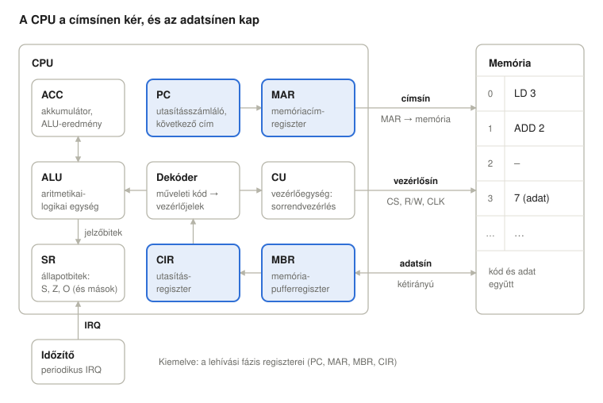
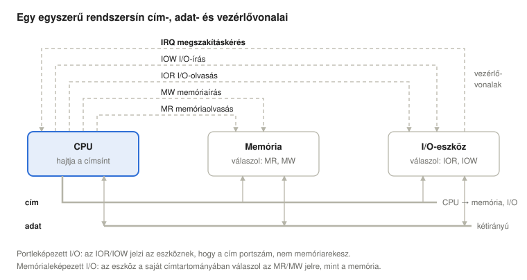
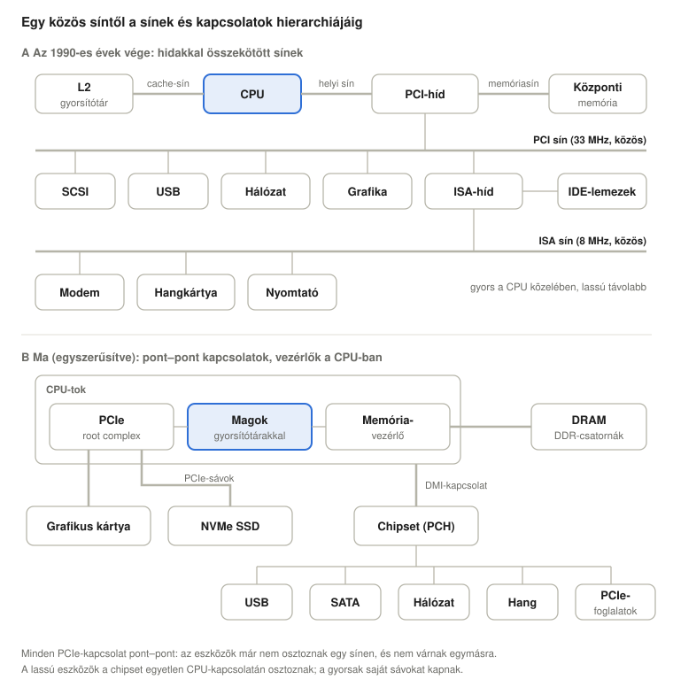
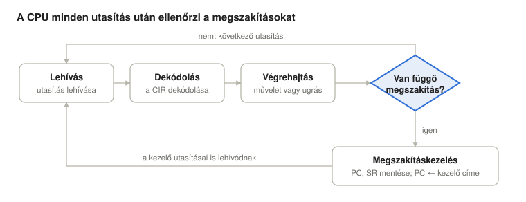

# Az utasítás-végrehajtási ciklus

*Operációs rendszerek előadás: a Neumann-gép, az utasításciklus és a megszakítások, Linux (x86-64) példákkal*

## Tanulási célok

A processzor egyetlen ciklust ismétel: lehív egy utasítást, dekódolja, végrehajtja, majd megnézi, érkezett-e megszakítás. Ez az előadás regiszterszinten követi végig ezt a ciklust egy egyszerű oktatási CPU-n, majd megmutatja ugyanezeket a mechanizmusokat egy valódi x86-64-es Linux rendszeren.

<details>
<summary><b>Egyszerűen elmagyarázva:</b> processzor (CPU), utasítás, regiszter, megszakítás, x86-64, Linux</summary>

- **Processzor, CPU** (Central Processing Unit, központi feldolgozóegység): a programokat futtató chip. Apró lépéseket hajt végre egymás után, másodpercenként milliárdszor.
- **Utasítás:** egy elemi lépés a CPU saját nyelvén, például „adj 2-t ehhez a számhoz” vagy „ugorj a 900-as címre”. A program utasítások hosszú listája.
- **Regiszter:** egy parányi, nagyon gyors tárolórekesz a CPU-n belül, amely egyetlen számot tart. Egy CPU-ban csak néhány tucat van belőle.
- **Megszakítás:** jelzés, amelyre a CPU egy pillanatra félreteszi a programját, hogy valami sürgőssel foglalkozzon – mint amikor olvasás közben megszólal a csengő. A következő előadás teljes egészében erről szól.
- **Oktatási CPU:** képzeletbeli, nagyon egyszerű processzor, amelyet a tanuláshoz találtak ki. A valódi processzorok ugyanezen elvek szerint működnek, csak sokkal több részlettel.
- **x86-64:** a legtöbb asztali gépben és laptopban található processzorcsalád (Intel és AMD), 64 bites változatban.
- **Linux:** szabad operációs rendszer, amely a legtöbb szerveren, az androidos telefonokon és sok asztali gépen fut. Az **operációs rendszer** az a program, amely a számítógépet kezeli, és lehetővé teszi, hogy más programok fussanak rajta (további példák: Windows, macOS).

</details>

Az előadás végére a hallgatók képesek lesznek:

- kimondani a Neumann-elvet, és megmagyarázni, miért hatékony és miért nem biztonságos;
- megnevezni a CPU fő regisztereit (PC, MAR, MBR, CIR, ACC, SR) és szerepüket;
- megmagyarázni egy sín cím-, adat- és vezérlővonalait, a memórialeképezett és a portleképezett I/O közötti különbséget, valamint azt, hogy egy PC miért használja sínek és kapcsolatok hierarchiáját egyetlen közös sín helyett;
- leírni a lehívási fázist regiszterátviteli jelöléssel;
- lépésről lépésre végigkövetni egy rövid gépi kódú program végrehajtását papíron és `gdb`-ben, közvetlen operandussal és direkt címzéssel is;
- besorolni az utasításokat a négy kategóriába (processzor–memória, processzor–I/O, adatfeldolgozás, vezérlés), és elolvasni egyszerű, valódi 8 bites gépi kódot;
- megmagyarázni, hogyan változtatják meg az ugrások és a megszakítások a végrehajtás sorrendjét, és miért van szüksége az operációs rendszernek az időzítő-megszakításra;
- megtalálni ezeket a mechanizmusokat egy futó Linux rendszeren (`/proc/<pid>/maps`, `/proc/interrupts`, `vmstat`).

## A Neumann-elv

A Neumann-architektúrában (Stallings, 2018) a program (a kód) és az adatok ugyanabban a memóriában vannak, és ugyanazon a sínrendszeren jutnak el a CPU-hoz. A gépnek három fő egysége van – a CPU, a memória és az I/O –, amelyeket közös sín köt össze.

Egy memóriarekeszről önmagában nem dönthető el, hogy utasítást vagy adatot tartalmaz. Ugyanaz a bitminta utasítás, ha a CPU a lehívási fázisban olvassa be, és adat, ha egy utasítás operandusaként olvassa.

**Miért hatékony?**

- Elég egyetlen memória és egyetlen sín, így a hardver egyszerű.
- A program adatként kezelhető: betölthető, másolható, lefordítható. A betöltők, a fordítóprogramok, a JIT-motorok és maga az operációs rendszer is erre épül.

<details>
<summary><b>Egyszerűen elmagyarázva:</b> memória, bit, bitminta, operandus, sín, I/O, betöltő, fordítóprogram, JIT</summary>

- **Memória** (RAM): a számítógép munkatára, számozott rekeszek nagyon hosszú sora. Minden rekesz sorszáma a **címe**, mint a házszámok egy utcában.
- **Bit:** a legkisebb információdarab, egy 0 vagy egy 1. A **bitminta** bitek sora, például 00010011.
- **Operandus:** az, amin az utasítás dolgozik. Az „adj hozzá 2-t” utasításban az operandus a 2.
- **Sín (busz):** közös vezetékköteg, amely a CPU-t, a memóriát és az eszközöket összeköti – mint egy út, amelyet minden forgalomnak használnia kell.
- **I/O** (Input/Output, bemenet/kimenet): minden, amit a számítógép a külvilággal cserél: billentyűzet, lemez, hálózat, képernyő.
- **Betöltő (loader):** az operációs rendszer azon része, amely a programot a lemezről a memóriába másolja, hogy futni tudjon.
- **Fordítóprogram (compiler):** program, amely az emberek által (például C nyelven) írt kódot a CPU által értett utasításokra fordítja le.
- **JIT** (Just-In-Time, „épp időben”) fordító: olyan fordító, amely a kódot a program futása közben fordítja le. A webböngészők ezzel futtatják gyorsan a JavaScriptet.

</details>

**Miért nem biztonságos?**

- Ha egy támadó adatot tud írni a memóriába, és oda tudja irányítani a vezérlést, a CPU utasításként hajtja végre (például puffertúlcsordulásnál).
- Egy hibás program felülírhatja a saját kódját vagy egy másik program kódját.

**A védekezés: jogosultsági bitek.** Az operációs rendszer jogosultságokat rendel a memória tartományaihoz (lapjaihoz), a CPU memóriakezelő egysége (MMU) pedig minden hozzáféréskor ellenőrzi őket:

| Bit | Jelentés | Tipikus használat | Linux így mutatja |
| --- | --- | --- | --- |
| R | olvasható | kód és adat | `r` |
| W | írható | csak adat | `w` |
| NX (no-execute) | nem végrehajtható | adat, heap, verem | hiányzó `x` |

Ökölszabály: egy tartomány vagy írható, vagy végrehajtható, de soha nem a kettő egyszerre. Ezt a szabályt **W^X**-nek („write xor execute”, írás kizáró vagy végrehajtás) nevezik. A szabálysértést a rendszer nem egyszerűen megakadályozza: a CPU kivételt (laphibát) vált ki, a Linux pedig `SIGSEGV` szignált küld a folyamatnak – ez a jól ismert „Segmentation fault”.

<details>
<summary><b>Egyszerűen elmagyarázva:</b> támadó, puffertúlcsordulás, lap, jogosultság, MMU, NX, heap, verem, kivétel, laphiba, folyamat, SIGSEGV, XOR</summary>

- **Puffertúlcsordulás (buffer overflow):** a program több adatot ír egy tárterületre, mint amennyi belefér, és a többlet átfolyik a szomszédos területre. Egy **támadó** (aki be akar törni a rendszerbe) ezt kihasználhatja arra, hogy a saját utasításait juttassa a memóriába.
- **Lap:** a memóriát rögzített méretű darabokban, lapokban kezelik, ezek mérete általában 4096 bájt. A jogosultságokat laponként állítják be.
- **Jogosultság:** mit szabad csinálni egy lappal: olvasni (r), írni (w), utasításként futtatni (x, execute).
- **MMU** (Memory Management Unit, memóriakezelő egység): a CPU azon része, amely a program által használt címeket valódi memóriacímekre fordítja, és minden hozzáférést összevet a jogosultságokkal – mint egy portás, aki tudja, ki melyik szobában lakik valójában, és ki hova léphet be.
- **NX** (No eXecute, nem végrehajtható): az a jogosultsági bit, amely azt mondja: „ez a lap adatot tartalmaz, soha ne futtasd utasításként”.
- **Heap és verem:** két memóriaterület, amely minden futó programnak van. A **heap** (kupac) a program által futás közben létrehozott adatokat tárolja; a **verem** (stack) úgy működik, mint egy tányérhalom (amit utoljára tettünk rá, azt vesszük le elsőként), és ideiglenes értékeket tárol.
- **Kivétel:** olyan megszakítás, amelyet maga az éppen futó utasítás okoz, például ha megszeg egy szabályt. A **laphiba** az a kivétel, amely akkor keletkezik, ha egy utasítás olyan laphoz nyúl, amelyet nem használhat, vagy amely éppen nincs a memóriában.
- **Folyamat:** egy futó program a memóriájával és az állapotával együtt.
- **SIGSEGV, „Segmentation fault”:** az az üzenet (szignál), amelyet a Linux egy memóriaszabályt megszegő programnak küld. Általában a program leállításával jár.
- **XOR** (exclusive or, kizáró vagy): „vagy az egyik, vagy a másik, de nem mindkettő”. A W^X azt jelenti, hogy egy lap lehet írható vagy végrehajtható, de soha nem mindkettő.

</details>

A közös sín a teljesítményt is korlátozza, mert egy utasítás és egy adat nem utazhat rajta egyszerre (ez a Neumann-féle szűk keresztmetszet, angolul von Neumann bottleneck). A modern CPU-k ezt a maghoz közeli, külön utasítás- és adatgyorsítótárakkal enyhítik („módosított Harvard” felépítés), a központi memória viszont közös marad.

<details>
<summary><b>Egyszerűen elmagyarázva:</b> szűk keresztmetszet, gyorsítótár (cache), mag, Harvard-architektúra</summary>

- **Szűk keresztmetszet:** az a legszűkebb pont, amely mindent lelassít, mint a palack nyaka.
- **Gyorsítótár (cache):** kicsi, nagyon gyors memória a CPU közelében, amely a nemrég használt adatok másolatát tartja, így a CPU-nak nem kell a lassabb központi memóriára várnia. Olyan, mintha a leggyakrabban használt könyveinket az íróasztalon tartanánk a könyvtár helyett.
- **Mag (core):** egy modern processzorchip több teljes CPU-t tartalmaz, ezeket nevezzük magoknak.
- **Harvard-architektúra:** olyan felépítés, amelyben az utasításoknak és az adatoknak külön memóriájuk (és külön sínjük) van; nevét a Harvard Mark I számítógépről kapta. A „módosított Harvard” azt jelenti, hogy a szétválasztás csak a gyorsítótárak szintjén valósul meg.

</details>

## A CPU belseje

A CPU regiszterekből, egy aritmetikai-logikai egységből (ALU) és egy vezérlőegységből (CU) áll. A memóriát csak két regiszteren keresztül éri el: a címeket a MAR-on át küldi ki, az adatokat pedig az MBR-en át fogadja vagy küldi.



Az ALU egyik bemenete az ACC, a másik az utasítás operandusa (a CIR alsó bitjei) vagy egy általános célú regiszter (REG). Az eredmény az ACC-be kerül, a tulajdonságai (előjel, nulla, túlcsordulás) pedig az SR-be.

Nem mindegyik regiszter látható a programozó számára. A PC, az ACC/REG és az SR utasításokkal olvasható és módosítható. A MAR, az MBR és a CIR belső regiszter: azért léteznek, hogy a hardver végre tudja hajtani a ciklust, és egyetlen utasítás sem hivatkozik rájuk.

<details>
<summary><b>Egyszerűen elmagyarázva:</b> ALU, CU, PC, MAR, MBR, CIR, ACC, SR, REG</summary>

- **ALU** (Arithmetic Logic Unit, aritmetikai-logikai egység): a CPU számológépe. Összead, kivon, összehasonlít és logikai műveleteket végez.
- **CU** (Control Unit, vezérlőegység): a CPU karmestere. Ő adja ki azokat a jeleket, amelyektől minden más rész a megfelelő pillanatban a megfelelő dolgot teszi.
- **PC** (Program Counter, utasításszámláló): a következő utasítás címét tárolja – a CPU könyvjelzője.
- **MAR** (Memory Address Register, memóriacím-regiszter): azt a címet tárolja, amelyet a CPU olvasni vagy írni akar – ez a „melyik házba?” regiszter.
- **MBR** (Memory Buffer Register, memória-pufferregiszter): a memóriából éppen beolvasott vagy oda éppen kiírandó adatot tárolja – ez a „mi van a csomagban?” regiszter.
- **CIR** (Current Instruction Register, utasításregiszter): az éppen végrehajtás alatt álló utasítást tárolja.
- **ACC** (Accumulator, akkumulátor): az a regiszter, amelyben a számítások eredményei gyűlnek.
- **SR** (Status Register, állapotregiszter): igen/nem bitek (jelzőbitek, flagek) összessége, amelyek az utolsó eredményt írják le, például „nulla lett”.
- **REG** (általános célú regiszterek): további regiszterek, amelyeket a program bármire használhat.

</details>

## A sínrendszer

A CPU és a memória három sínen és egy órajelvezetéken keresztül kommunikál. Egy memóriaolvasás mindhármat használja: a cím a címsínre kerül, a vezérlősín jelzi, hogy olvasásról van szó, az adat pedig az adatsínen érkezik vissza.

| Sín | Irány | Mit szállít | Példa a lehívás során |
| --- | --- | --- | --- |
| Címsín (ADDR) | CPU → memória | a MAR tartalmát, azaz a rekesz címét | 0, majd 1 |
| Adatsín (DATA) | kétirányú | a rekesz tartalmát az MBR felé (íráskor fordítva) | 19, majd 34 |
| Vezérlősín (CTRL) | CPU → memória | CS (chip select, chipkiválasztás: melyik eszköz válaszol), R/W (olvasás vagy írás) | CS aktív, R/W = olvasás |
| Órajel (CLK) | mindenhová | az ütem, amelyhez minden lépés igazodik | minden regiszterátvitel egy órajelütemre történik |

Az I/O-eszközök ugyanerre a sínrendszerre csatlakoznak. A CS jel dönti el, hogy egy adott címre a memória vagy egy I/O-eszköz válaszol. Ha egy eszköz közönséges memóriacímekre válaszol, azt **memórialeképezett I/O**-nak (memory-mapped I/O) nevezzük; Linuxon a `/proc/iomem` mutatja meg, mely fizikai címtartományok tartoznak a RAM-hoz és melyek az eszközökhöz.

<details>
<summary><b>Egyszerűen elmagyarázva:</b> címsín, adatsín, vezérlősín, chipkiválasztás, olvasás/írás, órajel, RAM, memórialeképezett I/O</summary>

- **Címsín:** a vezetékek, amelyek azt szállítják, hogy *hová* (melyik memóriarekeszbe). **Adatsín:** a vezetékek, amelyek azt szállítják, hogy *mit* (magát a számot). **Vezérlősín:** a vezetékek, amelyek azt szállítják, hogy *hogyan* (olvasás vagy írás, melyik chip válaszoljon).
- **CS** (Chip Select, chipkiválasztás): jel, amely egy bizonyos chipet „felébreszt”, a többinek pedig azt mondja, hogy ne figyeljen a sínre.
- **R/W** (Read/Write, olvasás/írás): jel, amely megmondja, hogy a CPU olvasni vagy írni akar.
- **Órajel** (CLK, clock): egyenletes ütemben ketyegő jel, másodpercenként milliárdszor. Minden lépés egy ütemre történik, mint ahogy az evezősök is a dob ütemét követik.
- **Kétirányú:** mindkét irányba működik.
- **RAM** (Random Access Memory, közvetlen elérésű memória): a központi memória.
- **I/O** (Input/Output, bemenet/kimenet): minden, amit a számítógép a külvilággal cserél: billentyűzet, lemez, hálózat, képernyő.
- **Memórialeképezett I/O:** az eszköz úgy tesz, mintha egy darab memória volna. Ha a „saját” címére írunk, az adat a RAM helyett az eszközhöz jut.
- **Fizikai cím:** egy rekesz valódi címe a memóriachipekben (a programok általában más, lefordított címeket látnak).

</details>

### Vezérlővonalak: memória vagy I/O?

Egy valódi rendszer vezérlősíne többet szállít a CS-nél és az R/W-nél. Az Intel 8080-alapú rendszerekben és Stallings (2018) modelljében használt klasszikus elrendezésben külön olvasó- és íróvonal van a memória és az I/O számára, valamint egy ellenkező irányú megszakításkérő vonal:



| Vonal | Ki hajtja | Jelentés |
| --- | --- | --- |
| MR (memory read, memóriaolvasás) | CPU | a sínen lévő cím memóriacím; memória, tedd az adott rekesz tartalmát az adatsínre |
| MW (memory write, memóriaírás) | CPU | memória, tárold el az adatsínen lévő értéket ezen a címen |
| IOR (I/O read, I/O-olvasás) | CPU | a sínen lévő cím egy I/O-portszám; az az eszköz, amelyé ez a port, tegye az adatát az adatsínre |
| IOW (I/O write, I/O-írás) | CPU | az az eszköz, amelyé ez a port, vegye át az értéket az adatsínről |
| IRQ (interrupt request, megszakításkérés) | I/O-eszköz | „foglalkozz velem”: ezt nézi az utasításciklus megszakítás-ellenőrzési lépése |

Külön I/O-vonalak esetén az eszközöknek saját címtartományuk van, ezek az **I/O-portok**, és a CPU-nak külön utasítások kellenek az elérésükhöz: x86-on az `in` és az `out`, amelyhez 65 536 port tartozik (16 bites portszámok). Ez a **portleképezett** (elkülönített, port-mapped vagy isolated) I/O. A másik lehetőség a fent leírt memórialeképezett I/O: egy eszköz közönséges címek egy tartományán válaszol az MR és MW jelekre, így a szokásos betöltő és tároló utasítások is elérik. A legtöbb modern eszköz memórialeképezett, és a legtöbb RISC processzornak (ARM, RISC-V) egyáltalán nincs portutasítása. Az x86 a kompatibilitás kedvéért megtartotta a portjait, és a Linux a `/proc/ioports` fájlban listázza ki őket ([lásd lent](#sínek-és-io-portok-egy-futó-rendszeren)). A felhasználói programok egyik esetben sem nyúlhatnak közvetlenül az eszközökhöz: ezt az operációs rendszer végzi el helyettük (lásd a [Megszakítások](../05-interrupts/) előadást).

<details>
<summary><b>Egyszerűen elmagyarázva:</b> vezérlővonal, MR, MW, IOR, IOW, IRQ, I/O-port, portleképezett I/O, címtartomány, in/out, RISC</summary>

- **Vezérlővonal:** a vezérlősín egyetlen vezetéke, amely egyetlen igen/nem parancsot visz, például: „memória, most olvass!”.
- **MR, MW** (Memory Read, Memory Write): a „memória, add ide ezt a rekeszt” és a „memória, tárold el ezt az értéket” parancs.
- **IOR, IOW** (I/O Read, I/O Write): ugyanez a két parancs, csak a memória helyett az eszközöknek szól.
- **IRQ** (Interrupt Request, megszakításkérés): az a vezeték, amelyen egy eszköz azt üzeni a CPU-nak: „foglalkozz velem!” – mint amikor jelentkezel az órán.
- **I/O-port:** egy eszköz számozott „postaládája”. A billentyűzetvezérlőé például a 60h portszám. Ha egy portra írsz, az érték az eszközhöz jut; ha olvasol belőle, az eszköz küld vissza egy értéket.
- **Portleképezett I/O:** az eszközöknek egy külön utcában van saját házszámuk; a CPU különleges utasításokkal (x86-on `in`, `out`) látogatja meg őket. **Memórialeképezett I/O:** az eszközök ugyanabban az utcában laknak, mint a memória, így a közönséges utasítások is elérik őket.
- **Címtartomány:** a használható címek teljes köre, például mind a 65 536 portszám.
- **RISC** (Reduced Instruction Set Computer, csökkentett utasításkészletű számítógép): kevesebb és egyszerűbb utasítással dolgozó processzorfelépítés, ilyen az ARM (szinte minden telefonban ez van) és a RISC-V.

</details>

## Egy sínről a sínek hierarchiájáig

Egyetlen közös sín elég egy kis gépnek, de gondot okoz, amikor nagyon eltérő sebességű eszközök osztoznak rajta. Egyszerre csak egy átvitel használhatja a sínt, így egy gyors memória-hozzáférésnek várnia kell, amíg egy lassú eszköz foglalja, és minél több eszköz csatlakozik rá, annál lassabban kell működnie (hosszabb vezetékek, nagyobb elektromos terhelés). A megoldás az, hogy minden sebességosztály saját sínt kap, a síneket pedig **hidak** (bridge) kötik össze (Stallings, 2018; Tanenbaum & Bos, 2015).



**A rész: egy 1990-es évek végi PC.** A CPU a második szintű (L2) gyorsítótárát egy külön gyorsítótársínen, minden mást a helyi sínen (local bus) ér el. A PCI-híd (az „északi híd”, north bridge) a memóriasínen keresztül a központi memóriához, valamint a PCI sínhez (32 bit, 33 MHz, legfeljebb 133 MB/s) köti a helyi sínt. A gyorsabb eszközök a PCI sínen ülnek: a SCSI- és USB-vezérlők, a hálózati kártya és a grafikus kártya. Egy második híd, az ISA-híd (a „déli híd”, south bridge) a PCI sínt a régi ISA sínhez (16 bit, kb. 8 MHz, néhány MB/s) köti a lassú, örökölt eszközök, például a modem, a hangkártya és a nyomtatóport számára; az IDE-lemezvezérlő is ennek a chipnek a része volt. Egy híd csak akkor adja át az átvitelt a másik oldalra, ha a cél ott van, így a sínek párhuzamosan dolgoznak: egy lassú ISA-átvitel nem akadályozza a CPU memória-hozzáféréseit.

**B rész: egy mai PC.** A memóriavezérlő és a PCI Express root complex beköltözött a CPU tokjába. A PCI Express (PCIe) már egyáltalán nem közös sín, hanem **pont–pont** (point-to-point) soros kapcsolatok összessége, amelyek **sávokból** (lane) állnak: egy grafikus kártya jellemzően 16 sávot kap, egy NVMe SSD 4-et, és minden kapcsolat a többitől függetlenül visz át adatot. A lassabb eszközök (USB, SATA-lemezek, hálózat, hang, további PCIe-foglalatok) a **chipsetre** csatlakoznak, amelyet Intel rendszereken PCH-nak (Platform Controller Hub) hívnak, és amely egyetlen kapcsolaton éri el a CPU-t (Intelen DMI, AMD-n egy PCIe-kapcsolat). A szoftver még mindig a régi szerkezetet látja: a PCIe-eszközöket pontosan úgy kell felderíteni és konfigurálni, mint a PCI-eszközöket, ezért írnak a Linux eszközei még mindig „PCI”-t.

Ez ugyanaz a gondolat, mint a [8. előadás](../08-two-level-memory-and-cache/) memóriahierarchiája: ami gyors és gyakran használt, az a CPU közelében van, ami lassú, az távolabb, ahol nem lassíthatja a többit.

<details>
<summary><b>Egyszerűen elmagyarázva:</b> híd, északi/déli híd, PCI, ISA, MHz, MB/s, SCSI, USB, IDE, örökölt (legacy), PCI Express, sáv, pont–pont, NVMe SSD, root complex, chipset, PCH, DMI, SATA</summary>

- **Híd (bridge):** chip, amely két sínt köt össze, és csak akkor ad át üzeneteket közöttük, ha szükséges – mint egy sorompó két parkoló között. Az **északi híd** volt a CPU-hoz közelebbi (a rajz tetején), a **déli híd** a lejjebb lévő.
- **PCI** (Peripheral Component Interconnect) és **ISA** (Industry Standard Architecture): a PC-k két szabványos bővítősíne. Az ISA az IBM PC-ből (1981) származik, a PC/AT-ben (1984) bővítették 16 bitesre; a PCI az 1990-es években váltotta fel.
- **MHz** (megahertz): másodpercenként egymillió ütem. **MB/s:** megabájt másodpercenként, vagyis mennyi adatot tud egy sín átvinni.
- **SCSI, IDE, SATA:** lemezek csatlakoztatásának módjai. A SCSI-t szervereken, az IDE-t átlagos PC-kben használták; a SATA az IDE mai változata.
- **USB** (Universal Serial Bus, univerzális soros sín): a billentyűzetek, egerek, pendrive-ok és szinte minden más eszköz csatlakozója.
- **Örökölt (legacy):** régi technika, amelyet csak azért tartanak meg, hogy a régi eszközök és programok továbbra is működjenek.
- **PCI Express (PCIe):** a PCI modern utódja. Egyetlen közös út helyett minden eszköz saját magánutat (**pont–pont kapcsolatot**) kap a CPU-hoz vagy a chipsethez. Egy **sáv** (lane) két vezetékpár, irányonként egy; több sáv szélesebb utat jelent.
- **NVMe SSD:** gyors, mozgó alkatrész nélküli (félvezetős) lemez, amely közvetlenül PCIe-sávokra csatlakozik.
- **Root complex:** a CPU-nak az a része, ahonnan a PCIe-kapcsolatok indulnak, a PCIe-kapcsolatok fájának gyökere.
- **Chipset, PCH** (Platform Controller Hub): az alaplapon lévő segédchip, amely a lassabb eszközöket csatlakoztatja. **DMI** (Direct Media Interface): az Intel kapcsolata a CPU és a PCH között.

</details>

## Az utasításciklus

A CPU egyetlen ciklust ismétel: utasításlehívás, dekódolás, végrehajtás, majd a megszakítás ellenőrzése.



- **Lehívás (fetch):** a PC által mutatott utasítás betöltődik a CIR-be, és a PC továbblép.
- **Dekódolás (decode):** a dekóder szétválasztja a műveleti kódot az operandustól, és beállítja a vezérlőjeleket.
- **Végrehajtás (execute):** az ALU elvégzi a műveletet, ugrásnál pedig a PC új értéket kap.
- **Megszakítás ellenőrzése (check interrupt):** ha nincs függőben lévő megszakítás, a következő lehívás jön; ha van, a vezérlés a megszakításkezelőre kerül.

<details>
<summary><b>Egyszerűen elmagyarázva:</b> lehívás, dekódolás, végrehajtás, műveleti kód, dekóder, vezérlőjelek, függőben lévő, megszakításkezelő</summary>

- **Lehívás:** a következő utasítás behozása a memóriából a CPU-ba. **Dekódolás:** annak kiderítése, mit jelent. **Végrehajtás:** az elvégzése.
- **Műveleti kód** (opcode, operation code): az utasításnak az a része, amely megmondja, *mit* kell tenni (összeadni, betölteni, ugrani). A maradék az operandus: *mivel*.
- **Dekóder:** az az áramkör, amely kiolvassa a műveleti kódot, és vezérlőjelekké alakítja.
- **Vezérlőjelek:** a CPU belső „most kapcsolj be!” parancsai, például „ALU, adj össze!” vagy „memória, olvass!”.
- **Függőben lévő:** elintézésre váró.
- **Megszakításkezelő:** az operációs rendszer azon kódrészlete, amely egy megszakítás érkezésekor lefut.

</details>

## A lehívási fázis lépésről lépésre

A lehívás négy regiszterátviteli lépésből áll. Az `X ← Y` azt jelenti, hogy X felveszi Y értékét, az `[R]` az R regiszter tartalmát jelöli, a `Mem[A]` pedig az A című memóriarekesz tartalmát.

```
MAR ← [PC]
PC  ← [PC] + 1
MBR ← Mem[MAR]
CIR ← [MBR]
```

1. **MAR ← [PC]**: a következő utasítás címe a memóriacím-regiszterbe, onnan pedig a címsínre kerül.
2. **PC ← [PC] + 1**: az utasításszámláló már a következő utasításra mutat. Oktatási CPU-nkban minden utasítás egy memóriaszó, ezért +1. Valódi CPU-n a PC az utasítás hosszával lép előre, ami x86-64-en 1 és 15 bájt között változik.
3. **MBR ← Mem[MAR]**: a memória az adatsínen át a memória-pufferregiszterbe küldi a kért rekesz tartalmát.
4. **CIR ← [MBR]**: az utasítás az utasításregiszterbe kerül, ahonnan a dekóder kiolvassa.

A PC a lehívás közben lép előre, nem a végrehajtás után. Így egy ugróutasításnak nincs mit visszacsinálnia: a végrehajtás során egyszerűen felülírja a PC-t, és a következő lehívás már az új címről olvas.

<details>
<summary><b>Egyszerűen elmagyarázva:</b> regiszterátviteli jelölés, memóriaszó, bájt, szögletes zárójeles jelölés</summary>

- **Regiszterátviteli jelölés:** tömör leírásmód arra, hogy mi hová mozog a CPU-n belül. A `MAR ← [PC]` így olvasandó: „másold a PC tartalmát a MAR-ba”.
- **`[PC]`:** a szögletes zárójel azt jelenti: „a benne tárolt érték”. A `Mem[MAR]` jelentése: „az a memóriarekesz, amelynek címe a MAR-ban van”.
- **Memóriaszó:** egy memóriarekesz, amelynek mérete a gép természetes adatmérete. Oktatási CPU-nkban egy szó 8 bites.
- **Bájt:** 8 bit, ennyi elég egy szöveges betű tárolására.

</details>

## Kidolgozott példa: LD 3, ADD 2

Ennek a kétutasításos programnak a végén az akkumulátorban 5 lesz: az LD 3 betölti a 3-at, az ADD 2 hozzáad 2-t.

**Utasításformátum.** Egy utasítás 8 bit széles: a felső 4 bit a műveleti kód (mit kell tenni), az alsó 4 bit az operandus.

| Műveleti kód | Mnemonik | Hatás |
| --- | --- | --- |
| 0001 | LD n | ACC ← n |
| 0010 | ADD n | ACC ← [ACC] + n |

**A memória tartalma a futás előtt:**

| Cím | Tartalom | Bináris | Decimális |
| --- | --- | --- | --- |
| 0 | LD 3 | 0001 0011 | 19 |
| 1 | ADD 2 | 0010 0010 | 34 |
| 2 | (üres) | | |
| 3 | 7 (adat) | 0000 0111 | 7 |

A memória csak számokat tárol. A 0-s címen lévő 19 azért LD 3, mert a CPU utasításként hívja le. A 3-as címen lévő 7 adat, de ha a PC oda mutatna, a CPU azt is utasításként próbálná értelmezni. Ez a Neumann-elv a gyakorlatban.

**A futás nyomon követése** (minden sor a lépés utáni állapotot mutatja):

| Lépés | PC | MAR | MBR | CIR (műveleti kód / operandus) | ACC |
| --- | --- | --- | --- | --- | --- |
| Kezdet | 0 | – | – | – | – |
| 1. lehívás | 1 | 0 | 19 | 0001 / 0011 | – |
| 1. dekódolás | 1 | 0 | 19 | LD, 3 | – |
| 1. végrehajtás | 1 | 0 | 19 | LD, 3 | 3 |
| 2. lehívás | 2 | 1 | 34 | 0010 / 0010 | 3 |
| 2. dekódolás | 2 | 1 | 34 | ADD, 2 | 3 |
| 2. végrehajtás | 2 | 1 | 34 | ADD, 2 | 5 |

Az ADD végrehajtásakor az ALU egyik bemenete az ACC, a másik a CIR operandusmezője. Az eredmény visszakerül az ACC-be, a dekóder pedig összeadásra utasítja az ALU-t.

**Címzési módok.** Itt az LD 3 operandusa maga az érték (*közvetlen operandus*), így ACC ← 3: az LD 3 a 3-as számot tölti be, nem a 3-as cím tartalmát. Ha az LD direkt (abszolút) címzést használna, a 3 egy memóriacím volna, és ACC ← Mem[3] = 7. Ugyanaz a bitminta tehát a címzési módtól függően mást jelent, a címzési módot pedig a műveleti kód határozza meg.

<details>
<summary><b>Egyszerűen elmagyarázva:</b> mnemonik, bináris, decimális, akkumulátor, nyomkövetés, közvetlen operandus, direkt címzés, címzési mód</summary>

- **Mnemonik:** egy műveleti kód rövid, könnyen megjegyezhető neve, például LD (load, betöltés) vagy ADD (összeadás). Az ember mnemonikokat ír, a gép számokat tárol.
- **Bináris:** számok felírása csak 0-val és 1-gyel (kettes számrendszer). A bináris 0001 0011 **decimálisan**, vagyis a megszokott tízes számrendszerben 19.
- **Nyomkövetés (trace):** a program lépésről lépésre történő követése, minden lépés után felírva minden regiszter értékét.
- **Közvetlen operandus:** az utasításban szereplő szám maga az érték. Az „LD 3” jelentése: „töltsd be a 3-as számot”.
- **Direkt címzés:** az utasításban szereplő szám egy cím. Ekkor az „LD 3” azt jelentené: „töltsd be azt, ami a 3-as memóriarekeszben van”.
- **Címzési mód:** az a szabály, amely megmondja, hogyan kell értelmezni az operandust: értékként, címként vagy valamilyen más módon.

</details>

## Második példa: direkt címzés

A valódi programok többnyire memóriában tárolt változókkal dolgoznak, ezért a legtöbb utasítás operandusa egy cím. Stallings (2018) ezt egy képzeletbeli gépen mutatja be:

- egy memóriaszó és egy utasítás egyaránt 16 bit széles;
- egy utasítás 4 bites műveleti kódból és 12 bites címből áll;
- három műveleti kódot használunk: 0001 = az AC betöltése a memóriából, 0101 = egy memóriaszó hozzáadása az AC-hez, 0010 = az AC tárolása a memóriába.

Minden szám hexadecimálisan szerepel. Egy hexadecimális számjegy pontosan 4 bit, így egy utasítás első számjegye a műveleti kódja, a másik három a címe: az 1940 bitmintája 0001 1001 0100 0000, azaz 1-es műveleti kód (betöltés) és 940-es cím.

| Cím | Tartalom | Jelentés |
| --- | --- | --- |
| 300 | 1940 | LOAD 940: AC ← Mem[940] |
| 301 | 5941 | ADD 941: AC ← [AC] + Mem[941] |
| 302 | 2941 | STORE 941: Mem[941] ← [AC] |
| … | | |
| 940 | 0003 | adat |
| 941 | 0002 | adat |

**A futás nyomon követése** (az állapot minden teljes utasítás után):

| Után | PC | IR | AC | Mem[941] |
| --- | --- | --- | --- | --- |
| kezdet | 300 | – | – | 0002 |
| LOAD 940 | 301 | 1940 | 0003 | 0002 |
| ADD 941 | 302 | 5941 | 0005 | 0002 |
| STORE 941 | 303 | 2941 | 0005 | 0005 |

A program ismét 3 + 2 = 5-öt számol, de most az operandusok a memóriából érkeznek, és az eredmény visszaíródik oda. Ezért mindegyik utasítás kétszer használja a sínt: egyszer az utasítás lehívásához, egyszer pedig az operandus olvasásához vagy írásához. Egy közvetlen operandushoz nem kell második hozzáférés, mert az az utasítással együtt érkezik.

**A címszélesség határozza meg a memória méretét.** Egy 12 bites címmező $2^{12} = 4096$ különböző rekeszt nevezhet meg, így ez a gép 4K szót tud megcímezni (egyenként 16 bitest, összesen 8 KiB-ot). A szószélesség és a címszélesség egymástól független tervezési döntés. Oktatási CPU-nk 4 bites operandusa címként használva csak $2^4 = 16$ rekeszt érne el; egy 32 bites cím 4 GiB bájtcímzésű memóriát ér el.

<details>
<summary><b>Egyszerűen elmagyarázva:</b> hexadecimális, AC, LOAD, STORE, szó, címszélesség, 4K, KiB, GiB</summary>

- **Hexadecimális** (hex): számok felírása tizenhatos számrendszerben, a 0–9 és az A–F számjegyekkel. Egy hexadecimális számjegy pontosan 4 bitet jelent, így a hex tömör módja a bitminták leírásának.
- **AC:** Stallingsnál az akkumulátor neve, ugyanaz, mint a mi ACC-nk.
- **LOAD, STORE:** a betöltés (load) egy értéket másol a memóriából egy regiszterbe; a tárolás (store) egy regiszter értékét másolja a memóriába.
- **Szó:** az az adategység, amelyet a gép természetes módon egy lépésben kezel, itt 16 bit.
- **Címszélesség:** hány bitből áll egy cím. Minden további bit megduplázza a megnevezhető rekeszek számát, mint amikor a házszámokhoz még egy számjegyet adunk.
- **4K, KiB, GiB:** 4K = 4 × 1024 = 4096. Egy KiB (kibibájt) 1024 bájt; egy GiB (gibibájt) 1024 × 1024 × 1024 bájt, nagyjából egymilliárd.

</details>

## Vezérlésátadás és jelzőbitek

Egy ugróutasítás a PC felülírásával változtatja meg a végrehajtás sorrendjét. Egy feltételes ugrás az ALU jelzőbitjei alapján dönt.

**Jelzőbitek.** Minden ALU-művelet után az eredmény tulajdonságai az állapotregiszterbe (SR) kerülnek:

| Jelzőbit | Akkor lesz 1, ha | x86-64 megfelelője |
| --- | --- | --- |
| S (sign, előjel) | az eredmény negatív | SF |
| Z (zero, nulla) | az eredmény nulla | ZF |
| O (overflow, túlcsordulás) | az előjeles eredmény nem fér el a regiszterben | OF |

A „nem nulla” feltétel a Z = 0; ennek nincs saját jelzőbitje, egy külön ugróutasítás vizsgálja (x86-64-en: `jz` és `jnz`). A processzorok további jelzőbiteket is tárolnak, például az átvitelt (carry, CF), amely a túlcsordulásjelző előjel nélküli megfelelője.

**Feltétel nélküli ugrás: JMP 1000.** A végrehajtás során PC ← 1000. A következő lehívás az 1000-es címről veszi az utasítást. Egy ugrás tehát nem más, mint egy betöltés a PC-be: a JMP 1000 pontosan azt teszi, amit egy képzeletbeli „LD PC, 1000” tenne, a feltételes ugrás pedig olyan betöltés a PC-be, amely csak akkor történik meg, ha a feltétel teljesül.

**Feltételes ugrás: JZ 900** (ugrás, ha nulla). A végrehajtási fázis megvizsgálja a Z jelzőbitet:

- **igen** (Z = 1, az előző eredmény nulla volt): PC ← 900, és a program a 900-as címen folytatódik;
- **nem** (Z = 0): a PC nem változik. Mivel a lehívás már továbbléptette, a program a JZ utáni utasítással folytatódik.

A ciklusokat és az elágazásokat (`if`, `while`, `for`) gépi szinten mind ilyen feltételes ugrásokkal valósítják meg.

<details>
<summary><b>Egyszerűen elmagyarázva:</b> jelzőbit, előjeles, előjel nélküli, túlcsordulás, átvitel, ugrás, feltételes ugrás, ciklus, elágazás</summary>

- **Jelzőbit (flag):** egyetlen igen/nem bit az állapotregiszterben, amelyet az utolsó számítás állít be (nulla lett? negatív? túl nagy?).
- **Előjeles / előjel nélküli számok:** az előjeles számok lehetnek negatívak (8 biten −128 … 127), az előjel nélküliek nem (8 biten 0 … 255).
- **Túlcsordulás (OF):** az előjeles eredmény nem fér el, ezért rossz előjellel jön ki: 8 biten 127 + 1 eredménye −128.
- **Átvitel (CF, carry):** az előjel nélküli eredmény nem fér el, és egy számjegy „leesik” a végéről – mint amikor az autó kilométerórája 999999-ről 000000-ra fordul át.
- **Ugrás:** olyan utasítás, amely megváltoztatja a PC-t, így a program nem a következő utasítással, hanem máshol folytatódik.
- **Feltételes ugrás:** csak akkor ugrik, ha egy feltétel teljesül (például „ha az eredmény nulla volt”). Így hoznak döntéseket a számítógépek.
- **Ciklus, elágazás:** a ciklus lépéseket ismétel (`while`, `for`); az elágazás két út közül választ (`if`). C-ben és a legtöbb nyelvben ezek a kulcsszavak feltételes ugrásokká alakulnak.

</details>

## Az utasítások négy kategóriája

Minden utasításkészlet, bármilyen nagy is, négyféle utasításból áll (Stallings, 2018):

| Kategória | Mit csinál | Példák ebben az előadásban | x86-64 példák |
| --- | --- | --- | --- |
| Processzor–memória | adatot mozgat a CPU és a memória között | LOAD 940, STORE 941 | `mov 8(%rsp), %eax`, `mov %eax, 8(%rsp)` |
| Processzor–I/O | adatot mozgat a CPU és egy I/O-eszköz között | (portleképezett I/O) | `in`, `out` |
| Adatfeldolgozás | aritmetikai vagy logikai művelet az adatokon | ADD 2 | `add`, `and`, `cmp` |
| Vezérlés | megváltoztatja a végrehajtás sorrendjét | JMP 1000, JZ 900 | `jmp`, `jz`, `call`, `ret` |

A valódi utasítások gyakran több kategóriába is tartoznak: az előző szakasz ADD 941 utasítása egyszerre olvas a memóriából és összead. Memórialeképezett I/O esetén a gyakorlatban nincs külön processzor–I/O kategória: a processzor–memória utasítások végzik el a feladatot, mert az eszköz egy memóriacímen válaszol.

<details>
<summary><b>Egyszerűen elmagyarázva:</b> utasításkészlet, call, ret, cmp</summary>

- **Utasításkészlet:** azoknak az utasításoknak a teljes listája, amelyeket egy processzor megért – a „szókincse”.
- **`call`, `ret`:** ugrás egy függvénybe úgy, hogy a CPU megjegyzi, hová kell visszatérnie; a függvény végén visszaugrás erre a megjegyzett helyre.
- **`cmp`** (compare, összehasonlítás): kivonja egymásból a két számot, de csak a jelzőbitek beállításához, az eredményt nem tartja meg, hogy utána egy feltételes ugrás következhessen.

</details>

## Valódi 8 bites gépi kód: a Z80

Oktatási CPU-nk kitalált, de a valódi 8 bites processzorok ugyanígy működnek. A Zilog Z80 (1976), az Intel 8080 kompatibilis továbbfejlesztése, az 1980-as évek számos otthoni számítógépében dolgozott (ZX Spectrum, Amstrad CPC, MSX), leszármazottait pedig ma is használják beágyazott eszközökben. Van egy 8 bites A akkumulátora, egy F jelzőbitregisztere, további hat 8 bites regisztere (B, C, D, E, H és L, amelyek párban a 16 bites BC, DE és HL regiszterként is használhatók), valamint egy 16 bites PC-je, így $2^{16} =$ 64 KiB memóriát tud megcímezni (Zilog, 2016). Egy utasítás 1–4 bájt hosszú, és az első bájtja (néha az első kettő) a műveleti kód.

Egy háromutasításos program az 59h címen (a `h` utótag azt jelenti, hogy a szám hexadecimális):

| Cím | Bájtok | Assembly | Hatás | PC a lehívás után |
| --- | --- | --- | --- | --- |
| 59h | `3C` | `INC A` | A ← [A] + 1 | 5Ah |
| 5Ah | `0E FF` | `LD C,FFh` | C ← FFh (255) | 5Ch |
| 5Ch | `C3 59 00` | `JP 0059h` | PC ← 0059h | 5Fh, majd felülíródik 59h-ra |

- **Az `INC A` egy bájt**, 3Ch = 0011 1100. A memóriában semmi sem jelöli utasításként: csak azért hívódik le utasításként, mert a PC értéke 59h. A lehívás 1-gyel lépteti a PC-t.
- **Az `LD C,FFh` két bájt**: a 0Eh műveleti kód, utána az FFh közvetlen operandus. A lehívás mindkét bájtot beolvassa, így a PC 2-vel lép előre. Ez a mi „LD 3”-unk valódi formája: az operandus az utasítással együtt utazik.
- **A `JP 0059h` három bájt**: a C3h műveleti kód és egy 16 bites cím, alsó bájttal kezdve (előbb 59h, aztán 00h; a Z80 *little-endian*). A végrehajtása csupán egy betöltés a PC-be, így a program a végtelenségig ismétlődik, és közben növeli az A-t.

A memória csak biteket tárol, és a PC dönti el, mely bájtok utasítások. Az 5Bh címen lévő FFh bájt az `LD C` adata, de ha egy ugrás valaha az 5Bh címre érkezne, a CPU utasításként hajtaná végre: a Z80-on az FFh az `RST 38h`, egy egybájtos hívás a 0038h címre. Ez ugyanaz a tanulság, mint a „19 a 0-s címen” esetében, csak valódi CPU-n.

Az x86 ugyanebből a családból nőtt ki. Az Intel 8086-ot (1978) úgy tervezték, hogy a 8080-as programok gépiesen átfordíthatók legyenek rá: az A-ból AL lett (az AX akkumulátor alsó bájtja), a BC párból CX, a DE-ből DX, a HL-ből pedig BX. A 32 és 64 bites kiterjesztések megtartották ezeket a neveket (EAX, RAX és így tovább), így egy 1974-es 8 bites processzor akkumulátora ma a RAX alsó bájtjaként él tovább. Még a kódolás mintája is megmaradt: a `mov $0xff, %cl` a `b1 ff` két bájtra fordul, egy műveleti kódra és utána egy közvetlen bájtra, pontosan úgy, mint az `LD C,FFh`.

<details>
<summary><b>Egyszerűen elmagyarázva:</b> Z80, 8080, 8086, otthoni számítógép, beágyazott eszköz, regiszterpár, 59h, little-endian, RST, AL, AX</summary>

- **Z80, 8080, 8086:** híres processzorchipek. Az Intel 8080 (1974) és a Zilog Z80 (1976) 8 bites processzor; az Intel 8086 (1978) a mai PC-processzorok 16 bites őse.
- **Otthoni számítógép:** az 1980-as évek kis számítógépei, amelyeket otthon a tévére kötöttek, például a ZX Spectrum.
- **Beágyazott eszköz:** egy másik termékbe rejtett számítógép, például egy mosógépben vagy egy számológépben.
- **Regiszterpár:** két 8 bites regiszter, amelyet együtt, egyetlen 16 bites regiszterként használunk – mint két számjegy, amelyek együtt egy kétjegyű számot adnak.
- **59h:** a végén álló `h` azt jelenti, hogy a szám hexadecimálisan van felírva; az 59h tízes számrendszerben 89.
- **Little-endian:** a többbájtos számot a legkisebb helyi értékű bájttal kezdve tárolják, mint amikor a dátumot nap–hónap–év sorrendben írjuk (a magyar év–hónap–nap sorrend épp ennek a fordítottja).
- **`RST`** (restart): egybájtos utasítás, amely egy rögzített címet hív meg. Gyors hívásokra tervezték, például megszakításkezelőkbe.
- **AL, AX:** az AX a 8086 16 bites akkumulátora; az AL az alsó („Low”), az AH a felső („High”) fele.

</details>

## Megszakítások

A megszakítás külső eseményt jelez, és a CPU csak a ciklus végén, a megszakítás-ellenőrzési lépésben veszi figyelembe. Így egy utasítás soha nem szakad félbe. A valódi x86-64 CPU-k is ezt a szabályt követik: a hardveres megszakításokat utasításhatáron ismerik fel. (Azok a kivételek, amelyeket maga az utasítás okoz, például a laphibák, az utasítás lehívása vagy végrehajtása közben keletkeznek; kezelésüket a [Megszakítások](../05-interrupts/) előadás magyarázza el.)

A folyamat lépései:

1. Egy eszköz, például a hardveres **időzítő** (timer), aktiválja a megszakításkérő vonalat (**IRQ**).
2. A kérés függőben lévőként rögzül (oktatási CPU-nkban egy bitként az SR-ben).
3. A CPU befejezi az aktuális utasítást.
4. A megszakítás-ellenőrzési lépésben észleli a függőben lévő kérést. Elmenti a PC-t és az SR-t, privilegizált (kernel-) módba vált, és a megszakításkezelő címét tölti a PC-be.
5. Lefut a kezelő (ez az operációs rendszer kódja), majd visszaállítja az elmentett PC-t és SR-t, és a program ott folytatódik, ahol abbamaradt.

Ha nincs függőben lévő kérés, a ciklus egyszerűen a következő lehívással indul újra.

**Maszkolás.** A CPU-nak megmondható, hogy rövid ideig hagyja figyelmen kívül a megszakításokat. x86-64-en erre az RFLAGS IF (interrupt enable, megszakítás-engedélyező) jelzőbitje szolgál; a kernel akkor törli, amikor nem szabad megzavarni. Az előadás későbbi `gdb`-nyomkövetésében az `[ IF ]` azt mutatja, hogy egy közönséges felhasználói programban a megszakítások engedélyezve vannak.

**A megszakítások, a kivételek és a rendszerhívások ugyanazt a mechanizmust használják.** A *megszakítás* kívülről jön (időzítő, lemez, hálózati kártya). A *kivételt* maga az aktuális utasítás okozza, például laphibát, ha olyan memóriához nyúl, amelyhez nem szabad. A *rendszerhívás* szándékos ugrás a kernelbe (x86-64-en a `syscall` utasítás). A CPU mindhárom esetben elmenti az állapotát, és a PC egy kernelbeli kezelőre áll.

**Miért fontos ez az operációs rendszernek?** Az időzítő-megszakítás garantálja, hogy az operációs rendszer rendszeresen visszakapja a vezérlést, még akkor is, ha egy program végtelen ciklusba kerül. Erre épül az időosztás és a preemptív (kiszorításos) ütemezés: a megszakításkezelőben dönti el az operációs rendszer, melyik folyamat fusson következőnek (Silberschatz et al., 2018).

<details>
<summary><b>Egyszerűen elmagyarázva:</b> időzítő, IRQ, kernelmód, maszkolás, RFLAGS, IF, rendszerhívás, időosztás, preemptív ütemezés, végtelen ciklus</summary>

- **Időzítő (timer):** hardveres óra, amely szabályos időközönként megszakítást tud küldeni.
- **IRQ** (Interrupt Request, megszakításkérés): az a jel, amellyel egy eszköz megszakítást kér – mint amikor valaki jelentkezik az órán.
- **Kernelmód** (privilegizált mód): az a CPU-üzemmód, amelyben minden megengedett. Csak az operációs rendszer magja, a **kernel** fut benne; a közönséges programok a korlátozott felhasználói módban futnak.
- **Maszkolás:** megmondjuk a CPU-nak, hogy egy ideig ne vegye figyelembe a megszakításokat – mint a telefon „ne zavarjanak” üzemmódja. A kérések várakoznak, nem vesznek el.
- **RFLAGS, IF:** az RFLAGS az x86-64 állapotregisztere; az IF (Interrupt enable Flag, megszakítás-engedélyező jelzőbit) az a bit benne, amely a közönséges megszakításokat be- vagy kikapcsolja.
- **Rendszerhívás:** egy program kérése az operációs rendszerhez, hogy tegyen meg valamit, amit a program maga nem tehet meg, például „olvasd be ezt a fájlt”.
- **Időosztás:** minden program sorban rövid időre megkapja a CPU-t, így úgy tűnik, mintha mind egyszerre futnának.
- **Preemptív ütemezés:** az operációs rendszer bármikor elveheti a CPU-t egy programtól, hogy egy másik kerüljön sorra. Enélkül a programnak önként kellene visszaadnia a CPU-t.
- **Végtelen ciklus:** olyan program, amely örökké ugyanazokat a lépéseket ismétli, és sosem ér véget.

</details>

## Ugyanez Linuxon (x86-64)

Mindaz, amit eddig láttunk, egyszerűsített modell. Ez a szakasz megmutatja, hol jelennek meg ezek a gondolatok egy valódi x86-64-es Linux gépen. Az alábbi kimenetek mind valódi rendszerről származnak (6.18-as kernel); a címek és a számlálók értékei a saját gépünkön eltérőek lesznek.

<details>
<summary><b>Egyszerűen elmagyarázva:</b> kernel, kernelverzió, valódi rendszer</summary>

- **Kernel:** az operációs rendszer magja, az a része, amely teljes ellenőrzést gyakorol a hardver fölött. A „6.18-as kernel” a Linux kernelének verziószáma.
- A példákban a `$` jellel kezdődő sorok a terminálba begépelt parancsok; a többi sor a számítógép válasza.

</details>

### Az oktatási CPU-tól az x86-64-ig

| Oktatási CPU | x86-64 | Látható a programok számára? |
| --- | --- | --- |
| PC | RIP (instruction pointer, utasításmutató) | igen, közvetve (ugrások, hívások) |
| ACC, REG | 16 általános célú regiszter (RAX, RBX, …, R15) | igen |
| SR | RFLAGS (SF, ZF, OF, CF, IF, …) | igen |
| MAR, MBR, CIR | a CPU front endjének és memória-futószalagjának belső részei | nem |
| 8 bites utasítás, 4 bites műveleti kód | utasításonként 1–15 bájt | igen (`objdump`) |
| LD n, ADD n | `mov $n, %eax`, `add $n, %eax` | igen |
| JMP, JZ | `jmp`, `jz` (más írásmóddal `je`) | igen |
| R / W / NX bitek | laptáblabitek, az NX-et a CPU támogatja (`nx` a `/proc/cpuinfo`-ban) | a `/proc/<pid>/maps` révén |
| Időzítő → IRQ | helyi APIC-időzítő → „Local timer interrupts” | a `/proc/interrupts` révén |

<details>
<summary><b>Egyszerűen elmagyarázva:</b> RIP, RAX, RFLAGS, futószalag (pipeline), laptábla, PID, /proc, helyi APIC</summary>

- **RIP, RAX, RFLAGS:** az utasításszámláló (Instruction Pointer), az első általános célú regiszter és az állapotregiszter x86-64-es neve.
- **Front end, futószalag (pipeline):** egy valódi CPU egyszerre több utasításon dolgozik, mint egy futószalag, amelynek minden állomása egy-egy lépést végez. A front end az a rész, amely lehív és dekódol.
- **Laptábla:** az a lista, amelyet az operációs rendszer minden programhoz vezet: mely memórialapokat használhatja a program, azok valójában hol vannak a memóriában, és milyen jogosultságokkal.
- **PID** (process ID, folyamatazonosító): az a szám, amelyet a Linux minden futó programnak ad. A `/proc/<pid>/maps` jelentése: „az adott számú program maps fájlja”.
- **`/proc`:** egy olyan mappa a Linuxban, amely egyetlen lemezen sem létezik. „Fájljai” ablakok a kernelbe, élő információt mutatnak. A `/proc/cpuinfo` a processzort írja le.
- **Helyi APIC** (Advanced Programmable Interrupt Controller, fejlett programozható megszakításvezérlő): minden CPU-magba épített kis megszakításvezérlő; ebben van a mag időzítője is.

</details>

### A példaprogram x86-64 assemblyben

Ugyanaz a program, LD 3, majd ADD 2, kiegészítve egy feltételes ugrással. Az eredmény a folyamat kilépési kódja lesz, így a shell meg tudja mutatni. (AT&T szintaxis, ahogy a GNU eszközök használják.)

```asm
    .globl _start
    .text
_start:
    mov  $3, %eax        # LD 3   (immediate operand)
    add  $2, %eax        # ADD 2
    jz   done            # JZ: jump if ZF = 1
    mov  %eax, %edi      # exit code = result
done:
    mov  $60, %eax       # system call number 60 = exit
    syscall              # enter the kernel
```

```console
$ as ldadd.s -o ldadd.o && ld ldadd.o -o ldadd
$ ./ldadd; echo $?
5
```

Az `objdump -d ldadd` megmutatja a gépi kódot. Akárcsak a memóriatáblázatunkban, a program a memóriában csupán számok sorozata:

```console
0000000000401000 <_start>:
  401000:  b8 03 00 00 00     mov    $0x3,%eax
  401005:  83 c0 02           add    $0x2,%eax
  401008:  74 02              je     40100c <done>
  40100a:  89 c7              mov    %eax,%edi

000000000040100c <done>:
  40100c:  b8 3c 00 00 00     mov    $0x3c,%eax
  401011:  0f 05              syscall
```

Figyeljük meg az eltérő utasításhosszakat (5, 3, 2 és 2 bájt): a lehívási fázisunk „+1”-éből „+ az adott utasítás hossza” lesz.

<details>
<summary><b>Egyszerűen elmagyarázva:</b> assembly nyelv, AT&T szintaxis, GNU, as, ld, kilépési kód, shell, objdump, hexadecimális, EAX, EDI</summary>

- **Assembly nyelv:** számok helyett olvasható mnemonikokkal (`mov`, `add`) leírt utasítások. Minden sorból egy gépi utasítás lesz.
- **AT&T szintaxis:** az x86 assembly két elterjedt írásmódjának egyike; elöl a forrás, utána a cél áll (`mov $3, %eax` = „tedd a 3-at az EAX-be”).
- **GNU eszközök, `as`, `ld`:** a GNU egy nagy szabadszoftver-projekt, amelynek eszközeit (fordító, assembler, linker) a Linux rendszerek használják. Az `as` (assembler) az assembly kódot gépi kóddá alakítja; az `ld` (linker, szerkesztő) ebből futtatható programot készít.
- **Kilépési kód:** szám, amelyet a program a befejezésekor visszaad. Az `echo $?` kiírja. Megállapodás szerint a 0 azt jelenti: „minden rendben ment”.
- **Shell:** az a program, amely beolvassa és lefuttatja a terminálba gépelt parancsokat.
- **`objdump -d`:** eszköz, amely megmutatja a programban lévő gépi utasításokat (visszafejtés, disassembly).
- **Hexadecimális** (`0x…`): számok felírása tizenhatos számrendszerben, a 0–9 és az a–f számjegyekkel. `0x3c` = 60. A programozók azért kedvelik, mert egy hexadecimális számjegy pontosan 4 bit.
- **EAX, EDI:** a 64 bites RAX és RDI regiszter alsó, 32 bites fele. Az `exit` rendszerhívásnál az RDI viszi a kilépési kódot.
- **`syscall`:** az az x86-64-es utasítás, amellyel egy program az operációs rendszert hívja. Itt arra kéri a kernelt, hogy fejezze be a programot (60-as számú rendszerhívás, „exit”).

</details>

### Nyomkövetés gdb-vel

A `gdb` egyszerre egy utasítást tud végrehajtani (`stepi`), így a papíron végzett nyomkövetést a valódi CPU-n is megismételhetjük:

```console
$ gdb -q ./ldadd
(gdb) starti
(gdb) info registers rip rax eflags
(gdb) stepi
...
```

| Utasítás után | RIP (PC) | RAX (ACC) | EFLAGS |
| --- | --- | --- | --- |
| kezdet | 0x401000 | 0 | `[ IF ]` |
| `mov $3, %eax` | 0x401005 | 3 | `[ IF ]` |
| `add $2, %eax` | 0x401008 | 5 | `[ PF IF ]` |
| `je done` (nem ugrik) | 0x40100a | 5 | `[ PF IF ]` |

Az eredmény 5, nem nulla, ezért a ZF 0 marad, és az ugrás nem történik meg: a RIP egyszerűen a következő utasításra lép, pontosan úgy, mint a JZ „nem” ágán. (A PF a paritásjelző: az eredmény alsó bájtjában, 5 = 101₂, páros számú 1-es bit van.)

<details>
<summary><b>Egyszerűen elmagyarázva:</b> debugger, gdb, starti, stepi, EFLAGS, PF, 101₂</summary>

- **Debugger (hibakereső), `gdb`:** eszköz, amely felügyelet alatt futtat egy programot, így megállíthatjuk, belenézhetünk, és utasításonként léptethetjük.
- **`starti`, `stepi`:** gdb-parancsok: a `starti` elindítja a programot, és az első utasítása előtt megáll; a `stepi` pontosan egy utasítást hajt végre.
- **EFLAGS:** az RFLAGS állapotregiszter 32 bites része. A gdb azokat a jelzőbiteket sorolja fel, amelyek értéke 1.
- **PF** (Parity Flag, paritásjelző): 1, ha az eredmény legalsó bájtjában páros számú 1-es bit van.
- **101₂:** a kis ₂ azt jelenti: „kettes számrendszerben”. A bináris 101 az 5.

</details>

### Címzési módok: egyetlen karakteren múlik

AT&T szintaxisban a `$` jelöli a közvetlen operandust. Nélküle a szám memóriacím:

| Utasítás | Gépi kód | Jelentés |
| --- | --- | --- |
| `mov $3, %eax` | `b8 03 00 00 00` | EAX ← 3 (közvetlen, mint az LD 3-unk) |
| `mov 3, %eax` | `8b 04 25 03 00 00 00` | EAX ← Mem[3] (direkt címzés) |

A direkt változat panasz nélkül lefordul, de összeomlik:

```console
$ ./direct
Segmentation fault
```

A 3-as cím nincs leképezve a folyamat címtartományába, ezért az MMU laphibát vált ki, a kernel pedig `SIGSEGV`-vel leállítja a folyamatot. Ez ugyanaz a [címzésimód-különbség](#címzési-módok-egyetlen-karakteren-múlik), mint az LD 3 példában, csak valódi CPU-n: ugyanaz a „3” az egyik módban érték, a másikban cím.

<details>
<summary><b>Egyszerűen elmagyarázva:</b> leképezett, a kernel leállítja a folyamatot</summary>

- **Leképezett (mapped):** egy memóriacím akkor van leképezve, ha a program kapott ott egy lapot. Az alacsony címeket, például a 3-at, szándékosan soha nem képezik le, hogy az ilyen hibák kiderüljenek.
- **A kernel leállítja a folyamatot:** az operációs rendszer befejezi a programot. A **folyamat** egy futó program.

</details>

### Memóriajogosultságok egy valódi folyamatban

Minden folyamat láthatja a saját memóriatérképét a `/proc/self/maps` fájlban. Részlet a `cat /proc/self/maps` kimenetéből:

```console
56520cec6000-56520cec8000 r--p 00000000 fe:00 343944   /usr/bin/cat
56520cec8000-56520cecd000 r-xp 00002000 fe:00 343944   /usr/bin/cat
56520cecd000-56520cecf000 r--p 00007000 fe:00 343944   /usr/bin/cat
56520ced0000-56520ced1000 rw-p 00009000 fe:00 343944   /usr/bin/cat
565230d03000-565230d24000 rw-p 00000000 00:00 0        [heap]
...
7fff65453000-7fff65479000 rw-p 00000000 00:00 0        [stack]
```

A kód (`r-x`) olvasható és végrehajtható, de nem írható. Az adatok, a heap és a verem (`rw-`) írhatók, de nem végrehajthatók. Egyetlen tartomány sem `rwx`: ez a W^X a gyakorlatban.

Már maga a futtatható fájl kéri, hogy a verem ne legyen végrehajtható. A `readelf -lW /bin/ls` többek között ezt írja ki:

```console
  GNU_STACK      0x000000 0x0000000000000000 0x0000000000000000 0x000000 0x000000 RW  0x10
```

`RW`, `E` nélkül: a verem olvasható és írható, de nem végrehajtható.

<details>
<summary><b>Egyszerűen elmagyarázva:</b> /proc/self/maps, oszlopok, readelf, ELF</summary>

- **`/proc/self/maps`:** az őt olvasó program („self”, saját maga) összes memóriaterületének listája, soronként egy: kezdő- és végcím, jogosultságok, és hogy mi van ott tárolva.
- **`r-xp`:** a jogosultsági oszlop: r = olvasás, w = írás, x = végrehajtás, `-` = nem megengedett; a végén álló `p` azt jelenti, hogy privát: ha a program oda ír, saját másolatot kap, és a változást sem más programok nem látják, sem a fájlba nem íródik vissza.
- **`readelf`:** eszköz, amely megmutatja egy Linux programfájl belsejét. Az **ELF** (Executable and Linkable Format, futtatható és szerkeszthető formátum) a Linux programok fájlformátuma, mint Windowson az `.exe`.

</details>

**Kísérlet: adat végrehajtása.** Ez a C program hat bájt gépi kódot (`mov $5, %eax; ret`) tárol egy veremben lévő tömbben, és megpróbálja meghívni:

```c
#include <stdio.h>
#include <string.h>
#include <sys/mman.h>
#include <unistd.h>

int main(int argc, char **argv) {
    /* x86-64 machine code for:  mov $5, %eax ; ret */
    unsigned char code[] = { 0xb8, 0x05, 0x00, 0x00, 0x00, 0xc3 };

    if (argc > 1) {   /* "./nx fix": copy to a page, then make it executable */
        long pg = sysconf(_SC_PAGESIZE);
        unsigned char *p = mmap(NULL, pg, PROT_READ | PROT_WRITE,
                                MAP_PRIVATE | MAP_ANONYMOUS, -1, 0);
        memcpy(p, code, sizeof code);
        mprotect(p, pg, PROT_READ | PROT_EXEC);   /* W^X: drop write, add exec */
        printf("result = %d\n", ((int (*)(void))p)());
    } else {          /* "./nx": run the bytes where they are, on the stack */
        printf("result = %d\n", ((int (*)(void))code)());
    }
    return 0;
}
```

```console
$ gcc -o nx nx.c
$ ./nx
Segmentation fault
$ ./nx fix
result = 5
```

A bájtok mindkét esetben azonosak. A veremben adatok, és az NX bit megakadályozza, hogy a CPU utasításként hívja le őket. Miután az `mprotect` a lapot írhatóról végrehajthatóra állítja, pontosan ugyanezek a bájtok lefutnak. A JIT-fordítók (például a webböngészőkben) is így alakítják át teljesen szabályosan a generált adatot kóddá.

<details>
<summary><b>Egyszerűen elmagyarázva:</b> tömb, függvénymutató, mmap, mprotect, lapméret</summary>

- **Tömb:** a memóriában egymás mellett tárolt értékek számozott sora. Itt hat bájt gépi kódot tartalmaz.
- **Függvénymutató meghívása:** C-ben megmondhatjuk a CPU-nak: „ugorj erre a címre, és futtasd, ami ott van”. A program így próbálja lefuttatni a tömbjét.
- **`mmap`:** új memóriadarabot (egész lapokat) kér az operációs rendszertől.
- **`mprotect`:** arra kéri az operációs rendszert, hogy változtassa meg bizonyos lapok jogosultságait, itt „írható”-ról „végrehajtható”-ra.
- **Lapméret:** egy lap mérete, általában 4096 bájt; a `sysconf(_SC_PAGESIZE)` ezt kérdezi le a rendszertől.

</details>

### Sínek és I/O-portok egy futó rendszeren

A `/proc/ioports` egy x86-os gép portleképezett I/O-címtartományát listázza ki, vagyis azt a 65 536 portszámot, amelyet az `in` és az `out` utasítással lehet elérni:

```console
$ cat /proc/ioports
0000-0cf7 : PCI Bus 0000:00
  0000-001f : dma1
  0020-0021 : pic1
  0040-0043 : timer0
  0050-0053 : timer1
  0060-0060 : keyboard
  0064-0064 : keyboard
  0070-0071 : rtc_cmos
  0080-008f : dma page reg
  00a0-00a1 : pic2
  00c0-00df : dma2
  00f0-00ff : fpu
  03f8-03ff : serial
0cf8-0cff : PCI conf1
0d00-ffff : PCI Bus 0000:00
```

Ezek az 1984-es IBM PC/AT rögzített portcímei, az A ábrarész ISA-korszakából: a DMA-vezérlők, a két megszakításvezérlő (`pic1`, `pic2`, lásd a [Megszakítások](../05-interrupts/) előadást), az időzítő, a billentyűzetvezérlő, a valós idejű óra és az első soros port a 3F8h címen. Még ez a virtuális gép is biztosítja őket. A CF8h–CFFh portok a PCI-konfigurációs tér elérésének klasszikus módját szolgálják: a CPU egy eszköz sín/eszköz/funkció számát a CF8h portra írja, majd a CFCh porton keresztül olvassa vagy írja az eszköz konfigurációs regisztereit.

A memórialeképezett oldalt a `/proc/iomem` mutatja. A legfelső szintű sorai megmutatják, hol ér véget a RAM, és hol kezdődnek az eszközök:

```console
$ grep -v '^ ' /proc/iomem
00000000-00000fff : Reserved
00001000-0009fbff : System RAM
0009fc00-000fffff : Reserved
00100000-bfffffff : System RAM
c0001000-eebfffff : PCI Bus 0000:00
eec00000-febfffff : Reserved
fec00000-fec003ff : IOAPIC 0
100000000-23fffffff : System RAM
4000000000-7fffffffff : PCI Bus 0000:00
```

A RAM 3 GiB-nál (BFFFFFFFh) véget ér, és 4 GiB fölött folytatódik: a köztes címeket memórialeképezett eszközök foglalják el, köztük az I/O APIC megszakításvezérlő a FEC00000h címen. A memórialeképezett I/O tehát elhasznál a címtartományból; ez az egyik oka annak, hogy a 32 bites PC-k ritkán tudták kihasználni a teljes 4 GiB RAM-ot.

Maguk a PCI-eszközök a `/sys/bus/pci/devices` alatt jelennek meg, tartomány:sín:eszköz.funkció alakú névvel, és egy osztálykóddal, amely megmondja, milyen fajta eszközről van szó:

```console
$ grep . /sys/bus/pci/devices/*/class
/sys/bus/pci/devices/0000:00:00.0/class:0x060000
/sys/bus/pci/devices/0000:00:01.0/class:0xffff00
/sys/bus/pci/devices/0000:00:02.0/class:0x018000
/sys/bus/pci/devices/0000:00:03.0/class:0x018000
/sys/bus/pci/devices/0000:00:04.0/class:0x018000
/sys/bus/pci/devices/0000:00:05.0/class:0x018000
/sys/bus/pci/devices/0000:00:06.0/class:0x018000
/sys/bus/pci/devices/0000:00:07.0/class:0x018000
/sys/bus/pci/devices/0000:00:08.0/class:0x020000
/sys/bus/pci/devices/0000:00:09.0/class:0xffff00
/sys/bus/pci/devices/0000:00:0a.0/class:0xffff00
```

A 06 00 osztály egy host bridge (a CPU kapcsolata a PCI világához), a 01 80 egy háttértár-vezérlő (itt hat virtuális lemez), a 02 00 egy Ethernet-hálózati vezérlő, az FF pedig szabványos osztály nélküli eszköz. Mindegyik a 00-s sínen van: egy virtuális gépnek nincs fizikai hierarchiája, amelyet utánoznia kellene. Egy fizikai PC-n az `lspci -tv` kirajzolja a root portok, hidak és eszközök valódi fáját (7. laborfeladat; a mért rendszeren az `lspci` nem volt telepítve, ezért itt nincs kimenet).

<details>
<summary><b>Egyszerűen elmagyarázva:</b> /proc/ioports, /proc/iomem, DMA-vezérlő, valós idejű óra, soros port, konfigurációs tér, /sys, osztálykód, host bridge, lspci</summary>

- **`/proc/ioports`, `/proc/iomem`:** a Linux két „ablakfájlja”: az első azt sorolja fel, melyik I/O-portszám melyik eszközé, a második azt, hogy mely fizikai memóriacímek tartoznak a RAM-hoz és melyek az eszközökhöz.
- **DMA-vezérlő:** segédchip, amely a CPU nélkül másol adatot az eszközök és a memória között (a következő előadás elmagyarázza).
- **Valós idejű óra (RTC, real-time clock):** kis, elemről működő óra, amely akkor is számolja a dátumot és az időt, amikor a számítógép ki van kapcsolva.
- **Soros port:** régi, egyszerű csatlakozó, amely az adatot bitenként, egymás után küldi; a 3F8h címen lévő `serial` az első ilyen, Windowson COM1 a neve.
- **Konfigurációs tér:** néhány regiszter minden PCI-eszközön, amely elárulja, milyen eszközről van szó, és amelyen keresztül az operációs rendszer megmondhatja neki, milyen címeket használjon.
- **`/sys`:** a Linux egy másik „ablakmappája”, amely az eszközöket és a meghajtóprogramokat faszerkezetben mutatja.
- **Osztálykód:** minden PCI-eszközön lévő szám, amely megmondja, milyen fajta eszköz: háttértár, hálózat, híd, grafika és így tovább.
- **Host bridge:** a CPU és a PCI-eszközök közötti kapcsolat, a PCI-fa „bejárati ajtaja”.
- **`lspci`:** parancs, amely kilistázza a PCI-eszközöket; a `-tv` kapcsolóval fába rendezve, a nevükkel együtt rajzolja ki őket.

</details>

### Megszakítások egy futó rendszeren

A `/proc/interrupts` CPU-magonként számlálja a megszakításokat a rendszerindítás óta:

```console
$ grep -E 'LOC|RES' /proc/interrupts
LOC:      17996      16921   Local timer interrupts
RES:       1567       1431   Rescheduling interrupts
```

- A **LOC** az ábránkon szereplő időzítő-megszakítás: minden magnak saját helyi időzítője van.
- A **RES** azok a megszakítások, amelyeket egy mag egy másiknak küld, hogy újraütemezésre kérje.

Milyen gyakran jelez az időzítő? A kernel tick-frekvenciája fordítási opció, a `CONFIG_HZ`. Ezen a rendszeren 250 (másodpercenként 250 tick, 4 ms-onként egy); gyakori értékek a 100, 250, 300 és 1000. A modern kernelek az energiatakarékosság érdekében a tétlen magokon le is állítják a ticket („tickless” működés), ezért egy tétlen gépen a számlálók lassabban nőnek, mint másodpercenként 250.

A `vmstat 1` élőben mutatja a gyakoriságokat. Az `in` oszlop a másodpercenkénti megszakítások, a `cs` a másodpercenkénti környezetváltások száma:

```console
$ vmstat 1
procs -----------memory---------- ---swap-- -----io---- -system-- -------cpu-------
 r  b   swpd   free   buff  cache   si   so    bi    bo   in   cs us sy id wa st gu
 0  0      0 7319044  18932 620260    0    0     0     0  239  191  9  0 91  0  1  0
```

Minden környezetváltás a kernelen belül történik, ahová egy megszakítás vagy egy rendszerhívás révén jut a vezérlés. Amikor megérkezik az időzítő-megszakítás, a Linux ütemezője (az EEVDF, a 6.6-os kernel óta az alapértelmezett) megnézi, hogy a futó feladat elhasználta-e már a CPU-időből méltányosan neki járó részt, és ha igen, átvált egy másikra.

<details>
<summary><b>Egyszerűen elmagyarázva:</b> grep, tick, CONFIG_HZ, tickless, vmstat, környezetváltás, ütemező, EEVDF</summary>

- **`grep`:** parancs, amely egy fájlnak csak a mintára illeszkedő sorait írja ki.
- **Tick:** egy szabályos időzítő-megszakítás, a kernel „óraütése”. A **`CONFIG_HZ`** azt adja meg, hogy a kernelt másodpercenként hány tickre fordították (Hz = másodpercenként).
- **Tickless (tick nélküli):** a tétlen mag energiatakarékosságból kikapcsolja a szabályos tickjét, és csak akkor ébred fel, ha dolga akad.
- **`vmstat 1`:** parancs, amely másodpercenként kiír egy sor rendszerstatisztikát.
- **Környezetváltás (context switch):** a CPU abbahagyja az egyik program futtatását, és egy másikat kezd futtatni: elmenti az elsőnek a regisztereit, és betölti a másodikét. Olyan, mint amikor könyvjelzőt teszünk az egyik könyvbe, és kinyitunk egy másikat.
- **Ütemező:** az operációs rendszer azon része, amely eldönti, melyik program kapja meg legközelebb a CPU-t.
- **EEVDF** (Earliest Eligible Virtual Deadline First, a legkorábbi jogosult virtuális határidő először): annak a módszernek a neve, amellyel a Linux ütemezője a 6.6-os verzió óta méltányosan osztja el a CPU-időt.

</details>

## Laborfeladatok

1. **A saját folyamatod memóriája.** Futtasd a `cat /proc/self/maps` parancsot. Keresd meg a kódot, a heapet és a vermet. Mely tartományok írhatók, melyek végrehajthatók? Van-e `rwx` tartomány?
2. **Gépi kód.** Fordítsd le és futtasd az `ldadd.s` programot. Ellenőrizd a kilépési kódot az `echo $?` paranccsal. Módosítsd a programot úgy, hogy az eredmény 0 legyen (például `add $-3, %eax`). Mi most a kilépési kód, és miért? (Tipp: melyik ágon megy tovább a `jz`, és mi van az EDI-ben a program indulásakor?)
3. **Léptetés.** Kövesd végig az `ldadd` futását `gdb`-ben a `starti`, a `stepi` és az `info registers rip rax eflags` parancsokkal. Töltsd ki magad a nyomkövetési táblázatot, majd ismételd meg a 2. feladat módosított változatára. Mikor jelenik meg a ZF az EFLAGS-ben?
4. **Címzési módok.** Töröld a `$` jelet a `mov $3, %eax` utasításból, fordítsd le és futtasd. Magyarázd meg az eredményt a *direkt címzés*, a *laphiba* és a *SIGSEGV* fogalmak segítségével.
5. **NX.** Fordítsd le és futtasd az `nx.c` programot mindkét módon. Ezután nézd meg egy futó példány `/proc/<pid>/maps` fájlját (a hívás elé tegyél egy `sleep(60)`-at), és keresd meg a verem jogosultságait.
6. **Az időzítő.** Futtasd a `grep LOC /proc/interrupts` parancsot kétszer, 10 másodperc különbséggel. Körülbelül hány időzítő-megszakítás érkezett másodpercenként az egyes magokon? Vesd össze ezt a `CONFIG_HZ` értékével (`grep CONFIG_HZ= /boot/config-$(uname -r)`). Ezután indíts egy foglalt ciklust (`yes > /dev/null`), és mérj újra.
7. **Sínek és portok.** Futtasd a `cat /proc/ioports` és a `grep -v '^ ' /proc/iomem` parancsot. Mely eszközök használnak portleképezett I/O-t, és hol ér véget a RAM, hol kezdődik az eszközök tartománya? Egy fizikai PC-n (nem virtuális gépen) futtasd az `lspci -tv` parancsot, és rajzold le a fát: mely eszközök csatlakoznak közvetlenül a CPU root portjaira, és melyek vannak a chipset mögött? Vesd össze a rajzodat a sínhierarchia-ábra B részével.

## Ellenőrző kérdések

1. A memória 0-s címén 19 áll. Utasítás vagy adat? Mitől függ a válasz?
2. Miért a lehívási fázisban lép előre a PC, és miért nem a végrehajtás végén?
3. Mi lenne az ACC-ben az első utasítás után, ha az LD direkt címzést használna?
4. A JZ 900 a 20-as címen áll. Mi lesz a PC értéke a végrehajtása után, ha az előző eredmény 0 volt, és mi, ha 5?
5. Miért nem kapcsolódik a PC közvetlenül a címsínre? Mi a MAR szerepe?
6. Miért csak a ciklus végén ellenőrzi a CPU a megszakításokat?
7. Miért nem működhetne a preemptív ütemezés időzítő-megszakítás nélkül?
8. Mit akadályoz meg az NX bit, és mit nem tud megakadályozni?
9. x86-64-en a 0x401005 címen álló utasítás 3 bájt hosszú. Mi lesz a RIP értéke a lehívása után? Miért nem használhatja egy valódi CPU egyszerűen a „PC + 1”-et?
10. A `mov $3, %eax` és a `mov 3, %eax` egyetlen karakterben tér el. Miért csak a második omlik össze?
11. A `/proc/self/maps`-ben a heap `rw-p`. Mi történne, ha egy program a heapjére ugrana? Melyik Linux-mechanizmus jelzi a hibát a programnak?
12. Mi a közös CPU-szinten egy időzítő-megszakításban, egy laphibában és egy `syscall` utasításban, és miben különböznek?
13. Egy CPU a 60h számot teszi a címsínre. Honnan tudja a rendszer, hogy a 60h memóriarekeszről vagy a 60h I/O-portról van szó? Hogyan dől ez el egy olyan gépen, ahol csak memórialeképezett I/O van?
14. Miért tértek át a PC-k egyetlen közös sínről hidakkal összekötött sínek hierarchiájára, és mi váltotta fel a közös PCI sínt a mai gépekben?
15. Stallings képzeletbeli gépén egy utasítás 16 bites, 4 bites műveleti kóddal. Hány különböző műveleti kód és hány memóriaszó lehetséges? Összesen hány sínhozzáférést igényel az `ADD 941`, és hányat igényelne egy közvetlen operandusú „add 2”?
16. Egy Z80-on az `LD C,FFh` (bájtjai: `0E FF`) az 5Ah címen áll. Mennyi a PC a lehívása után? Mi történne, ha egy ugrás az 5Bh címre vezetne?

<details>
<summary><strong>Megoldókulcs (oktatóknak)</strong></summary>

1. Önmagában egyik sem. Azért utasítás, mert a CPU a PC alapján hívja le. Ha operandusként olvasnák, adat volna.
2. Így egy ugrás egyszerűen felülírhatja a PC-t, nem ugró utasítás után pedig a PC már a helyes következő címre mutat.
3. 7, mert ACC ← Mem[3].
4. Ha az eredmény 0 volt, a Z jelzőbit 1, tehát PC = 900. Ha 5 volt, PC = 21, mert a lehívás már továbbléptette.
5. A MAR a teljes memóriaművelet alatt stabilan tartja a címet a sínen, miközben a PC már a következő címre lép. Az adathozzáférések is a MAR-on, nem a PC-n keresztül küldik ki a címüket.
6. Így minden utasítás atomi: egy külső megszakítás soha nem hagy maga után félkész regiszterállapotot, és az elmentett PC egyértelműen a következő utasításra mutat. (A kivételek, például a laphibák, másképp viselkednek: a hibát okozó utasítás félbemarad, és később újra végrehajtódik.)
7. Egy olyan program, amely soha nem adja át önként a vezérlést (például mert végtelen ciklusban van), soha nem engedné futni az operációs rendszert.
8. Megakadályozza, hogy a CPU egy adatterületre (például a verembe) írt kódot hajtson végre. Azt nem akadályozza meg, hogy egy támadó meglévő, végrehajtható kódrészleteket fűzzön össze (például visszatérésorientált programozással, return-oriented programming).
9. 0x401008. Az x86-64 utasítások változó hosszúságúak (1–15 bájt), ezért a CPU-nak legalább az utasítás elejét dekódolnia kell, hogy tudja, mennyivel lépjen előre.
10. A `$` jellel a 3 közvetlen érték, amely a regiszterbe kerül. Nélküle a 3 memóriacím; a 3-as cím nincs leképezve a folyamatban, ezért a hozzáférés laphibát okoz, és a kernel SIGSEGV szignált küld.
11. A heapnek nincs `x` jogosultsága, ezért a belőle történő utasításlehívás laphibát (NX-sértést) okoz. A kernel ezt SIGSEGV szignállá alakítja, amely alapértelmezés szerint leállítja a programot („Segmentation fault”).
12. A CPU mindhárom esetben elmenti az állapotát, kernelmódba vált, és egy kernelbeli kezelőnél folytatja a végrehajtást. A forrásukban különböznek: az időzítő-megszakítás kívülről jön és aszinkron, a laphiba az aktuális utasítás által okozott kivétel, a `syscall` pedig a program szándékos kérése.
13. A vezérlővonalak alapján: ha az MR/MW aktív, a cím memóriacím, ha az IOR/IOW, akkor portszám. A CPU az IOR/IOW vonalat csak a speciális I/O-utasításoknál aktiválja (x86-on `in`/`out`). Ha csak memórialeképezett I/O van, egyetlen címtartomány létezik: a címdekóder minden címtartományt vagy a RAM-hoz, vagy egy eszközhöz rendel, így maga a cím dönt (az eszköz tartománya egyszerűen nem RAM).
14. Az egymástól nagyon eltérő sebességű eszközök egyetlen sínen osztoztak, és egyszerre csak egy átvitel használhatta, így a lassú eszközök feltartották a gyorsakat, a sok eszközt kiszolgáló sínnek pedig lassan kellett működnie. A sebességosztályonként külön, hidakkal összekötött sínek párhuzamosan működhetnek, és a gyorsak (gyorsítótár, memória) vannak a CPU-hoz legközelebb. Ma a közös PCI sín helyét a PCI Express pont–pont kapcsolatai vették át: a memóriavezérlő és a PCIe root complex a CPU-ban van, a lassabb eszközök pedig a chipset mögött.
15. 4 bit $2^4 = 16$ műveleti kódot ad; 12 címbit $2^{12} = 4096$ (4K) szót. Az `ADD 941` két hozzáférést igényel: egyet az utasítás lehívásához, egyet a Mem[941] olvasásához. Egy közvetlen operandusú összeadáshoz csak az utasításlehívás kell, mert az operandus az utasítás része.
16. 5Ch, mert az utasítás két bájt hosszú (műveleti kód és operandus). Az 5Bh címen az FFh operandus áll; ha a PC oda mutatna, a CPU az FFh-t műveleti kódként hívná le és hajtaná végre (`RST 38h`, hívás a 0038h címre). A memória nem tesz különbséget utasítás és adat között; csak a PC.

</details>

## Irodalom

Silberschatz, A., Galvin, P. B., & Gagne, G. (2018). *Operating system concepts* (10th ed.). Wiley.

Stallings, W. (2018). *Operating systems: Internals and design principles* (9th ed.). Pearson.

Tanenbaum, A. S., & Bos, H. (2015). *Modern operating systems* (4th ed.). Pearson.

Zilog. (2016). *Z80 CPU user manual* (UM0080, Rev. 11). Zilog.

## További olvasnivaló

Kóczy, A., & Kondorosi, K. (Eds.). (2000). *Operációs rendszerek mérnöki megközelítésben* [Operating systems: An engineering approach]. Panem.
