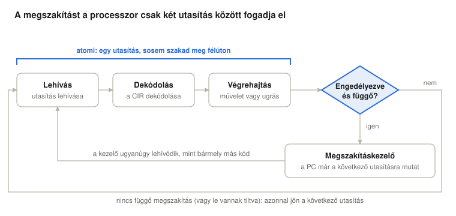
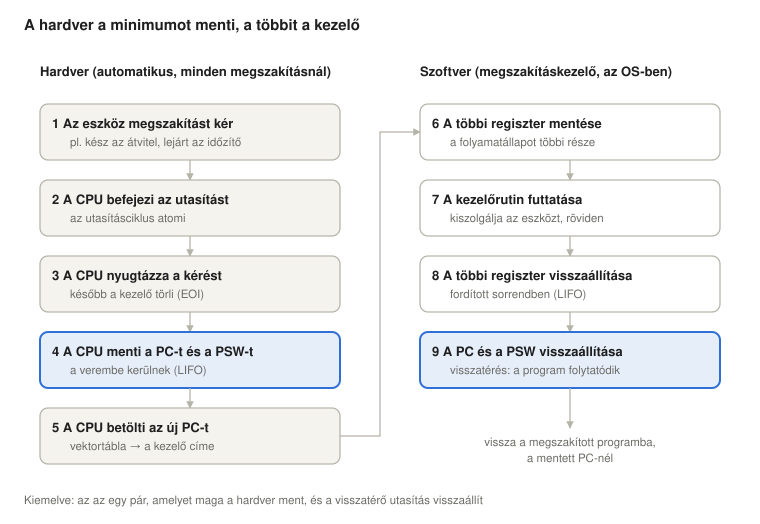
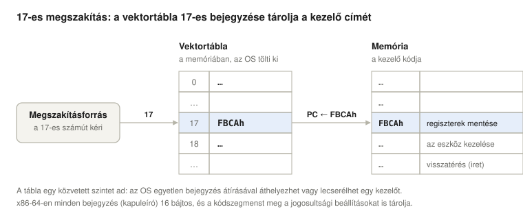
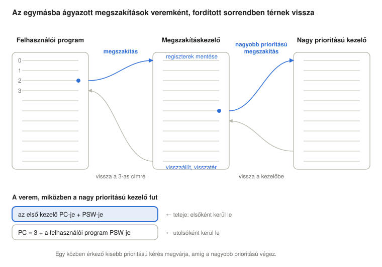
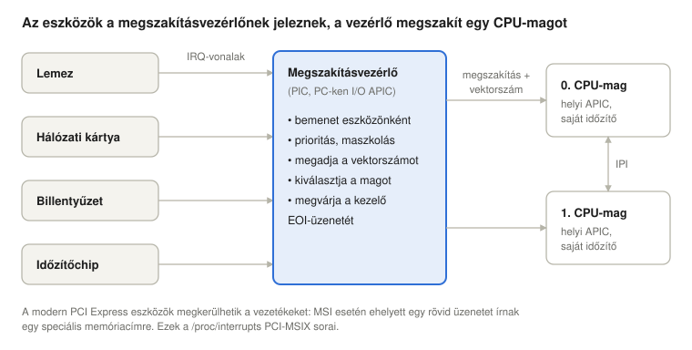
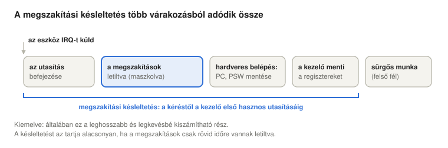
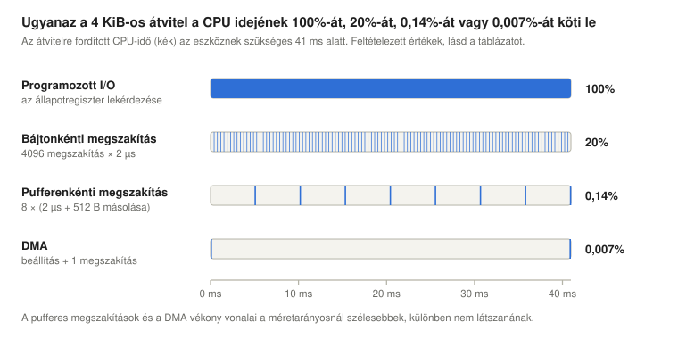
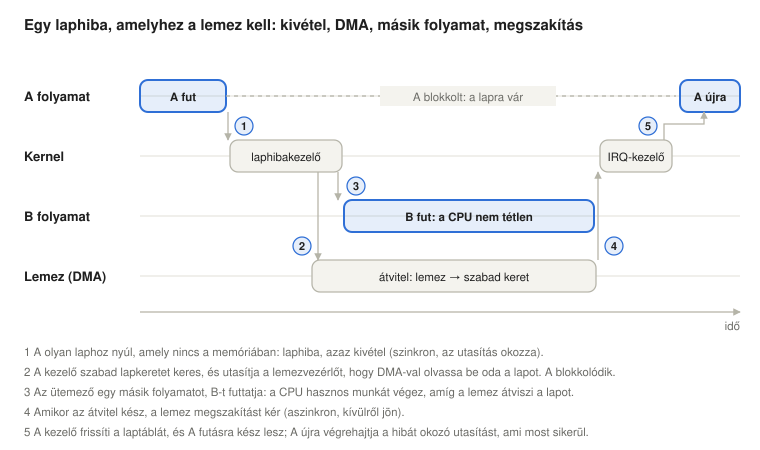
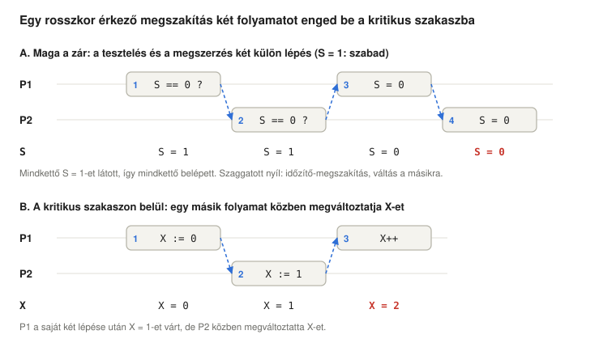

# Megszakítások

*Operációs rendszerek előadás: a megszakítások osztályai, felhasználói és kernelmód, a megszakítások feldolgozása, egymásba ágyazott megszakítások, a megszakításvezérlő, a megszakítási késleltetés, az I/O-technikák, és miért teszik a megszakítások szükségessé a kölcsönös kizárást – Linux (x86-64) példákkal*

Előző: [Az utasítás-végrehajtási ciklus](../04-fetch-execute-cycle/). Következő: [Párhuzamosság, holtpontok, folyamatállapotok és a Linux ütemezése](../06-concurrency-deadlocks-scheduling/).

> **Hogyan olvasd ezt az előadást?** Ahol új rövidítés vagy fogalom jelenik meg, utána egy **Egyszerűen elmagyarázva** feliratú doboz következik. Kattints rá, és kinyílik egy köznapi nyelvű magyarázat. Ha már ismered a fogalmakat, nyugodtan átugorhatod ezeket a dobozokat.

## Tanulási célok

A megszakítás (interrupt) lehetővé teszi, hogy egy külső esemény két utasítás között megállítsa a futó programot, lefuttasson egy kezelőrutint, majd a programot úgy folytassa, mintha semmi sem történt volna. Ez az előadás azt mutatja be, hogyan osztozik ezen a munkán a hardver és az operációs rendszer, és milyen következményekkel jár mindez.

<details>
<summary><b>Egyszerűen elmagyarázva:</b> megszakítás, kezelő, operációs rendszer</summary>

- **Megszakítás (interrupt):** jelzés a processzornak: „hagyd abba egy pillanatra, amit csinálsz, valami figyelmet kér”. Olyan, mint a csengő: leteszed a könyvet, ajtót nyitsz, aztán pontosan ott folytatod az olvasást, ahol abbahagytad.
- **Kezelő** (megszakításkezelő, interrupt handler): az a kis programrész, amely a megszakítás érkezésekor lefut – ez az „ajtónyitás”. Nem a felhasználó írja, hanem az operációs rendszer programozói.
- **Operációs rendszer (OS, operating system):** az a program, amely a számítógépet irányítja, és lehetővé teszi, hogy más programok fussanak rajta, például a Linux, a Windows, a macOS vagy az Android. A hardvert teljesen uraló központi részét **kernelnek** (rendszermagnak) hívjuk.

</details>

Az előadás végére a hallgatók képesek lesznek:

- megmagyarázni, miért csak két utasítás között fogadja el a processzor a megszakítást;
- megnevezni a megszakítások négy osztályát, és mindegyikre példát adni;
- elmagyarázni a felhasználói és a kernelmódot, és azt, miért privilegizáltak egyes utasítások;
- felsorolni a megszakítás-feldolgozás lépéseit, és megmondani, melyiket végzi a hardver és melyiket a kezelő;
- elmagyarázni a vektortáblában való keresést, azt, hogy mit tartalmaz a PSW, és hogyan gyorsítják a regiszterbankok a kezelőbe való belépést;
- elmagyarázni, hogyan működnek az egymásba ágyazott megszakítások és a prioritások, és miért alkotnak vermet a mentett állapotok;
- leírni, mit csinál a megszakításvezérlő, és mi a különbség az él- és a szintvezérelt megszakítás között;
- definiálni a megszakítási késleltetést, megnevezni összetevőit, és megmagyarázni, miért a legrosszabb eset számít;
- összehasonlítani a programozott I/O-t, a megszakításos I/O-t és a DMA-t, és megbecsülni a processzorra rótt terhüket;
- végigkövetni egy lemezolvasást igénylő laphibát a kivételen, a DMA-n, az ütemezésen és a megszakításon keresztül;
- megmagyarázni, miért okoznak a megszakítások versenyhelyzetet, és hogyan biztosítja a kölcsönös kizárást a test-and-set utasítás és a szemafor;
- megtalálni ezeket a mechanizmusokat egy futó Linux rendszeren (`/proc/interrupts`, `/proc/softirqs`, szignálok, szálak, késleltetésmérés).

## Miért kellenek megszakítások?

Az I/O-eszközök nagyságrendekkel lassabbak a processzornál. Megszakítások nélkül egy program, amely lemez- vagy hálózati átvitelt indít, csak egyféleképpen tudhatja meg, mikor ért véget az átvitel: ciklusban újra meg újra megkérdezi az eszközt (**lekérdezés**, polling). Ezalatt a processzor végig utasításokat hajt végre, de hasznos munkát nem végez. Az I/O-technikákról szóló későbbi szakasz számokkal is megmutatja ezt: ugyanannál az átvitelnél a processzor terhelése a lekérdezéses módszer 100%-áról megszakításokkal és DMA-val jóval 1% alá csökken.

Megszakításokkal a processzor elindítja az átvitelt, és közben más kódot futtat. Amikor az eszköz végzett, megszakításkérést küld, és a processzor csak ekkor foglalkozik vele. Az operációs rendszer is a megszakítások révén tudja egyáltalán visszavenni az irányítást egy programtól: az időzítő megszakításával (időosztás), hibahelyzetekkel, például nullával való osztással, és hardverhibákkal.

<details>
<summary><b>Egyszerűen elmagyarázva:</b> CPU, I/O, eszköz, lekérdezés, DMA, időzítő, időosztás</summary>

- **CPU** (Central Processing Unit, központi feldolgozóegység), más néven **processzor:** az a chip, amely a program utasításait egymás után végrehajtja, másodpercenként milliárdszám.
- **I/O** (Input/Output, bemenet/kimenet): minden, amit a számítógép a külvilággal cserél: billentyűzet, egér, lemez, hálózat, képernyő, nyomtató. **I/O-eszköz** bármelyik ilyen hardverelem.
- **Nagyságrend:** tízes szorzó. Egy lemez, amely 100 mikroszekundum alatt válaszol, nagyjából 100 000-szer lassabb egy olyan processzornál, amely nanoszekundumonként lép egyet.
- **Lekérdezés (polling):** újra és újra megkérdezni: „kész vagy már?” – mint a gyerek, aki autós kiránduláson percenként kérdezi: „Ott vagyunk már?”. Működik, de közben semmi más nem történik.
- **Időzítő (timer):** kis hardveróra, amely szabályos időközönként, például 4 ezredmásodpercenként megszakítást tud küldeni.
- **DMA** (Direct Memory Access, közvetlen memória-hozzáférés): segédchip, amely a processzor nélkül másol adatot; lentebb részletesen tárgyaljuk.
- **Időosztás (time sharing):** sok program „egyidejű” futtatása egyetlen processzoron úgy, hogy körben mindegyik kap egy rövid időt (**időszeletet**). Az időzítő megszakítása jelzi az operációs rendszernek, mikor járt le egy időszelet.

</details>

## A megszakítás helye az utasításciklusban



Külső megszakítások (időzítő, I/O) esetén az utasításlehívás, a dekódolás és a végrehajtás egyetlen **atomi** egységet alkot: ha egy utasítás elkezdődött, a processzor befejezi, mielőtt a függő megszakításokat megnézné. A megszakítás-ellenőrzés lépése a végrehajtás után következik, ezért:

- a megszakított program sosem marad félig végrehajtott utasítással;
- az utasításszámláló (PC) már a következő utasításra mutat (a lehíváskor már továbblépett), tehát pontosan oda kell majd visszatérni.

Ha nincs függő megszakítás, azonnal a következő lehívás jön. Ha van, a következő lehívás már a megszakításkezelő első utasítása.

Pontosabban: a megszakítás-ellenőrzés lépése két feltételt vizsgál együtt: **a megszakítások engedélyezve vannak ÉS van függő megszakítás**. Az a kérés, amely letiltott (maszkolt) megszakítások mellett érkezik, nem vész el: függőben marad, és a processzor a megszakítások újbóli engedélyezése utáni első utasításhatáron fogadja el. Mivel az ellenőrzés csak utasításhatáron történik, egy processzormagon belül minden egyes utasítás önmagában atomi a megszakításokkal szemben: sem egy kezelő, sem egy másik folyamat, amelyre a kezelő esetleg átvált, soha nem láthat félig végrehajtott utasítást. Az atomi test-and-set utasítás pontosan erre épít (lásd [Megszakítások és párhuzamosság](#megszakítások-és-párhuzamosság)).

Az utasítás által kiváltott megszakítások kicsit másképp működnek, mert ezek az utasítás lehívása vagy végrehajtása közben keletkeznek (lásd a következő szakaszt). A **fault** (hiba jellegű kivétel), például a laphiba, megszakítja az utasítást, mielőtt annak bármilyen hatása lenne, és a mentett PC a *hibát okozó* utasításra mutat, így az újra végrehajtható, miután a kezelő elhárította a problémát (például betöltötte a hiányzó lapot). A **trap** (csapda jellegű kivétel), például a rendszerhívás utasítása, előbb befejeződik, és a mentett PC a következő utasításra mutat. (Néhány hosszú x86-utasítás, például a `rep movs`, az ismétlései között is megszakítható, és később folytatódik.)

<details>
<summary><b>Egyszerűen elmagyarázva:</b> utasítás, lehívás–dekódolás–végrehajtás, atomi, PC, regiszter, fault, trap, laphiba</summary>

- **Utasítás:** a program egy elemi lépése a processzor saját nyelvén, például „adj 2-t ehhez a számhoz” vagy „ugorj a 900-as címre”.
- **Lehívás–dekódolás–végrehajtás (fetch–decode–execute):** a processzor soha véget nem érő rutinja: hozd be a memóriából a következő utasítást, értsd meg, mit jelent, hajtsd végre. Az előző előadás részletesen tárgyalja.
- **Atomi:** oszthatatlan. Senki sem láthatja vagy szakíthatja meg „félkész” állapotban – mint a villanykapcsoló, amely vagy fel van kapcsolva, vagy le, a kettő között soha.
- **Regiszter:** apró, nagyon gyors tárolócella a processzoron belül, amely egyetlen számot tárol.
- **PC** (program counter, utasításszámláló): az a regiszter, amely a következő utasítás memóriacímét tartalmazza – a processzor „könyvjelzője”.
- **Fault (hiba jellegű kivétel):** utasítás futása közben észlelt hiba, amelyet a rendszer esetleg el tud hárítani. Az utasítás félbeszakad, és a javítás után újra lefut.
- **Trap (csapda jellegű kivétel):** szándékos ugrás az operációs rendszerbe, amelyet a program maga kér – mint egy hívógomb megnyomása. Utána a program a következő utasítással folytatódik.
- **Laphiba (page fault):** akkor keletkezik, ha a program olyan memóriarészhez (**laphoz**) nyúl, amely éppen nem érhető el, például mert ki lett írva a lemezre. Az operációs rendszer visszatölti, és az utasítás újra lefut.
- **x86, `rep movs`:** az x86 a legtöbb PC-ben és laptopban található processzorcsalád (Intel és AMD). A `rep movs` ennek egyik utasítása, amely egy egész memóriablokkot másol, darabonként.

</details>

## A megszakítások osztályai

| Osztály | Kiváltója | Példák | Időzítés |
| --- | --- | --- | --- |
| Időzítő | a hardveróra | lejárt az időszelet, periodikus óraütés (tick) | aszinkron |
| I/O | egy I/O-vezérlő | normális befejeződés (a puffer megtelt vagy kész), hibahelyzet | aszinkron |
| Program | a végrehajtott utasítás | nullával való osztás, aritmetikai túlcsordulás, tiltott memória-hozzáférés, rendszerhívás | szinkron |
| Hardverhiba | a gép meghibásodása | tápfeszültség-kiesés, memória-paritáshiba | aszinkron |

Ez a felosztás Stallings (2018) könyvét követi. **Szinkron** azt jelenti, hogy a megszakítást az éppen végrehajtott utasítás okozza, vagyis egy konkrét utasításhoz kötődik, nem véletlenszerű pillanatban érkezik. **Aszinkron** azt jelenti, hogy kívülről, a program egy előre nem látható pontján érkezik. A végrehajtott utasítás által okozott megszakításokat általában **kivételnek** (exception) nevezik (Stallings programmegszakításnak hívja őket), a *megszakítás* szó önmagában pedig rendszerint aszinkron megszakítást jelent. A kezelés mechanizmusa nagyrészt azonos (ugyanaz a vektortábla és belépési útvonal), két különbséggel: a kivételeket nem lehet a külső megszakításokhoz hasonlóan letiltani, és a mentett PC attól függ, hogy a kivétel fault vagy trap.

Az operációs rendszer szempontjából a legfontosabb programmegszakítás a szándékos: a **rendszerhívás** (system call). A program egy speciális trap utasítást hajt végre (x86-64-en a `syscall`-t), hogy szolgáltatást kérjen a kerneltől, és ugyanazon a mechanizmuson keresztül lép be a kernelbe.

<details>
<summary><b>Egyszerűen elmagyarázva:</b> vezérlő, puffer, túlcsordulás, paritáshiba, szinkron, aszinkron, kivétel, rendszerhívás</summary>

- **I/O-vezérlő (controller):** az eszközön (vagy az alaplapon) lévő kis elektronika, amely az eszközt működteti és a processzorral kommunikál, például a lemezvezérlő.
- **Puffer (buffer):** kis átmeneti tárolóterület, ahol az adat arra vár, hogy valaki elvigye – mint egy postaláda.
- **Aritmetikai túlcsordulás (overflow):** a számítás eredménye túl nagy ahhoz, hogy elférjen a neki fenntartott helyen – mint amikor az autó kilométer-számlálója 999999-ről 000000-ra fordul át.
- **Memória-paritáshiba:** egyes memóriachipek extra ellenőrzőbiteket is tárolnak; ha az ellenőrzés nem egyezik, a tárolt adat megsérült (például hardverhiba miatt).
- **Szinkron / aszinkron:** a szinkron esemény amiatt történik, amit a program éppen csinál (megbotlasz, mert kőre léptél). Az aszinkron esemény kívülről, bármikor jöhet (eleredt az eső).
- **Kivétel (exception):** a program saját utasítása által okozott megszakítás szokásos neve (nullával való osztás, laphiba, rendszerhívás).
- **Rendszerhívás (system call):** a program kérése az operációs rendszerhez, hogy tegyen meg valamit, amit maga nem tehet meg, például „olvasd be ezt a fájlt” vagy „küldd el ezt a hálózaton”. A program nem nyúlhat közvetlenül a lemezhez, a kernelt kell megkérnie.
- **x86-64:** az x86 processzorcsalád 64 bites változata.

</details>

## Felhasználói mód és kernelmód

Egy operációs rendszer csak akkor tudja megvédeni önmagát és az általa futtatott programokat, ha egy program nem veheti át egyszerűen a gép irányítását. A processzornak ezért (legalább) két működési módja van:

- **Kernelmód** (felügyelői mód, supervisor mode): minden megengedett. Az operációs rendszer kernele ebben a módban fut.
- **Felhasználói mód (user mode):** itt futnak a közönséges programok. Egyes utasítások tiltottak, és a memória bizonyos részei elérhetetlenek.

A tiltott utasításokat **privilegizált utasításoknak** nevezzük. Tipikus példák: a megszakítások ki- és bekapcsolása (x86-on `cli`/`sti`), a processzor leállítása (`hlt`), közvetlen kommunikáció az I/O-eszközökkel (`in`/`out`) és a memóriavédelmi beállítások módosítása (x86-on a CR3 regiszter betöltése). Ha egy felhasználói módú program ilyet próbál végrehajtani, a processzor nem hajtja végre, hanem kivételt vált ki (x86-on *általános védelmi hibát*, general protection fault), és az operációs rendszer leállítja a programot.

Miért éppen ezek? Mindegyikkel egyetlen program átvehetné a gép irányítását: kikapcsolt megszakítások mellett az időzítő soha nem tudná visszavenni a processzort; közvetlen eszköz-hozzáféréssel egy program bárki fájljait kiolvashatná a lemezről; saját memóriabeállításokkal olvashatná és felülírhatná a kernelt.

Hogyan jut el a processzor felhasználói módból kernelmódba? **Kizárólag a megszakítási mechanizmuson keresztül:** hardvermegszakítással, kivétellel vagy rendszerhívással. Mindegyik kernelmódba vált, *és* egy olyan belépési pontra ugrik, amelyet maga a kernel állított be: a vektortáblában, illetve a `syscall` utasítás esetén egy speciális processzorregiszterben. Egy program tehát beléphet a kernelbe, de csak azokon az ajtókon, amelyeket a kernel épített. A visszatérő utasítás (`iret`, rendszerhívás után `sysret`) visszavált felhasználói módba. Az x86-nak valójában négy jogosultsági szintje van (**0–3. gyűrű**, ring), de a Linux és a Windows csak kettőt használ: a 0. gyűrűt a kernelnek, a 3. gyűrűt a felhasználói programoknak.

<details>
<summary><b>Egyszerűen elmagyarázva:</b> kernelmód, felhasználói mód, privilegizált utasítás, általános védelmi hiba, CR3, gyűrű</summary>

- **Kernelmód / felhasználói mód:** olyan, mint egy bolt személyzeti és vásárlói része. A személyzet (a kernel) bárhová bemehet és kezelheti a kasszát; a vásárlók (a közönséges programok) csak az eladótérben lehetnek, minden másért a személyzethez kell fordulniuk.
- **Privilegizált utasítás:** olyan utasítás, amely csak kernelmódban működik – mint egy kulcs, amelyet csak a személyzet kap meg.
- **Általános védelmi hiba** (general protection fault, `#GP`): az a kivétel, amelyet az x86 processzor akkor vált ki, ha egy program megsért egy védelmi szabályt, például felhasználói módban privilegizált utasítással próbálkozik.
- **CR3:** speciális processzorregiszter, amely megmondja, melyik memóriatérkép (melyik program memórianézete) aktív. Aki megváltoztathatja, bármelyik program memóriáját láthatja.
- **Gyűrű (ring):** az x86 jogosultsági szintjeinek neve, egy céltábla köreiként elképzelve: a középső 0. gyűrű a legmegbízhatóbb (a kernel), a külső 3. gyűrű a legkevésbé megbízható (a felhasználói programok).
- **`iret`, `sysret`:** „visszatérés megszakításból” és „visszatérés rendszerhívásból” – az utasítások, amelyek befejezik a kezelőt, és visszatérnek a programba.

</details>

## A megszakítás feldolgozása lépésről lépésre



A munka megoszlik a hardver és a szoftver között (Stallings, 2018):

1. **Az eszköz megszakításkérést (IRQ) küld** a megszakításvonalán.
2. **A processzor befejezi az aktuális utasítást.** Az utasításciklus atomi.
3. **A processzor nyugtázza a kérést.** A kérést később törölni kell, különben a kezelő visszatérése után azonnal újra elfogadná: a kezelő kiszolgálja az eszközt, amely ezután inaktívvá teszi a kérésvonalát, majd megszakítás vége (EOI, end of interrupt) üzenetet küld a megszakításvezérlőnek (lásd a megszakításvezérlőről szóló szakaszt).
4. **A processzor kernelmódba vált, és elmenti a PC-t és a PSW-t** (program status word, programállapotszó: a jelzőbitek és a processzor üzemmódja, modellünkben ez az állapotregiszter, SR) úgy, hogy a kernel vermére helyezi őket. x86-64-en a processzor előbb kernelveremre is vált, és bizonyos kivételeknél egy hibakódot is a verembe tesz.
5. **A processzor betölti az új PC-t a megszakításvektor-táblából.** Minden megszakításforrásnak van egy száma, és a tábla ehhez a számhoz rendeli a kezelő kezdőcímét. A kezelőbe való belépés jellemzően a további külső megszakításokat is letiltja (x86-on az IF jelzőbit törlésével), amíg a kezelő úgy nem dönt, hogy újra engedélyezi őket.
6. **A kezelő elmenti a többi regisztert,** amelyeket használni fog. A PC-vel és a PSW-vel együtt ezek alkotják a **folyamat állapotát**.
7. **A kezelő elvégzi a dolgát:** átmásolja az adatot az eszköz pufferéből, felébreszt egy várakozó folyamatot, vagy feljegyzi a hibát.
8. **A kezelő fordított sorrendben visszaállítja a regisztereket.**
9. **Egy speciális visszatérő utasítás visszaállítja a PC-t és a PSW-t** (x86-on `iret`). A következő lehívással a megszakított program folytatódik.

A hardver csak azt menti, amit muszáj (a PC-t és a PSW-t), mert ezek abban a pillanatban megváltoznak, amikor a kezelő elindul. Minden más a kezelő dolga. Így a hardver egyszerű maradhat. Az operációs rendszerek belépési kódja (a Linuxé is) általában az összes általános célú regisztert elmenti, mert a megszakítás végződhet egy másik folyamatra való váltással, és ekkor a megszakított folyamat teljes állapotát meg kell őrizni.

**Egy vektortábla-keresés számokkal.** Vegyünk egy egyszerű gépet, amelynek vektortáblája bejegyzésenként egy 16 bites kezelőcímet tárol. A 17-es megszakításforrás kérést küld; az 5. lépésben a processzor kiolvassa a tábla 17-es bejegyzését, FBCAh-t talál benne, és betölti a PC-be. A következő lehívás már a kezelő első utasítása az FBCAh címen.



A tábla egy további közvetett szintet (indirekciót) jelent: a hardver csak annyit tud, hogy „17-es megszakítás → 17-es bejegyzés”, azt pedig, hogy hol van a kezelő, az operációs rendszer dönti el a bejegyzés kitöltésével. A Z80 a 2-es megszakítási üzemmódjában így működik: az eszköz a tábla címének alsó bájtját teszi az adatsínre, a felső bájtot a processzor I regisztere adja, és a processzor ebből a táblabejegyzésből olvassa ki a 16 bites kezelőcímet (Zilog, 2016). x86-64-en a tábla neve IDT (interrupt descriptor table, megszakításleíró-tábla), helyét az IDTR regiszter adja meg; bejegyzései 16 bájtosak, mert mindegyik a kódszegmenst és a jogosultsági beállításokat is tartalmazza, a 0–31. vektor pedig a kivételeknek van fenntartva, így az eszközmegszakítások a 32–255. vektort kapják.

**Mit tartalmaz a PSW?** A programállapotszó a processzorállapotnak azt a részét gyűjti össze, amely nincs az általános célú regiszterekben, de túl kell élnie a kezelő futását:

- az utolsó művelet **feltételkódjai** (jelzőbitjei): nulla, előjel, átvitel, túlcsordulás;
- a **megszakítás-engedélyező bit vagy megszakítási maszk**: mely megszakításokat lehet most elfogadni;
- az **üzemmódbit**: kernel- vagy felhasználói mód;
- egyes gépeken **memóriavédelmi információ**.

A név az IBM System/360-ból (1964) származik, amelynek 64 bites PSW-je mindezt tartalmazta (megszakítási maszkbitek, tárvédelmi kulcs, a felhasználói módot jelző „problem state” bit, feltételkód), sőt magát az utasításcímet is, így ezen a gépen a „PSW mentése” valóban egyetlen lépésben jelentette „a PC és az állapot mentését”. x86-64-en nincs PSW nevű regiszter. Szerepét az RFLAGS (a jelzőbitek, az IF és az I/O-jogosultsági szint) tölti be az aktuális jogosultsági szinttel együtt, amelyet a CS regiszter legalsó két bitje tárol. Ezért teszi verembe egy x86-64-es megszakítás az RIP-et, a CS-t és az RFLAGS-et (és a megszakított veremmutatót is: az SS-t és az RSP-t).

**Gyorsabb állapotmentés: regiszterbankok.** A regiszterek memóriába mentése időbe telik, és ez az idő hozzáadódik a megszakítási késleltetéshez. Egyes processzorok ezért hardverben tartják bizonyos regiszterek tartalék másolatát. A Z80-nak van egy A′, F′, B′, C′, D′, E′, H′, L′ alternatív regiszterkészlete: az `EX AF,AF'` utasítás az A-t és az F-et cseréli fel a másolatával, az `EXX` pedig a BC-t, a DE-t és a HL-t a sajátjaival (Zilog, 2016). Egy kezelő, amely egyedül használja az alternatív készletet, ezzel a két utasítással kezd és fejeződik be, így mind a nyolc regisztert egyetlen memória-hozzáférés nélkül „menti” és „állítja vissza”. A 32 bites ARM processzorok ugyanezt teszik a gyors megszakításuknál (**FIQ**): FIQ módba lépéskor az R8–R14 regisztereket bankolt másolataik váltják fel, a visszatérési cím a bankolt R14-be, az állapotregiszter pedig a bankolt SPSR-be kerül, így egy rövid FIQ-kezelő anélkül végezheti el a dolgát, hogy bármit a memóriába mentene (Arm Limited, 2018). A korlát az, hogy csak egy tartalék készlet van: ez egyetlen megszakítási szintet (vagy egy megszakítási osztályt) szolgálhat ki, az egymásba ágyazott megszakításokhoz továbbra is verem kell.

<details>
<summary><b>Egyszerűen elmagyarázva:</b> indirekció, IDT, IDTR, feltételkódok, megszakítási maszk, üzemmódbit, IBM System/360, RFLAGS, CS, jogosultsági szint, regiszterbank, alternatív regiszterkészlet, FIQ, SPSR</summary>

- **Indirekció (közvetett elérés):** valamit egy listából keresünk ki ahelyett, hogy közvetlenül tudnánk – mint amikor az ajtó melletti listáról tárcsázod a „17-es segélyhívó számot”, ahelyett hogy minden számot fejben tartanál. Aki a listát frissíti, megváltoztathatja, hová szól a hívás.
- **IDT** (Interrupt Descriptor Table, megszakításleíró-tábla): a vektortábla neve x86-on. Az **IDTR** az a processzorregiszter, amely a tábla címét tárolja.
- **Feltételkódok:** a jelzőbitek (nulla, negatív, átvitel, túlcsordulás), amelyek az utolsó számítás eredményét írják le.
- **Megszakítási maszk:** be/ki bitek sora, amely megmondja, mely megszakítások juthatnak át éppen most.
- **Üzemmódbit:** egyetlen bit, amely megmondja, hogy a processzor kernelmódban vagy felhasználói módban van-e.
- **IBM System/360:** az IBM nagy hatású nagyszámítógép-családja 1964-ből; az operációs rendszerek sok fogalma innen ered.
- **RFLAGS, CS:** az RFLAGS az x86-64 jelzőbitregisztere. A CS (code segment, kódszegmens) olyan regiszter, amelynek legalsó két bitje az aktuális jogosultsági szintet, a „gyűrűt” mutatja (0 = kernel, 3 = felhasználó).
- **Regiszterbank, alternatív regiszterkészlet:** egyes regiszterek második, rejtett másolata. Átváltani rá olyan, mint megfordítani egy fehértáblát: a másik oldala tiszta, a régi jegyzetek pedig még ott vannak, ha visszafordítod.
- **FIQ** (Fast Interrupt reQuest, gyors megszakításkérés): az ARM különleges megszakítása a legsürgősebb eszköz számára, saját regiszterbankkal, hogy a kezelője azonnal indulhasson.
- **SPSR** (Saved Program Status Register, mentett programállapot-regiszter): az az ARM-regiszter, amely megszakításkor megkapja az állapotregiszter (az ARM PSW-je) másolatát.

</details>

<details>
<summary><b>Egyszerűen elmagyarázva:</b> IRQ, nyugtázás, PSW, jelzőbitek, verem, vektortábla, IF jelzőbit, folyamat, folyamatállapot</summary>

- **IRQ** (interrupt request, megszakításkérés): az az elektromos jel (vagy üzenet), amellyel egy eszköz megszakítást kér – mint amikor órán jelentkezel.
- **Nyugtázás (acknowledge):** a processzor visszajelez: „láttam a kérésedet” – mint amikor a tanár rád bólint. Az eszköz ezután leeresztheti a kezét.
- **PSW** (program status word, programállapotszó): a processzor pillanatnyi állapotát leíró regiszter: a jelzőbitek, és hogy felhasználói vagy kernelmódban van-e.
- **Jelzőbitek (flagek):** különálló igen/nem bitek, amelyeket a processzor minden számítás után beállít, például „az eredmény nulla volt” vagy „az eredmény negatív volt”.
- **Verem (stack):** memóriaterület, amelyet úgy használunk, mint egy tányérhalmot: csak a tetejére tehetünk tányért (**push**), vagy a legfelsőt vehetjük le (**pop**). Amit utoljára tettünk rá, azt vesszük le először: **LIFO**, last in, first out.
- **Megszakításvektor-tábla:** az operációs rendszer által a memóriában felépített táblázat, amely minden megszakításszámhoz megadja, hol kezdődik a kezelője – mint az ajtó mellett kifüggesztett segélyhívószám-lista.
- **IF jelzőbit** (interrupt enable flag, megszakítás-engedélyező bit): az x86 állapotregiszterének (RFLAGS, az x86 PSW-je) egy bitje; ha 0, a processzor figyelmen kívül hagyja a közönséges megszakításokat.
- **Folyamat (process):** egy éppen futó program mindazzal együtt, ami hozzá tartozik (memóriája, megnyitott fájljai, regiszterei). Ugyanaz a program egyszerre több folyamatként is futhat.
- **Folyamatállapot:** mindazok a regiszterértékek, amelyekre egy folyamatnak szüksége van, hogy pontosan ott folytassa, ahol abbahagyta – a „mentett játékállása”.

</details>

## Több megszakítás

Mi történik, ha egy második megszakítás érkezik, miközben egy kezelő még fut? Két megközelítés létezik.

**Szekvenciális feldolgozás.** Amíg egy kezelő fut, a megszakítások le vannak tiltva (maszkolva). Az új kérés megvárja, amíg a kezelő visszatér, és csak utána fogadja el a processzor. Ez egyszerű, de egy sürgős kérés így egy jelentéktelen mögött várakozhat.

**Egymásba ágyazott feldolgozás prioritásokkal.** Minden megszakításforrásnak van prioritása. Egy kezelőt egy nagyobb prioritású kérés megszakíthat, egy azonos vagy kisebb prioritású azonban nem.



Az ábrán a felhasználói programot a 2-es cím után éri a megszakítás. A kezelő a regiszterek mentésével kezd. Futása közben egy nagyobb prioritású megszakítás érkezik: a hardver elmenti a kezelő saját PC-jét és PSW-jét, és elindítja a nagy prioritású kezelőt. Amikor az végez, visszatér az első kezelőbe, amely aztán a felhasználói program 3-as címére tér vissza.

Mivel mindig az utoljára mentett állapot áll vissza elsőként, a mentett állapotok **vermet** alkotnak (last in, first out). Ezért tolja az x86 a PC-t és a PSW-t egy verembe egyetlen rögzített hely helyett: a rögzített helyet a második megszakítás felülírná. Sok RISC processzor (ARM, RISC-V, MIPS) speciális regiszterekbe menti őket, és a kezelő a verembe másolja át őket, mielőtt újra engedélyezné a megszakításokat. Az egymásba ágyazáshoz így vagy úgy, de verem kell.

**Nem maszkolható megszakítások.** Egyes események soha nem várhatnak, jellemzően a sürgős hardveresemények. Ezek egy **nem maszkolható megszakítás** (NMI, non-maskable interrupt) vonalon érkeznek, amelyet a szokásos megszakítás-engedélyező jelzőbit nem tud kikapcsolni. x86-on az NMI-t főként watchdogokhoz és teljesítményméréshez használják, a súlyos hardverhibákat, például a memóriahibákat pedig a gépellenőrzési kivétel (machine check) jelzi.

<details>
<summary><b>Egyszerűen elmagyarázva:</b> maszkolás, prioritás, egymásba ágyazott, RISC, ARM, RISC-V, MIPS, NMI, gépellenőrzés, watchdog</summary>

- **Maszkolás (egy megszakítás maszkolása):** ideiglenesen megmondjuk a processzornak, hogy hagyjon figyelmen kívül egy megszakítást – mint amikor a telefont „ne zavarjanak” módba kapcsoljuk. A kérés nem vész el, csak vár.
- **Prioritás:** mennyire sürgős valami. A tűzjelzőnek nagyobb a prioritása, mint a csengőnek.
- **Egymásba ágyazott (nested):** egyik a másikban, mint a matrjoska babák: egy megszakításkezelőt egy másik megszakítás szakít meg.
- **RISC** (Reduced Instruction Set Computer, csökkentett utasításkészletű számítógép): kevesebb, egyszerűbb utasítással dolgozó processzorkialakítás. Az **ARM** (szinte minden telefonban ez van), a **RISC-V** (nyílt kialakítás) és a **MIPS** RISC-családok.
- **NMI** (non-maskable interrupt, nem maszkolható megszakítás): olyan megszakítás, amelyet a „ne zavarjanak” mód sem tud blokkolni.
- **Gépellenőrzés (machine check):** a processzor saját riasztása súlyos hardverhibák esetén, például ha a memóriában lévő adat megsérült, és nem lehetett kijavítani.
- **Watchdog („házőrző kutya”):** időzítő, amely ellenőrzi, hogy a rendszer még él-e. Ha a rendszer nem válaszol, a watchdog jelez (gyakran NMI formájában), hogy a hibát jelenteni lehessen, vagy a gépet újra lehessen indítani.

</details>

## A megszakításvezérlő

Egy processzormagnak nagyon kevés megszakításbemenete van, egy számítógépben viszont eszközök tucatjai működnek. A kettő között helyezkedik el a **megszakításvezérlő** (interrupt controller).



A megszakításvezérlő:

- eszközönként egy bemeneti vonallal (**IRQ-vonallal**) rendelkezik;
- minden vonalat külön-külön **maszkolni** tud, és eldönti, melyik kérést szolgálják ki először (**prioritás**);
- megmondja a processzormagnak, *melyik* megszakításról van szó: átadja a **vektorszámot**, amellyel a processzor kikeresi a kezelőt;
- többmagos gépeken eldönti, **melyik mag** kapja a megszakítást;
- megvárja a kezelő **megszakítás vége (EOI)** üzenetét, mielőtt a következő, azonos vagy kisebb prioritású megszakítást továbbítaná.

**A PIC-től az APIC-ig.** Az eredeti IBM PC (1981) egyetlen, 8 bemenetű Intel 8259 **PIC**-et (Programmable Interrupt Controller, programozható megszakításvezérlő) használt. Az IBM PC/AT-től (1984) kezdve kettőt kötöttek sorba (kaszkádba), ami 15 használható IRQ-vonalat adott, mert az első chip egyik bemenetét a második foglalja el. A mai PC-k az **APIC** rendszert használják: egy **I/O APIC** gyűjti össze az eszközök vonalait, és minden magnak saját **helyi APIC**-je (local APIC) van, amely az adott mag időzítőjét is tartalmazza, és lehetővé teszi, hogy a magok megszakítsák egymást (**processzorok közötti megszakítások**, inter-processor interrupt, IPI). Az újabb PCI Express eszközök gyakran teljesen megkerülik a vezetékeket: **MSI** (message-signalled interrupt, üzenettel jelzett megszakítás) esetén az eszköz úgy kér megszakítást, hogy egy rövid üzenetet ír egy speciális memóriacímre.

**Él- vagy szintvezérelt.** Egy megszakításvonal kétféleképpen jelezhet:

| | Élvezérelt (edge-triggered) | Szintvezérelt (level-triggered) |
| --- | --- | --- |
| A kérés | a jel *változása* (például alacsony → magas) | a jel aktív *állapota* |
| Időtartama | egy pillanat | amíg a kezelő ki nem szolgálta az eszközt |
| Kockázat | a maszkolt bemenetre érkező impulzus elveszhet | ha a kezelő elfelejti kiszolgálni az eszközt, a megszakítás örökké ismétlődik (*megszakításvihar*, interrupt storm) |
| Vonalmegosztás | nehéz | könnyű: több eszköz osztozhat egy vonalon, a kezelő sorban megkérdezi mindegyiket |

A maszkolás két szinten történik: a processzor saját jelzőbitje (x86-on az IF) az adott magon *az összes* közönséges megszakítást kikapcsolja, a megszakításvezérlő pedig *egyes* vonalakat tud maszkolni.

<details>
<summary><b>Egyszerűen elmagyarázva:</b> megszakításvezérlő, IRQ-vonal, többmagos, EOI, PIC, APIC, IPI, PCI Express, MSI, él, szint</summary>

- **Megszakításvezérlő:** „recepciós” chip. Sok eszköz csönget nála; ő dönti el, ki jut be elsőként a processzorhoz, és melyik processzormaghoz.
- **IRQ-vonal:** az a vezeték (vagy csatorna), amelyen egy eszköz megszakítást kérhet. IRQ = Interrupt ReQuest, megszakításkérés.
- **Mag, többmagos (core, multicore):** egy modern processzorchip több teljes processzort tartalmaz, ezeket magoknak hívjuk. Egy 4 magos chip egyszerre 4 utasításfolyamot tud futtatni.
- **EOI** (end of interrupt, megszakítás vége): a kezelő üzenete a vezérlőnek: „ezzel végeztem, jöhet a következő”.
- **PIC** (Programmable Interrupt Controller, programozható megszakításvezérlő): az 1980-as évek PC-inek 8 bemenetű megszakításvezérlő chipje.
- **APIC** (Advanced PIC, fejlett PIC): a többmagos gépekre készült modern változat. Az **I/O APIC** az eszközök recepciósa; minden mag **helyi APIC**-je az adott mag személyi asszisztense.
- **IPI** (inter-processor interrupt, processzorok közötti megszakítás): az egyik mag megszakítja a másikat, például azzal, hogy „kérlek, futtasd az ütemezőt”.
- **PCI Express:** a számítógép belsejében lévő nagy sebességű csatlakozás, amelybe a videokártyák, a gyors lemezek és a hálózati kártyák csatlakoznak.
- **MSI** (message-signalled interrupt, üzenettel jelzett megszakítás): ahelyett, hogy egy vezetéken jelezne, az eszköz „SMS-t küld” a megszakítási rendszernek, azaz egy speciális címre ír.
- **Él / szint:** az élvezérelt olyan, mint a csengőgomb (egy megnyomás, egy csengetés); a szintvezérelt olyan, mint egy jelzőlámpa, amely addig ég, amíg valaki nem foglalkozik vele.

</details>

## Megszakítási késleltetés

A **megszakítási késleltetés** (interrupt latency) az az idő, amely attól a pillanattól, hogy egy eszköz kérést küld, addig telik el, amíg a kezelő első hasznos utasítása le nem fut. Több részből adódik össze:



1. **Az aktuális utasításnak be kell fejeződnie.** Ez általában néhány nanoszekundum; a hosszú utasítások tovább tartanak.
2. **A megszakítások le lehetnek tiltva.** Ha a kernel olyan szakaszban van, ahol maszkolta a megszakításokat (vagy egy nagyobb prioritású kezelő fut), a kérés addig vár, amíg újra engedélyezik őket. Rendszerint ez a leghosszabb és legkevésbé kiszámítható rész.
3. **A hardveres belépés:** nyugtázás, kernelmódba váltás, a PC és a PSW mentése, a vektor kikeresése.
4. **A kezelő indulása:** a regiszterek mentése, mielőtt a tényleges munka elkezdődhet.

Az adatra váró program számára a késés még hosszabb: a kezelő után az ütemezőnek még döntenie kell arról, hogy ezt a programot futtassa (**ütemezési késleltetés**, scheduling latency).

**Miért a legrosszabb eset számít?** Egy asztali gépen az időnként előforduló néhány ezredmásodperces késés észrevehetetlen. Egy **valós idejű rendszerben** viszont ez hibát jelenthet: egy légzsákvezérlőnek, egy motorvezérlőnek vagy egy szívritmus-szabályozónak minden egyes alkalommal rögzített határidőn belül kell reagálnia (**kemény valós idejű** rendszer, hard real-time). Hang vagy videó esetén egy elmulasztott határidő „csak” hallható kattanás vagy kiesett képkocka (**puha valós idejű** rendszer, soft real-time). Valós idejű munkában nem az átlagos késleltetés számít, hanem a **legrosszabb eset**.

Hogyan tartja alacsonyan a késleltetést egy operációs rendszer? Csak nagyon rövid kódrészletekre maszkolja a megszakításokat, a hardveres kezelőket rövidre fogja, a munka többi részét pedig későbbre halasztja (felső és alsó fél, lásd lentebb), és megengedi, hogy a sürgős feladatok kiszorítsák a kevésbé sürgőseket. A Linux fő kernelvonalában a 6.12-es verzió (2024) óta elérhető a **PREEMPT_RT** opció: ez a legtöbb megszakításkezelőt prioritással rendelkező kernelszállá alakítja, így még a hosszú kernelkódot is megszakíthatja egy sürgős valós idejű feladat.

<details>
<summary><b>Egyszerűen elmagyarázva:</b> késleltetés, nanoszekundum, mikroszekundum, ütemező, valós idejű, határidő, kiszorítás, kernelszál, fő kernelvonal</summary>

- **Késleltetés (latency):** várakozási idő, a „valami történik” és a „valaki reagál” közötti késés. Az online játékok „pingje” is késleltetés.
- **Nanoszekundum (ns), mikroszekundum (µs), milliszekundum (ms):** a másodperc milliárdod, milliomod és ezred része. 1 ms = 1000 µs = 1 000 000 ns.
- **Ütemező (scheduler):** az operációs rendszer azon része, amely eldönti, melyik program kapja meg legközelebb a processzort – mint az edző, aki eldönti, ki játszik.
- **Valós idejű rendszer (real-time system):** olyan rendszer, amelyben a válasz csak akkor helyes, ha időben is megérkezik. A késve kinyíló légzsák ugyanolyan rossz, mint ha nem is lenne.
- **Határidő (deadline):** a legkésőbbi időpont, ameddig valaminek el kell készülnie. **Kemény** valós idejű: az elmulasztása hiba. **Puha** valós idejű: az elmulasztása bosszantó, de nem veszélyes.
- **Legrosszabb eset (worst case):** a lehető leglassabb eset, nem a tipikus vagy az átlagos sebesség.
- **Kiszorítás (preempt):** a processzor elvétele egy futó feladattól, mielőtt az végzett volna, hogy egy sürgősebb kapja meg.
- **Kernelszál (kernel thread):** a kernelen belül futó feladat, amelyet azonban közönséges programként ütemeznek, így szüneteltethető és prioritást kaphat.
- **Fő kernelvonal (mainline kernel):** a hivatalos Linux kernel, amelyet a fő fejlesztők adnak ki, szemben a külön karbantartott kiegészítésekkel (javítócsomagokkal, „patchekkel”).

</details>

## Adatblokkok mozgatása: három I/O-technika

Egy adatblokk (például egy lemezszektor) átvitele egy eszköz és a memória között háromféleképpen történhet:

| Technika | Ki mozgatja az adatot | Honnan tudja meg a processzor, hol tart az átvitel | Megmaradó költség |
| --- | --- | --- | --- |
| Programozott I/O (lekérdezéses) | a processzor, szavanként | folyamatosan olvassa az eszköz állapotregiszterét | a processzor tevékeny várakozásban van, és nem végez hasznos munkát |
| Megszakításos I/O (puffer + IRQ) | a processzor, amikor az eszköz puffere kész | pufferenként egy megszakítás | nincs várakozás, de a processzor továbbra is minden szót maga másol, és sok megszakítást kezel |
| Közvetlen memória-hozzáférés (DMA) | a DMA-vezérlő | egyetlen megszakítás, amikor a teljes blokk kész | a DMA-vezérlő és a processzor versenyez a közös sínért |

DMA esetén a processzor csak megadja a DMA-vezérlőnek az eszközt, a memóriacímet, az adatmennyiséget és az irányt. A DMA-vezérlő ezután önállóan elvégzi az átvitelt a rendszersínen, és a végén egyszer megszakítja a processzort. Mivel a processzor és a DMA-vezérlő ugyanazon a sínen osztozik, a processzornak az átvitel alatt esetleg várnia kell a sínre. Mivel a DMA-vezérlő sínciklusokat vesz el a processzortól, ezt gyakran **ciklusellopásnak** (cycle stealing) nevezik.

**Egy-egy mondatban:**

- **programozott I/O:** a processzor vár az eszközre, „nagy erővel semmit sem csinál”;
- **megszakításos I/O:** a processzor szabad, amíg az eszköz dolgozik, de minden szót továbbra is maga mozgat;
- **DMA:** a processzor csak elindítja az átvitelt és lekezeli a végét; az adat nélküle mozog, így a terhelés a sínre esik, nem a processzorra.

Ez azért működik, mert a DMA-vezérlő egy második **sínmester** (bus master): olyan eszköz, amely magától is indíthat sínátvitelt, nem csak válaszolhat rá. Mivel a processzor és a DMA-vezérlő osztozik a sínen, felváltva kell használniuk, és a **sínarbitráció** (bus arbitration) dönti el, ki kapja meg: a DMA-vezérlő kéri a sínt, a processzor pedig egy sínciklus végén átadja. A mai PC-kben a legtöbb gyors eszköz (a lemez- és a hálózati vezérlők) maga is sínmester a PCI Express-en ([sínhierarchia](../04-fetch-execute-cycle/#egy-sínről-a-sínek-hierarchiájáig)); átviteleik már nem egyetlen közös sínre várnak, de a memória-sávszélességért továbbra is versenyeznek a processzormagokkal.

**Egy kidolgozott példa.** Mennyi processzoridőbe kerülnek az egyes technikák? Vegyünk egy eszközt, amely 10 µs-onként ad egy bájtot, és egy 4 KiB-os (4096 bájtos) blokkot; az átvitel így, bármit teszünk is, 40,96 ms-ig tart. A lenti többi szám kerek, feltételezett érték, amelyet az egyszerű számolás kedvéért választottunk; a valódiak a hardvertől függenek, de az arányok jellemzőek.

| Technika | Feltételezések | Felhasznált processzoridő | A 40,96 ms hányada |
| --- | --- | --- | --- |
| Programozott I/O | a processzor a teljes átvitel alatt lekérdez | 40 960 µs | 100% |
| Bájtonkénti megszakítás | 4096 megszakítás, egyenként 2 µs (belépés, kezelő, visszatérés) | 4096 × 2 = 8192 µs | 20% |
| Pufferenkénti megszakítás | 512 bájtos eszközpuffer: 8 megszakítás, egyenként 2 µs + 512 bájt másolása 0,01 µs/bájt sebességgel | 8 × (2 + 5,12) ≈ 57 µs | 0,14% |
| DMA | 1 µs a DMA-vezérlő beállítására + 1 megszakítás a végén | 1 + 2 = 3 µs | 0,007% |



Az eszköz mind a négy esetben ugyanolyan lassú. Az változik, hogy ebből az időből mennyit van lekötve a processzor ahelyett, hogy más programokat futtatna. A példa egy korlátot is megmutat: ha az eszköz 2 µs-onként adna egy bájtot, a bájtonkénti megszakítás pusztán a megszakítások többletköltsége miatt a processzor 100%-át igényelné, ami semmivel sem jobb a lekérdezésnél. A gyors eszközökhöz puffer vagy DMA kell.

<details>
<summary><b>Egyszerűen elmagyarázva:</b> blokk, szektor, bájt, KiB, állapotregiszter, tevékeny várakozás, DMA, sín, ciklusellopás</summary>

- **Bájt:** 8 bit, épp elég egy betű tárolására. **KiB** (kibibájt): 1024 bájt. 4 KiB-ba nagyjából 4000 betűnyi szöveg fér.
- **Blokk, szektor:** a lemezek nem egyes bájtokat olvasnak, hanem rögzített méretű darabokat (például 512 vagy 4096 bájtot); ezeket szektoroknak vagy blokkoknak hívjuk.
- **Állapotregiszter (status register):** az eszköz egy regisztere, amely megmutatja, hogy az eszköz foglalt, kész vagy hibát jelez. A lekérdezés azt jelenti, hogy ezt olvassuk újra meg újra.
- **Tevékeny várakozás (busy-wait):** várakozás úgy, hogy újra és újra aktívan ellenőrzünk valamit, ahelyett hogy pihennénk, és felébresztenének.
- **DMA** (Direct Memory Access, közvetlen memória-hozzáférés): segédchip, amely önállóan másol adatot egy eszköz és a memória között, így a processzornak nem kell. Olyan, mint amikor költöztetőket fogadsz, ahelyett hogy minden dobozt magad cipelnél: csak megmondod nekik, mit hová vigyenek, és ők szólnak, ha végeztek.
- **Sín (bus):** a processzort, a memóriát és az eszközöket összekötő közös vezetékköteg. Egyszerre csak egyikük használhatja.
- **Ciklusellopás (cycle stealing):** amíg a DMA használja a sínt, a processzornak időnként várnia kell rá: a DMA „ellop” néhány alkalmat, amikor a processzor használhatná a sínt.
- **Sínmester (bus master):** olyan eszköz, amely magától is indíthat átvitelt a sínen. A processzor ilyen, a DMA-vezérlő is ilyen. A többi eszköz csak akkor válaszol, ha megszólítják.
- **Sínarbitráció (bus arbitration):** annak eldöntése, ki használhatja legközelebb a sínt, ha több sínmester is akarja – mint a játékvezető, aki egyszerre mindig csak egy játékosnak adja a labdát.
- **Memória-sávszélesség (memory bandwidth):** mennyi adatot tud a memória másodpercenként szállítani. Ezen az összes mag és eszköz osztozik.

</details>

## Összerakva: egy laphiba, amelyhez a lemez kell

Az előadás mechanizmusai ritkán működnek egymagukban. Egyetlen laphiba, amelynek a lemezre kell várnia, megmutatja, hogyan dolgoznak együtt, és összeköti ezt az előadást a folyamatállapotokkal és az ütemezéssel ([6. előadás](../06-concurrency-deadlocks-scheduling/)), valamint a virtuális memóriával ([8. előadás](../08-virtual-memory/)):



1. Az A folyamat olyan utasítást hajt végre, amely egy éppen nem a memóriában lévő laphoz nyúl. Az MMU **laphibát** vált ki: ez kivétel, szinkron, A saját utasítása okozza.
2. A laphibakezelő ellenőrzi, hogy a hozzáférés megengedett-e, keres egy szabad lapkeretet (ha kell, előbb kiszorít egy lapot, és ha az módosult, visszaírja a lemezre), majd utasítja a lemezvezérlőt, hogy **DMA**-val olvassa be a hiányzó lapot ebbe a keretbe. A nem folytatódhat, amíg a lap meg nem érkezik, ezért a kernel **várakozónak** (blokkoltnak) jelöli.
3. Az ütemező egy másik folyamatot, B-t futtatja. A processzor hasznos munkát végez, miközben a lemez és a DMA-vezérlő átviszi a lapot.
4. Amikor az átvitel befejeződött, a lemez **megszakítást** kér: ez aszinkron, kívülről jön. B-t szakítja meg, bár B-nek semmi köze hozzá.
5. A megszakításkezelő frissíti A laptábla-bejegyzését, és A-t **futásra késszé** teszi. Amikor az ütemező legközelebb A-t futtatja, a hibát okozó utasítás újra végrehajtódik (a laphiba *fault*, ezért a mentett PC erre az utasításra mutat), és ezúttal sikerül.

Ugyanazt az eseményt tehát kétszer kezeli a megszakítási mechanizmus, egyszer kivételként, egyszer megszakításként, közöttük DMA-val, és mindkét oldalon folyamatváltással. Az [Egy laphiba, amely a lemezre vár](#egy-laphiba-amely-a-lemezre-vár) alszakasz ezt a láncot méri meg Linuxon.

<details>
<summary><b>Egyszerűen elmagyarázva:</b> MMU, lapkeret, kiszorítás, laptábla-bejegyzés, várakozó (blokkolt), futásra kész</summary>

- **MMU** (Memory Management Unit, memóriakezelő egység): a processzornak az a része, amely a program által használt címeket valódi memóriacímekre fordítja, és laphibát vált ki, ha erre nem képes.
- **Lapkeret (frame):** lapnyi méretű hely a valódi memóriában, ahová egy lap betölthető.
- **Kiszorítás (evict):** egy lap kidobása a memóriából, hogy helyet csináljunk – mint amikor egy tele polcról leveszünk egy könyvet.
- **Laptábla-bejegyzés (page table entry):** a folyamat laptáblájának az a sora, amely megmondja, hol van a folyamat egyik lapja (melyik lapkeretben, vagy hogy „nincs a memóriában”).
- **Várakozó (blokkolt), futásra kész:** a várakozó folyamat vár valamire (itt a lapra), és nem használhatja a processzort; a futásra kész folyamat futhatna, csak a sorára vár.

</details>

## Megszakítások és párhuzamosság

Az időzítő megszakítása egy folyamatot bármely két utasítása között megállíthat, és átválthat egy másik folyamatra. Ez teszi képessé az operációs rendszert a processzor megosztására, de egyúttal a hibák egy új osztályát is létrehozza. Ha két folyamat vagy szál közös változón osztozik a memóriában, az eredmény attól függhet, hogy pontosan hol történt a váltás. Ez a **versenyhelyzet** (race condition).



**B panel: egy másik folyamat közben megváltoztatja X-et.** P1 beállítja `X := 0`-t, majd később megnöveli, ezért `X = 1`-et vár. Csakhogy a két lépése között egy időzítő-megszakítás átvált P2-re, amely `X := 1`-et állít be. Amikor P1 folytatódik, az `X++` után X értéke 2 lesz. Egyik folyamat sem hibás önmagában: a hiba az utasítások összefésülődéséből (interleaving) adódik. Ugyanez egyetlen `X++`-on belül is megtörténhet, mert a processzor ezt három lépésben hajtja végre (X betöltése, 1 hozzáadása, X tárolása). Ha mindkét folyamat ugyanazt a régi értéket tölti be, a két növelés egyike elvész. Az előadás későbbi Linux-bemutatója pontosan ezt mutatja meg.

A programnak a közös adatokon dolgozó részét **kritikus szakasznak** (critical section) nevezzük, azt a szabályt pedig, hogy egyszerre legfeljebb egy folyamat lehet benne, **kölcsönös kizárásnak** (mutual exclusion). A klasszikus kép egy egyvágányú vasúti pályaszakasz, amelyen mindkét irányból közlekednek vonatok. Egy **szemafor** (vasúti jelző) egyszerre csak egy vonatot enged rá a közös vágányra. Dijkstra (1965) innen kölcsönözte a nevet a szinkronizációs eszköz számára.

**A panel: a naiv zár is kudarcot vall.** Egy közös `S` változó szolgálhatna jelzőként: 1 jelentése szabad, 0 jelentése foglalt. Minden folyamat vár, amíg `S == 0`, majd `S = 0` beállításával megszerzi a zárat, és kilépéskor visszaállítja 1-re. A „tesztelés” és a „megszerzés” azonban két külön lépés. Ha a kettő között megszakítás érkezik, mindkét folyamat `S = 1`-et lát, mindkettő `S = 0`-t állít be, és mindkettő belép a kritikus szakaszba. A zárban ugyanaz a versenyhelyzet van, mint az általa védendő adatban.

**Megoldások:**

- **A megszakítások letiltása** a kritikus szakasz idejére. Megszakítás nélkül nincs váltás, így a szakasz egyedül fut. Ez csak egyetlen processzoron működik, és csak a kernelben: egy felhasználói program nem kapcsolhatja ki az időzítőt, hogy örökre megtartsa a processzort – éppen ezért privilegizált utasítás a `cli`.
- **Atomi test-and-set utasítás.** A processzor egyetlen, oszthatatlan utasításban olvassa ki a régi értéket és írja be az újat, így sem megszakítás, sem másik mag nem kerülhet a tesztelés és a beállítás közé. A megszakításokkal szemben ez magától teljesül, mert a processzor megszakítást csak két utasítás között fogad el (lásd [az utasításciklust](#a-megszakítás-helye-az-utasításciklusban)); a többi maggal szemben viszont a processzornak az utasítás idejére a memóriahelyet is zárolnia kell. x86-on ez az `xchg` utasítás (regiszter és memória cseréje), amely automatikusan zárolt. Az erre épülő zár, amelynél a várakozó folyamat ciklusban újra és újra próbálkozik, a **spinlock** („pörgő zár”).
- **Szemafor**, amelyet az operációs rendszer biztosít (Silberschatz et al., 2018; Stallings, 2018). Kölcsönös kizáráshoz S kezdőértéke 1. A `wait(S)` csökkenti S-et, és ha az eredmény negatív, a folyamat blokkolódik (elalszik) ahelyett, hogy tevékenyen várakozna. A `signal(S)` növeli S-et, és ha folyamatok várakoznak, felébreszti egyiküket. Az operációs rendszer a fenti két technikával a kernelen belül teszi mindkét műveletet atomivá. (Dijkstra eredeti, P-nek és V-nek nevezett definíciójában S sosem megy nulla alá: a P egyszerűen vár, amíg S > 0. Mindkét változat használatos.)

<details>
<summary><b>Egyszerűen elmagyarázva:</b> szál, közös változó, versenyhelyzet, összefésülődés, kritikus szakasz, kölcsönös kizárás, szemafor, test-and-set, spinlock, blokkolt</summary>

- **Szál (thread):** egy programon belüli önálló végrehajtási vonal. Ugyanannak a programnak két szála közösen használja a program memóriáját, mint két szakács ugyanabban a konyhában.
- **Változó:** a memória egy névvel ellátott helye, amely egy értéket tárol, például `x = 5`. **Közös változó** az, amelyet több szál vagy folyamat is olvashat és módosíthat.
- **Versenyhelyzet (race condition):** olyan hiba, amelyben az eredmény attól függ, ki ér oda előbb. Két ember ugyanabból a kiinduló változatból szerkeszti ugyanazt a dokumentumot; aki utoljára ment, szó nélkül felülírja a másik módosításait.
- **Összefésülődés (interleaving):** az a sorrend, amelyben két program lépései összekeverednek – mint amikor két pakli kártyát egybekeverünk.
- **Kritikus szakasz:** a programnak az a része, amely közös adathoz nyúl, és amelyet nem futtathat egyszerre kettő – mint egy egyszemélyes mosdó.
- **Kölcsönös kizárás:** az „egyszerre csak egy lehet bent” szabály, a mosdóajtó zárja.
- **Szemafor:** az operációs rendszer által kezelt számláló, amely a belépést szabályozza – mint egy vasúti jelző, vagy egy parkolóház kijelzője, amely a szabad helyeket mutatja, és 0-nál megállítja az autókat.
- **Test-and-set:** egyetlen oszthatatlan utasítás, amely ellenőrzi a zárat *és* be is zárja – mint amikor a mosdóajtót egyetlen mozdulattal megnézed és be is zárod, így senki sem csúszhat be közben.
- **Spinlock:** olyan zár, amelynél a várakozó szál ciklusban újra és újra próbálkozik („pörög”) – mint aki addig rángatja a kilincset, amíg az ajtó ki nem nyílik.
- **Blokkolt (alvó):** olyan várakozó folyamat, amely egyáltalán nem használja a processzort, amíg az operációs rendszer fel nem ébreszti – mint aki egy széken ülve várja, hogy szólítsák a sorszámát.

</details>

## Ugyanezek az elvek Linuxon (x86-64)

Az alábbi kimenetek mind egy valódi rendszerről származnak (6.18-as kernel, 2 processzormag, felhőalapú adatközpontban futó virtuális gépként); a saját gépeden más számok jönnek ki.

<details>
<summary><b>Egyszerűen elmagyarázva:</b> Linux, kernelverzió, virtuális gép, konzol, gcc, C</summary>

- **Linux:** szabad operációs rendszer, amely a legtöbb szerveren, az Android telefonokon és sok asztali gépen fut. A verziószám (6.18) a kernelének verziója.
- **Virtuális gép:** egy nagyobb számítógépen szoftverrel szimulált számítógép. Úgy viselkedik, mint egy valódi, de a valódi hardveren másokkal osztozik, ezért az időzítése kevésbé egyenletes.
- **Konzol** (terminál): ablak, amelybe szövegesen gépeljük be a parancsokat. A példákban a `$` jellel kezdődő sorokat írjuk be mi, a többi sor a számítógép válasza.
- **C, gcc:** a C a hardverhez közeli programozási nyelv, operációs rendszereket is ebben írnak. A `gcc` az a program (fordítóprogram, compiler), amely a C forráskódot a processzor által futtatható gépi utasításokra fordítja.

</details>

### `/proc/interrupts`: ki kit szakít meg

```console
$ cat /proc/interrupts
           CPU0       CPU1
 26:          3          0  IO-APIC   4-edge      ttyS0
 37:          0       1413  PCI-MSIX-0000:00:02.0   1-edge   virtio1-req.0
 49:       1327          0  PCI-MSIX-0000:00:08.0   1-edge   virtio7-input.0
 50:          0       1305  PCI-MSIX-0000:00:08.0   2-edge   virtio7-output.0
...
NMI:          0          0   Non-maskable interrupts
LOC:       6432       6522   Local timer interrupts
RES:        317        420   Rescheduling interrupts
TLB:        503       1101   TLB shootdowns
```

- A **számozott sorok** az eszközmegszakítások (IRQ-k): a Linux saját IRQ-száma, processzormagonként egy-egy számláló, a megszakításvezérlő, a vonal (MSI esetén az üzenet) száma az adott vezérlőn a vezérlés típusával (`4-edge`, azaz élvezérelt), végül az eszköz neve. Egyik szám sem a processzor lenti táblázatban szereplő vektorszáma: az egyes IRQ-kat a kernel maga rendeli hozzá vektorokhoz (The kernel development community, n.d.). Itt a `ttyS0` a soros konzol, a `virtio1-req.0` egy lemez, a `virtio7-input.0` / `output.0` pedig egy hálózati kártya fogadási és küldési sora.
- Az **`IO-APIC`** és a **`PCI-MSIX`** a megszakításvezérlőről szóló szakaszban látott kétféle megszakítás-kézbesítés: klasszikus vonal az I/O APIC-en keresztül, illetve üzenettel jelzett megszakítás. Az MSI-X lehetővé teszi, hogy egy eszköznek sok külön megszakítása legyen (soronként egy), mindegyik más-más maghoz irányítva.
- Az **`NMI`** az előadásban tárgyalt nem maszkolható megszakítás vonala.
- A **`LOC`** a helyi APIC magonkénti időzítő-megszakítása; a **`RES`** és a **`TLB`** processzorok közötti megszakítások (újraütemezéshez, illetve a címfordítások érvénytelenítéséhez).

Hogy egy adott IRQ-t mely magok kaphatják meg, azt a `/proc/irq/<szám>/smp_affinity_list` állítja be. Ezen a gépen a 37-es IRQ (a lemez) bármelyik magra mehet, de jelenleg az 1-es magra kézbesítődik, ami egyezik a fenti számlálókkal:

```console
$ cat /proc/irq/37/smp_affinity_list
0-1
$ cat /proc/irq/37/effective_affinity_list
1
```

<details>
<summary><b>Egyszerűen elmagyarázva:</b> /proc, IRQ-szám, virtio, soros konzol, sor, TLB, affinitás, SMP</summary>

- **`/proc`:** a Linux egy olyan mappája, amely egyetlen lemezen sem létezik. A „fájljai” ablakok a kernelbe: olvasásukkor élő információt mutatnak, például a megszakítások számát.
- **`cat`:** parancs, amely kiírja egy fájl tartalmát.
- **IRQ-szám:** az a szám, amelyet a Linux minden megszakításforrásnak ad, hogy számolni tudja őket, és kezelőket rendelhessen hozzájuk.
- **virtio:** szimulált eszközök (lemez, hálózati kártya), amelyeket egy virtuális gép valódi hardver helyett használ.
- **Soros konzol (`ttyS0`):** nagyon egyszerű szöveges kapcsolat a géppel, a terminálkapcsolatok legrégebbi fajtája.
- **Sor (queue):** várakozási sor. Egy hálózati kártya külön sort tart fenn a bejövő és a kimenő adatoknak.
- **TLB** (translation lookaside buffer, címfordítási gyorsítótár): minden magban lévő kis gyorsítótár, amely a legutóbbi memóriacím-fordításokat jegyzi meg. Ha a memóriabeállítások megváltoznak, a többi magot értesíteni kell, hogy ürítsék a sajátjukat: ez a „TLB shootdown” (TLB-lelövés).
- **Affinitás (affinity):** mely processzormagokon futhat (vagy mely magokra kézbesíthető) valami.
- **SMP** (symmetric multiprocessing, szimmetrikus többprocesszoros feldolgozás): több egyenrangú processzormaggal rendelkező gép. Az `smp_affinity_list` azokat a magokat sorolja fel, amelyekre egy megszakítás mehet.

</details>

### A programmegszakításokból szignálok lesznek

x86-64-en a kivételeknek rögzített számuk van a megszakításvektor-táblában, például:

| Vektor | Kivétel | Osztály | Mit tesz a Linux egy felhasználói program esetén |
| --- | --- | --- | --- |
| 0 | `#DE` osztási hiba (divide error) | program | `SIGFPE` szignált küld |
| 2 | `NMI` | hardverhiba (és egyéb) | a kernelben kezeli |
| 13 | `#GP` általános védelmi hiba | program | `SIGSEGV` szignált küld |
| 14 | `#PF` laphiba | program | betölti a lapot, vagy ha a hozzáférés tiltott, `SIGSEGV` (néha `SIGBUS`) szignált küld |
| 18 | `#MC` gépellenőrzés (machine check) | hardverhiba | naplózza a hibát; `SIGBUS` szignált küldhet az érintett folyamatnak, vagy leállíthatja a rendszert |
| 32–255 | külső megszakítások, magok közötti megszakítások | időzítő, I/O | lefuttatja az adott vektorhoz regisztrált kezelőt |

Nullával való osztás a gyakorlatban:

```c
#include <stdio.h>

int main(void) {
    volatile int a = 1, b = 0;     /* volatile: stop the compiler from folding 1/0 */
    printf("about to divide...\n");
    fflush(stdout);
    printf("result = %d\n", a / b); /* the CPU raises a divide-error exception */
    return 0;
}
```

```console
$ gcc -o divzero divzero.c && ./divzero
about to divide...
Floating point exception
```

A processzor a 0-s kivételt váltotta ki, a kernel kezelője ezt `SIGFPE` szignállá alakította, és a szignál alapértelmezett művelete befejezte a folyamatot. (A név történeti: egész osztásról van szó, nem lebegőpontosról.) Egy program saját szignálkezelőt is telepíthet, de abból nem térhet vissza egyszerűen. A nullával való osztás fault, így a mentett PC magára az `idiv` (egész osztás) utasításra mutat: a visszatérés újra végrehajtaná, ami ismét hibát okozna, a végtelenségig. A kezelőnek ki kell lépnie, vagy vissza kell ugrania a program egy elmentett pontjára (`siglongjmp`-pal).

**Privilegizált utasítás felhasználói módban.** A `privileged.c` egy közönséges programból próbálja végrehajtani a `cli` (megszakítások kikapcsolása) vagy a `hlt` (a processzor leállítása) utasítást:

```c
#include <stdio.h>
#include <string.h>

int main(int argc, char **argv) {
    printf("user mode: trying a privileged instruction...\n");
    fflush(stdout);
    if (argc > 1 && strcmp(argv[1], "hlt") == 0)
        __asm__ volatile ("hlt");   /* stop the CPU until the next interrupt */
    else
        __asm__ volatile ("cli");   /* switch off interrupts */
    printf("this line is never printed\n");
    return 0;
}
```

```console
$ gcc -o privileged privileged.c
$ ./privileged
user mode: trying a privileged instruction...
Segmentation fault
$ ./privileged hlt
user mode: trying a privileged instruction...
Segmentation fault
```

Egyik utasítás sem fut le. A processzor általános védelmi hibát váltott ki (13-as vektor), és a Linux `SIGSEGV` szignált kézbesített. Ha bármely program futtathatná a `cli`-t, leállíthatná az időzítő megszakítását, és soha nem adná vissza a processzort.

<details>
<summary><b>Egyszerűen elmagyarázva:</b> szignál, SIGFPE, SIGSEGV, SIGBUS, szegmentálási hiba, volatile, asm</summary>

- **Szignál (signal):** rövid értesítés, amelyet a Linux kernel egy programnak küld, például „nullával osztottál” vagy „kérlek, állj le”. Ha a program nem készült fel rá, a legtöbb szignál befejezi a programot.
- **SIGFPE, SIGSEGV, SIGBUS:** szignálnevek. SIGFPE: aritmetikai hiba. SIGSEGV („segmentation violation”, szegmenssértés): a program olyat tett, amit nem szabad, általában tiltott memóriához nyúlt; a shell (parancsértelmező) ilyenkor azt írja ki: „Segmentation fault”. SIGBUS: olyan memória-hozzáférés, amely hardverrel összefüggő okból nem hajtható végre.
- **`volatile`:** C kulcsszó, amely azt mondja a fordítóprogramnak: „ne okoskodj ezzel a változóval, tényleg olvasd ki minden alkalommal”. Itt megakadályozza, hogy a fordító észrevegye a nullával való osztást, és kihagyja.
- **`__asm__`:** lehetővé teszi, hogy egy C program közvetlenül egy nyers processzorutasítást tartalmazzon.

</details>

### Legyen rövid a kezelő: felső és alsó fél

A Linux minden hardveres megszakításkezelőt úgy futtat, hogy az adott magon minden megszakítás le van tiltva, és ugyanaz az IRQ soha nem fut egyszerre két magon. Az előadás fogalmaival: a Linux az eszközmegszakításoknál **szekvenciális** feldolgozást használ, nem prioritásos egymásba ágyazást. Ez csak akkor működik, ha a kezelők nagyon rövidek, ezért a Linux két részre bontja a megszakítással járó munkát:

- a **felső fél** (top half, a hardveres IRQ-kezelő, hard IRQ handler) csak a sürgős részt végzi el: nyugtázza az eszközt, és átveszi az adatot;
- a többi **halasztott munka** (deferred work), amely kicsit később, engedélyezett megszakítások mellett történik. A *softirq-k* és a *taskletek* még megszakítási környezetben futnak, és nem alhatnak el. A *szálas IRQ-kezelők* (threaded IRQ handlers) és a *munkasorok* (work queues) kernelszálként futnak, így elalhatnak (például várhatnak egy zárra vagy memóriára).

A `/proc/softirqs` típusonként számolja a halasztott munkát. A hálózati fogadás (`NET_RX`) és a lemezműveletek befejezése (`BLOCK`) a fenti eszközmegszakítások alsó fele:

```console
$ cat /proc/softirqs
                    CPU0       CPU1
          HI:          0          0
       TIMER:       1763       1198
      NET_TX:          4          4
      NET_RX:       1307       1047
       BLOCK:        468       3040
    IRQ_POLL:          0          0
     TASKLET:          9         18
       SCHED:       3829       3985
     HRTIMER:         40         22
         RCU:        672        572
```

<details>
<summary><b>Egyszerűen elmagyarázva:</b> felső fél, alsó fél, halasztott munka, softirq, tasklet, megszakítási környezet, alvás, munkasor</summary>

- **Felső fél / alsó fél (top half / bottom half):** a mentős egy balesetnél csak azt teszi meg, ami nem várhat (felső fél); a többit később a kórház végzi el (alsó fél).
- **Halasztott munka:** egy kicsit későbbi, nyugodtabb pillanatra elhalasztott munka.
- **Softirq, tasklet:** Linux-mechanizmusok halasztott munka futtatására röviddel a megszakítás után. A felső félhez hasonlóan ezek sem alhatnak el (nem várhatnak semmire).
- **Megszakítási környezet (interrupt context):** olyan kód, amely egy megszakítás „nevében” fut, nem valamelyik programéban. Soha nem várhat (nem alhat el), mert nincs olyan program, amelyet el lehetne altatni.
- **Alvás (sleep):** szüneteltetés, és a processzor átadása valaki másnak, amíg egy feltétel nem teljesül, például amíg meg nem érkezik az adat.
- **Munkasor, szálas IRQ (work queue, threaded IRQ):** kernelszálak által végzett halasztott munka; ezek elalhatnak.

</details>

### A három I/O-technika ma

A modern lemezek és hálózati kártyák **DMA**-t használnak: közvetlenül olvassák és írják a főmemóriát, és csak akkor szakítják meg a processzort, amikor egy munkaköteg elkészült. Nagyon nagy hálózati forgalomnál már csomagonként egy megszakítás is túl sok, ezért a Linux hálózati rétegverme (NAPI) egy terhelt hálózati kártyát megszakításokról visszakapcsol **lekérdezésre**, majd a forgalom csillapodásával visszatér a megszakításokhoz. A lekérdezés tehát nem mindig pazarlás: akkor éri meg, ha szinte mindig van mit begyűjteni.

<details>
<summary><b>Egyszerűen elmagyarázva:</b> csomag, hálózati rétegverem, NAPI</summary>

- **Csomag (packet):** a hálózaton küldött kis adatdarab. Egy weboldal sok csomagban érkezik meg.
- **Hálózati rétegverem (network stack):** az operációs rendszer hálózatkezelő része, amely egymásra épülő rétegekből áll.
- **NAPI** („New API”, „új API”): a Linux módszere hálózati kártyákhoz, amely megszakítások (gyér forgalomnál) és lekérdezés (folyamatosan érkező csomagoknál) között vált.

</details>

### Egy laphiba, amely a lemezre vár

A `pagefault.c` egy 16 MiB-os fájlt képez le a memóriába az `mmap` segítségével, és mind a 4096 lapjáról beolvas egy-egy bájtot, így minden lapot először érint. A laphibákat a `getrusage` függvénnyel számolja meg: a **nagyobb (major) laphiba** lemezolvasást igényelt, a **kisebb (minor) laphiba** a lapot már a memóriában (a lapgyorsítótárban, page cache) találta, és csak be kellett illesztenie a címtartományba. Alapértelmezés szerint kikapcsolja az előreolvasást (`madvise(MADV_RANDOM)`), hogy minden laphiba pontosan egy lapot olvasson be; a `readahead` argumentummal bekapcsolva hagyja. A `pagefault.sh` szkript kiüríti a lapgyorsítótárat, kétszer futtatja a programot (hidegen, majd melegen), és mindkét futtatás alatt megszámolja a lemez megszakításait (`virtio1-req.0` a `/proc/interrupts`-ban, a korábbi listában látott lemez):

```c
    if (argc < 3)                                  /* no read-ahead: one fault = one page */
        madvise((void *)p, st.st_size, MADV_RANDOM);
    ...
    for (long i = 0; i < pages; i++)
        sum += p[i * pg];                          /* first touch of each page */
```

```console
$ gcc -O1 -o pagefault pagefault.c
$ sudo sh ./pagefault.sh
4096 pages touched in 161.6 ms (checksum 511876)
major faults (needed the disk): 4096
minor faults (page already in memory): 2
cold run: disk interrupts (virtio1-req.0): 4102

4096 pages touched in 1.4 ms (checksum 511876)
major faults (needed the disk): 0
minor faults (page already in memory): 258
warm run: disk interrupts (virtio1-req.0): 0

$ sudo sh ./pagefault.sh readahead
4096 pages touched in 7.3 ms (checksum 511876)
major faults (needed the disk): 1
minor faults (page already in memory): 134
cold run: disk interrupts (virtio1-req.0): 73
...
```

- **Hidegen, előreolvasás nélkül:** 4096 nagyobb laphiba és 4102 lemezmegszakítás, beolvasott laponként egy befejezési megszakítás (a további 6 a futtatás alatti egyéb lemeztevékenységből származott). Ez az [előző szakasz](#összerakva-egy-laphiba-amelyhez-a-lemez-kell) lánca, 4096-szor egymás után: laponként mintegy 39 µs, szinte teljes egészében a lemezre való várakozással töltve – ennyi idő alatt a processzor más folyamatokat futtathatna.
- **Melegen:** ugyanaz a ciklus 1,4 ms-ig tart, több mint százszor gyorsabban: nincs se nagyobb laphiba, se lemezmegszakítás. A 258 kisebb laphiba jóval kevesebb a 4096 lapnál, mert a Linux minden laphibánál a szomszédos, már a lapgyorsítótárban lévő lapokat is beilleszti (*fault-around*).
- **Hidegen, előreolvasással:** csak 1 nagyobb laphiba és 73 megszakítás. Az első laphibát látva a kernel néhány tucat nagy DMA-átvitellel előre beolvasta a fájl nagy darabjait, és a későbbi hozzáférések a lapjaikat már a memóriában találták. Kevesebb, nagyobb átvitel kevesebb megszakítást jelent: ugyanaz a tanulság, mint fent a „pufferenkénti” és a „bájtonkénti megszakítás” összevetéséből.

Ez egy virtuális gép, amelynek a lemezét maga a gazdagép emulálja, ezért fizikai lemezen az abszolút idők eltérnek (egy HDD olvasásonként sokkal lassabb, egy NVMe SSD valamivel gyorsabb), a számlálók azonban mindenhol ugyanazt mutatják.

<details>
<summary><b>Egyszerűen elmagyarázva:</b> mmap, getrusage, nagyobb laphiba, kisebb laphiba, lapgyorsítótár, előreolvasás, madvise, drop_caches, fault-around</summary>

- **`mmap`:** megkéri az operációs rendszert, hogy egy fájl a program memóriájának részeként jelenjen meg. Az adat csak akkor töltődik be, amikor a program először hozzányúl egy laphoz – egy laphibán keresztül.
- **`getrusage`:** Linux-függvény, amely megmondja, mennyi erőforrást használt el eddig a program, többek között azt is, hány laphibát okozott.
- **Nagyobb (major) / kisebb (minor) laphiba:** a nagyobb laphibánál várni kell a lemezre; a kisebb laphiba az adatot már a memóriában találja, és csak a laptáblát kell rendbe tenni.
- **Lapgyorsítótár (page cache):** a memóriának az a része, ahol a Linux a nemrég használt fájladatok másolatát tartja, hogy ne kelljen újra a lemezről olvasni.
- **Előreolvasás (read-ahead):** ha egy fájlt az elejétől olvasunk, az operációs rendszer arra számít, hogy hamarosan a következő részek is kellenek, és előre beolvassa őket – mint a pincér, aki kérés nélkül hozza a következő fogást.
- **`madvise`:** függvény, amellyel a program elmondja az operációs rendszernek, hogyan fogja használni a memóriáját; a `MADV_RANDOM` azt jelenti: „össze-vissza sorrendben, ne olvass előre”.
- **`drop_caches`:** ha a `/proc/sys/vm/drop_caches` fájlba 3-at írunk, a Linux kiüríti a lapgyorsítótárát, így a következő olvasásnak a lemezről kell jönnie.
- **Fault-around:** laphibánál a Linux a szomszédos, már a memóriában lévő lapokat is beilleszti, így megspórolja a későbbi laphibákat.

</details>

### A megszakítási késleltetés mérése

A `latency.c` azt kéri, hogy ezredmásodpercenként, pontos időpontban ébresszék fel, 5000-szer, és megméri, mennyit késnek valójában az egyes ébresztések. Minden ébresztéshez szükség van egy időzítő-megszakításra, a kernel megszakításkezelésére és az ütemezőre, így ez a késleltetésről szóló szakasz teljes láncát méri: a megszakítási késleltetést, az ütemezési késleltetést, valamint még egy Linux-sajátosságot, az **időzítő-ráhagyást** (timer slack). Energiatakarékosság céljából a Linux egy közönséges programot szándékosan akár 50 µs-mal később is felébreszthet, hogy több ébresztést együtt intézhessen el; a valós idejű feladatok nem kapnak ráhagyást. A `noslack` opcióval a program arra kéri a kernelt, hogy a ráhagyást kapcsolja ki számára. (A program a `cyclictest`, az erre szolgáló szabványos Linux-eszköz egyszerűsített változata.)

```c
#include <stdio.h>
#include <stdlib.h>
#include <string.h>
#include <sys/prctl.h>
#include <time.h>

#define PERIOD_NS 1000000L          /* 1 ms */
#define LOOPS     5000

static long ns_between(struct timespec a, struct timespec b) {
    return (b.tv_sec - a.tv_sec) * 1000000000L + (b.tv_nsec - a.tv_nsec);
}

static int cmp(const void *a, const void *b) {
    long x = *(const long *)a, y = *(const long *)b;
    return (x > y) - (x < y);
}

int main(int argc, char **argv) {
    static long lat[LOOPS];
    struct timespec next, now;

    if (argc > 1 && strcmp(argv[1], "noslack") == 0)
        prctl(PR_SET_TIMERSLACK, 1UL, 0, 0, 0);     /* slack = 1 ns instead of 50 us */

    clock_gettime(CLOCK_MONOTONIC, &next);
    for (int i = 0; i < LOOPS; i++) {
        next.tv_nsec += PERIOD_NS;                  /* next wake-up time */
        if (next.tv_nsec >= 1000000000L) { next.tv_nsec -= 1000000000L; next.tv_sec++; }
        clock_nanosleep(CLOCK_MONOTONIC, TIMER_ABSTIME, &next, NULL);
        clock_gettime(CLOCK_MONOTONIC, &now);
        lat[i] = ns_between(next, now);             /* how late we woke up */
    }
    qsort(lat, LOOPS, sizeof(long), cmp);
    printf("%d wake-ups, latency in microseconds:\n", LOOPS);
    printf("  min %6.1f   median %6.1f   99%% %6.1f   max %6.1f\n",
           lat[0] / 1e3, lat[LOOPS / 2] / 1e3, lat[LOOPS * 99 / 100] / 1e3, lat[LOOPS - 1] / 1e3);
    return 0;
}
```

Négy futtatás: egy terheletlen gépen, majd úgy, hogy mindkét magot két `yes > /dev/null` folyamat tartja elfoglalva: közönséges programként, időzítő-ráhagyás nélkül, illetve valós idejű prioritással (`chrt -f 80`, ehhez rendszergazdai jogosultság kell):

```console
$ ./latency                    # idle
  min   16.0   median  101.6   99%  512.1   max 9036.9
$ ./latency                    # both cores busy
  min   74.4   median   86.3   99% 2669.4   max 11559.5
$ ./latency noslack            # both cores busy, no timer slack
  min   24.8   median   37.3   99% 2835.5   max 8996.8
$ sudo chrt -f 80 ./latency    # both cores busy, real-time priority
  min   24.3   median   35.8   99%   73.6   max 1648.4
```

(Az első kimeneti sort – „5000 wake-ups, latency in microseconds:” – elhagytuk.) Mit mutatnak a számok?

- **Az időzítő-ráhagyás határozza meg a tipikus késést.** Ráhagyás nélkül a medián terhelés alatt 86-ról 37 µs-ra esett: a késésből mintegy 50 µs egyáltalán nem késleltetés volt, hanem az, hogy a kernel szándékosan kötegelte az ébresztéseket. A legrosszabb esetek nem javultak.
- **A prioritás határozza meg a rossz eseteket.** Valós idejű prioritással a medián alig változott (36 µs, hiszen a valós idejű feladatok sem kapnak ráhagyást), a 99%-os érték viszont 2,8 ms-ról 74 µs-ra, a maximum pedig 9-ről 1,6 ms-ra esett. Egy közönséges programnak ki kell várnia a sorát a terhelő `yes` folyamatok mögött; egy valós idejű program viszont azonnal fut, amint felébresztették.
- **A medián és a legrosszabb eset nagyon különbözik.** Még a legjobb futtatásban is a legrosszabb ébresztés késése a medián 46-szorosa volt. Valós idejű munkában csak a legrosszabb eset számít.
- **A terheletlen gép nem feltétlenül gyors.** A terheletlen gép mediánja *nagyobb* volt, mint a terhelté: a tétlen mag mély energiatakarékos alvásba kerül, és a felébresztése időbe telik.

Ez egy virtuális gép: a valódi hardveren más gépekkel osztozik, ami olyan késéseket okoz, amelyeket a vendég kernel sem látni, sem befolyásolni nem tud, és a számok futtatásról futtatásra erősen ingadoznak. Egy dedikált gépen PREEMPT_RT kernellel a legrosszabb eset jellemzően jóval kisebb – ez kell a kemény valós idejű munkához.

<details>
<summary><b>Egyszerűen elmagyarázva:</b> medián, 99. percentilis, maximum, valós idejű prioritás, chrt, időzítő-ráhagyás, prctl, sudo, yes</summary>

- **Medián:** a középső érték: az ébresztések fele gyorsabb volt, fele lassabb. Az átlaggal ellentétben néhány szélsőséges érték nem torzítja.
- **99. percentilis (99%):** az ébresztések 99%-a legalább ilyen gyors volt; csak a leglassabb 1% volt lassabb.
- **Maximum (max):** a legrosszabb megfigyelt eset – ez a szám számít a valós idejű rendszereknél.
- **Valós idejű prioritás, `chrt -f 80`:** utasítja a Linux ütemezőjét, hogy ezt a programot minden közönséges program előtt futtassa, amikor futásra kész, 99-ből 80-as prioritással. A `-f` („first in, first out”, aki elsőként jön, elsőként megy) azt jelenti, hogy az azonos prioritású programok közül az fut, amelyik elsőként vált futásra késszé, egészen addig, amíg át nem adja a processzort.
- **Időzítő-ráhagyás (timer slack):** kis extra késés, amelyet a kernel egy közönséges program ébresztéséhez hozzáadhat, hogy több ébresztést egyszerre intézhessen el, és a processzor tovább aludhasson. Mint a busz, amely egy percet vár a megállóban, hogy több utas felszállhasson.
- **`prctl`:** Linux-függvény, amellyel egy program módosíthatja néhány saját beállítását, itt az időzítő-ráhagyását.
- **`sudo`:** rendszergazdai jogosultsággal futtat egy parancsot.
- **`yes > /dev/null`:** program, amely a végtelenségig „y” betűket ír a semmibe – egyszerű módja annak, hogy egy processzormagot 100%-ig lefoglaljunk.

</details>

### Egy futtatható versenyhelyzet

A `race.c` két szálat indít, amelyek mindegyike egymilliószor növeli meg az `x` közös változót. Három üzemmódja van: zár nélkül, az A panel naiv „tesztelj, aztán állíts be” zárával, illetve test-and-set zárral.

```c
#include <pthread.h>
#include <stdatomic.h>
#include <stdio.h>
#include <string.h>

#ifndef N
#define N 1000000
#endif

/* Note: volatile is NOT synchronisation. Two threads changing x without a
   lock is a data race (undefined behaviour in C11); here it is on purpose. */
volatile long x = 0;                       /* shared variable */
atomic_flag lock = ATOMIC_FLAG_INIT;       /* test-and-set lock, initially free */
volatile int s = 1;                        /* naive "semaphore": 1 = free, 0 = taken */
int use_lock = 0, use_naive = 0;

void *worker(void *arg) {
    (void)arg;
    for (int i = 0; i < N; i++) {
        if (use_naive) {                              /* entry, NOT atomic:        */
            while (s == 0)                            /*   (1) test ...            */
                ;
            s = 0;                                    /*   (2) ... then set        */
        }
        if (use_lock)
            while (atomic_flag_test_and_set(&lock))   /* entry: atomic test-and-set */
                ;                                     /* busy-wait while it was set */
        x++;                                          /* critical section */
        if (use_lock)
            atomic_flag_clear(&lock);                 /* exit: release */
        if (use_naive)
            s = 1;                                    /* exit: release */
    }
    return NULL;
}

int main(int argc, char **argv) {
    use_lock  = (argc > 1 && strcmp(argv[1], "lock")  == 0);
    use_naive = (argc > 1 && strcmp(argv[1], "naive") == 0);
    pthread_t t1, t2;
    pthread_create(&t1, NULL, worker, NULL);
    pthread_create(&t2, NULL, worker, NULL);
    pthread_join(t1, NULL);
    pthread_join(t2, NULL);
    printf("x = %ld (expected %d)\n", x, 2 * N);
    return 0;
}
```

```console
$ gcc -O0 -pthread -o race race.c
$ ./race
x = 1349836 (expected 2000000)
$ ./race naive
x = 1624338 (expected 2000000)
$ ./race lock
x = 2000000 (expected 2000000)
```

Zár nélkül és a naiv zárral a növelések ötöde–harmada elvész, és az eredmény futtatásról futtatásra változik. Csak az atomi test-and-set adja a helyes választ. Az `objdump -d` megmutatja, mit készített a fordító az `atomic_flag_test_and_set`-ből (a rövidebb lista kedvéért `-O1`-gyel fordítva): egyetlen `xchg` utasítást, amelyet egy tesztelés és egy visszaugrás követ – pontosan a fent leírt spinlockot.

```console
  2d:  86 05 00 00 00 00     xchg   %al,0x0(%rip)
  33:  84 c0                 test   %al,%al
  35:  75 f4                 jne    2b <worker+0x2b>
```

**Egyetlen magon** a két szál soha nem fut ugyanabban a pillanatban, így csak egy megszakítás (általában az időzítőé) válthat közöttük az `x++` közepén. Szálanként 50 millió növeléssel, `taskset -c 0`-val egyetlen maghoz kötve, három futtatás eredménye:

```console
$ gcc -O0 -pthread -DN=50000000 -o race_big race.c
$ taskset -c 0 ./race_big
x = 100000000 (expected 100000000)
x = 98255930 (expected 100000000)
x = 96986057 (expected 100000000)
```

Egyszer helyes, kétszer hibás. Ez teszi veszélyessé a versenyhelyzeteket: a program minden teszten átmehet, és mégis hibázhat éles üzemben, amikor egy megszakítás éppen rossz utasításra esik.

**A kernelen belül** ugyanez a probléma egy folyamat és egy megszakításkezelő között jelentkezik, ha közös adaton osztoznak. A Linux itt a `spin_lock_irqsave()` függvényt használja: ez letiltja a megszakításokat a helyi magon (így a kezelő nem szakíthatja meg a zár birtokosát), és megszerez egy spinlockot (így a többi mag nem léphet be), vagyis az első két megoldást ötvözi. A „save” (mentés) rész is fontos: megjegyzi, hogy a megszakítások előzőleg engedélyezve voltak-e, és a `spin_unlock_irqrestore()` pontosan ezt az állapotot állítja vissza, így a kód akkor is biztonságos, ha eleve letiltott megszakításokkal hívják meg.

<details>
<summary><b>Egyszerűen elmagyarázva:</b> pthread, POSIX, atomic_flag, adatverseny, nem definiált viselkedés, -O0, objdump, taskset</summary>

- **pthread** (POSIX threads, POSIX-szálak): a szálak létrehozásának szabványos módja C-ben, Linuxon. A `pthread_create` elindít egyet, a `pthread_join` megvárja, amíg befejeződik.
- **POSIX:** szabvány, amely leírja, hogyan kell viselkedniük a Unix-szerű operációs rendszereknek (Linux, macOS), hogy ugyanaz a program mindegyiken működjön. A POSIX-szemafor az ezen rendszerek által biztosított szabványos szemafor.
- **`atomic_flag`:** C-típus, amely csak atomi (oszthatatlan) műveletekkel módosítható; itt zárként használjuk.
- **Adatverseny, nem definiált viselkedés (data race, undefined behaviour):** a C nyelv szabályai szerint ha két szál zár nélkül módosítja ugyanazt a változót, *bármi* megtörténhet; a program egyszerűen hibás. Itt szándékosan tesszük, hogy lássuk a kárt.
- **`-O0`, `-O1`:** a fordítóprogram optimalizálási szintjei: a `-O0` azt jelenti, „fordítsd le úgy, ahogy meg van írva”, a `-O1` azt, hogy „legyen kicsit gyorsabb és rövidebb”.
- **`objdump -d`:** eszköz, amely megmutatja a lefordított programban lévő gépi utasításokat (visszafejtés, disassembly).
- **`taskset -c 0`:** egy programot csak a 0-s processzormagon futtat.

</details>

## Laborfeladatok

1. **Megszakításszámok.** Futtasd a `cat /proc/interrupts` parancsot. Milyen eszközök vannak a gépeden? Mely sorok érkeznek az I/O APIC-en keresztül, és melyek használnak MSI-t? Futtasd a `watch -n1 -d cat /proc/interrupts` parancsot, majd gépelj, mozgasd az egeret vagy tölts le egy fájlt. Mely számlálók változnak?
2. **Az időzítő gyakorisága.** Olvasd le a `LOC` sort kétszer, 10 másodperc különbséggel. Hány időzítő-megszakítás érkezett másodpercenként az egyes magokon? Ismételd meg, miközben egy `yes > /dev/null` fut. Magyarázd meg a különbséget.
3. **Kivételek.** Fordítsd le és futtasd a `divzero.c` programot. Ellenőrizd a kilépési kódot az `echo $?` paranccsal: ez 128 plusz a szignál száma. Vonj ki belőle 128-at, és keresd meg a szignál nevét, például a `kill -l 8` paranccsal. Ezután módosítsd úgy a programot, hogy egy null mutatón keresztül olvasson. Milyen szignál érkezik most, és melyik kivétel okozta?
4. **Privilegizált utasítások.** Futtasd a `privileged.c` programot a `hlt` argumentummal és anélkül is. Melyik szignál fejezi be, és melyik processzorkivétel okozta? Magyarázd meg két mondatban, miért kell a `cli`-nek privilegizáltnak lennie.
5. **A versenyhelyzet.** Futtasd a `race.c` programot mindhárom üzemmódban, mindegyiket többször. Ezután kösd egyetlen maghoz a `taskset -c 0` paranccsal. Miért sokkal ritkábbak a hibák egyetlen magon? Növeld `N` értékét, amíg meg nem jelennek.
6. **Késleltetés.** Futtasd a `latency.c` programot terheletlen gépen, majd úgy, hogy magonként egy `yes > /dev/null` fut: változtatás nélkül, a `noslack` opcióval, és (ha van rendszergazdai jogosultságod) `sudo chrt -f 80`-nal. Tölts ki egy táblázatot a mediánnal, a 99%-os értékkel és a maximummal. Melyik beállítás változtat a mediánon, és melyik a legrosszabb eseteken? Miért fontosabb egy motorvezérlőnél a maximum, mint a medián?
7. **Saját szemafor.** Írd át a `race.c` programot POSIX-szemaforral (`sem_t`, `sem_init`, `sem_wait`, `sem_post`). Mérd meg a `time` paranccsal a spinlockos és a szemaforos változat futási idejét. Melyik a gyorsabb itt, és miért változhatna ez, ha a kritikus szakasz hosszú lenne?
8. **Egy laphiba, amely a lemezre vár.** Futtasd a `pagefault.sh` szkriptet (rendszergazdaként) a `readahead` argumentum nélkül és azzal is. (A saját gépeden előbb keresd meg a lemez sorát a `/proc/interrupts`-ban, és add meg a nevét a `DISK` változóban, például `sudo DISK=nvme0q1 sh ./pagefault.sh`; egy NVMe-lemeznek több várakozási sora (queue) van, ezért válassz egyet, vagy add össze őket.) Hány lemezmegszakítás jut egy nagyobb (major) laphibára? Miért csökkenti az előreolvasás a laphibák és a megszakítások számát is? Mit csinál a processzor, amíg a hideg futtatás várakozik?

## Ellenőrző kérdések

1. Miért csak a végrehajtási fázis után ellenőrzi a processzor a külső megszakításokat? Mi romlana el, ha egy utasítás közepén is megállhatna? Miben különbözik ettől a laphiba?
2. Sorold be az alábbi eseményeket időzítő-, I/O-, program- vagy hardverhiba-megszakításként, illetve szinkronként vagy aszinkronként: egy lemez befejezi egy szektor olvasását; egy program nullával oszt; lejár egy folyamat időszelete; memória-paritáshibát észlel a rendszer.
3. Mely regisztereket menti el automatikusan a hardver egy megszakítás elfogadásakor, és miért csak azokat?
4. Miért kell a megszakításkérést törölni (és EOI-t küldeni), mielőtt a kezelő visszatér?
5. Miért veremre kerül a mentett PC és PSW, és miért nem egyetlen rögzített memóriahelyre?
6. A rendszer egymásba ágyazott, prioritásos megszakítás-feldolgozást használ (nagyobb szám = nagyobb prioritás). Egy 2-es prioritású megszakítás érkezik, miközben egy 5-ös prioritású megszakítás kezelője fut. Mi történik? És fordítva? Mi történne szekvenciális feldolgozásnál?
7. Hasonlítsd össze a programozott I/O-t, a megszakításos I/O-t és a DMA-t: ki másolja az adatot, és mibe kerül még mindegyik a processzornak?
8. Az A panelen mindkét folyamat belép a kritikus szakaszba. Add meg a lépések pontos sorrendjét, amely ezt okozza, és magyarázd meg, miért akadályozza ezt meg egy atomi test-and-set.
9. Miért nem használható kölcsönös kizárási módszerként a megszakítások letiltása felhasználói programokban, illetve többmagos gépen?
10. Egyetlen magon a `race` háromból egy futtatásban helyes eredményt adott. Miért nem bizonyítja ez, hogy a program helyes?
11. Nevezz meg három privilegizált utasítást, és mindegyiknél azt, mit tehetne egy felhasználói program, ha futtathatná. Mi az egyetlen módja annak, hogy egy felhasználói program kernelmódba jusson?
12. Sorold fel a megszakítási késleltetés összetevőit. Melyiket befolyásolja a legközvetlenebbül az operációs rendszer, és hogyan tartja röviden?
13. Egy eszköz szintvezérelt vonalat használ, és a kezelője úgy tér vissza, hogy nem szolgálta ki az eszközt. Mi történik? Mi történne élvezérelt vonalnál, ha a megszakítás akkor érkezne, amikor az a vonal maszkolva van?
14. A kidolgozott I/O-példában az eszköz ötször gyorsabb lesz (2 µs-onként egy bájt). Számold újra a processzor terhelési hányadát bájtonkénti megszakítás és DMA esetén. Mit vonsz le ebből?
15. A megszakítás-ellenőrzés lépése azt vizsgálja, hogy „a megszakítások engedélyezve vannak ÉS van függő megszakítás”. Mi történik azzal a kéréssel, amely letiltott megszakítások mellett érkezik? Miért teszi ez a szabály minden egyes utasítást atomivá a megszakításokkal szemben, és miért nem elég ez többmagos gépen?
16. Egy egyszerű gépen a vektortábla a 0-s címen kezdődik, és bejegyzésenként egy 2 bájtos kezelőcímet tartalmaz. Megérkezik a 17-es megszakítás, és a bejegyzésben FBCAh áll. Melyik címen van a bejegyzés, és mennyi a PC értéke az 5. lépés után? Mit kell megváltoztatnia az operációs rendszernek, hogy új kezelőt telepítsen a 17-es megszakításhoz?
17. Mit tartalmaz a PSW, és miért magának a hardvernek kell elmentenie a PC-vel együtt, még mielőtt a kezelő elindul? Hogyan rövidítik le a megszakításkezelést a Z80 alternatív regiszterei vagy az ARM FIQ bankolt regiszterei, és mi a korlátjuk?
18. Egy folyamat olyan laphoz nyúl, amely a lemezen van. Sorold fel az eseményeket addig, amíg a folyamat folytatódik, és jelöld meg, melyik közülük kivétel, melyik megszakítás, és mit csinál közben a processzor.

<details>
<summary><strong>Megoldókulcs (oktatóknak)</strong></summary>

1. Minden utasításnak atominak kell lennie. Ha a processzor félúton megállna, a regiszterek és a memória állapota félig frissített lenne, és a mentett PC nem mutatna egy jól meghatározott utasításra, ahonnan folytatni lehetne. A laphiba magának az utasításnak a végrehajtása közben keletkezik: az utasítás hatás nélkül félbeszakad, a mentett PC rá mutat, és miután a kezelő betöltötte a lapot, újra végrehajtódik.
2. Lemezszektor: I/O, aszinkron. Nullával való osztás: program, szinkron. Időszelet: időzítő, aszinkron. Paritáshiba: hardverhiba, aszinkron.
3. A PC és a PSW (jelzőbitek, processzor-üzemmód). Ezek megváltoznak, amint a kezelő futni kezd (a processzor kernelmódba is vált, és általában letiltja a további megszakításokat), ezért ezt megelőzően el kell menteni őket. A többi regisztert a kezelő maga is elmentheti; az operációs rendszer általában mindet elmenti, mert a megszakítás folyamatváltáshoz vezethet.
4. Különben a kérés a kezelő visszatérésekor még aktív lenne, és a processzor újra és újra ugyanazt a megszakítást fogadná el, a végtelenségig.
5. Mert a megszakítások egymásba ágyazódhatnak. Egy második megszakítás felülírná a rögzített helyet, mielőtt az első kezelő felhasználta volna. A verem minden mentett állapotot megőriz, amíg a saját kezelője vissza nem tér, last in, first out sorrendben. (Azoknál a processzoroknál, amelyek speciális regiszterekbe mentenek, mint sok RISC-kialakítás, a kezelőnek kell ezeket a verembe mozgatnia, mielőtt újra engedélyezi a megszakításokat.)
6. A 2-es prioritású kérés megvárja, amíg az 5-ös prioritású kezelő végez. A fordított esetben az 5-ös prioritású kérés azonnal megszakítja a 2-es prioritású kezelőt, és a 2-es prioritású kezelő utána folytatódik. Szekvenciális feldolgozásnál minden új kérés megvárja a futó kezelő befejeződését, prioritástól függetlenül.
7. Programozott I/O: a processzor másol és tevékenyen várakozik. Megszakításos: a processzor másol, de csak akkor, amikor az adat kész, pufferenként egy megszakítás árán. DMA: a DMA-vezérlő másol; a processzor blokkonként egy megszakítást kezel, de előfordulhat, hogy várnia kell a közös sínre.
8. P1 teszteli S-et, és 1-et lát → megszakítás, váltás P2-re → P2 teszteli S-et, és 1-et lát → megszakítás, váltás P1-re → P1 megszerzi a zárat (S = 0), és belép → később P2 folytatódik, szintén megszerzi a zárat (ismét S = 0-t állít be), és belép. Atomi test-and-set esetén a tesztelés és a megszerzés egyetlen utasításban történik, így közéjük nem eshet megszakítás. A második folyamat mindig az első által írt értéket látja, és tovább vár.
9. Egy felhasználói program örökre megtarthatná a processzort azzal, hogy soha nem engedélyezi újra a megszakításokat, ezért ez az utasítás privilegizált. Többmagos gépen pedig az egyik magon letiltott megszakítások nem akadályozzák meg a többi magot abban, hogy ugyanahhoz az adathoz hozzáférjenek.
10. A versenyhelyzetek az időzítéstől függenek. Egy helyes eredmény csak azt mutatja, hogy abban a futtatásban nem történt rossz összefésülődés, azt nem, hogy nem is történhet. A helyességet a kódból kell igazolni: a közös adathoz való minden hozzáférésnek megfelelően zárolt kritikus szakaszon belül kell lennie.
11. Például: `cli` (a megszakítások kikapcsolása: az időzítő soha nem tudná visszavenni a processzort, így egy program örökre megtarthatná); `in`/`out` (közvetlen eszköz-hozzáférés: bármely fájl közvetlenül kiolvasható lenne a lemezről, megkerülve a fájljogosultságokat); a CR3 betöltése (a memóriatérkép megváltoztatása: a kernel és más programok olvashatók vagy felülírhatók lennének). Elfogadható még a `hlt` (a processzor leállítása) is. Kernelmódba kizárólag a megszakítási mechanizmuson keresztül lehet jutni: hardvermegszakítással, kivétellel vagy rendszerhívással, amelyek mindegyike a kernel által beállított belépési pontra ugrik.
12. Az aktuális utasítás befejezése; várakozás, amíg a megszakítások maszkolva vannak (vagy egy nagyobb prioritású kezelő fut); a hardveres belépés (nyugtázás, módváltás, a PC/PSW mentése, a vektor kikeresése); a regiszterek mentése a kezelőben. Az operációs rendszer a maszkolt időszakokat befolyásolja a legközvetlenebbül: a lehető legrövidebbre fogja őket, rövidre fogja a hardveres kezelőket, a többit halasztott munkába teszi (PREEMPT_RT esetén pedig a legtöbb kezelőt prioritással rendelkező, kiszorítható szálként futtatja).
13. Szintvezérelt: a vonal még aktív, így a visszatérés után azonnal újra ugyanaz a megszakítás érkezik, újra és újra (megszakításvihar); a rendszer lefagyhat. (A Linux ezt észleli, „irq N: nobody cared” üzenetet ír ki, és kikapcsolja a vonalat.) Élvezérelt: az él egyetlen esemény; ha akkor érkezik, amikor a vonal maszkolva van, és a vezérlő nem tárolja el, a megszakítás elvész, és az eszköz örökké várhat.
14. Az átvitel most 4096 × 2 µs = 8192 µs-ig tart. Bájtonkénti megszakítás: 4096 × 2 µs = 8192 µs, ami az átviteli idő 100%-a: a processzor semmi mást nem csinál, csak megszakításokat kezel, ami semmivel sem jobb a lekérdezésnél. DMA: továbbra is 3 µs, ami most 3 / 8192 ≈ 0,04%. Következtetés: minél gyorsabb az eszköz, annál többe kerülnek az átvitelhez képest a bájtonkénti megszakítások; a gyors eszközökhöz pufferelés vagy DMA kell.
15. Függőben marad, és a processzor a megszakítások újbóli engedélyezése utáni első utasításhatáron fogadja el; nem vész el. Mivel az ellenőrzés csak két utasítás között történik, egy megszakítás (és az általa esetleg kiváltott folyamatváltás) soha nem eshet egy utasítás belsejébe, így egy magon minden utasítás – a test-and-set is – oszthatatlan. Többmagos gépen viszont egy másik mag ugyanabban az időben fut, és az utasítás közepén is hozzáférhet ugyanahhoz a memóriahelyhez, ezért a processzornak az utasítás idejére azt a helyet (a sínt vagy a gyorsítótár-sort) is zárolnia kell, ahogy az `xchg` teszi.
16. A 17-es bejegyzés a 17 × 2 = 34 = 22h címen van. Az 5. lépés után a PC értéke FBCAh, tehát a következő lehívás a kezelő első utasítása. Új kezelő telepítéséhez az operációs rendszer az új kezelő kezdőcímét írja be a 17-es bejegyzésbe; a hardveren semmit sem kell változtatni.
17. A feltételkódok (jelzőbitek), a megszakítás-engedélyező bit vagy maszk, a kernel/felhasználói módot jelző bit, és egyes gépeken memóriavédelmi információ. A hardver abban a pillanatban megváltoztatja az üzemmódot és a megszakítási maszkot, amikor belép a kezelőbe, a kezelő első utasításai pedig megváltoztatnák a jelzőbiteket és a PC-t, ezért a régi értékeket még a kezelő bármely utasítása előtt el kell menteni. Az alternatív vagy bankolt regiszterekkel a kezelő egy tartalék készletre vált ahelyett, hogy a regisztereket a memóriába mentené, ami időt takarít meg és csökkenti a késleltetést; tartalék készletből azonban csak egy van, így az csak egy megszakítási szintet szolgálhat ki (egyszerre egy kezelőt), az egymásba ágyazott megszakításokhoz továbbra is verem kell.
18. (1) Az utasítás laphibát okoz: kivétel, szinkron. (2) A kernel kezelője keres egy szabad lapkeretet (ha kell, előbb kiszorít egy lapot, és visszaírja a lemezre), elindít egy DMA-olvasást a lemezről, és blokkolja a folyamatot. (3) Az ütemező egy másik folyamatot futtat, így a processzor az átvitel alatt hasznos munkát végez. (4) Amikor az átvitel kész, a lemez megszakítást kér: aszinkron. (5) A kezelő frissíti a laptáblát, és futásra késszé teszi a folyamatot; amikor az ütemező legközelebb futtatja, a folyamat újra végrehajtja a hibát okozó utasítást, amely most sikerül.

</details>

## Irodalom

Arm Limited. (2018). *ARM architecture reference manual: ARMv7-A and ARMv7-R edition* (ARM DDI 0406C.d). Arm Limited.

Dijkstra, E. W. (1965). *Cooperating sequential processes* (EWD 123). Technological University Eindhoven.

Silberschatz, A., Galvin, P. B., & Gagne, G. (2018). *Operating system concepts* (10th ed.). Wiley.

Stallings, W. (2018). *Operating systems: Internals and design principles* (9th ed.). Pearson.

The kernel development community. (n.d.). *Linux generic IRQ handling*. The Linux Kernel documentation. Retrieved October 6, 2026, from https://docs.kernel.org/core-api/genericirq.html

Zilog. (2016). *Z80 CPU user manual* (UM0080, Rev. 11). Zilog.

## További olvasnivaló

Kóczy, A., & Kondorosi, K. (Eds.). (2000). *Operációs rendszerek mérnöki megközelítésben* [Operating systems: An engineering approach]. Panem.

Tanenbaum, A. S., & Bos, H. (2015). *Modern operating systems* (4th ed.). Pearson.
