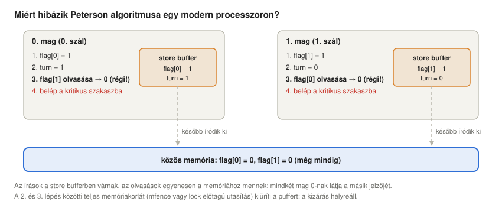
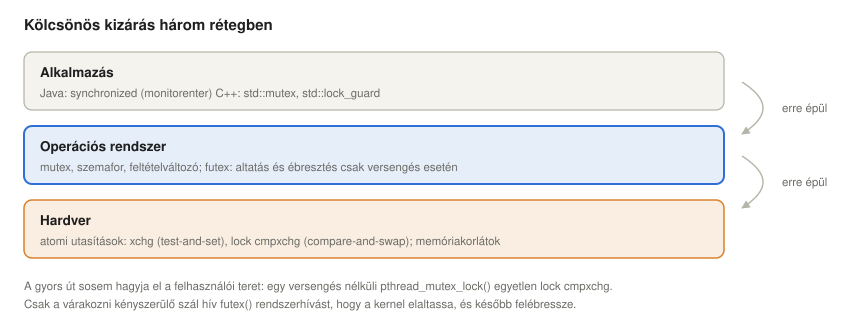
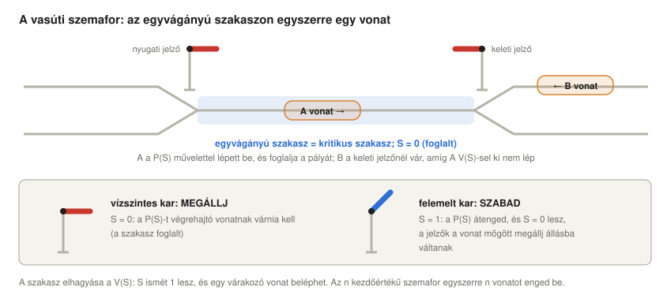
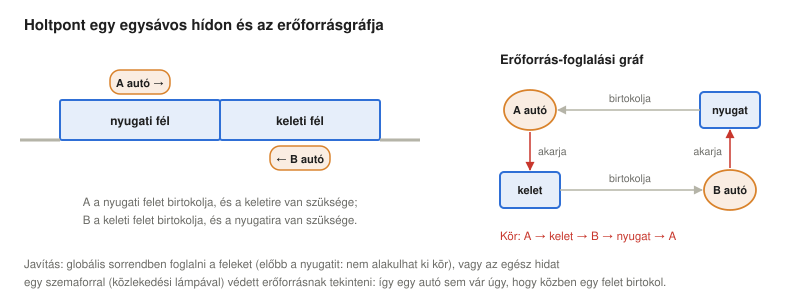
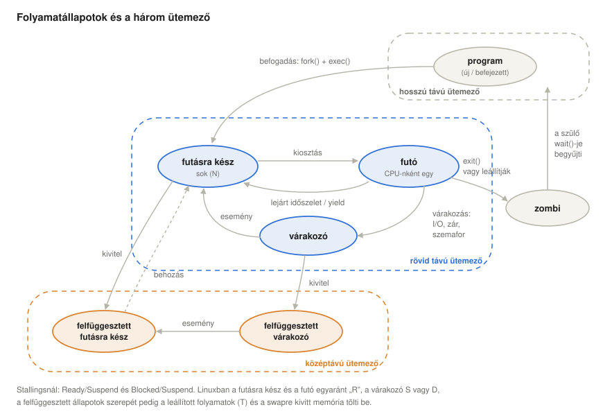
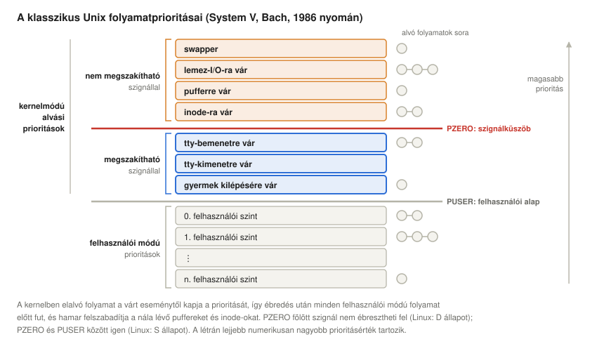
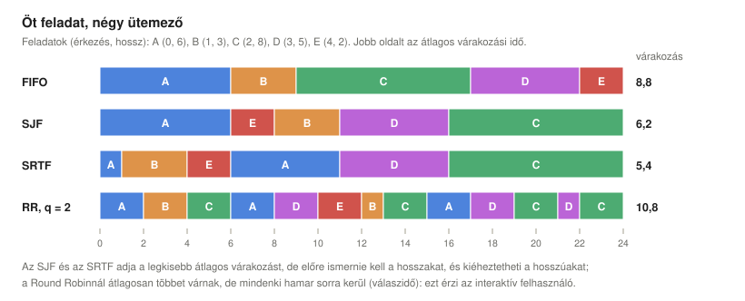
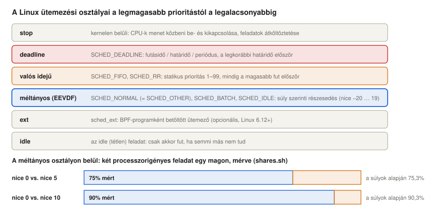

# Párhuzamosság, holtpontok, folyamatállapotok és a Linux ütemezése

*Operációs rendszerek előadás: hogyan osztoznak a folyamatok biztonságosan a processzoron és a közös adatokon, miért blokkolhatják egymást örökre, milyen állapotokon megy át egy folyamat, és hogyan dönti el a Linux, ki fusson következőnek*

Előző: [Megszakítások](../05-interrupts/). Következő: [Kétszintű memóriák és gyorsítótárak](../07-two-level-memory-and-cache/).

> **Hogyan olvasd ezt az előadást?** Ahol új rövidítés vagy fogalom jelenik meg, utána egy **Egyszerűen elmagyarázva** feliratú doboz következik. Kattints rá, és kinyílik egy köznapi nyelvű magyarázat. Ha már ismered a fogalmakat, nyugodtan átugorhatod ezeket a dobozokat.

## Tanulási célok

A [megszakításokról szóló előadás](../05-interrupts/) bemutatta azt a mechanizmust, amellyel az operációs rendszer bármelyik pillanatban elveheti a processzort egy programtól, és az első versenyhelyzetet is, amelyet ez okoz. Ez az előadás három irányban épít rá: hogyan oszthatnak meg a folyamatok helyesen adatokat (párhuzamosság), hogyan akadhatnak el úgy, hogy egymásra várnak (holtpont), és hogyan kezeli és ütemezi őket az operációs rendszer (folyamatállapotok és ütemezés). A gyakorlati példa végig a Linux.

Az előadás végére a hallgatók képesek lesznek:

- megfogalmazni a kritikus szakasz problémáját és annak három követelményét, lépésről lépésre végigkövetni egy elveszett frissítéssel járó versenyhelyzetet (két pénzfelvétel ugyanarról a bankszámláról), és megmagyarázni, miért kell egy zár vizsgálatának és beállításának egyetlen atomi lépésnek lennie, és miért nem segít a beállítás utáni újbóli ellenőrzés;
- elmagyarázni Peterson algoritmusát, és azt, miért hibázik egy modern többmagos processzoron memóriakorlátok nélkül;
- leírni a szinkronizáció három rétegét (hardverutasítás, operációs rendszerbeli mutex és szemafor, nyelvi konstrukció) és a futex gyors útját, valamint összehasonlítani az atomi műveletek, a spinlockok és a mutexek költségét;
- szemaforokat használni kölcsönös kizárásra és számlálásra, és megoldani a termelő–fogyasztó és az alvó borbély problémát;
- definiálni a holtpontot, kimondani a négy Coffman-feltételt, felrajzolni az erőforrás-foglalási gráfot (a több példányos erőforrásokkal együtt), és elmagyarázni a megelőzést, az elkerülést (bankár-algoritmus), a felismerést és a feloldást; megkülönböztetni a holtpontot a livelocktól, az éheztetéstől és a prioritásinverziótól;
- felrajzolni a folyamatok állapotdiagramját, elmagyarázni a hosszú, közép- és rövid távú ütemezőt, a zombikat és az árvákat, és megfeleltetni az állapotokat a Linux `ps` kódjainak, visszavezetve a megszakítható és a megszakíthatatlan alvást a klasszikus Unix alvási prioritásaira;
- kiszámítani a várakozási, átfutási és válaszidőt FIFO, SJF, SRTF, HRRN és Round Robin ütemezés mellett, valamint az időszelet hatásfokbeli költségét;
- elmagyarázni a Linux ütemezési osztályait, a nice-értékeket és a súlyokat, valamint az EEVDF ütemezőt, és megmérni ezek hatását.

<details>
<summary><b>Egyszerűen elmagyarázva:</b> párhuzamosság, folyamat, szál, holtpont, ütemezés</summary>

- **Párhuzamosság** (concurrency): egyszerre több dolog van folyamatban: vagy tényleg egy időben, több processzormagon, vagy egy magon, felváltva.
- **Folyamat** (process): egy futó program, saját memóriával. **Szál** (thread): egy végrehajtási vonal a folyamaton belül; egy folyamat szálai közösen használják a folyamat memóriáját.
- **Holtpont** (deadlock): olyan helyzet, amelyben két vagy több folyamat mindegyike olyasmire vár, ami egy másiknál van, ezért egyikük sem tud soha továbbmenni.
- **Ütemezés** (scheduling): annak eldöntése, melyik folyamat használhatja következőként a processzort, és meddig.

</details>

## A megszakításoktól a párhuzamosságig

A megszakításokról szóló előadás a megszakításokat így osztályozta: **időzítő**, **I/O** (normál befejeződés vagy hibaállapot), **programmegszakítás** (nullával való osztás, túlcsordulás, tiltott memória-hozzáférés) és **hardverhiba** (áramkimaradás, memória-paritáshiba). Összehasonlította azt is, hogyan lehet egy adatblokkot háromféleképpen mozgatni: **programozott I/O** (a processzor folyamatosan lekérdez, és közben semmi hasznosat nem csinál), **megszakításos I/O pufferrel** (a processzor még mindig maga másolja az adatot) és **DMA** (a processzor csak a sínért versenyez) ([Megszakítások: osztályok](../05-interrupts/#a-megszakítások-osztályai), [három I/O-technika](../05-interrupts/#adatblokkok-mozgatása-három-io-technika)).

Ezek mindegyike lehetővé, sőt szükségessé teszi a párhuzamosságot:

- az **időzítő-megszakítás** révén az operációs rendszer elveheti a processzort a futó programtól, így a programok osztozhatnak rajta (*kiszorítás*, preemption);
- az **I/O-megszakítások és a DMA** révén egy program várhat egy eszközre, miközben egy másik fut, így egy folyamat *futó* helyett *várakozó* is lehet;
- és mivel a váltás bármely két utasítás között bekövetkezhet, a közös adatokat használó programok zavarhatják egymást: ez a megszakításokról szóló előadás **versenyhelyzete**, ahol két folyamat is átjutott egy naiv „vizsgálat, aztán beállítás” zárón, és egy szerencsétlen összefésülődés (interleaving) hibás értéket hagyott `X`-ben ([Megszakítások és párhuzamosság](../05-interrupts/#megszakítások-és-párhuzamosság)).

Többmagos processzoron a probléma még élesebb: két szál valóban ugyanabban a pillanatban fut, ehhez megszakítás sem kell.

<details>
<summary><b>Egyszerűen elmagyarázva:</b> kiszorítás, lekérdezés, DMA, versenyhelyzet, többmagos processzor</summary>

- **Kiszorítás** (preemption): a processzor elvétele egy programtól, mielőtt az befejezte volna a munkáját vagy magától lemondott volna róla; olyan, mint amikor a játékvezető lefújja az egyik játékos körét.
- **Lekérdezés** (polling): újra meg újra megkérdezni egy eszközt, hogy „kész vagy már?”.
- **DMA** (direct memory access, közvetlen memória-hozzáférés): egy segédáramkör, amely a processzor nélkül másol adatot egy eszköz és a memória között.
- **Versenyhelyzet** (race condition): olyan hiba, amelynél az eredmény attól függ, pontosan milyen időzítéssel fut két program.
- **Többmagos processzor** (multi-core): olyan processzorlapka, amelyen több, egymástól független, egyszerre működő processzor („mag”) van.

</details>

## A kritikus szakasz problémája

A versenyhelyzetet pénzzel a legkönnyebb szemléltetni. Két bankkártya tartozik ugyanahhoz a bankszámlához, amelyen 150 van. Ugyanabban a pillanatban az egyik kártyabirtokos 100-at vesz fel egy budapesti, a másik 100-at egy hongkongi bankautomatából. Mindkét automata ugyanazt a kódot futtatja a bank szerverén, két párhuzamos folyamatként, amelyek egy közös változón, a `balance`-on (egyenleg) osztoznak:

```text
withdraw(amount):
    b = balance                  // read the balance
    if b >= amount:              // check: is there enough money?
        balance = b - amount     // act: write the new balance
        dispense(amount)
```

Önmagában mindkét kérés helyes. Összefésülődve azonban elromolhatnak:

| Lépés | 1. automata (Budapest) | 2. automata (Hongkong) | `balance` |
|---|---|---|---|
| ① | kiolvassa: `b = 150`; 150 ≥ 100, az ellenőrzés sikeres | | 150 |
| ② | | kiolvassa: `b = 150`; 150 ≥ 100, az ellenőrzés sikeres | 150 |
| ③ | beírja: `balance = 150 − 100 = 50`; kiad 100-at | | 50 |
| ④ | | beírja: `balance = 150 − 100 = 50`; kiad 100-at | 50 |

Az automaták 200-at fizettek ki, a számla mégis 50-et mutat: az 1. automata frissítését felülírták, elveszett. Ez a klasszikus **elveszett frissítés** (lost update), a mögötte álló minta pedig az **ellenőrzés, aztán cselekvés** (check-then-act): a döntés (① lépés) olyan értéken alapul, amely a cselekvés (③ vagy ④ lépés) pillanatában már nem igaz. Ha a kód közvetlenül az írás előtt újra kiolvasná a `balance` értékét, a számla −50-re futna ki, vagyis túllépnék a fedezetet, holott az ellenőrzésnek éppen ezt kellett volna megakadályoznia. Akárhogy is, az olvasásnak, az ellenőrzésnek és az írásnak egyetlen oszthatatlan egységet kell alkotnia. A bankok ezt az adatbázisuktól kapják meg: a pénzfelvétel **tranzakcióként** fut, amely zárolja a számla sorát (vagy egyetlen atomi utasításként, például `UPDATE account SET balance = balance - 100 WHERE id = 42 AND balance >= 100`), így az ugyanarról a számláról történő párhuzamos pénzfelvételek **sorosítva** (serialised), egymás után hajtódnak végre.

A programnak az a része, amely közös adatokon dolgozik, a **kritikus szakasza**. A kritikus szakasz problémájának helyes megoldása három dolgot kell garantálnia (Silberschatz et al., 2018):

1. **Kölcsönös kizárás:** egyszerre legfeljebb egy folyamat lehet a kritikus szakaszában.
2. **Haladás:** ha senki sincs bent, és néhányan be akarnak lépni, valamelyikük be is jut; a döntés nem halasztható a végtelenségig.
3. **Korlátos várakozás:** a belépni kívánó folyamat bejut, miután előtte legfeljebb korlátozott számú más folyamat lépett be (nincs éheztetés).

Mindennek működnie kell a folyamatok egymáshoz viszonyított sebességétől függetlenül, és akárhol is üt be egy megszakítás.

A naiv `while (S == 0); S = 0;` zár már az első követelményt sem teljesíti, mert a **vizsgálat** (`while (S == 0)`) és a **beállítás** (`S = 0`) két külön lépés; ha a kettő között megszakítás érkezik, mindkét folyamat bejut. A megoldás egy **test-and-set** (vizsgál és beállít) utasítás: olyan hardverutasítás, amely egyetlen, oszthatatlan (atomi) lépésben vizsgál és állít be. x86-on ez az `xchg`, amellyel a megszakításokról szóló előadás spinlockot épített.

### Két zár, amely nem működik

Szemaforként felírva a naiv zár belépéskor `while (s == 0); s--;`, kilépéskor `s++;`, kezdetben `s = 1`. Legyen P1 kritikus szakasza `X = 1`, P2-é pedig `X = 0; X = X + 1`. Egymás után futtatva, bármilyen sorrendben, mindkét szakasz `X = 1`-et hagy maga után. A sorszámok egy lehetséges összefésülődést mutatnak:

| Lépés | P1 | P2 | `s` | `X` |
|---|---|---|---|---|
| ① | vizsgálja: `s == 0` hamis, kilép a ciklusból | | 1 | |
| ② | | vizsgálja: `s == 0` hamis, kilép a ciklusból | 1 | |
| ③ | `s--` | | 0 | |
| ④ | | `s--` | −1 | |
| ⑤ | | `X = 0` | −1 | 0 |
| ⑥ | `X = 1` | | −1 | 1 |
| ⑦ | | `X = X + 1` | −1 | 2 |

Mindkét folyamat bent van, és `X` végül 2 lesz, ami semmilyen soros végrehajtási sorrendből nem jöhet ki. A két `s++` után `s` ismét 1, így a zár még a nyomokat is eltünteti.

Csábító javítás, ha utólag ellenőrizzük, valóban miénk-e a zár: minden folyamat beírja a saját azonosítóját `S`-be, és csak akkor lép be, ha az azonosítója még mindig ott van.

```c
retry:
    while (S != 0) ;              /* wait until the lock is free      */
    S = me;                       /* claim it with my ID (1 or 2)     */
    if (S != me) goto retry;      /* overwritten by the other? retry  */
    /* critical section */
    S = 0;
```

| Lépés | P1 | P2 | `S` |
|---|---|---|---|
| ① | látja, hogy `S == 0`, kilép a ciklusból | | 0 |
| ② | | látja, hogy `S == 0`, kilép a ciklusból | 0 |
| ③ | beírja: `S = 1` | | 1 |
| ④ | ellenőrzi: `S == 1`, még az enyém, belép | | 1 |
| ⑤ | | beírja: `S = 2` | 2 |
| ⑥ | | ellenőrzi: `S == 2`, még az enyém, belép | 2 |

Az ellenőrzés csak akkor veszi észre a másik folyamatot, ha annak írása a saját írásom és a saját ellenőrzésem közé esik; a később érkező írást nem láthatja. Egy második ellenőrzés csak arrébb tolja az ablakot. Két kiút marad: egy hardverutasítás, amely egyetlen atomi lépésben olvas és ír (test-and-set), vagy egy olyan algoritmus, amelyben minden folyamat előbb bejelenti a szándékát, aztán előreengedi a másikat; Peterson algoritmusa pontosan ezt teszi.

<details>
<summary><b>Egyszerűen elmagyarázva:</b> elveszett frissítés, ellenőrzés, aztán cselekvés, tranzakció, sorosítás, összefésülődés</summary>

- **Elveszett frissítés** (lost update): két program egyszerre módosítja ugyanazt az értéket, és az egyik módosítás csendben felülírja a másikat, mintha meg sem történt volna.
- **Ellenőrzés, aztán cselekvés** (check-then-act): előbb megnézed („van elég pénz?”), aztán a látottak alapján cselekszel. Ha valaki más közben megváltoztatja a helyzetet, a cselekvésed már régi információn alapul.
- **Tranzakció:** adatbázis-műveletek olyan csoportja, amely vagy teljesen megtörténik, vagy egyáltalán nem, és úgy, mintha közben senki más nem használná az adatbázist.
- **Sorosítás** (serialise): a dolgok egymás után történnek, nem egyszerre, mint amikor egyetlen ablak előtt egyetlen sor áll.
- **Összefésülődés** (interleaving): az a sorrend, amelyben két program lépései ténylegesen követik egymást, amikor felváltva kapják meg a processzort, vagy két magon futnak.

</details>

### Peterson algoritmusa: zár tisztán szoftverből

Elérhető-e a kölcsönös kizárás pusztán közönséges olvasásokkal és írásokkal, speciális utasítás nélkül? Két folyamatra igen. Gary Peterson algoritmusa (1981) két közös változót használ: `flag[i]` jelentése „az *i*. folyamat be akar lépni”, `turn` pedig azt mutatja, „kinek a sora várni”:

```c
static void lock(int i) {
    int j = 1 - i;
    flag[i] = 1;                 /* I want to enter ...                   */
    turn = j;                    /* ... but you go first if you want too  */
    while (flag[j] && turn == j)
        ;                        /* busy-wait                             */
}
static void unlock(int i) { flag[i] = 0; }
```

Ha mindketten egyszerre akarnak belépni, mindketten írják a `turn` változót, és az vár, amelyik *utoljára* írta; a másik belép. Annak bizonyítása, hogy ez mindhárom követelményt teljesíti, elfér egy oldalon (Peterson, 1981), és az algoritmus minden tankönyvben szerepel. Egy modern többmagos processzoron mégis hibázik, ahogy a `peterson.c` mutatja ([linuxos rész](#peterson-egy-valódi-többmagos-processzoron)). Az ok nem az algoritmusban, hanem a hardverben van:



A gyorsaság érdekében minden mag egy saját **tárolópufferbe** (store buffer) teszi az írásait, és dolgozik tovább; az írások kicsit később érik el a memóriát. Egy későbbi, más címről történő *olvasás* kiszolgálása megtörténhet, mielőtt a korábbi *írás* láthatóvá vált volna a másik mag számára. x86-on, közönséges memória esetén ez a tárolás–betöltés átrendezés az egyetlen átrendezés, amelyet az architektúra megenged (Intel Corporation, 2024), és pontosan ez az, amit Peterson algoritmusa nem tűr el: mindkét mag beírja a saját jelzőjét, mindkettő még 0-nak olvassa a másikét, és mindkettő belép. A gyengébb memóriamodellű processzorok, például az ARM, még többet rendeznek át. A gyógymód a **memóriakorlát** (memory fence): olyan utasítás, amely minden korábbi írást láthatóvá tesz, mielőtt bármely későbbi olvasás megtörténne; vagy a C11/C++11 atomi műveletei, amelyek beszúrják a szükséges korlátokat. A helyes szinkronizáció tehát mindig a hardver atomi utasításaira és memóriakorlátaira épül, sosem egyszerű változókra, és a C `volatile` kulcsszava sem segít.

<details>
<summary><b>Egyszerűen elmagyarázva:</b> kritikus szakasz, kölcsönös kizárás, éheztetés, atomi, xchg, tevékeny várakozás, tárolópuffer, memóriamodell, memóriakorlát, volatile</summary>

- **Kritikus szakasz:** az a kódrészlet, amely közös adatokhoz nyúl, és amelyet egyszerre ketten nem futtathatnak.
- **Kölcsönös kizárás:** az a szabály, hogy egyszerre csak egy lehet bent.
- **Éheztetés:** egy folyamat örökké vár, mert mindig mások jutnak be előtte.
- **Atomi:** oszthatatlan: vagy teljesen megtörténik, vagy egyáltalán nem, és senki sem láthatja vagy szakíthatja meg félúton.
- **`xchg`:** x86-utasítás, amely atomi módon kicseréli egy regiszter és egy memóriarekesz tartalmát; test-and-set-ként használják.
- **Tevékeny várakozás** (busy-wait): várakozás úgy, hogy egy ciklusban újra meg újra ellenőrizzük a feltételt, közben folyamatosan használva a processzort.
- **Tárolópuffer** (store buffer): kis sor minden processzormagban, ahol a beírt értékek várnak, mielőtt a memóriába kerülnének, hogy a magnak ne kelljen a lassú memóriára várnia.
- **Memóriamodell:** azok a szabályok, amelyek megmondják, milyen sorrendben láthatja a többi mag egy mag olvasásait és írásait.
- **Memóriakorlát** (memory fence, barrier): olyan utasítás, amely kikényszeríti a sorrendet: minden, ami a korlát előtt van, előbb válik láthatóvá, mint bármi, ami utána.
- **`volatile`:** C-kulcsszó, amely megmondja a fordítónak, hogy ne optimalizálja ki egy változó olvasásait és írásait. Ettől azok nem lesznek atomiak, és memóriakorlát sem kerül melléjük.

</details>

## A kölcsönös kizárás három rétege

A szinkronizáció három rétegre épül: az **alkalmazások** (Java, C++) az **operációs rendszer** mutexét használják, az pedig a **hardver** atomi test-and-set (vagy compare-and-swap) utasítására épül.



- A **hardver** atomi utasításokat biztosít: test-and-set (`xchg`), **compare-and-swap** (összehasonlít és cserél; x86-on `lock cmpxchg`: „ha az érték még mindig az, amit kiolvastam, cseréld le”), atomi növelés (`lock add`) és memóriakorlátok.
- Az **operációs rendszer** olyan zárakat ad, amelyeken **aludni** lehet: az a szál, amely nem kapja meg a zárat, *várakozó* állapotba kerül, nem használ processzort, és felébresztik, amikor a zár felszabadul. A Linux ezt a **futex** segítségével valósítja meg („fast user-space mutex”, gyors felhasználói térbeli mutex; Franke et al., 2002): a zár egy egyszerű egész szám a program saját memóriájában, amelyet egy atomi utasítással foglal le a felhasználói térben; csak ha már foglalt, akkor hív meg a szál egy `futex()` rendszerhívást, hogy elaludjon, és a zárat elengedő szál is egy ilyen hívással ébreszti fel. Egy versengés nélküli zár sosem lép be a kernelbe.
- A **programozási nyelvek** mindezt olyan konstrukciókba csomagolják, amelyeket nehéz rosszul használni. A Java `synchronized` blokkja a `monitorenter` és `monitorexit` bájtkódokra fordul, és kivétel esetén is felszabadul; a C++11 `std::mutex`-et kínál `std::lock_guard`-dal, amely a blokk végén automatikusan elengedi a zárat ([linuxos rész](#a-három-réteg-valódi-kódban)).

**Pörögni vagy aludni?** A spinlock tevékenyen vár, a mutex alszik. Az alvás két rendszerhívásba és két környezetváltásba kerül, ez néhány mikroszekundum; a pörgés semmibe sem kerül, ha a zár néhány száz nanoszekundumon belül felszabadul, de egy egész időszeletet elpazarol, ha a zár birtokosát kiszorították. A kernel nagyon rövid kritikus szakaszokra használ spinlockot (és ott, ahol az alvás lehetetlen, például megszakításkezelőkben); az alkalmazásoknak rendszerint mutexet érdemes használniuk. (A glibc alapértelmezett mutexe azonnal elalszik, ha foglaltnak találja a zárat; létezik „adaptív” mutextípus is, amely előbb rövid ideig pörög.) A linuxos rész mérései mindkét oldalt megmutatják: két szállal két magon a spinlock a gyorsabb, négy szállal két magon viszont kétszer lassabb a mutexnél.

<details>
<summary><b>Egyszerűen elmagyarázva:</b> compare-and-swap, mutex, futex, rendszerhívás, környezetváltás, bájtkód, kivétel, glibc, gyorsítótár-sor</summary>

- **Compare-and-swap (CAS):** atomi utasítás: „ha ezen a memóriahelyen még mindig az az érték van, amire számítok, írd be az új értéket; ha nem, szólj, hogy megváltozott”.
- **Mutex** (mutual-exclusion lock, kölcsönös kizárást biztosító zár): olyan zár, amelyet egyszerre egy szál birtokolhat; a többiek várnak, általában alva.
- **Futex:** a Linux építőköve a mutexekhez: egy szám a memóriában plusz két rendszerhívás: „aludj, amíg ez az értéke” és „ébreszd fel az alvókat”.
- **Rendszerhívás:** egy program kérése a kernelhez. **Környezetváltás:** a processzor abbahagyja az egyik szál futtatását, és egy másikat indít el, elmentve és visszaállítva a regisztereiket.
- **Bájtkód:** a Java virtuális gép utasításai; a Java-programok ezekre fordulnak le.
- **Kivétel:** olyan hiba, amely kiugrik a program normál menetéből (Javában és C++-ban).
- **glibc:** a legtöbb Linux-rendszer szabványos C-könyvtára; ebben van a `pthread_mutex_lock` és sok más függvény.
- **Gyorsítótár-sor** (cache line): az az egység (általában 64 bájt), amelyben az adat a memória és egy mag gyorsítótára között mozog. Ha két mag ugyanazt a sort írja, ide-oda kell adogatniuk.

</details>

## Szemaforok: több, mint egy zár

Dijkstra (1965) vezette be a **szemafort**: egy nemnegatív egész számlálót két atomi művelettel, a **P**-vel és a **V**-vel. A nevek holland szavakból származnak, amelyeket általában *proberen* („próbálni”) és *verhogen* („növelni”) alakban adnak meg; a műveleteket `wait`-nek vagy `down`-nak, illetve `signal`-nak, `post`-nak vagy `up`-nak is hívják:

- `P(S)`: ha S > 0, csökkenti, és a folyamat továbbmegy; különben alszik, amíg S nagyobb nem lesz 0-nál (ez Dijkstra nemnegatív változata; a megszakításokról szóló előadás azt az egyenértékű változatot mutatta be, amelyben S negatív is lehet, és ilyenkor a várakozó folyamatokat számolja);
- `V(S)`: növeli S-t, és ha van alvó, egyet felébreszt.

A név a vasúttól származik (Dijkstra első, a témáról írt feljegyzésének címe *Over seinpalen*, „A szemaforokról”; Dijkstra, n.d.). Egy egyvágányú vonalon a két irányból érkező vonatok egyetlen pályaszakaszon osztoznak, ez a kritikus szakasz, és mindkét végén egy **szemafor** (alakjelző) őrzi a behajtást. Vízszintes karja azt jelenti, „megállj”, felemelt karja azt, „szabad az út”. A jelzőhöz érő vonat P műveletet hajt végre: ha a szakasz szabad, behajt, és mögötte a jelzők megállj állásba váltanak (S 0 lesz); ha nem, a jelzőnél vár. A szakaszt elhagyó vonat V műveletet hajt végre: a szakasz ismét szabad (S = 1), és egy várakozó vonat indulhat.



A megszakításokról szóló előadás 1-re inicializált szemafort használt zárként (**bináris szemafor**). Ha *n*-re inicializáljuk, egyszerre *n* folyamatot enged be (**számláló szemafor**): *n* szabad nyomtató, *n* adatbázis-kapcsolat, *n* parkolóhely. És mivel az egyik folyamat hívhatja a V-t, miközben egy másik a P-t, a szemaforral egy eseményt is **jelezni** lehet folyamatok között, amire a mutex nem képes.

A klasszikus példa a **termelő–fogyasztó** (korlátos puffer) probléma: a termelők elemeket tesznek egy *N* férőhelyes pufferbe, a fogyasztók kiveszik őket. Három szemafor megoldja:

```text
semaphore mutex = 1      // protects the buffer itself
semaphore empty = N      // free slots
semaphore full  = 0      // filled slots

producer:  P(empty); P(mutex); put(item); V(mutex); V(full)
consumer:  P(full);  P(mutex); item = take(); V(mutex); V(empty)
```

A termelő akkor alszik, ha tele van a puffer, a fogyasztó akkor, ha üres, és senki sem vár tevékenyen. A két P művelet sorrendje számít: az a termelő, amely előbb a `mutex`-et foglalná le, és utána aludna el az `empty`-n, lezárva tartaná a puffert, és egyetlen fogyasztó sem tudna soha helyet felszabadítani: ez holtpont.

**Az alvó borbély.** Egy másik klasszikus feladat Dijkstrától (1965): egy borbélyüzletben egy borbély, egy borbélyszék és *n* szék van a várakozó vendégeknek. Ha nincs vendég, a borbély a székében alszik. Az érkező vendég felébreszti a borbélyt, ha az alszik, leül várni, ha van szabad szék, és elmegy, ha minden szék foglalt. A nehézség az elveszett ébresztés: az a vendég, aki látja, hogy a borbély dolgozik, és éppen le akar ülni, valamint az a borbély, aki végzett, nem lát várakozót, és éppen elalszik, örökké egymásra várhatnak. Két jelzésre használt szemafor és egy zárként használt szemafor megoldja:

```text
semaphore customers = 0   // waiting customers; the barber sleeps on it
semaphore barber    = 0   // the barber is ready; a customer sleeps on it
semaphore mutex     = 1   // protects waiting
int waiting = 0           // customers on the waiting chairs (at most n)

barber:    loop { P(customers); P(mutex); waiting--; V(barber); V(mutex); cut_hair() }
customer:  P(mutex)
           if waiting < n:  waiting++; V(customers); V(mutex); P(barber); get_haircut()
           else:            V(mutex); leave()
```

Mivel a számláló akkor is megjegyzi a V-t, ha még senki sem vár, egyetlen ébresztés sem veszhet el. Ugyanez a szerkezet jelenik meg minden olyan szerverben, amelyben munkaszálak készlete és kérések korlátos sora van: a borbély egy munkaszál, a székek a sor, és az a vendég, aki tele találja a sort, egy elutasított kérés.

A szemaforok hatékonyak, de könnyű rosszul használni őket: egyetlen elfelejtett V vagy egy felcserélt P és V, és a program lefagy, vagy sérül a kölcsönös kizárás. A **monitorok** (Hoare, 1974) a közös adatot, a zárat és a **feltételváltozókat** (amelyeken egy szál a záron belül egy feltétel teljesülésére várhat) egyetlen konstrukcióba csomagolják; a Java-objektumok a `synchronized`, `wait()` és `notify()` eszközökkel, valamint a C++ `std::condition_variable` osztálya a gyakorlatban monitorok. POSIX-szálakkal a korlátos puffer így néz ki:

```c
pthread_mutex_lock(&m);
while (count == N)                     /* buffer full: wait, releasing m meanwhile */
    pthread_cond_wait(&not_full, &m);
put(item); count++;
pthread_cond_signal(&not_empty);       /* wake one consumer, if any               */
pthread_mutex_unlock(&m);
```

Két részlet fontos. A `pthread_cond_wait` alvás közben elengedi a mutexet, és visszatérés előtt újra lefoglalja, így a feltétel biztonságosan vizsgálható. A vizsgálat pedig `while`, nem `if`: felébredés után a szálnak újra ellenőriznie kell a feltételt, mert egy másik szál megelőzhette, és mert a szabvány megengedi a *hamis* (spurious) ébredéseket. Ennek oka, hogy a pthreads és a Java **Mesa-szemantikát** használ (a jelzést küldő szál fut tovább, a felébresztett később fut), nem Hoare eredeti szemantikáját, amelyben a felébresztett szál azonnal fut, és a feltétel garantáltan teljesül (Lampson & Redell, 1980).

**Olvasók és írók.** Sok közös adatszerkezetet sokkal gyakrabban olvasnak, mint írnak. Az **olvasó–író zár** (readers–writer lock, `pthread_rwlock_t`) tetszőleges számú olvasót együtt beenged, írót viszont csak egyedül; ügyelnie kell arra, hogy ne éheztesse ki az írókat. A Linux-kernel a főleg olvasott adatokra még tovább megy az **RCU**-val (read-copy-update, olvasás–másolás–frissítés): az olvasók egyáltalán nem foglalnak zárat, az író pedig közzétesz egy új másolatot, és a régit csak akkor szabadítja fel, amikor minden olvasó végzett, amelyik még láthatta (McKenney, 2023).

<details>
<summary><b>Egyszerűen elmagyarázva:</b> szemafor, vasúti szemafor (alakjelző), P és V, bináris és számláló szemafor, termelő–fogyasztó, puffer, alvó borbély, elveszett ébresztés, munkaszál-készlet, monitor, feltételváltozó, Mesa-szemantika, hamis ébredés, olvasó–író zár, RCU</summary>

- **Szemafor:** a belépést szabályozó számláló, olyan, mint egy parkolóház kijelzője: lefelé számol, ahogy az autók behajtanak, 0-nál megállítja az autókat, és felfelé számol, ahogy kihajtanak.
- **P és V:** Dijkstra holland nevei arra, hogy „várj, amíg el tudsz venni egyet” és „adj vissza egyet”.
- **Bináris szemafor:** csak 0 vagy 1 lehet, ezért zárként működik. **Számláló szemafor:** bármilyen szám lehet, több egyforma erőforráshoz.
- **Termelő–fogyasztó:** a program egyik része elemeket készít, a másik felhasználja őket, és közöttük egy korlátos méretű várakozóhely van, mint a pékségben a polc a pék és a vevők között.
- **Puffer:** ez a várakozóhely a memóriában.
- **Vasúti szemafor (alakjelző):** a pálya mellett álló oszlop mozgatható karral; a vízszintes kar azt jelenti, „állj”, a felemelt kar azt, „mehetsz”. Egyszerre csak egy vonatot enged rá egy egyvágányú szakaszra, vagyis arra a pályára, amelyen a két irányba haladó vonatoknak osztozniuk kell.
- **Alvó borbély:** fejtörő egy borbélyról, aki alszik, ha senki sem vár, és akit a következő vendégnek kell felébresztenie, úgy, hogy közben senki ne maradjon ki.
- **Elveszett ébresztés:** az egyik fél éppen a másik „ébredj!” kiáltása után alszik el, így a kiáltás elvész, és mindketten örökké várnak. A szemafor megszámolja a kiáltásokat, így egy sem vész el.
- **Munkaszál-készlet** (worker pool): egy szerver rögzített számú szála, amelyek egy sorból veszik a kéréseket, ahogy a borbélyok a várakozó székekről a vendégeket.
- **Monitor:** programnyelvi konstrukció, amely a közös adatot összecsomagolja az őt védő zárral, így nem lehet elfelejteni a zárolást.
- **Feltételváltozó:** egy hely a monitoron belül, ahol egy szál alhat, amíg egy másik szál nem szól neki, hogy valami megváltozott („a polc már nem üres”).
- **Mesa-szemantika, hamis ébredés:** a felébresztés csak annyit jelent, hogy „valami talán megváltozott”, nem azt, hogy „teljesül a feltételed”; néha egy szálat ok nélkül is felébresztenek. Ezért újra meg kell néznie.
- **Olvasó–író zár:** olyan zár, amely egyszerre sok olvasót beenged, írót viszont csak egyedül, mint egy múzeumi terem, amelyet sokan nézhetnek egyszerre, de a restaurátor csak egyedül dolgozhat benne, látogatók nélkül.
- **RCU** (read-copy-update): zárolás helyett az író új másolatot készít, és átvált rá; a régi olvasók befejezik a munkát a régi másolattal, amelyet aztán kidobnak.

</details>

## Holtpont

Klasszikus szemléltetés az egysávos híd: két autó találkozik a közepén, és egyik sem tud továbbmenni. Ha a hidat két félnek tekintjük, akkor ez két erőforrás, és mindkét autó birtokol egyet, és vár a másikra:



Folyamatok egy halmaza **holtpontban van**, ha mindegyikük olyan eseményre vár, amelyet csak a halmaz egy másik folyamata idézhet elő. Coffman, Elphick és Shoshani (1971) megmutatta, hogy holtpont csak akkor alakulhat ki, ha négy feltétel egyszerre teljesül:

1. **Kölcsönös kizárás:** egy erőforrást egyszerre csak egy folyamat használhat (egy hídfélen egy autó fér el).
2. **Foglalva várakozás** (hold and wait): egy folyamat birtokol egy erőforrást, miközben egy másikra vár (mindkét autó a saját felén marad).
3. **Nincs elvétel** (no preemption): egy erőforrást nem lehet elvenni, csak önként szabadul fel (nincs daru, amely leemelné az autót).
4. **Körkörös várakozás:** a folyamatok kört alkotnak, mindegyik a következő által birtokolt erőforrásra vár.

Az **erőforrás-foglalási gráf** (Holt, 1972) ezt láthatóvá teszi: a folyamattól az erőforrás felé mutató nyíl azt jelenti, „akarja”, az erőforrástól a folyamat felé mutató azt, „ő birtokolja”. Ha minden erőforrásból egy példány van, a gráfban lévő kör holtpontot jelent.

Egy bedugult kereszteződés ugyanez a helyzet négy szereplővel. Minden egyenesen áthaladó autónak a kereszteződés két negyedére van szüksége: arra, amelyikben áll, és a következőre. Ha négy autó mind behajtott egy-egy negyedbe, mindegyik a következő autó által foglalt negyedre vár, a mögöttük álló sorok miatt pedig tolatni sem tudnak:


A gráf Holt szabványos jelölését használja: a **folyamat** kör, az **erőforrás** téglalap, benne minden **példányához** (egyforma egységéhez) egy ponttal, a **kérési él** a folyamattól ahhoz a téglalaphoz vezet, amelyre vár, a **hozzárendelési él** pedig egy ponttól (a lefoglalt példánytól) a birtokosához. Ha minden erőforrásból egy példány van, a kör a holtpont szükséges és elégséges feltétele. Több példány esetén a kör szükséges, de nem elégséges. Tegyük fel, hogy az R1 erőforrásnak két példánya van, az egyik P1-nél, a másik P3-nál; P1 az R2-re vár, amely P2-nél van; P2 az R1-re vár. Van egy P1 → R2 → P2 → R1 → P1 kör, P3 viszont semmire sem vár: befejeződik, felszabadítja az R1 egyik példányát, ezt P2 megkapja és befejeződik, végül P1 is (Silberschatz et al., 2018). Ilyenkor a holtpont eldöntéséhez a bankár-algoritmus biztonságossági vizsgálatában használt redukciós algoritmus kell: ismételten befejezünk egy olyan folyamatot, amelynek kérései teljesíthetők, és megnézzük, mindenki befejeződhet-e.

### A holtpontok kezelése

Négy stratégia létezik (Silberschatz et al., 2018; Stallings, 2018):

- **Megelőzés:** a négy feltétel valamelyikét lehetetlenné tesszük. A leggyakorlatiasabb a **körkörös várakozás** megtörése egy globális **zárolási sorrenddel**: minden program előbb a nyugati, aztán a keleti felet foglalja le, így nem alakulhat ki kör. A **foglalva várakozás** megtörése azt jelenti, hogy minden erőforrást egyszerre foglalunk le (egy „közlekedési lámpaként” működő szemafor egyszerre egy autót enged fel az *egész* hídra); a **nincs elvétel** megtörése azt, hogy erőforrásokat elveszünk (ez lehetséges a processzornál vagy a memóriánál, de egy félig megírt fájlnál nem); a **kölcsönös kizárás** megtörése pedig azt, hogy az erőforrást megoszthatóvá tesszük (például nyomtatási sor, spooling).
- **Elkerülés:** a rendszer előre tudja, melyik erőforrásból mennyire lehet szüksége az egyes folyamatoknak, és csak akkor teljesít egy kérést, ha az így létrejövő állapot **biztonságos**, vagyis még létezik olyan sorrend, amelyben minden folyamat megkaphatja a maximumát és befejeződhet. **Dijkstra bankár-algoritmusa** (Dijkstra, 1965) ezt ellenőrzi, mint egy bank, amely csak akkor ad kölcsönt, ha utána is ki tudja szolgálni minden ügyfele hitelkeretét ([linuxos rész](#elkerülés-a-bankár-algoritmus)). Előre ismernie kell a maximális igényeket, ezért az általános célú operációs rendszerek ritkán használják.
- **Felismerés és feloldás:** hagyjuk, hogy holtpont alakuljon ki, megkeressük a köröket a várakozási gráfban, és megtörjük őket egy áldozat leállításával vagy munkájának visszagörgetésével. Az adatbázis-kezelők pontosan ezt teszik a tranzakciókkal. A felismeréshez globális tudás kell: az egész gráf, egyetlen pillanatban. Egyetlen gépen ez a kernel vagy az adatbázis rendelkezésére áll; egy elosztott rendszerben viszont minden csomópont csak a saját zárait látja, az üzenetek ideje nem nulla, és az összerakott gráfban olyan élek is lehetnek, amelyek már nem léteznek („fantom” holtpont), ezért az elosztott rendszerek gyakran időkorlátokra (time-out) hagyatkoznak.
- **A probléma figyelmen kívül hagyása** (a „strucc-algoritmus”): az általános célú operációs rendszerek, köztük a Linux és a Windows, nem ismerik fel a felhasználói folyamatok közötti holtpontokat; elkerülésük a programozó dolga, a lefagyott program leállítása pedig a felhasználóé. A Linux-kernelen belül a **lockdep** ellenőrző rögzíti, milyen sorrendben foglalják le az egyes zárosztályokat, és azonnal figyelmeztet, ha két kódút két zárat ellentétes sorrendben foglal le, akkor is, ha a holtpont ténylegesen még sosem következett be (Linux kernel documentation, n.d.-a).

A klasszikus tananyagpélda Dijkstra **étkező filozófusok** problémája (Dijkstra, 1971): öt filozófus ül egy asztal körül, minden két szomszéd között egy villa van, és mindegyiküknek mindkét szomszédos villára szüksége van az evéshez. Ha mindannyian egyszerre veszik fel a bal oldali villájukat, mindannyian örökké várnak. Ha megszámozzuk a villákat, és mindig a kisebb sorszámút vesszük fel először (zárolási sorrend), a probléma megoldódik.

### A holtpont rokonai

- **Livelock (élő holtpont):** a folyamatok nincsenek blokkolva, de folyton egymásra reagálnak, és nem haladnak, mint két ember a folyosón, akik újra és újra ugyanabba az irányba lépnek ki egymás elől. Az a holtpont-feloldás, amely mindkét felet visszalépteti és azonnal ugyanúgy újrapróbálkoztatja, a holtpontot livelockká alakíthatja; a szokásos gyógymód a véletlenszerű visszalépési idő (mint az Ethernetben).
- **Éheztetés:** egy folyamat haladhatna, de mindig mások előzik meg, például egy hosszú feladat a legrövidebb feladat először (SJF) ütemezésnél.
- **Prioritásinverzió:** egy magas prioritású feladat egy alacsony prioritású által birtokolt zárra vár, az utóbbi viszont nem tud futni, mert közepes prioritású feladatok folyton kiszorítják. 1997 júliusában ez újra és újra újraindította a NASA Mars Pathfinder leszállóegységének számítógépét a Marson: egy alacsony prioritású meteorológiai feladat birtokolt egy mutexet (a feladatok közötti kommunikáció mechanizmusán belül), amelyre a magas prioritású sínelosztó feladatnak szüksége volt; amikor a sínütemező észlelte, hogy a sínfeladat nem fejezte be a ciklusát, az egész rendszert újraindította. A mérnökök a Földön reprodukálták a hibát, és egy feltöltött javítócsomaggal (patch) orvosolták, amely egy globális beállítás módosításával bekapcsolta a **prioritásöröklést** az adott mutexre: amíg egy alacsony prioritású feladat olyan zárat birtokol, amelyre egy magas prioritásúnak szüksége van, ideiglenesen a magas prioritáson fut (Reeves, 1997). A Linux ugyanezt kínálja a prioritásöröklő futexekkel (`PTHREAD_PRIO_INHERIT`).

<details>
<summary><b>Egyszerűen elmagyarázva:</b> erőforrás, erőforrás elvétele, erőforrás-foglalási gráf, bedugult kereszteződés, példány, kérési és hozzárendelési él, kör, elosztott rendszer, fantom holtpont, zárolási sorrend, biztonságos állapot, tranzakció, visszagörgetés, livelock, prioritásinverzió, prioritásöröklés, watchdog, spooling, lockdep</summary>

- **Erőforrás:** bármi, amire egy folyamatnak szüksége van, és amire esetleg várnia kell: zár, nyomtató, memória, fájl.
- **Erőforrás elvétele:** erővel elvenni a birtokosától.
- **Erőforrás-foglalási gráf:** nyilakkal megrajzolt ábra arról, kinél mi van, és ki mit akar.
- **Bedugult kereszteződés** (gridlock): olyan forgalmi dugó egy kereszteződésben, amelyben körben minden autó elzárja a következőt, így senki sem tud mozdulni.
- **Példány:** egy erőforrás több egyforma egységének egyike, például három egyforma nyomtató közül az egyik. A gráfban minden példány egy pont.
- **Kérési él, hozzárendelési él:** a kétféle nyíl: „ez a folyamat arra az erőforrásra vár”, illetve „az erőforrásnak ez az egysége ahhoz a folyamathoz tartozik”.
- **Kör:** nyilak olyan útja, amely visszaér a kiindulópontjába.
- **Elosztott rendszer:** hálózaton keresztül együttműködő számítógépek sokasága, amelyek közül egyik sem lát mindent egyszerre.
- **Fantom holtpont:** olyan holtpont, amelyet egy felismerő elavult információ alapján jelez, holott az már megszűnt.
- **Zárolási sorrend:** rögzített szabály, hogy mindenki ugyanabban a sorrendben foglalja le a zárakat (mindig előbb a nyugati felet).
- **Biztonságos állapot:** olyan helyzet, amelyből a rendszer valamilyen sorrendben még mindenkinek meg tudja adni, amit kérhet.
- **Tranzakció, visszagörgetés:** az adatbázis-tranzakció változtatások csoportja, amely vagy teljesen megtörténik, vagy egyáltalán nem; visszagörgetni azt jelenti, hogy visszacsináljuk.
- **Livelock:** mindenki szorgalmasan mozog, de senki sem jut sehová.
- **Prioritásinverzió:** egy fontos feladat egy kevésbé fontos mögött ragad. **Prioritásöröklés:** a kevésbé fontos feladatot ideiglenesen előléptetik, hogy hamar végezzen, és továbbengedje a fontosat.
- **Watchdog** (őrkutya-időzítő): időzítő, amely újraindítja a számítógépet, ha a szoftver nem jelzi rendszeresen, hogy még él.
- **Spooling:** a programok nem közvetlenül használják a nyomtatót, hanem a kimenetüket lemezre mentik, és egyetlen szolgáltatás nyomtatja ki a feladatokat egymás után.
- **lockdep:** a Linux-kernelbe épített ellenőrző, amely megjegyzi, milyen sorrendben foglalják le a zárakat, és figyelmeztet a holtpontot okozni képes sorrendekre.

</details>

## A folyamatok állapottere

A **folyamat** egy végrehajtás alatt álló program: *folyamat = futó program + környezet*. A **környezet** (kontextus) mindaz, ami ahhoz kell, hogy a folyamatot leállítsuk, és később úgy folytassuk, mintha semmi sem történt volna: a processzor regiszterei (köztük az utasításszámláló), a memóriatérkép, a megnyitott fájlok, az ütemezési állapot. Az operációs rendszer ezt egy **folyamatleíróban** (process control block, PCB) tárolja; Linuxban ez egy `struct task_struct`. Egy PCB legalább a következőket tartalmazza: a folyamat és a szülője azonosítóját, az állapotot, a prioritást és más ütemezési adatokat, az elmentett regisztereket (utasításszámláló, állapotszó, veremmutató), a memóriakezelési adatokra (laptáblákra) mutató hivatkozásokat, a megnyitott fájlokat, valamint elszámolási adatokat, például a felhasznált processzoridőt. A Linux a `fork()` hívással hoz létre folyamatot, amely megkettőzi a hívó folyamatot, és a másolatba rendszerint az `exec()` hívással tölt be egy új programot.



Az ábra a hétállapotú modellt mutatja:

- **Futásra kész** (sok folyamat): futni tudna, csak egy processzorra vár. **Futó** (processzormagonként egy folyamat): éppen végrehajtás alatt áll. A **dispatcher** (kiosztó) viszi át a folyamatot futásra kész állapotból futóba; az időzítő-megszakítás (lejárt az időszelet) vagy maga a folyamat (önkéntes lemondás, yield) viszi vissza.
- **Várakozó** (gyakran *blokkolt*-nak is nevezik): a folyamat egy eseményre vár: egy I/O-művelet végére, adatra egy pufferben, egy szemaforra. Amikor az esemény bekövetkezik (megszakítás, V művelet), ismét futásra kész lesz, nem futó: ugyanúgy várnia kell a processzorra, mint mindenki másnak.
- **Felfüggesztett futásra kész** és **felfüggesztett várakozó** (Stallingsnél Ready/Suspend és Blocked/Suspend): a folyamatot kivitték a memóriából (swap out), hogy helyet csináljanak másoknak. Ha egy felfüggesztett várakozó folyamat eseménye bekövetkezik, felfüggesztett futásra kész lesz; futás előtt vissza kell hozni a memóriába (swap in).
- **Zombi:** a folyamat véget ért (az `exit()` hívással vagy mert leállították), de a kilépési állapotát megőrzik, amíg a szülője a `wait()` hívással át nem veszi. Ekkor az utolsó nyoma is eltűnik: a szülő **begyűjti** (reap) a zombit. Minden véget érő folyamat, akár normálisan, akár szignál hatására, bármelyik állapotból áthalad ezen az állapoton; az egyetlen kivétel az a gyermek, amelynek szülője jelezte, hogy nem kér kilépési állapotokat (figyelmen kívül hagyja a `SIGCHLD` szignált, vagy beállítja az `SA_NOCLDWAIT` jelzőt): ezt a kernel azonnal eltávolítja.

Az ábrát három tartományra osztja az, hogy **milyen gyakran** születnek döntések (Stallings, 2018):

| Ütemező | Miről dönt | Milyen gyakran | Linuxban |
|---|---|---|---|
| hosszú távú | mely programokból lesz folyamat (befogadás) | ritkán: amikor feladatokat küldenek be | kötegelt feladatkezelő rendszerek, `systemd`-korlátok, cgroup `pids`-korlátok |
| középtávú | mely folyamatok maradnak a memóriában | másodpercek | lapozás (swap) és memória-visszanyerés, cgroup freezer, leállítás `SIGSTOP`-pal (rokona: az out-of-memory killer, amely felfüggesztés helyett leállítja a folyamatokat) |
| rövid távú | melyik futásra kész folyamat fusson következőnek | ezredmásodpercek: amikor a futó feladat blokkolódik vagy lemond a processzorról, vagy amikor újraütemezést kértek, és a kernel visszatér egy megszakításból vagy rendszerhívásból | a CPU-ütemező (EEVDF és a többi osztály) |

**A Linux állapotai.** A `ps` minden folyamat állapotát a `STAT` oszlopban mutatja (procps-ng, n.d.):

| Kód | Jelentés | Az ábrán |
|---|---|---|
| `R` | fut vagy futtatható (egy futási sorban van) | futásra kész *és* futó |
| `S` | megszakítható alvás: eseményre vár, szignál (signal) hatására felébred | várakozó |
| `D` | megszakíthatatlan alvás, általában I/O közben | várakozó (általában le sem lőhető, amíg az I/O véget nem ér) |
| `T`, `t` | munkavezérlési (job control) szignál vagy hibakereső (debugger) állította le | közel áll a felfüggesztetthez |
| `Z` | zombi: befejeződött, de a szülője még nem gyűjtötte be | zombi |
| `I` | tétlen kernelszál | (kernelbeli háztartási munka) |

A Linux a `ps`-ben nem különbözteti meg a futásra kész és a futó állapotot, mert a kettő közötti különbség másodpercenként több ezerszer változik. Külön felfüggesztett állapotai sincsenek: nem egész folyamatokat, hanem egyes memórialapokat visz ki a lapozóterületre (swap), így egy folyamat részben lehet a memóriában. Ha egy szülő a gyermekei előtt ér véget, az **árvákat** az `init` (az 1-es PID-ű folyamat vagy egy kijelölt „subreaper”) fogadja örökbe, és ő gyűjti be őket.

**Honnan ered az S és a D?** A kétféle alvás a klasszikus Unix-kernelig nyúlik vissza, amely minden alvó folyamatnak aszerint adott prioritást, hogy *mire* várt (Bach, 1986):



Az a folyamat, amely egy rendszerhíváson belül alszik el, a várt esemény által meghatározott **kernelmódú alvási prioritást** kap: a legmagasabbat a swapper, utána a lemez-I/O-ra, pufferre, inode-ra várakozás, majd a terminálbemenetre vagy -kimenetre várakozás, és a legalacsonyabbat a gyermek kilépésére várakozás. Ezek mind minden **felhasználói módú prioritás** fölött vannak, így a felébredt folyamat gyorsan befejezi a kernelbeli munkáját, és felszabadítja a nála esetleg lévő puffereket és inode-okat, amelyekre más folyamatoknak is szükségük van. Egy küszöb két részre osztja a kernelprioritásokat. A fölötte alvó folyamatot (lemez-I/O, pufferek, inode-ok) szignál nem ébresztheti fel: az esemény biztosan hamarosan bekövetkezik, a művelet félbehagyása pedig inkonzisztens állapotban hagyhatná a kernel adatszerkezeteit. Az alatta alvó folyamat (terminál, gyermek kilépése) akármeddig várhat, ezért egy szignál felébreszti, és a rendszerhívás idő előtt, hibával (`EINTR`) tér vissza. A Linux pontosan ezt a megkülönböztetést őrzi meg a `D` (megszakíthatatlan, `TASK_UNINTERRUPTIBLE`) és az `S` (megszakítható, `TASK_INTERRUPTIBLE`) állapotban, és hozzáteszi a `D` egy „lelőhető” (killable) változatát, amelyet csak végzetes szignálok szakíthatnak meg. A felébredő folyamatnak azonban már nem az esemény szerint ad prioritást; ehelyett a méltányos ütemező általában hamar futni engedi az alvásból felébredő feladatot, mert az kevesebbet használt a processzorból, mint amennyi kijárna neki.

<details>
<summary><b>Egyszerűen elmagyarázva:</b> környezet, regiszter, utasításszámláló, folyamatleíró, állapotszó, elszámolás, fork, exec, dispatcher, yield, swap, zombi, begyűjtés, szignál, SIGCHLD, árva, init, cgroup, subreaper, befogadás, alvási prioritás, swapper, inode, tty, EINTR</summary>

- **Környezet** (kontextus): minden, amit a processzornak és az operációs rendszernek meg kell jegyeznie egy folyamatról ahhoz, hogy később folytatni tudja, mint egy könyvjelző és mellette a jegyzetek az asztalon.
- **Regiszter:** apró, nagyon gyors tárolóhely a processzorban. Az **utasításszámláló** (program counter) az a regiszter, amely a következő utasítás címét tartalmazza.
- **Folyamatleíró (PCB):** az operációs rendszer nyilvántartó kartonja egy folyamatról.
- **Állapotszó** (PSW, program status word): a processzor jelzőbitjeit tartalmazó regiszter, például az utolsó összehasonlítás eredményét, és azt, hogy engedélyezettek-e a megszakítások. **Elszámolás** (accounting): könyvelés, például arról, mennyi processzoridőt használt egy folyamat.
- **`fork()`:** lemásolja a futó folyamatot. **`exec()`:** a folyamatban futó programot egy másik programra cseréli.
- **Dispatcher** (kiosztó): az operációs rendszernek az a része, amely ténylegesen átadja a processzort a kiválasztott folyamatnak.
- **Yield:** a folyamat önként lemond a processzorról.
- **Swap out / swap in:** egy folyamat memóriájának kiírása lemezre, hogy felszabaduljon a RAM, majd később visszahozása.
- **Zombi:** befejeződött folyamat, amelynek még van bejegyzése a folyamattáblában, mert a szülője még nem kérdezte meg, hogyan ért véget. **Begyűjtés** (reap): a szülő átveszi ezt az információt, és a bejegyzés eltűnik.
- **Szignál** (signal): rövid üzenet, amelyet az operációs rendszer kézbesít egy folyamatnak, például „állj meg” (`SIGSTOP`) vagy „fejezd be” (`SIGKILL`).
- **Árva:** olyan folyamat, amelynek a szülője már véget ért. **init:** a rendszer első folyamata (1-es PID), amely örökbe fogadja az árvákat.
- **cgroup** (control group, vezérlőcsoport): Linux-szolgáltatás, amely csoportokba fogja a folyamatokat, és korlátozza a processzor- vagy memóriahasználatukat, illetve a számukat.
- **Subreaper:** olyan folyamat, amely kérte, hogy az 1-es PID helyett ő fogadja örökbe az elárvult leszármazottait.
- **Befogadás** (admission): annak eldöntése, hogy egy új feladat egyáltalán elindulhat-e, vagy várnia kell.
- **SIGCHLD:** az a szignál, amelyet a szülő kap, amikor valamelyik gyermeke véget ér.
- **Alvási prioritás:** a klasszikus Unixban az, hogy egy alvó folyamatnak mennyire sürgősen kell futnia, amikor megérkezik az eseménye; attól függ, mire várt.
- **Swapper:** az a klasszikus Unix-folyamat, amely egész folyamatokat mozgat a memória és a lemez között.
- **Inode:** a lemezen lévő (és a memóriában is tárolt másolatú) bejegyzés, amely egy fájlt ír le. **tty:** terminál, egy felhasználó billentyűzetből és képernyőből álló vonala (a „teletypewriter”, távgépíró szóból).
- **EINTR:** az a hibakód, amelyet egy rendszerhívás akkor ad vissza, ha egy szignál megszakította a várakozását („interrupted system call”); a program egyszerűen újrapróbálkozhat.

</details>

## Ütemezési algoritmusok

A rövid távú ütemező a futásra kész sorból választja ki a következőként futó folyamatot. Hogy mi a „legjobb”, az a céltól függ (Silberschatz et al., 2018):

- a **processzorkihasználtság** és az **átbocsátóképesség** (óránként befejezett feladatok száma) a kötegelt munkánál számít;
- az **átfutási idő** (az érkezéstől a befejezésig) és a **várakozási idő** (a futásra kész sorban töltött idő) a feladatoknál számít;
- a **válaszidő** (az érkezéstől addig, amíg a feladat először fut) az interaktív felhasználóknál számít;
- a **méltányosság** és az éheztetés hiánya mindenkinek számít.

Négy klasszikus algoritmus:

- **FIFO** (first in, first out; más néven FCFS, first come, first served: aki előbb jön, előbb kap): minden feladatot érkezési sorrendben, a végéig futtat. Egyszerű, és bizonyos értelemben méltányos, de egyetlen hosszú feladat miatt mindenki vár, aki mögötte áll (*konvojhatás*).
- **SJF** (shortest job first, a legrövidebb feladat először): a következő a legrövidebb futásra kész feladat. Olyan feladathalmazra, amelynek minden tagja már az elején rendelkezésre áll, ez adja a legkisebb átlagos várakozási időt az összes nem preemptív algoritmus közül. Preemptív változata, az **SRTF** (shortest remaining time first, a legrövidebb hátralévő idő először), átvált egy újonnan érkezett feladatra, ha az rövidebb, mint az éppen futó hátralévő része. Két buktató van: a feladatok hossza előre nem ismert, ezért becsülni kell, általában a korábbi CPU-löketek exponenciális átlagával, $\tau_{n+1} = \alpha t_n + (1-\alpha) \tau_n$; és a hosszú feladatok kiéhezhetnek. Költsége is van: ha a lista végignézésével választjuk ki a legrövidebbet $n$ futásra kész feladat közül, az minden döntésnél $O(n)$ idő; ha a sort kupacban vagy fában rendezve tartjuk, $O(\log n)$.
- **HRRN** (highest response ratio next, a legnagyobb válaszarányú következik): nem preemptív kompromisszum az SJF és a FIFO között (Stallings, 2018). Valahányszor felszabadul a processzor, minden futásra kész feladatra kiszámítja a **válaszarányt** (response ratio), $R = (W + S) / S$, ahol $W$ az eddig várakozással töltött idő, $S$ pedig a feladat (becsült) kiszolgálási ideje, és a legnagyobb $R$-ű feladatot futtatja. Egy újonnan érkezett feladatra $R = 1$; a rövid feladatok aránya gyorsan nő, mert $W$-t kis $S$-sel osztjuk, de minden várakozó feladat aránya folyamatosan növekszik, így végül még egy hosszú feladat is megelőz bármely újonnan érkezőt: nincs éheztetés, külön öregítési szabály nélkül is.
- **RR** (Round Robin, körbeforgó): FIFO időkorláttal. Minden feladat legfeljebb egy **időszeletig** (kvantum, quantum) $q$ fut, aztán a futásra kész sor végére kerül. Egyetlen feladat sem vár $(n-1) q$-nál többet a sorára, ami jó válaszidőt ad.



A példák két konvenciót követnek, amelyeket a kézi számításoknak is használniuk kell: az a feladat, amely éppen akkor érkezik, amikor egy másikat kiszorítanak, a kiszorított feladat *előtt* kerül a futásra kész sorba; egyenlőség esetén pedig az a feladat nyer, amelyik régebben vár.

**HRRN kézzel.** Ugyanarra az öt feladatra először A fut (a 0. időpontban egyedül van) 6-ig. Ettől kezdve minden befejeződéskor az arányok döntenek:

| Idő | B (érk. 1, S = 3) | C (érk. 2, S = 8) | D (érk. 3, S = 5) | E (érk. 4, S = 2) | Fut |
|---|---|---|---|---|---|
| 6 | (5 + 3) / 3 = 2,67 | (4 + 8) / 8 = 1,50 | (3 + 5) / 5 = 1,60 | (2 + 2) / 2 = 2,00 | B, 6–9 |
| 9 | | (7 + 8) / 8 = 1,88 | (6 + 5) / 5 = 2,20 | (5 + 2) / 2 = 3,50 | E, 9–11 |
| 11 | | (9 + 8) / 8 = 2,13 | (8 + 5) / 5 = 2,60 | | D, 11–16 |
| 16 | | csak C maradt | | | C, 16–24 |

A várakozási idők: A 0, B 5, C 14, D 8, E 5, átlagosan 6,4: az SJF (6,2) és a FIFO (8,8) között. Az SJF-fel ellentétben a HRRN a rövidebb E előtt futtatta B-t, mert B régebben várt. Valódi előnye akkor mutatkozik meg, amikor folyamatosan érkeznek rövid feladatok: az SJF addig halasztja a hosszú feladatot, amíg van nála rövidebb, a HRRN alatt viszont a hosszú feladat aránya addig nő, amíg nyer ([linuxos rész](#ütemezési-algoritmusok-egymás-mellett)).

**Az időszelet ára.** Minden váltás $s$ időbe kerül az operációs rendszernek: a regiszterek elmentése és visszaállítása, az ütemező futtatása és a gyorsítótárak újratöltése. $q$ kvantum mellett az alkalmazásoknak megmaradó processzoridő-hányad a **hatásfok**:

$$\eta = \frac{\text{alkalmazásidő}}{\text{alkalmazásidő} + \text{OS-idő}} = \frac{q}{q + s}$$

Kis $q$ gyors válaszokat, de alacsony hatásfokot ad; nagy $q$ magas hatásfokot, de a Round Robint FIFO-vá változtatja. Az alább mért váltási költséggel ($s \approx 1{,}5$ µs, gyorsítótár-hatások nélkül) és $q = 4$ ms mellett $\eta \approx 0{,}9996$ (99,96%); a kis időszeletek valódi korlátja a gyorsítótárak újratöltése és a válaszidő-előny elvesztése, nem maga a váltás. A valódi rendszerek kombinálják az ötleteket: **prioritásos ütemezés** (**öregítéssel**, azaz a sokáig várakozó feladatok prioritásának lassú emelésével az éheztetés ellen) és **többszintű visszacsatolt sorok** (multilevel feedback queues), amelyek rövid időszeletet és magas prioritást adnak a gyakran blokkolódó (interaktív) feladatoknak, és hosszabb időszeletet a processzorigényeseknek.

<details>
<summary><b>Egyszerűen elmagyarázva:</b> átbocsátóképesség, átfutási, várakozási és válaszidő, FIFO/FCFS, konvojhatás, SJF, SRTF, löket, exponenciális átlag, O(n), HRRN, válaszarány, Round Robin, kvantum, Gantt-diagram, öregítés</summary>

- **Átbocsátóképesség:** hány feladat készül el időegység alatt.
- **Átfutási idő:** attól, hogy egy feladat megérkezik, addig, amíg elkészül. **Várakozási idő:** ennek az a része, amelyet a sorban várakozva tölt. **Válaszidő:** az érkezéstől addig, amíg a feladat először megkapja a processzort.
- **FIFO / FCFS:** aki előbb jön, előbb kap, mint a sor a postán.
- **Konvojhatás:** sok rövid feladat ragad egy hosszú mögött, mint az autók egy lassú kamion mögött.
- **SJF / SRTF:** mindig a legrövidebb feladatot (vagy azt, amelyiknek a legkevesebb munkája van hátra) szolgáljuk ki először, mint amikor a pénztárnál előreengedjük azt, akinek csak egy terméke van.
- **CPU-löket** (burst): olyan időszakasz, amelyben a folyamat várakozás nélkül számol.
- **Exponenciális átlag:** olyan folyamatosan frissülő átlag, amelyben a friss értékek többet számítanak, mint a régiek.
- **O(n), O(log n):** a „nagy O” jelölés azt írja le, hogyan nő a munka az elemek számával: az O(n) megduplázódik, ha n megduplázódik; az O(log n) csak egy lépéssel nő, ha n megduplázódik.
- **HRRN, válaszarány:** pontszám minden várakozó feladatnak: (a várakozással töltött idő + a szükséges idő) osztva a szükséges idővel. A rövid feladatok pontszáma gyorsan nő, de a hosszú feladaté is folyamatosan emelkedik, amíg vár, így biztosan sorra kerül.
- **Round Robin, kvantum:** körben mindenki sorra kerül egy rövid időre (ez a kvantum), mint amikor körbeadogatnak egy labdát.
- **Gantt-diagram:** sávdiagram, amely megmutatja, ki mikor használta a processzort.
- **Öregítés:** minél tovább várt egy feladat, annál nagyobb lesz a prioritása, így nem várhat örökké.

</details>

## A Linux ütemezése

A Linux CPU-ütemezőjét többször is újraírták, mindig ugyanazért a problémáért, a választás költségéért:

- A **Linux 2.4** minden döntésnél végignézte a teljes futási sort, hogy kiszámítsa minden feladat „jóságát” (goodness): ez $O(n)$ ütemező volt, amely sok folyamatnál lelassult.
- A **Linux 2.6** (2003) Molnár Ingo **O(1) ütemezőjét** hozta: 140 prioritási sorból álló tömb egy bittérképpel, így a legmagasabb prioritású feladat megtalálása állandó ideig tartott; heurisztikák próbálták kitalálni, melyik feladat interaktív.
- A **Linux 2.6.23** (2007 októbere) a **Completely Fair Schedulerre** (CFS, teljesen méltányos ütemező) cserélte: minden feladat *virtuális futásidőt* gyűjt (a processzoridejét elosztva a súlyával), a feladatokat egy virtuális futásidő szerint rendezett piros-fekete fában tartja, és az fut következőnek, amelyik eddig a legkevesebbet futott, $O(\log n)$ időben (Linux kernel documentation, n.d.-b).
- A **Linux 6.6** (2023) a CFS-t az **EEVDF**-fel váltotta fel (Earliest Eligible Virtual Deadline First, a legkorábbi virtuális határidejű jogosult feladat először), amely Stoica és Abdel-Wahab (1995) algoritmusán alapul, és Peter Zijlstra valósította meg. Minden feladatnak van egy *lemaradása* (lag: mennyi processzoridővel tartoznak neki egy tökéletesen méltányos részesedéshez képest); csak a nemnegatív lemaradású feladatok *jogosultak* (eligible), és közülük az fut először, amelyiknek a legkorábbi a *virtuális határideje* (a jogosultsági időpontja plusz az időszelete elosztva a súlyával). Így a rövidebb időszeletet kérő feladatok (a Linux 6.12 óta a `sched_setattr()` hívással) korábbi határidőt és jobb késleltetést kapnak, anélkül, hogy összességében több processzoridőhöz jutnának (Linux kernel documentation, n.d.-c).
- A **Linux 6.12** (2024) hozta a **sched_ext**-et, amellyel egy ütemezési stratégia futás közben BPF-programként tölthető be, kísérletekhez és speciális terhelésekhez.

**Ütemezési osztályok.** Az ütemező osztályok egymásra épülő rétegeiből áll; egy osztály csak akkor fut, ha egyetlen felette lévő osztálynak sincs futtatható feladata:



- **SCHED_DEADLINE** (a Linux 3.14 óta): a feladat megad egy futásidőt, egy határidőt és egy periódust („minden 100 ms-ból 10 ms processzoridő, az 50 ms-os jelig befejezve”), a kernel pedig a legkorábbi határidő először elv szerint ütemez, befogadás-ellenőrzéssel, amely visszautasítja azokat a feladatokat, amelyeket nem tudna kiszolgálni.
- **SCHED_FIFO** és **SCHED_RR** (valós idejű): rögzített prioritások 1-től 99-ig; mindig a legmagasabb prioritású fut. A FIFO addig futtatja a feladatot, amíg az blokkolódik vagy lemond a processzorról; az RR az azonos prioritású feladatok között időszeletet is használ (alapértelmezetten 100 ms). Hogy a rendszert megvédje egy elszabadult valós idejű feladattól, a közönséges feladatoknak garantált egy kis részesedés: hagyományosan az **RT throttling** (valós idejű fojtás) révén (a valós idejű feladatok minden másodpercből legfeljebb 950 ms-ot használhatnak), a Linux 6.12 óta pedig egy határidő alapú „fair server” révén, amely minden processzoron minden másodpercből 50 ms-ot fenntart a méltányos osztálynak, valós idejű terhelés alatt is (Zijlstra, 2024). Szigorúan véve tehát egy alacsonyabb osztály futhat, miközben egy magasabb futtatható, de csak ezen a tartalékon belül.
- **Méltányos osztály** (`SCHED_NORMAL`, más néven `SCHED_OTHER`, valamint `SCHED_BATCH` és `SCHED_IDLE`): közönséges folyamatok, amelyeket az EEVDF ütemez. Részesedésüket a **nice**-érték határozza meg −20-tól (mohó) +19-ig (kedves a többiekhez). Minden nice-lépés nagyjából 1,25-szörösére változtatja a súlyt: a nice 0 súlya 1024, a nice 5-é 335, a nice 10-é 110. Két processzorigényes feladat egy magon ezért a súlyaik arányában osztozik: nice 0 és nice 5 esetén 1024 / (1024 + 335) = 75,3%, és ezt mutatja a mérés is ([linuxos rész](#méltányos-részesedés-nice-értékek-és-súlyok)).

**Sok mag.** A Linux minden processzorhoz külön futási sort tart fenn, így a legtöbb ütemezési döntéshez nem kell globális zár. Egy periodikusan futó **terheléselosztó** (load balancer) a foglalt processzorokról a tétlenekre költözteti a feladatokat, a közelieket előnyben részesítve (előbb a közös gyorsítótárú magokat, aztán az ugyanazon foglalatban lévőket, végül a többi NUMA-csomópontot), mert az átköltöztetett feladat elveszíti a „bemelegedett” gyorsítótárait. A **CPU-affinitás** a feladatot processzorok egy halmazára korlátozza: a bemutatókban végig használt `taskset -c 0` a 0-s maghoz köti a folyamatot, hogy a folyamatok tényleg egyetlen processzorért versenyezzenek.

**Csoportok.** A súlyok feladatcsoportokra is vonatkoznak. Vezérlőcsoportokkal (cgroup v2) a `cpu.weight` (alapértéke 100) először a csoportok (például konténerek vagy systemd-szolgáltatások) között osztja el a processzort, és csak utána osztják el a csoporton belüli feladatok a csoport részesedését a nice-értékeik szerint. Az asztali disztribúciók bekapcsolják az **autogroup** szolgáltatást is, amely minden terminálmunkamenetet saját csoportba tesz: a nice-értékek ekkor csak egy munkameneten *belül* versenyeznek, így két különböző terminálból indított processzorigényes program nagyjából 50/50 arányban osztozik egy magon, a nice-értékeiktől függetlenül.

**Mikor történik váltás?** A futó méltányos feladatot a kernel minden időzítő-ütéskor (timer tick) és más feladatok felébredésekor ellenőrzi. Az EEVDF alap-időszelete 0,7 ms szorozva $1 + \log_2(\text{CPU-k száma})$ értékkel, legfeljebb 8 processzort számolva (Zhou, 2025), de a kiszorítás csak egy ütéskor vagy más ütemezési ponton léphet életbe, így egy 250 Hz-es időzítőjű kernelen (4 ms-onként egy ütés) két processzorigényes feladat nagyjából 4 ms-onként váltja egymást. Hogy a kernel mennyire szívesen szorítja ki *önmagát*, az fordítási és indítási opció (`none`, `voluntary`, `full`, `lazy`; hogy melyik érhető el, az a kernel verziójától és az architektúrától függ): a szerverek az átbocsátóképességet, az asztali és a valós idejű rendszerek a késleltetést részesítik előnyben. Ez a kernel indításkor a `Dynamic Preempt: none` beállítást jelenti.

<details>
<summary><b>Egyszerűen elmagyarázva:</b> futási sor, piros-fekete fa, virtuális futásidő, súly, lemaradás, jogosult, virtuális határidő, BPF, valós idejű, nice, időzítő-ütés, Hz, terheléselosztó, NUMA, CPU-affinitás, autogroup, cpu.weight, fair server</summary>

- **Futási sor** (run queue): a kernel listája a futásra kész feladatokról.
- **Piros-fekete fa:** rendezett adatszerkezet, amelyben a keresés, a beszúrás és a törlés nagyjából $\log_2 n$ lépés.
- **Virtuális futásidő:** a felhasznált processzoridő a feladat súlyával arányosítva, így a nagyobb súlyú feladatok órája lassabban jár.
- **Súly:** mekkora processzorrészesedés jár egy feladatnak a többiekhez képest.
- **Lemaradás** (lag): mennyivel van egy feladat a méltányos részesedése mögött (vagy előtt). **Jogosult** (eligible): most futhat, mert nincs előnyben.
- **Virtuális határidő:** az a virtuális időpont, amelyre a feladatnak meg kellett volna kapnia a következő időszeletét; a legkorábbi fut először.
- **BPF:** biztonságos módszer kis, ellenőrzött programok futtatására a Linux-kernelen belül.
- **Valós idejű** (real-time): olyan feladat, amelynek garantált időn belül kell reagálnia, például egy gépvezérlő.
- **Nice:** egy szám, amely megmondja, mennyire „kedves” egy folyamat a többiekhez: a nagyobb nice-érték kisebb processzorrészesedést jelent.
- **Időzítő-ütés, Hz:** a kernel rendszeres órajel-megszakítása; a 250 Hz másodpercenként 250 ütést jelent, 4 ms-onként egyet.
- **Terheléselosztó:** az ütemezőnek az a része, amely a foglalt processzorokról a tétlenekre költözteti a feladatokat.
- **NUMA** (non-uniform memory access, nem egységes memória-hozzáférés): nagy szerverekben minden processzornak saját memóriája van, és egy másik processzor memóriájának elérése lassabb.
- **CPU-affinitás:** azoknak a processzoroknak a halmaza, amelyeken egy feladat futhat.
- **Autogroup, `cpu.weight`:** módszerek arra, hogy a processzort először folyamatcsoportok (terminálmunkamenetek, konténerek) között osszuk el, és csak utána a csoporton belüli folyamatok között.
- **Fair server:** a közönséges folyamatoknak fenntartott processzoridő-szelet, hogy a valós idejű folyamatok ne vehessenek el mindent.

</details>

## Ugyanezek az elvek Linuxon (x86-64)

Az alábbi kimenetek valódi rendszerről származnak: egy felhőbeli adatközpontban futó Ubuntu 24.04 környezetből, 2 virtuális processzormaggal (Intel Xeon), Linux 6.18 kernellel, 250 Hz-es időzítővel, gcc 13-mal és OpenJDK 21-gyel. Az időértékek futásról futásra és gépről gépre változnak; az arányok számítanak.

<details>
<summary><b>Egyszerűen elmagyarázva:</b> konzol, gcc, -O2, pthread, strace, taskset, ps</summary>

- **Konzol** (terminál): ablak, ahová szövegesen gépeljük be a parancsokat. A `$` jellel kezdődő sorokat mi írjuk be; a többi sor a számítógép válasza.
- **gcc:** a C-fordító. A `-O2` optimalizálást kér; a `-pthread` szálkezelést ad hozzá.
- **pthread:** a Unix-szerű rendszerek szabványos szálkönyvtára.
- **strace:** eszköz, amely megmutatja, milyen rendszerhívásokat hajt végre egy program.
- **taskset -c 0:** egy programot csak a 0-s processzormagon futtat.
- **ps:** kilistázza a folyamatokat és tulajdonságaikat.

</details>

### Peterson egy valódi többmagos processzoron

A `peterson.c` két szálban futtatja Peterson algoritmusát, szálanként tízmillió belépéssel. A kritikus szakaszon belül minden szál beírja a sorszámát az `owner` változóba, és ellenőrzi, hogy még mindig ott van-e; ha nincs, a másik szál is bent volt ugyanabban az időben. A `fence` argumentummal teljes memóriakorlát kerül a `turn` beállítása és a másik szál jelzőjének kiolvasása közé:

```console
$ gcc -O1 -pthread -o peterson peterson.c
$ ./peterson
without fence: 20000000 entries, 111 times both threads were inside
$ ./peterson
without fence: 20000000 entries, 51 times both threads were inside
$ ./peterson
without fence: 20000000 entries, 69 times both threads were inside
$ ./peterson fence
with fence   : 20000000 entries, 0 times both threads were inside
$ ./peterson fence
with fence   : 20000000 entries, 0 times both threads were inside
```

Egy tankönyv szerint helyes algoritmus futásonként több tucatszor megsérti a kölcsönös kizárást, de elég ritkán ahhoz, hogy egy gyors teszten átmenjen. (Az ellenőrzés nem vesz észre minden átfedést, így ezek alsó korlátok.) A visszafejtett gépi kód (disassembly) megmutatja a memóriakorlátot: a gcc a `__atomic_thread_fence(__ATOMIC_SEQ_CST)` hívást nem `mfence`-szel, hanem egy, a veremre vonatkozó zárolt üres művelettel valósítja meg, amely a közönséges memória-hozzáféréseket ugyanúgy sorba rendezi, és olcsóbb:

```console
$ objdump -d --no-show-raw-insn peterson | grep -A1 'lock or'
    11f8:	lock orq $0x0,(%rsp)
    11fe:	jmp    1237 <worker+0x6e>
```

### Atomi műveletek, spinlockok és mutexek

A `counter.c` két szállal szálanként tízmilliószor növel egy számlálót, négyféleképpen: védelem nélkül, atomi növeléssel (`lock add`), test-and-set spinlockkal és `pthread_mutex`-szel:

```console
$ gcc -O2 -pthread -o counter counter.c
$ ./counter none
none   2 threads: x =  11488696 (expected  20000000)   0.05 s    2.6 ns per increment
$ ./counter atomic
atomic 2 threads: x =  20000000 (expected  20000000)   0.46 s   22.8 ns per increment
$ ./counter spin
spin   2 threads: x =  20000000 (expected  20000000)   1.01 s   50.3 ns per increment
$ ./counter mutex
mutex  2 threads: x =  20000000 (expected  20000000)   2.01 s  100.4 ns per increment
```

A helyesség itt nagyjából 9-szeres (atomi) és 39-szeres (mutex) lassulásba kerül. A versenyhelyzetes változat is ide-oda mozgatja a számláló gyorsítótár-sorát a magok között, de az egyszerű tárolásai a tárolópufferbe kerülnek; egy zárolt utasításnak viszont minden egyes növelésnél kizárólagosan birtokolnia kell a gyorsítótár-sort, és ki kell ürítenie a tárolópuffert, mielőtt befejeződik. Egyetlen számlálóhoz az atomi utasítás a legolcsóbb helyes megoldás; zár akkor kell, ha a kritikus szakasz egynél több utasításból áll. Ha több a szál, mint a mag, megváltozik a kép:

```console
$ ./counter spin 4
spin   4 threads: x =  40000000 (expected  40000000)   6.51 s  162.8 ns per increment
$ ./counter mutex 4
mutex  4 threads: x =  40000000 (expected  40000000)   3.44 s   85.9 ns per increment
```

Négy szállal két magon gyakran előfordul, hogy egy szálat a spinlock birtoklása közben szorítanak ki, és a többiek az egész időszeletükön át hiába pörögnek; a mutex ehelyett elaltatja őket, és így most kétszer gyorsabb.

**A futex gyors útja.** Milyen gyakran lép be a mutex ténylegesen a kernelbe? Az `strace -c` megszámolja a rendszerhívásokat:

```console
$ strace -f -c -e trace=futex ./counter mutex
mutex  2 threads: x =  20000000 (expected  20000000)   1.30 s   64.9 ns per increment
% time     seconds  usecs/call     calls    errors syscall
------ ----------- ----------- --------- --------- ----------------
100.00    0.493130          13     37531     13513 futex
```

Húszmillió zárművelethez mindössze 37 531 `futex()` hívás kellett: az esetek több mint 99,8%-ában a zárat teljes egészében a felhasználói térben, egyetlen atomi utasítással foglalták le és engedték el. (A „hibák” (errors) olyan `futex`-várakozások, amelyek azonnal visszatértek, mert a zár addigra már felszabadult; ez a két szál közötti szokásos verseny.)

### A három réteg valódi kódban

Az alkalmazásrétegben a Java `synchronized` blokkja (`Counter.java`) két bájtkódra fordul, a kivételes ágon egy második `monitorexit`-tel:

```console
$ javac Counter.java && javap -c Counter
  public void inc();
    Code:
       0: aload_0
       1: dup
       2: astore_1
       3: monitorenter
       4: aload_0
       5: dup
       6: getfield      #7                  // Field x:J
       9: lconst_1
      10: ladd
      11: putfield      #7                  // Field x:J
      14: aload_1
      15: monitorexit
      16: goto          24
      19: astore_2
      20: aload_1
      21: monitorexit
      22: aload_2
      23: athrow
      24: return
```

A C++ `std::lock_guard<std::mutex>` (`counter_cpp.cpp`) egy C-könyvtárbeli hívásra fordul, a C-könyvtár `pthread_mutex_lock` függvénye pedig eljut a hardverrétegig, egy compare-and-swap utasításig:

```console
$ g++ -O2 -c counter_cpp.cpp && objdump -dr -C counter_cpp.o | grep -A1 call
   f:	e8 00 00 00 00       	call   14 <inc()+0x14>
			10: R_X86_64_PLT32	pthread_mutex_lock-0x4
$ objdump -d /usr/lib/x86_64-linux-gnu/libc.so.6 --start-address=0xa00d0 --stop-address=0xa0170 | grep 'lock cmpxchg'   # 0xa00d0: address of pthread_mutex_lock (objdump -T)
   a0121:	f0 0f b1 17          	lock cmpxchg %edx,(%rdi)
```

A három réteg, az alkalmazás, az operációs rendszer és a hardver, egyetlen hívásláncban jelenik meg.

### A híd: egy holtpont, amelyet végig lehet nézni

A `bridge.c` az egysávos hidat két mutexszel modellezi: a nyugati és a keleti féllel. A keletre tartó autó lefoglalja a nyugati felet, 1 ms-ig halad, aztán lefoglalja a keleti felet; a nyugatra tartó autó fordítva. `naive` módban az autó feladja és visszatolat, ha 2 másodpercnél tovább vár a túlsó félre; az `ordered` mód minden autót arra kényszerít, hogy előbb a nyugati felet foglalja le; a `semaphore` mód egyszerre egy autót enged fel az egész hídra:

```console
$ gcc -O2 -pthread -o bridge bridge.c
$ ./bridge naive
naive       2 cars:   1 crossed,   1 stuck in a deadlock (gave up after 2 s)
$ ./bridge naive 20
naive      40 cars:   0 crossed,  40 stuck in a deadlock (gave up after 2 s)
$ ./bridge ordered 20
ordered    40 cars:  40 crossed,   0 stuck in a deadlock (gave up after 2 s)
$ ./bridge semaphore 20
semaphore  40 cars:  40 crossed,   0 stuck in a deadlock (gave up after 2 s)
```

Két autónál mindkettő a saját felét birtokolja, és a másikra vár: holtpont. Egyikük időtúllépése jár le előbb, ő visszatolat (ebben a programban végleg feladja), a másik pedig átér: ez **feloldás** egy áldozat leállításával. Mindkét oldalról húsz autóval a feloldás ebben a futásban semmit sem ér el: az elöl álló két autó időtúllépése majdnem ugyanabban a pillanatban jár le, mindketten feladják, a következő kettő felhajt, és ismét holtpontba kerül, így egyetlen autó sem jut át. Ez ismétlődő holtpontok lánca, amelyek mindegyikét mindkét áldozat leállításával „oldják fel”. A pontos számok futásról futásra változnak, mert attól függnek, melyik időtúllépés jár le először. Ha a körkörös várakozást zárolási sorrenddel, vagy a foglalva várakozást az egész hídra vonatkozó szemaforral törjük meg, megelőzzük a holtpontot, és minden autó átér.

`stuck` módban az autók időtúllépés nélkül várnak. A folyamat örökre lefagy, és a `ps` megmutatja, miért:

```console
$ ./bridge stuck &
$ ps -L -o pid,tid,stat,wchan:20,comm -p $(pgrep -x bridge)
  PID   TID STAT WCHAN                COMMAND
 2595  2595 Sl   futex_do_wait        bridge
 2595  2597 Sl   futex_do_wait        bridge
 2595  2598 Sl   futex_do_wait        bridge
$ cat /proc/2595/task/2597/stack
[<0>] futex_do_wait+0x48/0x90
[<0>] __futex_wait+0x9c/0x110
[<0>] futex_wait+0x6b/0x120
[<0>] do_futex+0x102/0x260
[<0>] __x64_sys_futex+0x108/0x200
[<0>] x64_sys_call+0x9c8/0x2350
[<0>] do_syscall_64+0x70/0x1e0
[<0>] entry_SYSCALL_64_after_hwframe+0x76/0x7e
```

Mindhárom szál (a `pthread_join`-ban váró főszál és a két autó) `S` állapotban van, a kernel futex-várakozásában alszik. Nem használnak processzort, és a kernel nem veszi észre, hogy soha nem fogják felébreszteni őket: a Linux, a többi általános célú rendszerhez hasonlóan, a felhasználói térbeli holtpontoknál a strucc-stratégiát követi.

### Elkerülés: a bankár-algoritmus

A `bankers.py` ellenőrzi, hogy egy állapot biztonságos-e (Silberschatz et al. (2018) öt folyamatból és három erőforrástípusból álló klasszikus példáján), és hogy egy kérés teljesíthető-e anélkül, hogy a rendszer kilépne a biztonságos tartományból:

```console
$ python3 bankers.py P1 1 0 2
available: [3, 3, 2]
state is SAFE, e.g. order P1 -> P3 -> P0 -> P2 -> P4
request P1 [1, 0, 2]: granted (safe order P1 -> P3 -> P0 -> P2 -> P4)
$ python3 bankers.py P4 3 3 0
available: [3, 3, 2]
state is SAFE, e.g. order P1 -> P3 -> P0 -> P2 -> P4
request P4 [3, 3, 0]: refused: granting it would make the state unsafe, P4 must wait
```

(A könyv P4 kérését P1 kérésének teljesítése után vizsgálja; itt a kiinduló állapothoz viszonyítva ellenőrizzük, ezért az elutasítás oka más.) P4 kérését a szabad erőforrásokból most rögtön ki lehetne szolgálni, de utána egyetlen folyamatról sem lehetne biztosan tudni, hogy befejeződik; a bankár elutasítja, pedig még nincs holtpont. A nem biztonságos állapot még nem holtpont, de a rendszer már nem tudja garantálni, hogy elkerüli.

### Folyamatállapotok a `ps` segítségével

A `states.sh` különböző állapotokba hoz folyamatokat: a `sleep` egy időzítőre vár, egy shell-ciklus számol, egy második ciklust `SIGSTOP`-pal leállít, a `zombie.c` pedig létrehoz egy gyermeket, amely azonnal kilép, miközben a szülő 10 másodpercig alszik, mielőtt meghívná a `waitpid()`-et:

```console
$ ./states.sh
parent 2179: child 2181 has exited; sleeping 10 s without wait()
  PID  PPID STAT WCHAN          CMD
 2175  2173 S    hrtimer_nanosl sleep 100
 2176  2173 R    -              bash -c while :; do :; done
 2177  2173 T    do_signal_stop bash -c while :; do :; done
 2179  2173 S    hrtimer_nanosl ./zombie
 2181  2179 Z    -              [zombie] <defunct>
parent: reaped child 2181, exit status 42
--- child 2181 after waitpid():
  PID  PPID STAT CMD
(no such process any more)
```

A `WCHAN` oszlop annak a kernelfüggvénynek a nevét mutatja, amelyben egy alvó folyamat vár: a `sleep` esetén egy nagy felbontású időzítőét, a leállított folyamatnál a szignál miatti leállítás kódjáét. A zombinak már nincs memóriája és kódja, csak a folyamattábla-bejegyzése és a kilépési állapota (42), amelyet a szülő a `waitpid()` hívással átvesz; ezután a PID eltűnik.

### Egy folyamat leállítása és folytatása

A `SIGSTOP` addig veszi el a processzort egy folyamattól, amíg egy `SIGCONT` meg nem érkezik; a legtöbb szignállal ellentétben nem lehet elkapni vagy figyelmen kívül hagyni. A `stopcont.sh` elindít egy processzorigényes ciklust a 0-s magon, leállítja, vár, majd folytatja, és minden alkalommal kiírja a `/proc/PID/stat` fájlból az állapotbetűt (3. mező) és a felhasználói módban töltött processzoridőt órajel-ütésekben (14. mező, `utime`, itt másodpercenként 100 ütés), valamint a `ps` nézetét:

```console
$ ./stopcont.sh
running for 1 s:       state R  utime   98 ticks   ps: R    -
after SIGSTOP:         state T  utime   99 ticks   ps: T    do_signal_stop
2 s later, stopped:    state T  utime   99 ticks   ps: T    do_signal_stop
1 s after SIGCONT:     state R  utime  195 ticks   ps: R    -
19
18
```

Amíg a folyamat le van állítva, a processzorideje egyáltalán nem nő (99 ütés a 2 másodperc előtt és után is), és a kernel `do_signal_stop` függvényében vár; a `SIGCONT` után ismét futtatható, és másodpercenként csaknem egy teljes másodpercnyi processzoridőt gyűjt. Az utolsó két sor a `kill -l STOP CONT` kimenete: x86-os Linuxon ezeknek a szignáloknak 19 és 18 a száma, így a `kill -19 PID` ugyanaz, mint a `kill -STOP PID`, néhány más architektúrán azonban mások a számok, ezért a szkriptekben a neveket érdemes használni. (A mínuszjel nélküli `kill 19 PID` az alapértelmezett `SIGTERM` szignált küldené a 19-es és a PID azonosítójú folyamatnak.) Terminálban a Ctrl-Z a hasonló `SIGTSTP` szignált küldi (ezt egy program elkaphatja), a shell `fg` és `bg` parancsa pedig `SIGCONT`-ot küld. A leállított folyamat a teljes memóriáját megtartja; ez áll a legközelebb az ábra *felfüggesztett* állapotaihoz Linuxon, csak itt egy felhasználó vagy egy hibakereső dönt róla, nem egy középtávú ütemező.

<details>
<summary><b>Egyszerűen elmagyarázva:</b> SIGSTOP, SIGCONT, SIGTSTP, /proc/PID/stat, utime, órajel-ütés, fg, bg</summary>

- **SIGSTOP, SIGCONT:** a „szünet” és a „lejátszás” gomb egy folyamathoz. A szüneteltetett folyamat mindent megtart, de nem kap processzoridőt.
- **SIGTSTP:** a Ctrl-Z által küldött udvarias szünetkérés; a SIGSTOP-pal ellentétben egy program reagálhat rá, vagy vissza is utasíthatja.
- **/proc/PID/stat:** olyan fájl, amely nincs rajta semmilyen lemezen: a kernel minden olvasáskor beleírja a PID azonosítójú folyamat aktuális adatait.
- **utime:** mennyi processzoridőt használt a folyamat felhasználói módban, órajel-ütésekben számolva.
- **Órajel-ütés** (clock tick, itt): ezeknek a számlálóknak az egysége, Linuxon a másodperc 1/100 része.
- **fg, bg:** shellparancsok, amelyek egy leállított feladatot az előtérben (ő kapja a billentyűzetet) vagy a háttérben folytatnak.

</details>

### Önkéntes és kényszerű környezetváltások

A Linux minden folyamatnál számolja, hányszor hagyta el a processzort magától (azért, hogy várjon: ez az **önkéntes** (voluntary) váltás, a futó → várakozó nyíl), és hányszor szorították ki (a futó → futásra kész nyíl, **kényszerű**, involuntary). A `switches.sh` két processzorigényes ciklust és egy olyan ciklust futtat, amely alkalmanként 10 ms-ot alszik, mind a 0-s magon, 5 másodpercig:

```console
$ ./switches.sh
1693   bash -c while :; do :; done           voluntary	0 nonvoluntary	604
1694   bash -c while :; do :; done           voluntary	1 nonvoluntary	619
1695   bash -c while :; do sleep 0.01; done  voluntary	331 nonvoluntary	2
```

A processzorigényes ciklusok sosem várnak, és 5 másodperc alatt egyenként nagyjából 600-szor szorítják ki őket: ez együtt körülbelül 1220 váltás, nagyjából 4 ms-onként egy, ami megfelel a kernel 250 Hz-es időzítő-ütésének (a `/proc/self/sched` fájlból kiolvasott `se.slice` értéke 1,4 ms = 0,7 ms × (1 + log₂ 2), de a kiszorítás csak a következő ütéskor lép életbe). A szám közelítő, mert a kiszorítások egy részét a harmadik folyamat felébredése okozza. Ez a harmadik shell szinte mindig maga mond le a processzorról: minden iterációban elindít egy `sleep` gyermekfolyamatot, és a `wait4()` hívásban vár rá, ami önkéntes váltás.

### Egy környezetváltás ára

A `cswitch.c` ezt méri: két, ugyanahhoz a maghoz kötött folyamat két csővezetéken (pipe) át egy bájtot adogat oda-vissza, így minden oda-vissza út két környezetváltást kényszerít ki:

```console
$ gcc -O2 -o cswitch cswitch.c
$ taskset -c 0 ./cswitch
200000 round trips: 1.65 us per switch (including the pipe system calls)
$ taskset -c 0 ./cswitch
200000 round trips: 1.37 us per switch (including the pipe system calls)
$ taskset -c 0 ./cswitch
200000 round trips: 1.41 us per switch (including the pipe system calls)
```

Egy váltás nagyjából 1,4–1,7 µs, beleértve egy `write` és egy `read` rendszerhívást. Azzal a 4 ms-mal, amennyit két processzorigényes feladat ténylegesen fut két váltás között, a hatásfok $\eta = 4000 / (4000 + 1{,}5) \approx 0{,}9996$ (99,96%). A váltás közvetlen költsége kicsi; a közvetett költség, azoknak a gyorsítótár-tartalmaknak az újratöltése, amelyeket a másik folyamat kiszorított, általában nagyobb, és ebben a mérésben nem szerepel.

### Ütemezési algoritmusok egymás mellett

A `sched_sim.py` a klasszikus algoritmusokat szimulálja a Gantt-ábra öt feladatán:

```console
$ python3 sched_sim.py
jobs: A(arrives 0, needs 6), B(arrives 1, needs 3), C(arrives 2, needs 8), D(arrives 3, needs 5), E(arrives 4, needs 2)
algorithm    wait turnaround response    end   timeline (2 chars = 1 unit)
FIFO         8.80      13.60     8.80   24.0   AAAAAAAAAAAABBBBBBCCCCCCCCCCCCCCCCDDDDDDDDDDEEEE
SJF          6.20      11.00     6.20   24.0   AAAAAAAAAAAAEEEEBBBBBBDDDDDDDDDDCCCCCCCCCCCCCCCC
SRTF         5.40      10.20     4.40   24.0   AABBBBBBEEEEAAAAAAAAAADDDDDDDDDDCCCCCCCCCCCCCCCC
HRRN         6.40      11.20     6.40   24.0   AAAAAAAAAAAABBBBBBEEEEDDDDDDDDDDCCCCCCCCCCCCCCCC
RR q=1      10.60      15.40     1.20   24.0   AABBAACCBBDDAAEECCBBDDAAEECCDDAACCDDAACCDDCCCCCC
RR q=2      10.80      15.60     2.80   24.0   AAAABBBBCCCCAAAADDDDEEEEBBCCCCAAAADDDDCCCCDDCCCC
RR q=4      11.20      16.00     5.40   24.0   AAAAAAAABBBBBBCCCCCCCCDDDDDDDDEEEEAAAACCCCCCCCDD
```

Az SRTF-nek a legkisebb az átlagos várakozási ideje, a $q = 1$ kvantumú Round Robinnak pedig a legjobb a válaszideje (1,2); minden Round Robin-változat átfutási ideje (15,4–16,0) rosszabb, mint a FIFO, az SJF és az SRTF értéke (10,2–13,6). Ha egy környezetváltásnak fél időegységnyi költséget adunk, láthatóvá válik a hatásfokkal való csereviszony: minél több az időszelet, annál több idő jut az operációs rendszerre, és annál később végez minden:

```console
$ python3 sched_sim.py --switch 0.5
...
FIFO         9.80      14.60     9.80   26.0   AAAAAAAAAAAA|BBBBBB|CCCCCCCCCCCCCCCC|DDDDDDDDDD|EEEE
RR q=1      18.30      23.10     2.50   34.5   AA|BB|AA|CC|BB|DD|EE|AA|CC|BB|DD|EE|AA|CC|DD|AA|CC|DD|AA|CC|DD|CCCCCC
RR q=4      13.50      18.30     6.40   27.5   AAAAAAAA|BBBBBB|CCCCCCCC|DDDDDDDD|EEEE|AAAA|CCCCCCCC|DD
```

$q = 1$ mellett 21 váltás 10,5 időegységbe kerül: a 24 egységnyi munka 34,5 egységig tart, ami 24 / 34,5 ≈ 70% hatásfok.

A HRRN visszaadja a kézi számítás eredményét (6,4). Lényege rövid feladatok folyamatos áramlásánál látszik meg: egy hosszú L feladat (10 egység) a 0. időpontban egy rövid feladattal együtt érkezik, és minden 2. időegységben új, 2 egységnyi feladat érkezik (a Round Robin sorokat elhagytuk):

```console
$ python3 sched_sim.py S1:0:2 L:0:10 S2:1:2 S3:3:2 S4:5:2 S5:7:2 S6:9:2 S7:11:2
jobs: S1(arrives 0, needs 2), L(arrives 0, needs 10), S2(arrives 1, needs 2), S3(arrives 3, needs 2), S4(arrives 5, needs 2), S5(arrives 7, needs 2), S6(arrives 9, needs 2), S7(arrives 11, needs 2)
algorithm    wait turnaround response    end   timeline (2 chars = 1 unit)
FIFO         8.50      11.50     8.50   24.0   S1S1S1S1LLLLLLLLLLLLLLLLLLLLS2S2S2S2S3S3S3S3S4S4S4S4S5S5S5S5S6S6S6S6S7S7S7S7
SJF          2.50       5.50     2.50   24.0   S1S1S1S1S2S2S2S2S3S3S3S3S4S4S4S4S5S5S5S5S6S6S6S6S7S7S7S7LLLLLLLLLLLLLLLLLLLL
SRTF         2.50       5.50     2.50   24.0   S1S1S1S1S2S2S2S2S3S3S3S3S4S4S4S4S5S5S5S5S6S6S6S6S7S7S7S7LLLLLLLLLLLLLLLLLLLL
HRRN         6.50       9.50     6.50   24.0   S1S1S1S1S2S2S2S2S3S3S3S3LLLLLLLLLLLLLLLLLLLLS4S4S4S4S5S5S5S5S6S6S6S6S7S7S7S7
```

Az SJF átlaga a legjobb, L viszont addig vár, amíg el nem apad a rövid feladatok áramlása (itt 14 egységig; ha sosem apad el, örökké). A HRRN alatt L aránya a 6. időpontban (6 + 10) / 10 = 1,6, nagyobb, mint az 1 egységet várt rövid feladat 1,5-ös aránya, így L 6 egységnyi várakozás után fut, az utána következő rövid feladatok pedig valamivel tovább várnak.

### Méltányos részesedés: nice-értékek és súlyok

A `shares.sh` két processzorigényes ciklust futtat a 0-s magon 10 másodpercig, az egyiket nice 0-val, a másikat nice *N*-nel, és összehasonlítja, mennyi processzoridőt kaptak:

```console
$ ./shares.sh 5
nice 0 : 748 ticks (75%)
nice 5 : 244 ticks (24%)
$ ./shares.sh 10
nice 0 : 897 ticks (90%)
nice 10 : 96 ticks (9%)
```

A súlyok alapján 1024 / (1024 + 335) = 75,3% és 1024 / (1024 + 110) = 90,3% várható: a mérés egy százalékponton belül egyezik ezzel. (A százalékokat a shell egész aritmetikája lefelé kerekíti.)

A valós idejű osztályok és korlátaik rendszergazdai (root) jogok nélkül is kiolvashatók:

```console
$ chrt -m
SCHED_OTHER min/max priority	: 0/0
SCHED_FIFO min/max priority	: 1/99
SCHED_RR min/max priority	: 1/99
SCHED_BATCH min/max priority	: 0/0
SCHED_IDLE min/max priority	: 0/0
SCHED_DEADLINE min/max priority	: 0/0
$ cat /proc/sys/kernel/sched_rr_timeslice_ms /proc/sys/kernel/sched_rt_runtime_us /proc/sys/kernel/sched_rt_period_us
100
950000
1000000
```

A körbeforgó (round-robin) valós idejű feladatok 100 ms-os időszeleteket kapnak (Linux man-pages project, 2024), és az összes valós idejű feladat együtt minden 1 000 000 µs-ból 950 000 µs-ot használhat, a rendszer többi részének 5%-ot hagyva; ez a kernel valós idejű csoportütemezéssel van fordítva, amely megtartja a fojtást, míg az ilyen támogatás nélküli kerneleken a fair server biztosítja ugyanezt az 5%-ot.

## Laborfeladatok

1. **Peterson és a memóriakorlátok.** Futtasd a `peterson` és a `peterson fence` programot ötször-ötször. Ezután cseréld le a `volatile int` változókat C11 `atomic_int` típusra, alapértelmezett (szekvenciálisan konzisztens) betöltésekkel és tárolásokkal, explicit memóriakorlát nélkül. Működik? Nézd meg a visszafejtett kódot: milyen utasítást használt a fordító a tárolásokhoz? Kösd mindkét szálat egy maghoz a `taskset -c 0` paranccsal (kisebb N-nel fordíts, pl. `-DN=20000`): mi történik a sértésekkel és a futásidővel, és miért?
2. **A zárak költsége.** Futtasd a `counter` programot 1, 2, 4 és 8 szállal mind a négy módban, és ábrázold az egy növelésre jutó időt. Magyarázd meg, hol keresztezi egymást a spinlock és a mutex görbéje. Az `strace -f -c` segítségével számold meg minden esetben a `futex` hívásokat.
3. **Termelő–fogyasztó.** Írj C-ben egy 8 férőhelyes korlátos puffert POSIX-szemaforokkal (`sem_init`, `sem_wait`, `sem_post`) és egy mutexszel, 2 termelővel és 2 fogyasztóval, amelyek 1 000 000 számot mozgatnak. Ellenőrizd, hogy a fogadott számok összege megegyezik az elküldöttekével. Ezután cseréld fel a termelőben a `sem_wait(&empty)` és a mutex lefoglalásának sorrendjét: mi történik, és hogyan mutatja ezt a `ps -L -o stat,wchan`?
4. **A kereszteződés.** Bővítsd a `bridge.c` programot egy négy negyedből álló kereszteződéssé, ahol minden autó egyenesen halad át, és két szomszédos negyedre van szüksége, amelyeket ugyanabban a forgásirányban foglal le. Találj olyan zárolási sorrendet, amely megelőzi a holtpontot. Ezután valósítsd meg a „közlekedési lámpát” egy számláló szemaforral, amely legfeljebb három autót enged be a kereszteződésbe: elég ez a holtpont megelőzéséhez? Miért?
5. **Étkező filozófusok.** Valósíts meg öt filozófust öt mutexszel. Mutasd be a holtpontot (mindenki felveszi a bal villáját, alszik 1 ms-ot, aztán felveszi a jobbat). Javítsd ki kétféleképpen: zárolási sorrenddel, és egy szemaforral, amely legfeljebb négy filozófust enged leülni.
6. **Folyamatállapotok.** A `ps -eo pid,ppid,stat,wchan:20,cmd` paranccsal keress a saját gépeden `S`, `R` és `I` állapotú folyamatokat. Írj programot, amely **árvát** hoz létre: olyan gyermeket, amely a szülője kilépése után is fut tovább. Ki lesz az új szülője (`ps -o ppid`)? Hozz létre `D` állapotot: C-ben hívd meg a `vfork()`-ot, és a gyermek hívja meg a `sleep(30)`-at; a szülő `D` állapotban vár, amíg a gyermek meg nem hívja az exec-et vagy ki nem lép. Le tudod lőni a szülőt a `kill -9` paranccsal? Magyarázd meg a különbséget a közönséges és a „lelőhető” (killable) megszakíthatatlan alvás között.
7. **Ütemezés.** A `sched_sim.py` segítségével keress olyan feladathalmazt, amelyre az SJF átlagos válaszideje sokkal rosszabb, mint az RR-é, és olyat, amelyre a $q = 1$ kvantumú, 0,1 váltási költségű RR átfutási ideje rosszabb, mint a FIFO-é. Egészítsd ki a szimulátort egy öregítéses prioritásos ütemezővel.
8. **A Linux ütemezési osztályai.** Futtasd a `shares.sh` szkriptet 1, 3, 5 és 19 nice-értékkel, és vesd össze az eredményt a 820, 526, 335 és 15 súlyokkal. Ezután indítsd a két ciklust két *különböző* terminálból: mi változik, és miért (autogroup)? Végül rendszergazdai jogokkal futtass ugyanazon a magon egy processzorigényes ciklust `chrt -f 10` alatt és egyet −20-as nice-értékkel: melyik kapja meg a processzort? (Ezt a saját gépeden végezd; az 5%-os tartalék használhatóan tartja a rendszert.)
9. **A bankautomata-verseny.** Írd meg C-ben az előadás `withdraw()` függvényét: két szál vesz fel 100-at egy 150-es közös egyenlegből, az ellenőrzés és az írás között egy `usleep(1000)` hívással, hogy szélesebb legyen az ablak. Számold meg 1000 futtatás alatt, hányszor sikerül mindkét pénzfelvétel. Ezután védd az olvasást, az ellenőrzést és az írást egyetlen `pthread_mutex`-szel, és külön valósítsd meg a pénzfelvételt egy compare-and-swap ciklusként (`__atomic_compare_exchange_n`), amely újrapróbálkozik, ha az egyenleg megváltozott. Melyik változat helyes, és melyik nem blokkol soha?
10. **Az alvó borbély.** Valósítsd meg a borbélyt POSIX-szemaforokkal egy borbélyra, 3 várakozó székre és 20 vendégre, akik véletlenszerű időközönként (0–30 ms) érkeznek, 10 ms-os hajvágással. Számold meg a kiszolgált és az elküldött vendégeket. Ezután távolítsd el a `waiting` számlálót és a mutexet, és cseréld le a `P(barber)` hívást egy jelzőváltozó vizsgálatára: mutass be egy elveszett ébresztést vagy egy kétszer kiszolgált vendéget.
11. **Leállítás és folytatás.** Futtasd a `stopcont.sh` szkriptet. Ezután egy ciklus helyett egy `sleep 100` parancsot állíts le: milyen állapotbetűt mutat neki a `ps` a `SIGSTOP` előtt és után, és mi történik az időzítőjével, amíg le van állítva: később ér véget, mint az indítás után 100 másodperccel? Próbáld ki a Ctrl-Z, a `jobs`, a `bg` és az `fg` parancsot egy ciklussal egy interaktív shellben, és kövesd az állapotát egy második terminálból a `ps -o pid,stat,cmd` paranccsal.

## Ellenőrző kérdések

1. Sorold fel a kritikus szakasz problémája helyes megoldásának három követelményét, és mutasd meg egy konkrét összefésülődéssel (interleaving), melyiket sérti a naiv `while (S == 0); S = 0;` zár.
2. Magyarázd el Peterson algoritmusát. Miért működik egymagos gépen, és miért hibázik egy modern többmagos processzoron, és hogyan javítható ez?
3. Írd le a kölcsönös kizárás három rétegét (hardver, operációs rendszer, nyelv) egy-egy példával. Mi a futex, és miért nincs szüksége egy versengés nélküli mutexnek rendszerhívásra?
4. Mikor jobb egy spinlock egy alvó mutexnél, és mikor rosszabb? Használd a `counter` 2 és 4 szállal végzett méréseit.
5. Definiáld a P és a V műveletet. Mutasd meg, hogyan használható egy szemafor (a) zárként, (b) egyforma erőforrások számlálására, (c) egy esemény jelzésére két folyamat között.
6. Add meg a termelő–fogyasztó probléma három szemaforos megoldását. Mi romlik el, ha a termelő előbb foglalja le a mutexet, mint hogy egy üres helyre várna?
7. Mondd ki a négy Coffman-feltételt, és mutasd meg mindegyiket az egysávos híd példáján.
8. Magyarázd el egy-egy példával a megelőzést, az elkerülést, a felismerést és feloldást, valamint a holtpontok figyelmen kívül hagyását. Melyiket használja a Linux a felhasználói folyamatokra, és melyiket a kernelen belül?
9. Mi a biztonságos állapot? Miért nem feltétlenül holtpont egy nem biztonságos állapot?
10. Különböztesd meg a holtpontot, a livelockot, az éheztetést és a prioritásinverziót. Mi történt a Mars Pathfinderen, és hogyan javították ki?
11. Rajzold fel a folyamatállapot-diagramot a futásra kész, futó, várakozó, felfüggesztett és zombi állapotokkal, címkézz fel minden átmenetet, és jelöld be a hosszú, közép- és rövid távú ütemező tartományát.
12. Mi a zombi folyamat, miért létezik, és hogyan tűnik el? Mi az árva folyamat?
13. Az A (0, 6), B (1, 3), C (2, 8), D (3, 5), E (4, 2) feladatokra számítsd ki kézzel az átlagos várakozási időt FIFO és SJF mellett. Miért optimális az SJF a várakozási időre nézve, és miért nehéz megvalósítani?
14. Vezesd le a $q / (q + s)$ hatásfokképletet, és elemezd a kvantum megválasztását.
15. Magyarázd el, hogyan osztja el a Linux a processzort a különböző nice-értékű folyamatok között, és számítsd ki egy nice 0 és egy nice 5 értékű folyamat részesedését egy magon. Mit változtatott a CFS és az EEVDF az O(1) ütemezőhöz képest?
16. Miért kell egy szálnak egy `while` ciklusban újra ellenőriznie a feltételét, miután a `pthread_cond_wait()` visszatért?
17. Két bankautomata vesz fel 100-100-at egy 150-et tartalmazó számláról a következő módon: „olvasd ki az egyenleget; ha legalább 100, írd be az egyenleg − 100 értéket, és fizess ki”. Adj meg egy sorszámozott összefésülődést, amelyben mindkettő kifizet, add meg a végső egyenleget, és nevezd meg a versenyhelyzet típusát. Hogyan előzik meg ezt a bankok?
18. Egy zár, miután megvárta, hogy `S == 0` legyen, beírja `S`-be a folyamat saját azonosítóját, és csak akkor lép be, ha `S` még mindig az ő azonosítóját tartalmazza. Mutasd meg egy lépésenkénti nyomkövetéssel, hogy két folyamat ettől még egyszerre lehet bent. Miért nem segít egy második ellenőrzés?
19. Egy erőforrás-foglalási gráfban R1-nek két példánya van, ezek P1-nél és P3-nál vannak, R2-nek egy példánya van, ez P2-nél; P1 R2-t kéri, P2 R1-et. Rajzold fel a gráfot. Van benne kör? Van holtpont? Miért más a válasz, mint az egysávos hídnál?
20. Ütemezd az A (0, 6), B (1, 3), C (2, 8), D (3, 5), E (4, 2) feladatokat HRRN szerint, minden döntésnél megadva a válaszarányokat, és számítsd ki az átlagos várakozási időt. Miért nem éheztethet ki a HRRN egy hosszú feladatot, míg az SJF igen?
21. A klasszikus Unixban miért kap egy lemezpufferre váró folyamat magasabb prioritást bármely felhasználói módú folyamatnál, és miért nem ébresztheti fel szignál? Melyik Linux `ps`-állapot felel meg a kétféle kernelbeli alvásnak?
22. Három rendszerben minden 25 időegységből a hasznos munka és a többletterhelés (váltás, várakozás az operációs rendszerre) 21 + 4, 7 + 18, illetve 1 + 24. Számítsd ki mindegyik hatásfokát. Ha a többletterhelés egy $q$ időszeletenkénti rögzített $s$ váltási költség, mekkora $q / s$ aránynak felel meg mindegyik, és mekkorának kell lennie $q / s$-nek a 99%-os hatásfokhoz?
23. Mit tesz a `SIGSTOP` és a `SIGCONT` egy folyamat állapotával és processzoridejével? Melyik `ps`-betű mutatja a leállított folyamatot, és miben különbözik a leállítás a hétállapotú modell felfüggesztett állapotaitól?

<details>
<summary><strong>Megoldókulcs (oktatóknak)</strong></summary>

1. Kölcsönös kizárás, haladás, korlátos várakozás. S = 1 mellett: P1 megvizsgálja, hogy S == 0 (hamis, kilép a ciklusból); megszakítás; P2 megvizsgálja, hogy S == 0 (hamis, kilép a ciklusból), beállítja S = 0-t, belép; P1 folytatja, beállítja S = 0-t, belép: mindketten bent vannak, sérül a kölcsönös kizárás.
2. Mindkettő beállítja a saját jelzőjét, átadja a sort a másiknak, és csak addig vár, amíg a másik be akar lépni, és a másik a soros; a `turn` utolsó írója vár. Egy magon minden olvasás és írás programsorrendben látszik. Többmagos x86-on egy tárolás a tárolópufferben ülhet, miközben egy későbbi betöltés a memóriából olvassa ki a másik jelzőjét, így mindketten 0-t olvasnak, és belépnek. Egy teljes memóriakorlát (vagy szekvenciálisan konzisztens atomi műveletek) a tárolások és a betöltés között megoldja a problémát.
3. Hardver: `xchg`, `lock cmpxchg`, memóriakorlátok. Operációs rendszer: mutex, szemafor, futex alapú elaltatás és felébresztés. Nyelv: Java `synchronized` (monitorenter/monitorexit), C++ `std::mutex` `lock_guard`-dal. A futex egy zárszó a felhasználói memóriában, plusz két rendszerhívás (várj, amíg ez az értéke; ébreszd fel a várakozókat); a zárat egy atomi utasítás foglalja le a felhasználói térben, és csak versengés esetén kell a kernel.
4. Spinlock: jobb nagyon rövid kritikus szakaszokra, ha a szálak száma ≤ a magok száma, és a birtokost nem szorítják ki (2 szál: 50 vs. 100 ns). Rosszabb, ha a birtokost kiszoríthatják, mert a pörgők egész időszeleteket pazarolnak el (4 szál 2 magon: 163 vs. 86 ns), és egyetlen magon értelmetlen. A kernelek ott is pörögnek, ahol az alvás lehetetlen (megszakítási környezet).
5. P: várj, amíg S > 0, aztán csökkentsd; V: növeld, és ébressz fel egy várakozót. (a) S = 1, P a kritikus szakasz előtt, V utána. (b) S = n. (c) S = 0; a várakozó folyamat P-t hív, a jelzést adó folyamat V-t.
6. Ahogy az előadásban (mutex = 1, empty = N, full = 0). Ha a termelő az `empty`-n alszik, miközben a mutexet birtokolja, egyetlen fogyasztó sem tudja lefoglalni a mutexet, hogy helyet szabadítson fel: holtpont.
7. Kölcsönös kizárás: hídfelenként egy autó. Foglalva várakozás: mindkét autó a saját felén marad, miközben a másikra vár. Nincs elvétel: az autókat nem lehet eltávolítani. Körkörös várakozás: A B felére vár, B A-éra.
8. Megelőzés: zárolási sorrend (vagy minden egyszerre történő lefoglalása). Elkerülés: bankár-algoritmus. Felismerés és feloldás: adatbázisbeli holtpont-felismerés tranzakció-visszagörgetéssel; a híd időtúllépése és visszatolatása. Figyelmen kívül hagyás: a Linux és a Windows a felhasználói folyamatoknál. A Linux-kernelen belül: megelőzés zárolási sorrenddel, amelyet a lockdep ellenőriz.
9. Olyan állapot, amelyből létezik olyan sorrend, amelyben minden folyamat megkaphatja a maximális igényét, és befejeződhet. A nem biztonságos azt jelenti, hogy ilyen garancia nincs; holtpont csak akkor következik be, ha a folyamatok ténylegesen kedvezőtlen sorrendben kérik a maximumukat.
10. Holtpont: örökre blokkolva egy körben. Livelock: aktív, de nincs haladás (két fél, amely lépésről lépésre egyszerre lép vissza és próbálkozik újra). Éheztetés: futhatna, de mindig megelőzik. Prioritásinverzió: egy magas prioritású feladatot blokkol egy alacsony prioritású zárbirtokos, amelyet közepes prioritású feladatok szorítanak ki. Pathfinder (1997): egy alacsony prioritású időjárási feladat birtokolt egy mutexet, amelyre a magas prioritású sínfeladatnak szüksége volt; közepes prioritású feladatok futottak; a sínütemező befejezetlennek találta a sínfeladat ciklusát, és újraindította a rendszert, újra és újra; egy feltöltött javítócsomaggal hárították el, amely bekapcsolta a prioritásöröklést a mutexre.
11. Az ábra szerint: befogadás (fork/exec) → futásra kész; kiosztás (dispatch) → futó; lejárt időszelet vagy yield → futásra kész; várakozás I/O-ra, zárra, szemaforra → várakozó; esemény → futásra kész; kivitel (swap out) futásra kész állapotból → felfüggesztett futásra kész, várakozóból → felfüggesztett várakozó; esemény → felfüggesztett futásra kész; behozás (swap in) → futásra kész; exit vagy leállítás → zombi; a szülő wait hívása begyűjti → megszűnik. Hosszú távú ütemező: befogadás; középtávú: felfüggesztett állapotok; rövid távú: futásra kész/futó/várakozó.
12. Befejeződött folyamat, amelynek kilépési állapotát még nem gyűjtötték be; azért létezik, hogy a szülő megtudhassa, hogyan ért véget a gyermeke. Akkor tűnik el, amikor a szülő meghívja a wait()/waitpid() függvényt, vagy amikor a szülő meghal, és az init örökbe fogadja és begyűjti. Az árva olyan futó folyamat, amelynek a szülője kilépett; új szülője az init vagy egy subreaper lesz.
13. FIFO: várakozások 0, 5, 7, 14, 18 → 8,8. SJF: A 0–6, E 6–8, B 8–11, D 11–16, C 16–24 → várakozások 0, 7, 14, 8, 2 → 6,2. Ha egy rövid feladatot egy hosszú elé teszünk, a rövid feladat várakozása többel csökken, mint amennyivel a hosszúé nő; a hosszak előre nem ismertek, becsülni kell őket, és a hosszú feladatok kiéhezhetnek.
14. Minden ciklusban a processzor q időt tölt az alkalmazással és s-et a váltással: η = q / (q + s). Kis q: jó válaszidő, alacsony hatásfok, több gyorsítótár-hiány; nagy q: magas hatásfok, gyenge válaszidő (a FIFO-hoz közelít). A q legyen sokkal nagyobb s-nél, de elég kicsi az interaktív válaszidőhöz (néhány ms).
15. Súly szerint: minden nice-lépés nagyjából ×1,25 (nice 0 = 1024, nice 5 = 335); részesedés = 1024 / (1024 + 335) ≈ 75%. Az O(1) prioritásonként rögzített időszeleteket és heurisztikákat használt az interaktivitás felismerésére; a CFS a súlyokkal arányosan osztja el a processzoridőt úgy, hogy mindig a legkisebb virtuális futásidejű feladatot futtatja (piros-fekete fa, O(log n)); az EEVDF megtartja a méltányos részesedéseket, de a jogosult feladatok közül a legkorábbi virtuális határidejűt választja, így a késleltetés az időszelet hosszával szabályozható.
16. Mert a pthreads (és a Java) Mesa-szemantikát használ: a jelzést küldő szál fut tovább, és mire a felébresztett szál futni kezd, egy másik szál már ismét megváltoztathatta a feltételt; a szabvány ráadásul megengedi a hamis ébredéseket is. Hoare eredeti monitorai garantálták a feltételt felébredéskor, ott elég lett volna az `if`.
17. ① Az 1. automata kiolvassa a 150-et, az ellenőrzés sikeres; ② a 2. automata kiolvassa a 150-et, az ellenőrzés sikeres; ③ az 1. automata beírja az 50-et, és kifizet 100-at; ④ a 2. automata beírja az 50-et (az elavult 150-ből számolva), és kifizet 100-at. Kifizetve 200, az egyenleg 50: elveszett frissítés, amelyet a közös adaton végzett ellenőrzés, aztán cselekvés (check-then-act) okoz. (Ha az írás előtt újra kiolvassák az egyenleget, az eredmény −50, vagyis fedezetlen túllépés.) A bankok az olvasás–ellenőrzés–írás hármast egyetlen kritikus szakasszá teszik: egy adatbázis-tranzakcióval, amely zárolja a sort, vagy egyetlen atomi feltételes `UPDATE … WHERE balance >= 100` utasítással, így egy számlán a pénzfelvételek sorosítva történnek.
18. ① P1 látja, hogy S = 0; ② P2 látja, hogy S = 0; ③ P1 beírja: S = 1; ④ P1 ellenőrzi, S = 1, belép; ⑤ P2 beírja: S = 2; ⑥ P2 ellenőrzi, S = 2, belép. Az ellenőrzés csak a saját írás és a saját ellenőrzés közé eső idegen írást veszi észre, az ellenőrzés utánit nem; minden további ellenőrzésnek ugyanilyen ablaka van. Atomi olvasás–módosítás–írás (test-and-set, compare-and-swap) vagy Peterson-féle szándékjelzők kellenek.
19. Élek: R1 → P1, R1 → P3 (hozzárendelések), R2 → P2, P1 → R2, P2 → R1 (kérések). A P1 → R2 → P2 → R1 → P1 kör létezik, holtpont mégsincs: P3-nak semmi sem kell, befejeződik, felszabadítja az R1 egyik példányát; P2 megkapja, befejeződik, felszabadítja R2-t; P1 befejeződik. Erőforrásonként több példány esetén a kör szükséges, de nem elégséges feltétel; a hídon mindkét félből egyetlen példány van, ezért ott a kör holtpont.
20. A 0–6. A 6. időpontban: B 8/3 = 2,67, C 12/8 = 1,5, D 8/5 = 1,6, E 4/2 = 2 → B 6–9. A 9. időpontban: C 15/8 = 1,88, D 11/5 = 2,2, E 7/2 = 3,5 → E 9–11. A 11. időpontban: C 17/8 = 2,13, D 13/5 = 2,6 → D 11–16; C 16–24. Várakozások 0, 5, 14, 8, 5 → 6,4. Egy várakozó feladat (W + S)/S aránya W növekedésével korlát nélkül nő, egy új feladaté viszont 1-ről indul, így végül minden feladaté lesz a legnagyobb arány; az SJF csak S-et hasonlítja össze, ez pedig nem változik, amíg a feladat vár.
21. Annak a folyamatnak, amely kernelerőforrásokat (puffereket, inode-okat) birtokol vagy ezekre vár, felébredés után gyorsan be kell fejeznie a kernelbeli munkáját, hogy felszabadítsa őket; ezt biztosítja, hogy minden felhasználói prioritásnál magasabb prioritást kap. A lemez-I/O-ra, pufferre és inode-ra várakozás rövid, és biztosan véget ér, a félbehagyásuk pedig inkonzisztens állapotban hagyhatná a kernel adatait, ezért a szignálküszöb (PZERO) fölött alszanak, és nem megszakíthatók. A terminálra és a gyermek kilépésére várakozás örökké tarthat, ezért megszakítható. Linux: `D` (megszakíthatatlan, a lelőhető változattal együtt) és `S` (megszakítható).
22. η = 21/25 = 84%, 7/25 = 28%, 1/25 = 4%. Az η = q / (q + s) képletből q / s = η / (1 − η): 21/4 = 5,25, 7/18 ≈ 0,39, 1/24 ≈ 0,042, vagyis az időszelet a váltási költség 5-szöröse, 0,4-szerese, illetve 1/24-e. A 99%-hoz: q / s ≥ 0,99 / 0,01 = 99, az időszeletnek a váltási költség nagyjából 100-szorosának kell lennie (s ≈ 1,5 µs mellett q ≥ 0,15 ms; a Linux 0,7–4 ms-a jóval fölötte van).
23. A `SIGSTOP` leállított állapotba helyezi a folyamatot (`T`; hibakereső általi leállításnál `t`); nem kap processzoridőt, így az `utime` értéke állandó marad (a `stopcont.sh`-ban 99 ütés a 2 másodperc előtt és után). A `SIGCONT` ismét futtathatóvá (`R`) teszi, vagy visszateszi abba az alvásba, amelyben volt. A leállított folyamat megtartja a memóriáját, és egy felhasználó vagy hibakereső döntésére áll le; a modell felfüggesztett állapotaiba akkor kerül egy folyamat, amikor a középtávú ütemező kiviszi a memóriából, hogy RAM-ot szabadítson fel.

**Válaszok a laborfeladatokhoz.** 1. labor: a szekvenciálisan konzisztens atomi tárolások x86-on `xchg`-re fordulnak, amely teljes memóriakorlátként működik, így a program helyes lesz; egy magon nincs sértés (mindkét szál ugyanazon a magon fut, amely a saját tárolásait mindig programsorrendben látja), de rendkívül lassú, mert a várakozó szál az időszelete végéig pörög. 2. labor: a spinlock 1–2 szálnál a leggyorsabb, a mutex nyer, amint a szálak száma meghaladja a magokét. 3. labor: felcserélt sorrend esetén a termelők a mutexet birtokolva alszanak az `empty`-n; végül minden szál `S` állapotba kerül, `futex` várakozási csatornával. 4. labor: négy negyednél egy globális sorrend (például a negyed sorszáma szerint) megelőzi a holtpontot; egyenesen áthaladó forgalomnál a 3-as szemafor is megelőzi, mert a kör bezárásához négy autó kell (kanyarodó autók rövidebb köröket is alkothatnának). 5. labor: a zárolási sorrend és a legfeljebb négy leülő filozófus egyaránt megtöri a körkörös várakozást. 6. labor: az árvákat az 1-es PID vagy egy subreaper, például a felhasználó `systemd --user` folyamata fogadja örökbe; a `vfork()` szülője lelőhető (killable) megszakíthatatlan alvásban vár, így a `kill -9` működik; egy klasszikus `D` alvás azért nem szakítható meg, mert a kernel egy olyan művelet közepén van, amelyet nem lehet biztonságosan félbehagyni. 7. labor: pl. egy elsőként érkező hosszú feladat és sok rövid (az SJF nem preemptív, ezért mögötte várnak), illetve RR kontra FIFO esetén sok egyforma hosszú feladat. 8. labor: a részesedések nagyjából 55/45, 66/34, 75/25 és 98,5/1,5; két terminálból (külön autogroupok) nagyjából 50/50; a SCHED_FIFO feladat a nice-értékektől függetlenül elfoglalja a magot, eltekintve az 5%-os tartaléktól (RT throttling vagy fair server). 9. labor: az 1 ms-os ablakkal szinte minden futás kétszer fizet ki; a mutexes változat és a CAS-ciklus egyaránt helyes; a CAS-ciklus sosem blokkol (a sikertelen CAS újra kiolvassa az egyenleget, és megismétli az ellenőrzést, így a második pénzfelvételt elutasítja). 10. labor: a szemaforokkal egyetlen vendég sem vész el, és senkit sem szolgálnak ki kétszer, a kiszolgáltak és az elküldöttek száma együtt 20; ha a `P(barber)` helyett egy jelzőváltozót vizsgálunk, egy vendég éppen azelőtt vizsgálhatja meg a jelzőt, hogy a borbély beállítaná, és így vagy örökké vár, vagy borbély nélkül megy tovább. 11. labor: a `sleep` előbb `S`, aztán `T` állapotban van; az időzítője abszolút időben fut tovább, így a `SIGCONT` után az eredetileg tervezett pillanatban ér véget, vagy azonnal, ha az a pillanat már elmúlt (mérve: 1 másodpercre leállítva egy `sleep 3` így is 3,0 másodperc után ért véget; 4 másodpercre leállítva közvetlenül a `SIGCONT` után, 4,5 másodpercnél); a Ctrl-Z `T` állapotot ad, a `bg` pedig `R` állapotot a háttérben.

</details>

## Irodalom

Bach, M. J. (1986). *The design of the UNIX operating system*. Prentice Hall.

Coffman, E. G., Elphick, M., & Shoshani, A. (1971). System deadlocks. *ACM Computing Surveys, 3*(2), 67–78. https://doi.org/10.1145/356586.356588

Dijkstra, E. W. (n.d.). *Over seinpalen* [On semaphores] (EWD-74). E. W. Dijkstra Archive, University of Texas at Austin. https://www.cs.utexas.edu/~EWD/ewd00xx/EWD74.PDF

Dijkstra, E. W. (1965). *Cooperating sequential processes* (EWD-123). Technological University, Eindhoven. https://www.cs.utexas.edu/~EWD/transcriptions/EWD01xx/EWD123.html

Dijkstra, E. W. (1971). Hierarchical ordering of sequential processes. *Acta Informatica, 1*(2), 115–138. https://doi.org/10.1007/BF00289519

Franke, H., Russell, R., & Kirkwood, M. (2002). Fuss, futexes and furwocks: Fast userlevel locking in Linux. In *Proceedings of the Ottawa Linux Symposium* (pp. 479–495). https://kernel.org/doc/ols/2002/ols2002-pages-479-495.pdf

Hoare, C. A. R. (1974). Monitors: An operating system structuring concept. *Communications of the ACM, 17*(10), 549–557. https://doi.org/10.1145/355620.361161

Holt, R. C. (1972). Some deadlock properties of computer systems. *ACM Computing Surveys, 4*(3), 179–196. https://doi.org/10.1145/356603.356607

Intel Corporation. (2024). *Intel 64 and IA-32 architectures software developer's manual: Vol. 3A. System programming guide, Part 1* (Section 10.2, "Memory ordering"). https://www.intel.com/content/www/us/en/developer/articles/technical/intel-sdm.html

Lampson, B. W., & Redell, D. D. (1980). Experience with processes and monitors in Mesa. *Communications of the ACM, 23*(2), 105–117. https://doi.org/10.1145/358818.358824

Linux kernel documentation. (n.d.-a). *Runtime locking correctness validator*. Retrieved October 6, 2026, from https://docs.kernel.org/locking/lockdep-design.html

Linux kernel documentation. (n.d.-b). *CFS scheduler*. Retrieved October 6, 2026, from https://docs.kernel.org/scheduler/sched-design-CFS.html

Linux kernel documentation. (n.d.-c). *EEVDF scheduler*. Retrieved October 6, 2026, from https://docs.kernel.org/scheduler/sched-eevdf.html

Linux man-pages project. (2024). *sched(7): Overview of CPU scheduling*. https://man7.org/linux/man-pages/man7/sched.7.html

McKenney, P. E. (2023). *Is parallel programming hard, and, if so, what can you do about it?* https://mirrors.edge.kernel.org/pub/linux/kernel/people/paulmck/perfbook/perfbook.html

Peterson, G. L. (1981). Myths about the mutual exclusion problem. *Information Processing Letters, 12*(3), 115–116. https://doi.org/10.1016/0020-0190(81)90106-X

procps-ng. (n.d.). *ps(1): Report a snapshot of the current processes*. Retrieved October 6, 2026, from https://man7.org/linux/man-pages/man1/ps.1.html

Reeves, G. E. (1997, December 15). *What really happened on Mars?* [E-mail account by the Pathfinder flight software team lead]. https://www.cs.unc.edu/~anderson/teach/comp790/papers/mars_pathfinder_long_version.html

Silberschatz, A., Galvin, P. B., & Gagne, G. (2018). *Operating system concepts* (10th ed.). Wiley.

Stallings, W. (2018). *Operating systems: Internals and design principles* (9th ed.). Pearson.

Stoica, I., & Abdel-Wahab, H. (1995). *Earliest eligible virtual deadline first: A flexible and accurate mechanism for proportional share resource allocation* (Technical Report TR-95-22). Old Dominion University.

Zhou, Z. (2025, February 14). *sched: Reduce the default slice to avoid tasks getting an extra tick* [Commit message]. Linux kernel mailing list. https://lkml.rescloud.iu.edu/2502.1/11105.html

Zijlstra, P. (2024, May 27). *sched/rt: Remove default bandwidth control* [Commit message]. https://patchew.org/linux/172224924216.2215.1362872184696992440.tip-bot2@tip-bot2/

## További olvasnivaló

Arpaci-Dusseau, R. H., & Arpaci-Dusseau, A. C. (2023). *Operating systems: Three easy pieces* (Version 1.10). Arpaci-Dusseau Books. https://pages.cs.wisc.edu/~remzi/OSTEP/

Herlihy, M., Shavit, N., Luchangco, V., & Spear, M. (2020). *The art of multiprocessor programming* (2nd ed.). Morgan Kaufmann.
