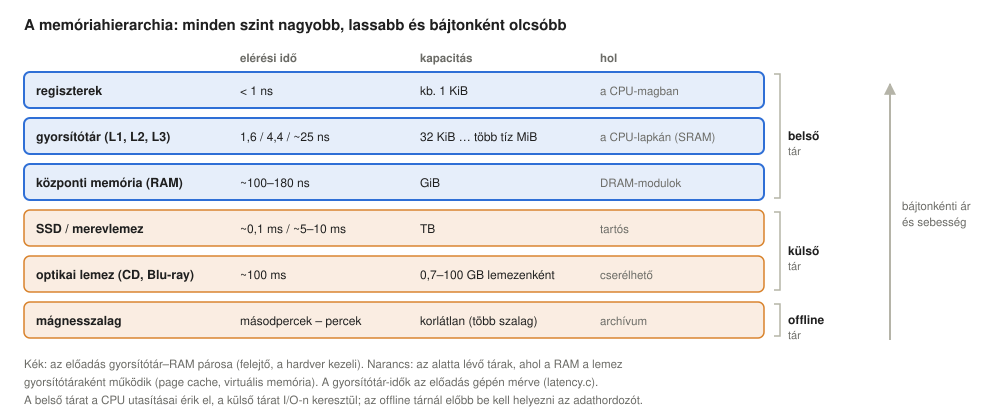
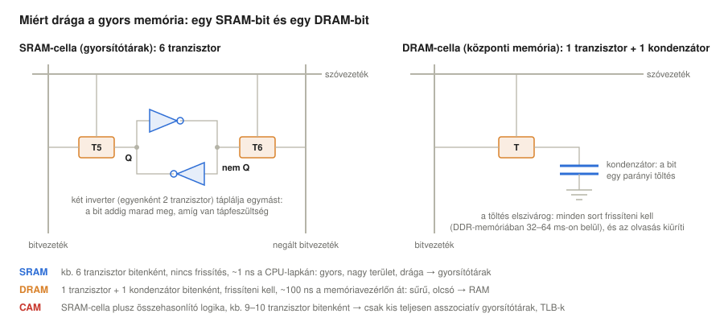
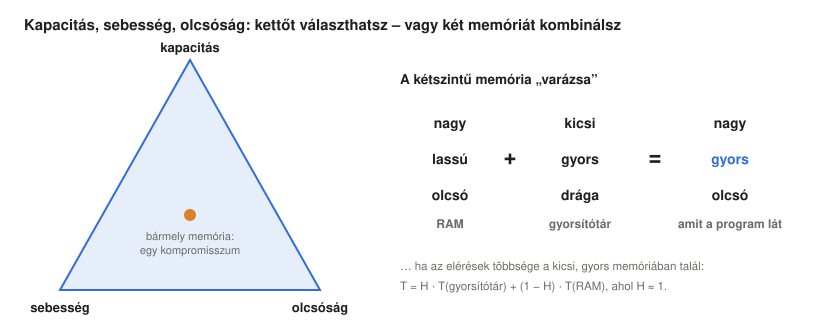
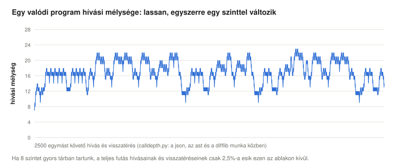
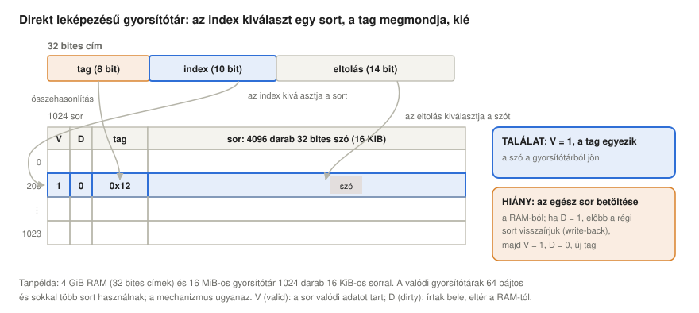
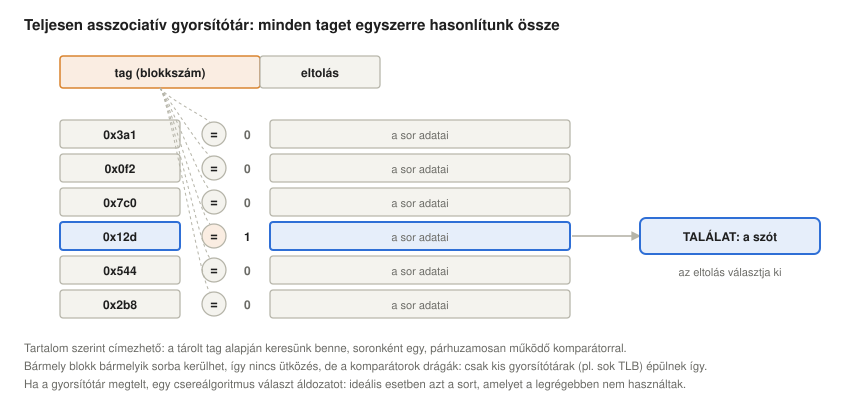
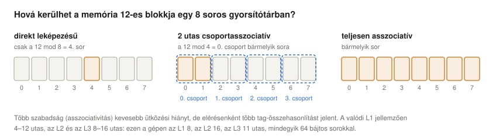
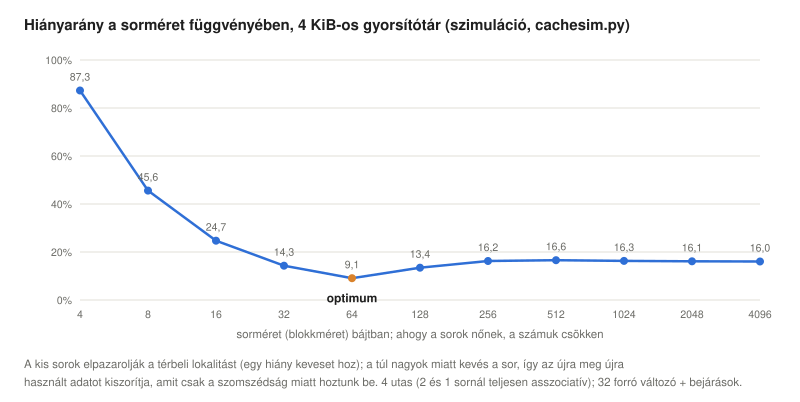
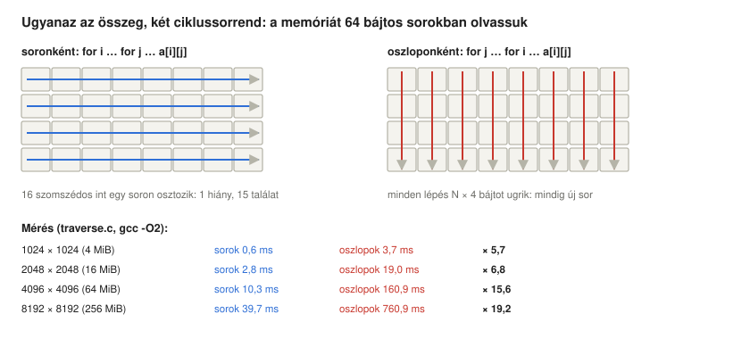
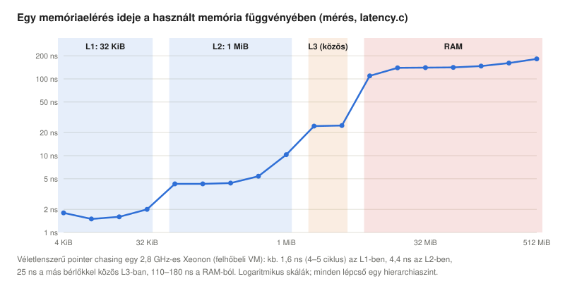

# Kétszintű memóriák és gyorsítótárak

*Operációs rendszerek előadás: miért látszik az egész rendszer nagynak és gyorsnak, ha egy nagy, lassú memória elé egy kicsi, gyorsat teszünk; hogyan találja meg a gyorsítótár az adatait (direkt leképezésű, teljesen asszociatív, csoportasszociatív szervezés); melyik sort kell kidobni; és hogyan írjunk olyan programot, amelyet a gyorsítótár „szeret”*

Előző: [Párhuzamosság, holtpontok, folyamatállapotok és a Linux ütemezése](../06-concurrency-deadlocks-scheduling/). Következő: [Virtuális memória](../08-virtual-memory/).

> **Hogyan olvasd ezt az előadást?** Ahol új rövidítés vagy fogalom jelenik meg, utána egy **Egyszerűen elmagyarázva** feliratú doboz következik. Kattints rá, és kinyílik egy köznapi nyelvű magyarázat. Ha már ismered a fogalmakat, nyugodtan átugorhatod ezeket a dobozokat.

## Tanulási célok

Az [utasítás-végrehajtási ciklusról szóló előadás](../04-fetch-execute-cycle/) feltételezte, hogy a CPU minden lépésben ki tud olvasni a memóriából egy utasítást vagy egy adatszót. A valóságban a központi memória százszor lassabb a CPU-nál. Ez az előadás azt mutatja meg, hogyan rejtik el a számítógépek ezt a különbséget egy **kétszintű memóriával**: egy nagy, lassú memória (a RAM) elé egy kicsi, gyors memóriát (a gyorsítótárat, angolul cache) tesznek. Megmutatja azt is, miért tér vissza ugyanez az ötlet a RAM és a lemez között, amire a virtuális memóriáról szóló későbbi előadások épülnek.

Az előadás végére a hallgatók képesek lesznek:

- leírni a memóriahierarchiát (regiszterek, gyorsítótár, RAM, lemezek, szalag) elérési idő, kapacitás és ár szerint, csoportosítani belső, külső és offline tárakra, és megmagyarázni, miért nem lehet egyetlen memória egyszerre nagy, gyors és olcsó, egészen egy SRAM- és egy DRAM-cella tranzisztoraiig;
- kiszámítani egy kétszintű memória átlagos elérési idejét a találati arányból, mindkét szokásos alakjában, és megmagyarázni, miért kell a találati aránynak nagyon közel lennie 1-hez;
- kimondani a lokalitás elvét, megkülönböztetni az időbeli és a térbeli lokalitást, és megmagyarázni, miért rendelkeznek a programok ezekkel;
- felsorolni egy gyorsítótár tervezési paramétereit; felbontani egy címet tag, index és eltolás (offset) mezőkre, és végigkövetni egy találatot és egy hiányt egy direkt leképezésű gyorsítótárban, az érvényességi és a módosítási (dirty) bittel, valamint a visszaíró (write-back) és az átíró (write-through) stratégiával együtt;
- elmagyarázni a teljesen asszociatív és a csoportasszociatív gyorsítótárat, a hiányok három fajtáját és a csereálgoritmusokat (LRU, FIFO, véletlen, öregítés, Bélády optimuma);
- megmagyarázni, miért létezik optimális sorméret, és hogyan befolyásolja a teljesítményt az előbetöltés és a többmagos koherencia (hamis megosztás);
- gyorsítótár-barát ciklusokat és adatszerkezeteket írni, és mérni a gyorsítótár hatásait Linuxon.

<details>
<summary><b>Egyszerűen elmagyarázva:</b> memória, RAM, gyorsítótár (cache), regiszter, találat, hiány, késleltetés</summary>

- **Memória:** itt tartja a számítógép azokat a programokat és adatokat, amelyekkel éppen dolgozik. A **RAM** (random-access memory, tetszőleges elérésű memória) a központi memória: nagy, de a CPU-hoz képest lassú, és kikapcsoláskor mindent elfelejt.
- **Gyorsítótár (cache):** kicsi, nagyon gyors memória, amely a legutóbb használt adatok másolatát tartja, hogy a CPU-nak ne kelljen minden alkalommal a RAM-ra várnia. Olyan, mint egy íróasztal a könyvtár mellett: a könyvek, amelyeket éppen használsz, ott maradnak az asztalon.
- **Regiszter:** az a néhány apró tárolóhely magában a CPU-ban, ami a leggyorsabb mind közül.
- **Találat, hiány:** találat, ha az adat megvan a gyorsítótárban; hiány, ha nincs meg, és a lassabb memóriából kell elhozni.
- **Késleltetés:** az a várakozási idő, ami az adat kérése és megérkezése között eltelik.

</details>

## A memóriahierarchia

Nincs olyan memóriatechnológia, amely egyszerre nagy, gyors és olcsó. A leggyorsabb memóriák a processzorlapkába vannak beépítve, ahol kevés a hely; a legnagyobbak mechanikusak vagy mágnesesek, és lassúak. A számítógépek ezért memóriák **hierarchiáját** használják:



Minden szint nagyobb és lassabb a fölötte lévőnél: regiszterek (jóval egy nanoszekundum alatt, kevesebb mint egy kilobájt), gyorsítótárak (nanoszekundumok, kilobájtoktól megabájtokig), RAM (nagyjából száz nanoszekundum, gigabájtok), lemezek (SSD-nél mikroszekundumok, merevlemeznél milliszekundumok, terabájtok) és szalagos archívumok (másodpercektől percekig, gyakorlatilag korlátlan kapacitás). A szintek közötti nagyságrendi különbség a lényeg, és az előadás gépén végzett mérések ([Linux-szakasz](#a-hierarchia-mérése)) ezt világosan mutatják: körülbelül 1,6 ns az első szintű gyorsítótárra, 4,4 ns a másodikra, nagyjából 25 ns a harmadikra és 110–180 ns a RAM-ra. Az évtizedek során a processzorok sokkal gyorsabban lettek gyorsabbak, mint ahogy a DRAM válaszideje csökkent: egy 2,8 GHz-es CPU több száz utasítást hajt végre annyi idő alatt, amennyi egyetlen véletlenszerű RAM-elérés. Wulf és McKee (1995) ezt **memóriafalnak** (memory wall) nevezte, és arra figyelmeztettek, hogy mivel a különbség exponenciálisan nő, idővel még a nagyon magas találati arányú gyorsítótárak mellett is ideje nagy részében a memóriára fog várni a processzor. (Maga a DRAM-lapka egy nyitott sorból körülbelül 10–15 ns alatt szolgáltat egy oszlopnyi adatot; az itt mért 100 ns feletti érték egy olyan betöltés teljes útja, amely az összes gyorsítótárban hiányt okoz: a gyorsítótár-keresések, a memóriavezérlő és egy DRAM-sor megnyitása.)

A felső szintek (regiszterek, gyorsítótár, RAM) **felejtők** (volatile), és a CPU utasításai közvetlenül címezhetik őket; az alsók **tartósak** (persistent), és az operációs rendszer I/O-műveletein keresztül érhetők el. A bájtonkénti ár fentről lefelé meredeken esik, a kapacitás pedig nő.

Stallings (2016) az ábra három csoportját aszerint nevezi el, hogyan éri el őket a processzor. A **belső memóriát** (inboard memory: regiszterek, gyorsítótár, központi memória) a CPU utasításai közvetlenül címzik. A **külső tár** (outboard storage: merevlemezek, SSD-k, optikai lemezek) I/O-vezérlőkön keresztül csatlakozik, és csak I/O-műveletekkel érhető el, amelyeket az operációs rendszer végez. Az **offline tárat** (off-line storage: mágnesszalag, egy páncélszekrényben őrzött cserélhető adathordozók) előbb egy embernek vagy egy robotnak be kell helyeznie egy meghajtóba. A hierarchiában lefelé haladva a bitenkénti költség csökken, a kapacitás és az elérési idő nő, és ami a legfontosabb, **csökken az, hogy a processzor milyen gyakran fordul az adott szinthez**: a szintek csak azért tudnak együttműködni, mert a programok a felső szinteket sokkal gyakrabban használják, mint az alsókat; erről szól a következő két szakasz. Ugyanez a kétszintű számítás érvényes bármely két szomszédos szintre, egy archívumban például egy szalagos könyvtár elé tett lemezre is.

<details>
<summary><b>Egyszerűen elmagyarázva:</b> hierarchia, ns, KiB/MiB/GiB, SRAM, DRAM, felejtő, tartós, SSD, memóriafal, belső, külső és offline tár</summary>

- **Hierarchia:** szintekbe rendezés, fentről lefelé.
- **ns** (nanoszekundum): a másodperc egymilliárdod része. A fény egy nanoszekundum alatt körülbelül 30 cm-t tesz meg.
- **KiB, MiB, GiB:** nagyjából ezer, egymillió, egymilliárd bájt (pontosan 1024, 1024², 1024³).
- **SRAM, DRAM:** kétféle memórialapka. Az SRAM (statikus) gyors és drága, ebből készülnek a gyorsítótárak; a DRAM (dinamikus) lassabb, olcsóbb és sűrűbb, ebből készül a központi memória.
- **Felejtő / tartós:** a felejtő memória áram nélkül elveszíti a tartalmát; a tartós tár (lemezek, SSD-k, szalag) megőrzi.
- **SSD** (solid-state drive, félvezetős meghajtó): flashmemória-lapkákból épített „lemez”, sokkal gyorsabb a forgó merevlemeznél.
- **Memóriafal:** az egyre nagyobb szakadék aközött, hogy a processzorok milyen gyorsan számolnak, és hogy a memória milyen gyorsan tudja szállítani az adatot.
- **Belső, külső, offline tár:** a memória, amelyet a CPU utasításai közvetlenül elérnek (regiszterek, gyorsítótár, RAM); a tár, amelyet bemeneten/kimeneten (I/O-n) keresztül érünk el (lemezek); és a tár, amelyet előbb be kell tenni egy meghajtóba (a polcon álló szalagok).

</details>

### Miért drága a gyors memória

Az árkülönbségeknek fizikai oka van: hány alkatrész kell egy bithez, és hol lehet ezeket megépíteni.



- Az **SRAM**-cella (statikus RAM, ebből készülnek a gyorsítótárak és a regiszterek) egy bitet két, egymást tápláló inverterben tárol, ez egy négy tranzisztorból álló flip-flop, és ehhez jön még két hozzáférési tranzisztor, amely a cellát egy bitvezeték-párra kapcsolja, amikor a sorának szóvezetékét kiválasztják: **bitenként hat tranzisztor**. A bit addig marad meg, amíg van tápfeszültség, nem kell frissíteni, és egy nanoszekundumon belül kiolvasható, a cella viszont nagy területet foglal a drága processzorlapkán.
- A **DRAM**-cella (dinamikus RAM, ebből készül a központi memória) **egy tranzisztor és egy kondenzátor**: a bit egy parányi elektromos töltés. A töltés elszivárog, ezért a memóriavezérlőnek minden sort rendszeresen **frissítenie** kell (az összes sort 64 ms-on belül a DDR3 és a DDR4, 32 ms-on belül a DDR5 esetén), az olvasás pedig kiüríti a kondenzátort, így a kiolvasott sort vissza kell írni. A DRAM ezért sokszor sűrűbb és bitenként olcsóbb, de lassabb, és más gyártási eljárással, külön lapkákon készül, távol a processzortól (Hennessy & Patterson, 2019; Jacob et al., 2008).
- A **tartalom szerint címezhető** cella, amelyre az alább tárgyalt teljesen asszociatív gyorsítótáraknak van szükségük, egy SRAM-cella plusz összehasonlító logika: bitenként 9 vagy 10 tranzisztor (Pagiamtzis & Sheikholeslami, 2006), ezért maradnak kicsik az ilyen gyorsítótárak.

<details>
<summary><b>Egyszerűen elmagyarázva:</b> tranzisztor, inverter, flip-flop, kondenzátor, frissítés, szóvezeték, bitvezeték</summary>

- **Tranzisztor:** apró elektronikus kapcsoló; egy processzorlapkán milliárdnyi van belőle.
- **Inverter:** olyan áramkör, amely az 1-ből 0-t, a 0-ból 1-et csinál. Ha kettőt körbe kötünk, egymás értékét tartják fenn, mint két ember, akik közül mindegyik mindig az ellenkezőjét mondja annak, amit a másik mondott: ez a hurok a **flip-flop**, és egy bitet jegyez meg.
- **Kondenzátor:** olyan alkatrész, amely egy kis elektromos töltést tárol, mint egy apró vödör áram; ha tele van, az 1, ha üres, a 0.
- **Frissítés:** a vödör szivárog, ezért rendszeresen, másodpercenként sokszor újra kell tölteni, különben a bit elvész.
- **Szóvezeték, bitvezeték:** a memórialapka vezetékei: a szóvezeték kiválasztja a cellák egy sorát, a bitvezetékeken jutnak be és ki a bitek.

</details>

## A kétszintű memória varázsa

A dilemma egy háromszöggel ábrázolható: **kapacitás**, **sebesség** és **olcsóság**. Minden egyes memória egy pont a háromszögön belül, egy kompromisszum. A trükk az, hogy két memóriát kombinálunk:



Egy nagy, lassú, olcsó memória (a RAM) és egy kicsi, gyors, drága memória (a gyorsítótár) együtt a program szemszögéből úgy viselkedik, mint egy nagy, gyors, olcsó memória, **feltéve, hogy szinte minden elérést a kicsi szolgál ki**. Ha az elérések $H$ hányada (a **találati arány**) megtalálható a $T_C$ idő alatt válaszoló gyorsítótárban, a többinek pedig a $T_{RAM}$ idő alatt válaszoló RAM-hoz kell fordulnia, akkor az átlagos elérési idő

$$T = H \cdot T_C + (1 - H) \cdot T_{RAM}$$

A **hiányarány** $M = 1 - H$. Ha a gyorsítótár csak háromszor gyorsabb a RAM-nál ($T_C = 3$ ns, $T_{RAM} = 10$ ns), és a találati arány 95%, akkor $T = 3{,}35$ ns: majdnem olyan gyors, mint a gyorsítótár. Egy valódi gépen mért aránnyal a kép kevésbé kedvező ([Linux-szakasz](#mennyit-számít-a-találati-arány)): ha a gyorsítótár 4,4 ns, a RAM 140 ns alatt válaszol, akkor 95%-os találati arány mellett 11,2 ns adódik, két és félszer lassabb a gyorsítótárnál, és még 99% mellett is körülbelül 30%-kal lassabb marad. A valódi gyorsítótárak a tipikus programoknál valóban 95–99%-os vagy még nagyobb találati arányt érnek el (Hennessy & Patterson, 2019).

**A képlet két alakja.** A fenti képlet egy hiányért csak a RAM idejét számolja fel. Ez akkor helyes, ha a RAM-hoz a gyorsítótárral egy időben fordulunk (ez a **look-aside**, „mellette kérdező” szervezés, ahol találat esetén a RAM-elérést egyszerűen eldobjuk), vagy ha $T_{RAM}$-on egy hiány teljes idejét értjük. A szokásos **look-through**, „rajta át kérdező” szervezésben először a gyorsítótárat nézzük meg, és csak a hiányt adjuk tovább a lassabb szintnek. Ekkor egy hiány a sikertelen keresés $T_1$ idejébe plusz a második szint $T_2$ elérési idejébe kerül, az átlag pedig (Stallings, 2016)

$$T = H \cdot T_1 + (1 - H) \cdot (T_1 + T_2) = T_1 + (1 - H) \cdot T_2$$

A második alak $T_1$ kiemelésével adódik: $H \cdot T_1 + (1 - H) \cdot T_1 = T_1$. Egyszerűen olvasható: minden elérés megfizeti a gyorsítótárat, a hiányok hányada pedig a lassabb szintet is. Sok tankönyv $T = T_C + M \cdot T_{penalty}$ alakban írja, ahol a **hiánybüntetés** $T_{penalty} = T_2$. A két alak csak abban különbözik, hogy mit számítunk egy hiány idejébe, így magas találati arány mellett az eredmények alig térnek el: $T_1$ = 3 ns, $T_2$ = 10 ns és $H$ = 95% esetén a look-through alak $3 + 0{,}05 \cdot 10 = 3{,}5$ ns-ot ad 3,35 ns helyett, a mért 4,4 és 140 ns-mal pedig 11,4 ns-ot 11,2 ns helyett. Az alábbi többszintű képlet a look-through alakot használja, mert a valódi gyorsítótárszinteket egymás után nézzük meg.

És mekkora a gyorsítótár? Jellemzően a RAM **0,1%**-ának nagyságrendjébe esik: $Cap_C \cdot 1000 \approx Cap_{RAM}$. Az alább használt gépnek 33 MiB utolsó szintű gyorsítótára és 8 GiB RAM-ja van, ez 0,4%-os arány; egy 32 MiB gyorsítótárral és 32 GiB RAM-mal rendelkező szerver pontosan 0,1%-on áll. Az az igazi varázslat, hogy egy ezerszer kisebb memória az összes elérés 95–99%-át ki tudja szolgálni – és ez magyarázatra szorul.

Több gyorsítótárszint esetén a képletet szintenként alkalmazzuk: az L1-beli hiány az L2-höz megy, az L2-beli hiány az L3-hoz, és így tovább. Minden szintnek csak a fölötte lévő szint hiányainak nagy részét kell elkapnia. Az „előbb megnézzük” alakban, minden szint **lokális** $m_i$ hiányarányával (az adott szintig *eljutó* elérések közül ott hiányt okozók hányada):

$$T = T_{L1} + m_{L1} \cdot \bigl(T_{L2} + m_{L2} \cdot (T_{L3} + m_{L3} \cdot T_{RAM})\bigr)$$

Az alább mért késleltetésekkel (1,6, 4,4, 25 és 140 ns) és 95%, 80% és 50% lokális találati aránnyal $T = 1{,}6 + 0{,}05 \cdot (4{,}4 + 0{,}2 \cdot (25 + 0{,}5 \cdot 140)) \approx 2{,}8$ ns, pedig az L3 csak a hozzá eljutó elérések felét fogja el: a $0{,}05 \cdot 0{,}2 \cdot 0{,}5 = 0{,}005$ szorzat (0,5%) a **globális** hiányarány, az összes elérésnek az a hányada, amely a RAM-ig jut.

<details>
<summary><b>Egyszerűen elmagyarázva:</b> találati arány, hiányarány, átlagos elérési idő, hiánybüntetés, look-aside, look-through, gyorsítótárszint (L1, L2, L3)</summary>

- **Találati arány (H):** az elérések azon része, amelyet a gyorsítótárban megtalálunk, például 0,95 = 95%. **Hiányarány (M):** a maradék, 1 − H.
- **Átlagos elérési idő:** mennyibe kerül átlagosan egy memóriaelérés, a gyors találatokat és a lassú hiányokat együtt számolva.
- **Hiánybüntetés:** az a többletidő, amibe egy hiány kerül.
- **Look-aside, look-through:** kétféle mód, ahogy a két memóriát megkérdezzük. A look-aside egyszerre kérdezi mindkettőt, és azt a választ használja, amelyik jó; a look-through először a gyorsítótárat kérdezi, és csak akkor megy a RAM-hoz, ha a gyorsítótárban nincs meg az adat, mint amikor előbb az asztalodon nézel körül, mielőtt átsétálnál a könyvtárba.
- **L1, L2, L3:** a gyorsítótár szintjei. Az L1 a legkisebb és leggyorsabb, a legközelebb van a CPU-maghoz; az L3 a legnagyobb és leglassabb, és általában a lapka összes magja közösen használja.

</details>

## Miért működik: a hivatkozási lokalitás

A programok nem véletlenszerűen érik el a memóriát. **Lokalitással** (hivatkozási lokalitással) rendelkeznek: bármely rövid időszakban a memóriájuknak csak egy kis részét használják, és ez a rész lassan változik (Denning, 2005). Ennek négy fő oka van (Stallings, 2016):

1. **A Neumann-elv: a kód szekvenciális.** Az utasításszámláló a legtöbb utasítás után egyszerűen eggyel nő (`PC++`), így a következő utasítás szinte mindig közvetlenül az aktuális után következik. Az ugrások a kivételek, és a legtöbbjük rövid.
2. **Az egymásba ágyazott hívások szűk sávban maradnak.** A programok függvényeket hívnak, azok további függvényeket, de a hívási mélység lassan, egyszerre egy szinttel változik, és hosszú ideig néhány szinten belül vándorol fel-le. A Berkeley RISC processzorokhoz végzett programvizsgálatok ezt tapasztalták, és erre építették a **regiszterablakokat**: a CPU az utolsó néhány hívási szint regisztereit a lapkán tartja, és csak az ablakon kívülre eső hívás vagy visszatérés igényel lassú átvitelt a memóriába; 8 ablakkal erre a hívások és visszatérések csak körülbelül 1%-ánál volt szükség (Stallings, 2016, a csökkentett utasításkészletű számítógépekről szóló fejezet; a fenti négy ok Stallings kétszintű memóriák teljesítményéről szóló függelékét követi). Az alábbi mérés hasonló képet talál egy mai Python-programban: 8 szintes ablaknál a hívások és visszatérések 2,5%-a esik kívülre ([Linux-szakasz](#a-hívási-mélység-mérése)).
3. **A hosszú ciklusok ritkák.** Az idő nagy része rövid ciklusokban telik, amelyek ugyanazt a néhány utasítást hajtják végre újra meg újra.
4. **A legtöbb adatszerkezet szekvenciális.** A tömbök, karakterláncok, rekordok és a verem folytonosan helyezkednek el, és gyakran elemről elemre dolgozzuk fel őket.

Ezek az okok kétféle lokalitást eredményeznek:

- **Időbeli lokalitás:** amit nemrég használtunk, azt valószínűleg hamarosan újra használni fogjuk (a ciklus utasításai, a ciklusszámlálók, a verem teteje). A gyorsítótár ezt úgy használja ki, hogy **megtartja** a nemrég használt adatokat.
- **Térbeli lokalitás:** ami egy éppen használt dolog mellett van, azt valószínűleg hamarosan használni fogjuk (a következő utasítás, a következő tömbelem). A gyorsítótár ezt úgy használja ki, hogy minden hiánykor a szomszédos bájtok egész **sorát** (blokkját) tölti be, nem csak a kért szót.



A lokalitás a programok tulajdonsága, nem a hardveré, ezért a programozó le is ronthatja, ahogy a [Meyers-példa](#gyorsítótár-barát-kód-írása) mutatja, vagy javíthatja is.

<details>
<summary><b>Egyszerűen elmagyarázva:</b> lokalitás, Neumann-elv, utasításszámláló, hívási mélység, regiszterablak, ciklus, időbeli lokalitás, térbeli lokalitás, sor/blokk</summary>

- **Hivatkozási lokalitás:** a programok hajlamosak ugyanazt a néhány dolgot újra és újra használni (mint az asztalos azt a néhány szerszámot, amelyet a munkapadon tart), és az egymás mellett lévő dolgokat.
- **Neumann-elv:** az utasításokat ugyanúgy a memóriában tároljuk, mint az adatokat, és egymás után hajtjuk végre őket.
- **Utasításszámláló (PC, program counter):** az a CPU-regiszter, amely a következő utasítás címét tartalmazza; a `PC++` azt jelenti: „menj tovább a következőre”.
- **Hívási mélység:** hány függvényhívás van éppen nyitva, egymásba ágyazva.
- **Regiszterablak:** egyes processzorokban a legutóbbi függvényhívások számára fenntartott regiszterkészlet, hogy a híváshoz és a visszatéréshez ne kelljen a memóriához fordulni.
- **Ciklus:** a programnak az a része, amely sokszor ismétlődik.
- **Időbeli lokalitás:** most használtuk → valószínűleg hamarosan újra használjuk. **Térbeli lokalitás:** most használtuk → valószínűleg hamarosan a szomszédait is használjuk.
- **Sor (blokk):** az az egység, amelyben a gyorsítótár a RAM-ból adatot tölt be, például egyszerre 64 bájtot.

</details>

## Hogyan találja meg a gyorsítótár az adatait

A gyorsítótár a memória **sorainak** (blokkjainak) másolatát tárolja, azzal a feljegyzéssel együtt, hogy az egyes másolatok a memória melyik részéből származnak. A tervezése három kérdésre felel: hová kerülhet egy blokk, hogyan találjuk meg, és melyik blokkot dobjuk ki, ha hely kell.

Azon túl, hogy a gyorsítótárat virtuális vagy fizikai címekkel indexeljük-e, a tervező hat paraméterről dönt (Stallings, 2016), és az előadás további része ezeket sorra veszi:

1. **A gyorsítótár mérete:** elég nagy a magas találati arányhoz, elég kicsi ahhoz, hogy gyors és megfizethető legyen (a nagyobb gyorsítótár lassabb is, mert a jeleinek messzebbre kell eljutniuk).
2. **Leképezési függvény:** hová kerülhet egy blokk, és így hogyan találjuk meg: direkt leképezésű, teljesen asszociatív vagy csoportasszociatív (ez a szakasz).
3. **Csereálgoritmus:** melyik sor távozik, ha újra van szükség ([alább](#melyik-sort-dobjuk-ki)).
4. **Írási stratégia:** átíró vagy visszaíró, és mi történik írási hiánykor ([alább](#a-direkt-leképezésű-gyorsítótár)).
5. **Sorméret:** hány bájtot töltünk be egy hiánykor ([a sorméret megválasztása](#a-sorméret-megválasztása)).
6. **A gyorsítótárak száma:** hány szint van, és egy szint **egyesített** (unified), vagy külön utasítás- és adatgyorsítótárra **osztott** (split) ([gyorsítótárak egy valódi gépben](#gyorsítótárak-egy-valódi-gépben)).

### A direkt leképezésű gyorsítótár

A legegyszerűbb szervezés a **direkt leképezésű** gyorsítótár. Kerek számokkal dolgozó tanpéldaként legyen 4 GiB RAM, így egy bájtcím 32 bites, és legyen a gyorsítótárban 1024 sor, mindegyikben 4096 darab 32 bites szó (16 KiB), összesen 16 MiB. A címet három mezőre vágjuk:

- az **eltolás** (offset; 14 bit, mert egy sor $2^{14}$ = 16 KiB) a soron belüli bájtot választja ki;
- az **index** (10 bit, mert $2^{10}$ = 1024 sor van) azt az egyetlen sort választja ki, ahol ez a blokk lehet;
- a **tag** (címke; a maradék 8 bit) megmondja, hogy az ezen a soron osztozó $2^8 = 256$ blokk közül melyik van ott valójában.



Minden sorhoz két állapotbit is tartozik:

- **V (valid, érvényességi bit):** 0 azt jelenti, hogy a sor még nincs betöltve (szemetet tartalmaz, például közvetlenül bekapcsolás után); 1 azt, hogy valódi másolatot tartalmaz.
- **D (dirty, módosítási bit):** 1 azt jelenti, hogy a CPU írt a másolatba, és az eltér a RAM tartalmától.

**Olvasás**: az index kiválasztja a sort; ha V = 1, és a tárolt tag megegyezik a cím tagjével, akkor **találat** van, és az eltolás kiválasztja a szót a sorból. Különben **hiány** van: ha a sor módosított (dirty), a régi tartalmát először visszaírjuk a RAM-ba; aztán a teljes új sort betöltjük a RAM-ból, eltároljuk a taget, V-t 1-re, D-t 0-ra állítjuk, és kiadjuk a szót. Egy kidolgozott példa a `cachesim.py` segítségével: a `0x12345678` cím tagje `0x12`, indexe 209, eltolása `0x1678`, ez a sor 1438. szava ([Linux-szakasz](#gyorsítótár-szimulátor)).

**Egy kisebb példa, kézzel végigkövetve.** Maradjanak a 32 bites bájtcímek és az 1024 sor, de minden sor egyetlen 32 bites szót, 4 bájtot tartalmazzon: a gyorsítótár így 4 KiB-os. Az eltolás 2 bitre zsugorodik ($2^2$ = 4 bájt soronként), az index 10 bit marad ($2^{10}$ = 1024 sor), a tag pedig 20 bitre nő: $2^{20}$ RAM-blokk osztozik minden soron. A `0x00004082` cím felbontása:

| tag (20 bit) | index (10 bit) | eltolás (2 bit) |
|---|---|---|
| `0000 0000 0000 0000 0100` = `0x00004` | `00 0010 0000` = 32 | `10` = 2 |

a bájt tehát a 32. sor harmadik bájtja (2-es eltolás), és az elérés akkor találat, ha a 32. sorban V = 1, és a tárolt tag `0x00004`. A `0x00005082` cím csak a tagben tér el: ugyanarra a 32. sorra képeződik, így a két cím kiszorítja egymást, ez ütközés; a `0x00004084`, a következő szó, a 33. sorba kerül. A mezők szélessége mindig számolásból adódik: $2^{30}$ bájthoz 30 címbit kell (1 GiB), $2^{32}$ bájthoz 32 bit (4 GiB), és azok a bitek, amelyeket az eltolás és az index nem használ, alkotják a taget. (Az ilyen egyszavas sorok miatt a példát könnyű végigkövetni, de elpazarolják a térbeli lokalitást; lásd [a sorméretet](#a-sorméret-megválasztása).) A `cachesim.py small` kiírja ezeket a felbontásokat ([Linux-szakasz](#gyorsítótár-szimulátor)).

Az **írásokhoz** stratégia kell:

- **Átíró (write-through):** minden írás a gyorsítótárba és a RAM-ba is eljut. Egyszerű, a RAM mindig naprakész, de minden írás egy RAM-elérésbe kerül (ezt általában egy írási puffer tompítja).
- **Visszaíró (write-back):** az írás csak a gyorsítótárba kerül, és D = 1 lesz; a RAM csak akkor frissül, amikor a módosított sort kiszorítjuk. Kevesebb RAM-írás, ezért használja a legtöbb mai gyorsítótár, cserébe a hiány kezelése bonyolultabb, és a RAM átmenetileg elavult (ami a DMA és a többi mag szempontjából számít, lásd alább a koherenciát).

És mi történik, ha egy írás **hiányt** okoz? Az **írásra foglaló** (write-allocate) gyorsítótár előbb betölti a sort, majd beleír (ez a visszaíró stratégia szokásos párja: az ugyanarra a sorra eső későbbi írások találatot adnak); a **nem foglaló** (no-write-allocate) gyorsítótár az írást egyenesen a RAM-nak küldi, és a gyorsítótárat nem bántja (ez az átíró stratégia szokásos párja). Ezért jelent az alább bemutatott cachegrind írásokra is hiányokat.

**Miért van középen az index?** A gyorsítótárak a címet *tag | index | eltolás* sorrendben bontják fel, az index tehát középen van, nem a legfelső biteken. Ez a sorrend nem mellékes részlet. Ha az indexet az eltolás fölötti bitekből vesszük, a memória egymást követő blokkjai egymást követő sorokba kerülnek, így egy program, amely egy a gyorsítótárnál kisebb tömbön halad végig, az egészet bent tarthatja. Ha az index a legfelső biteken volna, az összes szomszédos blokk ugyanazon a néhány soron osztozna, és kiszorítanák egymást; a szimulátor megmutatja ennek árát ([Linux-szakasz](#gyorsítótár-szimulátor)). A valódi sorok ráadásul sokkal rövidebbek a tanpélda 16 KiB-jánál: minden mai x86 és a legtöbb ARM processzoron 64 bájtosak, [a sorméretről szóló szakaszban](#a-sorméret-megválasztása) kifejtett okokból.

A direkt leképezésű gyorsítótár egyszerű és gyors: elérésenként egyetlen összehasonlítás. Gyengesége az **ütközés**: két blokk, amelyek címe a gyorsítótár méretének többszörösével tér el, ugyanarra a sorra képeződik le, és kiszorítják egymást, még akkor is, ha a gyorsítótár többi része üres.

<details>
<summary><b>Egyszerűen elmagyarázva:</b> direkt leképezés, cím, bit, mező, eltolás, index, tag, érvényességi bit, módosítási bit, átíró, visszaíró, írási puffer, ütközés, leképezési függvény, egyesített és osztott gyorsítótár</summary>

- **Direkt leképezés:** a memória minden blokkjának pontosan egy helye van a gyorsítótárban, ahová kerülhet, mint a ruhatárban, ahol a számod dönti el, melyik fogasra kerül a kabátod.
- **Cím:** egy bájt sorszáma a memóriában. **Bit:** egy 0 vagy 1; egy 32 bites cím 32 bitből áll. A **mező** bitek olyan csoportja, amelynek saját jelentése van.
- **Eltolás (offset):** a soron belül melyik bájt. **Index:** a gyorsítótár melyik sora. **Tag (címke):** a cím többi része, amelyet a sorral együtt tárolunk, és amely megmondja, a memória melyik blokkját tartalmazza éppen a sor.
- **Érvényességi bit:** „ebben a sorban valódi adat van”. **Módosítási (dirty) bit:** „ezt a sort megváltoztatták, és a RAM még nincs frissítve”.
- **Átíró (write-through):** írjunk egyszerre a gyorsítótárba és a RAM-ba. **Visszaíró (write-back):** most csak a gyorsítótárba írjunk, a RAM-ba pedig később, amikor a sor elhagyja a gyorsítótárat.
- **Írási puffer:** kis várakozási sor, amelynek révén a CPU folytathatja a munkát, amíg az írások a RAM felé tartanak.
- **Ütközés:** két blokk ugyanarra a gyorsítótársorra tart igényt, és folyton kiszorítják egymást.
- **Leképezési függvény:** az a szabály, amely megmondja, hogy a memória egy blokkja a gyorsítótár melyik sorában (vagy soraiban) tárolható.
- **Egyesített / osztott gyorsítótár:** egyetlen gyorsítótár az utasításoknak és az adatoknak együtt, vagy két külön gyorsítótár, mindkettőnek egy-egy.

</details>

### A teljesen asszociatív gyorsítótár

Az ellenkező végletben bármely blokk **bármelyik** sorba kerülhet. Ekkor a gyorsítótárnak nincs indexe: a cím csak tagből és eltolásból áll, és egy blokk megtalálásához a gyorsítótár a taget egyszerre hasonlítja össze **az összes** sor tagjével, soronként egy komparátorral. Ez **tartalom szerint címezhető memória** (content-addressable memory, CAM): a tartalma alapján keresünk benne, nem a hely alapján. Minden komparátor előbb a tárolt és a keresett tag bitenkénti **XNOR**-ját (egyenlőségét) képezi, amely minden olyan pozíción 1, ahol a két bit megegyezik, majd ezeknek a biteknek az **ÉS** (AND) kapcsolatát: az eredmény csak akkor 1, ha minden bit egyezik. Például 6 bites tagekkel:

```text
stored tag        100100
searched tag      010100
bitwise XNOR      001111
AND of all bits   0       -> no match
```

Azonos tageknél az XNOR `111111`-et, az ÉS 1-et ad: találat. (Ugyanez XOR-ral: az XOR megjelöl minden eltérő bitet, és a sor akkor egyezik, ha egyetlen bit sincs megjelölve; a CAM-áramkörök pontosan ezt valósítják meg soronként egy közös „egyezésvezetéken” (match line), Pagiamtzis & Sheikholeslami, 2006.)



Ütközések nincsenek, de a komparátorok miatt nagy és sok energiát fogyaszt (tárolt bitenként 9 vagy 10 tranzisztor, [lásd fent](#miért-drága-a-gyors-memória)), ezért így csak kis gyorsítótárakat építenek, például sok olyan TLB-t (translation lookaside buffer, címfordítási gyorsítótár), amely a virtuális memória címfordításait tárolja (a nagyobb TLB-k viszont, a többi gyorsítótárhoz hasonlóan, csoportasszociatívak).

### Csoportasszociatív gyorsítótárak: a kompromisszum

A valódi gyorsítótárak **csoportasszociatívak** (set-associative): a sorok *n* elemű csoportokba (n utas, n-way) rendeződnek, az index egy csoportot választ ki, és a blokk a csoport *n* sorának bármelyikében lehet, így csak *n* taget kell összehasonlítani. Az 1 utas gyorsítótár direkt leképezésű; az egyetlen csoportból álló gyorsítótár teljesen asszociatív.



Az alább használt gépnek 8 utas, 32 KiB-os L1 adatgyorsítótára (64 csoport, csoportonként 8 sor), 16 utas, 1 MiB-os L2-je és 11 utas, 33 MiB-os L3-a van, mind 64 bájtos sorokkal ([Linux-szakasz](#a-mért-gép-gyorsítótárai)).

**A hiányok három fajtája** (Hill & Smith, 1989) megmagyarázza, melyik tervezési döntés mi ellen segít:

- **kötelező** (hideg, compulsory) hiányok: egy blokk első elérése mindig hiány; a nagyobb sorok csökkentik a számukat, mert egy hiány több szomszédot is behoz;
- **kapacitás**hiányok: a program több adatot használ, mint amennyi a gyorsítótárba belefér; csak a nagyobb gyorsítótár segít;
- **ütközési** (conflict) hiányok: az adat elférne, de túl sok blokk képeződik ugyanarra a csoportra; a nagyobb asszociativitás segít.

<details>
<summary><b>Egyszerűen elmagyarázva:</b> teljesen asszociatív, komparátor, tartalom szerint címezhető memória, XNOR és ÉS, TLB, csoport, n utas, kötelező, kapacitás- és ütközési hiány</summary>

- **Teljesen asszociatív:** bármely blokk bárhová kerülhet, mint egy parkolóban számozott helyek nélkül; hogy megtaláld az autódat, az összeset végig kell nézned.
- **Komparátor:** kis áramkör, amely megvizsgálja, hogy két szám egyenlő-e.
- **Tartalom szerint címezhető memória (CAM):** olyan memória, amelytől azt kérdezed: „hol van ez az érték?”, nem pedig azt, hogy „mi van ezen a helyen?”.
- **XNOR, ÉS:** az XNOR két bitet hasonlít össze, és 1-et ad, ha egyenlők; az ÉS (AND) csak akkor ad 1-et, ha minden bemenete 1. Együtt: „minden bit egyenlő?”.
- **TLB** (translation lookaside buffer, címfordítási gyorsítótár): kis gyorsítótár a CPU-ban a virtuális memória címfordításai számára (egy későbbi előadás témája).
- **Csoport, n utas:** a gyorsítótár n sorból álló kis csoportokra oszlik; egy blokk a saját csoportjának bármelyik sorába kerülhet. Középút az „egyetlen fix hely” és a „bárhol” között.
- **Kötelező hiány:** amikor valamit először használunk, az még nem lehet a gyorsítótárban. **Kapacitáshiány:** a gyorsítótár egyszerűen túl kicsi. **Ütközési hiány:** lenne hely, csak nem a megfelelő csoportban.

</details>

### Melyik sort dobjuk ki?

Ha egy hiánynak sor kell, és a csoport (teljesen asszociatív gyorsítótárban az egész gyorsítótár) tele van, egy **csereálgoritmus** választja ki az áldozatot. Az ideális áldozat az a sor, amelyet már régóta senki sem keresett. Egy egyszerű, számlálókon alapuló **öregítési** (aging) eljárás ezt közelíti: minden eléréskor minden sor kora eggyel nő, egy találat pedig megfelezi a megtalált sor korát, így a gyakran használt sorok fiatalok maradnak; a legöregebb sort szorítjuk ki. A szokásos stratégiák:

- **LRU** (least recently used, legrégebben használt): azt a sort szorítjuk ki, amelyet a legrégebben nem használtak. Az időbeli lokalitást követi, de a pontos LRU-hoz az összes sor sorrendjét nyilván kell tartani, ezért a hardver olcsó közelítéseket használ, például fa alapú pszeudo-LRU-t. A fenti öregítéshez hasonló számlálók az operációs rendszerek lapcseréjének klasszikus közelítései, ez a virtuális memóriáról szóló előadás témája. (Ennek az *öregítésnek* semmi köze az ütemezésről szóló előadás prioritás-öregítéséhez.)
- **FIFO** (first in, first out, először be, először ki): azt a sort szorítjuk ki, amelyik a legrégebben van a gyorsítótárban, függetlenül a használattól. Egyszerű, de kidobhat egy állandóan használt sort is.
- **Véletlen**: meglepően versenyképes, és elkerüli az LRU legrosszabb esetét, amikor egy szabályos minta miatt az LRU éppen azt a sort szorítja ki, amelyre legközelebb szükség lesz.
- **OPT** (Bélády algoritmusa): azt a sort szorítjuk ki, amelynek következő használata a legtávolabbi jövőben van. Bizonyíthatóan optimális, de a jövő ismeretét igényli, ezért mércéként szolgál. Bélády László, aki 1928-ban született Budapesten, 1966-ban publikálta, amikor az IBM Researchnél dolgozott (Bélády, 1966). 1969-ben munkatársaival megmutatta, hogy egyes stratégiáknál, például a FIFO-nál, a nagyobb memória *több* hiányt eredményezhet; ezt ma Bélády-anomáliának nevezzük (Bélády et al., 1969).

Nincs olyan stratégia, amely minden terhelésen győzne. A szimulátor ([Linux-szakasz](#gyorsítótár-szimulátor)) mutat egy ciklust, amely kicsit nagyobb a gyorsítótárnál, és ahol az LRU éppen azt a sort dobja ki, amelyre legközelebb szükség lesz (72,7% hiány), a véletlen csere pedig sokkal jobban teljesít (18,2%), és egy másik terhelést, ahol az LRU a legjobb; Bélády optimuma mindkettőn mindegyiket megveri.

<details>
<summary><b>Egyszerűen elmagyarázva:</b> csereálgoritmus, áldozat, LRU, FIFO, öregítés, Bélády algoritmusa, Bélády-anomália</summary>

- **Csereálgoritmus, áldozat:** az a szabály, amely eldönti, melyik sornak kell elhagynia a megtelt gyorsítótárat; a kiválasztott sor az áldozat.
- **LRU:** azt dobjuk ki, amit a legrégebben nem használtunk, mint amikor leszedjük az asztalunkról azokat a könyveket, amelyeket hetek óta ki sem nyitottunk.
- **FIFO** (first in, first out): azt dobjuk ki, ami elsőként érkezett, mint a legrégebbi tejet a hűtőből – akkor is, ha minden nap iszunk belőle.
- **Öregítés:** minden sornak van egy számlálója, amely nő, amíg a sort nem használjuk, és csökken, amikor igen; a legöregebb megy.
- **Bélády algoritmusa (OPT):** azt dobjuk ki, amire a legkésőbb lesz újra szükség. Tökéletes, de ehhez ismerni kellene a jövőt.
- **Bélády-anomália:** FIFO esetén, furcsa módon, ha több helyet adunk a gyorsítótárnak, az több hiányt okozhat.

</details>

## A sorméret megválasztása

Rögzített kapacitású gyorsítótárnál a hiányarány a sor (blokk) méretétől függ. A kis sorok elpazarolják a térbeli lokalitást: minden hiány csak néhány bájtot hoz be. A nagyon nagy sorok az időbeli lokalitást pazarolják el: a rögzített méretű gyorsítótárban ekkor kevés sor van, és az újra meg újra használt adatokat kiszorítják azok a nagy blokkok, amelyeket csak azért töltöttünk be, mert valami mellett voltak. A kettő között van egy **optimum**:



A szimulált terhelés a kétféle lokalitást keveri: 32 gyakran használt változó egy megabájton szétszórva (csak időbeli lokalitás) és egy tömb szekvenciális bejárásai (csak térbeli lokalitás). A hiányarány az egyszavas sorok 87%-áról 64 bájtnál 9,1%-ra esik, aztán újra emelkedik. A nagyobb sorok ráadásul minden hiányt lassabbá is tesznek, mert több bájtot kell átvinni. A sok programon végzett mérések a processzortervezőket ugyanide vezették: ma a 64 bájtos sor a szabvány (Hennessy & Patterson, 2019).

Két klasszikus trükk csökkenti egy hosszú sor hiányának idejét, hogy a CPU-nak ne kelljen az egészre várnia. A **korai újraindításnál** (early restart) a gyorsítótár a sort a szokásos sorrendben tölti be, de a kért szót azonnal továbbadja a CPU-nak, amint megérkezett, miközben a sor többi része tovább érkezik. A **kritikus szó elsőként** (critical word first) módszernél a gyorsítótár előbb a kért szót kéri a memóriától, a többit utána, a sor végén körbefordulva, így a CPU már az első átvitel után folytathatja (Hennessy & Patterson, 2019). Hiány esetén az olvasás tehát két párhuzamos tevékenység: a szó kiadása a CPU-nak és a sor feltöltése a gyorsítótárban. A DDR3 és a DDR4 memória ezt közvetlenül támogatja: egy 64 bájtos sor sorozatos (burst) olvasási átvitele a sor bármelyik 8 bájtos szavával kezdődhet.

<details>
<summary><b>Egyszerűen elmagyarázva:</b> optimum, korai újraindítás, kritikus szó elsőként, sorozatos (burst) átvitel</summary>

- **Optimum:** a legjobb érték két véglet között, itt az a sorméret, amelynél a legkevesebb a hiány.
- **Korai újraindítás:** a CPU folytathatja, amint megérkezett a szava, nem várja meg az egész sort.
- **Kritikus szó elsőként:** azt a szót hozzuk el először, amelyre a CPU vár, és csak utána a sor többi szavát, mint a pincér, aki előbb az italodat hozza ki, a rendelés többi részét pedig utána.
- **Sorozatos (burst) átvitel:** a RAM-ból egymás után következő átvitelek sorozata, amelyet egyetlen kérés indít el.

</details>

## Gyorsítótárak egy valódi gépben

- **Több szint.** Minden magnak saját L1 gyorsítótárai vannak, utasítás- és adatgyorsítótárra osztva (hogy egy utasításlehívás és egy adatelérés ugyanabban az órajelciklusban történhessen), valamint saját L2-je; a lapka magjai közösen használják az L3-at.
- **Előbetöltés (prefetching).** A hardver figyeli az elérési mintát, és a sorokat **még a kérés előtt** betölti, ha meg tudja jósolni őket: egy szekvenciális bejárás következő sorait, az állandó lépésközöket, Intel processzorokon pedig a „pár” sort is, amely egy 128 bájtos blokkot tesz teljessé (Intel, 2024). Az előbetöltés elrejti a szabályos elérési minták késleltetését, de a véletlenszerűeken nem tud segíteni; ezért látja az alábbi mutatókövetés a RAM teljes késleltetését, míg egy szekvenciális bejárás nem.
- **Koherencia.** Ha két mag ugyanazt a sort tartja a gyorsítótárában, és az egyik ír bele, a másik másolata elavul. Egy **gyorsítótár-koherencia protokoll** (például a MESI, amely a sorokat Modified, Exclusive, Shared vagy Invalid, azaz módosított, kizárólagos, megosztott vagy érvénytelen állapotúnak jelöli) az író magot a sor kizárólagos tulajdonosává teszi, a többi másolatot pedig érvényteleníti. A koherencia egész sorokon működik, ebből fakad a **hamis megosztás**: két szál, amely *különböző* változókat ír *ugyanabban* a sorban, folyton elveszi egymástól a sort, holott a programban semmin sem osztoznak ([Linux-szakasz](#hamis-megosztás)). Egy sornak ugyanez a magok közötti pattogása, egyetlen változó *valódi* megosztásával, áll a [párhuzamosságról szóló előadás](../06-concurrency-deadlocks-scheduling/#atomi-műveletek-spinlockok-és-mutexek) lassú, versengő számlálója mögött is.
- **Ugyanez az ötlet egy szinttel lejjebb.** A RAM maga is a gyors szint a lemez számára: az operációs rendszer a nemrég olvasott fájladatokat az egyébként kihasználatlan RAM-ban, a **lapgyorsítótárban** (page cache) tartja, így ugyanannak a fájlnak a második olvasása a memóriából jön ([Linux-szakasz](#a-ram-mint-a-lemez-gyorsítótára)); a virtuális memória, egy későbbi előadás témája, a lemezt használja a RAM lassú szintjeként. A képlet, a lokalitás jelentősége és a csereprobléma ugyanaz; csak a számok változnak, nanoszekundumokról milliszekundumokra.

**Történet.** Maurice Wilkes 1965-ben egy kétoldalas cikkben vetette fel az ötletet **szolgamemória** (slave memory) néven: egy kicsi, gyors memória, amely automatikusan a nagy központi memória legutóbb használt szavainak másolatát tartja (Wilkes, 1965). Az első gyorsítótárral rendelkező kereskedelmi számítógép az IBM System/360 Model 85 volt, amelyet 1968 januárjában jelentettek be 16–32 KiB-os, a mai sorokhoz hasonlóan 64 bájtos blokkokba szervezett gyorsítótárral (Liptay, 1968); a *cache* szó (franciául rejtekhely) hamarosan általános elnevezéssé vált (Smith, 1982, a következő évek terveit tekinti át).

<details>
<summary><b>Egyszerűen elmagyarázva:</b> utasítás- és adatgyorsítótár, megosztott gyorsítótár, előbetöltés, koherencia, MESI, hamis megosztás, lapgyorsítótár, virtuális memória</summary>

- **Utasításgyorsítótár / adatgyorsítótár:** külön gyorsítótár a program utasításainak és azoknak az adatoknak, amelyeken a program dolgozik.
- **Megosztott gyorsítótár:** egyetlen gyorsítótár, amelyet a lapka minden magja használ.
- **Előbetöltés:** az adat elhozása még azelőtt, hogy kérnék, mert a mintából megjósolható – mint a pincér, aki már hozza a következő fogást, mielőtt intenél.
- **Koherencia:** ugyanannak az adatnak a különböző gyorsítótárakban lévő másolatait összhangban tartjuk, hogy egyetlen mag se olvasson elavult értéket. **MESI:** a szokásos protokollban az a négy állapot, amelyben egy sor lehet (Modified, Exclusive, Shared, Invalid: módosított, kizárólagos, megosztott, érvénytelen).
- **Hamis megosztás:** két szál különböző változókat használ, amelyek véletlenül ugyanabban a gyorsítótársorban vannak, és úgy lassítják egymást, mintha ugyanazért a változóért harcolnának.
- **Lapgyorsítótár (page cache):** a RAM-nak az a része, ahol az operációs rendszer a nemrég használt fájladatok másolatát tartja.
- **Virtuális memória:** olyan technika, amely lehetővé teszi, hogy a programok több memóriát használjanak, mint amennyi RAM van, a lemezt használva lassú szintként (egy későbbi előadás témája).

</details>

## Miért fontos ez az operációs rendszernek

A gyorsítótárak hardverek, de az operációs rendszer döntései megváltoztatják a találati arányukat, és egyes feladatai csak miattuk léteznek:

- **A környezetváltások szennyezik a gyorsítótárakat.** Amikor egy folyamat visszakapja a CPU-t, a sorait addigra kiszorította az, aki közben futott. Ez a közvetett költség – nem pedig maga a váltás 1,5 µs-a, amelyet az [ütemezésről szóló előadásban](../06-concurrency-deadlocks-scheduling/#egy-környezetváltás-ára) mértünk – a fő oka annak, hogy az időszeletek milliszekundumos hosszúságúak.
- **Gyorsítótár-affinitást figyelembe vevő ütemezés.** A felébredő feladat azon a magon fut a leggyorsabban, amelynek gyorsítótárai még tartalmazzák az adatait, ezért az ütemező szívesen hagyja a feladatokat ott, ahol legutóbb futottak, és a [terheléskiegyenlítője](../06-concurrency-deadlocks-scheduling/#a-linux-ütemezése) vonakodva mozgatja őket, elsősorban olyan magok között, amelyek közös gyorsítótáron osztoznak.
- **A TLB és a címtartományok.** Egy másik folyamatra váltva megváltoznak a címfordítások, így a régi folyamat TLB-bejegyzései használhatatlanok. A régebbi processzorok minden váltáskor kiürítették a teljes TLB-t; a modernek a bejegyzéseket címtartomány-azonosítóval címkézik (x86-on PCID, process-context identifier; ARM-on ASID, address space identifier), így mindkét folyamat bejegyzései bent maradhatnak.
- **DMA és koherencia.** Amikor egy eszköz DMA-val (közvetlen memória-hozzáféréssel) a memóriába ír, a gyorsítótárakban lévő másolatok elavulnak. x86-on a hardver tartja őket koherensen; sok beágyazott processzoron a meghajtóprogramnak magának kell kiírnia vagy érvénytelenítenie az érintett sorokat, a kernel DMA-interfészén keresztül.
- **Az utolsó szintű gyorsítótár megosztása.** A különböző magokon futó folyamatok versenyeznek a közös L3-ért. Az operációs rendszerek ezt csökkenthetik, ha olyan fizikai lapokat választanak, amelyek a gyorsítótár különböző részeire képeződnek le (*lapszínezés*, page colouring), a modern Intel és AMD processzorok pedig lehetővé teszik, hogy az operációs rendszer az L3-at folyamatcsoportok között felossza (az Intel Cache Allocation Technology, amelyet Linuxon a `resctrl` fájlrendszer kezel). A felhőszolgáltatók ilyen mechanizmusokra támaszkodnak; ez az egyik oka annak, hogy egy virtuális gép kisebb L3-at láthat, mint amekkora a lapkán van, ahogy az alábbi mérésben is.

<details>
<summary><b>Egyszerűen elmagyarázva:</b> gyorsítótár-szennyezés, affinitás, PCID/ASID, lapszínezés, gyorsítótár-particionálás</summary>

- **Gyorsítótár-szennyezés:** egy másik program adatai kiszorították a tieidet a gyorsítótárból, így hiányokkal kezdesz.
- **Affinitás:** egy feladat „ragaszkodása” ahhoz a maghoz, amelyen korábban futott, és ahol az adatai még a gyorsítótárban vannak.
- **PCID, ASID:** kis szám, amely jelzi, melyik folyamathoz tartozik egy TLB-bejegyzés, így a bejegyzéseket nem kell minden váltáskor eldobni.
- **Lapszínezés:** a memórialapokat úgy választjuk, hogy a különböző programok a gyorsítótár különböző részeit használják.
- **Gyorsítótár-particionálás:** minden programcsoport rögzített részt kap a közös gyorsítótárból, így egyik sem tudja az összes többit kiszorítani.

</details>

## Gyorsítótár-barát kód írása

Egy klasszikus példa Scott Meyers *CPU Caches and Why You Care* című előadásából származik (Meyers, 2014). A C és a C++ a kétdimenziós tömböt **soronként** tárolja: `a[i][0]`, `a[i][1]`, … a memóriában szomszédok, míg `a[i][j]` és `a[i+1][j]` között egy teljes sor van. Ha a tömböt soronként összegezzük, szekvenciálisan haladunk végig a memórián, és minden betöltött sor minden bájtját felhasználjuk; ha oszloponként, akkor minden lépésben egy sornyit ugrunk, és minden 64 bájtos sorból egyetlen `int`-et használunk fel, mielőtt továbblépnénk:



A gyorsítótárba beférő kis tömböknél a különbség szerény lehet; az előadás gépén az oszloponkénti ciklus 5,7–19-szer volt lassabb, és a különbség nő, ahogy a tömb kinövi a gyorsítótárakat ([Linux-szakasz](#soronként-vagy-oszloponként)). A pontos szorzó a processzortól, a fordítótól és a tömb méretétől függ, de az irány soha nem változik. Az általános szabályok a lokalitásból következnek:

- **Az adatokat a tárolás sorrendjében járjuk be.** Az egymásba ágyazott ciklusok legbelső ciklusa C/C++-ban az utolsó indexen fusson végig (Fortranban az elsőn, mert ott a tömböket oszloponként tárolják).
- **Részesítsük előnyben a folytonos adatszerkezeteket.** Egy értékeket tartalmazó tömb (`std::vector`) sokkal gyorsabban bejárható, mint a külön-külön lefoglalt csomópontokból álló láncolt lista, amelynél minden lépés potenciális hiány.
- **Ami együtt használatos, legyen együtt**, és válasszuk szét, amit különböző szálak írnak: a szálankénti adatokat töltsük ki 64 bájtra (erre a C++17 a `std::hardware_destructive_interference_size` konstanst kínálja).
- **Dolgozzunk a gyorsítótárba beférő blokkokban.** A nagy mátrixokon dolgozó algoritmusok (szorzás, transzponálás) olyan csempéket dolgoznak fel, amelyek beférnek az L1-be vagy az L2-be (blokkosítás, csempézés).

<details>
<summary><b>Egyszerűen elmagyarázva:</b> kétdimenziós tömb, soronkénti (row-major) tárolás, láncolt lista, kitöltés, csempézés</summary>

- **Kétdimenziós tömb:** számok táblázata sorokkal és oszlopokkal, `a[sor][oszlop]`.
- **Soronkénti tárolás (row-major order):** a táblázatot sorról sorra tároljuk a memóriában, mint egy könyv sorait.
- **Láncolt lista:** különálló adatdarabok lánca, ahol mindegyik a következőre mutat; a darabok bárhol lehetnek a memóriában.
- **Kitöltés (padding):** szándékosan hozzáadott üres bájtok, hogy két adat különböző gyorsítótársorokba kerüljön.
- **Csempézés (tiling, blokkosítás):** egy nagy táblázatot kis négyzetekre bontunk, és egy négyzetet befejezünk, mielőtt a következőt elkezdenénk, így a négyzet a gyorsítótárban marad.

</details>

## Ugyanezek az elvek Linuxon (x86-64)

Az alábbi kimenetek egy valódi rendszerről származnak: egy felhőalapú adatközpontban futó Ubuntu 24.04 virtuális gépről, 2 virtuális CPU-val (Intel Xeon, Cascade Lake család, 2,8 GHz), 8 GiB RAM-mal, Linux 6.18-cal és gcc 13-mal. Egy virtuális gépen más bérlők is osztozhatnak az L3 gyorsítótáron és a memóriasínen, így az abszolút számok futásról futásra változnak; a lépcsők és az arányok a lényegesek.

<details>
<summary><b>Egyszerűen elmagyarázva:</b> konzol, lscpu, sysfs, gcc, -O2, taskset, valgrind/cachegrind, munkahalmaz, mutatókövetés, lépésköz, lap, óriáslap, vektorutasítások, memóriaszintű párhuzamosság, atomi növelés</summary>

- **Konzol** (terminál): ablak, amelybe szövegként gépeljük a parancsokat. A `$` jellel kezdődő sorokat mi gépeljük; a többi sor a számítógép válasza.
- **lscpu:** a processzort leíró parancs. **sysfs** (`/sys`): virtuális fájlok halmaza, amelyekben a Linux-kernel a hardverről közöl információkat.
- **gcc, -O2:** a C-fordító, amelyet a program optimalizálására kérünk.
- **taskset -c 0:** a programot csak a 0. CPU-n futtatjuk, hogy a mérés közben ne kerüljön át egy másik magra.
- **valgrind / cachegrind:** eszköz, amely a programot egy szimulált processzoron futtatja, és megszámolja a gyorsítótár-találatait és -hiányait.
- **Munkahalmaz:** az a memória, amelyet egy program egy adott időszakban használ.
- **Mutatókövetés (pointer chase):** egy lánc követése, amelyben minden elem megmondja, hol van a következő, így minden lépésnek meg kell várnia az előzőt.
- **Lépésköz (stride):** két egymást követő elérés távolsága; az 1-es lépésköz minden elemet jelent, a 16-os minden 16.-at.
- **Lap, óriáslap:** a memóriát lapokban kezeljük, ezek általában 4 KiB-osak; az óriáslap (huge page) 2 MiB-os. Kevesebb, nagyobb laphoz kevesebb címfordítás kell.
- **Vektorutasítások (SIMD):** olyan utasítások, amelyek egyszerre több szomszédos számon végzik el ugyanazt a műveletet.
- **Memóriaszintű párhuzamosság:** a processzor egyszerre több, egymástól független memóriaelérésre vár, így a várakozási idők átfedik egymást.
- **Atomi növelés:** egy változó eggyel növelése egyetlen oszthatatlan lépésként, hogy két mag ne keverhesse össze a frissítéseit.

</details>

### A mért gép gyorsítótárai

A kernel minden gyorsítótárszintet leír a sysfs-ben:

```console
$ for d in /sys/devices/system/cpu/cpu0/cache/index*; do echo "L$(cat $d/level) $(cat $d/type) size=$(cat $d/size) ways=$(cat $d/ways_of_associativity) line=$(cat $d/coherency_line_size) sets=$(cat $d/number_of_sets) shared=$(cat $d/shared_cpu_list)"; done
L1 Data size=32K ways=8 line=64 sets=64 shared=0
L1 Instruction size=32K ways=8 line=64 sets=64 shared=0
L2 Unified size=1024K ways=16 line=64 sets=1024 shared=0
L3 Unified size=33792K ways=11 line=64 sets=49152 shared=0-1
$ getconf LEVEL1_DCACHE_LINESIZE
64
```

Méret = csoportok száma × utak száma × sorméret: az L1-re 64 × 8 × 64 B = 32 KiB; az L3-ra 49 152 × 11 × 64 B = 33 MiB. Az L1 és az L2 gyorsítótár egyetlen maghoz tartozik (`shared=0`), az L3-on mindkét mag osztozik (`0-1`). Ebből adódik a cím felbontása: 64 bájtos soroknál az eltolás 6 bit, és 64 csoportnál az L1 indexe a következő 6 bit. Együtt éppen egy 4 KiB-os lapon belüli eltolás 12 bitjét adják, és ez nem véletlen: az L1 már azelőtt elkezdheti a csoport kikeresését, hogy a virtuális címet fizikai címre fordították volna (*virtuálisan indexelt, fizikailag címkézett* gyorsítótár, virtually indexed, physically tagged). Ezért is nőnek az L1 gyorsítótárak az utak számának, nem pedig a csoportok számának növelésével.

### A hierarchia mérése

A `latency.c` egyetlen memóriaelérés idejét méri annak függvényében, hogy a program mennyi memóriát használ. Egy puffer minden 64 bájtos sorát véletlenszerű sorrendben egy másikhoz láncolja, és végigköveti a láncot: minden elérés az előzőtől függ, így a CPU nem tudja sem átfedni, sem előre betölteni őket, és annak a szintnek a teljes késleltetése látszik, amelyik az adatot tartja:

```console
$ gcc -O2 -o latency latency.c
$ taskset -c 0 ./latency
working set  ns/access
      4 KiB       1.8
      8 KiB       1.5
     16 KiB       1.6
     32 KiB       2.0
     64 KiB       4.3
    128 KiB       4.3
    256 KiB       4.4
    512 KiB       5.4
      1 MiB      10.3
      2 MiB      24.3
      4 MiB      24.7
      8 MiB     109.6
     16 MiB     139.2
     32 MiB     140.3
     64 MiB     141.0
    128 MiB     146.8
    256 MiB     161.0
    512 MiB     182.3
```



A lépcsők maguk a hierarchia: 32 KiB-ig az adat befér az L1-be (körülbelül 1,6 ns, 2,8 GHz-en 4–5 órajelciklus); 1 MiB-ig az L2-be (4,4 ns); aztán jön az L3 (körülbelül 25 ns); néhány MiB fölött a RAM (110–180 ns). Az L3-lépcső jóval a hardver által jelentett 33 MiB alatt véget ér, valószínűleg azért, mert egy felhőbeli virtuális gépen az L3-on ugyanazon a fizikai processzoron futó más bérlők is osztoznak. 8 MiB fölött egy második hatás is hozzáadódik a RAM késleltetéséhez: a szokásos 4 KiB-os lapokkal maguk a címfordítások sem férnek már bele a TLB-be. 2 MiB-os „óriáslapokat” kérve (`./latency huge`) ebben a futásban a legnagyobb munkahalmazok 10–26%-kal gyorsabbak lettek (például 512 MiB-nál 182 helyett 134 ns); erre a virtuális memóriáról szóló előadás visszatér.

### Mennyit számít a találati arány

Az `amat.py` kiértékeli a $T = H \cdot T_C + (1-H) \cdot T_{RAM}$ képletet, először kerek értékekkel egy a RAM-nál háromszor gyorsabb gyorsítótárra, aztán a fent mért L2- és RAM-késleltetéssel:

```console
$ python3 amat.py 3 10
cache 3 ns, main memory 10 ns
  H =  50.0%:  T =    6.50 ns  (  1.5x faster than memory alone,  2.2x slower than the cache)
  H =  80.0%:  T =    4.40 ns  (  2.3x faster than memory alone,  1.5x slower than the cache)
  H =  90.0%:  T =    3.70 ns  (  2.7x faster than memory alone,  1.2x slower than the cache)
  H =  95.0%:  T =    3.35 ns  (  3.0x faster than memory alone,  1.1x slower than the cache)
  H =  98.0%:  T =    3.14 ns  (  3.2x faster than memory alone,  1.0x slower than the cache)
  H =  99.0%:  T =    3.07 ns  (  3.3x faster than memory alone,  1.0x slower than the cache)
  H =  99.9%:  T =    3.01 ns  (  3.3x faster than memory alone,  1.0x slower than the cache)
$ python3 amat.py 4.4 140
cache 4.4 ns, main memory 140 ns
  H =  50.0%:  T =   72.20 ns  (  1.9x faster than memory alone, 16.4x slower than the cache)
  H =  80.0%:  T =   31.52 ns  (  4.4x faster than memory alone,  7.2x slower than the cache)
  H =  90.0%:  T =   17.96 ns  (  7.8x faster than memory alone,  4.1x slower than the cache)
  H =  95.0%:  T =   11.18 ns  ( 12.5x faster than memory alone,  2.5x slower than the cache)
  H =  98.0%:  T =    7.11 ns  ( 19.7x faster than memory alone,  1.6x slower than the cache)
  H =  99.0%:  T =    5.76 ns  ( 24.3x faster than memory alone,  1.3x slower than the cache)
  H =  99.9%:  T =    4.54 ns  ( 30.9x faster than memory alone,  1.0x slower than the cache)
```

3-as sebességarány mellett már a 90%-os találati arány is jó. 32-es aránynál, mint a valódi gépen, minden százaléknyi hiány sokba kerül: ha 95%-ról 99%-ra lépünk, az átlagos elérési idő a felére csökken. Ezért van a gyorsítótáraknak több szintjük, és ezért lehetnek a jó lokalitású programok sokszor gyorsabbak a rossz lokalitásúaknál.

### Soronként vagy oszloponként

A `traverse.c` egy N × N méretű `int` tömböt kétszer összegez, először soronként, aztán oszloponként:

```console
$ gcc -O2 -o traverse traverse.c
$ for n in 1024 2048 4096 8192; do taskset -c 0 ./traverse $n; done
 1024 x 1024  (   4 MiB)  row by row     0.6 ms   column by column     3.7 ms   ratio  5.7  (sum 2145386496)
 2048 x 2048  (  16 MiB)  row by row     2.8 ms   column by column    19.0 ms   ratio  6.8  (sum 17171480576)
 4096 x 4096  (  64 MiB)  row by row    10.3 ms   column by column   160.9 ms   ratio 15.6  (sum 137405399040)
 8192 x 8192  ( 256 MiB)  row by row    39.7 ms   column by column   760.9 ms   ratio 19.2  (sum 1099377410048)
```

Optimalizálás nélkül (`-O0`) minden változót minden lépésben betöltünk a memóriából és visszaírunk oda, ami mindkét ciklushoz ugyanazt az állandó költséget adja hozzá, és felhígítja az arányt; `-O2`-nél a változók regiszterekben maradnak, és a tömb memóriaelérései dominálnak. (`-O3`-nál a gcc a soronkénti ciklust vektorutasításokká is alakítja, amelyek egyszerre több szomszédos `int`-et adnak össze – ez csak azért működik, mert szomszédok.) Optimalizálás nélkül a különbség kisebb, de még mindig nagy:

```console
$ gcc -O0 -o traverse_O0 traverse.c
$ for n in 1024 4096; do taskset -c 0 ./traverse_O0 $n; done
 1024 x 1024  (   4 MiB)  row by row     2.1 ms   column by column     4.2 ms   ratio  1.9  (sum 2145386496)
 4096 x 4096  (  64 MiB)  row by row    35.1 ms   column by column   177.2 ms   ratio  5.0  (sum 137405399040)
```

A `cachegrind` közvetlenül megszámolja a hiányokat: mindkét bejárási sorrendet külön futtatja egy szimulált, a gép geometriájával megegyező L1 adatgyorsítótáron (a cachegrind csak az első és az utolsó gyorsítótárszintet szimulálja; `traverse_one.c`, N = 1024; részletek az összesítésből):

```console
$ gcc -O1 -o traverse_one traverse_one.c
$ valgrind --tool=cachegrind --cache-sim=yes ./traverse_one row 1024
==282== D refs:         2,163,441  (1,102,477 rd   + 1,060,964 wr)
==282== D1  misses:       132,923  (   66,981 rd   +    65,942 wr)
==282== D1  miss rate:        6.1% (      6.1%     +       6.2%  )
$ valgrind --tool=cachegrind --cache-sim=yes ./traverse_one col 1024
==284== D refs:         2,163,441  (1,102,477 rd   + 1,060,964 wr)
==284== D1  misses:     1,115,962  (1,050,020 rd   +    65,942 wr)
==284== D1  miss rate:       51.6% (     95.2%     +       6.2%  )
```

Az írások (a tömb feltöltése, ami mindkét programban azonos) 16 `int`-enként egyszer okoznak hiányt: 6,2%. Az összegző olvasások soronkénti bejárásnál gyorsítótársoronként egyszer okoznak hiányt (6,1%), oszloponkéntinél gyakorlatilag minden alkalommal (1 050 020 olvasási hiány 1 048 576 összegző olvasásra; a 95,2%-ot a program többi olvasása hígítja): egy oszlop gyorsítótársorai nem maradnak bent addig, amíg a következő oszlopnak szüksége lenne a szomszédaikra. Egy oszlop 1024 gyorsítótársort (64 KiB-ot) érint, többet, mint az egész 32 KiB-os L1, és ami még rosszabb, a tömbsorok egymástól 4096 bájtra vannak, így mind az 1024 gyorsítótársor ugyanarra az L1-csoportra képeződik le, amely közülük csak 8-at tud tárolni.

### Sorok és előbetöltés

A `stride.c` egy 64 MiB-os tömb minden *k*-adik `int`-jét érinti. Az elérések száma *k*-val csökken, de amíg minden gyorsítótársort még érintünk, az idő alig csökken, mert a memória egész sorokat szállít:

```console
$ gcc -O1 -o stride stride.c
$ taskset -c 0 ./stride
stride   accesses    time (ms)    ns/access
     1   16777216         11.7         0.70
     2    8388608          8.9         1.06
     4    4194304          7.9         1.89
     8    2097152          7.4         3.53
    16    1048576          6.9         6.58
    32     524288          6.0        11.38
    64     262144          3.1        11.73
   128     131072          1.4        10.71
   256      65536          0.7        11.04
   512      32768          0.4        11.09
  1024      16384          0.2        10.74
```

Az 1-es lépésköztől a 16-osig (64 bájtos soronként egy `int`) a tizenhatszor kevesebb elérés az időnek kevesebb mint a felét takarítja meg. Az idő csak a 32-es lépésközről a 64-esre feleződik, nem a 16-osról a 32-esre: 32-es lépésköznél (128 bájt) a program minden második sort érinti, de a processzor térbeli előbetöltője minden sor párját is betölti, amely a 128 bájtos blokkot teljessé teszi, így ugyanannyi adat halad át a memóriasínen. Figyeljük meg azt is, hogy egy elérés itt körülbelül 11 ns-ba kerül, tízszer kevesebbe, mint a véletlenszerű mutatókövetés 110–180 ns-a. Néhány száz bájtig terjedő lépésközöknél a hardveres előbetöltők felismerik a mintát, és előre betöltenek; az előbetöltők azonban nem lépik át a 4 KiB-os laphatárokat, és 1024-es lépésköznél (4 KiB) minden elérés új lapra esik, mégis csak 11 ns-ba kerül. Ennek oka a **memóriaszintű párhuzamosság**: ezek az elérések nem függenek egymástól, így a soron kívüli végrehajtású (out-of-order) mag egyszerre körülbelül tíz hiányt tart folyamatban, és 140 ns tíz átfedő hiány között elosztva körülbelül 14 ns hiányonként. A mutatókövetésnél minden elérésnek szüksége van az előző eredményére, így a hiányok nem fedhetik át egymást.

### Hamis megosztás

A `falseshare.c` két szálat futtat, amelyek két **különálló** számlálót növelnek egyenként 100 milliószor (atomi növeléssel, ahogy a statisztikai számlálókat általában szokás). A futások között az egyetlen különbség az, hogy a számlálók 8 vagy 64 bájtra vannak-e egymástól:

```console
$ gcc -O2 -pthread -o falseshare falseshare.c
$ ./falseshare near one
1 thread,  counters  8 bytes apart: 0.66 s
$ ./falseshare near
2 threads, counters  8 bytes apart: 2.93 s
$ ./falseshare far
2 threads, counters 64 bytes apart: 0.72 s
```

Két magon futó két szálnak ugyanannyi idő alatt kellene végeznie, mint egyetlen szálnak. Amikor a számlálók ugyanabban a 64 bájtos sorban voltak, a futás több mint négyszer annyi ideig tartott, mert minden növeléskor a sort kizárólagos tulajdonjoggal át kell vinni az egyik mag gyorsítótárából a másikéba. Ha a számlálókat egy sornyi távolságra helyezzük, visszatér a teljes sebesség.

### A RAM mint a lemez gyorsítótára

A lapgyorsítótár a RAM-ot a fájlok gyors szintjévé teszi. Egy 512 MiB-os fájlt olvasunk be közvetlenül a lapgyorsítótár kiürítése után, majd újra:

```console
$ head -c 512M /dev/urandom > big.bin
$ sync; echo 1 > /proc/sys/vm/drop_caches          # as root: empty the page cache
$ grep ^Cached /proc/meminfo
Cached:           189264 kB
$ dd if=big.bin of=/dev/null bs=1M
536870912 bytes (537 MB, 512 MiB) copied, 0.246671 s, 2.2 GB/s
$ grep ^Cached /proc/meminfo
Cached:           713816 kB
$ dd if=big.bin of=/dev/null bs=1M
536870912 bytes (537 MB, 512 MiB) copied, 0.0828352 s, 6.5 GB/s
```

Az első olvasás után a lapgyorsítótár a fájl 512 MiB-jával nőtt, és a második olvasás a RAM-ból jön, háromszor gyorsabban. Egy fizikai merevlemezen, amely 100–200 MB/s sebességgel olvas, az első olvasás néhány másodpercig tartana, ez 30–60-szoros különbség (szétszórt kis olvasásoknál akár százszoros vagy még nagyobb); egy felhőbeli gép virtuális lemezét maga a gazdagép is gyorsítótárazza. Rendszergazdai jogok nélkül a `dd if=big.bin iflag=nocache count=0` arra kéri a kernelt, hogy csak ezt a fájlt dobja ki a lapgyorsítótárból.

### A hívási mélység mérése

A `calldepth.py` minden függvényhíváskor és visszatéréskor feljegyzi a hívási mélységet, miközben a Python saját `json`, `ast` és `difflib` moduljai valódi munkát végeznek, majd szimulál egy ablakot, amely a *W* legutóbbi szintet gyors tárban tartja, mint egy regiszterablak: az ablak fölé eső hívás vagy alá eső visszatérés „kiírást” (spill) kényszerít ki:

```console
$ python3 calldepth.py
195,383 calls and returns recorded; depth from 0 to 76 (relative to the start)
 window W     spills   % of calls/returns
        1    195,382              100.00%
        2     30,134               15.42%
        3     19,033                9.74%
        4     13,638                6.98%
        5      9,887                5.06%
        6      7,794                3.99%
        7      6,193                3.17%
        8      4,862                2.49%
       12      2,190                1.12%
       16      1,124                0.58%
```

Bár a mélység a futás során 76 szinten belül mozog, egy 5 szintes ablak a hívások és visszatérések 95%-át lefedi, 8 szint pedig 97,5%-át: az egymásba ágyazás lassan változik. (A `python3 calldepth.py --trace depth.csv` elmenti a teljes nyomvonalat; a fenti ábra ebből 2500 egymást követő eseményt mutat.)

### Gyorsítótár-szimulátor

A `cachesim.py` tetszőleges méretű, sorméretű, asszociativitású és cserestratégiájú gyorsítótárat szimulál. Felbont egy címet a fenti direkt leképezésű példagyorsítótárra:

```console
$ python3 cachesim.py split 0x12345678
address 0x12345678 = tag 0x12 | index 209 | offset 0x1678 (word 1438 of the 4096 in the line)
```

és az egyszavas sorokból álló kis gyorsítótárra, binárisan:

```console
$ python3 cachesim.py small 0x00004082 0x00005082 0x00004084 0x12345678
cache: 1024 lines x 4 bytes = 4 KiB, direct-mapped; tag 20 | index 10 | offset 2 bits
0x00004082 = 00000000000000000100 | 0000100000 | 10  -> tag 0x00004, line 32, byte 2
0x00005082 = 00000000000000000101 | 0000100000 | 10  -> tag 0x00005, line 32, byte 2
0x00004084 = 00000000000000000100 | 0000100001 | 00  -> tag 0x00004, line 33, byte 0
0x12345678 = 00010010001101000101 | 0110011110 | 00  -> tag 0x12345, line 414, byte 0
```

Ugyanaz a `0x12345678` cím a példagyorsítótár 209. sorába, a kis gyorsítótár 414. sorába kerül: a felbontás a geometriától függ, nem egyedül a címtől.

Megerősíti a cachegrind eredményét a két bejárási sorrendre egy 32 KiB-os, 8 utas gyorsítótáron:

```console
$ python3 cachesim.py traverse 256
row by row      :    4096 misses of 65536 accesses, miss rate   6.2%
column by column:   65536 misses of 65536 accesses, miss rate 100.0%
```

Megmutatja, mi történne, ha az indexet a cím felső bitjeiből vennénk, egy olyan tömbre, amely befér a gyorsítótárba, és kétszer olvassuk végig:

```console
$ python3 cachesim.py order
a 128 KiB array read twice through a 256 KiB direct-mapped cache (64 B lines):
  tag | index | offset:   2048 misses, miss rate  3.1%
  index | tag | offset:   4096 misses, miss rate  6.2%
```

A szokásos sorrendnél a második menet minden alkalommal találatot ad; ha az index felül van, a tömb összes sora ugyanazért a gyorsítótársorért versenyez, és a második menet ugyanannyi hiányt okoz, mint az első.

Az asszociativitás megszünteti az ütközési hiányokat. Két tömb, amelyek pontosan egy gyorsítótárméretnyire vannak egymástól, és felváltva használjuk őket (`a[i] += b[i]`), egy direkt leképezésű gyorsítótárban minden eléréskor kiszorítja egymást:

```console
$ python3 cachesim.py assoc
direct-mapped     : miss rate 100.0%
2-way             : miss rate   6.2%
4-way             : miss rate   6.2%
fully associative : miss rate   6.2%
```

Az ábra sorméret-görbéje:

```console
$ python3 cachesim.py blocksize
36480 accesses, cache 4 KiB, 4-way set-associative
line     4 B (1024 lines): miss rate  87.3%
line     8 B ( 512 lines): miss rate  45.6%
line    16 B ( 256 lines): miss rate  24.7%
line    32 B ( 128 lines): miss rate  14.3%
line    64 B (  64 lines): miss rate   9.1%
line   128 B (  32 lines): miss rate  13.4%
line   256 B (  16 lines): miss rate  16.2%
line   512 B (   8 lines): miss rate  16.6%
line  1024 B (   4 lines): miss rate  16.3%
line  2048 B (   2 lines): miss rate  16.1%
line  4096 B (   1 lines): miss rate  16.0%
```

Végül a cserestratégiák, a számlálókon alapuló öregítéssel és Bélády optimumával együtt, két terhelésen:

```console
$ python3 cachesim.py replace
fully associative, 64 lines of 64 B; miss rates:
workload                               lru    fifo  random   aging     opt
loop of 56 lines + 16 hot lines      72.7%   41.7%   18.2%   44.7%    8.0%
loop of 40 lines + 32 hot lines       9.1%   19.9%   14.6%    9.3%    3.9%
```

Mindkét terhelés 72 különböző sort használ; a különbség az *újrafelhasználási távolság* (reuse distance). Az elsőben egy ciklusbeli sor két használata között körülbelül 68 különböző sort érintünk, többet, mint a gyorsítótár 64 sora, így az LRU mindig éppen azt a sort szorítja ki, amelyre legközelebb szükség lesz, és ez teljesít a legrosszabbul. A másodikban csak körülbelül 54-et, így az LRU bent tartja az egész ciklust, és az LRU, valamint az azt közelítő öregítés teljesít a legjobban. Az OPT megmutatja, milyen messze van minden gyakorlati stratégia az optimumtól.

## Laborfeladatok

1. **A saját géped hierarchiája.** Futtasd az `lscpu` parancsot és a sysfs-ciklust a saját számítógépeden, és számítsd ki minden szintre a csoportok száma × utak száma × sorméret szorzatot. Futtasd a `latency` (és a `latency huge`) programot, és jelöld be a lépcsőket. Hogyan viszonyulnak az L1-, L2-, L3- és RAM-késleltetéseid az előadás méréseihez? Váltsd át őket órajelciklusokra.
2. **A szükséges találati arány.** Az `amat.py` és a mért L1- és RAM-késleltetéseid segítségével keresd meg azt a találati arányt, amelynél egyetlen gyorsítótárszint mellett a memória csak 10%-kal tűnik lassabbnak a gyorsítótárnál. Ezután bővítsd az `amat.py`-t három szintre (L1, L2, L3, RAM) az előadás többszintű képlete szerint, és számítsd ki az átlagos elérési időt a három szinten 95%, 80% és 50% *lokális* találati arány mellett. Mekkora a globális hiányarány?
3. **Ciklussorrend.** Futtasd a `traverse` programot N = 512 … 8192 értékekre `-O0`, `-O2` és `-O3` mellett. Ábrázold az arányt a tömbméret függvényében, és jelöld be, hol nő túl a tömb az L2-n és az L3-on. Ezután írj mátrixszorzást (`C = A × B`) N = 1024-re i-j-k és i-k-j sorrendben, és mérd meg mindkettőt. Melyik belső ciklus halad végig a memórián?
4. **Cachegrind.** Használd a `valgrind --tool=cachegrind --cache-sim=yes` parancsot a mátrixszorzásod két sorrendjére. Magyarázd meg a D1-hiányok számát a sorméret segítségével. Próbáld ki a `--D1=32768,1,64` (direkt leképezésű L1) és a `--D1=32768,8,64` beállítást: mi változik, és miért?
5. **A direkt leképezésű példagyorsítótár.** Az előadás példagyorsítótárának geometriájára (32 bites címek, 1024 darab 16 KiB-os sor) add meg a `0x00000000`, `0x00004000`, `0x01000000` és `0xFFFFFFFC` címek tagjét, indexét és eltolását. Melyikek versenyeznek ugyanazért a sorért? Ellenőrizd a `cachesim.py split` paranccsal. Ezután számítsd ki, hány bit tagre és állapotbitre van szüksége összesen a gyorsítótárnak, az adatkapacitásának százalékában. Válaszold meg mindkét kérdést az egyszavas sorokból álló kis gyorsítótárra is (1024 darab 4 bájtos sor), és ellenőrizd a `cachesim.py small` paranccsal. Mit mond az összehasonlítás a rövid sorokról?
6. **Szimuláció.** A `cachesim.py` segítségével ismételd meg az `assoc` kísérletet úgy, hogy a két tömb 8 KiB + 64 bájtra legyen egymástól: mi történik a direkt leképezésű gyorsítótárral, és miért? Adj gyorsítótárméret-paramétert a `blocksize` kísérlethez, és ábrázold a görbét 2, 4 és 8 KiB-os gyorsítótárra. Hogyan mozdul el az optimum?
7. **Csere.** Valósítsd meg a `cachesim.py`-ban a klasszikus öregítési algoritmust (soronként egy 8 bites számláló, amelyet minden eléréskor jobbra léptetünk, találatkor pedig beállítjuk a legmagasabb helyiértékű bitjét), és hasonlítsd össze a „+1 / felezés” eljárással és az LRU-val. Ezután mutasd meg a Bélády-anomáliát: keress olyan elérési sorozatot, amelyre a FIFO 4 sorral több hiányt okoz, mint 3-mal.
8. **Hamis megosztás és lapgyorsítótár.** Módosítsd a `falseshare.c`-t úgy, hogy a két számláló 16, 32, 64 és 128 bájtra legyen egymástól. Hol tűnik el a lassulás? Ezután mérd meg egy nagy fájl hideg és meleg olvasását a saját lemezeden (`dd`, a kiszorításhoz `iflag=nocache`), és hasonlítsd össze a szorzót az előadásban látottal.

## Ellenőrző kérdések

1. Miért nem lehet egyetlen memória egyszerre nagy, gyors és olcsó? Rendezd a regisztereket, a gyorsítótárat, a RAM-ot, a lemezt és a szalagot sebesség, kapacitás és bájtonkénti ár szerint.
2. Írd fel egy kétszintű memória átlagos elérési idejének képletét, és számítsd ki $T_C$ = 3 ns, $T_{RAM}$ = 10 ns, H = 95%, valamint $T_C$ = 4 ns, $T_{RAM}$ = 120 ns, H = 95% esetén. Mit mutat az összehasonlítás?
3. Hogyan tudja egy a RAM kapacitásának 0,1%-át kitevő gyorsítótár az elérések 95%-át kiszolgálni? Nevezd meg a lokalitás négy okát, és definiáld az időbeli és a térbeli lokalitást.
4. A gyorsítótár melyik része használja ki az időbeli, és melyik a térbeli lokalitást?
5. Az előadás direkt leképezésű példagyorsítótárára (32 bites címek, 1024 sor, soronként 4096 darab 32 bites szó) vezesd le a tag-, az index- és az eltolásmező szélességét, valamint a gyorsítótár és a RAM méretét.
6. Írd le lépésről lépésre, mi történik olvasási találatkor, tiszta sorral járó olvasási hiánykor és módosított (dirty) sorral járó olvasási hiánykor. Mire való a V és a D bit?
7. Hasonlítsd össze az átíró (write-through) és a visszaíró (write-back) stratégiát. Melyiknek van szüksége a módosítási bitre, és miért használja a legtöbb mai gyorsítótár a visszaíró stratégiát?
8. Miért az eltolás feletti bitekből veszik a valódi gyorsítótárak az indexet, és nem a cím legfelső bitjeiből?
9. Magyarázd el a teljesen asszociatív gyorsítótárat. Miért nem használják nagy gyorsítótárakhoz? Hogyan egyesíti a csoportasszociatív gyorsítótár a két tervet?
10. Nevezd meg és magyarázd el a gyorsítótár-hiányok három fajtáját, és mondd meg, melyik tervezési változtatás csökkenti az egyes fajtákat.
11. Írd le az LRU-t, a FIFO-t, a véletlen cserét, a számlálókon alapuló öregítést és Bélády OPT algoritmusát. Miért nem használják az OPT-t a gyakorlatban, és miért hasznos mégis? Mi a Bélády-anomália?
12. Rögzített gyorsítótárméret mellett miért csökken először, majd nő a hiányarány, ahogy a sorméret nő? Miért szabványosak a 64 bájtos sorok?
13. Magyarázd el Scott Meyers soronkénti és oszloponkénti példáját. Miért lassabb az oszloponkénti ciklus, és miért nő a különbség a tömb méretével?
14. Mi a hamis megosztás, és hogyan kerülhető el? Hogyan kapcsolódik a gyorsítótár-koherenciához?
15. Milyen értelemben gyorsítótára a RAM a lemeznek? Mi a lapgyorsítótár (page cache), és mi ott a „találati arány” és a „hiánybüntetés”?
16. Vezesd le a $T = T_1 + (1 - H) \cdot T_2$ alakot a $T = H \cdot T_1 + (1 - H) \cdot (T_1 + T_2)$ képletből. Mikor érvényes ez a look-through alak, és mikor a $T = H \cdot T_1 + (1 - H) \cdot T_2$ alak? Számítsd ki mindkettőt $T_1$ = 2 ns, $T_2$ = 100 ns, H = 98% esetén.
17. Egy 1024 darab 4 bájtos sorból álló, direkt leképezésű gyorsítótárban, 32 bites bájtcímekkel add meg a `0x0000A0C7` cím tagjét, indexét és eltolását. Melyik másik, `0x0000B` tagű cím versenyez ugyanazért a sorért? Hogyan dönti el egy teljesen asszociatív gyorsítótár, hogy egy tárolt `110010` 6 bites tag egyezik-e a keresett `110011` taggel?
18. Miért gyorsabb és bitenként drágább az SRAM a DRAM-nál? Mi a frissítés, és melyik memóriának van rá szüksége? Csoportosítsd a memóriahierarchiát belső, külső és offline tárakra.

<details>
<summary><strong>Megoldókulcs (oktatóknak)</strong></summary>

1. A gyors memóriának (a CPU-lapkán lévő SRAM-nak) bitenként sok tranzisztor kell, és közel kell lennie a maghoz, ezért drága és kicsi; a sűrű, olcsó memória (DRAM, mágneses, optikai) lassabb. Sebesség és bájtonkénti ár: regiszterek > gyorsítótár > RAM > SSD/lemez > optikai lemez > szalag; a kapacitás fordított sorrendben.
2. 0,95 × 3 + 0,05 × 10 = 3,35 ns (közel a gyorsítótárhoz). 0,95 × 4 + 0,05 × 120 = 9,8 ns (a gyorsítótár 2,5-szerese). Minél nagyobb a szintek közötti sebességarány, annál közelebb kell lennie a találati aránynak 1-hez.
3. A programok a memóriájuknak egy kis, lassan változó részét használják. Okok: szekvenciális kód (PC++), szűk sávban maradó hívási mélység, rövid ciklusok, szekvenciális adatszerkezetek. Időbeli: a nemrég használt elemeket hamarosan újra használjuk. Térbeli: a nemrég használt elemek közelében lévőket hamarosan használjuk.
4. A nemrég használt sorok megtartása (és a cserestratégia) az időbeli lokalitást használja ki; az egész sorok betöltése (és az előbetöltés) a térbeli lokalitást.
5. Sor = 4096 × 4 B = 16 KiB → eltolás 14 bit; 1024 sor → index 10 bit; tag = 32 − 14 − 10 = 8 bit. Gyorsítótár = 1024 × 16 KiB = 16 MiB (4 Mi szó); RAM = 2³² B = 4 GiB.
6. Találat: az index kiválasztja a sort, V = 1 és a tag egyezik, az eltolás kiválasztja a szót. Hiány, tiszta sor: a sor betöltése a RAM-ból, a tag eltárolása, V = 1, D = 0, a szó kiadása. Hiány, módosított sor: előbb a régi sor visszaírása a RAM-ba, aztán mint az előbb. V a valódi adatot tartalmazó sorokat jelöli (bekapcsolás után mind érvénytelen); D a betöltés óta megváltozott sorokat jelöli, amelyeket csere előtt vissza kell írni.
7. Az átíró stratégia minden alkalommal a gyorsítótárba és a RAM-ba is ír (a RAM mindig naprakész, sok RAM-írás); a visszaíró csak a gyorsítótárba ír, a RAM-ot kiszorításkor frissíti (kell hozzá D, kevesebb RAM-írás). A visszaíró stratégia memória-sávszélességet takarít meg, és ez a szűkös erőforrás.
8. Azért, hogy az egymást követő blokkok egymást követő sorokra képeződjenek le: egy legfeljebb gyorsítótárméretű folytonos tartomány teljes egészében gyorsítótárazható. Ha az index felül van, a szomszédos blokkok egy soron osztoznak, és kiszorítják egymást (a szimulátorban: a szokásos sorrendnél a második menetben minden elérés találat, míg felül lévő indexnél a második menet ugyanannyi hiányt okoz, mint az első; a két menetre együtt 6,2% a 3,1%-kal szemben).
9. Bármely blokk bármelyik sorba kerülhet; a taget párhuzamosan hasonlítjuk össze az összes tárolt taggel. Soronként egy komparátor kell: drága területben és energiában, ezért csak kis gyorsítótárakhoz (TLB-khez) használják. Csoportasszociatív: az index kiválaszt egy csoportot, a taget a csoport n során belül hasonlítjuk össze: kevés komparátor, kevés ütközés.
10. Kötelező (első elérés; nagyobb sorok, előbetöltés), kapacitás (túl kicsi gyorsítótár; nagyobb gyorsítótár), ütközési (túl sok blokk egy csoportban; nagyobb asszociativitás).
11. LRU: a legrégebben használtat szorítja ki; FIFO: a legrégebben betöltöttet; véletlen; öregítés: számlálók közelítik az LRU-t (itt: minden eléréskor mind +1, a találat megfelezi a kort, a legöregebb megy); OPT: azt a sort szorítja ki, amelyet a legtávolabbi jövőben használunk. Az OPT-hez ismerni kellene a jövőt, de alsó korlátot ad, amelyhez a valódi stratégiákat mérjük. Bélády-anomália: FIFO esetén több sor több hiányt adhat.
12. A kis sorok hiányonként keveset hoznak (elpazarolt térbeli lokalitás, sok kötelező hiány); a nagy sorok miatt kevés sor van, így az újra használt adat kiszorul (elpazarolt időbeli lokalitás), és minden hiány tovább tart. A 64 B a tipikus programoknál egyensúlyban tartja a kettőt, és illeszkedik a DRAM sorozatos (burst) átviteleihez.
13. A C soronként tárolja a tömböket. A soronkénti bejárás minden 64 bájtos sor mind a 16 int-jét felhasználja (és `-O3`-nál lehetővé teszi a vektorutasításokat); az oszloponkénti soronként egy int-et használ, és minden eléréshez új sor kell. A kis tömbök az oszlopok között még bent maradnak a gyorsítótárban; ha a tömb nagyobb az L2-nél/L3-nál, minden oszloponkénti elérés a RAM-ig megy.
14. Két szál különböző változókat ír ugyanabban a gyorsítótársorban; a koherenciaprotokoll a sort kizárólagosan az író magnak adja, így a sor minden íráskor átpattog a magok között. Elkerülhető, ha a szálankénti adatokat kitöltéssel vagy a sorméretre (64 B) való igazítással külön-külön gyorsítótársorba tesszük.
15. Az operációs rendszer a nemrég olvasott fájladatokat a kihasználatlan RAM-ban tartja; az olyan olvasások, amelyek ott megtalálják az adatukat, találatok (nincs lemezelérés), a hiányok a lemezhez fordulnak. A hiánybüntetés egy lemezelérés, nanoszekundumok helyett milliszekundumok, ezért a lapgyorsítótár találati aránya még fontosabb.
16. $H \cdot T_1 + (1 - H) \cdot T_1 = T_1$, így az összeg $T_1 + (1 - H) \cdot T_2$. Look-through: először a gyorsítótárat nézzük meg, és egy hiány mindkét időt megfizeti (ez a szokásos szervezés, és a többszintű képleté is). A másik alak a look-aside szervezésre érvényes, ahol a RAM-ot párhuzamosan kérdezzük, vagy akkor, ha $T_2$ egy hiány teljes idejét jelöli. Look-through: 2 + 0,02 × 100 = 4,0 ns; a másik alak: 0,98 × 2 + 0,02 × 100 = 3,96 ns.
17. `0x0000A0C7` = `0000 0000 0000 0000 1010 | 00 0011 0001 | 11`: tag `0x0000A`, index 49, eltolás 3. A `0x0000B0C4` … `0x0000B0C7` címek bármelyike `0x0000B` taggel a 49. sorra képeződik, és versenyez vele. CAM: a `110010` és a `110011` bitenkénti XNOR-ja `111110`; a bitek ÉS-kapcsolata 0, tehát nincs egyezés (egy bit eltér).
18. Egy SRAM-bit egy 6 tranzisztoros flip-flop a processzorlapkán: nem kell frissíteni, nagyon gyors, de nagy a területe, ezért drága. Egy DRAM-bit 1 tranzisztor és 1 kondenzátor: sűrű és olcsó, de a töltés elszivárog, ezért frissíteni kell (minden sort 64 ms-on belül a DDR4, 32 ms-on belül a DDR5 esetén), az olvasás romboló, és a lapkák egy memóriavezérlő mögött vannak, ezért lassabb. Belső: regiszterek, gyorsítótár, RAM; külső: lemezek, SSD-k, optikai lemezek; offline: szalagok és más cserélhető adathordozók.

**Megoldások a laborfeladatokhoz.** 1. labor: tipikus asztali értékek: L1 1–1,5 ns (4–5 ciklus), L2 3–5 ns, L3 10–20 ns, RAM 70–120 ns. 2. labor: 1,5 és 100 ns mellett H-nak körülbelül 99,85%-nak kell lennie; ezért van három szint. Az előadás késleltetéseivel és 95/80/50%-os lokális találati arányokkal T ≈ 2,8 ns (2,5 ns az egyszerűbb $T = H \cdot T_C + (1-H) \cdot T_{RAM}$ alakban, amely egy hiányért csak az alsó szint idejét számítja fel); a globális hiányarány 0,5%. 3. labor: az i-k-j, amelynek belső ciklusa B és C utolsó indexén fut végig. 4. labor: az oszloponkénti sorrend hiányai elérésenként egy közelében maradnak; a direkt leképezésű L1 ütközési hiányokat ad hozzá. 5. labor: a tagek 0x00, 0x00, 0x01 és 0xFF; az indexek 0, 1, 0 és 1023; tehát a `0x00000000` és a `0x01000000` versenyez a 0. sorért. Többletköltség: 1024 × (8 + 2) bit = 10 Kibit = 1,25 KiB 16 MiB adatra, 0,01% alatt. A kis gyorsítótárra: ugyanez a négy cím a 0x00000, 0x00004, 0x01000 és 0xFFFFF taget, valamint a 0, 0, 0 és 1023 indexet adja, így az első három versenyez a 0. sorért; a többletköltség 1024 × (20 + 2) bit = 2,75 KiB 4 KiB adatra, 69%: a rövid sorok a gyorsítótár nagy részét tagekre költik. 6. labor: a plusz 64 bájttal a két tömb szomszédos sorokra képeződik le, és az ütközések eltűnnek: a direkt leképezésű gyorsítótár ekkor 6,25% hiányt ad, mint a 2 utas; ezek a megmaradó hiányok kapacitáshiányok, mert 16 KiB adatot járatunk körbe egy 8 KiB-os gyorsítótáron. 7. labor: a klasszikus példa az 1, 2, 3, 4, 1, 2, 5, 1, 2, 3, 4, 5 sorozat: FIFO-val 3 sorral 9, 4 sorral 10 hiány. 8. labor: a lassulás 64 bájtnál nagyrészt eltűnik; Intel processzorokon némi interferencia 128 bájtig megmaradhat, mert a térbeli előbetöltő sorpárokon dolgozik, ezért egyes könyvtárak 128 bájtra töltenek ki.

</details>

## Irodalom

Bélády, L. A. (1966). A study of replacement algorithms for a virtual-storage computer. *IBM Systems Journal, 5*(2), 78–101. https://doi.org/10.1147/sj.52.0078

Bélády, L. A., Nelson, R. A., & Shedler, G. S. (1969). An anomaly in space-time characteristics of certain programs running in a paging machine. *Communications of the ACM, 12*(6), 349–353. https://doi.org/10.1145/363011.363155

Denning, P. J. (2005). The locality principle. *Communications of the ACM, 48*(7), 19–24. https://doi.org/10.1145/1070838.1070856

Hennessy, J. L., & Patterson, D. A. (2019). *Computer architecture: A quantitative approach* (6th ed.). Morgan Kaufmann.

Hill, M. D., & Smith, A. J. (1989). Evaluating associativity in CPU caches. *IEEE Transactions on Computers, 38*(12), 1612–1630. https://doi.org/10.1109/12.40842

Intel Corporation. (2024). *Intel 64 and IA-32 architectures optimization reference manual*. https://www.intel.com/content/www/us/en/developer/articles/technical/intel-sdm.html

Jacob, B., Ng, S. W., & Wang, D. T. (2008). *Memory systems: Cache, DRAM, disk*. Morgan Kaufmann.

Liptay, J. S. (1968). Structural aspects of the System/360 Model 85, II: The cache. *IBM Systems Journal, 7*(1), 15–21. https://doi.org/10.1147/sj.71.0015

Meyers, S. (2014, June). *CPU caches and why you care* [Conference presentation]. NDC Oslo 2014. https://vimeo.com/97337258

Pagiamtzis, K., & Sheikholeslami, A. (2006). Content-addressable memory (CAM) circuits and architectures: A tutorial and survey. *IEEE Journal of Solid-State Circuits, 41*(3), 712–727. https://doi.org/10.1109/JSSC.2005.864128

Smith, A. J. (1982). Cache memories. *ACM Computing Surveys, 14*(3), 473–530. https://doi.org/10.1145/356887.356892

Stallings, W. (2016). *Computer organization and architecture: Designing for performance* (10th ed.). Pearson.

Wilkes, M. V. (1965). Slave memories and dynamic storage allocation. *IEEE Transactions on Electronic Computers, EC-14*(2), 270–271. https://doi.org/10.1109/PGEC.1965.264263

Wulf, W. A., & McKee, S. A. (1995). Hitting the memory wall: Implications of the obvious. *ACM SIGARCH Computer Architecture News, 23*(1), 20–24. https://doi.org/10.1145/216585.216588

## További olvasnivaló

Drepper, U. (2007). *What every programmer should know about memory*. Red Hat. https://people.freebsd.org/~lstewart/articles/cpumemory.pdf

Ostrovsky, I. (2010, February). *Gallery of processor cache effects*. http://igoro.com/archive/gallery-of-processor-cache-effects/

Silberschatz, A., Galvin, P. B., & Gagne, G. (2018). *Operating system concepts* (10th ed.). Wiley.
