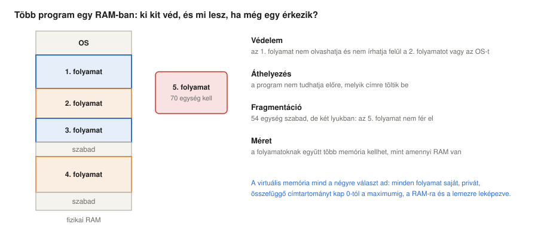
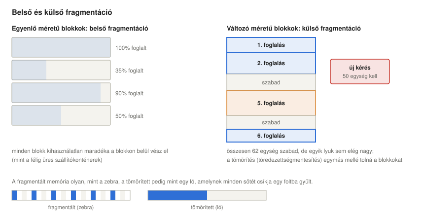
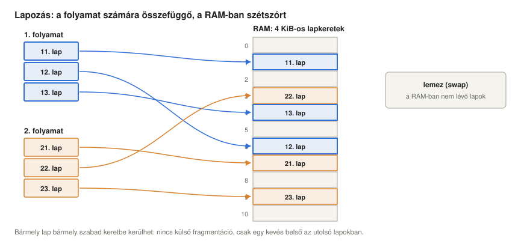
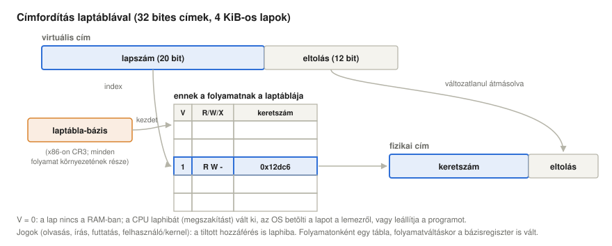
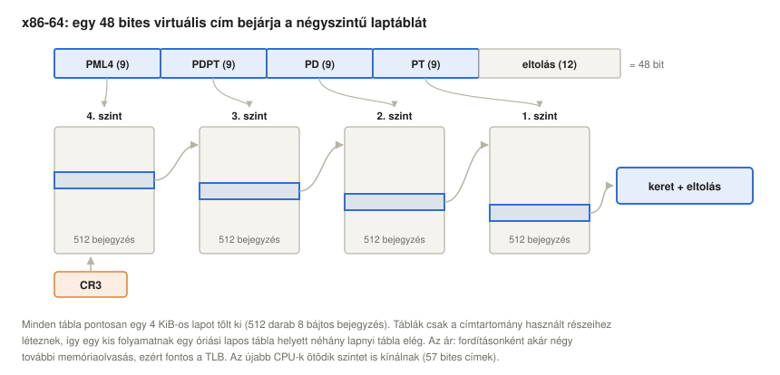
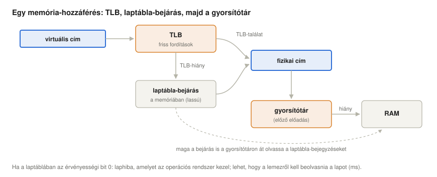
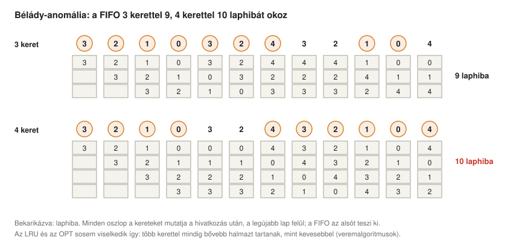
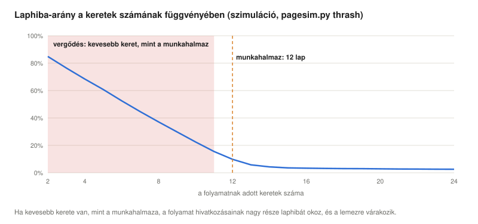
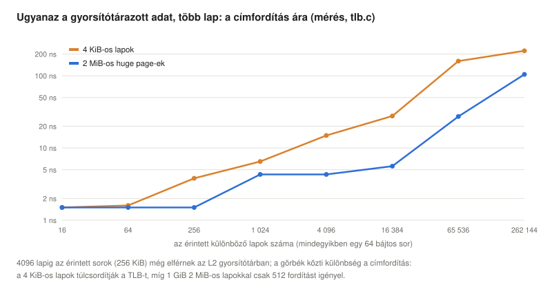

# Virtuális memória

*Operációs rendszerek előadás: hogyan ad az operációs rendszer minden folyamatnak saját, privát, összefüggő memóriát, hogyan védi meg a folyamatokat egymástól, és hogyan bővíti a RAM-ot a lemezzel: fragmentáció, lapozás, laptáblák, a TLB, laphibák és lapcsere, linuxos mérésekkel*

Előző: [Kétszintű memóriák és gyorsítótárak](../07-two-level-memory-and-cache/).

> **Hogyan olvasd ezt az előadást?** Ahol új rövidítés vagy fogalom jelenik meg, utána egy **Egyszerűen elmagyarázva** feliratú doboz következik. Kattints rá, és kinyílik egy köznapi nyelvű magyarázat. Ha már ismered a fogalmakat, nyugodtan átugorhatod ezeket a dobozokat.

## Tanulási célok

Az [előző előadás](../07-two-level-memory-and-cache/) egy gyorsítótárból és a RAM-ból épített kétszintű memóriát. Ez az előadás eggyel lejjebb lép, és a **RAM-ból és a lemezből** épít kétszintű memóriát, továbbá megmutatja, hogy ez sokkal többet tesz a kapacitás növelésénél: ezzel választja el egymástól az operációs rendszer a folyamatokat, így ad mindegyiknek egyszerű képet a memóriáról, és így osztja meg köztük a RAM-ot.

Az előadás végére a hallgatók képesek lesznek:

- elmagyarázni, milyen problémák merülnek fel, ha több program osztozik egy RAM-on: védelem, áthelyezés (relokáció), fragmentáció és méret;
- megkülönböztetni a belső és a külső fragmentációt, és elmagyarázni a foglalási stratégiákat és a tömörítést;
- elmagyarázni a lapozást: lapok és lapkeretek, a laptábla, a laptábla-bázisregiszter, az érvényességi bit és a hozzáférési jogokat jelző bitek, valamint egy virtuális címet fizikai címre fordítani;
- elmagyarázni, miért többszintűek a laptáblák, és leírni az x86-64 négyszintű laptábláját;
- elmagyarázni a TLB-t és a teljesítményre gyakorolt hatását, valamint az óriáslapok (huge page) szerepét;
- leírni, mi történik laphibakor, és megkülönböztetni az igény szerinti lapozást, az írásra másolást (copy-on-write), a kisebb (minor) és a nagyobb (major) laphibát;
- szimulálni és összehasonlítani a lapcsere-algoritmusokat (FIFO, OPT, LRU, óra), elmagyarázni a Bélády-anomáliát és azt, hogy az LRU miért mentes tőle, valamint elmagyarázni a munkahalmazt és a vergődést (thrashing);
- összehasonlítani a gyorsítótárakat és a virtuális memóriát, és mindezeket a mechanizmusokat Linuxon megfigyelni.

<details>
<summary><b>Egyszerűen elmagyarázva:</b> virtuális, fizikai, címtartomány, lap, lapkeret, lemez, swap</summary>

- **Virtuális:** „mintha”. A virtuális memória az a memória, amelyről a program azt hiszi, hogy az övé; a **fizikai** memória a valódi RAM-chipek.
- **Címtartomány:** azoknak a címeknek a köre, amelyeket egy program használhat, 0-tól egy legnagyobb értékig.
- **Lap:** a program memóriájának egy rögzített méretű darabja, általában 4 KiB. **Lapkeret (keret):** a RAM egy ugyanekkora darabja, amelybe pontosan egy lap fér.
- **Lemez:** a merevlemez vagy az SSD. Áram nélkül is megőrzi az adatokat, de több ezerszer lassabb a RAM-nál.
- **Swap (lapozóterület):** egy terület a lemezen, ahová az operációs rendszer azokat a lapokat teszi, amelyek nem férnek el a RAM-ban.

</details>

## Miért kell virtuális memória?

A virtuális memória kiindulópontja a **RAM és a lemez mint kétszintű memória**, valamint két probléma, amely azonnal jelentkezik, amint több program osztozik egy számítógépen; a [történeti előadás](../01-historic-evolution/#vii-a-programok-osztoznak-a-memórián-védelem-és-virtuális-memória) ezeket a multiprogramozásig vezette vissza:



- **Elválasztás (biztonság).** Ha több folyamat van a RAM-ban, mindegyiket védeni kell a többitől, az operációs rendszert pedig mindegyiktől. Egy program hibája vagy egy ellene indított támadás nem olvashatja és nem írhatja felül egy másik program memóriáját.
- **Egyszerű, saját nézet.** **Virtuális** memóriával *minden folyamat úgy látja, mintha az egész memória egyedül az övé lenne, összefüggően, 0-tól a maximumig*. A programot így rögzített címekre lehet lefordítani, akárhová kerül is valójában a RAM-ban (**áthelyezés**, relokáció), és a programnak egyáltalán nem kell tudnia a többi programról.
- **Több memória, mint amennyi RAM van.** A virtuális memória kiterjeszti a RAM-ot a lemezre: az éppen nem szükséges lapok ott várakozhatnak, és az összes folyamat együttes memóriája meghaladhatja a fizikai RAM méretét.

Virtuális memóriát először a Manchesteri Egyetem **Atlas** számítógépén valósítottak meg, amely 1962-ben kezdte meg működését. Tervezői *egyszintű tárolórendszernek* (one-level storage system) nevezték: a programozó egyetlen nagy memóriát látott, a hardver és a felügyelőprogram pedig automatikusan mozgatta az 512 szavas lapokat a kis ferritmemória és egy mágnesdob között (Kilburn et al., 1962). Ma minden általános célú operációs rendszer ugyanerre az elvre épül.

<details>
<summary><b>Egyszerűen elmagyarázva:</b> elválasztás, védelem, áthelyezés, Atlas, ferritmemória, mágnesdob</summary>

- **Elválasztás, védelem:** minden program a saját memóriájában marad, így nem kémkedhet a többiek után, és nem is ronthatja el őket.
- **Áthelyezés (relokáció):** a programot a RAM-ban bárhová el lehet helyezni, pedig az utasításai címeket tartalmaznak.
- **Atlas:** brit számítógép az 1960-as évek elejéről, kora egyik legerősebb gépe, és az első, amelyben volt virtuális memória.
- **Ferritmemória (core memory):** az 1950-es és 1960-as évek fő memóriatechnológiája, apró mágneses gyűrűkből. **Mágnesdob:** forgó mágneses henger, a merevlemez lassabb elődje.

</details>

## Fragmentáció

A legegyszerűbb megoldás minden folyamatnak a RAM egy **összefüggő** darabját adja, a **partícióját**, és minden címet ellenőriz a partíció határai szerint (egy bázis- és egy határregiszterrel). Ez azért nem válik be, mert a memória feldarabolódik (fragmentálódik). Ennek két fajtája van:



- **Belső fragmentáció** **egyenlő blokkméretnél** lép fel: a memóriát rögzített egységekben osztjuk ki, és minden egység kihasználatlan maradéka az egységen *belül* vész el. Hasonlat erre a konténeres áruszállítás: a félig üres konténer is egy egész konténernyi helyet foglal a hajón.
- **Külső fragmentáció** **különböző blokkméreteknél** lép fel: a blokkok lefoglalása és felszabadítása során a szabad memória a blokkok *közötti* lyukakra esik szét. Egy új kérés esetleg egyik lyukba sem fér bele, pedig a lyukak együtt elég nagyok volnának.

Változó blokkoknál a foglaló minden kéréshez kiválaszt egy lyukat: **first fit** (az első elég nagy lyuk), **best fit** (a legkisebb elég nagy) vagy **worst fit** (a legnagyobb). Egyik sem kerüli el a fragmentációt; Knuth first fitre vonatkozó elemzéséből született az „ötven százalékos szabály”: egyensúlyi állapotban körülbelül feleannyi lyuk van, mint lefoglalt blokk (Knuth, 1997). A gyógymód a **tömörítés**: a blokkokat egymás mellé toljuk, így a szabad memória egyetlen lyukat alkot – az ábrán ez az, amikor a csíkos zebrából olyan ló lesz, amelynek minden sötét csíkja egyetlen foltba gyűlt. A tömörítés azonban lassú, és megköveteli, hogy minden program futás közben áthelyezhető legyen.

A következő szakasz témája, a lapozás, egyenlő blokkméreteket választ, így a külső fragmentációt egy kevés belső fragmentációra cseréli: memóriaterületenként átlagosan fél lapnyira. Mindkét fajta megfigyelhető Linuxon ([linuxos szakasz](#fragmentáció-linuxon)).

<details>
<summary><b>Egyszerűen elmagyarázva:</b> összefüggő, partíció, bázis- és határregiszter, belső és külső fragmentáció, first/best/worst fit, tömörítés</summary>

- **Összefüggő:** egy darabban, hézagok nélkül.
- **Partíció:** a RAM-nak az a darabja, amelyet egy program megkap.
- **Bázis- és határregiszter:** a CPU két regisztere, amely azt tárolja, hol kezdődik a program partíciója és milyen hosszú; minden címet ezekhez mérünk.
- **Belső fragmentáció:** a blokkokon belül elvesző hely, mert minden blokk nagyobb annál, amit beleteszünk.
- **Külső fragmentáció:** a blokkok között elvesző hely, a túl kicsi, használhatatlan lyukakban.
- **First fit, best fit, worst fit:** szabályok egy szabad lyuk kiválasztására: az első, amelybe belefér; a legszorosabb, amelybe belefér; vagy a legnagyobb.
- **Tömörítés (töredezettségmentesítés):** mindent egymás mellé tolunk, hogy egyetlen nagy szabad terület keletkezzen, mint amikor a polcon az összes könyvet az egyik oldalra toljuk.

</details>

## Lapozás

A **lapozás** minden folyamat virtuális memóriáját rögzített méretű **lapokra** (x86-on 4 KiB), a fizikai RAM-ot pedig ugyanekkora **lapkeretekre** osztja. Bármelyik lap bármelyik szabad keretbe kerülhet. Egy folyamat lapjai a saját címtartományában összefüggőek, de az őket tároló keretek bárhol lehetnek a RAM-ban, bármilyen sorrendben, és egyes lapok egyáltalán nincsenek is a RAM-ban:



A [linuxos szakasz](#hol-vannak-valójában-a-lapok) mérése pontosan ezt mutatja egy valódi rendszeren: egy folyamat négy egymást követő virtuális lapját négy, egymással semmilyen kapcsolatban nem álló fizikai keretben, valamint két lapot, amely egyáltalán nincs a RAM-ban, mert még sosem használták.

### Címfordítás

Vegyünk példának 32 bites virtuális címeket és 4 KiB-os lapokat. A cím alsó 12 bitje ($2^{12}$ = 4096) a lapon belüli **eltolás (offset)**, a felső 20 bit a **lapszám**. A folyamat **laptáblájában** minden lapszámhoz egy bejegyzés tartozik, és minden bejegyzés annak a fizikai keretnek a számát tárolja, amelyben a lap van, valamint vezérlőbiteket:



1. A **laptábla-bázisregiszter** (PTBR; x86-on a CR3 regiszter, ARM-on a TTBR regiszterek) az aktuális folyamat laptáblájának fizikai címét tárolja. A folyamat környezetének (kontextusának) része, így a folyamatot váltó környezetváltás a PTBR-t is átírja, és vele együtt az egész címtartományt.
2. A lapszám kiválasztja a bejegyzést: ennek címe a PTBR plusz a lapszám szorozva a bejegyzés méretével.
3. Ha a bejegyzés érvényes, a benne lévő **fizikai lapszámot (keretszámot)** a változatlan eltolással kombinálva kapjuk a fizikai címet (binárisan a keretszámot egyszerűen az eltolás elé írjuk).

Egy bejegyzés legfontosabb bitjei:

- **Érvényességi bit (valid, present):** az 1 azt jelenti, hogy a lap egy keretben van. A 0 azt, hogy nincs: a hozzáférés **laphibát** okoz, ami kivétel (a [megszakításokról szóló előadás](../05-interrupts/#a-megszakítások-osztályai) fogalmaival programmegszakítás), és az operációs rendszer dönti el, mi történjen.
- **Hozzáférési jogok:** csak olvasható, írható-olvasható, végrehajtható. x86-64-en van még egy **user/supervisor** (felhasználói/felügyelői) bit is (a kernel lapjai felhasználói módból nem érhetők el), valamint az **NX** (no-execute, végrehajtást tiltó) bit, amelyet az [utasítás-végrehajtási ciklusról szóló előadás](../04-fetch-execute-cycle/#memóriajogosultságok-egy-valódi-folyamatban) bemutatott. Az a hozzáférés, amelyet a jogok nem engednek meg, szintén laphibát okoz, és ezt az operációs rendszer hibává alakítja a program számára (Linuxon ez a `SIGSEGV` szignál: „segmentation fault”, szegmentálási hiba).
- A hardver ezenkívül beállít egy **accessed** (hozzáférési) bitet, amikor a lapot használják, és egy **dirty** (módosítási) bitet, amikor írnak bele; ezeket az operációs rendszer a lapcseréhez használja, lásd lejjebb.

Egy kidolgozott példa: a `0x00403A7C` virtuális cím lapszáma `0x00403`, eltolása `0xA7C`. Ha a laptábla `0x403`-as bejegyzése azt mondja, hogy „érvényes, írható-olvasható, keret: `0x12DC6`”, akkor a fizikai cím `0x12DC6A7C`.

### Többszintű laptáblák

Egy 32 bites címtartomány egyszintű (lapos) táblájának $2^{20}$ bejegyzése van; bejegyzésenként 4 bájttal ez folyamatonként 4 MiB, még egy csak néhány lapot használó programnál is. 48 bites címekhez egy lapos tábla $2^{36}$ darab 8 bájtos bejegyzést igényelne, folyamatonként 512 GiB-ot: ez lehetetlen. A laptáblák ezért **hierarchikusak**: a lapszámot több indexre bontjuk, és az egyes szintek táblái csak ott léteznek, ahol memóriát használnak. x86-64-en a 48 bites virtuális címet négy 9 bites indexre és egy 12 bites eltolásra bontjuk, és minden tábla 512 darab nyolcbájtos bejegyzést tartalmaz, ami pontosan egy 4 KiB-os lap:



Az alább használt gép a `/proc/cpuinfo` fájlban `address sizes : 46 bits physical, 48 bits virtual` értéket mutat, tehát négy szintet használ; az újabb processzorok egy ötödik szintet is támogatnak az 57 bites címekhez. A hierarchia ára, hogy egy címfordítás négy további memóriaolvasást igényelhet: ez a **laptábla-bejárás** (page walk). Itt lép be a következő szakasz.

A **szegmentálás** a régebbi alternatíva: a memóriát változó méretű logikai **szegmensekre** (kód, adat, verem) osztjuk, mindegyiknek saját bázisa, határa és jogai vannak. Ez illeszkedik a program szerkezetéhez, de külső fragmentációtól szenved. Az x86 processzorokban mindkettő megvolt, a szegmensek a lapok fölött; 64 bites módban a szegmentálás lényegében ki van kapcsolva, és a modern operációs rendszerek kizárólag a lapozásra építenek.

<details>
<summary><b>Egyszerűen elmagyarázva:</b> lapozás, eltolás, laptábla, laptábla-bejegyzés, PTBR/CR3, laphiba, kivétel, hozzáférési jogok, NX bit, user/supervisor, accessed és dirty bit, hierarchia, szegmens</summary>

- **Lapozás:** a memóriát egyforma darabokra vágjuk, és minden darabot oda teszünk, ahol hely van, közben listát vezetünk arról, melyik hová került.
- **Eltolás (offset):** egy bájt helye a lapján belül.
- **Laptábla:** ez a lista: a folyamat minden lapjáról megmondja, melyik RAM-keretben van, és mit szabad vele csinálni. Minden sora egy **laptábla-bejegyzés**.
- **PTBR (page-table base register, laptábla-bázisregiszter), CR3, TTBR:** az a CPU-regiszter (Intel és AMD processzorokon a CR3, ARM-on a TTBR), amely megmondja, hol van az aktuális folyamat laptáblája. Ha átírjuk, egy másik folyamat memóriájára váltunk.
- **Laphiba:** a CPU jelzése az operációs rendszernek, hogy egy lap nincs a RAM-ban, vagy hogy egy hozzáférés nem megengedett.
- **Kivétel:** olyan megszakítás, amelyet az éppen futó utasítás okoz.
- **Hozzáférési jogok:** egy lapot szabad-e olvasni, írni vagy végrehajtani. **NX** (no-execute): az adatlapokat nem lehet kódként futtatni. **User/supervisor:** a közönséges programok hozzányúlhatnak-e a laphoz, vagy csak a kernel.
- **Accessed és dirty bit:** a hardver állítja be őket, amikor egy lapot használnak, illetve amikor megváltoztatják.
- **Hierarchikus (többszintű) laptábla:** táblák táblája, mint egy könyv tartalomjegyzéke, amely a fejezetek saját tartalomjegyzékeire mutat, így csak a használt részeknek kell létezniük.
- **Szegmens:** a program egy változó méretű logikai része, például a kódja vagy a verme.

</details>

## A TLB: gyorsítótár a címfordításokhoz

Minden memória-hozzáféréshez címfordítás kell, és ha mindegyikhez laptábla-bejárásra volna szükség, az minden hozzáférés költségét megtöbbszörözné. A CPU ezért a legutóbbi fordításokat a **TLB**-ben (translation lookaside buffer, címfordítási gyorsítótár) tartja, amely a laptábla-bejegyzések kicsi, gyors gyorsítótára:



TLB-**találatnál** a fordítás egy-két órajelciklus alatt rendelkezésre áll, és a fizikai cím továbbmegy az előző előadás gyorsítótárához. TLB-**hiánynál** x86-on és ARM-on maga a hardver járja be a laptáblákat (néhány más architektúrán az operációs rendszer teszi ezt szoftveresen), és az eredményt eltárolja a TLB-ben. Mivel a bejárás az adatgyorsítótárakon keresztül olvassa a laptábla-bejegyzéseket, egy TLB-hiány gyakran jóval olcsóbb négy RAM-hozzáférésnél, de így is költséges.

Egy TLB első szintjén jellemzően néhány tucat, a második szintjén ezer-kétezer bejegyzés van (az alább használt processzorcsaládon adatokra 64 bejegyzés és 1536 közös bejegyzés; ez ugyanaz a TLB, mint a Skylake szervermagoké; Intel Corporation, 2024). 4 KiB-os lapokkal az 1536 bejegyzés 6 MiB-ot fed le: ez a **TLB lefedettsége** (TLB reach). Azok a programok, amelyek ennél több memóriát használnak véletlenszerű sorrendben, TLB-hiányoktól szenvednek, ezért a processzorok **óriáslapokat** (huge page) is támogatnak (x86-64-en 2 MiB és 1 GiB méretűeket): ekkor egy bejegyzés 512-szer, illetve 262 144-szer több memóriát fed le. A [linuxos szakasz](#a-címfordítás-ára) mérése elválasztja a címfordítás költségét magának az adatnak a költségétől: amikor az adat a gyorsítótárban volt, a 4 KiB-os lapok hozzáférésenként körülbelül 2,3 ns-mal növelték az időt, amíg a második szintű TLB még lefedte a lapokat, és 10–130 ns-mal, amikor már túlcsordult.

Mivel a TLB az aktuális címtartomány fordításait tartalmazza, környezetváltáskor ezeket érvényteleníteni kell, vagy címtartomány-azonosítóval kell megcímkézni őket (x86-on PCID, ARM-on ASID), hogy több folyamat bejegyzései egyszerre lehessenek benne, ahogy az [előző előadás](../07-two-level-memory-and-cache/#miért-fontos-ez-az-operációs-rendszernek) említette.

<details>
<summary><b>Egyszerűen elmagyarázva:</b> TLB, találat, hiány, laptábla-bejárás, TLB-lefedettség, óriáslap, PCID/ASID</summary>

- **TLB** (translation lookaside buffer, címfordítási gyorsítótár): apró memória a CPU-ban, amely nagyjából egy-kétezer friss lapfordításra emlékszik, így a laptáblát csak ritkán kell elolvasni.
- **Laptábla-bejárás:** egy fordítás kikeresése a laptáblákban, szintről szintre, ha a TLB nem tudja.
- **TLB-lefedettség (TLB reach):** mennyi memóriát tud a TLB egyszerre lefedni: a bejegyzések száma × a lapméret.
- **Óriáslap (huge page):** 4 KiB helyett 2 MiB-os vagy 1 GiB-os lap, így egy TLB-bejegyzés sokkal több memóriát fed le.
- **PCID, ASID:** egy szám, amely megjelöli, melyik folyamathoz tartozik egy TLB-bejegyzés.

</details>

## Laphibák: az operációs rendszer veszi át az irányítást

Ha az érvényességi bit 0, vagy a hozzáférés nem megengedett, a CPU laphibát vált ki, és a kernel laphibakezelője megvizsgálja a címet, valamint a saját nyilvántartását a folyamat memóriaterületeiről (Linuxon a **VMA**-k listáját, amelyet a `/proc/PID/maps` ír ki). Négy fő eset van:

- **A cím egyik területhez sem tartozik, vagy a hozzáférés sérti a terület jogait:** programhiba; a Linux `SIGSEGV` szignált küld, ami általában a program végét jelenti.
- **Igény szerinti lapozás:** a terület érvényes, de a lapot még sosem használták. A Linux „lustán” ad memóriát a folyamatoknak: a `malloc` és az `mmap` csak virtuális címeket foglal le, fizikai keretet minden lap csak az első hozzáféréskor kap. A [linuxos szakasz](#igény-szerinti-lapozás) 1 GiB „lefoglalt” memóriát mutat 1 MiB használt RAM mellett – egészen addig, amíg a program hozzá nem nyúl.
- **Írásra másolás (copy-on-write):** a `fork()` után a szülő és a gyermek minden lapot csak olvashatóként közösen használ. Egy közös lapra történő első írás laphibát okoz, és a kernel az író folyamatnak saját másolatot ad. A `fork()` ezért nagy folyamatoknál is gyors ([linuxos szakasz](#írásra-másolás-copy-on-write)).
- **A lap a lemezen van:** kilapozták (swap), vagy egy memóriába leképezett fájlhoz tartozik, amely nincs benne a lapgyorsítótárban (page cache). A kernelnek be kell olvasnia a lemezről; ez a **nagyobb (major) laphiba**: a folyamat az [ütemezésről szóló előadás](../06-concurrency-deadlocks-scheduling/#a-folyamatok-állapottere) *várakozó* állapotában vár, és közben más folyamatok futnak. Azok a laphibák, amelyekhez nem kell lemezművelet (igény szerint kiosztott nullázott lapok, írásra másolás, a lapgyorsítótárban már bent lévő lapok), a **kisebb (minor) laphibák**.

A nagyobb laphibák drágák: gyors SSD-n mikroszekundumokba, merevlemezen milliszekundumokba kerülnek, szemben egy memória-hozzáférés körülbelül 100 ns-ával. Az előző előadás kétszintű képlete megmutatja, milyen ritkának kell lenniük. $p$ laphiba-gyakoriság, 100 ns memória-hozzáférési idő és 8 ms laphiba-kiszolgálási idő mellett

$$T = (1 - p) \cdot 100 \text{ ns} + p \cdot 8 \text{ ms}$$

és ahhoz, hogy a lassulás 10% alatt maradjon, $p$-nek körülbelül $1{,}25 \cdot 10^{-6}$ alatt kell maradnia: 800 000 hozzáférésenként egy laphiba (a példa Silberschatz et al., 2018 nyomán, akik 200 ns-mal számolnak).

<details>
<summary><b>Egyszerűen elmagyarázva:</b> laphibakezelő, VMA, SIGSEGV, igény szerinti lapozás, „lusta”, írásra másolás, fork, nagyobb és kisebb laphiba</summary>

- **Laphibakezelő:** a kernelnek az a része, amely laphiba esetén lefut.
- **VMA** (virtual memory area, virtuális memóriaterület): egy folyamat címtartományának egy területe, például a kódja, a kupaca (heap) vagy egy leképezett fájl, saját jogokkal.
- **SIGSEGV** („segmentation fault”, szegmentálási hiba): az a szignál, amely közli a programmal, hogy olyan memóriához nyúlt, amelyhez nem szabad.
- **Igény szerinti lapozás, „lusta” memóriakiosztás:** a lapot csak akkor adjuk oda, amikor tényleg használják, nem akkor, amikor kérik – mint egy étterem, amely csak akkor főzi meg az ételt, amikor valaki megrendeli.
- **Írásra másolás (copy-on-write):** két folyamat közösen használ egy lapot, amíg egyikük meg nem változtatja; csak ekkor kap saját másolatot.
- **fork():** az a rendszerhívás, amely az aktuális folyamat másolataként új folyamatot hoz létre.
- **Nagyobb (major) laphiba:** a lapot a lemezről kell beolvasni (lassú). **Kisebb (minor) laphiba:** a lap lemez nélkül is előteremthető (gyors).

</details>

## Lapcsere

Ha egy lapot be kell hozni, és nincs szabad keret, az operációs rendszernek ki kell választania egy **áldozat** lapot, amelyet kitesz; ha az áldozat módosított (dirty), előbb ki kell írni a lemezre. Ez az [előző előadás](../07-two-level-memory-and-cache/#melyik-sort-dobjuk-ki) csereproblémája, két különbséggel: egy hiány ezerszer–százezerszer többe kerül, és a döntést nem a hardver, hanem az operációs rendszer hozza, így megengedheti magának, hogy „gondolkodjon”. A klasszikus algoritmusok:

- **FIFO:** azt a lapot teszi ki, amelyik a legrégebben van a memóriában.
- **OPT** (Bélády, 1966): azt a lapot teszi ki, amelynek következő használata a legtávolabbi jövőben van. Optimális, de ismernie kell a jövőt; ez a mérce.
- **LRU:** azt a lapot teszi ki, amelyet a legrégebben nem használtak. A gyakorlatban nagyon jó, de a pontos LRU *minden egyes* memória-hozzáférésnél időbélyeget vagy listafrissítést igényelne, ami szoftverben lehetetlen.
- **Óra (második esély, clock):** a hardver **accessed bitjére** épülő LRU-közelítés. A keretek kört alkotnak, és egy „óramutató” halad körbe rajtuk: az a lap, amelynek accessed bitje be van állítva, második esélyt kap (a bitet töröljük, és a mutató továbblép); az első olyan lapot, amelynek bitje törölt, kitesszük (Corbató, 1968; az ő Multics-változata laponként több bitnyi előzményt tárolt, nagyon hasonlóan az alábbi öregítő algoritmushoz). Az **öregítés** (aging) algoritmus ezt finomítja egy laponkénti kis számlálóval, amelyet rendszeres időközönként jobbra léptetünk, és a legfelső helyiértékére az accessed bit kerül: a legkisebb számlálójú lapot használták a legrégebben.

A Linux a lapokat kétféle listán tartja, **aktív** és **inaktív** listán (egy pár az anonim memóriához és egy a fájllapokhoz): az újra használt lapok előlépnek az aktív listára, a felszabadítás (reclaim) pedig az inaktív lista végéről választ áldozatot; ez az óra-ötlet kétmutatós változata. A Linux 6.1 óta egy opcionális, a Google-nél kifejlesztett többgenerációs LRU (MGLRU) két lista helyett több generációba sorolja a lapokat koruk szerint (Larabel, 2022); az alább használt kernelbe ez nincs befordítva (nincs `/sys/kernel/mm/lru_gen` könyvtár).

### Bélády-anomália

Természetes kérdés: ha egy folyamat több keretet kap, mindig csökken-e a laphibák száma? FIFO esetén nem feltétlenül. A `3 2 1 0 3 2 4 3 2 1 0 4` hivatkozási sorozattal a FIFO 3 kerettel 9, de 4 kerettel 10 laphibát okoz:



A szimulátor oszlopról oszlopra reprodukálja az ábrát ([linuxos szakasz](#lapcsere-szimulálva)). Bélády et al. (1969) megmutatták, hogy FIFO-hoz léteznek ilyen sorozatok. Az LRU és az OPT soha nem viselkedhet így, mert **veremalgoritmusok** (stack algorithm): az *n* kerettel megtartott lapok halmaza mindig része az *n* + 1 kerettel megtartott lapok halmazának, így egy további keret csak megtakaríthat laphibákat (Mattson et al., 1970). A FIFO-nak nincs meg ez a tartalmazási tulajdonsága: a példában a hetedik hivatkozásnál a 4 keretes FIFO éppen kitette a 3-as lapot, amelyet a 3 keretes FIFO még tárol, és amelyre következőként szükség van.

### Munkahalmazok és vergődés

Egy folyamat **munkahalmaza** (working set) azoknak a lapoknak a halmaza, amelyeket egy közelmúltbeli időablakban használt (Denning, 1968a). A lokalitás elve szerint ez általában sokkal kisebb, mint az egész program, és lassan változik, ahogy a program egyik szakaszából a következőbe lép. Ha egy folyamatnak legalább annyi kerete van, mint amekkora a munkahalmaza, ritkán okoz laphibát; ha kevesebb, hivatkozásainak nagy része laphibát okoz:



Ha a memóriában lévő folyamatoknak együtt több keretre van szükségük, mint amennyi van, idejüket a lapok mozgatására való várakozással töltik, és szinte semmit sem számolnak: ez a **vergődés** (thrashing). Az átbocsátóképesség összeomlik, és egy naiv ütemező, amely további folyamatokat enged be, mert a CPU tétlennek látszik, csak ront a helyzeten (Denning, 1968b). A gyógymód kevesebb folyamat futtatása: az [ütemezésről szóló előadás](../06-concurrency-deadlocks-scheduling/#a-folyamatok-állapottere) középtávú ütemezője felfüggeszt néhányat, Linuxon pedig az OOM killer (out-of-memory killer, memóriahiány esetén folyamatot leállító mechanizmus) leállít egyet, ha már semmi más nem segít.

<details>
<summary><b>Egyszerűen elmagyarázva:</b> áldozat, FIFO, OPT, LRU, óra, accessed bit, öregítés, aktív/inaktív lista, Bélády-anomália, veremalgoritmus, munkahalmaz, vergődés, OOM killer</summary>

- **Áldozat:** az a lap, amelyet kiválasztunk, hogy elhagyja a RAM-ot, és helyet csináljon.
- **FIFO, OPT, LRU:** first in, first out (aki elsőként jött, elsőként megy); az optimális „azt tedd ki, amelyre a legkésőbb lesz szükség”; least recently used (a legrégebben használt).
- **Óra (második esély):** körbejárjuk a lapokat; amelyiket nemrég használták, kap még egy kört, az első nem használt pedig kimegy.
- **Accessed bit:** egy bit, amelyet a CPU automatikusan beállít, valahányszor egy lapot használnak.
- **Öregítés:** minden lapnak van egy kis számlálója, amely „emlékszik”, mennyire nemrég használták; a legkisebb számlálójú lap megy ki.
- **Aktív / inaktív lista:** a Linux két lapsora: a nemrég használt lapok, illetve a kitételre jelöltek. **MGLRU** (multi-generational LRU, többgenerációs LRU): egy újabb linuxos változat két helyett több korcsoporttal.
- **Bélády-anomália:** FIFO-val több keret több laphibát is jelenthet.
- **Veremalgoritmus:** olyan lapcsere-algoritmus, amelynél a nagyobb memória mindig tartalmaz mindent, amit egy kisebb tartalmazna; az LRU és az OPT ilyen.
- **Munkahalmaz:** azok a lapok, amelyekre a programnak éppen most szüksége van.
- **Vergődés (thrashing):** a számítógép annyira el van foglalva a lapok RAM és lemez közötti mozgatásával, hogy alig végez valódi munkát.
- **OOM killer (out-of-memory killer):** a Linuxnak az a része, amely leállít egy folyamatot, amikor a memória teljesen elfogyott.

</details>

## A gyorsítótárak és a virtuális memória összehasonlítása

A gyorsítótárak és a virtuális memória egyaránt lokalitásra épülő kétszintű memóriák, ugyanazzal a szerkezettel, de nagyon különböző számokkal, és ezek a számok magyarázzák a tervezés minden különbségét:

| | Gyorsítótár | Virtuális memória |
|---|---|---|
| egység | sor (blokk) | lap / keret (vagy szegmens) |
| egységméret | 32–128 bájt, általában 64 | 4–16 KiB, továbbá 2 MiB-os és 1 GiB-os óriáslapok |
| a gyors szint kapacitása | 32 KiB-tól (L1) több tíz MiB-ig (L3) | GiB nagyságrendű RAM (egy PC-ben jellemzően 8–64 GiB) |
| a hiány neve | gyorsítótár-hiány (cache miss) | laphiba |
| egy hiány költsége | 10–100 ns | µs (SSD) – ms (merevlemez) |
| ki kezeli | egyedül a hardver | a hardver (TLB, laptábla-bejárás) és az operációs rendszer (laphibakezelő) |
| elhelyezés | direkt leképezésű vagy csoportasszociatív | teljesen asszociatív: bármely lap bármely keretbe |
| csere | nincs (direkt leképezésű), véletlen vagy pszeudo-LRU hardverben | az LRU szoftveres közelítései (óra, öregítés, aktív/inaktív listák) |
| írás | átíró (write-through) vagy – ma többnyire – visszaíró (write-back) | mindig visszaíró (dirty bit) |

A virtuális memória mindig visszaíró: ha minden írást azonnal a lemezre is ki kellene írni, minden egyes írás milliszekundumokig tartana. A gyorsítótárak bármelyik stratégiát használhatják; egyes L1 gyorsítótárak átírók, de ma a legtöbb gyorsítótár visszaíró, ahogy az [előző előadás](../07-two-level-memory-and-cache/#a-direkt-leképezésű-gyorsítótár) elmagyarázta. Ugyanez az érvelés magyarázza az elhelyezést és a cserét: mivel egy nagyobb laphiba százezer–millió órajelciklusba kerül, az operációs rendszer megengedheti magának a teljes asszociativitást és az áldozat gondos kiválasztását, míg egy gyorsítótárnak egyetlen ciklus alatt kell döntenie.

## Ugyanezek az elvek Linuxon (x86-64)

Az alábbi kimenetek egy valódi rendszerről származnak: egy felhőalapú adatközpontban futó Ubuntu 24.04 virtuális gépről, 2 virtuális CPU-val (Intel Xeon, Cascade Lake család, 2,8 GHz), 8 GiB RAM-mal, swap nélkül, Linux 6.18 kernellel és gcc 13-mal. A fizikai keretszámokat olvasó programokhoz rendszergazdai (root) jog kell.

<details>
<summary><b>Egyszerűen elmagyarázva:</b> konzol, /proc, mmap, malloc, root, gcc</summary>

- **Konzol** (terminál): ablak, amelyben szövegesen gépeljük be a parancsokat. A `$` jellel kezdődő sorokat mi írjuk be (`#` jellel, ha rendszergazdaként, root-ként gépeljük), a többi sor a számítógép válasza.
- **/proc:** virtuális fájlok gyűjteménye, amelyekben a Linux-kernel információt mutat a folyamatokról és a memóriáról.
- **mmap, malloc:** rendszer-, illetve könyvtári hívások, amelyek egy programnak új (virtuális) memóriadarabot adnak.
- **Root:** a rendszergazdai fiók, amely mindent láthat, a fizikai címeket is.
- **gcc:** a C-fordító.

</details>

### Egy folyamat címtartománya

Minden folyamatnak saját virtuális címtartománya van; a `/proc/PID/maps` felsorolja ennek területeit (VMA-it) a jogaikkal együtt (`r`: olvasás, `w`: írás, `x`: végrehajtás, `p`: privát). Íme a `cat` címtartománya, miközben a saját térképét olvassa:

```console
$ cat /proc/self/maps
5634e6dcc000-5634e6dce000 r--p 00000000 fe:00 343944                     /usr/bin/cat
5634e6dce000-5634e6dd3000 r-xp 00002000 fe:00 343944                     /usr/bin/cat
5634e6dd3000-5634e6dd5000 r--p 00007000 fe:00 343944                     /usr/bin/cat
5634e6dd5000-5634e6dd6000 r--p 00008000 fe:00 343944                     /usr/bin/cat
5634e6dd6000-5634e6dd7000 rw-p 00009000 fe:00 343944                     /usr/bin/cat
56352305f000-563523080000 rw-p 00000000 00:00 0                          [heap]
7fcc3abde000-7fcc3ac00000 rw-p 00000000 00:00 0
7fcc3ac00000-7fcc3ac28000 r--p 00000000 fe:00 344580                     /usr/lib/x86_64-linux-gnu/libc.so.6
7fcc3ac28000-7fcc3adb1000 r-xp 00028000 fe:00 344580                     /usr/lib/x86_64-linux-gnu/libc.so.6
7fcc3adb1000-7fcc3ae00000 r--p 001b1000 fe:00 344580                     /usr/lib/x86_64-linux-gnu/libc.so.6
7fcc3ae00000-7fcc3ae04000 r--p 001ff000 fe:00 344580                     /usr/lib/x86_64-linux-gnu/libc.so.6
7fcc3ae04000-7fcc3ae06000 rw-p 00203000 fe:00 344580                     /usr/lib/x86_64-linux-gnu/libc.so.6
7fcc3ae06000-7fcc3ae13000 rw-p 00000000 00:00 0
7fcc3ae29000-7fcc3ae2c000 rw-p 00000000 00:00 0
7fcc3ae3a000-7fcc3ae3c000 rw-p 00000000 00:00 0
7fcc3ae3c000-7fcc3ae40000 r--p 00000000 00:00 0                          [vvar]
7fcc3ae40000-7fcc3ae42000 r--p 00000000 00:00 0                          [vvar_vclock]
7fcc3ae42000-7fcc3ae44000 r-xp 00000000 00:00 0                          [vdso]
7fcc3ae44000-7fcc3ae45000 r--p 00000000 fe:00 344560                     /usr/lib/x86_64-linux-gnu/ld-linux-x86-64.so.2
7fcc3ae45000-7fcc3ae70000 r-xp 00001000 fe:00 344560                     /usr/lib/x86_64-linux-gnu/ld-linux-x86-64.so.2
7fcc3ae70000-7fcc3ae7a000 r--p 0002c000 fe:00 344560                     /usr/lib/x86_64-linux-gnu/ld-linux-x86-64.so.2
7fcc3ae7a000-7fcc3ae7c000 r--p 00036000 fe:00 344560                     /usr/lib/x86_64-linux-gnu/ld-linux-x86-64.so.2
7fcc3ae7c000-7fcc3ae7e000 rw-p 00038000 fe:00 344560                     /usr/lib/x86_64-linux-gnu/ld-linux-x86-64.so.2
7fff00dee000-7fff00e14000 rw-p 00000000 00:00 0                          [stack]
ffffffffff600000-ffffffffff601000 --xp 00000000 00:00 0                  [vsyscall]
```

A program kódja olvasható és végrehajtható, de nem írható (`r-xp`); az adatai írhatók, de nem végrehajthatók (`rw-p`); a C-könyvtár a fájljából van leképezve, és minden más, azt használó folyamattal közös (a `p`, azaz privát, írásra másolást jelent: az a lap, amelybe egy folyamat ír, a saját másolatává válik, de azok a lapok, amelyekbe senki sem ír, a lapgyorsítótáron keresztül fizikailag közösek maradnak); a kupac (heap) és a verem (stack) anonim memória. Minden cím virtuális, és a `[vsyscall]` kivételével (ez egy örökölt kernellap a címtartomány legtetején, a régi programok kedvéért maradt meg) mind $2^{47}$ alatt van: a 48 bites címtartomány alsó fele a folyamaté, a felső fele a kernelé. A címek minden futtatáskor változnak, mert a Linux véletlenszerűen helyezi el a területeket (**ASLR**, address space layout randomisation, a címtartomány elrendezésének véletlenítése; itt `/proc/sys/kernel/randomize_va_space` = 2), ami megnehezíti az ismert címekre építő támadásokat:

```console
$ grep -E 'heap|libc.so' /proc/self/maps | head -2
559629cf9000-559629d1a000 rw-p 00000000 00:00 0                          [heap]
7f7aa6e00000-7f7aa6e28000 r--p 00000000 fe:00 344580                     /usr/lib/x86_64-linux-gnu/libc.so.6
$ grep -E 'heap|libc.so' /proc/self/maps | head -2
55590b854000-55590b875000 rw-p 00000000 00:00 0                          [heap]
7f0e01400000-7f0e01428000 r--p 00000000 fe:00 344580                     /usr/lib/x86_64-linux-gnu/libc.so.6
```

<details>
<summary><b>Egyszerűen elmagyarázva:</b> VMA-lista, privát és közös, anonim memória, kupac, verem, vdso/vvar/vsyscall, ASLR</summary>

- **`r`, `w`, `x`, `p`:** olvasás (read), írás (write), végrehajtás (execute), privát (private). A **privát** azt jelenti, hogy ha a folyamat ír, saját másolatot kap; a **közös** (shared, `s`) azt jelentené, hogy az írásokat más folyamatok is látják.
- **Anonim memória:** olyan memória, amely nem fájlból származik, például a kupac és a verem.
- **Kupac (heap):** innen vesz memóriát a `malloc`. **Verem (stack):** itt élnek a függvények helyi változói.
- **vdso, vvar, vsyscall:** kis lapok, amelyeket a kernel minden folyamatba betesz, hogy egyes rendszerhívások, például az óra lekérdezése, a kernelbe lépés nélkül fussanak le.
- **ASLR** (address space layout randomisation, a címtartomány elrendezésének véletlenítése): a területek minden indításkor véletlen címekre kerülnek, így a támadó nem tudhatja, mi hol van.

</details>

### Hol vannak valójában a lapok?

A `v2p.c` hat egymást követő virtuális lapot képez le, az első négybe ír, majd a `/proc/self/pagemap` fájlon keresztül (virtuális laponként egy 64 bites bejegyzés: a 63. bit a „jelen van”, a 0–54. bitek a keretszám; The kernel development community, n.d.) megkérdezi a kerneltől, melyik fizikai keret tárolja az egyes lapokat:

```console
$ gcc -O2 -o v2p v2p.c
# ./v2p
page size 4096 bytes
virtual page 0x7f8a2f422 -> physical frame 0x11e493
virtual page 0x7f8a2f423 -> physical frame 0x12a7ae
virtual page 0x7f8a2f424 -> physical frame 0x18b953
virtual page 0x7f8a2f425 -> physical frame 0x138b5d
virtual page 0x7f8a2f426 -> not in RAM (never touched)
virtual page 0x7f8a2f427 -> not in RAM (never touched)
```

Ez a [lapozásról szóló szakasz](#lapozás) ábrája egy valódi rendszeren: összefüggő virtuális lapok, szétszórt fizikai keretek. A két lapnak, amelybe sosem írtunk, egyáltalán nincs kerete: ez az igény szerinti lapozás. (A Linux 4.2 óta a keretszámok 0-ként jelennek meg, hacsak az olvasónak nincs rendszergazdai joga (a `CAP_SYS_ADMIN` képesség; a Linux 4.0 és 4.1 teljesen letiltotta a fájlt), mert a fizikai címek ismerete segíti az olyan támadásokat, mint a Rowhammer.)

<details>
<summary><b>Egyszerűen elmagyarázva:</b> pagemap, keretszám, Rowhammer, képesség</summary>

- **pagemap:** egy különleges fájl, amelyben a kernel egy folyamat minden virtuális lapjáról megmondja, bent van-e a RAM-ban, és melyik keretben.
- **Keretszám (PFN, page frame number):** egy 4 KiB-os keret sorszáma a fizikai RAM-ban.
- **Rowhammer:** olyan támadás, amely egy memóriasort nagyon gyorsan, sokszor egymás után olvas vagy ír, amíg a szomszédos sorban bitek át nem billennek; jobban működik, ha a támadó ismeri a fizikai címeket.
- **Képesség (capability, `CAP_SYS_ADMIN`):** a rendszergazdai jogok egy darabja a Linuxban.

</details>

### Írásra másolás (copy-on-write)

A `cow.c` ír egy lapra, elágazik (fork), majd kiírja ugyanannak a változónak a virtuális címét, értékét és fizikai keretét a szülőben és a gyermekben:

```console
# ./cow
parent: x at 0x7f597cdd6000 = 1, frame 0x15fd27
child : x at 0x7f597cdd6000 = 1, frame 0x15fd27 (shared, read-only for now)
child : x at 0x7f597cdd6000 = 2, frame 0x1802b2 (after writing: its own copy)
parent: x at 0x7f597cdd6000 = 1, frame 0x15fd27 (unchanged)
```

Mindkét folyamat ugyanazt a virtuális címet használja, ami azért lehetséges, mert mindegyiknek saját laptáblája van. A `fork()` után mindkét tábla ugyanarra a keretre mutat, csak olvashatóként megjelölve. A gyermek írása laphibát okoz; a kernel átmásolja a lapot egy új keretbe, azt csak a gyermekben képezi le írhatóként, majd újraindítja az írást. A szülő értéke 1 marad.

### Igény szerinti lapozás

A `faults.c` leképez 1 GiB-ot, majd mind a 262 144 lapjába beír egy-egy bájtot, és kiírja a rezidens memóriát, valamint a kernel által számolt laphibákat (`getrusage`):

```console
$ gcc -O2 -o faults faults.c
$ ./faults
at start:                    resident     1 MiB, minor faults      77, major faults 0
after mmap of 1 GiB:         resident     1 MiB, minor faults      89, major faults 0
after touching every page:   resident  1025 MiB, minor faults  262235, major faults 0
touching took 408 ms
page tables of this process: 	    2096 kB
$ ./faults huge
at start:                    resident     1 MiB, minor faults      78, major faults 0
after mmap of 1 GiB:         resident     1 MiB, minor faults      89, major faults 0
after touching every page:   resident  1025 MiB, minor faults     603, major faults 0
touching took 242 ms
page tables of this process: 	    2096 kB
```

Az 1 GiB-os `mmap` semmibe sem kerül: amíg a lapokhoz nem nyúlunk, nem használ RAM-ot. Ezután a 262 144 lap mindegyike egy-egy kisebb laphibát okoz, mindent együtt számolva laponként körülbelül 1,6 µs-ot. Ennek nem egésze jut a laphibák kezelésére: a kernelnek minden új keretet ki is kell nulláznia (hogy egyetlen folyamat se olvashassa egy másik régi adatait), és már 1 GiB kinullázása is az idő jó részét elviszi. Ezért voltak az óriáslapok, ötszázszor kevesebb laphibával, csak 1,7-szer gyorsabbak (242 ms szemben a 408 ms-mal). A 2 MiB-os átlátszó óriáslapokkal (transparent huge pages, `madvise(MADV_HUGEPAGE)`) egy laphiba egyszerre 512 lapot ad, és 512 laphiba elég (plusz ugyanaz a 2 egyéb, ide nem tartozó laphiba, mint az első futásban). 1 GiB-nyi 4 KiB-os lap laptáblái körülbelül 2 MiB-ot foglalnak (262 144 darab 8 bájtos bejegyzés), ami az általuk leírt memória 0,2%-a. (Óriáslapoknál a kernel minden óriáslaphoz tartalékban tart egy laptáblát, hogy később 4 KiB-os lapokra bonthassa, ezért nem csökken ez a szám.)

<details>
<summary><b>Egyszerűen elmagyarázva:</b> rezidens memória, getrusage, átlátszó óriáslapok, madvise, nullázás</summary>

- **Rezidens memória:** egy program memóriájából mennyi van éppen ténylegesen a RAM-ban.
- **getrusage:** rendszerhívás, amely megmondja a programnak, mennyi erőforrást használt, többek között hány laphibát okozott.
- **Átlátszó óriáslapok (transparent huge pages, THP):** a Linux magától használ 2 MiB-os lapokat, anélkül, hogy a programnak külön kérnie kellene; `madvise` beállítás mellett csak ott, ahol a program a **madvise** hívással kéri – ez a hívás tippeket ad a kernelnek arról, hogyan fogják a memóriát használni.
- **Nullázás:** egy új keret feltöltése nullákkal, hogy egyetlen program se lássa a másik által hátrahagyott adatokat.

</details>

### Nagyobb (major) laphibák

A `majfault.c` leképez egy 256 MiB-os fájlt, és minden lapjából beolvas egy bájtot, először a lapgyorsítótár kiürítése után, majd még egyszer:

```console
$ head -c 256M /dev/urandom > data.bin
# sync; echo 1 > /proc/sys/vm/drop_caches
$ ./majfault data.bin
65536 pages: 65536 major + 2 minor faults, 3731 ms (56.9 us per page)
$ ./majfault data.bin
65536 pages: 0 major + 4098 minor faults, 10 ms (0.1 us per page)
```

Első alkalommal minden lapot a (virtuális) lemezről kell beolvasni: 65 536 nagyobb laphiba, egyenként 57 µs. Második alkalommal a lapok már a lapgyorsítótárban vannak, így csak a leképezést kell létrehozni: kisebb laphibák, és csak 4098 darab, mert a kernel a gyorsítótárban lévő szomszédos lapokat is leképezi („fault-around”, egyszerre 16 lapot). Laponként a (gyors, felhőbeli) lemezről olvasás körülbelül 400-szor annyiba került, mint egy gyorsítótárban lévő lap leképezése (57 µs szemben körülbelül 0,15 µs-mal; 10 ms / 65 536 lap, amit a kimenet 0,1-re kerekít). Laphibánként kisebb a különbség, körülbelül 24-szeres (57 µs szemben a 10 ms / 4098 ≈ 2,4 µs-mal), mert minden kisebb laphiba 16 lapot képez le. Merevlemezen, olvasásonként milliszekundumokkal, a laponkénti szorzó több tízezer volna.

<details>
<summary><b>Egyszerűen elmagyarázva:</b> lapgyorsítótár, drop_caches, fault-around, KiB/MiB/GiB, µs</summary>

- **Lapgyorsítótár (page cache):** a RAM-nak az a része, ahol a Linux a nemrég használt fájltartalmak másolatait tartja, hogy ne kelljen őket újra a lemezről olvasni.
- **drop_caches:** egy fájl, amelyen keresztül a rendszergazda utasíthatja a Linuxot a lapgyorsítótár kiürítésére (az ilyen kísérletekhez).
- **Fault-around:** egy fájllap kisebb laphibájánál a kernel a lapgyorsítótárban már bent lévő szomszédos lapokat is leképezi, mert valószínű, hogy hamarosan szükség lesz rájuk.
- **KiB, MiB, GiB:** 1024 bájt, 1024 KiB, 1024 MiB. **µs** (mikroszekundum): a másodperc milliomod része; **ns** (nanoszekundum): a mikroszekundum ezredrésze.

</details>

### A címfordítás ára

A `tlb.c` véletlenszerű láncot követ, amely *N* lap mindegyikében egy-egy 64 bájtos soron halad át. A sorok úgy vannak elhelyezve, hogy egyenletesen oszoljanak el a gyorsítótár csoportjai között: 4096 lapig az összes sor (256 KiB) elfér az L2 gyorsítótárban, így maga az adat mindig közel van. Ami *N*-nel nő, az a különböző lapok száma, és így a címfordítások száma:

```console
$ gcc -O2 -o tlb tlb.c
$ taskset -c 0 ./tlb
   pages lines (KiB)    ns/access
      16          1          1.5
      64          4          1.6
     256         16          3.8
    1024         64          6.5
    4096        256         14.9
   16384       1024         27.7
   65536       4096        159.5
  262144      16384        221.4
huge pages in use by this process:         0 kB
$ taskset -c 0 ./tlb huge
   pages lines (KiB)    ns/access
      16          1          1.5
      64          4          1.5
     256         16          1.5
    1024         64          4.3
    4096        256          4.3
   16384       1024          5.6
   65536       4096         27.3
  262144      16384        104.4
huge pages in use by this process:   1048576 kB
```



4 KiB-os lapokkal az idő azonnal megnő, amint a lapok száma meghaladja az első szintű adat-TLB 64 bejegyzését (256 lap: 1,5 helyett 3,8 ns), és meredeken nő a második szint 1536 bejegyzésén túl (4096 lap: 14,9 ns). 2 MiB-os lapokkal az egész gigabájthoz mindössze 512 fordítás kell, és ugyanezek a hozzáférések 1,5, illetve 4,3 ns-ba kerülnek. A különbség a címfordítás ára (beleértve azt a gyorsítótár-helyet is, amelyet a bejárások által behozott laptábla-bejegyzések foglalnak el): hozzáférésenként körülbelül 2,3 ns, amíg a második szintű TLB még talál (256 és 1024 lap), és 10–130 ns, amikor már túlcsordul (4096 lap és fölötte). Ezért használnak az adatbázisok és a virtuális gépek óriáslapokat.

<details>
<summary><b>Egyszerűen elmagyarázva:</b> mutatókövetés, taskset, L1/L2 gyorsítótár</summary>

- **Mutatókövetés (pointer chase):** minden memóriaolvasás a következő olvasás címét adja, így a CPU nem tud előre találgatni, és nem tud egyszerre többet olvasni: minden hozzáférést külön mérünk.
- **taskset:** parancs, amely egy programot egy kiválasztott CPU-magon tart, hogy a mérést ne zavarja a magok közötti vándorlás.
- **L1, L2 gyorsítótár:** a CPU legkisebb és leggyorsabb gyorsítótárai, amelyeket az előző előadás tárgyalt.

</details>

### Védelem

A `protect.c` szándékosan megsérti a laptábla-bejegyzések hozzáférési jogait, és elkapja az ebből eredő `SIGSEGV` szignált:

```console
$ gcc -O2 -o protect protect.c
$ ./protect
1. write to a read-only page:
  -> SIGSEGV at 0x7f90fc657000, code SEGV_ACCERR (address is mapped, but this access is not allowed)
2. read address 0x10 (nothing mapped there):
  -> SIGSEGV at 0x10, code SEGV_MAPERR (no mapping at this address)
3. execute code stored in a read-write data page (NX bit):
  -> SIGSEGV at 0x7f90fc656000, code SEGV_ACCERR (address is mapped, but this access is not allowed)
4. the same after mprotect(PROT_READ | PROT_EXEC):
  -> executed and returned normally
```

A kernel megkülönbözteti a laphibakezelő eseteit: az olyan címet, amely egyik területhez sem tartozik (`SEGV_MAPERR`; ide jut a nullmutató-hozzáférés is, mert a Linux alapértelmezésben semmit sem enged leképezni a legalsó 64 KiB-ba, `vm.mmap_min_addr` = 65536), és az olyan hozzáférést, amelyet a terület jogai tiltanak (`SEGV_ACCERR`). A harmadik eset az NX bit működését mutatja: az adatlapon lévő `0xC3` bájtot (`ret`) nem szabad végrehajtani; miután az `mprotect` a lap jogait olvasás + végrehajtásra változtatta, ugyanaz az utasítás lefut.

<details>
<summary><b>Egyszerűen elmagyarázva:</b> szignál, SEGV_MAPERR, SEGV_ACCERR, mprotect, nullmutató, mmap_min_addr</summary>

- **Szignál (signal):** üzenet a kerneltől egy programnak, például „szabálytalan memória-hozzáférést hajtottál végre”; a program egy kezelőfüggvénnyel elkaphatja.
- **SEGV_MAPERR:** azon a címen semmi sincs leképezve. **SEGV_ACCERR:** van ott valami leképezve, de ez a fajta hozzáférés tilos.
- **mprotect:** rendszerhívás, amely megváltoztatja lapok hozzáférési jogait.
- **Nullmutató (null pointer):** 0 értékű mutató, azt jelenti, hogy „sehová sem mutat”; ha követjük, az gyakori programhiba.
- **mmap_min_addr:** a legalacsonyabb cím, ahová a Linux bármit leképezni enged, így a nullmutató-hibák mindig hibát okoznak.

</details>

### Fragmentáció Linuxon

**Belső fragmentáció** a `malloc`-ban jelentkezik, amely méretosztályokban adja ki a blokkokat (a glibc kis blokkokhoz sok, 16 bájtonként lépő méretosztályt használ); a `malloc_usable_size` megmutatja, mennyit kapott valójában az egyes kérés:

```console
$ gcc -O2 -o internal internal.c
$ ./internal
   asked        got   wasted
       1         24      96%
       8         24      67%
      24         24       0%
      25         40      38%
      40         40       0%
     100        104       4%
    1000       1000       0%
    4000       4008       0%
    5000       5000       0%
```

(A „wasted”, azaz elpazarolt, a kapott blokknak az a hányada, amelyet nem kértek. Minden blokk előtt ezenkívül 8 bájtnyi adminisztrációs adat is van, ezt itt nem számoljuk.) **Külső fragmentáció** a kernel saját fizikaikeret-foglalójában, a **buddy allokátorban** jelentkezik, amely a szabad memóriát $2^0, 2^1, \ldots, 2^{10}$ összefüggő keretből álló blokkokban tartja (4 KiB-tól 4 MiB-ig). A `/proc/buddyinfo` rendenként (order) megszámolja a szabad blokkokat:

```console
$ cat /proc/buddyinfo
Node 0, zone      DMA      0      0      0      0      0      0      0      0      1      1      3
Node 0, zone    DMA32      4      2      2      2      4      3      4      5      4      1    754
Node 0, zone   Normal   1040   1332   1862   1195    564    570   1006    497    133     14    260
```

A `Normal` zónában a szabad blokkok többsége *darabszám szerint* kicsi (1–8 keret, a használt keretek között), de *méret szerint* a szabad memória nagy része még mindig nagy blokkokban van: 260 darab 4 MiB-os blokk nagyjából 1 GiB, míg a 0–3. rendű blokkok együtt körülbelül 81 MiB-ot tesznek ki. Ez a gép csak rövid ideje futott; egy régóta futó, terhelt gépen a nagy rendek elfogynak. A fizikailag összefüggő memóriára vonatkozó kérést, például egy 2 MiB-os óriáslapot (9. rend), csak a nagyobb blokkokból lehet kiszolgálni; ha ezek elfogynak, a kernel `kcompactd` szála lapok mozgatásával tömöríti a memóriát, ami azért lehetséges, mert a folyamatok csak virtuális címeket látnak. A lapozás a fizikai fragmentációt a programok számára láthatatlanná teszi, a kernel számára azonban nem.

<details>
<summary><b>Egyszerűen elmagyarázva:</b> méretosztály, malloc_usable_size, buddy allokátor, rend, zóna, kcompactd</summary>

- **Méretosztály:** a `malloc` csak bizonyos méretű blokkokat ad ki; a kérést a következő ilyen méretre kerekíti fel.
- **malloc_usable_size:** függvény, amely megmondja, valójában mekkora a kapott blokk.
- **Buddy allokátor („pajtás”-foglaló):** a kernel fizikaikeret-foglalója. A szabad memóriát 1, 2, 4, 8 … keretes blokkokban tartja; ha kisebb blokk kell, egy blokkot kettévág (a két fél egymás „pajtása”, buddy), és két szabad pajtást újra egyesít.
- **Rend (order):** egy buddy-blokk méretosztálya: a *k*-adrendű blokk $2^k$ keretből áll.
- **Zóna:** a fizikai RAM egy saját szabályokkal rendelkező része: DMA és DMA32 a régi eszközöknek, amelyek csak az alacsony címeket érik el, Normal minden másnak.
- **kcompactd:** kernelszál, amely lapokat mozgat, hogy nagy szabad blokkokat hozzon létre.

</details>

### Lapcsere, szimulálva

A `pagesim.py` FIFO-val lejátssza az ábra hivatkozási sorozatát, és minden hivatkozás után kiírja a kereteket, a legújabbal kezdve:

```console
$ python3 pagesim.py belady
FIFO, 3 frames (frames listed newest first for FIFO/LRU):
  reference:  3  2  1  0  3  2  4  3  2  1  0  4
  frame 1:    3  2  1  0  3  2  4  4  4  1  0  0
  frame 2:       3  2  1  0  3  2  2  2  4  1  1
  frame 3:          3  2  1  0  3  3  3  2  4  4
  fault:      *  *  *  *  *  *  *        *  *      -> 9 faults

FIFO, 4 frames (frames listed newest first for FIFO/LRU):
  reference:  3  2  1  0  3  2  4  3  2  1  0  4
  frame 1:    3  2  1  0  0  0  4  3  2  1  0  4
  frame 2:       3  2  1  1  1  0  4  3  2  1  0
  frame 3:          3  2  2  2  1  0  4  3  2  1
  frame 4:             3  3  3  2  1  0  4  3  2
  fault:      *  *  *  *        *  *  *  *  *  *   -> 10 faults
```

1–7 keretre és öt algoritmusra:

```console
$ python3 pagesim.py table
reference string: 3 2 1 0 3 2 4 3 2 1 0 4
frames    fifo     lru     opt   clock  random
     1      12      12      12      12      12
     2      12      12       9      12      11
     3       9      10       7       9       9
     4      10       8       6      10       6
     5       5       5       5       5       5
     6       5       5       5       5       5
     7       5       5       5       5       5
```

A FIFO (és az óra-algoritmus, amely FIFO-vá fajul, ha minden lap accessed bitje be van állítva) a negyedik keret hozzáadásakor 9-ről 10 laphibára romlik; az LRU és az OPT csak javul. Figyeljük meg, hogy egyetlen sorozaton az LRU alulmaradhat a FIFO-val szemben (3 kerettel 10 a 9 ellen): a veremtulajdonság csak azt garantálja, hogy az LRU több kerettel soha nem lesz *rosszabb*, azt nem, hogy mindig jobb a FIFO-nál. 5 kerettel mind az öt lap elfér, és csak az 5 kötelező laphiba marad. Végül a munkahalmaz-hatás egy olyan programra, amelynek három, egyenként 12 lapos szakasza van:

```console
$ python3 pagesim.py thrash
6000 references, 3 phases with a working set of 12 pages each
frames  LRU faults  fault rate
     4        4107       68.5%  ##################################
     6        3150       52.5%  ##########################
     8        2225       37.1%  ###################
    10        1349       22.5%  ###########
    11         930       15.5%  ########
    12         589        9.8%  #####
    13         348        5.8%  ###
    14         257        4.3%  ##
    16         202        3.4%  ##
    20         173        2.9%  #
    24         153        2.5%  #
```

<details>
<summary><b>Egyszerűen elmagyarázva:</b> szimulátor, hivatkozási sorozat, kötelező laphiba, szakasz</summary>

- **Szimulátor:** program, amely egy rendszert – itt a RAM kereteit – utánoz, hogy valódi hardver nélkül számolhassuk a laphibákat.
- **Hivatkozási sorozat:** azoknak a lapszámoknak a listája, amelyeket egy program sorban használ.
- **Kötelező laphiba (compulsory fault):** egy lap első használata mindig laphibát okoz, bármilyen algoritmusnál, mert a lap még sosem volt a RAM-ban.
- **Szakasz (fázis):** a program futásának egy része, amely alatt a program egy bizonyos lapkészletet használ, például amíg egy fájlt dolgoz fel.

</details>

## Laborfeladatok

1. **A saját címtartományod.** Írj C programot, amely kiírja egy globális változó, egy helyi változó, egy `malloc`-kal foglalt blokk, egy függvény és a `main` címét, majd elalszik. Keresd meg mindegyik címet a `/proc/PID/maps` fájlban. Futtasd háromszor: mely címek változnak, és miért? Egy futtatásnál kapcsold ki az ASLR-t a `setarch -R ./prog` paranccsal, és hasonlítsd össze.
2. **Virtuálisból fizikai.** Root-ként bővítsd ki a `v2p.c` programot úgy, hogy 64 lapot képezzen le, és számold meg, hány közülük fizikailag folytatása az előzőnek. Ezután képezz le 4 MiB-ot 2 MiB-ra igazítva, ahogy a `tlb.c` teszi, a `MADV_HUGEPAGE` beállítással, és ellenőrizd egy óriáslapon belül az egymást követő 4 KiB-os lapok keretszámait.
3. **Címfordítás kézzel.** Egy 4 KiB-os lapokat használó 32 bites rendszeren fordítsd le a `0x00000FFF`, `0x00001000` és `0x00403A7C` virtuális címeket egy olyan laptáblával, amelyben a 0. lap → 7. keret, az 1. lap → nincs jelen, a `0x403`-as lap → `0x12DC6`-os keret. Melyik hozzáférés okoz laphibát? x86-64-re bontsd fel a `0x00007F8A2F422ABC` címet négy 9 bites indexére és az eltolásra.
4. **A laptábla mérete.** Mekkora egy lapos laptábla 32 bites címtartományhoz 4 KiB-os lapokkal és 4 bájtos bejegyzésekkel? Hány lapnyi laptábla kell az x86-64 négyszintű sémájával egy 8 MiB összefüggő memóriát használó folyamatnak? Ellenőrizd a `faults.c` segítségével (változtasd meg a `SIZE` konstansát, és hasonlítsd össze a VmPTE értékét előtte és utána) 8 MiB, 64 MiB és 1 GiB leképezésével.
5. **Igény szerinti lapozás és írásra másolás.** Módosítsd a `faults.c` programot úgy, hogy a memória érintése után elágazzon (fork), és a gyermek írjon minden lapra. Hány kisebb laphibát okoz a gyermek, és mennyi ideig tart maga a `fork()`? Hasonlítsd össze egy olyan gyermekkel, amely csak olvas.
6. **TLB.** Futtasd a `tlb` és a `tlb huge` programot a saját gépeden, és keresd meg a lépcsőket. Nézz utána a processzorod TLB-méreteinek (`cpuid -1 | grep -i tlb`, vagy a gyártó dokumentációja), és ellenőrizd, hogy a lépcsők illeszkednek-e a bejegyzések számához.
7. **Lapcsere.** Futtasd a `python3 pagesim.py trace lru 3 3 2 1 0 3 2 4 3 2 1 0 4` parancsot, majd ugyanezt `opt`-tal és `clock`-kal, aztán add hozzá az öregítő algoritmust a `pagesim.py`-hoz, és futtasd ugyanazon a sorozaton. Ezután keresd meg egy kis szkripttel a legrövidebb, 5 különböző lapot használó hivatkozási sorozatot, amely FIFO-nál Bélády-anomáliát mutat, és ellenőrizd, hogy az LRU 1000 véletlen sorozaton sem mutatja soha.
8. **Vergődés élesben.** Egy memóriakorláttal futó virtuális gépben vagy konténerben (például `sudo systemd-run --scope -p MemoryMax=256M ./prog`, bekapcsolt swappal) futtass egy programot, amely véletlenszerűen 200, 250, 300 és 400 MiB memóriát érint. Mérd a futásidejét és a nagyobb laphibáinak számát. Hol kezdődik a vergődés?

## Ellenőrző kérdések

1. Milyen problémák merülnek fel, ha több folyamat virtuális memória nélkül osztozik egy RAM-on? Nevezz meg négyet, és magyarázd el, hogyan oldja meg mindegyiket a virtuális memória.
2. Magyarázd el a belső és a külső fragmentációt a fragmentációs ábra két képével. Melyiket kerüli el a lapozás, és melyik marad meg?
3. Mi a first fit, a best fit és a worst fit? Miért segít a tömörítés, és miért drága?
4. Magyarázd el a lapozási ábrát: miért összefüggőek egy folyamat lapjai a virtuális memóriában, és miért szétszórtak a RAM-ban? Mit old meg ez?
5. Írd le lépésről lépésre egy 32 bites virtuális cím fordítását 4 KiB-os lapokkal, a laptábla-bázisregiszter szerepével együtt. Mi történik környezetváltáskor?
6. Mit csinál egy laptábla-bejegyzés érvényességi bitje és hozzáférési jogosultság bitjei? Mi történik, ha egy hozzáférés megsérti őket?
7. Miért hierarchikusak a laptáblák? Hogyan bontjuk fel x86-64-en a 48 bites címet, és mekkora egy-egy tábla?
8. Mi a TLB, miért van rá szükség, és mi a TLB lefedettsége? Hogyan segítenek az óriáslapok?
9. Mi történik laphibakor? Különböztesd meg az igény szerinti lapozást, az írásra másolást, valamint a kisebb és nagyobb laphibát, mindegyikre egy-egy példával.
10. Számítsd ki az effektív hozzáférési időt $10^{-5}$ laphiba-gyakoriság, 100 ns memória-hozzáférés és 8 ms laphiba-kiszolgálási idő mellett. Milyen laphiba-gyakoriság tartja a lassulást 10% alatt?
11. Írd le a FIFO, az OPT, az LRU és az óra-algoritmust. Miért nem használnak pontos LRU-t a virtuális memóriához, és mit használ a Linux?
12. Reprodukáld a Bélády-anomália klasszikus példáját 3 és 4 kerettel. Miért nem mutathatja az LRU az anomáliát?
13. Mi a munkahalmaz, és mi a vergődés? Hogyan előzheti meg az operációs rendszer a vergődést?
14. Hasonlítsd össze a gyorsítótárakat és a virtuális memóriát: egység, méret, egy hiány költsége, elhelyezés, csere és írási stratégia. Magyarázd meg mindegyik különbséget a hiány költségével.
15. Mit mutattak a linuxos mérések az igény szerinti lapozásról, az írásra másolásról, a nagyobb laphibákról és a TLB-ről? Mindegyikhez adj meg egy számot.

<details>
<summary><strong>Megoldókulcs (oktatóknak)</strong></summary>

1. Védelem (minden folyamat saját laptáblát kap; mások memóriáját meg sem tudja címezni), áthelyezés (minden folyamat a saját, 0-tól induló címeit látja; a leképezés bárhová elhelyezi), külső fragmentáció (bármely lap bármely keretbe kerülhet), méret (a nem használt lapok a lemezen várakoznak; az összes memória meghaladhatja a RAM-ot).
2. Belső: egyenlő blokkok, minden blokk kihasználatlan maradéka a blokkon belül vész el. Külső: változó blokkok, a blokkok között túl kicsi, használhatatlan lyukak. A lapozás elkerüli a külső fragmentációt, és megtart egy kevés belsőt (területenként átlagosan fél lapot).
3. First fit: az első elég nagy lyuk; best fit: a legkisebb elég nagy lyuk; worst fit: a legnagyobb lyuk. A tömörítés a lyukakat eggyé egyesíti, de memóriát másol, és megköveteli a futó programok áthelyezését.
4. Minden folyamatnak saját laptáblája van, amely összefüggő virtuális lapjait tetszőleges szabad keretekre képezi le. Ez megoldja a külső fragmentációt és az áthelyezést, és lehetővé teszi, hogy minden folyamat összefüggő memóriát lásson.
5. Eltolás = alsó 12 bit; lapszám = felső 20 bit; a bejegyzés címe = PTBR + lapszám × bejegyzésméret; ha érvényes és a jogok megengedik, a fizikai cím = keretszám × 4096 + eltolás; különben laphiba. Környezetváltáskor az operációs rendszer betölti az új folyamat PTBR-jét (CR3), ezzel az egész címtartományt átváltja (és a TLB-t ki kell üríteni vagy címkézni kell).
6. Érvényességi bit: a lap egy keretben van; ha 0, laphiba, és az operációs rendszer betölti a lapot, vagy leállítja a programot. Jogok (R/W/X, user/supervisor): a tiltott hozzáférés laphibát okoz, amelyet az operációs rendszer SIGSEGV-vé alakít.
7. Egy lapos tábla 32 biten folyamatonként 4 MiB volna, 64 biten pedig lehetetlenül nagy; szintekkel csak a használt területekhez léteznek táblák. x86-64: 9 + 9 + 9 + 9 indexbit + 12 eltolásbit; minden táblában 512 nyolcbájtos bejegyzés van = 4 KiB.
8. A legutóbbi fordítások kis gyorsítótára a CPU-ban; azért kell, mert egy laptábla-bejárás hozzáférésenként akár négy memóriaolvasást igényel. Lefedettség = bejegyzések × lapméret (1536 × 4 KiB = 6 MiB). Az óriáslapok 512-szeresére (2 MiB) vagy 262 144-szeresére (1 GiB) növelik a lefedettséget.
9. A CPU átadja a vezérlést a kernelnek, amely a címet a folyamat területeivel veti össze: érvénytelen → SIGSEGV; sosem használt lap → nullázott keret kiosztása (igény szerinti lapozás, kisebb laphiba); írás egy fork utáni, közös, írásra másolandó lapra → másolás (kisebb); a lap a lemezen van → beolvasás, miközben a folyamat vár (nagyobb). Számpéldák a mérésekből: 262 144 kisebb laphiba 1 GiB-ra; nagyobb laphibánként 57 µs.
10. T = 0,99999 × 100 + 0,00001 × 8 000 000 ≈ 100 + 80 = 180 ns (80%-kal lassabb). 10% alatti lassuláshoz: 110 > 100 + p × (8 000 000 − 100), p < 1,25 × 10⁻⁶.
11. A FIFO a legrégebbit teszi ki; az OPT azt, amelyet a legtávolabbi jövőben használnak; az LRU a legrégebben használtat; az óra körbejárja a kereteket, és az első olyat teszi ki, amelynek accessed bitje törölt, a bitek törlésével menet közben. A pontos LRU minden memória-hozzáférésnél frissítést igényelne; a Linux az accessed bitekre épülő aktív/inaktív listákat (és opcionálisan MGLRU-t) használ.
12. A 3 2 1 0 3 2 4 3 2 1 0 4 sorozat: FIFO 3 kerettel 9, 4 kerettel 10 laphiba. Az LRU veremalgoritmus: az n legutóbb használt lap mindig benne van az n + 1 legutóbb használt lap között, így több keret csak segíthet.
13. Egy közelmúltbeli időablakban használt lapok. Vergődés: túl kevés keret a munkahalmazokhoz, így a folyamatok többnyire a lapozásra várnak. Megelőzés: kevesebb folyamat tartása a memóriában (néhány felfüggesztése vagy leállítása), mindegyiknek a munkahalmazához elég keret biztosítása, vagy memóriabővítés.
14. Sor (64 B) vs. lap (4 KiB); KiB–MiB vs. GiB; 10–100 ns vs. µs–ms; csoportasszociatív vs. teljesen asszociatív; hardveres véletlen/pszeudo-LRU vs. szoftveres LRU-közelítések; átíró vagy visszaíró vs. mindig visszaíró. Egy nagyobb laphiba százezer–millió ciklusba kerül, így az operációs rendszer megengedheti magának a teljes asszociativitást és a gondos cserét, és minden szükségtelen lemezírást el kell kerülnie.
15. Igény szerinti lapozás: 1 GiB leképezve 1 MiB rezidens memóriával, amíg nem érintettük, utána 262 144 laphiba. Írásra másolás: a gyermek csak íráskor kapott új keretet (0x1802b2). Nagyobb laphibák: laponként 57 µs, szemben a gyorsítótárból kb. 0,15 µs-mal. TLB: 4096 lapnál hozzáférésenként 14,9 ns vs. 4,3 ns 4 KiB-os, illetve 2 MiB-os lapokkal.

**A laborfeladatok megoldásai.** 3. labor: `0x00000FFF` → 7. keret, fizikai cím `0x00007FFF`; `0x00001000` → 1. lap, nincs jelen: laphiba; `0x00403A7C` → `0x12DC6A7C`. `0x00007F8A2F422ABC`: indexek 0xFF (255), 0x28 (40), 0x17A (378), 0x22 (34), eltolás 0xABC. 4. labor: 2²⁰ × 4 B = 4 MiB; 8 MiB összefüggő (és igazított) memóriához: a 4., 3. és 2. szinten egy-egy tábla, az 1. szinten 4 tábla (2048 bejegyzés / 512), összesen 7 lap = 28 KiB, elméletben. Mérve a VmPTE csak körülbelül 4–5 lappal (16–20 kB) nő: az új terület általában a könyvtárak mellé kerül, amelyek felsőbb szintű táblái már léteznek, és a VmPTE nem számolja a legfelső szintű táblát. 5. labor: a gyermek által írt minden lapra egy kisebb laphiba (1 GiB-ra 262 144); magának a forknak át kell másolnia a laptáblákat, körülbelül 2 MiB-ot, ami milliszekundumokig tart; egy olvasó gyermek egyáltalán nem okoz másolást és laphibát. 7. labor: legfeljebb 5 különböző lapot használó, legfeljebb 12 hivatkozásból álló összes sorozat kimerítő keresése megmutatja, hogy a 12 a legkisebb hossz, és hogy a lapok átnevezésétől eltekintve az ábra sorozata (3 kontra 4 kerettel) az egyetlen ilyen 12 hosszú sorozat.

</details>

## Irodalom

Bélády, L. A. (1966). A study of replacement algorithms for a virtual-storage computer. *IBM Systems Journal, 5*(2), 78–101. https://doi.org/10.1147/sj.52.0078

Bélády, L. A., Nelson, R. A., & Shedler, G. S. (1969). An anomaly in space-time characteristics of certain programs running in a paging machine. *Communications of the ACM, 12*(6), 349–353. https://doi.org/10.1145/363011.363155

Corbató, F. J. (1968). *A paging experiment with the Multics system* (Report No. MAC-M-384). Massachusetts Institute of Technology, Project MAC. https://people.csail.mit.edu/saltzer/Multics/Multics-Documents/M00s/M0104.pdf

Denning, P. J. (1968a). The working set model for program behavior. *Communications of the ACM, 11*(5), 323–333. https://doi.org/10.1145/363095.363141

Denning, P. J. (1968b). Thrashing: Its causes and prevention. In *Proceedings of the December 9–11, 1968, Fall Joint Computer Conference, Part I* (pp. 915–922). ACM. https://doi.org/10.1145/1476589.1476705

Intel Corporation. (2024). *Intel 64 and IA-32 architectures optimization reference manual: Volume 1*. https://www.intel.com/content/www/us/en/content-details/671488/intel-64-and-ia-32-architectures-optimization-reference-manual-volume-1.html

Kilburn, T., Edwards, D. B. G., Lanigan, M. J., & Sumner, F. H. (1962). One-level storage system. *IRE Transactions on Electronic Computers, EC-11*(2), 223–235. https://doi.org/10.1109/TEC.1962.5219356

Knuth, D. E. (1997). *The art of computer programming: Vol. 1. Fundamental algorithms* (3rd ed.). Addison-Wesley.

Larabel, M. (2022, October 11). *MGLRU merged for Linux 6.1*. Phoronix. https://www.phoronix.com/news/MGLRU-In-Linux-6.1

The kernel development community. (n.d.). *Examining process page tables*. The Linux Kernel documentation. Retrieved October 7, 2026, from https://docs.kernel.org/admin-guide/mm/pagemap.html

Mattson, R. L., Gecsei, J., Slutz, D. R., & Traiger, I. L. (1970). Evaluation techniques for storage hierarchies. *IBM Systems Journal, 9*(2), 78–117. https://doi.org/10.1147/sj.92.0078

Silberschatz, A., Galvin, P. B., & Gagne, G. (2018). *Operating system concepts* (10th ed.). Wiley.

## További olvasnivaló

Arpaci-Dusseau, R. H., & Arpaci-Dusseau, A. C. (2023). *Operating systems: Three easy pieces* (Version 1.10). Arpaci-Dusseau Books. https://pages.cs.wisc.edu/~remzi/OSTEP/

Denning, P. J. (1970). Virtual memory. *ACM Computing Surveys, 2*(3), 153–189. https://doi.org/10.1145/356571.356573

Gorman, M. (2004). *Understanding the Linux virtual memory manager*. Prentice Hall. https://www.kernel.org/doc/gorman/
