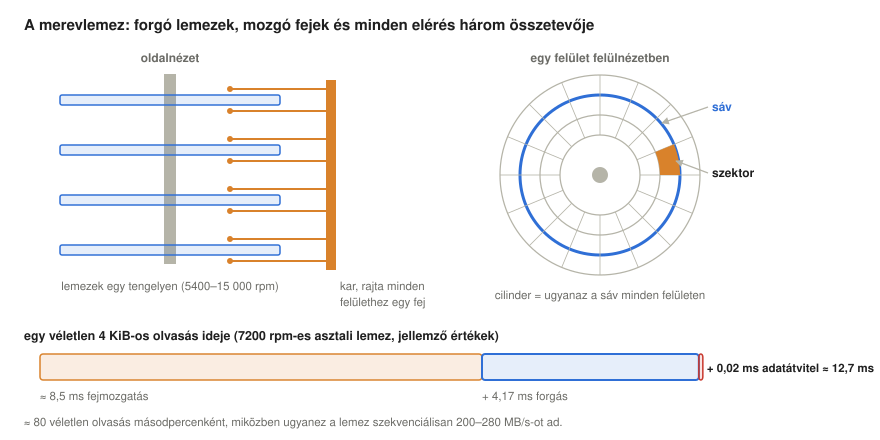
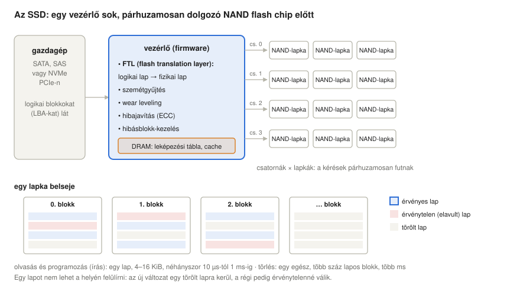
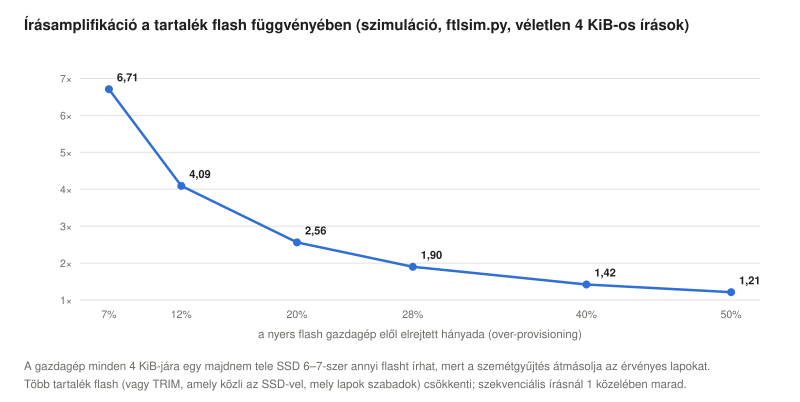
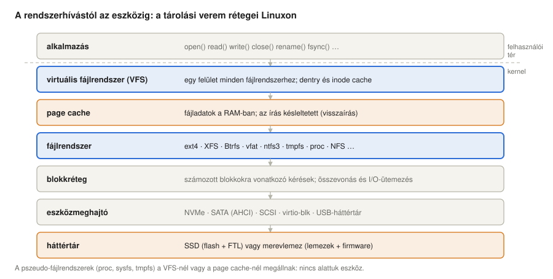
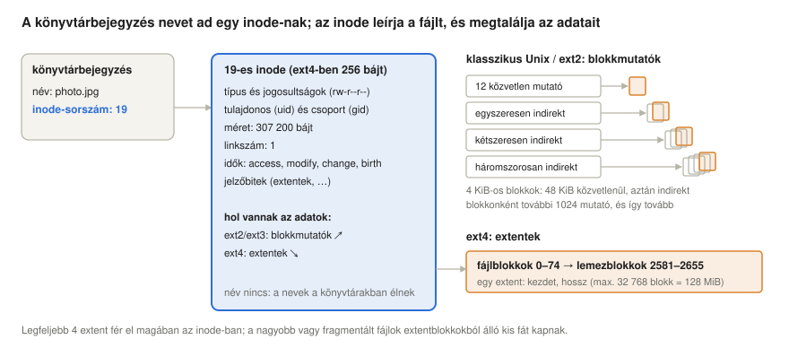
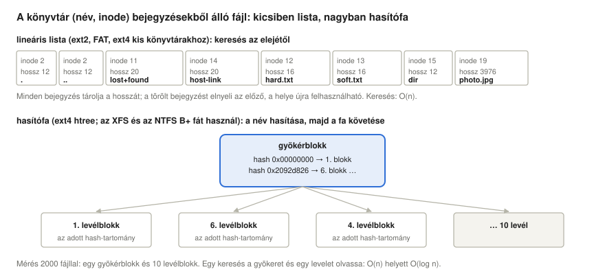
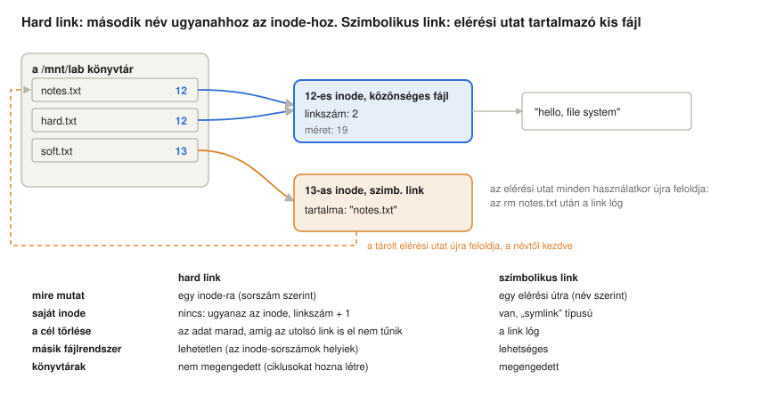
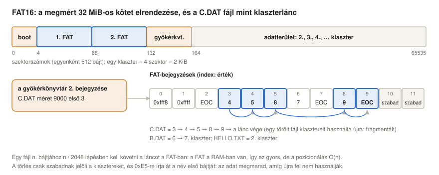
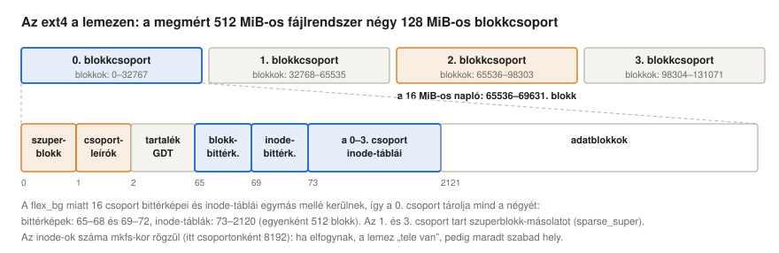
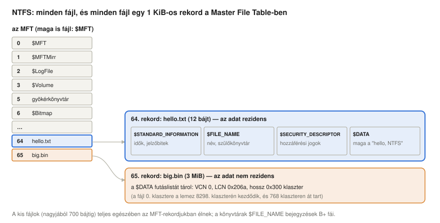

# Fájlrendszerek

*Operációs rendszerek előadás: hogyan tárolják az adatokat a merevlemezek és az SSD-k, és hogyan lesz a fájlrendszer jóvoltából a számozott blokkokból névvel ellátott fájl és könyvtár: inode-ok, könyvtárak, hard és szimbolikus linkek, helyfoglalás, naplózás, valamint négy valódi fájlrendszer (FAT16, ext4, XFS és NTFS) darabjaira szedve, Linuxon*

Előző: [Virtuális memória](../08-virtual-memory/).

> **Hogyan olvasd ezt az előadást?** Ahol új rövidítés vagy fogalom jelenik meg, utána egy **Egyszerűen elmagyarázva** feliratú doboz következik. Kattints rá, és kinyílik egy köznapi nyelvű magyarázat. Ha már ismered a fogalmakat, nyugodtan átugorhatod ezeket a dobozokat.

## Tanulási célok

Az [előző előadás](../08-virtual-memory/) a lemezt a memória lassú, de nagy szintjeként használta. Ez az előadás a lemezt önmagában vizsgálja: mint azt a helyet, ahol az adatnak túl kell élnie az áramszüneteket, az összeomlásokat és az évtizedeket, és ahol úgy kell elrendezni, hogy emberek és programok név szerint megtalálják.

Az előadás végére a hallgatók képesek lesznek:

- leírni, hogyan épül fel egy merevlemez és egy SSD, megbecsülni mindkettőn egy véletlen és egy szekvenciális elérés költségét, és elmagyarázni, miért van szüksége az SSD-nek flash-fordítórétegre, szemétgyűjtésre, kopáskiegyenlítésre és TRIM-re;
- elmagyarázni a fájl és a könyvtár absztrakcióját, a tárolási verem rétegeit és a virtuális fájlrendszer szerepét;
- leírni, mi az inode, megmagyarázni, miért a könyvtárakban és nem az inode-okban tároljuk a neveket, és összehasonlítani a blokkmutatókat az extentekkel;
- elmagyarázni a hard és a szimbolikus linkeket, és azt, hogyan viselkednek, ha a célt törlik, áthelyezik, vagy az egy másik fájlrendszeren van;
- leírni, hogyan tárolódnak a könyvtárak listaként, illetve hasítófás vagy kiegyensúlyozott faként;
- elmagyarázni a szabad terület kezelését, a fragmentációt, a késleltetett foglalást, az összeomlás-konzisztenciát és a naplózást;
- leírni a FAT16, az ext4, az XFS és az NTFS lemezen tárolt szerkezetét, és összehasonlítani őket;
- mindezt megvizsgálni Linuxon a `stat`, `ls -i`, `debugfs`, `filefrag`, `dumpe2fs`, `xfs_db` és `ntfsinfo` eszközökkel.

<details>
<summary><b>Egyszerűen elmagyarázva:</b> fájlrendszer, perzisztens, blokk, szektor, SSD, HDD</summary>

- **Fájlrendszer:** az a módszer, amellyel az operációs rendszer fájlokat tárol a lemezen: hol vannak egy fájl bájtjai, mi a neve, ki olvashatja. Olyan, mint egy közkönyvtár katalógusa és polcrendje.
- **Perzisztens (tartós):** megmarad akkor is, ha nincs áram. A RAM kikapcsoláskor mindent elfelejt, a lemez nem.
- **Blokk, szektor:** a lemez nem egyes bájtokat tárol, hanem csak rögzített méretű darabokat: az eszközön **szektort** (512 bájt vagy 4 KiB), a fájlrendszerben **blokkot** (általában 4 KiB).
- **HDD** (hard disk drive, merevlemez): forgó mágneses lemezekből álló meghajtó. **SSD** (solid-state drive, félvezető alapú meghajtó): flash-memóriachipekből álló „lemez”, mozgó alkatrészek nélkül.

</details>

## Miért van szükség fájlrendszerekre?

Egy háttértár egyetlen dolgot kínál: számozott blokkok tömbjét, amelyeket olvasni és írni lehet. Egy program, és egy ember is, valami egészen mást szeretne: névvel ellátott **fájlokat**, **könyvtárakba** rendezve, amelyek túlélik az összeomlásokat, megoszthatók és védhetők, és tetszés szerint nőhetnek és zsugorodhatnak. A fájlrendszer az elsőből építi fel a másodikat. Minden fájlra négy kérdést kell megválaszolnia:

- **Elnevezés:** hogyan találunk meg egy fájlt? Egy elérési úttal, például `/home/peter/notes.txt`, amelyet a könyvtárakon keresztül oldunk fel.
- **Helyfoglalás:** mely blokkok tárolják az adatait, és mely blokkok szabadok?
- **Metaadatok:** mekkora, ki a tulajdonosa, ki olvashatja, mikor módosult?
- **Konzisztencia:** mi történik, ha egy módosítás közepén elmegy az áram?

Az 1970-es évek elején tervezett Unix olyan válaszokat adott, amelyeket a legtöbb rendszer ma is követ: a fájl strukturálatlan bájtsorozat, a könyvtár olyan fájl, amely neveket rendel fájlsorszámokhoz (**inode**-okhoz), az eszközök, a csővezetékek, sőt a kernel adatai is fájlként jelennek meg egyetlen fában (Ritchie & Thompson, 1974). A [történeti előadás](../01-historic-evolution/#xi-tartós-adatok-fájlrendszerek) a fájlrendszereket azok közé a szolgáltatások közé sorolta, amelyekkel az operációs rendszer az értékes adatokat őrzi; ez az előadás azt mutatja meg, hogyan működnek.

<details>
<summary><b>Egyszerűen elmagyarázva:</b> elérési út, könyvtár, metaadat, konzisztencia</summary>

- **Elérési út:** a fájl „címe”, azoknak a mappáknak a listája, amelyek elvezetnek hozzá, `/` jellel elválasztva.
- **Könyvtár:** egy mappa: nevek listája, és mindegyik név egy fájlra vagy egy másik könyvtárra mutat.
- **Metaadat:** adat az adatról: méret, tulajdonos, jogosultságok, dátumok. Mint egy doboz címkéje, nem pedig a tartalma.
- **Konzisztencia:** minden, amit a fájlokról tárolunk, összhangban van: egyetlen blokk sem tartozik két fájlhoz, és egyetlen fájl sem mutat szabad blokkra.

</details>

## Háttértárak

### Merevlemezek

A merevlemez a biteket apró, mágnesezett tartományokként tárolja forgó **lemezek** (platter) felületén. Minden felület fölött néhány nanométerrel egy mozgó **karon** ülő **(író-olvasó) fej** repül. A felület koncentrikus **sávokra**, minden sáv **szektorokra** oszlik; a szektor a legkisebb egység, amelyet a lemez olvas vagy ír (hagyományosan 512 bájt, a modern, „Advanced Format” lemezeken 4 KiB). Az összes felület azonos sávja együtt egy **cilindert** alkot:



Egy szektor beolvasása három lépésből áll:

1. **Fejmozgatás (seek):** a kar a megfelelő sávra áll, átlagosan néhány ezredmásodperc alatt (asztali lemezen 8–9 ms, gyors szerverlemezen kb. 4 ms).
2. **Forgási késleltetés:** várakozás, amíg a szektor a fej alá fordul. Átlagosan fél fordulat: percenként 7200 fordulatnál egy fordulat 8,33 ms, így az átlagos várakozás 4,17 ms.
3. **Adatátvitel:** a bitek kiolvasása, miközben elhaladnak, a mai lemezeken 200–280 MB/s sebességgel; 4 KiB kb. 0,02 ms alatt.

Egy véletlen 4 KiB-os olvasás tehát kb. 12–13 ms-ba kerül, és egy lemez másodpercenként kb. 80 ilyen olvasást teljesít, míg a szekvenciális olvasás, amely a fejmozgatást és a forgást csak egyszer fizeti meg, teljes átviteli sebességgel halad. A kettő közötti, több százszoros különbség minden klasszikus fájlrendszer tervezését meghatározta: **tartsd együtt az összetartozó adatokat** (Ruemmler & Wilkes, 1994; McKusick et al., 1984).

A modern lemezek elrejtik a geometriájukat. Az operációs rendszer **logikai blokkcímek** (LBA 0, 1, 2, …) lineáris tömbjét látja; a lemez maga képezi le ezeket cilinderekre, fejekre és szektorokra, a hosszabb külső sávokra több szektort tesz (zónás rögzítés, ami a külső, alacsony sorszámú LBA-kat gyorsabbá teszi), és csendben lecseréli a hibás szektorokat. A kapacitás olyan technikákkal nő tovább, mint a zsindelyes rögzítés (egymást átfedő sávok) és a hővel segített rögzítés (HAMR): a Seagate legfeljebb 36 TB-os HAMR-meghajtókat jelentett be (Seagate, n.d.). A merevlemez továbbra is a terabájtonként legolcsóbb tár, és az adatközpontokban ma is ez tárolja a tömeges adatokat, míg a laptopokban és mindenhol, ahol a késleltetés számít, az SSD váltotta fel.

<details>
<summary><b>Egyszerűen elmagyarázva:</b> lemez, fej, sáv, szektor, cilinder, fejmozgatás, forgási késleltetés, rpm, LBA, Advanced Format</summary>

- **Lemez (platter):** mágneses anyaggal bevont forgó korong, olyan, mint egy bakelitlemez, amely biteket tárol.
- **Fej:** a kar végén lévő apró író-olvasó elem, olyan, mint egy lemezjátszó tűje, amely sosem ér hozzá a lemezhez.
- **Sáv:** egy gyűrű a lemezen. **Szektor:** egy sáv egy szelete, a legkisebb darab, amelyet a lemez olvas vagy ír.
- **Cilinder:** ugyanaz a gyűrű az összes lemezen, amely a kar mozgatása nélkül elérhető.
- **Fejmozgatás (seek):** a kar a megfelelő gyűrűhöz mozog. **Forgási késleltetés:** várakozás, amíg a megfelelő szelet odaér.
- **rpm** (revolutions per minute): fordulat percenként: milyen gyorsan forognak a lemezek.
- **LBA** (logical block address, logikai blokkcím): egyszerűen egy szektor sorszáma, 0, 1, 2, …, függetlenül attól, hol van fizikailag.
- **Advanced Format:** 512 bájtos helyett 4096 bájtos szektorokat használó lemezek.
- **Zónás rögzítés:** a külső gyűrűk hosszabbak, ezért több szektor fér rájuk, és gyorsabban haladnak el a fej alatt.
- **Zsindelyes rögzítés (SMR), hővel segített rögzítés (HAMR):** trükkök, hogy a gyűrűk közelebb kerüljenek egymáshoz: úgy fedik át egymást, mint a tetőcserepek, vagy írás közben egy lézer felmelegít egy apró pontot.
- **Hibás szektor átirányítása:** a lemez csendben egy tartalékszektort használ a sérült helyett.

</details>

### SSD-k

Az SSD a biteket **NAND flash** chipek celláiba zárt elektromos töltésként tárolja. Egy cella egy bitet (SLC), kettőt (MLC), hármat (TLC) vagy négyet (QLC) tárol; több bit cellánként olcsóbbá, de lassabbá és kevésbé tartóssá teszi a flasht. A mai chipek több száz rétegben halmozzák egymásra a cellákat (3D NAND). A flashre három különös szabály vonatkozik:

- Az olvasás és a **programozás** (írás) 4–16 KiB-os **lapokon** működik, olvasásnál néhányszor tíz, írásnál néhányszor száz mikroszekundum alatt.
- Egy lapot csak **törölt** állapotban lehet programozni, a törlés pedig csak több száz vagy több ezer lapból álló teljes **blokkokon** működik, és ezredmásodpercekig tart.
- Minden blokk korlátozott számú **programozási/törlési ciklust (P/E)** bír ki: SLC-nél legfeljebb kb. 100 000-et, MLC-nél néhány ezret, TLC-nél egy-háromezret, QLC-nél néhány száztól ezerig (SpeedGuide, n.d.).

Az SSD ezért nem tud egy logikai blokkot a helyén felülírni. A vezérlője egy **flash-fordítóréteg (FTL)** (flash translation layer) nevű firmware-t futtat, amely a flasht közönséges lemeznek mutatja (Agrawal et al., 2008):



- **Leképezés:** egy logikai blokk minden írása valahol egy friss, törölt lapra kerül; egy leképezési tábla (a vezérlő DRAM-jában) nyilvántartja, hol van éppen az egyes logikai blokkok tartalma, a régi példányt pedig **érvénytelennek** jelöli.
- **Szemétgyűjtés:** amikor kezdenek elfogyni a törölt blokkok, a vezérlő kiválaszt egy kevés érvényes lapot tartalmazó blokkot, az érvényes lapokat máshová másolja, és törli a blokkot.
- **Kopáskiegyenlítés:** az írásokat az összes blokk között elosztja, hogy egyik se kopjon el idő előtt.
- **Hibajavítás**, hibásblokk-kezelés és párhuzamosság: a vezérlő több **csatornát** hajt meg, mindegyiken több flash-lapkával, így sok kérés fut egyszerre. Ezért van szüksége az SSD-nek mély kérési sorokra, amelyeket az NVMe interfész biztosít.

A szemétgyűjtés által végzett másolások olyan írások, amelyeket a gazdagép sosem kért. A flash-írások és a gazdagép-írások aránya az **írásamplifikáció (write amplification)**. Értéke egyrészt attól függ, mennyi tartalék flash áll az FTL rendelkezésére, vagyis mekkora a **tartalékterület (over-provisioning)**, másrészt a terheléstől. Az `ftlsim.py` szimulátor megmutatja a hatást ([linuxos szakasz](#egy-ssd-szimulálva)):



Egy tele meghajtó, amelyet 7% tartalék flash mellett véletlenszerűen írunk, a gazdagép minden bájtjára 6,7 bájt flasht ír (Hu et al., 2009, ezt az esetet elemzi); ha a meghajtó negyede szabad, és erről az SSD tud, a tényező 2 alá esik; szekvenciális írásnál 1 marad. Az operációs rendszer kétféleképpen segíthet: megmondhatja az SSD-nek, mely blokkokban nincs már adat (**TRIM**, más néven *discard*, amelyet az `fstrim` vagy maga a fájlrendszer ad ki), és írhat nagy, szekvenciális darabokban. Az SSD a merevlemez szabályát a feje tetejére állítja: a véletlen olvasás olcsó (néhányszor tíz mikroszekundum), így a fejmozgatást elkerülő elrendezés sokkal kevésbé fontos, viszont az **írási minták** jobban számítanak.

<details>
<summary><b>Egyszerűen elmagyarázva:</b> NAND flash, SLC/MLC/TLC/QLC, lap, blokk, programozás, törlés, P/E ciklus, FTL, szemétgyűjtés, kopáskiegyenlítés, írásamplifikáció, tartalékterület, TRIM, NVMe, csatorna, lapka</summary>

- **NAND flash:** az SSD-kben és pendrive-okban lévő memóriachipek; áram nélkül is megőrzik az adatot, mert elektronokat zárnak csapdába.
- **SLC, MLC, TLC, QLC:** egy, kettő, három vagy négy bit memóriacellánként. Több bit: olcsóbb, de lassabb, és hamarabb elkopik.
- **Lap:** a flash legkisebb darabja, amelyet olvasni vagy írni lehet (néhány KiB). **Blokk:** több száz lap csoportja, a legkisebb darab, amelyet törölni lehet.
- **Programozás:** egy lap írása. **Törlés:** egy egész blokk kiürítése, hogy a lapjai újra írhatók legyenek. **P/E ciklus:** egy programozás-törlés kör; egy cella csak meghatározott számút bír ki.
- **FTL** (flash translation layer, flash-fordítóréteg): az SSD beépített szoftvere, amely nyilvántartja, hogy „a számítógép által kért blokkszám” valójában hol van a flashben; olyan, mint egy ruhatáros, aki bármelyik szabad fogasra akasztja a kabátodat, és felírja a számát.
- **Szemétgyűjtés:** rendrakás: a még szükséges lapokat kimenti egy blokkból, hogy az egész blokkot törölni lehessen.
- **Kopáskiegyenlítés:** az írások elosztása úgy, hogy minden blokk egyforma ütemben kopjon, mint amikor egy autó gumijait körbecserélik.
- **Írásamplifikáció:** az SSD többet ír, mint amennyit a számítógép kért tőle, a rendrakás miatt.
- **Tartalékterület (over-provisioning):** az SSD által elrejtett többlet flash, munkaterületnek.
- **TRIM:** az operációs rendszer szól az SSD-nek: „ezeket a blokkokat már nem használom”, így azokat nem kell átmásolnia.
- **NVMe:** az SSD-k gyors, közvetlen csatlakoztatása PCIe-n keresztül, sok párhuzamos kérési sorral. **PCIe:** a számítógép leggyorsabb belső bővítőcsatlakozása. **SATA, SAS:** régebbi, merevlemezekhez készült kábelek és protokollok.
- **3D NAND:** több száz rétegben egymásra halmozott flash-cellák, mint egy felhőkarcoló emeletei.
- **ECC** (error-correcting code, hibajavító kód): többletbitek, amelyek segítségével a vezérlő felismeri és kijavítja a kiolvasott adat kisebb hibáit.
- **Csatorna, lapka (die):** a lapka egy flashchip; a csatorna egy chipcsoporthoz vezető kapcsolat. Sok dolgozik egyszerre.

</details>

## Fájlok és a tárolási verem

A **fájl** névvel ellátott bájtsorozat, metaadatokkal. A programok néhány rendszerhíváson keresztül használják: `open` (megkeresi a nevet, ellenőrzi a jogosultságokat, visszaad egy **fájlleírót**), `read` és `write` (az aktuális **pozíción**, angolul offset, amely ezután előrelép), `lseek` (a pozíció áthelyezése), `fsync` (az adatok kikényszerítése az eszközre), `close`, könyvtárszinten pedig `rename`, `unlink`, `mkdir`, `link`, `symlink`. A kernel minden folyamathoz nyilvántartja a megnyitott fájlleírók tábláját; mindegyik egy **megnyitott fájl leírására** (open file description) mutat, amely a pozíciót és a megnyitási módot tárolja, és a fájl memóriabeli inode-jára mutat. Egy fájlt az `mmap` hívással a memóriába is be lehet képezni; ekkor a lap-gyorsítótárbeli lapjai a folyamat címtartományának lapjaivá válnak, ahogy a [virtuális memóriáról szóló előadás](../08-virtual-memory/#nagyobb-major-laphibák) megmutatta.

E hívások és az eszköz között több réteg áll:



- A **virtuális fájlrendszer (VFS)** egyetlen műveletkészletet határoz meg (open, read, lookup, create, …), amelyet minden fájlrendszer megvalósít. Így tud egyetlen `cat` parancs olvasni egy fájlt ext4-en, egy FAT-ra formázott pendrive-on, egy hálózati megosztáson, vagy egy olyan fájlt, amelyet a kernel menet közben állít elő a `/proc` alatt: a [linuxos szakasz](#egy-interfész-sok-fájlrendszer) megmutatja az azonos rendszerhívásokat. A VFS a könyvtárbejegyzéseket (**dentry-gyorsítótár**) és az inode-okat is gyorsítótárazza, hogy az ismételt útvonal-feloldások ne nyúljanak a lemezhez.
- A **lap-gyorsítótár (page cache)**, amelyet a [kétszintű memóriákról szóló előadás](../07-two-level-memory-and-cache/#a-ram-mint-a-lemez-gyorsítótára) megmért, a fájlok adatait a RAM-ban tartja. Az írás általában csak a lap-gyorsítótárat módosítja, és visszatér; a kernel a piszkos (dirty) lapokat később írja vissza: kb. 30 másodperc után, amikor a piszkos adat meghaladja a memória egy hányadát (`dirty_background_ratio`), vagy memóriaszűke esetén. Ha egy programnak biztosnak kell lennie abban, hogy az adatai valóban az eszközre kerültek, meg kell hívnia az `fsync`-et, ami drága ([linuxos szakasz](#a-tartósság-ára)).
- A **fájlrendszer** a fájlokat és könyvtárakat blokkokra képezi le.
- A **blokkréteg** sorba állítja, összevonja és ütemezi a számozott blokkokra vonatkozó kéréseket, az **eszközmeghajtó** (driver) pedig az eszköz protokollját beszéli (NVMe, SATA, SCSI, virtio). A blokkréteg **I/O-ütemezője** főleg merevlemezeknél számít: az `mq-deadline` és a `bfq` rendezi és összevonja a kéréseket, hogy kevesebb legyen a fejmozgatás (a régi liftalgoritmus ötlete), a gyors NVMe SSD-k viszont általában `none` beállítással futnak.

A lemezt általában **partíciókra** osztják, amelyeket egy partíciós tábla ír le (a régi **MBR** vagy a mai **GPT**), és minden partíció egy fájlrendszert tartalmaz. A partíciók és a fájlrendszerek közé a **device mapper** további rétegeket illeszthet: logikai köteteket (**LVM**), amelyek átméretezhetők és több lemezre is kiterjedhetnek, titkosítást (**dm-crypt**) és **RAID**-et, amely úgy kapcsol össze lemezeket, hogy az adat túlélje az egyik meghibásodását (a RAID 1 tükröz, a RAID 5 és 6 paritást ad hozzá), vagy hogy párhuzamosan dolgozzanak (RAID 0). A RAID nem biztonsági mentés: egy törölt fájl egyszerre minden lemezről törlődik.

Végül minden fájlrendszert **csatolunk (mount)** az egyetlen linuxos könyvtárfa egy könyvtárára: a gyökér-fájlrendszert a `/`-re, a többit a `/boot/efi`, `/home`, `/mnt/usb` stb. könyvtárra. Az `/etc/fstab` sorolja fel, mit kell rendszerindításkor csatolni, a `df` vagy a `findmnt` pedig az aktuális csatolásokat mutatja.

<details>
<summary><b>Egyszerűen elmagyarázva:</b> rendszerhívás, fájlleíró, pozíció (offset), fsync, VFS, dentry, lap-gyorsítótár, blokkréteg, meghajtó</summary>

- **Rendszerhívás:** egy program kérése az operációs rendszerhez, például „nyisd meg ezt a fájlt”.
- **Fájlleíró:** egy kis szám (3, 4, 5 …), amelyet az operációs rendszer egy megnyitott fájlhoz ad a programnak, mint egy ruhatári jegy.
- **Pozíció (offset):** az a hely a fájlban, ahol a következő olvasás vagy írás történik, mint egy könyvjelző.
- **fsync:** „gondoskodj róla, hogy ez a fájl most tényleg a lemezen legyen, ne csak a memóriában”.
- **VFS** (virtual file system, virtuális fájlrendszer): a Linux azon része, amely minden fájlrendszer-fajtának ugyanazt a felületet adja, mint egy univerzális úti csatlakozóadapter, amely bármelyik ország konnektorába illik.
- **Dentry:** egy megjegyzett (gyorsítótárazott) kapcsolat egy könyvtárbeli név és egy fájl között.
- **Lap-gyorsítótár (page cache):** a fájlok tartalmának RAM-ban tartott másolatai, hogy ne kelljen őket újra a lemezről beolvasni.
- **Blokkréteg:** a kernel azon része, amely összegyűjti és sorba rendezi a lemezkéréseket. **Meghajtó (driver):** a kód, amely egy adott eszközfajtával „beszél”.
- **Megnyitott fájl leírása:** a kernel feljegyzése egy fájl egy megnyitásáról: hol tartasz benne, és olvashatod-e vagy írhatod-e.
- **Piszkos (dirty) lap, visszaírás:** a memóriában módosított, de még a lemezre nem mentett lap; a későbbi kiírása a visszaírás.
- **mmap:** egy fájl közvetlen megjelenítése egy program memóriájában.
- **I/O-ütemező:** a blokkréteg azon része, amely eldönti, milyen sorrendben szolgálja ki a lemezkéréseket, mint egy lift, amely sorban áll meg az emeleteken, nem a gombnyomások sorrendjében.
- **Partíció, MBR, GPT:** a lemezt különálló részekre lehet vágni; ezeket a partíciós tábla sorolja fel (az MBR a régi formátum, a GPT az új).
- **Device mapper, LVM, dm-crypt:** linuxos rétegek, amelyek valódi lemezekre „virtuális lemezeket” építenek: átméretezhető (LVM) vagy titkosított (dm-crypt) köteteket.
- **RAID:** több lemez, amely egyként működik, hogy túlélje egy lemez meghibásodását, vagy hogy gyorsabb legyen.
- **Csatolás (mount), csatolási pont, /etc/fstab:** egy fájlrendszer hozzákapcsolása az egyetlen nagy könyvtárfa egy mappájához; az `/etc/fstab` az induláskor csatolandó fájlrendszerek listája.

</details>

## Inode-ok

A Unix-fájlrendszerekben egy fájl metaadatait egy rögzített méretű rekord, az **index node**, röviden **inode** tárolja, amelyet a sorszáma azonosít. Az inode tartalmazza a fájl típusát és jogosultságait, a tulajdonost és a csoportot, a méretet, a linkszámot, az időbélyegeket és az adatok helyét. A fájl nevét **nem** tartalmazza: a nevek a könyvtárakban vannak, amelyek neveket rendelnek inode-sorszámokhoz. Ez a szétválasztás teszi lehetővé a hard linkeket, a fájlrendszeren belüli `rename`-et és egy megnyitott fájl törlését.



Az adatok helyét kétféleképpen lehet nyilvántartani:

- **Blokkmutatók** (klasszikus Unix, ext2, ext3): az inode 12 közvetlen mutatót tartalmaz adatblokkokra, aztán egy egyszeresen indirekt mutatót egy mutatókkal teli blokkra, egy kétszeresen és egy háromszorosan indirekt mutatót. A kis fájlokhoz nincs szükség extra olvasásra, a nagyok egy fán keresztül érhetők el; egy 1 GiB-os fájlhoz azonban 262 144 mutató kell, blokkonként egy, még akkor is, ha a blokkjai egymás után következnek.
- **Extentek (összefüggő blokktartományok)** (ext4, XFS, az NTFS futáslistái, Btrfs): az inode tartományokat tárol: „a fájl 0–74. blokkja a lemez 2581–2655. blokkja”. Egy összefüggő fájlhoz egyetlen bejegyzés elég, bármekkora is. Az ext4 legfeljebb négy extentet tart magában az inode-ban, többhöz extentblokkokból álló kis fát épít; egy extent legfeljebb 32 768 blokkot fed le, 4 KiB-os blokkokkal 128 MiB-ot (Mathur et al., 2007).

Két következmény, amely sok felhasználót meglep:

- **Ritka fájlok (sparse file):** egy fájlban lehetnek **lyukak**, olyan tartományok, amelyeket sosem írtak, és nincsenek blokkjaik. Olvasáskor nullákat adnak. A [linuxos szakasz](#ritka-fájlok-extentek-és-késleltetett-foglalás) létrehoz egy 1 GiB-os fájlt, amely 4 KiB-ot foglal.
- **Az inode-ok száma rögzített** az ext2/3/4-ben a fájlrendszer létrehozásakor (alapértelmezésben 16 KiB területenként egy inode, 512 MiB alatti fájlrendszereken 4 KiB-onként egy). Egy fájlrendszer „megtelhet”, miközben van szabad hely, ha nagyon sok kis fájlt tárol ([linuxos szakasz](#elfogynak-az-inode-ok)). Az XFS és a Btrfs dinamikusan foglal inode-okat, így ritkán fogynak ki belőlük: a korlátjuk a terület egy hányada, nem egy előre rögzített szám.

Az inode-ban tárolt jogosultságok a klasszikus Unix-**módbitek**: olvasás, írás és végrehajtás (`rwx`) a tulajdonosnak, a csoportnak és mindenki másnak, általában oktálisan írva: `0644` = `rw-r--r--`, olvasás és írás a tulajdonosnak, csak olvasás a többieknek. Könyvtárnál az „olvasás” a nevek listázását jelenti, az „írás” bejegyzések létrehozását és törlését, a „végrehajtás” pedig azt, hogy egy elérési úton át lehet haladni rajta. A hozzáférés-vezérlési listák (ACL-ek) további felhasználókra és csoportokra vonatkozó szabályokat adhatnak hozzá.

<details>
<summary><b>Egyszerűen elmagyarázva:</b> inode, inode-sorszám, blokkmutató, indirekt blokk, extent, ritka fájl, lyuk</summary>

- **Inode:** a fájl „személyi igazolványa”: minden, ami a fájlról tudható, a nevén kívül, beleértve azt is, hol van a tartalma a lemezen.
- **Inode-sorszám:** a személyi igazolvány száma. A könyvtárak a neveket ezekhez a számokhoz kötik.
- **Blokkmutató:** egy lemezblokk sorszáma, amely a fájl egy részét tartalmazza. **Indirekt blokk:** további mutatókat tartalmazó blokk, mint egy tartalomjegyzék-oldal, amely más tartalomjegyzék-oldalakat sorol fel.
- **Extent:** egymást követő blokkok egész sorozatának leírása: „itt kezdődik, ennyi blokk”. Mintha azt mondanánk: „10-től 85-ig az oldalak”, ahelyett, hogy minden oldalt felsorolnánk.
- **Ritka fájl, lyuk:** olyan fájl, amelyben vannak sosem írt hézagok; a hézagok nem foglalnak helyet, és olvasáskor nullák.
- **Btrfs:** modern linuxos fájlrendszer, amely sosem írja felül az adatot a helyén (írásra másolás, lásd lejjebb).
- **Módbitek, rwx, oktális:** a kilenc igen/nem kapcsoló, amely megmondja, ki olvashat, írhat vagy futtathat egy fájlt: három a tulajdonosnak, három a csoportnak, három mindenki másnak. A `0644` ezek rövid leírása.
- **ACL** (access control list, hozzáférés-vezérlési lista): annak listája, ki mit tehet egy fájllal, részletesebb, mint a kilenc módbit.

</details>

## Könyvtárak

A könyvtár olyan fájl, amelynek tartalma **bejegyzések** listája; mindegyik bejegyzés egy nevet párosít egy inode-sorszámmal (az ext4-ben a fájl típusával is). Minden könyvtárban van két különleges bejegyzés: a `.` önmagára, a `..` a szülőjére mutat. A `/home/peter/notes.txt` megnyitásához a kernel a gyökérkönyvtár inode-jánál kezd (ext4-ben ez a 2-es inode), beolvassa a bejegyzéseit, hogy megtalálja a `home`-ot, beolvassa azt a könyvtárat, hogy megtalálja a `peter`-t, és így tovább: ez az **útvonal-feloldás**, komponensenként egy könyvtárbeli kereséssel, mindegyiket a dentry-gyorsítótár segíti.



A legegyszerűbb szerkezet a **lineáris lista**, amelyet a FAT, az ext2 és az ext4 használ kis könyvtárakhoz. Minden ext4-bejegyzés tárolja a saját hosszát, így egy bejegyzés törlése csak meghosszabbítja az előzőt, a keresés pedig végigolvassa a listát: n bejegyzésnél O(n). Egy millió fájlt tartalmazó könyvtárban keresésenként egymillió összehasonlítás kellene. A modern fájlrendszerek ezért indexelik a nagy könyvtárakat:

- Az **ext4** **htree**-vé (hasítófává) alakítja a könyvtárat, amint az kinövi az egy blokkot: a neveket hasítja, és egy gyökérblokk (nagyon nagy könyvtáraknál egy vagy két szint indexblokk is) hasítóérték-tartományokat rendel a bejegyzéseket tartalmazó levélblokkokhoz. Egy keresés a gyökeret és egyetlen levelet olvassa be ([linuxos szakasz](#egy-könyvtár-2000-fájllal)).
- Az **XFS** és az **NTFS** a könyvtárakat **B+ fákként** tárolja, hasítóérték (XFS) vagy név (NTFS) szerint rendezve; az XFS a nagyon kis könyvtárakat magában az inode-ban tartja (Sweeney et al., 1996).

Mivel minden könyvtár tartalmaz `..` bejegyzést, és minden alkönyvtár `..`-ja visszamutat a szülőjére, egy könyvtár linkszáma 2 plusz az alkönyvtárainak száma.

<details>
<summary><b>Egyszerűen elmagyarázva:</b> könyvtárbejegyzés, `.` és `..`, útvonal-feloldás, lineáris lista, hasítás, htree, B+ fa</summary>

- **Könyvtárbejegyzés:** egy sor egy mappa listájában: egy név és a fájl személyi igazolványának száma.
- **`.` és `..`:** „ez a mappa” és „a fölötte lévő mappa”.
- **Útvonal-feloldás:** egy fájl megkeresése az elérési út bejárásával, mappáról mappára.
- **Lineáris lista:** egyszerű lista, amelyben felülről lefelé keresünk, mint egy rövid bevásárlólistában.
- **Hasítás (hash):** egy névből kiszámított szám, amellyel egy nagy lista megfelelő részére lehet ugrani, mint a telefonkönyv betűfülei.
- **Htree, B+ fa:** fa alakú indexek, amelyekben néhány lépés bármelyik bejegyzéshez elvezet, akármennyi is van.

</details>

## Hard linkek és szimbolikus linkek

Mivel a nevek és az inode-ok külön vannak, egy fájlnak több neve is lehet. A **hard link (merev link)** egyszerűen egy újabb könyvtárbejegyzés, amely ugyanarra az inode-ra mutat: `ln notes.txt hard.txt`. A két név egyenrangú; egyik sem „az eredeti”. Az inode **linkszáma** rögzíti, hány neve van, és a fájl adatai csak akkor szabadulnak fel, amikor a szám nullára csökken, és egyetlen folyamat sem tartja megnyitva a fájlt.

A **szimbolikus link** (symlink, soft link) külön kis fájl, „symlink” típussal, amelynek tartalma egy **elérési út**: `ln -s notes.txt soft.txt`. Megnyitásakor a kernel a tárolt elérési úttal folytatja az útvonal-feloldást.



A különbségek ezekből a definíciókból következnek, és a [linuxos szakasz](#hard-és-szimbolikus-linkek-a-gyakorlatban) mindegyiket bemutatja:

- A `notes.txt` törlése egyetlen nevet távolít el. A hard link továbbra is eléri az adatot; a szimbolikus link viszont **lógó link** lesz, mert a benne tárolt elérési út már nem oldható fel.
- Hard link nem mutathat át egy másik fájlrendszerre, mert az inode-sorszámok csak egy fájlrendszeren belül egyediek (`Invalid cross-device link`). Szimbolikus link bárhová mutathat, még olyan elérési útra is, amely még nem létezik.
- Könyvtárra mutató hard link tilos: ciklusokat hozhatna létre a fában, és a `..` többértelművé válna. Könyvtárra mutató szimbolikus link megengedett, és a fát bejáró eszközök (`find`, `du`) alapértelmezésben nem követik.
- A cél áthelyezése tönkreteszi a szimbolikus linket, a hard linket viszont nem; a fájlrendszeren belüli `rename` csak könyvtárbejegyzéseket ír át, és sosem nyúl az inode-hoz.

A Windows ugyanezt a két fogalmat kínálja NTFS-en: hard linkeket (fájlonként legfeljebb 1023-at) és szimbolikus linkeket, továbbá *junctionöket* (csomópontokat), a könyvtárra mutató linkek egy régebbi fajtáját.

<details>
<summary><b>Egyszerűen elmagyarázva:</b> hard link, linkszám, szimbolikus link, lógó link, eszközök közötti link</summary>

- **Hard link:** egy második név pontosan ugyanahhoz a fájlhoz, mint egy ember, aki két néven szerepel a telefonkönyvben, de egy telefonja van.
- **Linkszám:** hány neve van egy fájlnak. A fájl csak akkor törlődik valóban, ha az utolsó neve is eltűnt.
- **Szimbolikus link:** egy cetli, amelyen ez áll: „a keresett fájl ezen a címen van”, mint egy tábla: „átköltöztünk a 12-es szám alá”.
- **Lógó link:** egy tábla, amely olyan címre mutat, ahol már nincs semmi.
- **Eszközök közötti (cross-device) link:** hard link egy másik lemezen vagy partíción lévő fájlra; lehetetlen, mert a fájlsorszámoknak csak egy fájlrendszeren belül van jelentésük.
- **Junction:** a Windows régebbi, mappára mutató linkje.

</details>

## Foglalás és szabad terület

A fájlrendszernek tudnia kell, mely blokkok szabadok, és blokkokat kell választania az új adatoknak:

- **Bittérképek:** blokkonként (és inode-onként) egy bit: ext2/3/4 és NTFS (`$Bitmap`).
- **Maga a foglalási tábla:** a FAT-ban a szabad klaszter táblabejegyzése 0.
- **Szabad extentek B+ fái**, pozíció és méret szerint is indexelve: XFS, amely így gyorsan talál „legalább 1 MiB hosszú szabad szakaszt az X blokk közelében”.

A cél a merevlemez szabálya: egy fájl blokkjai legyenek összefüggők, az összetartozó fájlok pedig legyenek egymás közelében. A Berkeley Fast File System erre vezette be 1984-ben a **cilindercsoportokat** (McKusick et al., 1984); az ext2/3/4 **blokkcsoportoknak**, az XFS **allokációs csoportoknak** hívja őket. Az a fájl, amelynek blokkjai szétszóródtak, **fragmentált**: merevlemezen minden hézag egy fejmozgatásba kerül. A fragmentáció nő, ha a fájlok lassan, egymás mellett nőnek, ha a lemez majdnem tele van, vagy ha a klasztereket előretekintés nélkül, egyenként osztják ki, ahogy a FAT-ot kezelő meghajtóprogramok teszik (first-fit vagy next-fit; a lenti `fat16.py` first-fit stratégiát használ).

Hatékony ellenszer a **késleltetett foglalás** (ext4, XFS, Btrfs): a lap-gyorsítótárba írt adat addig nem kap lemezblokkot, amíg vissza nem írják. Addigra a fájlrendszer tudja, mekkorára nőtt a fájl, és egyetlen nagy extentet foglalhat. A [linuxos szakasz](#ritka-fájlok-extentek-és-késleltetett-foglalás) megmutatja, hogy két, egymás mellett írt fájl egy-egy extentben végzi, illetve fájlonként 16 extentben, ha a program minden 64 KiB után kikényszeríti a visszaírást.

A blokkméret kompromisszum, mint az előző előadás lapmérete: a nagy blokkok kevesebb mutatót és gyorsabb szekvenciális I/O-t jelentenek, de több hely vész el minden fájl utolsó, részben kitöltött blokkjában (belső fragmentáció). A szokásos választás 4 KiB, a lapmérettel egyezően; az NTFS a blokkokat **klasztereknek** hívja, a FAT pedig 2–32 KiB-os klasztereket használ.

<details>
<summary><b>Egyszerűen elmagyarázva:</b> bittérkép, first fit, blokkcsoport, fragmentáció, késleltetett foglalás, klaszter</summary>

- **Bittérkép:** bitek hosszú sora, blokkonként egy: 1 = foglalt, 0 = szabad. Mint egy ülésrend pipákkal.
- **First fit (első illeszkedő):** az első szabad hely elfoglalása, amelyet találsz, még akkor is, ha túl kicsi ahhoz, hogy az egész fájl egy darabban elférjen benne.
- **Blokkcsoport, allokációs csoport:** a lemez régiókra osztva, mindegyik saját nyilvántartással, hogy egy fájl és a hozzá tartozó adatok egymás közelében maradhassanak.
- **Fragmentáció:** egy fájl sok darabban szétszórva a lemezen.
- **Késleltetett foglalás:** csak az utolsó pillanatban dönteni el, hová kerüljön az adat, amikor már világos, mennyi van belőle.
- **Klaszter:** az NTFS és a FAT neve a blokkra.
- **Berkeley Fast File System, cilindercsoport:** az 1984-es Unix-fájlrendszer, amely először tartotta a fájlokat a könyvtáruk közelében, szomszédos cilinderek csoportjaiban.
- **Belső fragmentáció:** egy fájl utolsó blokkjának kihasználatlan maradéka.

</details>

## Összeomlás-konzisztencia és naplózás

Egy fájl létrehozása több szerkezetet érint: az inode-bittérképet, az inode-ot, a könyvtárat, a blokkbittérképet és az adatblokkokat. Ha ezek írása között elmegy az áram, a lemez inkonzisztens marad: lesz egy foglaltnak jelölt blokk, amely egyetlen fájlhoz sem tartozik, vagy, ami rosszabb, egy könyvtárbejegyzés, amely inicializálatlan inode-ra mutat. Háromféle megközelítés létezik:

- **Ellenőrzés és javítás az összeomlás után:** egy program (`fsck`, `chkdsk`) végigolvassa az összes metaadatot, és kijavítja az ellentmondásokat. A FAT, az ext2 és a korai Unix egyetlen módszere ez volt, és a fájlrendszer méretével arányos ideig tart: nagy lemezen órákig.
- **Naplózás** (journaling, write-ahead logging, előre író naplózás), amelyet az ext3/ext4, az XFS és az NTFS használ: mielőtt a metaadatokat a helyükön módosítaná, a fájlrendszer a teljes változtatás leírását egy **naplóba** (journal) írja, és befejezettnek jelöli (**véglegesítés, commit**). Összeomlás után a teljes tranzakciókat újra lejátssza, a befejezetleneket eldobja, mindezt másodpercek alatt. A legtöbb naplózó fájlrendszer csak a **metaadatokat** naplózza. Az ext4 három módot kínál: a `data=journal` az adatokat is naplózza (a legbiztonságosabb, a leglassabb), a `data=writeback` csak a metaadatokat naplózza, tetszőleges sorrendben, az alapértelmezett `data=ordered` pedig egy fájl adatblokkjait még azelőtt kiírja, hogy véglegesítené a rájuk mutató metaadatokat, így egy összeomlás sosem fedhet fel a blokkok egy korábbi tulajdonosától származó elavult adatot. Az NTFS naplójának neve `$LogFile`; az ext4-é egy rejtett fájl, a 8-as inode (a lent megmért 512 MiB-os fájlrendszerben 16 MiB).
- **Írásra másolás (copy-on-write)** (Btrfs, ZFS, APFS; és az őket megelőző naplószerkezetű fájlrendszerek, Rosenblum & Ousterhout, 1992): az élő adatot sosem írjuk felül; az új változatokat máshová írjuk, és egyetlen gyökérmutatót atomi módon átállítunk. Ez olcsó pillanatképeket is ad, a Btrfs-ben és a ZFS-ben pedig minden adat ellenőrzőösszegét. Az F2FS, egy flashre tervezett naplószerkezetű fájlrendszer, az androidos telefonokon gyakori.

Egy negyedik megközelítés, a BSD FFS-ének **soft updates** módszere, olyan gondosan rendezi a metaadatok írását, hogy a lemez mindig konzisztens legyen, kivéve az elszivárgott blokkokat, amelyeket egy háttérellenőrzés szerez vissza.

Ezek egyike sem teszi önmagában biztonságossá az **alkalmazás adatait**: amit az alkalmazás már kiírt, de még nem `fsync`-elt, elveszhet, és az az alkalmazás, amely helyben írja újra a fájlt, félig régi, félig új állapotban hagyhatja. Az atomi frissítés szokásos fogása: új fájlt írunk, `fsync`-eljük, `rename`-mel a régi helyére tesszük (a fájlrendszeren belüli `rename` atomi), majd a könyvtárat is `fsync`-eljük, hogy maga az átnevezés is tartós legyen.

<details>
<summary><b>Egyszerűen elmagyarázva:</b> összeomlás-konzisztencia, fsck, napló, véglegesítés, előre író napló, írásra másolás, pillanatkép, atomi</summary>

- **Összeomlás-konzisztencia:** a lemez nyilvántartásának helyessége akkor is, ha a legrosszabb pillanatban megy el az áram.
- **fsck, chkdsk:** javítóeszközök, amelyek összeomlás után az egész lemezt átnézik, mint amikor egy betörés után egy közkönyvtárban minden könyvet megszámolnak.
- **Napló, előre író napló:** egy napló, amelybe a fájlrendszer először beírja: „ezt fogom csinálni”, és csak utána csinálja meg. Összeomlás után elolvassa a naplót, és befejezi vagy elfelejti a félbemaradt munkát.
- **Véglegesítés (commit):** az a sor a naplóban, amely azt mondja: „ez a változtatás kész”.
- **Írásra másolás (copy-on-write):** soha semmit nem változtatunk a helyén: az új változatot máshová írjuk, aztán egy lépésben átváltunk rá.
- **Pillanatkép:** az összes fájl egy pillanatban megfagyasztott képe, amelyet az írásra másolásnak köszönhetően olcsón meg lehet tartani.
- **Atomi:** vagy teljesen megtörténik, vagy egyáltalán nem, soha nem félig.
- **Újrajátszás (replay):** összeomlás után a naplóban rögzített változtatások újbóli végrehajtása.
- **Elavult adat:** egy blokk régi tartalma, amely egy törölt fájlhoz tartozott; egy összeomlás nem engedheti, hogy egy új fájlban felbukkanjon.
- **Naplószerkezetű (log-structured) fájlrendszer:** olyan fájlrendszer, amely mindent, adatot és metaadatot, egyetlen hosszú, szekvenciális naplóként ír. **F2FS:** ilyen fájlrendszer flashhez.
- **Soft updates:** a lemezírások olyan gondos sorba rendezése, hogy nincs szükség naplóra.

</details>

## Négy fájlrendszer

### FAT16

A **File Allocation Table** (fájlfoglalási tábla) fájlrendszert a Microsoft hajlemezes BASIC-jéhez írták az 1970-es évek végén, és az MS-DOS fájlrendszere lett; a FAT16 (16 bites táblabejegyzések) az 1980-as évek közepétől szolgálta ki a merevlemezeket, amíg a Windows 95 OSR2 1996-ban be nem vezette a FAT32-t. Változatai ma is mindenütt ott vannak: FAT32 és exFAT a pendrive-okon, memóriakártyákon és fényképezőgépekben, és FAT32 az EFI-rendszerpartíción, amelyről minden modern PC elindul. A FAT elég egyszerű ahhoz, hogy kézzel szedjük szét ([linuxos szakasz](#fat16-kézzel)):



- A **boot szektor** (a BIOS paraméterblokkal) írja le a geometriát: bájt szektoronként, szektor klaszterenként, a FAT-ok száma és mérete, a gyökérkönyvtár mérete.
- A **FAT** minden adatklaszterhez egy 16 bites bejegyzést tartalmaz. Az *n*. klaszter bejegyzése a fájl *következő* klaszterének számát tárolja, a fájl utolsó klaszterénél egy `0xFFF8` és `0xFFFF` közötti értéket (a lánc vége), hibás klaszternél `0xFFF7`-et, szabad klaszternél 0-t. A 0. és az 1. bejegyzés foglalt: a 0. megismétli a médialeíró bájtot (merevlemeznél `F8`). Egy fájl tehát **klaszterek láncolt listája**, a FAT pedig a láncszemek listája. Biztonsági okból két azonos példányt tartanak belőle.
- A **gyökérkönyvtár** a formázáskor rögzített méretű tábla, merevlemezen jellemzően 512 darab 32 bájtos bejegyzéssel (1,44 MB-os hajlemezen 224-gyel): egy 8.3-as név, attribútumok, tömörített dátum-idő formátumú időbélyegek, az **első klaszter** és a méret. Az alkönyvtárak közönséges fájlok, amelyek ugyanilyen 32 bájtos bejegyzéseket tartalmaznak.
- Nincs inode: a könyvtárbejegyzés *maga* a fájl metaadata, így a FAT nem ismeri a hard linkeket, és nincsenek benne tulajdonosok vagy jogosultságok.
- Egy fájl **törlése** a FAT-ban szabadnak jelöli a klasztereit, a neve első bájtját pedig `0xE5`-re cseréli. Az adat a lemezen marad, amíg újra fel nem használják, ezért működnek a FAT-on a visszaállító (undelete) eszközök, és ezért lehet a törölt fájlokat igazságügyi informatikai módszerekkel visszanyerni (Carrier, 2005).

A FAT16 legfeljebb 65 524 klasztert tud megcímezni. 32 KiB-os klaszterekkel (a legnagyobbal, amelyet az MS-DOS és a Windows 9x elfogad) egy kötet 2 GB-ot tárol, a Windows NT és utódai 64 KiB-os klasztereivel 4 GB-ot; a 32 bites méretmező minden FAT-fájlt 4 GiB − 1 bájtra korlátoz, ami a FAT32-nél számít (Microsoft, 2009). A hosszú fájlnevek a Windows 95-tel érkeztek (**VFAT**), `0x0F` attribútumú többlet-könyvtárbejegyzésekként, amelyeket a régi rendszerek figyelmen kívül hagynak. A FAT gyengeségei a szerkezetéből következnek: a fájlon belüli véletlen elérés klaszterről klaszterre követi a láncot; az előretekintés nélküli foglalás fragmentálja a fájlokat (a megmért `C.DAT` egy törölt fájl klasztereit használja újra); és nincs napló, így egy összeomlás után teljes ellenőrzés kell.

<details>
<summary><b>Egyszerűen elmagyarázva:</b> FAT, klaszter, boot szektor, BIOS paraméterblokk, lánc, 8.3-as név, VFAT, EOC, exFAT, EFI-rendszerpartíció</summary>

- **FAT** (file allocation table, fájlfoglalási tábla): egy tábla, amelyben a lemez minden darabjának egy sor jut; minden sor megmondja, melyik darab következik ugyanabban a fájlban. Mint egy kincskeresés, ahol minden nyom megmondja, hol van a következő.
- **Klaszter:** a FAT neve a blokkra: a lemez azon darabja, amelyet a tábla nyilvántart.
- **Boot szektor, BIOS paraméterblokk:** a lemez első szektora, amely leírja, hogyan van megszervezve a többi.
- **Lánc:** egy fájl klasztereinek a táblán keresztül összefűzött listája. **EOC** (end of chain, a lánc vége): „ez volt az utolsó darab”.
- **8.3-as név:** a régi DOS-szabály: legfeljebb 8 betű, egy pont és legfeljebb 3 betű, például `HELLO.TXT`. **VFAT:** az a trükk, amellyel hosszú nevek kerültek a FAT-ba, `0x0F` attribútumértékkel jelölt többlet-könyvtárbejegyzésekben tárolva.
- **0x…:** hexadecimálisan (16-os számrendszerben) írt szám, amelynek számjegyei 0–9, majd A–F: `0x10` = 16.
- **Médialeíró:** egy bájt, amely megmondja, milyen fajta lemezről van szó (`F8` = merevlemez).
- **Visszaállítás (undelete), igazságügyi informatika:** törölt fájlok visszanyerése; a nyomozók bizonyítékok felkutatására használják.
- **exFAT:** a család újabb tagja nagy memóriakártyákhoz és pendrive-okhoz.
- **EFI-rendszerpartíció:** kis FAT32-partíció minden modern PC-n, amely az operációs rendszert elindító programokat tárolja.

</details>

### ext4

Az **ext** család a Linux saját fájlrendszer-családja: az ext2 (1993) a Berkeley Fast File Systemtől vette át a felépítését (Card et al., 1994), az ext3 (2001) naplót, később hasítófával indexelt könyvtárakat adott hozzá, az **ext4** (2008 decembere, a Linux 2.6.28 óta stabil) pedig extenteket, 48 bites blokkszámokat, késleltetett foglalást és nanoszekundumos időbélyegeket (Mathur et al., 2007), később (2012) az összes metaadat ellenőrzőösszegét. A Debian, az Ubuntu és sok más disztribúció alapértelmezett fájlrendszere.



- A lemez 32 768 blokkos **blokkcsoportokra** oszlik (4 KiB-os blokkokkal 128 MiB). Minden csoportnak van blokkbittérképe, inode-bittérképe és inode-táblája; a **szuperblokk** (méretek, darabszámok, funkciók, állapot) és a **csoportleírók** az elején vannak, egyes csoportokban biztonsági másolatokkal. A `flex_bg` funkcióval 16 csoport bittérképei és inode-táblái egymás mellé kerülnek ([linuxos szakasz](#az-ext4-lemezen-tárolt-szerkezete)).
- Az **inode-ok** 256 bájtosak, 1-től számozva; a 2-es inode a gyökérkönyvtár, a 8-as a napló, a 11-es a `lost+found`. A fájlok adatait **extentek** írják le, a 60 bájtnál rövidebb szimbolikus linkek pedig magában az inode-ban tárolódnak („gyors szimbolikus linkek”, fast symlinks).
- A **könyvtárak** lineáris listák, amelyek növekedéskor **htree**-vé válnak. A **napló**, egy rejtett fájl (8-as inode), amelyet az 512 MiB-os példa a 2. blokkcsoportban tart, alapértelmezésben `data=ordered` módban fut.
- Korlátok: 4 KiB-os blokkokkal legfeljebb 1 EiB-os kötetek és 16 TiB-os fájlok; a Red Hat legfeljebb 50 TiB-os ext4 fájlrendszereket támogat (Red Hat, n.d.). Egy ext4 fájlrendszer bővíthető, és lecsatolt állapotban zsugorítható is.

<details>
<summary><b>Egyszerűen elmagyarázva:</b> szuperblokk, csoportleíró, inode-tábla, flex_bg, gyors szimbolikus link, lost+found</summary>

- **Szuperblokk:** a fájlrendszer fő nyilvántartása: mekkora, hány blokkja és inode-ja van, milyen funkciókat használ. Másolatokat is tartanak belőle arra az esetre, ha az első megsérülne.
- **Csoportleíró:** blokkcsoportonként egy rövid rekord: hol vannak a bittérképei és az inode-táblája, mennyi szabad hely van benne.
- **Inode-tábla:** egy csoport összes személyi igazolványának (inode-jának) tömbje.
- **flex_bg:** ext4-opció, amely több csoport nyilvántartását egymás mellé teszi, hogy egyben be lehessen olvasni.
- **Gyors szimbolikus link (fast symlink):** rövid szimbolikus link, amelynek elérési útja elfér az inode-ban, így nincs szüksége adatblokkra.
- **lost+found:** az a mappa, ahová a javítóeszköz azokat a fájlokat teszi, amelyeket megtalált, de nem tudott elhelyezni.
- **48 bites blokkszámok:** 48 bites blokkcímek, amelyek 2⁴⁸ blokkhoz elegendők.
- **KiB, MiB, GiB, TiB, PiB, EiB:** egységek, amelyek egymás után mindig 1024-szeresükre nőnek. **KB, MB, GB, TB, PB:** ugyanezek a nevek 1000-es lépésekben, ahogy a lemezgyártók használják; 1 TB ≈ 0,91 TiB.
- **sparse_super:** a szuperblokk biztonsági másolatai csak a 0. és az 1. csoportban, valamint a 3, 5 és 7 hatványainak megfelelő csoportokban, nem minden csoportban.
- **Reserved GDT blocks, resize_inode:** szabadon hagyott terület, hogy a fájlrendszert később, használat közben is bővíteni lehessen.
- **INODE_UNINIT, BLOCK_UNINIT, ITABLE_ZEROED:** jelzőbitek, amelyek azt mondják, hogy egy csoport inode-táblájára vagy bittérképére még nem volt szükség, vagy már ki van nullázva, így az `mkfs` megspórolhat némi munkát.

</details>

### XFS

Az **XFS**-t a Silicon Graphics hozta létre 1993-ban az IRIX munkaállomások és szerverek számára, amelyek óriási médiafájlokat kezeltek, és 2001-ben portolták Linuxra (Sweeney et al., 1996). A Red Hat Enterprise Linux alapértelmezett fájlrendszere a 2014-es RHEL 7 óta, és nagy fájlrendszerekre, nagy fájlokra és sok párhuzamosan író folyamatra tervezték:

- A lemez néhány nagy, független **allokációs csoportra** oszlik (a [linuxos szakasz](#xfs-allokációs-csoportok-és-b-fák) 1 GiB-os példájában négyre), amelyek mindegyike maga kezeli a szabad területét és az inode-jait, így több CPU foglalhat egyszerre. Az inode-sorszámok kódolják az allokációs csoportot, és az XFS szándékosan szétteríti az új könyvtárakat a csoportok között, a régi FFS-ötlet szerint: egy új könyvtár az 1. csoportba került, és az 524 416 = 2¹⁹ + 128 inode-sorszámot kapta.
- **B+ fák** mindenütt: a szabad terület (kétszer indexelve, blokkszám és méret szerint), az inode-ok, a nagy könyvtárak és az erősen fragmentált fájlok extentlistái.
- **Az inode-ok foglalása dinamikus**, 64-es darabokban, a terület egy hányadáig (`imaxpct`, kis fájlrendszereken alapértelmezésben 25%), így az XFS-ből ritkán fogynak ki az inode-ok. A kis könyvtárak és a rövid extentlisták magában az 512 bájtos inode-ban élnek.
- **Késleltetett foglalás**, metaadatnapló, és a Linux 4.9 óta **reflinkek**: a `cp --reflink` olyan másolatot készít, amely mindaddig osztozik az adatblokkokon, amíg valamelyik fél nem ír (írásra másolás az adatokra).
- Korlátok: 8 EiB kötetekre és fájlokra; a Red Hat legfeljebb 1 PiB-ot támogat (Red Hat, n.d.). Egy XFS fájlrendszer bővíthető, de a gyakorlatban nem zsugorítható.

<details>
<summary><b>Egyszerűen elmagyarázva:</b> allokációs csoport, B+ fa, dinamikus inode-foglalás, reflink</summary>

- **Allokációs csoport:** egy XFS-lemez néhány nagy, független régiójának egyike, mindegyik saját nyilvántartással, hogy sok program hozhasson létre fájlokat egyszerre, anélkül hogy egymásra várnának.
- **B+ fa:** rendezett, alacsony fa, amely milliók közül is néhány lépésben megtalál bármelyik elemet; minden elem a legalsó sorban ül, sorrendben összefűzve.
- **Dinamikus inode-foglalás:** a személyi igazolványokat akkor nyomtatják ki, amikor szükség van rájuk, nem mindet előre, így nem fogynak ki idő előtt.
- **Reflink:** másolat, amely kezdetben osztozik az eredeti adatain a lemezen, és csak a később módosított részekhez kap saját blokkokat.

</details>

### NTFS

Az **NTFS** (New Technology File System) a Windows NT 3.1-gyel jelent meg 1993-ban, és azóta minden Windows-telepítés fájlrendszere (Microsoft, 2025). Központi gondolata: **minden fájl, és minden fájl attribútumok halmaza**:



- A **Master File Table** (`$MFT`, fő fájltábla) minden fájlhoz és könyvtárhoz egy, általában 1 KiB-os rekordot tartalmaz. Az első rekordok magát a fájlrendszert írják le, fájlokként: `$MFT` (0), `$MFTMirr` (1, az első rekordok másolata), `$LogFile` (2, a napló), `$Volume` (3), `$AttrDef` (4), a gyökérkönyvtár (5), `$Bitmap` (6, szabad klaszterek), `$Boot` (7), `$BadClus` (8), `$Secure` (9), `$UpCase` (10).
- Egy rekord **attribútumokat** tárol: `$STANDARD_INFORMATION` (időpontok, jelzőbitek), `$FILE_NAME` (a név és a szülőkönyvtár), biztonsági leíró és `$DATA`. Egy attribútum **rezidens**, ha elfér a rekordban: egy kis fájl adata, nagyjából 700 bájtig, az MFT-rekordjában tárolódik, és egyáltalán nem kell hozzá klaszter ([linuxos szakasz](#ntfs-a-master-file-table)). A nagyobb attribútumok **nem rezidensek**, és extentek **futáslistája (run list)** írja le őket.
- A fájloknak több `$DATA` attribútumuk is lehet (**alternatív adatfolyamok**, alternate data streams, `file.txt:stream`), és az NTFS ehhez hozzáadja a hozzáférés-vezérlési listákat, a fájlonkénti tömörítést és titkosítást, a hard linkeket, a ritka fájlokat, a kvótákat és egy változásnaplót (`$UsnJrnl`), amelyet a mentő- és keresőeszközök olvasnak.
- A könyvtárak `$FILE_NAME` bejegyzések név szerint rendezett B+ fái. A klaszterek alapértelmezésben 4 KiB-osak, ami legfeljebb 16 TB-os köteteket enged meg; a legnagyobb, 2 MiB-os klaszterekkel a mai Windows legfeljebb 8 PB-os köteteket és fájlokat támogat (Microsoft, 2025).

A Linux az NTFS-t a kernelbe épített `ntfs3` meghajtóval (a Linux 5.15 óta) vagy a felhasználói térben futó `ntfs-3g`-vel olvassa és írja; a Microsoft újabb **ReFS** fájlrendszere írásra másolást és ellenőrzőösszegeket ad a szerverekhez.

<details>
<summary><b>Egyszerűen elmagyarázva:</b> MFT, attribútum, rezidens, nem rezidens, futáslista, alternatív adatfolyam, ACL, ReFS</summary>

- **MFT** (Master File Table, fő fájltábla): az NTFS nagy táblája, amelyben minden fájlnak egy rekord (kartotéklap) jut, azoknak a fájloknak is, amelyek magát a lemezt írják le.
- **Attribútum:** egy adat a kartotéklapon: a név, a dátumok, a hozzáférési jogok, a tartalom.
- **Rezidens:** közvetlenül a kartotéklapon tárolt. Egy nagyon kis fájl elfér a saját kartotéklapján, így egyáltalán nincs szüksége más helyre.
- **Nem rezidens, futáslista:** nagyobb fájloknál a kartotéklap csak azt mondja meg, hol vannak a darabok: „768 klaszter a 8298-as klasztertől kezdve”.
- **Alternatív adatfolyam:** ugyanahhoz a fájlnévhez csatolt rejtett második tartalom.
- **ACL** (access control list, hozzáférés-vezérlési lista): annak listája, ki mit tehet egy fájllal, részletesebb, mint a Unix tulajdonos/csoport/mindenki más felosztása.
- **ReFS:** a Microsoft újabb szerver-fájlrendszere.
- **Tömörítés, titkosítás, kvóták:** az NTFS a fájlokat kisebbre csomagolva, kulccsal összekeverve is tárolhatja, és korlátozhatja, mennyi helyet tölthet meg egy-egy felhasználó.
- **Változásnapló (`$UsnJrnl`):** folyamatosan vezetett lista arról, mely fájlok változtak, hogy a mentő- és keresőprogramoknak ne kelljen az egész lemezt átnézniük.
- **ntfs3, ntfs-3g:** a Linux két NTFS-meghajtója: az egyik a kernelben, a másik közönséges programként fut (FUSE-on keresztül).

</details>

### Összehasonlítás

| | FAT16 | ext4 | XFS | NTFS |
|---|---|---|---|---|
| eredet | Microsoft, 1980-as évek | Linux, 2008 (ext2 1993) | SGI, 1993; Linux 2001 | Microsoft, 1993 |
| jellemző mai felhasználás | kis kártyák, régi rendszerek (FAT32/exFAT: USB, EFI) | Linux alapértelmezés (Debian, Ubuntu) | RHEL alapértelmezés, nagy szerverek | Windows |
| metaadat fájlonként | könyvtárbejegyzés | 256 bájtos inode | 512 bájtos inode | 1 KiB-os MFT-rekord |
| az adatok megtalálása | láncolt lista a FAT-ban | extentek (fa) | extentek (B+ fa) | futáslisták |
| szabad terület | FAT-bejegyzés = 0 | bittérképek blokkcsoportonként | B+ fák allokációs csoportonként | `$Bitmap` |
| könyvtárak | lineáris lista | lineáris, nagy méretnél htree | inode-ban, blokkban, B+ fában | B+ fa |
| kis fájlok | egy klaszter (üres fájlnál semmi) | egy blokk (opcionálisan inline adat) | egy blokk | rezidens az MFT-rekordban |
| fájlszám-korlát | 512 gyökérbejegyzés; 65 524 klaszter | inode-ok száma mkfs-kor rögzítve | dinamikus (a terület hányada) | dinamikus (az MFT nő) |
| helyreállítás összeomlás után | teljes ellenőrzés | napló (`data=ordered`) | metaadatnapló | `$LogFile` napló |
| linkek | nincsenek | hard és szimbolikus | hard és szimbolikus | hard, szimbolikus, junction |
| jogosultságok | csak olvasható jelzőbit | tulajdonos/csoport/mód, ACL-ek | tulajdonos/csoport/mód, ACL-ek | ACL-ek |
| max. kötet / fájl | 2–4 GB / 2–4 GB | 1 EiB / 16 TiB | 8 EiB / 8 EiB | 16 TB (4 KiB-os klaszterek) – 8 PB / 8 PB |
| zsugorítás | – | igen (lecsatolva) | nem | igen |

A választás ritkán a nyers sebességen múlik, ebben az ext4 és az XFS a legtöbb terhelésnél közel áll egymáshoz. Inkább a platformon (NTFS Windowshoz, FAT32/exFAT hordozható adathordozókhoz), a méreten és a párhuzamosságon (XFS), valamint a funkciókon múlik: a Btrfs és a ZFS, amelyekkel itt nem foglalkozunk részletesen, az írásra másolás révén pillanatképeket, minden adatra kiterjedő ellenőrzőösszegeket és beépített RAID-et kínál; a Fedora a 2020-as Fedora 33 óta asztali gépeken alapértelmezésben Btrfs-t használ.

<details>
<summary><b>Egyszerűen elmagyarázva:</b> Btrfs, ZFS, RAID, APFS</summary>

- **Btrfs, ZFS:** modern, írásra másoló fájlrendszerek, amelyek sosem írják felül az adatot a helyén; tudnak pillanatképet készíteni, minden blokkot ellenőrzőösszeggel ellenőrizni, és az adatot több lemezre szétteríteni.
- **RAID:** több lemez összekapcsolása, hogy az adat túlélje, ha az egyik meghibásodik, vagy hogy együtt gyorsabban dolgozzanak.
- **APFS:** az Apple fájlrendszere Maceken és iPhone-okon 2017 óta, szintén írásra másoló.

</details>

## Ugyanezek az elvek Linuxon (x86-64)

Két gépet használtunk:

- Az **A gép** az előző előadások Ubuntu 24.04-es felhőbeli virtuális gépe (Linux 6.18, e2fsprogs 1.47, gcc 13), virtuális lemezzel. Az ext4-es bemutatók rootként futnak, loop eszközként csatolt kis fájlrendszer-képfájlokon, így a valódi lemezhez semmi sem nyúl.
- A **B gép** egy Windowsos laptopon futó Ubuntu 22.04-es virtuális gép (Linux 6.8, dosfstools 4.2, xfsprogs 5.13, ntfs-3g 2021.8.22), amelyet közönséges felhasználóként használtunk, aki nem tud képfájlokat csatolni. A FAT-, XFS- és NTFS-bemutatók ezért a szokásos eszközökkel építenek fájlrendszer-képfájlokat, és csatolás nélkül vizsgálják őket.

A bemutatók megismétléséhez tedd futtathatóvá a szkripteket (`chmod +x *.sh`), és fordítsd le a C programokat (`gcc -O2 -o fsync fsync.c`, `gcc -O2 -o seqrand seqrand.c`). Az `mkimg.sh` először lecsatol egy korábbi képfájlt; a végén az `umount /mnt/lab` és az `rm lab.img` takarít fel.

<details>
<summary><b>Egyszerűen elmagyarázva:</b> konzol, root, képfájl, loop eszköz, csatolás</summary>

- **Konzol** (terminál): egy ablak, ahová parancsokat gépelsz. A `$` (vagy rendszergazdaként gépelve `#`) jellel kezdődő sorokat te írod be, a többi sor a számítógép válasza.
- **Root:** a rendszergazdai fiók.
- **Képfájl (image):** közönséges fájl, amely bájtról bájtra egy egész fájlrendszert tartalmaz, mintha egy lemez lenne.
- **Loop eszköz:** linuxos trükk, amellyel egy képfájl lemeznek látszik.
- **Csatolás (mount):** egy fájlrendszer hozzákapcsolása egy mappához, hogy a fájljai ott megjelenjenek.
- **e2fsprogs, dosfstools, xfsprogs, ntfs-3g:** az ext2/3/4-hez, a FAT-hoz, az XFS-hez és az NTFS-hez való eszközöket tartalmazó csomagok.

</details>

### Egy interfész, sok fájlrendszer

```console
$ ./vfs.sh
Filesystem     Type  1K-blocks     Used Available Use% Mounted on
/dev/vda       ext4  264212084 16934796  28478480  38% /
tmpfs          tmpfs   8223864     1020   8222844   1% /dev/shm
proc           proc          0        0         0    - /proc
sysfs          sysfs         0        0         0    - /sys
--- the same system calls read a file on ext4 and a file made up by the kernel:
openat(AT_FDCWD, "/tmp/hello.txt", O_RDONLY) = 3
read(3, "hello\n", 131072)              = 6
read(3, "", 131072)                     = 0
close(3)                                = 0
openat(AT_FDCWD, "/proc/version", O_RDONLY) = 3
read(3, "Linux version 6.18.44-fc-v77 (bu"..., 131072) = 123
read(3, "", 131072)                     = 0
close(3)                                = 0
```

Négy csatolt fájlrendszer négyféle típussal (a felhőszolgáltató korlátozza, mennyit tölthet meg ez a gép a nagy virtuális lemezből, innen a kis „Available” érték), közülük kettő (`proc`, `sysfs`) mindenféle eszköz nélkül: a „fájljaikat” a kernel állítja elő, amikor olvassák őket. A `cat` pontosan ugyanazokat a rendszerhívásokat használja egy ext4-en lévő fájlhoz és a `/proc/version`-höz: a VFS irányítja őket a megfelelő fájlrendszerhez.

<details>
<summary><b>Egyszerűen elmagyarázva:</b> df, tmpfs, proc, sysfs, strace</summary>

- **df:** „disk free”: felsorolja a csatolt fájlrendszereket a méretükkel és a szabad helyükkel; a `-T` hozzáadja a típusukat.
- **tmpfs:** teljes egészében a RAM-ban élő fájlrendszer, újraindítás után eltűnik.
- **proc, sysfs:** „fájlrendszerek”, amelyeknek a fájljait a kernel találja ki abban a pillanatban, amikor olvasod őket, hogy információt mutasson a folyamatokról és az eszközökről.
- **strace:** eszköz, amely kiírja egy program összes rendszerhívását.

</details>

### Hard és szimbolikus linkek a gyakorlatban

Az `mkimg.sh` létrehoz egy 64 MiB-os ext4 képfájlt, és a `/mnt/lab`-ra csatolja; a `links.sh` ezután lefuttatja a linkekről szóló szakasz kísérleteit (az `ls -i` elsőként az inode-sorszámot írja ki):

```console
# ./mkimg.sh 64M
Filesystem     Type  Size  Used Avail Use% Mounted on
/dev/loop0     ext4   56M   24K   52M   1% /mnt/lab
# ./links.sh
12 -rw-r--r-- 2 root root 19 Oct  7 16:57 hard.txt
12 -rw-r--r-- 2 root root 19 Oct  7 16:57 notes.txt
13 lrwxrwxrwx 1 root root  9 Oct  7 16:57 soft.txt -> notes.txt
--- after rm notes.txt:
12 -rw-r--r-- 1 root root 19 Oct  7 16:57 hard.txt
13 lrwxrwxrwx 1 root root  9 Oct  7 16:57 soft.txt -> notes.txt
hello, file system
cat: soft.txt: No such file or directory
--- a hard link to another file system:
ln: failed to create hard link '/tmp/hard-elsewhere.txt' => 'hard.txt': Invalid cross-device link
--- a symbolic link to another file system:
lrwxrwxrwx 1 root root 13 Oct  7 16:57 host-link -> /etc/hostname
--- a hard link to a directory:
ln: dir: hard link not allowed for directory
--- link counts of directories:
dir: inode 15, 5 links
dir/a: inode 16, 2 links
.: inode 2, 4 links
```

A `notes.txt` és a `hard.txt` ugyanaz az inode, a 12-es, 2-es linkszámmal; a szimbolikus link a 13-as inode, egy 9 bájtos fájl, amely a `notes.txt` szöveget tartalmazza. Az `rm notes.txt` után a linkszám 1-re csökken, és az adat továbbra is elérhető a `hard.txt`-n keresztül, a `soft.txt` viszont lógó link lett. A 64 MiB-os képfájl 56 MiB méretet mutat: a többi metaadat (inode-táblák, a napló). A `dir` linkszáma 5: a bejegyzése a szülőben, a saját `.`-ja és a három alkönyvtára `..`-ja; a gyökéré (2-es inode) 4. A megmaradt fájl összes metaadata:

```console
# stat /mnt/lab/hard.txt
  File: /mnt/lab/hard.txt
  Size: 19        	Blocks: 8          IO Block: 4096   regular file
Device: 7,0	Inode: 12          Links: 1
Access: (0644/-rw-r--r--)  Uid: (    0/    root)   Gid: (    0/    root)
Access: 2026-10-07 16:57:40.413662638 +0200
Modify: 2026-10-07 16:57:40.397662637 +0200
Change: 2026-10-07 16:57:40.409662638 +0200
 Birth: 2026-10-07 16:57:40.397662637 +0200
```

19 bájt 8 darab 512 bájtos szektort foglal, azaz egy 4 KiB-os blokkot. A négy időbélyeg: az utolsó olvasás (access), a tartalom utolsó módosítása (modify), magának az inode-nak az utolsó módosítása (change: itt a linkszámé, amikor a `notes.txt`-t eltávolítottuk) és a létrehozás (birth).

<details>
<summary><b>Egyszerűen elmagyarázva:</b> ln, ls -i, stat, access/modify/change/birth idő</summary>

- **ln, ln -s:** hard linket hoz létre, a `-s` kapcsolóval szimbolikus linket.
- **ls -i:** kilistázza a fájlokat az inode-sorszámukkal együtt.
- **stat:** megmutat mindent, amit az inode egy fájlról mond.
- **Access, modify, change, birth idő:** mikor olvasták utoljára a fájlt, mikor változott utoljára a tartalma, mikor változott utoljára az inode-ja (tulajdonos, jogosultságok, linkek), és mikor hozták létre.

</details>

### Az inode és a könyvtár belülről

A `debugfs` közvetlenül az eszközről olvassa be a fájlrendszer szerkezeteit:

```console
# ./inodes.sh
--- the inode of photo.jpg:
Inode: 19   Type: regular    Mode:  0644   Flags: 0x80000
Generation: 3092630692    Version: 0x00000000:00000002
User:     0   Group:     0   Project:     0   Size: 307200
File ACL: 0
EXTENTS:
(0-74):2581-2655
--- the same through filefrag:
Filesystem type is: ef53
File size of photo.jpg is 307200 (75 blocks of 4096 bytes)
 ext:     logical_offset:        physical_offset: length:   expected: flags:
   0:        0..      74:       2581..      2655:     75:             last,eof
photo.jpg: 1 extent found
--- the directory / as stored on disk (inode, name, entry length):
 2  (12) .    2  (12) ..    11  (20) lost+found    14  (20) host-link   
 12  (16) hard.txt    13  (16) soft.txt    15  (12) dir   
 19  (3976) photo.jpg   
--- the symbolic link: the path is stored inside the inode itself:
Inode: 13   Type: symlink    Mode:  0777   Flags: 0x0
Fast link dest: "notes.txt"
```

Egy 300 KiB-os fájl egyetlen extent: a fájl 0–74. blokkja a lemez 2581–2655. blokkján (a `0x80000` jelzőbit jelentése „extenteket használ”; az `ef53` az ext4 mágikus száma). A gyökérkönyvtár bejegyzések listája; mindegyik 8 bájt fejléc plusz a 4 bájtra felkerekített név (a `.`-nál 12, a `hard.txt`-nél 16 bájt); az utolsó bejegyzés hossza, 3976, a 4 KiB-os blokk végén lévő 12 bájtos ellenőrzőösszegig nyúlik. A törölt `notes.txt` bejegyzését először elnyelte a szomszédja, aztán újra felhasználták: a később létrehozott `host-link` (14-es inode) pontosan azon a 20 bájtos helyen ül, a `hard.txt` előtt. A szimbolikus link „gyors link”: a célja magában az inode-ban van.

<details>
<summary><b>Egyszerűen elmagyarázva:</b> debugfs, filefrag, mágikus szám, jelzőbitek</summary>

- **debugfs:** eszköz, amely beolvassa (és módosítani is tudja) egy ext2/3/4 fájlrendszer nyers szerkezeteit, mintha kinyitnád egy óra hátlapját.
- **filefrag:** megmutatja, hány darabban (extentben) és hol tárolódik egy fájl.
- **Mágikus szám:** egy ismert helyen álló rögzített érték, amely egy formátumot azonosít, itt az `ef53` az ext2/3/4-et.
- **Jelzőbitek (flagek):** egyes bitek, amelyek egy inode-nál be- vagy kikapcsolnak egy funkciót, például azt, hogy „extenteket használ”.

</details>

### Egy könyvtár 2000 fájllal

```console
# ./bigdir.sh
drwxr-xr-x 2 root root 45056 Oct  7 16:57 big
Inode: 20   Type: directory    Mode:  0755   Flags: 0x81000
User:     0   Group:     0   Project:     0   Size: 45056
Fragment:  Address: 0    Number: 0    Size: 0
Size of extra inode fields: 32
Root node dump:
	 Reserved zero: 0
	 Hash Version: 1
	 Info length: 8
	 Indirect levels: 0
	 Flags: 0
Number of entries (count): 10
Number of entries (limit): 507
Checksum: 0x21dc7830
Entry #0: Hash 0x00000000, block 1
Entry #1: Hash 0x2092d826, block 6
Entry #2: Hash 0x408b3490, block 4
...
leaf blocks: 10
```

A könyvtár 11 blokkosra nőtt (45 056 bájt), és a `0x80000` mellett a `0x1000` („indexelt”) jelzőbitet is viseli. Az első blokkja a htree gyökere: a nevek hasítva vannak (1-es hasítóverzió, half-MD4), és 10 indexbejegyzés rendel hasítóérték-tartományokat 10 levélblokkhoz. A gyökér 507 bejegyzést tárolhatna, mielőtt második szintre lenne szükség. A 2000 név bármelyikének megtalálásához elég két blokkot beolvasni, ahelyett hogy akár mind a tizenegyet végig kellene nézni.

<details>
<summary><b>Egyszerűen elmagyarázva:</b> indexgyökér, half-MD4, levélblokk</summary>

- **Indexgyökér:** egy nagy könyvtár első blokkja, amely csak azt mondja meg, melyik másik blokk mely neveket tartalmazza.
- **Half-MD4:** az a matematikai recept (hasítófüggvény), amely egy névből számot csinál.
- **Levélblokk:** a fa alján lévő blokk, amely a tényleges könyvtárbejegyzéseket tartalmazza.

</details>

### Ritka fájlok, extentek és késleltetett foglalás

```console
# ./mkimg.sh 64M > /dev/null; ./sparse.sh          # on a fresh image
-rw-r--r-- 1 root root 1.0G Oct  7 17:02 huge.bin
4.0K	huge.bin
/dev/loop0       56M   28K   52M   1% /mnt/lab
 ext:     logical_offset:        physical_offset: length:   expected: flags:
   0:   128000..  128000:       3089..      3089:      1:     128000: last
huge.bin: 1 extent found
--- two files growing at the same time, 16 x 64 KiB each:
a.dat: 1 extent found
b.dat: 1 extent found
--- the same, but with a sync after every 64 KiB:
c.dat: 16 extents found
d.dat: 16 extents found
 ext:     logical_offset:        physical_offset: length:   expected: flags:
   0:        0..      15:       3346..      3361:     16:            
   1:       16..      31:       3072..      3087:     16:       3362:
   2:       32..      47:       3874..      3889:     16:       3088:
```

Egy 1 GiB-os fájl él egy 56 MiB-os fájlrendszeren: csak az 500 MiB-nál (a 128 000. blokkban) írt egyetlen bájtnak van blokkja, a többi lyuk. Két fájl, amelyekhez felváltva, 64 KiB-os lépésekben fűztünk hozzá, egy-egy extentben végzi, mert a késleltetett foglalás csak a végső `sync`-nél választotta ki a blokkjaikat, amikor a méretük már ismert volt. Ha minden lépés után kikényszerítjük a visszaírást, a foglaló minden 64 KiB-os darabot azonnal elhelyez, ahogy érkezik, és mindkét fájl 16, a lemezen szétszórt extentre darabolódik. Tizenhat extent már nem fér el az inode négy helyén, ezért az ext4 egy extentblokkba teszi őket, amelyre az inode mutat: ez egy 1 mélységű extentfa.

<details>
<summary><b>Egyszerűen elmagyarázva:</b> truncate, dd, sync, du</summary>

- **truncate:** beállítja egy fájl hosszát; ha hosszabbra állítod, lyuk keletkezik.
- **dd:** bájtokat másol egy fájl kiválasztott pozíciójára.
- **sync:** azonnal kiírja a lemezre mindazt, ami még csak a memóriában van.
- **du:** „disk usage”: mennyi helyet foglal valójában egy fájl, szemben az `ls` által mutatott hosszával.

</details>

### Elfogynak az inode-ok

```console
# ./inode-exhaust.sh
/dev/loop0       12M   24K   11M   1% /mnt/lab
/dev/loop0        256    11   245    5% /mnt/lab
created 245 empty files, then: touch: cannot touch 'tiny245': No space left on device
/dev/loop0       12M   24K   11M   1% /mnt/lab
/dev/loop0        256   256     0  100% /mnt/lab
```

Egy 16 MiB-os ext4, mindössze 256 inode-dal létrehozva (`mkfs.ext4 -N 256`): 245 üres fájl után minden inode foglalt, és a rendszer „No space left on device” hibát jelez, miközben a `df -h` még 11 MiB szabad helyet mutat. A `df -i` felfedi az okát. A több millió apró fájllal dolgozó levelezőszerverek és gyorsítótárak beleütköznek ebbe a korlátba azokon a fájlrendszereken, amelyeket túl kevés inode-dal hoztak létre.

<details>
<summary><b>Egyszerűen elmagyarázva:</b> df -i, mkfs, -N</summary>

- **df -i:** mint a `df`, de bájtok helyett inode-okat számol.
- **mkfs:** „make file system”: formáz egy lemezt vagy képfájlt. A `-N 256` pontosan 256 inode-ot kér.

</details>

### Az ext4 lemezen tárolt szerkezete

```console
$ ./layout.sh
Filesystem features:      has_journal ext_attr resize_inode dir_index filetype extent 64bit flex_bg sparse_super large_file huge_file dir_nlink extra_isize metadata_csum
Inode count:              32768
Block count:              131072
Block size:               4096
Blocks per group:         32768
Inodes per group:         8192
Flex block group size:    16
Inode size:	          256
Total journal size:       16M
...
Group 0: (Blocks 0-32767) csum 0xc3a2 [ITABLE_ZEROED]
  Primary superblock at 0, Group descriptors at 1-1
  Reserved GDT blocks at 2-64
  Block bitmap at 65 (+65), csum 0x1a943615
  Inode bitmap at 69 (+69), csum 0x243e3009
  Inode table at 73-584 (+73)
  30641 free blocks, 8181 free inodes, 2 directories, 8181 unused inodes
  Free blocks: 2127-32767
Group 1: (Blocks 32768-65535) csum 0x0985 [INODE_UNINIT, BLOCK_UNINIT, ITABLE_ZEROED]
  Backup superblock at 32768, Group descriptors at 32769-32769
  Reserved GDT blocks at 32770-32832
  Block bitmap at 66 (bg #0 + 66), csum 0x00000000
```

Egy 512 MiB-os fájlrendszer: 131 072 darab 4 KiB-os blokk négy, egyenként 32 768 blokkos csoportban, csoportonként 8192 inode (16 KiB-onként egy), mindegyik inode 256 bájtos, így csoportonként 512 blokkos inode-tábla. Az 1. csoportban van a szuperblokk egy biztonsági másolata, de a blokkbittérképe a 0. csoportban él (`bg #0 + 66`): ez a `flex_bg`. A `features` sor név szerint felsorolja ennek az előadásnak a gondolatait: `has_journal`, `extent`, `dir_index` (htree), `metadata_csum` (ellenőrzőösszegek), `64bit`.

<details>
<summary><b>Egyszerűen elmagyarázva:</b> dumpe2fs, funkciók (features), ellenőrzőösszeg</summary>

- **dumpe2fs:** kiírja egy ext2/3/4 fájlrendszer szuperblokkját és blokkcsoport-leíróit.
- **Funkciók (features):** azoknak az opcióknak a listája, amelyekkel a fájlrendszert létrehozták.
- **Ellenőrzőösszeg (checksum, csum):** egy blokk tartalmából kiszámított rövid szám; ha a tartalom megsérül, a szám már nem egyezik.

</details>

### FAT16 kézzel

A `fat16.py` közvetlenül olvas és ír egy FAT16 képfájlt, a fent leírt szerkezeteket követve; az `mkfs.fat` létrehozza az üres fájlrendszert, az `fsck.fat` pedig függetlenül ellenőrzi az eredményt (B gép):

```console
$ ./fatdemo.sh
file system type field : 'FAT16   '
volume label           : 'LAB9       '
bytes per sector       : 512
sectors per cluster    : 4  (cluster = 2048 bytes)
reserved sectors       : 4  (the boot sector is the first)
number of FATs         : 2
sectors per FAT        : 64
root directory entries : 512  (32 sectors)
total sectors          : 65536  (32 MiB)
data clusters          : 16343  (numbered 2 .. 16344)
layout (sector numbers):
  boot sector + reserved  0 .. 3
  FAT #1                4 .. 67
  FAT #2                68 .. 131
  root directory          132 .. 163
  data area (cluster 2 ..) 164 .. 65535
--- adding three files:
HELLO.TXT: 12 bytes in 1 cluster(s): [2]
A.DAT: 5000 bytes in 3 cluster(s): [3, 4, 5]
B.DAT: 3000 bytes in 2 cluster(s): [6, 7]
entry  name         attr     size  first  cluster chain
    0  LAB9         label
    1  HELLO.TXT    -A         12      2  2 -> EOC
    2  A.DAT        -A       5000      3  3 -> 4 -> 5 -> EOC
    3  B.DAT        -A       3000      6  6 -> 7 -> EOC
[ 0] 0xfff8  [ 1] 0xffff  [ 2] EOC     [ 3] 4       [ 4] 5       [ 5] EOC   
[ 6] 7       [ 7] EOC     [ 8] free    [ 9] free    [10] free    [11] free  
--- deleting A.DAT, then adding a larger C.DAT:
A.DAT: entry marked 0xE5, clusters [3, 4, 5] marked free; the data is still there
entry  name         attr     size  first  cluster chain
    0  LAB9         label
    1  HELLO.TXT    -A         12      2  2 -> EOC
    2  ?.DAT        del      5000      3  (deleted: 0xE5 in byte 0)
    3  B.DAT        -A       3000      6  6 -> 7 -> EOC
C.DAT: 9000 bytes in 5 cluster(s): [3, 4, 5, 8, 9]
entry  name         attr     size  first  cluster chain
    0  LAB9         label
    1  HELLO.TXT    -A         12      2  2 -> EOC
    2  C.DAT        -A       9000      3  3 -> 4 -> 5 -> 8 -> 9 -> EOC
    3  B.DAT        -A       3000      6  6 -> 7 -> EOC
[ 0] 0xfff8  [ 1] 0xffff  [ 2] EOC     [ 3] 4       [ 4] 5       [ 5] 8     
[ 6] 7       [ 7] EOC     [ 8] 9       [ 9] EOC     [10] free    [11] free  
C.DAT reads back correctly
--- the root directory, raw (32 bytes per entry):
00010800: 4c 41 42 39 20 20 20 20 20 20 20 08 00 00 ab 76  LAB9       ....v
00010810: 47 5d 47 5d 00 00 ab 76 47 5d 00 00 00 00 00 00  G]G]...vG]......
00010820: 48 45 4c 4c 4f 20 20 20 54 58 54 20 00 00 ab 76  HELLO   TXT ...v
00010830: 47 5d 47 5d 00 00 ab 76 47 5d 02 00 0c 00 00 00  G]G]...vG]......
00010840: 43 20 20 20 20 20 20 20 44 41 54 20 00 00 ab 76  C       DAT ...v
00010850: 47 5d 47 5d 00 00 ab 76 47 5d 03 00 28 23 00 00  G]G]...vG]..(#..
00010860: 42 20 20 20 20 20 20 20 44 41 54 20 00 00 ab 76  B       DAT ...v
00010870: 47 5d 47 5d 00 00 ab 76 47 5d 06 00 b8 0b 00 00  G]G]...vG]......
00010880: 00 00 00 00 00 00 00 00 00 00 00 00 00 00 00 00  ................
00010890: 00 00 00 00 00 00 00 00 00 00 00 00 00 00 00 00  ................
--- an independent check with fsck.fat:
fsck.fat 4.2 (2021-01-31)
Checking file /LAB9
Checking file /HELLO.TXT
Checking file /C.DAT
Checking file /B.DAT
fat.img: 4 files, 8/16343 clusters
```

A FAT16-ról szóló szakasz minden állítása leolvasható: az elrendezés a boot szektorból, a láncok a FAT-ból (a 3. bejegyzésben 4 áll, a 4.-ben 5, az 5.-ben `EOC`), a törölt bejegyzés, amelynek első betűje helyén `0xE5` áll, és amelynek klaszterei szabadok, de a mérete és az első klasztere még látható, valamint a first-fit foglalás, amely a `C.DAT` számára újra felhasználja a 3–5. klasztert, és a 8. és 9. klaszterrel folytatja: ez egy fragmentált fájl. A nyers könyvtárban a `C.DAT` bejegyzése az `03 00` első klaszterrel és a `28 23 00 00` mérettel végződik, ami 0x2328 = 9000 (little-endian); a `47 5d` a 0x5D47 = 2026. október 7. dátum, az `ab 76` pedig a 0x76AB = 14:53:22 időpont, kétmásodperces lépésekben (a B gép órája UTC szerint jár).

<details>
<summary><b>Egyszerűen elmagyarázva:</b> hexadecimális kiírás (hex dump), little-endian, fsck.fat, attribútumbájt</summary>

- **Hexadecimális kiírás (hex dump):** a lemez egy darabjának nyers bájtjai, mindegyik két hexadecimális számjeggyel írva, jobb oldalon a nyomtatható karakterekkel.
- **Little-endian:** a többbájtos számok a legalacsonyabb helyiértékű bájttal kezdve tárolódnak: a `28 23` jelentése 0x2328.
- **fsck.fat:** a FAT-fájlrendszerek hivatalos ellenőrzőeszköze; itt megerősíti, hogy a kézzel készített szerkezetek helyesek.
- **Attribútumbájt:** a könyvtárbejegyzés azon bájtja, amely kötetcímkét (`08`), könyvtárat (`10`) vagy archiválandó fájlt (`20`) jelöl.

</details>

### XFS: allokációs csoportok és B+ fák

Az `mkfs.xfs -p` egy leíró fájl alapján tölt fel egy új XFS képfájlt; az `xfs_db` ezután beolvassa a szerkezeteit (B gép):

```console
$ ./xfsdemo.sh
--- the superblock of allocation group 0:
blocksize = 4096
agcount = 4
agblocks = 65536
inodesize = 512
rootino = 128
--- the root directory: a short-form directory stored inside its inode:
core.format = 1 (local)
core.size = 50
core.nlinkv2 = 3
u3.sfdir3.hdr.count = 3
u3.sfdir3.hdr.i8count = 0
u3.sfdir3.hdr.parent.i4 = 128
u3.sfdir3.list[0].name = "hello.txt"
u3.sfdir3.list[0].inumber.i4 = 131
u3.sfdir3.list[1].name = "big.bin"
u3.sfdir3.list[1].inumber.i4 = 132
u3.sfdir3.list[2].name = "docs"
u3.sfdir3.list[2].inumber.i4 = 524416
--- the inode of big.bin and its extents (file offset, disk block, length):
core.format = 2 (extents)
core.size = 3145728
core.nextents = 1
data offset 0 startblock 24 (0/24) count 768 flag 0
```

Az 1 GiB-os képfájl négy, egyenként 65 536 blokkos (256 MiB-os) allokációs csoportból áll. Az inode-ok 512 bájtosak. A háromelemű gyökérkönyvtárnak egyáltalán nincs szüksége blokkra: „helyben” (local), az inode-ban tárolódik (1-es formátum). A 3 MiB-os fájl egyetlen, 768 blokkos extent, amely a 0. csoport 24. blokkjánál kezdődik (`0/24`). Az új `docs` könyvtár egy másik allokációs csoportba került, és ez az inode-sorszámán is látszik: 524 416 = 2¹⁹ + 128, ahol a felső bitek az 1. allokációs csoportot választják ki.

<details>
<summary><b>Egyszerűen elmagyarázva:</b> xfs_db, protofájl, helyi formátum, az inode-sorszám bitjei</summary>

- **xfs_db:** az XFS hibakeresője, amely kiírja egy XFS fájlrendszer szerkezeteit.
- **Protofájl (protofile):** szöveges fájl, amely felsorolja, milyen fájlokkal jöjjön létre egy új fájlrendszer.
- **Helyi (local) formátum:** az XFS egy kis könyvtárat közvetlenül az inode-jában tárol.
- **Az inode-sorszám bitjei:** az XFS-ben az inode-sorszám felső része mondja meg, melyik allokációs csoportban van az inode.

</details>

### NTFS: a Master File Table

Az `mkntfs` formáz egy képfájlt, az `ntfscp` két fájlt másol rá, az `ntfsls` és az `ntfsinfo` pedig beolvassa az MFT-t (B gép):

```console
$ ./ntfsdemo.sh
--- the volume:
	Volume Name: LAB9
	Cluster Size: 4096
	Volume Size in Clusters: 65535
	MFT Record Size: 1024
--- the root directory, including the metadata files:
    2560 Oct  7 14:55 2026 $AttrDef
       0 Oct  7 14:55 2026 $BadClus
    8192 Oct  7 14:55 2026 $Bitmap
    8192 Oct  7 14:55 2026 $Boot
       0 Oct  7 14:55 2026 $Extend
 1339392 Oct  7 14:55 2026 $LogFile
   67584 Oct  7 14:55 2026 $MFT
    4096 Oct  7 14:55 2026 $MFTMirr
       0 Oct  7 14:55 2026 $Secure
  131072 Oct  7 14:55 2026 $UpCase
       0 Oct  7 14:55 2026 $Volume
 3145728 Oct  7 14:55 2026 big.bin
      12 Oct  7 14:55 2026 hello.txt
--- hello.txt: its data is resident, stored inside its own MFT record:
Dumping attribute $STANDARD_INFORMATION (0x10) from mft record 64 (0x40)
	Resident: 		 Yes
	Data size:		 48 (0x30)
Dumping attribute $FILE_NAME (0x30) from mft record 64 (0x40)
	Resident: 		 Yes
	Data size:		 84 (0x54)
Dumping attribute $SECURITY_DESCRIPTOR (0x50) from mft record 64 (0x40)
	Resident: 		 Yes
	Data size:		 80 (0x50)
Dumping attribute $DATA (0x80) from mft record 64 (0x40)
	Resident: 		 Yes
	Data size:		 12 (0xc)
--- big.bin: its data is non-resident, described by a run list:
Dumping attribute $DATA (0x80) from mft record 65 (0x41)
	Resident: 		 No
	Data size:		 3145728 (0x300000)
	Runlist:	VCN		LCN		Length
			0x0		0x206a		0x300
```

Az NTFS metaadatai fájlokként látszanak: maga a 66 KiB-os MFT, a tükre, az 1,3 MiB-os napló (`$LogFile`), a szabad klaszterek bittérképe, a boot szektor. A `hello.txt` a 64. MFT-rekord, és mind a négy attribútuma, a 12 bájtnyi adatával együtt, rezidens ebben az 1 KiB-os rekordban. A `big.bin` a 65. rekord; a `$DATA` attribútuma nem rezidens, és a futáslistája azt mondja: a fájl 0. virtuális klasztere a kötet 0x206A (8298) logikai klasztere, 0x300 (768) klaszter hosszan, így az egész 3 MiB-os fájl egyetlen extent.

<details>
<summary><b>Egyszerűen elmagyarázva:</b> ntfsprogs, VCN, LCN</summary>

- **ntfsprogs** (`mkntfs`, `ntfscp`, `ntfsls`, `ntfsinfo`): linuxos eszközök NTFS fájlrendszerek létrehozására, feltöltésére és vizsgálatára.
- **VCN** (virtual cluster number, virtuális klaszterszám): egy klaszter helye a fájlon belül. **LCN** (logical cluster number, logikai klaszterszám): a helye a köteten.

</details>

### Szekvenciális és véletlen elérés

A `seqrand.c` egy 2 GiB-os fájlt olvas `O_DIRECT` móddal, amely megkerüli a lap-gyorsítótárat, először szekvenciálisan, 1 MiB-os kérésekkel, majd tíz másodpercig véletlen 4 KiB-os pozíciókon. Három futás az A gépen (felhőbeli virtuális lemez) és kettő a B gépen (a laptop SSD-je egy virtuális gép alatt):

```console
$ ./seqrand /root/big.bin            # machine A
sequential 1 MiB reads:   1933 MB/s
random 4 KiB reads:       82.9 MB/s,  20230 reads/s,    49.4 us per read
sequential 1 MiB reads:   2000 MB/s
random 4 KiB reads:      101.8 MB/s,  24843 reads/s,    40.3 us per read
sequential 1 MiB reads:   2165 MB/s
random 4 KiB reads:       95.9 MB/s,  23409 reads/s,    42.7 us per read
$ ./seqrand big.bin                  # machine B
sequential 1 MiB reads:   2586 MB/s
random 4 KiB reads:       40.0 MB/s,   9765 reads/s,   102.4 us per read
sequential 1 MiB reads:   2522 MB/s
random 4 KiB reads:       39.0 MB/s,   9534 reads/s,   104.9 us per read
$ cat /sys/block/vda/queue/rotational      # machine A
1
$ cat /sys/block/sdc/queue/rotational      # machine B
1
```

Mindkettő mögött flash van: egy véletlen 4 KiB-os olvasás 40–105 µs-ig tart, ami több mint százszor rövidebb, mint egy merevlemez 12 ms-os olvasása; a merevlemez másodpercenként 10 000–25 000 helyett kb. 80 olvasást teljesítene. A szekvenciális elérés bájt per másodpercben még mindig 20–65-ször gyorsabb, mert minden kérésnek van egy rögzített többletköltsége (rendszerhívás, virtualizációs rétegek, az eszköz parancsfeldolgozása), a nagy kérések pedig lehetővé teszik, hogy az SSD kihasználja a párhuzamos csatornáit. A `seqrand` egyszerre egy véletlen olvasást ad ki, tehát a késleltetést méri; sok egyidejűleg futó kéréssel (mély sorral) egy SSD másodpercenként ennek többszörösét is kiszolgálja. Mindkét virtuális lemez `rotational = 1` értéket jelez: a hipervizor nem árulja el a vendégrendszernek, hogy a tár flash, így a vendég nem támaszkodhat erre a jelzőre.

<details>
<summary><b>Egyszerűen elmagyarázva:</b> O_DIRECT, MB/s, hipervizor, kérésenkénti többletköltség</summary>

- **O_DIRECT:** opció, amellyel az olvasások a lap-gyorsítótárat kihagyva egyenesen az eszközhöz mennek, így a lemezt mérjük, nem a memóriát.
- **MB/s:** megabájt per másodperc.
- **Hipervizor:** a virtuális gépeket futtató szoftver; ő dönti el, milyen lemezt lát a virtuális gép.
- **Kérésenkénti többletköltség:** minden olvasás rögzített költsége, akármilyen kicsi: a rendszerhívás, a sorok, az eszköz parancskezelése.

</details>

### A tartósság ára

Az `fsync.c` 1000 darab 4 KiB-os fájlt hoz létre, egyszer a lap-gyorsítótárra hagyatkozva, egyszer pedig minden fájl után `fsync`-et hívva; gépenként két futás, egy ext4-es könyvtárban:

```console
$ ./fsync dir; ./fsync dir sync       # machine A
1000 files of 4 KiB without fsync: 21 ms (21 us per file)
1000 files of 4 KiB with fsync   : 379 ms (379 us per file)
1000 files of 4 KiB without fsync: 15 ms (15 us per file)
1000 files of 4 KiB with fsync   : 456 ms (456 us per file)
$ ./fsync dir; ./fsync dir sync       # machine B
1000 files of 4 KiB without fsync: 13 ms (13 us per file)
1000 files of 4 KiB with fsync   : 1948 ms (1948 us per file)
1000 files of 4 KiB without fsync: 18 ms (18 us per file)
1000 files of 4 KiB with fsync   : 1298 ms (1298 us per file)
```

`fsync` nélkül egy fájl létrehozása 13–21 µs-os lap-gyorsítótár-művelet; az adat később ér el az eszközre. `fsync`-kel minden fájl megvárja az adatblokkját, egy naplóvéglegesítést és az eszköz gyorsítótárának kiürítését, így a létrehozás 18–150-szer lassabb. Ezért vonnak össze az adatbázisok sok változtatást egyetlen `fsync`-be, és ezért nem jelenti a „mentve” azt, hogy „a lemezen van”, amíg nem szinkronizáltuk.

<details>
<summary><b>Egyszerűen elmagyarázva:</b> naplóvéglegesítés, gyorsítótár-kiürítés, kötegelés</summary>

- **Naplóvéglegesítés (journal commit):** a „ez a változtatás kész” bejegyzés kiírása a naplóba.
- **Gyorsítótár-kiürítés (cache flush):** utasítás az eszköznek, hogy a saját kis, gyors memóriájából vigye át az adatot a tartós tárolóba.
- **Kötegelés (batching):** sok változtatás összegyűjtése, és biztonságba helyezése egyetlen `fsync`-kel, mint amikor sok levelet egy borítékban adsz fel.

</details>

### Egy SSD, szimulálva

Az `ftlsim.py` egy 1024 blokkos, blokkonként 64 lapos flash-eszközt modellez, laponkénti leképezésű FTL-lel és mohó szemétgyűjtéssel. Először feltölti a meghajtót, majd a meghajtó logikai kapacitásának hatszorosát írja rá véletlenszerűen, és megszámolja a flash-írásokat. A „spare flash” (tartalék flash) a nyers flash gazdagép elől elrejtett hányada:

```console
$ python3 ftlsim.py op
1024 blocks of 64 pages, random 4 KiB writes, greedy garbage collection
spare flash  write amplification   erases per block (min..max)
     7%            6.71               30 .. 47
    12%            4.09               18 .. 26
    20%            2.56               9 .. 15
    28%            1.90               6 .. 10
    40%            1.42               3 .. 6
    50%            1.21               2 .. 4
$ python3 ftlsim.py workload
spare flash 7%
random writes, drive full         write amplification  6.71
random writes, 25% trimmed        write amplification  1.79
sequential writes, drive full     write amplification  1.00
```

7% tartalék flash mellett, ami a fogyasztói SSD-k jellemző értéke, egy áldozatblokk lapjainak többsége még érvényes, amikor a szemétgyűjtő sorra veszi, és minden gazdagép-írás 6,7 flash-írásba kerül; a flash majdnem hétszer gyorsabban kopik, mint amit a gazdagép írási mennyisége sejtetne. A tartalék flash, és az a szabad terület, amelyről az SSD a TRIM révén tud, meredeken csökkenti a tényezőt, a szekvenciális írásoknak pedig, amelyek egész blokkokat tesznek érvénytelenné, egyáltalán nincs szükségük másolásra. A törlésszámok szórása (30-tól 47-ig) megmutatja, miért kell a valódi FTL-nek kopáskiegyenlítés is.

<details>
<summary><b>Egyszerűen elmagyarázva:</b> szimulátor, mohó, áldozatblokk</summary>

- **Szimulátor:** program, amely egy eszközt utánoz, hogy megszámolja, mi történne, itt egy SSD belsejét.
- **Mohó (greedy):** mindig azt választja, ami éppen most tűnik a legjobbnak: itt azt a blokkot, amelyben a legkevesebb még szükséges lap van.
- **Áldozatblokk (victim block):** a kitakarításra és törlésre kiválasztott blokk.

</details>

## Laborfeladatok

1. **Lemezaritmetika.** Egy 15 000 rpm-es (percenként 15 000 fordulatú) szerverlemezre, 3,5 ms átlagos fejmozgatási idővel és 250 MB/s átviteli sebességgel számold ki egy véletlen 4 KiB-os olvasás átlagos idejét és az ilyen olvasások másodpercenkénti számát. Mennyi ideig tart 1 GB-ot szekvenciálisan beolvasni, és mennyi ideig 4 KiB-os véletlen olvasásokkal? Ismételd meg 64 KiB-os kérésekkel.
2. **A saját háttértárad.** Futtasd az `lsblk -o NAME,SIZE,ROTA,TYPE,FSTYPE,MOUNTPOINT` és a `cat /sys/block/*/queue/rotational` parancsot. Fordítsd le a `seqrand.c`-t, hozz létre egy 2 GiB-os, valódi adatot tartalmazó fájlt (`head -c 2G /dev/urandom > big.bin`; miért adna értelmetlen eredményt egy `truncate -s 2G` paranccsal készült fájl?), és mérd meg a lemezedet; ha van pendrive-od, azt is mérd meg. Hasonlítsd össze az eredményeket ennek az előadásnak a számaival.
3. **Linkek.** Ismételd meg a `links.sh` kísérleteit a saját home könyvtáradban (root jog nem kell), az eszközök közötti teszthez a `/dev/shm`-et (egy tmpfs-t) használva másik fájlrendszerként. Ezután: nevezd át a `notes.txt`-t, miközben egy szimbolikus link mutat rá; hozz létre egy relatív és egy abszolút szimbolikus linket, és helyezd át mindkettőt egy másik könyvtárba; keresd meg egy inode összes nevét a `find . -inum N` paranccsal. Magyarázd meg mindegyik eredményt.
4. **Megnyitva, de törölve.** Nyiss meg egy fájlt az egyik terminálban (`tail -f file`), töröld egy másikban, és nézd meg az `ls -l /proc/PID/fd` és a `df` kimenetét. Mikor szabadul fel a hely, és miért?
5. **Az ext4 kívül-belül.** Az `./mkimg.sh 512M` és a `debugfs` segítségével keresd meg a gyökérkönyvtár, a `lost+found` és a napló inode-ját (`debugfs -R "stat <8>"`). Hozz létre egy 200 MiB-os fájlt, és nézd meg az extentjeit: hány van, és miért? Ezután hozz létre egy szimbolikus linket, amelynek a célja 100 karakter hosszú: gyors link-e még?
6. **FAT kézzel.** Bővítsd a `fat16.py`-t egy `undelete` paranccsal, amely visszaállít egy törölt fájlt, ha a klaszterei még szabadok, feltételezve, hogy összefüggők voltak. Próbáld ki az `A.DAT`-on, mielőtt a `C.DAT` létrejönne. Miért szükséges az összefüggőségi feltételezés?
7. **Három fájlrendszer, egy terhelés.** Egy olyan Linux gépen, ahol root vagy, hozz létre 1 GiB-os, ext4-re, XFS-re és (ha elérhető) Btrfs-re formázott képfájlokat, csatold őket, és mérd meg 100 000 üres fájl és egy 500 MiB-os fájl létrehozásának idejét. Hasonlítsd össze a `df -i` kimenetét előtte és utána.
8. **Írásamplifikáció.** Módosítsd az `ftlsim.py`-t úgy, hogy költség–haszon alapú áldozatválasztást használjon (a régi, kevés érvényes lapot tartalmazó blokkokat részesítse előnyben), vagy hogy a gyakran és a ritkán írt adatokat külön blokkokba tegye („forró/hideg szétválasztás”), egy torzított terheléssel, amelyben a lapok 20%-a kapja az írások 80%-át. Hogyan változik az írásamplifikáció?

## Ellenőrző kérdések

1. Melyik az a három összetevő, amelyből egy véletlen lemezolvasás ideje áll? Becsüld meg őket egy 7200 rpm-es lemezre, és magyarázd el, miért sokkal gyorsabb a szekvenciális elérés.
2. Miért nem tud egy SSD egy lapot a helyén felülírni? Mit csinál helyette az FTL, és miért kell ehhez szemétgyűjtés?
3. Mi az írásamplifikáció? A szimuláció mely három tényezője befolyásolja, és mit tehet az operációs rendszer a csökkentéséért?
4. Írd le a rétegeket egy program `read()` hívása és a háttértár között. Mi a VFS szerepe, és mi a lap-gyorsítótáré?
5. Mit tartalmaz egy inode, és mit nem? Miért hasznos ez a szétválasztás?
6. Hasonlítsd össze a blokkmutatókat az extentekkel. Hány bejegyzés kell mindegyikből egy összefüggő, 1 GiB-os fájlhoz 4 KiB-os blokkokkal?
7. Mi a ritka fájl? Hogyan foglalhat egy 1 GiB-os fájl 4 KiB-ot?
8. Hogyan tárolódik egy könyvtár az ext4-ben? Miért válik egy nagy könyvtár htree-vé, és mibe kerül ekkor egy keresés?
9. Magyarázd el a hard és a szimbolikus linkeket. Mi történik mindegyikkel, ha a célt törlik, átnevezik, vagy az egy másik fájlrendszeren van? Miért tilosak a könyvtárakra mutató hard linkek?
10. Miért 2 plusz az alkönyvtárak száma egy könyvtár linkszáma?
11. Hogyan jelezhet egy fájlrendszer „No space left on device” hibát, miközben a `df -h` szabad helyet mutat?
12. Mi a késleltetett foglalás, és hogyan csökkenti a fragmentációt?
13. Mi romolhat el, ha egy fájl létrehozása közben elmegy az áram? Hasonlítsd össze az `fsck`-t, a naplózást és az írásra másolást mint ellenszereket.
14. Írd le a FAT16 elrendezését, és azt, hogyan találjuk meg egy fájl klasztereit. Mi történik egy fájl törlésekor, és miért lehet gyakran visszaállítani?
15. Hasonlítsd össze az ext4-et, az XFS-t és az NTFS-t: metaadatrekordok, az adatok helye, könyvtárak, szabad terület, inode-foglalás és jellemző felhasználás.
16. Mi a rezidens attribútum az NTFS-ben? Mit mond egy nem rezidens attribútum futáslistája?
17. Miért lett a mérésben az `fsync` miatt a fájllétrehozás akár 150-szer lassabb? Mikor kell egy alkalmazásnak meghívnia?

<details>
<summary><strong>Megoldókulcs (oktatóknak)</strong></summary>

1. Fejmozgatás (≈ 8,5 ms), forgási késleltetés (½ fordulat: 7200 rpm-nél 4,17 ms), adatátvitel (4 KiB 200 MB/s-mal ≈ 0,02 ms): ≈ 12,7 ms, ≈ 80 olvasás/s. A szekvenciális elérés a fejmozgatást és a forgást egyszer fizeti meg, utána átviteli sebességgel áramlik az adat.
2. A flash-lapokat csak törölt állapotban lehet programozni, a törlés pedig egész blokkokon működik. Az FTL minden új változatot egy törölt lapra ír, frissíti a leképezési tábláját, és a régi lapot érvénytelennek jelöli; a törölt lapok elfogynak, ezért az érvénytelen lapokat tartalmazó blokkokat ki kell takarítani (az érvényes lapokat átmásolni) és törölni.
3. Flash-írások / gazdagép-írások. Nő kevesebb tartalék flashsel (tartalékterület), telítettebb meghajtóval és véletlen, kis írásokkal; csökken TRIM-mel (szabad terület, amelyről az SSD tud) és szekvenciális írásokkal. Az operációs rendszer TRIM/discard parancsot adhat ki, és nagy, szekvenciális darabokban írhat.
4. Rendszerhívás → VFS → lap-gyorsítótár → fájlrendszer → blokkréteg → meghajtó → eszköz. A VFS minden fájlrendszernek egységes felületet ad, és gyorsítótárazza a neveket és az inode-okat; a lap-gyorsítótár a fájlok adatait a RAM-ban tartja, és késlelteti az írásokat.
5. Típus, jogosultságok, tulajdonos, csoport, méret, linkszám, időbélyegek, az adatok helye; a nevet nem. A könyvtárakban tárolt nevek lehetővé teszik, hogy egy fájlnak több neve legyen (hard linkek), az olcsó átnevezést és a megnyitott fájlok törlését.
6. Blokkmutatók: blokkonként egy, 1 GiB-hoz 262 144 (plusz az indirekt blokkok). Extentek: összefüggő szakaszonként egy; egy összefüggő, 1 GiB-os fájlhoz az ext4-ben 8 extent kell (egyenként legfeljebb 128 MiB), több, mint az inode-ban elférő 4, így egy extentblokkba kerülnek (1 mélységű fa); az XFS-nek 1 is elég.
7. Olyan fájl, amelyben vannak sosem írt tartományok (lyukak), amelyeknek nincs blokkjuk, és olvasáskor nullákat adnak. Csak a megírt blokk (4 KiB) foglalt.
8. Változó hosszúságú bejegyzések listájaként (inode, rekordhossz, névhossz, típus, név). Amikor kinövi az egy blokkot, az ext4 htree-t épít: hasított nevek, egy indexgyökér, amely hasítóérték-tartományokat rendel levélblokkokhoz; egy keresés a gyökeret (és az indexblokkokat) meg egy levelet olvassa be: O(log n).
9. Hard link: egy újabb név az inode-hoz; túléli a többi név törlését, az átnevezések nem érintik, fájlrendszerek között lehetetlen. Szimbolikus link: elérési utat tartalmazó fájl; lóg, ha a célt törlik vagy átnevezik, átnyúlhat fájlrendszerek között. Könyvtárakra mutató hard linkek ciklusokat és többértelmű `..`-t hozhatnának létre.
10. A bejegyzése a szülőjében, a saját `.`-ja, és minden alkönyvtár `..`-ja.
11. Minden inode foglalt (az ext2/3/4 az inode-ok számát mkfs-kor rögzíti); a `df -i` megmutatja.
12. A blokkok kiválasztása a visszaíráskor történik, nem a `write()` hívásakor, amikor a végső méret már ismert, így egy fájl akkor is nagy extenteket kap, ha kis darabokban vagy más fájlokkal párhuzamosan írták.
13. Részlegesen frissített metaadatok: elszivárgott blokkok, inicializálatlan inode-okra mutató bejegyzések, kétszer birtokolt blokkok. Az fsck összeomlás után mindent átnéz (lassú, a mérettel arányos); a naplózás először naplózza a változtatásokat, és a véglegesítetteket játssza újra (gyors); az írásra másolás sosem írja felül az élő adatot, és egy gyökérmutatót atomi módon állít át.
14. Boot szektor, FAT-példányok, rögzített gyökérkönyvtár, adatterület. Könyvtárbejegyzés → első klaszter; az n. FAT-bejegyzés → következő klaszter; az EOC zárja a láncot. A törlés felszabadítja a láncot a FAT-ban, és 0xE5-öt ír a név első bájtjába; az adat, a méret és az első klaszter megmarad, amíg felül nem írják.
15. Lásd az összehasonlító táblázatot: 256 B-os inode / 512 B-os inode / 1 KiB-os MFT-rekord; extentek / B+ fás extentek / futáslisták; htree / helyi, blokk, B+ fa / B+ fa; bittérképek / B+ fák allokációs csoportonként / `$Bitmap`; rögzített / dinamikus / dinamikus; Linux alapértelmezés / RHEL és nagy szerverek / Windows.
16. Magában az MFT-rekordban tárolt attribútum (kis fájloknál az adat is). A futáslista klaszterszakaszokat ad meg: fájlbeli klaszter (VCN), kötetbeli klaszter (LCN), hossz.
17. Minden fsync megvárja az adatblokkot, egy naplóvéglegesítést és az eszköz gyorsítótárának kiürítését, ahelyett hogy egy memóriamásolás után visszatérne. Az alkalmazásoknak akkor kell meghívniuk, amikor az adatnak túl kell élnie egy összeomlást, mielőtt sikert jeleznének (adatbázisok, fájlt mentő szerkesztők, levelezőszerverek), lehetőleg a változtatásokat kötegelve.

**Laborválaszok.** 1. labor: 3,5 + 2 + 0,016 ≈ 5,5 ms, ≈ 180 olvasás/s; 1 GB szekvenciálisan ≈ 4 s, 4 KiB-os véletlen olvasásokkal ≈ 244 000 × 5,5 ms ≈ 22 perc; 64 KiB-os kérésekkel ≈ 15 250 × 5,77 ms ≈ 88 s. 4. labor: a hely csak az utolsó fájlleíró lezárásakor szabadul fel: az inode linkszáma 0, de a megnyitott fájl életben tartja. 5. labor: gyökér = 2, lost+found = 11, napló = 8; egy 200 MiB-os fájlhoz legalább 2 extent kell (egyenként legfeljebb 128 MiB); egy 100 karakteres cél már nem fér el a 60 bájtos i_block mezőben, és adatblokkot kap. 6. labor: a FAT nem őrzi meg a törölt láncot, csak az első klasztert és a méretet, így a lánc többi részét ki kell találni. 2. labor: a `truncate` paranccsal készült fájl egyetlen nagy lyuk, és egy lyuk olvasása sosem nyúl az eszközhöz. 7. labor: egy 1 GiB-os ext4-nek alapértelmezésben 65 536 inode-ja van, így 100 000 fájl létrehozása kb. 65 500-nál „No space left on device” hibával meghiúsul (használd az `mkfs.ext4 -N` vagy `-i` kapcsolót); az XFS és a Btrfs sikerrel jár.

</details>

## Irodalom

Agrawal, N., Prabhakaran, V., Wobber, T., Davis, J. D., Manasse, M., & Panigrahy, R. (2008). Design tradeoffs for SSD performance. In *Proceedings of the 2008 USENIX Annual Technical Conference* (pp. 57–70). USENIX Association. https://www.usenix.org/legacy/event/usenix08/tech/full_papers/agrawal/agrawal.pdf

Card, R., Ts'o, T., & Tweedie, S. (1994). Design and implementation of the second extended filesystem. In *Proceedings of the First Dutch International Symposium on Linux*.

Carrier, B. (2005). *File system forensic analysis*. Addison-Wesley.

Hu, X.-Y., Eleftheriou, E., Haas, R., Iliadis, I., & Pletka, R. (2009). Write amplification analysis in flash-based solid state drives. In *Proceedings of SYSTOR 2009: The Israeli Experimental Systems Conference* (Article 10). ACM. https://doi.org/10.1145/1534530.1534544

Mathur, A., Cao, M., Bhattacharya, S., Dilger, A., Tomas, A., & Vivier, L. (2007). The new ext4 filesystem: Current status and future plans. In *Proceedings of the Linux Symposium* (Vol. 2, pp. 21–34). https://www.kernel.org/doc/ols/2007/ols2007v2-pages-21-34.pdf

McKusick, M. K., Joy, W. N., Leffler, S. J., & Fabry, R. S. (1984). A fast file system for UNIX. *ACM Transactions on Computer Systems, 2*(3), 181–197. https://doi.org/10.1145/989.990

Microsoft. (2009). *How FAT works*. https://learn.microsoft.com/en-us/previous-versions/windows/it-pro/windows-server-2003/cc776720(v=ws.10)

Microsoft. (2025). *NTFS overview*. https://learn.microsoft.com/en-us/windows-server/storage/file-server/ntfs-overview

Red Hat. (n.d.). *Managing file systems: Red Hat Enterprise Linux 10*. Retrieved October 7, 2026, from https://docs.redhat.com/en/documentation/red_hat_enterprise_linux/10/html-single/managing_file_systems/index

Ritchie, D. M., & Thompson, K. (1974). The UNIX time-sharing system. *Communications of the ACM, 17*(7), 365–375. https://doi.org/10.1145/361011.361061

Rosenblum, M., & Ousterhout, J. K. (1992). The design and implementation of a log-structured file system. *ACM Transactions on Computer Systems, 10*(1), 26–52. https://doi.org/10.1145/146941.146943

Ruemmler, C., & Wilkes, J. (1994). An introduction to disk drive modeling. *Computer, 27*(3), 17–28. https://doi.org/10.1109/2.268881

Seagate. (n.d.). *Seagate introduces hard drive capacities of up to 36TB, extending its HAMR-based Mozaic 3+ technology platform*. Retrieved October 7, 2026, from https://www.seagate.com/stories/articles/seagate-introduces-hard-drive-capacities-of-up-to-36tb-extending-its-hamr-based-mozaic-3-technology-platform-pr/

SpeedGuide. (n.d.). *SLC, MLC or TLC NAND for solid state drives?* Retrieved October 7, 2026, from https://www.speedguide.net/faq/slc-mlc-or-tlc-nand-for-solid-state-drives-406

Sweeney, A., Doucette, D., Hu, W., Anderson, C., Nishimoto, M., & Peck, G. (1996). Scalability in the XFS file system. In *Proceedings of the USENIX 1996 Annual Technical Conference*. USENIX Association. https://www.usenix.org/legacy/publications/library/proceedings/sd96/sweeney.html

## További olvasnivaló

Arpaci-Dusseau, R. H., & Arpaci-Dusseau, A. C. (2023). *Operating systems: Three easy pieces* (Version 1.10). Arpaci-Dusseau Books. https://pages.cs.wisc.edu/~remzi/OSTEP/ (a 37–45. fejezet a perzisztenciáról)

The kernel development community. (n.d.). *ext4 data structures and algorithms*. The Linux Kernel documentation. https://docs.kernel.org/filesystems/ext4/index.html
