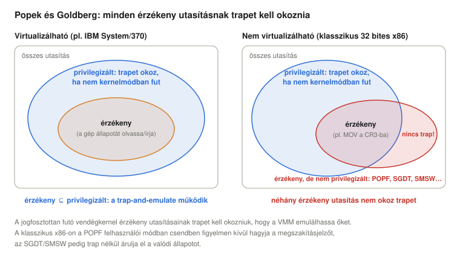
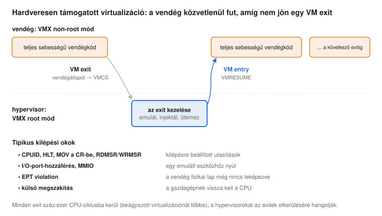
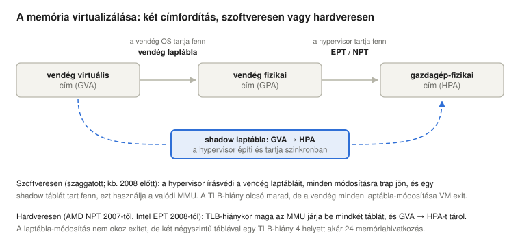
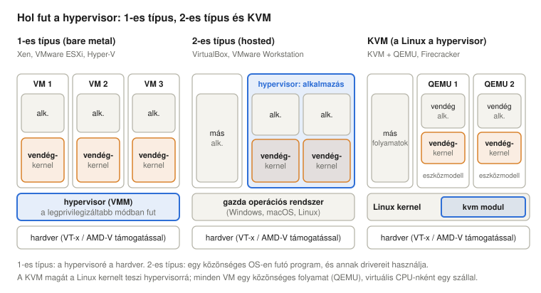
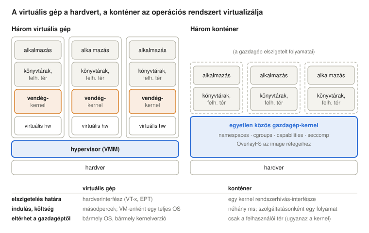
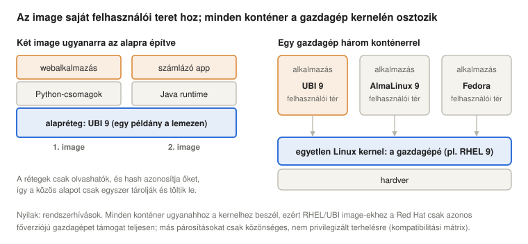
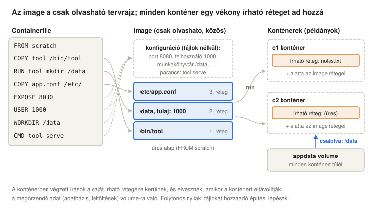
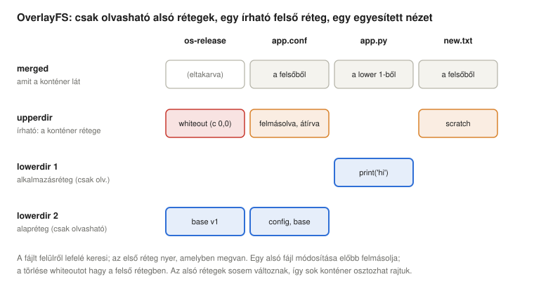

# Virtualizáció – Konténerizáció

*Operációs rendszerek előadás: hogyan lesz egy számítógépből sok: virtuálisgép-monitorok, a Popek–Goldberg-feltételek, trap-and-emulate, binary translation, paravirtualizáció és hardveres támogatás (VT-x, AMD-V), virtuális memória és I/O a vendégek számára, a KVM és a live migration; majd a konténerek: image-ek, rétegek és registryk, valamint az alattuk dolgozó kernelmechanizmusok (namespace-ek, cgroupok, capabilityk, seccomp, OverlayFS, OCI runtime-ok, rootless konténerek), mindez Linuxon mérve*

## Tanulási célok

Az [első előadás](../01-historic-evolution/#mi-az-operációs-rendszer-és-miért-nehéz-megírni) úgy határozta meg az operációs rendszert, mint ami egy valódi gépből egy másik, kényelmesebb gépet csinál, egy gépből pedig N gépet. Ez az előadás ezt a gondolatot kétszer is szó szerint veszi. A **virtuális gép** a hardverinterfész teljes másolata, amelyen egy egész operációs rendszer úgy fut, mintha övé lenne a számítógép. A **konténer** egy szinttel feljebb lép: egyetlen kernelen osztozik, de a folyamatok minden csoportjának saját nézetet ad az operációs rendszerről. Mindkettő a korábbi előadások mechanizmusaira épül: a privilegizált utasításokra és a trapekre ([5. előadás](../05-interrupts/)), a laptáblákra és a TLB-re ([8. előadás](../08-virtual-memory/)), az ütemezésre ([6. előadás](../06-concurrency-deadlocks-scheduling/)), valamint a capabilitykre és a SELinuxra ([10. előadás](../10-access-control/)).

Az előadás végére a hallgatók képesek lesznek:

- elmagyarázni, miért virtualizálnak a szervezetek (konszolidáció, elszigetelés, egységbe zárás és migráció, tesztelés, felhő), és felvázolni a történetet az IBM VM/370-től a KVM-ig és a Dockerig;
- kimondani a virtuálisgép-monitorral szemben támasztott Popek–Goldberg-feltételeket, megkülönböztetni az érzékeny és a privilegizált utasításokat, és elmagyarázni, miért nem lehetett a klasszikus x86-ot trap-and-emulate módszerrel virtualizálni;
- összehasonlítani a binary translationt, a paravirtualizációt és a hardveresen támogatott virtualizációt (VMX root és non-root mód, VM entry és VM exit), és megbecsülni egy VM exit költségét;
- elmagyarázni a shadow laptáblákat és a nested pagingot (EPT/NPT), valamint azt a három módot, ahogyan egy vendég I/O-eszközöket kaphat (emuláció, virtio, passthrough és SR-IOV);
- megkülönböztetni az 1-es és a 2-es típusú hypervisort, elmagyarázni, hogyan osztozik a munkán a KVM, a QEMU és a libvirt, és leírni a live migrationt és a beágyazott virtualizációt;
- összehasonlítani a virtuális gépeket és a konténereket: mit hoz magával mindegyik, min osztozik a konténer a gazdagéppel, és mi következik ebből az elszigetelésre, a kompatibilitásra és a támogatásra;
- elmagyarázni a konténer image-eket (rétegek, registryk, OCI), megkülönböztetni az image-et, a konténert és a volume-ot, image-et építeni egy Containerfile-ból, és elmagyarázni, miért kell a konténer fő folyamatának az előtérben futnia;
- megnevezni a Docker, a Podman, a Buildah és a Skopeo, valamint a runc és a crun OCI runtime szerepét;
- elmagyarázni a konténerek kernelmechanizmusait: a nyolc namespace-t, a cgroup-korlátokat, a szűkített capability-készletet és a seccompot, az OverlayFS rétegeit és a user namespace-ekre épülő rootless konténereket;
- mindezt megvizsgálni Linuxon az `lscpu`, a `systemd-detect-virt`, az `unshare`, az `nsenter`, a cgroup-fájlok, a `mount -t overlay`, a `docker`/`podman` és a `/proc` segítségével.

<details>
<summary><b>Egyszerűen elmagyarázva:</b> virtualizáció, virtuális gép, gazdagép, vendég, hypervisor, konténer</summary>

- **Virtualizáció:** egy valódi dolgot úgy mutatunk, mintha több lenne belőle (vagy mintha valami más lenne), és minden használója azt hiszi, hogy neki saját jutott. Egy lakásokra osztott nagy ház egy „virtualizált” ház.
- **Virtuális gép (VM):** szoftverből készült számítógép, amely egy valódi számítógépen fut. Saját (szimulált) processzora, memóriája, lemeze és hálózati kártyája van, és egy teljes operációs rendszer fut benne.
- **Gazdagép (host), vendég (guest):** a gazdagép a valódi számítógép (és annak operációs rendszere); a vendég egy olyan operációs rendszer, amely egy rajta futó virtuális gépben működik.
- **Hypervisor** (virtuálisgép-monitor, VMM): az a program, amely létrehozza és futtatja a virtuális gépeket, és szétosztja köztük a valódi hardvert, mint egy háztulajdonos, aki lakásokra osztja a házat, és a lakókat távol tartja egymástól.
- **Konténer:** programok egy csoportja, amely közvetlenül a gazdagép operációs rendszerén fut, de el van kerítve, így csak a saját fájljait, folyamatait és hálózatát látja, mint egy lakás, amely az alapon, a csöveken és a vezetékeken a többi lakással osztozik.

</details>

## Miért virtualizálunk?

Az első előadás bemutatta a **multiplexelést**: az operációs rendszer lehetővé teszi, hogy sok program osztozzon egy gépen, időben és térben. A virtualizáció egy szinttel lejjebb multiplexel: egész operációs rendszerek osztoznak egy gépen, mindegyik a saját virtuális gépében. Az okok gyakorlatiak:

- **Konszolidáció.** Egy tipikus, egyetlen szolgáltatást futtató szerver az idejének csak kis részében dolgozik, mégis kell neki áram, hűtés, hely a rackben és karbantartás. Ha tíz ilyen szolgáltatás tíz virtuális gépként fut egyetlen nagyobb szerveren, az sokkal jobban kihasználja a hardvert, és minden szolgáltatás megtartja a saját operációs rendszerét, saját verzióival és beállításaival.
- **Elszigetelés.** Ha egy VM-ben összeomlás, túlterhelés vagy betörés történik, az abban a VM-ben marad. A hypervisor minden VM-nek kikényszeríti a CPU-, memória- és I/O-részesedését is, így egyik bérlő sem éheztetheti ki a többit.
- **Egységbe zárás és migráció.** Egy teljes VM néhány fájl (a virtuális lemeze és a konfigurációja) és a memóriájának tartalma. Lemásolható, egy kockázatos frissítés előtt snapshot készíthető róla, visszaállítható, és áthelyezhető egy másik fizikai gépre, akár futás közben is (live migration, lásd lent). A hardver karbantartása így már nem jelent leállást a szolgáltatásoknak.
- **Tesztelés és kompatibilitás.** A fejlesztők egyetlen laptopon több operációs rendszeren és verzión tesztelnek; egy régi alkalmazás egy VM-ben, a neki szükséges régi operációs rendszerrel tovább fut, jóval azután is, hogy a régi hardver eltűnt.
- **A felhő.** A bérelt számítási kapacitást, a [2. előadás](../02-quality-and-enterprise-linux/#birtoklás-vagy-bérlés-capex-opex-és-a-felhő) opex modelljét, többnyire virtuális gépek és konténerek formájában árulják: az ügyfél perceken belül kap egy VM-et, a szolgáltató pedig sok ügyfél VM-jeit zsúfolja egy-egy szerverre. Ekkora léptékben maga a hardver is építőelemmé vált: a 2000-es évek végén a Google és a Microsoft szabványos szállítókonténerekből épített adatközpontokat, mindegyik konténerben szerverrackekkel, hűtéssel és áramelosztással, amelyeket egy egységként szállítottak le és cseréltek ki (ezeknek a hardveres konténereknek nincs közük az előadás későbbi részének szoftveres konténereihez, a szabványos doboz közös gondolatán kívül).

### Rövid történet

A virtualizáció régebbi, mint a személyi számítógép. Az 1960-as évek közepén az IBM Cambridge Scientific Centere megépítette a **CP-40**-et (egy speciálisan átalakított System/360 Model 40-en), majd a **CP-67**-et, egy vezérlőprogramot, amely egy IBM System/360 Model 67 minden felhasználójának saját virtuális gépet adott, amelyben egy egyszerű, egyfelhasználós operációs rendszer (CMS) futott. Ebből lett 1972-ben a **VM/370** az új System/370-hez (Creasy, 1981). Egyetlen bonyolult időosztásos rendszer helyett minden felhasználó egy egész saját számítógépet kapott, és a benne futó operációs rendszerek akár különbözők is lehettek: az IBM fő operációs rendszerének új verzióját egy VM-ben tesztelhették, miközben egy másikban a régi szolgálta ki a felhasználókat. Leszármazottja, a z/VM, ma is fut az IBM mainframe-jein.

A miniszámítógépeken és a PC-ken a virtualizáció két évtizedre szinte eltűnt, mert a hardver nem támogatta jól (lásd a következő szakaszt). A **VMware** 1999-ben egy ügyes szoftveres technikával hozta vissza az x86-ra; a **Xen** (2003) egy másikat kínált; az Intel és az AMD 2005-ben és 2006-ban hardveres támogatást adott hozzá; a **KVM** pedig 2007-ben magát a Linuxot tette hypervisorrá. A konténereknek párhuzamos történetük van: FreeBSD jailek (2000), Solaris Zones (2004), Linux namespace-ek és cgroupok (2002-től, illetve 2008-tól), és a **Docker** (2013), amely népszerűvé tette őket.

<details>
<summary><b>Egyszerűen elmagyarázva:</b> multiplexelés, konszolidáció, elszigetelés, egységbe zárás, snapshot, migráció, adatközpont, IBM System/360, mainframe, CMS, VMware, Xen, KVM, Docker</summary>

- **Multiplexelés:** sok felhasználó osztozik egy dolgon úgy, hogy mindegyiknek úgy tűnik, egyedül használja, mint amikor sok telefonhívás megy át egyetlen kábelen.
- **Konszolidáció:** sok félig üresjáratban álló gép munkáját kevesebb, jobban kihasznált gépre tesszük, mint a közösautó-használat, ahelyett hogy minden családnak saját autója lenne, amely a nap nagy részében a garázsban áll.
- **Elszigetelés:** a dolgokat egymástól elválasztva tartjuk, hogy az egyikben keletkező baj ne terjedhessen át a másikra.
- **Egységbe zárás:** mindent, ami egy géphez tartozik, egyetlen csomagba (néhány fájlba) teszünk, amelyet egészként lehet kezelni.
- **Snapshot:** egy gép állapotáról egy adott pillanatban mentett másolat, amelyhez vissza lehet térni.
- **Migráció:** egy futó virtuális gép áthelyezése egyik fizikai számítógépről a másikra.
- **Adatközpont:** szerverekkel teli épület, a szükséges árammal, hűtéssel és hálózattal.
- **IBM System/360, mainframe:** az IBM nagyszámítógép-családja 1964-ből; a „mainframe” az ilyen nagy, egy egész szervezetet kiszolgáló központi számítógépek neve.
- **CMS** (Conversational Monitor System): kis, egyfelhasználós operációs rendszer, amely a VM/370 minden virtuális gépében futott.
- **VMware, Xen, KVM:** három ismert hypervisor: a VMware kereskedelmi termékei, a nyílt forráskódú Xen, és a KVM, amely a Linux része.
- **Docker:** az a cég és eszköz, amely népszerűvé tette a konténereket.

</details>

## Virtuálisgép-monitorok

### Mit kell tudnia egy VMM-nek?

A virtuális gépeket létrehozó program a **virtuálisgép-monitor** (virtual machine monitor, VMM), más néven **hypervisor**. Popek és Goldberg (1974) három tulajdonsággal határozta meg:

- **Ekvivalencia (hűség, fidelity):** egy VM-ben futó program pontosan úgy viselkedik, ahogy a valódi gépen viselkedne, az időzítést és a rendelkezésre álló erőforrások mennyiségét leszámítva.
- **Erőforrás-felügyelet (biztonság, safety):** a VMM teljes ellenőrzés alatt tartja a valódi erőforrásokat; egy VM nem használhat olyan memóriát, eszközt vagy CPU-időt, amelyet nem kapott meg, és nem veheti át az irányítást a VMM-től.
- **Hatékonyság (teljesítmény):** a vendég utasításainak túlnyomó többsége közvetlenül a valódi processzoron fut, a VMM beavatkozása nélkül.

A harmadik tulajdonság kizárja az egyszerű emulátort, amely minden utasítást szoftveresen értelmez, ezért tízszer vagy még többször lassabb. A VMM-nek engednie kell, hogy a vendég a valódi CPU-n fusson, és mégis át kell vennie az irányítást, valahányszor a vendég olyat tesz, ami megsértené az első két tulajdonságot.

### Érzékeny és privilegizált utasítások

Az [5. előadás](../05-interrupts/#felhasználói-mód-és-kernelmód) megmutatta, hogy a processzornak van felhasználói módja és kernelmódja, és hogy a **privilegizált** utasítások (a megszakítások letiltása, a laptábla-bázisregiszter betöltése, az I/O indítása) trapet okoznak, ha egy felhasználói módú program próbálja végrehajtani őket. Popek és Goldberg egy utasítást akkor nevezett **érzékenynek** (sensitive), ha megváltoztatja a gép konfigurációját (control-sensitive, mint a laptábla-bázisregiszter betöltése), vagy ha eredménye ettől a konfigurációtól függ (behaviour-sensitive, mint egy olyan utasítás, amely kiolvassa az aktuális privilégiumszintet). Fő tételük szerint egy gépre akkor építhető mindhárom tulajdonságnak megfelelő VMM, ha **minden érzékeny utasítás privilegizált**. Ekkor a vendég kernele egyszerűen futhat felhasználói módban: minden ártalmatlan utasítás teljes sebességgel fut, és minden érzékeny utasítás trapet okoz a VMM-be.



Az IBM System/370 teljesítette ezt a feltételt. A 32 bites x86 nem: Robin és Irvine (2000) a Pentium 17 olyan utasítását sorolta fel, amely érzékeny, de nem privilegizált. A `POPF` például betölti a jelzőbitek regiszterét (flagregisztert), a megszakításengedélyező bitet is beleértve; kernelmódban kikapcsolhatja vele a megszakításokat, felhasználói módban viszont trap nélkül, csendben változatlanul hagyja ezt a bitet. Egy felhasználói módban futó vendégkernel, amely a `POPF`-fel tiltaná le a megszakításokat, azt hinné, hogy a megszakítások ki vannak kapcsolva, pedig nincsenek, és a VMM sosem tudná meg. Az `SGDT`, az `SIDT` és az `SMSW` lehetővé teszi, hogy a felhasználói mód kiolvasson olyan processzorregisztereket, amelyek elárulják a valódi gép konfigurációját, szintén trap nélkül. Egy ilyen gép pusztán trapekkel nem virtualizálható.

### Trap-and-emulate

Egy, a feltételt teljesítő gépen a VMM **trap-and-emulate** módszerrel dolgozik. A vendég kernele **jogfosztottan** (de-privileged), felhasználói módban fut. Közönséges utasításai közvetlenül futnak. Amikor privilegizált utasítást hajt végre, a processzor trappel átadja a vezérlést a VMM-nek, amely az utasítást a vendég *virtuális* állapotán **emulálja**: a „megszakítások letiltása” egy bitet állít be a virtuális CPU-ról vezetett nyilvántartásban, a „laptábla-bázisregiszter betöltése” azokra a laptáblákra vált, amelyeket a VMM az adott vendég számára tart fenn, az „I/O indítása” elindítja az emulált eszközt. Ezután a VMM az utasítás utáni ponton folytatja a vendéget. A valódi megszakítások mindig a VMM-hez érkeznek, amely virtuális megszakításként továbbítja őket annak a vendégnek, amelynek látnia kell őket. Pontosan így működött a VM/370.

### Binary translation

A VMware 1999-ben azzal válaszolt az x86 problémájára, hogy a problémás kódot futás előtt átírta. A vendég felhasználói módú kódja közvetlenül futott, hiszen nincs benne semmi, amihez a VMM kellene. A vendég *kernelkódja* viszont **binary translationön** (bináris fordításon) ment át: a VMM blokkonként olvasta a vendég gépi kódját, közvetlenül az első végrehajtás előtt, az ártalmatlan utasításokat változatlanul átmásolta, minden érzékeny utasítást (például a `POPF`-et) egy rövid utasítássorozatra cserélt, amely frissíti a virtuális CPU állapotát vagy meghívja a VMM-et, a lefordított blokkokat pedig egy **translation cache**-ben (fordítási gyorsítótárban) tartotta, így minden blokkot csak egyszer kellett lefordítani. A vendég operációs rendszeren semmit sem kellett változtatni (Adams & Agesen, 2006).

### Paravirtualizáció

A **Xen** az ellenkező utat választotta (Barham et al., 2003). Ahelyett, hogy elrejtette volna a virtualizációt a vendég elől, a vendéget változtatta meg: a vendég kernelét egy kicsit eltérő gépre portolják, amelyen az érzékeny műveleteket a hypervisor explicit hívásai, **hypercallok** helyettesítik, nagyon hasonlóan a rendszerhívásokhoz, csak egy szinttel lejjebb. A Linux Xenre portolása a kódjának csak mintegy 3000 sorát érintette, és a vendég nagyon kis többletköltséggel futott, de zárt forráskódú rendszereket, például a Windowst, nem lehetett így portolni. Az Amazon EC2 felhője 2006-ban Xenen indult.

A paravirtualizáció ma enyhébb formában él tovább: egy módosítatlan vendégkernel észleli, hogy VM-ben fut, és ott, ahol ez segít, **paravirtuális drivereket és interfészeket** használ: virtio eszközöket (lásd lent), paravirtuális órát és olyan jelzéseket, amelyek VM exiteket takarítanak meg. Az alábbi linuxos bemutató egy KVM-vendéget mutat, amely pontosan ezt teszi.

### Hardveresen támogatott virtualizáció

Az Intel 2005-ben a **VT-x**-et építette be processzoraiba (Uhlig et al., 2005), az AMD 2006-ban az AMD-V-t. Mindkettő a privilégiumok egy új dimenzióját vezeti be. A processzor vagy **VMX root módban** fut, a hypervisor számára, vagy **VMX non-root módban**, a vendégek számára; mindkettőnek megvan a szokásos négy gyűrűje (ring), így a vendég kernele a várakozásának megfelelően a 0-s gyűrűben fut, csak non-root módban. Egy memóriabeli adatszerkezet, a **VMCS** (virtual machine control structure, virtuálisgép-vezérlő struktúra) tárolja a vendég elmentett processzorállapotát, a gazdagép állapotát, valamint azokat a vezérlőbeállításokat, amelyek megmondják a processzornak, mely eseményeknél kell elhagyni a vendéget. A hypervisor **VM entryvel** indítja el a vendéget (a `VMLAUNCH` és a `VMRESUME` utasítással). Amikor a vendég olyat tesz, amit a vezérlőbeállítások megjelölnek, a processzor **VM exitet** hajt végre: elmenti a vendég állapotát a VMCS-be, betölti a gazdagépét, és a kilépés okával együtt a hypervisorban folytatja a futást. A vendég kernele most a 0-s gyűrűben fut, így egy olyan utasítás, mint a `POPF`, pontosan úgy viselkedik, ahogy a kernel várja, azok az érzékeny utasítások pedig, amelyek a valódi gép állapotát érintenék (a CR3 betöltése, a leírótábla-regiszterek kiolvasása, a `CPUID`), VM exitre kényszeríthetők: az x86 végre teljesíti a Popek–Goldberg-feltételt.



Egy VM exit sokkal többe kerül, mint egy rendszerhívás, mert a teljes processzorállapot átváltódik, és a gyorsítótárak és a TLB-bejegyzések is megsínylik. A VT-x első generációja valójában gyakran *lassabb* volt, mint a VMware kiforrott binary translationje, mert a vendég minden laptábla-módosítása kilépést okozott (Adams & Agesen, 2006). A későbbi processzorok olcsóbbá tették a kilépéseket, és ami a legfontosabb, a nested paginggel (lásd a következő szakaszt) megszüntették a leggyakoribbakat. Ma minden szerveres hypervisor hardveres támogatást használ; egy [VM exit mért költsége](#egy-vm-exit-ára) az előadás gépén lent látható.

<details>
<summary><b>Egyszerűen elmagyarázva:</b> VMM, ekvivalencia, erőforrás-felügyelet, hatékonyság, emulátor, privilegizált utasítás, érzékeny utasítás, trap, jogfosztott futás, POPF, binary translation, translation cache, paravirtualizáció, hypercall, VT-x, AMD-V, VMX root és non-root mód, VMCS, VM entry, VM exit</summary>

- **VMM** (virtual machine monitor, virtuálisgép-monitor): a hypervisor másik neve.
- **Ekvivalencia, erőforrás-felügyelet, hatékonyság:** a VMM három ígérete: a programok úgy viselkednek, mint a valódi hardveren, a VMM marad mindennek a gazdája, és az utasítások többsége teljes sebességgel fut.
- **Emulátor:** olyan program, amely egy processzort utánoz úgy, hogy minden utasítást szoftveresen beolvas és végrehajt, mint aki hangosan felolvassa a receptet, hogy valaki más főzzön belőle. Helyes, de lassú.
- **Privilegizált utasítás:** olyan processzorutasítás, amelyet csak a kernel használhat; felhasználói módban trapet okoz.
- **Érzékeny utasítás:** olyan utasítás, amely megváltoztatja vagy elárulja, hogyan van beállítva a gép, például hogy egy program melyik memóriát láthatja, vagy hogy be vannak-e kapcsolva a megszakítások.
- **Trap:** automatikus ugrás a kernelbe (vagy a hypervisorba), amelyet maga a futó utasítás vált ki.
- **Jogfosztott futás (de-privileged):** kevesebb joggal futni, mint amennyiről a program azt hiszi, hogy van neki. A vendég kernele azt hiszi, ő az úr, de olyan módban fut, ahol a fontos utasítások trapet okoznak.
- **POPF:** x86-utasítás, amely betölti a processzor jelzőbitjeit, köztük a „megszakítások engedélyezve” bitet.
- **Binary translation:** egy program gépi kódjának átírása közvetlenül a futás előtt, a veszélyes utasításokat biztonságosakra cserélve, mint egy tolmács, aki egy beszéd fordítása közben csendben tompít néhány szót.
- **Translation cache:** a már lefordított kód tárolója, hogy minden darabot csak egyszer kelljen lefordítani.
- **Paravirtualizáció:** a vendég operációs rendszert úgy módosítjuk, hogy együttműködjön a hypervisorral, ahelyett hogy úgy tenne, mintha valódi hardveren futna.
- **Hypercall:** a vendég kernelének kérése a hypervisorhoz, ahogy a rendszerhívás egy program kérése a kernelhez.
- **VT-x, AMD-V:** az Intel és az AMD processzorainak virtualizációs bővítései.
- **VMX root és non-root mód:** a processzor két világa: az egyik a hypervisoré, a másik a vendégeké. A vendég kernele a saját világa csúcsán áll, de a hypervisor világa e fölött van.
- **VMCS:** táblázat a memóriában, ahová a processzor elmenti a vendég állapotát, és ahonnan kiolvassa a szabályokat arról, mikor kell a vendégnek megállnia és átadnia a vezérlést a hypervisornak.
- **VM entry, VM exit:** átváltás a hypervisorból egy vendégbe, illetve vissza.

</details>

## A memória és az I/O virtualizálása

### Memória: két címfordítás

Egy VM-ben háromféle cím létezik. A vendég programjai **vendég virtuális címeket** (guest virtual address) használnak; a vendég kernelének laptáblái, a [8. előadásban](../08-virtual-memory/#többszintű-laptáblák) látottak, ezeket olyan címekre képezik le, amelyeket a vendég fizikai címeknek hisz: ezek a **vendég fizikai címek** (guest physical address); a hypervisor pedig eldönti, hogy melyik valódi memória, azaz melyik **gazdagép-fizikai cím** (host physical address) álljon minden vendég fizikai lap mögött. A vendég nem töltheti be a saját laptábláit a valódi MMU-ba, mert azokkal bármelyik valódi memóriához hozzáférhetne.



A hardveres támogatás előtt a hypervisorok **shadow laptáblákat** (shadow page table, árnyék-laptábla) használtak. A hypervisor írásvédetté teszi a vendég laptábláit, így a vendég minden módosítása trapet okoz. Minden vendég laptáblához egy shadow táblát tart fenn, amely a vendég virtuális címeket *közvetlenül* gazdagép-fizikai címekre képezi le, és ezt a shadow táblát tölti be a valódi MMU-ba. A TLB-hiányok ugyanolyan olcsók, mint virtualizáció nélkül, de a vendég minden laptábla-módosítása (a folyamatok pedig folyamatosan hoznak létre és módosítanak laptáblákat) egy trapbe és a hypervisor munkájába kerül.

A **nested paging**, amelyet az AMD 2007-ben NPT (vagy RVI), az Intel 2008-ban **EPT** (extended page tables, kiterjesztett laptáblák) néven vezetett be, a második címfordítást a hardverbe helyezi át. A hypervisor VM-enként még egy laptáblát tart fenn, amely a vendég fizikai címeket gazdagép-fizikai címekre képezi le, és az MMU mindkettőt bejárja: a vendég tábláit, amelyek bejegyzései maguk is vendég fizikai címek, és ezeket az EPT-n keresztül kell lefordítani. A vendég mostantól szabadon, kilépések nélkül módosíthatja a saját laptábláit. Az árat a TLB-hiányoknál kell megfizetni: ha mindkét oldalon négyszintű táblák vannak, egyetlen hiány akár 24 memóriahivatkozást is igényelhet 4 helyett, ezért részesítik előnyben a hypervisorok és a vendégek a huge page-eket, és ezért számít egy VM-ben még többet a TLB és a laptábla-bejárási gyorsítótárak (page-walk cache) szerepe (Bhargava et al., 2008). A TLB-bejegyzések a VM azonosítójával vannak megcímkézve (Intelen VPID, AMD-n ASID), ami ugyanaz a gondolat, mint a [8. előadás](../08-virtual-memory/#a-tlb-gyorsítótár-a-címfordításokhoz) PCID-je, így a VM-ek közötti váltás nem üríti ki a TLB-t.

A memória **túlfoglalható** (overcommit) is: a vendégeknek együttesen több memóriát lehet ígérni, mint amennyi a gazdagépen van, mert többségük nem használja ki az egészet. A vendégben futó **balloon driver** udvariasan visszaveszi a memóriát: a hypervisor kérésére lapokat foglal le a vendégen belül (így a vendég saját lapcsere-algoritmusa dönti el, miről mond le), és jelenti ezeket a hypervisornak, amely a lapkereteket egy másik VM-nek adhatja (Waldspurger, 2002). A különböző VM-ek azonos lapjai (ugyanaz a kernelkód, csupa nulla lapok) egyetlen copy-on-write lappá vonhatók össze; Linuxon ez a **KSM**, kernel samepage merging.

### I/O: emulált, paravirtuális, passthrough

Egy vendégnek kell lemez, hálózati kártya és konzol. Háromféleképpen kaphatja meg őket:

- **Emuláció.** A hypervisor egy valódi, jól ismert eszközt utánoz regiszterről regiszterre, például egy Intel e1000 hálózati kártyát vagy egy IDE-lemezvezérlőt. A vendég a szokásos driverét használja, és nem kell változtatni rajta; de minden eszközregiszter-hozzáférés VM exitet okoz, és egyetlen hálózati csomaghoz több is kellhet.
- **Paravirtuális eszközök.** A vendég egy olyan eszköz driverét használja, amely csak VM-ekben létezik, és amelyet úgy terveztek, hogy olcsón virtualizálható legyen. Linuxon és KVM-en a szabvány a **virtio** (Russell, 2008): a vendég és a hypervisor gyűrűpuffereken (*virtqueue*) osztozik a memóriában, a vendég sok kérést tesz egy sorba, és csak egyszer értesíti a hypervisort, a hypervisor pedig sok befejezett kérésre egyetlen megszakítással válaszol. A bájtonkénti kilépések száma nagyságrendekkel csökken. Az előadás saját gépe virtiót használ a lemezeihez és a hálózatához (lásd a lenti bemutatót).
- **Device passthrough.** A hypervisor egy valódi PCI-eszközt közvetlenül egyetlen vendégnek ad át, amelynek drivere ezután kilépések nélkül beszél a hardverrel. Az eszköz DMA-ját az adott vendég memóriájára kell korlátozni, amihez **IOMMU** (Intel VT-d, AMD-Vi), vagyis az eszközök számára szolgáló MMU kell. **SR-IOV**-val egyetlen fizikai hálózati kártya vagy SSD több *virtuális funkcióként* (virtual function) jelenik meg, és ezek mindegyike más-más VM-nek adható át. A passthrough natív sebességet ad, de a VM-et az adott fizikai géphez köti, ami megnehezíti a live migrationt.

<details>
<summary><b>Egyszerűen elmagyarázva:</b> vendég virtuális, vendég fizikai és gazdagép-fizikai cím, MMU, shadow laptábla, nested paging, EPT, NPT, huge page, VPID, overcommit, balloon driver, KSM, emulált eszköz, virtio, virtqueue, passthrough, IOMMU, SR-IOV, DMA</summary>

- **Vendég virtuális, vendég fizikai, gazdagép-fizikai cím:** egy program címe a VM-en belül; az a cím, amelyről a vendég kernele azt hiszi, hogy valódi memória; és a cím a számítógép tényleges memóriachipjeiben.
- **MMU** (memory management unit, memóriakezelő egység): a processzornak az a része, amely a laptáblák segítségével a virtuális címeket fizikaiakra fordítja.
- **Shadow laptábla:** összevont, kész fordítási táblázat, amelyet a hypervisor a vendég háta mögött tart karban.
- **Nested paging, EPT, NPT:** processzortámogatás a második fordítási lépéshez: maga a hardver keres ki mindkét táblából. Az EPT az Intel, az NPT az AMD elnevezése.
- **Huge page:** 4 KiB helyett 2 MiB vagy 1 GiB méretű lap, így egyetlen TLB-bejegyzés sokkal több memóriát fed le.
- **VPID, ASID:** címke minden TLB-bejegyzésen, amely megmondja, melyik VM-hez (vagy címtartományhoz) tartozik, így a TLB-t nem kell minden váltáskor kiüríteni.
- **Overcommit:** többet ígérni, mint amennyi van, arra számítva, hogy nem használja ki mindenki egyszerre a teljes részét, mint egy légitársaság, amely néhánnyal több jegyet ad el, mint ahány ülés van.
- **Balloon driver:** driver a vendégben, amely „felfújódik”, vagyis memóriát vesz el magának, és átadja a hypervisornak, majd „leereszt”, hogy visszaadja.
- **KSM** (kernel samepage merging): a Linux megkeresi az azonos tartalmú memórialapokat, és csak egy példányt tart meg belőlük.
- **Emulált eszköz:** egy valódi hardverelem szoftverből épített utánzata.
- **virtio, virtqueue:** VM-ekhez tervezett egyszerű virtuális eszközök családja; a virtqueue az a közös lista, amelyen keresztül a vendég és a hypervisor a kéréseket és a válaszokat átadja egymásnak.
- **Passthrough:** egy valódi eszközt egyetlen VM kizárólagos használatába adunk.
- **IOMMU:** az eszközök memória-hozzáféréseinek fordítója és őre, hogy egy VM-nek átadott eszköz csak annak a VM-nek a memóriáját érhesse el.
- **SR-IOV:** olyan eszköz, amely több kisebb virtuális eszközre tudja osztani magát, VM-enként egyre.
- **DMA** (direct memory access, közvetlen memória-hozzáférés): egy eszköz maga ír a memóriába vagy olvas onnan, a CPU nélkül (5. előadás).

</details>

## Hypervisorok a gyakorlatban

### 1-es és 2-es típus



Az **1-es típusú** (bare-metal) hypervisor közvetlenül a hardveren fut, és maga is egy kis operációs rendszer, amely a CPU-kat, a memóriát és a VM-ek ütemezését kezeli: ilyen például a VMware ESXi, a Xen és a Microsoft Hyper-V. A Xen és a Hyper-V az eszközdrivereket és a felügyeletet egy kiváltságos VM-re bízza (a Xen *domain 0*-jára, a Hyper-V *root partition*jére), hogy maga a hypervisor kicsi maradjon. A **2-es típusú** (hosted) hypervisor egy közönséges operációs rendszeren futó alkalmazás, és annak a rendszernek a drivereit, ütemezőjét és memóriakezelését használja: ilyen például a VirtualBox és a VMware Workstation. Szerverekre az 1-es, asztali gépekre a 2-es típus a megfelelő választás.

### KVM, QEMU és libvirt

A **KVM** (Kernel-based Virtual Machine) elmossa ezt a megkülönböztetést (Kivity et al., 2007). A Linux kernel egyik modulja, amelyet 2007-ben olvasztottak be; a VT-x-et vagy az AMD-V-t használja, és egy eszközfájlt, a `/dev/kvm`-et kínálja. Egy felhasználói térbeli program megnyitja, és `ioctl` hívásokkal létrehoz egy VM-et és annak virtuális CPU-it; minden virtuális CPU egy szál, amely az `ioctl(KVM_RUN)` hívást hajtja végre: ez belép a vendégbe, és csak akkor tér vissza, ha egy kilépéshez a felhasználói tér kell, például egy emulált eszköz elérésekor. Minden más már megvan a Linuxban: a virtuális CPU-kat a [szokásos Linux-ütemező](../06-concurrency-deadlocks-scheduling/#a-linux-ütemezése) ütemezi, a vendég memóriája közönséges folyamatmemória, amelyet a kernel virtuális memóriája kezel, és a VM cgroupokkal korlátozható, mint bármely folyamat. 1-es vagy 2-es típusú a KVM? A Linux a puszta hardveren fut, és ő a hypervisor, mint az 1-es típusnál; de teljes, általános célú operációs rendszer, amely közönséges programokat is futtat, mint a 2-es típus gazdagépe. A címkéknél fontosabb a munkamegosztás.

A felhasználói térbeli rész általában a **QEMU**, amely a gép eszközeit emulálja (és KVM nélkül binary translationnel egy másik architektúra teljes processzorát is emulálni tudja). Különleges célokra könnyebb alternatívák is léteznek: az Amazon **Firecrackere** a felhője minden serverless függvényét vagy konténerét egy *microVM*-ben futtatja, amelyben csak néhány virtio eszköz van; egy Linux-vendéget körülbelül 125 ms alatt indít el, VM-enként néhány megabájt többletköltséggel (Agache et al., 2020). Ezek fölött a **libvirt** egységes felügyeleti felületet kínál (a `virsh` parancsot, a virt-manager grafikus felületet) a KVM-hez és más hypervisorokhoz, az olyan felhőplatformok pedig, mint az OpenStack, több ezer gazdagépet kezelnek.

### Live migration

Mivel a VM egységbe zárt, futás közben áthelyezhető egy másik gazdagépre. A **live migration** a pre-copy módszerrel (Clark et al., 2005) körökben működik: a forrás-gazdagép a VM teljes memóriáját átmásolja a célgépre, miközben a VM tovább fut; aztán újra átmásolja azokat a lapokat, amelyeket a VM közben módosított (a hypervisor ezeket a lapok írásvédelmével vagy a dirty bitekkel követi); és ezt egyre kevesebb lappal ismétli. Amikor a hátralévő halmaz kicsi, a VM-et egy pillanatra megállítja, átmásolja az utolsó lapokat és a CPU-állapotot, a VM pedig a célgépen folytatja a futást, amely az új helyéről bejelenti a VM hálózati címét. A lemez általában közös hálózati tárolón van, így nem kell mozgatni. A szünet néhány tíz és néhány száz milliszekundum között tart, elég röviden ahhoz, hogy a hálózati kapcsolatok túléljék. A [2. előadás](../02-quality-and-enterprise-linux/#a-kilencesek) minőségi mérőszámai szempontjából ez a hardverkarbantartást tervezett leállásból semleges eseménnyé teszi, és lehetővé teszi, hogy az üzemeltető elvigye a terhelést egy meghibásodás jeleit mutató szerverről.

### Beágyazott virtualizáció

Egy hypervisor maga is futhat egy VM-ben: ez a **beágyazott virtualizáció** (nested virtualization) (Ben-Yehuda et al., 2010). A processzor VT-x-támogatása csak egyszer létezik, ezért a külső hypervisor (L0) VT-x-et emulál a belső (L1) számára, amely a saját vendégeit (L2) futtatja. Egy L2-vendég minden kilépése először az L0-hoz kerül, amelynek gyakran tovább kell adnia az L1-nek, és kezelnie kell azokat a kilépéseket is, amelyeket az L1 kezelése okoz, így a kilépések megsokszorozódnak. A beágyazott virtualizációt hypervisorok tesztelésére, felhőpéldányokban futó VM-ekhez és fejlesztői környezetekhez használják; a felhőszolgáltatók csak bizonyos példánytípusokon engedélyezik. Az [előadás bemutatóinak gépe](#virtuális-ez-a-gép) maga is egy VT-x nélküli KVM-vendég, ezért nem tud saját VM-eket futtatni.

<details>
<summary><b>Egyszerűen elmagyarázva:</b> 1-es és 2-es típusú hypervisor, ESXi, Hyper-V, VirtualBox, domain 0, KVM, /dev/kvm, ioctl, QEMU, Firecracker, microVM, serverless, libvirt, virsh, OpenStack, live migration, pre-copy, dirty lap, beágyazott virtualizáció</summary>

- **1-es / 2-es típusú hypervisor:** az 1-es típusú hypervisor közvetlenül a hardveren ül, mint egy épület tulajdonosa, aki maga kezeli az épületet; a 2-es típusú egy közönséges operációs rendszeren futó program, mint egy bérlő, aki albérletbe adja a lakása néhány szobáját.
- **ESXi, Hyper-V, VirtualBox:** a VMware, a Microsoft és az Oracle hypervisorai.
- **Domain 0, root partition:** különleges, megbízható VM, amely a többi VM eszközdrivereit és felügyeleti eszközeit tartalmazza.
- **KVM, /dev/kvm:** a KVM a Linuxnak az a része, amely VM-eket futtat; a programok a `/dev/kvm` speciális fájlon keresztül kérnek tőle VM-eket.
- **ioctl:** általános célú rendszerhívás, amellyel olyan parancsokat lehet adni egy eszközdrivernek, amelyeket a szokásos olvasó és író hívások nem tudnak kifejezni.
- **QEMU:** nyílt forráskódú program, amely egy teljes számítógép eszközeit (és szükség esetén a processzorát is) utánozza.
- **Firecracker, microVM:** az Amazon nagyon kicsi hypervisorprogramja, amely egy szempillantás alatt indít apró VM-eket (microVM-eket).
- **Serverless:** olyan felhőszolgáltatás, ahol az ügyfél csak egy függvényt tölt fel, és a szolgáltató igény szerint, valahol lefuttatja néhány milliszekundumra vagy másodpercre.
- **libvirt, virsh, OpenStack:** felügyeleti szoftverek: a libvirt és a `virsh` parancsa egy gazdagép VM-jeit vezérli, az OpenStack egy egész adatközpontéit.
- **Live migration, pre-copy:** egy futó VM áthelyezése egy másik számítógépre; a pre-copy a memóriát akkor másolja, amikor a VM még fut, utána pedig csak azt, ami közben megváltozott.
- **Dirty lap:** olyan memórialap, amelyre azóta írtak, hogy utoljára átmásolták vagy elmentették.
- **Beágyazott virtualizáció:** VM egy VM-ben: a belső hypervisor a külső vendégeként fut.

</details>

## Konténerek: az operációs rendszer virtualizálása

### Virtuális gépek és konténerek összehasonlítása

Egy virtuális gép egy teljes számítógépet szimulál, így mindegyik a saját kernelét indítja el. A **konténer** könnyebb: a gazdagépen futó közönséges folyamatcsoport, amelyet a gazdagép kernele elszigetel a többitől (*namespace-ekkel*, amelyek minden konténernek saját nézetet adnak a fájlokra, a folyamatokra és a hálózatra, és *cgroupokkal*, amelyek korlátozzák a CPU- és memóriahasználatát). A konténer tehát saját **felhasználói teret** (user space) hoz (könyvtárakat, eszközöket, konfigurációt, `/etc/os-release`-t), de **saját kernelt nem**: minden rendszerhívás a gazdagép kerneléhez fut be.



A különbség eldönti, hogy melyik hová illik. Egy konténer milliszekundumok alatt elindul, hiszen csak egy folyamat; nem kell memória egy második kernelnek, és nem kell virtuális hardver; és egy olyan gazdagépen, amelyen néhány tíz VM férne el, több száz konténer elfér. Ám minden konténer egyetlen kerneltől függ. Nem futtathatnak más operációs rendszert (Linux kernelen nincs Windows-konténer), sem a gazdagépétől eltérő kernelverziót, ezért számít az image és a gazdagép [kompatibilitása](#a-kernelnek-és-az-image-nek-illeszkednie-kell). Az elszigetelés határa pedig egy nagy kernel teljes rendszerhívás-interfésze, több száz hívás, szemben egy VM sokkal keskenyebb hardverinterfészével: egy konténerből elérhető kernelhiba lehetővé teheti, hogy a konténer kitörjön a gazdagépre. Ahol a bérlők nem bíznak egymásban, a szolgáltatók ezért kombinálják a kettőt: minden konténer, vagy minden ügyfél konténercsoportja a saját kis VM-jében fut, mint a Firecrackerben vagy a Kata Containersben, vagy egy felhasználói térbeli kernel mögött, amely elfogja a rendszerhívásokat, mint a gVisorban.

### Konténer image-ek



A **konténer image** az a becsomagolt fájlrendszer, amelyből egy konténer elindul. Csak olvasható **rétegek** (layer) halmaza, és mindegyik réteget a tartalmának kriptográfiai hash-e azonosítja: egy alapréteg egy disztribúció felhasználói terével, majd építési lépésenként egy-egy réteg, amely csomagokat vagy az alkalmazást adja hozzá. Az ugyanarra az alapra épített image-ek osztoznak ezen a rétegen, amelyet így csak egyszer kell tárolni és letölteni. Az image-eket **registrykben** tárolják: ezek olyan szerverek, amelyekről az image-ek név szerint letölthetők (pull), például `registry.access.redhat.com/ubi9/ubi-minimal`.

Maga az elszigetelés régebbi, mint amit a „konténer” szó sejtet: előbb jöttek a FreeBSD jailek (2000), a Solaris Zones (2004), valamint a Linux cgroupok és az LXC (2008). A Docker 2013-tól tette népszerűvé egy egyszerű image-formátummal és munkafolyamattal: építsd meg az image-et egyszer, töltsd fel (push) egy registrybe, és futtasd bárhol (Merkel, 2014). Hogy az image-ek ne egyetlen cég eszközeitől függjenek, a Docker, a CoreOS és mások 2015. június 22-én a Linux Foundation keretében megalapították az **Open Container Initiative-et (OCI)**. Ez három specifikációt gondoz: a *runtime* specifikációt (hogyan kell egy konténert futtatni), az *image* specifikációt (az image-ek és a rétegek formátuma; Open Container Initiative, n.d.-b) és a *distribution* specifikációt (hogyan szolgálják ki őket a registryk) (Open Container Initiative, n.d.-a). Az egyik OCI-eszközzel épített image bármely másikkal letölthető és futtatható (ugyanazon a CPU-architektúrán), és ez teszi lehetővé a gyártókon átívelő image-ökoszisztémát.

### Image, konténer, volume

Az image és a konténer úgy viszonyul egymáshoz, mint egy tervrajz és az alapján épült dolgok, vagy mint a programozásban egy osztály és az objektumai: a `podman run` *példányosítja* az image-et, és ugyanabból az image-ből egyszerre akárhány konténer futhat. Maga az image sosem változik, **immutable** (megváltoztathatatlan). Minden konténer saját vékony **írható réteget** (writable layer) kap az image csak olvasható rétegei fölött. Ha egy folyamat a konténerben fájlt hoz létre vagy módosít, a változás ebbe a rétegbe kerül (a módosított fájlt előbb felmásolják az alatta lévő csak olvasható rétegből, ez a **copy-on-write**; a törölt fájlt csak elrejtik). Az írható réteg a konténerhez tartozik, és vele együtt törlődik (Docker Inc., n.d.-c). Azt, hogy a kernel hogyan rakja egymásra a rétegeket, lent az [OverlayFS](#overlayfs-a-rétegek-a-lemezen) szakasz mutatja be.



A megőrzendő adatoknak ezért nincs helyük a konténerben. A **volume** (kötet) a konténermotor által kezelt tárhely (vagy *bind mount*-ként a gazdagép egy könyvtára), amelyet a konténerbe egy útvonalra, például a `/data` vagy a `/var/lib/mysql` alá csatolnak. Minden konténertől függetlenül él, így egy konténer eltávolítható és egy újabb image-ből indított konténerre cserélhető (ez a lent tárgyalt „rebuild és redeploy”), miközben az adatbázisfájlok a helyükön maradnak. A konténerek tehát eldobhatók, egy szolgáltatás állapota pedig a volume-jaiban él; a mért bemutató a [Konténer, írható réteg és volume](#konténer-írható-réteg-és-volume) szakaszban található.

A konténer pontosan addig él, amíg a **fő folyamata** (main process). A `podman run` parancsnak megadott vagy az image alapértelmezett `CMD`-jében szereplő parancs a konténer saját PID namespace-ében az 1-es folyamatként fut; amikor kilép, a konténer leáll, és minden más folyamatát a kernel leállítja. Egy hagyományos Unix-szerver **démonizálja magát** (daemonise): az elindított folyamat forkol egy gyermeket, amely a háttérben végzi a munkát, ő maga pedig azonnal kilép, ami konténerben a konténer azonnali leállását jelentené. Konténerben ezért a szervereket az előtérben indítják, például az Apache-t `httpd -D FOREGROUND`, az nginxet `-g 'daemon off;'` kapcsolóval. A motor a fő folyamat szabványos kimenetét és hibakimenetét a konténer naplójaként is összegyűjti (`podman logs`).

### Image építése: kézzel vagy Containerfile-ból

Egy image elkészíthető kézzel is, nagyjából úgy, ahogy egy szervert állítanánk be:

```bash
podman pull registry.access.redhat.com/ubi9/ubi
podman run -it --name work registry.access.redhat.com/ubi9/ubi /bin/bash
#   inside the container: dnf install -y httpd, edit /etc/httpd/conf/httpd.conf, then exit
podman commit work registry.example.com/web/httpd:1.0
podman push registry.example.com/web/httpd:1.0
```

A shellből kilépve véget ér a konténer fő folyamata, így a konténer leáll (a háttérben, `-d` kapcsolóval indított konténert a `podman stop` állítja le). A `podman commit` a leállított konténer írható rétegéből egy új image-réteget készít, a `podman push` pedig feltölti az image-et egy registrybe. Ez működik, de mindarra, amit élesben fognak használni, anti-pattern. Később senki sem tudja megmondani, pontosan mi történt: az image csak azt a parancsot rögzíti, amelyet a konténer futtatott, a shellbe begépelt parancsokat nem. A munka nem ismételhető meg automatikusan, amikor az alap image biztonsági javítást kap, és ez meghiúsítja a „rebuild és redeploy” elvét. Minden, ami a konténerben maradt, bekerül az image-be: a csomagkezelő gyorsítótárai, az ideiglenes fájlok, a shell előzményei. A konténer beállításai pedig az image beállításaivá válnak, ahogy a lenti bemutató mutatja.

A reprodukálható út a **Containerfile** (a Docker elnevezésével Dockerfile): az építési lépéseket tartalmazó szövegfájl, amelyet az alkalmazás mellett, verziókezelőben tartanak, és egyetlen parancs építi meg:

```dockerfile
FROM registry.access.redhat.com/ubi9/ubi
RUN dnf install -y httpd && dnf clean all
COPY httpd.conf /etc/httpd/conf/httpd.conf
EXPOSE 8080
USER apache
CMD ["httpd", "-D", "FOREGROUND"]
```

```bash
podman build -t registry.example.com/web/httpd:1.0 .
```

(Ez csak vázlat: a konfigurációs fájl a 8080-as portra állítja a httpd-t, mert az 1024 alatti portokhoz root kell; egy éles image a napló- és futási könyvtárak tulajdonosát is a nem root felhasználóhoz igazítja.) A záró `.` a **build context** (építési környezet), az a könyvtár, amelynek fájljait a `COPY` használhatja. Minden utasításból vagy egy réteg, vagy egy konfigurációs sor lesz (Docker Inc., n.d.-a):

| Utasítás | Mit csinál | Mi lesz belőle az image-ben |
| --- | --- | --- |
| `FROM` | megnevezi az alap image-et, amelyre építünk | az alap image rétegei, változatlanul újrahasznosítva |
| `RUN` | az építés közben egy ideiglenes konténerben lefuttat egy parancsot | új réteg a parancs által módosított fájlokkal |
| `COPY` | fájlokat másol a build contextből az image-be | új réteg |
| `EXPOSE` | dokumentálja, melyik porton figyel a szolgáltatás | csak konfiguráció |
| `USER` | az a felhasználó, akinek a nevében a későbbi `RUN` lépések és a konténer fő folyamata futnak | csak konfiguráció |
| `WORKDIR` | az aktuális könyvtár a későbbi lépések és a konténer számára | konfiguráció (a könyvtár létrejön, ha hiányzik) |
| `CMD` | az alapértelmezett parancs: a konténer fő folyamata | csak konfiguráció |

A rétegekből két következmény adódik. Egy későbbi lépésben törölt fájl a korábbi rétegben továbbra is helyet foglal, ezért a `dnf install` és a `dnf clean all` *egyetlen* `RUN` lépésben fut. Az építőeszköz pedig a változatlan lépések rétegeit a korábbi építésekből újrahasznosítja, ezért a ritkán változó lépések (csomagok telepítése) a gyakran változók (az alkalmazás bemásolása) elé kerülnek.

**Image-nevek.** A teljes image-név alakja `registry/namespace/name:tag`, például `registry.example.com/web/httpd:1.0` vagy `registry.access.redhat.com/ubi9/ubi-minimal:latest`: a registry hosztneve (esetleg porttal), egy namespace (felhasználó, szervezet vagy projekt), a repository neve és egy **tag** (címke) (Docker Inc., n.d.-b). Registry megadása nélkül a Docker a Docker Hubot (`docker.io`) feltételezi, a Podman viszont az `/etc/containers/registries.conf` fájlban felsorolt registryket keresi végig, ezért biztonságosabb a teljes név. Tag nélkül a `latest` tag érvényes. A neve ellenére a `latest` csak egy alapértelmezett címke, nem garancia a legújabb verzióra: arra mutat, amit utoljára ezzel a taggel töltöttek fel, és elmozdul. Az olyan verziótageket, mint a `:1.0`, szintén elmozdíthatja, aki feltölt, ezért egy pontosan reprodukálandó telepítés az image-et a **digestjével** (`name@sha256:…`), vagyis a tartalmának hash-ével nevezi meg. Ennek ára ugyanaz, amiről lent a „rebuild és redeploy” kapcsán lesz szó: egy digesthez rögzített image semmilyen javítást nem kap, amíg valaki újra nem építi, és szándékosan át nem állítja a rögzítést.

### Alap image-ek és registryk

A legtöbb image egy alap image-ből indul (`FROM`), amely egy disztribúció felhasználói terét adja. Minden nagy disztribúció közzétesz ilyeneket:

| Az image forrása | Hol | Feltételek |
|---|---|---|
| **UBI** (Universal Base Image), RHEL-csomagokból | `registry.access.redhat.com` (bejelentkezés nélkül) | az UBI-licenc alapján szabadon használható és továbbterjeszthető; támogatást csak RHEL-en vagy OpenShiften, előfizetéssel kap |
| **RHEL** image-ek az ügyfeleknek | `registry.redhat.io` (Red Hat-bejelentkezés vagy service account) | előfizetés |
| **Tanúsított partneri** image-ek (adatbázisok, middleware) | `registry.connect.redhat.com` (bejelentkezéssel), a Red Hat Ecosystem Catalogban listázva | a gyártó feltételei |
| **Fedora**, **CentOS Stream** | `quay.io` (pl. `quay.io/centos/centos:stream9`), a Fedora saját registryje | ingyenes, közösségi |
| **AlmaLinux**, **Rocky Linux** | Docker Hub és Quay.io (pl. `quay.io/almalinuxorg/almalinux:9`, `docker.io/rockylinux/rockylinux:9`) | ingyenes, közösségi |
| **Debian**, **Ubuntu**, **Alpine** és sok más | a Docker Hub „official images” (hivatalos image-ek) kínálata (pl. `docker.io/library/debian:12`) | ingyenes, közösségi vagy gyártói |

Az első két sort, azt, hogy a Red Hat miért hozta létre 2019-ben az UBI-t, annak négy változatát (ubi, ubi-minimal, ubi-micro, ubi-init) és az előfizetéses üzletet védő korlátokat a [2. előadás](../02-quality-and-enterprise-linux/#alap-image-ek-és-registryk) tárgyalja. Az alap image kiválasztása egy disztribúció kiválasztása, annak életciklusával, frissítési politikájával és támogatási feltételeivel együtt, pontosan úgy, mint egy szerver esetében; csak a kernel nem része.

### A kernelnek és az image-nek illeszkednie kell

Mivel a konténer a gazdagép kernelén osztozik, a „konténerben fut, tehát bárhol fut” állítás csak részben igaz. Egy RHEL 7-es image egy RHEL 9-es gazdagépen a RHEL 7 könyvtáraival fut egy két főverzióval újabb kernelen, amelyen a RHEL 7 fejlesztői ezt sosem tesztelték. A Red Hat ezért közzéteszi a **Container Compatibility Matrixot** (konténer-kompatibilitási mátrix) (Red Hat, n.d.-b). Egy RHEL 9-es gazdagép például futtatja a RHEL- vagy UBI 7, 8, 9 és 10 image-eket, de csak az egyező főverzió (UBI 9 RHEL 9-en) „fully compatible” (teljesen kompatibilis); a többi kombináció csak „workload specific” (terhelésfüggő) módon támogatott: a konténer nem lehet privilegizált, és nem használhat a kernelverziótól függő interfészeket, például speciális `ioctl` hívásokat, `/proc`- és `/sys`-beli fájlokat, tűzfalszabályokat (iptables, nftables) vagy eBPF-et, a legáltalánosabb felhasználásokat kivéve. Minden máshoz, a gazdagépen magán dolgozó privilegizált konténereket is beleértve, egyező verziók kellenek. Egy *újabb* image egy *régebbi* gazdagépen (UBI 10 RHEL 9-en) a legszigorúbb feltételeket kapja, mert az image olyan kernelfunkciókat várhat, amelyek a régi kernelből hiányoznak: egy hibának egyező gazdagépen is reprodukálhatónak kell lennie, mielőtt a Red Hat foglalkozik vele. Ez a [vállalati disztribúció üzleti oldalának](../02-quality-and-enterprise-linux/#a-nyílt-forráskódú-operációs-rendszer-üzleti-oldala) kABI- és tanúsítási logikája, konténerekre alkalmazva: a támogatási ígéret csak a tesztelt kombinációkra vonatkozik. A virtuális gépeknek nincs ilyen gondjuk, hiszen mindegyik a saját kernelét hozza.

### Image-ek frissítése: rebuild és redeploy

Egy futó konténert nem javítanak helyben. Amikor megjelenik egy javítás, például egy javított `glibc` az UBI 9-ben, az image-et a frissített alaprétegre **újraépítik** (rebuild), a konténereket pedig az új image-ből indított konténerekre **cserélik** (redeploy). Mivel az alapréteg közös, egy frissített alapot csak egyszer kell letölteni, és az minden ráépített image-et kiszolgál. Maga a javítás ugyanabból a backportolási folyamatból érkezik, mint egy szerveren: az UBI 9 `glibc`-je a RHEL 9 teljes élettartama alatt 2.34-es verziójú marad, és backportolt javításokat kap (néhány komponenst alkalmanként egy főverzión belül újabb upstream verzióra rebase-elnek, ahogy az OpenSSL-t 3.0-ról 3.2-re a RHEL 9.5-ben, de ez kivétel), így a [Dirty Pipe-példa verziószám-tanulsága](../02-quality-and-enterprise-linux/#miért-hazudik-a-verziószám-a-backportolás-a-gyakorlatban) a konténereken belül is érvényes, és az image-szkennereknek ugyanúgy szükségük van a gyártó biztonsági adataira, mint a szerverszkennereknek.

### Az eszközök: Podman, Buildah, Skopeo

A Docker saját eszközlánca egy kliensből, a `docker` parancsból áll, amely egy démonnal, a `dockerd`-vel beszél; ez rootként fut, és a munkát a `containerd`-nek és egy OCI runtime-nak adja tovább ([lent](#egy-konténer-a-gazdagépről-nézve) megmérve). A RHEL 8 (2019) óta a Red Hat a Docker helyett saját OCI-eszközöket szállít, a `container-tools` csomagkészletben (Red Hat, n.d.-a):

- a **Podman** konténereket, image-eket és *podokat* (konténercsoportokat) futtat és kezel; parancsai a Dockeréit követik (`podman run` a `docker run` helyett);
- a **Buildah** image-eket épít, `Containerfile`-ból (a Docker `Dockerfile` formátumában) vagy lépésről lépésre egy szkriptből;
- a **Skopeo** közvetlenül a registrykkel dolgozik, helyi image-tár nélkül: image-eket másol, vizsgál, ír alá és töröl; a `skopeo inspect` letöltés nélkül olvassa ki egy image metaadatait.

A Dockertől két tervezési különbség számít a minőség szempontjából. A Podmannek **nincs szüksége démonra**: nincs központi, rootként futó háttérszolgáltatás, amelyen keresztül minden konténer elindul, így nincs egyetlen olyan pont, amelynek meghibásodása az összes konténert érintené (single point of failure), és a konténerek közönséges `systemd`-szolgáltatásként futtathatók (a Podman Quadlet-fájljaival). A Podman ezenkívül **rootless** módon is futhat (a RHEL 8.1 óta általánosan elérhető): ha egy közönséges felhasználó futtatja, a konténerek rendszergazdai jogok nélkül indulnak, így egy konténerből kitörő támadó csak az adott felhasználó jogait szerzi meg (a mechanizmust [lent magyarázzuk el](#rootless-konténerek)). A Docker később szintén kapott rootless módot, de szokásos beállítása továbbra is egy rootként futó démon. Mindkettő robusztussági és biztonsági szempont a [2. előadás minőségi kritériumai](../02-quality-and-enterprise-linux/#mitől-jó-egy-operációs-rendszer) közül. Ugyanezt az image-gondolatot egész szerverekre is alkalmazzák: a RHEL [image mode](../02-quality-and-enterprise-linux/#image-mode-a-teljes-operációs-rendszer-image-ként) magát az operációs rendszert indítja egy OCI image-ből.

<details>
<summary><b>Egyszerűen elmagyarázva:</b> felhasználói tér, rendszerhívás, namespace, cgroup, image, réteg, hash, registry, OCI, jailek, Zones, LXC, gVisor, Kata Containers, tervrajz, példány, immutable, írható réteg, copy-on-write, volume, bind mount, fő folyamat, démonizálás, commit, push, anti-pattern, Containerfile, build context, EXPOSE, tag, latest, digest, Quay, privilegizált konténer, ioctl, /proc, /sys, iptables, eBPF, glibc, OpenSSL, Podman, Buildah, Skopeo, démon, rootless, pod, Quadlet</summary>

- **Felhasználói tér (user space):** egy operációs rendszerből minden, ami nem a kernel: könyvtárak, eszközök és programok.
- **Rendszerhívás:** egy program kérése a kernelhez, például „nyisd meg ezt a fájlt” vagy „mondd meg a verziódat”. A programok nem nyúlhatnak maguk a hardverhez; a kernelt kérik meg.
- **Namespace, cgroup:** két Linux-funkció. A namespace-ek egy folyamatcsoportnak saját, privát nézetet adnak (saját fájllistát, folyamatlistát, hálózatot); a cgroupok azt korlátozzák, mennyi CPU-időt és memóriát használhat a csoport. Mindkettőről később lesz szó ebben az előadásban.
- **Image:** becsomagolt, indításra kész fájlkészlet, amelyből a konténerek elindulnak, mint egy sablon.
- **Réteg:** az image egy szelete, például „az alaprendszer” vagy „a hozzáadott Python-csomagok”. Az image-ek rétegekből rakódnak össze.
- **Hash:** adatokból kiszámított rövid „ujjlenyomat”; más adatnak más az ujjlenyomata, így az azonos rétegek felismerhetők.
- **Registry:** image-eket tároló szerver, olyan, mint egy alkalmazásbolt a konténerek számára. A **Quay.io** és a **Docker Hub** ismert nyilvános registryk.
- **OCI** (Open Container Initiative): iparági csoport, amely a konténer image-ek és futtatásuk közös szabályait írja meg, hogy a különböző cégek eszközei együtt tudjanak működni.
- **Jailek, Zones, LXC:** a programok elszigetelésének korábbi módjai FreeBSD-n, Solarison és Linuxon, mielőtt a Docker népszerűvé tette a konténereket.
- **gVisor, Kata Containers:** a konténerek biztonságosabbá tételének két módja: a gVisor egy kis utánzatkernelt tesz a konténer és a valódi kernel közé; a Kata minden konténert a saját apró VM-jében futtat.
- **Tervrajz, példány:** a tervrajz egy ház terve; minden belőle épített ház egy példány. Az image a terv, minden konténer egy ház.
- **Immutable (megváltoztathatatlan):** elkészülte után nem módosítható. Ha más image kell, újat építünk.
- **Írható réteg:** a konténer saját piszkozatlapja az image fölött; minden, amit a konténer ír, oda kerül, és a konténerrel együtt kidobják.
- **Copy-on-write:** egy fájlt csak abban a pillanatban másolnak le, amikor valaki módosítani akarja, mint amikor egy könyvtári könyv oldalát lefénymásoljuk, mielőtt ráírnánk.
- **Volume, bind mount:** a konténeren kívül élő tárterület, amelyet egy mappánál bedugnak a konténerbe; a bind mount magának a gazdagépnek egy mappáját dugja be. Ami oda kerül, az megmarad, amikor a konténert törlik.
- **Fő folyamat, 1-es folyamat:** az első program, amely a konténerben elindul; amikor véget ér, a konténer is véget ér.
- **Démonizálás, előtér:** a démonizáló program elindítja önmaga egy másolatát a háttérben, és kilép; az előtérben futó program maga fut tovább. Konténerben az első program kilépése mindent leállít.
- **Commit, push:** a commit egy konténer változásait új image-ként menti el; a push feltölt egy image-et egy registrybe.
- **Anti-pattern:** olyan megoldás, amely látszólag működik, de később gondokat okoz.
- **Containerfile, build context:** egy image receptje lépésről lépésre, és az a mappa, ahonnan a recept fájlokat vehet.
- **EXPOSE:** megjegyzés az image-ben arról, melyik hálózati porton figyel a program.
- **Tag, latest:** a tag egy image-verzió címkéje, például „1.0”; a „latest” az a címke, amelyet akkor használnak, ha nincs megadva más, és nem feltétlenül jelenti a legújabbat.
- **Digest:** egy image pontos tartalmának ujjlenyomata (hash-e); ugyanaz a digest mindig pontosan ugyanazt az image-et jelenti.
- **Privilegizált konténer:** olyan konténer, amely többletjogokat kap a gazdagép fölött, például a hardverének kezeléséhez.
- **ioctl, /proc, /sys:** a programok különleges útjai ahhoz, hogy közvetlenül a kernellel beszéljenek; ezek a kernelverziók között jobban változnak, mint a közönséges rendszerhívások.
- **iptables, nftables, eBPF:** kernelfunkciók tűzfalszabályokhoz és kis, ellenőrzött programok kernelen belüli futtatásához.
- **glibc, OpenSSL:** a glibc az az alapvető C-könyvtár, amelyet szinte minden linuxos program használ; az OpenSSL titkosítást ad, például a HTTPS-hez.
- **Podman, Buildah, Skopeo:** a Red Hat három konténereszköze: a Podman konténereket futtat, a Buildah image-eket épít, a Skopeo image-eket mozgat és vizsgál a registrykben.
- **Démon (daemon):** olyan program, amely folyamatosan a háttérben fut, és kérésekre vár.
- **Root, rootless:** a root a minden joggal rendelkező rendszergazdai fiók; a rootless azt jelenti, hogy ezek a jogok nélkül fut valami.
- **Pod:** konténerek kis csoportja, amelyek együtt dolgoznak, és egy hálózati címen osztoznak.
- **Quadlet:** kis konfigurációs fájl, amely megmondja a systemd-nek, hogy egy Podman-konténert szolgáltatásként futtasson.

</details>

## A motorháztető alatt: a konténerek kernelmechanizmusai

A Linux kernelben nincs „konténer” nevű objektum. A konténermotor több, egymástól független kernelfunkcióból rakja össze, és ezek mindegyike önmagában is használható; a lenti [bemutatók](#ugyanezek-az-ötletek-linuxon-x86-64) pontosan ezt teszik, kézzel.

### Namespace-ek

A **namespace** (névtér) a rendszer egy globális erőforrás-fajtáját úgy csomagolja be, hogy a benne lévő folyamatok annak saját, elszigetelt példányát lássák (Linux man-pages project, n.d.-b). A Linuxnak nyolcféle namespace-e van:

| Namespace | Miből kapnak saját példányt a benne lévő folyamatok |
| --- | --- |
| **mount** (`mnt`) | a mounttábla: melyik fájlrendszer hová van csatolva; más gyökérfájlrendszerrel más `/` |
| **UTS** | a hosztnév és a NIS-tartománynév |
| **IPC** | a System V IPC-objektumok és a POSIX üzenetsorok |
| **PID** | a folyamatazonosítók: a benne lévő első folyamat a PID 1, a kívül lévő folyamatok láthatatlanok |
| **network** (`net`) | hálózati interfészek, IP-címek, útválasztó táblák, tűzfalszabályok és portszámok |
| **user** | felhasználó- és csoportazonosítók és capabilityk: a belső UID 0 kívül lehet egy közönséges felhasználó |
| **cgroup** | a cgroup-hierarchia nézete: a konténer saját cgroupja gyökérként jelenik meg |
| **time** | a monoton és a rendszerindítás óta mérő (boot-time) óra eltolása (például egy konténer migrálása után) |

Elsőként a mount namespace jelent meg, 2002-ben (innen az általános `CLONE_NEWNS`, „new namespace” jelzőneve); a user namespace, a legkényesebb, a Linux 3.8-ban, 2013-ban készült el. Három rendszerhívás kezeli őket: a `clone` új namespace-ekben hoz létre egy folyamatot, az `unshare` új namespace-ekbe helyezi át a hívót, a `setns` pedig csatlakozik egy meglévőhöz (ezt használja a `docker exec` és az `nsenter` parancs). Minden folyamat namespace-ei linkekként láthatók a `/proc/PID/ns/` alatt; két folyamat pontosan akkor van ugyanabban a namespace-ben, ha a linkek ugyanazt az inode-számot mutatják.

A PID namespace csak átszámoz: a benne lévő folyamatnak belül saját PID-je van (az elsőnek 1), kívül egy közönséges PID-je, és a gazdagép továbbra is ugyanúgy látja és ütemezi, mint bármely más folyamatot. Az első folyamat a namespace-ében az `init` szerepét játssza: az árva folyamatok őhozzá kerülnek új szülőként, és amikor kilép, a kernel a namespace összes többi folyamatát leállítja (kill). Ez a kernelmechanizmus áll amögött, hogy „a konténer addig él, amíg a fő folyamata”.

### Control groupok (cgroupok)

A namespace-ek azt korlátozzák, mit *lát* egy folyamat; a **control groupok** (cgroupok) azt, mit *használhat* (Linux man-pages project, n.d.-a). Egy cgroup egy könyvtár a `/sys/fs/cgroup` alá csatolt speciális fájlrendszerben; ha egy PID-et beírunk a `cgroup.procs` fájljába, a folyamat (és későbbi gyermekei) a csoportba kerülnek, a **controllerek** (vezérlők) fájljai pedig beállítják a korlátokat és jelentik a felhasználást:

- **memory:** a `memory.max` kemény korlát (fölötte a kernel visszaveszi a csoport lapjait, és ha ez nem sikerül, az OOM killer *ebből a csoportból* állít le egy folyamatot, nem az egész rendszerből); a `memory.high` már előtte fékezi a csoportot;
- **cpu:** a `cpu.max` periódusonkénti kvótát állít be („20000 100000”: 100 ms-onként legfeljebb 20 ms CPU-idő, vagyis egy CPU 20%-a); a `cpu.weight` arányosan osztja el a CPU-t a csoportok között (a [6. előadás](../06-concurrency-deadlocks-scheduling/#a-linux-ütemezése) csoportsúlyai);
- **io**, **pids** (a folyamatok legnagyobb száma, amely megállítja a fork bombákat) és **cpuset** (mely CPU-kat és memóriacsomópontokat használhatja a csoport).

A cgroupokat 2008-ban (Linux 2.6.24) a Google mérnökei adták hozzá a kernelhez. Az első változatban minden controllernek saját hierarchiája lehetett, ami nehezen használhatónak bizonyult következetesen; a **cgroup v2** (a Linux 4.5 óta, 2016-tól stabil) egyetlen egységes hierarchiát használ az összes controller számára (The kernel development community, n.d.-a). A mai disztribúciók csak a v2-t használják; néhány rendszer, köztük a lenti bemutatóké is, még „hibrid” elrendezésben csatolja a v1-es controllereket, ahol ugyanezek a korlátok `memory.limit_in_bytes` és `cpu.cfs_quota_us` néven szerepelnek. A konténermotor konténerenként egy cgroupot hoz létre, és ebbe írja be a `--memory` és a `--cpus` kapcsolóval megadott korlátokat; ezt a [bemutató](#egy-konténer-a-gazdagépről-nézve) meg is mutatja.

### Capabilityk, seccomp és MAC (mandatory access control)

A konténeren belüli root még mindig a gazdagép kernelének egy nagy hatalmú felhasználója, ezért a motorok hatalma nagy részét elveszik tőle, a [10. előadás](../10-access-control/) mechanizmusaival:

- **Capabilityk.** A konténer rootja a [capabilityknek](../10-access-control/#a-root-és-a-capabilityk) csak egy kis készletét tartja meg; a Docker alapértelmezése 14, például a `CAP_CHOWN` és a `CAP_NET_BIND_SERVICE`, a `CAP_SYS_ADMIN`, a `CAP_SYS_MODULE` és a `CAP_SYS_TIME` viszont hiányzik, így a konténer nem csatolhat fájlrendszert, nem tölthet be kernelmodult, és nem állíthatja át az órát (lent megmérve).
- **Seccomp.** A **seccomp** filter, egy kis, a folyamathoz csatolt BPF-program, minden rendszerhívást és annak argumentumait ellenőrzi, mielőtt a kernel végrehajtaná, és elutasítja azokat a hívásokat, amelyeket a profil nem enged meg. A motorok egy alapértelmezett profilt alkalmaznak: a Dockeré egy allow list (engedélyezőlista) a közönséges programoknak szükséges hívásokról, amelyből kimarad néhány tucat ritkán szükséges, de kockázatos hívás (például a `kexec_load`, az `init_module` vagy a `reboot`), és ez csökkenti a kernel támadási felületét.
- **MAC (mandatory access control).** Fedorán és RHEL-en minden konténerfolyamat a `container_t` SELinux-típussal és egyedi MCS-kategóriapárral fut, így még egy namespace-eiből kitörő folyamat sem nyúlhat a gazdagép vagy egy másik konténer fájljaihoz (lásd [SELinux](../10-access-control/#selinux-címkék-és-type-enforcement)); az Ubuntu ehelyett egy AppArmor-profilt használ.

### OverlayFS: a rétegek a lemezen

Az image rétegeit egy **union fájlrendszer** rakja egymásra; a mai Linuxon ez az **OverlayFS**, amely a 3.18-as verzió (2014) óta része a kernelnek (The kernel development community, n.d.-b). Egy overlay mount egy vagy több csak olvasható **lower** (alsó) könyvtárat egyetlen írható **upper** (felső) könyvtárral egyesít egy **merged** (egyesített) nézetbe:



- a fájlt felülről lefelé keresi, és az első réteg nyer, amelyben megvan;
- egy csak alsó rétegben létező fájl írása előbb **felmásolja** (copy-up) a fájlt a felső rétegbe (fájlszintű copy-on-write, ezért kerül egy nagy fájl egyetlen bájtjának módosítása az egész fájl másolásába);
- egy alsó fájl törlése **whiteoutot** hoz létre a felső rétegben: egy 0/0 eszközszámú karakteres eszközt, amely eltakarja az alatta lévő fájlt; maga az alsó réteg sosem változik.

Egy konténer gyökérfájlrendszere pontosan egy ilyen mount: az image rétegei az alsó könyvtárak, amelyeken az image összes konténere csak olvasva osztozik, a konténer írható rétege pedig a felső könyvtár. A 9. előadás értelmében [virtuális fájlrendszer](../09-file-systems/#fájlok-és-a-tárolási-verem): önmagában semmit sem tárol, hanem minden műveletet továbbad a rétegei fájlrendszereinek.

### Az OCI runtime: runc és crun

Minden motor legalján egy kis program végzi a tényleges munkát: az **OCI runtime**. Ez egy *bundle*-t kap, egy könyvtárat a konténer gyökérfájlrendszerével és egy `config.json` fájllal, amely az OCI runtime-specifikáció formátumában (Open Container Initiative, n.d.-c) felsorolja a létrehozandó namespace-eket, a cgroup-korlátokat, a capabilityket, a seccomp filtert, a mountokat és az indítandó programot. A runtime végrehajtja a rendszerhívásokat (`clone` a namespace-jelzőkkel, mountok, `pivot_root` az új gyökérbe, a cgroup-fájlok írása, a capabilityk eldobása, a seccomp filter betöltése), elindítja a fő folyamatot, és kilép; egy kis felügyelő folyamat (a Dockernél a `containerd-shim`, a Podmannél a `conmon`) marad hátra a konténer szülőjeként, hogy összegyűjtse a kilépési állapotát és a kimenetét. A referencia-runtime a **runc**, amelyet Go nyelven, a Docker libcontainer kódjából írtak, és 2015-ben az OCI-nak adományoztak; a Red Hatnél C-ben írt **crun** kisebb és gyorsabban indul, és a Fedora Podmanje 2019 óta használja, amikor a runc még nem támogatta a cgroup v2-t.

### Rootless konténerek

A **user namespace** a belső felhasználóazonosítók egy tartományát egy külső tartományra képezi le. A „belül 0 = kívül 1000” leképezéssel az 1000-es felhasználó egy folyamata *a saját namespace-én belül* root lesz: ott minden capabilityt megkap, így létrehozhatja a többi fajta namespace-t, csatolhat overlayt, beállíthat hosztnevet; de ezek a jogok csak a user namespace-éhez tartozó erőforrásokra vonatkoznak, a rendszer többi része felé az 1000-es felhasználó marad (Linux man-pages project, n.d.-c). A gazdagépnek a valódi root tulajdonában lévő fájljai belül az „overflow” 65534-es felhasználó (`nobody`) tulajdonában lévőnek látszanak, és a namespace rootja nem módosíthatja őket.

Így működnek a **rootless konténerek**. A közönséges felhasználó által futtatott Podman létrehoz egy user namespace-t, amelyben az adott felhasználó a root, és a további, alárendelt azonosítók (subordinate ID-k) egy tartományát is leképezi (ezeket felhasználónként az `/etc/subuid` és az `/etc/subgid` sorolja fel, alapértelmezés szerint 65 536-ot, és a setuid-os `newuidmap` és `newgidmap` segédprogram állítja be), hogy a több felhasználót tartalmazó image-ek is működjenek. A konténer rootja így a gazdagépen a közönséges felhasználó: egy konténerből való kitörés a támadónak csak ennek a felhasználónak a jogait adja. Ugyanebből a tényből következnek a korlátok is: egy rootless konténer nem foglalhat le 1024 alatti portot a gazdagépen, felhasználói térbeli hálózati vermet igényel (a Podman a `pasta`-t használja), és semmi sem lehetséges, amihez valódi root kell, például kernelmodul betöltése. A user namespace-ek ráadásul kiszélesítik azt a kernelkódot, amelyet egy jogosultság nélküli felhasználó elérhet, ezért egyes disztribúciók korlátozzák őket; az Ubuntu például a 23.10 óta csak azoknak a programoknak engedi meg a jogosultság nélküli user namespace-eket, amelyeknek az AppArmor-profilja ezt megengedi.

<details>
<summary><b>Egyszerűen elmagyarázva:</b> namespace, mounttábla, UTS, IPC, PID namespace, network namespace, user namespace, clone, unshare, setns, nsenter, init, árva folyamat, cgroup, controller, OOM killer, kvóta, fork bomba, cgroup v1 és v2, capability, seccomp, BPF, támadási felület, container_t, MCS, union fájlrendszer, OverlayFS, lower és upper könyvtár, copy-up, whiteout, OCI runtime, bundle, config.json, pivot_root, runc, crun, containerd-shim, conmon, UID-leképezés, subordinate ID-k, newuidmap, pasta</summary>

- **Namespace:** a rendszer egyfajta erőforrásának privát másolata egy folyamatcsoport számára, mint egy külön telefonkönyv, amelyben csak a saját irodád munkatársai szerepelnek.
- **Mounttábla:** a lista arról, hogy melyik lemez és fájlrendszer melyik mappánál van csatlakoztatva.
- **UTS:** a számítógép nevének namespace-e (a név egy régi Unix-adatszerkezetből jön: „UNIX Time-sharing System”).
- **IPC** (inter-process communication, folyamatok közötti kommunikáció): a programok közötti üzenetváltás vagy közös memóriahasználat módjai.
- **PID namespace:** a folyamatok privát számozása; belül az első folyamat az 1-es.
- **Network namespace:** hálózati kártyák, címek és portok privát készlete.
- **User namespace:** a felhasználók privát számozása, amelyben egy közönséges felhasználó lehet „root” anélkül, hogy a valódi rendszeren root lenne.
- **clone, unshare, setns, nsenter:** rendszerhívások (és egy parancs), amelyek új namespace-ekben hoznak létre egy folyamatot, új namespace-ekbe helyeznek át egy folyamatot, illetve meglévőkhöz csatlakoznak.
- **init, árva folyamat:** az init az 1-es folyamat, az összes többi őse; az árva folyamat az, amelynek a szülője véget ért, és az init örökbe fogadja.
- **Cgroup, controller:** a cgroup közös korlátokkal rendelkező folyamatok csoportja; minden controller egy erőforrást kezel (memória, CPU, lemez-I/O, folyamatok száma).
- **OOM killer:** a kernel végső eszköze, amikor elfogy a memória („out of memory”): leállít egy folyamatot, hogy memóriát szabadítson fel.
- **Kvóta:** rögzített keret, mint a telefon havi adatkerete.
- **Fork bomba:** olyan program, amely vég nélkül másolatokat készít magáról, amíg a rendszerben semmi másnak nem marad hely.
- **cgroup v1, v2:** a cgroup-interfész első, illetve második, letisztultabb változata.
- **Capability:** egy azon különálló darabok közül, amelyekre a Linux felosztja a root hatalmát (10. előadás).
- **Seccomp, BPF:** a seccomp lehetővé teszi, hogy egy folyamat korlátozza, milyen rendszerhívásokat tehet; a szabályokat egy apró BPF-programként írják meg, amelyet a kernel minden hívásnál lefuttat.
- **Támadási felület:** mindazok a helyek, ahol egy támadó megpróbálhat bejutni; kevesebb engedélyezett rendszerhívás kisebb felületet jelent.
- **container_t, MCS:** a konténerfolyamatok SELinux-címkéje, és azok a további „kategória”-címkék, amelyek a konténereket egymástól is elválasztják (10. előadás).
- **Union fájlrendszer, OverlayFS:** olyan fájlrendszer, amely több mappát egymásra fektet, és egyként mutatja őket, mint az írásvetítőn egymásra tett átlátszó fóliák.
- **Lower, upper könyvtár:** az alul lévő, csak olvasható fóliák, és a legfelső fólia, amelyre írni szabad.
- **Copy-up:** egy fájl felmásolása egy alsó fóliáról a legfelsőre, mielőtt módosítanák.
- **Whiteout:** különleges jel a legfelső fólián, amely azt mondja: „ez a fájl törölve van”, és eltakarja az alatta lévő példányt.
- **OCI runtime, bundle, config.json:** az a program, amely ténylegesen elindít egy konténert; a bundle az a mappa, amelyet megkap, a config.json pedig a benne lévő utasításlap.
- **pivot_root:** rendszerhívás, amely egy másik könyvtárat tesz a folyamat mount namespace-ének `/` gyökerévé.
- **runc, crun:** két OCI runtime: a runc Go nyelven, a crun C-ben íródott.
- **containerd-shim, conmon:** kis segédfolyamatok, amelyek minden futó konténer mellett ott maradnak, hogy figyeljék, és megőrizzék a kimenetét.
- **UID-leképezés (UID mapping):** a fordítótáblázat a user namespace-en belüli és kívüli felhasználószámok között.
- **Subordinate ID-k, newuidmap:** egy felhasználó konténerei számára félretett további felhasználószámok, és az a segédprogram, amely beállítja őket.
- **pasta:** olyan program, amely rendszergazdai jogok nélkül ad hálózati hozzáférést egy rootless konténernek.

</details>

## Ugyanezek az ötletek Linuxon (x86-64)

A bemutatók rootként futnak a korábbi előadások Ubuntu 24.04-es felhőbeli virtuális gépén (Linux 6.18, gcc 13, Python 3.13, util-linux 2.39). Erre a gépre a Docker Engine 29.8.2 került telepítésre a containerd 2.3.6-tal és a runc 1.5.1-gyel, a démonját pedig kézzel indítottuk el (`dockerd &`); a Podman ugyanezeket a parancsokat elfogadja. Az előadás mappája minden szkriptet és programot tartalmaz; a szkripteket `bash script.sh` formában futtatjuk. A Dockeres bemutatókhoz az [image-bemutatóban](#az-image-a-saját-disztribúcióját-hozza-nem-a-saját-kernelét) és az [életciklus-bemutatóban](#konténer-írható-réteg-és-volume) épített image-ek kellenek. Maga a gép VT-x nélküli virtuális gép, így nem tud KVM-vendégeket futtatni; egy VM futtatása ezért a [3. laborfeladat](#laborfeladatok), csak parancsokkal.

<details>
<summary><b>Egyszerűen elmagyarázva:</b> konzol, root, szkript, Docker Engine, containerd, runc</summary>

- **Konzol** (terminál): ablak, ahová parancsokat gépelünk. A `$` jellel kezdődő sorokat te gépeled be; a többi sor a számítógép válasza.
- **Root:** a rendszergazdai fiók; itt a namespace-ek, a cgroupok és a mountok létrehozásához kell.
- **Szkript** (`.sh` fájl): fájlba mentett parancsok listája, amelyek egymás után futnak le.
- **Docker Engine, containerd, runc:** a Docker részei: az engine (a démon) fogadja a parancsokat, a containerd kezeli a konténerek életét, a runc pedig mindegyiket elindítja.

</details>

### Virtuális ez a gép?

A `whereami.sh` a processzort, a kernelt és a systemd-t kérdezi meg:

```console
$ grep -o -w -m1 hypervisor /proc/cpuinfo
hypervisor
$ lscpu | grep -E "^(Model name|Hypervisor vendor|Virtualization type)"
Model name:                              Intel(R) Xeon(R) Processor @ 2.10GHz
Hypervisor vendor:                       KVM
Virtualization type:                     full
$ dmesg | grep -m3 -E "Hypervisor detected|kvm-clock: Using|kvm-guest"
[    0.000000] Hypervisor detected: KVM
[    0.000000] kvm-clock: Using msrs 4b564d01 and 4b564d00
[    0.137542] kvm-guest: APIC: eoi() replaced with kvm_guest_apic_eoi_write()
$ for d in /sys/bus/virtio/devices/*; do basename "$(readlink "$d/driver")"; done | sort | uniq -c
      1 virtio_balloon
      6 virtio_blk
      1 virtio_net
      1 virtio_rng
      1 vmw_vsock_virtio_transport
$ grep -c -w -E "vmx|svm" /proc/cpuinfo
0
$ ls /dev/kvm
ls: cannot access '/dev/kvm': No such file or directory
$ systemd-detect-virt --vm
kvm
$ systemd-detect-virt --container
docker
$ cat /run/systemd/container
docker
```

A processzor `hypervisor` jelzőbitet (flaget) jelent: a CPUID utasítás, amelyet a hypervisor elfog, beállít egy bitet, amelyet a valódi processzorok törölve hagynak, és megnevezi a hypervisort, a KVM-et. A kernel ezt induláskor észrevette, és paravirtuális interfészekre váltott: a **kvm-clock**-ra, egy órára, amelyet a hypervisor közös memóriában tart naprakészen, és a megszakítások nyugtázásának egy paravirtuális módjára (az `eoi` sor), amely megszakításonként megtakarít egy VM exitet. Minden eszköz virtio eszköz: hat blokkeszköz (a lemezek), egy hálózati kártya, egy memóriaballon, egy véletlenszám-forrás és egy socket a gazdagép és a vendég közötti kommunikációhoz. Nincs `vmx` vagy `svm` flag, és nincs `/dev/kvm`: a hypervisor nem kínál VT-x-et ennek a vendégnek, így beágyazott virtualizáció nem érhető el. Végül a `systemd-detect-virt` VM-et és konténert is jelez. A VM valódi; a „konténer” ítélet a `/run/systemd/container` jelzőfájlból származik, amelyet a környezet indítása írt, és amelyben a systemd megbízik. Az észlelés csak annyira jó, amennyire a bizonyítékai.

### Egy VM exit ára

A `vmexit.c` három dolog idejét méri: egy közönséges összeadásét, egy szinte semmit sem csináló rendszerhívásét (`getppid`) és a `CPUID` utasításét, amely VT-x alatt mindig VM exitet okoz:

```c
static inline void cpuid(unsigned leaf) {
    unsigned a, b, c, d;
    __asm__ volatile("cpuid" : "=a"(a), "=b"(b), "=c"(c), "=d"(d) : "a"(leaf), "c"(0));
}
...
for (int i = 0; i < N; i++) x += i;                  /* ordinary work, no trap */
for (int i = 0; i < N; i++) syscall(SYS_getppid);    /* user -> kernel -> user */
for (int i = 0; i < N; i++) cpuid(0);                /* guest -> hypervisor -> guest */
```

```console
$ gcc -O2 -o vmexit vmexit.c
$ ./vmexit
ordinary add:                     1.8 ns
system call (getppid):          126.0 ns
CPUID (VM exit in a guest):    7229.0 ns
```

Egy rendszerhívás, amely csak a felhasználói módból a vendég kernelébe lép át, körülbelül 126 ns-ba kerül. Egy `CPUID` teljesen elhagyja a vendéget: a processzor elmenti a vendég állapotát, a hypervisor emulálja az utasítást, és folytatja a vendéget; ez az oda-vissza út itt körülbelül 7,2 µs-ba kerül, ami majdnem 60 rendszerhívás, vagy 2,1 GHz-en mintegy 15 000 órajelciklus. A pontos érték a processzortól, a hypervisortól és attól függ, hogy a kilépést kezelni lehet-e a gazdagép kernelében; beágyazott virtualizációnál minden kilépés több hypervisoron is áthalad. Valódi hardveren ugyanez a `CPUID` nagyságrendileg száz ciklusba kerül. Ezért dolgoznak a hypervisorok és az ehhez hasonló paravirtuális vendégek annyit a kilépések elkerülésén, és ezért küld a virtio értesítésenként sok kérést.

<details>
<summary><b>Egyszerűen elmagyarázva:</b> CPUID, hypervisor flag, lscpu, dmesg, kvm-clock, APIC, EOI, vsock, systemd-detect-virt, getppid, órajelciklus, ns, µs</summary>

- **CPUID:** x86-utasítás, amellyel egy program megkérdezi a processzort, mi ő és mire képes; a válasz egyik bitje azt mondja: „hypervisor alatt futsz” (a **hypervisor flag**).
- **lscpu, dmesg:** az `lscpu` összefoglalja, amit a processzor magáról jelent; a `dmesg` kiírja a kernel indulás és futás közben írt üzeneteit.
- **kvm-clock:** óra, amelyet a hypervisor a vendéggel közös memóriában tart naprakészen, így a vendég kérdezés nélkül leolvashatja az időt.
- **APIC, EOI:** az APIC minden x86-mag megszakításvezérlője; az EOI („end of interrupt”, a megszakítás vége) az az üzenet, amely közli vele, hogy egy megszakítást lekezeltek.
- **vsock:** közvetlen „socket”-kapcsolat egy vendég és a gazdagépe között, hálózat nélkül.
- **systemd-detect-virt:** parancs, amely a rendelkezésre álló nyomokból kitalálja, hogy VM-ben vagy konténerben fut-e.
- **getppid:** rendszerhívás, amely csak a hívó folyamat szülőjének számát adja vissza, így a kernelbe való belépés és kilépés puszta költségét méri.
- **Órajelciklus:** a processzor órájának egy ütése; 2,1 GHz-en másodpercenként 2,1 milliárd ütés van.
- **ns, µs:** a nanoszekundum a másodperc milliárdod része; a mikroszekundum (µs) ezer nanoszekundum.

</details>

### Namespace-ek kézzel

Az `ns.sh` kilistázza a shell namespace-eit, majd az `unshare` segítségével egy shellt indít új PID-, UTS- és mount namespace-ekben. A `--fork` hatására az új shell lesz az új PID namespace első folyamata, a `--mount-proc` pedig friss `/proc`-ot csatol az új mount namespace-ben, hogy a `ps` csak a namespace folyamatait lássa:

```console
$ ls -l /proc/self/ns | awk "NR>1 {print \$9, \$10, \$11}"
cgroup -> cgroup:[4026531835]
ipc -> ipc:[4026531839]
mnt -> mnt:[4026531832]
net -> net:[4026531833]
pid -> pid:[4026531836]
pid_for_children -> pid:[4026531836]
time -> time:[4026531834]
time_for_children -> time:[4026531834]
user -> user:[4026531837]
uts -> uts:[4026531838]
$ hostname
vm
$ unshare --pid --uts --mount --fork --mount-proc bash -c 'hostname box; echo "hostname: $(hostname)"; echo "my PID: $$"; ps -e -o pid,ppid,comm; readlink /proc/self/ns/pid /proc/self/ns/uts /proc/self/ns/net'
hostname: box
my PID: 1
    PID    PPID COMMAND
      1       0 bash
      4       1 ps
pid:[4026532320]
uts:[4026532319]
net:[4026531833]
$ hostname
vm
```

Belül a shell a PID 1, és csak önmagát és a `ps`-t látja; a hosztnév `box`; a PID és az UTS namespace új számot kapott, a network namespace viszont még mindig a gazdagépé, mert azt nem választottuk le. Kívül a hosztnév nem változott. Ugyanilyen folyamat a gazdagépről nézve (a szkript a háttérben elindítja az `unshare --pid --fork --mount-proc sleep 60` parancsot):

```console
$ ps -o pid,ppid,comm -p 4509
  PID  PPID COMMAND
 4509  4507 sleep
$ grep NSpid /proc/4509/status
NSpid:  4509    1
$ readlink /proc/4509/ns/pid
pid:[4026532319]
```

Az `NSpid` sor megadja a folyamat PID-jét minden PID namespace-ben, amelyhez tartozik, a legkülsőtől kezdve: 4509 a gazdagépen, 1 belül. Egy PID namespace semmit sem rejt el a gazdagép elől; csak saját számozást ad a belsejének.

### Root root nélkül: egy user namespace

A `userns.sh` minden lépést a közönséges `lab11` felhasználóként futtat:

```console
$ id
uid=30039(lab11) gid=30039(lab11) groups=30039(lab11)
$ hostname box
hostname: you must be root to change the host name
$ unshare --user --map-root-user bash -c 'id; cat /proc/self/uid_map; grep CapEff /proc/self/status'
uid=0(root) gid=0(root) groups=0(root)
         0      30039          1
CapEff: 000001ffffffffff
$ unshare --user --map-root-user bash -c 'touch /etc/owned-by-me; ls -ln /etc/hostname'
touch: cannot touch '/etc/owned-by-me': Permission denied
-rw-r--r-- 1 65534 65534 3 Oct  8 01:46 /etc/hostname
$ unshare --user --map-root-user --uts bash -c 'hostname box; hostname'
box
```

Jogosultságok nélkül a felhasználó létrehozhat egy user namespace-t, és abban `root` minden capabilityvel (a `CapEff` minden bitje be van állítva). Az `uid_map` sor így olvasandó: „belül 0-tól, kívül 30039-től, 1 azonosító”. Ez a root azonban csak a saját namespace-ének rootja: az `/etc` a valódi root tulajdona, aki a le nem képezett 65534-es felhasználóként jelenik meg, és az oda való írást a kernel elutasítja. A user namespace-én belül viszont a felhasználó létrehozhat egy UTS namespace-t, és beállíthatja annak hosztnevét, amit egy közönséges felhasználó máskülönben nem tehet meg. Ez a rootless Podman alapja.

### Korlátok cgroupokkal

A `cgroup.sh` létrehoz egy csoportot, 64 MiB memóriára és egy CPU 20%-ára korlátozza, és két kis Python-programot futtat benne: a `spin.py` 2 másodpercnyi valós (falióra-) időn át dolgoztatja a CPU-t, és kiírja, mennyi CPU-időt kapott, az `eat.py` pedig 10 MiB-os lépésekben foglal memóriát. A szkript a cgroup v2-t használja, ahol annak memory controllere elérhető; ez a gép a v1-es controllereket csatolja (hibrid elrendezés), ezért a v1-es fájlokat használja:

```console
$ mkdir -p /sys/fs/cgroup/memory/lab11 /sys/fs/cgroup/cpu/lab11
$ echo 64M > /sys/fs/cgroup/memory/lab11/memory.limit_in_bytes; cat /sys/fs/cgroup/memory/lab11/memory.limit_in_bytes
67108864
$ echo 100000 > /sys/fs/cgroup/cpu/lab11/cpu.cfs_period_us; echo 20000 > /sys/fs/cgroup/cpu/lab11/cpu.cfs_quota_us
$ python3 spin.py
wall 2.00 s, CPU 1.97 s
$ sh -c 'echo $$ > /sys/fs/cgroup/cpu/lab11/cgroup.procs; exec python3 spin.py'
wall 2.00 s, CPU 0.41 s
$ sh -c 'echo $$ > /sys/fs/cgroup/memory/lab11/cgroup.procs; exec python3 eat.py'
10 MiB
20 MiB
30 MiB
40 MiB
50 MiB
60 MiB
cgroup.sh: line 4:  2347 Killed                  sh -c 'echo $$ > /sys/fs/cgroup/memory/lab11/cgroup.procs; exec python3 eat.py'
$ cat /sys/fs/cgroup/memory/lab11/memory.max_usage_in_bytes; grep oom_kill /sys/fs/cgroup/memory/lab11/memory.oom_control
67108864
oom_kill_disable 0
oom_kill 1
```

(Az `sh -c 'echo $$ > …/cgroup.procs; exec …'` a shellt áthelyezi a csoportba, majd lecseréli a programra, amely örökli a csoportot.) A csoporton kívül a `spin.py` 2 s alatt 1,97 s CPU-időt kapott; belül 0,41 s-ot, a 20%-os kvótát. A memóriakorlátos program 60 MiB-ig jutott; a következő 10 MiB a Python-értelmezővel együtt már túllépte volna a 64 MiB-ot, és a kernel OOM killere leállította (a 9-es szignállal, `Killed`). A számlálók ezt megerősítik: a csoport csúcsfelhasználása pontosan a korlát volt, és egy OOM kill történt, a csoporton belül; a gépen semmi mást nem érintett. Egy cgroup v2-es rendszeren ugyanez a szkript a `64M` értéket a `memory.max`, a `20000 100000` értéket a `cpu.max` fájlba írja.

<details>
<summary><b>Egyszerűen elmagyarázva:</b> --fork, --mount-proc, NSpid, uid_map, CapEff, valós idő, CPU-idő, exec, 9-es szignál</summary>

- **`--fork`, `--mount-proc`:** az `unshare` kapcsolói: a parancsot új gyermekfolyamatként indítja (hogy az új PID namespace-ben az 1-es legyen), és friss `/proc`-ot ad neki, amely csak annak a namespace-nek a folyamatait listázza.
- **NSpid:** a `/proc/PID/status` egy sora, amely felsorolja a folyamat számát minden PID namespace-ben, amelyhez tartozik.
- **uid_map:** az a fájl, amely megmutatja, hogyan felelnek meg a user namespace-en belüli felhasználószámok a kívüli számoknak.
- **CapEff:** azok a capabilityk, amelyeket egy folyamat éppen most használhat, hexadecimális bitmaszkként leírva; ha minden bit be van állítva, az minden capabilityt jelent.
- **Valós (falióra-) idő, CPU-idő:** az az idő, amely a falon lógó órán telik el, és az az idő, amelyet egy processzor ténylegesen a program futtatásával töltött; egy program, amely egy CPU 20%-át kapja, 2 s valós idő alatt 0,4 s CPU-időt használ.
- **exec:** a futó program lecserélése egy másikra ugyanabban a folyamatban, amely megtartja a számát és a cgroupját.
- **9-es szignál (SIGKILL), `Killed`:** az a szignál, amely azonnal, takarítási lehetőség nélkül véget vet egy folyamatnak; a shell `Killed` üzenettel jelzi.

</details>

### OverlayFS kézzel

Az `overlay.sh` egy kétrétegű „image-et” épít (egy alapréteget az `os-release` és az `app.conf` fájllal, és egy alkalmazásréteget az `app.py`-jal), üres felső könyvtárral csatolja, majd az egyesített nézeten keresztül módosít, létrehoz és töröl egy-egy fájlt:

```console
$ mount -t overlay overlay -o lowerdir=app:base,upperdir=upper,workdir=work merged
$ ls merged
app.conf
app.py
os-release
$ echo 'config, changed' >> merged/app.conf; echo 'scratch' > merged/new.txt; rm merged/os-release
$ ls merged
app.conf
app.py
new.txt
$ cat base/app.conf; ls base
config, base
app.conf
os-release
$ ls -l upper | tail -n +2
-rw-r--r-- 1 root root   29 Oct  8 02:05 app.conf
-rw-r--r-- 1 root root    8 Oct  8 02:05 new.txt
c--------- 2 root root 0, 0 Oct  8 02:05 os-release
$ cat upper/app.conf
config, base
config, changed
$ umount merged; ls merged
```

Az egyesített nézet mindkét alsó réteg fájljait mutatja. A változtatások után az alapréteg érintetlen: még mindig megvan benne az eredeti `app.conf` és a törölt `os-release`. Minden változás a felső könyvtárban van: az `app.conf`-ot felmásolta, majd hozzáfűzött (mindkét sort tartalmazza), a `new.txt` új, az `os-release` pedig egy whiteout, egy 0, 0 eszközszámú karakteres eszköz, amely eltakarja az alsó fájlt. Az `umount` után a `merged` ismét üres könyvtár. A `workdir` egy munkakönyvtár, amelyre az OverlayFS-nek a felső könyvtárral azonos fájlrendszeren van szüksége, hogy a copy-up atomi legyen.

### Az image a saját disztribúcióját hozza, nem a saját kernelét

Egy minimális konténer image a konténerekről alkotott kép mindkét felét megmutatja. A `container-demo/whoami-os.c` két dolgot ír ki: a kernelt, ahogyan a futó kernel az `uname` rendszerhíváson keresztül jelenti, és a disztribúciót, ahogyan a program által látható `/etc/os-release` fájlban szerepel:

```c
struct utsname u;
uname(&u);                                   /* system call: ask the kernel */
printf("kernel (from the running kernel): %s %s\n", u.sysname, u.release);
FILE *f = fopen("/etc/os-release", "r");     /* a file in this filesystem */
/* ... print the PRETTY_NAME= line ... */
```

Az image egyáltalán nem tartalmaz disztribúciót, csak két fájlt: a programot (statikusan linkelve, így nincs szüksége könyvtárakra) és egy kézzel írt `os-release`-t:

```dockerfile
# A minimal image: no base distribution at all, just two files.
FROM scratch
COPY whoami-os /whoami-os
COPY os-release /etc/os-release
CMD ["/whoami-os"]
```

Dockerrel építve és futtatva (a Podman ugyanezeket a parancsokat elfogadja), először a gazdagépen, aztán a konténerben:

```console
$ gcc -static -O2 -o whoami-os whoami-os.c
$ ./whoami-os
kernel (from the running kernel): Linux 6.18.44-fc-v77
distribution (from /etc/os-release): "Ubuntu 24.04.5 LTS"
$ docker build -f Containerfile -t demo-os:1.0 .
$ docker run --rm demo-os:1.0
kernel (from the running kernel): Linux 6.18.44-fc-v77
distribution (from /etc/os-release): "Demo Linux 1.0 (a two-file distribution)"
```

A kernelsor azonos: a konténernek nincs saját kernele. A disztribúció sora teljesen megváltozott: egy „disztribúció” belülről nézve csupán az image-ben lévő fájlokból áll. Ezért írja egy Ubuntu-gazdagépen futó UBI 9-es konténer `/etc/os-release` fájlja, hogy „Red Hat Enterprise Linux 9”, miközben az `uname -r` az Ubuntu kernelét mutatja, és ezért van szükség a kompatibilitási mátrixra.

Az image rétegekből áll, minden olyan építési lépéshez egy-egy réteggel, amely a fájlrendszert módosítja (mint a `COPY` vagy a `RUN`); a többi lépés csak egy bejegyzést ad az előzményekhez:

```console
$ docker history demo-os:1.0
IMAGE          CREATED        CREATED BY                                   SIZE      COMMENT
36144a1b7c7a   1 second ago   CMD ["/whoami-os"]                           0B        buildkit.dockerfile.v0
<missing>      1 second ago   COPY os-release /etc/os-release # buildkit   12.3kB    buildkit.dockerfile.v0
<missing>      1 second ago   COPY whoami-os /whoami-os # buildkit         791kB     buildkit.dockerfile.v0
```

(A `CMD` csak metaadatot állít be, ezért nem ad hozzá réteget; a `<missing>` azt jelenti, hogy a közbülső lépéseket nem őrizték meg külön image-ként. Az `os-release` rétege 12,3 kB, bár a fájl 81 bájtos: a réteg egy archívum, saját fejlécekkel és könyvtárbejegyzésekkel.) Ha csak az `os-release`-t változtatjuk 1.1-es verzióra, és `demo-os:1.1` néven újraépítjük, olyan új image-et kapunk, amelynek első rétege pontosan ugyanaz, a hash-e alapján felismerve, és csak a megváltozott réteg új. (Ezek *diff ID*-k, a tömörítetlen rétegarchívum hash-ei, így a fájlok tartalmán kívül a fájlok metaadataira, például az időbélyegekre és a jogosultságokra is kiterjednek.)

```console
$ docker image inspect -f '{{range .RootFS.Layers}}{{println .}}{{end}}' demo-os:1.0 demo-os:1.1
sha256:6bdc7344afdd76b455e02127fe6c67f4bd385b2a9de9f3acdcccb03307d8d8aa
sha256:d051e5f389aeffbeb3bcd15f4b38e3befea2717bb34b2c7338fbbf539fe1538e

sha256:6bdc7344afdd76b455e02127fe6c67f4bd385b2a9de9f3acdcccb03307d8d8aa
sha256:8cd147f4d132bc71827b75046af5651ed4c15655fa2551daec9892bd5416e988
$ docker run --rm demo-os:1.1
kernel (from the running kernel): Linux 6.18.44-fc-v77
distribution (from /etc/os-release): "Demo Linux 1.1 (a two-file distribution)"
```

Nagyobb léptékben ugyanez a mechanizmus teszi lehetővé, hogy az UBI 9-re épített image-ek százai az alapréteg egyetlen példányán osztozzanak, és ez teszi olcsóvá a „frissített alapra újraépítést”.

<details>
<summary><b>Egyszerűen elmagyarázva:</b> statikusan linkelt, FROM scratch, docker build, docker run, docker history, metaadat</summary>

- **Statikusan linkelt:** a programfájl tartalmazza az összes szükséges könyvtári kódot, így ott is fut, ahol nincsenek könyvtárak telepítve.
- **`FROM scratch`:** az image-et a semmiből, egy üres fájlrendszerből indítjuk.
- **`docker build` / `docker run`:** image készítése egy Containerfile-ból / konténer indítása egy image-ből (a `--rm` törli a konténert, amikor véget ér).
- **`docker history`:** kilistázza egy image rétegeit, és hogy melyiket melyik építési lépés hozta létre.
- **Metaadat:** adat az image-ről (például hogy melyik programot kell elindítani), nem a benne lévő fájlok.

</details>

### Konténer, írható réteg és volume

A `container-lifecycle/` mappa egy második minimális image-et tartalmaz. Egyetlen programja, a `tool.c` (ismét statikusan linkelve) képes egy sort hozzáfűzni egy fájlhoz (`tool write FILE TEXT`), kiírni egy fájlt (`tool cat FILE`), létrehozni egy könyvtárat adott tulajdonossal (`tool mkdir DIR UID`, az építés során használjuk), és szervernek tettetni magát (`tool serve`), vagy az előtérben, vagy a `--daemon` kapcsolóval úgy, hogy egy klasszikus démonhoz hasonlóan forkol egy háttérbeli gyermeket, és kilép. A `Containerfile` a fenti táblázat utasításainak többségét használja:

```dockerfile
# Each instruction below adds either a file-system layer or only metadata.
FROM scratch
COPY --chmod=755 tool /bin/tool
RUN ["/bin/tool", "mkdir", "/data", "1000"]
COPY app.conf /etc/app.conf
EXPOSE 8080
USER 1000
WORKDIR /data
CMD ["/bin/tool", "serve"]
```

(A `--chmod=755` a program módját az image-ben a build könyvtárbeli módjától függetlenül beállítja; a `RUN` az exec formát, vagyis argumentumlistát használ, mert egy `FROM scratch` alapon épített image-ben nincs shell.) A `docker build -f Containerfile -t course/app:1.0 .` paranccsal építve az előzmények megmutatják, mely lépések adtak hozzá fájlokat:

```console
$ docker history course/app:1.0
IMAGE          CREATED        CREATED BY                                   SIZE      COMMENT
4af8e2460545   1 second ago   CMD ["/bin/tool" "serve"]                    0B        buildkit.dockerfile.v0
<missing>      1 second ago   WORKDIR /data                                4.1kB     buildkit.dockerfile.v0
<missing>      1 second ago   USER 1000                                    0B        buildkit.dockerfile.v0
<missing>      1 second ago   EXPOSE [8080/tcp]                            0B        buildkit.dockerfile.v0
<missing>      1 second ago   COPY app.conf /etc/app.conf # buildkit       12.3kB    buildkit.dockerfile.v0
<missing>      1 second ago   RUN /bin/tool mkdir /data 1000 # buildkit    20.5kB    buildkit.dockerfile.v0
<missing>      1 second ago   COPY --chmod=755 tool /bin/tool # buildkit   836kB     buildkit.dockerfile.v0
```

A `COPY` és a `RUN` réteget adott hozzá; az `EXPOSE`, a `USER` és a `CMD` nem. Ez az építőeszköz a `WORKDIR`-t egy saját, apró rétegként rögzítette, pedig a `/data` már létezett: hogy pontosan mely lépések hoznak létre réteget, az az építőeszköz részletkérdése, de valódi helyet csak a fájlmódosítások foglalnak. Az alábbi parancsok a `container-lifecycle/demo.sh` szkriptben vannak, a kimenetek pedig ugyanabból a futásból származnak, mint a fenti építés.

**Az írható réteg a konténerrel együtt eltűnik.** A `c1` konténerben írt fájl nem látható egy ugyanabból az image-ből indított második konténerben, a `docker diff` pedig kilistázza, mi van a `c1` írható rétegében (`A`: hozzáadva, `C`: módosítva):

```console
$ docker run --name c1 course/app:1.0 tool write notes.txt "written in container c1"
$ docker run --rm course/app:1.0 tool cat notes.txt
notes.txt: No such file or directory
$ docker diff c1
C /data
A /data/notes.txt
```

Amikor a `c1`-et eltávolítjuk (`docker rm c1`), az írható rétege és a `notes.txt` végleg eltűnik. Egy `/data` alá csatolt **volume** esetén a fájl túléli az őt író konténert (a `--rm` minden konténert töröl, amint véget ér):

```console
$ docker volume create appdata
appdata
$ docker run --rm -v appdata:/data course/app:1.0 tool write notes.txt "kept in the volume"
$ docker run --rm -v appdata:/data course/app:1.0 tool cat notes.txt
kept in the volume
```

**A konténer addig él, amíg a fő folyamata.** Két konténert indítunk a háttérben (`-d`): az egyiket az alapértelmezett paranccsal, egy előtérben futó szerverrel, a másikat a démonizáló változattal:

```console
$ docker run -d --name fg course/app:1.0
87bdffab201271f847b0b10fd3c729e098bfcc7fd312e6800b0a5f5cdd6e78a3
$ docker run -d --name bg course/app:1.0 tool serve --daemon
89e377812c88b1b48918ae256e6ee75ffbb8fbac3838d4671acb6b3548363deb
$ docker ps -a --filter name=fg --filter name=bg --format 'table {{.Names}}\t{{.Command}}\t{{.Status}}'
NAMES     COMMAND                 STATUS
bg        "tool serve --daemon"   Exited (0) 2 seconds ago
fg        "/bin/tool serve"       Up 2 seconds
$ docker logs bg
server: started in the background as pid 6, parent (pid 1) exits
```

A démonizáló szerver a konténere 1-es folyamata volt. Elindította a háttérbeli gyermekét (a 6-os folyamatot), és „sikeresen” kilépett, a konténer pedig vele együtt leállt, és magával vitte a gyermeket is: a kernel leállítja egy PID namespace többi folyamatát, amikor az első folyamata kilép. Ezt akadályozza meg a `httpd -D FOREGROUND`.

**Mit rögzít a `commit`.** Egy rootként (`--user 0`) indított konténer módosítja az `/etc/app.conf` fájlt, majd a konténert új image-ként commitoljuk:

```console
$ docker run --user 0 --name edit course/app:1.0 tool write /etc/app.conf "colour=blue"
$ docker commit edit course/app:1.1-manual
sha256:f36334313c9f7b6f75080fbaeeba3175b803d1ec13a838f42561381eff4b2ec5
$ docker history course/app:1.1-manual
IMAGE          CREATED                  CREATED BY                                   SIZE      COMMENT
f36334313c9f   Less than a second ago   tool write /etc/app.conf colour=blue         12.3kB    
4af8e2460545   4 seconds ago            CMD ["/bin/tool" "serve"]                    0B        buildkit.dockerfile.v0
<missing>      4 seconds ago            WORKDIR /data                                4.1kB     buildkit.dockerfile.v0
<missing>      4 seconds ago            USER 1000                                    0B        buildkit.dockerfile.v0
<missing>      4 seconds ago            EXPOSE [8080/tcp]                            0B        buildkit.dockerfile.v0
<missing>      4 seconds ago            COPY app.conf /etc/app.conf # buildkit       12.3kB    buildkit.dockerfile.v0
<missing>      4 seconds ago            RUN /bin/tool mkdir /data 1000 # buildkit    20.5kB    buildkit.dockerfile.v0
<missing>      4 seconds ago            COPY --chmod=755 tool /bin/tool # buildkit   836kB     buildkit.dockerfile.v0
$ docker image inspect -f 'Cmd={{.Config.Cmd}} User={{.Config.User}}' course/app:1.0 course/app:1.1-manual
Cmd=[/bin/tool serve] User=1000
Cmd=[tool write /etc/app.conf colour=blue] User=0
```

Az új réteg megvan, de az előzmények csak azt mondják meg, melyik parancsot futtatta a konténer, azt nem, hogy miért, vagy mi mást gépeltek még be. Ami rosszabb: a commitolt image átvette a szerkesztő konténer beállításait: az alapértelmezett parancsa mostantól az egyszeri szerkesztés, és az 1000-es felhasználó helyett rootként fut. Egy belőle indított konténer ugyanazt a sort még egyszer hozzáfűzné a konfigurációs fájlhoz, és kilépne, ahelyett hogy elindítaná a szervert. Egy ilyen image javítása a munka kézi megismétlését jelenti; Containerfile-lal a változtatás egyetlen további, átnézett sor és egy újraépítés.

**Nevek és tagek.** A tag csak egy image-re mutató név: a taggelés nem készít másolatot, és ha a taget elhagyjuk, az `latest`-et jelent:

```console
$ docker tag course/app:1.0 registry.example.com/course/app:1.0
$ docker tag course/app:1.0 course/app
$ docker image ls --format 'table {{.Repository}}\t{{.Tag}}\t{{.ID}}' --filter reference='*/app' --filter reference='*/*/app'
REPOSITORY                        TAG          IMAGE ID
course/app                        1.1-manual   f36334313c9f
course/app                        1.0          4af8e2460545
course/app                        latest       4af8e2460545
registry.example.com/course/app   1.0          4af8e2460545
```

Három név, egy image ID. Figyeljük meg, hogy a `course/app:latest` az 1.0-s verzióra mutat, nem az újabb `1.1-manual`-ra: a `latest` az, amit utoljára így taggeltek. A registry hosztnevét is tartalmazó teljes név az, amire a `push`-nak szüksége van; a mérőkörnyezetből egyetlen registry sem volt elérhető, így a feltöltés a 10. laborfeladatra marad.

<details>
<summary><b>Egyszerűen elmagyarázva:</b> exec forma, docker diff, docker volume, -d, docker ps, docker logs, docker commit, docker tag</summary>

- **Exec forma:** a parancs listaként való megadása (`["/bin/tool", "mkdir", ...]`), hogy közvetlenül induljon, értelmező shell nélkül.
- **`docker diff`:** kilistázza azokat a fájlokat, amelyeket egy konténer az image-éhez képest hozzáadott (A), módosított (C) vagy törölt (D).
- **`docker volume create`, `-v appdata:/data`:** névvel ellátott volume létrehozása, és bedugása egy konténerbe a `/data` mappánál.
- **`-d`** (detached, leválasztott): a konténer indítása a háttérben, és a parancssor visszaadása.
- **`docker ps -a`:** a konténerek listája, a leállítottakat is beleértve, az állapotukkal együtt.
- **`docker logs`:** megmutatja, mit írt ki egy konténer fő folyamata.
- **`docker commit`:** egy konténer írható rétegének és beállításainak mentése új image-ként.
- **`docker tag`:** egy meglévő image-nek újabb nevet ad; semmi sem másolódik.

</details>

### Egy konténer a gazdagépről nézve

A `container-lifecycle/inspect.sh` újra elindítja az `fg` szerverkonténert, és a korábbi bemutatók eszközeivel megvizsgálja a gazdagépről; aztán elindít egy második konténert `--memory 64m --cpus 0.2` kapcsolókkal:

```console
$ docker inspect -f '{{.State.Pid}}' fg
4125
$ ps -o pid,ppid,user,comm -p 4125
  PID  PPID USER     COMMAND
 4125  4101 ubuntu   tool
$ ps -o comm= -p $(ps -o ppid= -p 4125)
containerd-shim
$ grep -E 'NSpid|^Uid|CapEff|Seccomp:' /proc/4125/status
Uid:    1000    1000    1000    1000
NSpid:  4125    1
CapEff: 0000000000000000
Seccomp:        2
$ for n in pid mnt net uts ipc user; do echo "$n: $(readlink /proc/4125/ns/$n)  host: $(readlink /proc/self/ns/$n)"; done
pid: pid:[4026532265]  host: pid:[4026531836]
mnt: mnt:[4026532262]  host: mnt:[4026531832]
net: net:[4026532266]  host: net:[4026531833]
uts: uts:[4026532263]  host: uts:[4026531838]
ipc: ipc:[4026532264]  host: ipc:[4026531839]
user: user:[4026531837]  host: user:[4026531837]
$ findmnt -N 4125 -n -o FSTYPE,OPTIONS / | sed 's#/var/lib/docker/[^:,]*/snapshots/#...#g' | tr ',' '\n' | grep -E 'overlay|dir='
overlay rw
lowerdir=...201/fs:...171/fs:...170/fs:...169/fs:...168/fs
upperdir=...202/fs
workdir=...202/work
$ cat /sys/fs/cgroup/memory/docker/2327e8a2f69a*/memory.limit_in_bytes /sys/fs/cgroup/cpu/docker/2327e8a2f69a*/cpu.cfs_quota_us
67108864
20000
$ docker run --rm --user 0 course/app:1.0 tool cat /proc/self/status | grep CapEff
CapEff: 00000000a80425fb
$ capsh --decode=$(docker run --rm --user 0 course/app:1.0 tool cat /proc/self/status | awk '/CapEff/ {print $2}')
0x00000000a80425fb=cap_chown,cap_dac_override,cap_fowner,cap_fsetid,cap_kill,cap_setgid,cap_setuid,cap_setpcap,cap_net_bind_service,cap_net_raw,cap_sys_chroot,cap_mknod,cap_audit_write,cap_setfcap
$ docker info -f '{{.DefaultRuntime}}'
runc
```

Az előadás minden mechanizmusa látható:

- **Közönséges folyamat.** A konténer fő folyamata a gazdagépen a 4125-ös PID, a `containerd-shim` gyermeke; a `runc` indította el, majd kilépett. A saját PID namespace-én belül ez a PID 1 (`NSpid`).
- **Namespace-ek.** Saját PID-, mount-, network-, UTS- és IPC-namespace-e van, de a gazdagép user namespace-én osztozik: a Docker alapértelmezés szerint nem használ user namespace-eket. Az 1000-es UID-ja (a `USER 1000` utasításból) ezért a gazdagép 1000-es UID-ja, amely ezen a gazdagépen az `ubuntu` felhasználóé. A rootless Podman ehelyett egy subordinate ID-re képezné le.
- **Capabilityk és seccomp.** Az 1000-es felhasználóként egyáltalán nincs capabilityje; még `--user 0` esetén is a konténer rootjának csak a Docker 14 alapértelmezett capabilityje van, a `cap_sys_admin`, a `cap_sys_module` és a `cap_sys_time` nélkül. A `Seccomp: 2` azt jelenti, hogy egy seccomp filter aktív (2-es mód, „filter”): a Docker alapértelmezett profilja.
- **OverlayFS.** A gyökérfájlrendszere egy overlay mount öt csak olvasható alsó könyvtárral és egy felső könyvtárral, a konténer írható rétegével. Négy alsó könyvtár az image fájlrétegei (168: `/bin/tool`, 169: a `RUN` lépés `/data` könyvtára, 170: `/etc/app.conf`, 171: a `WORKDIR` lépés), a legfelső (201) pedig egy kis réteg, amelyet a motor minden konténerhez hozzáad: üres helyőrzőket tartalmaz, például az `/etc/hostname`, az `/etc/hosts` és az `/etc/resolv.conf` fájlt és a `/dev` alatti csatolási pontokat, amelyek fölé a konténer saját példányai és eszközei kerülnek felcsatolásra.
- **Cgroupok.** A második konténer korlátai egyszerű cgroup-fájlok: 64 MiB a `memory.limit_in_bytes` fájlban, és 100 000 µs-os periódusonként 20 000 µs kvóta, ugyanazok az értékek, amelyeket a `cgroup.sh` kézzel írt be.

<details>
<summary><b>Egyszerűen elmagyarázva:</b> docker inspect, NSpid, CapEff, Seccomp, findmnt, capsh</summary>

- **`docker inspect`:** kiírja azokat a részleteket, amelyeket a motor egy konténerről tárol, például a fő folyamatának a gazdagépen érvényes PID-jét.
- **NSpid, CapEff, Seccomp:** a `/proc/PID/status` sorai: a folyamat száma minden PID namespace-ben, az effektív capabilityjei bitmaszkként, és hogy aktív-e egy seccomp filter.
- **`findmnt -N PID`:** úgy mutatja a mountokat, ahogyan a megadott folyamat látja őket, a saját mount namespace-ében.
- **`capsh --decode`:** egy capability-bitmaszkot capabilitynevekre fordít.

</details>

## Laborfeladatok

1. **Virtuális?** Futtasd a `bash whereami.sh` parancsot a saját számítógépeden, egy felhőbeli VM-ben, WSL-ben vagy egy VirtualBox-VM-ben, valamint egy konténerben (egy shellt tartalmazó image `docker run` vagy `podman run` parancsával). Mely sorok változnak? Fizikai gépen melyik sorból derül ki, hogy a processzor tud VM-eket futtatni? Melyik bizonyítékban bíznál meg, és melyiket lehet egy VM belsejéből meghamisítani?
2. **Egy kilépés ára.** Fordítsd le és futtasd a `vmexit.c` programot egy fizikai Linux-gépen és egy rajta futó VM-ben (ha egyik sincs, hasonlíts össze egy felhőbeli VM-et egy laptoppal). Hasonlítsd össze mindkét helyen a `CPUID` költségét a rendszerhíváséval. Ezután cseréld le a `CPUID`-t `RDTSC`-re (`__asm__ volatile("rdtsc" ::: "eax", "edx")`): okoz-e kilépést a te hypervisorodon?
3. **VM KVM-mel** (VT-x-szel vagy AMD-V-vel rendelkező fizikai Linux-gépen; kimeneteket itt nem adunk meg, mert az előadás gépe nem tud VM-eket futtatni). Ellenőrizd a `grep -c -w -E "vmx|svm" /proc/cpuinfo` és az `ls -l /dev/kvm` paranccsal. Telepítsd a QEMU-t és a libvirtet (`sudo dnf install qemu-kvm libvirt virt-install` vagy `sudo apt install qemu-system-x86 libvirt-daemon-system virtinst`), tölts le egy Fedora vagy Ubuntu cloud image-et, és indítsd el a `qemu-system-x86_64 -enable-kvm -m 1024 -smp 2 -drive file=IMAGE,if=virtio -nographic` paranccsal (vagy a `virt-install --import` segítségével). A gazdagépen keresd meg a QEMU-folyamatot, és listázd ki a szálait a `ps -L -p PID` paranccsal: melyik szálak a virtuális CPU-k? A vendégen belül futtasd a `whereami.sh`-t. Ezután indítsd el ugyanazt a VM-et `-enable-kvm` nélkül (tisztán a QEMU binary translatorával emulálva), és hasonlítsd össze az indulási időket.
4. **Namespace-ek.** Bővítsd az `ns.sh`-t a `--net` kapcsolóval: mit mutat belül az `ip link`, és miért nem éri el többé a shell a hálózatot? Ezután, amíg az `inspect.sh` `fg` konténere fut, lépj be a namespace-eibe az `nsenter -t PID -u -n -p -m /bin/tool cat /etc/hostname` paranccsal (vagy a `docker exec fg tool cat /etc/hostname` paranccsal). Milyen hosztneve van, és honnan származik?
5. **Cgroup v2.** Egy csak cgroup v2-t használó rendszeren (Fedora, Ubuntu 22.04 vagy újabb; ellenőrizd a `stat -fc %T /sys/fs/cgroup` paranccsal, amely `cgroup2fs`-t ír ki) futtasd a `bash cgroup.sh` parancsot, és hasonlítsd össze az általa használt fájlokat a fenti v1-es fájlokkal. Ezután korlátozz egy csoportot a `pids.max` fájllal 20-ra, és indítsd el benne a `for i in $(seq 50); do sleep 60 & done` parancsot: mi történik? Végül cseréld a `memory.max`-ot `memory.high`-ra, és futtasd újra az `eat.py`-t: mi változik?
6. **OverlayFS.** Bővítsd az `overlay.sh`-t: távolíts el egy teljes könyvtárat, amely egy alsó rétegben létezik (és van benne egy fájl), és nézd meg a felső könyvtárat az `ls -l upper` paranccsal; ezután hozd létre újra a könyvtárat `mkdir`-rel a `merged` alatt, és vizsgáld meg a `getfattr -d -m - upper/DIR` paranccsal (egy *opaque*, vagyis átlátszatlan könyvtár, `trusted.overlay.opaque`). Mit mutat most az `ls merged/DIR`? Ezután írj egyetlen bájtot egy alsó réteg egy 100 MB-os fájljába, és mérd meg a `time` paranccsal, mennyi ideig tart az első és a második írás. Magyarázd meg a különbséget.
7. **Kernel és disztribúció konténerekben.** Egy Podmant futtató Fedora, AlmaLinux vagy Rocky Linux gépen futtasd az `uname -r` és a `cat /etc/os-release` parancsot a gazdagépen, majd a `podman run --rm registry.access.redhat.com/ubi9/ubi-minimal cat /etc/os-release` és a `podman run --rm registry.access.redhat.com/ubi9/ubi-minimal uname -r` parancsot. Ismételd meg a `quay.io/centos/centos:stream9`, a `quay.io/almalinuxorg/almalinux:9` és a `docker.io/rockylinux/rockylinux:9` image-dzsel (teljes nevekkel, hogy a Podmannek ne kelljen megkérdeznie, melyik registryt használja). Mely sorok változnak, melyek maradnak ugyanazok, és miért? Ezután építsd meg a kétfájlos image-et a `container-demo/` mappában: fordítsd le a `gcc -static -O2 -o whoami-os whoami-os.c` paranccsal (ehhez a `glibc-static` csomag kell; AlmaLinuxon és Rocky Linuxon ez a CRB repositoryban van: `sudo dnf --enablerepo=crb install glibc-static`), majd futtasd a `podman build -f Containerfile -t demo-os:1.0 .` parancsot, és hasonlítsd össze a kimenetét az UBI-konténerével.
8. **Image-ek letöltés nélkül.** Futtasd a `skopeo inspect docker://registry.access.redhat.com/ubi9/ubi-minimal` és a `skopeo inspect docker://registry.access.redhat.com/ubi9/ubi` parancsot. Hasonlítsd össze a rétegeket és a méretüket (`LayersData`), valamint a címkéket (labeleket; keresd a version és a release értékét). Ezután töltsd le mindkettőt a `podman pull` paranccsal, és hasonlítsd össze a méretüket a `podman images` segítségével. Ezután próbáld ki a `dnf install -y bzip2` és a `microdnf install -y bzip2` parancsot az `ubi`, az `ubi-minimal` és az `ubi-micro` konténereiben (például `podman run --rm registry.access.redhat.com/ubi9/ubi-minimal microdnf install -y bzip2`). Melyik parancs melyik image-ben létezik, és miért választaná bárki azt az image-et, amelyben egyik sincs?
9. **Rétegek megosztása.** Változtasd meg csak az `os-release`-t a `container-demo/` mappában, építsd újra `demo-os:1.1` néven, és hasonlítsd össze a két image rétegeinek hash-eit a `podman image inspect -f '{{range .RootFS.Layers}}{{println .}}{{end}}' demo-os:1.0 demo-os:1.1` paranccsal (közben ne fordítsd újra és ne `touch`-old a `whoami-os`-t: már egy új időbélyeg is új hash-t ad). Ezután írj egy `Containerfile`-t, amely `FROM registry.access.redhat.com/ubi9/ubi-minimal` sorral kezdődik és egy csomagot ad hozzá, építsd meg, és ellenőrizd a `podman history` paranccsal, mely rétegek származnak az UBI-ból.
10. **A konténer életciklusa.** A `container-lifecycle/` mappában fordítsd le a `tool.c`-t a `gcc -static -O2 -o tool tool.c` paranccsal, építsd meg a `podman build -f Containerfile -t course/app:1.0 .` paranccsal, és futtasd a `D=podman bash demo.sh writable` parancsot, majd sorban a `volume`, `foreground`, `commit` és `tags` lépést (a végén pedig a `clean`-t). Hasonlítsd össze a kimeneteidet az ebben az előadásban láthatókkal. A `podman rm c1` után hol van a `notes.txt`? Miért állt le a `bg` konténer, pedig a szerverfolyamata sosem lépett ki? Ezután indíts egy helyi registryt (`podman run -d -p 5000:5000 --name registry docker.io/library/registry:2`), taggeld az image-et `localhost:5000/course/app:1.0` néven, töltsd fel a `podman push --tls-verify=false localhost:5000/course/app:1.0` paranccsal, töröld a helyi példányt, és töltsd le újra.
11. **Rootless.** Közönséges felhasználóként, Podmannel futtasd a `podman unshare cat /proc/self/uid_map` és a `grep $USER /etc/subuid` parancsot, és magyarázd meg a leképezés két sorát. Indítsd el a `podman run -d --name fg course/app:1.0` parancsot (a 10. laborban leírt módon, rootless módon építve), és keresd meg a fő folyamatot a gazdagépen a `ps -o pid,user,comm -C tool` paranccsal: melyik felhasználó a tulajdonosa, és ez hogyan következik a leképezésből és a `USER 1000` utasításból? Hasonlítsd össze ugyanannak a konténernek a root által futtatott változatával (`sudo podman run …`) és a fenti `inspect.sh` kimenetével.

## Ellenőrző kérdések

1. Adj meg négy okot, amiért a szervezetek virtuális gépekként futtatják a szervereiket, és kapcsold az egyiket az operációs rendszer „egy gépből N gép” szemléletéhez.
2. Mondd ki a VMM három tulajdonságát Popek és Goldberg szerint, és a feltételüket arra, hogy mikor működik a trap-and-emulate. Miért nem teljesítette ezt a 32 bites x86? Magyarázd el a `POPF` példáján.
3. Írd le a trap-and-emulate működését egy olyan vendégkernel esetén, amely betölti a laptábla-bázisregiszterét. Ki mit hajt végre, és melyik módban?
4. Hasonlítsd össze a binary translationt, a paravirtualizációt és a hardveresen támogatott virtualizációt: mit változtat meg mindegyik (a vendég kódját, a vendég forráskódját, a processzort), és mi a fő költsége mindegyiknek?
5. Mi a VMX root és non-root mód, a VMCS, a VM entry és a VM exit? Miért volt a VT-x első generációja gyakran lassabb, mint a VMware binary translationje?
6. Az előadás mérésében egy rendszerhívás körülbelül 126 ns-ba, egy `CPUID` körülbelül 7,2 µs-ba került. Magyarázd meg a különbséget, és nevezz meg két technikát, amely csökkenti a VM exitek számát.
7. Magyarázd el a VM-en belüli háromféle címet. Hasonlítsd össze a shadow laptáblákat az EPT/NPT-vel: mely műveletek drágák az egyikben, illetve a másikban? Miért igényelhet nested paging esetén egyetlen TLB-hiány akár 24 memóriahivatkozást?
8. Hasonlítsd össze az emulált eszközt, a virtiót és a device passthrough-t (SR-IOV-val) egy VM hálózati kártyája esetén: sebesség, a vendég módosítása és a live migrationre gyakorolt következmények. Miért kell a passthrough-hoz IOMMU?
9. Magyarázd el példákkal az 1-es és a 2-es típusú hypervisort. Miért nehéz besorolni a KVM-et, és hogyan osztozik a munkán a KVM és a QEMU?
10. Írd le lépésről lépésre a pre-copy live migrationt. A 2. előadás melyik rendelkezésre állási mérőszámát javítja, és mikor nem konvergálna?
11. Egy konténer és egy virtuális gép egyaránt elszigetel egy alkalmazást. Mit hoz magával mindegyik, és min osztozik egy konténer a gazdagéppel? Mi következik ebből egy RHEL 7-es image RHEL 9-es gazdagépen való futtatására, illetve egy Windows-alkalmazás futtatására?
12. Nevezd meg a nyolc namespace-t, és hogy mindegyik mit szigetel el. A bemutatóban az új PID namespace-en belüli shell a PID 1 volt, a gazdagép mégis közönséges folyamatnak látta. Magyarázd meg az `NSpid` sorral, és mondd meg, mi történik a namespace többi folyamatával, amikor a PID 1 kilép.
13. Mit tesznek hozzá a cgroupok a namespace-ekhez? Magyarázd el a `memory.max` és a `cpu.max` működését a bemutató mért számaival (0,41 s CPU-idő 2 s alatt; leállítás 60 MiB-nál, 64 MiB-os korláttal). Miért nem érintette az OOM kill a gép többi részét?
14. Hogyan valósítja meg az OverlayFS egy image rétegeit és egy konténer írható rétegét? Magyarázd el a copy-upot és a whiteoutokat az `overlay.sh` bemutatóval, és mondd meg, miért lehet lassú egy nagy fájl egyetlen bájtjának módosítása egy konténerben.
15. Mi a feladata egy OCI runtime-nak, például a runc-nek vagy a crun-nak, és mely folyamatok maradnak meg, miután elindított egy konténert Docker, illetve Podman alatt?
16. Hogyan teszi lehetővé egy user namespace a rootless konténereket? A `userns.sh` bemutatóban miért volt a felhasználó `root` minden capabilityvel, és mégsem tudott fájlt létrehozni az `/etc` alatt? Nevezd meg a rootless konténerek két korlátját.
17. Miért javít ki egyetlen frissített alapréteg egy sérülékenységet sok image-ben, és miért kell mégis újraépíteni az image-eket és lecserélni a konténereket?
18. Nevezz meg két tervezési különbséget a Podman és a Docker között, és kapcsold mindegyiket a 2. előadás egy-egy minőségi kritériumához. A kettő közül melyiket mutatta meg az `inspect.sh` bemutató (nézd meg a konténer folyamatának tulajdonosát)?
19. Mi a különbség egy image, egy konténer és egy volume között? Egy adatbázis volume nélkül fut egy konténerben; mi történik az adataival, amikor a konténert egy frissített image-ből indított konténerre cserélik?
20. Miért rossz módszer a `podman commit` éles image-ek készítésére, és mit ad helyette egy Containerfile? Miért használja egy webszerver image-e a `CMD ["httpd", "-D", "FOREGROUND"]` sort, és mi a kockázata annak, ha egy image-et a `latest` taggel telepítünk?

<details>
<summary><strong>Megoldókulcs (oktatóknak)</strong></summary>

1. Konszolidáció (a hardver jobb kihasználása), elszigetelés (a hibák, a túlterhelés és a támadások egy VM-ben maradnak; kikényszerített erőforrásrészek), egységbe zárás és migráció (snapshotok, klónozás, futó VM-ek áthelyezése karbantartáshoz), tesztelés és kompatibilitás (több OS-verzió egy gépen; régi rendszerek új hardveren), a felhő (VM-ek bérlése). Multiplexelés: a hypervisor a valódi gépet egész operációs rendszerek között multiplexeli, időben (a virtuális CPU-kat a valódiakon ütemezi) és térben (memória, lemezek), így mindegyiknek úgy tűnik, mintha saját gépe lenne, ahogyan az OS is teszi a folyamatokkal.
2. Ekvivalencia (a programok úgy viselkednek, mint a valódi gépen, az időzítést és az erőforrások mennyiségét leszámítva), erőforrás-felügyelet (a VMM teljes ellenőrzés alatt tartja a valódi erőforrásokat), hatékonyság (az utasítások többsége közvetlenül fut). Feltétel: minden érzékeny utasítás (amely a gép konfigurációját megváltoztatja vagy attól függ) privilegizált, vagyis felhasználói módban trapet okoz. Az x86-32-nek 17 érzékeny, de nem privilegizált utasítása volt: a `POPF` felhasználói módban csendben figyelmen kívül hagyja a megszakításjelzőt, így egy jogfosztott vendégkernel, amely ezzel tiltaná le a megszakításokat, nem okozna trapet, és a VMM nem tudna róla; az `SGDT`/`SMSW` trap nélkül elárulja a valódi állapotot.
3. A vendégkernel felhasználói módban (jogfosztottan) fut. A laptábla-bázisregisztert betöltő utasítása privilegizált, így trapet okoz a VMM-be (kernelmód). A VMM ellenőrzi a vendég tábláit, rögzíti az új értéket a virtuális CPU állapotában, a valódi MMU-t átállítja azokra a laptáblákra, amelyeket ennek a vendégnek tart fenn (shadow táblák), és az utasítás után folytatja a vendéget.
4. A binary translation futás közben átírja a vendégkernel gépi kódját, így sem a vendégen, sem a CPU-n nem kell változtatni; költség: a fordítás munkája és a fordító bonyolultsága, valamint a laptábla-módosításoknál fellépő trapek. A paravirtualizáció a vendég forráskódját módosítja, hogy hypercallokat használjon; nagyon kis többletköltség, de csak módosítható vendégeknél (zárt forráskódú rendszereknél nem). A hardveres támogatás a processzort változtatja meg (VT-x/AMD-V): módosítatlan vendégek, egyszerű VMM; költség: drága VM exitek.
5. A root mód a hypervisoré, a non-root a vendégeké, mindkettőben 0–3-as gyűrűkkel, így a vendégkernel a non-root mód 0-s gyűrűjében fut. A VMCS tartalmazza a vendég állapotát, a gazdagép állapotát és azokat a vezérlőbeállításokat, amelyek eldöntik, mely események okoznak kilépést. A VM entry (VMLAUNCH/VMRESUME) elindítja vagy folytatja a vendéget; a VM exit elmenti a vendég állapotát, és egy kilépési okkal a hypervisorban folytatja a futást. A korai VT-x-ben drágák voltak a kilépések, és nem volt nested paging, így a vendég minden laptábla-módosítása kilépést okozott, a kiforrott binary translation viszont sok ilyen esetet a lefordított kódban, a VM környezetének elhagyása nélkül kezelt.
6. A rendszerhívás csak a felhasználói módból a kernelmódba vált a vendégen belül. A VM exit elhagyja a vendéget: a processzor a VMCS-en keresztül elmenti és betölti a teljes állapotot, a hypervisor (beágyazott esetben akár több is) kezeli a kilépést, és a vendég folytatódik; a gyorsítótárak és a TLB is megsínylik. Technikák: nested paging (nincs kilépés a laptábla-módosításoknál), kötegelt értesítésű paravirtuális eszközök (virtio), paravirtuális interfészek, mint a kvm-clock és a paravirtuális EOI, device passthrough, posted interrupts.
7. Vendég virtuális (ezt használják a vendég programjai), vendég fizikai (amit a vendégkernel RAM-nak hisz), gazdagép-fizikai (a valódi RAM). Shadow laptáblák: a TLB-hiányok olcsók (egy összevont tábla egyetlen bejárása), de a vendég minden laptábla-módosítása trapet okoz a hypervisorba. EPT/NPT: a laptábla-módosítások ingyenesek, de egy TLB-hiány mindkét táblát bejárja: a vendég 4 szintjének mindegyike, valamint a végső cím is egy vendég fizikai cím, amelyhez egy 4 szintű EPT-bejárás kell, ez (4 + 1) × (4 + 1) − 1 = 24 hivatkozás.
8. Emulált: módosítatlan vendégdriver, de regiszter-hozzáférésenként egy kilépés, lassú. virtio: paravirtuális driver a vendégben, közös virtqueue-k és kötegelt értesítések, sokkal gyorsabb, és továbbra is teljesen migrálható. Passthrough/SR-IOV: natív sebesség, I/O-nként nincs kilépés, de a VM a fizikai eszközhöz kötődik, így a live migration nehéz. Az IOMMU az eszköz DMA-ját a vendég memóriájára korlátozza; nélküle egy vendég úgy programozhatná az eszközt, hogy az a gazdagép bármely memóriáját olvassa vagy írja.
9. Az 1-es típus a hardveren fut (ESXi, Xen, Hyper-V); a 2-es típus egy gazda OS-en futó alkalmazás (VirtualBox, VMware Workstation). A KVM a Linux kernel része, amely a hardveren fut, és hypervisorként működik (1-es típus), de a Linux egyben teljes, általános célú gazda OS is (2-es típus). A KVM (a kernelben) kezeli a CPU és a memória virtualizálását és azokat a VM exiteket, amelyeket tud; a QEMU (a felhasználói térben) emulálja az eszközöket és beállítja a VM-et, virtuális CPU-nként egy szállal, amely a KVM_RUN-t hívja.
10. A teljes memória átmásolása, miközben a VM fut; a közben módosult (dirty) lapok ismételt átmásolása; amikor már kevés maradt, a VM szüneteltetése, a maradék és a CPU-állapot átmásolása, a VM folytatása a célgépen és a hálózat átirányítása. A rendelkezésre állást javítja, mert a hardverkarbantartás miatti tervezett leállásból milliszekundumos szünet lesz (rövidebb leállás, és a meghibásodó hardverről való elköltözéskor kisebb MTTR is). Nem konvergál, ha a VM gyorsabban módosítja a memóriát, mint ahogy a hálózat át tudja másolni; ekkor a hypervisornak le kell lassítania a VM-et, vagy el kell fogadnia egy hosszabb szünetet (vagy post-copyt kell használnia).
11. A VM a saját kernelét és felhasználói terét hozza virtuális hardveren; a konténer csak felhasználói teret hoz (könyvtárakat, eszközöket, fájlokat), és a gazdagép kernelén osztozik, namespace-ekkel és cgroupokkal elszigetelve. Egy RHEL 7-es image RHEL 9-en a RHEL 7 könyvtárait egy sokkal újabb kernelen futtatja; a Red Hat ezt csak „workload specific” módon támogatja (privilégiumok nélkül, kernelverzió-specifikus interfészek nélkül); az egyező verziók teljes támogatást kapnak. Egy Windows-alkalmazásnak Windows-kernel kell, így nem futhat konténerben egy Linux-gazdagépen; VM kell hozzá.
12. mount (mounttábla), UTS (hosztnév), IPC (System V IPC, POSIX üzenetsorok), PID (folyamatszámok), network (interfészek, címek, portok, tűzfal), user (UID-ok, GID-ok, capabilityk), cgroup (a cgroup-fa nézete), time (a monoton és a boot-time óra eltolása). Az `NSpid: 4509 1` azt mutatja, hogy a folyamat PID-je a gazdagép namespace-ében 4509, az újban 1: a PID namespace csak egy második számozást ad hozzá, a gazdagép normálisan látja és ütemezi. Amikor egy namespace PID 1-e kilép, a kernel a benne lévő összes többi folyamatot leállítja.
13. A namespace-ek azt korlátozzák, mit látnak a folyamatok; a cgroupok azt, mit használnak. A `cpu.max` (v1: `cpu.cfs_quota_us`) 100 ms-onként 20 ms-ot engedett, így 2 s valós idő körülbelül 0,4 s CPU-időt adott (mérve 0,41 s). A 64 MiB-os `memory.max` (v1: `memory.limit_in_bytes`): 60 MiB adat és az értelmező mellett a következő 10 MiB túllépte a korlátot; a visszavétel nem segíthetett (nincs swap), így az OOM killer ennek a csoportnak egy folyamatát állította le. A korlát és az OOM kill cgroupra vonatkozik, így csak a csoport folyamatai jöhetnek szóba, a gazdagépnek pedig bőven volt szabad memóriája.
14. Az image rétegei a csak olvasható alsó könyvtárak, a konténer írható rétege a felső könyvtár, a konténer pedig az egyesített nézetet látja. Copy-up: egy alsó fájl írása előbb az egész fájlt a felső rétegbe másolja (az `app.conf` utána mindkét sort tartalmazta, míg a `base/app.conf` változatlan maradt). Whiteout: egy alsó fájl törlése egy 0, 0 karakteres eszközt hoz létre a felső rétegben, amely eltakarja (`os-release`). A copy-up az egész fájlt másolja, így az image egy nagy fájljába való első írás az egészet átmásolja.
15. Egy bundle-t kap (gyökérfájlrendszer és `config.json`), és végrehajtja azokat a rendszerhívásokat, amelyek létrehozzák a konténert: namespace-ek, mountok és `pivot_root`, cgroup-korlátok, capabilityk, seccomp, majd elindítja a fő folyamatot, és kilép. Docker alatt a konténer folyamata a `containerd-shim` gyermeke marad (mérve), a `dockerd` és a `containerd` pedig démonként fut; Podman alatt a `conmon` gyermeke marad, és nincs szükség démonra.
16. A user namespace a belső UID-okat külső UID-okra képezi le; egy jogosultság nélküli felhasználó létrehozhat egy olyat, amelyben ő a 0-s UID minden capabilityvel, de ezek csak az adott namespace tulajdonában lévő erőforrásokra vonatkoznak (a saját UTS-, mount-, network-namespace-eire és így tovább). Az `/etc` a gazdagép valódi rootjáé, aki nincs leképezve a namespace-be (65534-ként jelenik meg), így a namespace rootjának nincs joga fölötte. A Podman subordinate ID-tartományokat (`/etc/subuid`) ad hozzá a több felhasználót tartalmazó image-ekhez. Korlátok: nem foglalhatók le 1024 alatti gazdagép-portok, felhasználói térbeli hálózatkezelés (pasta), nem végezhetők valódi rootot igénylő műveletek (kernelmodulok, egyes mountok és eszközök), és egyes disztribúciók korlátozzák a jogosultság nélküli user namespace-eket.
17. A rétegeket hash azonosítja, és közösek, így egy frissített alapot csak egyszer kell letölteni, és minden ráépített image használja. Egy image rétegei azonban csak olvashatók, és egy konténer egy rögzített image-ből indul, így a javítás csak akkor jut el egy alkalmazáshoz, ha az image-ét újraépítik az új alapra, és új konténerek váltják fel a régieket.
18. Nincs démon: nincs központi root szolgáltatás, így nincs az összes konténert érintő single point of failure, és a konténerek közönséges systemd-szolgáltatásként futhatnak (robusztusság). Rootless működés: a közönséges felhasználók rendszergazdai jogok nélkül futtatnak konténereket, így egy konténerből való kitörés csak az adott felhasználó jogait adja meg (biztonság); a Docker is kínál rootless módot, de szokásos beállítása egy root démon. A bemutató a Docker alapértelmezésének következményét mutatta meg: nincs user namespace, így a konténer 1000-es UID-ja a gazdagép `ubuntu` felhasználója volt, a `--user 0` kapcsolóval indított konténer pedig valódi root a gazdagépen, amelyet csak a capabilityk, a seccomp és a MAC korlátoz.
19. Az image a csak olvasható, megváltoztathatatlan (immutable), közös rétegekből álló tervrajz; a konténer ennek egy futó példánya: az image rétegei, plusz a saját vékony írható rétege és a folyamatai; a volume egy konténerbe csatolt tárhely, amely minden konténertől függetlenül él. Volume nélkül az adatbázisfájlok a konténer írható rétegében vannak; amikor a konténert eltávolítják és lecserélik, velük együtt törlődnek. Volume-mal az új konténer ugyanazt a volume-ot csatolja, és megtalálja az adatokat.
20. Egy commitolt image nem rögzíti, mi történt (csak azt a parancsot, amelyet a konténer futtatott), nem építhető újra automatikusan, amikor az alap image javítást kap, maradványokat hordoz (gyorsítótárak, ideiglenes fájlok, shell-előzmények), és átveszi a konténer beállításait (a bemutatóban megváltozott az alapértelmezett parancs és a felhasználó). A Containerfile verziókezelőben tartott, átnézhető szöveg, a `podman build` minden alkalommal ugyanazt az eredményt adja vele, triviálissá teszi a frissített alapra való újraépítést, és kihasználja a rétegek gyorsítótárát. A konténer addig él, amíg a fő folyamata; a `-D FOREGROUND` nélküli `httpd` démonizálná magát, az első folyamata kilépne, és a konténer azonnal leállna; az előtérben ráadásul a kimenetét is a motor naplójára bízza. A `latest` mozgó címke: különböző szervereken ugyanazon név alatt különböző image-ek futhatnak, a következő pullnál észrevétlenül frissülhet, és a visszaállítás nem egyértelmű; rögzíts egy verziótaget vagy digestet, és tudatosan frissíts.

**A laborfeladatok megoldásai.** 1. labor: fizikai gépen nincs `hypervisor` flag, a `systemd-detect-virt` `none`-t ír ki, a `vmx` vagy `svm` flag pedig mutatja, hogy a CPU támogatja a virtualizációt; VM-ben megjelenik a flag és a hypervisor neve; egy fizikai gazdagépen futó konténerben a CPU-sorok a gazdagépéi, és csak a konténerjelzők különböznek. A hypervisor irányítja a CPUID-t és az eszközlistát, így egy VM fizikainak tüntethető fel; az észlelés bizonyítékok kérdése, nem bizonyításé. 2. labor: puszta hardveren a `CPUID` nagyjából annyiba kerül, mint egy rendszerhívás, vagy kevesebbe; VM-ben mikroszekundumokba. Az `RDTSC` KVM-en általában nem okoz kilépést (a TSC-t közvetlenül, egy eltolással olvassa), így olcsó marad. 3. labor: a QEMU-folyamatnak virtuális CPU-nként egy szála van (a nevük például `CPU 0/KVM`), valamint I/O-szálai; `-enable-kvm` nélkül a vendég sokszor lassabban indul. 4. labor: csak a `lo` loopback interfész, amely le van kapcsolva (down); az új network namespace-nek nincs kapcsolata a külvilággal, amíg nem adunk hozzá egy virtuális Ethernet-párt. A konténer hosztneve a rövid konténerazonosítója, amelyet a motor a konténer UTS namespace-ében beállít, és a konténer `/etc/hostname` fájljaként is biztosít. 5. labor: `pids.max` = 20 esetén a `fork` „Resource temporarily unavailable” hibával meghiúsul, amint a csoportban 20 folyamat van; `memory.high` esetén a program nem áll le, hanem lefékeződik, és visszavételre (reclaim), illetve swapre (ha van) kényszerül, így leállás helyett lelassul. 6. labor: a könyvtár eltávolítása után a felső rétegben egy ilyen nevű whiteout (egy 0, 0 karakteres eszköz) marad; az újbóli létrehozás a whiteoutot egy opaque könyvtárra cseréli, amely eltakarja a könyvtár teljes alsó tartalmát, így az `ls merged/DIR` üresnek mutatja; az első írás az egész 100 MB-os fájlt felmásolja (lassú), a második már csak a felső példányba ír (gyors). 7. labor: az `/etc/os-release` minden konténerben az image disztribúcióját mutatja, az `uname -r` viszont mindenhol a gazdagép kernelét. 8. labor: a szabványos ubi image-ben van `dnf`, az ubi-minimalban csak `microdnf`, az ubi-microban egyik sem, így ott mindkét parancs meghiúsul; az ubi-microt azért választják, mert ez a legkisebb, és ebben van a legkevesebb szoftver, amelyben sérülékenység lehet; a csomagokat az építéskor, az image-en kívülről adják hozzá. 9. labor: a változatlan programot tartalmazó réteg megtartja a hash-ét; csak az `os-release` rétege új. 10. labor: a `notes.txt` csak a `c1` írható rétegében volt, így a `podman rm c1` után sehol sem létezik többé, a volume-ban lévő fájl viszont megmarad; a `bg` konténer azért állt le, mert az 1-es folyamata a forkolás után kilépett, és a gyermeket a konténerrel együtt leállította a kernel. 11. labor: az első sor a namespace 0-s UID-ját a felhasználó saját UID-jára képezi le, a második az 1-től kezdődő UID-okat a felhasználó subordinate tartományára; a konténer 1000-es UID-ja ezért a gazdagépen a (kezdet + 999) subordinate ID, amely név nélkül, számként jelenik meg, míg a rootful Podman, a Dockerhez hasonlóan, a gazdagép 1000-es UID-ját mutatja.

</details>

## Irodalom

Adams, K., & Agesen, O. (2006). A comparison of software and hardware techniques for x86 virtualization. In *Proceedings of the 12th International Conference on Architectural Support for Programming Languages and Operating Systems (ASPLOS XII)* (pp. 2–13). ACM. https://doi.org/10.1145/1168857.1168860

Agache, A., Brooker, M., Florescu, A., Iordache, A., Liguori, A., Neugebauer, R., Piwonka, P., & Popa, D.-M. (2020). Firecracker: Lightweight virtualization for serverless applications. In *Proceedings of the 17th USENIX Symposium on Networked Systems Design and Implementation (NSDI '20)* (pp. 419–434). USENIX Association. https://www.usenix.org/conference/nsdi20/presentation/agache

Barham, P., Dragovic, B., Fraser, K., Hand, S., Harris, T., Ho, A., Neugebauer, R., Pratt, I., & Warfield, A. (2003). Xen and the art of virtualization. In *Proceedings of the 19th ACM Symposium on Operating Systems Principles (SOSP '03)* (pp. 164–177). ACM. https://doi.org/10.1145/945445.945462

Ben-Yehuda, M., Day, M. D., Dubitzky, Z., Factor, M., Har'El, N., Gordon, A., Liguori, A., Wasserman, O., & Yassour, B.-A. (2010). The Turtles project: Design and implementation of nested virtualization. In *Proceedings of the 9th USENIX Symposium on Operating Systems Design and Implementation (OSDI '10)* (pp. 423–436). USENIX Association.

Bhargava, R., Serebrin, B., Spadini, F., & Manne, S. (2008). Accelerating two-dimensional page walks for virtualized systems. In *Proceedings of the 13th International Conference on Architectural Support for Programming Languages and Operating Systems (ASPLOS XIII)* (pp. 26–35). ACM. https://doi.org/10.1145/1346281.1346286

Clark, C., Fraser, K., Hand, S., Hansen, J. G., Jul, E., Limpach, C., Pratt, I., & Warfield, A. (2005). Live migration of virtual machines. In *Proceedings of the 2nd Symposium on Networked Systems Design and Implementation (NSDI '05)* (pp. 273–286). USENIX Association.

Creasy, R. J. (1981). The origin of the VM/370 time-sharing system. *IBM Journal of Research and Development, 25*(5), 483–490. https://doi.org/10.1147/rd.255.0483

Docker Inc. (n.d.-a). *Dockerfile reference*. Docker Docs. Retrieved October 7, 2026, from https://docs.docker.com/reference/dockerfile/

Docker Inc. (n.d.-b). *docker image tag*. Docker Docs. Retrieved October 7, 2026, from https://docs.docker.com/reference/cli/docker/image/tag/

Docker Inc. (n.d.-c). *Storage*. Docker Docs. Retrieved October 7, 2026, from https://docs.docker.com/engine/storage/

Kivity, A., Kamay, Y., Laor, D., Lublin, U., & Liguori, A. (2007). kvm: The Linux virtual machine monitor. In *Proceedings of the Linux Symposium* (Vol. 1, pp. 225–230). https://www.kernel.org/doc/ols/2007/ols2007v1-pages-225-230.pdf

Linux man-pages project. (n.d.-a). *cgroups(7): Linux control groups*. Retrieved October 8, 2026, from https://man7.org/linux/man-pages/man7/cgroups.7.html

Linux man-pages project. (n.d.-b). *namespaces(7): Overview of Linux namespaces*. Retrieved October 8, 2026, from https://man7.org/linux/man-pages/man7/namespaces.7.html

Linux man-pages project. (n.d.-c). *user_namespaces(7): Overview of Linux user namespaces*. Retrieved October 8, 2026, from https://man7.org/linux/man-pages/man7/user_namespaces.7.html

Merkel, D. (2014). Docker: Lightweight Linux containers for consistent development and deployment. *Linux Journal, 2014*(239), Article 2. https://www.linuxjournal.com/content/docker-lightweight-linux-containers-consistent-development-and-deployment

Open Container Initiative. (n.d.-a). *About the Open Container Initiative*. Retrieved October 6, 2026, from https://opencontainers.org/about/overview/

Open Container Initiative. (n.d.-b). *OCI image format specification*. GitHub. Retrieved October 8, 2026, from https://github.com/opencontainers/image-spec

Open Container Initiative. (n.d.-c). *OCI runtime specification*. GitHub. Retrieved October 8, 2026, from https://github.com/opencontainers/runtime-spec

Popek, G. J., & Goldberg, R. P. (1974). Formal requirements for virtualizable third generation architectures. *Communications of the ACM, 17*(7), 412–421. https://doi.org/10.1145/361011.361073

Red Hat. (n.d.-a). *Building, running, and managing containers* (Red Hat Enterprise Linux 9 documentation). Retrieved October 6, 2026, from https://docs.redhat.com/en/documentation/red_hat_enterprise_linux/9/html/building_running_and_managing_containers/index

Red Hat. (n.d.-b). *Red Hat Enterprise Linux container compatibility matrix*. Retrieved October 6, 2026, from https://access.redhat.com/support/policy/rhel-container-compatibility

Robin, J. S., & Irvine, C. E. (2000). Analysis of the Intel Pentium's ability to support a secure virtual machine monitor. In *Proceedings of the 9th USENIX Security Symposium* (pp. 129–144). USENIX Association. https://www.usenix.org/legacy/events/sec2000/full_papers/robin/robin_html/

Russell, R. (2008). virtio: Towards a de-facto standard for virtual I/O devices. *ACM SIGOPS Operating Systems Review, 42*(5), 95–103. https://doi.org/10.1145/1400097.1400108

The kernel development community. (n.d.-a). *Control Group v2*. The Linux Kernel documentation. Retrieved October 8, 2026, from https://docs.kernel.org/admin-guide/cgroup-v2.html

The kernel development community. (n.d.-b). *Overlay filesystem*. The Linux Kernel documentation. Retrieved October 8, 2026, from https://docs.kernel.org/filesystems/overlayfs.html

Uhlig, R., Neiger, G., Rodgers, D., Santoni, A. L., Martins, F. C. M., Anderson, A. V., Bennett, S. M., Kägi, A., Leung, F. H., & Smith, L. (2005). Intel virtualization technology. *Computer, 38*(5), 48–56. https://doi.org/10.1109/MC.2005.163

Waldspurger, C. A. (2002). Memory resource management in VMware ESX Server. In *Proceedings of the 5th Symposium on Operating Systems Design and Implementation (OSDI '02)* (pp. 181–194). USENIX Association. https://doi.org/10.1145/844128.844146

## További olvasnivaló

Arpaci-Dusseau, R. H., & Arpaci-Dusseau, A. C. (2018). *Operating systems: Three easy pieces* (Version 1.00). Arpaci-Dusseau Books. https://pages.cs.wisc.edu/~remzi/OSTEP/ (appendix "Virtual Machine Monitors")

Bugnion, E., Nieh, J., & Tsafrir, D. (2017). *Hardware and software support for virtualization*. Morgan & Claypool. https://doi.org/10.2200/S00754ED1V01Y201701CAC038

Kerrisk, M. (2013). *Namespaces in operation* [Article series]. LWN.net. https://lwn.net/Articles/531114/

Smith, J. E., & Nair, R. (2005). *Virtual machines: Versatile platforms for systems and processes*. Morgan Kaufmann.
