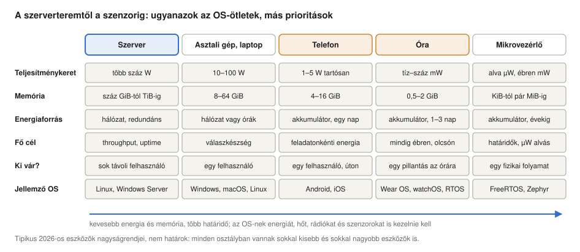
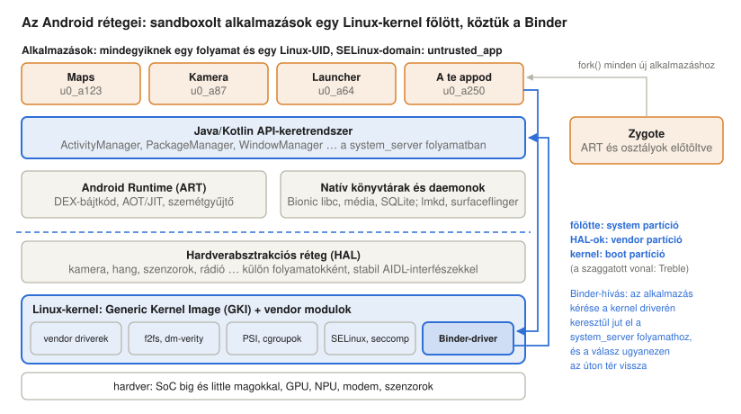
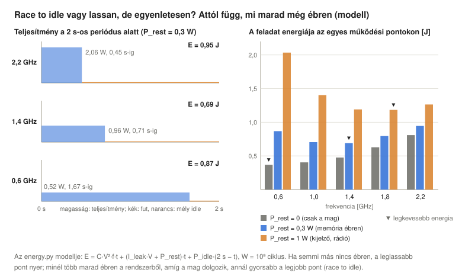
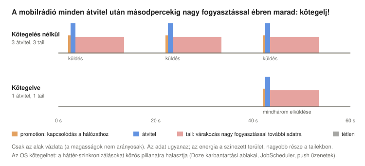
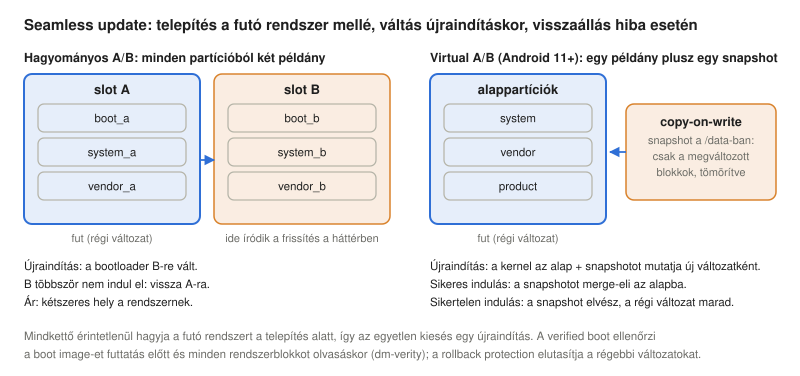
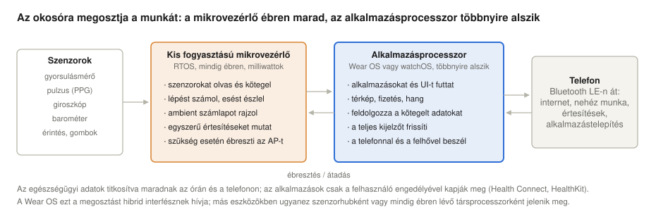
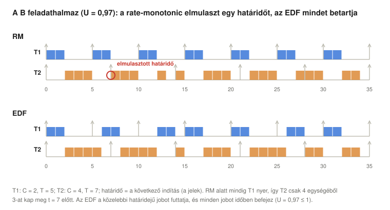

# Mobil, viselhető és beágyazott operációs rendszerek

*Operációs rendszerek előadás: mi változik, ha a számítógép akkumulátorról működik, elfér a zsebben, a csuklón vagy egy szenzorban: az energia, a hő, a memória és a rádiók mint erőforrások; az Android (Linux GKI-vel, Binder, HAL-ok és Treble, ART és Zygote, az alkalmazások sandboxa, a folyamatok fontossága, lmkd, zram, Doze) és az iOS (XNU, kódaláírás, sandbox és entitlementek, jetsam, Secure Enclave); DVFS, idle állapotok, race to idle, heterogén magok és energiatudatos ütemezés, ébresztések és radio tail; flash-fájlrendszerek, fájlalapú titkosítás, verified boot és A/B update; a két processzorral dolgozó viselhető eszközök; mikrovezérlők, valós idejű ütemezés (rate-monotonic, EDF, prioritásöröklés), RTOS-ek, szenzorhálózatok, beágyazott Linux, autók és headsetek; eszközön futó MI, Rust és verifikált kernelek, mindez Linuxon mérve*

## Tanulási célok

A világ számítógépeinek többsége nem szerver és nem asztali gép. Telefonok, órák, fülhallgatók, autók, mosógépek és szenzorok, és mindegyiken fut egy operációs rendszer, vagy legalább annak az a része, amelyre szüksége van. Az [első előadás](../01-historic-evolution/#xiv-kicsi-és-hordozható) a történetet a „kicsi és hordozható” eszközökkel zárta, amelyek új korlátja az akkumulátor volt. Ez az előadás ezt a szálat viszi tovább. A gondolatok az egész kurzuséi: a folyamatok és állapotaik, az ütemezés ([6. előadás](../06-concurrency-deadlocks-scheduling/)), a virtuális memória és a copy-on-write ([8. előadás](../08-virtual-memory/)), a flash-tárolók ([9. előadás](../09-file-systems/)), a kötelező hozzáférés-szabályozás, azaz a MAC (mandatory access control) ([10. előadás](../10-access-control/)), a cgroupok és az image-ek ([11. előadás](../11-virtualization-containerization/)). A súlypontok változnak meg: akkumulátoros eszközön a feladatonkénti energia és a válaszkészség többet számít az áteresztőképességnél, egy mikrovezérlőn pedig egy elmulasztott határidő meghibásodást jelenthet.

Az előadás végére a hallgatók képesek lesznek:

- elmagyarázni, miért kell a mobil, viselhető és beágyazott eszközöknek más operációsrendszer-prioritás (energia, hő, memória, hálózati kapcsolat, szenzorok, folyamatos működés, magánszféra, hosszú frissítési élettartam), és összehasonlítani öt eszközosztály tervezési céljait;
- leírni az Android rétegeit: a Linux-kernelt GKI-vel, a Bindert, a HAL-okat és a Treble-t, az ART-ot és a Zygote-ot (fork és copy-on-write), az alkalmazások sandboxát (alkalmazásonként egy UID, SELinux, seccomp, futásidejű engedélyek), és elmagyarázni, hogyan váltja ki a swapolást az alkalmazások életciklusa, a folyamatok fontossága, az `oom_score_adj`, a PSI-t használó lmkd és a zram;
- elmagyarázni a Doze-t és az App Standby bucketeket, és azt, hogy a mobil rendszerek miért korlátozzák a háttérmunkát;
- leírni az iOS-t és az iPadOS-t: az XNU hibrid kernelt, a kötelező kódaláírást, a sandboxprofilokat és az entitlementeket, a jetsamet, a háttérfuttatási modellt és a Secure Enclave-et, és összevetni őket az Androiddal;
- kiszámítani a dinamikus teljesítményt a $P = C \cdot V^2 \cdot f$ képlettel, elmagyarázni a DVFS-t, az idle állapotokat, a race to idle és a „lassan, de egyenletesen” stratégiát, a heterogén magokat és az energiatudatos ütemezést, a wakelockokat és a radio tail energiáját, valamint a thermal throttlingot;
- elmagyarázni az f2fs-t, a fájlalapú titkosítást, a verified bootot (dm-verity), az A/B és virtual A/B update-et, a Mainline modulokat és a kernel hosszú távú támogatásának problémáját;
- elmagyarázni, hogyan osztják meg a viselhető eszközök a munkát egy mikrovezérlő, egy alkalmazásprocesszor és egy telefon között;
- megkülönböztetni a kemény és a lágy valós idejű rendszereket, ellenőrizni feladathalmazokat rate-monotonic és EDF ütemezésre (Liu–Layland-korlát, válaszidő-analízis), elmagyarázni a prioritásöröklést, és megnevezni a fő RTOS-eket, szenzorhálózati rendszereket és beágyazott Linux-eszközöket;
- leírni a jelenlegi trendeket: NPU-k és eszközön futó MI, Rust a kernelekben, verifikált mikrokernelek, Fuchsia és HarmonyOS, valamint az eszközosztályok konvergenciája;
- megmérni Linuxon, mit csinál az lmkd, a zram, a valós idejű prioritás és az ütemezhetőségi tesztek, és megvizsgálni egy androidos eszközt `adb`-vel.

<details>
<summary><b>Egyszerűen elmagyarázva:</b> mobil, viselhető, beágyazott, akkumulátor, energia, teljesítmény, mikrovezérlő, valós idejű</summary>

- **Mobil eszköz:** magunkkal hordott számítógép: telefon vagy tablet.
- **Viselhető eszköz (wearable):** a testen viselt számítógép, például okosóra, aktivitásmérő karpánt vagy headset.
- **Beágyazott rendszer:** egy másik készülékbe épített, azt vezérlő számítógép, például a mosógép vezérlője, az autó fékrendszere vagy egy termosztát. A felhasználója gyakran nem is tud róla.
- **Akkumulátor:** energiatároló. Ha lemerül, az eszköz leáll, akármilyen gyors is a processzora.
- **Energia, teljesítmény:** az energia az elvégezhető munka mennyisége (joule-ban vagy wattórában mérjük); a teljesítmény azt mutatja, milyen gyorsan használjuk el az energiát (watt). Egy 1 wattos lámpa másodpercenként 1 joule-t használ el. Az akkumulátor energiát tárol; a processzor teljesítményt vesz fel.
- **Mikrovezérlő (MCU):** egyetlen chipre épített apró, olcsó számítógép processzorral, kevés memóriával és be-/kimeneti lábakkal, egyetlen készülék vezérlésére.
- **Valós idejű:** egy rendszer akkor valós idejű, ha a túl későn érkező helyes válasz is hibás. A légzsák, amely egy másodperccel később nyílik ki, csődöt mondott.

</details>

## Miért kell más operációs rendszer a kis eszközöknek

### Korlátok, amelyeket a szerver sosem ismert

Egy szerver légkondicionált teremben áll, a hálózatra kötve, több száz gigabájt memóriával és gyors hálózattal, amely sosem tűnik el. Egy telefonnak ezek közül egyik sincs meg:

- **Energia.** Egy telefon akkumulátora nagyjából 15–20 wattórát tárol, ez egynapi használatra elég. Minden alkatrész, amelyet az operációs rendszer bekapcsolva hagy (egy processzormag, a rádió, a kijelző, egy szenzor), rövidíti ezt a napot. A legszűkösebb erőforrás az energia, nem a CPU-idő.
- **Hő.** Nincs ventilátor. Egy telefon tartósan csak néhány wattot bír, mielőtt a felülete kellemetlenül felforrósodik, ezért a processzor csak rövid lökésekben futhat teljes sebességgel; utána az operációs rendszernek le kell lassítania (thermal throttling, lásd lent).
- **Memória.** Egy telefonban néhány gigabájt RAM van, több, mint egy 2010-es szerverben, de tucatnyi alkalmazást futtat, és mindet készenlétben tartja az azonnali folytatáshoz. Ahogy a következő szakaszok mutatják, a flash-tárolóján nincs swappartíció, így ha elfogy a memória, folyamatokat kell leállítani.
- **Időszakos hálózati kapcsolat.** A hálózat jön-megy (alagutak, liftek, váltás Wi-Fi és mobilinternet között), és a rádió minden használata sok energiába kerül. Az alkalmazásoknak offline is működniük kell, és később szinkronizálniuk.
- **Szenzorok és folyamatos működés.** A gyorsulásmérők, giroszkópok, GPS, mikrofonok, pulzusmérők folyamatosan termelik az adatot; az eszköznek reagálnia kell egy ébresztőszóra, egy esésre vagy egy értesítésre, miközben látszólag alszik.
- **Magánszféra és biztonság.** Egy telefon tárolja a tulajdonosa helyelőzményeit, üzeneteit, fényképeit, egészségügyi adatait és fizetési kulcsait, és több ezer, egymásban nem bízó fejlesztő kódját futtatja. Minden alkalmazást el kell szigetelni a többitől és a rendszertől.
- **Hosszú frissítési élettartam.** Az eszközöket sok évig használják, ezért az operációs rendszert biztonságosan, hálózaton át (over the air) kell frissíteni, a gyártónak pedig még jóval a hardver tervezésének lezárása után is támogatnia kell a kernelét.

### Az áteresztőképességtől a feladatonkénti energiáig

A korábbi előadások operációs rendszerei az **áteresztőképességet** (throughput: óránként elvégzett feladatok egy mainframe-en), később a **válaszkészséget** (időosztás, asztali gépek) optimalizálták. Az akkumulátoros eszközök egy harmadik mércét is hoznak, a **feladatonkénti energiát**: hány joule-ba kerül betölteni egy weboldalt, elkészíteni egy fényképet vagy egy napon át lépést számlálni. Az operációs rendszernek gyorsan kell reagálnia, amikor a felhasználó odanéz, és szinte semmit sem szabad fogyasztania, amikor senki sem figyel. Lejjebb a skálán az eszközöknek még kevesebb memóriájuk és energiájuk van, és a fő szempont a **határidők** betartása kiszámítható időzítéssel.



Az [első előadás osztályozása](../01-historic-evolution/#az-operációs-rendszerek-osztályozása) továbbra is érvényes, de a határok eltolódnak: a telefon általános célú, többfelhasználós Linux-kernelt futtat (minden alkalmazás egy „felhasználó”), egy okosóra gyakran két operációs rendszert futtat két processzoron, egy mikrovezérlő pedig olyan RTOS-t is futtathat, amelyben egyáltalán nincs memóriavédelem.

<details>
<summary><b>Egyszerűen elmagyarázva:</b> wattóra, thermal throttling, swap, hálózati kapcsolat, szenzor, ébresztőszó, over-the-air frissítés, áteresztőképesség, válaszkészség, feladatonkénti energia, határidő</summary>

- **Wattóra (Wh):** energiamennyiség: egy watt egy órán át. Egy telefon akkumulátora nagyjából annyit tárol, amennyit egy 15 wattos lámpa egy óra alatt elhasznál.
- **Thermal throttling:** a processzor lelassítása, mert túlmelegszik, ahogy egy futónak is lassítania kell kánikulában.
- **Swap:** terület a lemezen, ahová az operációs rendszer azokat a memórialapokat teszi félre, amelyeknek nincs hely a RAM-ban (8. előadás).
- **Hálózati kapcsolat:** az, hogy az eszköz csatlakozik egy hálózathoz. „Időszakos”: hol van, hol nincs.
- **Szenzor:** olyan alkatrész, amely valamit mér a világban: mozgást, fényt, helyet, hangot, szívverést.
- **Ébresztőszó:** egy szó, például „Hey Google”, amelytől az alvó eszköz figyelni kezd.
- **Over-the-air (OTA) frissítés:** a rendszer új változata, amelyet az eszköz a hálózaton keresztül tölt le és telepít, kábel és szerviz nélkül.
- **Áteresztőképesség (throughput):** mennyi munka készül el óránként. **Válaszkészség:** milyen gyorsan reagál az eszköz, amikor megérinted.
- **Feladatonkénti energia:** egy-egy feladat (egy fénykép, egy weboldal) mennyit fogyaszt az akkumulátorból.
- **Határidő:** a legkésőbbi időpont, ameddig egy feladatnak el kell készülnie.

</details>

## Android

Az Android a világ legelterjedtebb operációs rendszere. 2008-ban jelent meg, a Google fejleszti Android Open Source Project (AOSP) néven; a telefongyártók saját drivereket, alkalmazásokat és felhasználói felületet tesznek rá. 2026-ban az aktuális változat az Android 17, amely a Google Pixel telefonjaira 2026. június 16-án, más eszközökre a következő hónapokban jelent meg (Chau, 2026); kerneleit az `android17-6.18` branch adja, amely a Linux 6.18-on alapul (Android Open Source Project [AOSP], n.d.-f).

### Az Android rétegei



Felülről lefelé: az **alkalmazások** (appok) főként Kotlinban vagy Javában készülnek, és saját folyamatukban futnak; az **API-keretrendszer** (framework: az activity manager, a package manager, a window manager és tucatnyi más szolgáltatás) egyetlen nagy folyamatban, a `system_server`-ben fut; az alkalmazások és a szolgáltatások az **Android Runtime-on (ART)** és natív könyvtárakon futnak, például a Bionicon (az Android saját C-könyvtárán); alattuk a **hardverabsztrakciós rétegek** (HAL-ok, hardware abstraction layers) szabványos interfészek mögé rejtik az egyes gyártók hardverét; legalul egy **Linux-kernel** van. Az Android tehát a kernel értelmében *Linux*, a felhasználói tér értelmében viszont nem: nincs GNU C-könyvtár, nincs X11 vagy Wayland, nincsenek shellt használó felhasználók, a kernel „felhasználói” pedig az alkalmazások (Yaghmour, 2013).

### Binder: az Android IPC-je

Szinte minden, amit egy alkalmazás csinál, egy másik folyamaton keresztül történik: egy ablak megjelenítése, a helyadat lekérdezése, egy másik alkalmazás indítása mind kérés a `system_server`-ben vagy a HAL-folyamatokban futó szolgáltatásokhoz. Az Android erre saját IPC-mechanizmust használ, a **Bindert**, amely kerneldriverként működik (`/dev/binder`). A kliens egy proxyobjektum metódusát hívja; a Binder-driver a kérést közvetlenül a szerver címtartományába leképezett pufferbe másolja (egyetlen másolással a pipe kettője helyett), felébreszti a szerver egyik szálát, és visszaviszi a választ. A driver a hívó **UID-ját és PID-jét** is megmondja a szervernek, ezt a kernel garantálja, így minden szolgáltatás olyan identitáshoz mérheti a jogosultságokat, amelyet nem lehet hamisítani. Az interfészeket AIDL-ben (Android Interface Definition Language) írják le, ebből generálódik a proxy- és a stubkód.

### HAL-ok és Treble

2017 előtt egy új Android-változathoz minden telefonra új gyártói kód kellett (driverek és HAL-ok a chipgyártótól), ezért kaptak a telefonok ritkán frissítést. Az Android 8.0-val bevezetett **Project Treble** stabil, verziózott interfészt tett az Android-keretrendszer és a gyártói implementáció közé: a HAL-ok külön, Binderen kommunikáló folyamatok lettek, a gyártó kódja saját `vendor` partícióra költözött, az interfészt pedig egy tesztcsomag (VTS) ellenőrzi. Így a telefongyártó frissítheti a keretrendszert anélkül, hogy új gyártói kódra várna (Malchev, 2017). A következő leválasztott darab a kernel volt (GKI, lásd a [tárolásról, rendszerindításról és frissítésekről](#tárolás-rendszerindítás-és-frissítések) szóló részt).

### ART és Zygote

Az alkalmazások DEX-bájtkódra fordulnak, amelyből az **ART** gépi kódot készít: előre (ahead of time) a telepítéskor vagy üresjárati időszakokban (a ténylegesen használt kód profiljai alapján), a többit pedig futás közben (just in time), a memóriát szemétgyűjtő (garbage collector) kezeli. Egy futtatókörnyezet elindítása és a keretrendszer több ezer osztályának betöltése másodpercekig tart, ez túl hosszú minden alkalmazásindításhoz. Az Android ezért a rendszerindításkor elindít egy folyamatot, a **Zygote**-ot, amely inicializálja az ART-ot, előre betölti a közös osztályokat és erőforrásokat, majd vár. Egy alkalmazás indításához az activity manager a Zygote-hoz fordul, amely meghívja a `fork()`-ot: a gyereknek már bemelegített futtatókörnyezete van, beállítja az UID-ját, SELinux-domainjét és seccomp-szűrőjét, és betölti az alkalmazás kódját. A [copy-on-write](../08-virtual-memory/#copy-on-write) miatt az előre betöltött lapokon fizikailag minden alkalmazás osztozik, amíg valamelyik nem ír beléjük, ez indítási időt és memóriát is megtakarít (Yaghmour, 2013).

<details>
<summary><b>Egyszerűen elmagyarázva:</b> AOSP, alkalmazás, keretrendszer, system_server, ART, Bionic, HAL, Binder, IPC, proxy, AIDL, UID, Treble, VTS, vendor, partíció, DEX, bájtkód, ahead-of-time és just-in-time fordítás, szemétgyűjtő, Zygote, fork, copy-on-write</summary>

- **AOSP** (Android Open Source Project): az Android szabadon elérhető forráskódja, erre építenek a telefongyártók.
- **Alkalmazás (app):** program a telefonon. **Keretrendszer (framework):** kész szolgáltatások nagy készlete, amelyet az alkalmazások hívnak (ablakok, helymeghatározás, értesítések).
- **system_server:** az az egyetlen nagy folyamat, amely az Android rendszerszolgáltatásainak többségét futtatja.
- **ART** (Android Runtime): az a rész, amely az alkalmazások kódját futtatja és feltakarítja a már nem használt memóriát. **Bionic:** az Android kicsi C-könyvtára.
- **HAL** (hardware abstraction layer, hardverabsztrakciós réteg): tolmács az Android és egy gyártó hardvere között, hogy az Androidnak ne kelljen tudnia, melyik kamerachip van a készülékben.
- **IPC** (inter-process communication, folyamatok közötti kommunikáció): módszerek, amelyekkel két folyamat beszélhet egymással. A **Binder** az Android IPC-je: olyan, mint egy belső posta a kernelben, amely kézbesíti a kéréseket, és mindegyikre rápecsételi a feladó személyazonosságát.
- **Proxy:** helyettesítő objektum az alkalmazásban, amely úgy néz ki, mint a valódi szolgáltatás, és minden hívást továbbít neki.
- **AIDL:** egy szolgáltatás metódusainak rövid leírása, amelyből a továbbító kód automatikusan elkészül.
- **UID** (user ID, felhasználói azonosító): szám, amely a Linuxban egy tulajdonost azonosít. Az Android minden alkalmazásnak saját UID-t ad.
- **Treble:** az Android szétválasztása a Google részére és a hardvergyártó részére, hogy mindkettő külön frissíthető legyen. **VTS** (Vendor Test Suite): azok a tesztek, amelyek ellenőrzik, hogy a gyártó része betartja-e a megállapodott interfészt.
- **Vendor:** a chipet vagy a telefont gyártó cég. **Partíció:** a tároló külön szakasza, mint egy külön fiók.
- **DEX, bájtkód:** az alkalmazás kódjának tömör, hordozható formája, amely még nem egy adott processzor gépi kódja.
- **Ahead-of-time (AOT), just-in-time (JIT) fordítás:** a kód gépi kódra fordítása még azelőtt, hogy szükség lenne rá, illetve abban a pillanatban, amikor először kell.
- **Szemétgyűjtő (garbage collector):** a futtatókörnyezet része, amely megkeresi a már nem használt memóriát, és automatikusan felszabadítja.
- **Zygote:** előre elindított, félkész alkalmazásfolyamat, amelyről minden új alkalmazáshoz másolat készül, mint egy előmelegített sütő. (A zigóta egy új élőlény első sejtje.)
- **fork:** a rendszerhívás, amely lemásol egy folyamatot. **Copy-on-write:** a másolat az eredeti memóriáján osztozik, amíg valamelyikük meg nem változtat valamit (8. előadás).

</details>

### Az alkalmazások sandboxa

Az Android megfordítja a unixos felhasználói modellt. Egy asztali gépen a felhasználók emberek, a programok pedig a felhasználójuk jogaival futnak; az Androidon **minden alkalmazás saját Linux-UID-t kap** a telepítéskor (megjelenítve `u0_a123`: a 0. felhasználó 123-as számú alkalmazása), saját privát könyvtárat a `/data/data/` alatt és saját folyamatot. A kernel szokásos [DAC-ja (discretionary access control)](../10-access-control/) ezután megakadályozza, hogy az alkalmazások egymás fájljait olvassák. Az évek során további rétegek kerültek rá (AOSP, n.d.-b):

- **SELinux** enforcing módban az egész rendszerre az Android 5.0 óta; az Android 9 óta minden nem privilegizált alkalmazás (amely a 28-as vagy újabb API-szintet célozza) saját SELinux-sandboxban fut, az `untrusted_app` domainben, alkalmazásonkénti kategóriával, így még azt a fájlt sem olvashatja el egy másik alkalmazás, amelyet a tulajdonosa mindenki számára olvashatóvá tett. Ez a [10. előadás type enforcementje](../10-access-control/#selinux-címkék-és-type-enforcement), a Google által írt policyval;
- **seccomp-bpf** szűrő minden alkalmazáson az Android 8.0 óta, amely tiltja azokat a rendszerhívásokat, amelyekre az alkalmazásoknak nincs szükségük, és így csökkenti a kernel támadási felületét;
- **scoped storage** az Android 10 óta: nincs közvetlen hozzáférés a megosztott mappákhoz, például a `/sdcard/DCIM`-hez, csak az alkalmazás saját könyvtáraihoz és a felhasználó által kiválasztott fájlokhoz;
- **futásidejű engedélyek** (runtime permissions) az Android 6.0 óta: a veszélyes engedélyeket (kamera, helyadat, névjegyek, mikrofon) a használat pillanatában kéri az alkalmazás, és a felhasználó később visszavonhatja őket (Android Developers, n.d.-d).

Az engedélyeket az erőforrást birtokló szolgáltatás ellenőrzi a hívónak a Binder által kézbesített UID-ja alapján; néhányat, például a hálózati hozzáférést, a kernel kényszerít ki csoporttagságon keresztül.

<details>
<summary><b>Egyszerűen elmagyarázva:</b> sandbox, u0_a123, DAC, SELinux, enforcing, untrusted_app, kategória, seccomp-bpf, támadási felület, scoped storage, futásidejű engedély</summary>

- **Sandbox:** zárt homokozó. Minden alkalmazás a sajátjában játszik, és nem nyúlhat át a többiekébe.
- **u0_a123:** egy alkalmazás felhasználóneve az Androidon: 0. felhasználó (a telefon fő tulajdonosa), 123-as számú alkalmazás.
- **DAC** (discretionary access control): a fájlok szokásos tulajdonos/csoport/mindenki más jogosultságai (10. előadás).
- **SELinux, enforcing:** egy második, szigorúbb szabályrendszer, amelyet még egy fájl tulajdonosa sem írhat felül; az „enforcing” azt jelenti, hogy a szabálysértést blokkolja, nem csak jelenti.
- **untrusted_app:** a közönséges alkalmazások SELinux-címkéje. **Kategória:** alkalmazásonkénti extra címke, hogy két azonos típusú alkalmazás se nyúlhasson egymás fájljaihoz.
- **seccomp-bpf:** szűrő, amely felsorolja, milyen rendszerhívásokat használhat egy folyamat; minden más hívást elutasít.
- **Támadási felület:** mindazok a pontok, ahol egy támadó bejuthat; kevesebb engedélyezett rendszerhívás kevesebb ajtót jelent.
- **Scoped storage:** az alkalmazások csak a saját fájljaikat és azokat látják, amelyeket a felhasználó átad nekik, nem a teljes megosztott tárolót.
- **Futásidejű engedély:** az alkalmazás akkor kérdezi meg, hogy „használhatom a kamerát?”, amikor szüksége van rá, és te nemet mondhatsz, vagy később meggondolhatod magad.

</details>

### Az alkalmazások életciklusa és a folyamatok fontossága

A [6. előadás](../06-concurrency-deadlocks-scheduling/#a-folyamatok-állapottere) a folyamatállapotokat úgy írta le, ahogy a kernel látja őket: futásra kész, futó, várakozó, valamint a közép távú ütemezés felfüggesztett állapotai. Az Android erre egy második állapotgépet tesz, az **alkalmazás életciklusát** (app life cycle), amelyet a `system_server`-ben futó activity manager kezel: egy alkalmazás activityje *resumed*, amíg a képernyőn van, *paused*, ha részben takarva van, *stopped*, ha a háttérben van, és ezután bármikor *destroyed* lehet. Az alkalmazásokat nem a felhasználó zárja be; a rendszer dönt. A döntéshez az activity manager minden alkalmazásfolyamatot **fontosság** (importance) szerint rangsorol, és az eredményt a `/proc/PID/oom_score_adj` kernelfájlba írja: ez egy szám −1000 (soha ne állítsd le) és 1000 (állítsd le elsőként) között (AOSP, n.d.-i):


A képernyőn lévő alkalmazás értéke 0; a látható, de nem elöl lévőé 100; azé, amelynek az elvesztését a felhasználó észrevenné, például egy zenelejátszóé, 200; a háttérszolgáltatásoké 500; a launcheré 600; az előző alkalmazásé 700; a **cached** alkalmazásoké pedig, amelyek csak azért őrzik az állapotukat, hogy gyorsan újra megjelenhessenek, 900 és 999 között van, a legutóbb használtak az alsó végén. Az Android 11 óta a cached alkalmazásokat a cgroup v2 freezerrel **le is lehet fagyasztani** (a *cached apps freezer*, amelyet az eszköz konfigurációja kapcsol be): a szálaik a memóriában maradnak, de egyáltalán nem kapnak CPU-időt, ez a *felfüggesztett* állapot kerneles megfelelője (AOSP, n.d.-c).

### Nincs swap, de van zram: a low memory killer

Egy asztali Linux-rendszer, amelyből kifogy a memória, egy swappartícióra lapoz ki, és ha ez sem elég, a kernel OOM killere leállít egy folyamatot. A telefon egyiket sem a szokásos módon csinálja. A tárolója flash, amelynek cellái az írásoktól elkopnak ([9. előadás](../09-file-systems/#ssd-k)), és a rá történő lapozás energiába kerülne, ráadásul [vergődésbe](../08-virtual-memory/#munkahalmazok-és-vergődés) taszítaná a telefont. Az Android ezért két másik eszközt használ:

- **zram**: tömörített blokkeszköz a RAM-ban, amelyet swapként használ: a kilapozandó lapokat tömöríti (jellemzően a méretük harmadára vagy negyedére), és a memóriában tartja. A tömörítés és a kitömörítés CPU-időbe kerül, de sokkal kevesebbe, mint egy flash-írás, és nem kopik a flash (The kernel development community, n.d.-c).
- **lmkd**, a low memory killer daemon: felhasználói térben futó folyamat, amely figyeli a memórianyomást, és egész folyamatokat állít le, a legmagasabb `oom_score_adj` értékűekkel kezdve, *mielőtt* a kernel OOM killerének közbe kellene lépnie. Az Android 10 óta a nyomást a kernel **PSI**-jával (pressure stall information) méri, amely megadja, az idő mekkora részében akadtak el a taskok memóriára várva; a korábbi, kernelen belüli „lowmemorykiller” drivert a Linux 4.12-ben eltávolították az upstream kernelből. Mérsékelt nyomásnál az lmkd csak cached és hasonló folyamatokat állít le; csak kritikus nyomásnál megy fel az érzékelhető (perceptible) és az előtérszintig (AOSP, n.d.-g; The kernel development community, n.d.-b).

A felhasználó számára egy leállított cached alkalmazás észrevétlen: az Android minden activity állapotát elmenti (`onSaveInstanceState`), amikor az stopped állapotba kerül, így amikor a felhasználó visszatér, az alkalmazás újraindul a Zygote-ból, és visszaállítja a képernyőt olyanra, amilyen volt. Az alkalmazásokat ezért úgy kell megírni, hogy bármelyik pillanatban leállíthatók legyenek, ami nagyon különbözik egy asztali programtól. A lenti bemutatók megmutatják a leállítási sorrendet [a kernel OOM killerével és egy játék lmkd-vel](#ki-az-első-áldozat), valamint a zramot [munka közben](#tömörített-swap-a-ram-ban-zram).

<details>
<summary><b>Egyszerűen elmagyarázva:</b> életciklus, activity, resumed, paused, stopped, destroyed, fontosság, oom_score_adj, cached alkalmazás, freezer, OOM killer, vergődés, zram, lmkd, daemon, memórianyomás, PSI</summary>

- **Életciklus:** a szakaszok, amelyeken egy alkalmazás végigmegy, mint a pillangó fejlődési szakaszai. **Activity:** egy alkalmazás egy képernyője.
- **Resumed, paused, stopped, destroyed:** a képernyőn van és aktív; részben takarva; a háttérben; eltávolítva a memóriából.
- **Fontosság:** mennyire hiányozna a felhasználónak egy alkalmazás, ha most bezárnák.
- **oom_score_adj:** folyamatonkénti szám, amely megmondja a kernelnek, mennyire hajlandó leállítani azt a folyamatot, ha elfogy a memória; a nagyobb érték azt jelenti: „engem állíts le először”.
- **Cached alkalmazás:** egy korábban használt és otthagyott alkalmazás; csak azért marad a memóriában, hogy gyorsan visszatérhessen.
- **Freezer:** kernelszolgáltatás, amely egy csoport összes szálát teljesen megállítja, amíg ki nem olvasztják őket.
- **OOM killer** (out-of-memory killer): a kernel vészmegoldása: ha nem talál memóriát, leállít egy folyamatot.
- **Vergődés (thrashing):** amikor a rendszer minden idejét azzal tölti, hogy lapokat mozgat a memória és a tároló között, hasznos munka helyett (8. előadás).
- **zram:** tömörített memóriából készült „lemez”. A kilapozott lapokat összenyomja és a RAM-ban tartja, ahogy a vákuumzsákba csomagolt ruhákból is több fér a szekrénybe.
- **lmkd:** az Android low memory killer daemonja. **Daemon:** háttérben futó program, amely valamilyen szolgáltatást nyújt.
- **Memórianyomás:** mennyire kell megdolgoznia a rendszernek azért, hogy szabad memóriát találjon.
- **PSI** (pressure stall information): a kernel kimutatása arról, az idő mekkora részében akadtak el a programok memóriára (vagy CPU-ra, vagy I/O-ra) várva.

</details>

### Háttérkorlátok: Doze és App Standby

Egy háttérben futó alkalmazás, amely percenként felébreszti a telefont, hogy hírek után nézzen, sosem hagyja aludni a processzort és a rádiót. Az Android lépésről lépésre korlátozta a háttérmunkát (Android Developers, n.d.-a, n.d.-c, n.d.-e):

- **Doze** (az Android 6.0 óta): ha az eszköz nincs töltőn, mozdulatlan, és egy ideje ki van kapcsolva a képernyője, a rendszer felfüggeszti az alkalmazások hálózati hozzáférését, figyelmen kívül hagyja a wakelockjaikat, elhalasztja az alarmjaikat és jobjaikat, és leállítja a Wi-Fi-kereséseket. Időnként rövid **karbantartási ablakot** (maintenance window) nyit, amelyben az összes elhalasztott munka együtt fut le, és az ablakok annál ritkábbak, minél tovább fekszik a telefon mozdulatlanul. A magas prioritású push üzenetek és az ébresztőóra-riasztások továbbra is átjutnak.
- **App Standby bucketek** (az Android 9 óta): minden alkalmazás bekerül egy bucketbe aszerint, hogy a felhasználó mennyire régen és milyen gyakran használja: *active*, *working set*, *frequent*, *rare* vagy (az Android 12 óta) *restricted*, és a bucket szabja meg a keretét. Egy *frequent* alkalmazás például egy gördülő 12 órás időszakban legfeljebb 10 percig futtathat háttérjobokat, és óránként 2 alarmot állíthat be; egy *rare* alkalmazás 24 óránként 10 percet kap, óránként 1 alarmot, és a jobjai nem érhetik el a hálózatot; egy *restricted* alkalmazás naponta egy jobot és egy alarmot.
- **Háttérfuttatási korlátok:** az alkalmazások nem indíthatnak szabadon háttérszolgáltatásokat; a hosszú munkát a `JobScheduler`-en vagy a `WorkManager`-en keresztül kell ütemezni (ezeket a rendszer kötegelheti és elhalaszthatja), vagy *foreground service*-ként, értesítéssel kell megmutatni a felhasználónak.

Mindhárom ugyanazt az elvet fejezi ki: nem az alkalmazás, hanem az operációs rendszer dönti el, mikor fut a háttérmunka, így azt **kötegelni** tudja azokra a pillanatokra, amikor az eszköz amúgy is ébren van (az [energiagazdálkodásról](#energiagazdálkodás) szóló rész magyarázza el, miért takarít meg ez olyan sokat).

<details>
<summary><b>Egyszerűen elmagyarázva:</b> háttér, wakelock, alarm, job, Doze, karbantartási ablak, push üzenet, App Standby bucket, JobScheduler, WorkManager, foreground service, kötegelés</summary>

- **Háttér:** futás, miközben nem nézed az alkalmazást.
- **Wakelock:** egy alkalmazás kérése: „még ne hagyd elaludni a telefont”.
- **Alarm, job:** az alarm egy adott időpontban felébreszt egy alkalmazást; a job egy háttérben végzendő munkadarab, amely „valamikor hamarosan” lefuthat.
- **Doze:** a telefon mélyalvó üzemmódja, amikor érintetlenül, kikapcsolt képernyővel fekszik.
- **Karbantartási ablak:** rövid pillanat, amikor a szunyókáló telefon felébred, és az összes várakozó alkalmazást egyszerre dolgozni engedi.
- **Push üzenet:** egy szerverről egyetlen közös kapcsolaton át küldött üzenet, amely felébreszti a megfelelő alkalmazást, így nem kell minden alkalmazásnak folyton kérdezgetnie.
- **App Standby bucket:** osztály, amelybe az alkalmazás aszerint kerül, mennyit használod; a ritkán használt alkalmazások kevesebb háttéridőt kapnak.
- **JobScheduler, WorkManager:** a hivatalos módjai annak, hogy megkérd az Androidot: „kérlek, futtasd ezt, amikor neked megfelel”.
- **Foreground service:** háttérmunka, amelyről egy állandó értesítés tájékoztatja a felhasználót, például zenelejátszás vagy navigáció.
- **Kötegelés (batching):** apró feladatok összegyűjtése és együttes elvégzése, ahogy az ember is egy úttal intézi el az összes ügyét.

</details>

## iOS és iPadOS

Az Apple iPhone-ja (2007) iOS-t futtat; az iPadOS (2019 óta), a watchOS, a tvOS és a visionOS ugyanazon a magon osztozik. Az Androiddal ellentétben a teljes verem, a processzortól az App Store-ig, egyetlen cégtől származik.

### XNU: hibrid kernel

A kernel az **XNU**, amely a macOS kernele is. **Hibrid** kernel: a Mach mikrokernel (taskok, szálak, virtuális memória, portokon át zajló üzenetküldés) és egy BSD-réteg (folyamatok, a Unix-rendszerhívások, a fájlrendszerek és a hálózatkezelés) egyetlen kernelbe van fordítva, és egyetlen címtartományban fut, a driverekhez pedig az I/O Kit szolgál (Levin, 2019a). Az [1. előadás osztályozása](../01-historic-evolution/#az-operációs-rendszerek-osztályozása) emiatt a Windows NT mellé sorolja. A Mach-üzenetek azt a szerepet játsszák, amit az Androidon a Binder: a szolgáltatások daemonokban futnak, az alkalmazások pedig Mach-portokon (az XPC-könyvtárba csomagolva) érik el őket.

### Kódaláírás, sandbox és entitlementek

Az iOS egy tekintetben szigorúbb az Androidnál: **csak aláírt kódot** futtat. Minden futtatható lapnak érvényes, az Apple-ig visszavezethető aláírást kell hordoznia; az App Store-ból származó alkalmazásokat ellenőrzés után az Apple írja alá, és a kernel aláírás nélkül nem képez le memóriát futtathatóként, így egy alkalmazás nem tölthet le és nem futtathat új gépi kódot (just-in-time fordítót csak külön entitlementtel rendelkező folyamatok használhatnak, például a Safari JavaScript-motorja). Minden külső fejlesztőtől származó alkalmazás a nem privilegizált `mobile` felhasználóként fut, saját, véletlenszerű nevű home könyvtárában, egy **sandboxban**, amely a kernel sandbox-kiterjesztése által kikényszerített MAC-profil (a TrustedBSD-től örökölt MAC-keretrendszer, szellemében a SELinuxhoz hasonló). Az **entitlementek**, az aláírt alkalmazásba ágyazott kulcs–érték párok, az alapértelmezett sandboxon túli egyedi jogokat adnak, például hozzáférést az iCloudhoz, a HealthKithez vagy egy push-értesítési szolgáltatáshoz; mivel alá vannak írva, egy alkalmazás nem módosíthatja a sajátjait (Apple Inc., 2026; Levin, 2019b).

### Memória: jetsam

Az iOS-nek sincs swapja a flashen, de tömöríti a memóriát, a zramhoz hasonlóan. Ha kevés a memória, a rendszer először **low-memory értesítéseket** küld, hogy az alkalmazások felszabadíthassák a gyorsítótáraikat; ha ez nem elég, a kernel memóriaállapot-mechanizmusa, a **jetsam** leállít folyamatokat. Egy jetsam eseményjelentés rögzíti, miért: `vm-pageshortage` (az előtérben lévő alkalmazásnak kellett memória, ezért leállt egy háttérfolyamat), `per-process-limit` (egy alkalmazás túllépte a rezidens memória korlátját, amely minden alkalmazásra vonatkozik; a bővítményeknek (extension) sokkal alacsonyabb a korlátjuk), és még néhány más ok. A lapméret a jelenlegi Apple-eszközökön 16 KiB (Apple Inc., n.d.-b). Az elv ugyanaz, mint az lmkd-é: a folyamatok prioritási sorrendje, és a legkevésbé fontosak mennek el elsőként.

### Háttérben futás

Egy iOS-alkalmazást, amely elhagyja a képernyőt, általában másodperceken belül **felfüggeszt** a rendszer: a memóriában marad, de egyáltalán nem kap CPU-időt, nagyon hasonlóan az Android lefagyasztott cached alkalmazásaihoz. Csak néhány fajta munka folytatódhat: hanglejátszás, navigáció, VoIP-hívások, rövid feladatok a felhasználó által megkezdett munka befejezésére, valamint a **BackgroundTasks** keretrendszeren (az iOS 13 óta) keresztül ütemezett munka, amelyben az alkalmazás frissítési feladatot vagy hosszabb feldolgozási feladatot kér, és a *rendszer* dönti el, mikor futtatja, például amikor a telefon töltőn van és Wi-Fi-hez kapcsolódik (Apple Inc., n.d.-a). A push értesítések a rendszer egyetlen közös kapcsolatán keresztül érkeznek, nem minden alkalmazás saját szerverkapcsolatán.

### A Secure Enclave

Az Apple chipjeiben van egy **Secure Enclave**: egy külön processzor saját boot ROM-mal, titkosított memóriával és operációs rendszerrel (sepOS), a fő processzortól elszigetelve. Ez őrzi az adatvédelem, valamint a Face ID és a Touch ID kulcsait: a fő processzor megkérheti, hogy használjon egy kulcsot, de magát a kulcsot sosem látja, így még egy teljesen kompromittált iOS-kernel sem tudja kinyerni (Apple Inc., 2026). Az androidos telefonokban vannak megfelelői (megbízható végrehajtási környezet, trusted execution environment a fő chipben, gyakran külön biztonsági chippel, például a Google Titan M-jével), amelyeket a Keystore és a KeyMint interfészen keresztül lehet elérni.

### Az Android és az iOS összehasonlítása

| | Android | iOS / iPadOS |
| --- | --- | --- |
| Kernel | Linux (monolitikus, modulok), GKI | XNU (hibrid: Mach + BSD) |
| Forráskód | AOSP nyílt forráskód; a gyártók drivereket és alkalmazásokat tesznek hozzá | a kernel nyílt forráskódú, a többi zárt |
| IPC | Binder | Mach-üzenetek, XPC |
| Alkalmazások elszigetelése | alkalmazásonként egy UID, SELinux `untrusted_app`, seccomp | `mobile` felhasználó, sandboxprofilok, entitlementek |
| Kód | ART által futtatott DEX-bájtkód; natív kód megengedett; sideloading lehetséges (korlátozásokkal) | csak az Apple által aláírt natív kód; alkalmazásoknak nincs JIT |
| Memóriahiány | lmkd (PSI, `oom_score_adj`), zram, végső esetben a kernel OOM killere | low-memory értesítések, memóriatömörítés, jetsam |
| Háttér | Doze, App Standby bucketek, JobScheduler, foreground service-ek, freezer | felfüggesztés, BackgroundTasks, néhány háttérüzemmód |
| Frissítések | Mainline modulok, A/B vagy virtual A/B OTA, gyártófüggő | az egész rendszer az Apple-től, minden támogatott eszközre |

<details>
<summary><b>Egyszerűen elmagyarázva:</b> XNU, hibrid kernel, Mach, mikrokernel, BSD, I/O Kit, port, XPC, kódaláírás, aláírás, App Store-ellenőrzés, entitlement, TrustedBSD, jetsam, felfüggesztett, BackgroundTasks, Secure Enclave, sepOS, Face ID, Touch ID, megbízható végrehajtási környezet, Titan M, Keystore, sideloading</summary>

- **XNU:** az iOS és a macOS kernele. **Hibrid kernel:** mikrokerneles elvek szerint tervezett, de a sebesség kedvéért egyetlen programként felépített kernel.
- **Mach, mikrokernel:** a Mach egy kutatási kernel volt, amely csak az alapokat végzi (taskok, memória, üzenetek), a többit külön programokra hagyja; a mikrokernel így felépített kernel.
- **BSD:** a Berkeley-i Kaliforniai Egyetemről származó Unix-család; az XNU Unix-része innen ered.
- **I/O Kit:** az Apple keretrendszere eszközmeghajtók (driverek) írására.
- **Port, XPC:** a Mach-port egy szolgáltatásnak szóló üzenetek postaládája; az XPC az Apple erre épülő, kényelmes könyvtára.
- **Kódaláírás, aláírás:** digitális pecsét egy programon, amely igazolja, ki készítette, és hogy senki sem változtatott rajta. Ha a pecsét sérült, a program nem fut.
- **App Store-ellenőrzés:** az Apple minden alkalmazást átnéz, mielőtt megjelenteti a boltjában.
- **Entitlement:** aláírt engedélycédula az alkalmazásban, például: „ez az alkalmazás használhatja a HealthKitet”.
- **TrustedBSD:** a FreeBSD biztonsági kiterjesztése, erre épül az Apple sandboxa.
- **Jetsam:** az iOS low memory killere. (A jetsam az a rakomány, amelyet a hajó könnyítésére a tengerbe dobnak.)
- **Felfüggesztett:** a memóriában marad, de egyáltalán nem futhat.
- **BackgroundTasks:** az iOS módja annak, hogy azt kérd: „engedd, hogy ezt később elvégezzem, amikor neked megfelel”.
- **Secure Enclave, sepOS:** kis, különálló számítógép a chipben, saját parányi operációs rendszerrel, amely a titkos kulcsokat őrzi; olyan, mint egy bankszéf, amelynek a kulcsa sosem hagyja el a bankot.
- **Face ID, Touch ID:** feloldás az arcoddal vagy az ujjlenyomatoddal.
- **Megbízható végrehajtási környezet (trusted execution environment), Titan M:** az androidos megfelelők: a fő chip védett területe, illetve egy külön biztonsági chip.
- **Keystore, KeyMint:** az Android szolgáltatása, amely a kulcsokat ebben a védett hardverben tartja.
- **Sideloading:** alkalmazás telepítése a hivatalos boltot megkerülve.

</details>

## Energiagazdálkodás

### Hová lesz az energia?

Egy okostelefon alkatrészenkénti klasszikus mérése azt találta, hogy a legtöbb használati helyzetben a rádió (a GSM-modul) és a kijelző a háttérvilágításával fogyasztott a legtöbbet, a processzor és a memória pedig főként nagy számítási terhelésnél számított (Carroll & Heiser, 2010). Azóta a kijelzők OLED-esek lettek (a fogyasztásuk a képtől függ), a processzorok sokkal gyorsabbak lettek, az LTE- és 5G-rádiók pedig új költségeket hoztak, de a tanulság érvényes: az operációs rendszer úgy takarít meg energiát, hogy *minden* alkatrészt kezel, kikapcsolja, amire nincs szükség, és mindenekelőtt a lehető legtöbbet alvó állapotban tartja az eszközt. Ezt több mechanizmussal teszi.

### Dinamikus teljesítmény és DVFS

Egy CMOS-chip kétféleképpen vesz fel teljesítményt. A **dinamikus teljesítmény** a tranzisztorok minden átkapcsolásakor fogy: minden órajelciklus kapacitásokat tölt fel és süt ki, így

$$P_{dyn} = C \cdot V^2 \cdot f$$

ahol $C$ az effektív átkapcsolt kapacitás, $V$ a tápfeszültség, $f$ pedig az órajel-frekvencia. A **statikus teljesítmény** (szivárgás, leakage) addig folyik, amíg az áramkörön feszültség van, akár kapcsol, akár nem. Egy áramkör kisebb frekvencián kisebb feszültséggel is működik, ezért a modern processzorok **működési pontok** (operating performance points, OPP-k), azaz frekvencia–feszültség párok táblázatát kínálják, és az operációs rendszer választ közülük: ez a **dinamikus feszültség- és frekvenciaskálázás** (dynamic voltage and frequency scaling, DVFS) (Pering et al., 1998; Weiser et al., 1994).

**Egy kidolgozott példa.** Egy $C$ = 0,6 nF-os mag 2,2 GHz-en és 1,1 V-on fut:

$$P = 0{,}6 \cdot 10^{-9} \cdot 1{,}1^2 \cdot 2{,}2 \cdot 10^9 \approx 1{,}60 \text{ W}$$

0,6 GHz-en és 0,6 V-on ugyanennek a magnak $0{,}6 \cdot 10^{-9} \cdot 0{,}6^2 \cdot 0{,}6 \cdot 10^9 \approx 0{,}13$ W kell: körülbelül 12-szer kisebb teljesítmény 3,7-szer lassabb órajelért. Egy ciklus energiája, $C \cdot V^2$, 0,73 nJ-ról 0,22 nJ-ra csökken, így egy $10^9$ ciklusos feladatnak teljes sebességen 0,73 J, a leglassabb ponton 0,22 J kell. Mivel a ciklusonkénti energia $V^2$-től függ, az energiát a feszültség csökkentése takarítja meg; ha csak a frekvenciát csökkentjük ugyanazon a feszültségen, az ugyanazt az energiát csak hosszabb időre nyújtja szét.

Linuxon a DVFS a **cpufreq** alrendszer feladata: egy *driver* ismeri a hardver OPP-it, egy *governor* pedig választ. A jelenlegi alapértelmezés, a **schedutil**, az ütemező saját becsléséből dönt az egyes CPU-k kihasználtságáról, így a frekvencia ezredmásodperceken belül követi a terhelést.

### Idle állapotok

Ha nincs mit futtatni, az ütemező az idle taskot futtatja, amely a magot egy **idle állapotba** teszi (x86-on C-állapot, Armon WFI és mélyebb állapotok). A mélyebb állapotok többet takarítanak meg: a clock gating leállítja az órajelet, a power gating teljesen lekapcsolja a mag feszültségét (nincs szivárgás), a legmélyebb állapotok pedig a gyorsítótárakat és a chip egyes részeit is lekapcsolják. Egy mélyebb állapotból viszont tovább tart kilépni (ez a **kilépési késleltetés**, exit latency), a be- és kilépés pedig energiába kerül, így csak akkor éri meg, ha a mag elég sokáig marad tétlen (ez a **target residency**, a minimális tartózkodási idő). A Linux **cpuidle** alrendszere egy governorral (`menu`, `teo`, `ladder`, `haltpoll`) választja ki az állapotot, amely megjósolja, meddig lesz tétlen a CPU, főként a következő időzítőesemény és a közelmúlt alapján. Minden fölösleges időzítő-megszakítás vagy ébresztés ezért kétszer kerül pénzbe: maga a munka, és egy sekélyebb idle állapot.

### Race to idle vagy lassan, de egyenletesen?

Egy feladat fusson teljes sebességgel, aztán aludjon (**race to idle**), vagy olyan lassan, amennyire a határideje engedi (**„lassan, de egyenletesen”**, slow and steady)? A képlet a lassút sugallja: a ciklusonkénti energia $V^2$-tel csökken. De amíg a mag dolgozik, más dolgok is ébren maradnak és teljesítményt vesznek fel: a mag saját szivárgása, a memória és az összeköttetések (interconnect), néha a kijelző és a rádió is. A lassú futás mindezeket tovább tartja bekapcsolva. Az `energy.py` modell (lásd [lent](#race-to-idle-modellezve), kitalált, de valószerű paraméterekkel) egy feladat energiáját számítja ki az egyes működési pontokon:



Ha csak a mag dinamikus teljesítménye számítana, a leglassabb pont nyerne; ha a rendszer többi részéből 0,3 W ébren van, egy közepes frekvencia, a **kritikus frekvencia** fogyasztja a legkevesebb energiát; 1 W-tal (bekapcsolt kijelző és rádió) egy gyors pont nyer. A valódi hardveren végzett mérések ugyanebbe az irányba mutatnak: az AMD Opteron szerverek három generációján, ahogy a feszültségtartomány szűkült, a statikus teljesítmény nőtt és az idle állapotok javultak, úgy csökkent a lassabb futás haszna, a legújabb platformon pedig a DVFS még egy erősen memóriakorlátos terhelés energiáját is növelte, így a race to idle lett a jobb alapértelmezés (Le Sueur & Heiser, 2010).

### Heterogén magok és energiatudatos ütemezés

A telefonchipek tovább mennek: **különböző fajta magokat** kombinálnak. Az Arm big.LITTLE (2011) gyors, sokat fogyasztó „big” magokat párosított lassú, takarékos „little” magokkal; a DynamIQ (2017) egy clusteren belül is megengedi a különböző magokat, és a mai telefonchipekben jellemzően egy-két prime mag, több teljesítménymag és több hatékonysági mag van. Egy little mag nem éri el a big mag csúcssebességét, de az általa elérhető sebességeken utasításonként sokkal kevesebb energiát fogyaszt. Az ütemezés elhelyezési problémává válik: melyik taskot melyik fajta magra, milyen frekvencián?

A Linux válasza az **Energy Aware Scheduling** (EAS, energiatudatos ütemezés). Minden CPU-nak van egy *kapacitása* (capacity: a leggyorsabbé 1024, a lassabbaké kevesebb), egy **Energy Model** pedig megadja az egyes teljesítménytartományok (performance domain) teljesítményét minden OPP-n. Amikor egy task felébred, az EAS megbecsüli, mennyi lenne a teljes energia, ha az egyes jelölt CPU-kra tenné, és a legolcsóbbat választja azok közül, amelyeken még van elég szabad kapacitás; a frekvenciát ezután a schedutil állítja be. Az EAS csak aszimmetrikus rendszereken működik, schedutilt igényel, és kikapcsolja magát, ha egy CPU **túlterhelt** (over-utilised, a kapacitásának 80%-a fölött), mert ilyenkor a teljesítmény fontosabb az energiánál (The kernel development community, n.d.-a). Az Android saját jelzéseket tesz hozzá: az előtérben lévő alkalmazás szálai olyan cgroupokba kerülnek, amelyek használhatják a big magokat, a háttérszálak pedig a little magokra korlátozódnak.

### Ébresztések, wakelockok és a radio tail

A legdrágább dolog, amit egy alvó telefon tehet, az ébredés. Egy **ébresztési forrás** (wakeup source: megszakítás a modemtől, egy időzítő, egy szenzor) kihozza a processzort a suspendből; egy **wakelock** (Linuxon egy driver vagy egy alkalmazás nevében a keretrendszer által tartott wakeup source) megakadályozza, hogy a rendszer újra suspendbe menjen. Egy elfelejtett wakelock egész éjjel ébren tartja a telefont; ez volt a fenti háttérkorlátok egyik fő oka.

A rádiók saját csapdát is rejtenek. Egy mobilhálózati modem nem kapcsol ki rögtön az átvitel után: először kapcsolódik (*promotion*), aztán átvisz, majd egy ideig nagy fogyasztású állapotban marad, hátha jön még adat (ez a **tail**), és csak utána tér vissza tétlen állapotba. Egy 4G LTE-hálózatokról szóló tanulmány szerint a tail a rádió energiájának kulcsfontosságú része, és az LTE akár 23-szor kevésbé energiahatékony a Wi-Finél (Huang et al., 2012). Három kis átvitel néhány másodperc különbséggel három tailbe kerül; kötegelve egybe:



A Doze karbantartási ablakai, a JobScheduler és a push üzenetek mind azért vannak, hogy az alsó képet állítsák elő.

### Hő: thermal throttling

Egy telefon rövid ideig jóval 10 W fölötti teljesítményt is felvehet, de a háza csak néhány wattot tud elvezetni anélkül, hogy felmelegedne. A chipen és a házban lévő hőérzékelők a kernel **thermal frameworkjét** táplálják: amikor egy *thermal zone* átlép egy *trip pointot*, egy *cooling device* lép működésbe, általában úgy, hogy korlátozza a big magok vagy a GPU maximális frekvenciáját, vagy a töltést. Az operációs rendszer ezután az alkalmazásokat is értesíti (az Android thermal status API-ja), hogy egy játék csökkenthesse a felbontását, mielőtt a rendszer ezt durvábban tenné meg. Amit egy telefon valójában nyújtani tud, az a tartós teljesítmény, nem a csúcsteljesítmény.

<details>
<summary><b>Egyszerűen elmagyarázva:</b> GSM, LTE, 5G, OLED, CMOS, dinamikus teljesítmény, statikus teljesítmény, szivárgás, kapacitás (elektromos), feszültség, frekvencia, működési pont, DVFS, nJ, cpufreq, governor, schedutil, idle állapot, C-állapot, WFI, clock gating, power gating, kilépési késleltetés, target residency, cpuidle, race to idle, kritikus frekvencia, big.LITTLE, DynamIQ, kapacitás (CPU), EAS, Energy Model, túlterhelt, wakeup source, suspend, wakelock, promotion, tail, thermal zone, trip point, cooling device</summary>

- **GSM, LTE, 5G:** a mobilhálózatok generációi (2G, 4G és 5G).
- **OLED:** olyan kijelző, amelynek pixelei maguk világítanak, így a sötét pixelek szinte semmit sem fogyasztanak.
- **CMOS:** szinte minden chip tranzisztortechnológiája.
- **Dinamikus teljesítmény, statikus teljesítmény, szivárgás:** a kapcsolgatásra fordított teljesítmény, illetve az, amely csak azért „szivárog” át a tranzisztorokon, mert a chip be van kapcsolva, mint egy csöpögő csap.
- **Kapacitás (elektromos):** mennyi elektromos töltést tárol egy vezeték vagy tranzisztor; minden órajelnél való feltöltése energiába kerül.
- **Feszültség, frekvencia:** az elektromos „nyomás”, amelyen a chip fut, és hogy az órája hányat üt másodpercenként.
- **Működési pont (OPP):** egy megengedett sebesség–feszültség pár.
- **DVFS:** a processzor sebességének és feszültségének menet közbeni állítása, mint a sebességváltás egy autóban.
- **nJ** (nanojoule): a joule milliárdod része.
- **cpufreq, governor, schedutil:** a Linux azon része, amely a CPU sebességét változtatja; a governor az a szabály, amelyet követ; a schedutil az a szabály, amely az ütemező terhelésképét követi.
- **Idle állapot, C-állapot, WFI:** egy processzormag alvási szintjei; a WFI („wait for interrupt”) az alapvető Arm-utasítás a szunyókáláshoz.
- **Clock gating, power gating:** egy tétlen rész órajelének leállítása (nem dolgozik tovább), illetve a tápellátásának teljes lekapcsolása (szivárogni sem szivárog).
- **Kilépési késleltetés, target residency:** mennyi idő felébredni egy alvási szintről, és mennyit kell aludni ahhoz, hogy az a szint megérje; egy rövid szunyókálás miatt nem éri meg pizsamát húzni.
- **cpuidle:** a Linux azon része, amely az alvási szintet választja.
- **Race to idle:** gyorsan befejezni, aztán mélyen aludni. **Kritikus frekvencia:** az a sebesség, amelyen egy feladat a legkevesebb energiát fogyasztja.
- **big.LITTLE, DynamIQ:** Arm-tervek, amelyek gyors és takarékos magokat egyesítenek egy chipben, mint egy autó, amelyben van erős motor az előzéshez és villanymotor a városhoz.
- **Kapacitás (CPU):** mennyi munkát végezhet egy CPU a leggyorsabbhoz (1024) képest.
- **EAS** (Energy Aware Scheduling), **Energy Model:** a Linux-ütemező üzemmódja, amely minden taskot oda tesz, ahol a legkevesebb energiába kerül, egy táblázat alapján arról, melyik mag milyen sebességen mennyi teljesítményt vesz fel.
- **Túlterhelt (over-utilised):** annyira elfoglalt, hogy az energiatakarékosságnak várnia kell.
- **Wakeup source, suspend:** valami, ami felébresztheti az alvó rendszert; a suspend az egész rendszer mély alvása.
- **Promotion, tail:** a rádió beindulása küldés előtt, és az idő, amíg utána még ébren marad, hátha kell.
- **Thermal zone, trip point, cooling device:** egy mért hőmérsékletű terület; az a hőmérséklet, amelynél a rendszernek cselekednie kell; és az, ami cselekszik (például a CPU sebességkorlátja).

</details>

## Tárolás, rendszerindítás és frissítések

### Flash-fájlrendszerek: f2fs

A telefonok eMMC- vagy UFS-flashen tárolják az adatokat, benne a [9. előadás flash translation layerével](../09-file-systems/#ssd-k). Az **f2fs** (flash-friendly file system), amelyet a Samsung fejlesztett, és a 3.8-as változat (2013) óta a Linux-kernel része, erre készült: log-structured módon ír (az új adat friss szegmensekbe kerül, nem a régi helyére), szétválasztja a forró és a hideg adatot, hogy az FTL szemétgyűjtésének kevesebbet kelljen másolnia, és a metaadatait a flashnek megfelelő elrendezésben tartja. Sok androidos telefon az f2fs-t használja a `/data` partícióhoz, a csak olvasható rendszerpartíciók pedig ext4-et vagy EROFS-t.

### Fájlalapú titkosítás

Az Android 10 óta az új eszközöknek **fájlalapú titkosítást** (file-based encryption, FBE) kell használniuk, amelyet az Android 7.0 vezetett be; a régebbi teljes lemeztitkosítás új eszközökön nem megengedett. FBE-vel a különböző fájlokat különböző kulcsok titkosítják, amelyek egymástól függetlenül oldhatók fel: a **device-encrypted** tároló az eszköz indulása után azonnal elérhető, a **credential-encrypted** tároló csak azután, hogy a felhasználó megadta a PIN-kódját vagy jelszavát. Ez teszi lehetővé a **Direct Boot**-ot: újraindítás után az ébresztők, a hívások és az akadálymentességi szolgáltatások a zárolási képernyőn is működnek, miközben a felhasználó személyes adatai titkosítva maradnak. A **metaadat-titkosítás** (az Android 9 óta) a fájlméreteket, a jogosultságokat és az időbélyegeket is elrejti (AOSP, n.d.-d). A kulcsokat a hardveres KeyMint védi (iPhone-okon a Secure Enclave).

### Verified boot

Egy telefon nem indíthat el módosított rendszert. A **verified boot** egy hardverben tárolt kulcsból kiinduló bizalmi láncot épít: a boot ROM ellenőrzi a bootloadert, a bootloader a boot image-et (a kernelt), a nagy rendszerpartíciókat pedig olvasáskor blokkonként a kernel **dm-verity** funkciója ellenőrzi, amely minden blokk hash-ét összeveti egy hash-fával, amelynek gyökere alá van írva. Az **Android Verified Boot** (AVB, az Android 8.0 óta) **rollback protectiont** is nyújt: az eszköz nem hajlandó elindítani egy régebbi, aláírt, de sebezhető változatot (AOSP, n.d.-j). A rendszerpartíciók csak olvashatók, és egy modell minden példányán azonosak, ami pontosan a [2. előadás image mode-jának](../02-quality-and-enterprise-linux/#image-mode-a-teljes-operációs-rendszer-image-ként) és a [11. előadás](../11-virtualization-containerization/#image-konténer-volume) megváltoztathatatlan konténer image-einek gondolata.

### A/B és virtual A/B update-ek

Egy futó rendszer helyben történő frissítése kockázatos: ha félúton elmegy az áram, a telefon nem indul el. Az **A/B (seamless) update** minden rendszerpartícióból két példányt, *slotot* tart. A frissítés a háttérben az inaktív slotba íródik, miközben a felhasználó tovább használja a telefont; a következő újraindításkor a bootloader slotot vált; és ha az új slot többször egymás után nem indul el, visszaáll a régire (AOSP, n.d.-a). Az ár a kétszeres hely. A **virtual A/B**, amely a Google-szolgáltatásokkal, Android 11-gyel vagy újabbal piacra kerülő eszközöknél kötelező, a dinamikus partíciókból csak egy példányt tart: a frissítés tömörített **copy-on-write snapshotként** íródik a `/data` szabad területére; újraindítás után a kernel az alapot és a snapshotot együtt mutatja új rendszerként, és csak sikeres indulás után **merge**-eli a snapshotot az alapba. A tömörítés körülbelül 45%-kal csökkentette egy teljes frissítés snapshotjának méretét (AOSP, n.d.-k).



### Mainline, APEX és GKI: a hosszú távú támogatás problémája

Egy telefon szoftvere cégek láncából érkezik: az upstream Linux-kernel, a Google Android Common Kernele, a chipgyártó kernele, a telefongyártó kernele. 2020 előtt egy eszköz kernelkódjának akár a fele is out-of-tree volt, és egy Linux long-term kiadásban megjelent javítás akár 18 hónap alatt jutott el egy eszközre, ha egyáltalán eljutott (AOSP, n.d.-e). Két projekt két irányból támadja ezt a problémát:

- **Project Mainline** (Android 10): a rendszerkomponensek modulokba csomagolva érkeznek, amelyeket a Google közvetlenül a Play Áruházon keresztül frissít, teljes OTA nélkül: néhányat APK-ként, másokat **APEX**-konténerként (aláírt fájlrendszer-image, amelyet rendszerindításkor csatol a rendszer), például a DNS-feloldót, a Conscrypt TLS-könyvtárat, a médiakodekeket, és az Android 12 óta magát az ART-ot is (AOSP, n.d.-h).
- **GKI** (Generic Kernel Image): az Android 12 óta az 5.10-es vagy újabb kernelt használó eszközöknek a Google architektúrájukhoz és Linux-változatukhoz tartozó generikus kernelbinárisát kell szállítaniuk, minden chip- és alaplapspecifikus kódot betölthető **vendor modulokba** téve. Egy branchen belül a stabil **kernel module interface** (KMI) lehetővé teszi, hogy a kernelt a vendor modulok újrafordítása nélkül frissítsék (AOSP, n.d.-e). A jelenlegi branchek az `android12-5.10`-től az `android17-6.18`-ig terjednek (AOSP, n.d.-f).

Ez a [2. előadás backport- és hosszú távú támogatási problémája](../02-quality-and-enterprise-linux/#a-kódvonalak-szókincse) a legnehezebb formájában: eszközök milliói, tucatnyi gyártó, és olyan hardver, amelynek támogatását a gyártója jóval azelőtt abbahagyja, hogy az eszköz tönkremenne.

<details>
<summary><b>Egyszerűen elmagyarázva:</b> eMMC, UFS, f2fs, log-structured, forró és hideg adat, EROFS, fájlalapú titkosítás, device-encrypted, credential-encrypted, Direct Boot, metaadat-titkosítás, KeyMint, verified boot, bizalmi lánc, boot ROM, bootloader, dm-verity, hash-fa, rollback protection, slot, seamless update, snapshot, merge, Mainline, APK, APEX, Conscrypt, GKI, vendor modul, KMI, out-of-tree</summary>

- **eMMC, UFS:** a telefonokban használt flashchipek fajtái; az UFS a gyorsabb, újabb.
- **f2fs:** flashmemóriára tervezett Linux-fájlrendszer. **Log-structured:** az új adatot mindig a következő szabad helyre írja, ahogy egy füzetbe is radírozás nélkül írunk tovább.
- **Forró és hideg adat:** gyakran, illetve ritkán változó adat; ha külön tartjuk őket, olcsóbb a flash feltakarítása.
- **EROFS:** tömör, csak olvasható Linux-fájlrendszer rendszerpartíciókhoz.
- **Fájlalapú titkosítás:** minden fájl külön van lezárva, így némelyik már a telefon feloldása előtt megnyitható, mások csak utána.
- **Device-encrypted, credential-encrypted:** az indulás után azonnal elérhető fájlok, illetve azok, amelyekhez előbb a PIN-kódod kell.
- **Direct Boot:** a telefon a zárolási képernyőn is működik (ébresztő, hívások), mielőtt feloldanád.
- **Metaadat-titkosítás:** a fájlokról szóló információk (nevek, méretek, dátumok) elrejtése is, nem csak a tartalmuké.
- **KeyMint:** az Android hardveresen védett kulcsszéfje.
- **Verified boot, bizalmi lánc:** az indulás minden része ellenőrzi a következő aláírását, mielőtt átadná neki a vezérlést, mint egy váltófutásban, ahol minden futó megnézi a következő igazolványát.
- **Boot ROM, bootloader:** a chip megváltoztathatatlan első programja, és az a kis program, amely betölti az operációs rendszert.
- **dm-verity, hash-fa:** kernelfunkció, amely a rendszerpartícióról olvasott minden blokkot összevet egy ujjlenyomatokból álló fával, amelynek a csúcsa alá van írva.
- **Rollback protection:** nem hajlandó visszatérni egy ismert biztonsági résekkel rendelkező régebbi változatra.
- **Slot, seamless update:** a rendszer egy teljes példánya; telepítés a tartalék példányba, miközben te tovább használod a telefont.
- **Snapshot, merge:** csak a változásokat tartalmazó feljegyzés, amelyet később beolvasztanak az eredetibe.
- **Mainline, APK, APEX:** a Google módszere arra, hogy az Android egyes részeit a Play Áruházon át frissítse; az APK az alkalmazáscsomagok formátuma, az APEX alacsony szintű rendszerrészek csomagja.
- **Conscrypt:** az a könyvtár, amely az Android hálózati kapcsolatait titkosítja (TLS, az „s” a https-ben).
- **GKI, vendor modul, KMI:** egyetlen közös kernel minden telefonra, plusz az egyes chipgyártók betölthető darabjai, amelyeket egy nem változó interfész köt össze.
- **Out-of-tree:** olyan kód, amely nem része a hivatalos Linux-forrásnak, hanem egy cég külön tartja karban.

</details>

## Viselhető eszközök

Egy okosóra a telefon korlátait még jobban összepréseli: legfeljebb körülbelül 1 Wh-s akkumulátor, egy kijelző, amelynek mindig mutatnia kellene az időt, éjjel-nappal működő szenzorok és rádiókapcsolat a telefonnal. A Google Wear OS-e az Androidon, az Apple watchOS-e az iOS-en alapul. Mindkettő egy alkalmazásprocesszoron futtatja az alkalmazásokat, de ez a processzor túl sokat fogyaszt ahhoz, hogy egész nap ébren maradjon.

A megoldás az, hogy a munkát **két processzor** osztja meg. Egy kis fogyasztású **mikrovezérlő**, amely egy kis RTOS-t futtat, ébren marad: beolvassa és kötegeli a szenzorokat, lépést számol, esést érzékel, egyszerű számlapot rajzol és rutinértesítéseket mutat. Az **alkalmazásprocesszor** (application processor), amelyen a Wear OS vagy a watchOS fut, az idő nagy részében alszik, és csak az alkalmazások, a térképek, a fizetés és a teljes felhasználói felület kedvéért ébred fel. A Wear OS ezt **hibrid interfésznek** (hybrid interface) nevezi, és a OnePlus Watch 2-vel (2024) vezette be: a telefonról áthozott (bridged) értesítések elolvashatók és elvethetők, miközben az alkalmazásprocesszor alszik, a szenzoradatokat pedig a mikrovezérlő kötegeli, és időnként adja át az alkalmazásoknak; a OnePlus akár 100 óra szokásos használatot ígért (Shumelchyk, 2024). Az XML-alapú Watch Face Formatban deklarált számlapok, amelyeket nem alkalmazáskód rajzol, adatok, amelyeket a platform az újabb órák mikrovezérlőjén is meg tud jeleníteni.



Az **always-on kijelző** ugyanezt a kompromisszumot mutatja a hardverben. Az Apple Watch Series 5 (2019) olyan, mindig bekapcsolt kijelzőt vezetett be, amelyet egy LTPO-kijelző, egy energiagazdálkodási chip és egy környezetifény-érzékelő tett lehetővé (Apple Inc., 2019); a kijelző 60 Hz-ről 1 Hz-re tudja csökkenteni a frissítési frekvenciáját, amikor az órát nem használják aktívan (Purdy, 2019). Az operációs rendszer ilyenkor **ambient módba** vált, halványított, egyszerűsített számlappal, amelyet nagyjából percenként frissít, és az alkalmazásoknak ugyanezeket a szabályokat kell követniük.

Sok munka a **telefonra** költözik (onnan pedig a felhőbe): az óra Bluetooth Low Energyn keresztül beszél vele, rajta keresztül kapja az értesítéseket, és a nehéz számításokat rábízza. Az egészségügyi adatok különösen érzékenyek: szívritmus, alvás, véroxigénszint, menstruációs ciklus. Mindkét platform védett tárolóban tartja őket (Apple-eszközökön a HealthKitben, Androidon a Health Connectben), és csak a felhasználó kifejezett, adattípusonkénti engedélyével adja át őket az alkalmazásoknak; Apple-eszközökön a Secure Enclave adatvédelmi kulcsaival titkosítva vannak (Apple Inc., 2026).

<details>
<summary><b>Egyszerűen elmagyarázva:</b> Wear OS, watchOS, alkalmazásprocesszor, RTOS, szenzorok kötegelése, hibrid interfész, bridged értesítés, Watch Face Format, always-on kijelző, LTPO, frissítési frekvencia, ambient mód, Bluetooth Low Energy, HealthKit, Health Connect</summary>

- **Wear OS, watchOS:** a Google és az Apple okosóra-operációs rendszere.
- **Alkalmazásprocesszor:** az óra „nagy” processzora, amely az alkalmazásokat futtatja; gyors, de sokat fogyaszt.
- **RTOS** (real-time operating system, valós idejű operációs rendszer): kis operációs rendszer mikrovezérlőkre, amely időben reagál (lásd lent).
- **Szenzorok kötegelése:** sok mérés összegyűjtése és egyben továbbadása, egyenként helyett.
- **Hibrid interfész:** a Wear OS módja a munka megosztására a kis és a nagy processzor között.
- **Bridged értesítés:** a telefon értesítése, amelyet az óra is megkap.
- **Watch Face Format:** a számlap leírása adatként („ide tedd az óramutatót”) program helyett, hogy a kis processzor is kirajzolhassa.
- **Always-on kijelző, LTPO, frissítési frekvencia:** olyan kijelző, amely sosem sötétül el teljesen; az LTPO olyan kijelzőtechnológia, amely nagyon ritkán is újrarajzolhatja a képet; a frissítési frekvencia azt adja meg, másodpercenként hányszor rajzolódik újra a kép.
- **Ambient mód:** az óra halvány, egyszerű megjelenése, amikor nem nézel rá.
- **Bluetooth Low Energy (BLE):** nagyon kevés energiát használó, kis hatótávolságú rádió.
- **HealthKit, Health Connect:** az iPhone és az Android védett egészségügyiadat-tárolói.

</details>

## Beágyazott és IoT-rendszerek

### Mikrovezérlők: memóriavédelem virtuális memória nélkül

A skála alján egy mikrovezérlőnek, például egy Arm Cortex-M-nek, néhány tíz-száz kilobájt RAM-ja, a programja számára flash-tárolója van, MMU-ja viszont nincs: nincs [virtuális memória](../08-virtual-memory/), nincs lapozás, és nincs folyamatonként külön címtartomány. A programokat és az operációs rendszert egyetlen image-be linkelik, amely egyetlen fizikai címtartományban fut. Sok Cortex-M chipben ehelyett **memóriavédelmi egység** (memory protection unit, MPU) van: néhány (8 vagy 16) régió hozzáférési jogokkal, ami elég ahhoz, hogy egy task ne írhasson bele egy másik task vermébe vagy a kernel adataiba, és hogy a RAM-ot nem futtathatónak jelöljük, de címfordítás nélkül. Egy MPU-védelem nélküli task hibája mindent tönkretehet, ezért használják a biztonságkritikus rendszerek.

### Kemény és lágy valós idő

Egy **valós idejű rendszernek** az eredményeit egy **határidőn** belül kell előállítania. Egy **kemény** (hard) valós idejű rendszerben az elmulasztott határidő meghibásodás (légzsákvezérlő, egy motor üzemanyag-befecskendezése, szívritmus-szabályozó); egy **lágy** (soft) rendszerben csak a minőséget rontja (későn megjelenített videókocka, kiesett hangminta); a kettő között a **firm** határidő a késői eredményt haszontalanná, de nem károssá teszi. Nem az átlagos sebesség számít, hanem a **legrosszabb eset** (worst case): egy valós idejű operációs rendszernek minden késleltetési forrást korlátossá és kiszámíthatóvá kell tennie: a [megszakítási késleltetést](../05-interrupts/#megszakítási-késleltetés), azt az időt, amíg a megszakítások tiltva vannak, a kritikus szakaszok hosszát, az ütemező saját többletterhét. A valós idejű munka többsége **periodikus**: egy szabályozási hurok 1 ms-onként, 10 ms-onként vagy 100 ms-onként beolvassa a szenzorait és beállítja a kimeneteit.

### Rate-monotonic és EDF ütemezés

Liu és Layland (1973) az alapmodellt elemezte: $n$ független periodikus task, az $i$-edik task legrosszabb esetbeli végrehajtási ideje $C_i$, periódusa $T_i$, határideje a periódusa vége, egyetlen processzoron, preemptív ütemezéssel. A **kihasználtság** (utilisation)

$$U = \sum_{i=1}^{n} \frac{C_i}{T_i}$$

Egyetlen ütemező sem tarthat be minden határidőt, ha $U > 1$. Két algoritmus klasszikus.

A **rate-monotonic (RM)** ütemezés rögzített prioritásokat használ: minél rövidebb a periódus, annál magasabb a prioritás. Erre a modellre ez az optimális rögzített prioritású algoritmus, és garantáltan minden határidőt betart, ha

$$U \le n(2^{1/n} - 1)$$

A korlát két taskra 0,828, háromra 0,780, és sok taskra $\ln 2 \approx 0{,}693$ felé csökken. A feltétel **elégséges, de nem szükséges**: egy fölötte lévő feladathalmaz is lehet ütemezhető, ezt a pontos **válaszidő-analízis** (response-time analysis) dönti el. Az $i$-edik task $R_i$ legrosszabb esetbeli válaszideje a

$$R_i = C_i + \sum_{j \in hp(i)} \left\lceil \frac{R_i}{T_j} \right\rceil \cdot C_j$$

egyenlet legkisebb megoldása, ahol $hp(i)$ a magasabb prioritású taskok halmaza: az $i$-edik task saját munkája plusz a magasabb prioritású taskok minden jobja, amely a várakozása alatt érkezik. Iterációval számítjuk ki $R_i = C_i$-ből indulva; a feladathalmaz ütemezhető, ha minden taskra $R_i \le T_i$.

Az **earliest deadline first (EDF)** dinamikus prioritásokat használ: mindig azt a jobot futtatja, amelynek az abszolút határideje a legközelebb van. Az EDF egy processzoron optimális: erre a modellre **akkor és csak akkor** tart be minden határidőt, ha $U \le 1$.

Az `rtsim.py` szimulátor ([lent](#rate-monotonic-és-edf-szimulálva)) a $T_1$ = (2, 5), $T_2$ = (4, 7) feladathalmazon mutatja meg a különbséget, ahol $U$ = 0,97:



A rögzített prioritások az EDF jobb korlátja ellenére népszerűek maradtak: egyszerűbbek, minden RTOS és a POSIX is támogatja őket (`SCHED_FIFO`), és túlterhelt rendszerben kiszámíthatóan hibáznak (a legalacsonyabb prioritású taskok mulasztják el a határidejüket), míg az EDF túlterhelés alatt minden taskot késésbe hozhat. A Linux mindkettőt kínálja: a `SCHED_FIFO` és a `SCHED_RR` rögzített prioritásokkal dolgozik, a `SCHED_DEADLINE` pedig sávszélesség-foglalásos EDF-ütemező ([6. előadás](../06-concurrency-deadlocks-scheduling/#a-linux-ütemezése)).

### Prioritásinverzió és prioritásöröklés

A rögzített prioritású ütemezés csődöt mond, ha a taskok erőforrásokon osztoznak. Ha egy alacsony prioritású task tart egy mutexet, amelyre egy magas prioritású tasknak szüksége van, és közepes prioritású taskok folyamatosan kiszorítják az alacsonyat, akkor a magas prioritású task a közepesekre vár: ez a **prioritásinverzió**, korlát nélküli késleltetéssel. Ez indította újra 1997-ben a Mars Pathfinder leszállóegységet, ahogy a [6. előadás](../06-concurrency-deadlocks-scheduling/#a-holtpont-rokonai) elmesélte. Az ellenszer a **prioritásöröklés** (priority inheritance): amíg egy task olyan zárat tart, amelyre egy magasabb prioritású task vár, addig azon a magasabb prioritáson fut; a **priority ceiling protokoll** ennél is tovább megy, és a holtpontot és a blokkolási láncokat is megakadályozza (Sha et al., 1990). Az RTOS-ek mutexei megvalósítják az öröklést, alapértelmezésként vagy választható módon (a FreeRTOS és a Zephyr mutexei mindig; a ThreadX és a VxWorks jelzőként kínálja); Linuxon a `PTHREAD_PRIO_INHERIT` mutexek prioritásöröklő futexeket használnak.

### Valós idejű operációs rendszerek

Egy **RTOS** kis kernel, amely taskokat (szálakat), prioritásalapú preemptív ütemezést, periodikus ticket vagy tickless időzítőt, szemaforokat, prioritásöröklő mutexeket, üzenetsorokat és időzítőket nyújt, mindegyiket korlátos végrehajtási idővel. A kernele gyakran csak néhány kilobájtnyi kód, amelyet az alkalmazással együtt linkelnek. Három széles körben használt nyílt forráskódú példa 2026-ban:

- a **FreeRTOS**, amelyet Richard Barry hozott létre 2003-ban, és amely 2017 óta az Amazon Web Services gondozásában van, amikor a licence MIT-re változott (Straughan, 2017);
- a **Zephyr**, a Linux Foundation projektje Linux-szerű build- és konfigurációs rendszerrel, device tree-vel és több száz alaplap drivereivel, amely hathavonta jelenik meg (4.4: 2026 áprilisa), hosszú távú támogatású (LTS) változatokkal (Zephyr Project, n.d.);
- az **Eclipse ThreadX**, korábban a Microsoft Azure RTOS-e, amelyet átadtak az Eclipse Foundationnek és MIT-licenc alatt tettek elérhetővé, biztonsági tanúsítványokkal, például IEC 61508 szerint (Eclipse Foundation, 2024).

Ahol biztonsági tanúsítás szükséges (autók, repülőgépek, orvosi eszközök), ott kereskedelmi RTOS-ek dominálnak, például a QNX (mikrokernel), a VxWorks és az INTEGRITY.

### Szenzorhálózatok: TinyOS és Contiki

Egy **vezeték nélküli szenzorhálózat** (wireless sensor network) sok apró, akkumulátoros csomópontból (node) áll (néhány kilobájt RAM, kis fogyasztású rádió), amelyek mérnek valamit (hőmérsékletet, rezgést, talajnedvességet), és az adatot ugrásról ugrásra továbbítják egy bázisállomásig, éveken át egyetlen akkumulátorral. Két kutatási operációs rendszer formálta a területet. A **TinyOS**-ben (Hill et al., 2000) egyáltalán nincsenek szálak: a program összehuzalozott komponensek halmaza, amelyek *eseményekre* (megszakításra, beérkezett csomagra) reagálnak, és rövid *taskokat* küldenek el, amelyek egymás után, megszakítás nélkül lefutnak (run to completion), így egyetlen verem is elég. A **Contiki** (Dunkels et al., 2004) eseményvezérelt kernelt tartott meg, de hozzátette a programmodulok rádión keresztüli dinamikus betöltését és a választható szálakat, és egy apró TCP/IP-veremmel (uIP) érkezett; a későbbi változatok *protothreadeket* is hoztak, amelyekkel az eseményvezérelt kód szekvenciális szálakként írható meg, szálanként két bájt árán. Egy ilyen csomópont rádiója és processzora jellemzően az idő több mint 99%-ában alszik; az operációs rendszer fő feladata, hogy ezt lehetővé tegye. Gondolataik a Contiki-NG-ben, a RIOT-ban és a Zephyrben élnek tovább, valamint a mai dolgok internetének (Internet of Things) IPv6-alapú protokolljaiban (6LoWPAN, Thread).

### Beágyazott Linux és PREEMPT_RT

Ahol egy eszközben van MMU és néhány tíz megabájt RAM (routerek, tévék, ipari vezérlők, autók infotainment-rendszerei), ott általában **beágyazott Linux** fut. A disztribúcióját kifejezetten az eszközre építik, jellemzően a **Yocto Projecttel** vagy a Buildroottal: ezek keresztfordítják a kernelt, egy minimális felhasználói teret (gyakran BusyBoxot és musl-t vagy glibc-t) és az alkalmazást egy firmware-image-be, gyakran a fenti A/B update sémával. Valós idejű munkához a **PREEMPT_RT** patchek, amelyeket nagyjából két évtizedig a mainline kernelen kívül fejlesztettek, a kernel szinte egészét preemptívvé teszik (a spinlockokból alvó, prioritásöröklő zárak lesznek; a megszakításkezelők prioritással rendelkező szálakként futnak). Ezeket a Linux 6.12-be (megjelent 2024. november 17-én) olvasztották be a mainline-ba, kezdetben x86-ra, Arm64-re és RISC-V-re (Kernelnewbies, 2024; Larabel, 2024). Egy valós idejű kernel nem teszi gyorssá a Linuxot; a legrosszabb esetbeli késleltetését teszi korlátossá, megfelelő hardveren jellemzően néhány tíz mikroszekundumra.

### Autók és headsetek

Egy modern autóban nagyjából száz elektronikus vezérlőegység (ECU) van. Szoftverük az **AUTOSAR** szabványt követi, amelyet autógyártók és beszállítók 2002–2003-ban létrehozott partnersége dolgozott ki (AUTOSAR, n.d.): a *Classic Platform* a kis, statikusan konfigurált ECU-khoz készült, OSEK-ből származó RTOS-szel és rögzített prioritásokkal, az *Adaptive Platform* (2017 óta) pedig az erős, POSIX-alapú számítógépekhez, amelyek frissíthető szolgáltatásokat futtatnak. A műszerfalon az **Android Automotive** közvetlenül az autó hardverén futtatja az Androidot (szemben az Android Autóval, amely csak a telefon képernyőjét vetíti ki), és terjeszkedik a szoftveresen definiált járművek (software-defined vehicle) felé, amelyekben VirtIO-hypervisorokon futó headless virtuális gépek futtatják a járműfunkciókat a műszerfal mellett (AOSP, n.d.-l): ez a [11. előadás virtualizációja](../11-virtualization-containerization/) a biztonság szolgálatában.

A virtuális és kiterjesztett valóság headsetjei, például az Apple Vision Pro (visionOS) és a Samsung Galaxy XR (2025. október), az első, a Google Android XR platformjára épülő eszköz (Samsung Electronics, 2025), a fogyasztói eszközök közül a legszigorúbb időzítési követelménnyel bírnak: a **motion-to-photon latency**, azaz a fejmozdulattól a kijelzőn megjelenő frissített képig eltelő idő, legfeljebb körülbelül 20 ms lehet, különben a felhasználók rosszul lesznek (Savage, 2013). Az operációs rendszer valós idejű pipeline-ként ütemezi a renderelést, a követést és a kijelzést, és egy kompozitor (compositor) az utolsó pillanatban a legfrissebb fejpozícióhoz igazítja (re-projection) a legutóbbi képet.

<details>
<summary><b>Egyszerűen elmagyarázva:</b> IoT, Cortex-M, MMU, MPU, régió, kemény, lágy és firm valós idő, legrosszabb eset, periodikus task, végrehajtási idő, periódus, kihasználtság, rate-monotonic, elégséges és szükséges, válaszidő, EDF, optimális, SCHED_DEADLINE, prioritásinverzió, prioritásöröklés, priority ceiling, mutex, futex, RTOS, tick, tickless, FreeRTOS, Zephyr, ThreadX, QNX, VxWorks, tanúsítás, szenzorhálózat, csomópont, TinyOS, Contiki, protothread, uIP, 6LoWPAN, beágyazott Linux, Yocto, Buildroot, keresztfordítás, BusyBox, musl, PREEMPT_RT, ECU, AUTOSAR, OSEK, Android Automotive, szoftveresen definiált jármű, headless virtuális gép, VirtIO, XR, motion-to-photon latency, kompozitor</summary>

- **IoT** (Internet of Things, a dolgok internete): az internetre kapcsolt hétköznapi eszközök: termosztátok, lámpák, szenzorok.
- **Cortex-M:** az Arm mikrovezérlő-processzorainak családja.
- **MMU, MPU:** az MMU címeket fordít, és minden programnak saját memóriatérképet ad (8. előadás); az egyszerűbb MPU csak néhány memóriaterületet őriz, mint egy kerítés térkép nélkül.
- **Régió:** a memória egy őrzött területe saját szabályokkal.
- **Kemény, lágy, firm valós idő:** a késés meghibásodás; a késés rosszabb eredmény; a késés haszontalan eredmény.
- **Legrosszabb eset:** a lehető leglassabb eset, nem a szokásos sebesség.
- **Periodikus task, végrehajtási idő, periódus:** rendszeresen ismétlődő feladat; egy lefutása legfeljebb mennyi ideig tart; milyen gyakran ismétlődik.
- **Kihasználtság:** a processzoridő mekkora részére van szükségük a taskoknak együttvéve.
- **Rate-monotonic:** „minél gyakrabban fut egy task, annál fontosabb”.
- **Elégséges, szükséges:** ha egy elégséges teszt „igent” mond, annak hihetünk; ha „nemet”, tévedhet. Egy szükséges és elégséges (pontos) teszt mindig igazat mond.
- **Válaszidő:** az indulása után mennyi idővel készül el egy job, a többiekre való várakozást is beleértve.
- **EDF** (earliest deadline first): „mindig azt a feladatot csináld, amelyiknek a legkorábbi a határideje”, ahogy egy diák is a beadási határidők sorrendjében írja meg a házi feladatait.
- **Optimális:** ebben a modellben semmilyen más módszer nem lehet jobb.
- **SCHED_DEADLINE:** a Linux EDF-ütemezési osztálya.
- **Prioritásinverzió, prioritásöröklés, priority ceiling:** egy fontos task beragad egy kevésbé fontos mögé; a kevésbé fontos ideiglenes előléptetése; és minden zárhoz előre rögzített magas prioritás rendelése.
- **Mutex, futex:** zár, amelyet egyszerre csak egy task tarthat; a Linux mechanizmusa, amelyből ilyen zárak épülnek.
- **RTOS, tick, tickless:** valós idejű operációs rendszer; rendszeres időzítő-megszakítás, illetve olyan tervezés, amely csak akkor állítja be az időzítőt, amikor valami esedékes, hogy tovább lehessen aludni.
- **FreeRTOS, Zephyr, ThreadX, QNX, VxWorks:** ismert valós idejű operációs rendszerek.
- **Tanúsítás:** hivatalos ellenőrzés, például autókhoz vagy orvosi eszközökhöz, hogy a szoftver megfelel egy biztonsági szabványnak.
- **Szenzorhálózat, csomópont:** sok kis mérőeszköz, amelyek rádión adják tovább egymásnak az adataikat; minden eszköz egy csomópont (node).
- **TinyOS, Contiki:** operációs rendszerek ilyen apró csomópontokhoz. **Protothread:** egy task nagyon könnyű, lépések sorozataként való megírása saját verem nélkül. **uIP:** az internetprotokollok (TCP/IP) apró megvalósítása ilyen csomópontokhoz.
- **6LoWPAN, Thread:** módszerek internetcímek (IPv6) használatára apró, kis fogyasztású rádiókon.
- **Beágyazott Linux, Yocto, Buildroot:** egy eszközre szabott Linux, és eszközök, amelyek ilyen testre szabott rendszert építenek.
- **Keresztfordítás (cross-compile):** programok fordítása PC-n egy másik processzorra.
- **BusyBox, musl:** egyetlen kis program, amely a leggyakoribb Unix-parancsokat tartalmazza, és egy kis C-könyvtár.
- **PREEMPT_RT:** a Linux azon opciója, amely a kernelt szinte mindenhol megszakíthatóvá teszi, így a sürgős taskok sosem várnak sokáig.
- **ECU** (electronic control unit): egy az autó sok kis számítógépe közül.
- **AUTOSAR, OSEK:** autós szoftverszabványok; az OSEK egy régebbi szabvány kis autós RTOS-ekhez.
- **Android Automotive:** magába az autóba épített Android. **Szoftveresen definiált jármű:** olyan autó, amelynek funkciói többnyire frissíthető szoftverek.
- **Headless virtuális gép, VirtIO:** saját képernyő nélküli virtuális gép, amely csak háttérmunkát végez; a VirtIO egyszerű virtuális eszközök (lemez, hálózat) szabványos készlete, amelyen keresztül az ilyen gépek a hypervisorral beszélnek (11. előadás).
- **XR** (extended reality, kiterjesztett valóság): a virtuális és a kiterjesztett valóság együtt.
- **Motion-to-photon latency:** a fejmozdulat és a kép elmozdulásának látványa között eltelő késleltetés.
- **Kompozitor (compositor):** a rendszer azon része, amely közvetlenül a megjelenítés előtt összerakja a végső képet.

</details>

## Trendek

### Eszközön futó MI és NPU-k

A telefonokban, órákban és laptopokban ma már van **neurális feldolgozóegység** (neural processing unit, NPU), egy gyorsító a neurális hálózatok mátrixaritmetikájához, amely helyben futtatja a beszédfelismerést, a képfeldolgozást és a kis nyelvi modelleket, gyorsabban és a CPU vagy a GPU energiájának töredékéért, és anélkül, hogy személyes adatokat küldene egy szerverre. Az operációs rendszer számára az NPU új megosztott erőforrás saját memóriával, energiaállapotokkal és több alkalmazás jobjainak sorával. Az Android első válaszát, a Neural Networks API-t (NNAPI, Android 8.1), az Android 15-ben elavulttá nyilvánították; egy olyan platform-API helyett, amely csak az egyes Android-kiadásokkal változik, az alkalmazások ma frissíthető futtatókörnyezetet (TensorFlow Lite a Google Play-szolgáltatásokban) használnak hardveres delegate-ekkel, a rendszerszintű generatív modelleket, például a Gemini Nanót, pedig egy rendszerszolgáltatás, az AICore szolgálja ki (Android Developers, n.d.-b). A gyorsítók ütemezése, elszigetelése és energiagazdálkodása a mai operációsrendszer-tervezés egyik nyitott kérdése, ahogy korábban a GPU-é volt.

### Rust a kernelekben

A memóriabiztonsági hibák (határokon túli hozzáférés, felszabadítás utáni használat) korábban a sebezhetőségek legnagyobb osztályát adták az Androidban, amely főként C-ben és C++-ban íródott. Az Android évek óta a Rustot részesíti előnyben az új alacsony szintű kódhoz, és 2025-ben a memóriabiztonsági hibák aránya először esett a sebezhetőségei 20%-a alá; a Google a Rust-kódjában körülbelül ezerszer kisebb memóriabiztonsági sebezhetőségsűrűséget mért, mint a C- és C++-kódjában (Vander Stoep, 2025). A kernel követi: a Rust-támogatás a 6.1-ben (2022) került a Linuxba; az Android 6.12-alapú kernele volt az első, amelyben a Rust be volt kapcsolva, és éles környezetben szállított egy Rust-drivert; a Binder-drivert újraírták Rustban, és a Linux 6.18-ba beolvasztották; 2025 decemberében a kernel karbantartói kimondták, hogy a Rust a kernelben már nem kísérleti (Corbet, 2025); a régi C-nyelvű Binder-driver eltávolítását pedig 2026 szeptemberében sorba állították a Linux 7.4-hez (Larabel, 2026).

### Verifikált mikrokernelek: seL4

A legmagasabb szintű garanciához a tesztelés nem elég. A **seL4**, egy 10 000 sornál rövidebb C-nyelvű mikrokernel, volt az első általános célú operációsrendszer-kernel, amelyhez gépileg ellenőrzött bizonyítás igazolja, hogy a megvalósítása megfelel a formális specifikációjának (Klein et al., 2009): nem tud összeomlani, és nem sértheti meg a specifikációja által ígért elszigetelést, amíg a bizonyítás feltevései (a fordítóprogram, a hardver, a rendszerindító kód) teljesülnek. A seL4-et védelmi és repülési projektekben, valamint biztonságos beágyazott rendszerek alapjaként használják, gyakran Linuxos virtuális gépeket futtatva megbízható komponensek mellett.

### Új operációs rendszerek: Fuchsia és HarmonyOS

A **Fuchsia**, a Google nulláról épített operációs rendszere a **Zircon** mikrokernelen (objektum-capability alapú, a Little Kernelből származik), 2021-ben a Google első generációs Nest Hubjának, 2023-ban a második generációnak a szoftverét váltotta le; továbbra is fejlesztés alatt áll, számozott kiadásokkal (a kiadási jegyzetei szerint 2026-ban az F31-ig), de az Androidot nem váltotta fel (Fuchsia, 2026; Fuchsia Project, n.d.). A Huawei **HarmonyOS**-e jutott a legmesszebb: a HarmonyOS NEXT (HarmonyOS 5, megjelent 2024 októberében) teljesen elhagyta az Android kódbázisát és az androidos alkalmazások támogatását, a Huawei saját HongMeng mikrokernelén fut, amely kompatibilis a Linux API-jával és ABI-jával, így a linuxos driverek és alkalmazások újrahasznosíthatók (Chen et al., 2024), és a nyílt forráskódú OpenHarmony projektre épül; 2025-ben a HarmonyOS 6 következett (HarmonyOS 5, 2026).

### Konvergencia

Az eszközosztályok közötti határok elmosódnak. Telefonchipek hajtanak laptopokat; az Android fut tableteken, összehajtható telefonokon, autókban, tévéken, órákon és headseteken; az Apple operációs rendszerei egy kernelen és a keretrendszerek többségén osztoznak; 2025 szeptemberében pedig a Google bejelentette, hogy „közös technikai alapot” épít PC- és okostelefon-platformjainak, ami a széles körű várakozás szerint az Androidot hozza el a laptopokra a ChromeOS helyett (Sharma, 2025). Az Android 15 elkezdte támogatni a 16 KiB-os memórialapokat (ezt a méretet használja az Apple), amelyekkel a Google tesztjeiben az alkalmazások indítása memórianyomás alatt átlagosan 3%-kal, a rendszerindítás pedig körülbelül 8%-kal lett gyorsabb; a Google Playen az Android 15-öt vagy újabbat célzó alkalmazásoknak támogatniuk kell őket (Android Developers, n.d.-f). Egy kernel, sokféle forma, és mindenhol ennek a kurzusnak az operációsrendszer-gondolatai.

<details>
<summary><b>Egyszerűen elmagyarázva:</b> NPU, neurális hálózat, nyelvi modell, NNAPI, TensorFlow Lite, delegate, Gemini Nano, AICore, memóriabiztonság, Rust, sebezhetőségsűrűség, seL4, formális verifikáció, bizonyítás, Fuchsia, Zircon, objektum-capability, HarmonyOS, OpenHarmony, HongMeng, konvergencia, összehajtható telefon, 16 KiB-os lapok</summary>

- **NPU** (neural processing unit): a chip MI-számításokra szakosodott része, ahogy a GPU a grafikára.
- **Neurális hálózat, nyelvi modell:** példákból tanuló program; a nyelvi modell szöveggel dolgozik.
- **NNAPI, TensorFlow Lite, delegate:** az Android korábbi MI-interfésze; kis MI-futtatókörnyezet, amelyet az alkalmazások maguk hoznak magukkal; a delegate a munka egyes részeit átadja a GPU-nak vagy az NPU-nak.
- **Gemini Nano, AICore:** a Google telefonon futó kis nyelvi modellje, és a rendszerszolgáltatás, amely az alkalmazások számára futtatja.
- **Memóriabiztonság:** a program sosem olvas vagy ír olyan memóriát, amelyhez nem lenne szabad hozzányúlnia; a C-programok sok biztonsági rése ezt sérti.
- **Rust:** programozási nyelv, amely a memóriabiztonságot már fordításkor ellenőrzi.
- **Sebezhetőségsűrűség:** a biztonsági rések száma millió kódsoronként.
- **seL4, formális verifikáció, bizonyítás:** mikrokernel, amelyről egy számítógéppel ellenőrzött matematikai bizonyítás mutatja meg, hogy a kód pontosan azt teszi, amit a specifikációja mond.
- **Fuchsia, Zircon:** a Google újabb operációs rendszere és annak mikrokernele.
- **Objektum-capability:** olyan tervezés, amelyben egy program csak akkor használhat egy erőforrást, ha birtokol hozzá egy hamisíthatatlan tokent.
- **HarmonyOS, OpenHarmony, HongMeng:** a Huawei operációs rendszere, annak nyílt forráskódú alapja, és a kernele.
- **Konvergencia:** különböző fajta eszközök összenövése ugyanazon a szoftveren.
- **Összehajtható telefon (foldable):** olyan telefon, amelynek a kijelzője tabletté hajtható szét.
- **16 KiB-os lapok:** nagyobb memórialapok (8. előadás), így a laptáblák és a TLB kevesebb bejegyzéssel több memóriát fednek le.

</details>

## Ugyanezek az ötletek Linuxon (x86-64)

A bemutatók rootként futnak a korábbi előadások Ubuntu 24.04-es felhőbeli virtuális gépén (Linux 6.18, 2 virtuális CPU, 8 GiB RAM, gcc 13, Python 3.13, util-linux 2.39). Ez nem telefon, de a kernelében megvannak azok a mechanizmusok, amelyekre az Android épít: memória-cgroupok, `oom_score_adj`, PSI, zram és valós idejű ütemezési osztályok. Az előadás mappája minden szkriptet és programot tartalmaz; a szkripteket `bash script.sh` alakban kell futtatni, és lefordítják, amire szükségük van. A gép a cgroup v1 memóriavezérlőjét csatolja, ahogy a [11. előadásban](../11-virtualization-containerization/#korlátok-cgroupokkal) is; a szkriptek a cgroup v2-t használják, ahol az elérhető. A végén szereplő androidos parancsokhoz telefon vagy emulátor kell, ezeket kimenet nélkül adjuk meg.

<details>
<summary><b>Egyszerűen elmagyarázva:</b> konzol, root, szkript, cgroup</summary>

- **Konzol:** ablak, amelybe parancsokat gépelünk. A `$` jellel kezdődő sorok a begépelt parancsok; a többi sor a számítógép válasza.
- **Root:** a rendszergazdai fiók, itt a cgroupokhoz, a zramhoz és a valós idejű prioritásokhoz kell.
- **Szkript:** parancsokat tartalmazó fájl, amelyeket a gép egymás után futtat le.
- **cgroup:** folyamatok linuxos csoportja, amelynek memória- vagy CPU-használata korlátozható (11. előadás).

</details>

### Mit tud ez a gép az energiagazdálkodásról?

A `power.sh` azokat az interfészeket nézi meg, amelyeket egy telefon az energiagazdálkodáshoz használ:

```console
$ ls /sys/devices/system/cpu/cpufreq/ | wc -l
0
$ ls /sys/devices/system/cpu/cpu0/cpufreq
ls: cannot access '/sys/devices/system/cpu/cpu0/cpufreq': No such file or directory
$ cat /sys/devices/system/cpu/cpuidle/current_driver /sys/devices/system/cpu/cpuidle/current_governor
none
menu
$ cat /sys/devices/system/cpu/cpuidle/available_governors
ladder menu haltpoll 
$ ls /sys/devices/system/cpu/cpu0/cpuidle
ls: cannot access '/sys/devices/system/cpu/cpu0/cpuidle': No such file or directory
$ ls -A /sys/class/thermal /sys/class/power_supply
/sys/class/power_supply:

/sys/class/thermal:
$ cat /sys/devices/system/cpu/cpu*/cpu_capacity
1024
1024
$ ls /sys/devices/system/cpu/cpu0/topology/
cluster_cpus
cluster_cpus_list
cluster_id
core_cpus
core_cpus_list
core_id
core_siblings
core_siblings_list
die_cpus
die_cpus_list
die_id
package_cpus
package_cpus_list
physical_package_id
thread_siblings
thread_siblings_list
$ cat /proc/self/timerslack_ns; chrt -f 80 cat /proc/self/timerslack_ns
50000
0
$ uname -v
#1 SMP PREEMPT_DYNAMIC @0
```

Őszintén: szinte semmit. Egy virtuális gép CPU-frekvenciája és alvási állapotai a gazdagéphez tartoznak, így nincs cpufreq-driver és nincs OPP-táblázat, a cpuidle keretrendszernek pedig vannak governorjai (a `menu` van kiválasztva), de nincs drivere és nincsenek idle állapotai: egy tétlen virtuális CPU egyszerűen `HLT`-t hajt végre, amely kilép a hypervisorhoz. Nincsenek thermal zone-ok és nincs akkumulátor (a `power_supply` üres). Mindkét CPU ugyanazt a kapacitást, 1024-et jelenti, így a rendszer szimmetrikus, és az Energy Aware Scheduling akkor sem működhetne itt, ha lenne Energy Model. Egy telefonon ugyanezek a parancsok több cpufreq *policyt* (clusterenként egyet) listáznak az elérhető frekvenciáikkal, cpuidle állapotokat a kilépési késleltetésükkel és target residencyjükkel, olyan kapacitásokat, mint 1024 a big és néhány száz a little magokra, tucatnyi thermal zone-t és egy akkumulátort ([9. labor](#laborfeladatok)).

Két sor még itt is hasznos. A közönséges taskok **timer slackje** 50 µs: a kernel akár 50 µs késéssel is elsütheti az időzítőiket, hogy a közeli ébresztéseket együtt szolgálja ki, és a CPU tovább aludhasson; ez a laptopoktól és telefonoktól örökölt energiaoptimalizálás; a valós idejű taskoknak nincs slackjük. A kernel pedig `PREEMPT_DYNAMIC` beállítással készült, így a preempciós modelljét rendszerindításkor választják ki (ezen a gépen a kernelnapló `PREEMPT(none)`-t jelez, a szerverek áteresztőképesség-orientált választását); ez nem PREEMPT_RT kernel.

### Ki az első áldozat?

Az `lmk.sh` létrehoz egy 256 MiB-os memória-cgroupot, és elindít benne öt álalkalmazást (`app.py`), amelyek mindegyike 30 MiB-ot tart lefoglalva, és a saját `oom_score_adj` értékét androidszerű értékre állítja: a launcher 0, egy zenelejátszó 200, egy szinkronizáló szolgáltatás 500, és két cached alkalmazás, 900 és 950. Ezután elindul egy „játék” az előtérben (0-s értékkel), amely 0,3 s-onként 20 MiB-tal nő, 180 MiB-ig. Az 1. részben a kernel OOM killerének kell megbirkóznia a hiánnyal; a 2. részben a felhasználói térben futó játék killer, a `mini_lmkd.py` figyeli a cgroup használatát, és `oom_score_adj` szerint állít le folyamatokat, mielőtt a kernelnek kellene: a korlát 70%-a fölött csak cached alkalmazásokat (900 vagy több), 85% fölött az érzékelhetőkig (200 vagy több) lefelé, 200 alá soha.

```console
$ cat /proc/pressure/memory
some avg10=0.00 avg60=0.00 avg300=0.00 total=900571
full avg10=0.00 avg60=0.00 avg300=0.00 total=896443
# Part 1: the kernel's OOM killer
launcher     pid   752  oom_score_adj    0  holds 30 MiB
music        pid   754  oom_score_adj  200  holds 30 MiB
sync         pid   756  oom_score_adj  500  holds 30 MiB
browser      pid   758  oom_score_adj  900  holds 30 MiB
gallery      pid   760  oom_score_adj  950  holds 30 MiB
launcher   adj    0  oom_score  669
music      adj  200  oom_score  802
sync       adj  500  oom_score 1002
browser    adj  900  oom_score 1269
gallery    adj  950  oom_score 1302
game         pid   788  oom_score_adj    0  holds 20 MiB
game         grows to 40 MiB
game         grows to 60 MiB
game         grows to 80 MiB
game         grows to 100 MiB
game         grows to 120 MiB
game         grows to 140 MiB
game         grows to 160 MiB
$ dmesg | grep 'Killed process' | sed -E 's/.*(Killed process [0-9]+).*(anon-rss:[0-9]+kB).*(oom_score_adj:-?[0-9]+)/\1 \2 \3/'
Killed process 760 anon-rss:33792kB oom_score_adj:950
Killed process 758 anon-rss:33792kB oom_score_adj:900
Killed process 788 anon-rss:172288kB oom_score_adj:0
# still running:
launcher music sync 
# Part 2: a user-space killer acts first
mini_lmkd: watching /sys/fs/cgroup/memory/lab12, limit 256 MiB
launcher     pid   809  oom_score_adj    0  holds 30 MiB
music        pid   811  oom_score_adj  200  holds 30 MiB
sync         pid   813  oom_score_adj  500  holds 30 MiB
browser      pid   815  oom_score_adj  900  holds 30 MiB
gallery      pid   817  oom_score_adj  950  holds 30 MiB
game         pid   819  oom_score_adj    0  holds 20 MiB
game         grows to 40 MiB
mini_lmkd: usage 75% of limit -> kill gallery (pid 817, adj 950, rss 38 MiB)
game         grows to 60 MiB
mini_lmkd: usage 71% of limit -> kill browser (pid 815, adj 900, rss 38 MiB)
game         grows to 80 MiB
game         grows to 100 MiB
game         grows to 120 MiB
game         grows to 140 MiB
mini_lmkd: usage 90% of limit -> kill sync (pid 813, adj 500, rss 38 MiB)
game         grows to 160 MiB
mini_lmkd: usage 86% of limit -> kill music (pid 811, adj 200, rss 38 MiB)
game         grows to 180 MiB
$ dmesg | grep -c 'Killed process'
0
# still running:
game launcher 
$ cat /proc/pressure/memory
some avg10=0.00 avg60=0.00 avg300=0.00 total=901584
full avg10=0.00 avg60=0.00 avg300=0.00 total=897282
```

Az `oom_score` fájl a kernel rangsorát mutatja, a „badness” érték skálázott formáját (a nagyobb érték valószínűbb áldozatot jelent): az értékkel együtt nő. Az 1. részben a kernel OOM killere először a két cached alkalmazást állította le, a legnagyobb értékűvel kezdve (gallery, majd browser). A harmadik hiánynál viszont a *játékot* állította le, az előtérben lévő alkalmazást, és nem a szinkronizáló szolgáltatást. A kernel badness értéke a folyamat memóriája (rezidens lapok, swap és laptáblák) plusz a rendelkezésre álló memóriához skálázott beállítás: ebben a cgroupban az 500-as érték 256 MiB felének számít, így a szinkronizáló szolgáltatás nagyjából 38 + 128 = 166 MiB-os pontszámot kapott, a játék pedig, amely ekkor már csak anonim memóriából körülbelül 168 MiB-ot tartott (172 288 kB), 0-s értékkel is többet. A kernel OOM killere végső megoldás, amely a méretet a fontossággal mérlegeli; nem tudja, mit néz a felhasználó.

A 2. részben a `mini_lmkd.py` a korlát 70%-ánál és 85%-ánál lépett közbe, mindig az adott szinten megengedett legkevésbé fontos folyamatot választva: gallery, browser, majd (amikor a játék 85% fölé nyomta a használatot) sync és music. A játék elérte a 180 MiB-ot, a launcher életben maradt, a kernel OOM killere pedig egyszer sem futott (nulla `Killed process` sor). Ez az lmkd lényege: ismeri a felhasználó prioritásait (az `oom_score_adj`-n keresztül), és korán lép közbe, amíg még van miből választani. A valódi lmkd rögzített százalék helyett PSI-t használ. A PSI itt alig mozdult (a `total` számlálói, a rendszerindítás óta eltelt elakadási idő mikroszekundumokban, körülbelül 1 ms-mal nőttek), mert semmit sem lehetett visszanyerni vagy kiswapolni: a memória hirtelen fogyott el. A következő bemutató valódi elakadást mutat.

### Tömörített swap a RAM-ban: zram

A `zram.sh` egy 128 MiB-os memória-cgroupot ad a `heap.py`-nak, amely 200 MiB-ot foglal le, amely egy alkalmazás heapjére hasonlít (minden 4 KiB-os lap 1 KiB véletlen bájtot és 3 KiB nullát tartalmaz), majd az egészet visszaolvassa és ellenőrzi. Először swap nélkül, aztán egy zram swapeszközzel:

```console
$ cat /proc/pressure/memory
some avg10=0.00 avg60=0.00 avg300=0.00 total=901584
full avg10=0.00 avg60=0.00 avg300=0.00 total=897282
# Part 1: no swap
$ swapon --show; sh -c 'echo $$ > /sys/fs/cgroup/memory/lab12z/cgroup.procs; exec python3 heap.py 200'
heap.py: 50 MiB allocated
heap.py: 100 MiB allocated
zram.sh: line 5:   839 Killed                  sh -c 'echo $$ > /sys/fs/cgroup/memory/lab12z/cgroup.procs; exec python3 heap.py 200'
# Part 2: zram swap
$ cat /sys/block/zram0/comp_algorithm
[lzo-rle] lzo lz4 
$ echo lz4 > /sys/block/zram0/comp_algorithm; echo 512M > /sys/block/zram0/disksize
$ mkswap /dev/zram0 >/dev/null; swapon -p 100 /dev/zram0; swapon --show
NAME       TYPE      SIZE USED PRIO
/dev/zram0 partition 512M   0B  100
$ sh -c 'echo $$ > /sys/fs/cgroup/memory/lab12z/cgroup.procs; exec python3 heap.py 200 3' &
heap.py: 50 MiB allocated
heap.py: 100 MiB allocated
heap.py: 150 MiB allocated
heap.py: 200 MiB allocated
heap.py: all data read back intact: True
$ grep -E '^(rss|swap) ' /sys/fs/cgroup/memory/lab12z/memory.stat
rss 133304320
swap 84676608
$ cat /sys/block/zram0/mm_stat
84615168 22236390 24281088        0 24334336        0        0        0        0
# stored 80 MiB of pages in 23 MiB of RAM: ratio 3.5
$ cat /proc/pressure/memory
some avg10=2.45 avg60=0.48 avg300=0.10 total=1325512
full avg10=2.45 avg60=0.48 avg300=0.10 total=1320790
```

(A `swapon --show` az 1. részben semmit sem írt ki: nem volt swap.) Swap nélkül a folyamatot valahol 100 MiB után leállította a rendszer, ahogy a [11. előadás cgroup-bemutatójában](../11-virtualization-containerization/#korlátok-cgroupokkal). Zrammal ugyanez a program mind a 200 MiB-ot lefoglalta, és minden bájtot helyesen olvasott vissza: a cgroup körülbelül 127 MiB-ot tartott rezidensen (`rss`, a korlátja), és körülbelül 81 MiB-ot swapolt ki (`swap`). A zram statisztikái (`mm_stat`: az eredeti adatméret, a tömörített méret, az összesen használt memória, …) azt mutatják, hogy ezek a lapok tömörítetlenül 81 MiB-ot foglaltak, de valódi memóriából csak 23 MiB-ot: ennél az adatnál 3,5-ös a tömörítési arány. A különbséget idővel kellett megfizetni: a PSI-számlálók szerint e futás alatt a taskok összesen körülbelül 0,42 s-ig akadtak el memóriára várva (a `full total` növekménye, mikroszekundumban), ez az utolsó 10 másodperc 2,45%-a. Pontosan ezt az elakadási időt figyeli az lmkd: egy kis elakadás a zram ára; sok elakadás azt jelenti, hogy ideje leállítani valamit. A valódi alkalmazásmemória rosszabbul tömöríthető a nulláknál és jobban a véletlen bájtoknál; az androidos eszközök a zramnak jellemzően a RAM-juk nagyjából felét adják.

### Időzítő-késleltetés: SCHED_OTHER és SCHED_FIFO

A `latency.c` egy periodikus task: 1 ms-onként egy abszolút határidőig alszik a `clock_nanosleep(TIMER_ABSTIME)` hívással, majd feljegyzi, mennyit késett az ébredése. A `latency.sh` a 0. CPU-hoz rögzítve 5000 perióduson át futtatja, közönséges taskként (`SCHED_OTHER`) és valós idejű taskként (`chrt -f 80`: `SCHED_FIFO`, 80-as prioritás), először tétlen CPU-n, aztán két CPU-igényes `hog` folyamat mellett ugyanazon a CPU-n:

```console
# CPU 0 idle
$ taskset -c 0 ./latency 5000
SCHED_OTHER n=5000 period=1000 us  lateness [us]: min 56.6  median 82.8  avg 97.8  p99 253.2  max 2601.7  missed periods 11
$ chrt -f 80 taskset -c 0 ./latency 5000
SCHED_FIFO n=5000 period=1000 us  lateness [us]: min 15.4  median 37.5  avg 129.4  p99 376.2  max 27304.0  missed periods 33
# two CPU hogs on CPU 0
$ taskset -c 0 ./latency 5000
SCHED_OTHER n=5000 period=1000 us  lateness [us]: min 64.3  median 68.0  avg 162.1  p99 3166.3  max 8099.5  missed periods 155
$ chrt -f 80 taskset -c 0 ./latency 5000
SCHED_FIFO n=5000 period=1000 us  lateness [us]: min 12.3  median 17.9  avg 35.4  p99 573.8  max 2686.5  missed periods 24
```

(A „missed periods” azokat az ébredéseket számolja, amelyek egy egész periódusnál többet késtek.) Három hatás látható:

- **Timer slack.** `SCHED_OTHER`-ként a task legjobb esetben körülbelül 55–65 µs-ot késett; `SCHED_FIFO`-ként 12–15 µs-ot. A különbség nagyrészt a fent látott 50 µs-os timer slack, amelyet a valós idejű taskok nem kapnak meg. (A slack megengedett késés, nem rögzített késleltetés: ha a CPU történetesen más okból korábban ébred, az időzítőt akkor szolgálja ki, ezért egy-egy terhelés alatti futásban a `SCHED_OTHER` minimuma alacsonyabb volt.)
- **Verseny.** A két hog mellett a közönséges task többnyire még mindig gyorsan felébredt (medián 68 µs: a fair ütemező az aludt taskot hamar futni engedi), de a periódusok 1%-ában több mint 3 ms-ot várt, és 155-ször egy egész periódust vesztett: néha meg kellett várnia, amíg egy hog időszelete lejár. A valós idejű task azonnal kiszorítja a hogokat: medián 18 µs, és a p99 több mint ötször kisebb.
- **Maga a gép.** A maximumok (2,6–27 ms) és még a valós idejű task kimaradt periódusai sem ennek a kernelnek az ütemezőjéből erednek, hanem az alatta lévő rétegből: ez egy virtuális gép, amelynek virtuális CPU-ját a gazdagép bármikor megállíthatja, a tétlen virtuális CPU pedig leáll, és a hypervisornak kell felébresztenie (emiatt lassabb a tétlen eset a terhelt esetnél `SCHED_FIFO`-nál: a terhelt CPU-n a vCPU már fut). Négy futás során a mediánok stabilak voltak (`SCHED_FIFO` terhelés alatt 18–19 µs; `SCHED_OTHER` terhelés alatt 68–69 µs), a maximumok viszont 2 és 37 ms között ingadoztak.

Egy prioritás a task *jellemző* késleltetését rövidre és a terheléstől függetlenné teszi; a *legrosszabb esetet* önmagában nem teszi korlátossá. Ehhez az egész veremnek valós idejűnek kell lennie: PREEMPT_RT kernel, nincs virtualizációs réteg (vagy valós idejű hypervisor), CPU-izoláció, és nincsenek mély, lassan elhagyható idle állapotok. Egy ilyen rendszeren ugyanez a mérés (amelyet általában az rt-tests csomag `cyclictest` programjával végeznek) néhány tíz mikroszekundumos maximumokat ad ([7. labor](#laborfeladatok)).

### Rate-monotonic és EDF, szimulálva

Az `rtsim.py` három feladathalmazt ellenőriz a Liu–Layland-korláttal, válaszidő-analízissel és az EDF-teszttel, és mindegyiket szimulálja a hiperperiódusán át RM és EDF alatt (időegységenként egy karakter: a futó task, vagy `.`, ha tétlen):

```console
$ python3 rtsim.py
Task set A: T1(C=1, T=4), T2(C=2, T=6), T3(C=1, T=12)
  U = 0.667   Liu-Layland bound for n=3: 0.780 -> RM guaranteed
  RM response times: R1=1, R2=3, R3=4 -> RM schedulable
  EDF test U <= 1 -> EDF schedulable
  RM  |12231.221...|  deadline misses: none
  EDF |12231.221...|  deadline misses: none

Task set B: T1(C=2, T=5), T2(C=4, T=7)
  U = 0.971   Liu-Layland bound for n=2: 0.828 -> bound says nothing
  RM response times: R1=2, R2=miss -> RM NOT schedulable
  EDF test U <= 1 -> EDF schedulable
  RM  |1122211222112.21122211222112221122.|  deadline misses: T2 at t=7
  EDF |1122221122221121122211222211221122.|  deadline misses: none

Task set C: T1(C=2, T=4), T2(C=4, T=8)
  U = 1.000   Liu-Layland bound for n=2: 0.828 -> bound says nothing
  RM response times: R1=2, R2=8 -> RM schedulable
  EDF test U <= 1 -> EDF schedulable
  RM  |11221122|  deadline misses: none
  EDF |11221122|  deadline misses: none
```

Az A halmaz a korlát alatt van, így az RM garantált, és a két ütemezés azonos. A B halmaz a fenti ábrán szereplő: a $T_2$ válaszidő-analízise $R$ = 4-et ad, majd $4 + \lceil 4/5 \rceil \cdot 2$ = 6-ot, majd $4 + \lceil 6/5 \rceil \cdot 2$ = 8 > 7-et, így az RM elmulasztja a határidőt, és a szimuláció ezt $t$ = 7-nél meg is erősíti; az EDF $U$ = 0,971 ≤ 1 mellett minden határidőt betart, és a 35 egységes hiperperiódusban pontosan egy tétlen egységet hagy ($35 \cdot (1 - 0{,}971)$ = 1). A C halmaz megmutatja, hogy a korlát csak elégséges: $U$ = 1, de **harmonikus** periódusok mellett (minden periódus osztója a következőnek) az RM még mindig minden határidőt betart, $R_2$ = 8 pontosan a határidőn van, és a processzor sosem tétlen.

### Race to idle, modellezve

Az `energy.py` **modell, nem mérés** (ezen a gépen nincsenek mérhető OPP-k, lásd fent): egy öt működési ponttal rendelkező mag egy $10^9$ ciklusos feladatot futtat egy 2 s-os perióduson belül, $C$ = 0,6 nF, 0,15 A szivárgási áram, mély idle állapotban 5 mW, és háromféle `P_rest` teljesítmény mellett, amelyet a rendszer többi része vesz fel, amíg a mag dolgozik; egy negyedik eset 0,4 s memóriavárakozást ad hozzá, amely nagyobb órajelen sem lesz rövidebb:

```console
$ python3 energy.py
MODEL: W = 1e9 cycles, deadline 2 s, C_eff = 0.6 nF, I_leak = 0.15 A, P_idle = 5 mW

CPU-bound, nothing else awake (P_rest = 0)
  f [GHz]  V [V]  P_run [W]  busy [s]  E_dyn [J]  E_static+rest [J]  E_idle [J]  E_total [J]
     0.6   0.60     0.220     1.667      0.216              0.150      0.002       0.368  <- least energy
     1.0   0.70     0.399     1.000      0.294              0.105      0.005       0.404
     1.4   0.80     0.658     0.714      0.384              0.086      0.006       0.476
     1.8   0.95     1.117     0.556      0.541              0.079      0.007       0.628
     2.2   1.10     1.762     0.455      0.726              0.075      0.008       0.809

CPU-bound, memory and interconnect awake (P_rest = 0.3 W)
  f [GHz]  V [V]  P_run [W]  busy [s]  E_dyn [J]  E_static+rest [J]  E_idle [J]  E_total [J]
     0.6   0.60     0.520     1.667      0.216              0.650      0.002       0.868
     1.0   0.70     0.699     1.000      0.294              0.405      0.005       0.704
     1.4   0.80     0.958     0.714      0.384              0.300      0.006       0.690  <- least energy
     1.8   0.95     1.417     0.556      0.541              0.246      0.007       0.795
     2.2   1.10     2.062     0.455      0.726              0.211      0.008       0.945

CPU-bound, screen and radio awake (P_rest = 1.0 W)
  f [GHz]  V [V]  P_run [W]  busy [s]  E_dyn [J]  E_static+rest [J]  E_idle [J]  E_total [J]
     0.6   0.60     1.220     1.667      0.216              1.817      0.002       2.034
     1.0   0.70     1.399     1.000      0.294              1.105      0.005       1.404
     1.4   0.80     1.658     0.714      0.384              0.800      0.006       1.190
     1.8   0.95     2.117     0.556      0.541              0.635      0.007       1.183  <- least energy
     2.2   1.10     2.762     0.455      0.726              0.530      0.008       1.263

memory-bound: 0.4 s of stalls (P_rest = 0.3 W)
  f [GHz]  V [V]  P_run [W]  busy [s]  E_dyn [J]  E_static+rest [J]  E_idle [J]  E_total [J]
     0.6   0.60   misses the deadline
     1.0   0.70     0.615     1.400      0.294              0.567      0.003       0.864
     1.4   0.80     0.765     1.114      0.384              0.468      0.004       0.856  <- least energy
     1.8   0.95     1.009     0.956      0.541              0.423      0.005       0.970
     2.2   1.10     1.315     0.855      0.726              0.397      0.006       1.129
```

A dinamikus energia (`E_dyn`) csak a feszültségtől függ: 0,216 J 0,6 V-on, 0,726 J 1,1 V-on, ahogy a kidolgozott példában. Minden, ami *egy ideig* bekapcsolva van (a szivárgás és a rendszer többi része), a korai befejezésnek kedvez. Ha semmi más nincs ébren, a leglassabb pont nyer (0,37 J a teljes sebesség 0,81 J-jával szemben); 0,3 W ébren lévő teljesítménnyel az 1,4 GHz nyer, és mindkét véglet veszít; 1 W-tal az 1,8 GHz a legjobb, és még a teljes sebesség is 1,6-szeres különbséggel veri a leglassabb pontot. Egy memóriakorlátos task kevés időt nyer a nagyobb órajellel (0,855 s 1,4 s helyett, nem 0,455 s 1,0 s helyett), ezért nem érdemes a legmagasabb frekvencián futtatni; 0,6 GHz-en viszont a határidejét sem tartaná be. Ezért dönt a schedutil és az EAS mért kihasználtság és a valódi chip Energy Modelje alapján, nem ökölszabály szerint.

### Android adb-vel

Az Android Debug Bridge (`adb`) shellt ad egy androidos eszközön vagy emulátoron (az Android Studio emulátora; valódi telefonon a fejlesztői beállításokban kapcsold be az *USB-hibakeresést* (USB debugging)). Az alábbi parancsok egy valódi rendszeren mutatják meg az előadás mechanizmusait; kimeneteket itt nem adunk meg, mert azok az eszköztől függenek. A *root* jelölésű parancsokhoz Google Play nélküli emulátor-image kell (amelyen működik az `adb root`) vagy rootolt telefon.

```console
$ adb shell ps -A -o USER,PID,PPID,NAME,LABEL | head -30      # UID-k, SELinux-domainek, a zygote64 mint az alkalmazások szülője
$ adb shell getenforce                                          # Enforcing
$ adb shell uname -r                                            # a GKI branch, pl. 6.12.x-android16-...
$ adb shell pidof com.android.systemui
$ adb shell cat /proc/PID/oom_score_adj                         # egy folyamat fontossága
$ adb shell grep -E 'Seccomp|Cpus_allowed_list' /proc/PID/status
$ adb shell dumpsys meminfo | head -40                          # memória folyamatonként és fontossági osztályonként
$ adb shell cat /proc/pressure/memory                           # PSI, ahogy az lmkd látja
$ adb shell cat /proc/swaps                                     # a zram swapeszköz
$ adb shell getprop | grep ro.lmk                               # az lmkd beállításai
$ adb shell dumpsys battery
$ adb shell dumpsys battery unplug
$ adb shell dumpsys deviceidle force-idle                       # azonnal Doze-ba lép
$ adb shell dumpsys deviceidle unforce
$ adb shell dumpsys battery reset
$ adb shell am get-standby-bucket PACKAGE
$ adb shell getprop ro.boot.slot_suffix                         # _a vagy _b: az aktív A/B slot
$ adb shell getprop ro.virtual_ab.enabled
$ adb shell getconf PAGE_SIZE                                   # 4096 vagy 16384
$ adb shell ls -Z /data                                         # root: az adatpartíció SELinux-címkéi
$ adb shell cat /sys/devices/system/cpu/cpu*/cpu_capacity       # big és little magok
$ adb shell ls /sys/devices/system/cpu/cpufreq/                 # clusterenként egy policy
$ adb shell cat /sys/devices/system/cpu/cpufreq/policy0/scaling_available_frequencies
$ adb shell cat /sys/devices/system/cpu/cpufreq/policy0/scaling_governor
$ adb shell cat /sys/class/thermal/thermal_zone*/type
```

<details>
<summary><b>Egyszerűen elmagyarázva:</b> HLT, cpufreq policy, timer slack, PREEMPT_DYNAMIC, oom_score, badness, anonim memória, mm_stat, tömörítési arány, SCHED_OTHER, SCHED_FIFO, clock_nanosleep, TIMER_ABSTIME, chrt, taskset, medián, p99, hiperperiódus, harmonikus periódusok, adb, emulátor, USB-hibakeresés, dumpsys, getprop</summary>

- **HLT:** az x86 „állj meg a következő megszakításig” utasítása; virtuális gépben visszaadja a CPU-t a gazdagépnek.
- **cpufreq policy:** az olyan magok csoportjának közös sebességbeállításai, amelyeknek azonos frekvencián kell futniuk (egy cluster).
- **Timer slack:** engedély a kernelnek, hogy egy program időzítőjét kicsit később süsse el, így több ébresztés egybe vonható.
- **PREEMPT_DYNAMIC:** olyan kernel, amelynek preempciós stílusát (mennyire készségesen szakítja meg önmagát egy sürgős task kedvéért) induláskor választják ki.
- **oom_score, badness:** a kernel „ki menjen először” pontszáma; a badness a mögötte álló belső kernelszám.
- **Anonim memória:** olyan memória, amelyet egy program a saját adatainak foglalt le, nem fájlból olvasta be.
- **mm_stat:** a zram statisztikai fájlja. **Tömörítési arány:** hányszor kisebb lett az adat.
- **SCHED_OTHER, SCHED_FIFO:** a Linux közönséges, fair ütemezési osztálya, illetve rögzített prioritású valós idejű osztálya, amelyben egy task addig fut, amíg nem blokkol, vagy nem érkezik egy magasabb prioritású task (6. előadás).
- **clock_nanosleep, TIMER_ABSTIME:** rendszerhívás, amellyel egy óra adott időpontjáig lehet aludni, nem adott ideig, így a kis késések nem adódnak össze.
- **chrt, taskset:** parancsok, amelyek egy programot adott ütemezési policyvel és prioritással, illetve csak adott CPU-kon indítanak el.
- **Medián, p99:** a középső érték (a mérések fele kisebb, fele nagyobb), és az az érték, amely alatt a mérések 99%-a marad.
- **Hiperperiódus:** az az idő, amely után a periodikus taskok teljes mintázata megismétlődik.
- **Harmonikus periódusok:** olyan periódusok, amelyek mindegyike osztója a következőnek (4 és 8 ms), így a taskok szépen egymásba illeszkednek.
- **adb, emulátor, USB-hibakeresés:** az Android Debug Bridge, parancssori kapcsolat egy telefonhoz; egy PC-n futó virtuális telefon; az a telefonbeállítás, amely engedélyezi a kapcsolatot.
- **dumpsys, getprop:** androidos parancsok, amelyek egy rendszerszolgáltatás állapotát, illetve a rendszer beállításait írják ki.

</details>

## Laborfeladatok

1. **Az Android folyamatai.** Emulátoron vagy telefonon futtasd az `adb shell ps -A -o USER,PID,PPID,NAME,LABEL` parancsot. Keresd meg a `zygote64`-et, és számold meg, hány folyamatnak ő a szülője. Milyen UID-juk és SELinux-domainjük van az alkalmazásoknak, és milyen a `system_server`-nek, a `surfaceflinger`-nek és az `lmkd`-nek? Hasonlítsd össze egy asztali Linux `ps -eo user,pid,ppid,comm` kimenetével: mi tölti be ott a Zygote szerepét, és miért nincs szüksége egy asztali gépnek ilyenre?
2. **A fontosság működés közben.** Indíts el egy alkalmazást (mondjuk a számológépet), és olvasd ki az `oom_score_adj` értékét az `adb shell cat /proc/$(adb shell pidof com.google.android.calculator)/oom_score_adj` paranccsal (a csomagnév a te eszközödön eltérhet). Nyomd meg a Kezdőképernyő gombot, aztán nyiss meg egymás után három másik alkalmazást, és minden lépés után olvasd ki az értéket. Magyarázd el az értékek sorozatát a fontossági létrával. Mikor kerül az érték a cached tartományba, és mit mond az alkalmazásról ekkor az `adb shell dumpsys meminfo`?
3. **Doze kézzel.** Kövesd az [adb-s szakasz](#android-adb-vel) Doze-tesztsorozatát: `dumpsys battery unplug`, `dumpsys deviceidle force-idle`, majd nézd meg, frissül-e még egy hálózatot lekérdező alkalmazás (időjárás vagy levelezés), és olvasd ki az `am get-standby-bucket` értékét néhány telepített csomagra. Állítsd vissza a `dumpsys deviceidle unforce` és a `dumpsys battery reset` paranccsal. Mely alkalmazások vannak a *rare* vagy a *restricted* bucketben, és miért?
4. **Tárolás és frissítések.** Olvasd ki a `getprop ro.boot.slot_suffix`, a `getprop ro.virtual_ab.enabled` és a `getconf PAGE_SIZE` értékét, és listázd a csatolásokat az `adb shell mount | grep -E ' /data | /system | /vendor '` paranccsal. Melyik partícióhoz milyen fájlrendszert használ a rendszer, és melyek vannak csak olvashatóan csatolva? Rootolt emulátoron hasonlítsd össze két alkalmazásra az `ls -Z /data/data` kimenetét: a SELinux-címke mely részei különböznek?
5. **A killer, variálva.** Futtasd a `bash lmk.sh` parancsot a saját Linux-gépeden. Aztán (a) adj a zenelejátszónak −100-at, a játéknak 300-at: ki marad életben az 1. és a 2. részben? (b) Módosítsd a `mini_lmkd.py`-t úgy, hogy egy szinten belül a *legnagyobb* jogosult folyamatot állítsa le (ahogy az lmkd `ro.lmk.kill_heaviest_task` beállítása teszi): mikor állít le ez kevesebb folyamatot? (c) cgroup v2-t használó rendszeren adj hozzá egy PSI-triggert: írd be a `some 50000 1000000` sort a cgroup `memory.pressure` fájljába, és várj rá Pythonban `select`/`poll` hívással, ahogy az lmkd teszi.
6. **zram.** Ismételd meg a `zram.sh` futtatását `lz4` helyett `lzo-rle`-vel, és úgy is, hogy a `heap.py` csak nullákkal, csak véletlen bájtokkal, illetve szöveggel (például egy naplófájl ismételt soraival) tölti meg a lapokat. Hasonlítsd össze a tömörítési arányokat és a PSI-elakadási időket. Az `mm_stat` melyik mezője számolja a csak nullákat tartalmazó lapokat, és mennyi memóriát foglalnak ezek?
7. **Késleltetés.** Fordítsd le a `latency.c`-t, és futtasd a `latency.sh`-t egy fizikai Linux-gépen. Hasonlítsd össze a fenti VM-eredményekkel: mely számok változnak a legjobban? Ha teheted, indíts el egy PREEMPT_RT kernelt (például az Ubuntu valós idejű kernelét, vagy bármely 6.12-es vagy újabb kernelt, amely `CONFIG_PREEMPT_RT=y` beállítással készült), ellenőrizd a `cat /sys/kernel/realtime` kimenetét, és ismételd meg a mérést futó `stress-ng --cpu 4 --io 2` mellett, valamint az rt-tests `cyclictest -m -p 80 -i 1000 -l 10000` parancsával. Mi történik a maximummal?
8. **Ütemezhetőség.** Adj az `rtsim.py`-hoz egy háromtaskos feladathalmazt, amely nem teljesíti a Liu–Layland-korlátot, de átmegy a válaszidő-analízisen, és egyet, amelyre $U$ ≤ 1, mégis elmulaszt határidőket RM alatt, pedig egyetlen taskra sem $C > T$. Ezután bővítsd a szimulátort a periódusnál rövidebb határidőkre ($D_i < T_i$), és valósítsd meg a deadline-monotonic prioritásokat. Melyik teszt lép ilyenkor az EDF-nél az $U \le 1$ helyére?
9. **Energia egy valódi chipen.** Listázd `adb`-vel egy telefon cpufreq policyjeit, azok `scaling_available_frequencies` értékét és az egyes CPU-k `cpu_capacity` értékét, és olvasd ki a thermal zone-okat. Hányféle mag van a telefonban? Ezután módosítsd az `energy.py`-t úgy, hogy az egyik cluster frekvenciáit használja, a feszültségeket pedig becsüld meg (nagyjából lineárisan nőnek a frekvenciával). Keresd meg a kritikus frekvenciát `P_rest` = 0,1, 0,3 és 1 W mellett, és magyarázd el, miért nem találhatja meg egy olyan governor, amely csak a kihasználtságot ismeri.

## Ellenőrző kérdések

1. Nevezz meg hat korlátot, amely megkülönbözteti a telefont vagy az órát a szervertől, és kettőnél magyarázd el, az előadás melyik operációsrendszer-mechanizmusa kezeli őket.
2. Mit jelent a „feladatonkénti energia”, és miért más cél, mint az áteresztőképesség és a válaszkészség? Adj példát, amelyben a leggyorsabb ütemezés nem a legenergiahatékonyabb.
3. Rajzold fel az Android rétegeit az alkalmazásoktól a kernelig. Hol helyezkedik el a `system_server`, az ART, a HAL-ok és a Binder-driver, és mit változtatott ezen a képen a Project Treble?
4. Magyarázd el a Bindert: hogyan jut el egy alkalmazás hívása egy rendszerszolgáltatáshoz, és miért bízhat meg a szolgáltatás a hívó UID-jában?
5. Miért a Zygote forkolásával indítja az Android az alkalmazásokat, ahelyett hogy minden alkalommal új futtatókörnyezetet indítana? Magyarázd el a copy-on-write szerepét, és hogy mi történne a memóriahasználattal, ha minden alkalmazás maga töltené be a keretrendszert.
6. Írd le az Android-alkalmazások sandboxának rétegeit (UID, SELinux, seccomp, engedélyek). Mit akadályoz meg mindegyik, amit a többi nem?
7. Magyarázd el, hogyan kapcsolódik az alkalmazások életciklusa és a folyamatok fontossága a kernel folyamatállapotaihoz. Mi az `oom_score_adj`, ki írja, és mit kockáztat egy 950-es cached alkalmazás?
8. Miért használnak a telefonok zramot a flashen lévő swappartíció helyett? A zram-bemutatóban 81 MiB-nyi lap 23 MiB RAM-ot foglalt, a PSI pedig körülbelül 0,42 s elakadást rögzített. Mit jelent ez a két szám, és hogyan használja az lmkd a másodikat?
9. Az `lmk.sh` bemutatóban a kernel OOM killere az előtérben lévő játékot a szinkronizáló szolgáltatás előtt állította le, a `mini_lmkd.py` viszont nem. Magyarázd el mindkét döntést a badness-képletből és a killer szabályaiból.
10. Mit korlátoz a Doze és az App Standby bucketek, és miért takarít meg a háttérmunka kötegelése több energiát, mint amennyit a CPU-ideje sugallna? A válaszodban használd a radio tailt.
11. Hasonlítsd össze az iOS-t és az Androidot négy szempontból: kernel, az alkalmazások elszigetelése, a memórianyomás kezelése és a háttérben futás. Mi ellen véd a Secure Enclave, ami ellen egy sandbox nem tud?
12. Egy mag 2,0 GHz-en és 1,0 V-on fut, és 2 W dinamikus teljesítményt vesz fel. Mennyit vesz fel 1,0 GHz-en és 0,7 V-on? Mennyi dinamikus energia kell egy $2 \cdot 10^9$ ciklusos feladathoz az egyes pontokon?
13. Magyarázd el a race to idle és a „lassan, de egyenletesen” stratégiát. Milyen feltételek mellett takarít meg többet az egyik, illetve a másik? Használd az `energy.py` eredményeit.
14. Mik az idle állapotok, a kilépési késleltetés és a target residency? Miért kerül kétszer energiába egy fölösleges időzítő-megszakítás, és hogyan segít a timer slack?
15. Mire van szüksége az Energy Aware Schedulingnek (hardver és kernel), hogyan választ CPU-t egy felébredő tasknak, és mikor kapcsolja ki magát?
16. Magyarázd el a verified bootot a dm-verityvel és a rollback protectionnel, és hasonlítsd össze az A/B és a virtual A/B update-et. Mit választ le a Project Mainline, és mit a GKI, és milyen problémát oldanak meg?
17. Három periodikus task $(C, T)$ értékei: (1, 4), (1, 5) és (2, 10). Számítsd ki $U$-t, vesd össze a Liu–Layland-korláttal, és számítsd ki a legalacsonyabb prioritású task válaszidejét RM alatt. Ütemezhető-e a halmaz RM alatt? És EDF alatt?
18. Mi a prioritásinverzió, hogyan oldja meg a prioritásöröklés, és miért valósítják meg az RTOS-ek mutexei (alapértelmezésként vagy választható módon)? Miért mutatott a késleltetési bemutatóban a `SCHED_FIFO` mégis több ezredmásodperces maximumokat?
19. Hasonlítsd össze a mikrovezérlőn futó RTOS-t (FreeRTOS, Zephyr) a PREEMPT_RT-t használó beágyazott Linuxszal: memóriavédelem, erőforrásigény, legrosszabb esetbeli késleltetés, és mikor melyiket választják. Hogyan boldogult a TinyOS és a Contiki szálak nélkül, vagy szinte ingyenes szálakkal?
20. Nevezz meg három jelenlegi trendet a mobil és beágyazott operációs rendszerekben (például NPU-k, Rust, verifikált kernelek, új kernelek, konvergencia), és mindegyikhez azt az operációsrendszer-problémát, amelyre választ ad.

<details>
<summary><strong>Megoldókulcs (oktatóknak)</strong></summary>

1. Energia (akkumulátor; DVFS, idle állapotok, Doze, bucketek, kötegelés), hő (thermal throttling, néhány wattos tartós teljesítmény), memória (lmkd `oom_score_adj`-vel, zram, a cached alkalmazások leállítása, az alkalmazásállapot mentése), időszakos hálózati kapcsolat (offline működés, push üzenetek, kötegelt szinkronizálás), szenzorok és folyamatos működés (mikrovezérlős társprocesszorok, a szenzorok kötegelése), magánszféra és sok megbízhatatlan alkalmazás (alkalmazásonként UID, SELinux, seccomp, engedélyek, Secure Enclave), hosszú frissítési élettartam (A/B, Mainline, GKI). Bármely kettő a mechanizmusával együtt kifejtve.
2. Az az energia (joule), amelybe a hasznos munka egy egysége kerül, például egy oldal betöltése vagy egy napi lépésszámlálás. Az áteresztőképesség az időegységenkénti munkát, a válaszkészség a felhasználó által érzékelt késleltetést méri; egyik sem számolja a joule-okat. Példa: ha csak a mag dinamikus teljesítményét számoljuk, egy feladat futtatása a határidőt még betartó legalacsonyabb működési ponton kevesebb energiát fogyaszt, mint a teljes sebességű futás (a modellben 0,37 J a 0,81 J-lal szemben), bár később végez.
3. Alkalmazások (saját folyamatok és UID-k) → API-keretrendszer, főként a `system_server`-ben → ART és natív könyvtárak (Bionic, média, SQLite) és natív daemonok → HAL-ok (külön folyamatok, AIDL-interfészek) → Linux-kernel (GKI plusz vendor modulok) a fölötte lévő összes réteg által használt Binder-driverrel. A Treble (Android 8.0) stabillá és verziózottá tette a HAL-interfészt, a gyártói kódot a vendor partícióra költöztette és VTS-sel teszteli, így a keretrendszer új gyártói kód nélkül is frissíthető.
4. Az alkalmazás egy proxy metódusát hívja; a proxy egy parcelbe csomagolja (marshal) az argumentumokat, és `ioctl`-t hív a `/dev/binder`-en; a driver az adatot a szerverfolyamatba leképezett pufferbe másolja, felébreszti a szerver szálkészletének egy szálát, amely kicsomagolja az adatot és lefuttatja a metódust; a válasz ugyanígy jut vissza. A driver, vagyis a kernel csatolja hozzá a hívó PID-jét és UID-ját, amelyet a felhasználói tér nem tud hamisítani, így a szolgáltatás ezekhez mérheti a jogosultságokat.
5. Az ART elindítása és a keretrendszer több ezer osztályának és erőforrásának betöltése túl sokáig tartana minden indításnál. A Zygote ezt egyszer végzi el; a `fork()` ezredmásodpercek alatt ad minden alkalmazásnak inicializált futtatókörnyezetet. A copy-on-write miatt az előre betöltött lapokon fizikailag minden alkalmazás osztozik, amíg nem írnak beléjük, így a keretrendszer egyszer van a memóriában; enélkül minden alkalmazásnak saját, egyenként több tíz megabájtos másolata lenne, és az indítások lassúak lennének.
6. Alkalmazásonkénti UID: a DAC távol tartja az alkalmazásokat egymás fájljaitól és folyamataitól. SELinux (`untrusted_app` alkalmazásonkénti kategóriákkal): MAC, amelyet az alkalmazás nem írhat felül, még a mindenki által olvashatóvá tett fájljainál sem, és korlátozza, mely rendszererőforrásokat érhetik el az alkalmazások. seccomp-bpf: eltávolítja azokat a rendszerhívásokat, amelyekre az alkalmazásoknak nincs szükségük, csökkentve a kernel exploitokkal szembeni támadási felületét. Futásidejű engedélyek: a felhasználó dönt az érzékeny adatokhoz és szenzorokhoz való hozzáférésről, ezt a szolgáltatások a Binder-UID alapján kényszerítik ki. A scoped storage korlátozza a megosztott tárolóhoz való hozzáférést.
7. A kernelállapotok (futásra kész, futó, várakozó, lefagyasztott/felfüggesztett) azt írják le, hogy egy folyamat futhat-e; az életciklus (resumed, paused, stopped, destroyed) és a fontosság azt, hogy mennyire van rá szüksége a felhasználónak. A `system_server`-ben futó ActivityManager a fontosságot `oom_score_adj` értékre (−1000…1000) képezi le, és a `/proc/PID/oom_score_adj` fájlba írja; ezt az lmkd és a kernel OOM killere használja. Egy 950-es cached alkalmazás memórianyomás alatt az elsők között áll le (és közben le van fagyasztva); el kell mentenie az állapotát, hogy később visszaállítható legyen.
8. A flash kopik, a rá történő lapozás energiába kerül és vergődést okoz, a telefonoknak pedig nincs tartalék tárolósávszélességük erre; a zram tömöríti a lapokat és a RAM-ban tartja őket, CPU-időt cserél memóriára. 81 MiB kiswapolt lap 23 MiB-ra tömörödött (ennél az adatnál 3,5-ös arány); a program életben maradt. A 0,42 s az az idő, amely alatt a taskok memóriára várva elakadtak (visszanyerés, tömörítés és kitömörítés). Az lmkd PSI-triggereket állít be: ha egy ablakban az elakadási idő meghalad egy küszöböt, a memórianyomás túl magas, és `oom_score_adj` szerint folyamatokat állít le.
9. Kernel: badness = rezidens memória + swap + laptáblák + `oom_score_adj` × (rendelkezésre álló memória, itt a 256 MiB-os korlát) / 1000. Cached alkalmazások: 38 MiB + 0,9–0,95 × 256 MiB, ezeket állította le először. Ezután a sync ≈ 38 + 128 = 166 MiB állt szemben a játék ≈ 168 MiB anonim memóriájával + fájllapjaival és laptábláival 0-s értékkel, így a játék pontszáma lett nagyobb, és azt állította le. A `mini_lmkd.py` sosem állít le 200-as érték alatt, és szigorúan az érték szerint, korán (a korlát 70%-ánál és 85%-ánál) lép közbe, így a cached alkalmazásokat, a syncet és a musicot állította le, a játék pedig életben maradt; a kernelnek sosem kellett közbelépnie.
10. Doze: a hálózati hozzáférés, a wakelockok, az alarmok, a jobok, a szinkronizálások és a Wi-Fi-keresések a karbantartási ablakokra halasztódnak, amíg az eszköz tétlen és nincs töltőn. A bucketek aszerint korlátozzák a jobidőt, az alarmokat és a hálózati hozzáférést, hogy mennyire régen használták az alkalmazást. Egy ébresztés sokkal többe kerül, mint maga a munka: ki kell lépni a mély idle állapotból és a suspendből, a hálózathoz pedig rádiós promotion és egy másodpercekig tartó, nagy fogyasztású tail jár. Tíz kis átvitel tíz tailbe kerül; kötegelve egybe.
11. Kernel: Linux (monolitikus, GKI) kontra XNU (hibrid Mach + BSD). Elszigetelés: alkalmazásonkénti UID + SELinux + seccomp kontra `mobile` felhasználó, sandboxprofilok és aláírt entitlementek, plusz kötelező kódaláírás (nincsenek aláíratlan futtatható lapok, nincs JIT). Memória: lmkd PSI-vel és `oom_score_adj`-vel, zram kontra low-memory értesítések, tömörítés és jetsam. Háttér: Doze, bucketek, JobScheduler, foreground service-ek, freezer kontra szinte azonnali felfüggesztés, a rendszer által ütemezett BackgroundTasks és néhány háttérüzemmód. A Secure Enclave a kulcsokat egy saját operációs rendszerrel és memóriával rendelkező külön processzorban tartja, így még egy kompromittált kernel sem tudja kiolvasni őket; a sandbox csak a folyamatokat korlátozza egy olyan kernel alatt, amelyről feltételezzük, hogy ép.
12. $P$ a $V^2 \cdot f$ szorzattal arányos: $2 \cdot 0{,}7^2 \cdot 0{,}5$ = 0,49 W. $C$ = 2 / (1,0² · 2·10⁹) = 1 nF. A ciklusonkénti energia, $C \cdot V^2$: 1,0 V-on 1 nJ, 0,7 V-on 0,49 nJ; $2 \cdot 10^9$ ciklusra 2 J, illetve 0,98 J. (Az idő 1 s, illetve 2 s; a teljesítmény × idő ugyanezt adja.)
13. Race to idle: gyors futás, korai befejezés, mély idle állapotba lépés. „Lassan, de egyenletesen”: a határidőt még betartó legalacsonyabb frekvencia (és feszültség). A lassú futás akkor takarít meg többet, ha a dinamikus energia dominál, és semmi másnak nem kell ébren maradnia (modell: `P_rest` = 0 mellett a 0,6 GHz a legjobb). A gyors futás akkor takarít meg többet, ha a statikus teljesítmény, a rendszer többi része vagy a kijelző és a rádió a feladat teljes futása alatt teljesítményt vesz fel, és ha az idle állapot mély (modell: 0,3 W mellett az 1,4 GHz, 1 W mellett az 1,8 GHz a legjobb). A memóriakorlátos taskok kevés sebességet nyernek a frekvenciával, ezért nekik egy alacsonyabb pont jobb.
14. Az idle állapotok egy mag alvási szintjei (clock gating, power gating, gyorsítótár és cluster kikapcsolása). Kilépési késleltetés: a végrehajtáshoz való visszatérés ideje; target residency: az a minimális tétlen idő, amely mellett az állapot energiát takarít meg. Egy fölösleges megszakítás az ébresztés és a munkája energiájába kerül, ráadásul lerövidíti a jósolt tétlen időt, így a cpuidle sekélyebb, kevésbé hatékony állapotot választ. A timer slack lehetővé teszi, hogy a kernel a közeli időzítőket egyetlen ébresztésbe vonja össze.
15. Aszimmetrikus CPU-kapacitások (big.LITTLE/DynamIQ), egy Energy Model (teljesítményköltség teljesítménytartományonként és OPP-nként), a schedutil governor, frekvencia- és CPU-invariáns terheléskövetés, SMT nélkül. Egy felébredő tasknál megbecsüli a rendszer energiáját úgy, hogy a taskot az egyes jelölt CPU-kra teszi (teljesítménytartományonként egyre, plusz az előző CPU-ra), és a legolcsóbbat választja azok közül, amelyeken elég szabad kapacitás van. Kikapcsol, ha egy CPU túlterhelt (a kapacitásának 80%-a fölött), és a szokásos terheléselosztásra vált vissza.
16. Verified boot: a hardveres bizalmi gyökérből kiinduló lánc; minden szakasz ellenőrzi a következő aláírását; a dm-verity a csak olvasható rendszerpartíciók minden blokkját olvasáskor egy aláírt hash-fához méri; a rollback protection elutasítja a régebbi változatokat. A/B: két slot, telepítés az inaktívba, slotváltás újraindításkor, hiba esetén visszaállás; kétszeres hely. Virtual A/B: egy példány plusz egy tömörített COW-snapshot a `/data`-ban, amelyet megerősített indulás után merge-el. A Mainline a rendszerkomponenseket (APEX/APK modulok) választja le az OTA-ról, így a Google a Play Áruházon át frissítheti őket; a GKI a kernel magját (a Google binárisát) választja le a vendor moduloktól egy stabil KMI-vel, így a kernelek gyártói munka nélkül frissíthetők. Együtt a fragmentáció és a hosszú távú támogatás problémáját kezelik.
17. $U$ = 0,25 + 0,2 + 0,2 = 0,65 ≤ 0,780 (az $n$ = 3 korlátja), így az RM garantált. RTA a (2, 10) taskra: $R$ = 2 → $2 + \lceil 2/4 \rceil + \lceil 2/5 \rceil$ = 4 → $2 + \lceil 4/4 \rceil + \lceil 4/5 \rceil$ = 4, konvergált: $R_3$ = 4 ≤ 10. Ütemezhető RM és EDF alatt is ($U$ ≤ 1).
18. Egy magas prioritású task olyan zárra vár, amelyet egy alacsony prioritású task tart, akit közepes prioritású taskok szorítanak ki, így a várakozási idő korlátlan (Mars Pathfinder). Prioritásöröklésnél a zár tartója a várakozó prioritásán fut, amíg el nem engedi a zárat, így a blokkolást a kritikus szakasz korlátozza. Enélkül a zárakon osztozó taskokra semmilyen válaszidő-analízis nem érvényes, ezért az RTOS-ek mutexei biztosítják (a FreeRTOS és a Zephyr mindig, a ThreadX és a VxWorks választhatóan). A `SCHED_FIFO` maximumai a vendég ütemezője alól jöttek: a gazdagép kiszoríthatja a virtuális CPU-t, a tétlen vCPU-t a hypervisornak kell felébresztenie, és a vendégkernel nem PREEMPT_RT (vannak nem preemptív szakaszai), így a prioritás önmagában nem korlátozza a legrosszabb esetet.
19. RTOS: nincs MMU (legfeljebb MPU), kilobájtnyi RAM, az alkalmazással együtt linkelt kernel, determinisztikus mikroszekundumos késleltetések, tanúsítható; kicsi, olcsó, kis fogyasztású vagy biztonságkritikus vezérlőkhöz választják. Beágyazott Linux PREEMPT_RT-vel: MMU és folyamatszintű elszigetelés, megabájtnyi RAM, teljes hálózatkezelés és driverek, megfelelő hardveren néhány tíz mikroszekundumos legrosszabb esetbeli késleltetés; akkor választják, ha gazdag funkcionalitás kell. TinyOS: nincsenek szálak; eseménykezelők és megszakítás nélkül lefutó (run-to-completion) taskok egyetlen vermen. Contiki: eseményvezérelt kernel választható szálakkal, később protothreadekkel (verem nélküliek, egyenként két bájt állapottal), így blokkoló stílusú kód szálankénti vermek nélkül.
20. Például: NPU-k és eszközön futó MI (egy új gyorsító ütemezése, elszigetelése és energiagazdálkodása; magánszféra a helyi feldolgozás révén); Rust a kernelekben (memóriabiztonsági sebezhetőségek; a Rustban újraírt Binder); seL4 (az elszigetelés formális garanciája kritikus rendszerekben); Fuchsia és HarmonyOS (capabilitykre és sokféle eszközosztályra tervezett új kernelek; függetlenség az Androidtól); konvergencia (egy operációs rendszer telefonokra, PC-kre, autókra és headsetekre: androidos PC-k, közös kernelek; 16 KiB-os lapok a hatékonyságért).

**Laborválaszok.** 1. labor: minden alkalmazás PPID-je a `zygote64` (32 bites alkalmazásoknál a `zygote`) PID-je, az UID-k `u0_aNNN` alakúak, a SELinux-domainek például `untrusted_app` vagy `priv_app` kategóriákkal; a `system_server` `system` felhasználóként, `system_server` domainben fut, a `surfaceflinger` és az `lmkd` natív daemonként saját domainben. Asztali gépen a programokat a shell vagy a munkamenet-kezelő indítja `fork` + `exec` hívással; nincs közös, előre betöltött futtatókörnyezet, mert a programok sokféle nyelven íródnak, és ritkábban indulnak. 2. labor: jellemzően 0 a képernyőn, 700 (előző alkalmazás) a Kezdőképernyő és a következő alkalmazás után, aztán 900 vagy több (cached), ahogy újabb alkalmazások nyílnak meg, 999 felé emelkedve (a pontos értékek az Android-változattól függenek); a meminfo a „Cached” alatt sorolja fel. 3. labor: a lekérdező alkalmazás nem frissül egy karbantartási ablakig vagy az `unforce`-ig; a ritkán használt alkalmazások a *rare*, a régóta meg nem nyitott vagy rosszul viselkedő alkalmazások a *restricted* bucketben vannak. 4. labor: általában `_a` vagy `_b`, a virtual A/B újabb eszközökön `true`, a lapméret 4096 vagy 16384; a rendszerpartíciók csak olvasható ext4 vagy EROFS fájlrendszerek, a `/data` f2fs vagy ext4; a két alkalmazás címkéjében a kategóriák (`c512,c768,…`) különböznek. 5. labor: (a) −100-zal a zenelejátszót a `mini_lmkd.py` sosem állítja le (200 alatt van), és az 1. részben is kevésbé valószínű áldozat; 300-zal a játék a 85%-os szinten jogosulttá válik a `mini_lmkd.py` számára, és a music előtt hal meg; (b) a legnehezebb jogosult folyamat leállítása leállításonként több memóriát szabadít fel, és csökkentheti a leállítások számát, ha a méretek eltérnek; (c) a PSI-trigger akkor sül el, ha 1 s-on belül 50 ms elakadás történik. 6. labor: a nullás lapokat a `same_pages` számolja, és szinte semmi memóriát nem foglalnak; a véletlen adat nem tömöríthető (az arány körülbelül 1, a lapok huge/incompressible-ként tárolódhatnak); a szöveg jól tömöríthető; az lzo-rle és az lz4 hasonló arányokat ad, az lz4 általában gyorsabb. 7. labor: fizikai gépen a minimumok és a mediánok csökkennek, a virtualizációs kiugró értékek eltűnnek; PREEMPT_RT-vel a terhelés alatti maximum `SCHED_FIFO`-nál néhány tíz mikroszekundumra esik, míg a `SCHED_OTHER` továbbra is szenved a hogoktól. 8. labor: például (2, 5), (2, 7), (1, 10): $U$ ≈ 0,786 > 0,780, de az RTA $R$ = 2, 4, 5 értékeket ad, ütemezhető; RM-hiba $U$ ≤ 1 mellett: az előadás B halmaza. $D < T$ esetén az EDF-teszt a processzorigény-kritérium (processor-demand criterion) lesz: minden $L$ intervallumhosszra az igény $\sum \lfloor (L - D_i)/T_i + 1 \rfloor \cdot C_i \le L$ (az $L \ge D_i$ jobokra). 9. labor: jellemzően két vagy három cluster (hatékonysági, teljesítmény-, prime); a kritikus frekvencia a `P_rest` értékével nő; a kihasználtság csak azt mondja meg, mennyire elfoglalt egy CPU, azt nem, hogy a rendszer többi része mennyi teljesítményt vesz fel, amíg dolgozik, és a feszültséggörbét sem, ezért használ az EAS Energy Modelt.

</details>

## Irodalom

Android Developers. (n.d.-a). *App Standby Buckets*. Retrieved October 8, 2026, from https://developer.android.com/topic/performance/appstandby

Android Developers. (n.d.-b). *NNAPI migration guide*. Retrieved October 8, 2026, from https://developer.android.com/ndk/guides/neuralnetworks/migration-guide

Android Developers. (n.d.-c). *Optimize for Doze and App Standby*. Retrieved October 8, 2026, from https://developer.android.com/training/monitoring-device-state/doze-standby

Android Developers. (n.d.-d). *Permissions on Android*. Retrieved October 8, 2026, from https://developer.android.com/guide/topics/permissions/overview

Android Developers. (n.d.-e). *Power management restrictions*. Retrieved October 8, 2026, from https://developer.android.com/topic/performance/power/power-details

Android Developers. (n.d.-f). *Support 16 KB page sizes*. Retrieved October 8, 2026, from https://developer.android.com/guide/practices/page-sizes

Android Open Source Project. (n.d.-a). *A/B (seamless) system updates*. Retrieved October 8, 2026, from https://source.android.com/docs/core/ota/ab

Android Open Source Project. (n.d.-b). *Application sandbox*. Retrieved October 8, 2026, from https://source.android.com/docs/security/app-sandbox

Android Open Source Project. (n.d.-c). *Cached apps freezer*. Retrieved October 8, 2026, from https://source.android.com/docs/core/perf/cached-apps-freezer

Android Open Source Project. (n.d.-d). *Encryption*. Retrieved October 8, 2026, from https://source.android.com/docs/security/features/encryption

Android Open Source Project. (n.d.-e). *Generic Kernel Image (GKI) project*. Retrieved October 8, 2026, from https://source.android.com/docs/core/architecture/kernel/generic-kernel-image

Android Open Source Project. (n.d.-f). *GKI release builds*. Retrieved October 8, 2026, from https://source.android.com/docs/core/architecture/kernel/gki-release-builds

Android Open Source Project. (n.d.-g). *Low memory killer daemon*. Retrieved October 8, 2026, from https://source.android.com/docs/core/perf/lmkd

Android Open Source Project. (n.d.-h). *Modular system components*. Retrieved October 8, 2026, from https://source.android.com/docs/core/ota/modular-system

Android Open Source Project. (n.d.-i). *ProcessList.java* [Source code]. Repository `platform/frameworks/base`. Retrieved October 8, 2026, from https://android.googlesource.com/platform/frameworks/base/+/refs/heads/main/services/core/java/com/android/server/am/ProcessList.java

Android Open Source Project. (n.d.-j). *Verified Boot*. Retrieved October 8, 2026, from https://source.android.com/docs/security/features/verifiedboot

Android Open Source Project. (n.d.-k). *Virtual A/B overview*. Retrieved October 8, 2026, from https://source.android.com/docs/core/ota/virtual_ab

Android Open Source Project. (n.d.-l). *What is Android Automotive?* Retrieved October 8, 2026, from https://source.android.com/docs/automotive/start/what_automotive

Apple Inc. (n.d.-a). *Background Tasks*. Apple Developer Documentation. Retrieved October 8, 2026, from https://developer.apple.com/documentation/backgroundtasks

Apple Inc. (n.d.-b). *Identifying high-memory use with jetsam event reports*. Apple Developer Documentation. Retrieved October 8, 2026, from https://developer.apple.com/documentation/xcode/identifying-high-memory-use-with-jetsam-event-reports

Apple Inc. (2019, September 10). *Apple unveils Apple Watch Series 5* [Press release]. https://www.apple.com/newsroom/2019/09/apple-unveils-apple-watch-series-5/

Apple Inc. (2026). *Apple platform security*. Retrieved October 8, 2026, from https://support.apple.com/guide/security/welcome/web

AUTOSAR. (n.d.). *History*. Retrieved October 8, 2026, from https://www.autosar.org/about/history

Carroll, A., & Heiser, G. (2010). An analysis of power consumption in a smartphone. In *Proceedings of the 2010 USENIX Annual Technical Conference* (pp. 271–284). USENIX Association. https://www.usenix.org/conference/usenix-atc-10/analysis-power-consumption-smartphone

Chau, S. (2026, June 16). Check out what's new in Android 17. *The Keyword* (Google blog). https://blog.google/products-and-platforms/platforms/android/android-17-features

Chen, H., Miao, X., Jia, N., Wang, N., Li, Y., Liu, N., Liu, Y., Wang, F., Huang, Q., Li, K., Yang, H., Wang, H., Yin, J., Peng, Y., & Xu, F. (2024). Microkernel goes general: Performance and compatibility in the HongMeng production microkernel. In *Proceedings of the 18th USENIX Symposium on Operating Systems Design and Implementation (OSDI '24)* (pp. 465–485). USENIX Association. https://www.usenix.org/conference/osdi24/presentation/chen-haibo

Corbet, J. (2025, December 13). The state of the kernel Rust experiment. *LWN.net*. https://lwn.net/Articles/1050174/

Dunkels, A., Grönvall, B., & Voigt, T. (2004). Contiki: A lightweight and flexible operating system for tiny networked sensors. In *Proceedings of the 29th Annual IEEE International Conference on Local Computer Networks (LCN '04)* (pp. 455–462). IEEE. https://doi.org/10.1109/LCN.2004.38

Eclipse Foundation. (2024, April 30). *Eclipse ThreadX: Announcement FAQ*. Retrieved October 8, 2026, from https://threadx.io/announcement-faq

Fuchsia (operating system). (2026). In *Wikipedia*. Retrieved October 8, 2026, from https://en.wikipedia.org/wiki/Fuchsia_(operating_system)

Fuchsia Project. (n.d.). *Release notes*. Retrieved October 8, 2026, from https://fuchsia.dev/whats-new/release-notes

HarmonyOS 5. (2026). In *Wikipedia*. Retrieved October 8, 2026, from https://en.wikipedia.org/wiki/HarmonyOS_5

Hill, J., Szewczyk, R., Woo, A., Hollar, S., Culler, D., & Pister, K. (2000). System architecture directions for networked sensors. In *Proceedings of the Ninth International Conference on Architectural Support for Programming Languages and Operating Systems (ASPLOS IX)* (pp. 93–104). ACM. https://doi.org/10.1145/378993.379006

Huang, J., Qian, F., Gerber, A., Mao, Z. M., Sen, S., & Spatscheck, O. (2012). A close examination of performance and power characteristics of 4G LTE networks. In *Proceedings of the 10th International Conference on Mobile Systems, Applications, and Services (MobiSys '12)* (pp. 225–238). ACM. https://doi.org/10.1145/2307636.2307658

Kernelnewbies. (2024). *Linux 6.12*. Retrieved October 8, 2026, from https://kernelnewbies.org/Linux_6.12

Klein, G., Elphinstone, K., Heiser, G., Andronick, J., Cock, D., Derrin, P., Elkaduwe, D., Engelhardt, K., Kolanski, R., Norrish, M., Sewell, T., Tuch, H., & Winwood, S. (2009). seL4: Formal verification of an OS kernel. In *Proceedings of the ACM SIGOPS 22nd Symposium on Operating Systems Principles (SOSP '09)* (pp. 207–220). ACM. https://doi.org/10.1145/1629575.1629596

Larabel, M. (2024, September 20). Real-time "PREEMPT_RT" support merged for Linux 6.12. *Phoronix*. https://www.phoronix.com/news/Linux-6.12-Does-Real-Time

Larabel, M. (2026, September 18). Google's "painful to maintain" Binder C Linux driver being removed in favor of Rust. *Phoronix*. https://www.phoronix.com/news/Google-Binder-C-Goodbye

Le Sueur, E., & Heiser, G. (2010). Dynamic voltage and frequency scaling: The laws of diminishing returns. In *Proceedings of the 2010 Workshop on Power Aware Computing and Systems (HotPower '10)* (pp. 1–5). USENIX Association. https://www.usenix.org/legacy/events/hotpower10/tech/full_papers/LeSueur.pdf

Levin, J. (2019a). *MacOS and iOS internals, Volume II: Kernel mode* (2nd ed.). Technologeeks.com.

Levin, J. (2019b). *MacOS and iOS internals, Volume III: Security & insecurity* (2nd ed.). Technologeeks.com.

Liu, C. L., & Layland, J. W. (1973). Scheduling algorithms for multiprogramming in a hard-real-time environment. *Journal of the ACM, 20*(1), 46–61. https://doi.org/10.1145/321738.321743

Malchev, I. (2017, May 12). Here comes Treble: A modular base for Android. *Android Developers Blog*. https://android-developers.googleblog.com/2017/05/here-comes-treble-modular-base-for.html

Pering, T., Burd, T., & Brodersen, R. (1998). The simulation and evaluation of dynamic voltage scaling algorithms. In *Proceedings of the 1998 International Symposium on Low Power Electronics and Design (ISLPED '98)* (pp. 76–81). ACM. https://doi.org/10.1145/280756.280790

Purdy, K. (2019, September 18). *How Apple's newest watch achieves an always-on display (probably)*. iFixit. https://www.ifixit.com/News/32943/apple-watch-ltpo-always-on-display

Samsung Electronics. (2025, October 22). *Introducing Galaxy XR: Opening new worlds* [Press release]. Samsung Newsroom. https://news.samsung.com/global/introducing-galaxy-xr-opening-new-worlds

Savage, P. (2013, April 2). GDC 2013: Valve's Michael Abrash on the challenges of VR – "a new world is emerging". *PC Gamer*. https://www.pcgamer.com/2013/04/02/gdc-2013-valves-michael-abrash-on-the-challenges-of-virtual-reality/

Sha, L., Rajkumar, R., & Lehoczky, J. P. (1990). Priority inheritance protocols: An approach to real-time synchronization. *IEEE Transactions on Computers, 39*(9), 1175–1185. https://doi.org/10.1109/12.57058

Sharma, A. (2025, September 23). Google just teased its Android-powered PC project, Qualcomm CEO says he's seen it. *Android Authority*. https://www.androidauthority.com/google-android-on-pc-qualcomm-snapdragon-summit-3600612/

Shumelchyk, K. (2024, February 26). Wear OS hybrid interface: Boosting power and performance. *Android Developers Blog*. https://android-developers.googleblog.com/2024/02/wear-os-hybrid-interface-boosting-power-and-performance.html

Straughan, D. (2017, November 29). Announcing FreeRTOS kernel version 10. *AWS Open Source Blog*. https://aws.amazon.com/blogs/opensource/announcing-freertos-kernel-v10/

The kernel development community. (n.d.-a). *Energy Aware Scheduling*. The Linux Kernel documentation. Retrieved October 8, 2026, from https://docs.kernel.org/scheduler/sched-energy.html

The kernel development community. (n.d.-b). *PSI - Pressure Stall Information*. The Linux Kernel documentation. Retrieved October 8, 2026, from https://docs.kernel.org/accounting/psi.html

The kernel development community. (n.d.-c). *zram: Compressed RAM-based block devices*. The Linux Kernel documentation. Retrieved October 8, 2026, from https://docs.kernel.org/admin-guide/blockdev/zram.html

Vander Stoep, J. (2025, November 13). Rust in Android: Move fast and fix things. *Google Security Blog*. https://blog.google/security/rust-in-android-move-fast-fix-things/

Weiser, M., Welch, B., Demers, A., & Shenker, S. (1994). Scheduling for reduced CPU energy. In *Proceedings of the First USENIX Symposium on Operating Systems Design and Implementation (OSDI '94)* (pp. 13–23). USENIX Association.

Yaghmour, K. (2013). *Embedded Android: Porting, extending, and customizing*. O'Reilly Media.

Zephyr Project. (n.d.). *Releases*. Zephyr Project Documentation. Retrieved October 8, 2026, from https://docs.zephyrproject.org/latest/releases/index.html

## További olvasnivaló

Buttazzo, G. C. (2011). *Hard real-time computing systems: Predictable scheduling algorithms and applications* (3rd ed.). Springer. https://doi.org/10.1007/978-1-4614-0676-1

Elenkov, N. (2014). *Android security internals: An in-depth guide to Android's security architecture*. No Starch Press.

Liu, J. W. S. (2000). *Real-time systems*. Prentice Hall.
